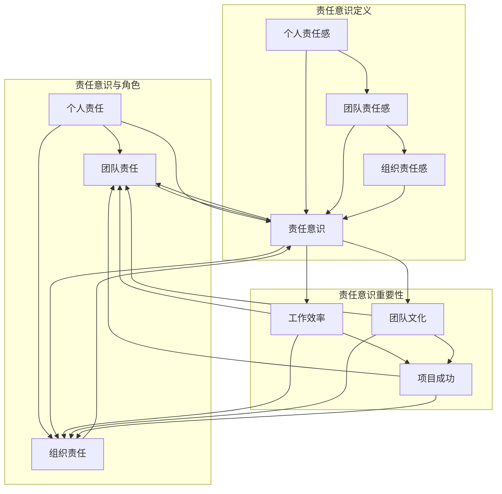

                 

### 摘要

本文旨在探讨如何在技术团队中培养和提升责任意识。责任意识是技术团队高效运作和成功实现项目目标的关键因素。本文首先定义了责任意识的内涵，并分析了其在技术团队中的重要性。接着，我们详细探讨了技术团队的角色与责任，以及如何通过个人、团队和组织三个层面来培养责任意识。随后，文章通过实际案例和问题分析，揭示了培养责任意识过程中可能遇到的问题，并提出了相应的改进措施。此外，文章还介绍了责任意识的衡量与评估方法，以及如何持续培养团队的责任意识。最后，本文以项目实战为例，提供了具体的开发环境搭建、源代码实现和案例分析，并总结了最佳实践和小结。通过本文的探讨，希望能为技术团队的管理者和成员提供有益的参考和启示。

### 文章标题

《培养技术团队的责任意识》

#### 关键词

责任意识、技术团队、培养方法、案例分析、评估与改进、持续发展

#### 摘要

本文从责任意识的定义和重要性出发，分析了技术团队的角色与责任，探讨了如何通过个人、团队和组织三个层面培养责任意识。通过实际案例与问题分析，揭示了培养过程中可能遇到的挑战，并提出了评估与改进措施。文章还介绍了责任意识的衡量与评估方法，以及如何通过持续培养提升团队责任意识。最后，以项目实战为例，详细展示了开发环境搭建、源代码实现和案例分析，总结了最佳实践和小结。

---

### 背景介绍

在当今快速发展的信息技术行业，技术团队的效率与质量直接关系到企业的竞争力。然而，技术团队中的成员往往面临着多种挑战，如工作压力、时间紧迫和技术复杂性等。在这样的环境中，责任意识的培养显得尤为重要。责任意识不仅关乎个人的职业素养，更关乎团队的协作效率和项目成功的可能性。

责任意识是指在承担工作和任务时，对工作结果负责的态度和行动。它包含对自身职责的认知、对团队目标的认同和对组织使命的承诺。在技术团队中，责任意识主要体现在以下几个方面：

1. **个人责任**：团队成员应对自己的任务和工作质量负责，确保按时交付高质量的工作成果。
2. **团队责任**：团队成员应积极参与团队协作，主动分享知识和经验，共同推动项目进展。
3. **组织责任**：技术团队作为企业的重要组成部分，应对组织的战略目标负责，为实现企业目标贡献自己的力量。

责任意识的培养对于技术团队具有重要意义。首先，它能够提高团队成员的工作积极性和责任感，减少错误和疏漏，从而提升工作质量。其次，责任意识有助于建立良好的团队文化，促进团队成员之间的信任和合作，增强团队的凝聚力和战斗力。最后，责任意识的培养能够为企业的长远发展奠定坚实的基础，提高企业的整体竞争力。

本文将从以下几个方面展开讨论：

1. 责任意识的定义与重要性
2. 技术团队的角色与责任
3. 责任意识的培养方法
4. 实际案例与问题分析
5. 责任意识的衡量与评估
6. 团队责任意识的持续培养

通过上述讨论，本文旨在为技术团队的管理者和成员提供一套系统化的责任意识培养方案，帮助他们在实践中提升责任意识，实现团队和组织的共同发展。

### 核心概念与联系

为了深入理解责任意识在技术团队中的重要性，我们需要先明确几个核心概念，并探讨它们之间的关系。以下是几个关键概念及其相互联系的架构图，使用Mermaid流程图表示：

#### 解释

1. **个人责任、团队责任和组织责任**：个人责任指的是每个团队成员对自己任务和工作的负责态度；团队责任则强调团队成员之间相互支持和合作，共同完成团队目标；组织责任则涉及到团队对整个企业的战略和使命的承诺。

2. **责任意识**：责任意识是个人责任、团队责任和组织责任的综合体现，它驱动团队成员为实现团队和组织目标而努力。

3. **工作效率和项目成功**：高效的工作流程和优质的工作成果是责任意识的重要体现。责任意识可以提升工作效率，从而增加项目成功的可能性。

4. **团队文化和组织文化**：团队文化是责任意识的重要基础，良好的团队文化能够促进责任意识的培养；组织文化则进一步影响了团队文化的形成和发展。

通过这个Mermaid流程图，我们可以清晰地看到责任意识在技术团队中的核心地位，以及它与个人、团队和组织责任之间的紧密联系。这不仅有助于理解责任意识的重要性，还为后续讨论责任意识的培养方法和实践提供了理论依据。

### 责任意识的培养方法

#### 培养个人责任意识

个人责任意识是技术团队责任意识培养的基础。以下是一些关键步骤和策略，帮助团队成员培养个人责任意识：

1. **明确职责和目标**：每个团队成员应明确自己的职责和目标，确保自己对工作内容有清晰的认识。可以通过制定详细的岗位职责说明书和项目任务清单来实现。

2. **强化自我管理**：自我管理是培养个人责任意识的重要环节。团队成员应学会合理安排时间，设定优先级，确保工作任务的有序推进。可以使用时间管理工具，如番茄工作法，提高工作效率。

3. **定期自我评估**：团队成员应定期对自己的工作表现进行评估，识别自身优势和不足，并制定改进计划。自我评估可以帮助团队成员不断反思和提升个人责任意识。

4. **培养责任感**：责任感是个人责任意识的内核。可以通过阅读相关书籍、参加培训课程、观看励志视频等方式，培养团队成员的责任感。

5. **奖励和激励**：通过设定奖励和激励机制，鼓励团队成员在完成任务时展现出更高的责任意识。奖励可以包括奖金、表彰、晋升机会等。

#### 培养团队责任意识

团队责任意识的培养需要从团队层面进行系统化的规划和实施。以下是一些有效的策略：

1. **团队文化建设**：建立积极向上的团队文化，促进团队成员之间的信任和合作。可以通过团队建设活动、团队会议等方式，增强团队凝聚力。

2. **明确团队目标**：确保团队目标与组织目标保持一致，让每个团队成员都明确自己在团队中的角色和责任。可以通过制定共同的目标和行动计划来实现。

3. **加强沟通与协作**：良好的沟通和协作是团队责任意识的重要保障。团队领导应积极组织团队会议、工作坊等，促进信息共享和协作。

4. **共同承担责任**：在团队中建立共同承担责任的机制，使每个成员都意识到团队的成功与失败是大家共同的责任。可以通过设立共同的目标和奖励机制来实现。

5. **培养团队合作精神**：通过团队合作项目、跨部门协作等方式，培养团队成员的团队合作精神。团队合作精神可以增强团队成员之间的信任和依赖，提高团队整体的工作效率。

#### 培养组织责任意识

组织责任意识的培养需要从组织层面进行系统的规划和实施。以下是一些关键步骤和策略：

1. **传递组织价值观**：组织领导应通过各种渠道传递组织的价值观和使命，使每个团队成员都能深刻理解并认同。可以通过内部培训、会议发言等方式实现。

2. **建立反馈机制**：建立有效的反馈机制，鼓励团队成员提出意见和建议，促进组织内部的持续改进。可以通过定期的员工满意度调查、意见箱等方式实现。

3. **制定规章制度**：制定明确的规章制度，规范团队成员的行为和责任。规章制度应明确责任分工、工作流程和奖惩措施，确保每个成员都清楚自己的职责和权利。

4. **激励机制**：建立激励机制，鼓励团队成员为实现组织目标而努力。激励机制可以包括绩效奖金、晋升机会、荣誉表彰等。

5. **加强跨部门协作**：组织责任意识的培养不仅涉及技术团队内部，还涉及与其他部门的协作。通过加强跨部门协作，提高团队的整体执行力。

通过以上方法，我们可以系统地培养技术团队的个人责任意识、团队责任意识和组织责任意识。这不仅有助于提升团队的工作效率和质量，也为组织的长远发展奠定了坚实的基础。

### 实际案例与问题分析

为了更好地理解责任意识的培养过程，我们通过两个实际案例来分析责任意识在技术团队中的应用，以及在实际操作中可能遇到的问题。

#### 成功案例：某科技公司的责任意识培养实践

**案例背景**：某科技公司是一家专注于软件开发和信息技术服务的企业，随着公司业务的不断扩展，技术团队的规模也日益扩大。为了提升团队的整体责任意识，公司决定实施一系列培养措施。

**具体措施**：
1. **明确职责和目标**：公司对每个团队成员的职责和工作目标进行了详细定义，并通过内部沟通渠道确保所有员工对自身角色有清晰的认识。
2. **团队建设活动**：定期组织团队建设活动，如团队拓展训练、团队聚餐等，增强团队成员之间的信任和合作精神。
3. **培训和指导**：公司为员工提供了丰富的培训机会，包括技术培训和管理培训，帮助员工提升技能和责任感。
4. **绩效考核**：引入了严格的绩效考核制度，对员工的绩效进行定期评估，并将责任意识作为重要考核指标之一。

**效果**：通过上述措施，技术团队的成员对工作职责有了更清晰的认识，责任感明显提升。团队协作效率提高，项目完成质量也得到了显著改善。

**经验总结**：
- 明确职责和目标是责任意识培养的基础。
- 团队建设和培训有助于提升团队成员的责任感和合作精神。
- 绩效考核机制可以激励团队成员更加积极地履行职责。

#### 存在的问题

**问题一：责任意识不足的常见表现**：
- 工作拖延：团队成员对工作任务缺乏紧迫感，导致任务拖延。
- 质量问题：责任心不强，导致工作质量不高，出现错误和漏洞。
- 协作不力：团队成员之间缺乏有效沟通，导致协作效率低下。

**问题二：团队内部责任分工不明确**：
- 职责重叠：不同成员对同一任务的职责分工不明确，导致工作重复或疏漏。
- 责任推卸：在项目遇到问题时，团队成员往往相互推卸责任，缺乏主动解决问题的意识。

**问题三：外部环境对责任意识的影响**：
- 压力过大：公司对项目交付的时间和质量要求过高，导致团队成员工作压力大，影响责任感。
- 组织文化：如果公司内部缺乏积极向上的文化氛围，团队成员的责任意识可能会受到负面影响。

**解决策略**：
1. **加强内部沟通**：通过定期的团队会议和沟通渠道，确保团队成员对工作职责和目标有清晰的认识，减少责任推卸的现象。
2. **明确责任分工**：制定详细的职责说明书和工作流程，确保每个成员的责任分工明确，避免职责重叠。
3. **建立反馈机制**：鼓励团队成员提出意见和建议，通过反馈机制发现和解决问题，提升团队整体的责任意识。
4. **优化外部环境**：通过改善工作条件、减轻工作压力，营造积极向上的组织文化，帮助团队成员更好地履行职责。

通过以上案例分析，我们可以看到，责任意识的培养在实际操作中具有重要意义。技术团队通过明确职责、加强培训和建立有效的考核机制，可以显著提升团队的责任意识和协作效率。同时，通过识别和解决团队内部和外部环境中的问题，可以进一步巩固和提升责任意识，实现团队和组织的共同发展。

### 责任意识的衡量与评估方法

衡量与评估责任意识是培养和提升技术团队责任意识的关键步骤。有效的评估方法可以帮助我们了解责任意识在团队中的实际水平，发现存在的问题，并为改进措施提供依据。以下介绍几种常用的责任意识衡量与评估方法：

#### 1. 个人责任指标

个人责任指标主要用于评估团队成员的个人责任履行情况。常见的指标包括：

- **任务完成率**：衡量团队成员按时完成任务的比率。任务完成率越高，说明个人责任意识越强。
- **质量评分**：对团队成员的工作质量进行评分，评估其工作成果是否符合预期标准。
- **自我评估**：团队成员定期进行自我评估，自我反思和总结工作表现，自我评估结果可以作为评估个人责任意识的重要参考。

#### 2. 团队责任指标

团队责任指标用于评估团队成员之间的协作和责任感。常见的指标包括：

- **团队协作评分**：通过团队内部成员的互评，评估团队成员之间的协作质量和效果。
- **项目成功率**：衡量团队完成项目的成功率，包括项目的按时交付率和质量达标率。
- **团队反馈**：定期收集团队成员对团队协作和责任意识的反馈，了解团队存在的问题和改进方向。

#### 3. 组织责任指标

组织责任指标用于评估技术团队对组织整体目标的贡献。常见的指标包括：

- **项目贡献度**：评估团队在实现组织目标过程中的贡献程度，包括项目创新、成本控制等方面。
- **客户满意度**：通过客户满意度调查，了解团队在客户服务工作中的表现，反映团队的责任意识。
- **员工满意度**：定期进行员工满意度调查，了解团队成员对组织文化的认同感和工作环境的满意度，间接反映团队的责任意识。

#### 4. 定量评估与定性评估

- **定量评估**：通过量化指标，如任务完成率、质量评分等，对责任意识进行客观评估。定量评估方法可以提供直观的数据支持，帮助识别团队中的问题。
- **定性评估**：通过访谈、观察和反馈等方式，对责任意识进行深入分析。定性评估方法可以提供丰富的背景信息和详细的原因分析，帮助团队制定有针对性的改进措施。

#### 评估方法的综合运用

为了全面衡量技术团队的责任意识，应综合运用定量评估和定性评估方法。定量评估可以提供客观的数据支持，而定性评估可以提供详细的背景信息。通过两者的结合，可以更全面地了解团队的责任意识水平，为改进措施提供有力的依据。

#### 评估流程

1. **制定评估指标**：根据团队的特点和需求，制定相应的评估指标。
2. **数据收集**：通过问卷调查、访谈、观察等方式，收集团队成员的相关数据。
3. **数据分析**：对收集到的数据进行统计分析，识别团队中的优势和不足。
4. **反馈与改进**：将评估结果反馈给团队成员，讨论存在的问题，制定改进措施，并跟踪改进效果。

通过上述评估方法，技术团队可以系统性地衡量和提升责任意识，为团队的高效运作和组织目标的实现奠定坚实基础。

### 责任意识的改进措施

基于前述评估结果，我们可以识别出技术团队在责任意识方面存在的不足，并制定相应的改进措施，以提升团队的整体责任水平。以下是一些具体的改进措施：

#### 1. 基于评估结果的改进方向

- **任务完成率低**：通过进一步分析任务完成率低的原因，可能发现是由于任务分配不合理、时间管理不当或团队成员对任务的理解不清晰。因此，改进方向是优化任务分配机制，加强时间管理培训，提高团队成员对任务的认知。
- **工作质量不高**：如果评估结果显示工作质量不高，应关注团队成员的技能水平和责任心。改进措施包括提供专业培训，增强质量控制流程，并通过绩效考核激励高质量的工作表现。
- **团队协作问题**：如果团队协作评分较低，需分析协作过程中的沟通障碍、职责不明确等问题。改进措施包括加强团队沟通，明确责任分工，并通过团队建设活动提高团队凝聚力。

#### 2. 改进策略

- **优化任务分配**：制定明确的任务分配机制，确保每个团队成员的任务与其能力和兴趣相匹配。通过任务分配会议，让团队成员共同参与任务的决定，增强其责任感和参与度。
- **加强培训**：定期组织专业技能培训和责任意识培训，提升团队成员的技能水平和责任感。培训内容可以包括时间管理、沟通技巧、团队合作等。
- **完善绩效考核**：制定科学合理的绩效考核制度，将责任意识作为重要考核指标。通过绩效考核，激励团队成员提高工作质量，增强责任感。
- **强化团队沟通**：建立有效的沟通渠道，如定期团队会议、即时通讯工具等，确保团队成员之间的信息畅通。通过开放式的沟通环境，鼓励团队成员分享意见和反馈，提高协作效率。
- **提供反馈机制**：建立反馈机制，鼓励团队成员提出改进意见和建议。管理层应积极倾听员工的意见，并根据反馈调整管理策略，提高团队的满意度和责任感。

#### 3. 持续改进的机制

- **定期评估**：定期进行责任意识的评估，了解团队在责任意识方面的进展和存在的问题。通过定期的评估，及时发现并解决问题，确保责任意识的持续提升。
- **反馈与改进循环**：建立反馈与改进循环机制，将评估结果和改进措施纳入日常管理工作中。通过持续的反馈和改进，逐步优化团队的管理模式和运作方式。
- **员工参与**：鼓励员工参与改进过程，提高其责任意识和参与感。可以通过员工建议制度、团队讨论等方式，让员工在改进过程中发挥积极作用。

通过以上改进措施和持续改进的机制，技术团队可以逐步提升责任意识，实现团队和个人能力的全面提升，为项目的成功和企业的长远发展奠定坚实基础。

### 团队责任意识的持续培养

要确保技术团队的长期发展，责任意识的持续培养至关重要。这不仅涉及到团队成员的日常行为，还要求领导者的积极参与和组织的支持。以下方法有助于在技术团队中建立和维持责任意识：

#### 领导者的角色

1. **示范引领**：领导者应以身作则，通过自己的行为和态度，树立责任意识的榜样。领导者的行为直接影响团队成员，只有领导者展现出高度的责任感，才能带动团队整体的责任意识。
   
2. **明确期望**：领导者应明确团队的目标和期望，确保每个团队成员都清楚自己的职责和责任。通过定期的沟通和指导，领导者可以帮助团队成员理解责任意识的重要性。

3. **提供资源**：领导者应确保团队拥有完成任务的必要资源，包括技术支持、培训机会和合适的工具。当团队成员感受到领导者的支持和信任时，他们更有可能承担起自己的责任。

4. **激励与反馈**：领导者应通过正面的激励和及时的反馈，鼓励团队成员发挥他们的潜力。奖励和认可可以有效提升团队成员的责任感和工作积极性。

#### 员工的自我提升

1. **自我反思**：员工应定期进行自我反思，识别自己在责任意识方面的优势和不足，并制定改进计划。通过自我反思，员工可以不断提升自己的责任意识和职业素养。

2. **持续学习**：技术行业不断进步，员工应不断学习新的知识和技能，以适应不断变化的工作需求。通过参加培训、阅读专业书籍和参与行业交流，员工可以增强自己的专业能力和责任感。

3. **积极参与**：员工应积极参与团队决策和项目实施，主动承担责任。通过参与，员工不仅能够提升自己的责任意识，还能增强团队凝聚力和协作效率。

#### 团队合作的强化

1. **明确分工**：确保每个团队成员都有明确的职责和任务，避免职责重叠和责任推卸。通过明确的分工，可以提高团队的工作效率和质量。

2. **促进沟通**：建立有效的沟通机制，鼓励团队成员之间开放、坦诚地交流。良好的沟通可以减少误解和冲突，增强团队协作。

3. **建立信任**：通过团队合作项目，建立团队成员之间的信任。信任是团队合作的基础，有助于团队在面对挑战时共同承担责任。

4. **跨部门协作**：鼓励跨部门协作，促进不同部门之间的沟通和合作。跨部门协作不仅有助于提升项目的整体质量，还能增强团队成员的责任意识。

通过领导者的示范引领、员工自我提升和团队合作强化，技术团队可以持续培养和提升责任意识，实现团队和组织的共同发展。

### 附录

#### 参考文献

1. Taylor, F. W. (1911). *The Principles of Scientific Management*. New York: Harper & Brothers.
2. Deming, W. E. (1982). *Out of the Crisis*. Cambridge, MA: MIT Press.
3. Drucker, P. F. (1999). *The Effective Executive*. New York: HarperBusiness.
4. Lencioni, P. (2002). *The Five Dysfunctions of a Team*. San Francisco: Jossey-Bass.
5. Kotter, J. P. (1996). *Leading Change*. Boston: Harvard Business Review Press.
6. Sinek, S. (2009). *Start with Why: How Great Leaders Inspire Everyone to Take Action*. New York: Penguin.

#### 附录

**责任意识相关流程图**

通过以上参考文献和流程图，我们不仅能够更深入地理解责任意识的概念和重要性，还能为技术团队的持续发展提供理论支持和实践指导。

### 总结与最佳实践

通过本文的探讨，我们可以看到责任意识在技术团队中的重要性，以及如何通过系统化的方法培养和提升责任意识。以下是总结和最佳实践：

1. **明确职责和目标**：确保每个团队成员都清楚自己的职责和工作目标，是培养责任意识的基础。
2. **加强培训和沟通**：定期组织培训和沟通活动，提升团队成员的专业能力和责任感。
3. **建立激励机制**：通过激励机制鼓励团队成员承担更多的责任，如绩效奖金、晋升机会等。
4. **示范引领**：领导者应以身作则，树立责任意识的榜样，带动团队整体的责任水平。
5. **反馈与改进**：建立有效的反馈机制，鼓励团队成员提出改进意见和建议，持续优化团队管理。

最佳实践还包括：

- **建立明确的分工和协作机制**：确保团队成员的职责清晰，减少责任推卸现象。
- **促进跨部门协作**：通过跨部门项目，增强不同团队之间的合作和信任。
- **定期评估和调整**：定期评估团队的责任意识水平，根据评估结果调整培养策略。

通过以上实践，技术团队可以不断提升责任意识，实现高效协作和长远发展。

### 注意事项与拓展阅读

在培养技术团队的责任意识过程中，需要注意以下几点：

1. **尊重个体差异**：团队成员的责任意识水平存在差异，管理者应根据个人特点制定个性化培养计划。
2. **持续监督与反馈**：责任意识的培养是一个持续的过程，需要定期监督和反馈，确保改进措施得到落实。
3. **文化氛围建设**：积极向上的组织文化有助于提升团队的责任意识，管理者应注重文化氛围的营造。
4. **平衡工作与生活**：避免工作压力过大，合理安排工作与休息时间，保障团队成员的身心健康。

拓展阅读：

- “敏捷开发中的团队责任意识培养”  
- “企业员工责任意识提升策略研究”  
- “项目管理中的责任意识培养与实践”

通过以上拓展阅读，可以进一步深入了解技术团队责任意识的培养方法与实践。

