                 

### 培养技术团队的责任文化

关键词：责任文化、技术团队、领导力、团队协作、制度建设、实践案例分析

摘要：本文旨在探讨如何培养技术团队的责任文化，通过理解责任文化的定义与重要性，建立责任文化的核心要素，到实践责任文化的具体方法，为技术团队提供一套系统的责任文化培养方案。文章还将通过成功和失败案例的分析，为读者提供实际操作中的经验与启示。

## 第一部分：理解责任文化

### 第1章：责任文化的定义与重要性

责任文化是一种价值观，强调个人和团队在实现组织目标过程中所承担的责任。它不仅仅是对工作任务的完成，更是一种对团队和组织使命的深刻认同。

### 1.1 责任文化的概念

责任文化是一种价值观，强调个人和团队在实现组织目标过程中所承担的责任。它不仅仅是对工作任务的完成，更是一种对团队和组织使命的深刻认同。

**责任文化的概念** 可以用以下 Mermaid 流程图来表示：

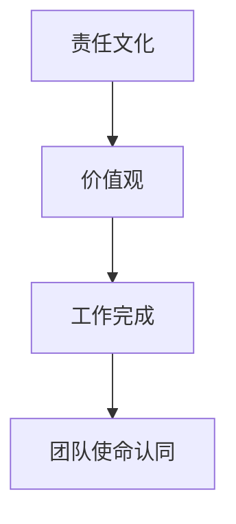

### 1.2 责任文化与组织绩效的关系

责任文化对组织绩效有着深远的影响。研究表明，具有责任文化的组织往往能够提高工作效率、增强创新能力，并提升员工的满意度。

**责任文化与组织绩效的关系** 可以用以下 Mermaid 流程图来表示：

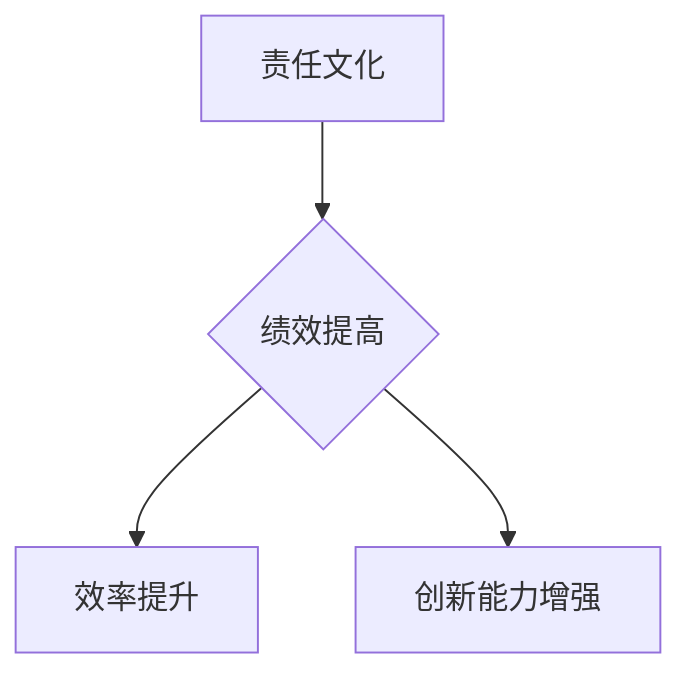

### 1.3 责任文化的理论基础

责任文化的理论基础主要包括马斯洛的需求层次理论和弗雷德里克·赫兹伯格的双因素理论。这些理论为理解责任文化的形成和影响提供了重要的视角。

**马斯洛的需求层次理论**：

$$
\text{需求层次理论:} \quad \text{满足基本需求} \rightarrow \text{寻求安全} \rightarrow \text{寻求社交和归属感} \rightarrow \text{实现尊重} \rightarrow \text{实现自我实现}
$$

**弗雷德里克·赫兹伯格的双因素理论**：

$$
\text{满意度} = \frac{\text{激励因素}}{\text{保健因素}}
$$

## 第二部分：建立责任文化

### 第3章：领导力与责任文化

领导力在建立责任文化中扮演着至关重要的角色。领导者不仅需要明确责任，还需要通过适当的领导风格和策略来培养责任文化。

### 3.1 领导者在建立责任文化中的作用

领导者是责任文化的倡导者和践行者。他们需要通过言行一致来树立榜样，引导团队成员树立责任感。

**领导者在建立责任文化中的作用** 可以用以下 Mermaid 流程图来表示：

```mermaid
graph TD
A[领导者] --> B[责任文化倡导者}
B --> C{责任文化践行者}
C --> D[团队榜样树立}
```

### 3.2 领导风格与责任文化

领导风格对责任文化的形成有着重要影响。不同的领导风格会对团队成员的责任感产生不同的影响。

**领导风格与责任文化** 可以用以下 Mermaid 流程图来表示：

```mermaid
graph TD
A[领导风格] --> B{权威型}
B --> C[责任意识培养]
A --> D[民主型}
D --> C
A --> E[支持型}
E --> C
```

### 3.3 责任领导力的培养

责任领导力是一种关键的管理能力，它要求领导者具备强烈的责任感、决策能力和沟通能力。培养责任领导力需要从多个方面入手。

**责任领导力的培养** 可以用以下 Mermaid 流程图来表示：

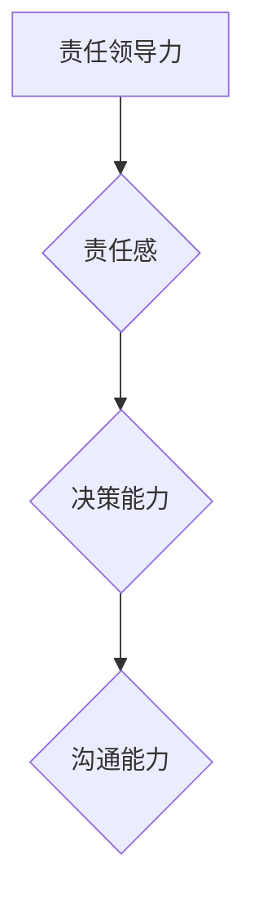

## 第三部分：实践责任文化

### 第4章：团队协作与责任文化

团队协作是责任文化的重要组成部分。通过有效的沟通和协作，可以增强团队的责任感，提高工作效率。

### 4.1 跨部门协作与责任

跨部门协作是现代企业中常见的现象。为了确保跨部门协作的顺利进行，需要明确各方的责任，并建立有效的沟通机制。

**跨部门协作与责任** 可以用以下 Mermaid 流程图来表示：

```mermaid
graph TD
A[跨部门协作] --> B[明确责任}
B --> C{沟通机制}
```

### 4.2 沟通与责任文化

沟通是团队协作的基石。有效的沟通能够减少误解，增强团队成员的责任感。

**沟通与责任文化** 可以用以下 Mermaid 流程图来表示：

```mermaid
graph TD
A[沟通] --> B{减少误解}
B --> C[增强责任感}
```

### 4.3 建立高效的团队文化

建立高效的团队文化需要从多个方面入手，包括明确责任、促进沟通和培养团队合作精神。

**建立高效的团队文化** 可以用以下 Mermaid 流程图来表示：

```mermaid
graph TD
A[建立高效团队文化] --> B{明确责任}
B --> C[促进沟通]
C --> D[培养团队合作精神}
```

## 第四部分：案例分析

### 第5章：案例分析

通过分析成功和失败的案例，可以更好地理解如何在实际操作中培养责任文化。

### 5.1 成功案例分享

成功案例可以为我们提供宝贵的经验。通过分析这些案例，我们可以发现成功的共同点。

**成功案例分享** 可以用以下 Mermaid 流程图来表示：

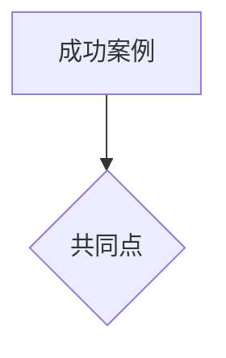

### 5.2 失败案例分析

失败案例同样重要，它可以帮助我们避免重复错误。通过分析失败的原因，我们可以找到改进的方法。

**失败案例分析** 可以用以下 Mermaid 流程图来表示：

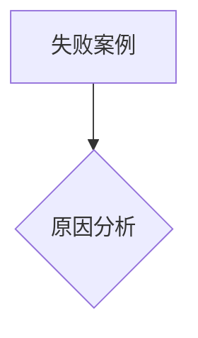

### 5.3 启示与借鉴

从成功和失败的案例中，我们可以得出许多有价值的启示。这些启示可以帮助我们在实际操作中更好地培养责任文化。

**启示与借鉴** 可以用以下 Mermaid 流程图来表示：

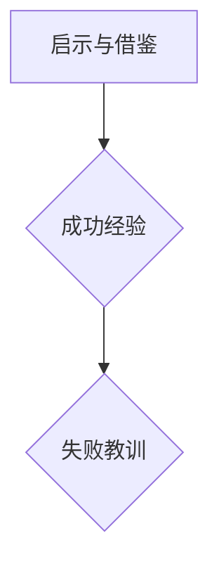

## 第五部分：持续发展

### 第6章：责任文化的持续发展

责任文化不是一蹴而就的，它需要持续的努力和改进。

### 6.1 文化变革的策略

文化变革需要明确的策略和步骤。通过制定详细的计划，可以确保责任文化的持续发展。

**文化变革的策略** 可以用以下 Mermaid 流程图来表示：

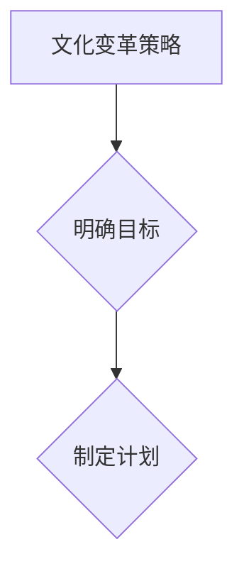

### 6.2 面对挑战与调整

在培养责任文化的过程中，团队可能会面临各种挑战。面对这些挑战，团队需要灵活调整策略，确保责任文化的持续推进。

**面对挑战与调整** 可以用以下 Mermaid 流程图来表示：

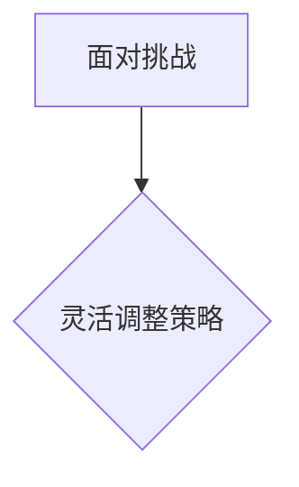

### 6.3 责任文化的未来趋势

随着技术的发展和组织形式的多样化，责任文化也将不断演变。了解责任文化的未来趋势，可以帮助我们更好地适应变化。

**责任文化的未来趋势** 可以用以下 Mermaid 流程图来表示：

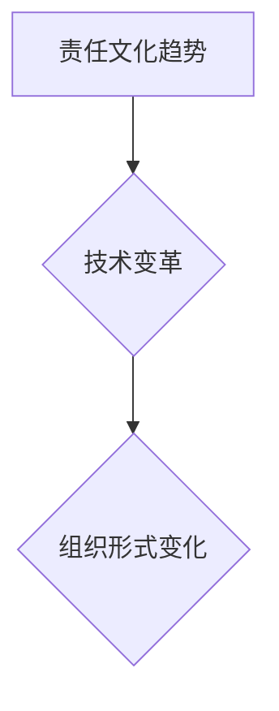

## 附录

### 第7章：工具与方法

在本章中，我们将介绍一些用于评估和培养责任文化的工具和方法。

### 7.1 责任文化评估工具

责任文化评估工具可以帮助我们了解团队的责任文化现状，并提供改进的方向。

**责任文化评估工具** 可以用以下 Mermaid 流程图来表示：

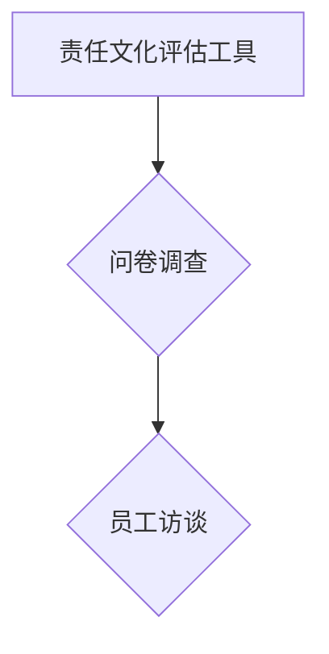

### 7.2 常用方法论介绍

在本节中，我们将介绍一些常用的方法论，这些方法论可以帮助团队在实践中更好地培养责任文化。

**常用方法论介绍** 可以用以下 Mermaid 流程图来表示：


### 7.3 实践指南与案例分析

在本章的最后，我们将提供一些实践指南和案例分析，以帮助读者更好地理解和应用责任文化的培养方法。

**实践指南与案例分析** 可以用以下 Mermaid 流程图来表示：

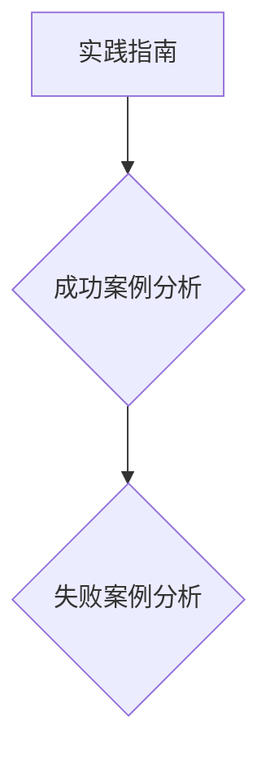

## 作者信息

作者：AI天才研究院/AI Genius Institute & 禅与计算机程序设计艺术 /Zen And The Art of Computer Programming

## 文章总结

本文系统地探讨了如何培养技术团队的责任文化，从定义与重要性、建立到实践，再到案例分析，为技术团队提供了全面的培养方案。通过理解和应用责任文化的核心要素，团队可以更好地实现目标，提高绩效。本文不仅提供了理论指导，还结合了实际案例，为读者提供了实用的操作指南。

## 注意事项

1. 责任文化培养需要持续的努力和关注。
2. 领导者是责任文化的关键推动者，需要以身作则。
3. 沟通和协作是责任文化的重要组成部分。
4. 案例分析可以帮助我们更好地理解责任文化的实践。

## 拓展阅读

1. 《领导力心理学：理论与实践》
2. 《团队协作的力量：如何打造高效的团队》
3. 《企业文化与团队绩效：关系与影响》

## 结束语

培养技术团队的责任文化是一项长期而系统的工程。通过本文的探讨，我们希望能够为技术团队提供有益的启示和实践指导。让我们共同努力，打造一支有责任、有凝聚力、有创新精神的技术团队，为组织的成功贡献力量。

