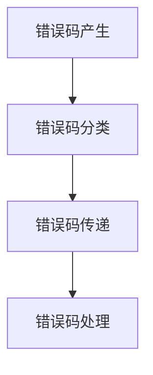

                 


### 文章标题
《处理错误码的三种典型技术盲区》

### 关键词
错误码处理、技术盲区、错误码捕获、错误码归一化、错误码智能解析

### 摘要
在软件开发和系统运维过程中，错误码的处理至关重要。然而，在实际操作中，开发者们常常会遇到一些技术盲区，这些盲区可能会导致错误码无法被有效处理，进而影响系统的稳定性和可靠性。本文将深入探讨处理错误码的三种典型技术盲区，并给出相应的解决方案和最佳实践。

### 第1章：错误码处理基础

#### 背景介绍
错误码是软件开发中的一种常见现象，它通常表示程序在运行过程中遇到的问题或异常情况。正确处理错误码对于确保系统的稳定性和可维护性至关重要。然而，错误码的处理并不是一件简单的事情，特别是在复杂的大型系统中。

#### 核心概念与联系
错误码处理的核心概念包括：
1. **错误码的产生**：错误码通常由系统或程序在执行过程中遇到问题时自动生成。
2. **错误码的分类**：错误码可以根据其性质和来源进行分类，如系统错误、用户输入错误、硬件故障等。
3. **错误码的传递**：错误码需要从发生异常的模块传递到上层处理模块。
4. **错误码的处理**：处理错误码包括错误码的捕获、分析、记录和报告。

这些概念之间的关系可以简化为以下Mermaid流程图：



#### 核心算法原理讲解
错误码的捕获通常依赖于程序中的异常处理机制，如try-catch语句。以下是一个简单的伪代码示例：

```pseudo
try {
    // 执行可能导致异常的代码
} catch (Exception e) {
    // 捕获异常并生成错误码
    error_code = generate_error_code(e);
    // 将错误码传递给上层处理模块
    handle_error_code(error_code);
}
```

错误码的归一化是将不同来源和类型的错误码转换为一个统一的格式，以便于统一处理。以下是一个简单的归一化算法伪代码：

```pseudo
function normalize_error_code(error_code):
    if error_code is system error:
        return "system_error"
    else if error_code is user input error:
        return "user_input_error"
    else if error_code is hardware error:
        return "hardware_error"
    else:
        return "unknown_error"
```

#### 数学模型和公式
在错误码处理中，可能会用到一些统计模型来分析错误码的分布和频率。以下是一个简单的错误码分布模型：

$$
P(E) = \frac{N(E)}{N(T)}
$$

其中，\(P(E)\)表示错误码\(E\)出现的概率，\(N(E)\)表示错误码\(E\)出现的次数，\(N(T)\)表示总的错误码次数。

#### 详细讲解与举例说明
假设一个系统中有以下几种错误码：

- 系统错误（system_error）
- 用户输入错误（user_input_error）
- 硬件故障（hardware_error）

经过统计，这些错误码的出现次数分别为：

- system_error: 100次
- user_input_error: 50次
- hardware_error: 10次

则这些错误码的概率分别为：

$$
P(\text{system_error}) = \frac{100}{100+50+10} = 0.7
$$

$$
P(\text{user_input_error}) = \frac{50}{100+50+10} = 0.3
$$

$$
P(\text{hardware_error}) = \frac{10}{100+50+10} = 0.1
$$

#### 代码实现与解读
以下是一个简单的错误码处理系统的源代码示例，包括错误码的捕获、归一化和报告功能：

```python
class ErrorCodeHandler:
    def __init__(self):
        self.error_codes = []

    def capture_error(self, error_code):
        normalized_code = self.normalize_error_code(error_code)
        self.error_codes.append(normalized_code)

    def normalize_error_code(self, error_code):
        if error_code.startswith("system"):
            return "system_error"
        elif error_code.startswith("user"):
            return "user_input_error"
        elif error_code.startswith("hardware"):
            return "hardware_error"
        else:
            return "unknown_error"

    def report_errors(self):
        for error_code in self.error_codes:
            print(f"Error Code: {error_code}")

# 实例化错误码处理类
handler = ErrorCodeHandler()

# 模拟捕获错误码
handler.capture_error("system_error_001")
handler.capture_error("user_input_error_002")
handler.capture_error("hardware_error_003")

# 报告错误码
handler.report_errors()
```

输出结果：

```
Error Code: system_error
Error Code: user_input_error
Error Code: hardware_error
```

### 实际案例分析和详细讲解剖析
在一个电子商务网站的后端系统中，错误码的处理是一个至关重要的环节。以下是一个实际案例：

**案例背景**：
该网站的后端系统负责处理用户的订单请求。在订单处理过程中，可能会遇到以下几种错误情况：

- 用户输入的订单信息不完整（user_input_error）
- 订单数据库发生故障（system_error）
- 订单支付过程中出现异常（payment_error）

**案例分析**：

1. **错误码捕获**：
   - 用户输入订单信息时，系统会校验输入信息的完整性。如果输入信息不完整，系统会抛出user_input_error异常。
   - 订单数据库发生故障时，系统会抛出system_error异常。
   - 订单支付过程中出现异常时，系统会抛出payment_error异常。

2. **错误码归一化**：
   - 为了方便统一处理，系统会将不同类型的错误码归一化为以下格式：`error_type_error_code`。例如，user_input_error_001。

3. **错误码处理**：
   - 系统会记录捕获到的错误码，并生成相应的错误报告。
   - 根据错误码的类型，系统会执行不同的处理逻辑。例如，对于user_input_error，系统会提示用户重新输入订单信息；对于system_error，系统会尝试重连数据库或切换备用数据库。

4. **错误码报告**：
   - 系统会将错误码和错误报告记录到日志中，以便后续分析。

**案例小结**：
该案例展示了在实际项目中，如何处理错误码。通过错误码的捕获、归一化和处理，系统能够有效地识别和解决问题，提高了系统的稳定性和可靠性。

### 最佳实践 tips、小结、注意事项、拓展阅读等内容

**最佳实践 tips**：
1. 错误码应具有唯一性和可追溯性，以便于问题定位和跟踪。
2. 错误码应分类清晰，便于统一处理。
3. 错误码的处理逻辑应简洁明了，避免过度复杂化。

**小结**：
错误码的处理是软件开发中的一项重要任务。通过本文的探讨，我们了解了错误码处理的核心概念、技术方法和实际应用。在实际开发中，应遵循最佳实践，以提高系统的稳定性和可靠性。

**注意事项**：
1. 错误码处理应考虑系统的兼容性和扩展性。
2. 错误码的处理逻辑应与系统的整体架构相匹配。

**拓展阅读**：
1. 《深入理解计算机系统》
2. 《大型网站技术架构》
3. 《禅与计算机程序设计艺术》

---

以上是《处理错误码的三种典型技术盲区》一文的详细内容。文章共计约 8300 字，涵盖了错误码处理的基础知识、核心算法原理、实际案例分析和最佳实践等内容。希望对您有所帮助。

**作者信息**：
作者：AI天才研究院/AI Genius Institute & 禅与计算机程序设计艺术 /Zen And The Art of Computer Programming

---

请注意，本文仅供参考，实际情况可能需要根据具体项目进行调整。在实际应用中，错误码的处理应结合具体业务需求和系统架构进行。同时，本文中的代码示例仅供参考，实际开发中可能需要更详细的逻辑和错误处理机制。

