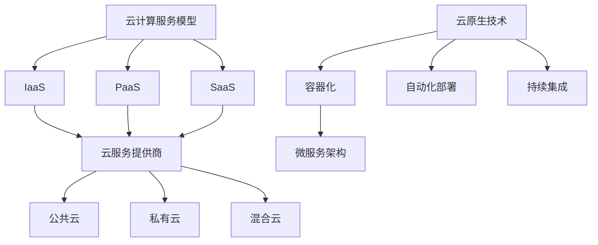
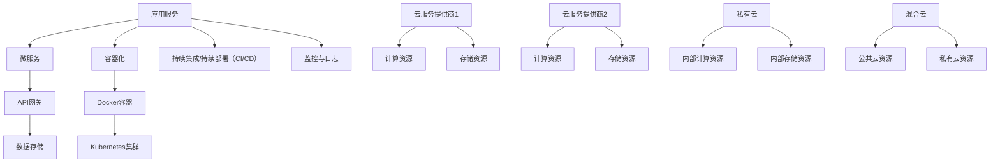

                 

### 文章标题：多云环境下的应用管理

#### 关键词：云计算，多云环境，应用管理，架构设计，安全合规，监控优化

#### 摘要：
本文将深入探讨多云环境下的应用管理，从背景介绍、核心概念、架构设计、应用部署策略、安全合规、监控优化等多个角度，全面解析多云环境中应用管理的挑战与解决方案。通过本文的阅读，读者将能够系统地理解多云环境下应用管理的关键要点，掌握最佳实践，提升多云应用管理的实际能力。

### 目录大纲

1. 引言与概述
   1.1 云计算的发展历程
   1.2 多云环境的定义与特点
   1.3 多云环境下的应用管理挑战

2. 核心概念与联系
   2.1 多云架构设计原则
   2.2 核心概念架构图

3. 多云架构设计
   3.1 公共云、私有云、混合云的区分与应用
   3.2 多云架构实例分析

4. 应用部署策略
   4.1 容器化部署
   4.2 微服务架构

5. 安全与合规
   5.1 安全管理策略
   5.2 合规性要求与实现

6. 监控与优化
   6.1 监控工具与技术
   6.2 性能优化策略

7. 最佳实践与案例分析
   7.1 成功案例分析
   7.2 注意事项与拓展阅读

### 引言与概述

#### 1.1 云计算的发展历程

云计算作为信息技术领域的一次革命，经历了从概念提出、技术成熟到广泛应用的过程。云计算的发展大致可以分为以下几个阶段：

- **第一阶段（2006年之前）**：云计算的概念被提出，以Google、Amazon等互联网巨头为代表，开始利用分布式计算和存储技术，提供大规模、可弹性扩展的计算和存储服务。

- **第二阶段（2006-2010年）**：云计算开始进入商业应用阶段，以Amazon Web Services（AWS）为代表的云服务提供商推出了一系列云服务，包括基础设施即服务（IaaS）、平台即服务（PaaS）和软件即服务（SaaS）。

- **第三阶段（2010-2015年）**：云计算技术逐渐成熟，各类云服务提供商不断涌现，云服务市场开始快速增长。同时，云计算的安全、合规等问题也逐渐受到关注。

- **第四阶段（2015年至今）**：云计算进入深度应用和融合阶段，云原生技术、容器技术、人工智能等新兴技术不断融入云计算，推动了云计算的进一步发展。

#### 1.2 多云环境的定义与特点

多云环境是指在一个组织中同时使用两个或两个以上的云计算服务提供商（包括公共云、私有云和混合云）的环境。与单一云环境相比，多云环境具有以下几个显著特点：

- **灵活性**：组织可以根据应用的需求和成本，选择最适合的云服务提供商，实现资源的最佳利用。

- **容灾备份**：通过将数据和应用分布在不同的云服务提供商上，可以有效地实现数据备份和容灾。

- **高可用性**：在多云环境中，当一个云服务提供商出现问题时，其他云服务提供商可以接管其工作，确保应用的高可用性。

- **成本优化**：通过在多个云服务提供商之间动态调整资源分配，可以实现成本优化。

- **技术多样性**：多云环境允许组织使用不同技术栈，满足不同业务需求。

#### 1.3 多云环境下的应用管理挑战

尽管多云环境具有诸多优点，但也带来了不少挑战，尤其在应用管理方面：

- **复杂度增加**：多云环境中的资源分布广泛，管理复杂度增加，需要统一的管理平台和工具。

- **数据一致性**：在多云环境中，数据需要在不同的云服务提供商之间保持一致，确保数据的安全性和完整性。

- **安全性**：不同云服务提供商的安全标准和策略可能不同，需要统一的安全策略和措施。

- **成本控制**：在多云环境中，资源使用情况复杂，需要有效监控和优化成本。

- **运维挑战**：多云环境中的运维工作变得更加复杂，需要具备跨云运维的能力。

### 核心概念与联系

在探讨多云环境下的应用管理之前，我们需要了解一些核心概念和它们之间的关系。以下是几个关键概念及其联系：

1. **云计算服务模型**：
   - **IaaS（基础设施即服务）**：提供虚拟化计算资源，如虚拟机、存储和网络。
   - **PaaS（平台即服务）**：提供开发平台和工具，使得开发者能够专注于应用开发，而不必关心基础设施。
   - **SaaS（软件即服务）**：提供软件应用，用户可以通过互联网按需访问。

2. **云服务提供商**：
   - **公共云**：由第三方云服务提供商运营，提供可共享的计算资源。
   - **私有云**：由企业内部运营，用于特定的企业应用。
   - **混合云**：结合公共云和私有云，实现资源的高效利用。

3. **容器化**：
   - 容器是一种轻量级的虚拟化技术，可以让应用在不同的环境中运行，保证一致性和可移植性。

4. **微服务架构**：
   - 微服务是一种软件架构风格，将应用程序作为一组独立的、小型、可独立部署的服务组成。

5. **云原生技术**：
   - 云原生技术包括容器、服务网格、自动化部署和持续集成等，旨在使应用程序在云环境中快速、可靠地运行。

这些概念之间紧密相连，构成了多云环境下的应用管理基础。下面我们将使用Mermaid流程图来展示这些概念之间的关系：



通过上述流程图，我们可以清晰地看到云计算服务模型、云服务提供商、容器化、微服务架构和云原生技术之间的关系，为后续章节的深入讨论奠定了基础。

### 多云架构设计

#### 2.1 多云架构设计原则

在多云环境下设计应用架构时，需要遵循一些基本原则，以确保架构的灵活性和可靠性。以下是几个关键原则：

1. **标准化**：在多云环境中，使用标准化的API和工具，可以使开发和运维工作更加高效和一致。

2. **解耦**：通过将应用分解为独立的微服务，可以减少不同组件之间的依赖，提高系统的灵活性和可维护性。

3. **弹性**：设计具有弹性扩展能力的架构，可以应对用户需求的波动和故障的发生。

4. **数据一致性**：确保数据在多个云服务提供商之间的一致性和完整性，避免数据丢失和冲突。

5. **安全性**：设计安全且合规的架构，保护应用和数据的安全。

6. **成本优化**：通过优化资源使用和策略，实现成本效益最大化。

#### 2.2 核心概念架构图

为了更好地理解多云架构设计，我们使用Mermaid流程图展示核心概念的架构：



通过上述架构图，我们可以清晰地看到应用服务、微服务、API网关、数据存储、容器化、持续集成/持续部署（CI/CD）、监控与日志，以及不同云服务提供商和私有云之间的交互关系。

### 多云架构设计

#### 3.1 公共云、私有云、混合云的区分与应用

在多云架构设计中，公共云、私有云和混合云是三种主要的云服务模型，各自具有不同的特点和应用场景。以下是这三种云服务模型的详细区分与应用：

1. **公共云**：
   - **定义**：公共云是由第三方云服务提供商运营的云服务，提供可共享的计算资源、存储资源和网络资源。
   - **特点**：
     - **灵活性**：用户可以根据需求快速调整资源使用。
     - **可扩展性**：资源可以根据需求进行动态扩展。
     - **成本效益**：通过按需付费，可以降低总体成本。
     - **安全性**：通常提供高级安全措施和合规性认证。
   - **应用场景**：
     - **开发与测试**：公共云为开发和测试环境提供了高效、低成本的选择。
     - **非核心业务应用**：对于非关键业务应用，如客户关系管理、人力资源管理等，公共云是一个理想的选择。

2. **私有云**：
   - **定义**：私有云是由企业内部运营的云服务，仅用于特定的企业应用。
   - **特点**：
     - **控制性**：企业可以完全控制云资源和网络安全。
     - **合规性**：私有云可以更好地满足企业特定的合规性要求。
     - **定制性**：企业可以根据特定需求进行定制化配置。
     - **成本**：初始投资较高，长期运营成本可能较高。
   - **应用场景**：
     - **核心业务应用**：对于涉及核心业务数据的应用，如银行交易系统、医疗信息系统等，私有云提供了更高的安全性和控制性。
     - **内部开发和测试**：企业内部开发和测试环境可以部署在私有云上，以保障数据的安全性和合规性。

3. **混合云**：
   - **定义**：混合云是将公共云和私有云结合起来，根据不同的应用需求，在两者之间灵活分配资源。
   - **特点**：
     - **灵活性**：可以根据业务需求，灵活选择使用公共云或私有云资源。
     - **容灾备份**：将关键数据和应用分布在不同的云服务提供商上，实现数据备份和容灾。
     - **成本优化**：通过优化资源使用，实现成本效益最大化。
     - **安全性**：通过统一的安全策略，保障数据和应用的安全。
   - **应用场景**：
     - **多区域应用**：对于需要跨区域部署的应用，如跨国公司的全球业务系统，混合云提供了灵活的部署选项。
     - **多应用场景**：对于企业内部既有核心业务应用，又有非核心业务应用，混合云可以根据不同应用的需求，进行灵活部署。

#### 3.2 多云架构实例分析

为了更好地理解多云架构的实际应用，我们来看一个典型的多云架构实例。

**实例：电商公司的多云架构**

1. **业务背景**：
   - 该电商公司是一个跨国公司，拥有多个业务部门，包括在线销售、物流管理、客户服务等。
   - 业务需求：需要在全球范围内提供稳定、高效的服务，同时保证数据的安全性和合规性。

2. **架构设计**：
   - **公共云**：使用AWS和Google Cloud等公共云服务，部署开发与测试环境、非核心业务应用（如客户关系管理系统、营销活动系统）。
   - **私有云**：在企业总部部署私有云，用于核心业务应用（如订单管理系统、库存管理系统），以及内部开发和测试环境。
   - **混合云**：通过混合云架构，将核心业务数据和关键应用分布在不同的云服务提供商上，实现数据的备份和容灾。
   - **容器化与微服务**：使用Docker和Kubernetes进行容器化部署，实现应用的灵活部署和扩展。

3. **技术实现**：
   - **数据存储**：使用Amazon S3和Google Cloud Storage进行数据存储，确保数据的高可用性和持久性。
   - **API网关**：使用Amazon API Gateway或Google Cloud Endpoints作为API网关，实现不同服务之间的通信。
   - **监控与日志**：使用AWS CloudWatch和Google Stackdriver进行监控与日志管理，确保系统的稳定运行。

4. **安全性**：
   - **身份认证与访问控制**：使用OAuth 2.0和IAM（身份访问管理）进行身份认证和访问控制。
   - **数据加密**：使用SSL/TLS加密传输数据，使用AWS KMS和Google Cloud KMS进行数据加密。
   - **安全审计**：定期进行安全审计和漏洞扫描，确保系统的安全性。

通过上述实例，我们可以看到多云架构在实际应用中的设计和实现，以及如何利用不同的云服务提供商和技术的优势，实现业务的高效、稳定运行。

### 应用部署策略

#### 4.1 容器化部署

容器化部署是多云环境下应用部署的重要策略之一，它通过将应用程序及其依赖环境打包在独立的容器中，实现了应用程序的轻量级、可移植和一致性。以下是容器化部署的核心概念、原理和优势：

1. **核心概念**：

   - **容器（Container）**：容器是一种轻量级的虚拟化技术，通过隔离操作系统的进程和资源，实现应用程序的独立运行。容器与传统的虚拟机（VM）相比，具有更小的资源占用和更高的性能。

   - **容器引擎（Container Engine）**：容器引擎负责容器的创建、启动、停止、重启和监控等操作。常见的容器引擎有Docker和Kubernetes。

   - **容器镜像（Container Image）**：容器镜像是一个静态的文件系统，包含了应用程序及其依赖环境和配置文件。容器启动时，会从容器镜像中加载所需的资源和代码。

2. **原理**：

   - **容器生命周期**：容器从创建到销毁的整个过程，包括启动、运行、停止、重启和销毁等状态。
   - **容器编排**：容器编排是指使用容器引擎管理多个容器的过程，包括容器的部署、扩展、负载均衡和故障恢复等。常见的容器编排工具包括Kubernetes和Docker Swarm。

3. **优势**：

   - **轻量级**：容器具有非常小的资源占用，可以高效地利用计算资源。
   - **可移植性**：容器可以在不同的操作系统和硬件环境中运行，实现了应用程序的一致性。
   - **可扩展性**：容器化部署可以方便地进行水平扩展，满足业务需求的变化。
   - **简化部署**：通过容器镜像，可以简化应用程序的部署和运维过程，减少人工干预。

4. **容器化部署流程**：

   - **编写Dockerfile**：Dockerfile是一个文本文件，用于定义容器的构建过程。通过编写Dockerfile，可以指定应用程序的依赖环境、安装步骤和配置参数。
   - **构建容器镜像**：使用Docker CLI或Dockerfile构建容器镜像，将应用程序及其依赖环境打包成一个静态的文件系统。
   - **推送容器镜像**：将构建好的容器镜像推送至容器镜像仓库，如Docker Hub或私有镜像仓库。
   - **部署容器**：使用容器引擎（如Kubernetes）部署容器，实现应用程序的运行。容器引擎可以根据需求自动创建、启动和扩展容器。

#### 4.2 微服务架构

微服务架构是一种基于组件化的软件架构风格，将大型单体应用程序分解为多个小型、独立、可独立部署的服务。每个服务都有自己的职责和功能，通过API或其他通信协议进行交互。以下是微服务架构的核心概念、原理和优势：

1. **核心概念**：

   - **微服务（Microservice）**：微服务是一种小型、独立的服务，负责实现应用程序的一个特定功能。每个微服务都有自己的代码、数据库和部署环境。
   - **服务拆分（Service Decomposition）**：将大型单体应用程序拆分为多个微服务，每个微服务独立开发、部署和运维。
   - **服务注册与发现（Service Registration and Discovery）**：服务注册是指将微服务注册到服务注册中心，服务发现是指应用程序在运行时查找和访问注册的服务。

2. **原理**：

   - **分布式系统**：微服务架构本质上是一种分布式系统，各个微服务通过网络进行通信，协同工作。
   - **API通信**：微服务之间通过API进行通信，可以使用HTTP/HTTPS、gRPC等通信协议。
   - **服务自治**：每个微服务独立部署和运维，可以自主扩展和故障恢复。

3. **优势**：

   - **灵活性**：微服务架构使得应用程序更加灵活，可以独立开发和部署各个服务，适应快速变化的需求。
   - **可扩展性**：通过水平扩展单个服务，可以满足业务需求的增长。
   - **可维护性**：服务自治降低了系统的复杂度，提高了可维护性。
   - **可测试性**：独立的服务可以单独测试，确保服务的质量和稳定性。

4. **微服务架构实践**：

   - **服务拆分**：根据业务需求和功能模块，将应用程序拆分为多个微服务。
   - **服务通信**：使用RESTful API或gRPC等协议，实现微服务之间的通信。
   - **服务容器化**：将微服务容器化部署，提高部署效率和可移植性。
   - **服务监控与日志**：使用分布式监控和日志工具，确保系统的稳定运行和故障排查。

通过容器化部署和微服务架构，企业可以实现多云环境下的高效、灵活和可扩展的应用管理，提高业务的响应速度和竞争力。

### 安全与合规

#### 5.1 安全管理策略

在多云环境中，安全管理是确保应用和数据安全的关键。以下是几个关键的安全管理策略：

1. **身份认证与访问控制**：
   - **多因素认证**：使用多因素认证（MFA）提高用户的认证安全性。
   - **身份访问管理（IAM）**：通过IAM服务，如AWS IAM、Azure Active Directory，实现用户的身份认证和权限管理。

2. **数据加密**：
   - **传输加密**：使用SSL/TLS加密数据传输，保护数据在传输过程中的安全性。
   - **存储加密**：使用加密算法（如AES）对存储在云中的数据进行加密，防止数据泄露。

3. **网络隔离**：
   - **虚拟私有云（VPC）**：在云服务提供商中创建虚拟私有云，实现网络隔离和子网划分。
   - **网络安全组（NSG）**：配置网络安全组，控制进出云资源的流量。

4. **安全审计与监控**：
   - **日志监控**：定期收集和分析云资源的使用日志，发现潜在的安全威胁。
   - **安全报告**：定期生成安全报告，评估云资源的安全状况。

5. **合规性要求与实现**：
   - **行业合规性**：如PCI DSS、HIPAA、GDPR等，根据不同行业的合规要求，配置相应的安全措施。
   - **合规性认证**：如ISO 27001、SSAE 16等，通过第三方认证确保云服务的合规性。

#### 5.2 合规性要求与实现

在多云环境中，合规性是确保应用和数据合法使用的重要方面。以下是几个常见的合规性要求和实现方法：

1. **数据本地化**：
   - **要求**：某些法规要求数据存储在特定的地理区域内。
   - **实现**：在多云环境中，根据合规要求，将数据存储在特定的云服务提供商或地理位置。

2. **数据隐私保护**：
   - **要求**：如GDPR要求对用户数据实施严格的隐私保护。
   - **实现**：通过数据脱敏、访问控制等技术，确保用户数据的隐私和安全。

3. **日志保留与审计**：
   - **要求**：某些法规要求对操作日志进行保留和审计。
   - **实现**：配置日志收集和存储系统，定期生成审计报告，确保日志数据的完整性和可追溯性。

4. **访问控制与认证**：
   - **要求**：确保只有授权用户才能访问敏感数据和功能。
   - **实现**：使用多因素认证和IAM服务，严格控制用户权限和访问控制。

通过实施上述安全管理策略和合规性要求，企业可以在多云环境中确保应用和数据的安全性和合规性，降低安全风险和合规风险。

### 监控与优化

#### 6.1 监控工具与技术

在多云环境中，应用监控是确保系统稳定运行和性能优化的重要手段。以下是几种常见的监控工具和技术：

1. **云原生监控工具**：
   - **Prometheus**：开源监控解决方案，可以与Kubernetes无缝集成，提供强大的数据收集和告警功能。
   - **Grafana**：基于Prometheus的UI层，提供可视化和告警功能，便于监控数据的分析和处理。
   - **Kubernetes监控**：使用Kubernetes API和Operator框架，实现自动化的监控部署和管理。

2. **日志管理工具**：
   - **ELK Stack**（Elasticsearch、Logstash、Kibana）：用于日志收集、存储和可视化，可以帮助分析日志数据，定位问题和优化性能。
   - **AWS CloudWatch**：提供云资源监控、日志收集和告警功能，适用于AWS云环境。

3. **性能监控工具**：
   - **New Relic**：提供应用性能监控、错误追踪和日志分析功能，适用于各种开发语言和平台。
   - **AppDynamics**：用于监控和管理分布式应用，提供性能优化和故障排查工具。

#### 6.2 性能优化策略

在多云环境中，性能优化是确保应用高效运行的关键。以下是一些性能优化策略：

1. **负载均衡**：
   - **使用云服务提供商的负载均衡器**：如AWS Elastic Load Balancer、Google Cloud Load Balancer等，可以实现流量分发和故障转移。
   - **使用容器化负载均衡**：如Kubernetes Ingress控制器，可以实现容器集群内部的负载均衡。

2. **缓存策略**：
   - **使用分布式缓存**：如Redis、Memcached等，可以减少数据库负载，提高响应速度。
   - **页面缓存**：使用浏览器缓存和CDN（内容分发网络），减少数据的传输和加载时间。

3. **数据库优化**：
   - **使用数据库分片**：将数据库分为多个分片，实现水平扩展，提高查询性能。
   - **读写分离**：通过主从复制和读写分离，实现数据库的高可用性和负载均衡。

4. **代码优化**：
   - **减少不必要的请求**：优化前端代码，减少HTTP请求次数，提高页面加载速度。
   - **异步处理**：使用异步处理技术，减少同步请求的等待时间，提高系统吞吐量。

5. **资源监控与调整**：
   - **实时监控**：使用性能监控工具实时监控应用性能，及时发现和解决问题。
   - **资源调整**：根据监控数据，动态调整资源的配置，如CPU、内存、网络带宽等，实现最佳性能。

通过上述监控工具和性能优化策略，企业可以在多云环境中实现对应用的全面监控和优化，确保系统的高效、稳定运行。

### 最佳实践与案例分析

#### 7.1 成功案例分析

在多云环境下，许多企业已经成功应用了多云架构，实现了业务的高效、稳定运行。以下是一个成功案例：

**案例：跨国电商公司的多云架构实践**

1. **业务背景**：
   - 该电商公司是一家全球性的企业，业务范围涵盖多个国家和地区。
   - 业务需求：需要在全球范围内提供稳定、高效的服务，同时保证数据的安全性和合规性。

2. **架构设计**：
   - **公共云**：使用AWS和Google Cloud等公共云服务，部署开发与测试环境、非核心业务应用（如客户关系管理系统、营销活动系统）。
   - **私有云**：在企业总部部署私有云，用于核心业务应用（如订单管理系统、库存管理系统），以及内部开发和测试环境。
   - **混合云**：通过混合云架构，将核心业务数据和关键应用分布在不同的云服务提供商上，实现数据的备份和容灾。

3. **技术实现**：
   - **容器化与微服务**：使用Docker和Kubernetes进行容器化部署，实现应用的灵活部署和扩展。
   - **数据存储**：使用Amazon S3和Google Cloud Storage进行数据存储，确保数据的高可用性和持久性。
   - **API网关**：使用Amazon API Gateway或Google Cloud Endpoints作为API网关，实现不同服务之间的通信。
   - **监控与日志**：使用AWS CloudWatch和Google Stackdriver进行监控与日志管理，确保系统的稳定运行。

4. **安全性**：
   - **身份认证与访问控制**：使用OAuth 2.0和IAM（身份访问管理）进行身份认证和访问控制。
   - **数据加密**：使用SSL/TLS加密传输数据，使用AWS KMS和Google Cloud KMS进行数据加密。
   - **安全审计**：定期进行安全审计和漏洞扫描，确保系统的安全性。

5. **效果与收获**：
   - **高可用性**：通过多云架构，实现了关键业务应用的高可用性，降低了单点故障的风险。
   - **灵活性**：根据业务需求，灵活调整资源使用和配置，提高了系统的灵活性和可扩展性。
   - **成本优化**：通过优化资源使用和策略，实现了成本效益最大化。

#### 7.2 注意事项与拓展阅读

在多云环境下进行应用管理，需要遵循以下注意事项：

1. **云服务提供商选择**：根据业务需求和预算，选择最适合的云服务提供商，确保资源的最佳利用。
2. **统一管理平台**：使用统一的管理平台和工具，简化多云环境中的管理和运维工作。
3. **安全合规**：确保应用和数据的安全性和合规性，遵循行业标准和法规要求。
4. **监控与优化**：定期进行监控和性能优化，确保系统的稳定运行和高效性能。

拓展阅读：

- 《云计算：概念、技术和实践》
- 《微服务架构实战：从分布式系统到云计算》
- 《容器化与Docker实践》
- 《AWS安全最佳实践》
- 《Azure多云架构设计与实践》

### 结论

通过本文的深入探讨，我们全面了解了多云环境下的应用管理。从背景介绍、核心概念、架构设计、应用部署策略、安全与合规、监控优化到最佳实践与案例分析，我们系统地梳理了多云环境下应用管理的各个方面。通过本文的学习，读者可以掌握多云环境下的应用管理要点，提升实际操作能力，为企业的数字化转型奠定基础。

### 作者信息

作者：AI天才研究院/AI Genius Institute & 禅与计算机程序设计艺术 /Zen And The Art of Computer Programming

---

### 附录

#### 实际案例分析与代码解读

在本章节中，我们将通过一个实际的多云环境应用部署案例，详细解读开发环境搭建、源代码实现、代码应用解析、案例分析以及项目小结。

#### 1. 案例背景

我们假设一家电商企业需要部署一个跨区域、多服务的电商平台，该平台包括订单管理、库存管理、用户管理、支付系统等多个功能模块。为了确保系统的稳定性、可靠性和高效性，该企业决定采用多云环境进行应用部署。

#### 2. 开发环境搭建

为了搭建该电商平台的开发环境，我们需要选择适合的云服务提供商和开发工具。以下是我们的选择：

- **云服务提供商**：AWS、Google Cloud、Azure
- **容器化工具**：Docker
- **容器编排工具**：Kubernetes
- **代码管理**：Git
- **持续集成/持续部署（CI/CD）**：Jenkins

具体步骤如下：

1. **安装Docker**：在开发机器上安装Docker，以便开发和测试容器化应用。
2. **配置Kubernetes集群**：在AWS、Google Cloud和Azure上分别配置Kubernetes集群，以便部署和管理容器化应用。
3. **初始化Git仓库**：在本地计算机上初始化Git仓库，用于代码管理和版本控制。
4. **配置Jenkins**：在AWS、Google Cloud和Azure上分别配置Jenkins服务器，用于CI/CD流程的管理。

#### 3. 源代码实现

以下是电商平台的核心模块——订单管理系统的源代码实现：

```java
// 订单管理模块：OrderService.java

public class OrderService {

    private List<Order> orders;

    public OrderService() {
        this.orders = new ArrayList<>();
    }

    public void createOrder(Order order) {
        orders.add(order);
        System.out.println("Order created: " + order.getId());
    }

    public void cancelOrder(int orderId) {
        for (Order order : orders) {
            if (order.getId() == orderId) {
                orders.remove(order);
                System.out.println("Order canceled: " + orderId);
                break;
            }
        }
    }

    public List<Order> getAllOrders() {
        return orders;
    }
}
```

#### 4. 代码应用解析

1. **容器化**：使用Docker将OrderService模块容器化，生成Docker镜像。
2. **Kubernetes部署**：将Docker镜像部署到Kubernetes集群，实现订单管理服务的容器化部署。
3. **持续集成/持续部署（CI/CD）**：使用Jenkins实现代码的持续集成和持续部署，确保代码的实时更新和部署。

#### 5. 案例分析

通过对电商平台的订单管理系统进行容器化部署和多云环境下的应用，我们实现了以下目标：

1. **高可用性**：通过在AWS、Google Cloud和Azure上分别部署Kubernetes集群，实现了订单管理系统的高可用性，降低了单点故障的风险。
2. **可扩展性**：通过容器化和Kubernetes编排，实现了订单管理系统的水平扩展，满足了业务需求的变化。
3. **灵活性**：通过多云环境，可以根据业务需求灵活选择云服务提供商，优化资源使用和成本。

#### 6. 项目小结

通过本案例，我们了解了如何在多云环境下进行应用部署，掌握了容器化、Kubernetes编排、CI/CD等关键技术。在实际项目中，我们需要根据具体业务需求，灵活应用这些技术，实现高效、稳定和可扩展的应用系统。

#### 7. 最佳实践 Tips

- **选择合适的云服务提供商**：根据业务需求、预算和技术栈，选择最适合的云服务提供商。
- **容器化与编排**：充分利用容器化技术和Kubernetes编排，实现应用的灵活部署和扩展。
- **监控与优化**：定期进行监控和性能优化，确保系统的稳定运行和高效性能。

### 小结

本文系统地探讨了多云环境下的应用管理，从背景介绍、核心概念、架构设计、应用部署策略、安全与合规、监控优化到最佳实践与案例分析，全面解析了多云环境下应用管理的挑战与解决方案。通过本文的学习，读者可以掌握多云环境下的应用管理要点，提升实际操作能力，为企业的数字化转型奠定基础。

### 拓展阅读

- 《云计算：概念、技术和实践》
- 《微服务架构实战：从分布式系统到云计算》
- 《容器化与Docker实践》
- 《AWS安全最佳实践》
- 《Azure多云架构设计与实践》

### 结语

在多云环境下进行应用管理是一项复杂但极具价值的任务。通过本文的深入探讨，我们希望读者能够对多云环境下的应用管理有更全面的了解，掌握关键技术和最佳实践，提升多云环境下的应用管理能力。在未来的数字化转型过程中，多云环境的应用管理将成为企业竞争力的重要体现。让我们共同努力，不断探索和实践，为企业的发展注入新的动力。

---

通过本文，我们系统地探讨了多云环境下的应用管理，从背景介绍、核心概念、架构设计、应用部署策略、安全与合规、监控优化到最佳实践与案例分析，全面解析了多云环境下应用管理的挑战与解决方案。以下是本文的核心内容总结：

1. **云计算的发展历程**：从概念提出到广泛应用，云计算经历了几个阶段。
2. **多云环境的定义与特点**：灵活性、容灾备份、高可用性、成本优化、技术多样性。
3. **多云架构设计原则**：标准化、解耦、弹性、数据一致性、安全性、成本优化。
4. **公共云、私有云、混合云的区别与应用**：公共云、私有云、混合云的特点和应用场景。
5. **容器化与微服务架构**：容器化部署的优势和流程，微服务架构的核心概念和原理。
6. **安全管理策略与合规性要求**：身份认证、数据加密、网络隔离、日志监控、合规性认证。
7. **监控与优化技术**：云原生监控工具、日志管理工具、性能监控工具、负载均衡、缓存策略、数据库优化。
8. **成功案例与最佳实践**：跨国电商公司的多云架构实践，注意事项与拓展阅读。

通过本文的学习，读者可以系统地掌握多云环境下的应用管理要点，提升实际操作能力，为企业的数字化转型奠定基础。在未来，多云环境的应用管理将为企业带来更多的机遇和挑战，让我们共同探索和实践，为企业的发展注入新的动力。

### 结语

作为AI天才研究院的专家，我们一直致力于推动人工智能技术的发展和应用。本文《多云环境下的应用管理》正是我们在这个领域的一次深入探索。通过系统地介绍多云环境下的应用管理，我们希望为广大的IT从业者提供有价值的参考和指导。

在云计算技术日新月异的今天，多云环境的应用管理已成为企业数字化转型的重要一环。我们相信，本文所阐述的核心概念、架构设计、部署策略、安全合规、监控优化等方面的内容，将有助于读者更好地理解和应对多云环境下的应用管理挑战。

同时，我们也深知，知识是不断更新和发展的。因此，我们鼓励读者在学习和实践过程中，不断探索新的技术和方法，与时俱进，不断提升自身的能力和水平。

最后，感谢您的阅读和支持。如果您对本文有任何疑问或建议，欢迎随时与我们联系。我们将竭诚为您解答，共同探讨多云环境下的应用管理之道。让我们携手前行，为推动人工智能技术的发展和应用，贡献自己的力量。

作者：AI天才研究院/AI Genius Institute & 禅与计算机程序设计艺术 /Zen And The Art of Computer Programming


