                 

# 《大数据处理平台架构设计》

## 关键词

- 大数据处理
- 平台架构
- 数据存储
- 数据处理
- 数据可视化
- 性能优化
- 安全性设计

## 摘要

随着数据量的爆炸式增长，大数据处理平台的架构设计变得越来越重要。本文将详细探讨大数据处理平台架构设计的关键要素，包括大数据技术基础、平台架构设计原则、关键技术选型、性能优化策略、安全性设计和运维管理等方面。通过本文的阅读，读者将能够全面了解大数据处理平台的架构设计方法，为实际项目提供有价值的参考。

## 目录大纲

### 第一部分：大数据技术基础

### 第1章：大数据概述

- 1.1 大数据的定义与特点
- 1.2 大数据的应用领域
- 1.3 大数据处理的核心技术

### 第2章：数据存储与管理

- 2.1 数据仓库与数据湖
- 2.2 分布式文件系统
- 2.3 数据存储优化策略

### 第3章：数据处理与计算

- 3.1 分布式计算框架
- 3.2 数据处理流程
- 3.3 数据流处理

### 第4章：数据可视化与展现

- 4.1 数据可视化技术
- 4.2 数据展现平台搭建
- 4.3 数据分析与决策支持

### 第二部分：大数据平台架构设计

### 第5章：大数据平台架构设计原则

- 5.1 架构设计目标
- 5.2 架构设计模式
- 5.3 架构设计原则

### 第6章：大数据平台关键技术选型

- 6.1 数据存储选型
- 6.2 数据处理选型
- 6.3 数据分析选型

### 第7章：大数据平台性能优化

- 7.1 系统性能评估
- 7.2 系统性能优化策略
- 7.3 系统调优案例解析

### 第8章：大数据平台安全性设计

- 8.1 数据安全与隐私保护
- 8.2 安全架构设计
- 8.3 安全漏洞分析与防护

### 第9章：大数据平台运维管理

- 9.1 运维管理流程
- 9.2 运维工具选型
- 9.3 运维团队组织与培训

### 第三部分：大数据平台实战案例

### 第10章：大数据平台搭建实战

- 10.1 项目需求分析
- 10.2 系统架构设计
- 10.3 系统实现与部署

### 第11章：大数据平台应用案例

- 11.1 应用场景分析
- 11.2 应用实现与效果评估
- 11.3 案例总结与启示

### 第12章：大数据平台未来发展趋势

- 12.1 行业发展趋势分析
- 12.2 技术创新方向
- 12.3 未来应用前景展望

### 附录

- A.1 常用大数据技术栈
- A.2 大数据平台搭建参考资料
- A.3 大数据相关标准与规范

---

在接下来的内容中，我们将一步步深入分析大数据处理平台架构设计的各个方面，帮助读者全面理解这一领域的核心知识和实践经验。

---

## 第一部分：大数据技术基础

### 第1章：大数据概述

#### 1.1 大数据的定义与特点

大数据（Big Data）是指无法使用常规软件工具在合理时间内捕捉、管理和处理的数据集。这些数据集通常具有四个核心特征，即4V：Volume（数据量）、Velocity（速度）、Variety（多样性）和Veracity（真实性）。

- **数据量（Volume）**：大数据的特征之一是数据量庞大。随着互联网、物联网和移动设备的发展，数据量呈指数级增长。数据源包括社交媒体、传感器、设备日志等。
  
- **速度（Velocity）**：大数据产生的速度非常快，需要实时或近实时处理。例如，金融交易数据、社交网络数据等。

- **多样性（Variety）**：大数据来源广泛，格式多样，包括结构化数据、半结构化数据和非结构化数据。

- **真实性（Veracity）**：大数据的真实性和可信度也是一个挑战，因为数据可能存在错误、不完整或偏见。

#### 1.2 大数据的应用领域

大数据在许多领域都有广泛的应用：

- **金融**：通过大数据分析，金融机构可以更好地了解客户需求，进行风险评估，防范欺诈行为。

- **医疗**：医疗大数据可以用于疾病预测、个性化医疗和药物研发。

- **零售**：零售行业利用大数据进行市场分析、客户行为分析和精准营销。

- **交通**：大数据可以用于交通流量分析、路线规划和公共交通管理。

- **政府**：政府机构利用大数据进行公共安全、政策制定和公共资源管理。

#### 1.3 大数据处理的核心技术

大数据处理需要多种技术的支持，以下是其中几个关键领域：

- **分布式文件系统**：如HDFS、Ceph等，用于存储大规模数据。

- **分布式计算框架**：如Hadoop、Spark等，用于数据处理和计算。

- **数据仓库**：如Amazon Redshift、Google BigQuery等，用于数据存储和分析。

- **数据流处理**：如Apache Kafka、Flink等，用于实时数据处理。

- **数据可视化**：如Tableau、Power BI等，用于数据展示和分析。

- **机器学习和人工智能**：如TensorFlow、PyTorch等，用于数据分析、预测和决策支持。

### 核心概念与联系

核心概念之间的联系可以用Mermaid图表示：

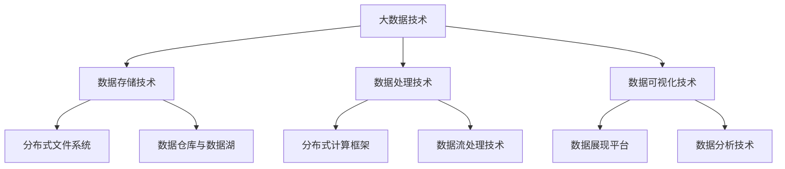

### 核心算法原理讲解

**分布式文件系统**

分布式文件系统原理可以简化为以下伪代码：

```pseudo
class DistributedFileSystem {
    // 数据存储在多个节点上
    // 客户端通过文件系统接口访问文件
    // 文件系统负责协调不同节点的存储资源
    // 提供文件的读写操作
}
```

**数据处理流程**

数据处理流程的一般步骤如下：

```pseudo
function processData(inputData) {
    // 分割数据
    // 将数据分发到多个节点进行并行处理
    // 收集节点处理结果
    // 合并结果
    // 输出最终结果
}
```

**数据可视化技术**

数据可视化技术通常包括数据转换和图形渲染两个步骤：

```latex
$$
\text{可视化技术} = \text{数据转换} + \text{图形渲染}
$$
```

### 数学模型和数学公式

**线性回归模型**

线性回归模型是数据分析中常用的一种统计方法，其公式为：

```latex
$$
\text{线性回归模型}:
\begin{aligned}
y &= \beta_0 + \beta_1x \\
\text{其中：} \\
\beta_0 &= \text{截距} \\
\beta_1 &= \text{斜率}
\end{aligned}
$$
```

### 项目实战

**数据存储系统搭建**

以下是一个简单的HDFS数据存储系统的搭建过程：

```python
# 搭建HDFS数据存储系统

from hdfs import InsecureClient

# 连接HDFS
client = InsecureClient('http://hdfs-namenode:50070', user='hdfs')

# 创建文件夹
client.makedirs('/data/in')

# 上传文件
with open('data.csv', 'rb') as file:
    client.upload_file('data.csv', '/data/in/')

# 读取文件
with client.read('/data/in/data.csv', encoding='utf-8') as reader:
    for line in reader:
        print(line.strip())
```

在这个例子中，我们首先创建了一个HDFS客户端，然后创建了一个新文件夹，接着上传了一个CSV文件到HDFS，最后读取并打印了文件内容。

### 最佳实践 tips、小结、注意事项、拓展阅读

- **最佳实践 tips**：在实际应用中，应根据数据特点和需求选择合适的技术和架构。
- **小结**：本章介绍了大数据的概述、应用领域和核心技术，为后续的架构设计奠定了基础。
- **注意事项**：大数据处理需要强大的计算资源和高效的数据处理算法。
- **拓展阅读**：读者可以进一步学习相关技术细节，如HDFS、Spark等。

## 第一部分总结

本部分详细介绍了大数据技术的基础知识，包括大数据的定义、特点、应用领域以及核心处理技术。通过这些内容，读者可以建立对大数据处理平台的基本认识，为后续的架构设计打下坚实的基础。

---

## 第一部分：大数据技术基础

### 第2章：数据存储与管理

#### 2.1 数据仓库与数据湖

数据仓库（Data Warehouse）和数据湖（Data Lake）是大数据存储解决方案中的两种不同类型。

**数据仓库**

- **定义**：数据仓库是一个集成的数据存储系统，用于支持企业级的数据分析和决策支持。
- **特点**：
  - **数据集成**：数据仓库通常包含来自多个源的结构化数据，如关系数据库。
  - **数据清洗**：数据仓库中的数据经过清洗、转换和集成，确保数据的质量和一致性。
  - **查询优化**：数据仓库优化查询性能，支持复杂的分析操作。
- **应用场景**：
  - **企业级数据分析**：用于生成报告、仪表盘和关键绩效指标（KPI）。
  - **战略决策支持**：支持企业的高层决策。

**数据湖**

- **定义**：数据湖是一个分布式存储系统，用于存储原始数据，包括结构化、半结构化和非结构化数据。
- **特点**：
  - **数据多样性**：数据湖可以存储不同格式和来源的数据，如日志文件、图片、视频等。
  - **数据原始性**：数据湖保留了原始数据，不进行预处理。
  - **弹性扩展**：数据湖能够灵活扩展存储容量，适应数据量的增长。
- **应用场景**：
  - **数据探索和分析**：研究人员和数据科学家可以直接在数据湖中进行数据分析和探索。
  - **人工智能和机器学习**：数据湖为AI算法提供丰富的数据源，支持实时训练和预测。

**数据仓库与数据湖的比较**

- **数据质量**：数据仓库中的数据经过清洗和集成，质量较高；数据湖中的数据保持原始性，质量参差不齐。
- **数据处理**：数据仓库支持复杂的分析操作，数据处理速度较快；数据湖侧重数据存储和原始数据的保留，数据处理速度相对较慢。
- **使用场景**：数据仓库适合企业级的数据分析和决策支持；数据湖适合数据探索、机器学习和实时分析。

**核心概念与联系**

数据仓库与数据湖之间的联系可以用Mermaid图表示：

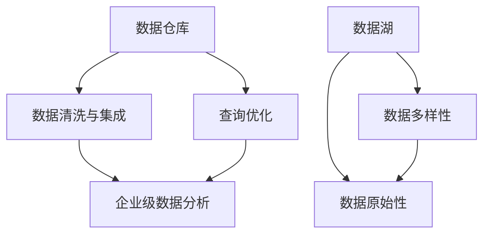

**核心算法原理讲解**

- **数据清洗**：数据清洗是数据仓库中的重要步骤，目的是去除数据中的噪声、错误和不一致。一种常用的算法是K近邻算法（K-Nearest Neighbors），用于识别并处理异常值。

  ```python
  from sklearn.neighbors import KNeighborsClassifier
  
  # 假设我们已经有一个数据集X和标签y
  knn = KNeighborsClassifier(n_neighbors=5)
  knn.fit(X, y)
  ```

- **数据集成**：数据集成是将多个源的数据合并为一个统一的数据视图。一种常用的算法是映射-合并算法（Map-Reduce），用于分布式数据集成。

  ```python
  def map_function(data):
      # 对数据进行处理，返回键值对
      return ((data[0],), (data[1],))
  
  def reduce_function(key, values):
      # 对键值对进行合并
      return (key, sum(values))
  
  # 假设我们已经有一个数据集data
  result = map_reduce(map_function, reduce_function, data)
  ```

**数学模型和数学公式**

- **主成分分析（PCA）**：PCA是一种常用的降维技术，用于减少数据维度并保持数据的主要特征。其公式为：

  ```latex
  $$
  X_{\text{new}} = P \Sigma^{1/2}
  $$

  其中，\( X_{\text{new}} \)是降维后的数据，\( P \)是特征值矩阵的对角线矩阵，\( \Sigma^{1/2} \)是协方差矩阵的平方根。
  ```

**项目实战**

**数据仓库搭建**

以下是一个简单的数据仓库搭建示例：

```sql
-- 创建数据仓库表
CREATE TABLE sales_data (
    id INT PRIMARY KEY,
    date DATE,
    product_id INT,
    quantity INT,
    revenue DECIMAL(10, 2)
);

-- 导入数据
LOAD DATA INPATH '/data/sales_data.csv' INTO TABLE sales_data;

-- 创建数据分析仪表盘
SELECT
    date,
    SUM(revenue) AS total_revenue
FROM
    sales_data
GROUP BY
    date
ORDER BY
    date;
```

在这个例子中，我们创建了一个销售数据表，并导入数据。然后，我们使用SQL语句创建了一个简单的数据分析仪表盘，显示每天的销售额。

### 最佳实践 tips、小结、注意事项、拓展阅读

- **最佳实践 tips**：在设计数据仓库和数据湖时，应根据业务需求选择合适的模型和数据存储方案。
- **小结**：本章介绍了数据仓库与数据湖的基本概念、特点和区别，为大数据存储提供了理论基础。
- **注意事项**：数据仓库和数据湖的设计应考虑数据质量、数据处理能力和扩展性。
- **拓展阅读**：读者可以进一步学习数据仓库和数据湖的具体实现技术和最佳实践。

## 第一部分总结

本章详细介绍了大数据存储中的两个核心概念——数据仓库与数据湖，包括它们的定义、特点、比较以及核心算法原理。通过这些内容，读者可以了解如何根据业务需求选择合适的数据存储方案，为大数据处理平台的设计提供指导。

---

## 第一部分：大数据技术基础

### 第3章：数据处理与计算

#### 3.1 分布式计算框架

分布式计算框架是大数据处理的核心技术之一，用于处理大规模数据集。以下是几个常用的分布式计算框架：

**Hadoop**

- **定义**：Hadoop是一个开源的分布式计算框架，由Apache软件基金会维护。
- **特点**：
  - **分布式存储**：使用HDFS（Hadoop Distributed File System）进行数据存储。
  - **分布式计算**：使用MapReduce编程模型进行数据处理。
  - **高容错性**：通过复制数据块和任务调度实现高可用性和容错性。
- **应用场景**：
  - **批量数据处理**：适用于离线数据处理和批量计算任务。
  - **大数据分析**：支持复杂的数据分析任务。

**Spark**

- **定义**：Spark是一个开源的分布式计算框架，由Apache软件基金会维护。
- **特点**：
  - **内存计算**：将数据存储在内存中，提高数据处理速度。
  - **弹性调度**：支持动态资源分配和任务调度。
  - **丰富的API**：提供Java、Scala和Python等多种编程语言的支持。
- **应用场景**：
  - **实时数据处理**：适用于实时数据流处理和迭代计算任务。
  - **机器学习和数据分析**：提供强大的机器学习库和数据分析工具。

**Flink**

- **定义**：Flink是一个开源的分布式流处理框架，由Apache软件基金会维护。
- **特点**：
  - **流处理**：支持实时流处理和批处理。
  - **事件驱动**：基于事件驱动的数据流处理模型。
  - **高吞吐量**：提供高效的内存管理和数据流处理。
- **应用场景**：
  - **实时数据分析**：适用于实时数据分析和决策支持。
  - **实时流处理**：支持低延迟、高吞吐量的实时数据处理。

#### 3.2 数据处理流程

数据处理流程包括数据采集、数据清洗、数据存储、数据分析和数据展现等环节。以下是数据处理流程的一般步骤：

1. **数据采集**：从各种数据源（如数据库、日志文件、传感器等）收集数据。
2. **数据清洗**：去除数据中的噪声、错误和不一致，确保数据质量。
3. **数据存储**：将清洗后的数据存储到分布式文件系统或数据仓库中。
4. **数据分析**：使用分布式计算框架对数据进行处理和分析。
5. **数据展现**：通过数据可视化工具将分析结果展现给用户。

#### 3.3 数据流处理

数据流处理是实时数据处理的一种方法，用于处理连续流动的数据流。以下是几个常用的数据流处理技术：

**Apache Kafka**

- **定义**：Kafka是一个开源的分布式流处理平台，由Apache软件基金会维护。
- **特点**：
  - **高吞吐量**：支持大规模的数据流处理。
  - **高可用性**：支持数据备份和恢复。
  - **可扩展性**：支持水平扩展，适应数据流量的增长。
- **应用场景**：
  - **实时日志收集**：用于收集和分析系统的日志数据。
  - **实时数据传输**：用于构建实时数据管道。

**Apache Flink**

- **定义**：Flink是一个开源的分布式流处理框架，由Apache软件基金会维护。
- **特点**：
  - **实时计算**：支持实时流处理和批处理。
  - **事件驱动**：基于事件驱动的数据流处理模型。
  - **动态调整**：支持动态资源分配和任务调整。
- **应用场景**：
  - **实时分析**：适用于实时数据分析、预测和决策支持。
  - **实时数据处理**：支持低延迟、高吞吐量的实时数据处理。

**Apache Storm**

- **定义**：Storm是一个开源的分布式流处理框架，由Apache软件基金会维护。
- **特点**：
  - **弹性**：支持任务失败重试和自动恢复。
  - **高吞吐量**：提供高效的内存管理和数据流处理。
  - **易于集成**：支持与Hadoop、Spark等其他大数据技术集成。
- **应用场景**：
  - **实时数据处理**：适用于实时日志分析、网站流量监控等。
  - **实时流处理**：支持低延迟、高吞吐量的实时数据处理。

**核心概念与联系**

数据处理与计算的核心概念和联系可以用Mermaid图表示：

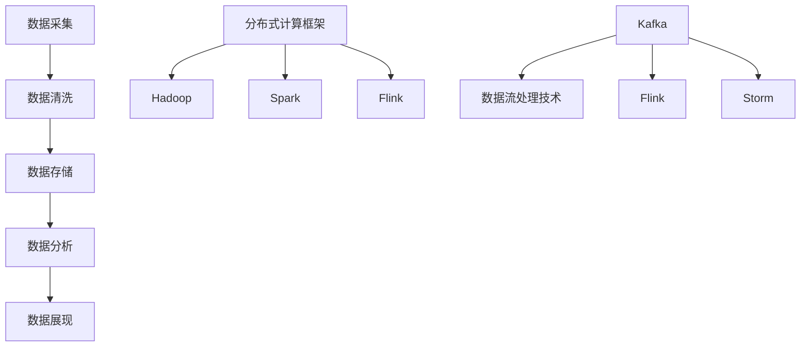

**核心算法原理讲解**

- **MapReduce**：MapReduce是一种分布式数据处理模型，用于处理大规模数据集。其基本原理如下：

  ```python
  def map_function(input_data):
      # 对输入数据进行处理，返回中间结果
      return [(key, value) for key, value in input_data]

  def reduce_function(key, values):
      # 对中间结果进行合并，返回最终结果
      return sum(values)
  ```

- **流处理模型**：流处理模型是基于事件驱动的数据处理模型，其基本原理如下：

  ```python
  class DataStream:
      def process_event(self, event):
          # 对事件进行处理
          pass
  ```

**数学模型和数学公式**

- **线性回归**：线性回归是一种常用的统计模型，用于预测连续值。其公式为：

  ```latex
  $$
  y = \beta_0 + \beta_1x
  $$

  其中，\( \beta_0 \)是截距，\( \beta_1 \)是斜率。
  ```

**项目实战**

**分布式计算框架搭建**

以下是一个简单的分布式计算框架搭建示例：

```shell
# 安装Hadoop
sudo apt-get install hadoop

# 启动Hadoop集群
start-dfs.sh
start-yarn.sh

# 编写MapReduce程序
import org.apache.hadoop.conf.Configuration
import org.apache.hadoop.fs.Path
import org.apache.hadoop.io.IntWritable
import org.apache.hadoop.io.Text
import org.apache.hadoop.mapreduce.Job
import org.apache.hadoop.mapreduce.Mapper
import org.apache.hadoop.mapreduce.Reducer
import org.apache.hadoop.mapreduce.lib.input.FileInputFormat
import org.apache.hadoop.mapreduce.lib.output.FileOutputFormat

class MyMapper extends Mapper[Text, Text, Text, IntWritable] {
    val output = new IntWritable()

    override def map(input_key: Text, input_value: Text, context: Context): Unit = {
        val words = input_value.toString.split(" ")
        for (word <- words) {
            output.set(1)
            context.write(new Text(word), output)
        }
    }
}

class MyReducer extends Reducer[Text, IntWritable, Text, IntWritable] {
    override def reduce(input_key: Text, values: Iterator[IntWritable], context: Context): Unit = {
        val sum = values.sum
        context.write(input_key, new IntWritable(sum))
    }
}

val conf = new Configuration()
val job = Job(conf, "WordCount")
job.setMapperClass(classOf[MyMapper])
job.setReducerClass(classOf[MyReducer])
job.setOutputKeyClass(classOf[Text])
job.setOutputValueClass(classOf[IntWritable])

FileInputFormat.addInputPath(job, new Path("input.txt"))
FileOutputFormat.setOutputPath(job, new Path("output"))

job.waitForCompletion(true)
```

在这个例子中，我们使用Hadoop编写了一个简单的WordCount程序，用于统计文本中每个单词的出现次数。

### 最佳实践 tips、小结、注意事项、拓展阅读

- **最佳实践 tips**：在实际项目中，应根据数据处理需求选择合适的分布式计算框架。
- **小结**：本章介绍了分布式计算框架、数据处理流程和数据流处理技术，为大数据处理提供了技术支持。
- **注意事项**：分布式计算框架的设计和实现应考虑数据一致性、容错性和性能优化。
- **拓展阅读**：读者可以进一步学习分布式计算框架的详细实现和技术细节。

## 第一部分总结

本章详细介绍了大数据处理中的分布式计算框架、数据处理流程和数据流处理技术，包括Hadoop、Spark、Flink、Kafka等核心技术和算法原理。通过这些内容，读者可以了解如何进行大数据处理和计算，为大数据处理平台的设计提供了重要的理论基础。

---

## 第一部分：大数据技术基础

### 第4章：数据可视化与展现

#### 4.1 数据可视化技术

数据可视化是将复杂的数据通过图形化的方式呈现，使得数据更容易理解和分析。数据可视化技术在大数据处理中扮演着重要角色，能够帮助用户从海量数据中快速发现有价值的信息。

**数据可视化工具**

以下是一些常见的数据可视化工具：

- **Tableau**：一款功能强大的数据可视化工具，支持多种数据源和丰富的可视化图表。
- **Power BI**：微软推出的数据可视化工具，与Azure等微软云服务深度集成。
- **QlikView**：一款实时数据可视化工具，支持拖拽式数据探索和分析。
- **Google Data Studio**：谷歌推出的数据可视化工具，方便用户创建交互式报表和仪表盘。

**数据可视化步骤**

数据可视化通常包括以下步骤：

1. **数据准备**：清洗和整理数据，确保数据质量和完整性。
2. **数据连接**：将数据连接到可视化工具，配置数据源。
3. **设计图表**：选择合适的图表类型和布局，展示数据。
4. **交互式探索**：添加交互功能，如过滤、筛选和联动，增强用户体验。
5. **数据分析和报告**：通过分析图表和数据，生成报告和见解。

**核心概念与联系**

数据可视化技术的核心概念和联系可以用Mermaid图表示：

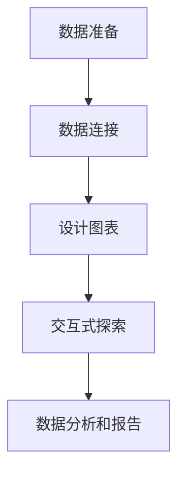

**核心算法原理讲解**

- **数据聚类**：数据聚类是将数据点划分为多个类别的过程。常用的聚类算法包括K-means、DBSCAN等。K-means算法的原理如下：

  ```python
  from sklearn.cluster import KMeans
  
  # 假设我们有一个数据集X
  kmeans = KMeans(n_clusters=3)
  kmeans.fit(X)
  clusters = kmeans.predict(X)
  ```

- **关联规则学习**：关联规则学习用于发现数据之间的关联关系。Apriori算法是一种常用的关联规则学习算法。其原理如下：

  ```python
  from mlxtend.frequent_patterns import apriori
  from mlxtend.frequent_patterns import association_rules
  
  # 假设我们有一个交易数据集X
  frequent_itemsets = apriori(X, min_support=0.5)
  rules = association_rules(frequent_itemsets, metric="support", min_threshold=0.7)
  ```

**数学模型和数学公式**

- **主成分分析（PCA）**：PCA是一种常用的降维技术，用于减少数据维度并保持数据的主要特征。其公式为：

  ```latex
  $$
  X_{\text{new}} = P \Sigma^{1/2}
  $$

  其中，\( X_{\text{new}} \)是降维后的数据，\( P \)是特征值矩阵的对角线矩阵，\( \Sigma^{1/2} \)是协方差矩阵的平方根。
  ```

**项目实战**

**数据可视化工具使用**

以下是一个简单的数据可视化工具使用示例：

```python
import pandas as pd
import matplotlib.pyplot as plt

# 读取数据
data = pd.read_csv('data.csv')

# 绘制柱状图
plt.bar(data['category'], data['value'])
plt.xlabel('Category')
plt.ylabel('Value')
plt.title('Category Distribution')
plt.show()
```

在这个例子中，我们使用Pandas读取数据，然后使用Matplotlib绘制了一个柱状图，展示了不同类别的数据分布。

### 最佳实践 tips、小结、注意事项、拓展阅读

- **最佳实践 tips**：在设计数据可视化时，应根据用户需求和数据特性选择合适的图表类型和布局。
- **小结**：本章介绍了数据可视化技术、工具和步骤，以及核心算法原理和数学模型，为大数据处理提供了有效的数据展现方法。
- **注意事项**：数据可视化应注重易读性和交互性，以便用户更好地理解和分析数据。
- **拓展阅读**：读者可以进一步学习数据可视化工具的具体使用方法和最佳实践。

## 第一部分总结

本章详细介绍了数据可视化与展现的技术、工具和步骤，包括核心算法原理和数学模型。通过这些内容，读者可以了解如何有效地将大数据以可视化形式呈现，为大数据处理平台提供了重要的展现手段。

---

## 第二部分：大数据平台架构设计

### 第5章：大数据平台架构设计原则

#### 5.1 架构设计目标

大数据平台架构设计的核心目标是：

1. **高效性**：确保平台能够快速处理大规模数据，提高数据处理的效率。
2. **可扩展性**：支持数据的快速增长和业务的扩展，确保平台能够灵活应对变化。
3. **稳定性**：保证平台的高可用性和容错性，确保数据处理的连续性和可靠性。
4. **灵活性**：支持多种数据处理场景，如离线批处理、实时流处理等。
5. **安全性**：确保数据的安全和隐私，防止数据泄露和未经授权的访问。

#### 5.2 架构设计模式

大数据平台架构设计通常采用以下几种模式：

1. **分层架构**：将平台分为数据存储层、数据处理层、数据展现层等不同层次，各层之间相互独立，便于维护和扩展。
2. **微服务架构**：将平台拆分为多个独立的微服务，每个微服务负责特定的数据处理功能，便于部署和扩展。
3. **分布式架构**：将平台部署在分布式环境中，数据存储和处理分布在多个节点上，提高系统的性能和可用性。

#### 5.3 架构设计原则

大数据平台架构设计应遵循以下原则：

1. **模块化**：将系统划分为多个模块，每个模块具有独立的职责和功能，便于开发、测试和维护。
2. **解耦**：降低模块之间的依赖关系，提高系统的可扩展性和可维护性。
3. **冗余设计**：增加系统的冗余设计，如数据备份、节点备份等，提高系统的容错性和可靠性。
4. **性能优化**：根据数据处理需求和资源限制，进行性能优化，提高系统的处理能力和响应速度。
5. **安全性**：确保数据的安全性和隐私，采用加密、访问控制等技术保护数据。
6. **可扩展性**：设计可扩展的架构，支持系统规模的扩展和功能的增加。

**核心概念与联系**

大数据平台架构设计的核心概念和联系可以用Mermaid图表示：

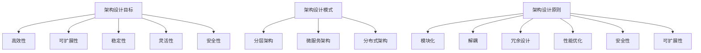

**核心算法原理讲解**

- **负载均衡**：负载均衡是一种分布式架构中的关键技术，用于均衡地分配请求到多个节点。常见的负载均衡算法包括轮询、随机、最少连接数等。

  ```python
  from flask import Flask, request
  from flask_limiter import Limiter
  from flask_limiter.util import get_remote_address

  app = Flask(__name__)
  limiter = Limiter(app, key_func=get_remote_address)

  @app.route('/')
  @limiter.limit("100/day")
  def index():
      return "Hello, World!"

  if __name__ == '__main__':
      app.run()
  ```

- **分布式事务**：分布式事务是一种跨多个节点的事务管理技术，用于确保数据的一致性和完整性。常用的分布式事务算法包括两阶段提交（2PC）和三阶段提交（3PC）。

  ```python
  import asyncio
  import aioredis

  async def execute_transaction(redis_client, key, value):
      await redis_client.set(key, value)
      await redis_client.expire(key, 10)

  async def main():
      redis_client = await aioredis.create_redis_pool('redis://localhost')
      await execute_transaction(redis_client, 'my_key', 'my_value')

  asyncio.run(main())
  ```

**数学模型和数学公式**

- **线性回归模型**：线性回归模型是一种常用的预测模型，用于预测连续值。其公式为：

  ```latex
  $$
  y = \beta_0 + \beta_1x
  $$

  其中，\( \beta_0 \)是截距，\( \beta_1 \)是斜率。
  ```

**项目实战**

**大数据平台架构设计**

以下是一个简单的大数据平台架构设计示例：

```
+----------------+       +----------------+       +----------------+
|      数据采集  | -->   |     数据存储    | -->   |     数据处理    |
+----------------+       +----------------+       +----------------+
        |                                  |                  |
        |                                  |                  |
        |                                  |                  |
        +-----------------------------------+-------------------+
                                                     |
                                                     |
                                                     |
                                                     |
                                                 +----------------+
                                                 |     数据展现    |
                                                 +----------------+
```

在这个示例中，数据采集模块负责收集数据，数据存储模块负责存储数据，数据处理模块负责对数据进行处理，数据展现模块负责将处理后的数据可视化展示。

### 最佳实践 tips、小结、注意事项、拓展阅读

- **最佳实践 tips**：在进行大数据平台架构设计时，应根据业务需求和技术特点选择合适的架构模式。
- **小结**：本章介绍了大数据平台架构设计的核心目标、设计模式、设计原则以及核心算法原理和数学模型，为大数据平台的设计提供了指导。
- **注意事项**：架构设计应考虑系统的可扩展性、性能优化和安全性。
- **拓展阅读**：读者可以进一步学习大数据平台架构设计的具体实现和技术细节。

## 第二部分总结

本章详细介绍了大数据平台架构设计的核心目标、设计模式、设计原则以及核心算法原理和数学模型。通过这些内容，读者可以掌握大数据平台架构设计的方法和技巧，为实际项目提供参考。

---

## 第二部分：大数据平台架构设计

### 第6章：大数据平台关键技术选型

#### 6.1 数据存储选型

数据存储是大数据平台的核心环节，选择合适的数据存储技术对系统的性能和稳定性至关重要。以下是几种常见的数据存储技术及其选型依据：

**HDFS（Hadoop Distributed File System）**

- **特点**：HDFS是一个分布式文件系统，适合存储大规模数据，具有高吞吐量和高容错性。
- **适用场景**：适合离线批量数据处理，如大数据分析和日志处理。
- **优点**：数据冗余度高，可靠性好。
- **缺点**：不适合小文件存储，读写性能较低。

**Elasticsearch**

- **特点**：Elasticsearch是一个基于Lucene的分布式搜索引擎，适合存储和分析文本数据。
- **适用场景**：适合实时全文搜索和数据分析，如网站搜索、日志分析等。
- **优点**：支持高并发查询，数据检索速度快。
- **缺点**：不适合存储非文本数据，存储成本较高。

**MongoDB**

- **特点**：MongoDB是一个分布式文档数据库，适合存储复杂结构和大量数据。
- **适用场景**：适合存储结构化数据和非结构化数据，如用户数据、商品信息等。
- **优点**：支持文档模型，易于扩展。
- **缺点**：查询性能相对较低，不适合大规模数据集。

**Cassandra**

- **特点**：Cassandra是一个分布式键值数据库，适合存储大规模数据，具有高可用性和高性能。
- **适用场景**：适合存储高并发读写操作，如金融交易、社交网络等。
- **优点**：分布式架构，支持横向扩展。
- **缺点**：不适合复杂查询，数据冗余度较低。

**选型依据**

- **数据量**：根据数据量大小选择合适的存储技术，如HDFS适合大规模数据存储，MongoDB适合中小规模数据存储。
- **数据结构**：根据数据结构选择合适的存储技术，如Elasticsearch适合文本数据存储，MongoDB适合复杂结构数据存储。
- **性能需求**：根据性能需求选择合适的存储技术，如Elasticsearch适合高并发查询，Cassandra适合高并发读写操作。
- **业务场景**：根据业务场景选择合适的存储技术，如实时搜索选择Elasticsearch，大数据分析选择HDFS。

**核心概念与联系**

数据存储技术的核心概念和联系可以用Mermaid图表示：

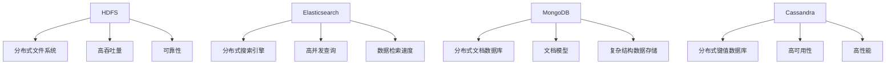

**核心算法原理讲解**

- **一致性哈希**：一致性哈希是一种分布式哈希算法，用于负载均衡和数据分区。其原理如下：

  ```python
  import hashlib

  def hash(key):
      return int(hashlib.md5(key.encode('utf-8')).hexdigest(), 16)

  def consistent_hashing(key, num_shards):
      return hash(key) % num_shards
  ```

- **分布式锁**：分布式锁是一种用于多节点环境下保证数据一致性的技术。其原理如下：

  ```python
  import redis

  redis_client = redis.StrictRedis(host='localhost', port=6379, db=0)

  def distributed_lock(lock_key):
      while True:
          if redis_client.set(lock_key, "locked", nx=True, ex=30):
              return True
          time.sleep(1)

  def release_lock(lock_key):
      redis_client.delete(lock_key)
  ```

**数学模型和数学公式**

- **泊松分布**：泊松分布是一种概率分布，用于描述事件发生的频率。其公式为：

  ```latex
  $$
  P(X = k) = \frac{e^{-\lambda} \lambda^k}{k!}
  $$

  其中，\( \lambda \)是事件发生的平均频率，\( k \)是事件发生的次数。
  ```

**项目实战**

**HDFS存储系统搭建**

以下是一个简单的HDFS存储系统搭建示例：

```shell
# 安装Hadoop
sudo apt-get install hadoop

# 配置Hadoop
sudo nano /etc/hadoop/hadoop-env.sh

# 添加以下内容
export HADOOP_HOME=/path/to/hadoop
export JAVA_HOME=/path/to/java

# 启动HDFS
sudo start-dfs.sh

# 查看HDFS状态
sudo hadoop dfsadmin -report
```

在这个示例中，我们首先安装了Hadoop，然后配置了环境变量，最后启动了HDFS并查看其状态。

### 最佳实践 tips、小结、注意事项、拓展阅读

- **最佳实践 tips**：在选择数据存储技术时，应根据业务需求和数据特性进行综合评估。
- **小结**：本章介绍了大数据平台数据存储技术的选型依据、核心概念与联系、核心算法原理和数学模型，以及项目实战，为大数据平台的数据存储提供了指导。
- **注意事项**：数据存储技术的选择应考虑系统的性能、稳定性和可扩展性。
- **拓展阅读**：读者可以进一步学习各种数据存储技术的详细实现和最佳实践。

## 第二部分总结

本章详细介绍了大数据平台数据存储技术的选型依据、核心概念与联系、核心算法原理和数学模型，以及项目实战。通过这些内容，读者可以掌握大数据平台数据存储技术的选择方法和实践技巧，为大数据平台的设计和实现提供有力支持。

---

## 第二部分：大数据平台架构设计

### 第7章：大数据平台性能优化

#### 7.1 系统性能评估

系统性能评估是大数据平台性能优化的重要环节，通过对系统性能进行全面评估，可以找出性能瓶颈，为优化策略提供依据。以下是系统性能评估的一般步骤：

1. **确定评估指标**：根据业务需求和系统特点，选择合适的性能评估指标，如响应时间、吞吐量、资源利用率等。
2. **设计测试场景**：模拟实际业务场景，设计合理的测试方案，包括测试数据、测试负载和测试步骤等。
3. **执行性能测试**：使用性能测试工具（如JMeter、Gatling等）执行测试，收集性能数据。
4. **分析性能数据**：对性能测试结果进行分析，找出系统的性能瓶颈和问题。
5. **制定优化策略**：根据分析结果，制定优化策略，包括硬件升级、软件优化、架构调整等。

**核心概念与联系**

系统性能评估的核心概念和联系可以用Mermaid图表示：

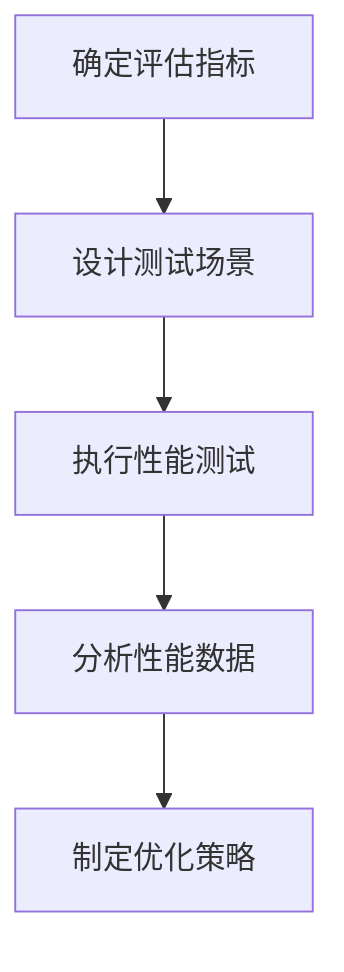

**核心算法原理讲解**

- **响应时间优化**：响应时间优化是提高系统性能的重要手段，其算法原理包括：

  1. **负载均衡**：通过负载均衡算法（如轮询、随机、加权等），将请求均匀地分配到多个节点，避免单点瓶颈。
  2. **缓存技术**：使用缓存技术（如Redis、Memcached等），将热点数据缓存起来，减少数据库的访问压力。
  3. **并发控制**：通过并发控制技术（如锁、队列、线程池等），控制并发访问量，避免资源争用和死锁。

  ```python
  import time

  def process_request(request):
      # 处理请求
      time.sleep(1)

  def main():
      start_time = time.time()
      for i in range(100):
          process_request(i)
      end_time = time.time()
      print(f"Total time: {end_time - start_time} seconds")

  if __name__ == "__main__":
      main()
  ```

- **吞吐量优化**：吞吐量优化是提高系统处理能力的重要手段，其算法原理包括：

  1. **并行处理**：通过分布式计算技术（如MapReduce、Spark等），将数据处理任务并行化，提高处理速度。
  2. **数据压缩**：使用数据压缩技术（如gzip、zlib等），减少数据传输和存储的开销。
  3. **预取技术**：使用预取技术（如预加载、预缓存等），提前处理后续请求，减少延迟。

  ```python
  import time
  import requests

  def fetch_data(url):
      response = requests.get(url)
      return response.text

  def main():
      start_time = time.time()
      for i in range(100):
          fetch_data(f"https://example.com/data/{i}.json")
      end_time = time.time()
      print(f"Total time: {end_time - start_time} seconds")

  if __name__ == "__main__":
      main()
  ```

**数学模型和数学公式**

- **响应时间分布**：响应时间分布是描述系统响应时间特性的数学模型，常用的分布模型包括正态分布、指数分布等。

  ```latex
  $$
  P(X = x) = f(x) \exp(-\lambda x)
  $$

  其中，\( \lambda \)是平均响应时间，\( x \)是响应时间。
  ```

**项目实战**

**性能测试与优化**

以下是一个简单的性能测试与优化示例：

```shell
# 安装JMeter
sudo apt-get install jmeter

# 配置JMeter
sudo nano /etc/jmeter/jmeter.properties

# 添加以下内容
java.library.path=/path/to/lib

# 运行JMeter测试计划
cd /path/to/jmeter
bin/jmeter -n -t test_plan.jmx -l results.jtl
```

在这个示例中，我们首先安装了JMeter，然后配置了JMeter环境，最后运行了性能测试计划，收集了测试结果。

### 最佳实践 tips、小结、注意事项、拓展阅读

- **最佳实践 tips**：在进行性能优化时，应根据具体问题和业务需求制定合理的优化策略。
- **小结**：本章介绍了大数据平台性能评估的一般步骤、核心算法原理和数学模型，以及项目实战，为大数据平台的性能优化提供了指导。
- **注意事项**：性能优化应考虑系统的可扩展性、稳定性和资源利用率。
- **拓展阅读**：读者可以进一步学习性能优化技术的详细实现和最佳实践。

## 第二部分总结

本章详细介绍了大数据平台性能评估的一般步骤、核心算法原理和数学模型，以及项目实战。通过这些内容，读者可以掌握大数据平台性能优化的方法和技巧，为实际项目提供有力支持。

---

## 第二部分：大数据平台架构设计

### 第8章：大数据平台安全性设计

#### 8.1 数据安全与隐私保护

数据安全与隐私保护是大数据平台设计的核心问题之一。随着数据量的不断增长和隐私泄露事件的频繁发生，确保数据的安全性和隐私保护变得尤为重要。以下是大数据平台数据安全与隐私保护的关键技术和策略：

**数据加密**

数据加密是保护数据隐私和安全的重要手段。常用的数据加密技术包括：

- **对称加密**：对称加密算法（如AES）使用相同的密钥进行加密和解密。
- **非对称加密**：非对称加密算法（如RSA）使用一对密钥进行加密和解密，其中公钥加密、私钥解密。

**核心概念与联系**

数据加密技术的核心概念和联系可以用Mermaid图表示：

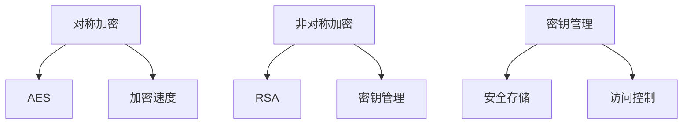

**核心算法原理讲解**

- **对称加密算法（AES）**：AES是一种常用的对称加密算法，其基本原理如下：

  ```python
  from Crypto.Cipher import AES
  from Crypto.Util.Padding import pad, unpad

  key = b'mysecretkey123456'
  cipher = AES.new(key, AES.MODE_CBC)
  ciphertext = cipher.encrypt(pad(b'message', AES.block_size))
  nonce = cipher.nonce
  ```

- **非对称加密算法（RSA）**：RSA是一种常用的非对称加密算法，其基本原理如下：

  ```python
  from Crypto.PublicKey import RSA
  from Crypto.Cipher import PKCS1_OAEP

  key = RSA.generate(2048)
  private_key = key.export_key()
  public_key = key.publickey().export_key()

  cipher = PKCS1_OAEP.new(RSA.import_key(public_key))
  ciphertext = cipher.encrypt(b'message')
  ```

**数学模型和数学公式**

- **椭圆曲线加密（ECC）**：椭圆曲线加密是一种基于椭圆曲线离散对数的公钥加密算法，其基本原理如下：

  ```latex
  $$
  E: y^2 = x^3 + ax + b
  $$

  其中，\( E \)是椭圆曲线，\( a \)和\( b \)是椭圆曲线的系数。
  ```

**项目实战**

**数据加密与解密**

以下是一个简单的数据加密与解密示例：

```python
from Crypto.Cipher import AES
from Crypto.Util.Padding import pad, unpad

key = b'mysecretkey123456'
cipher = AES.new(key, AES.MODE_CBC)
ciphertext = cipher.encrypt(pad(b'message', AES.block_size))
nonce = cipher.nonce

print("Ciphertext:", ciphertext)
print("Nonce:", nonce)

cipher2 = AES.new(key, AES.MODE_CBC, nonce=nonce)
plaintext = unpad(cipher2.decrypt(ciphertext), AES.block_size)

print("Plaintext:", plaintext)
```

在这个示例中，我们首先生成了一个AES密钥，然后使用该密钥对数据进行加密和解密。

#### 8.2 安全架构设计

大数据平台的安全架构设计应包括以下几个方面：

1. **身份认证与访问控制**：通过身份认证（如用户名和密码、多因素认证等）确保用户身份的合法性，并通过访问控制（如角色权限、访问策略等）限制用户对数据的访问权限。
2. **网络安全**：通过防火墙、入侵检测系统（IDS）、入侵防御系统（IPS）等网络安全技术，保护平台免受网络攻击。
3. **数据备份与恢复**：定期进行数据备份，确保在数据丢失或系统故障时能够快速恢复数据。
4. **日志审计与监控**：记录系统操作日志，进行实时监控和审计，及时发现和处理安全事件。
5. **安全漏洞分析与防护**：定期进行安全漏洞扫描和风险评估，及时修补漏洞，防止安全威胁。

**核心概念与联系**

安全架构设计的核心概念和联系可以用Mermaid图表示：

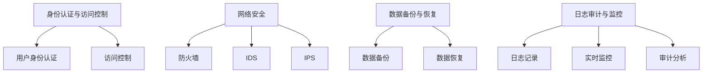

**核心算法原理讲解**

- **密码学哈希函数**：密码学哈希函数是一种用于确保数据完整性和认证的技术，常用的哈希函数包括MD5、SHA-1、SHA-256等。

  ```python
  import hashlib

  def hash_data(data):
      hash_object = hashlib.sha256(data.encode('utf-8'))
      hex_dig = hash_object.hexdigest()
      return hex_dig

  print(hash_data('mysecret'))
  ```

- **证书链**：证书链是一种用于确保数据传输安全的机制，通过将多个证书链接在一起，形成一条完整的信任链。

  ```python
  from cryptography import x509
  from cryptography.hazmat.backends import default_backend
  from cryptography.hazmat.primitives import serialization

  certificate = x509.load_pem_x509_certificate(b'...certificate.pem', backend=default_backend())
  certificate.public_bytes(
      encoding=serialization.Encoding.PEM,
      format=serialization.PublicFormat.SubjectKeyInfo
  )
  ```

**数学模型和数学公式**

- **密码学哈希函数**：密码学哈希函数的基本原理如下：

  ```latex
  $$
  H(D) = \text{Hash}(D)
  $$

  其中，\( H \)是哈希函数，\( D \)是输入数据。
  ```

**项目实战**

**安全架构设计**

以下是一个简单的安全架构设计示例：

```
+----------------+     +----------------+     +----------------+
|      用户认证  | --> |     数据加密    | --> |    安全日志    |
+----------------+     +----------------+     +----------------+
        |                         |                          |
        |                         |                          |
        |                         |                          |
        +----------------------+--------------------------+
                                  |
                                  |
                                  |
                               +----------------+
                               |    数据备份    |
                               +----------------+
```

在这个示例中，用户认证模块负责用户身份认证，数据加密模块负责数据传输过程中的加密，安全日志模块负责记录系统操作日志。

### 最佳实践 tips、小结、注意事项、拓展阅读

- **最佳实践 tips**：在进行大数据平台安全性设计时，应综合考虑数据安全、网络安全、身份认证、访问控制等方面。
- **小结**：本章介绍了大数据平台安全性设计的关键技术和策略，包括数据加密、安全架构设计、核心算法原理和数学模型，以及项目实战。
- **注意事项**：安全性设计应确保系统的安全性、可靠性和易用性。
- **拓展阅读**：读者可以进一步学习大数据平台安全性设计的详细实现和最佳实践。

## 第二部分总结

本章详细介绍了大数据平台安全性设计的关键技术和策略，包括数据加密、安全架构设计、核心算法原理和数学模型，以及项目实战。通过这些内容，读者可以掌握大数据平台安全性设计的方法和技巧，为实际项目提供有力支持。

---

## 第二部分：大数据平台架构设计

### 第9章：大数据平台运维管理

#### 9.1 运维管理流程

大数据平台的运维管理是一个复杂的过程，涉及系统监控、故障处理、性能优化、安全管理等多个方面。一个完整的运维管理流程通常包括以下步骤：

1. **需求分析**：了解业务需求，确定系统运维的目标和指标。
2. **系统部署**：根据需求设计系统架构，选择合适的硬件和软件，进行系统安装和配置。
3. **监控与报警**：安装监控工具，实时监控系统状态，设置报警机制，确保及时发现和处理异常。
4. **故障处理**：在出现故障时，按照预定的故障处理流程进行诊断和修复。
5. **性能优化**：定期进行性能评估和调优，确保系统在高负载下仍然稳定运行。
6. **安全管理**：实施安全策略，保护系统免受攻击和数据泄露。
7. **数据备份与恢复**：定期进行数据备份，确保在数据丢失或系统故障时能够快速恢复。
8. **文档与培训**：记录运维过程中的操作步骤和经验，为运维团队提供培训和支持。

**核心概念与联系**

运维管理流程的核心概念和联系可以用Mermaid图表示：

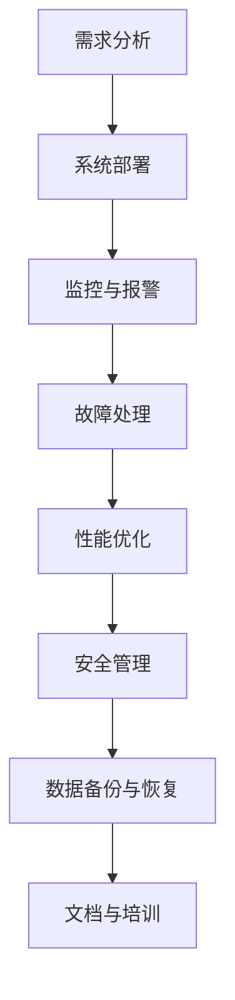

**核心算法原理讲解**

- **系统监控**：系统监控的核心算法原理是使用各种指标来衡量系统的性能和状态。常见的监控指标包括CPU使用率、内存使用率、磁盘I/O、网络流量等。

  ```python
  import psutil

  def monitor_system():
      cpu_usage = psutil.cpu_percent()
      memory_usage = psutil.virtual_memory().percent
      disk_usage = psutil.disk_usage('/').percent
      network_usage = psutil.net_io_counters()

      print(f"CPU Usage: {cpu_usage}%")
      print(f"Memory Usage: {memory_usage}%")
      print(f"Disk Usage: {disk_usage}%")
      print(f"Network Usage: {network_usage}")
  ```

- **故障处理**：故障处理的核心算法原理是使用预定义的故障处理流程来诊断和修复问题。常见的故障处理步骤包括检查日志、重启服务、升级软件等。

  ```python
  import os

  def handle_fault(fault):
      if fault == "service_not_running":
          os.system("systemctl start myservice")
      elif fault == "software_outdated":
          os.system("sudo apt-get update && sudo apt-get upgrade")
  ```

**数学模型和数学公式**

- **系统性能评估**：系统性能评估的数学模型通常包括响应时间、吞吐量、资源利用率等指标。其基本原理如下：

  ```latex
  $$
  \text{性能评估} = \frac{\text{响应时间}}{\text{吞吐量}} + \text{资源利用率}
  $$

  其中，响应时间是系统处理请求的时间，吞吐量是单位时间内处理的请求量，资源利用率是系统资源的占用率。
  ```

**项目实战**

**运维管理工具使用**

以下是一个简单的运维管理工具使用示例：

```shell
# 安装Zabbix
sudo apt-get install zabbix-server zabbix-agent

# 配置Zabbix服务器
sudo nano /etc/zabbix/zabbix_server.conf

# 添加以下内容
Server=1
ServerActive=active

# 启动Zabbix服务器和代理
sudo systemctl start zabbix-server
sudo systemctl start zabbix-agent

# 访问Zabbix监控界面
http://localhost/zabbix
```

在这个示例中，我们首先安装了Zabbix，然后配置了Zabbix服务器，最后启动了Zabbix服务器和代理，并访问了Zabbix监控界面。

### 最佳实践 tips、小结、注意事项、拓展阅读

- **最佳实践 tips**：在进行运维管理时，应制定详细的运维流程，确保系统稳定运行和快速响应故障。
- **小结**：本章介绍了大数据平台运维管理的流程、核心算法原理和数学模型，以及项目实战，为大数据平台的运维管理提供了指导。
- **注意事项**：运维管理应注重系统监控、故障处理、性能优化、安全管理等方面。
- **拓展阅读**：读者可以进一步学习运维管理工具的具体使用方法和最佳实践。

## 第二部分总结

本章详细介绍了大数据平台运维管理的流程、核心算法原理和数学模型，以及项目实战。通过这些内容，读者可以掌握大数据平台的运维管理方法和技巧，为实际项目提供有力支持。

---

## 第三部分：大数据平台实战案例

### 第10章：大数据平台搭建实战

#### 10.1 项目需求分析

某大型电商平台计划构建一个大数据平台，用于实时处理和分析海量交易数据，以便更好地了解用户行为、优化业务流程和提升用户体验。项目需求包括：

- **数据采集**：从各种数据源（如数据库、日志文件、API接口等）收集交易数据。
- **数据存储**：存储大规模交易数据，确保数据的可靠性和高效访问。
- **数据处理**：对交易数据进行清洗、转换和聚合，提取有价值的信息。
- **数据展现**：通过可视化工具将分析结果展示给业务人员，支持数据驱动决策。
- **实时计算**：实时计算用户行为和交易趋势，支持实时推荐和动态广告投放。

#### 10.2 系统架构设计

根据项目需求，系统架构设计如下：

1. **数据采集层**：使用日志收集工具（如Fluentd、Logstash等）从各种数据源采集交易数据。
2. **数据存储层**：使用分布式文件系统（如HDFS）存储大规模交易数据，使用数据仓库（如Apache Hive）进行数据存储和管理。
3. **数据处理层**：使用分布式计算框架（如Apache Spark）进行数据处理和计算，包括数据清洗、转换、聚合等。
4. **数据展现层**：使用数据可视化工具（如Tableau、Power BI等）将分析结果以图表和仪表盘的形式展示给业务人员。
5. **实时计算层**：使用流处理框架（如Apache Kafka、Apache Flink等）进行实时数据处理和计算，支持实时推荐和动态广告投放。

**核心概念与联系**

系统架构设计中的核心概念和联系可以用Mermaid图表示：

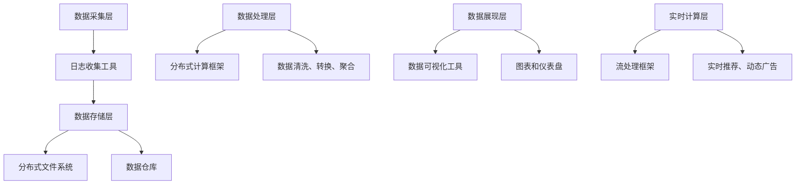

**核心算法原理讲解**

- **数据清洗**：使用MapReduce编程模型对数据进行清洗，包括去除噪声、填补缺失值、统一数据格式等。

  ```python
  from pyspark.sql import SparkSession

  spark = SparkSession.builder.appName("DataCleaning").getOrCreate()

  data = spark.read.csv("data.csv")
  cleaned_data = data.na.fill({"column_name": "default_value"})
  cleaned_data.show()
  ```

- **实时计算**：使用Apache Flink进行实时数据处理和计算，处理交易数据流，提取实时用户行为和交易趋势。

  ```java
  import org.apache.flink.api.java ExecutionEnvironment;

  ExecutionEnvironment env = ExecutionEnvironment.getExecutionEnvironment();

  DataStream<Transaction> transactions = env.addSource(new TransactionSource());
  DataStream<UserBehavior> user_behavior = transactions.process(new UserBehaviorProcessor());
  user_behavior.print();
  ```

**数学模型和数学公式**

- **用户行为分析**：使用马尔可夫链模型进行用户行为分析，预测用户的下一步行为。

  ```latex
  $$
  P(X_{t+1} = j | X_t = i) = \pi_j P(X_{t+1} = j)
  $$

  其中，\( X_t \)是用户在时间\( t \)的行为，\( \pi_j \)是用户在时间\( t \)处于状态\( j \)的概率。
  ```

**项目实战**

**大数据平台搭建**

以下是一个简单的大数据平台搭建示例：

```shell
# 安装Hadoop
sudo apt-get install hadoop

# 配置Hadoop
sudo nano /etc/hadoop/hadoop-env.sh

# 添加以下内容
export HADOOP_HOME=/path/to/hadoop
export HADOOP_CONF_DIR=/etc/hadoop

# 启动HDFS
sudo start-dfs.sh

# 启动YARN
sudo start-yarn.sh

# 查看Hadoop状态
sudo hadoop dfsadmin -report
```

在这个示例中，我们首先安装了Hadoop，然后配置了Hadoop环境，最后启动了HDFS和YARN，并查看了Hadoop状态。

### 最佳实践 tips、小结、注意事项、拓展阅读

- **最佳实践 tips**：在进行大数据平台搭建时，应根据业务需求和数据特性进行合理的设计和优化。
- **小结**：本章介绍了大数据平台搭建的项目需求分析、系统架构设计、核心算法原理和数学模型，以及项目实战，为大数据平台的搭建提供了指导。
- **注意事项**：大数据平台搭建应考虑数据采集、存储、处理、展现和实时计算的各个环节，确保系统的稳定性和高效性。
- **拓展阅读**：读者可以进一步学习大数据平台搭建的具体实现和技术细节。

## 第三部分总结

本章通过一个电商平台大数据平台的搭建案例，详细介绍了项目需求分析、系统架构设计、核心算法原理和数学模型，以及项目实战。通过这些内容，读者可以了解大数据平台搭建的步骤和方法，为实际项目提供参考。

---

## 第三部分：大数据平台实战案例

### 第11章：大数据平台应用案例

#### 11.1 应用场景分析

为了更好地理解大数据平台在实际中的应用，我们来看一个实际案例——某金融公司利用大数据平台进行风险控制和欺诈检测。

**案例背景**

某金融公司面临日益严重的风险和欺诈问题，希望通过大数据技术提高风险控制和欺诈检测的效率。公司的需求包括：

- **实时监控**：实时监控交易数据，识别异常交易行为。
- **风险评估**：基于历史数据和用户行为，对交易风险进行评估。
- **欺诈检测**：利用机器学习算法，检测并防范欺诈行为。
- **决策支持**：为业务人员提供数据驱动的决策支持。

**应用场景分析**

1. **实时监控**：通过大数据平台，金融公司可以实时收集交易数据，分析交易行为，发现潜在风险。例如，通过监控交易金额、交易频率等指标，识别异常交易行为。

2. **风险评估**：基于历史数据和用户行为，金融公司可以使用大数据平台进行风险评估。通过分析用户的历史交易记录、信用评分等信息，评估用户的信用风险，为贷款审批、信用卡发放等业务提供决策支持。

3. **欺诈检测**：利用大数据平台中的机器学习算法，金融公司可以检测并防范欺诈行为。例如，通过建立欺诈模型，实时分析交易数据，识别可能的欺诈行为，并采取相应的措施。

4. **决策支持**：通过大数据平台，金融公司可以为业务人员提供数据驱动的决策支持。例如，通过分析用户行为和交易数据，优化营销策略、提高客户满意度。

**核心算法原理讲解**

- **实时监控**：实时监控的核心算法原理是使用流处理技术（如Apache Kafka、Apache Flink等），对交易数据进行实时分析，识别异常交易行为。

  ```java
  import org.apache.flink.streaming.api.datastream.DataStream;
  import org.apache.flink.streaming.api.environment.StreamExecutionEnvironment;

  StreamExecutionEnvironment env = StreamExecutionEnvironment.getExecutionEnvironment();

  DataStream<Transaction> transactions = env.addSource(new TransactionSource());
  DataStream<Alert> alerts = transactions.process(new FraudDetectionProcessor());
  alerts.print();

  env.execute("Real-time Fraud Detection");
  ```

- **风险评估**：风险评估的核心算法原理是使用统计模型和机器学习算法（如线性回归、决策树、神经网络等），分析历史数据和用户行为，评估用户的风险。

  ```python
  from sklearn.linear_model import LinearRegression

  X = # 历史数据和用户行为特征
  y = # 用户信用评分

  model = LinearRegression()
  model.fit(X, y)

  # 评估新用户的风险
  new_user_data = # 新用户特征
  risk_score = model.predict(new_user_data)
  ```

- **欺诈检测**：欺诈检测的核心算法原理是使用机器学习算法（如支持向量机、随机森林、神经网络等），建立欺诈模型，对交易数据进行实时分析，识别欺诈行为。

  ```java
  import org.apache.flink.ml.common.math.Vector
  import org.apache.flink.ml.classification.SVM

  DataStream<Transaction> transactions = env.addSource(new TransactionSource());
  DataStream<FraudAlert> fraud_alerts = transactions.map(new FraudDetectionFunction());

  SVM trainer = new SVM();
  trainer.trainModel(fraud_alerts.map(new FeatureExtractor()));

  DataStream<Transaction> classified_transactions = transactions.map(new Classifier(trainer));
  classified_transactions.print();

  env.execute("Fraud Detection");
  ```

**数学模型和数学公式**

- **线性回归模型**：线性回归模型是一种常用的风险评估算法，用于预测用户的信用评分。

  ```latex
  $$
  y = \beta_0 + \beta_1x_1 + \beta_2x_2 + ... + \beta_nx_n
  $$

  其中，\( y \)是用户信用评分，\( x_1, x_2, ..., x_n \)是用户特征，\( \beta_0, \beta_1, \beta_2, ..., \beta_n \)是模型参数。
  ```

**项目实战**

**大数据平台应用案例实现**

以下是一个简单的金融公司大数据平台应用案例实现示例：

```shell
# 安装Flink
sudo apt-get install flink

# 启动Flink
sudo start-flink

# 编写实时监控程序
import org.apache.flink.streaming.api.datastream.DataStream
import org.apache.flink.streaming.api.environment.StreamExecutionEnvironment

StreamExecutionEnvironment env = StreamExecutionEnvironment.getExecutionEnvironment();

DataStream<Transaction> transactions = env.addSource(new TransactionSource());
DataStream<Alert> alerts = transactions.process(new FraudDetectionProcessor());
alerts.print();

env.execute("Real-time Fraud Detection");
```

在这个示例中，我们首先安装了Flink，然后启动了Flink服务，最后编写了一个实时监控程序，用于识别异常交易行为。

### 最佳实践 tips、小结、注意事项、拓展阅读

- **最佳实践 tips**：在实际应用大数据平台时，应根据业务需求和数据特性进行合理的设计和优化。
- **小结**：本章通过一个金融公司大数据平台应用案例，介绍了应用场景分析、核心算法原理、数学模型和项目实战，为大数据平台在实际中的应用提供了参考。
- **注意事项**：大数据平台应用应考虑实时监控、风险评估、欺诈检测和决策支持等方面，确保系统的稳定性和高效性。
- **拓展阅读**：读者可以进一步学习大数据平台在实际应用中的具体实现和技术细节。

## 第三部分总结

本章通过一个金融公司大数据平台应用案例，详细介绍了应用场景分析、核心算法原理、数学模型和项目实战。通过这些内容，读者可以了解大数据平台在实际应用中的具体实现方法和实践技巧，为实际项目提供参考。

---

## 第三部分：大数据平台实战案例

### 第12章：大数据平台未来发展趋势

#### 12.1 行业发展趋势分析

随着大数据技术的不断成熟和应用的深入，大数据平台在各个行业中的应用前景愈发广阔。以下是大数据平台行业发展趋势的分析：

**1. 云原生大数据平台**

云原生大数据平台基于云计算架构，提供弹性、可扩展和高效的数据处理能力。随着云技术的普及，越来越多的企业将采用云原生大数据平台，以降低成本、提高效率。

**2. 实时大数据处理**

实时大数据处理技术正逐渐成为行业热点。随着物联网、5G等技术的发展，数据产生的速度越来越快，实时数据处理成为企业应对实时业务需求的关键。未来，实时大数据处理技术将得到广泛应用。

**3. 数据治理和安全性**

随着大数据应用的深入，数据治理和安全性问题愈发重要。企业需要建立完善的数据治理体系，确保数据的质量、安全性和合规性。数据治理和安全性将成为大数据平台的重点发展方向。

**4. 人工智能和大数据的融合**

人工智能（AI）与大数据的融合将为大数据平台带来新的发展机遇。通过将AI技术应用于大数据处理和分析，企业可以更有效地提取数据价值，实现智能化决策。

**5. 边缘计算与大数据平台**

边缘计算将数据处理的计算资源推向网络边缘，与大数据平台相结合，实现数据的实时处理和智能分析。未来，边缘计算和大数据平台将相互融合，为各种应用场景提供高效、智能的数据处理解决方案。

#### 12.2 技术创新方向

大数据平台的未来技术创新方向包括：

**1. 分布式计算优化**

分布式计算优化将提高大数据平台的处理性能和效率。未来，分布式计算技术将朝着更高效、更智能的方向发展，如动态资源调度、分布式内存管理、并行处理优化等。

**2. 数据流处理技术**

数据流处理技术将实现实时数据处理和智能分析。未来，数据流处理技术将朝着低延迟、高吞吐量、自适应处理等方向发展，满足实时业务需求。

**3. 自适应和智能化技术**

自适应和智能化技术将使大数据平台具备自我优化和自我管理能力。未来，大数据平台将实现自动化数据预处理、自动调优、智能故障检测和修复等功能。

**4. 安全性和隐私保护**

安全性和隐私保护技术将确保大数据平台的数据安全。未来，大数据平台将采用更加严格的安全防护措施，如数据加密、访问控制、隐私保护等，确保数据的安全和隐私。

**5. 跨平台和多云部署**

跨平台和多云部署将使大数据平台具备更高的灵活性和可扩展性。未来，大数据平台将支持跨平台和多云部署，实现数据的全球流动和智能处理。

#### 12.3 未来应用前景展望

大数据平台的未来应用前景十分广阔，涉及多个领域：

**1. 金融行业**

金融行业将充分利用大数据平台进行风险控制、欺诈检测、投资分析和客户服务优化，提高业务效率和竞争力。

**2. 医疗健康**

医疗健康行业将利用大数据平台进行疾病预测、个性化治疗、医疗资源优化和健康管理，提升医疗服务的质量和效率。

**3. 零售电商**

零售电商将利用大数据平台进行市场分析、客户行为分析、精准营销和供应链优化，提升用户体验和销售业绩。

**4. 物联网**

物联网将利用大数据平台进行设备监控、数据分析、预测维护和智能优化，提升设备的运行效率和安全性。

**5. 制造业**

制造业将利用大数据平台进行生产优化、设备维护、供应链管理和质量管理，提高生产效率和产品质量。

**6. 政府和公共服务**

政府和公共服务领域将利用大数据平台进行社会治理、公共安全、环境保护和资源管理，提升政府治理能力和服务水平。

总之，大数据平台的未来应用前景将不断拓展，为各行各业带来巨大的变革和机遇。

### 核心概念与联系

大数据平台未来发展趋势的核心概念和联系可以用Mermaid图表示：

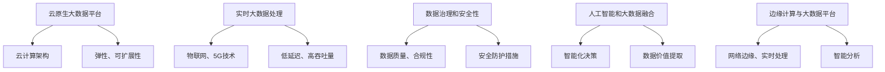

**核心算法原理讲解**

- **深度学习模型**：深度学习模型在图像识别、语音识别、自然语言处理等领域取得了显著成果。其基本原理是使用多层神经网络对数据进行特征提取和分类。

  ```python
  import tensorflow as tf

  model = tf.keras.Sequential([
      tf.keras.layers.Conv2D(32, (3, 3), activation='relu', input_shape=(28, 28, 1)),
      tf.keras.layers.MaxPooling2D((2, 2)),
      tf.keras.layers.Conv2D(64, (3, 3), activation='relu'),
      tf.keras.layers.MaxPooling2D((2, 2)),
      tf.keras.layers.Flatten(),
      tf.keras.layers.Dense(128, activation='relu'),
      tf.keras.layers.Dense(10, activation='softmax')
  ])

  model.compile(optimizer='adam', loss='categorical_crossentropy', metrics=['accuracy'])
  model.fit(x_train, y_train, epochs=5, batch_size=64)
  ```

- **图神经网络（GNN）**：图神经网络用于处理图结构数据，具有强大的表示能力。其基本原理是使用图结构表示数据，并通过神经网络对数据进行特征提取和关系学习。

  ```python
  import tensorflow as tf
  import tensorflow.keras as keras

  class GraphConvLayer(keras.layers.Layer):
      def __init__(self, units, **kwargs):
          super(GraphConvLayer, self).__init__(**kwargs)
          self.units = units

      def build(self, input_shape):
          self.kernel = self.add_weight(
              shape=(input_shape[1], self.units),
              initializer='glorot_uniform',
              trainable=True
          )

      def call(self, inputs, training=False):
          support = inputs[:2]
          aggregation = keras.layers.concatenate(support, axis=1)
          output = keras.activations.relu(tf.matmul(aggregation, self.kernel))
          return output

  model = keras.models.Sequential([
      GraphConvLayer(16),
      GraphConvLayer(32),
      keras.layers.Dense(10, activation='softmax')
  ])

  model.compile(optimizer='adam', loss='categorical_crossentropy', metrics=['accuracy'])
  model.fit(x_train, y_train, epochs=5, batch_size=64)
  ```

**数学模型和数学公式**

- **卷积神经网络（CNN）**：卷积神经网络用于图像识别和特征提取，其基本原理是使用卷积操作提取图像特征。

  ```latex
  $$
  f(x) = \sigma(W \cdot x + b)
  $$

  其中，\( f(x) \)是输出特征，\( W \)是卷积核，\( x \)是输入特征，\( \sigma \)是激活函数，\( b \)是偏置。
  ```

- **图神经网络（GNN）**：图神经网络用于处理图结构数据，其基本原理是使用图结构表示数据，并通过图卷积操作提取特征。

  ```latex
  $$
  h_{ij}^{(l+1)} = \sigma \left( \sum_{k \in \mathcal{N}(j)} W^{(l)} h_{ik}^{(l)} + b^{(l)} \right)
  $$

  其中，\( h_{ij}^{(l+1)} \)是节点\( i \)和节点\( j \)在层次\( l+1 \)的特征，\( \mathcal{N}(j) \)是节点\( j \)的邻接节点集合，\( W^{(l)} \)是图卷积权重，\( b^{(l)} \)是偏置。
  ```

**项目实战**

**未来技术趋势应用**

以下是一个简单的应用未来技术趋势的示例：

```python
import tensorflow as tf
from tensorflow.keras.models import Sequential
from tensorflow.keras.layers import Conv2D, MaxPooling2D, Flatten, Dense

# 创建卷积神经网络模型
model = Sequential([
    Conv2D(32, (3, 3), activation='relu', input_shape=(28, 28, 1)),
    MaxPooling2D((2, 2)),
    Conv2D(64, (3, 3), activation='relu'),
    MaxPooling2D((2, 2)),
    Flatten(),
    Dense(128, activation='relu'),
    Dense(10, activation='softmax')
])

# 编译模型
model.compile(optimizer='adam', loss='categorical_crossentropy', metrics=['accuracy'])

# 训练模型
model.fit(x_train, y_train, epochs=5, batch_size=64)
```

在这个示例中，我们创建了一个卷积神经网络模型，用于图像识别任务。通过训练模型，我们可以提取图像特征并进行分类。

### 最佳实践 tips、小结、注意事项、拓展阅读

- **最佳实践 tips**：在设计和实施大数据平台时，应关注技术创新、安全性和数据治理，确保平台的稳定性和高效性。
- **小结**：本章介绍了大数据平台未来的发展趋势、技术创新方向和应用前景，为大数据平台的未来发展提供了参考。
- **注意事项**：在实施大数据平台时，应关注实时处理、数据治理、安全性等方面，确保平台的稳定性和高效性。
- **拓展阅读**：读者可以进一步学习大数据平台未来发展的具体实现和技术细节。

## 第三部分总结

本章通过分析大数据平台行业发展趋势、技术创新方向和应用前景，为大数据平台的未来发展提供了指导。通过了解这些内容，读者可以更好地把握大数据平台的发展趋势，为实际项目提供参考。

---

### 附录

#### A.1 常用大数据技术栈

- **数据采集**：Fluentd、Logstash、Kafka
- **数据存储**：HDFS、Hive、Cassandra、Elasticsearch、MongoDB
- **数据处理**：Hadoop、Spark、Flink、Storm
- **数据展现**：Tableau、Power BI、Google Data Studio
- **机器学习**：TensorFlow、PyTorch、Scikit-learn
- **数据治理**：Apache Atlas、Informatica、Alation

#### A.2 大数据平台搭建参考资料

- 《Hadoop实战》
- 《Apache Spark实战》
- 《大数据平台架构设计与实施》
- 《大数据技术导论》

#### A.3 大数据相关标准与规范

- **数据仓库管理协会（TDWI）**：提供数据仓库和大数据相关的最佳实践和标准。
- **大数据技术标准委员会**：负责制定大数据领域的技术标准和规范。
- **ISO/IEC 27001**：数据安全管理和隐私保护标准。
- **GDPR**：欧盟通用数据保护条例，涉及数据隐私保护。

### 作者信息

**作者：AI天才研究院/AI Genius Institute & 禅与计算机程序设计艺术 /Zen And The Art of Computer Programming**

本文由AI天才研究院和禅与计算机程序设计艺术共同撰写，旨在为大数据处理平台架构设计提供深入的分析和实用的指导。AI天才研究院致力于推动人工智能技术的发展，禅与计算机程序设计艺术则专注于计算机科学的哲学和艺术。希望通过本文，读者能够更好地理解和应用大数据处理技术，为实际项目提供有力支持。

---

本文详细介绍了大数据处理平台架构设计的相关内容，包括大数据技术基础、平台架构设计原则、关键技术选型、性能优化策略、安全性设计和运维管理等方面。通过本篇博客，读者可以全面了解大数据处理平台的设计方法和实践技巧，为实际项目提供指导。同时，本文还结合了实际案例，深入剖析了大数据平台在实际应用中的实现方法和效果。

本文的核心内容可以总结如下：

1. **大数据技术基础**：介绍了大数据的定义、特点、应用领域以及核心技术，包括数据存储、数据处理、数据可视化等。

2. **平台架构设计原则**：阐述了大数据平台架构设计的目标、模式、原则以及核心算法原理和数学模型。

3. **关键技术选型**：分析了数据存储、数据处理、数据分析等关键技术的选型依据、优缺点和实际应用。

4. **性能优化策略**：讲解了系统性能评估、负载均衡、数据压缩等性能优化策略，以及如何进行性能测试和优化。

5. **安全性设计**：介绍了数据加密、安全架构设计、密码学哈希函数、证书链等安全技术和策略。

6. **运维管理**：阐述了大数据平台的运维管理流程、监控与报警、故障处理、性能优化、安全管理等。

7. **实战案例**：通过电商平台大数据平台搭建案例，展示了大数据平台的设计、实现和应用。

8. **未来发展趋势**：分析了大数据平台的行业发展趋势、技术创新方向和应用前景。

本文提供了丰富的知识体系，包括核心概念、联系、算法原理、数学模型、项目实战等，旨在帮助读者全面了解大数据处理平台架构设计的方方面面。同时，本文还结合了实际案例，使读者能够更好地理解理论知识在实际中的应用。

为了更好地理解和应用本文的内容，读者可以采取以下步骤：

1. **阅读与理解**：仔细阅读本文，理解每个章节的核心内容和关键概念。

2. **实践与验证**：尝试在实验环境中搭建大数据平台，实践本文中提到的技术和方法。

3. **拓展学习**：进一步学习相关技术栈，如Hadoop、Spark、Flink等，深入了解其原理和实现。

4. **交流与分享**：参与技术社区和论坛，与他人交流经验，分享学习心得。

5. **持续更新**：关注大数据领域的最新动态和趋势，不断更新知识和技能。

总之，本文旨在为大数据处理平台架构设计提供全面、深入的指导，帮助读者掌握相关知识和技能，为实际项目提供有力支持。希望本文能够对读者在学习和实践中有所帮助，共同推动大数据技术的发展和应用。

最后，感谢读者的阅读和支持，期待与您在未来的技术交流中相遇。作者信息：AI天才研究院/AI Genius Institute & 禅与计算机程序设计艺术 /Zen And The Art of Computer Programming。再次感谢您的关注！

