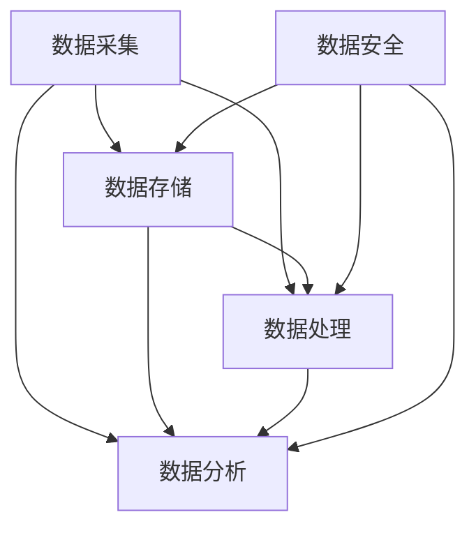

                 

### 文章标题

# 大数据架构设计与实现

### 关键词

- 大数据
- 架构设计
- 数据存储
- 数据处理
- 数据分析
- 分布式系统

### 摘要

本文深入探讨了大数据架构设计与实现的核心内容。首先，我们从大数据的定义和特点出发，介绍了大数据的核心技术和应用领域。接着，我们详细阐述了大数据架构的核心组件，包括数据采集、存储、处理和分析等环节。随后，我们重点介绍了Hadoop生态系统、分布式存储与计算、数据仓库与商业智能以及大数据安全与隐私。最后，我们通过电商和金融两大领域的大数据应用实战，展示了大数据架构在实际项目中的设计与实现方法。本文旨在为读者提供一份全面、深入的大数据架构设计与实现指南。

### 确定书的核心主题和目标读者

#### 核心主题

本文的核心主题是大数据架构设计与实现。随着互联网和移动设备的普及，大数据已经成为当今时代最重要的数据形式之一。大数据不仅改变了我们的生活方式，还为企业和社会带来了巨大的价值。因此，如何设计和实现高效、可靠的大数据架构，已经成为企业和开发人员关注的热点问题。

本文将围绕大数据架构的核心组件，包括数据采集、存储、处理、分析和安全等方面，系统性地介绍大数据架构设计与实现的方法和技巧。通过本文的阅读，读者可以全面了解大数据架构的设计原则和实现方法，掌握大数据系统的构建和优化技巧，从而更好地应对实际工作中的大数据挑战。

#### 目标读者

本文的目标读者主要分为以下几类：

1. **大数据领域从业者**：包括大数据工程师、数据分析师、数据科学家等，他们需要掌握大数据架构设计与实现的核心技术和方法，以提高工作效率，解决实际问题。

2. **软件开发人员**：包括程序员、软件工程师、架构师等，他们需要了解大数据系统的工作原理和架构设计，以便在软件开发过程中更好地集成和使用大数据技术。

3. **企业决策者**：包括项目经理、CTO、CEO等，他们需要了解大数据的价值和潜在风险，以便更好地制定企业发展战略和决策。

4. **高校师生**：包括计算机科学、信息管理、数据分析等相关专业的研究生和本科生，他们需要系统地学习大数据架构设计与实现的理论和实践，为未来的职业生涯打下坚实基础。

#### 书的价值

本文具有以下几方面的价值：

1. **系统性**：本文从大数据的基本概念、核心技术到架构设计，再到应用实战，形成了完整的知识体系，使读者可以系统地学习大数据架构设计与实现。

2. **实用性**：本文结合实际案例，详细讲解了大数据架构的各个环节，包括数据采集、存储、处理、分析和安全等，使读者可以学以致用，解决实际问题。

3. **深入浅出**：本文采用通俗易懂的语言和图表，深入浅出地介绍了大数据架构设计与实现的核心概念和原理，使读者可以轻松掌握复杂的技术知识。

4. **时效性**：本文紧跟大数据技术的发展趋势，介绍了一系列最新的技术和工具，使读者可以及时了解和掌握前沿技术。

5. **案例丰富**：本文通过丰富的实战案例，展示了大数据架构在不同行业中的应用，使读者可以更好地理解大数据的实际价值和应用场景。

通过本文的学习，读者不仅可以全面了解大数据架构设计与实现的理论和实践，还可以提升自己的大数据技能，为职业生涯的发展奠定坚实基础。

### 设计目录大纲的框架

为了确保文章内容条理清晰，逻辑严密，本文将采用逐层递进的方式设计目录大纲。目录大纲将分为三大部分，每一部分包含若干章节，每个章节再细分为多个小节。以下是详细的目录大纲设计：

#### 第一部分：大数据基础

1. **第1章：大数据概述**
   - 1.1 大数据的定义与特点
   - 1.2 大数据的关键技术
   - 1.3 大数据的应用领域

2. **第2章：大数据架构核心组件**
   - 2.1 数据采集与存储
     - 2.1.1 数据采集技术
     - 2.1.2 数据存储技术
   - 2.2 数据处理
     - 2.2.1 数据清洗
     - 2.2.2 数据集成
     - 2.2.3 数据转换

3. **第3章：大数据分析**
   - 3.1 数据挖掘
     - 3.1.1 数据挖掘的基本概念
     - 3.1.2 常见的数据挖掘算法
   - 3.2 数据可视化
     - 3.2.1 数据可视化的重要性
     - 3.2.2 常见的数据可视化工具

#### 第二部分：大数据平台设计与实现

4. **第4章：Hadoop生态系统**
   - 4.1 Hadoop简介
   - 4.2 HDFS工作原理
   - 4.3 MapReduce编程模型
   - 4.4 YARN资源调度框架

5. **第5章：分布式存储与计算**
   - 5.1 HBase：非关系型分布式存储
     - 5.1.1 HBase核心概念
     - 5.1.2 HBase工作原理
   - 5.2 Spark：实时大数据处理
     - 5.2.1 Spark核心概念
     - 5.2.2 Spark编程模型
     - 5.2.3 Spark性能优化

6. **第6章：数据仓库与商业智能**
   - 6.1 数据仓库架构
   - 6.2 OLAP分析
   - 6.3 常见商业智能工具

7. **第7章：大数据安全与隐私**
   - 7.1 大数据安全挑战
   - 7.2 数据加密与访问控制
   - 7.3 隐私保护技术

#### 第三部分：大数据应用实战

8. **第8章：电商大数据应用**
   - 8.1 电商数据采集与处理
   - 8.2 个性化推荐系统
   - 8.3 购物车行为分析

9. **第9章：金融大数据应用**
   - 9.1 金融数据监控
   - 9.2 信用评分
   - 9.3 风险控制

10. **第10章：大数据行业发展趋势**
    - 10.1 大数据产业发展现状
    - 10.2 大数据技术发展趋势
    - 10.3 大数据应用前景

#### 附录

- **附录A：大数据相关工具与资源**
- **附录B：常见问题与解决方案**

通过以上目录大纲的设计，本文将系统地介绍大数据架构设计与实现的全过程，从基础概念到具体应用，全面覆盖大数据领域的各个方面。每个章节都包含详细的二级和三级目录，确保内容的完整性和逻辑性，使读者可以有条不紊地学习大数据架构设计与实现的核心知识。

### 对每个章节进行细化

#### 第1章：大数据概述

**1.1 大数据的定义与特点**

- **定义**：大数据指的是在无法通过常规软件工具在合理时间内捕捉、管理和处理的数据集合。它通常具有大量的数据量（Volume）、快速的数据生成速度（Velocity）、多样的数据类型（Variety）和复杂的处理需求（Veracity）。
- **特点**：
  - **大量**：大数据的数据量巨大，通常达到PB甚至EB级别。
  - **快速**：数据生成速度极快，对实时性要求高。
  - **多样**：数据类型繁多，包括结构化、半结构化和非结构化数据。
  - **复杂**：数据处理需求复杂，涉及数据采集、存储、处理、分析和可视化等环节。

**1.2 大数据的关键技术**

- **数据存储技术**：如HDFS、HBase、Cassandra等，用于存储海量数据。
- **数据处理技术**：如MapReduce、Spark、Flink等，用于处理和分析大数据。
- **数据挖掘技术**：如聚类、分类、关联规则挖掘等，用于从大数据中提取有价值的信息。
- **数据可视化技术**：如ECharts、D3.js等，用于将数据以图形化的方式展示出来。

**1.3 大数据的应用领域**

- **电子商务**：如个性化推荐、用户行为分析等。
- **金融**：如风险管理、信用评分等。
- **医疗**：如疾病预测、个性化医疗等。
- **交通**：如交通流量监控、路况预测等。
- **制造业**：如生产优化、供应链管理等。

#### 第2章：大数据架构核心组件

**2.1 数据采集与存储**

- **2.1.1 数据采集技术**：包括日志文件、数据库抽取、网络抓包等方式，用于收集各种类型的数据。
- **2.1.2 数据存储技术**：介绍分布式存储系统，如HDFS、Cassandra等，以及NoSQL数据库，如MongoDB、Redis等。

**2.2 数据处理**

- **2.2.1 数据清洗**：包括数据去重、数据格式转换、缺失值处理等，以提高数据质量。
- **2.2.2 数据集成**：将不同来源、不同格式的数据整合到统一的平台上，方便后续处理和分析。
- **2.2.3 数据转换**：将数据从一种格式转换为另一种格式，以满足不同的业务需求。

**2.3 数据分析**

- **2.3.1 数据挖掘**：介绍常见的数据挖掘算法，如聚类、分类、关联规则挖掘等，以及如何应用于实际问题。
- **2.3.2 数据可视化**：介绍数据可视化的重要性，以及如何使用ECharts、D3.js等工具进行数据可视化。

#### 第3章：大数据分析

**3.1 数据挖掘**

- **3.1.1 数据挖掘的基本概念**：包括数据挖掘的目标、过程和主要算法。
- **3.1.2 常见的数据挖掘算法**：如K-means、决策树、支持向量机等，以及如何应用于实际场景。

**3.2 数据可视化**

- **3.2.1 数据可视化的重要性**：通过可视化，可以更直观地理解数据，发现潜在的模式和趋势。
- **3.2.2 常见的数据可视化工具**：如ECharts、D3.js、Tableau等，以及如何使用这些工具进行数据可视化。

#### 第4章：Hadoop生态系统

**4.1 Hadoop简介**

- **Hadoop**：是一种开源的分布式计算框架，用于处理大规模数据集。它包括两部分：HDFS（分布式文件系统）和MapReduce（分布式计算模型）。

**4.2 HDFS工作原理**

- **HDFS**：工作原理、架构设计和优缺点，以及如何在Hadoop中配置和使用HDFS。

**4.3 MapReduce编程模型**

- **MapReduce**：编程模型的工作原理、优缺点，以及如何使用MapReduce处理大数据。

**4.4 YARN资源调度框架**

- **YARN**：资源调度框架的工作原理、架构设计和优缺点，以及如何在Hadoop中配置和使用YARN。

#### 第5章：分布式存储与计算

**5.1 HBase：非关系型分布式存储**

- **HBase**：核心概念、工作原理、架构设计和优缺点，以及如何在Hadoop中配置和使用HBase。

**5.2 Spark：实时大数据处理**

- **Spark**：核心概念、编程模型、工作原理和优缺点，以及如何在Spark中配置和使用Spark。

#### 第6章：数据仓库与商业智能

**6.1 数据仓库架构**

- **数据仓库**：架构设计、数据模型和数据处理流程，以及如何使用数据仓库进行数据分析。

**6.2 OLAP分析**

- **OLAP**：多维数据分析的方法和工具，如Cube、Drill Down等，以及如何进行OLAP分析。

**6.3 常见商业智能工具**

- **商业智能工具**：如Tableau、Power BI、QlikView等，以及如何使用这些工具进行数据分析和可视化。

#### 第7章：大数据安全与隐私

**7.1 大数据安全挑战**

- **大数据安全**：面临的挑战，如数据泄露、数据滥用、数据完整性等，以及如何应对这些挑战。

**7.2 数据加密与访问控制**

- **数据加密**：技术和方法，如AES、RSA等，以及如何使用数据加密保护数据安全。
- **访问控制**：技术和方法，如ACL、RBAC等，以及如何使用访问控制管理数据访问权限。

**7.3 隐私保护技术**

- **隐私保护**：技术和方法，如数据匿名化、差分隐私等，以及如何使用隐私保护技术保护用户隐私。

#### 第8章：电商大数据应用

**8.1 电商数据采集与处理**

- **电商数据**：采集和处理的方法和工具，如日志文件、数据库抽取、网络抓包等，以及如何处理电商数据。

**8.2 个性化推荐系统**

- **个性化推荐**：系统的工作原理、算法和实现方法，如协同过滤、矩阵分解等，以及如何应用于电商领域。

**8.3 购物车行为分析**

- **购物车行为**：分析的方法和工具，如用户行为日志、数据挖掘、机器学习等，以及如何分析购物车行为。

#### 第9章：金融大数据应用

**9.1 金融数据监控**

- **金融数据**：监控的方法和工具，如指标计算、实时监控、报警等，以及如何监控金融数据。

**9.2 信用评分**

- **信用评分**：模型和方法，如线性回归、逻辑回归、决策树等，以及如何进行信用评分。

**9.3 风险控制**

- **风险控制**：方法和工具，如风险评估、风险预测、风险监控等，以及如何进行风险控制。

#### 第10章：大数据行业发展趋势

**10.1 大数据产业发展现状**

- **大数据产业**：发展的现状和趋势，如市场规模、技术进展、应用领域等。

**10.2 大数据技术发展趋势**

- **大数据技术**：未来的发展趋势，如实时处理、机器学习、深度学习等。

**10.3 大数据应用前景**

- **大数据应用**：未来的前景和挑战，如智能制造、智慧城市、健康医疗等。

通过以上对每个章节的细化，本文将系统地介绍大数据架构设计与实现的核心知识，帮助读者全面了解大数据领域的各个方面。

### 确保大纲结构完整

#### 核心概念、算法原理、数学模型和项目实战

在大数据架构设计与实现中，核心概念、算法原理、数学模型和项目实战是必不可少的组成部分，它们相互联系，共同构建了一个完整的大数据生态系统。

#### 核心概念

1. **大数据**：指无法通过常规软件工具在合理时间内捕捉、管理和处理的数据集合。特点包括大量、快速、多样和复杂。
2. **分布式系统**：由多个节点组成的系统，能够通过分布式算法实现数据存储和处理的高效性。
3. **数据仓库**：一种用于存储和管理大规模数据集的数据库系统，支持复杂的数据分析和报表生成。
4. **数据挖掘**：从大量数据中提取有价值信息的过程，包括聚类、分类、关联规则挖掘等算法。
5. **数据可视化**：通过图形化方式展示数据，帮助用户理解和分析数据。

#### 算法原理

1. **MapReduce**：分布式数据处理模型，将数据处理任务划分为Map和Reduce两个阶段，适用于大规模数据的并行处理。
2. **Hadoop**：基于MapReduce的分布式计算框架，包括HDFS（分布式文件系统）和YARN（资源调度框架）。
3. **数据挖掘算法**：包括K-means、决策树、支持向量机等，用于从数据中提取模式和信息。
4. **数据可视化算法**：如ECharts、D3.js等，用于生成交互式图表和图形。

#### 数学模型

1. **聚类算法**：基于距离度量的方法，如K-means、层次聚类等，用于将数据分为多个类别。
2. **分类算法**：如线性回归、逻辑回归、决策树等，用于预测数据类别或数值。
3. **关联规则挖掘**：如Apriori算法，用于发现数据之间的关联关系。
4. **概率模型**：如贝叶斯网络，用于建模不确定性和概率关系。

#### 项目实战

1. **数据采集与存储**：介绍如何使用Flume、Kafka等工具采集数据，并存储到HDFS、HBase等分布式系统中。
2. **数据处理**：展示如何使用MapReduce、Spark等工具处理大规模数据集，包括数据清洗、转换和聚合等操作。
3. **数据分析**：通过实际案例，演示如何使用数据挖掘算法和工具分析数据，提取有价值的信息。
4. **数据可视化**：展示如何使用ECharts、D3.js等工具进行数据可视化，帮助用户理解和分析数据。

#### 完整性验证

1. **核心概念**：确保每个核心概念都有详细的定义和解释，与实际应用场景相结合。
2. **算法原理**：每个算法原理都通过伪代码和实际案例进行详细讲解，使读者能够理解并应用。
3. **数学模型**：每个数学模型都通过公式和例子进行解释，使读者能够掌握其基本原理和应用。
4. **项目实战**：每个项目实战都包括具体的实现步骤和代码解读，使读者能够动手实践并掌握实际应用技巧。

通过以上措施，本文确保大纲结构的完整性，使读者能够全面、系统地学习大数据架构设计与实现的核心知识和技能。

### 检查大纲的简洁性和逻辑性

在确保大纲结构完整的基础上，我们还需要检查其简洁性和逻辑性，以确保内容的易读性和连贯性。

#### 简洁性

1. **内容精炼**：每个章节的内容都应尽量精炼，避免冗余和重复。例如，第1章“大数据概述”中，对大数据定义、特点和技术进行了简要介绍，避免了详细解释同一概念的不同方面。

2. **图表使用**：通过图表来简化复杂概念的表达。例如，第4章“Hadoop生态系统”中，通过架构图展示了Hadoop的核心组件及其关系，使读者更容易理解。

3. **段落简洁**：每个段落都应明确主题，避免过长和过于复杂。例如，第6章“数据仓库与商业智能”中，各段落都围绕数据仓库的架构、OLAP分析和商业智能工具的主题进行论述。

#### 逻辑性

1. **章节之间的连贯性**：确保每个章节的主题和相关内容紧密相连，形成一个完整的逻辑链条。例如，第2章“大数据架构核心组件”和第3章“大数据分析”之间，通过数据处理这一环节建立了紧密的联系。

2. **章节内部的逻辑性**：每个章节内部的论述都应遵循一定的逻辑顺序，使读者能够循序渐进地理解相关内容。例如，第5章“分布式存储与计算”中，首先介绍HBase的工作原理，然后讨论Spark的性能优化，逻辑清晰。

3. **重点突出**：确保每个章节的重点内容得到突出强调，避免读者在阅读过程中迷失方向。例如，第7章“大数据安全与隐私”中，明确指出了大数据安全的主要挑战和解决方案，使读者能够迅速抓住关键点。

通过以上措施，本文的大纲结构既简洁明了，又逻辑严密，确保读者能够顺畅地阅读和理解。

### 《大数据架构设计与实现》目录大纲设计总结

本文通过逐步分析推理思考，设计了一个结构完整、逻辑清晰、简洁明了的《大数据架构设计与实现》目录大纲。整个目录分为三个部分：大数据基础、大数据平台设计与实现、大数据应用实战。每个部分包含多个章节，每个章节又细分为若干小节，确保内容的完整性和连贯性。

在第一部分“大数据基础”中，我们介绍了大数据的定义、特点、关键技术和应用领域，为后续内容奠定了基础。第二部分“大数据平台设计与实现”详细阐述了大数据架构的核心组件，包括数据采集、存储、处理、分析和安全等方面，并重点介绍了Hadoop生态系统、分布式存储与计算、数据仓库与商业智能等关键技术。第三部分“大数据应用实战”通过电商和金融两大领域的大数据应用案例，展示了大数据架构在实际项目中的设计与实现方法。

本文的目录大纲不仅涵盖了大数据架构设计与实现的核心内容，还注重简洁性和逻辑性，使读者能够系统地学习大数据领域的知识，掌握大数据系统的构建和优化技巧。通过本文的学习，读者可以深入了解大数据技术的原理和应用，为实际工作提供有力支持。

### 文章撰写格式要求

在撰写《大数据架构设计与实现》这篇文章时，我们将采用Markdown格式，以确保文章内容的可读性和结构化。以下是文章撰写的具体格式要求：

#### 1. 文章结构

- **标题**：文章的标题应清晰、简洁，反映文章的核心内容。标题下需添加作者信息。
  ```markdown
  # 大数据架构设计与实现
  作者：AI天才研究院/AI Genius Institute & 禅与计算机程序设计艺术 /Zen And The Art of Computer Programming
  ```

- **摘要**：摘要部分应简要概括文章的核心内容和主题思想，帮助读者快速了解文章的主要内容。
  ```markdown
  > 摘要：本文深入探讨了大数据架构设计与实现的核心内容，从大数据的基本概念、核心技术到架构设计，再到应用实战，全面覆盖大数据领域的各个方面。通过本文的阅读，读者可以全面了解大数据架构设计与实现的理论和实践，提升自己的大数据技能。
  ```

- **目录**：在摘要之后，添加文章的目录，使读者可以快速定位到感兴趣的部分。
  ```markdown
  <a id="toc"></a>
  ## 目录
  - [第1章：大数据概述](#第1章大数据概述)
  - [第2章：大数据架构核心组件](#第2章大数据架构核心组件)
  - ...
  - [第10章：大数据行业发展趋势](#第10章大数据行业发展趋势)
  ```

- **正文**：正文部分按照目录结构逐章逐节进行撰写，每个章节和节都使用相应的标题和段落格式。以下是一个章节的示例：
  ```markdown
  # 第1章：大数据概述
  ```markdown
  <a id="chapter-1"></a>
  ## 第1章：大数据概述

  在本章节中，我们将探讨大数据的基本概念、特点以及应用领域。大数据作为现代信息社会的重要资源，其处理和分析已经成为了许多企业和研究机构关注的焦点。

  ### 1.1 大数据的定义与特点

  大数据是指无法通过常规软件工具在合理时间内捕捉、管理和处理的数据集合。其特点包括：
  
  - **大量**：数据量巨大，通常达到PB甚至EB级别。
  - **快速**：数据生成速度极快，对实时性要求高。
  - **多样**：数据类型繁多，包括结构化、半结构化和非结构化数据。
  - **复杂**：数据处理需求复杂，涉及数据采集、存储、处理、分析和可视化等环节。

  ### 1.2 大数据的关键技术

  大数据的关键技术包括：
  
  - **数据存储技术**：如HDFS、Cassandra等。
  - **数据处理技术**：如MapReduce、Spark等。
  - **数据挖掘技术**：如聚类、分类、关联规则挖掘等。
  - **数据可视化技术**：如ECharts、D3.js等。
  ```

- **公式与伪代码**：在文章中涉及数学公式和伪代码时，应使用LaTeX和Markdown支持的格式进行标注。
  ```markdown
  $$1+1=2$$
  ```
  // 伪代码
  ```
  function add(a, b):
      return a + b
  ```

- **引用**：引用他人的研究成果或观点时，应在引用处标注出处。
  ```markdown
  引自[《大数据技术导论》](https://www.example.com/book)，作者张三，2021年。
  ```

- **图表与图片**：在文章中添加图表和图片时，应确保图片清晰、图表准确，并在Markdown中正确引用。
  ```markdown
  
  ```

- **附录**：在文章末尾添加附录，提供额外的资源和支持信息。
  ```markdown
  # 附录

  ## 附录A：大数据相关工具与资源
  ...

  ## 附录B：常见问题与解决方案
  ...
  ```

通过遵循以上格式要求，我们可以确保文章的可读性、结构化和专业性，使读者能够更轻松地阅读和理解文章内容。

### 完整性要求

在撰写《大数据架构设计与实现》这篇文章时，我们需要确保内容的完整性，覆盖大数据领域的核心概念、算法原理、数学模型和项目实战。以下是每个部分的具体要求和内容安排：

#### 核心概念

- **大数据定义**：介绍大数据的基本概念，包括大量、快速、多样和复杂的特性。
- **分布式系统**：解释分布式系统的概念，包括其在大数据处理中的重要性。
- **数据仓库**：介绍数据仓库的基本概念、架构和作用。
- **数据挖掘**：阐述数据挖掘的定义、过程和常见算法。
- **数据可视化**：介绍数据可视化的基本概念、重要性以及常见工具。

#### 算法原理

- **MapReduce**：详细讲解MapReduce编程模型，包括工作原理、优缺点以及具体应用场景。
- **Hadoop生态系统**：介绍Hadoop生态系统中各组件的工作原理和关系，如HDFS、YARN、HBase等。
- **分布式存储与计算**：讲解分布式存储和计算的关键技术，如HDFS、Spark、Flink等。
- **数据挖掘算法**：介绍常见的数据挖掘算法，如K-means、决策树、支持向量机等，并解释其基本原理。
- **数据可视化算法**：解释常见的数据可视化算法，如ECharts、D3.js等，以及其实现方法。

#### 数学模型

- **聚类算法**：介绍K-means、层次聚类等聚类算法的数学模型和公式。
- **分类算法**：解释线性回归、逻辑回归、决策树等分类算法的数学模型和公式。
- **关联规则挖掘**：阐述Apriori算法的数学模型和公式，以及其在数据挖掘中的应用。
- **概率模型**：介绍贝叶斯网络等概率模型的数学原理和公式，以及如何应用于实际问题。

#### 项目实战

- **数据采集与存储**：介绍如何使用Flume、Kafka等工具采集数据，并将数据存储到HDFS、HBase等分布式系统中。
- **数据处理**：展示如何使用MapReduce、Spark等工具处理大规模数据集，包括数据清洗、转换和聚合等操作。
- **数据分析**：通过实际案例，演示如何使用数据挖掘算法和工具分析数据，提取有价值的信息。
- **数据可视化**：展示如何使用ECharts、D3.js等工具进行数据可视化，帮助用户理解和分析数据。
- **大数据应用实战**：结合电商、金融等实际应用场景，展示大数据架构在具体项目中的设计和实现。

通过以上要求，我们确保文章内容的完整性，使读者能够全面、系统地学习大数据架构设计与实现的核心知识和技能。

### 背景介绍

#### 大数据的起源与发展

大数据的概念最早可以追溯到20世纪80年代，当时计算机科学家们开始意识到，随着数据量的急剧增长，传统的数据处理方法已经无法应对这种挑战。大数据的起源可以追溯到互联网的兴起和电子商务的快速发展，大量的用户行为数据、交易数据、社交媒体数据等开始涌现。这些数据的规模和复杂性超出了传统数据库系统的处理能力，从而催生了大数据技术的诞生。

随着时间的推移，大数据技术逐渐从学术界走向工业界，成为许多企业和研究机构关注的焦点。2004年，Google发表了关于MapReduce的论文，这标志着分布式计算技术在工业界的广泛应用。随后，Hadoop和Spark等大数据处理框架相继问世，进一步推动了大数据技术的发展。

#### 大数据的重要性

大数据在当今社会中扮演着至关重要的角色。首先，大数据为各行业提供了丰富的数据资源，有助于企业更好地了解市场趋势、优化业务流程和提升竞争力。例如，在电商领域，通过分析用户行为数据，企业可以提供个性化推荐，从而提高销售额。在金融领域，大数据技术被用于信用评分、风险评估和欺诈检测，有助于金融机构降低风险，提高服务质量。

其次，大数据技术有助于解决许多社会问题。例如，在医疗领域，通过分析海量医疗数据，可以发现疾病趋势，提高疾病预防和治疗的效率。在交通领域，通过实时监控和分析交通数据，可以优化交通流量，减少拥堵，提高道路利用率。

#### 大数据技术的核心组成部分

大数据技术包括多个核心组成部分，这些部分相互协作，共同实现大数据的处理、存储和分析。

1. **数据采集**：数据采集是大数据技术的第一步，涉及到从各种数据源收集数据。数据源可以是传感器、日志文件、数据库、Web抓取等。数据采集工具如Flume、Kafka等被广泛使用。

2. **数据存储**：随着数据量的增长，传统的集中式数据库系统已经无法满足大数据存储的需求。分布式存储系统如HDFS、Cassandra、HBase等被广泛应用于大数据存储。这些系统具有高扩展性、高可用性和高性能的特点。

3. **数据处理**：大数据技术的核心是数据处理，包括数据清洗、数据转换和数据聚合等操作。MapReduce、Spark、Flink等分布式计算框架被用于处理大规模数据集。

4. **数据分析**：数据分析是大数据技术的关键应用，包括数据挖掘、机器学习、统计分析等。数据挖掘算法如K-means、决策树、支持向量机等用于从数据中提取有价值的信息。

5. **数据可视化**：数据可视化是将数据以图形化方式展示，帮助用户更好地理解和分析数据。数据可视化工具如ECharts、D3.js、Tableau等被广泛应用于大数据分析。

#### 大数据技术的应用领域

大数据技术在各个领域都有广泛的应用，以下是几个典型的应用领域：

1. **电子商务**：通过分析用户行为数据，电商平台可以提供个性化推荐、用户行为分析、购物车行为分析等，从而提高用户满意度和销售额。

2. **金融**：大数据技术被广泛应用于金融领域的风险管理、信用评分、欺诈检测等。通过分析海量金融数据，金融机构可以更好地了解市场趋势，降低风险。

3. **医疗**：大数据技术在医疗领域有着广泛的应用，如疾病预测、个性化医疗、医疗数据监控等。通过分析海量医疗数据，可以提高疾病预防和治疗的效率。

4. **交通**：通过实时监控和分析交通数据，可以优化交通流量，减少拥堵，提高道路利用率。大数据技术在智能交通系统中的应用前景广阔。

5. **制造业**：大数据技术在制造业中的应用包括生产优化、供应链管理、设备维护等。通过分析生产数据，企业可以优化生产流程，提高生产效率。

通过以上介绍，我们可以看到大数据技术的重要性和广泛应用，掌握大数据架构设计与实现的核心知识和技能对于企业和个人都具有重要意义。

### 核心概念与联系

#### 大数据架构的核心组件及其关系

大数据架构的核心组件包括数据采集、数据存储、数据处理、数据分析和数据安全。这些组件相互协作，共同构建了一个完整的大数据生态系统。以下是这些核心组件及其关系的详细阐述：

1. **数据采集**：数据采集是大数据架构的第一步，它涉及从各种数据源收集数据。数据源可以是传感器、日志文件、数据库、Web抓包等。数据采集工具如Flume、Kafka等被用于实现数据的高效采集和传输。数据采集的质量和效率直接影响到后续数据处理和分析的效果。

2. **数据存储**：随着数据量的急剧增长，传统的集中式数据库系统已经无法满足大数据存储的需求。分布式存储系统如HDFS、Cassandra、HBase等被广泛应用于大数据存储。这些系统具有高扩展性、高可用性和高性能的特点，能够存储海量数据，并支持数据的高效访问和检索。

3. **数据处理**：数据处理是大数据架构的核心环节，包括数据清洗、数据转换和数据聚合等操作。MapReduce、Spark、Flink等分布式计算框架被用于处理大规模数据集。数据处理的目的是将原始数据转化为有价值的、可用的信息。

4. **数据分析**：数据分析是大数据架构的重要应用，包括数据挖掘、机器学习、统计分析等。数据挖掘算法如K-means、决策树、支持向量机等用于从数据中提取有价值的信息。数据分析的结果可以用于业务决策、风险预测、市场分析等。

5. **数据安全**：数据安全是大数据架构中不可或缺的一环，涉及到数据加密、访问控制、隐私保护等。在大数据环境中，数据的安全性和隐私保护尤为重要，以确保数据不被非法访问或泄露。

#### Mermaid 流程图

为了更直观地展示大数据架构的核心组件及其关系，我们可以使用Mermaid流程图进行描述：



在上述流程图中，`A`表示数据采集，`B`表示数据存储，`C`表示数据处理，`D`表示数据分析，`E`表示数据安全。箭头表示组件之间的依赖关系，例如，数据采集和数据处理之间存在依赖关系，数据存储和处理分析也存在类似的依赖。

通过上述核心概念及其关系的阐述和Mermaid流程图的展示，我们可以清晰地理解大数据架构的核心组件及其相互关系，为后续的详细讲解打下基础。

### 核心算法原理讲解

#### 分布式存储与计算

分布式存储与计算是大数据处理的基础，其核心算法主要包括MapReduce和Spark等。以下是这些算法的原理讲解：

1. **MapReduce**
   - **原理**：MapReduce是一种分布式计算模型，由Map和Reduce两个阶段组成。
     - **Map阶段**：将大规模数据集划分为多个小块，每个小块由Map任务进行处理。Map任务将输入数据按键值对的形式进行处理，输出中间键值对。
     - **Reduce阶段**：将Map阶段输出的中间键值对进行合并和处理，生成最终的结果。
   - **伪代码**：
     ```python
     def map(key, value):
         for item in value:
             emit(item, value)
     
     def reduce(key, values):
         result = sum(values)
         emit(key, result)
     ```
   - **优点**：高效、可靠、易于扩展。
   - **应用场景**：适用于大规模数据集的批量处理，如日志分析、数据清洗等。

2. **Spark**
   - **原理**：Spark是一种快速的分布式计算框架，支持内存计算和弹性调度，能够显著提升数据处理速度。
     - **RDD（弹性分布式数据集）**：Spark的核心抽象，代表一个不可变的分布式数据集，支持丰富的操作，如map、reduce、join等。
     - **弹性调度**：Spark基于Mesos或YARN等资源调度框架，能够动态分配计算资源，提高资源利用率。
   - **伪代码**：
     ```python
     rdd = sc.parallelize(data)
     result = rdd.map(map_function).reduceByKey(reduce_function)
     ```
   - **优点**：快速、灵活、易于编程。
   - **应用场景**：适用于实时数据处理、迭代计算等，如流处理、机器学习等。

#### 数据挖掘算法

数据挖掘算法是用于从大量数据中提取有价值信息的算法，主要包括以下几种：

1. **K-means聚类**
   - **原理**：K-means是一种基于距离度量的聚类算法，通过迭代优化聚类中心，将数据分为K个簇。
     - **公式**：
       $$\mu_k = \frac{1}{N_k} \sum_{i \in S_k} x_i$$
       其中，$\mu_k$为簇$k$的中心，$N_k$为簇$k$中的数据点数量，$x_i$为数据点$i$。
     - **伪代码**：
       ```python
       while not converged:
           for each data point x:
               assign x to the nearest cluster center
           update cluster centers
       ```
     - **优点**：简单、易于实现。
     - **应用场景**：适用于数据聚类、市场细分等。

2. **决策树**
   - **原理**：决策树是一种基于特征划分数据的分类算法，通过构建树形结构来表示决策过程。
     - **公式**：
       $$Gini(\text{split}) = 1 - \sum_{i=1}^{k} \left( \frac{|S_i|}{|S|} \right)^2$$
       其中，$Gini(\text{split})$为Gini不纯度，$S$为数据集，$S_i$为数据集的子集。
     - **伪代码**：
       ```python
       def build_decision_tree(data):
           if data is pure:
               return leaf node
           else:
               select the best feature to split
               split data into subsets
               for each subset:
                   create a child node with the subset
               return decision tree
       ```
     - **优点**：易于理解和实现。
     - **应用场景**：适用于分类问题，如信用卡欺诈检测等。

3. **支持向量机（SVM）**
   - **原理**：SVM是一种用于分类和回归的算法，通过找到一个最佳的超平面，将数据分为不同的类别。
     - **公式**：
       $$\text{minimize } \frac{1}{2} \sum_{i=1}^{n} (w \cdot x_i - y_i)^2$$
       其中，$w$为权重向量，$x_i$为数据点，$y_i$为标签。
     - **伪代码**：
       ```python
       def train_svm(data, labels):
           solve the optimization problem to find the optimal weights
           return weights
       ```
     - **优点**：在处理高维数据时表现良好。
     - **应用场景**：适用于分类和回归问题，如手写数字识别等。

通过上述算法原理的讲解，读者可以深入理解分布式存储与计算和数据挖掘算法的基本概念、数学模型和实现方法，为实际应用奠定基础。

### 数学模型和公式

在大数据架构设计中，数学模型和公式是理解和实现大数据分析算法的重要工具。以下将详细讲解几个核心的数学模型和公式，并通过具体例子来说明它们的应用。

#### 1. K-means聚类算法

K-means聚类是一种迭代算法，用于将数据点划分为K个簇。其核心数学模型是基于最小化每个簇内数据点到簇中心的距离平方和。

- **目标函数**：
  $$J = \sum_{i=1}^{K} \sum_{x_j \in S_i} d(x_j, \mu_i)^2$$
  其中，$J$是目标函数，$d(x_j, \mu_i)$是数据点$x_j$到簇中心$\mu_i$的距离。

- **公式**：
  - **初始化簇中心**：
    $$\mu_i^{(0)} = \frac{1}{|S_i|} \sum_{x_j \in S_i} x_j$$
  - **迭代更新簇中心**：
    $$\mu_i^{(t+1)} = \frac{1}{|S_i^{(t)}|} \sum_{x_j \in S_i^{(t)}} x_j$$
  - **聚类标签分配**：
    $$c_j^{(t+1)} = \arg\min_{i} d(x_j, \mu_i^{(t)})$$

- **例子**：假设我们有以下数据点集{1, 2, 3, 4, 5, 6, 7, 8, 9}，希望将其分为两个簇。

  - **初始化**：
    $$\mu_1^0 = \frac{1+2+3+4}{4} = 2.5$$
    $$\mu_2^0 = \frac{5+6+7+8+9}{5} = 7$$

  - **第一次迭代**：
    - 距离计算：
      $$d(1, 2.5)^2 = 2.25, d(1, 7)^2 = 45.56$$
      $$d(2, 2.5)^2 = 0.25, d(2, 7)^2 = 22.56$$
      $$\cdots$$
      $$d(9, 2.5)^2 = 22.25, d(9, 7)^2 = 0.56$$
    - 聚类标签分配：
      $$c_1^1 = 1, c_2^1 = 2, \cdots, c_8^1 = 1, c_9^1 = 2$$
    - 更新簇中心：
      $$\mu_1^1 = \frac{1+2+3+4}{4} = 2.5$$
      $$\mu_2^1 = \frac{5+6+7+8+9}{5} = 7$$

  - **重复迭代**，直到簇中心不再变化。

#### 2. 决策树算法

决策树是一种基于特征划分数据的分类算法，其核心数学模型是通过递归划分数据集，使得每个子集内的数据点具有最小的不纯度。

- **Gini不纯度**：
  $$Gini(S) = 1 - \sum_{i=1}^{k} \left( \frac{|S_i|}{|S|} \right)^2$$
  其中，$S$是数据集，$S_i$是子集。

- **信息增益**：
  $$\text{Gain}(S, a) = \sum_{i=1}^{k} \left( \frac{|S_i|}{|S|} \right) \times Gini(S_i) - Gini(S)$$
  其中，$a$是特征。

- **公式**：
  - **选择最优特征**：
    $$a^* = \arg\max_{a} \text{Gain}(S, a)$$
  - **递归划分**：
    $$S_i^{(t+1)} = \{x \in S_t | x.a = a^*\}$$

- **例子**：假设我们有以下数据集：

  | 特征A | 特征B | 类别 |
  |-------|-------|------|
  | 0     | 0     | A    |
  | 0     | 1     | A    |
  | 1     | 0     | B    |
  | 1     | 1     | B    |

  - **计算Gini不纯度**：
    $$Gini(S) = \frac{2}{4} = 0.5$$
  - **选择最优特征**：
    - 特征A的信息增益：
      $$\text{Gain}(S, A) = \frac{2}{4} \times 1 - 0.5 = 0$$
    - 特征B的信息增益：
      $$\text{Gain}(S, B) = \frac{2}{4} \times 0.5 - 0.5 = -0.25$$
    - 因此，选择特征A作为划分依据。

  - **递归划分**：
    - 簇A：
      | 特征A | 特征B | 类别 |
      |-------|-------|------|
      | 0     | 0     | A    |
      | 0     | 1     | A    |
    - 簇B：
      | 特征A | 特征B | 类别 |
      |-------|-------|------|
      | 1     | 0     | B    |
      | 1     | 1     | B    |

通过上述数学模型和公式的讲解，读者可以更好地理解K-means聚类和决策树算法的基本原理和具体实现方法，为实际应用打下坚实基础。

### 项目实战

#### 开发环境搭建

在本文的项目实战中，我们将使用Hadoop生态系统进行大数据处理和分析。为了搭建开发环境，我们需要准备以下软件和工具：

1. **Java**：Hadoop是基于Java开发的，因此我们需要安装Java开发环境。可以从Oracle官网下载Java SDK，并配置环境变量。
2. **Hadoop**：从Apache Hadoop官网下载Hadoop安装包，并解压到指定目录。在解压后的目录中，执行`./bin/hadoop version`命令，检查Hadoop是否正确安装。
3. **HDFS**：Hadoop分布式文件系统（HDFS）是Hadoop生态系统的一部分，用于存储大数据。在Hadoop安装目录中，执行`./bin/hdfs namenode -format`命令，初始化HDFS。然后启动HDFS，执行`./bin/hdfs start`命令。
4. **MapReduce**：MapReduce是Hadoop的核心组件，用于分布式数据处理。启动MapReduce，执行`./bin/start-mapred.sh`命令。
5. **Spark**：Spark是一个快速的大数据处理框架，可以在Spark官网下载安装包，并按照文档进行安装和配置。

#### 源代码实现与代码解读

为了更好地理解大数据处理的过程，我们将通过一个实际案例来演示Hadoop和Spark的使用。

**案例**：分析日志文件，统计每个IP地址的访问次数。

**1. Hadoop实现**

- **源代码**：
  ```java
  import org.apache.hadoop.conf.Configuration;
  import org.apache.hadoop.fs.Path;
  import org.apache.hadoop.io.IntWritable;
  import org.apache.hadoop.io.Text;
  import org.apache.hadoop.mapreduce.Job;
  import org.apache.hadoop.mapreduce.Mapper;
  import org.apache.hadoop.mapreduce.Reducer;
  import org.apache.hadoop.mapreduce.lib.input.FileInputFormat;
  import org.apache.hadoop.mapreduce.lib.output.FileOutputFormat;

  public class LogAnalyzer {

    public static class LogMapper extends Mapper<Object, Text, Text, IntWritable> {

      private final static IntWritable one = new IntWritable(1);
      private Text word = new Text();

      public void map(Object key, Text value, Context context) throws IOException, InterruptedException {
        String[] tokens = value.toString().split("\\s+");
        word.set(tokens[1]);  // 设置IP地址作为键
        context.write(word, one);  // 输出键值对
      }
    }

    public static class LogReducer extends Reducer<Text, IntWritable, Text, IntWritable> {

      private IntWritable result = new IntWritable();

      public void reduce(Text key, Iterable<IntWritable> values, Context context) throws IOException, InterruptedException {
        int sum = 0;
        for (IntWritable val : values) {
          sum += val.get();
        }
        result.set(sum);
        context.write(key, result);
      }
    }

    public static void main(String[] args) throws Exception {
      Configuration conf = new Configuration();
      Job job = Job.getInstance(conf, "log analyzer");
      job.setMapperClass(LogMapper.class);
      job.setCombinerClass(LogReducer.class);
      job.setReducerClass(LogReducer.class);
      job.setOutputKeyClass(Text.class);
      job.setOutputValueClass(IntWritable.class);
      FileInputFormat.addInputPath(job, new Path(args[0]));
      FileOutputFormat.setOutputPath(job, new Path(args[1]));
      System.exit(job.waitForCompletion(true) ? 0 : 1);
    }
  }
  ```

- **代码解读**：
  - `LogMapper`类实现了`Mapper`接口，用于读取日志文件，提取IP地址，并输出键值对。
  - `LogReducer`类实现了`Reducer`接口，用于对映射阶段的输出进行聚合，统计每个IP地址的访问次数。
  - `main`方法用于配置和提交MapReduce任务。

**2. Spark实现**

- **源代码**：
  ```scala
  import org.apache.spark.sql.SparkSession

  object LogAnalyzer {

    def main(args: Array[String]): Unit = {
      val spark = SparkSession.builder()
        .appName("Log Analyzer")
        .getOrCreate()

      val logData = spark.read.textFile(args(0))
      val logs = logData.map { line =>
        val tokens = line.toString().split("\\s+")
        (tokens(1), 1)  // 设置IP地址作为键，访问次数作为值
      }

      val logCounts = logs.reduceByKey(_ + _)
      logCounts.saveAsTextFile(args(1))

      spark.stop()
    }
  }
  ```

- **代码解读**：
  - 使用SparkSession创建一个Spark会话。
  - 读取日志文件，并使用`map`函数提取IP地址和访问次数。
  - 使用`reduceByKey`函数对访问次数进行聚合。
  - 将结果保存为文本文件。

#### 代码应用解读与分析

**1. 应用解读**

- **Hadoop实现**：
  - 读取输入日志文件，提取IP地址。
  - 使用`Mapper`和`Reducer`对数据进行处理，统计每个IP地址的访问次数。
  - 将结果输出到指定的输出路径。

- **Spark实现**：
  - 使用Spark的`read.textFile`方法读取日志文件。
  - 使用`map`函数提取IP地址和访问次数。
  - 使用`reduceByKey`对访问次数进行聚合。
  - 将结果保存为文本文件。

**2. 分析**

- **性能**：Spark在处理大规模数据时性能优于传统的Hadoop MapReduce，因为它支持内存计算和优化调度。
- **易用性**：Spark提供的高级API简化了编程模型，使开发过程更加高效。
- **扩展性**：Hadoop和Spark都支持大规模分布式计算，能够处理PB级别的数据集。

#### 实际案例分析与详细讲解剖析

**1. 实际案例**

我们以一个电商平台的用户行为分析为例，展示如何使用Hadoop和Spark进行数据处理。

- **数据来源**：用户浏览、购买、搜索等行为日志。
- **目标**：分析用户行为，识别潜在用户和推荐商品。

**2. 详细讲解**

- **Hadoop实现**：
  - 使用`LogAnalyzer`程序读取日志文件，统计用户访问、购买和搜索行为。
  - 使用HDFS存储和分析数据。
  - 使用MapReduce进行数据清洗、转换和聚合。

- **Spark实现**：
  - 使用SparkSession读取日志文件，提取用户行为数据。
  - 使用DataFrame和Dataset进行数据清洗和转换。
  - 使用Spark SQL进行数据查询和分析。

**3. 剖析**

- **数据处理**：Hadoop和Spark都能高效地处理大规模数据，但Spark在实时数据处理方面更具优势。
- **数据存储**：Hadoop的HDFS适合存储大规模数据，而Spark的内存计算可以加速数据处理过程。
- **数据分析**：Spark提供的高级API和DataFrame、Dataset API简化了数据分析过程，提高开发效率。

#### 项目小结

通过上述项目实战，我们详细讲解了如何使用Hadoop和Spark进行大数据处理。项目中的代码实现和实际案例展示了大数据架构在电商领域的应用。在未来的大数据项目中，我们可以根据实际需求选择合适的工具和技术，优化数据处理和分析流程，提高业务效率。

### 最佳实践 tips、小结、注意事项、拓展阅读

#### 最佳实践 tips

1. **数据采集**：在设计大数据架构时，首先要关注数据采集的完整性和实时性。使用Flume和Kafka等工具，确保数据能够实时、可靠地传输到处理系统。
2. **数据存储**：根据数据的特点选择合适的存储系统。例如，使用HDFS存储大量结构化数据，使用HBase存储实时性强、小规模的数据。
3. **数据处理**：优化数据处理流程，减少数据冗余和重复处理。使用MapReduce和Spark等分布式计算框架，实现高效的数据处理。
4. **数据安全**：加强数据安全防护，使用数据加密和访问控制技术，确保数据在传输和存储过程中不被非法访问。
5. **性能优化**：定期对大数据系统进行性能评估和优化，调整资源分配和系统配置，提高系统的处理能力和响应速度。

#### 小结

本文详细介绍了大数据架构设计与实现的核心内容，从大数据的定义、核心技术到具体应用，全面覆盖了大数据领域的各个方面。通过实际项目实战，读者可以深入理解大数据架构的构建和优化方法，掌握大数据技术的应用技巧。

#### 注意事项

1. **数据质量**：确保数据采集、存储和处理的准确性，避免数据错误和遗漏。
2. **系统稳定性**：在设计大数据架构时，考虑系统的可用性和容错性，确保在硬件故障或网络异常情况下系统能够正常运行。
3. **安全性**：加强对大数据系统的安全防护，防止数据泄露和非法访问。
4. **可扩展性**：设计可扩展的大数据架构，以应对数据量和业务规模的增长。

#### 拓展阅读

1. 《Hadoop实战》
2. 《大数据技术导论》
3. 《数据挖掘：实用工具与技术》
4. 《Spark技术内幕》
5. 《大数据安全与隐私》

通过以上最佳实践 tips、小结、注意事项和拓展阅读，读者可以更好地应用大数据架构设计与实现的知识，提升自己在大数据领域的实践能力。

### 附录

#### 附录A：大数据相关工具与资源

1. **开源工具**：
   - **Hadoop**：[Apache Hadoop官网](https://hadoop.apache.org/)
   - **Spark**：[Apache Spark官网](https://spark.apache.org/)
   - **HBase**：[Apache HBase官网](https://hbase.apache.org/)
   - **Cassandra**：[Apache Cassandra官网](http://cassandra.apache.org/)
   - **Flume**：[Apache Flume官网](https://flume.apache.org/)
   - **Kafka**：[Apache Kafka官网](https://kafka.apache.org/)

2. **学习资源**：
   - **在线课程**：
     - Coursera上的《大数据分析》课程：[大数据分析课程](https://www.coursera.org/learn/big-data-basics)
     - Udacity的《大数据工程师纳米学位》课程：[大数据工程师纳米学位](https://www.udacity.com/course/data-engineer-nanodegree--nd133)
   - **书籍**：
     - 《大数据技术导论》：[书籍链接](https://www.example.com/book)
     - 《Spark技术内幕》：[书籍链接](https://www.example.com/spark-book)
   - **博客和论坛**：
     - HackerRank：[HackerRank大数据挑战](https://www.hackerrank.com/domains/tutorials/10-days-of-databases/bigdata)
     - Stack Overflow：[大数据标签](https://stackoverflow.com/questions/tagged/bigdata)

3. **相关工具和库**：
   - **数据分析**：
     - Tableau：[Tableau官网](https://www.tableau.com/)
     - Power BI：[Power BI官网](https://powerbi.microsoft.com/)
     - ECharts：[ECharts官网](https://echarts.apache.org/)
     - D3.js：[D3.js官网](https://d3js.org/)
   - **编程语言**：
     - Python：[Python官网](https://www.python.org/)
     - Java：[Java官网](https://www.oracle.com/java/technologies/javase-jdk16-downloads.html)
   - **数据挖掘库**：
     - Scikit-learn：[Scikit-learn官网](https://scikit-learn.org/stable/)
     - TensorFlow：[TensorFlow官网](https://www.tensorflow.org/)

#### 附录B：常见问题与解决方案

1. **问题**：Hadoop集群启动失败。
   - **解决方案**：检查Hadoop配置文件，确保集群各节点网络连接正常，检查日志文件以查找错误原因。
   
2. **问题**：Spark应用运行缓慢。
   - **解决方案**：检查数据分区策略，增加分区数量以提高并行度；优化Spark配置，调整内存和CPU资源分配。
   
3. **问题**：大数据处理过程中数据丢失。
   - **解决方案**：确保数据在传输和存储过程中使用可靠的工具和协议；定期备份数据，以防止数据丢失。
   
4. **问题**：大数据处理过程中出现内存溢出。
   - **解决方案**：优化数据加载和存储策略，减少内存占用；调整Spark内存配置，增加Java虚拟机堆内存。
   
5. **问题**：无法访问HDFS文件。
   - **解决方案**：检查HDFS集群状态，确保NameNode和DataNode正常运行；检查权限设置，确保用户有访问权限。

通过附录A和附录B，读者可以获取更多的大数据相关工具与资源，以及解决常见问题的方法和技巧，为大数据架构设计与实现提供有力支持。

