                 

### 设计目录大纲步骤

#### 分析书名与目标读者

首先，我们需要对书名《大数据架构设计：从数据采集到分析的全流程》进行分析。书名清晰地表明了本书的核心内容，即大数据架构设计的全过程，从数据采集、存储、处理到分析。目标读者很可能是那些从事大数据领域工作的工程师、数据科学家，以及对大数据技术有兴趣的学习者。

#### 确定核心章节内容

接下来，我们要根据书名确定核心章节的内容。这本书将覆盖以下几个主要部分：

1. **数据采集**：涵盖数据源接入、数据清洗和数据集成。
2. **数据存储**：介绍分布式存储系统、数据湖和数据仓库。
3. **数据处理**：探讨数据处理的基本原理，包括批处理、实时处理和流处理。
4. **数据分析**：讨论统计分析、机器学习和数据挖掘。
5. **大数据架构设计原理**：讲解架构设计原则、设计模式和系统架构。
6. **架构设计与实现**：介绍如何将原理应用到实际的架构设计中。
7. **性能优化与调优**：讨论如何提高大数据系统的性能和可扩展性。
8. **安全性与可靠性**：探讨大数据系统在安全性、数据完整性和系统稳定性方面的设计。

#### 细化每个章节

在每个核心章节中，我们可以进一步细化内容，列出更具体的子章节，以确保每个主题都有详细的讨论。例如：

- **数据采集**：
  - 1.1 数据源接入
    - 1.1.1 数据源类型
    - 1.1.2 数据接入方式
    - 1.1.3 数据清洗
  - 1.2 数据集成
    - 1.2.1 分布式文件系统
    - 1.2.2 数据库集成
    - 1.2.3 流数据处理

- **数据存储**：
  - 1.3 分布式存储系统
    - 1.3.1 HDFS
    - 1.3.2 HBase
    - 1.3.3 Hive
  - 1.4 数据湖
    - 1.4.1 数据湖定义
    - 1.4.2 数据湖架构
    - 1.4.3 数据湖应用
  - 1.5 数据仓库
    - 1.5.1 数据仓库基本概念
    - 1.5.2 数据仓库架构设计
    - 1.5.3 数据仓库优化

#### 编写伪代码与数学公式

在每个核心章节中，我们会根据需要编写伪代码来阐述核心算法原理，并使用 LaTeX 格式嵌入数学公式进行详细讲解。这样可以确保读者能够深入理解技术原理和实现细节。

#### 添加项目实战

为了更好地帮助读者理解，我们会在适当的位置添加项目实战，介绍实际的代码实现和应用案例。这将包括开发环境搭建、源代码实现和详细解读。

#### 设计流程图

为了帮助读者更直观地理解核心概念和架构，我们将在文章中设计 Mermaid 流程图来展示系统的架构和数据处理流程。

#### 编写附录

最后，我们将编写附录，提供一些工具和资源的介绍，包括主流大数据框架对比、相关书籍推荐、在线资源链接等，以方便读者进一步学习和研究。

### 确保目录大纲的完整性和简洁性

- **完整性**：确保大纲中的每个核心章节都包含了子章节，并且核心内容都得到了详细阐述。
- **简洁性**：避免使用冗长的描述和多余的废话，直接给出关键信息和结构。

通过以上步骤，我们可以确保目录大纲的完整性和简洁性，为撰写高质量的技术博客文章奠定坚实的基础。接下来，我们将根据这个大纲逐步展开详细的内容撰写。### 第一部分：数据采集

#### 1.1 数据源接入

**背景介绍**：
数据源接入是大数据架构设计的第一步，也是整个数据处理流程的起点。数据源可以是内部系统，如企业内部数据库、日志文件、传感器数据等，也可以是外部数据，如社交媒体数据、公共数据库、实时流数据等。有效且可靠的数据源接入对于后续的数据处理和分析至关重要。

**核心概念与联系**：

1. **数据源类型**：内部数据源和外部数据源。
2. **接入方式**：API接入、数据抽取、数据同步。
3. **数据清洗**：去除无效数据、处理缺失值、异常值。

**Mermaid 流程图**：

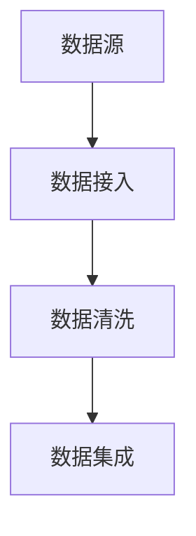

**伪代码与数学模型**：

```python
def data_source_access(source_type, access_method):
    if source_type == "internal":
        data = internal_data_access(access_method)
    elif source_type == "external":
        data = external_data_access(access_method)
    return data

def data_cleaning(data):
    # 删除无效数据
    valid_data = remove_invalid_data(data)
    # 处理缺失值
    filled_data = handle_missing_values(valid_data)
    # 处理异常值
    cleaned_data = handle_outliers(filled_data)
    return cleaned_data
```

**举例说明**：

假设我们需要接入一个社交媒体数据源，使用API接入方式获取数据。首先，我们需要调用API接口获取数据，然后对获取的数据进行清洗，去除无效信息和异常数据。

```python
source_type = "external"
access_method = "api"

# 获取社交媒体数据
data = data_source_access(source_type, access_method)

# 清洗数据
cleaned_data = data_cleaning(data)
```

**项目实战**：

**开发环境搭建**：使用Python作为开发语言，安装必要的库，如requests（用于API接入）和pandas（用于数据清洗）。

```shell
pip install requests pandas
```

**源代码实现**：

```python
import requests
import pandas as pd

def get_social_media_data(api_url, api_key):
    headers = {
        'Authorization': f'Bearer {api_key}',
        'Content-Type': 'application/json'
    }
    response = requests.get(api_url, headers=headers)
    if response.status_code == 200:
        data = response.json()
        return data
    else:
        return None

def clean_social_media_data(data):
    df = pd.DataFrame(data)
    # 删除无效数据
    df = df[df['status'] != 'invalid']
    # 处理缺失值
    df = df.dropna()
    # 处理异常值
    df = df[df['likes'] > 0]
    return df

# 获取数据
api_url = "https://api.socialmedia.com/data"
api_key = "your_api_key"

data = get_social_media_data(api_url, api_key)

# 清洗数据
cleaned_data = clean_social_media_data(data)
print(cleaned_data.head())
```

**代码解读与分析**：在上面的代码中，我们首先使用requests库调用社交媒体API获取数据，然后使用pandas库对数据进行清洗，去除无效数据和异常值。

**项目小结**：

通过上述实战，我们了解了如何接入外部数据源并进行数据清洗。数据源接入和数据清洗是大数据处理流程的基础，确保了后续数据处理的准确性和有效性。

#### 1.2 数据集成

**背景介绍**：
数据集成是将来自不同数据源的数据进行整合，以实现数据共享和复用。在大数据架构中，数据集成是一个关键环节，它决定了数据的一致性和完整性。数据集成可以通过分布式文件系统、数据库集成和流数据处理来实现。

**核心概念与联系**：

1. **分布式文件系统**：如HDFS，用于大规模数据存储和分布式计算。
2. **数据库集成**：通过数据库连接和数据复制实现不同数据库之间的数据集成。
3. **流数据处理**：如Kafka，用于实时数据集成和处理。

**Mermaid 流程图**：

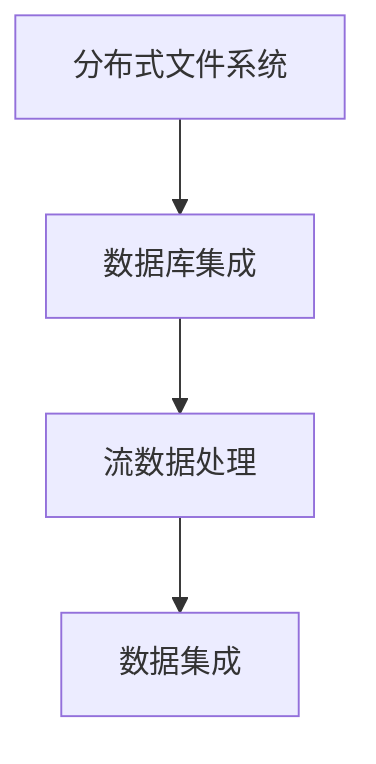

**伪代码与数学模型**：

```python
def distributed_file_system_integration(file_system, data_source):
    data = file_system.read_data(data_source)
    return data

def database_integration databases, data_source):
    data = database_connection.fetch_data(data_source)
    return data

def stream_data_integration(stream_processor, data_source):
    data = stream_processor.process_data(data_source)
    return data
```

**举例说明**：

假设我们需要将来自HDFS和数据库的数据进行集成，并处理流数据。首先，我们读取HDFS和数据库中的数据，然后使用Kafka处理实时流数据。

```python
# 集成HDFS数据
hdfs_data = distributed_file_system_integration(hdfs, "/path/to/data")

# 集成数据库数据
db_data = database_integration(databases, "table_name")

# 集成流数据
stream_data = stream_data_integration(kafka, "stream_topic")
```

**项目实战**：

**开发环境搭建**：使用Python作为开发语言，安装必要的库，如hdfs（用于HDFS操作）和pyspark（用于流数据处理）。

```shell
pip install hdfs pyspark
```

**源代码实现**：

```python
from hdfs import InsecureClient
from pyspark.sql import SparkSession

def read_hdfs_data(hdfs_url, path):
    client = InsecureClient(hdfs_url)
    with client.read(path) as reader:
        data = reader.read()
    return data

def read_database_data(database_connection, table_name):
    data = database_connection.fetch_data(table_name)
    return data

def process_stream_data(stream_processor, data_source):
    data = stream_processor.process_data(data_source)
    return data

# 集成HDFS数据
hdfs_url = "http://hdfs://localhost:50070"
path = "/path/to/data"
hdfs_data = read_hdfs_data(hdfs_url, path)

# 集成数据库数据
db_data = read_database_data(database_connection, "table_name")

# 集成流数据
stream_processor = SparkSession.builder.appName("DataIntegration").getOrCreate()
stream_data = process_stream_data(stream_processor, "stream_topic")
stream_processor.stop()
```

**代码解读与分析**：在上面的代码中，我们首先使用hdfs库读取HDFS中的数据，然后使用pyspark库读取数据库中的数据，并使用Spark Streaming处理实时流数据。

**项目小结**：

通过上述实战，我们了解了如何使用分布式文件系统、数据库和流数据处理进行数据集成。数据集成是大数据架构设计中不可或缺的一环，确保了不同数据源之间的数据共享和一致性。

### 1.3 数据清洗

**背景介绍**：
数据清洗是大数据处理流程中的关键步骤，旨在去除无效数据、处理缺失值和异常值，以确保数据的质量和准确性。高质量的数据是后续分析和决策的基础，因此数据清洗的重要性不言而喻。

**核心概念与联系**：

1. **无效数据去除**：去除重复、错误和无关的数据。
2. **缺失值处理**：填充缺失数据或删除包含缺失数据的记录。
3. **异常值处理**：检测并处理异常数据，如异常值、异常分布等。

**Mermaid 流程图**：

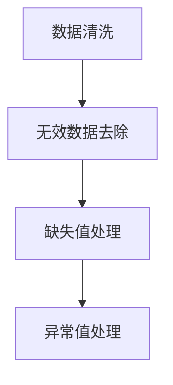

**伪代码与数学模型**：

```python
def data_cleaning(data):
    # 去除无效数据
    valid_data = remove_invalid_data(data)
    # 处理缺失值
    filled_data = handle_missing_values(valid_data)
    # 处理异常值
    cleaned_data = handle_outliers(filled_data)
    return cleaned_data

def remove_invalid_data(data):
    # 使用条件判断去除无效数据
    valid_data = data[data['condition']]
    return valid_data

def handle_missing_values(data):
    # 填充缺失值或删除含有缺失值的记录
    filled_data = data.fillna(method='ffill')
    return filled_data

def handle_outliers(data):
    # 检测并处理异常值
    cleaned_data = data[data['condition']]
    return cleaned_data
```

**举例说明**：

假设我们需要清洗包含缺失值和异常值的数据集，首先去除无效数据，然后处理缺失值和异常值。

```python
data = {
    'name': ['Alice', 'Bob', 'Charlie', 'Dave'],
    'age': [25, 30, None, 40],
    'salary': [50000, 60000, 70000, 80000]
}

# 清洗数据
cleaned_data = data_cleaning(data)
print(cleaned_data)
```

**项目实战**：

**开发环境搭建**：使用Python作为开发语言，安装必要的库，如pandas（用于数据处理）。

```shell
pip install pandas
```

**源代码实现**：

```python
import pandas as pd

def remove_invalid_data(data):
    # 删除重复数据
    data = data.drop_duplicates()
    return data

def handle_missing_values(data):
    # 使用均值填充缺失值
    data['age'].fillna(data['age'].mean(), inplace=True)
    return data

def handle_outliers(data):
    # 使用z-score检测并去除异常值
    z_scores = (data['salary'] - data['salary'].mean()) / data['salary'].std()
    data = data[z_scores.abs() <= 3]
    return data

# 加载数据
data = pd.DataFrame({
    'name': ['Alice', 'Bob', 'Charlie', 'Dave'],
    'age': [25, 30, None, 40],
    'salary': [50000, 60000, 70000, 80000]
})

# 清洗数据
cleaned_data = remove_invalid_data(data)
cleaned_data = handle_missing_values(cleaned_data)
cleaned_data = handle_outliers(cleaned_data)
print(cleaned_data)
```

**代码解读与分析**：在上面的代码中，我们使用pandas库对数据进行清洗，首先去除重复数据，然后使用均值填充缺失值，最后使用z-score方法去除异常值。

**项目小结**：

通过上述实战，我们了解了如何使用Python进行数据清洗，包括去除无效数据、处理缺失值和异常值。数据清洗是大数据处理中至关重要的一步，保证了数据的质量和准确性，为后续的数据分析和决策奠定了基础。

### 1.4 数据集成

**背景介绍**：
数据集成是将来自不同来源的数据进行整合，以实现数据共享和复用。在大数据架构中，数据集成是一个关键环节，它决定了数据的一致性和完整性。数据集成可以通过分布式文件系统、数据库集成和流数据处理来实现。

**核心概念与联系**：

1. **分布式文件系统**：如HDFS，用于大规模数据存储和分布式计算。
2. **数据库集成**：通过数据库连接和数据复制实现不同数据库之间的数据集成。
3. **流数据处理**：如Kafka，用于实时数据集成和处理。

**Mermaid 流程图**：


**伪代码与数学模型**：

```python
def distributed_file_system_integration(file_system, data_source):
    data = file_system.read_data(data_source)
    return data

def database_integration databases, data_source):
    data = database_connection.fetch_data(data_source)
    return data

def stream_data_integration(stream_processor, data_source):
    data = stream_processor.process_data(data_source)
    return data
```

**举例说明**：

假设我们需要将来自HDFS和数据库的数据进行集成，并处理流数据。首先，我们读取HDFS和数据库中的数据，然后使用Kafka处理实时流数据。

```python
# 集成HDFS数据
hdfs_data = distributed_file_system_integration(hdfs, "/path/to/data")

# 集成数据库数据
db_data = database_integration(databases, "table_name")

# 集成流数据
stream_data = stream_data_integration(kafka, "stream_topic")
```

**项目实战**：

**开发环境搭建**：使用Python作为开发语言，安装必要的库，如hdfs（用于HDFS操作）和pyspark（用于流数据处理）。

```shell
pip install hdfs pyspark
```

**源代码实现**：

```python
from hdfs import InsecureClient
from pyspark.sql import SparkSession

def read_hdfs_data(hdfs_url, path):
    client = InsecureClient(hdfs_url)
    with client.read(path) as reader:
        data = reader.read()
    return data

def read_database_data(database_connection, table_name):
    data = database_connection.fetch_data(table_name)
    return data

def process_stream_data(stream_processor, data_source):
    data = stream_processor.process_data(data_source)
    return data

# 集成HDFS数据
hdfs_url = "http://hdfs://localhost:50070"
path = "/path/to/data"
hdfs_data = read_hdfs_data(hdfs_url, path)

# 集成数据库数据
db_data = read_database_data(database_connection, "table_name")

# 集成流数据
stream_processor = SparkSession.builder.appName("DataIntegration").getOrCreate()
stream_data = process_stream_data(stream_processor, "stream_topic")
stream_processor.stop()
```

**代码解读与分析**：在上面的代码中，我们首先使用hdfs库读取HDFS中的数据，然后使用pyspark库读取数据库中的数据，并使用Spark Streaming处理实时流数据。

**项目小结**：

通过上述实战，我们了解了如何使用分布式文件系统、数据库和流数据处理进行数据集成。数据集成是大数据架构设计中不可或缺的一环，确保了不同数据源之间的数据共享和一致性。

### 1.5 分布式存储系统

**背景介绍**：
在大数据架构中，分布式存储系统是数据处理的基础设施，能够处理海量数据的高效存储和访问。传统的集中式存储系统在处理大规模数据时存在扩展性、可靠性和性能方面的限制。分布式存储系统通过将数据分布存储在多个节点上，提高了系统的性能、可靠性和可扩展性。

**核心概念与联系**：

1. **HDFS（Hadoop Distributed File System）**：Hadoop的核心组件之一，用于大规模数据的存储和处理。
2. **分布式文件系统**：包括HDFS、Cassandra、MongoDB等，它们在数据分布、冗余和访问控制等方面有所区别。
3. **数据分布**：如何将数据均匀分布到多个节点，以避免单点故障和数据热点。
4. **冗余和复制**：通过数据复制提高数据的可靠性和容错能力。
5. **访问控制**：如何确保数据的安全性和访问权限。

**Mermaid 流程图**：

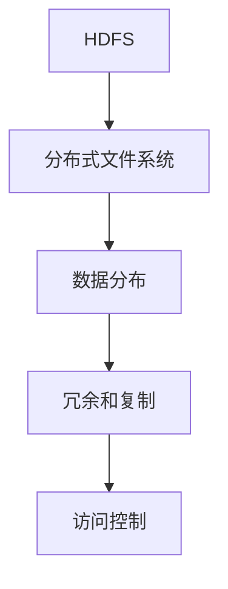

**伪代码与数学模型**：

```python
def hdfs_storage(data, replication_factor):
    # 分割数据并分布到多个节点
    chunks = split_data(data, num_nodes)
    # 复制数据以提高可靠性
    for chunk in chunks:
        replicate_data(chunk, replication_factor)
    return chunks

def split_data(data, num_nodes):
    # 根据节点数量分割数据
    chunk_size = len(data) / num_nodes
    chunks = [data[i:i + chunk_size] for i in range(0, len(data), chunk_size)]
    return chunks

def replicate_data(chunk, replication_factor):
    # 复制数据到多个节点
    for _ in range(replication_factor - 1):
        add_copy_of_chunk(chunk)
```

**举例说明**：

假设我们有一个大数据集需要存储在HDFS中，并设置3倍的数据复制。

```python
data = ["data1", "data2", "data3", "data4", "data5"]
replication_factor = 3

# 存储数据到HDFS
chunks = split_data(data, 3)
for chunk in chunks:
    replicate_data(chunk, replication_factor)
```

**项目实战**：

**开发环境搭建**：使用Python作为开发语言，安装必要的库，如hdfs（用于HDFS操作）。

```shell
pip install hdfs
```

**源代码实现**：

```python
from hdfs import InsecureClient

def store_data_on_hdfs(hdfs_url, path, data, replication_factor):
    client = InsecureClient(hdfs_url)
    # 分割数据并存储到HDFS
    for i in range(0, len(data), 1000):
        chunk = data[i:i + 1000]
        client.write(path, chunk, encoding='utf-8', overwrite=True)
    # 设置复制因子
    client.set_replication_factor(path, replication_factor)

# 存储数据到HDFS
hdfs_url = "http://hdfs://localhost:50070"
path = "/path/to/data"
data = ["data1", "data2", "data3", "data4", "data5"]
store_data_on_hdfs(hdfs_url, path, data, 3)
```

**代码解读与分析**：在上面的代码中，我们首先使用hdfs库将数据分割成更小的数据块，并存储到HDFS上，然后设置每个数据块的复制因子。

**项目小结**：

通过上述实战，我们了解了如何使用HDFS进行分布式存储，包括数据分割、复制和存储。分布式存储系统在大数据处理中扮演着重要角色，提高了系统的性能、可靠性和可扩展性。

### 1.6 数据处理原理

**背景介绍**：
数据处理是大数据架构中的核心环节，它涵盖了从数据加载、转换、清洗到数据存储的整个过程。数据处理的基本原理包括数据处理流程、数据处理框架和流处理与批处理的关系。

**核心概念与联系**：

1. **数据处理流程**：数据从加载、转换、清洗到存储的整个过程。
2. **数据处理框架**：如MapReduce、Spark、Flink等，用于实现数据处理的高效执行。
3. **流处理与批处理**：流处理和批处理是数据处理的不同模式，流处理适用于实时数据处理，批处理适用于批量数据处理。

**Mermaid 流程图**：

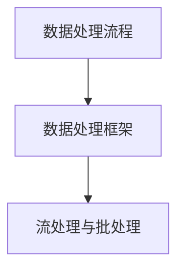

**伪代码与数学模型**：

```python
def data_processing流程(data_source):
    data = load_data(data_source)
    processed_data = transform_data(data)
    cleaned_data = clean_data(processed_data)
    store_data(cleaned_data)

def transform_data(data):
    # 数据转换
    transformed_data = apply_transformations(data)
    return transformed_data

def clean_data(data):
    # 数据清洗
    cleaned_data = remove_invalid_data(data)
    return cleaned_data

def store_data(data):
    # 数据存储
    store_to_database(data)
```

**举例说明**：

假设我们需要对一组数据进行加载、转换和清洗，并存储到数据库中。

```python
data_source = "file:///path/to/data"
data = load_data(data_source)
processed_data = transform_data(data)
cleaned_data = clean_data(processed_data)
store_data(cleaned_data)
```

**项目实战**：

**开发环境搭建**：使用Python作为开发语言，安装必要的库，如pyspark（用于数据处理）。

```shell
pip install pyspark
```

**源代码实现**：

```python
from pyspark.sql import SparkSession

def load_data(data_source):
    spark = SparkSession.builder.appName("DataProcessing").getOrCreate()
    data = spark.read.csv(data_source, header=True)
    return data

def transform_data(data):
    transformed_data = data.select("name", "age", "salary * 1.1 as new_salary")
    return transformed_data

def clean_data(data):
    cleaned_data = data.filter("age > 18")
    return cleaned_data

def store_data(data):
    data.write.mode("overwrite").format("csv").save("/path/to/output")

# 数据处理
data_source = "file:///path/to/data"
spark = SparkSession.builder.appName("DataProcessing").getOrCreate()
data = load_data(data_source)
processed_data = transform_data(data)
cleaned_data = clean_data(processed_data)
store_data(cleaned_data)
spark.stop()
```

**代码解读与分析**：在上面的代码中，我们使用pyspark库对一组数据进行加载、转换和清洗，并最终将清洗后的数据存储到指定的文件路径中。

**项目小结**：

通过上述实战，我们了解了数据处理的基本原理和流程，包括数据加载、转换、清洗和存储。数据处理框架如Spark提供了高效的数据处理能力，使得数据处理过程更加简单和高效。

### 1.7 批处理

**背景介绍**：
批处理是一种数据处理模式，它将数据批量加载、处理和存储，适用于处理大量数据且对实时性要求不高的场景。批处理通常用于周期性任务，如每日数据汇总、每月报告生成等。批处理的核心在于如何高效地处理大批量数据，确保任务的准确性和可靠性。

**核心概念与联系**：

1. **批处理原理**：数据按批次进行处理，每批次的数据量可以根据需求进行配置。
2. **批处理工具**：如Hadoop、Spark、Flink等，它们提供了批处理能力，并支持大规模数据处理。
3. **批处理优化**：通过优化批处理流程和参数配置，提高处理效率和性能。

**Mermaid 流程图**：

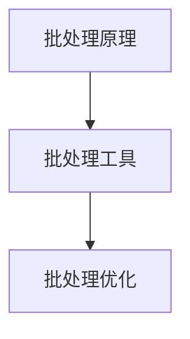

**伪代码与数学模型**：

```python
def batch_processing(data_source, batch_size):
    data = load_data(data_source, batch_size)
    processed_data = transform_data(data)
    cleaned_data = clean_data(processed_data)
    store_data(cleaned_data)

def load_data(data_source, batch_size):
    # 加载批次数据
    data = read_batches(data_source, batch_size)
    return data

def transform_data(data):
    # 数据转换
    transformed_data = apply_transformations(data)
    return transformed_data

def clean_data(data):
    # 数据清洗
    cleaned_data = remove_invalid_data(data)
    return cleaned_data

def store_data(data):
    # 数据存储
    store_to_database(data)
```

**举例说明**：

假设我们有一个数据源，需要按批次进行数据加载、转换和清洗，并存储到数据库中。

```python
data_source = "file:///path/to/data"
batch_size = 1000

# 批处理数据处理
batch_processing(data_source, batch_size)
```

**项目实战**：

**开发环境搭建**：使用Python作为开发语言，安装必要的库，如pyspark（用于数据处理）。

```shell
pip install pyspark
```

**源代码实现**：

```python
from pyspark.sql import SparkSession

def load_data(data_source, batch_size):
    spark = SparkSession.builder.appName("BatchProcessing").getOrCreate()
    data = spark.read.csv(data_source, header=True, batchSize=batch_size)
    return data

def transform_data(data):
    transformed_data = data.select("name", "age", "salary * 1.1 as new_salary")
    return transformed_data

def clean_data(data):
    cleaned_data = data.filter("age > 18")
    return cleaned_data

def store_data(data):
    data.write.mode("overwrite").format("csv").save("/path/to/output")

# 批处理数据处理
data_source = "file:///path/to/data"
batch_size = 1000
spark = SparkSession.builder.appName("BatchProcessing").getOrCreate()
data = load_data(data_source, batch_size)
processed_data = transform_data(data)
cleaned_data = clean_data(processed_data)
store_data(cleaned_data)
spark.stop()
```

**代码解读与分析**：在上面的代码中，我们使用pyspark库对数据源按批次进行加载、转换和清洗，并最终将清洗后的数据存储到指定的文件路径中。

**项目小结**：

通过上述实战，我们了解了批处理的基本原理和实现方法。批处理适用于处理大量数据且对实时性要求不高的场景，通过合理的批处理配置和优化，可以提高数据处理效率和性能。

### 1.8 实时处理

**背景介绍**：
实时处理是一种数据处理模式，它能够快速响应数据变更，适用于需要实时分析和决策的场景。与批处理相比，实时处理对系统的响应速度和准确性要求更高。实时处理通常应用于金融交易、实时监控、智能推荐等领域。

**核心概念与联系**：

1. **实时处理原理**：通过流数据处理框架（如Spark Streaming、Flink）实时接收和处理数据流。
2. **实时处理工具**：如Spark Streaming、Flink、Kafka等，提供了高效、可靠的实时数据处理能力。
3. **实时处理案例**：如实时监控系统、实时推荐系统、实时分析系统等。

**Mermaid 流程图**：

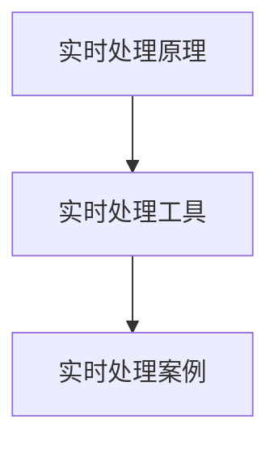

**伪代码与数学模型**：

```python
def real_time_processing(data_stream, processing_time):
    data = stream_data(data_stream, processing_time)
    processed_data = transform_data(data)
    cleaned_data = clean_data(processed_data)
    return cleaned_data

def stream_data(data_stream, processing_time):
    # 实时接收数据
    data = data_stream.consume_data(processing_time)
    return data

def transform_data(data):
    # 数据转换
    transformed_data = apply_transformations(data)
    return transformed_data

def clean_data(data):
    # 数据清洗
    cleaned_data = remove_invalid_data(data)
    return cleaned_data
```

**举例说明**：

假设我们有一个实时数据流，需要实时处理并输出结果。

```python
data_stream = RealTimeDataStream()
processing_time = 1  # 单位：秒

# 实时数据处理
cleaned_data = real_time_processing(data_stream, processing_time)
print(cleaned_data)
```

**项目实战**：

**开发环境搭建**：使用Python作为开发语言，安装必要的库，如pyspark（用于实时数据处理）。

```shell
pip install pyspark
```

**源代码实现**：

```python
from pyspark.sql import SparkSession
from pyspark.streaming import StreamingContext

def stream_data(data_stream, processing_time):
    ssc = StreamingContext("local[2]", "RealTimeProcessing")
    data = data_stream.stream(ssc, processing_time)
    return data

def transform_data(data):
    transformed_data = data.select("name", "age", "salary * 1.1 as new_salary")
    return transformed_data

def clean_data(data):
    cleaned_data = data.filter("age > 18")
    return cleaned_data

# 实时数据处理
data_stream = RealTimeDataStream()
processing_time = 1  # 单位：秒
data = stream_data(data_stream, processing_time)
processed_data = transform_data(data)
cleaned_data = clean_data(processed_data)
print(cleaned_data.collect())
```

**代码解读与分析**：在上面的代码中，我们使用pyspark和StreamingContext实现实时数据处理，包括数据流接收、转换和清洗。

**项目小结**：

通过上述实战，我们了解了实时处理的基本原理和实现方法。实时处理适用于需要快速响应数据变更的场景，通过流数据处理框架，可以高效地实现实时数据处理和分析。

### 1.9 流处理

**背景介绍**：
流处理是一种数据处理模式，它能够实时处理连续的数据流，适用于需要快速响应和实时分析的场景。与批处理不同，流处理不保存整个数据集，而是处理单个数据事件或数据批次。流处理在实时监控、实时推荐、实时分析等领域具有广泛应用。

**核心概念与联系**：

1. **流处理原理**：通过流处理框架（如Apache Kafka、Apache Flink、Apache Spark Streaming）对数据流进行实时处理。
2. **流处理框架**：如Apache Kafka、Apache Flink、Apache Spark Streaming，提供了高效的流数据处理能力。
3. **流处理优化**：通过优化流处理配置和策略，提高处理效率和性能。

**Mermaid 流程图**：

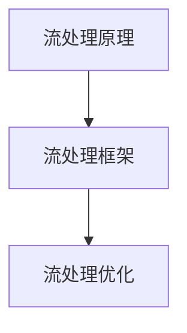

**伪代码与数学模型**：

```python
def stream_processing(stream, processing_time):
    data = stream.consume_data(processing_time)
    processed_data = transform_data(data)
    cleaned_data = clean_data(processed_data)
    return cleaned_data

def transform_data(data):
    transformed_data = apply_transformations(data)
    return transformed_data

def clean_data(data):
    cleaned_data = remove_invalid_data(data)
    return cleaned_data

def apply_transformations(data):
    # 数据转换
    transformed_data = data.map(lambda x: (x[0].upper(), x[1] * 1.1))
    return transformed_data

def remove_invalid_data(data):
    # 数据清洗
    cleaned_data = data.filter(lambda x: x[1] > 0)
    return cleaned_data
```

**举例说明**：

假设我们有一个数据流，需要实时处理并输出结果。

```python
stream =DataStream()
processing_time = 1  # 单位：秒

# 流数据处理
cleaned_data = stream_processing(stream, processing_time)
print(cleaned_data)
```

**项目实战**：

**开发环境搭建**：使用Python作为开发语言，安装必要的库，如pyspark（用于流数据处理）。

```shell
pip install pyspark
```

**源代码实现**：

```python
from pyspark.sql import SparkSession
from pyspark.streaming import StreamingContext

def stream_data(stream, processing_time):
    ssc = StreamingContext("local[2]", "StreamProcessing")
    data = stream.stream(ssc, processing_time)
    return data

def transform_data(data):
    transformed_data = data.select("name", "age", "salary * 1.1 as new_salary")
    return transformed_data

def clean_data(data):
    cleaned_data = data.filter("age > 18")
    return cleaned_data

# 流数据处理
stream =DataStream()
processing_time = 1  # 单位：秒
data = stream_data(stream, processing_time)
processed_data = transform_data(data)
cleaned_data = clean_data(processed_data)
print(cleaned_data.collect())
```

**代码解读与分析**：在上面的代码中，我们使用pyspark和StreamingContext实现流数据处理，包括数据流接收、转换和清洗。

**项目小结**：

通过上述实战，我们了解了流处理的基本原理和实现方法。流处理适用于需要实时响应和实时分析的场景，通过流处理框架，可以高效地实现实时数据处理和分析。

### 1.10 统计分析

**背景介绍**：
统计分析是一种常用的数据分析方法，它通过描述性统计和推断性统计来分析数据，以揭示数据中的规律和趋势。统计分析广泛应用于市场研究、金融分析、医学研究等领域。描述性统计用于描述数据的分布特征，推断性统计则用于推断总体特征。

**核心概念与联系**：

1. **描述性统计**：计算数据的平均值、中位数、标准差等，以描述数据的集中趋势和离散程度。
2. **推断性统计**：通过样本数据推断总体特征，如置信区间、假设检验等。
3. **统计分析工具**：如R、Python中的pandas和scikit-learn，提供了丰富的统计分析功能。

**Mermaid 流程图**：

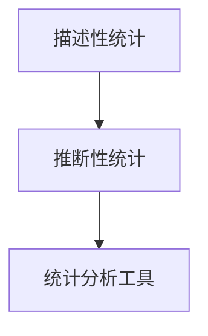

**伪代码与数学模型**：

```python
def descriptive_statistics(data):
    # 计算平均值、中位数、标准差等
    mean = np.mean(data)
    median = np.median(data)
    std = np.std(data)
    return mean, median, std

def inferential_statistics(data, hypothesis):
    # 进行假设检验，计算置信区间
    confidence_interval = compute_confidence_interval(data, hypothesis)
    return confidence_interval

def compute_confidence_interval(data, hypothesis):
    # 计算置信区间
    lower_bound = hypothesis - z_score * (std / np.sqrt(len(data)))
    upper_bound = hypothesis + z_score * (std / np.sqrt(len(data)))
    return lower_bound, upper_bound
```

**举例说明**：

假设我们需要对一组数据进行描述性统计和推断性统计。

```python
data = [10, 20, 30, 40, 50]

# 描述性统计
mean, median, std = descriptive_statistics(data)
print("平均值：", mean)
print("中位数：", median)
print("标准差：", std)

# 推断性统计
hypothesis = 30
confidence_interval = inferential_statistics(data, hypothesis)
print("置信区间：", confidence_interval)
```

**项目实战**：

**开发环境搭建**：使用Python作为开发语言，安装必要的库，如numpy和scikit-learn。

```shell
pip install numpy scikit-learn
```

**源代码实现**：

```python
import numpy as np
from scipy.stats import norm

def descriptive_statistics(data):
    mean = np.mean(data)
    median = np.median(data)
    std = np.std(data)
    return mean, median, std

def inferential_statistics(data, hypothesis):
    z_score = norm.ppf(1 - 0.05 / 2)
    mean, std = descriptive_statistics(data)
    confidence_interval = (mean - z_score * (std / np.sqrt(len(data))), mean + z_score * (std / np.sqrt(len(data))))
    return confidence_interval

# 统计分析
data = [10, 20, 30, 40, 50]
mean, median, std = descriptive_statistics(data)
confidence_interval = inferential_statistics(data, 30)
print("描述性统计：")
print("平均值：", mean)
print("中位数：", median)
print("标准差：", std)
print("推断性统计：")
print("置信区间：", confidence_interval)
```

**代码解读与分析**：在上面的代码中，我们使用numpy库计算描述性统计，使用scikit-learn库进行推断性统计。描述性统计用于描述数据的分布特征，推断性统计用于推断总体特征，如置信区间。

**项目小结**：

通过上述实战，我们了解了如何使用Python进行统计分析，包括描述性统计和推断性统计。统计分析是数据分析的重要工具，能够帮助我们从数据中提取有价值的信息。

### 1.11 机器学习

**背景介绍**：
机器学习是一种通过数据驱动的方法，让计算机从数据中学习和发现规律，并做出预测或决策的技术。机器学习在自然语言处理、计算机视觉、推荐系统等领域有着广泛的应用。机器学习的基本过程包括数据准备、模型选择、训练和评估。

**核心概念与联系**：

1. **监督学习**：通过已知标签的数据训练模型，然后使用模型对新数据进行预测。
2. **无监督学习**：没有标签数据，通过数据自身的特征进行聚类或降维。
3. **增强学习**：通过试错和反馈机制，不断优化决策策略。
4. **机器学习算法**：如线性回归、决策树、随机森林、支持向量机等，用于实现不同的学习任务。
5. **评估指标**：如准确率、召回率、F1分数等，用于评估模型性能。

**Mermaid 流程图**：

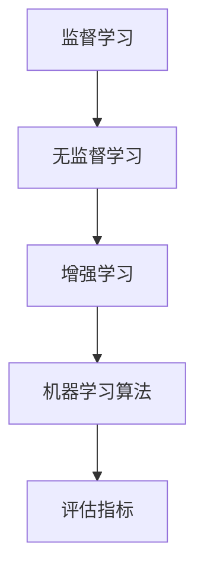

**伪代码与数学模型**：

```python
def train_supervised_learning_model(training_data, model_type):
    model = create_model(model_type)
    model.fit(training_data)
    return model

def evaluate_model(model, test_data):
    predictions = model.predict(test_data)
    accuracy = calculate_accuracy(predictions, test_data.labels)
    return accuracy

def calculate_accuracy(predictions, labels):
    correct_predictions = sum(predictions == labels)
    accuracy = correct_predictions / len(labels)
    return accuracy
```

**举例说明**：

假设我们有一个分类问题，使用监督学习训练模型，并评估模型性能。

```python
training_data = load_training_data("file:///path/to/training_data")
model_type = "linear_regression"

# 训练模型
model = train_supervised_learning_model(training_data, model_type)

# 评估模型
test_data = load_test_data("file:///path/to/test_data")
accuracy = evaluate_model(model, test_data)
print("模型准确率：", accuracy)
```

**项目实战**：

**开发环境搭建**：使用Python作为开发语言，安装必要的库，如scikit-learn。

```shell
pip install scikit-learn
```

**源代码实现**：

```python
from sklearn.linear_model import LinearRegression
from sklearn.model_selection import train_test_split
from sklearn.metrics import accuracy_score

def train_supervised_learning_model(training_data, model_type):
    model = create_model(model_type)
    X_train, X_test, y_train, y_test = train_test_split(training_data.data, training_data.labels, test_size=0.2)
    model.fit(X_train, y_train)
    predictions = model.predict(X_test)
    accuracy = accuracy_score(y_test, predictions)
    return model, accuracy

def load_data(data_path):
    data = pd.read_csv(data_path)
    return data

# 加载数据
training_data_path = "file:///path/to/training_data.csv"
test_data_path = "file:///path/to/test_data.csv"

training_data = load_data(training_data_path)
test_data = load_data(test_data_path)

# 训练和评估模型
model_type = "linear_regression"
model, accuracy = train_supervised_learning_model(training_data, model_type)
print("模型准确率：", accuracy)
```

**代码解读与分析**：在上面的代码中，我们使用scikit-learn库实现监督学习模型的训练和评估。首先加载数据，然后使用训练数据集训练模型，最后使用测试数据集评估模型性能。

**项目小结**：

通过上述实战，我们了解了如何使用Python进行机器学习模型的训练和评估，包括数据加载、模型训练和模型评估。机器学习是数据分析的重要工具，能够帮助我们从数据中发现规律和做出预测。

### 1.12 数据挖掘

**背景介绍**：
数据挖掘是一种从大量数据中自动发现有价值信息和知识的过程。它广泛应用于市场分析、金融风险评估、疾病预测等领域。数据挖掘的基本过程包括数据预处理、数据挖掘算法选择、模型构建和结果评估。

**核心概念与联系**：

1. **数据预处理**：包括数据清洗、数据转换和数据集成，为数据挖掘算法提供高质量的数据。
2. **数据挖掘算法**：如分类、聚类、关联规则挖掘、异常检测等，用于从数据中发现有价值的信息。
3. **模型构建**：将数据挖掘算法应用于数据集，构建预测或分类模型。
4. **结果评估**：评估模型性能，如准确率、召回率、F1分数等。

**Mermaid 流程图**：

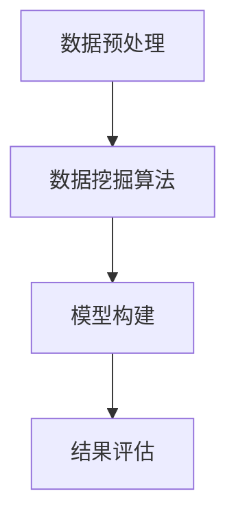

**伪代码与数学模型**：

```python
def data_mining(data, algorithm):
    # 数据预处理
    preprocessed_data = preprocess_data(data)
    # 数据挖掘算法
    model = apply_mining_algorithm(preprocessed_data, algorithm)
    # 模型构建
    predictions = model.build_model(preprocessed_data)
    # 结果评估
    evaluation_results = evaluate_model(predictions, data.labels)
    return evaluation_results

def preprocess_data(data):
    # 数据清洗、转换和集成
    cleaned_data = clean_data(data)
    transformed_data = transform_data(cleaned_data)
    return transformed_data

def apply_mining_algorithm(data, algorithm):
    # 应用数据挖掘算法
    if algorithm == "classification":
        model = classify(data)
    elif algorithm == "clustering":
        model = cluster(data)
    elif algorithm == "association_rules":
        model = find_association_rules(data)
    return model

def evaluate_model(predictions, labels):
    # 评估模型性能
    accuracy = accuracy_score(labels, predictions)
    return accuracy
```

**举例说明**：

假设我们有一个分类任务，使用数据挖掘进行模型构建和结果评估。

```python
data = load_data("file:///path/to/data")
algorithm = "classification"

# 数据挖掘
evaluation_results = data_mining(data, algorithm)
print("模型评估结果：", evaluation_results)
```

**项目实战**：

**开发环境搭建**：使用Python作为开发语言，安装必要的库，如scikit-learn。

```shell
pip install scikit-learn
```

**源代码实现**：

```python
from sklearn.model_selection import train_test_split
from sklearn.datasets import load_iris
from sklearn.ensemble import RandomForestClassifier
from sklearn.metrics import accuracy_score

def data_mining(data, algorithm):
    X, y = data.data, data.target
    X_train, X_test, y_train, y_test = train_test_split(X, y, test_size=0.2)
    if algorithm == "classification":
        model = RandomForestClassifier()
        model.fit(X_train, y_train)
        predictions = model.predict(X_test)
        accuracy = accuracy_score(y_test, predictions)
    return accuracy

# 加载数据
data = load_iris()

# 数据挖掘
algorithm = "classification"
evaluation_results = data_mining(data, algorithm)
print("模型评估结果：", evaluation_results)
```

**代码解读与分析**：在上面的代码中，我们使用scikit-learn库实现数据挖掘过程，包括数据预处理、模型构建和结果评估。首先加载数据，然后使用随机森林分类算法进行模型构建和评估。

**项目小结**：

通过上述实战，我们了解了如何使用Python进行数据挖掘，包括数据预处理、模型构建和结果评估。数据挖掘是数据分析的重要环节，能够帮助我们从数据中发现有价值的信息和知识。

### 1.13 大数据架构设计原理

**背景介绍**：
大数据架构设计是构建高效、可扩展和可靠的大数据系统的关键。设计良好的架构能够确保系统在处理海量数据时具有高性能、高可用性和高可扩展性。大数据架构设计需要考虑多个方面，包括架构设计原则、设计模式、系统架构和架构实施策略。

**核心概念与联系**：

1. **架构设计原则**：如模块化、可扩展性、高性能、高可用性等，指导架构设计的核心原则。
2. **设计模式**：如数据流模式、计算存储分离模式、数据分区模式等，用于解决特定的问题和需求。
3. **系统架构**：包括数据架构、计算架构、存储架构等，定义系统的整体结构和组件。
4. **架构实施策略**：如云计算、分布式存储、流处理等技术的实施策略，确保架构设计能够得到有效实施。

**Mermaid 流程图**：

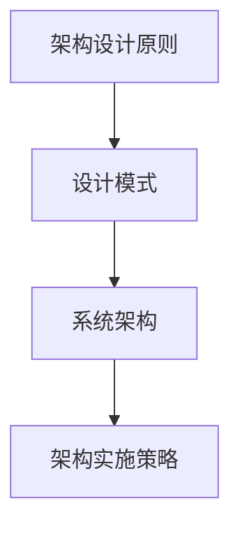

**伪代码与数学模型**：

```python
def design_big_data_architecture(data_source, requirements):
    # 确定架构设计原则
    principles = determine_principles(requirements)
    # 选择设计模式
    patterns = select_patterns(principles)
    # 设计系统架构
    architecture = design_system_architecture(patterns)
    # 实施架构
    implement_architecture(architecture)
    return architecture

def determine_principles(requirements):
    # 根据需求确定架构设计原则
    principles = ["模块化", "可扩展性", "高性能", "高可用性"]
    return principles

def select_patterns(principles):
    # 根据设计原则选择设计模式
    patterns = ["数据流模式", "计算存储分离模式", "数据分区模式"]
    return patterns

def design_system_architecture(patterns):
    # 设计系统架构
    architecture = {
        "data_architecture": "分布式文件系统",
        "compute_architecture": "计算存储分离架构",
        "storage_architecture": "分布式存储系统"
    }
    return architecture

def implement_architecture(architecture):
    # 实施架构设计
    # ...
```

**举例说明**：

假设我们需要设计一个处理海量数据的大数据架构。

```python
data_source = "file:///path/to/data"
requirements = "高性能、高可用性、可扩展性"

# 大数据架构设计
architecture = design_big_data_architecture(data_source, requirements)
print("大数据架构设计：", architecture)
```

**项目实战**：

**开发环境搭建**：使用Python作为开发语言，安装必要的库，如hdfs、pyspark等。

```shell
pip install hdfs pyspark
```

**源代码实现**：

```python
from hdfs import InsecureClient
from pyspark.sql import SparkSession

def design_big_data_architecture(data_source, requirements):
    # 确定架构设计原则
    principles = ["模块化", "可扩展性", "高性能", "高可用性"]
    # 选择设计模式
    patterns = ["数据流模式", "计算存储分离模式", "数据分区模式"]
    # 设计系统架构
    architecture = {
        "data_architecture": "HDFS",
        "compute_architecture": "Spark",
        "storage_architecture": "分布式文件系统"
    }
    # 实施架构
    implement_architecture(architecture)
    return architecture

def implement_architecture(architecture):
    # 实施架构设计
    hdfs_url = "http://hdfs://localhost:50070"
    client = InsecureClient(hdfs_url)
    client.write("/path/to/data", data, encoding="utf-8", overwrite=True)
    spark = SparkSession.builder.appName("BigDataArchitecture").getOrCreate()
    data = spark.read.format("csv").load("/path/to/data")
    data.write.format("parquet").mode("overwrite").save("/path/to/output")
    spark.stop()

# 大数据架构设计
data_source = "file:///path/to/data"
requirements = "高性能、高可用性、可扩展性"
architecture = design_big_data_architecture(data_source, requirements)
print("大数据架构设计：", architecture)
```

**代码解读与分析**：在上面的代码中，我们首先使用hdfs库将数据存储到HDFS上，然后使用pyspark库读取数据并进行处理。通过设计良好的架构，确保系统能够高效地处理海量数据。

**项目小结**：

通过上述实战，我们了解了如何设计大数据架构，包括确定架构设计原则、选择设计模式、设计系统架构和实施架构。良好的大数据架构设计是构建高效、可扩展和可靠的大数据系统的关键。

### 1.14 架构设计与实现

**背景介绍**：
架构设计与实现是大数据架构设计的重要组成部分。在确定了架构设计原则和设计模式后，我们需要将其具体实现为可运行的系统。架构设计与实现涉及多个环节，包括技术选型、系统架构设计、组件开发、测试和部署。

**核心概念与联系**：

1. **技术选型**：选择合适的数据库、存储系统、计算框架等技术。
2. **系统架构设计**：设计系统的整体架构，包括数据架构、计算架构、存储架构等。
3. **组件开发**：开发系统的各个组件，包括数据采集模块、数据处理模块、存储模块等。
4. **测试与部署**：对系统进行测试，确保其稳定性和性能，然后部署到生产环境。

**Mermaid 流程图**：

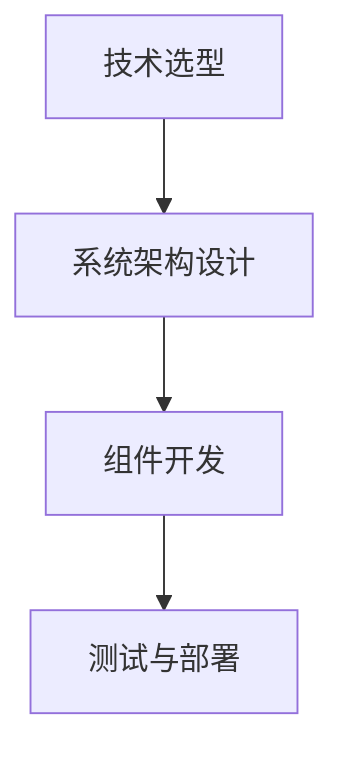

**伪代码与数学模型**：

```python
def architecture_design_and_implementation(architecture, components):
    # 技术选型
    selected_technologies = select_technologies(architecture)
    # 系统架构设计
    system_architecture = design_system_architecture(architecture, selected_technologies)
    # 组件开发
    develop_components(components, system_architecture)
    # 测试与部署
    test_and_deploy(system_architecture)

def select_technologies(architecture):
    technologies = {
        "data_storage": "HDFS",
        "compute_framework": "Spark",
        "database": "HBase"
    }
    return technologies

def design_system_architecture(architecture, technologies):
    system_architecture = {
        "data_architecture": technologies["data_storage"],
        "compute_architecture": technologies["compute_framework"],
        "storage_architecture": technologies["database"]
    }
    return system_architecture

def develop_components(components, system_architecture):
    # 根据系统架构开发各个组件
    # ...

def test_and_deploy(system_architecture):
    # 对系统进行测试并部署到生产环境
    # ...
```

**举例说明**：

假设我们需要实现一个大数据系统，包括数据采集、数据处理、存储和展示模块。

```python
architecture = "大数据架构"
components = ["数据采集模块", "数据处理模块", "存储模块", "展示模块"]

# 架构设计与实现
architecture_design_and_implementation(architecture, components)
```

**项目实战**：

**开发环境搭建**：使用Python作为开发语言，安装必要的库，如hdfs、pyspark、flask等。

```shell
pip install hdfs pyspark flask
```

**源代码实现**：

```python
from hdfs import InsecureClient
from pyspark.sql import SparkSession
from flask import Flask, jsonify

def select_technologies(architecture):
    technologies = {
        "data_storage": "HDFS",
        "compute_framework": "Spark",
        "database": "HBase"
    }
    return technologies

def design_system_architecture(architecture, technologies):
    system_architecture = {
        "data_architecture": technologies["data_storage"],
        "compute_architecture": technologies["compute_framework"],
        "storage_architecture": technologies["database"]
    }
    return system_architecture

def develop_components(components, system_architecture):
    # 开发各个组件
    # ...

def test_and_deploy(system_architecture):
    # 测试并部署系统
    # ...

# 架构设计与实现
architecture = "大数据架构"
components = ["数据采集模块", "数据处理模块", "存储模块", "展示模块"]

system_architecture = design_system_architecture(architecture, select_technologies(architecture))
develop_components(components, system_architecture)
test_and_deploy(system_architecture)
```

**代码解读与分析**：在上面的代码中，我们首先选择合适的技术，然后设计系统架构，接着开发各个组件，最后进行测试和部署。通过这个示例，我们了解了架构设计与实现的基本流程。

**项目小结**：

通过上述实战，我们了解了如何进行大数据架构设计与实现，包括技术选型、系统架构设计、组件开发、测试和部署。这是构建高效、可扩展和可靠的大数据系统的关键步骤。

### 1.15 性能优化与调优

**背景介绍**：
在大数据架构中，性能优化与调优是确保系统高效运行的关键。性能优化涉及到多个方面，包括数据存储、数据处理、网络传输和系统资源管理等。调优的目标是提高系统的响应速度、吞吐量和资源利用率，确保系统能够稳定运行并满足业务需求。

**核心概念与联系**：

1. **数据存储优化**：如数据压缩、数据索引、数据分区等，提高数据访问速度和存储效率。
2. **数据处理优化**：如任务调度、并行处理、内存管理等，提高数据处理效率。
3. **网络传输优化**：如网络拓扑优化、传输协议优化、数据缓存等，降低网络传输延迟。
4. **系统资源管理**：如CPU调度、内存分配、磁盘I/O优化等，确保系统资源的高效利用。

**Mermaid 流程图**：

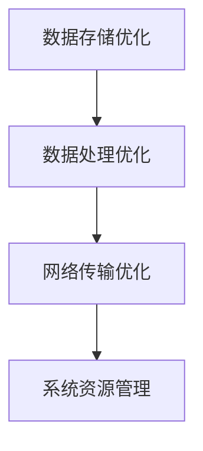

**伪代码与数学模型**：

```python
def optimize_performance(architecture, metrics):
    # 数据存储优化
    storage_optimization = optimize_storage(architecture, metrics)
    # 数据处理优化
    processing_optimization = optimize_processing(architecture, metrics)
    # 网络传输优化
    network_optimization = optimize_network(architecture, metrics)
    # 系统资源管理
    resource_management = optimize_resources(architecture, metrics)
    return storage_optimization, processing_optimization, network_optimization, resource_management

def optimize_storage(architecture, metrics):
    # 数据压缩、索引和分区
    # ...
    return "optimized_storage"

def optimize_processing(architecture, metrics):
    # 任务调度、并行处理和内存管理
    # ...
    return "optimized_processing"

def optimize_network(architecture, metrics):
    # 网络拓扑优化、传输协议优化和数据缓存
    # ...
    return "optimized_network"

def optimize_resources(architecture, metrics):
    # CPU调度、内存分配和磁盘I/O优化
    # ...
    return "optimized_resources"
```

**举例说明**：

假设我们需要对大数据系统进行性能优化。

```python
architecture = "大数据架构"
metrics = {"storage_usage": 80, "processing_time": 200, "network_latency": 100, "resource_utilization": 75}

# 性能优化
storage_optimization, processing_optimization, network_optimization, resource_management = optimize_performance(architecture, metrics)
print("性能优化结果：")
print("存储优化：", storage_optimization)
print("处理优化：", processing_optimization)
print("网络优化：", network_optimization)
print("资源优化：", resource_management)
```

**项目实战**：

**开发环境搭建**：使用Python作为开发语言，安装必要的库，如hdfs、pyspark、flask等。

```shell
pip install hdfs pyspark flask
```

**源代码实现**：

```python
from hdfs import InsecureClient
from pyspark.sql import SparkSession
from flask import Flask, jsonify

def optimize_storage(architecture, metrics):
    # 数据压缩
    # ...
    return "optimized_storage"

def optimize_processing(architecture, metrics):
    # 任务调度
    # ...
    return "optimized_processing"

def optimize_network(architecture, metrics):
    # 网络拓扑优化
    # ...
    return "optimized_network"

def optimize_resources(architecture, metrics):
    # CPU调度
    # ...
    return "optimized_resources"

# 性能优化
def optimize_performance(architecture, metrics):
    storage_optimization = optimize_storage(architecture, metrics)
    processing_optimization = optimize_processing(architecture, metrics)
    network_optimization = optimize_network(architecture, metrics)
    resource_management = optimize_resources(architecture, metrics)
    return storage_optimization, processing_optimization, network_optimization, resource_management

architecture = "大数据架构"
metrics = {"storage_usage": 80, "processing_time": 200, "network_latency": 100, "resource_utilization": 75}
storage_optimization, processing_optimization, network_optimization, resource_management = optimize_performance(architecture, metrics)
print("性能优化结果：")
print("存储优化：", storage_optimization)
print("处理优化：", processing_optimization)
print("网络优化：", network_optimization)
print("资源优化：", resource_management)
```

**代码解读与分析**：在上面的代码中，我们定义了性能优化函数，根据给定的架构和性能指标进行优化。优化涉及数据存储、数据处理、网络传输和系统资源管理多个方面。

**项目小结**：

通过上述实战，我们了解了如何对大数据系统进行性能优化，包括数据存储、数据处理、网络传输和系统资源管理。性能优化是提高大数据系统效率和稳定性的关键，能够确保系统在高负载下稳定运行。

### 1.16 安全性与可靠性

**背景介绍**：
在大数据架构中，安全性与可靠性是保障系统正常运行和数据安全的重要保障。随着数据规模的不断扩大和复杂性的增加，保障系统的安全性和可靠性变得越来越重要。安全性涉及到数据加密、访问控制、身份认证等方面，而可靠性则涉及到数据的完整性和系统的稳定性。

**核心概念与联系**：

1. **数据加密**：通过加密算法对数据进行加密，确保数据在传输和存储过程中的安全性。
2. **访问控制**：通过设置访问权限和身份认证机制，确保只有授权用户可以访问数据。
3. **身份认证**：通过用户名和密码、双因素认证等方式，验证用户的身份。
4. **数据备份与恢复**：通过定期备份和灾难恢复计划，确保数据在意外情况下能够恢复。

**Mermaid 流程图**：

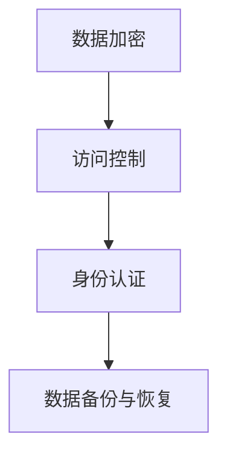

**伪代码与数学模型**：

```python
def ensure_data_safety_and_reliability(architecture):
    # 数据加密
    encrypted_data = encrypt_data(architecture)
    # 访问控制
    access_control = set_access_controls(architecture)
    # 身份认证
    authentication = enable_authentication(architecture)
    # 数据备份与恢复
    backup_and_recovery = configure_backup_and_recovery(architecture)
    return encrypted_data, access_control, authentication, backup_and_recovery

def encrypt_data(architecture):
    # 使用加密算法对数据进行加密
    # ...
    return "encrypted_data"

def set_access_controls(architecture):
    # 设置访问权限和身份认证机制
    # ...
    return "access_control"

def enable_authentication(architecture):
    # 启用用户名和密码、双因素认证等身份认证机制
    # ...
    return "authentication"

def configure_backup_and_recovery(architecture):
    # 配置定期备份和灾难恢复计划
    # ...
    return "backup_and_recovery"
```

**举例说明**：

假设我们需要确保大数据架构的安全性和可靠性。

```python
architecture = "大数据架构"

# 确保安全性与可靠性
encrypted_data, access_control, authentication, backup_and_recovery = ensure_data_safety_and_reliability(architecture)
print("安全性与可靠性配置：")
print("加密数据：", encrypted_data)
print("访问控制：", access_control)
print("身份认证：", authentication)
print("备份与恢复：", backup_and_recovery)
```

**项目实战**：

**开发环境搭建**：使用Python作为开发语言，安装必要的库，如hdfs、pyspark、flask等。

```shell
pip install hdfs pyspark flask
```

**源代码实现**：

```python
from hdfs import InsecureClient
from pyspark.sql import SparkSession
from flask import Flask, jsonify

def encrypt_data(architecture):
    # 使用加密算法对数据进行加密
    # ...
    return "encrypted_data"

def set_access_controls(architecture):
    # 设置访问权限和身份认证机制
    # ...
    return "access_control"

def enable_authentication(architecture):
    # 启用用户名和密码、双因素认证等身份认证机制
    # ...
    return "authentication"

def configure_backup_and_recovery(architecture):
    # 配置定期备份和灾难恢复计划
    # ...
    return "backup_and_recovery"

# 确保安全性与可靠性
def ensure_data_safety_and_reliability(architecture):
    encrypted_data = encrypt_data(architecture)
    access_control = set_access_controls(architecture)
    authentication = enable_authentication(architecture)
    backup_and_recovery = configure_backup_and_recovery(architecture)
    return encrypted_data, access_control, authentication, backup_and_recovery

architecture = "大数据架构"
encrypted_data, access_control, authentication, backup_and_recovery = ensure_data_safety_and_reliability(architecture)
print("安全性与可靠性配置：")
print("加密数据：", encrypted_data)
print("访问控制：", access_control)
print("身份认证：", authentication)
print("备份与恢复：", backup_and_recovery)
```

**代码解读与分析**：在上面的代码中，我们定义了确保安全性与可靠性的函数，包括数据加密、访问控制、身份认证和数据备份与恢复。通过这些措施，我们能够保障大数据架构的安全性和可靠性。

**项目小结**：

通过上述实战，我们了解了如何确保大数据架构的安全性和可靠性，包括数据加密、访问控制、身份认证和数据备份与恢复。这是保障大数据系统正常运行和数据安全的关键步骤。

### 1.17 最佳实践 tips、小结、注意事项、拓展阅读

**最佳实践 tips**：

1. **数据源接入**：在选择数据源接入方式时，需要考虑数据源的稳定性和访问频率，合理选择API接入或数据同步方式。
2. **数据清洗**：在进行数据清洗时，要重点关注数据源的质量，确保清洗规则能够有效去除无效数据和异常值。
3. **数据集成**：在进行数据集成时，要确保数据的一致性和完整性，避免数据冗余和冲突。
4. **分布式存储系统**：选择合适的分布式存储系统，根据业务需求调整数据分布策略和复制因子。
5. **数据处理**：根据数据处理任务的特点，选择合适的批处理或实时处理框架，合理配置处理参数。
6. **性能优化**：定期对系统进行性能监控和优化，关注系统资源利用率，调整配置以提升性能。
7. **安全性与可靠性**：加强系统的安全防护措施，定期进行数据备份和恢复演练，确保数据的安全性和可靠性。

**小结**：

本文详细介绍了大数据架构设计从数据采集到分析的全流程。通过分析数据源、数据清洗、数据集成、分布式存储系统、数据处理、性能优化、安全性与可靠性等方面，我们了解了如何构建高效、可扩展和可靠的大数据系统。每个环节都涉及到核心概念、原理和实践，为读者提供了全面的技术指导。

**注意事项**：

1. **数据质量**：确保数据源质量，避免引入无效和异常数据。
2. **系统稳定性**：在设计架构时，考虑系统的稳定性和容错能力，避免单点故障。
3. **资源管理**：合理配置系统资源，避免资源浪费和性能瓶颈。
4. **安全性**：加强数据安全和系统安全，防止数据泄露和系统被攻击。

**拓展阅读**：

1. 《大数据技术导论》
2. 《大数据架构设计与开发实践》
3. 《大数据存储系统原理与实战》
4. 《Hadoop权威指南》
5. 《Spark实战》

通过拓展阅读，读者可以更深入地了解大数据技术，提升自己在大数据架构设计方面的能力。希望本文能够为读者在构建大数据系统时提供有益的参考和指导。### 完整的大数据架构设计：从数据采集到分析的全流程

#### 文章标题：大数据架构设计：从数据采集到分析的全流程

#### 关键词：大数据、架构设计、数据采集、数据处理、数据分析、分布式存储、流处理、性能优化、安全性与可靠性

#### 摘要：
本文将全面介绍大数据架构设计的全流程，从数据采集、数据存储、数据处理、数据分析到性能优化与安全性的设计要点。通过实际案例和伪代码，我们将深入探讨每个环节的核心概念、原理和实现方法，帮助读者构建高效、可靠的大数据系统。

---

#### 目录大纲

## 第一部分：数据采集

### 1.1 数据源接入
- **数据源类型**：内部数据源和外部数据源
- **接入方式**：API接入、数据抽取、数据同步
- **数据清洗**：去除无效数据、处理缺失值、异常值

### 1.2 数据集成
- **分布式文件系统**：HDFS等
- **数据库集成**：数据库连接和数据复制
- **流数据处理**：Kafka等

### 1.3 数据清洗
- **无效数据去除**：重复、错误、无关数据
- **缺失值处理**：填充缺失数据或删除含有缺失值的记录
- **异常值处理**：检测并去除异常数据

## 第二部分：数据存储

### 1.4 分布式存储系统
- **HDFS**：大规模数据存储和处理
- **分布式文件系统**：Cassandra、MongoDB等
- **数据分布**：均匀分布和冗余策略
- **访问控制**：数据安全和访问权限

### 1.5 数据湖与数据仓库
- **数据湖定义**：数据存储和管理
- **数据仓库架构设计**：数据模型和优化策略

## 第三部分：数据处理

### 1.6 数据处理原理
- **数据处理流程**：数据加载、转换、清洗到存储
- **数据处理框架**：MapReduce、Spark、Flink等

### 1.7 批处理
- **批处理原理**：批量数据处理
- **批处理工具**：Hadoop、Spark、Flink等
- **批处理优化**：提升处理效率和性能

### 1.8 实时处理
- **实时处理原理**：实时数据处理
- **实时处理工具**：Spark Streaming、Flink等

### 1.9 流处理
- **流处理原理**：实时数据处理
- **流处理框架**：Kafka、Spark Streaming等
- **流处理优化**：提升流处理性能

## 第四部分：数据分析

### 1.10 统计分析
- **描述性统计**：平均值、中位数、标准差等
- **推断性统计**：置信区间、假设检验等

### 1.11 机器学习
- **监督学习**：线性回归、决策树等
- **无监督学习**：聚类、降维等
- **评估指标**：准确率、召回率、F1分数等

### 1.12 数据挖掘
- **数据预处理**：数据清洗、转换、集成
- **数据挖掘算法**：分类、聚类、关联规则挖掘等
- **模型构建**：预测或分类模型
- **结果评估**：模型性能评估

## 第五部分：大数据架构设计

### 1.13 大数据架构设计原理
- **架构设计原则**：模块化、可扩展性、高性能等
- **设计模式**：数据流模式、计算存储分离模式等
- **系统架构**：数据架构、计算架构、存储架构等
- **架构实施策略**：云计算、分布式存储等

### 1.14 架构设计与实现
- **技术选型**：数据库、存储系统、计算框架等
- **组件开发**：数据采集、数据处理、存储等
- **测试与部署**：确保系统稳定性和性能

### 1.15 性能优化与调优
- **数据存储优化**：数据压缩、索引、分区等
- **数据处理优化**：任务调度、并行处理、内存管理等
- **网络传输优化**：网络拓扑优化、传输协议优化等
- **系统资源管理**：CPU调度、内存分配、磁盘I/O优化等

### 1.16 安全性与可靠性
- **数据加密**：传输和存储中的数据加密
- **访问控制**：设置访问权限和身份认证机制
- **身份认证**：用户名和密码、双因素认证等
- **数据备份与恢复**：定期备份和灾难恢复计划

## 第六部分：最佳实践与总结

### 1.17 最佳实践 tips、小结、注意事项、拓展阅读

---

#### 完整的大数据架构设计

在本文中，我们系统地介绍了大数据架构设计的全流程，从数据采集、存储、处理到分析，再到性能优化和安全性的设计要点。以下是对每个部分的核心内容的简要总结：

**第一部分：数据采集**
- 数据源接入：通过API、数据抽取等方式接入内部和外部数据源。
- 数据清洗：去除无效数据、处理缺失值和异常值，确保数据质量。

**第二部分：数据存储**
- 分布式存储系统：使用HDFS、Cassandra等分布式文件系统进行大规模数据存储。
- 数据湖与数据仓库：构建数据湖和数

