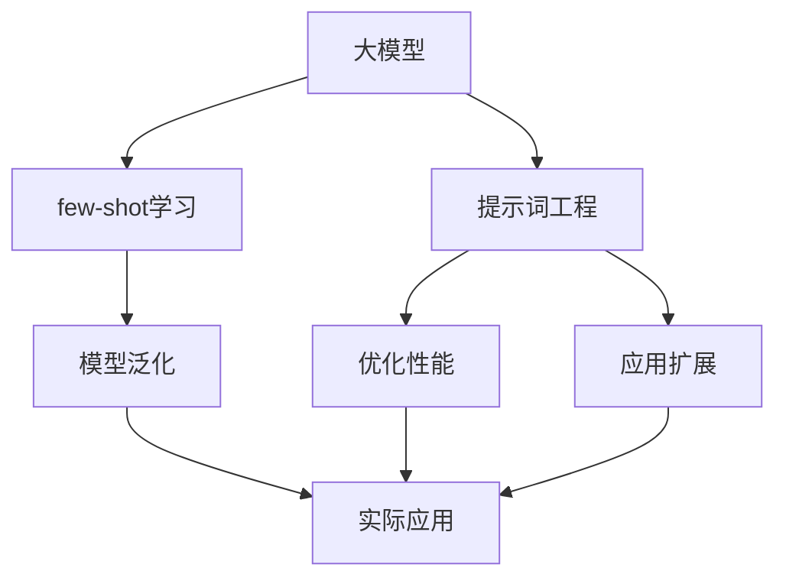

                 

### 引言

#### 大模型概述

大模型（Large-scale Models），是指具有大规模参数和强大计算能力的人工智能模型。它们能够处理海量数据，进行复杂的数据分析和模式识别。大模型的发展始于20世纪80年代的神经网络研究，随着计算能力和数据量的提升，尤其是深度学习（Deep Learning）技术的突破，大模型在自然语言处理（NLP）、计算机视觉（CV）、语音识别等领域取得了显著的进展。目前，大模型如GPT-3、BERT等，已经能够实现高度自动化和智能化的任务，成为人工智能领域的研究热点。

#### few-shot学习概述

few-shot学习（Few-Shot Learning）是一种机器学习方法，旨在让模型在仅使用少量样本的情况下就能进行有效的学习和泛化。传统的机器学习方法通常需要大量的训练数据来确保模型的性能，而few-shot学习则试图突破这一限制，使得模型在资源受限的环境下仍能表现出色。few-shot学习的重要性在于它能够减少对大量标注数据的依赖，提高模型在真实世界中的适应性，具有重要的理论和实际意义。

#### 提示词工程概述

提示词工程（Prompt Engineering）是一种针对机器学习模型的优化方法，旨在通过设计有效的提示词（prompts）来提升模型的表现。提示词可以是自然语言文本、代码、图像或其他形式的输入，它们被用来引导模型进行特定类型的任务。提示词工程在NLP任务中尤其重要，如问答系统、机器翻译、文本生成等。通过有效的提示词设计，可以显著提高模型的性能和适应性。

#### 大模型、few-shot学习和提示词工程的关系

大模型、few-shot学习和提示词工程在人工智能领域有着紧密的联系。大模型为few-shot学习提供了强大的计算基础，使得模型在少量样本下仍能进行有效的学习。而few-shot学习则提高了大模型在真实世界中的应用能力，使得模型能够在资源受限的环境下仍然表现出色。提示词工程则进一步优化了模型的性能，通过设计有效的提示词，引导模型进行更精确的任务。三者的结合，使得人工智能模型在各个领域都能发挥出更大的潜力。

### 核心概念与联系

#### 大模型与few-shot学习的关系

大模型和few-shot学习之间的联系可以从以下几个方面来理解：

1. **计算资源**：大模型通常需要大量的计算资源和数据来进行训练和优化。few-shot学习则利用了这些强大的计算资源，在少量样本的基础上进行有效的学习。

2. **数据依赖**：传统机器学习方法依赖于大量标注数据，而few-shot学习则试图减少对大量标注数据的依赖。大模型通过其强大的计算能力和丰富的知识储备，使得在少量样本下也能进行有效的学习。

3. **模型泛化能力**：few-shot学习提高了大模型的泛化能力，使得模型在未知数据上能够表现出更好的性能。这是大模型和few-shot学习相互促进的结果。

#### 大模型与提示词工程的关系

大模型和提示词工程之间的联系主要体现在以下几个方面：

1. **提示词设计**：提示词工程通过设计有效的提示词来引导大模型进行特定的任务。大模型的强大计算能力和知识储备使得提示词能够被更好地利用，从而提高模型的表现。

2. **优化策略**：提示词工程提供了多种优化策略，如提示词的长度、格式、内容等。这些策略可以根据大模型的特点进行优化，进一步提升模型的性能。

3. **应用场景**：大模型在NLP、CV、语音识别等领域都有广泛的应用。提示词工程则在这些应用场景中发挥了重要作用，通过设计有效的提示词，使得大模型能够更好地解决实际问题。

#### few-shot学习与提示词工程的关系

few-shot学习和提示词工程之间的关系可以从以下几个方面来理解：

1. **任务引导**：few-shot学习通过在少量样本下进行学习，使得模型能够适应新的任务。提示词工程则通过设计有效的提示词来引导模型进行特定的任务，两者共同作用，使得模型能够更好地适应新的环境。

2. **优化性能**：few-shot学习通过减少对大量标注数据的依赖，提高了模型的泛化能力。而提示词工程则通过设计有效的提示词，进一步优化了模型的性能，使得模型在少量样本下也能表现出色。

3. **应用扩展**：few-shot学习和提示词工程共同推动了人工智能模型在各个领域中的应用扩展。通过少量样本和有效的提示词，模型能够在更多场景中发挥作用，为实际应用提供解决方案。

为了更加直观地展示大模型、few-shot学习和提示词工程之间的相互关系，我们可以使用Mermaid流程图进行描述：



在这个流程图中，大模型作为基础，通过few-shot学习和提示词工程两个维度进行优化，最终实现实际应用。这样的结构不仅能够帮助我们理解三者之间的相互关系，还能够为后续章节的内容提供清晰的框架。

### few-shot学习原理

#### 几何角度理解few-shot学习

从几何的角度来看，few-shot学习可以理解为在数据空间中寻找一个合适的决策边界，使得模型能够在未知数据上表现出良好的分类或预测能力。具体来说，few-shot学习可以分为以下几个关键步骤：

1. **数据空间划分**：首先，我们将训练数据划分到不同的数据空间中。这些数据空间可以是高维特征空间，也可以是二维或三维的直观空间。

2. **决策边界定义**：在数据空间中，我们需要定义一个决策边界，使得模型能够根据这个边界对新的数据进行分类或预测。这个决策边界可以是线性边界、非线性边界或者更复杂的结构。

3. **样本点分布**：在少量样本的情况下，样本点的分布往往较为稀疏，模型需要通过几何方法来找到最合适的决策边界。常用的几何方法包括最小二乘法、支持向量机（SVM）等。

下面是一个简单的伪代码，用于说明在几何角度下进行few-shot学习的基本流程：

```python
def few_shot_learning(train_data, test_data, model):
    # 数据预处理
    preprocess_data(train_data)
    
    # 特征提取
    features = extract_features(train_data)
    
    # 模型训练
    model.train(features, train_data.labels)
    
    # 预测与评估
    predictions = model.predict(test_data.features)
    evaluate_predictions(predictions, test_data.labels)
    
    return model
```

#### few-shot学习算法原理

few-shot学习算法的核心思想是通过少量的训练样本，训练出一个能够在未知数据上表现出良好性能的模型。以下是few-shot学习算法的详细步骤：

##### 数据预处理

数据预处理是few-shot学习的基础步骤。首先，我们需要对训练数据进行清洗和归一化处理，确保数据的质量。然后，我们将训练数据划分成标签数据和特征数据，为后续的训练和预测做好准备。

```python
def preprocess_data(data):
    # 数据清洗
    cleaned_data = clean_data(data)
    
    # 归一化
    normalized_data = normalize_data(cleaned_data)
    
    # 划分标签数据和特征数据
    features, labels = split_data(normalized_data)
    
    return features, labels
```

##### 特征提取

特征提取是将原始数据转化为适合模型训练的形式。在few-shot学习中，特征提取尤为重要，因为少量的样本往往难以提取出丰富的特征信息。常用的特征提取方法包括词袋模型、TF-IDF、PCA等。

```python
def extract_features(data):
    # 特征提取
    features = extract_data_features(data)
    
    return features
```

##### 模型训练

在few-shot学习中，模型的训练是关键步骤。由于样本数量有限，我们需要选择合适的训练算法，如支持向量机（SVM）、神经网络等。以下是一个简单的基于SVM的模型训练步骤：

```python
def train_model(features, labels):
    # 初始化SVM模型
    svm_model = initialize_svm_model()
    
    # 模型训练
    svm_model.train(features, labels)
    
    return svm_model
```

##### 预测与评估

在模型训练完成后，我们需要使用测试数据对模型进行预测，并评估模型的性能。常用的评估指标包括准确率、召回率、F1值等。

```python
def predict(model, test_data):
    # 预测
    predictions = model.predict(test_data.features)
    
    return predictions

def evaluate_predictions(predictions, test_data_labels):
    # 评估
    accuracy = calculate_accuracy(predictions, test_data_labels)
    recall = calculate_recall(predictions, test_data_labels)
    f1_score = calculate_f1_score(predictions, test_data_labels)
    
    print(f"Accuracy: {accuracy}, Recall: {recall}, F1 Score: {f1_score}")
```

#### few-shot学习的挑战与解决方案

尽管few-shot学习在理论上具有很大的潜力，但在实际应用中仍然面临着一些挑战。以下是一些常见的挑战以及相应的解决方案：

1. **样本稀疏性**：在少量样本的情况下，样本点往往较为稀疏，导致模型难以找到合适的决策边界。为了解决这个问题，我们可以采用基于核的方法，如支持向量机（SVM），通过引入核函数来扩展特征空间，从而提高模型的泛化能力。

2. **模型选择**：在少量样本的情况下，选择合适的模型尤为重要。常用的模型包括线性模型、神经网络、决策树等。通过交叉验证和模型评估，我们可以选择性能最佳的模型。

3. **过拟合问题**：在少量样本下，模型容易出现过拟合现象。为了解决这个问题，我们可以采用正则化方法，如L1、L2正则化，来控制模型的复杂度。

4. **数据预处理**：在少量样本的情况下，数据预处理尤为重要。通过数据清洗、归一化、特征提取等方法，我们可以提高数据的质

