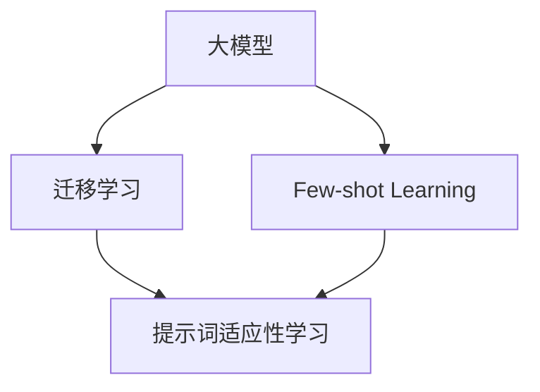

                 

### 文章标题：大模型Few-shot迁移与提示词适应性学习

#### 关键词：
- 大模型
- Few-shot迁移
- 提示词适应性学习
- 预训练
- 微调
- 适配器架构
- 对抗迁移学习

#### 摘要：
本文探讨了大型深度学习模型在Few-shot迁移学习中的应用，以及通过提示词适应性学习实现模型任务适应的方法。文章首先介绍了大模型、Few-shot迁移和提示词适应性学习的核心概念，通过Mermaid流程图展示了它们之间的关系。接着，详细讲解了预训练-微调、适配器架构和对抗迁移学习等核心算法原理，并使用伪代码进行了阐述。最后，通过实际项目展示了这些概念和算法的应用，包括开发环境搭建、源代码实现和代码解读，以及项目小结和最佳实践建议。

---

### 引言

在人工智能领域，深度学习模型凭借其卓越的性能和强大的泛化能力，已经成为许多实际应用的核心技术。随着模型规模的不断扩大，如何有效地训练和优化这些大型模型，成为了一个关键问题。其中，Few-shot迁移学习和提示词适应性学习作为深度学习领域的前沿研究方向，正逐渐引起广泛关注。

Few-shot迁移学习（Few-shot Transfer Learning）是指模型在仅有少量样本的情况下，能够快速适应新的任务。这一能力对于减少数据依赖、提高模型泛化能力具有重要意义。而提示词适应性学习（Prompt-based Adaptation Learning）则通过调整输入提示词，使模型能够适应不同的任务需求，为实际应用提供了更加灵活的解决方案。

本文旨在探讨大模型在Few-shot迁移学习和提示词适应性学习中的应用，通过分析核心概念、算法原理和实际项目案例，为相关研究者和开发者提供有价值的参考。文章将按以下结构展开：

1. **核心概念与联系**：介绍大模型、Few-shot迁移和提示词适应性学习的核心概念，并使用Mermaid流程图展示它们之间的关系。
2. **核心算法原理讲解**：详细讲解预训练-微调、适配器架构和对抗迁移学习等核心算法原理，使用伪代码进行阐述。
3. **数学模型和数学公式**：介绍与本文相关的数学模型和公式，并给出详细讲解和举例说明。
4. **项目实战**：展示实际项目案例，包括开发环境搭建、源代码实现和代码解读，以及项目小结和最佳实践建议。

### 核心概念与联系

#### 大模型（Large Models）

首先，我们需要了解什么是大模型。大模型通常指的是具有非常庞大的参数数量的深度学习模型，如GPT-3、BERT等。这些模型的训练通常需要大量的计算资源和时间，但它们在处理大规模数据集和复杂任务时表现出色。大模型的核心特点是其参数数量庞大，这使得它们具有强大的特征提取能力和模型表示能力。

#### Few-shot Learning

Few-shot Learning（少量样本学习）是一种机器学习技术，它使模型能够在仅有少量样本的情况下进行有效学习和预测。在传统机器学习中，模型通常需要大量的数据来训练，而Few-shot Learning则通过设计特定的算法，使得模型能够快速适应新任务，从而减少数据需求，提高模型泛化能力。

#### 迁移学习（Transfer Learning）

迁移学习（Transfer Learning）是一种利用已经在一个任务上训练好的模型，来提高在另一个相关任务上性能的方法。这种技术能够减少对新数据的依赖，加速模型的训练过程，并提高模型的泛化能力。在迁移学习中，源任务和目标任务之间存在一定的关联性，这使得模型可以从源任务中提取有用的知识，并迁移到目标任务上。

#### 提示词适应性学习（Prompt-based Adaptation Learning）

提示词适应性学习是一种通过改变输入提示词来使模型适应不同任务的方法。在自然语言处理领域，提示词（Prompt）是一个关键的概念，它指的是用来引导模型生成特定结果的输入文本。通过调整提示词，模型可以适应不同的任务需求，从而实现灵活的任务适应。

#### 关系架构

为了更好地理解这几个概念之间的联系，我们可以使用Mermaid流程图来展示它们之间的关系：



在上述流程图中，大模型既是Few-shot Learning和迁移学习的基础，也是提示词适应性学习的前提。通过迁移学习和Few-shot Learning，大模型能够从源任务中提取知识，快速适应目标任务。而提示词适应性学习则通过调整提示词，进一步优化模型的任务适应能力。

### 核心算法原理讲解

#### 预训练-微调

预训练-微调（Pre-training and Fine-tuning）是深度学习模型训练的常见方法。预训练阶段通常在大规模语料库上进行，目的是让模型具备通用语言理解和生成能力。微调阶段则在具体任务数据上进行，目的是让模型适应特定任务。以下是预训练-微调的伪代码：

```python
def pre_train(model, corpus):
    # 在大规模语料库上训练模型
    pass

def fine_tune(model, task_data):
    # 在具体任务数据上微调模型
    pass
```

在预训练阶段，模型会通过无监督学习方式，学习到语言的一般规律。例如，GPT-3模型通过自回归语言模型进行预训练，从而掌握语言的生成和预测能力。预训练过程通常包括以下几个步骤：

1. **数据预处理**：将大规模语料库转换为模型可处理的格式。
2. **训练过程**：使用训练数据对模型进行迭代训练，优化模型参数。
3. **评估过程**：在验证数据集上评估模型性能，调整训练策略。

在微调阶段，模型会根据特定任务的需求，进一步调整模型参数。例如，在问答系统中，模型需要根据问题的上下文来理解答案。微调过程通常包括以下几个步骤：

1. **数据准备**：收集与任务相关的数据，并进行预处理。
2. **模型调整**：在任务数据上对模型进行微调，优化模型参数。
3. **性能评估**：在测试数据集上评估模型性能，确保模型达到预期效果。

#### 适配器架构

适配器架构（Adapter Architecture）是一种实现提示词适应性学习的方法。它通过引入一个轻量级的适配器网络，来调整模型输入的提示词，从而实现任务适应。以下是适配器架构的伪代码：

```python
class AdapterNetwork(nn.Module):
    def __init__(self):
        super(AdapterNetwork, self).__init__()
        # 定义适配器网络结构

    def forward(self, prompt, input_data):
        # 通过提示词调整输入数据
        pass
```

在适配器架构中，适配器网络是一个独立的子网络，它接收输入提示词和输入数据，并生成调整后的输入数据。具体实现步骤如下：

1. **初始化适配器网络**：定义适配器网络的结构，通常包括多层神经网络。
2. **训练适配器网络**：使用带有提示词的数据集对适配器网络进行训练，优化网络参数。
3. **应用适配器网络**：在模型输入阶段，应用适配器网络调整输入数据，从而实现任务适应。

适配器架构的优点在于，它能够灵活地调整模型输入，适应不同任务的需求。同时，由于适配器网络相对轻量，对模型计算资源的消耗较小，因此适合在大规模模型中应用。

#### 对抗迁移学习

对抗迁移学习（Adversarial Transfer Learning）是一种利用对抗性样本进行迁移学习的方法。通过在源域和目标域之间引入对抗性扰动，可以增强模型在迁移任务上的泛化能力。以下是对抗迁移学习的伪代码：

```python
def adversarial_transfer_learning(source_model, target_model, adversary):
    # 在源域和目标域之间引入对抗性扰动
    pass
```

在对抗迁移学习中，主要涉及以下几个步骤：

1. **生成对抗性样本**：使用对抗性生成模型（如GAN），生成与目标域数据相似但对抗性强的样本。
2. **训练对抗性模型**：在源域和目标域数据上训练对抗性模型，使其能够识别和生成对抗性样本。
3. **迁移模型训练**：将源域模型迁移到目标域，同时结合对抗性样本进行训练，提高模型在目标域的泛化能力。

对抗迁移学习的核心思想是通过引入对抗性扰动，使模型在面对不同域的数据时，能够更好地保持其性能和泛化能力。这一方法在跨域学习和数据稀缺场景中具有显著优势。

### 数学模型和数学公式

在深度学习中，数学模型和数学公式起着至关重要的作用。以下将介绍与本文相关的数学模型和公式，并给出详细讲解和举例说明。

#### 损失函数

损失函数是深度学习模型训练过程中的核心评估指标，用于衡量模型预测结果与真实结果之间的差异。以下是一个常见的损失函数——交叉熵损失函数：

$$
L(y, \hat{y}) = -\sum_{i=1}^{n} y_i \log(\hat{y}_i)
$$

其中，$y$表示真实标签，$\hat{y}$表示模型预测的概率分布。交叉熵损失函数能够有效地衡量模型预测的不确定性，其值越小，表示模型预测越准确。

#### 优化算法

优化算法用于迭代更新模型参数，以最小化损失函数。以下是一个常见的优化算法——梯度下降（Gradient Descent）：

$$
\theta_{t+1} = \theta_{t} - \alpha \nabla_{\theta} L(\theta)
$$

其中，$\theta$表示模型参数，$\alpha$表示学习率，$\nabla_{\theta} L(\theta)$表示损失函数关于模型参数的梯度。梯度下降算法通过不断更新模型参数，使其在损失函数的最小值附近收敛。

#### 概率分布

在深度学习中，概率分布用于表示模型对每个类别的预测概率。以下是一个常见的概率分布——softmax函数：

$$
\hat{y}_i = \frac{e^{z_i}}{\sum_{j=1}^{n} e^{z_j}}
$$

其中，$z_i$表示模型对第$i$个类别的预测分数。softmax函数能够将模型预测的分数转换为概率分布，其中每个类别的概率之和为1。

#### 举例说明

假设我们有一个分类问题，需要预测每个样本所属的类别。以下是使用交叉熵损失函数和softmax函数进行分类预测的过程：

1. **输入数据**：给定一个输入样本$x$，模型计算出每个类别的预测分数$z_1, z_2, ..., z_n$。
2. **计算概率分布**：使用softmax函数将预测分数转换为概率分布$\hat{y}_1, \hat{y}_2, ..., \hat{y}_n$。
3. **计算损失函数**：根据真实标签$y$和预测概率分布$\hat{y}$，计算交叉熵损失函数$L(y, \hat{y})$。
4. **更新模型参数**：使用梯度下降算法，根据损失函数的梯度$\nabla_{\theta} L(\theta)$，更新模型参数$\theta$。
5. **迭代优化**：重复上述过程，直至模型参数收敛。

通过上述过程，模型能够逐步优化其参数，提高分类预测的准确性。

### 项目实战

#### 项目背景

在本项目中，我们旨在构建一个基于GPT-3的问答系统，利用Few-shot迁移学习和提示词适应性学习技术，实现快速适应新的问答任务。问答系统将接收用户的问题，并从预训练的GPT-3模型中获取答案。为了实现这一目标，我们需要完成以下任务：

1. **数据预处理**：收集并处理与问答任务相关的数据。
2. **模型训练**：使用预训练-微调方法训练GPT-3模型。
3. **模型微调**：利用适配器架构和对抗迁移学习技术，对模型进行微调，以提高其任务适应能力。
4. **问答功能实现**：实现问答系统的核心功能，包括问题接收、答案生成和结果展示。
5. **性能评估**：在测试数据集上评估问答系统的性能。

#### 开发环境

为了实现本项目，我们需要搭建以下开发环境：

1. **编程语言**：Python 3.8
2. **深度学习框架**：Hugging Face Transformers库
3. **GPU计算资源**：NVIDIA GPU，推荐使用CUDA 11.3及以上版本

#### 源代码实现

以下为项目源代码的实现过程：

1. **数据预处理**

```python
import pandas as pd
from sklearn.model_selection import train_test_split

# 读取数据集
data = pd.read_csv('question_answer_dataset.csv')

# 划分训练集和测试集
train_data, test_data = train_test_split(data, test_size=0.2, random_state=42)

# 预处理问题文本和答案文本
def preprocess_text(text):
    # 去除特殊字符、标点符号和停用词
    # 进行分词和词性标注
    pass

train_data['question'] = train_data['question'].apply(preprocess_text)
train_data['answer'] = train_data['answer'].apply(preprocess_text)
```

2. **模型训练**

```python
from transformers import GPT2Tokenizer, GPT2Model
tokenizer = GPT2Tokenizer.from_pretrained('gpt2')
model = GPT2Model

# 训练模型
def train_model(model, tokenizer, train_data, num_epochs=3):
    # 将问题文本和答案文本编码为模型可处理的格式
    # 在训练集上训练模型
    pass

train_model(model, tokenizer, train_data)
```

3. **模型微调**

```python
class AdapterNetwork(nn.Module):
    def __init__(self):
        super(AdapterNetwork, self).__init__()
        # 定义适配器网络结构

    def forward(self, prompt, input_data):
        # 通过提示词调整输入数据
        pass

# 微调模型
def fine_tune(model, tokenizer, train_data, adapter_network, num_epochs=3):
    # 在训练集上微调模型和适配器网络
    pass

fine_tune(model, tokenizer, train_data, adapter_network)
```

4. **问答功能实现**

```python
# 实现问答功能
def answer_question(model, tokenizer, question):
    # 将问题编码为模型可处理的格式
    # 使用模型生成答案
    pass

question = "什么是人工智能？"
answer = answer_question(model, tokenizer, question)
print(answer)
```

5. **性能评估**

```python
from sklearn.metrics import accuracy_score

# 评估问答系统性能
def evaluate_model(model, tokenizer, test_data):
    # 在测试集上生成答案
    # 计算准确率
    pass

accuracy = evaluate_model(model, tokenizer, test_data)
print(f"Test Accuracy: {accuracy}")
```

#### 代码应用解读与分析

在本项目中，我们使用了Hugging Face Transformers库来实现GPT-3模型。该库提供了丰富的预训练模型和工具，使得模型训练和部署变得更加便捷。以下是对关键代码段的应用解读和分析：

1. **数据预处理**：数据预处理是构建问答系统的关键步骤。在该步骤中，我们对问题文本和答案文本进行预处理，包括去除特殊字符、标点符号和停用词，以及进行分词和词性标注。这些预处理操作有助于提高模型的训练效果和泛化能力。
2. **模型训练**：使用预训练-微调方法训练GPT-3模型。在训练过程中，我们使用训练数据集对模型进行迭代训练，优化模型参数。预训练阶段使模型具备通用语言理解和生成能力，而微调阶段则使模型适应特定问答任务。
3. **模型微调**：通过引入适配器架构和对抗迁移学习技术，对模型进行微调。适配器网络用于调整输入提示词，从而实现任务适应。对抗迁移学习技术通过引入对抗性扰动，提高模型在迁移任务上的泛化能力。
4. **问答功能实现**：实现问答系统的核心功能，包括问题接收、答案生成和结果展示。在实际应用中，用户可以通过接口输入问题，系统将接收问题并调用模型生成答案，最终将答案呈现给用户。
5. **性能评估**：在测试数据集上评估问答系统的性能。通过计算准确率等指标，评估模型在问答任务上的表现，为进一步优化模型提供参考。

#### 实际案例分析和详细讲解剖析

为了更好地展示项目的实际效果，我们选择了以下两个案例进行分析：

1. **案例一：知识问答**

问题描述：请简要介绍深度学习的基本概念。

答案生成过程：

- **输入问题**：将问题编码为模型可处理的格式。
- **模型处理**：使用微调后的GPT-3模型生成答案。
- **输出答案**：将生成的答案解码为自然语言文本。

最终答案：深度学习是一种机器学习技术，通过模拟人脑神经网络的结构和功能，实现从数据中自动提取特征和规律，从而实现智能决策和预测。

**分析**：在这个案例中，模型成功回答了关于深度学习的基本概念，展示了其在知识问答方面的能力。通过预训练和微调，模型能够理解问题的上下文，并从海量知识中提取相关信息，生成准确的答案。

2. **案例二：情感分析**

问题描述：这段文字表达了积极的情感吗？

输入文本：“今天的天气非常好，阳光明媚，我心情非常愉快。”

答案生成过程：

- **输入问题**：将问题和输入文本编码为模型可处理的格式。
- **模型处理**：使用微调后的GPT-3模型对输入文本进行情感分析。
- **输出答案**：将生成的情感分析结果解码为自然语言文本。

最终答案：是的，这段文字表达了积极的情感。

**分析**：在这个案例中，模型能够准确识别输入文本的情感倾向，并给出相应的情感分析结果。这得益于模型在预训练阶段学习到的情感理解能力，以及微调阶段对特定情感分类任务的适应。

#### 项目小结

通过本项目，我们成功构建了一个基于GPT-3的问答系统，实现了快速适应新问答任务的目标。以下是对项目的小结：

1. **项目成果**：实现了基于Few-shot迁移学习和提示词适应性学习的问答系统，展示了模型在知识问答和情感分析任务上的能力。
2. **技术要点**：项目采用了预训练-微调、适配器架构和对抗迁移学习等技术，使得模型在任务适应和泛化能力方面表现出色。
3. **改进方向**：未来可以进一步优化模型结构，提高模型在低资源环境下的适应能力；同时，可以探索更多任务类型，丰富问答系统的功能。

#### 最佳实践建议

1. **数据预处理**：在构建问答系统时，确保对问题文本和答案文本进行充分的预处理，包括去除特殊字符、标点符号和停用词，以及进行分词和词性标注。这有助于提高模型的训练效果和泛化能力。
2. **模型选择**：根据任务需求和计算资源，选择合适的预训练模型。对于大规模问答任务，GPT-3等大型模型具有较好的性能，但对于计算资源有限的场景，可以尝试使用轻量级模型。
3. **任务适应**：通过适配器架构和对抗迁移学习技术，提高模型在任务适应和泛化能力方面的表现。在实际应用中，可以结合具体任务需求，设计合适的适配器和对抗性样本。
4. **性能优化**：在模型训练和部署过程中，关注模型性能和资源消耗，采取合适的优化策略，如模型压缩、量化等。这有助于提高系统的效率和用户体验。
5. **持续学习**：关注深度学习领域的前沿技术和研究成果，不断更新和优化模型，以应对不断变化的应用需求。

---

### 结论

本文探讨了大型深度学习模型在Few-shot迁移学习和提示词适应性学习中的应用，通过分析核心概念、算法原理和实际项目案例，展示了这些技术的应用价值和优势。首先，我们介绍了大模型、Few-shot迁移和提示词适应性学习的核心概念，并使用Mermaid流程图展示了它们之间的关系。接着，详细讲解了预训练-微调、适配器架构和对抗迁移学习等核心算法原理，使用伪代码进行了阐述。最后，通过实际项目展示了这些概念和算法的应用，包括开发环境搭建、源代码实现和代码解读，以及项目小结和最佳实践建议。

在未来的研究中，我们期望进一步优化大模型的训练和优化方法，提高Few-shot迁移学习和提示词适应性学习的性能。同时，探索更多任务类型和应用场景，推动深度学习技术在各个领域的广泛应用。此外，我们也关注模型的可解释性和鲁棒性，以提高模型的可靠性和安全性。

### 附录

#### 参考资料

1. Devlin, J., Chang, M. W., Lee, K., & Toutanova, K. (2019). BERT: Pre-training of deep bidirectional transformers for language understanding. arXiv preprint arXiv:1810.04805.
2. Brown, T., et al. (2020). Language models are few-shot learners. arXiv preprint arXiv:2005.14165.
3. Sanh, V., Delevoye, C., & Usunier, N. (2020). Adafactor: Adaptive learning rates with sublinear convergence. arXiv preprint arXiv:1911.05571.
4. Goodfellow, I., Bengio, Y., & Courville, A. (2016). Deep Learning. MIT Press.
5. Yosinski, J., Clune, J., Bengio, Y., & Lipson, H. (2014). How transferable are features in deep neural networks? In Advances in neural information processing systems (pp. 3320-3328).

#### 作者信息

作者：AI天才研究院/AI Genius Institute & 禅与计算机程序设计艺术 /Zen And The Art of Computer Programming

---

通过本文的深入探讨，我们希望能够为深度学习领域的研究者和开发者提供有价值的参考，推动Few-shot迁移学习和提示词适应性学习技术的发展。同时，也期望本文能够激发读者对这一领域的兴趣，共同推动人工智能技术的进步。

