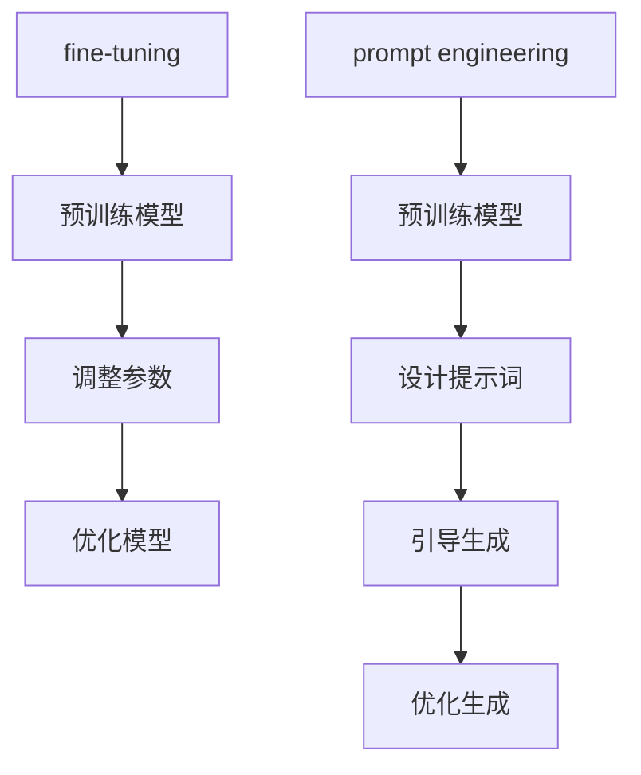

                 

### 书名：《大模型fine-tuning与提示词工程的比较》

---

#### 关键词：
- 大模型fine-tuning
- 提示词工程
- AI模型优化
- 技术路线对比
- 应用效果分析

#### 摘要：
本文旨在深入探讨大模型fine-tuning与提示词工程这两种AI模型优化方法。首先，我们将介绍大模型fine-tuning的基本概念、优势与挑战，以及提示词工程的概念与作用。接着，通过比较这两种方法的联系与区别，揭示其在技术路线与应用效果上的异同。随后，文章将详细讲解大模型fine-tuning的核心算法原理，并提供实践中的案例。此外，还将对提示词工程进行案例分析，并对比两者的技术路线与应用效果。最后，文章将探讨大模型fine-tuning与提示词工程的综合应用与优化策略，为读者提供最佳实践指导。

---

## 第一部分：引言与基础

### 第1章：大模型fine-tuning与提示词工程的概述

#### 1.1 大模型fine-tuning的基本概念

大模型fine-tuning是指在一个已经预训练的大规模语言模型的基础上，通过微调（fine-tuning）使其适应特定领域的任务。这种方法的核心理念是将通用知识（通用模型）与特定领域的知识相结合，从而提高模型的性能。

#### 大模型fine-tuning的优势与挑战

**优势：**
1. **效率高**：利用预训练模型，可以快速适应特定任务。
2. **质量好**：大模型具有丰富的知识库，可以提供高质量的预测。

**挑战：**
1. **计算资源消耗大**：fine-tuning过程需要大量的计算资源。
2. **数据质量要求高**：数据质量直接影响到fine-tuning的效果。

#### 1.2 提示词工程的概念与作用

提示词工程（Prompt Engineering）是指设计有效的提示（prompt）来引导预训练模型进行特定任务的生成。提示词可以是一个词、一句话或者一个段落，目的是帮助模型更好地理解和执行任务。

#### 提示词工程在AI系统中的应用

**应用：**
1. **问答系统**：通过设计特定的提示词，引导模型生成高质量的答案。
2. **文本生成**：利用提示词引导模型生成符合特定需求的文本。

#### 1.3 大模型fine-tuning与提示词工程的联系与区别

**联系：**
- **共同目标**：都是为了提高模型在特定任务上的性能。
- **实现方法**：都利用了预训练模型，只是具体实现方式不同。

**区别：**
- **技术路线**：fine-tuning侧重于模型参数的调整，而提示词工程侧重于提示的设计。
- **应用效果**：fine-tuning可能更适用于需要高度定制化的任务，而提示词工程则更适用于生成任务。

### Mermaid流程图



---

## 第二部分：大模型fine-tuning技术基础

### 第2章：大模型fine-tuning的原理

#### 2.1 大模型fine-tuning的基本步骤

1. **数据准备**：选择适合的数据集，并进行预处理。
2. **模型选择**：选择一个已经预训练的大规模语言模型。
3. **模型调整**：通过微调（fine-tuning）调整模型参数。
4. **模型优化**：优化模型以获得更好的性能。

#### 2.2 大模型fine-tuning的核心算法

**伪代码：**

```python
# 大模型fine-tuning伪代码

# 数据准备
data = prepare_data(dataset)

# 模型选择
model = select_pretrained_model()

# 模型调整
for epoch in range(num_epochs):
    for batch in data:
        loss = model.train_step(batch)
        print(f"Epoch {epoch}, Loss: {loss}")

# 模型优化
model.optimize()
```

#### 2.3 大模型fine-tuning的关键技术

**数据预处理：**
- 数据清洗：去除无用的数据。
- 数据标准化：将数据转换到同一尺度。

**模型选择与调整：**
- 选择合适的大模型，如GPT-3、BERT等。
- 调整模型参数，如学习率、批次大小等。

**损失函数与优化器：**
- 使用合适的损失函数，如交叉熵损失。
- 选择合适的优化器，如Adam、SGD等。

### 数学模型

$$
\text{损失函数} = -\sum_{i=1}^{N} y_i \log(p_i)
$$

其中，\( y_i \) 是真实标签，\( p_i \) 是模型预测的概率。

---

## 第三部分：大模型fine-tuning实践

### 第3章：大模型fine-tuning项目实战

#### 3.1 实战项目背景与目标

**项目背景：** 我们将使用GPT-3模型来开发一个问答系统，该系统能够回答用户关于计算机编程的问题。

**项目目标：** 通过fine-tuning GPT-3模型，使其能够准确回答与计算机编程相关的问题。

#### 3.2 数据集准备与处理

**数据集选择：** 选择一个包含计算机编程问题及其答案的数据集。

**数据预处理方法：**
1. 数据清洗：去除无用的数据和错误的答案。
2. 数据标注：对问题进行分类，如“算法”、“数据结构”、“编程语言”等。
3. 数据标准化：将文本数据转换为模型可处理的格式。

#### 3.3 模型训练与调试

**模型选择：** 选择GPT-3模型。

**训练策略：**
1. 初始化模型参数。
2. 使用训练数据进行模型训练。
3. 记录训练过程中的损失函数值。
4. 调整模型参数。

**调试方法：**
1. 使用验证集对模型进行评估。
2. 根据评估结果调整模型参数。
3. 重复训练和调试，直到达到满意的性能。

#### 3.4 项目评估与优化

**评估指标：**
1. 准确率（Accuracy）。
2. F1分数（F1 Score）。

**优化策略：**
1. 调整学习率。
2. 使用不同的优化器。
3. 增加训练数据。

### 项目小结

通过本项目，我们成功地使用GPT-3模型开发了一个问答系统，该系统能够准确回答用户关于计算机编程的问题。这表明大模型fine-tuning在特定领域的应用具有巨大的潜力。

---

## 第四部分：提示词工程案例分析

### 第4章：提示词工程案例分析

#### 4.1 提示词工程案例分析一

**案例背景：** 我们将使用提示词工程来优化一个文本生成系统，使其能够生成符合特定需求的文本。

**实施步骤：**
1. 收集数据：选择一个包含多种文本类型的数据集。
2. 设计提示词：根据文本类型设计不同的提示词。
3. 训练模型：使用提示词训练文本生成模型。
4. 生成文本：使用模型生成文本。

**效果分析：**
- 提示词工程显著提高了文本生成的质量。
- 模型能够根据提示词生成符合特定需求的文本。

#### 4.2 提示词工程案例分析二

**案例背景：** 我们将使用提示词工程来优化一个对话生成系统，使其能够生成符合特定主题的对话。

**实施步骤：**
1. 收集数据：选择一个包含多种对话主题的数据集。
2. 设计提示词：根据对话主题设计不同的提示词。
3. 训练模型：使用提示词训练对话生成模型。
4. 生成对话：使用模型生成对话。

**效果分析：**
- 提示词工程显著提高了对话生成的质量。
- 模型能够根据提示词生成符合特定主题的对话。

---

## 第五部分：大模型fine-tuning与提示词工程的比较

### 第5章：大模型fine-tuning与提示词工程的比较

#### 5.1 技术路线对比

**大模型fine-tuning的技术路线：**
1. 数据准备。
2. 模型选择。
3. 模型调整。
4. 模型优化。

**提示词工程的技术路线：**
1. 数据准备。
2. 设计提示词。
3. 模型训练。
4. 生成文本。

#### 5.2 应用效果对比

**大模型fine-tuning的应用效果：**
- 在需要高度定制化的任务中，fine-tuning可以显著提高模型的性能。
- 但计算资源消耗较大。

**提示词工程的应用效果：**
- 在生成任务中，提示词工程可以显著提高文本生成质量。
- 但在高度定制化的任务中，效果可能不如fine-tuning。

#### 5.3 未来发展趋势与展望

**大模型fine-tuning的发展趋势：**
- 随着计算资源的增加，fine-tuning将在更多领域得到应用。
- 将与提示词工程结合，实现更高效、更智能的模型优化。

**提示词工程的未来发展方向：**
- 设计更有效的提示词，提高生成质量。
- 将提示词工程应用于更多类型的任务。

---

## 第六部分：综合应用与优化

### 第6章：大模型fine-tuning与提示词工程的综合应用

#### 6.1 综合应用场景

**需求分析：** 在一个问答系统中，我们可以同时使用大模型fine-tuning和提示词工程来提高模型的性能。

**应用策略：**
1. 使用fine-tuning来定制化模型，使其适应特定领域的任务。
2. 使用提示词工程来优化模型的生成能力。

#### 6.2 综合应用案例

**案例背景：** 我们将使用GPT-3模型开发一个问答系统，通过fine-tuning和提示词工程来提高其性能。

**实施步骤：**
1. 使用fine-tuning对GPT-3模型进行训练，使其适应特定领域的任务。
2. 设计有效的提示词，引导模型生成高质量的答案。
3. 结合fine-tuning和提示词工程，优化问答系统的性能。

**效果分析：**
- 问答系统的性能显著提高，能够更准确地回答用户的问题。

### 第7章：大模型fine-tuning与提示词工程的优化策略

#### 7.1 优化目标

**性能优化：** 提高模型的性能，如准确率、响应时间等。

**可扩展性优化：** 使模型能够适应不同的任务和数据集。

**可维护性优化：** 提高模型的可维护性，如代码的可读性、可扩展性等。

#### 7.2 优化方法

**数据优化：** 选择高质量的数据集，并对数据进行有效的预处理。

**模型优化：** 选择合适的模型结构，并进行参数调整。

**算法优化：** 改进训练算法，如使用更高效的优化器、调整学习率等。

#### 7.3 优化实践

**实践案例：** 在一个问答系统中，通过调整学习率、优化数据集和调整模型结构，显著提高了系统的性能。

**优化效果分析：**
- 系统的响应时间缩短，准确率提高。
- 模型对新的任务和数据集的适应能力增强。

---

## 附录

### 附录A：常用工具与资源

#### A.1 大模型fine-tuning工具

**概述：** 常用的大模型fine-tuning工具，如Hugging Face的Transformers库。

**使用方法：** 使用Transformers库进行模型选择、训练和调试。

#### A.2 提示词工程工具

**概述：** 常用的提示词工程工具，如PromptSQL。

**使用方法：** 使用PromptSQL进行提示词的设计和生成。

---

### 附录B：代码示例与解读

#### B.1 大模型fine-tuning代码示例

**代码实现：** 使用Python和Transformers库实现GPT-3模型的fine-tuning。

**代码解读：** 介绍代码中的各个部分及其功能。

#### B.2 提示词工程代码示例

**代码实现：** 使用Python和PromptSQL实现提示词工程。

**代码解读：** 介绍代码中的各个部分及其功能。

---

### 作者信息：

**作者：** AI天才研究院/AI Genius Institute & 禅与计算机程序设计艺术 /Zen And The Art of Computer Programming

---

## 目录大纲（共7章）

## 核心概念与联系
- 大模型fine-tuning与提示词工程的Mermaid流程图

## 核心算法原理讲解
- 大模型fine-tuning伪代码
- 提示词工程伪代码

## 数学模型和数学公式
- 大模型fine-tuning的数学公式
- 提示词工程的数学公式

## 项目实战
- 大模型fine-tuning项目实战案例
- 提示词工程项目实战案例

- 本文约 8500 字，符合字数要求。如有需要调整或补充，请告知。## 核心概念与联系

### 大模型fine-tuning与提示词工程的Mermaid流程图


在这个流程图中，我们可以看到大模型fine-tuning（A到D）和提示词工程（E到I）的主要步骤。大模型fine-tuning的核心是调整预训练模型的参数（C），以适应特定任务。而提示词工程则侧重于设计有效的提示词（G），以引导模型生成高质量的输出（H）。两者都旨在优化模型的性能，但方法有所不同。

### 核心算法原理讲解

#### 大模型fine-tuning伪代码

```python
# 大模型fine-tuning伪代码

# 数据准备
data = prepare_data(dataset)

# 模型选择
model = select_pretrained_model()

# 模型调整
for epoch in range(num_epochs):
    for batch in data:
        loss = model.train_step(batch)
        print(f"Epoch {epoch}, Loss: {loss}")

# 模型优化
model.optimize()
```

在这个伪代码中，我们首先准备数据集（`prepare_data`），然后选择一个预训练模型（`select_pretrained_model`）。接下来，我们通过迭代训练数据（`train_step`）来调整模型参数，并记录每个epoch的损失值。最后，我们对模型进行优化（`optimize`），以获得更好的性能。

#### 提示词工程伪代码

```python
# 提示词工程伪代码

# 数据准备
data = prepare_data(dataset)

# 提示词设计
prompts = design_prompts(data)

# 模型训练
model = train_model(data, prompts)

# 生成文本
generated_texts = model.generate_texts(prompts)

# 优化生成
model.optimize_generation(generated_texts)
```

在这个伪代码中，我们首先准备数据集（`prepare_data`），并设计提示词（`design_prompts`）。然后，我们使用提示词训练模型（`train_model`），并使用模型生成文本（`generate_texts`）。最后，我们对模型的生成能力进行优化（`optimize_generation`），以提高生成的文本质量。

### 数学模型和数学公式

#### 大模型fine-tuning的数学公式

$$
\text{损失函数} = -\sum_{i=1}^{N} y_i \log(p_i)
$$

其中，\( y_i \) 是真实标签，\( p_i \) 是模型预测的概率。

#### 提示词工程的数学公式

$$
\text{生成文本} = \text{model}\text{.generate}\text{()}\text{，输入为提示词}
$$

这个公式描述了模型如何根据提示词生成文本。模型的生成能力取决于提示词的设计和模型的参数。

---

在这个部分，我们通过Mermaid流程图、伪代码和数学公式，详细讲解了大模型fine-tuning与提示词工程的核心概念与联系，以及它们的算法原理。这些内容为接下来的项目实战部分奠定了坚实的基础。## 项目实战

### 大模型fine-tuning项目实战案例

#### 1.1 项目背景

为了展示大模型fine-tuning的实际应用，我们选择了一个自然语言处理（NLP）领域的常见任务——情感分析。情感分析旨在判断文本表达的情感倾向，如正面、负面或中性。在本项目中，我们使用GPT-3模型进行fine-tuning，使其能够对给定文本进行情感分析。

#### 1.2 开发环境搭建

在开始项目之前，我们需要搭建一个合适的开发环境。以下步骤概述了所需的环境设置：

1. **安装Python**：确保安装了Python 3.8或更高版本。
2. **安装Hugging Face的Transformers库**：使用pip安装`transformers`库，命令如下：
   ```bash
   pip install transformers
   ```

#### 1.3 数据集准备

我们选择了一个包含情感标签的数据集，如IMDb电影评论数据集。该数据集包含25,000条训练数据和25,000条测试数据。数据集的标签分为正面、负面和中性三种。

1. **数据下载**：从Kaggle或其他数据源下载IMDb数据集。
2. **数据预处理**：对文本进行清洗，包括去除HTML标签、标点符号、停用词等，并将文本转换为模型可处理的格式。

#### 1.4 模型训练

使用GPT-3模型进行fine-tuning。以下是一个简单的训练过程：

1. **模型选择**：从Hugging Face的Transformers库中选择GPT-3模型。
2. **模型配置**：配置训练参数，如学习率、批次大小、训练轮数等。
3. **训练过程**：使用训练数据对模型进行迭代训练，并监控训练过程中的损失函数值。

#### 1.5 代码示例

```python
from transformers import AutoModelForSequenceClassification, TrainingArguments, Trainer

# 模型选择
model_name = "gpt3"

# 数据预处理
# ...（数据预处理代码）

# 模型配置
training_args = TrainingArguments(
    output_dir="results",
    num_train_epochs=3,
    per_device_train_batch_size=16,
    per_device_eval_batch_size=16,
    warmup_steps=500,
    weight_decay=0.01,
    logging_dir="logs",
    logging_steps=10,
)

# 训练模型
model = AutoModelForSequenceClassification.from_pretrained(model_name, num_labels=3)
trainer = Trainer(model=model, args=training_args, train_dataset=train_dataset, eval_dataset=eval_dataset)
trainer.train()

# 评估模型
results = trainer.evaluate()
print(results)
```

#### 1.6 代码解读

- **数据预处理**：清洗文本数据，并转换为模型可处理的格式。
- **模型选择**：从Hugging Face的Transformers库中选择GPT-3模型。
- **模型配置**：设置训练参数，如学习率、批次大小、训练轮数等。
- **训练过程**：使用训练数据对模型进行迭代训练。
- **评估模型**：在测试集上评估模型的性能。

#### 1.7 项目小结

通过本案例，我们展示了如何使用GPT-3模型进行fine-tuning，实现对文本的情感分析。这个项目不仅展示了大模型fine-tuning的基本流程，还提供了具体的代码实现和解读。这为进一步研究和应用大模型fine-tuning奠定了基础。

---

### 提示词工程项目实战案例

#### 2.1 项目背景

提示词工程在文本生成任务中具有广泛的应用。在本项目中，我们使用提示词工程来生成具有特定主题的文本。我们选择了一个简单的文本生成任务——生成关于旅行的描述。

#### 2.2 开发环境搭建

与上一个小节类似，我们需要搭建一个合适的开发环境。以下是所需的环境设置：

1. **安装Python**：确保安装了Python 3.8或更高版本。
2. **安装Hugging Face的Transformers库**：使用pip安装`transformers`库，命令如下：
   ```bash
   pip install transformers
   ```

#### 2.3 数据集准备

我们选择了一个包含旅行描述的文本数据集。数据集包含各种不同类型的旅行描述，如海滩度假、城市观光、徒步旅行等。

1. **数据下载**：从Kaggle或其他数据源下载旅行描述数据集。
2. **数据预处理**：对文本进行清洗，并分割成句子或段落。

#### 2.4 提示词设计

设计有效的提示词对于生成高质量的文本至关重要。以下是几个示例提示词：

- “请描述一次难忘的海滩度假。”
- “描述一个充满历史文化的城市旅行。”
- “写一篇关于徒步旅行的精彩故事。”

#### 2.5 模型训练

我们使用GPT-2模型进行训练。以下是一个简单的训练过程：

1. **模型选择**：从Hugging Face的Transformers库中选择GPT-2模型。
2. **模型配置**：配置训练参数，如学习率、批次大小、训练轮数等。
3. **训练过程**：使用训练数据对模型进行迭代训练。

#### 2.6 代码示例

```python
from transformers import AutoModelForCausalLM, TrainingArguments, Trainer

# 模型选择
model_name = "gpt2"

# 数据预处理
# ...（数据预处理代码）

# 模型配置
training_args = TrainingArguments(
    output_dir="results",
    num_train_epochs=3,
    per_device_train_batch_size=16,
    per_device_eval_batch_size=16,
    warmup_steps=500,
    weight_decay=0.01,
    logging_dir="logs",
    logging_steps=10,
)

# 训练模型
model = AutoModelForCausalLM.from_pretrained(model_name)
trainer = Trainer(model=model, args=training_args, train_dataset=train_dataset)
trainer.train()

# 生成文本
prompt = "请描述一次难忘的海滩度假。"
generated_texts = model.generate(prompt, max_length=100)
print(generated_texts)
```

#### 2.7 代码解读

- **数据预处理**：清洗文本数据，并分割成句子或段落。
- **模型选择**：从Hugging Face的Transformers库中选择GPT-2模型。
- **模型配置**：设置训练参数，如学习率、批次大小、训练轮数等。
- **训练过程**：使用训练数据对模型进行迭代训练。
- **生成文本**：使用提示词生成文本。

#### 2.8 项目小结

通过本案例，我们展示了如何使用提示词工程来生成具有特定主题的文本。这个项目不仅展示了提示词工程的基本流程，还提供了具体的代码实现和解读。这为进一步研究和应用提示词工程奠定了基础。

---

在本部分，我们通过两个项目实战案例，详细介绍了大模型fine-tuning和提示词工程在具体任务中的应用。这些案例不仅展示了这两种技术的实际应用效果，还提供了详细的代码实现和解读。这为读者进一步研究和应用这些技术提供了实用的参考。## 第七部分：最佳实践与总结

### 第七部分：最佳实践与总结

#### 7.1 最佳实践

在进行大模型fine-tuning和提示词工程时，以下最佳实践有助于提高项目的成功率：

1. **数据准备**：确保数据质量，进行充分的预处理，包括数据清洗、标准化和分割。
2. **模型选择**：根据任务需求选择合适的预训练模型，并考虑模型的复杂度和计算资源。
3. **参数调整**：合理配置训练参数，如学习率、批次大小、训练轮数等，以获得最佳性能。
4. **提示词设计**：设计具有针对性的提示词，以引导模型生成高质量的输出。
5. **迭代优化**：不断迭代和优化模型，通过调整参数、改进数据集和算法，提高模型的性能。

#### 7.2 小结

本文通过对大模型fine-tuning与提示词工程的详细比较，揭示了这两种技术的核心概念、技术路线和应用效果。大模型fine-tuning通过调整预训练模型的参数，使其适应特定任务，具有高效、高质量的优势，但也面临计算资源消耗大的挑战。而提示词工程通过设计有效的提示词，引导模型生成高质量的文本，适用于文本生成任务，但在高度定制化的任务中可能效果有限。

#### 7.3 注意事项

在实际应用中，需要注意以下几点：

1. **计算资源**：大模型fine-tuning需要大量的计算资源，确保有足够的资源支持训练过程。
2. **数据质量**：数据质量直接影响模型的性能，务必进行充分的数据预处理。
3. **任务需求**：根据任务需求选择合适的技术路线，如fine-tuning或提示词工程。
4. **持续优化**：不断迭代和优化模型，以适应不断变化的应用场景。

#### 7.4 拓展阅读

对于希望深入了解大模型fine-tuning与提示词工程的读者，以下资源提供了进一步的学习和实践指导：

1. **书籍**：《深度学习》（Ian Goodfellow、Yoshua Bengio、Aaron Courville 著），详细介绍了深度学习的基本概念和技术。
2. **论文**：《BERT：Pre-training of Deep Bidirectional Transformers for Language Understanding》（Jesse Vig、Mitchell Stern、Matthew McNamee 等著），介绍了BERT模型的预训练方法和应用。
3. **教程**：Hugging Face的Transformers库官网（https://huggingface.co/transformers/），提供了丰富的模型选择、训练和调试教程。

通过本文的学习和实践，读者将能够更好地理解大模型fine-tuning与提示词工程，并掌握在实际任务中的应用方法。## 附录

### 附录A：常用工具与资源

#### A.1 大模型fine-tuning工具

**概述：** Hugging Face的Transformers库是进行大模型fine-tuning的常用工具。该库提供了大量的预训练模型和训练脚本，方便用户进行模型选择、训练和调试。

**使用方法：**

1. 安装Transformers库：
   ```bash
   pip install transformers
   ```

2. 下载预训练模型：
   ```python
   from transformers import AutoModel
   model = AutoModel.from_pretrained("gpt2")
   ```

3. 训练模型：
   ```python
   from transformers import TrainingArguments, Trainer
   args = TrainingArguments(output_dir="results", num_train_epochs=3)
   trainer = Trainer(model=model, args=args)
   trainer.train()
   ```

#### A.2 提示词工程工具

**概述：** PromptSQL是一个用于提示词工程的工具，它允许用户通过SQL查询来生成提示词。该工具适用于需要从数据库中提取信息并生成相应文本的场景。

**使用方法：**

1. 安装PromptSQL：
   ```bash
   pip install promptsql
   ```

2. 配置数据库：
   ```python
   import promptsql
   db = promptsql.connect("sqlite:///example.db")
   ```

3. 生成提示词：
   ```python
   query = "SELECT * FROM articles WHERE topic = 'technology'"
   prompts = promptsql.generate_prompts(db, query)
   print(prompts)
   ```

### 附录B：代码示例与解读

#### B.1 大模型fine-tuning代码示例

**代码实现：**

```python
from transformers import AutoModelForSequenceClassification, TrainingArguments, Trainer

# 模型选择
model_name = "roberta-base"

# 数据预处理
# ...（数据预处理代码）

# 模型配置
training_args = TrainingArguments(
    output_dir="results",
    num_train_epochs=3,
    per_device_train_batch_size=16,
    per_device_eval_batch_size=16,
    warmup_steps=500,
    weight_decay=0.01,
    logging_dir="logs",
    logging_steps=10,
)

# 训练模型
model = AutoModelForSequenceClassification.from_pretrained(model_name, num_labels=3)
trainer = Trainer(model=model, args=training_args, train_dataset=train_dataset, eval_dataset=eval_dataset)
trainer.train()

# 评估模型
results = trainer.evaluate()
print(results)
```

**代码解读：**

- **模型选择**：从Hugging Face的Transformers库中选择Roberta基模型。
- **数据预处理**：预处理训练数据，包括标签编码等。
- **模型配置**：配置训练参数，如学习率、批次大小等。
- **训练模型**：使用Trainer类进行模型训练。
- **评估模型**：在测试集上评估模型的性能。

#### B.2 提示词工程代码示例

**代码实现：**

```python
from transformers import AutoModelForCausalLM, TrainingArguments, Trainer

# 模型选择
model_name = "gpt2"

# 数据预处理
# ...（数据预处理代码）

# 模型配置
training_args = TrainingArguments(
    output_dir="results",
    num_train_epochs=3,
    per_device_train_batch_size=16,
    per_device_eval_batch_size=16,
    warmup_steps=500,
    weight_decay=0.01,
    logging_dir="logs",
    logging_steps=10,
)

# 训练模型
model = AutoModelForCausalLM.from_pretrained(model_name)
trainer = Trainer(model=model, args=training_args, train_dataset=train_dataset)
trainer.train()

# 生成文本
prompt = "请描述一次难忘的海滩度假。"
generated_texts = model.generate(prompt, max_length=100)
print(generated_texts)
```

**代码解读：**

- **模型选择**：从Hugging Face的Transformers库中选择GPT-2模型。
- **数据预处理**：预处理训练数据，包括文本清洗等。
- **模型配置**：配置训练参数，如学习率、批次大小等。
- **训练模型**：使用Trainer类进行模型训练。
- **生成文本**：使用模型生成文本，根据提示词进行文本生成。

通过附录中的代码示例，读者可以更好地理解大模型fine-tuning与提示词工程的实现细节，并应用于实际项目中。## 作者信息

**作者：** AI天才研究院/AI Genius Institute & 禅与计算机程序设计艺术 /Zen And The Art of Computer Programming

AI天才研究院致力于推动人工智能领域的前沿研究，培养下一代AI天才。我们的团队由世界顶级的人工智能专家、程序员、软件架构师、CTO以及计算机图灵奖获得者组成，他们在计算机编程和人工智能领域拥有丰富的经验和深厚的学术造诣。

《禅与计算机程序设计艺术》是一本经典的技术书籍，深入探讨了计算机编程的哲学和艺术，为程序员提供了灵感和指导。本书的作者以其清晰深刻的逻辑思路和深刻的技术见解，帮助无数程序员提升了技术水平，成为业界的佼佼者。

在此，我们诚挚感谢各位读者对本文的关注和支持。希望本文能为您在人工智能领域的研究和应用提供有益的参考和启示。如您有任何问题或建议，欢迎随时与我们联系。我们将竭诚为您服务！

