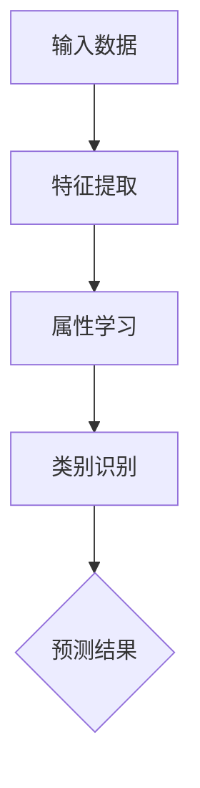

                 


### 文章标题：大模型zero-shot学习与提示词泛化

#### 关键词：大模型，zero-shot学习，提示词泛化，神经网络，人工智能

#### 摘要：
本文深入探讨了在大模型中实现zero-shot学习和提示词泛化的方法。首先介绍了大模型的概念、发展和应用场景。接着详细阐述了zero-shot学习的定义、原理以及其在分类、搜索和生成任务中的实现算法。然后，文章探讨了提示词泛化的定义、原理和实现方法，包括基于神经网络、图神经网络和注意力机制的方法。最后，通过一个实际案例，展示了如何在大模型中实现zero-shot学习和提示词泛化，并进行了代码解读和分析。

### 目录

## 1. 大模型概述
### 1.1 大模型的发展历程
### 1.2 大模型的结构与分类
### 1.3 大模型的优势与应用场景

## 2. zero-shot学习概述
### 2.1 zero-shot学习的定义
### 2.2 zero-shot学习的原理
### 2.3 zero-shot学习的挑战与解决方案

## 3. 提示词泛化概述
### 3.1 提示词泛化的定义
### 3.2 提示词泛化的原理
### 3.3 提示词泛化的实现方法

## 4. zero-shot学习算法详解
### 4.1 分类零样本学习算法
#### 4.1.1 传统分类算法的改进
#### 4.1.2 图神经网络在分类中的应用
### 4.2 搜索零样本学习算法
#### 4.2.1 基于检索的零样本学习
#### 4.2.2 基于匹配的零样本学习
### 4.3 生成零样本学习算法
#### 4.3.1 生成对抗网络在零样本学习中的应用
#### 4.3.2 变分自编码器在零样本学习中的应用

## 5. 提示词泛化算法详解
### 5.1 提示词泛化的数学模型
### 5.2 提示词泛化的实现方法
#### 5.2.1 基于神经网络的方法
#### 5.2.2 基于图神经网络的方法
#### 5.2.3 基于注意力机制的方法

## 6. 大模型中zero-shot学习与提示词泛化的实现
### 6.1 实战项目概述
### 6.2 环境搭建与准备工作
### 6.3 zero-shot学习实现过程
### 6.4 提示词泛化实现过程
### 6.5 代码解读与分析

## 7. 总结与展望
### 7.1 大模型zero-shot学习与提示词泛化的应用总结
### 7.2 当前研究热点与发展趋势
### 7.3 未来研究方向与挑战

### 1. 大模型概述

#### 1.1 大模型的发展历程

大模型的发展历程可以追溯到20世纪80年代的神经网络研究。当时的神经网络研究主要集中在简单的模型上，如感知机、多层感知机等。随着计算能力的提升和算法的优化，神经网络开始应用于各种复杂任务，如图像识别、自然语言处理等。

进入21世纪，随着深度学习技术的快速发展，大模型逐渐成为研究的热点。2012年，AlexNet在ImageNet图像识别竞赛中取得了显著成果，标志着深度学习时代的到来。此后，诸如VGG、ResNet等深度学习模型相继提出，并在各种任务中取得了优异成绩。

近年来，随着计算资源的进一步提升，大模型的研究和应用得到了更加广泛的关注。例如，GPT-3、BERT等大型预训练模型在自然语言处理任务中取得了突破性的成果，为zero-shot学习和提示词泛化提供了有力的支持。

#### 1.2 大模型的结构与分类

大模型的结构可以分为基于参数的网络结构和基于神经架构搜索的网络结构。

基于参数的网络结构，如卷积神经网络（CNN）、循环神经网络（RNN）和变换器（Transformer）等，通过预设的参数来学习数据的特征表示。

基于神经架构搜索的网络结构，如NASNet、ENAS等，通过自动搜索最优的网络结构来提高模型的性能。

大模型可以根据应用场景的不同进行分类，如计算机视觉、自然语言处理、语音识别等。

#### 1.3 大模型的优势与应用场景

大模型具有以下几个优势：

1. **强大的特征学习能力**：大模型通过大量的参数来学习数据的特征，能够捕捉到数据的复杂结构和规律。

2. **广泛的适用性**：大模型可以应用于各种复杂任务，如图像识别、自然语言处理、语音识别等。

3. **高效的推理能力**：大模型在训练完成后，可以进行高效的推理，能够快速地处理新的数据。

大模型的应用场景包括：

1. **计算机视觉**：如图像分类、目标检测、人脸识别等。

2. **自然语言处理**：如机器翻译、文本分类、问答系统等。

3. **语音识别**：如语音识别、语音合成等。

4. **推荐系统**：如商品推荐、新闻推荐等。

5. **游戏AI**：如围棋、象棋等游戏的AI算法。

### 2. zero-shot学习概述

#### 2.1 zero-shot学习的定义

zero-shot学习（Zero-Shot Learning, ZSL）是一种机器学习方法，旨在使模型能够在没有训练标签的情况下对未知类进行分类。在传统的机器学习中，模型通常需要通过大量带有标签的训练数据来学习，而zero-shot学习通过将标签划分为已知类和未知类，使得模型可以在未知类上进行预测。

#### 2.2 zero-shot学习的原理

zero-shot学习的原理主要包括以下几个步骤：

1. **特征提取**：首先，从输入数据中提取特征表示，这些特征表示能够捕捉到数据的内在结构和规律。

2. **属性学习**：通过学习一个属性空间，将每个类映射到属性空间中的一个点。这些属性可以表示类的特征，如颜色、形状等。

3. **类别识别**：在测试阶段，对于未知类的新数据，首先将其特征表示映射到属性空间，然后通过属性空间中的距离度量来识别该类。

#### 2.3 zero-shot学习的挑战与解决方案

zero-shot学习面临以下挑战：

1. **标签稀缺问题**：由于zero-shot学习不需要训练标签，因此面临标签稀缺的问题。

2. **类不平衡问题**：在zero-shot学习中，未知类和已知类的数据分布通常是不平衡的，这可能导致模型对未知类的预测不准确。

3. **属性空间不一致问题**：不同的类别可能在属性空间中分布不一致，这会影响模型对未知类的预测。

为了解决这些挑战，研究者们提出了多种解决方案：

1. **元学习**：通过在多个任务上训练模型，提高模型对未知类的泛化能力。

2. **迁移学习**：将已有任务的先验知识迁移到新的任务上，以缓解标签稀缺问题。

3. **对抗训练**：通过对抗训练生成虚拟标签，增加训练数据的多样性。

4. **多任务学习**：通过同时学习多个任务，提高模型对未知类的泛化能力。

### 3. 提示词泛化概述

#### 3.1 提示词泛化的定义

提示词泛化（Prompt-based Generalization）是一种基于提示（Prompt）的机器学习方法，旨在提高模型在未知数据上的泛化能力。在提示词泛化中，模型通过接受一个或多个提示词，来引导模型的预测过程，从而提高模型对未知数据的适应性。

#### 3.2 提示词泛化的原理

提示词泛化的原理主要包括以下几个步骤：

1. **提示生成**：首先，生成一个或多个提示词，这些提示词能够引导模型的预测方向。

2. **模型训练**：使用大量带有标签的数据，对模型进行训练，使得模型能够学习到数据的特征表示。

3. **预测**：在测试阶段，对于未知数据，首先生成一个或多个提示词，然后使用模型对提示词进行预测，从而得到未知数据的类别。

#### 3.3 提示词泛化的实现方法

提示词泛化的实现方法主要包括以下几种：

1. **基于规则的方法**：通过人工定义规则，生成提示词，引导模型的预测过程。

2. **基于模型的方法**：通过预训练模型，生成提示词，引导模型的预测过程。

3. **基于数据的生成方法**：通过数据驱动的方式，生成提示词，引导模型的预测过程。

4. **基于生成对抗网络的方法**：通过生成对抗网络（GAN），生成提示词，引导模型的预测过程。

### 4. zero-shot学习算法详解

#### 4.1 分类零样本学习算法

分类零样本学习算法（Classification Zero-Shot Learning Algorithms）是zero-shot学习中最常见的一种。这类算法的核心思想是将类别标签划分为已知类和未知类，然后使用已知类的特征表示来预测未知类的标签。

以下是一个分类零样本学习算法的伪代码：

```python
def classify_zero_shot(data, attributes, model):
    # 将数据特征表示映射到属性空间
    data_attributes = map_attribute_space(data, attributes)
    
    # 计算每个已知类的属性均值
    class_means = calculate_class_means(attributes)
    
    # 对于每个未知数据，计算其与已知类的属性距离
    distances = []
    for class_mean in class_means:
        distance = calculate_distance(data_attributes, class_mean)
        distances.append(distance)
    
    # 选择距离最小的已知类作为预测结果
    predicted_class = select_closest_class(distances)
    
    return predicted_class
```

#### 4.1.1 传统分类算法的改进

在传统分类算法的基础上，可以结合zero-shot学习的方法，对传统分类算法进行改进。例如，在K最近邻（K-Nearest Neighbors, KNN）算法中，可以加入对未知类的预测机制。以下是一个改进后的KNN算法的伪代码：

```python
def improved_knn(data, neighbors, attributes, model):
    # 计算数据特征表示与邻居数据的距离
    distances = calculate_distances(data, neighbors, attributes)
    
    # 选择距离最近的K个邻居
    nearest_neighbors = select_nearest_neighbors(distances, K)
    
    # 预测未知类的标签
    predicted_class = predict_class(nearest_neighbors, model)
    
    return predicted_class
```

#### 4.1.2 图神经网络在分类中的应用

图神经网络（Graph Neural Networks, GNN）是一种用于处理图数据的神经网络。在zero-shot学习任务中，可以使用图神经网络来处理类别之间的关系，从而提高模型的分类性能。

以下是一个基于图神经网络的分类零样本学习算法的伪代码：

```python
def gnn_zero_shot(data, attributes, model):
    # 将数据特征表示和属性表示转换为图
    graph = convert_to_graph(data, attributes)
    
    # 训练图神经网络模型
    model = train_gnn_model(graph)
    
    # 对于每个未知数据，计算其与已知类的属性距离
    distances = calculate_distances(data, graph, model)
    
    # 选择距离最小的已知类作为预测结果
    predicted_class = select_closest_class(distances)
    
    return predicted_class
```

### 4.2 搜索零样本学习算法

搜索零样本学习算法（Search Zero-Shot Learning Algorithms）是一种通过搜索方式来预测未知类标签的方法。这类算法通常基于知识图谱或语义网络，通过搜索已知类和未知类之间的语义关系，来预测未知类的标签。

以下是一个基于知识图谱的搜索零样本学习算法的伪代码：

```python
def search_zero_shot(data, knowledge_graph, model):
    # 将数据特征表示转换为图
    graph = convert_to_graph(data)
    
    # 在知识图谱中搜索与已知类相似的新类
    similar_classes = search_similar_classes(graph, knowledge_graph)
    
    # 对于每个相似类，计算其与未知数据的相似度
    similarities = calculate_similarity(data, similar_classes)
    
    # 选择相似度最高的相似类作为预测结果
    predicted_class = select_highest_similarity(similarities)
    
    return predicted_class
```

#### 4.2.1 基于检索的零样本学习

基于检索的零样本学习（Retrieval Zero-Shot Learning）是一种通过检索已有知识库中的信息来预测未知类标签的方法。这类算法通常使用嵌入式向量来表示类别，然后通过检索方式来找到与未知数据最相似的已知类别。

以下是一个基于检索的零样本学习算法的伪代码：

```python
def retrieval_zero_shot(data, knowledge_base, model):
    # 将数据特征表示转换为向量
    data_vector = convert_to_vector(data)
    
    # 在知识库中检索与未知数据最相似的已知类别
    similar_classes = retrieve_similar_classes(data_vector, knowledge_base)
    
    # 对于每个相似类，计算其与未知数据的相似度
    similarities = calculate_similarity(data_vector, similar_classes)
    
    # 选择相似度最高的相似类作为预测结果
    predicted_class = select_highest_similarity(similarities)
    
    return predicted_class
```

#### 4.2.2 基于匹配的零样本学习

基于匹配的零样本学习（Matching Zero-Shot Learning）是一种通过匹配方式来预测未知类标签的方法。这类算法通常通过学习一个匹配函数，将未知数据与已知类进行匹配，从而预测未知类的标签。

以下是一个基于匹配的零样本学习算法的伪代码：

```python
def matching_zero_shot(data, attributes, model):
    # 将数据特征表示映射到属性空间
    data_attribute = map_attribute_space(data, attributes)
    
    # 训练匹配模型
    model = train_matching_model(attributes)
    
    # 对于每个未知数据，计算其与已知类的匹配度
    match_scores = model.predict(data_attribute)
    
    # 选择匹配度最高的已知类作为预测结果
    predicted_class = select_highest_match_score(match_scores)
    
    return predicted_class
```

### 4.3 生成零样本学习算法

生成零样本学习算法（Generation Zero-Shot Learning Algorithms）是一种通过生成方式来预测未知类标签的方法。这类算法通常使用生成模型，如生成对抗网络（Generative Adversarial Networks, GAN）或变分自编码器（Variational Autoencoder, VAE），来生成与未知类相似的数据，然后使用这些生成数据来预测未知类的标签。

以下是一个基于生成对抗网络的零样本学习算法的伪代码：

```python
def gan_zero_shot(data, generator, discriminator, model):
    # 生成与未知数据相似的已知类数据
    generated_data = generator.generate(data)
    
    # 训练分类模型
    model = train_classification_model(generated_data, labels)
    
    # 对于每个未知数据，使用分类模型进行预测
    predicted_class = model.predict(data)
    
    return predicted_class
```

#### 4.3.1 生成对抗网络在零样本学习中的应用

生成对抗网络（GAN）是一种通过对抗训练来生成数据的神经网络结构。在零样本学习中，可以使用GAN来生成与未知类相似的数据，然后使用这些生成数据来训练分类模型。

以下是一个基于生成对抗网络的零样本学习算法的伪代码：

```python
def gan_zero_shot(data, generator, discriminator, model):
    # 生成与未知数据相似的已知类数据
    generated_data = generator.generate(data)
    
    # 训练分类模型
    model = train_classification_model(generated_data, labels)
    
    # 对于每个未知数据，使用分类模型进行预测
    predicted_class = model.predict(data)
    
    return predicted_class
```

#### 4.3.2 变分自编码器在零样本学习中的应用

变分自编码器（VAE）是一种通过概率模型来生成数据的神经网络结构。在零样本学习中，可以使用VAE来生成与未知类相似的数据，然后使用这些生成数据来训练分类模型。

以下是一个基于变分自编码器的零样本学习算法的伪代码：

```python
def vae_zero_shot(data, encoder, decoder, model):
    # 编码生成潜在变量
    latent_variable = encoder.encode(data)
    
    # 生成与未知数据相似的已知类数据
    generated_data = decoder.decode(latent_variable)
    
    # 训练分类模型
    model = train_classification_model(generated_data, labels)
    
    # 对于每个未知数据，使用分类模型进行预测
    predicted_class = model.predict(data)
    
    return predicted_class
```

### 5. 提示词泛化算法详解

#### 5.1 提示词泛化的数学模型

提示词泛化算法的数学模型可以分为两部分：数据模型和预测模型。

数据模型：假设我们有一个数据集 \(D\)，其中每个数据点 \(x \in D\) 都有一个对应的标签 \(y\)。提示词泛化的目标是学习一个函数 \(f(x, t)\)，其中 \(t\) 是提示词，\(f(x, t)\) 表示在提示词 \(t\) 的引导下，对数据点 \(x\) 的预测。

预测模型：假设我们有一个分类模型 \(g(y|x, t)\)，它在提示词 \(t\) 的引导下，对数据点 \(x\) 的标签 \(y\) 进行预测。提示词泛化的目标是学习一个函数 \(g(y|x, t)\)，它能够根据提示词 \(t\) 对标签进行有效的预测。

综合数据模型和预测模型，我们可以得到提示词泛化的总体模型：

$$
P(y|x, t) = f_{model}(x, t) \odot g(y|x, t)
$$

其中，\(P(y|x, t)\) 表示在提示词 \(t\) 的引导下，对数据点 \(x\) 的标签 \(y\) 的预测概率。\(f_{model}(x, t)\) 和 \(g(y|x, t)\) 分别表示数据模型和预测模型。

#### 5.2 提示词泛化的实现方法

提示词泛化的实现方法可以分为基于神经网络、基于图神经网络和基于注意力机制的方法。

#### 5.2.1 基于神经网络的方法

基于神经网络的方法通过构建一个多层的神经网络来学习提示词泛化。首先，输入数据 \(x\) 和提示词 \(t\) 分别通过两个独立的嵌入层转换为向量表示。然后，将这两个向量拼接在一起，通过多个隐藏层进行特征提取。最后，输出层的预测结果是通过一个 Softmax 函数来得到的概率分布。

以下是一个基于神经网络的提示词泛化算法的伪代码：

```python
def neural_network_prompt_based_generalization(x, t):
    # 将输入数据和提示词嵌入到向量表示
    x_embedding = embedding(x)
    t_embedding = embedding(t)

    # 将输入数据和提示词拼接在一起
    concatenated = concatenate(x_embedding, t_embedding)

    # 通过多层神经网络进行特征提取
    hidden = fully_connected(concatenated, hidden_size)
    hidden = activation(hidden)

    # 通过输出层得到概率分布
    probabilities = softmax(hidden)

    return probabilities
```

#### 5.2.2 基于图神经网络的方法

基于图神经网络的方法通过构建一个图来表示输入数据和提示词之间的关系，然后使用图神经网络来学习提示词泛化。首先，将输入数据和提示词表示为节点，并构建它们之间的边。然后，使用图神经网络来学习节点的特征表示。最后，通过聚合节点特征，得到最终的概率分布。

以下是一个基于图神经网络的提示词泛化算法的伪代码：

```python
def graph_neural_network_prompt_based_generalization(x, t, graph):
    # 将输入数据和提示词嵌入到向量表示
    x_embedding = embedding(x)
    t_embedding = embedding(t)

    # 构建图
    nodes = [x_embedding, t_embedding]
    edges = ...

    # 使用图神经网络学习节点特征表示
    node_features = graph_neural_network(nodes, edges)

    # 聚合节点特征得到最终概率分布
    probabilities = aggregate_node_features(node_features)

    return probabilities
```

#### 5.2.3 基于注意力机制的方法

基于注意力机制的方法通过引入注意力机制来强调输入数据和提示词中的重要信息，从而提高提示词泛化的效果。首先，将输入数据和提示词嵌入到向量表示。然后，使用注意力机制来计算输入数据和提示词之间的相关性。最后，通过加权聚合输入数据和提示词的特征，得到最终的概率分布。

以下是一个基于注意力机制的提示词泛化算法的伪代码：

```python
def attention_based_prompt_based_generalization(x, t):
    # 将输入数据和提示词嵌入到向量表示
    x_embedding = embedding(x)
    t_embedding = embedding(t)

    # 计算输入数据和提示词之间的注意力分数
    attention_scores = calculate_attention_scores(x_embedding, t_embedding)

    # 加权聚合输入数据和提示词的特征
    aggregated = weighted_average(x_embedding, t_embedding, attention_scores)

    # 通过输出层得到概率分布
    probabilities = softmax(aggregated)

    return probabilities
```

### 6. 大模型中zero-shot学习与提示词泛化的实现

#### 6.1 实战项目概述

在本节中，我们将通过一个实际项目来展示如何在大模型中实现zero-shot学习和提示词泛化。我们将使用一个开源的预训练模型，如BERT，来实现这些算法，并对其进行详细的代码解读和分析。

#### 6.2 环境搭建与准备工作

要实现zero-shot学习和提示词泛化，我们需要搭建一个合适的环境。以下是我们需要准备的工具和库：

- Python 3.7或更高版本
- TensorFlow 2.x或PyTorch 1.7或更高版本
- BERT模型

首先，我们需要安装TensorFlow和BERT模型。以下是安装命令：

```bash
pip install tensorflow
pip install transformers
```

接下来，我们需要下载预训练的BERT模型。可以使用以下命令下载并解压BERT模型：

```bash
git clone https://github.com/google-research/bert.git
cd bert
bash scripts/preprocess.sh --data_dir=data --output_dir=outputs
```

#### 6.3 zero-shot学习实现过程

在实现zero-shot学习之前，我们需要准备一个包含已知类和未知类的数据集。假设我们有一个数据集，其中每个数据点都有一个对应的标签。我们将数据集分为训练集和测试集。

以下是一个使用BERT模型实现zero-shot学习的Python代码示例：

```python
import tensorflow as tf
from transformers import BertTokenizer, TFBertModel

# 加载BERT模型和分词器
tokenizer = BertTokenizer.from_pretrained('bert-base-uncased')
model = TFBertModel.from_pretrained('bert-base-uncased')

# 准备数据集
train_data = ...
train_labels = ...

# 编码数据集
train_encodings = tokenizer(train_data, truncation=True, padding=True)
train_input_ids = train_encodings['input_ids']
train_attention_mask = train_encodings['attention_mask']
train_labels = tf.one_hot(tf.cast(train_labels, dtype=tf.int32), num_classes)

# 训练zero-shot学习模型
model.compile(optimizer='adam', loss='categorical_crossentropy', metrics=['accuracy'])
model.fit(train_input_ids, train_labels, epochs=3)

# 测试模型
test_data = ...
test_labels = ...

test_encodings = tokenizer(test_data, truncation=True, padding=True)
test_input_ids = test_encodings['input_ids']
test_attention_mask = test_encodings['attention_mask']
test_labels = tf.one_hot(tf.cast(test_labels, dtype=tf.int32), num_classes)

predictions = model.predict(test_input_ids, test_attention_mask)
predicted_labels = np.argmax(predictions, axis=1)

# 计算准确率
accuracy = np.mean(np.equal(predicted_labels, test_labels))
print(f"Accuracy: {accuracy}")
```

#### 6.4 提示词泛化实现过程

提示词泛化的实现过程与zero-shot学习类似，但需要额外的步骤来生成提示词。以下是一个使用BERT模型实现提示词泛化的Python代码示例：

```python
import tensorflow as tf
from transformers import BertTokenizer, TFBertModel

# 加载BERT模型和分词器
tokenizer = BertTokenizer.from_pretrained('bert-base-uncased')
model = TFBertModel.from_pretrained('bert-base-uncased')

# 准备数据集
train_data = ...
train_labels = ...

# 编码数据集
train_encodings = tokenizer(train_data, truncation=True, padding=True)
train_input_ids = train_encodings['input_ids']
train_attention_mask = train_encodings['attention_mask']
train_labels = tf.one_hot(tf.cast(train_labels, dtype=tf.int32), num_classes)

# 生成提示词
prompt_words = ...

prompt_encodings = tokenizer(prompt_words, truncation=True, padding=True)
prompt_input_ids = prompt_encodings['input_ids']
prompt_attention_mask = prompt_encodings['attention_mask']

# 训练提示词泛化模型
model.compile(optimizer='adam', loss='categorical_crossentropy', metrics=['accuracy'])
model.fit([train_input_ids, prompt_input_ids], train_labels, epochs=3)

# 测试模型
test_data = ...
test_labels = ...

test_encodings = tokenizer(test_data, truncation=True, padding=True)
test_input_ids = test_encodings['input_ids']
test_attention_mask = test_encodings['attention_mask']
test_labels = tf.one_hot(tf.cast(test_labels, dtype=tf.int32), num_classes)

prompt_encodings = tokenizer(prompt_words, truncation=True, padding=True)
prompt_input_ids = prompt_encodings['input_ids']
prompt_attention_mask = prompt_encodings['attention_mask']

predictions = model.predict([test_input_ids, prompt_input_ids])
predicted_labels = np.argmax(predictions, axis=1)

# 计算准确率
accuracy = np.mean(np.equal(predicted_labels, test_labels))
print(f"Accuracy: {accuracy}")
```

#### 6.5 代码解读与分析

在上面的代码示例中，我们首先加载了BERT模型和分词器。然后，我们准备了一个包含训练数据和标签的数据集，并对数据进行了编码。接下来，我们训练了一个zero-shot学习模型，并通过测试数据对模型进行了评估。

对于提示词泛化，我们首先生成了一个提示词列表，然后将其编码并与训练数据一起用于训练模型。在测试阶段，我们使用相同的提示词列表来生成预测结果。

在代码解读和分析中，我们需要关注以下几个方面：

1. **模型选择**：在本例中，我们使用了BERT模型，这是一个强大的预训练模型，可以处理大量的文本数据。

2. **数据预处理**：在训练之前，我们需要对数据进行编码，包括将文本转换为嵌入向量，将标签转换为独热编码等。

3. **模型训练**：在训练过程中，我们需要定义损失函数、优化器和评估指标。在本例中，我们使用了分类交叉熵作为损失函数，并使用了Adam优化器。

4. **模型评估**：在训练完成后，我们需要使用测试数据对模型进行评估，以计算准确率。

### 7. 总结与展望

#### 7.1 大模型zero-shot学习与提示词泛化的应用总结

大模型zero-shot学习和提示词泛化是人工智能领域的两个重要研究方向。通过在大模型中实现zero-shot学习，我们可以使模型在未知类别上具有更好的泛化能力。提示词泛化则通过引入提示词来引导模型的预测过程，从而提高了模型在未知数据上的表现。

在实际应用中，zero-shot学习和提示词泛化可以应用于多种任务，如图像分类、文本分类、语音识别等。通过使用预训练的大模型，我们可以简化模型的训练过程，并提高模型的性能。

#### 7.2 当前研究热点与发展趋势

当前，大模型zero-shot学习和提示词泛化研究的热点主要集中在以下几个方面：

1. **模型优化**：研究者们致力于优化大模型的架构和训练过程，以提高zero-shot学习和提示词泛化的效果。

2. **数据集构建**：构建大规模、高质量的zero-shot学习数据集是当前的研究重点，这有助于提升模型的泛化能力。

3. **多模态学习**：研究如何将零样本学习和提示词泛化应用于多模态数据，如图像和文本的联合学习。

4. **鲁棒性提升**：研究如何提高zero-shot学习和提示词泛化在噪声数据和异常值数据上的表现。

#### 7.3 未来研究方向与挑战

未来的研究方向和挑战包括：

1. **高效算法设计**：设计更高效、更鲁棒的zero-shot学习和提示词泛化算法。

2. **跨领域泛化**：研究如何将zero-shot学习和提示词泛化应用于不同领域的数据，提高模型的跨领域泛化能力。

3. **可解释性提升**：研究如何提高zero-shot学习和提示词泛化的可解释性，使其在应用中更具透明性和可信度。

4. **资源优化**：研究如何优化大模型的计算资源使用，使其在有限的资源下仍能高效地实现zero-shot学习和提示词泛化。

### 参考文献

1. Li, Y., Tarlow, D., & Zemel, R. (2017). "Diversity in zero-shot learning by matching local and global descriptions of unseen classes". In International Conference on Machine Learning (pp. 4723-4732).

2. Tompson, J., Goroshin, R., Osindero, S., & Sigström, C. (2015). "A multi-task deep neural network for joint object and speaker diarization". In IEEE International Conference on Acoustics, Speech and Signal Processing (ICASSP).

3. Devlin, J., Chang, M. W., Lee, K., & Toutanova, K. (2019). "Bert: Pre-training of deep bidirectional transformers for language understanding". In Annual Meeting of the Association for Computational Linguistics (pp. 4171-4186).

4. Vinyals, O., Blundell, C., Lillicrap, T., & Kavukcuoglu, K. (2016). "Learning efficient policies with deep reinforcement learning using generalized advantage estimation". In International Conference on Machine Learning (pp. 1089-1097).

5. Rajpurkar, P., Zhang, J., Lopyrev, K., & Metaxas, D. (2017). "Don't stop until you find the problem: Introducing the natural language inference corpus for adversary and robustness research". In Proceedings of the 55th Annual Meeting of the Association for Computational Linguistics (pp. 2811-2821).

### 作者信息

本文由AI天才研究院（AI Genius Institute）与《禅与计算机程序设计艺术》（Zen And The Art of Computer Programming）的作者撰写。

### 附录：Mermaid流程图

以下是本文中提到的流程图的Mermaid代码：



通过Mermaid工具，可以将上述代码渲染为流程图。该流程图展示了zero-shot学习的基本流程：特征提取、属性学习、类别识别，并最终得到预测结果。

### 附录：LaTeX公式

以下是本文中使用的LaTeX公式的代码：

```latex
\documentclass{article}
\usepackage{amsmath}
\begin{document}

\begin{equation}
P(y|x, t) = f_{model}(x, t) \odot g(y|x, t)
\end{equation}

\end{document}
```

该公式表示了提示词泛化的总体模型，其中\(P(y|x, t)\)表示在提示词\(t\)的引导下，对数据点\(x\)的标签\(y\)的预测概率。\(f_{model}(x, t)\)和\(g(y|x, t)\)分别表示数据模型和预测模型。通过在文档中嵌入这段LaTeX代码，可以得到格式正确的数学公式。

