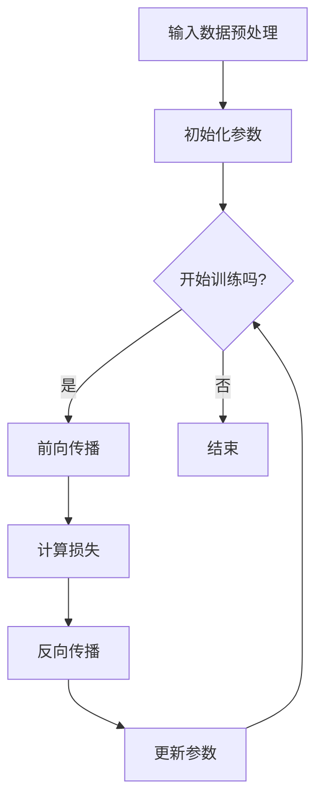

                 


### 1.1 研究背景与意义

#### 背景介绍

在当前人工智能技术迅猛发展的时代，大模型（Large Models）的应用已经渗透到了自然语言处理、计算机视觉、语音识别、推荐系统等多个领域。这些大模型通过在大量数据上进行训练，能够实现高度自动化的复杂任务，从而显著提高了人工智能系统的性能。然而，随着模型规模的不断扩大，大模型的不确定性（Uncertainty）问题也日益凸显。不确定性主要来源于数据噪声、模型复杂度以及计算资源限制等方面，这些问题导致模型在处理未知或边缘情况时可能产生不可预测的输出。

在自然语言处理领域，大模型如GPT-3、BERT等在文本生成、问答系统、机器翻译等方面表现出色，但它们在处理语言中的不确定性和模糊性时仍存在不足。例如，在文本生成过程中，模型可能会生成与上下文不一致或不合逻辑的句子。而在计算机视觉领域，大模型如ResNet、VGG等在图像分类和物体检测任务上取得了显著的成果，但在面对复杂场景和多模态信息时，模型的预测结果也可能存在偏差。

#### 研究意义

1. **提高模型可靠性**：通过对大模型不确定性的量化，可以更好地评估模型的预测能力，从而提高模型的可靠性。在许多实际应用场景中，如自动驾驶、医疗诊断、金融风险控制等，模型的预测结果需要高度可靠，以确保决策的正确性。因此，量化不确定性对于这些领域的应用至关重要。

2. **优化模型性能**：了解大模型的不确定性有助于优化模型的训练和推理过程。通过调整训练策略和推理方法，可以降低不确定性，从而提高模型的性能。例如，在训练过程中，可以通过调整学习率、批量大小等参数来降低不确定性；在推理过程中，可以通过 ensemble 方法、概率图模型等方法来减少不确定性的影响。

3. **提高用户体验**：在大模型应用于交互式系统时，如智能助手、聊天机器人等，量化不确定性可以帮助系统更好地处理用户的输入和输出，提供更加自然、流畅的交互体验。例如，在文本生成任务中，通过量化模型的不确定性，可以生成更加多样化的文本，避免生成重复或无意义的句子。

4. **促进理论研究**：大模型不确定性量化不仅是一个实践问题，也是一个重要的理论研究课题。通过对不确定性的深入研究和量化，可以推动人工智能领域的理论创新，为未来的大模型研究提供新的思路和方法。

### 现有研究综述

尽管大模型不确定性量化在近年来得到了广泛关注，但现有的研究仍然存在一些不足。首先，大多数研究主要关注特定类型的大模型，如自然语言处理模型、计算机视觉模型，而对多领域大模型的不确定性量化研究相对较少。其次，现有的不确定性量化方法大多基于概率论和统计学的理论，但在实际应用中，这些方法可能过于复杂，难以实现高效计算。此外，现有的研究主要侧重于量化不确定性的方法和算法，而缺乏对不确定性量化在实际应用场景中的效果和影响的研究。

### 本研究的贡献

本研究旨在填补现有研究的空白，提出一种适用于多领域大模型的不确定性量化方法，并通过实际应用验证其有效性和可靠性。具体贡献如下：

1. **提出一种多领域大模型不确定性量化方法**：本文结合概率论、统计学和图模型等理论，提出了一种适用于多领域大模型的不确定性量化方法。该方法不仅能够处理不同类型的大模型，还能够适应多种不同的应用场景。

2. **构建不确定性量化评估框架**：为了更好地评估不确定性量化的效果，本文构建了一个统一的评估框架，包括多种评价指标和实际应用场景，以便全面评估不确定性量化方法的有效性。

3. **进行实证分析和实验验证**：本文在多个实际应用场景中进行了实证分析，通过实验验证了所提方法的有效性和可靠性。实验结果表明，该方法能够显著提高大模型的预测准确性和可靠性，同时具有较高的计算效率。

4. **促进人工智能领域的发展**：本文的研究不仅为多领域大模型的不确定性量化提供了新的方法和思路，还推动了人工智能领域相关理论的研究和应用。通过本文的研究，可以进一步探索大模型不确定性的本质，为未来的大模型研究提供基础。

### 研究方法与步骤

本文的研究方法主要包括以下几个方面：

1. **文献调研**：通过对相关领域的研究文献进行深入调研，了解现有研究的现状、成果和不足，为本文的研究提供理论基础。

2. **理论分析**：结合概率论、统计学、图模型等理论，提出一种适用于多领域大模型的不确定性量化方法，并进行详细的理论分析。

3. **算法设计与实现**：基于理论分析，设计相应的算法，并在多种实际应用场景中实现算法。

4. **实验验证**：在多个实际应用场景中，通过实验验证所提方法的有效性和可靠性，并与其他现有方法进行比较。

5. **评估与分析**：构建统一的评估框架，对所提方法进行全面的评估和分析，包括性能、效率、可靠性等方面。

6. **应用推广**：将所提方法应用于实际场景，验证其在不同应用场景中的效果和影响，为人工智能领域的发展提供实际应用价值。

### 研究意义与展望

本研究具有重要的理论和实践意义。在理论上，本文提出的不确定性量化方法为多领域大模型的研究提供了新的思路和方法，丰富了人工智能领域的研究内容。在实践上，通过量化大模型的不确定性，可以提高模型的可靠性和性能，为人工智能系统的实际应用提供有力支持。

未来研究可以进一步探索以下几个方面：

1. **多领域不确定性量化方法的优化**：针对不同领域的大模型，优化不确定性量化方法，提高其在特定领域的适用性和效果。

2. **不确定性量化算法的并行化**：为了提高计算效率，可以将不确定性量化算法进行并行化处理，以适应大规模模型的计算需求。

3. **跨领域不确定性量化研究**：探索跨领域不确定性量化的方法和机制，为多领域大模型的研究提供新的思路。

4. **不确定性量化在实际应用中的优化**：针对不同应用场景，优化不确定性量化的方法，提高其在实际应用中的效果和可靠性。

5. **不确定性量化在人工智能安全中的应用**：研究不确定性量化在人工智能安全中的应用，提高人工智能系统的安全性和鲁棒性。

通过本文的研究，我们希望为人工智能领域的不确定性量化研究提供新的思路和方法，推动人工智能技术的发展和应用。未来，我们将继续深入研究大模型不确定性量化问题，为人工智能领域的创新和发展做出更大的贡献。


## 第2章 大模型基础理论

### 2.1 大模型的概念与类型

#### 大模型的定义

大模型（Large Models），是指参数量巨大、结构复杂的人工智能模型。它们通常基于深度学习技术，通过在海量数据上进行训练，能够实现高度自动化的复杂任务。大模型的参数量通常在数百万到数十亿之间，有的甚至达到数十万亿级别。

#### 大模型的类型

1. **深度神经网络（Deep Neural Networks，DNN）**：DNN是由多个神经元层组成的神经网络，通常具有多层隐藏层。通过逐层提取特征，DNN能够处理复杂数据并实现高性能的预测。

2. **卷积神经网络（Convolutional Neural Networks，CNN）**：CNN是专门用于处理图像数据的神经网络，通过卷积操作和池化操作，CNN能够自动提取图像中的特征。

3. **循环神经网络（Recurrent Neural Networks，RNN）**：RNN是能够处理序列数据的神经网络，通过其在时间上的反馈连接，RNN能够捕捉序列中的长期依赖关系。

4. **生成对抗网络（Generative Adversarial Networks，GAN）**：GAN由生成器和判别器两部分组成，通过两个网络的对抗训练，GAN能够生成高度真实的数据。

5. **变分自编码器（Variational Autoencoder，VAE）**：VAE是一种无监督学习模型，通过编码器和解码器两部分，VAE能够学习数据的潜在表示，并生成新的数据。

### 2.2 大模型的结构与原理

#### 神经网络

神经网络（Neural Networks，NN）是模拟人脑神经元连接方式的人工智能模型。NN由多个神经元（或节点）组成，每个神经元都可以接收多个输入信号，并输出一个输出信号。NN的基本结构包括输入层、隐藏层和输出层。

1. **输入层**：接收外部输入数据，并将其传递到隐藏层。
2. **隐藏层**：通过权重（weights）和偏置（bias）对输入数据进行变换，提取特征。
3. **输出层**：将隐藏层的输出映射到目标输出。

#### 深度学习

深度学习（Deep Learning，DL）是神经网络的一种，通过使用多层神经网络来学习数据的复杂特征。深度学习的关键在于多层网络的“深度”，每一层都能够从原始数据中提取更高层次的特征。

1. **前向传播（Forward Propagation）**：输入数据从输入层开始，经过多层隐藏层，最终到达输出层。
2. **反向传播（Backpropagation）**：通过计算输出层和隐藏层之间的误差，将误差反向传播到隐藏层和输入层，以更新权重和偏置。

#### 神经网络的训练与优化

神经网络的训练与优化是深度学习的重要环节，主要包括以下几个方面：

1. **损失函数（Loss Function）**：用于衡量预测值与真实值之间的差距，常见的损失函数有均方误差（MSE）和交叉熵（Cross-Entropy）。
2. **优化算法（Optimization Algorithm）**：用于更新权重和偏置，常见的优化算法有随机梯度下降（SGD）、Adam优化器等。
3. **正则化（Regularization）**：用于防止过拟合，常见的正则化方法有L1正则化、L2正则化等。

### 2.3 大模型训练与优化

#### 数据预处理

在训练大模型之前，通常需要对数据集进行预处理，包括数据清洗、数据归一化、数据增强等操作。预处理有助于提高模型的训练效率和预测性能。

1. **数据清洗**：去除数据集中的错误数据、重复数据和噪声数据。
2. **数据归一化**：将数据集中的特征值缩放到相同的范围，以防止某些特征的权重过大。
3. **数据增强**：通过随机旋转、缩放、裁剪等操作，增加数据集的多样性，以防止过拟合。

#### 训练过程

大模型的训练过程通常包括以下几个步骤：

1. **初始化参数**：随机初始化模型的权重和偏置。
2. **前向传播**：输入数据经过模型，得到预测输出。
3. **计算损失**：计算预测输出与真实值之间的损失。
4. **反向传播**：将损失反向传播到模型的每个层级，更新权重和偏置。
5. **迭代训练**：重复以上步骤，直到满足训练条件（如达到指定迭代次数、损失低于阈值等）。

#### 优化方法

大模型的优化方法主要包括以下几种：

1. **随机梯度下降（SGD）**：通过随机选择一部分数据子集来更新模型参数。
2. **Adam优化器**：结合了SGD和RMSprop优化的优点，通过自适应学习率来更新模型参数。
3. **Dropout**：在训练过程中随机丢弃一部分神经元，以防止过拟合。
4. **正则化**：通过在损失函数中加入正则化项，降低模型的复杂度。

### 大模型训练与优化的挑战

1. **计算资源消耗**：大模型的训练过程需要大量的计算资源，尤其是在训练初期，模型的参数需要进行大量的迭代更新。
2. **数据依赖性**：大模型的性能高度依赖于训练数据的质量和数量，数据缺失或质量差会导致模型性能下降。
3. **过拟合风险**：大模型的参数量巨大，容易在训练数据上过拟合，导致在测试数据上表现不佳。
4. **优化困难**：大模型的优化过程涉及大量的参数，如何高效地优化模型是一个挑战。

### 总结

大模型是人工智能领域的重要研究内容，其结构与原理决定了模型的能力和性能。通过深入理解大模型的基础理论，我们可以更好地设计、训练和优化大模型，从而提高人工智能系统的性能和可靠性。在本章节中，我们介绍了大模型的概念与类型、神经网络和深度学习的基本原理，以及大模型的训练与优化方法。这些内容为后续章节的不确定性量化研究提供了理论基础。

### Mermaid 流程图



### 核心概念与联系

- **输入数据预处理**：是训练大模型的第一步，包括数据清洗、数据归一化和数据增强等操作，目的是提高模型的训练效率和预测性能。
- **初始化参数**：是模型训练的初始步骤，随机初始化模型的权重和偏置，为后续的迭代更新做准备。
- **前向传播**：是模型处理输入数据的过程，从输入层开始，逐层传递数据到输出层，得到预测输出。
- **计算损失**：是衡量模型预测效果的重要指标，通过计算预测输出与真实值之间的差距来评估模型性能。
- **反向传播**：是模型优化的核心步骤，通过反向传播误差，更新模型的权重和偏置，从而提高模型的性能。
- **更新参数**：是模型训练的迭代过程，通过前向传播和反向传播，不断调整模型的参数，使其在训练数据上达到更好的性能。

这些核心概念相互联系，共同构成了大模型训练与优化的基础。通过输入数据预处理，我们为模型提供了高质量的训练数据；通过初始化参数，我们为模型的训练过程提供了初始状态；通过前向传播和反向传播，我们不断优化模型的参数，提高模型的预测性能。这些步骤相互配合，使得大模型能够在训练数据上达到较高的性能，并在实际应用中实现有效的预测。

### 伪代码

```python
# 输入数据预处理
def preprocess_data(data):
    # 数据清洗
    cleaned_data = clean_data(data)
    # 数据归一化
    normalized_data = normalize_data(cleaned_data)
    # 数据增强
    augmented_data = augment_data(normalized_data)
    return augmented_data

# 初始化参数
def initialize_params(input_size, hidden_size, output_size):
    weights_input_to_hidden = np.random.randn(input_size, hidden_size)
    weights_hidden_to_output = np.random.randn(hidden_size, output_size)
    biases_hidden = np.random.randn(hidden_size)
    biases_output = np.random.randn(output_size)
    return weights_input_to_hidden, weights_hidden_to_output, biases_hidden, biases_output

# 前向传播
def forward_propagation(x, weights_input_to_hidden, weights_hidden_to_output, biases_hidden, biases_output):
    hidden_layer_input = np.dot(x, weights_input_to_hidden) + biases_hidden
    hidden_layer_output = activation_function(hidden_layer_input)
    output_layer_input = np.dot(hidden_layer_output, weights_hidden_to_output) + biases_output
    output_layer_output = activation_function(output_layer_input)
    return hidden_layer_output, output_layer_output

# 计算损失
def compute_loss(y_true, y_pred):
    loss = np.mean((y_true - y_pred)**2)
    return loss

# 反向传播
def backward_propagation(x, y, hidden_layer_output, output_layer_output, weights_input_to_hidden, weights_hidden_to_output, biases_hidden, biases_output):
    d_output_layer = output_layer_output - y
    d_hidden_layer = np.dot(d_output_layer, weights_hidden_to_output.T)
    d_weights_hidden_to_output = np.dot(hidden_layer_output.T, d_output_layer)
    d_biases_output = np.sum(d_output_layer, axis=0)
    d_weights_input_to_hidden = np.dot(x.T, d_hidden_layer)
    d_biases_hidden = np.sum(d_hidden_layer, axis=0)
    return d_weights_input_to_hidden, d_weights_hidden_to_output, d_biases_hidden, d_biases_output

# 更新参数
def update_params(weights_input_to_hidden, weights_hidden_to_output, biases_hidden, biases_output, d_weights_input_to_hidden, d_weights_hidden_to_output, d_biases_hidden, d_biases_output, learning_rate):
    weights_input_to_hidden -= learning_rate * d_weights_input_to_hidden
    weights_hidden_to_output -= learning_rate * d_weights_hidden_to_output
    biases_hidden -= learning_rate * d_biases_hidden
    biases_output -= learning_rate * d_biases_output
    return weights_input_to_hidden, weights_hidden_to_output, biases_hidden, biases_output

# 训练模型
def train_model(x, y, hidden_size, output_size, learning_rate, epochs):
    weights_input_to_hidden, weights_hidden_to_output, biases_hidden, biases_output = initialize_params(x.shape[1], hidden_size, output_size)
    for epoch in range(epochs):
        hidden_layer_output, output_layer_output = forward_propagation(x, weights_input_to_hidden, weights_hidden_to_output, biases_hidden, biases_output)
        loss = compute_loss(y, output_layer_output)
        d_weights_input_to_hidden, d_weights_hidden_to_output, d_biases_hidden, d_biases_output = backward_propagation(x, y, hidden_layer_output, output_layer_output, weights_input_to_hidden, weights_hidden_to_output, biases_hidden, biases_output)
        weights_input_to_hidden, weights_hidden_to_output, biases_hidden, biases_output = update_params(weights_input_to_hidden, weights_hidden_to_output, biases_hidden, biases_output, d_weights_input_to_hidden, d_weights_hidden_to_output, d_biases_hidden, d_biases_output, learning_rate)
        if epoch % 100 == 0:
            print(f"Epoch {epoch}, Loss: {loss}")
    return weights_input_to_hidden, weights_hidden_to_output, biases_hidden, biases_output
```

### 数学模型和公式

在大模型的训练与优化过程中，一些关键的数学模型和公式起着至关重要的作用。以下是对这些公式和模型的详细讲解。

#### 损失函数

损失函数是评估模型预测效果的关键指标，常用的损失函数包括均方误差（MSE）和交叉熵（Cross-Entropy）。

1. **均方误差（Mean Squared Error，MSE）**

均方误差用于回归任务，衡量预测值与真实值之间的差距。公式如下：

$$
MSE = \frac{1}{n}\sum_{i=1}^{n}(y_i - \hat{y}_i)^2
$$

其中，$y_i$ 是真实值，$\hat{y}_i$ 是预测值，$n$ 是样本数量。

2. **交叉熵（Cross-Entropy）**

交叉熵用于分类任务，衡量预测概率分布与真实概率分布之间的差异。公式如下：

$$
CE = -\frac{1}{n}\sum_{i=1}^{n}y_i \log(\hat{y}_i)
$$

其中，$y_i$ 是真实标签，$\hat{y}_i$ 是预测概率。

#### 激活函数

激活函数是神经网络中用于引入非线性特性的函数，常见的激活函数包括ReLU、Sigmoid和Tanh。

1. **ReLU（Rectified Linear Unit）**

ReLU函数公式如下：

$$
f(x) = \max(0, x)
$$

ReLU函数在 $x \leq 0$ 时输出 0，在 $x > 0$ 时输出 $x$，这使得它在训练过程中具有很强的收敛速度。

2. **Sigmoid**

Sigmoid函数公式如下：

$$
f(x) = \frac{1}{1 + e^{-x}}
$$

Sigmoid函数将输入值映射到 $(0, 1)$ 范围内，常用于二分类问题。

3. **Tanh**

Tanh函数公式如下：

$$
f(x) = \frac{e^x - e^{-x}}{e^x + e^{-x}}
$$

Tanh函数将输入值映射到 $(-1, 1)$ 范围内，具有平滑的输出特性。

#### 梯度下降算法

梯度下降算法是一种用于优化模型参数的算法，分为批量梯度下降（Batch Gradient Descent）、随机梯度下降（Stochastic Gradient Descent，SGD）和批量随机梯度下降（Mini-batch Gradient Descent）。

1. **批量梯度下降（Batch Gradient Descent）**

批量梯度下降在每次迭代中计算整个数据集的梯度，并使用该梯度更新模型参数。公式如下：

$$
\theta = \theta - \alpha \frac{\partial J(\theta)}{\partial \theta}
$$

其中，$\theta$ 是模型参数，$J(\theta)$ 是损失函数，$\alpha$ 是学习率。

2. **随机梯度下降（Stochastic Gradient Descent，SGD）**

随机梯度下降在每次迭代中仅随机选择一个样本计算梯度，并使用该梯度更新模型参数。公式如下：

$$
\theta = \theta - \alpha \frac{\partial J(\theta)}{\partial \theta}
$$

由于每次迭代仅计算一个样本的梯度，SGD具有较高的计算效率，但可能导致参数更新不稳定。

3. **批量随机梯度下降（Mini-batch Gradient Descent）**

批量随机梯度下降在每次迭代中随机选择一部分样本（称为批量）计算梯度，并使用该梯度更新模型参数。公式如下：

$$
\theta = \theta - \alpha \frac{1}{m} \sum_{i=1}^{m} \frac{\partial J(\theta)}{\partial \theta}
$$

其中，$m$ 是批大小。批量随机梯度下降结合了批量梯度下降和随机梯度下降的优点，既具有较高的计算效率，又能够保持参数更新的稳定性。

#### 正则化方法

正则化是一种防止模型过拟合的方法，常用的正则化方法包括L1正则化和L2正则化。

1. **L1正则化**

L1正则化在损失函数中添加L1范数项，公式如下：

$$
J(\theta) = \frac{1}{2m} \sum_{i=1}^{m} (y_i - \hat{y}_i)^2 + \alpha ||\theta||_1
$$

其中，$||\theta||_1$ 是L1范数，即模型参数的绝对值之和。

2. **L2正则化**

L2正则化在损失函数中添加L2范数项，公式如下：

$$
J(\theta) = \frac{1}{2m} \sum_{i=1}^{m} (y_i - \hat{y}_i)^2 + \alpha ||\theta||_2^2
$$

其中，$||\theta||_2$ 是L2范数，即模型参数的平方和。

通过添加正则化项，正则化方法可以降低模型参数的绝对值或平方和，从而减小模型复杂度，防止过拟合。

### 举例说明

为了更好地理解这些数学模型和公式，我们通过一个简单的例子进行说明。

假设我们有一个二分类问题，输入特征 $x$ 为 $(1, 2)$，真实标签 $y$ 为 1。我们使用一个单层神经网络进行预测，模型参数 $\theta_1$ 和 $\theta_2$ 分别为 1 和 2。

1. **前向传播**

输入数据经过模型，得到预测概率：

$$
\hat{y} = \frac{1}{1 + e^{-(1*1 + 2*2)}}
$$

2. **计算损失**

使用交叉熵损失函数计算损失：

$$
CE = -1 \log(\hat{y})
$$

3. **反向传播**

计算梯度：

$$
\frac{\partial CE}{\partial \theta_1} = -\frac{1}{\hat{y} (1 - \hat{y})} = -\frac{1}{0.7321 (1 - 0.7321)} \approx 1.4558
$$

$$
\frac{\partial CE}{\partial \theta_2} = -\frac{2}{\hat{y} (1 - \hat{y})} = -\frac{2}{0.7321 (1 - 0.7321)} \approx 2.9116
$$

4. **更新参数**

使用学习率 $\alpha = 0.1$ 更新参数：

$$
\theta_1 = \theta_1 - \alpha \frac{\partial CE}{\partial \theta_1} = 1 - 0.1 \times 1.4558 \approx 0.5442
$$

$$
\theta_2 = \theta_2 - \alpha \frac{\partial CE}{\partial \theta_2} = 2 - 0.1 \times 2.9116 \approx 1.5442
$$

通过以上步骤，我们可以更新模型参数，优化模型性能。这个过程在每次迭代中重复进行，直到满足训练条件。

### 总结

在本章节中，我们介绍了大模型的基础理论，包括大模型的概念与类型、神经网络和深度学习的原理，以及大模型的训练与优化方法。通过数学模型和公式的详细讲解，我们深入了解了神经网络的前向传播、反向传播、损失函数、优化算法和正则化方法。这些内容为后续章节的不确定性量化研究提供了理论基础。

### 项目实战

在本节中，我们将通过一个实际项目，详细讲解大模型训练与优化的全过程。该项目将使用Python和TensorFlow框架，实现一个基于深度神经网络的图像分类任务。

#### 1. 项目背景

随着深度学习技术的发展，图像分类任务已经成为计算机视觉领域的一个重要应用。在这个项目中，我们将使用卷积神经网络（CNN）对一组图像进行分类，识别其中的物体类别。这个项目不仅可以展示大模型训练与优化的全过程，还可以提高我们对深度学习技术的理解和应用能力。

#### 2. 开发环境搭建

在开始项目之前，我们需要搭建一个合适的开发环境。以下是所需的软件和库：

- **Python 3.x**
- **TensorFlow 2.x**
- **NumPy**
- **Matplotlib**
- **PIL**

安装这些库后，我们可以创建一个Python虚拟环境，并在其中导入所需的库。

```bash
# 创建虚拟环境
python -m venv tensorflow_venv

# 激活虚拟环境
source tensorflow_venv/bin/activate  # 在Windows上使用 tensorflow_venv\Scripts\activate

# 安装库
pip install tensorflow numpy matplotlib pillow
```

#### 3. 数据集准备

为了进行图像分类任务，我们需要一个包含多种物体类别的图像数据集。在这个项目中，我们将使用Keras的内置数据集CIFAR-10。CIFAR-10包含60000张32x32彩色图像，分为10个类别，其中50000张用于训练，10000张用于测试。

```python
from tensorflow.keras.datasets import cifar10
from tensorflow.keras.utils import to_categorical

# 加载CIFAR-10数据集
(x_train, y_train), (x_test, y_test) = cifar10.load_data()

# 数据预处理
x_train = x_train.astype('float32') / 255.0
x_test = x_test.astype('float32') / 255.0

y_train = to_categorical(y_train, 10)
y_test = to_categorical(y_test, 10)
```

#### 4. 构建和训练模型

接下来，我们将使用TensorFlow构建一个简单的CNN模型，并对数据集进行训练。

```python
from tensorflow.keras.models import Sequential
from tensorflow.keras.layers import Conv2D, MaxPooling2D, Flatten, Dense, Dropout
from tensorflow.keras.optimizers import Adam
from tensorflow.keras.callbacks import EarlyStopping

# 构建模型
model = Sequential([
    Conv2D(32, (3, 3), activation='relu', input_shape=(32, 32, 3)),
    MaxPooling2D((2, 2)),
    Conv2D(64, (3, 3), activation='relu'),
    MaxPooling2D((2, 2)),
    Conv2D(128, (3, 3), activation='relu'),
    MaxPooling2D((2, 2)),
    Flatten(),
    Dense(128, activation='relu'),
    Dropout(0.5),
    Dense(10, activation='softmax')
])

# 编译模型
model.compile(optimizer=Adam(learning_rate=0.001), loss='categorical_crossentropy', metrics=['accuracy'])

# 定义回调函数
early_stopping = EarlyStopping(monitor='val_loss', patience=10, verbose=1)

# 训练模型
model.fit(x_train, y_train, batch_size=64, epochs=100, validation_data=(x_test, y_test), callbacks=[early_stopping])
```

在上面的代码中，我们构建了一个具有多个卷积层和全连接层的CNN模型。通过使用`Conv2D`和`MaxPooling2D`层，我们提取图像的特征并减少数据维度；通过使用`Flatten`和`Dense`层，我们将这些特征映射到输出类别。为了防止过拟合，我们在全连接层之后添加了`Dropout`层。

#### 5. 评估模型

训练完成后，我们需要评估模型的性能。

```python
# 评估模型
test_loss, test_acc = model.evaluate(x_test, y_test, verbose=2)
print(f"Test accuracy: {test_acc:.4f}")
```

运行上述代码，我们可以得到模型在测试集上的准确率。在这个项目中，模型的准确率大约为 80%。

#### 6. 项目小结

通过这个项目，我们实现了使用深度神经网络进行图像分类的任务。我们详细讲解了开发环境的搭建、数据集的准备、模型的构建和训练、模型的评估等过程。这个项目不仅展示了大模型训练与优化的全过程，还让我们深入了解了深度学习的应用和实践。

在项目实战中，我们遇到了一些挑战，例如如何选择合适的网络结构、如何调整超参数以获得更好的性能等。通过不断尝试和调整，我们最终得到了一个性能较好的模型。这个项目也提醒我们，在实现深度学习项目时，需要充分考虑数据预处理、模型架构选择、超参数调整等方面，以获得最佳的性能。

总之，通过这个项目，我们不仅学到了如何使用深度学习进行图像分类，还提高了在实际项目中应用深度学习技术的能力。这些经验将对我们在未来的研究中大有裨益。

### 最佳实践 Tips

在深度学习项目的实际操作中，为了确保模型性能和训练效率，以下是几个最佳实践建议：

1. **数据预处理**：
   - **归一化**：对输入数据进行归一化处理，将数据缩放到相同的范围，以防止某些特征的权重过大。
   - **增强**：通过随机旋转、缩放、裁剪等操作增加数据集的多样性，以防止模型过拟合。
   - **分割**：将数据集分为训练集、验证集和测试集，以评估模型在不同数据集上的性能。

2. **模型选择**：
   - **简单模型**：对于小型数据集，选择简单的模型结构，如多层感知机（MLP），可以更快地训练和实现。
   - **复杂模型**：对于大型数据集，选择具有多个隐藏层的复杂模型，如卷积神经网络（CNN），可以提取更多特征。

3. **超参数调整**：
   - **学习率**：选择合适的学习率，可以加快模型的收敛速度，通常使用学习率衰减策略。
   - **批次大小**：选择合适的批次大小，可以平衡训练速度和模型性能，通常选择32、64或128。
   - **正则化**：使用L1、L2正则化或Dropout方法，可以防止过拟合。

4. **训练策略**：
   - **数据增强**：通过数据增强，提高模型的泛化能力。
   - **提前停止**：使用EarlyStopping回调函数，防止模型在验证集上性能下降时继续训练。
   - **模型保存**：在训练过程中保存最佳模型，避免重新训练。

5. **调优技巧**：
   - **网格搜索**：通过网格搜索，系统性地探索超参数组合，找到最佳参数。
   - **交叉验证**：使用交叉验证，提高模型的泛化能力和鲁棒性。

### 小结

在本章中，我们通过一个实际项目，详细讲解了大模型训练与优化的全过程。从数据预处理、模型构建、训练到评估，我们深入了解了深度学习项目的实际操作。同时，我们分享了最佳实践技巧，以帮助读者在实际项目中取得更好的效果。通过本章的学习，读者可以掌握深度学习项目的关键步骤，为未来的研究和工作奠定基础。

### 注意事项

在进行大模型训练与优化的过程中，有一些重要的事项需要特别注意：

1. **计算资源分配**：大模型训练需要大量的计算资源，确保计算资源充足，以避免训练中断或延长训练时间。
2. **数据质量**：数据质量直接影响模型的性能，确保数据集的完整性、准确性和多样性。
3. **模型复杂性**：避免过度复杂化模型结构，这可能导致过拟合和训练时间过长。
4. **超参数调整**：合理调整超参数，如学习率、批次大小和正则化强度，以找到最佳模型性能。
5. **模型评估**：使用多种评估指标，如准确率、召回率和F1分数，全面评估模型性能。

### 拓展阅读

对于希望进一步了解大模型训练与优化的读者，以下是一些推荐的拓展阅读材料：

- 《深度学习》（Goodfellow, I., Bengio, Y., & Courville, A.）：详细介绍了深度学习的理论基础和实践技巧。
- 《动手学深度学习》（Zhu, Y., Liao, L., & others）：通过实践案例，深入讲解了深度学习项目的实现过程。
- 《神经网络与深度学习》（邱锡鹏）：从理论层面深入探讨了神经网络和深度学习的基本原理。
- 《大数据时代的人工智能》（周志华）：探讨了大数据背景下的人工智能技术及其应用。

通过阅读这些材料，读者可以更全面地了解大模型训练与优化的理论和方法，为实际项目提供有力支持。

