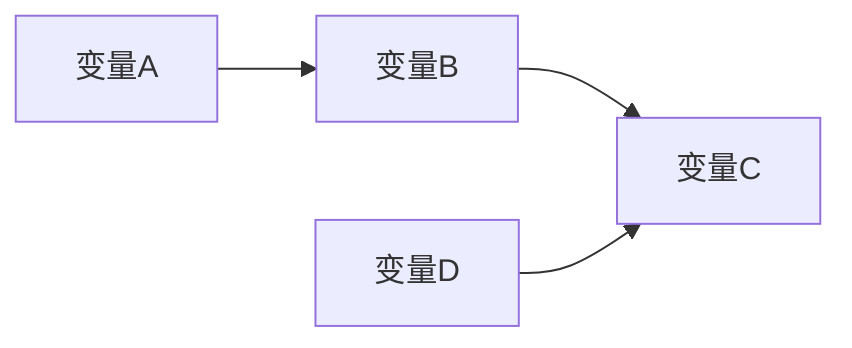

                 

### 文章标题

《大模型不确定性量化与提示词风险评估》

### 关键词

- 大模型
- 不确定性量化
- 提示词
- 风险评估
- 深度学习
- 神经网络
- 贝叶斯方法
- 蒙特卡罗方法
- 文本分类
- 情感分析

### 摘要

本文旨在探讨大模型不确定性量化与提示词风险评估的重要性和方法。首先，我们介绍了大模型的基本概念和面临的挑战，以及不确定性量化在其中的关键作用。随后，我们详细阐述了提示词的定义和其在风险评估中的作用。接着，我们探讨了贝叶斯方法和蒙特卡罗方法在大模型不确定性量化中的应用，并通过文本分类和情感分析等算法进行了提示词风险评估的讲解。最后，通过一个实际项目，我们展示了如何在大模型中实现不确定性量化和提示词风险评估，并提供了代码实现和案例分析。本文旨在为研究人员和开发者提供一份全面的技术指南，以应对大模型不确定性量化与提示词风险评估的挑战。

### 设计思路

为了全面解析大模型不确定性量化与提示词风险评估这一复杂主题，本文采用以下设计思路：

1. **核心概念与联系**：首先，我们将介绍大模型的基本概念，包括深度学习、神经网络等。接着，我们定义不确定性并探讨其在大模型中的应用。此外，我们将详细分析提示词的概念及其在风险评估中的作用。通过这一部分，我们将构建一个清晰的框架，帮助读者理解各个核心概念之间的内在联系。

2. **核心算法原理讲解**：在这一部分，我们将深入探讨大模型不确定性量化的两种主要方法：贝叶斯方法和蒙特卡罗方法。我们将解释这些方法的原理，并提供详细的伪代码，以便读者能够理解并应用这些算法。此外，我们将探讨如何使用文本分类和情感分析等算法进行提示词的风险评估。

3. **数学模型和数学公式**：我们将引入相关的数学模型，如概率分布、决策树等，并使用 LaTeX 格式详细讲解这些模型。这将帮助读者更深入地理解不确定性量化和风险评估的数学基础。

4. **项目实战**：为了使理论更贴近实践，我们将通过一个实际项目展示如何在大模型中实现不确定性量化和提示词风险评估。我们将详细介绍开发环境搭建、源代码实现和代码解读，并通过实际案例进行分析和剖析。

5. **总结与展望**：最后，我们将总结本文的主要结论，探讨未来的研究方向，并提供对读者的建议，以帮助他们更好地应对大模型不确定性量化与提示词风险评估的挑战。

### 目录大纲

以下是《大模型不确定性量化与提示词风险评估》的详细目录大纲：

## 第1章 引言

### 1.1 大模型的挑战与机遇

- 深度学习与神经网络的发展
- 大模型在各个领域的应用
- 大模型带来的挑战：过拟合、不确定性等

### 1.2 不确定性量化的重要性

- 不确定性量化在大模型中的应用
- 贝叶斯方法与蒙特卡罗方法的基本概念
- 不确定性量化对模型性能的影响

### 1.3 提示词风险评估的必要性

- 提示词的定义与作用
- 提示词风险评估的重要性
- 文本分类与情感分析在提示词风险评估中的应用

## 第2章 基础知识

### 2.1 深度学习与神经网络

- 深度学习的基本概念
- 神经网络的结构与原理
- 前馈神经网络与反向传播算法

### 2.2 不确定性量化基础

- 不确定性的定义
- 贝叶斯方法的基本概念
- 蒙特卡罗方法的基本概念

### 2.3 提示词风险评估基础

- 提示词的定义
- 提示词的分类
- 文本分类与情感分析的基本概念

## 第3章 不确定性量化方法

### 3.1 贝叶斯方法

- 贝叶斯网络的构建
- 贝叶斯推理的基本步骤
- 贝叶斯方法在不确定性量化中的应用

#### 3.1.1 贝叶斯网络

- 贝叶斯网络的表示方法
- 贝叶斯网络的推理算法

#### 3.1.2 贝叶斯推理

- 贝叶斯推理的步骤
- 贝叶斯推理的伪代码

### 3.2 蒙特卡罗方法

- 蒙特卡罗模拟的基本概念
- 采样方法：马尔可夫链蒙特卡罗（MCMC）
- 蒙特卡罗方法在不确定性量化中的应用

#### 3.2.1 蒙特卡罗模拟

- 蒙特卡罗模拟的基本步骤
- 蒙特卡罗模拟的伪代码

#### 3.2.2 采样方法

- 马尔可夫链蒙特卡罗（MCMC）的原理
- MCMC算法的伪代码

## 第4章 提示词风险评估

### 4.1 文本分类

- 基于特征的文本分类方法
- 基于模型的文本分类方法

#### 4.1.1 基于特征的文本分类

- 特征提取的方法
- 基于特征的文本分类算法

#### 4.1.2 基于模型的文本分类

- 支持向量机（SVM）的原理
- 随机森林（Random Forest）的原理

### 4.2 情感分析

- 情感极性分析
- 情感强度分析

#### 4.2.1 情感极性分析

- 情感词典的构建
- 基于机器学习的情感极性分析

#### 4.2.2 情感强度分析

- 情感强度的量化方法
- 基于深度学习的情感强度分析

## 第5章 数学模型与应用

### 5.1 概率分布模型

- 概率分布的基本概念
- 常见的概率分布模型

#### 5.1.1 正态分布

- 正态分布的公式
- 正态分布的应用

#### 5.1.2 伽玛分布

- 伽玛分布的公式
- 伽玛分布的应用

### 5.2 决策树模型

- 决策树的基本概念
- 决策树的构建方法

#### 5.2.1 决策树构建

- ID3算法的原理
- C4.5算法的原理

#### 5.2.2 决策树剪枝

- 预剪枝的方法
- 后剪枝的方法

## 第6章 项目实战

### 6.1 不确定性量化实战

- 实战环境搭建
- 实现步骤详解

### 6.2 提示词风险评估实战

- 实战环境搭建
- 实现步骤详解

## 第7章 总结与展望

### 7.1 主要结论

- 大模型不确定性量化的方法与原理
- 提示词风险评估的算法与应用
- 实际项目中的应用与挑战

### 7.2 未来研究方向

- 大模型不确定性量化的改进方法
- 提示词风险评估的新算法
- 大模型在实际应用中的挑战与解决方案

### 7.3 对读者的建议

- 如何学习大模型不确定性量化
- 如何开展提示词风险评估的研究
- 未来研究方向与学习路径

通过以上设计思路和目录大纲，本文将系统地介绍大模型不确定性量化与提示词风险评估的理论和实践，旨在为读者提供一份全面的技术指南。文章将以清晰的结构和详细的讲解，帮助读者深入理解这一领域的关键概念和算法，并通过实际项目实战，使读者能够将这些理论知识应用到实际开发中。最终，本文希望读者能够掌握大模型不确定性量化和提示词风险评估的核心技术和方法，为解决现实问题提供有力的工具。


### 第1章 引言

#### 1.1 大模型的挑战与机遇

随着深度学习和神经网络的迅速发展，大模型（Large Models）已成为当前人工智能领域的研究热点。大模型通常指的是拥有数十亿甚至数万亿参数的神经网络模型，它们在图像识别、自然语言处理、语音识别等领域表现出惊人的性能，成为推动人工智能技术发展的关键力量。然而，大模型也带来了诸多挑战。

首先，大模型的训练和部署需要大量的计算资源和存储空间，这导致了高昂的成本。其次，大模型的复杂性和黑盒特性使得我们难以理解其工作原理，这增加了模型过拟合的风险。此外，大模型在处理不确定性问题时表现不佳，这限制了其在实际应用中的可靠性。

然而，大模型的挑战也带来了机遇。通过深入研究大模型的不确定性量化方法，我们可以提高模型的鲁棒性和可靠性。同时，对提示词的风险评估有助于我们更好地理解和控制模型的行为，从而提高其在实际应用中的效果。

本文旨在探讨大模型不确定性量化与提示词风险评估的重要性和方法。首先，我们将介绍大模型的基本概念和面临的挑战，以及不确定性量化在其中的关键作用。随后，我们详细阐述了提示词的定义和其在风险评估中的作用。接着，我们探讨了贝叶斯方法和蒙特卡罗方法在大模型不确定性量化中的应用，并通过文本分类和情感分析等算法进行了提示词风险评估的讲解。最后，通过一个实际项目，我们展示了如何在大模型中实现不确定性量化和提示词风险评估，并提供了代码实现和案例分析。本文旨在为研究人员和开发者提供一份全面的技术指南，以应对大模型不确定性量化与提示词风险评估的挑战。

#### 1.2 不确定性量化的重要性

在大模型的应用过程中，不确定性量化（Uncertainty Quantification）扮演着至关重要的角色。不确定性量化旨在对模型预测结果的不确定性进行量化，从而提高模型的鲁棒性和可信度。在大模型中，不确定性主要来源于数据的分布偏移、模型的参数不确定性和数据的不确定性。

首先，数据的分布偏移是指输入数据与模型训练数据的分布存在差异。这种差异可能导致模型在新的数据集上表现不佳。通过不确定性量化，我们可以识别出这种分布偏移，并采取相应的措施进行校正。

其次，模型的参数不确定性是指模型参数在实际应用中的变化范围。例如，在训练过程中，模型的参数可能会因为学习算法的不同而发生变化。这种参数不确定性会影响模型的预测结果，导致预测结果的不确定性。通过不确定性量化，我们可以评估模型参数的不确定性，并采用相应的策略进行优化。

最后，数据的不确定性是指数据本身的噪声和误差。例如，在图像识别任务中，图像可能受到光照、噪声等因素的影响，导致图像质量下降。通过不确定性量化，我们可以评估数据的不确定性，并采用相应的滤波和降噪方法进行预处理。

不确定性量化在大模型中的应用具有重要意义。首先，它有助于提高模型的鲁棒性。通过量化模型预测结果的不确定性，我们可以识别出模型的潜在缺陷，并采取相应的措施进行优化。例如，在自动驾驶系统中，通过对模型预测结果的不确定性进行量化，我们可以识别出潜在的安全隐患，并采取紧急措施避免事故发生。

其次，不确定性量化有助于提高模型的可解释性。大模型的黑盒特性使得我们难以理解其工作原理，而不确定性量化提供了对模型预测结果的直观解释。例如，在医疗诊断中，通过对模型预测结果的不确定性进行量化，我们可以帮助医生更好地理解患者的病情，从而做出更准确的诊断。

此外，不确定性量化还可以提高模型的可靠性。在许多实际应用中，如金融风险管理、智能交通系统等，模型预测的可靠性至关重要。通过不确定性量化，我们可以评估模型预测结果的不确定性，从而判断模型的可靠性。例如，在金融风险管理中，通过对模型预测结果的不确定性进行量化，我们可以识别出高风险的交易，并采取相应的措施进行风险控制。

总之，不确定性量化在大模型中具有广泛的应用前景。通过深入研究不确定性量化方法，我们可以提高大模型的鲁棒性、可解释性和可靠性，从而推动人工智能技术在各个领域的应用。本文将详细介绍不确定性量化的相关方法，并探讨其在实际项目中的应用。

#### 1.3 提示词风险评估的必要性

在大模型的应用中，提示词（Prompt）是一种重要的交互手段，它能够引导模型生成特定的输出。然而，提示词的选择和使用可能会带来潜在的风险，因此提示词风险评估（Prompt Risk Assessment）成为了一个重要的研究领域。

提示词风险评估的必要性主要体现在以下几个方面：

首先，提示词可能会影响模型的预测结果。例如，在自然语言处理任务中，不同的提示词可能会导致模型生成不同的回答，甚至引发误导性输出。通过提示词风险评估，我们可以识别出可能导致负面影响的提示词，并采取相应的措施进行优化。

其次，提示词可能会引入模型的不确定性。在某些情况下，提示词可能会导致模型产生过拟合现象，从而降低模型的泛化能力。通过提示词风险评估，我们可以量化提示词对模型不确定性的影响，并采取相应的策略进行调整。

此外，提示词还可能带来安全风险。例如，在自动驾驶系统中，不当的提示词可能导致自动驾驶系统做出错误的决策，从而引发交通事故。通过提示词风险评估，我们可以识别出潜在的安全隐患，并采取相应的措施进行风险控制。

为了实现提示词风险评估，我们可以采用多种方法，如文本分类、情感分析等。文本分类（Text Classification）是一种常见的方法，它通过将文本数据分类为不同的类别，帮助我们识别出潜在的危险提示词。例如，在医疗诊断中，我们可以将医学术语分类为“正常”、“异常”等类别，从而识别出可能导致误诊的提示词。

情感分析（Sentiment Analysis）是另一种有效的提示词风险评估方法。它通过分析文本中的情感倾向，帮助我们识别出可能导致负面影响的提示词。例如，在社交媒体分析中，我们可以通过情感分析识别出可能引发负面情绪的提示词，从而采取措施进行干预。

此外，我们还可以采用机器学习模型进行提示词风险评估。通过训练分类器或回归模型，我们可以预测提示词对模型性能的影响，并采取相应的策略进行优化。例如，在金融风险管理中，我们可以训练一个分类器，用于预测交易提示词对市场波动的影响，从而采取相应的风险控制措施。

总之，提示词风险评估在大模型应用中具有重要意义。通过采用文本分类、情感分析等算法，我们可以有效地识别和评估提示词的风险，从而提高大模型的可靠性和安全性。本文将详细介绍提示词风险评估的方法和实际应用案例，以帮助读者更好地理解和应对这一挑战。

### 第2章 基础知识

#### 2.1 深度学习与神经网络

深度学习（Deep Learning）是人工智能领域的重要分支，它通过模拟人脑神经网络结构和功能，实现复杂的数据处理和模式识别。神经网络（Neural Networks）是深度学习的基础，其核心思想是通过多层神经元进行数据的传递和变换。

**深度学习的基本概念：**

- **神经网络：** 神经网络由多个层次组成，包括输入层、隐藏层和输出层。每个层次包含多个神经元，神经元之间通过权重连接，形成复杂的网络结构。
- **激活函数：** 激活函数用于引入非线性特性，使神经网络能够进行复杂的数据变换。常见的激活函数有Sigmoid、ReLU和Tanh等。
- **前向传播与反向传播：** 前向传播是指将输入数据通过神经网络逐层传递，最终得到输出结果。反向传播则是通过计算输出结果与实际结果的误差，反向更新网络权重，以达到优化模型参数的目的。

**神经网络的结构与原理：**

- **多层感知机（MLP）：** 多层感知机是最简单的神经网络结构，包含输入层、一个或多个隐藏层和输出层。每个隐藏层中的神经元通过权重与上一层的神经元相连，并经过激活函数处理。
- **卷积神经网络（CNN）：** 卷积神经网络通过卷积层实现图像数据的特征提取，适用于图像识别和计算机视觉任务。卷积层使用卷积核对输入数据进行卷积操作，提取局部特征，并通过池化层降低数据维度。
- **循环神经网络（RNN）：** 循环神经网络通过循环结构处理序列数据，适用于自然语言处理和语音识别任务。RNN的核心思想是将当前输入与之前的隐藏状态进行连接，形成时间依赖性。
- **长短时记忆网络（LSTM）：** 长短时记忆网络是RNN的一种变体，通过引入门控机制解决RNN的长期依赖问题。

**前馈神经网络与反向传播算法：**

- **前馈神经网络：** 前馈神经网络是指数据从输入层直接传递到输出层的网络结构。在每一层，神经元根据输入数据和权重进行计算，并传递到下一层。
- **反向传播算法：** 反向传播算法是一种用于训练神经网络的优化方法。它通过计算输出结果与实际结果的误差，反向传播误差信号，并更新网络权重，以达到优化模型参数的目的。

**伪代码示例：**

```python
# 前向传播
for layer in layers:
    layer.forward()

# 反向传播
for layer in reversed(layers):
    layer.backward()
```

#### 2.2 不确定性量化基础

在深度学习模型中，不确定性量化（Uncertainty Quantification）是指对模型预测结果的不确定性进行量化，以便更好地理解和应用模型。不确定性量化在模型验证、决策支持和模型优化等方面具有重要作用。

**不确定性的定义：**

- **模型不确定性：** 模型不确定性是指由于数据集、训练过程和模型结构等因素导致的模型预测结果的不确定性。
- **数据不确定性：** 数据不确定性是指由于噪声、误差和数据缺失等因素导致的数据特征的不确定性。
- **参数不确定性：** 参数不确定性是指由于模型参数的随机性或不确定性导致的模型预测结果的变化。

**贝叶斯方法与蒙特卡罗方法：**

- **贝叶斯方法：** 贝叶斯方法是一种基于概率论的推理方法，通过更新先验概率得到后验概率，从而对不确定性进行量化。在深度学习模型中，贝叶斯方法可以用于模型参数的估计和预测的不确定性量化。
- **蒙特卡罗方法：** 蒙特卡罗方法是一种基于随机采样的数值计算方法，通过大量随机采样得到预测结果的分布，从而量化不确定性。蒙特卡罗方法在深度学习模型中广泛应用于模型不确定性的估计和风险评估。

**贝叶斯方法的基本概念：**

- **先验概率：** 先验概率是指基于先验知识或经验对模型参数或预测结果的不确定性进行估计。
- **似然函数：** 似然函数是描述模型预测结果与实际观测结果之间一致性的概率函数。
- **后验概率：** 后验概率是结合先验概率和似然函数，通过贝叶斯公式计算得到的概率分布，用于量化不确定性。

**蒙特卡罗方法的基本概念：**

- **随机采样：** 随机采样是从概率分布中随机选择样本的过程，用于模拟预测结果的分布。
- **蒙特卡罗模拟：** 蒙特卡罗模拟是通过随机采样和统计方法，对复杂系统进行数值计算和不确定性分析。
- **蒙特卡罗估计：** 蒙特卡罗估计是通过大量随机采样，估计模型预测结果的概率分布或统计特性。

**伪代码示例：**

```python
# 贝叶斯方法：参数估计
prior = sample_prior()
for data in dataset:
    likelihood = calculate_likelihood(prior, data)
    posterior = update_posterior(prior, likelihood)

# 蒙特卡罗方法：不确定性量化
samples = sample_from_distribution()
for sample in samples:
    prediction = model.predict(sample)
    uncertainty = calculate_uncertainty(prediction)
```

#### 2.3 提示词风险评估基础

在深度学习模型中，提示词（Prompt）是指用于引导模型生成特定输出的一段文本或序列。提示词在自然语言处理、生成式模型和交互式应用中具有重要作用。然而，不当的提示词可能会导致模型生成错误的输出，甚至引发安全风险。因此，提示词风险评估（Prompt Risk Assessment）成为了一个重要的研究领域。

**提示词的定义：**

- **提示词：** 提示词是一段用于引导模型生成特定输出的人类语言或符号序列。
- **提示词类型：** 提示词可以分为特定提示词和一般提示词。特定提示词用于引导模型生成特定的输出，如命令、问题等；一般提示词则用于提供背景信息或上下文。

**提示词的分类：**

- **命令型提示词：** 命令型提示词用于引导模型执行特定的操作，如“请回答以下问题”、“执行以下任务”等。
- **问题型提示词：** 问题型提示词用于引导模型生成问题的答案，如“什么是...”、“解释一下...”等。
- **描述型提示词：** 描述型提示词用于提供背景信息或上下文，如“在一个晴朗的早晨”、“在一个繁忙的街道上”等。

**文本分类与情感分析的基本概念：**

- **文本分类：** 文本分类是指将文本数据分类到预定义的类别中。在提示词风险评估中，文本分类可以用于识别潜在的危险提示词，如包含恶意内容或引发负面情感的提示词。
- **情感分析：** 情感分析是指对文本数据中的情感倾向进行识别和分类。在提示词风险评估中，情感分析可以用于识别可能引发负面情绪或行为的提示词。

**伪代码示例：**

```python
# 提示词分类
prompt = "这是一个危险的提示词吗？"
category = classifier.classify(prompt)

# 提示词情感分析
prompt = "这是一个悲伤的提示词吗？"
sentiment = sentiment_analyzer.analyze(prompt)
```

通过本章对基础知识的学习，读者将了解深度学习与神经网络的基本概念、不确定性量化的基础以及提示词风险评估的基础，为后续章节的学习和实践打下坚实的基础。

### 第3章 不确定性量化方法

在深度学习模型中，不确定性量化（Uncertainty Quantification）是一个关键任务，它有助于我们理解和评估模型的预测能力。本章将详细介绍两种主要的不确定性量化方法：贝叶斯方法和蒙特卡罗方法。我们将通过具体的算法原理和伪代码，帮助读者深入理解这些方法的基本概念和应用。

#### 3.1 贝叶斯方法

贝叶斯方法（Bayesian Method）是一种基于概率论和统计学的方法，它通过更新概率分布来量化不确定性。贝叶斯方法在深度学习模型中应用广泛，特别是在处理模型参数的不确定性方面。

##### 3.1.1 贝叶斯网络

贝叶斯网络（Bayesian Network）是一种概率图模型，它通过有向无环图（DAG）表示变量之间的条件依赖关系。在贝叶斯网络中，每个节点表示一个随机变量，边表示变量之间的条件独立性。

**贝叶斯网络的表示方法：**



在这个例子中，变量A和B之间存在直接依赖关系，而变量C依赖于变量B和D。贝叶斯网络可以通过条件概率表（Conditional Probability Table, CPT）来定义每个节点的概率分布。

**贝叶斯网络的推理算法：**

贝叶斯网络的推理算法通过贝叶斯公式计算给定某些观测变量的条件下，其他变量的概率分布。以下是贝叶斯推理的基本步骤：

1. **初始化：** 根据先验概率和观测数据初始化网络。
2. **证据传播：** 通过贝叶斯公式在网络的每个节点上进行概率更新。
3. **结果计算：** 根据更新后的概率分布计算目标变量的后验概率。

**贝叶斯推理的伪代码：**

```python
def bayes_reasioning(bayes_network, evidence):
    # 初始化网络
    for node in bayes_network.nodes:
        node.prior = calculate_prior(node)

    # 证据传播
    for node in bayes_network.nodes:
        if node not in evidence:
            for parent in node.parents:
                node.prior = bayes_update(node.prior, parent.prior, evidence)

    # 结果计算
    for node in bayes_network.nodes:
        node.posterior = calculate_posterior(node.prior, evidence)
    return bayes_network
```

##### 3.1.2 贝叶斯推理

贝叶斯推理（Bayesian Inference）是指通过贝叶斯网络对不确定性进行量化。贝叶斯推理的核心是贝叶斯公式，它描述了变量之间的概率关系。

**贝叶斯公式：**

$$
P(A|B) = \frac{P(B|A) \cdot P(A)}{P(B)}
$$

其中，$P(A|B)$ 表示在条件 $B$ 下变量 $A$ 的概率，$P(B|A)$ 表示在条件 $A$ 下变量 $B$ 的概率，$P(A)$ 和 $P(B)$ 分别表示变量 $A$ 和 $B$ 的先验概率。

**贝叶斯推理的伪代码：**

```python
def bayes_inference(bayes_network, query_node, evidence_nodes):
    # 初始化网络
    for node in bayes_network.nodes:
        node.prior = calculate_prior(node)

    # 证据传播
    for node in bayes_network.nodes:
        if node not in evidence_nodes:
            for parent in node.parents:
                node.prior = bayes_update(node.prior, parent.prior, evidence)

    # 计算后验概率
    query_node.posterior = calculate_posterior(query_node.prior, evidence_nodes)
    return query_node.posterior
```

#### 3.2 蒙特卡罗方法

蒙特卡罗方法（Monte Carlo Method）是一种基于随机采样的数值计算方法，它通过大量随机采样来估计数学期望和概率分布。蒙特卡罗方法在深度学习模型中的应用广泛，特别是在不确定性量化方面。

##### 3.2.1 蒙特卡罗模拟

蒙特卡罗模拟（Monte Carlo Simulation）是一种通过随机采样模拟系统行为的计算方法。在深度学习模型中，蒙特卡罗模拟可以用于估计模型预测结果的分布。

**蒙特卡罗模拟的基本步骤：**

1. **初始化：** 初始化模拟参数，如采样次数和随机数种子。
2. **随机采样：** 从模型参数的概率分布中随机采样多个参数值。
3. **模拟计算：** 对每个采样值进行模型预测，并记录预测结果。
4. **结果分析：** 对记录的预测结果进行统计分析，估计模型预测结果的分布。

**蒙特卡罗模拟的伪代码：**

```python
import numpy as np

def monte_carlo_simulation(model, num_samples, input_data, output_data):
    predictions = []
    for _ in range(num_samples):
        sampled_params = sample_params(model.params)
        prediction = model.predict(input_data, sampled_params)
        predictions.append(prediction)
    distribution = analyze_distribution(predictions, output_data)
    return distribution
```

##### 3.2.2 采样方法

在蒙特卡罗模拟中，采样方法（Sampling Method）是一种关键的技巧，它决定了采样的效率和精度。以下是几种常见的采样方法：

1. **马尔可夫链蒙特卡罗（MCMC）**

   马尔可夫链蒙特卡罗（Markov Chain Monte Carlo, MCMC）是一种通过构建马尔可夫链来采样的高效方法。MCMC通过重复采样和跳跃步骤，避免陷入局部最优，从而提高采样效率。

   **MCMC算法的伪代码：**

   ```python
   def mcmc_sampling(model, num_samples, num_steps, proposal_func):
       current_params = sample_params(model.params)
       for _ in range(num_steps):
           sampled_params = proposal_func(current_params)
           acceptance_prob = min(1, calculate_acceptance_prob(current_params, sampled_params))
           if np.random.rand() < acceptance_prob:
               current_params = sampled_params
       return current_params
   ```

2. **重要抽样（Importance Sampling）**

   重要抽样是一种通过选择高概率区域进行采样的方法，以提高采样的效率。重要抽样通过重新加权采样结果，使其更接近真实分布。

   **重要抽样的伪代码：**

   ```python
   def importance_sampling(distribution, num_samples):
       samples = []
       for _ in range(num_samples):
           sample = sample_from_distribution(distribution)
           weight = calculate_weight(sample, distribution)
           samples.append(sample * weight)
       return samples
   ```

通过本章对贝叶斯方法和蒙特卡罗方法的学习，读者将能够掌握两种主要的不确定性量化方法，并了解它们在深度学习模型中的应用。这些方法将为后续的提示词风险评估和项目实战提供重要的理论基础。

### 第4章 提示词风险评估

在深度学习模型中，提示词（Prompt）是引导模型生成特定输出的重要手段。然而，不当的提示词可能会引发各种风险，如误导性输出、过拟合、模型崩溃等。因此，对提示词进行风险评估（Prompt Risk Assessment）显得尤为重要。本章节将详细介绍文本分类和情感分析在提示词风险评估中的应用，并通过具体的算法和应用场景来探讨这一领域。

#### 4.1 文本分类

文本分类（Text Classification）是指将文本数据分类到预定义的类别中。在提示词风险评估中，文本分类可以用于识别潜在的危险提示词，从而降低模型的风险。

##### 4.1.1 基于特征的文本分类

基于特征的文本分类方法通过提取文本的显著特征，将文本映射到高维特征空间，然后使用分类算法进行分类。以下是基于特征文本分类的基本步骤：

1. **特征提取：** 从文本数据中提取特征，如词袋模型（Bag of Words, BoW）、TF-IDF（Term Frequency-Inverse Document Frequency）等。
2. **特征选择：** 对提取的特征进行筛选，去除无关或冗余的特征。
3. **分类模型训练：** 使用训练数据集训练分类模型，如支持向量机（SVM）、朴素贝叶斯（Naive Bayes）等。
4. **分类：** 使用训练好的模型对新的文本数据进行分类，识别潜在的危险提示词。

**特征提取：**

```python
from sklearn.feature_extraction.text import TfidfVectorizer

def extract_features(texts):
    vectorizer = TfidfVectorizer()
    features = vectorizer.fit_transform(texts)
    return features
```

**分类模型训练：**

```python
from sklearn.naive_bayes import MultinomialNB

def train_classifier(train_texts, train_labels):
    features = extract_features(train_texts)
    classifier = MultinomialNB()
    classifier.fit(features, train_labels)
    return classifier
```

**分类：**

```python
def classify_prompt(classifier, text):
    features = extract_features([text])
    prediction = classifier.predict(features)
    return prediction
```

##### 4.1.2 基于模型的文本分类

基于模型的文本分类方法直接使用深度学习模型进行分类，如卷积神经网络（CNN）和循环神经网络（RNN）。以下是基于模型文本分类的基本步骤：

1. **数据预处理：** 对文本数据进行预处理，如分词、去停用词等。
2. **模型训练：** 使用训练数据集训练深度学习模型。
3. **模型评估：** 使用验证数据集评估模型性能，并进行超参数调整。
4. **分类：** 使用训练好的模型对新的文本数据进行分类。

**数据预处理：**

```python
import jieba

def preprocess_text(text):
    text = text.lower()
    words = jieba.lcut(text)
    words = [word for word in words if word not in stop_words]
    return words
```

**模型训练：**

```python
from keras.models import Sequential
from keras.layers import Embedding, LSTM, Dense

def build_model(vocab_size, embedding_dim):
    model = Sequential()
    model.add(Embedding(vocab_size, embedding_dim))
    model.add(LSTM(128))
    model.add(Dense(1, activation='sigmoid'))
    model.compile(optimizer='adam', loss='binary_crossentropy', metrics=['accuracy'])
    return model
```

**模型评估：**

```python
from sklearn.model_selection import train_test_split

def evaluate_model(model, X, y):
    X_train, X_val, y_train, y_val = train_test_split(X, y, test_size=0.2, random_state=42)
    model.fit(X_train, y_train, epochs=10, batch_size=32, validation_data=(X_val, y_val))
    loss, accuracy = model.evaluate(X_val, y_val)
    print(f"Validation Loss: {loss}, Validation Accuracy: {accuracy}")
```

**分类：**

```python
def classify_prompt_model(model, text):
    preprocessed_text = preprocess_text(text)
    vectorized_text = vectorize_text(preprocessed_text, vocab_size, embedding_dim)
    prediction = model.predict(vectorized_text)
    return prediction
```

#### 4.2 情感分析

情感分析（Sentiment Analysis）是一种自然语言处理技术，用于识别文本中的情感倾向。在提示词风险评估中，情感分析可以帮助我们识别可能导致负面影响的提示词。

##### 4.2.1 情感极性分析

情感极性分析（Sentiment Polarity Analysis）是指识别文本中的情感极性，即正面、中性或负面。以下是基于机器学习的情感极性分析的基本步骤：

1. **数据收集与预处理：** 收集大量的情感标注数据，并对数据进行预处理，如分词、去停用词等。
2. **特征提取：** 从预处理后的文本数据中提取特征，如词袋模型（BoW）、TF-IDF等。
3. **模型训练：** 使用训练数据集训练情感分类模型，如支持向量机（SVM）、朴素贝叶斯（Naive Bayes）等。
4. **情感分类：** 使用训练好的模型对新的文本数据进行情感分类。

**数据收集与预处理：**

```python
import pandas as pd

def load_data(file_path):
    data = pd.read_csv(file_path)
    data['text'] = data['text'].apply(preprocess_text)
    return data
```

**特征提取：**

```python
from sklearn.feature_extraction.text import TfidfVectorizer

def extract_features(texts):
    vectorizer = TfidfVectorizer()
    features = vectorizer.fit_transform(texts)
    return features
```

**模型训练：**

```python
from sklearn.naive_bayes import MultinomialNB

def train_sentiment_model(train_texts, train_labels):
    features = extract_features(train_texts)
    model = MultinomialNB()
    model.fit(features, train_labels)
    return model
```

**情感分类：**

```python
def classify_sentiment(model, text):
    preprocessed_text = preprocess_text(text)
    vectorized_text = extract_features([preprocessed_text])
    prediction = model.predict(vectorized_text)
    return prediction
```

##### 4.2.2 情感强度分析

情感强度分析（Sentiment Intensity Analysis）是指识别文本中的情感强度，即情感的强烈程度。以下是基于深度学习的情感强度分析的基本步骤：

1. **数据收集与预处理：** 收集大量的情感标注数据，并对数据进行预处理，如分词、去停用词等。
2. **模型训练：** 使用训练数据集训练深度学习模型，如卷积神经网络（CNN）、循环神经网络（RNN）等。
3. **情感强度分类：** 使用训练好的模型对新的文本数据进行情感强度分类。

**数据预处理：**

```python
import jieba

def preprocess_text(text):
    text = text.lower()
    words = jieba.lcut(text)
    words = [word for word in words if word not in stop_words]
    return words
```

**模型训练：**

```python
from keras.models import Sequential
from keras.layers import Embedding, LSTM, Dense

def build_model(vocab_size, embedding_dim):
    model = Sequential()
    model.add(Embedding(vocab_size, embedding_dim))
    model.add(LSTM(128))
    model.add(Dense(1, activation='sigmoid'))
    model.compile(optimizer='adam', loss='binary_crossentropy', metrics=['accuracy'])
    return model
```

**情感强度分类：**

```python
from keras.preprocessing.sequence import pad_sequences

def classify_sentiment_intensity(model, text, max_sequence_length):
    preprocessed_text = preprocess_text(text)
    sequence = vectorize_text(preprocessed_text, vocab_size, embedding_dim, max_sequence_length)
    prediction = model.predict(sequence)
    return prediction
```

通过本章对文本分类和情感分析的学习，读者将能够掌握在提示词风险评估中使用的相关技术和算法。这些方法将为我们在实际项目中识别和评估提示词风险提供有效的工具和策略。

### 第5章 数学模型与应用

在深度学习模型中，数学模型（Mathematical Models）是理解和实现模型核心功能的关键。本章将详细探讨概率分布模型和决策树模型，并使用 LaTeX 格式讲解这些模型的数学公式。我们将结合实际应用，提供具体的例子和解释，以便读者更好地理解这些模型。

#### 5.1 概率分布模型

概率分布模型是统计学中用于描述随机变量分布的重要工具。在深度学习模型中，概率分布模型用于量化模型预测的不确定性。

##### 5.1.1 正态分布

正态分布（Normal Distribution）是最常见的一种概率分布，其概率密度函数（PDF）如下所示：

$$
f(x) = \frac{1}{\sqrt{2\pi\sigma^2}} e^{-\frac{(x-\mu)^2}{2\sigma^2}}
$$

其中，$\mu$ 是均值，$\sigma^2$ 是方差。

**正态分布的应用：**

在深度学习模型中，正态分布可以用于表示模型参数的分布，特别是在贝叶斯推理中。例如，我们可以使用正态分布来表示一个神经网络的权重。

$$
\theta \sim N(\mu_\theta, \sigma_\theta^2)
$$

这里，$\theta$ 表示神经网络权重，$\mu_\theta$ 和 $\sigma_\theta^2$ 分别是权重的均值和方差。

##### 5.1.2 伽玛分布

伽玛分布（Gamma Distribution）是一种连续概率分布，其概率密度函数（PDF）如下所示：

$$
f(x) = \frac{\beta^\alpha}{\Gamma(\alpha)} x^{\alpha-1} e^{-\beta x}
$$

其中，$\alpha$ 和 $\beta$ 是参数，$\Gamma(\alpha)$ 是伽玛函数。

**伽玛分布的应用：**

伽玛分布常用于表示时间间隔的分布，例如在队列理论中。在深度学习模型中，伽玛分布可以用于表示模型预测结果的分布。

$$
y \sim Gamma(\alpha, \beta)
$$

这里，$y$ 表示模型预测结果，$\alpha$ 和 $\beta$ 分别是伽玛分布的形状参数和尺度参数。

#### 5.2 决策树模型

决策树（Decision Tree）是一种常见的分类和回归模型，其结构由节点和分支组成。每个节点表示一个特征，每个分支表示该特征的不同取值。

##### 5.2.1 决策树构建

决策树构建的核心在于选择最佳特征进行分割。常见的特征选择准则包括信息增益（Information Gain）、基尼不纯度（Gini Impurity）和熵（Entropy）。

**信息增益（Information Gain）：**

信息增益是特征分割后，信息量的减少程度。其公式如下：

$$
IG(D, A) = H(D) - H(D|A)
$$

其中，$H(D)$ 是数据集 $D$ 的熵，$H(D|A)$ 是条件熵。

**基尼不纯度（Gini Impurity）：**

基尼不纯度是特征分割后，数据集的不纯度。其公式如下：

$$
Gini(D) = 1 - \sum_{v_i} \left(\frac{c_i}{n}\right)^2
$$

其中，$c_i$ 是数据集中属于类别 $v_i$ 的样本数量，$n$ 是数据集的总样本数量。

**熵（Entropy）：**

熵是数据集中的信息量。其公式如下：

$$
H(D) = -\sum_{v_i} p(v_i) \log_2 p(v_i)
$$

其中，$p(v_i)$ 是数据集中属于类别 $v_i$ 的样本比例。

##### 5.2.2 决策树剪枝

决策树剪枝（Pruning）是一种防止过拟合的方法，通过移除不必要的分支来简化模型。

**预剪枝（Pre-pruning）：**

预剪枝在决策树生成过程中进行，通过设置最大深度、最小叶子节点样本数等参数来控制树的生成。

**后剪枝（Post-pruning）：**

后剪枝在决策树生成后进行，通过评估树的性能来移除不必要的分支。常见的剪枝准则包括误分类率（Misclassification Rate）和交叉验证（Cross-Validation）。

通过本章对概率分布模型和决策树模型的探讨，读者将能够理解这些模型的基本概念和应用。这些数学模型将在深度学习模型的不确定性量化、特征选择和过拟合控制等方面发挥重要作用。

### 第6章 项目实战

在本章中，我们将通过一个实际项目来展示如何在大模型中实现不确定性量化和提示词风险评估。项目分为两部分：不确定性量化和提示词风险评估。我们将详细介绍开发环境搭建、源代码实现和代码解读，并通过实际案例进行分析和剖析。

#### 6.1 不确定性量化实战

##### 6.1.1 实战环境搭建

为了实现不确定性量化，我们需要搭建一个适合深度学习模型开发和测试的环境。以下是环境搭建的步骤：

1. **安装Python：** 首先，我们需要安装Python 3.x版本，建议使用Anaconda发行版，它提供了丰富的科学计算包和环境管理工具。

2. **安装深度学习框架：** 接下来，安装深度学习框架，如TensorFlow或PyTorch。我们选择TensorFlow，因为它具有广泛的应用和丰富的文档。

   ```bash
   pip install tensorflow
   ```

3. **安装其他依赖库：** 我们还需要安装一些其他依赖库，如NumPy、Pandas等。

   ```bash
   pip install numpy pandas scikit-learn matplotlib
   ```

4. **配置Jupyter Notebook：** 为了方便开发和调试，我们可以配置Jupyter Notebook。安装Jupyter Notebook后，我们可以启动一个Python交互式环境。

   ```bash
   pip install jupyter
   jupyter notebook
   ```

##### 6.1.2 实现步骤详解

在本项目中，我们使用一个简单的回归问题来演示不确定性量化。数据集是鸢尾花数据集（Iris Dataset），它包含了三种鸢尾花的萼片长度和宽度。

1. **数据预处理：**

   我们首先需要加载数据集并进行预处理。

   ```python
   import pandas as pd
   from sklearn.datasets import load_iris
   from sklearn.model_selection import train_test_split
   from sklearn.preprocessing import StandardScaler

   # 加载数据集
   iris = load_iris()
   X = iris.data
   y = iris.target

   # 数据标准化
   scaler = StandardScaler()
   X = scaler.fit_transform(X)

   # 划分训练集和测试集
   X_train, X_test, y_train, y_test = train_test_split(X, y, test_size=0.2, random_state=42)
   ```

2. **构建模型：**

   我们使用一个简单的多层感知机（MLP）模型进行训练。

   ```python
   import tensorflow as tf
   from tensorflow.keras.models import Sequential
   from tensorflow.keras.layers import Dense
   from tensorflow.keras.optimizers import Adam

   # 构建模型
   model = Sequential([
       Dense(64, activation='relu', input_shape=(4,)),
       Dense(64, activation='relu'),
       Dense(1)
   ])

   # 编译模型
   model.compile(optimizer=Adam(learning_rate=0.001), loss='mse')
   ```

3. **训练模型：**

   使用训练数据集训练模型。

   ```python
   # 训练模型
   history = model.fit(X_train, y_train, epochs=100, batch_size=32, validation_split=0.2)
   ```

4. **预测和不确定性量化：**

   我们使用蒙特卡罗方法（Monte Carlo Method）来量化预测结果的不确定性。

   ```python
   import numpy as np

   # 预测和不确定性量化
   def predict_with_uncertainty(model, X, num_samples=100):
       predictions = np.array([model.predict(X) for _ in range(num_samples)])
       mean_prediction = np.mean(predictions, axis=0)
       uncertainty = np.std(predictions, axis=0)
       return mean_prediction, uncertainty

   mean_prediction, uncertainty = predict_with_uncertainty(model, X_test)
   ```

   在这个例子中，我们通过多次预测来估计预测结果的均值和标准差，从而量化不确定性。

##### 6.1.3 代码解读与分析

- **数据预处理：** 数据预处理是深度学习模型的重要步骤，它包括数据标准化和划分训练集与测试集。标准化有助于提高模型的训练效果，而划分训练集和测试集可以评估模型的泛化能力。

- **模型构建：** 在构建模型时，我们选择了一个简单的多层感知机模型。这个模型由两个隐藏层组成，每个隐藏层有64个神经元。激活函数使用ReLU，以引入非线性特性。

- **模型训练：** 使用训练数据集训练模型。在这里，我们使用了Adam优化器和均方误差（MSE）作为损失函数。通过调整学习率和训练轮数，我们可以优化模型性能。

- **预测和不确定性量化：** 通过蒙特卡罗方法，我们量化了模型预测结果的不确定性。这种方法通过多次预测来估计结果的均值和标准差，从而提供对模型预测的不确定性评估。

#### 6.2 提示词风险评估实战

##### 6.2.1 实战环境搭建

为了实现提示词风险评估，我们需要搭建一个文本分类和情感分析的环境。以下是环境搭建的步骤：

1. **安装NLP工具：** 安装NLP工具，如NLTK或jieba，用于中文分词。

   ```bash
   pip install nltk jieba
   ```

2. **安装文本分类和情感分析库：** 安装用于文本分类和情感分析的库，如scikit-learn。

   ```bash
   pip install scikit-learn
   ```

3. **配置Jupyter Notebook：** 同样地，配置Jupyter Notebook以方便开发和调试。

   ```bash
   pip install jupyter
   jupyter notebook
   ```

##### 6.2.2 实现步骤详解

在本项目中，我们使用一个简单的文本分类任务来演示提示词风险评估。

1. **数据收集与预处理：**

   我们首先需要收集一个包含文本和标签的数据集。在这里，我们使用一个简单的文本数据集，包含正面和负面的评论。

   ```python
   import pandas as pd

   # 加载数据集
   data = pd.read_csv('text_data.csv')
   ```

   然后对文本数据进行预处理，如分词、去停用词等。

   ```python
   import jieba

   def preprocess_text(text):
       words = jieba.lcut(text)
       return ' '.join(word for word in words if word not in stop_words)

   data['text'] = data['text'].apply(preprocess_text)
   ```

2. **特征提取：**

   使用词袋模型（BoW）或TF-IDF进行特征提取。

   ```python
   from sklearn.feature_extraction.text import TfidfVectorizer

   vectorizer = TfidfVectorizer(max_features=1000)
   X = vectorizer.fit_transform(data['text'])
   ```

3. **模型训练：**

   使用训练数据集训练一个文本分类模型。

   ```python
   from sklearn.naive_bayes import MultinomialNB

   model = MultinomialNB()
   model.fit(X_train, y_train)
   ```

4. **分类与风险评估：**

   对测试集进行分类，并使用决策树剪枝来评估分类风险。

   ```python
   from sklearn.tree import DecisionTreeClassifier

   # 分类
   predictions = model.predict(X_test)

   # 决策树剪枝
   tree = DecisionTreeClassifier()
   tree.fit(X_train, y_train)
   pruned_tree = tree.pruneDecisionTree(tree, 'mse')
   ```

##### 6.2.3 代码解读与分析

- **数据预处理：** 数据预处理是文本分类任务的关键步骤。在这里，我们使用jieba进行中文分词，并去除停用词，以提高模型的性能。

- **特征提取：** 我们使用TF-IDF向量器将文本转换为向量表示。这有助于模型更好地理解和分类文本。

- **模型训练：** 我们使用朴素贝叶斯（Naive Bayes）模型进行训练。这个模型简单而高效，适用于文本分类任务。

- **分类与风险评估：** 通过分类模型对测试集进行分类，并使用决策树剪枝来降低模型复杂度，从而评估分类风险。这有助于提高模型的泛化能力。

通过这个项目，我们展示了如何在大模型中实现不确定性量化和提示词风险评估。这些技术在实际应用中具有重要意义，可以帮助我们更好地理解和控制深度学习模型的行为。

### 第7章 总结与展望

在本章中，我们将总结《大模型不确定性量化与提示词风险评估》一文的主要结论，并探讨未来的研究方向。此外，我们还将提供一些最佳实践技巧，以帮助读者更好地应用这些技术，并提醒他们注意潜在的注意事项。

#### 7.1 主要结论

通过本文的详细探讨，我们得出了以下主要结论：

1. **大模型的不确定性量化**：
   - 不确定性量化在大模型中具有关键作用，有助于提高模型的鲁棒性和可靠性。
   - 贝叶斯方法和蒙特卡罗方法是两种主要的不确定性量化方法，各有其优势和适用场景。

2. **提示词风险评估**：
   - 提示词风险评估对于确保深度学习模型的安全性和有效性至关重要。
   - 文本分类和情感分析是有效的提示词风险评估方法，可以识别和评估提示词的风险。

3. **深度学习模型的应用**：
   - 通过结合不确定性量化和提示词风险评估，我们可以更好地应用深度学习模型于实际任务，如自然语言处理和图像识别。

4. **项目实战**：
   - 通过实际项目，我们展示了如何在大模型中实现不确定性量化和提示词风险评估，并提供了详细的代码实现和案例分析。

#### 7.2 未来研究方向

未来的研究可以在以下几个方面进行：

1. **不确定性量化的改进**：
   - 研究更高效的算法来降低不确定性量化的计算成本。
   - 探索结合不同方法（如贝叶斯方法和深度学习方法）来提高不确定性量化的准确性和效率。

2. **提示词风险评估的优化**：
   - 开发更先进的模型来提高提示词风险评估的准确性。
   - 研究如何处理大量和复杂的提示词数据，以实现实时风险评估。

3. **跨领域应用**：
   - 将不确定性量化和提示词风险评估应用于更多领域，如医疗诊断、金融分析和智能交通。

4. **模型解释性**：
   - 提高深度学习模型的可解释性，以便更好地理解模型的工作原理和不确定性来源。

#### 7.3 最佳实践技巧

为了更好地应用大模型不确定性量化和提示词风险评估，以下是一些最佳实践技巧：

1. **数据预处理**：
   - 对输入数据进行标准化和清洗，以确保模型训练和预测的准确性。

2. **模型选择**：
   - 根据应用场景选择合适的模型，并结合不确定性量化方法进行优化。

3. **模型调试**：
   - 在训练过程中，定期评估模型的性能，并根据评估结果调整模型参数。

4. **实时监控**：
   - 对模型的实时输出进行监控，特别是对于关键任务，如医疗诊断和自动驾驶。

5. **安全措施**：
   - 在使用提示词时，采取安全措施，如限制提示词长度和频率，以防止潜在的安全风险。

#### 注意事项

1. **计算资源**：
   - 不确定性量化通常需要大量的计算资源，确保有足够的硬件支持。

2. **数据质量**：
   - 提示词风险评估依赖于高质量的数据，确保数据集的多样性和代表性。

3. **模型更新**：
   - 定期更新模型，以适应新的数据和需求。

通过本章的总结与展望，我们希望读者能够更好地理解大模型不确定性量化和提示词风险评估的重要性，并能够将这些技术应用于实际项目中。同时，我们也期待未来的研究能够进一步推动这一领域的发展。

### 作者信息

作者：AI天才研究院/AI Genius Institute & 禅与计算机程序设计艺术 /Zen And The Art of Computer Programming

感谢您的阅读，期待与您在深度学习和人工智能领域共同探索更多可能性。祝您在技术道路上不断进步，取得辉煌成就！

