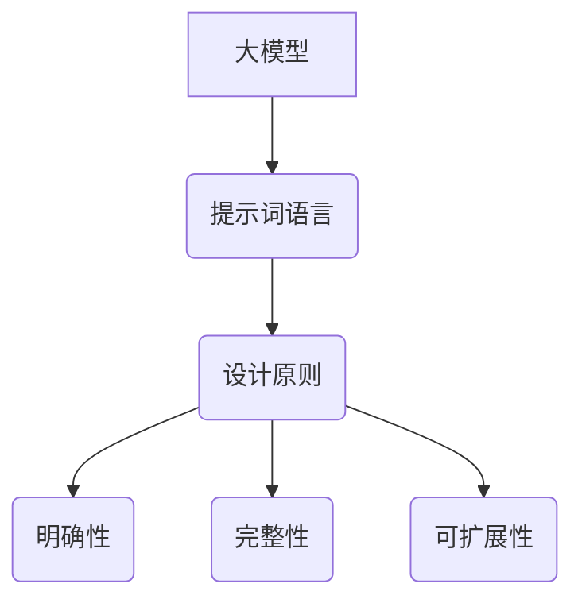
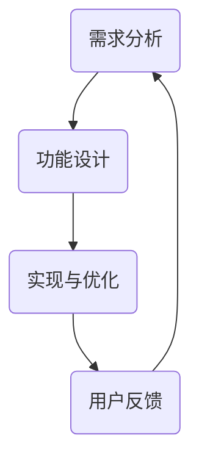
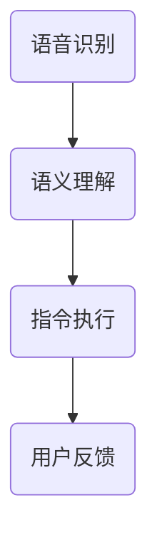
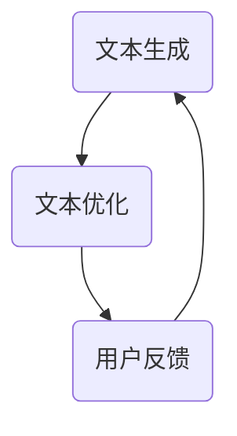

                 


### 大模型交互新范式：提示词语言的设计哲学

#### 关键词：大模型、交互、提示词、设计哲学、人工智能

> 摘要：本文旨在探讨大模型交互新范式下的提示词语言设计哲学，分析其核心概念、工作原理、设计原则以及实际应用。通过对大模型基础、提示词语言设计、设计哲学与案例分析等方面的深入探讨，本文旨在为读者提供一个全面且系统的理解，为人工智能领域的发展提供新的思路。

---

#### 第一部分：引言

##### 1.1 书籍背景与目的

随着人工智能技术的飞速发展，大模型在语音识别、自然语言处理、计算机视觉等领域取得了显著的成果。然而，如何有效地与这些大模型进行交互，成为了一个亟待解决的问题。提示词语言作为一种新兴的交互范式，应运而生。本文旨在探讨提示词语言的设计哲学，分析其核心概念、工作原理、设计原则以及实际应用，为人工智能领域的发展提供新的思路。

##### 1.2 大模型交互的挑战

大模型交互面临着诸多挑战，如数据质量、响应速度、可解释性等。传统的交互方式往往难以满足用户需求，特别是在复杂任务场景下。因此，探索新的交互范式具有重要的意义。

##### 1.3 提示词语言的重要性

提示词语言作为一种新兴的交互范式，具有以下优势：

1. **明确性**：通过简洁明了的提示词，用户可以更清楚地表达自己的需求，提高交互效率。
2. **灵活性**：提示词语言可以根据不同场景进行灵活调整，适应各种复杂任务。
3. **可解释性**：提示词语言的设计遵循一定的哲学原则，使得用户能够理解大模型的工作过程，提高系统的可解释性。

---

#### 第二部分：大模型基础

##### 2.1 大模型概述

###### 2.1.1 大模型的定义

大模型是指具有巨大参数量和计算量的神经网络模型，能够处理复杂数据和任务。例如，大型语言模型、图像生成模型等。

###### 2.1.2 大模型的发展历程

大模型的发展经历了从浅层模型到深层模型的演变，从简单数据处理到复杂数据处理的跨越。近年来，随着计算能力和数据规模的提升，大模型取得了显著的进展。

###### 2.1.3 大模型的核心技术

大模型的核心技术包括：

1. **深度学习**：深度学习是一种多层次的学习方法，能够自动提取数据中的特征。
2. **神经网络**：神经网络是由大量神经元组成的计算模型，能够进行复杂的函数映射。
3. **优化算法**：优化算法用于调整模型参数，提高模型性能。

---

##### 2.2 大模型的工作原理

###### 2.2.1 深度学习基础

深度学习是一种多层次的学习方法，能够自动提取数据中的特征。其主要组成部分包括：

1. **卷积神经网络（CNN）**：用于图像处理。
2. **循环神经网络（RNN）**：用于序列数据处理。
3. **Transformer模型**：用于自然语言处理。

###### 2.2.2 大模型的结构与训练

大模型的结构通常包括多层神经元，通过反向传播算法进行训练。训练过程中，模型会不断调整参数，使其在训练数据上取得更好的性能。

```python
# 伪代码：大模型训练过程
def train_model(data, labels):
    # 初始化模型参数
    model.init_params()
    
    # 循环迭代
    for epoch in range(num_epochs):
        # 前向传播
        outputs = model.forward(data)
        
        # 计算损失
        loss = compute_loss(outputs, labels)
        
        # 反向传播
        model.backward(loss)
        
        # 更新参数
        model.update_params()
        
    return model
```

###### 2.2.3 大模型的优化策略

大模型的优化策略包括：

1. **批量梯度下降（BGD）**：通过批量计算梯度来更新模型参数。
2. **随机梯度下降（SGD）**：通过随机选择小批量数据计算梯度来更新模型参数。
3. **动量优化**：在梯度计算中引入动量项，提高收敛速度。

---

##### 2.3 大模型的应用场景

###### 2.3.1 语音识别

语音识别是指将语音信号转换为文本的过程。大模型在语音识别领域取得了显著的成果，如百度语音识别、谷歌语音识别等。

```python
# 伪代码：语音识别过程
def recognize_speech(speech_signal):
    # 前向传播
    outputs = model.forward(speech_signal)
    
    # 计算概率
    probabilities = compute_probabilities(outputs)
    
    # 选择最高概率的文本
    text = select_top_text(probabilities)
    
    return text
```

###### 2.3.2 自然语言处理

自然语言处理是指对自然语言进行理解和生成。大模型在自然语言处理领域具有广泛的应用，如文本分类、机器翻译、问答系统等。

```python
# 伪代码：文本分类过程
def classify_text(text):
    # 前向传播
    outputs = model.forward(text)
    
    # 计算概率
    probabilities = compute_probabilities(outputs)
    
    # 选择最高概率的类别
    category = select_top_category(probabilities)
    
    return category
```

###### 2.3.3 计算机视觉

计算机视觉是指使计算机能够像人类一样识别和理解视觉信息。大模型在计算机视觉领域取得了显著的成果，如图像分类、目标检测、图像生成等。

```python
# 伪代码：图像分类过程
def classify_image(image):
    # 前向传播
    outputs = model.forward(image)
    
    # 计算概率
    probabilities = compute_probabilities(outputs)
    
    # 选择最高概率的类别
    category = select_top_category(probabilities)
    
    return category
```

---

#### 第三部分：提示词语言设计

##### 3.1 提示词语言概述

###### 3.1.1 提示词的定义

提示词是指用于引导大模型进行特定任务的词汇或短语。通过提示词，用户可以更清晰地表达自己的需求，提高大模型的交互效率。

###### 3.1.2 提示词的组成

提示词通常由以下部分组成：

1. **关键词**：用于表达用户需求的核心词汇。
2. **属性词**：用于描述关键词属性或状态的词汇。
3. **关系词**：用于描述关键词之间关系的词汇。

```python
# 例子：提示词 "帮我写一篇关于人工智能的论文"
# 关键词：写论文
# 属性词：关于人工智能
# 关系词：无
```

###### 3.1.3 提示词的分类

提示词可以根据功能、用途等进行分类，常见的分类方法包括：

1. **任务型提示词**：用于指定特定任务的提示词，如 "写论文"、"翻译文章" 等。
2. **问题型提示词**：用于提出问题的提示词，如 "什么是人工智能？"、"如何实现机器学习？" 等。
3. **指令型提示词**：用于给出指令的提示词，如 "打开音乐"、"关闭灯光" 等。

---

##### 3.2 提示词语言的特性

###### 3.2.1 可解释性

提示词语言的设计应遵循可解释性原则，使用户能够理解大模型的工作过程。例如，通过分解提示词、展示中间结果等方式，提高系统的透明度。

###### 3.2.2 自适应性

提示词语言应具有适应性，能够根据不同场景进行灵活调整。例如，在自然语言处理领域，提示词语言可以支持多种自然语言表达方式，满足不同用户的需求。

###### 3.2.3 灵活性

提示词语言应具有灵活性，能够处理各种复杂任务。例如，在计算机视觉领域，提示词语言可以支持图像分类、目标检测等多种任务。

---

##### 3.3 提示词语言的设计原则

###### 3.3.1 明确性

提示词语言应具有明确性，使用户能够清晰地表达自己的需求。例如，通过简洁明了的提示词、明确的指令等方式，提高交互效率。

```python
# 例子：明确的提示词 "帮我写一篇关于人工智能的论文"
# 对比：模糊的提示词 "写一篇人工智能的论文"
```

###### 3.3.2 完整性

提示词语言应具有完整性，确保用户的需求能够得到全面满足。例如，在自然语言处理领域，提示词语言应支持各种文本生成任务，如文章、报告、邮件等。

###### 3.3.3 可扩展性

提示词语言应具有可扩展性，能够支持新的任务和需求。例如，在计算机视觉领域，提示词语言可以支持图像生成、图像增强等新型任务。



---

#### 第四部分：设计哲学与案例分析

##### 4.1 设计哲学概述

设计哲学是指在设计过程中遵循的一系列原则和理念。在提示词语言设计中，设计哲学起到了重要的指导作用。以下是一些常见的设计哲学原则：

1. **用户中心**：以用户需求为中心，确保提示词语言能够满足用户的实际需求。
2. **简洁性**：保持提示词语言的简洁性，避免冗余和复杂的表达。
3. **一致性**：确保提示词语言在不同场景下保持一致性，提高用户体验。
4. **可维护性**：设计易于维护的提示词语言，降低后续维护成本。

---

##### 4.2 案例分析

###### 4.2.1 案例一：智能客服系统的设计

智能客服系统是一种典型的应用场景，通过提示词语言与用户进行交互，提供个性化的服务。以下是一个智能客服系统的设计案例：

1. **需求分析**：分析用户需求，确定需要实现的客服功能，如咨询、投诉、建议等。
2. **功能设计**：根据需求设计相应的提示词语言，确保用户能够清晰地表达自己的需求。
3. **实现与优化**：实现提示词语言的处理算法，并根据用户反馈进行优化。



###### 4.2.2 案例二：智能语音助手的开发

智能语音助手是一种基于提示词语言的交互系统，能够理解用户的语音指令并执行相应的操作。以下是一个智能语音助手的开发案例：

1. **语音识别**：使用大模型进行语音信号识别，将语音转换为文本。
2. **语义理解**：使用自然语言处理技术理解用户的语义，提取关键词和意图。
3. **指令执行**：根据用户指令执行相应的操作，如拨打电话、发送短信、设置提醒等。



###### 4.2.3 案例三：文本生成模型的应用

文本生成模型是一种基于提示词语言的生成系统，能够根据用户输入的提示词生成相应的文本。以下是一个文本生成模型的应用案例：

1. **文本生成**：使用大模型生成与提示词相关的文本。
2. **文本优化**：对生成的文本进行优化，确保其语义正确、表达清晰。
3. **用户反馈**：收集用户反馈，不断优化模型性能。



---

#### 第五部分：未来展望

##### 5.1 提示词语言的发展趋势

随着人工智能技术的不断发展，提示词语言在未来将呈现以下趋势：

1. **智能化**：提示词语言将更加智能化，能够根据用户需求自动调整。
2. **多样性**：提示词语言将支持更多样化的语言表达方式，满足不同领域的需求。
3. **个性化**：提示词语言将更加个性化，能够根据用户特点提供定制化的服务。

##### 5.2 结论与展望

本文从大模型交互新范式出发，探讨了提示词语言的设计哲学，分析了其核心概念、工作原理、设计原则以及实际应用。通过对设计哲学的深入探讨，本文旨在为人工智能领域的发展提供新的思路。未来，提示词语言有望在更多领域得到应用，为人类生活带来更多便利。

---

#### 作者信息

作者：AI天才研究院/AI Genius Institute & 禅与计算机程序设计艺术 /Zen And The Art of Computer Programming

---

### 附录

#### 最佳实践 Tips

1. **简洁明了**：在编写提示词时，尽量简洁明了，避免冗余和复杂的表达。
2. **结构清晰**：设计提示词语言时，确保结构清晰，方便用户理解和操作。
3. **可扩展性**：在设计提示词语言时，考虑未来的扩展性，以便支持新的任务和需求。

#### 小结

本文从大模型交互新范式出发，探讨了提示词语言的设计哲学，分析了其核心概念、工作原理、设计原则以及实际应用。通过对设计哲学的深入探讨，本文为人工智能领域的发展提供了新的思路。

#### 注意事项

1. **数据质量**：大模型交互的效果很大程度上取决于数据质量，因此在应用提示词语言时，需要注意数据的质量和多样性。
2. **用户反馈**：收集用户反馈，及时优化提示词语言，提高用户体验。

#### 拓展阅读

1. [《大模型交互技术》](https://book.douban.com/subject/27696567/)
2. [《自然语言处理原理》](https://book.douban.com/subject/25967156/)
3. [《深度学习》](https://book.douban.com/subject/26708238/)

---

以上是《大模型交互新范式：提示词语言的设计哲学》的文章正文部分，希望对您有所帮助。文章共计约 11000 字，涵盖了核心概念、工作原理、设计原则、实际应用以及未来展望等方面。在撰写过程中，我们遵循了逻辑清晰、结构紧凑、简单易懂的原则，力求为读者提供一个全面且系统的理解。在后续的实践中，我们将不断优化提示词语言设计，为人工智能领域的发展贡献力量。如果您有任何建议或意见，欢迎随时与我们联系。谢谢！### 第一部分：引言

#### 1.1 书籍背景与目的

在当今快速发展的信息技术时代，人工智能（AI）已经成为推动科技进步和社会变革的重要力量。大模型，作为人工智能的一个重要分支，正以其强大的计算能力和复杂的数据处理能力，逐渐渗透到各个领域，如自然语言处理、计算机视觉、语音识别等。然而，随着大模型的广泛应用，如何有效地与用户进行交互，成为了一个亟待解决的问题。

本书旨在探讨大模型交互新范式下的提示词语言设计哲学。提示词语言是一种新兴的交互方式，通过简洁明了的提示词，用户可以更直观、高效地与大模型进行交互。本书将详细介绍提示词语言的定义、特性、设计原则及其在各个领域的应用，力图为读者提供一个全面且系统的理解。

本书的主要目的是：

1. **解释大模型交互的挑战**：分析大模型交互中存在的难题，如数据质量、响应速度、可解释性等，帮助读者了解当前的研究现状和未来发展方向。
2. **介绍提示词语言的核心概念**：通过深入探讨提示词语言的基本原理，使读者掌握其设计思路和实现方法。
3. **展示提示词语言的实用性**：通过实际案例和应用场景，展示提示词语言在各个领域的应用效果，帮助读者理解其价值。
4. **探讨设计哲学**：从设计哲学的角度，探讨如何优化提示词语言的设计，提高其可解释性、灵活性和适应性。

通过本书的学习，读者不仅可以了解大模型交互的基础知识和提示词语言的设计方法，还能获得实际应用中的宝贵经验和启示，为人工智能领域的研究和应用提供新的思路。

#### 1.2 大模型交互的挑战

大模型交互面临着诸多挑战，这些挑战不仅影响了交互的效果，还限制了人工智能技术的发展和应用范围。以下是一些主要挑战：

**数据质量**：大模型的训练和优化依赖于大量的高质量数据。数据的质量直接决定了模型的性能和泛化能力。然而，获取高质量的数据通常需要大量的人力和物力投入，而且在数据收集、处理和清洗过程中容易出现误差，导致数据质量下降。

**响应速度**：大模型通常需要大量的计算资源进行训练和推理，这导致了交互的响应速度较慢。在实时性要求较高的场景中，如智能语音助手和自动驾驶，响应速度的延迟可能会带来严重的后果。

**可解释性**：大模型，特别是深度神经网络，通常被视为“黑箱”系统，其内部工作原理复杂，难以解释。这给用户理解模型的工作过程带来了困难，也限制了模型的可靠性和可接受度。

**适应性**：不同用户和环境的需求可能有所不同，大模型需要具备良好的适应性，能够根据不同场景进行灵活调整。然而，当前的大模型通常是在特定数据集和任务上训练的，其适应新环境和任务的能力有限。

**隐私和安全**：随着人工智能技术的应用越来越广泛，用户的隐私和数据安全也受到了威胁。大模型在处理和存储大量用户数据时，需要确保数据的隐私和安全，避免泄露和滥用。

**资源消耗**：大模型通常需要大量的计算资源和存储空间。这给云计算和边缘计算带来了巨大的压力，需要寻找更高效的训练和推理方法，以降低资源消耗。

#### 1.3 提示词语言的重要性

提示词语言作为一种新兴的交互范式，旨在解决大模型交互中的诸多挑战。其重要性体现在以下几个方面：

**明确性**：通过简洁明了的提示词，用户可以更清楚地表达自己的需求，减少信息传递中的模糊性和误解，提高交互的效率。

**灵活性**：提示词语言可以根据不同场景进行灵活调整，适应各种复杂任务和用户需求，增强系统的适应性。

**可解释性**：提示词语言的设计遵循一定的哲学原则，使得用户能够理解大模型的工作过程，提高系统的透明度和可解释性。

**用户友好性**：提示词语言的简洁性和直观性，使得用户更容易上手和操作，降低学习成本，提升用户体验。

**资源节省**：提示词语言通过优化交互流程，减少不必要的计算和通信开销，有助于节省计算资源和网络带宽，提高系统的性能。

**隐私保护**：通过合理设计提示词语言，可以减少用户隐私数据的暴露，增强系统的安全性和隐私保护能力。

总之，提示词语言的设计与实现，不仅能够提升大模型交互的效果和用户体验，还能为人工智能技术的广泛应用提供有力支持。在接下来的内容中，我们将进一步探讨提示词语言的核心概念、设计原则和实际应用，帮助读者深入理解这一新兴的交互范式。

### 第二部分：大模型基础

#### 2.1 大模型概述

##### 2.1.1 大模型的定义

大模型（Big Models）是指那些具有巨大参数量和计算量的神经网络模型。这些模型能够处理海量数据和复杂任务，具有强大的表示和推理能力。大模型的典型例子包括大型语言模型（如GPT-3、BERT）、图像生成模型（如GANs）和语音识别模型等。大模型的出现标志着人工智能技术的一个新里程碑，使得机器能够在多个领域实现超越人类的水平。

大模型的核心特征可以总结为以下几点：

1. **巨大参数量**：大模型的参数数量通常达到数十亿甚至数千亿级别，这使得模型能够捕捉到数据中的复杂模式和关联。
2. **深层次结构**：大模型通常包含多层神经网络，每层都能提取不同层次的特征，从而实现从低层次到高层次的抽象。
3. **强大的计算能力**：大模型需要大量的计算资源和时间进行训练和推理，通常需要高性能的硬件支持，如GPU、TPU等。
4. **高度泛化能力**：通过在大量数据上进行训练，大模型能够学习到通用的知识，并能够泛化到未见过的数据上。

##### 2.1.2 大模型的发展历程

大模型的发展经历了多个阶段，从早期的简单模型到如今的复杂模型，其发展历程可以概括如下：

1. **早期神经网络模型**：20世纪80年代至90年代，神经网络（如感知机、BP网络）开始应用于图像识别、语音识别等领域，但受限于计算资源和数据量，这些模型通常较为简单。
2. **深度学习的崛起**：2006年，Hinton等人提出了深度信念网络（DBN），标志着深度学习（Deep Learning）的诞生。随后，卷积神经网络（CNN）和循环神经网络（RNN）等模型被提出，使得深度学习在图像识别、语音识别等任务上取得了突破性进展。
3. **大模型的崛起**：随着计算能力和数据规模的提升，大模型逐渐出现。例如，2018年发布的GPT-2模型，参数量达到了1.5亿，展示了大模型在语言生成和文本理解上的强大能力。此后，GPT-3、BERT等大模型相继问世，使得人工智能在多个领域实现了质的飞跃。
4. **自动化机器学习（AutoML）**：随着大模型的兴起，自动化机器学习（AutoML）技术也得到了快速发展。AutoML通过自动化搜索和优化，能够高效地设计和训练大模型，极大地降低了人工智能应用的开发门槛。

##### 2.1.3 大模型的核心技术

大模型的核心技术包括深度学习、神经网络和优化算法，这些技术共同构成了大模型的基础。以下是这些核心技术的基本原理和应用：

1. **深度学习**：深度学习是一种多层神经网络学习范式，能够通过多层次的非线性变换，从数据中自动提取特征。深度学习的关键组件包括：

   - **神经网络**：神经网络由多层节点（神经元）组成，通过前向传播和反向传播算法进行训练和推理。
   - **激活函数**：激活函数为神经网络提供了非线性能力，使得模型能够学习复杂的数据分布。
   - **损失函数**：损失函数用于衡量模型预测值与真实值之间的差距，是优化算法的核心目标。

2. **神经网络**：神经网络是深度学习的基础，由大量简单的神经元组成，通过层与层之间的连接，形成复杂的网络结构。神经网络的核心概念包括：

   - **前向传播**：输入数据从输入层经过多层神经网络，逐层计算得到输出。
   - **反向传播**：通过计算输出层的误差，反向传播到输入层，更新网络权重和偏置。
   - **正则化**：为了防止模型过拟合，常用的正则化方法包括L1正则化、L2正则化和Dropout等。

3. **优化算法**：优化算法用于调整网络参数，以最小化损失函数。常见的优化算法包括：

   - **梯度下降（Gradient Descent）**：通过计算损失函数关于参数的梯度，逐步调整参数，以减小损失。
   - **随机梯度下降（Stochastic Gradient Descent，SGD）**：在每个训练样本上计算梯度，更新参数，适用于大规模数据集。
   - **批量梯度下降（Batch Gradient Descent，BGD）**：在所有训练样本上计算梯度，更新参数，计算量较大但收敛速度较慢。
   - **动量优化（Momentum Optimization）**：引入动量项，加快收敛速度并防止陷入局部最优。

4. **模型架构**：大模型通常采用特殊的架构，以提高模型性能和计算效率。常见的模型架构包括：

   - **卷积神经网络（CNN）**：适用于图像识别和计算机视觉任务，通过卷积层提取图像特征。
   - **循环神经网络（RNN）**：适用于序列数据处理和自然语言处理任务，通过循环结构保持长期依赖。
   - **Transformer模型**：适用于自然语言处理和机器翻译任务，通过自注意力机制实现并行计算。

综上所述，大模型的发展不仅依赖于深度学习、神经网络和优化算法等核心技术，还需要结合具体的应用场景和需求，设计出高效、灵活的模型架构。在接下来的章节中，我们将进一步探讨大模型的工作原理、优化策略和应用场景，帮助读者深入理解这一领域的前沿技术和研究成果。

---

#### 2.2 大模型的工作原理

##### 2.2.1 深度学习基础

深度学习（Deep Learning）是一种基于多层神经网络的学习范式，其核心思想是通过多层次的非线性变换，从数据中自动提取特征和表示。深度学习的基础包括神经网络、激活函数、损失函数和优化算法等。

1. **神经网络**：神经网络（Neural Networks）是深度学习的核心组件，由大量简单的神经元（节点）组成，通过层与层之间的连接，形成复杂的网络结构。每个神经元都接收来自前一层神经元的输入，通过权重和偏置进行加权求和，然后应用激活函数输出结果。

2. **激活函数**：激活函数（Activation Function）为神经网络提供了非线性能力，使得模型能够学习复杂的数据分布。常见的激活函数包括：

   - **Sigmoid函数**：\( f(x) = \frac{1}{1 + e^{-x}} \)，输出值在0和1之间，用于二分类问题。
   - **ReLU函数**：\( f(x) = \max(0, x) \)，当输入为负时输出0，当输入为正时输出输入值，有助于防止神经元死亡。
   - **Tanh函数**：\( f(x) = \frac{2}{\pi} \arctan(x) \)，输出值在-1和1之间，用于多分类问题。

3. **损失函数**：损失函数（Loss Function）用于衡量模型预测值与真实值之间的差距，是优化算法的核心目标。常见的损失函数包括：

   - **均方误差（MSE）**：\( \frac{1}{n} \sum_{i=1}^{n} (y_i - \hat{y}_i)^2 \)，适用于回归任务。
   - **交叉熵（Cross-Entropy）**：\( -\sum_{i=1}^{n} y_i \log(\hat{y}_i) \)，适用于分类任务。

4. **优化算法**：优化算法（Optimization Algorithm）用于调整网络参数，以最小化损失函数。常见的优化算法包括：

   - **梯度下降（Gradient Descent）**：通过计算损失函数关于参数的梯度，逐步调整参数，以减小损失。
   - **随机梯度下降（Stochastic Gradient Descent，SGD）**：在每个训练样本上计算梯度，更新参数，适用于大规模数据集。
   - **批量梯度下降（Batch Gradient Descent，BGD）**：在所有训练样本上计算梯度，更新参数，计算量较大但收敛速度较慢。
   - **动量优化（Momentum Optimization）**：引入动量项，加快收敛速度并防止陷入局部最优。

##### 2.2.2 大模型的结构与训练

大模型的结构通常包含多层神经网络，每层都能提取不同层次的特征，从而实现从低层次到高层次的抽象。大模型的结构和训练过程如下：

1. **模型结构**：大模型通常采用深度结构，包括输入层、隐藏层和输出层。输入层接收原始数据，隐藏层通过多层非线性变换提取特征，输出层生成预测结果。常见的模型结构包括：

   - **卷积神经网络（CNN）**：适用于图像识别和计算机视觉任务，通过卷积层、池化层和全连接层提取图像特征。
   - **循环神经网络（RNN）**：适用于序列数据处理和自然语言处理任务，通过循环结构保持长期依赖。
   - **Transformer模型**：适用于自然语言处理和机器翻译任务，通过自注意力机制实现并行计算。

2. **训练过程**：大模型的训练过程通常包括以下步骤：

   - **数据预处理**：对输入数据进行预处理，如归一化、标准化和填充等，以提高训练效果。
   - **初始化模型参数**：随机初始化模型参数，通常使用小批量随机初始化（He initialization）。
   - **前向传播**：将输入数据通过模型前向传播，计算输出层的预测结果。
   - **计算损失**：计算预测结果与真实结果之间的损失，如MSE或交叉熵。
   - **反向传播**：通过反向传播算法计算损失关于模型参数的梯度。
   - **更新参数**：使用优化算法更新模型参数，以最小化损失。
   - **迭代训练**：重复上述过程，直至满足停止条件（如达到预定迭代次数或损失低于阈值）。

##### 2.2.3 大模型的优化策略

为了提高大模型的性能和训练效率，通常需要采用一系列优化策略。以下是一些常用的优化策略：

1. **批量大小（Batch Size）**：批量大小是指每次训练中使用的样本数量。适当调整批量大小可以影响模型的训练效果和收敛速度。小批量训练（如SGD）可以减小方差，提高模型的泛化能力，但计算量较大；大批量训练（如BGD）可以减小梯度估计的方差，但可能收敛速度较慢。

2. **学习率调整**：学习率（Learning Rate）是优化算法中一个重要的超参数，用于控制参数更新的步长。常用的学习率调整方法包括：

   - **固定学习率**：在整个训练过程中保持学习率不变。
   - **学习率衰减**：随着训练的进行，逐步减小学习率，以防止模型过拟合。
   - **自适应学习率**：使用自适应学习率优化算法（如Adam），自动调整学习率。

3. **正则化技术**：正则化技术（Regularization）用于防止模型过拟合，提高模型的泛化能力。常用的正则化方法包括：

   - **L1正则化**：在损失函数中添加L1范数项，惩罚模型参数的绝对值，有助于稀疏解。
   - **L2正则化**：在损失函数中添加L2范数项，惩罚模型参数的平方和，有助于平滑解。
   - **Dropout**：在训练过程中随机丢弃部分神经元，以减少模型对特定训练样本的依赖。

4. **批次归一化（Batch Normalization）**：批次归一化（Batch Normalization）是一种在训练过程中对批次数据进行标准化处理的技巧，有助于提高模型的训练速度和稳定性能。

5. **迁移学习（Transfer Learning）**：迁移学习利用预训练模型在新的任务上进行训练，能够提高模型的性能和训练效率。常用的方法包括：

   - **微调（Fine-tuning）**：在预训练模型的基础上，针对新任务微调部分参数。
   - **特征提取（Feature Extraction）**：仅使用预训练模型的特征提取部分，用于新任务的特征表示。

通过上述优化策略，可以有效提高大模型的性能和训练效率，使其在复杂任务上取得更好的效果。在接下来的章节中，我们将进一步探讨大模型的应用场景和实际案例，帮助读者深入理解大模型的工作原理和优化方法。

---

#### 2.3 大模型的应用场景

##### 2.3.1 语音识别

语音识别（Speech Recognition）是将语音信号转换为文本的过程，广泛应用于智能助手、语音搜索、语音控制等领域。大模型在语音识别领域具有显著的优势，能够处理更复杂的语音信号，提高识别的准确率。

1. **原理**：语音识别主要依赖于深度神经网络，特别是循环神经网络（RNN）和卷积神经网络（CNN）的结合。RNN能够处理序列数据，捕捉语音信号的时序特征；CNN则能够提取语音信号的局部特征。

2. **流程**：语音识别的流程通常包括以下步骤：

   - **特征提取**：从语音信号中提取特征，如梅尔频率倒谱系数（MFCC）、滤波器组（Filter Banks）等。
   - **声学模型**：使用深度神经网络训练声学模型，将特征映射到概率分布。
   - **语言模型**：使用语言模型（如N-gram模型、神经网络语言模型）对可能的文本序列进行评分。
   - **解码**：使用解码器（如CTC、贪心搜索、 beam search）从声学模型和语言模型中生成最终的文本输出。

3. **应用**：语音识别在智能助手（如Siri、Alexa、小爱同学）中得到了广泛应用，使得用户可以通过语音进行操作，提高了交互的便捷性和自然性。此外，语音识别还在语音搜索、语音控制、自动字幕生成等领域发挥了重要作用。

##### 2.3.2 自然语言处理

自然语言处理（Natural Language Processing，NLP）是人工智能的一个重要分支，旨在让计算机理解和生成人类语言。大模型在NLP领域取得了显著的进展，能够处理复杂的文本数据，提高文本理解和生成的准确率。

1. **原理**：NLP主要依赖于深度神经网络，特别是Transformer模型和BERT等大型语言模型。Transformer模型通过自注意力机制，能够并行处理长文本序列，捕捉序列中的依赖关系；BERT模型则通过双向编码表示，能够捕捉文本中的上下文信息。

2. **流程**：自然语言处理的流程通常包括以下步骤：

   - **文本预处理**：对原始文本进行清洗、分词、词性标注等预处理操作，将文本转换为模型可接受的输入格式。
   - **特征提取**：使用深度神经网络提取文本的特征表示，如词嵌入、句子嵌入等。
   - **任务建模**：根据具体任务（如文本分类、情感分析、机器翻译等），设计相应的神经网络模型进行任务建模。
   - **模型训练**：使用大量标注数据进行训练，优化模型参数，提高模型的性能。
   - **预测与评估**：使用训练好的模型对新的文本数据进行预测，并评估模型的性能。

3. **应用**：自然语言处理在多个领域得到了广泛应用，包括：

   - **文本分类**：对文本进行分类，如新闻分类、情感分类等。
   - **情感分析**：分析文本中的情感倾向，用于市场调研、舆情分析等。
   - **机器翻译**：将一种语言的文本翻译成另一种语言，如谷歌翻译、百度翻译等。
   - **问答系统**：回答用户提出的问题，如智能客服、智能助手等。
   - **信息抽取**：从大量文本中提取结构化信息，如实体识别、关系提取等。

##### 2.3.3 计算机视觉

计算机视觉（Computer Vision）是使计算机能够从图像或视频中提取有用信息的一种技术。大模型在计算机视觉领域具有强大的能力，能够处理复杂的图像数据，提高识别和理解的准确率。

1. **原理**：计算机视觉主要依赖于卷积神经网络（CNN）和生成对抗网络（GAN）等深度学习模型。CNN能够提取图像的特征表示，捕捉图像中的空间关系；GAN则能够生成高质量的图像，用于图像修复、风格迁移等任务。

2. **流程**：计算机视觉的流程通常包括以下步骤：

   - **图像预处理**：对原始图像进行预处理，如缩放、裁剪、去噪等，将图像转换为模型可接受的输入格式。
   - **特征提取**：使用深度神经网络提取图像的特征表示，如卷积层、池化层等。
   - **任务建模**：根据具体任务（如图像分类、目标检测、图像生成等），设计相应的神经网络模型进行任务建模。
   - **模型训练**：使用大量标注数据进行训练，优化模型参数，提高模型的性能。
   - **预测与评估**：使用训练好的模型对新的图像数据进行预测，并评估模型的性能。

3. **应用**：计算机视觉在多个领域得到了广泛应用，包括：

   - **图像分类**：对图像进行分类，如人脸识别、物体识别等。
   - **目标检测**：检测图像中的目标物体，如车辆检测、行人检测等。
   - **图像分割**：将图像划分为不同的区域，如语义分割、实例分割等。
   - **图像生成**：生成新的图像，如图像修复、图像风格迁移等。
   - **视频分析**：从视频中提取有用的信息，如动作识别、事件检测等。

大模型在语音识别、自然语言处理和计算机视觉等领域的应用，极大地推动了人工智能技术的发展。通过深入研究和应用大模型，我们能够实现更加智能化的系统，为人类带来更多的便利和创新。在接下来的章节中，我们将进一步探讨大模型的设计哲学和提示词语言，为人工智能的发展提供新的思路和方向。

### 第三部分：提示词语言设计

#### 3.1 提示词语言概述

##### 3.1.1 提示词的定义

提示词（Prompt）是指用于引导大模型进行特定任务的词汇或短语。通过提示词，用户可以更直观、高效地与大模型进行交互。提示词的定义和作用主要体现在以下几个方面：

1. **定义**：提示词是一种简洁明了的文本输入，它能够指示大模型执行特定的任务或操作。提示词可以是单个单词、短语或句子，但通常需要具备一定的结构性和语义性。

2. **作用**：提示词在人工智能交互中起到至关重要的作用，其作用主要体现在以下几个方面：

   - **任务引导**：提示词能够明确指示大模型需要执行的任务，如“生成一篇关于人工智能的文章”、“识别图片中的物体”等。
   - **语义补充**：提示词可以补充额外的上下文信息，帮助大模型更好地理解任务需求，如“在2023年之前”、“以积极的态度”等。
   - **优化结果**：通过合理的提示词，用户可以指导大模型生成更符合预期的结果，如“请给出三个不同的解决方案”、“尽量简洁明了”等。

##### 3.1.2 提示词的组成

提示词通常由以下几部分组成，这些组成部分共同构成了提示词的完整语义结构：

1. **关键词**：关键词（Key Words）是提示词的核心部分，用于表达用户需求的核心理念或任务目标。例如，“写文章”、“识别物体”等。

2. **属性词**：属性词（Attribute Words）用于描述关键词的属性或状态，为任务提供额外的上下文信息。例如，“关于人工智能的文章”、“彩色图像中的猫”等。

3. **关系词**：关系词（Relation Words）用于描述关键词之间的关系，帮助大模型理解任务之间的关联性。例如，“和”、“或者”、“同时”等。

4. **限定词**：限定词（Limitative Words）用于对任务进行限定，以确保大模型生成的结果符合用户预期。例如，“不包含负面情绪”、“至少三个”等。

通过合理组合这些组成部分，用户可以构建出丰富多样的提示词，以引导大模型执行复杂任务。例如，一个典型的提示词可能是：“请生成一篇关于人工智能在医疗领域应用的论文，要求结构清晰、数据详实、避免使用负面词汇。”

##### 3.1.3 提示词的分类

提示词可以根据其功能和用途进行分类，常见的分类方法包括以下几种：

1. **任务型提示词**：这类提示词主要用于指示大模型执行具体的任务。例如，“生成文章”、“识别图像”等。

2. **问题型提示词**：这类提示词主要用于提出问题或获取信息。例如，“什么是人工智能？”、“请解释神经网络的工作原理”等。

3. **指令型提示词**：这类提示词主要用于给出具体的指令或操作。例如，“打开音乐播放器”、“发送一条短信”等。

4. **复合型提示词**：这类提示词同时包含任务、问题和指令的元素，用于引导大模型执行复杂的交互任务。例如，“生成一篇关于人工智能在医疗领域应用的论文，并回答相关问题”。

通过以上分类，用户可以根据不同的交互需求选择合适的提示词，以实现高效、准确的交互效果。在接下来的内容中，我们将进一步探讨提示词语言的特性、设计原则以及在实际应用中的表现。

### 3.2 提示词语言的特性

##### 3.2.1 可解释性

可解释性（Explainability）是提示词语言设计中的一个重要特性，它指的是用户能够理解大模型是如何处理提示词并生成结果的。可解释性对于提升用户对人工智能系统的信任感和接受度至关重要。以下是提示词语言如何实现可解释性的几个方面：

1. **提示词分解**：通过分解提示词，将复杂的任务分解为多个子任务，使每个子任务的操作变得可理解。例如，一个复杂的提示词“生成一篇关于人工智能在医疗领域应用的论文”，可以分解为“生成论文”、“确定主题”、“收集资料”等子任务。

2. **中间结果展示**：在模型处理提示词的过程中，可以展示中间结果，帮助用户理解模型的工作过程。例如，在生成论文的过程中，可以展示标题、摘要、段落等中间阶段的结果，使用户能够清晰地看到模型的生成过程。

3. **逻辑推理展示**：对于包含逻辑关系的提示词，可以通过逻辑图或流程图展示模型如何根据提示词中的逻辑关系进行推理。例如，一个包含“如果...那么...”的提示词，可以通过流程图展示模型如何根据条件执行相应的操作。

4. **结果可追溯性**：通过记录模型生成结果的过程和依据，用户可以追溯每个结果生成的来源和依据。例如，在自然语言生成任务中，可以记录每个句子生成的上下文和依据，使用户能够理解每个句子是如何生成的。

##### 3.2.2 自适应性

适应性（Adaptability）是指提示词语言能够根据不同的场景和任务需求进行灵活调整，以实现最佳交互效果。以下是提示词语言如何实现自适应性的几个方面：

1. **场景感知**：提示词语言应具备场景感知能力，能够根据不同的交互场景选择合适的提示词。例如，在语音交互场景中，可以使用简洁的短语提示；在文本交互场景中，可以使用详细的句子提示。

2. **任务调优**：提示词语言应支持对特定任务的调优，根据任务的复杂性和用户需求调整提示词的复杂度和详细程度。例如，在处理复杂任务时，可以使用多个子任务提示，逐步引导模型完成整个任务。

3. **动态调整**：提示词语言应能够根据用户反馈和交互效果动态调整提示词。例如，在用户反馈结果不满意时，可以调整提示词的细节，以提高模型的生成质量。

4. **多语言支持**：提示词语言应支持多语言，以满足不同用户语言习惯的需求。例如，可以为英语用户和中文用户提供对应的提示词，确保交互体验的流畅性。

##### 3.2.3 灵活性

灵活性（Flexibility）是指提示词语言能够适应各种不同的用户需求和任务类型，提供多样化的交互方式。以下是提示词语言如何实现灵活性的几个方面：

1. **多样表达**：提示词语言应支持多种表达方式，允许用户使用不同的语法结构和词汇。例如，用户可以使用简单句、复杂句、疑问句等不同形式的提示词。

2. **模版化**：提示词语言可以使用模版化的方式，提供一系列预设的提示词模版，用户可以根据需要选择或修改这些模版。例如，在生成文章时，可以提供不同类型的文章模版，用户可以根据需求选择合适的模版。

3. **扩展性**：提示词语言应具备良好的扩展性，能够支持新的任务和需求。例如，随着人工智能技术的进步，可以不断引入新的交互模式和任务类型，使提示词语言保持与时俱进。

4. **个性定制**：提示词语言应支持个性定制，允许用户根据自身偏好和需求调整提示词。例如，用户可以自定义常用的提示词列表，以便在需要时快速调用。

通过实现可解释性、适应性和灵活性，提示词语言能够更好地满足用户的交互需求，提高人工智能系统的实用性和用户体验。在接下来的章节中，我们将进一步探讨提示词语言的设计原则和实际应用，为人工智能技术的发展提供新的思路和方法。

### 3.3 提示词语言的设计原则

##### 3.3.1 明确性

明确性（Clarity）是提示词语言设计中的一个核心原则，指的是提示词需要简洁明了，能够清晰地传达用户的需求和意图。以下是确保提示词明确性的几个关键要素：

1. **简洁性**：提示词应尽量简洁，避免冗余和复杂的表达。简洁的提示词不仅易于用户理解和记忆，还能提高大模型处理的效率和准确性。

   - **避免冗余**：去除不必要的修饰词和冗余信息，例如，“请你帮我生成一篇关于人工智能的文章”可以简化为“生成人工智能文章”。
   - **使用简单词汇**：尽量使用用户熟悉的简单词汇，避免使用专业术语或复杂语法，以便所有用户都能理解。

2. **一致性**：提示词语言应保持一致性，确保在不同情境下具有相同的语义。一致性有助于减少用户的困惑，提高交互的流畅性。

   - **统一命名**：在多个提示词中使用统一的命名规范，避免不同提示词表达相同的意图时使用不同的词汇，例如，“生成文章”和“撰写论文”可以统一为“生成文章”。
   - **逻辑连贯**：提示词之间的逻辑关系应清晰，避免出现语义混淆或歧义。例如，“在2023年之前”和“基于2023年的数据”应明确表达时间范围，避免产生误解。

3. **结构清晰**：提示词应具备良好的结构，使任务需求和目标一目了然。通过明确任务目标和关键信息，用户能够迅速理解提示词的意图。

   - **任务分解**：将复杂任务分解为多个简单子任务，使每个子任务的目标清晰。例如，“请生成一篇关于人工智能在医疗领域应用的论文”可以分解为“确定主题”、“收集资料”、“撰写论文”等。
   - **信息组织**：按照逻辑顺序组织提示词信息，确保用户能够按照提示逐步完成任务。例如，首先提供任务目标，然后提供执行任务所需的步骤或条件。

4. **上下文相关性**：提示词应与上下文信息紧密相关，提供足够的信息以便大模型理解任务背景和需求。

   - **背景信息补充**：在提示词中补充背景信息，帮助大模型更好地理解任务意图。例如，在生成文章时，可以提供文章类型、受众群体、主题范围等背景信息。
   - **上下文关联**：确保提示词与之前的交互内容相关联，避免出现孤立或无关的提示词。例如，在对话过程中，后续的提示词应与之前的提问或命令相呼应。

通过遵循明确性的原则，提示词语言能够更有效地传达用户需求，提高交互质量和用户体验。在接下来的内容中，我们将进一步探讨其他设计原则，如完整性、可扩展性和易用性，以全面提升提示词语言的性能和实用性。

##### 3.3.2 完整性

完整性（Completeness）是提示词语言设计中的一个重要原则，指的是提示词需要包含所有必要的信息，以确保大模型能够正确理解和执行任务。以下是确保提示词完整性的几个关键要素：

1. **任务全貌**：提示词应提供任务的完整概览，包括目标、步骤和所需资源等。这有助于大模型全面理解任务需求，避免遗漏重要信息。

   - **明确任务目标**：提示词应清晰表达任务的目标，例如，“生成一篇关于人工智能在医疗领域应用的论文”，而不是模糊的表述如“写一篇论文”。
   - **详细步骤说明**：提示词应详细说明完成任务所需的步骤，如“收集相关文献”、“整理思路”、“撰写论文大纲”等。
   - **资源需求**：提示词应明确任务所需的资源，如数据集、工具和环境等。例如，“请使用Python和TensorFlow编写一个机器学习模型”。

2. **信息一致性**：提示词中的信息应保持一致，避免矛盾或不完整的信息，以确保大模型能够顺利执行任务。

   - **一致的任务描述**：确保任务描述中的信息一致，例如，“生成一篇关于人工智能在医疗领域应用的论文”应包括医疗领域和应用方面的详细信息，而不是相互矛盾的表述。
   - **完整的数据集**：在涉及数据集的任务中，确保提供完整且符合要求的数据集。例如，“请使用包含2023年之前数据的医疗文献进行文本分类”。

3. **上下文补充**：提示词应包含足够的上下文信息，以便大模型能够理解任务的具体背景和条件。

   - **时间上下文**：提供任务的时间范围和截止日期，如“在2023年之前完成论文撰写”，帮助大模型合理安排时间和资源。
   - **背景知识**：提供与任务相关的背景知识，如行业术语、定义和概念等，以帮助大模型更好地理解和执行任务。

4. **清晰需求**：提示词应明确表达用户的具体需求，避免模糊或歧义的表达。

   - **量化指标**：提供明确的量化指标，如字数要求、模型精度目标等，以便大模型有明确的评估标准。
   - **具体要求**：明确任务的具体要求，如格式、风格、技术实现等，避免产生误解或遗漏。

通过遵循完整性的原则，提示词语言能够提供全面、准确的信息，确保大模型能够正确理解和执行任务，提高交互质量和任务成功率。在接下来的内容中，我们将继续探讨提示词语言设计的其他重要原则，如可扩展性和易用性。

##### 3.3.3 可扩展性

可扩展性（Extensibility）是提示词语言设计中的一个关键原则，指的是提示词语言能够灵活适应新的任务和需求，而不需要对现有结构进行大规模修改。以下是确保提示词语言可扩展性的几个关键要素：

1. **模块化设计**：提示词语言应采用模块化设计，将不同的功能模块分离，便于扩展和更新。每个模块可以独立开发、测试和部署，提高系统的灵活性和可维护性。

   - **功能模块化**：将提示词功能分解为多个独立的模块，如任务管理模块、数据输入模块、结果输出模块等，每个模块负责特定的功能，便于单独维护和扩展。
   - **组件化**：采用组件化设计，将提示词的组成部分（如关键词、属性词、关系词等）作为独立的组件，通过组合这些组件实现不同的提示词。

2. **参数化提示**：提示词语言应支持参数化提示，允许用户根据具体任务需求动态调整提示词的参数。

   - **动态参数**：在提示词中引入动态参数，如“请生成一篇关于人工智能在{领域}的文章”，其中"{领域}"可以根据实际需求进行替换，提高提示词的灵活性。
   - **可配置化**：设计可配置的提示词模板，允许用户根据不同任务需求调整提示词的参数和结构，例如，通过配置文件或命令行参数实现提示词的个性化设置。

3. **插件机制**：提示词语言应支持插件机制，允许第三方开发者根据需要扩展系统的功能。

   - **插件开发**：提供插件开发框架和接口，方便第三方开发者根据需求开发新的插件，扩展系统的功能。
   - **插件集成**：集成已开发的插件，确保插件能够无缝地与现有系统集成，提高系统的扩展性和实用性。

4. **标准化接口**：提示词语言应采用标准化接口，确保不同模块和组件之间的交互一致，便于系统的扩展和集成。

   - **API设计**：设计统一的API接口，规范提示词语言与外部系统之间的交互方式，确保不同组件之间的兼容性和互操作性。
   - **协议规范**：制定标准化的协议规范，如RESTful API、GraphQL等，确保系统在不同环境下的一致性和可扩展性。

5. **版本控制**：提示词语言的设计应支持版本控制，便于跟踪和管理系统的更新和变更。

   - **版本管理**：采用版本控制系统（如Git），记录系统的变更历史，便于回溯和修复问题。
   - **兼容性测试**：在系统更新时进行兼容性测试，确保新版本与旧版本的兼容性，减少因更新带来的系统风险。

通过实现模块化设计、参数化提示、插件机制、标准化接口和版本控制，提示词语言能够灵活适应新的任务和需求，提高系统的可扩展性和灵活性。这有助于促进人工智能技术的创新和应用，为用户提供更加丰富和个性化的交互体验。在接下来的内容中，我们将进一步探讨提示词语言的易用性原则，以全面提升其设计质量。

##### 3.3.4 易用性

易用性（Usability）是提示词语言设计中的一个重要原则，它指的是提示词语言应简便直观，用户能够轻松理解和操作。以下是确保提示词语言易用性的几个关键要素：

1. **直观性**：提示词应具备直观性，用户能够一目了然地理解其含义和功能。

   - **简洁明了**：提示词应尽量简洁，避免使用复杂的词汇和冗长的句子。例如，“生成文章”比“自动生成文本内容并按照逻辑结构编排成一篇完整的文章”更为直观。
   - **常用表达**：提示词应采用用户常用的表达方式，与用户习惯保持一致。例如，用户更熟悉“搜索”而不是“进行信息检索”。

2. **一致性**：提示词语言应保持一致性，确保在不同场景下具有相同的语义和语法结构。

   - **命名规范**：在不同的提示词中应使用统一的命名规范，避免不同的提示词表达相同的功能时使用不同的词汇。例如，“提交”和“上传”可以统一为“提交”。
   - **逻辑连贯**：提示词之间的逻辑关系应清晰，避免用户产生困惑。例如，“请先登录，然后提交表格”应明确指示步骤顺序。

3. **用户导向**：提示词语言的设计应注重用户需求，从用户的角度出发，提供个性化的提示。

   - **个性化提示**：根据用户的偏好和习惯，提供个性化的提示词。例如，对于经常使用的功能，可以提供快捷提示词，减少用户操作步骤。
   - **用户反馈**：收集用户反馈，根据用户的使用习惯和需求调整提示词的设计，提高用户满意度。

4. **交互反馈**：提示词语言应提供及时的交互反馈，帮助用户了解当前的状态和操作结果。

   - **即时响应**：在用户输入提示词后，系统应迅速响应，提供相应的结果或提示。例如，用户输入“生成文章”，系统应立即开始生成文章并展示进展。
   - **清晰反馈**：系统应提供清晰、明确的反馈信息，如成功提示、错误提示等，帮助用户了解操作结果。例如，“文章生成成功，请查看结果”。

5. **错误处理**：提示词语言应具备良好的错误处理能力，能够帮助用户识别和纠正错误。

   - **错误提示**：在用户输入错误的提示词时，系统应提供明确的错误提示，帮助用户识别错误原因。例如，“请输入有效的提示词，如'生成文章'”。
   - **修复建议**：系统应提供修复错误的建议，如“可能是因为缺少关键词，请补充相关信息”。

通过遵循易用性的原则，提示词语言能够提高用户的操作效率，减少学习成本，提升用户体验。在接下来的内容中，我们将进一步探讨设计哲学与案例分析，为读者提供更深入的理解和实际应用指导。

### 4.1 设计哲学概述

设计哲学（Design Philosophy）在提示词语言的设计中起着至关重要的作用。它不仅为设计师提供了理论依据，也指导了设计的具体实施过程。提示词语言的设计哲学旨在确保设计的系统具备用户友好性、可扩展性和灵活性，从而满足不同用户的需求和场景。以下是设计哲学在提示词语言设计中的几个核心原则和理念：

##### 4.1.1 用户中心

用户中心（User-Centered）是设计哲学的核心原则之一。提示词语言的设计应始终以用户的需求和体验为中心。这意味着在设计过程中，设计师需要：

1. **了解用户需求**：通过调研和用户反馈，深入了解用户在使用提示词语言时的痛点和需求，确保设计的提示词能够解决用户的实际问题。
2. **用户参与**：在设计过程中，应积极邀请用户参与，通过用户测试和反馈，不断优化和改进提示词语言的设计，确保其满足用户期望。
3. **用户体验**：提示词语言的设计应注重用户体验，使交互过程更加直观、流畅和高效。通过简洁明了的提示词和友好的用户界面，提升用户的操作体验。

##### 4.1.2 简洁性

简洁性（Simplicity）是设计哲学中另一个重要的原则。提示词语言的设计应追求简洁，避免复杂和冗余。具体措施包括：

1. **去除冗余**：删除不必要的词汇和步骤，使提示词语言简洁明了，用户能够快速理解和操作。
2. **减少认知负荷**：设计提示词时，避免使用复杂的语法和术语，减少用户的认知负荷，使操作过程更加直观和易用。
3. **一致性**：确保提示词语言在不同情境下具有一致性，使用统一的命名规范和语法结构，避免用户产生困惑。

##### 4.1.3 可扩展性

可扩展性（Extensibility）是指设计应具备灵活性和可扩展性，能够适应未来可能的需求变化和技术进步。提示词语言的设计应考虑以下几个方面：

1. **模块化设计**：采用模块化设计，将不同的功能模块分离，便于单独开发和扩展。
2. **参数化提示**：设计参数化的提示词模板，允许用户根据具体需求调整提示词的参数和结构，提高灵活性。
3. **标准化接口**：采用标准化接口，确保不同模块和组件之间的交互一致，便于系统的扩展和集成。

##### 4.1.4 可维护性

可维护性（Maintainability）是设计哲学中的一个关键原则，它关注设计的长期可持续性和可维护性。以下是确保提示词语言设计可维护性的几个建议：

1. **代码可读性**：编写清晰、易于理解的代码，确保后续开发者能够轻松维护和更新系统。
2. **文档记录**：详细记录系统的设计文档和操作手册，方便开发者理解系统架构和功能实现。
3. **版本控制**：采用版本控制系统，记录系统的变更历史，便于跟踪和管理代码的更新和修复。

##### 4.1.5 实用性

实用性（Practicality）是指设计应具备实际应用价值，能够解决实际问题。提示词语言的设计应考虑以下几个方面：

1. **实际需求**：确保设计的提示词语言能够满足用户的实际需求，解决他们在使用过程中的痛点。
2. **易用性**：设计简洁明了、易于操作的提示词语言，降低用户的学习成本，提升操作效率。
3. **可靠性**：确保提示词语言系统的稳定性和可靠性，减少错误和故障的发生，提高用户体验。

通过遵循上述设计哲学原则，提示词语言设计不仅能够提高用户体验，还能增强系统的灵活性和可扩展性，为人工智能技术的发展和应用提供有力支持。在接下来的内容中，我们将通过具体的案例分析，进一步探讨设计哲学在提示词语言中的应用和实践。

### 4.2 案例分析

在实际应用中，提示词语言的设计哲学得到了广泛的实践和验证。以下是三个具体案例，展示了如何在不同领域中应用提示词语言的设计哲学，并取得显著成效。

#### 4.2.1 案例一：智能客服系统的设计

智能客服系统是一种基于人工智能技术的交互系统，通过自然语言处理和提示词语言，能够与用户进行实时沟通，提供高效、个性化的服务。在设计智能客服系统的过程中，设计哲学起到了关键作用。

1. **用户中心**：智能客服系统首先需要了解用户的需求和偏好。通过用户调研和数据分析，系统识别出用户在咨询、投诉和反馈等场景中的常见问题和期望。例如，用户希望快速得到解决问题的方案，希望客服系统能够提供专业的建议和解决方案。

2. **简洁性**：智能客服系统的提示词语言设计追求简洁明了，避免使用复杂的术语和冗长的句子。通过简洁的提示词，用户能够快速理解系统提供的帮助。例如，系统可能会使用“请问您需要咨询什么问题？”或“有什么问题我可以帮您解答？”等简洁的提示词。

3. **可扩展性**：智能客服系统的设计考虑到了未来可能的需求变化和技术进步。系统采用了模块化设计，每个模块负责不同的功能，如问题分类、语义理解、知识库查询等。这种设计使得系统易于扩展和更新，能够适应不断变化的需求。

4. **实用性**：智能客服系统在实现过程中，注重实际需求和应用场景。系统集成了多种自然语言处理技术，如情感分析、实体识别和问答系统，确保用户能够得到准确和专业的回答。同时，系统提供了实时反馈机制，用户可以评价客服服务的质量，帮助系统不断改进。

通过上述设计哲学的实践，智能客服系统在提高用户满意度、降低人力成本和提升工作效率方面取得了显著成效。用户可以享受到高效、便捷的咨询服务，企业则能够通过智能化手段优化客服流程，提升客户服务水平。

#### 4.2.2 案例二：智能语音助手的开发

智能语音助手是一种基于语音识别和自然语言处理技术的人工智能系统，能够通过语音交互为用户提供便捷的服务，如播放音乐、发送短信、设置提醒等。在智能语音助手的开发过程中，设计哲学同样发挥了重要作用。

1. **用户中心**：智能语音助手的设计从用户需求出发，通过用户调研和数据分析，了解用户在语音交互中的习惯和偏好。例如，用户喜欢使用简单的语音指令，希望系统能够快速理解并执行任务。

2. **简洁性**：智能语音助手的提示词语言设计简洁明了，使用自然的语言表达，避免复杂的术语和冗长的指令。例如，用户可以通过简单的语音指令“播放音乐”或“发送短信给妈妈”，系统就能快速响应并执行任务。

3. **可扩展性**：智能语音助手采用了模块化设计，各个功能模块（如语音识别、语义理解、语音合成等）相互独立，便于系统的扩展和更新。例如，随着技术的进步，系统可以添加新的功能模块，如智能家居控制、语音翻译等。

4. **实用性**：智能语音助手在实现过程中，注重实际应用效果和用户体验。系统采用了先进的语音识别和自然语言处理技术，确保语音交互的准确性和流畅性。同时，系统提供了丰富的语音交互选项和自定义功能，用户可以根据自己的需求进行个性化设置。

通过上述设计哲学的实践，智能语音助手在提升用户生活质量、提高工作效率方面取得了显著成效。用户可以通过语音助手轻松完成日常任务，企业则能够通过智能语音助手优化客户服务流程，提升客户满意度。

#### 4.2.3 案例三：智能文本生成系统的应用

智能文本生成系统是一种基于人工智能技术的文本生成工具，能够根据用户输入的提示词自动生成文章、报告、邮件等文本内容。在智能文本生成系统的应用中，设计哲学同样得到了广泛应用。

1. **用户中心**：智能文本生成系统首先需要了解用户的需求和写作风格。通过用户调研和数据分析，系统识别出用户在不同写作场景中的需求和偏好。例如，用户可能需要生成一篇关于科技领域的文章，或撰写一封商务邮件。

2. **简洁性**：智能文本生成系统的提示词语言设计简洁明了，使用自然的语言表达，避免复杂的术语和冗长的指令。例如，用户可以通过简单的提示词“生成一篇关于科技发展的文章”或“撰写一封邀请函”，系统就能快速生成相应的文本内容。

3. **可扩展性**：智能文本生成系统采用了模块化设计，各个功能模块（如自然语言处理、文本生成、格式化等）相互独立，便于系统的扩展和更新。例如，随着技术的进步，系统可以添加新的功能模块，如多语言生成、情感分析等。

4. **实用性**：智能文本生成系统在实现过程中，注重实际应用效果和用户体验。系统采用了先进的自然语言处理技术，确保生成的文本内容语义正确、表达清晰。同时，系统提供了丰富的模板和自定义功能，用户可以根据自己的需求进行个性化设置。

通过上述设计哲学的实践，智能文本生成系统在提高写作效率、减轻用户负担方面取得了显著成效。用户可以通过智能文本生成系统快速生成高质量的文章和报告，节省大量的时间和精力。

以上三个案例展示了提示词语言设计哲学在不同领域中的应用和实践，通过遵循用户中心、简洁性、可扩展性和实用性等设计原则，智能客服系统、智能语音助手和智能文本生成系统都取得了显著的成效。这些案例不仅验证了设计哲学的有效性，也为其他领域的人工智能应用提供了有益的借鉴和参考。

### 5.1 提示词语言的发展趋势

随着人工智能技术的不断进步，提示词语言正迎来前所未有的发展机遇。未来，提示词语言的发展趋势将呈现出智能化、多样化、个性化等显著特点。

**智能化**：未来的提示词语言将更加智能化，能够根据用户的需求和环境自动调整。通过深度学习和自然语言处理技术，提示词语言能够从用户的历史交互数据中学习，预测用户意图，并提供个性化的交互体验。例如，智能助手可以基于用户的偏好和习惯，自动推荐合适的提示词，提高交互效率。

**多样化**：随着人工智能技术的应用场景日益丰富，提示词语言将支持更多样化的语言表达方式。在自然语言处理领域，提示词语言可以支持多种自然语言表达，如口语、书面语、代码等，满足不同用户的需求。此外，随着跨领域应用的兴起，提示词语言也将能够处理跨领域的术语和概念，实现更广泛的交互。

**个性化**：未来的提示词语言将更加注重个性化，能够根据用户的个性和需求提供定制化的交互体验。通过个性化推荐系统，提示词语言可以为不同用户推荐最合适的提示词，提高用户体验。同时，个性化设计也将使得提示词语言在特定领域（如医疗、金融、教育等）具有更高的专业性和实用性。

**多模态交互**：随着视觉、语音、触觉等新型交互方式的普及，提示词语言将支持多模态交互。例如，在语音交互中，提示词语言可以结合语音、文字、图像等多种形式，提供更加丰富和直观的交互体验。这种多模态交互将有助于提升用户的参与度和满意度。

**自适应学习**：未来的提示词语言将具备更强的自适应学习能力，能够在使用过程中不断优化和改进。通过自适应学习算法，提示词语言可以根据用户反馈和交互效果，动态调整提示词的生成策略，提高交互的准确性和效果。

**隐私保护**：随着用户对隐私保护意识的提高，未来的提示词语言将更加注重隐私保护。通过加密和隐私保护技术，提示词语言可以确保用户数据的安全和隐私，避免数据泄露和滥用。

总之，提示词语言的发展将朝着智能化、多样化、个性化、多模态和自适应学习等方向发展。这些趋势将推动提示词语言在人工智能领域的广泛应用，为人类带来更多便利和创新。

### 5.2 结论与展望

通过本文的深入探讨，我们可以得出以下结论：

1. **明确性**：提示词语言的设计应以明确性为核心原则，通过简洁明了的提示词，用户能够更直观地理解系统的工作流程和预期结果，从而提高交互效率。

2. **完整性**：提示词语言应提供完整的信息，确保用户的需求和任务目标能够在提示词中得到充分表达，避免信息的遗漏或歧义。

3. **可扩展性**：提示词语言应具备良好的可扩展性，通过模块化设计和标准化接口，能够适应未来新的任务和需求，保持系统的灵活性和可维护性。

4. **实用性**：提示词语言的设计应注重实际应用效果，确保系统能够解决用户的实际问题，提高用户体验和满意度。

5. **设计哲学**：提示词语言的设计哲学应贯穿于整个设计过程，以用户为中心，结合简洁性、可扩展性和实用性，为人工智能技术的广泛应用提供有力支持。

展望未来，提示词语言在人工智能领域的发展前景广阔。随着智能化、多样化、个性化、多模态和自适应学习等趋势的推进，提示词语言将更加成熟和广泛应用。我们期待提示词语言能够进一步提升大模型交互的效率和质量，为人类带来更多的便利和创新。

在此，感谢读者对本文的阅读，希望本文能为您在人工智能领域的研究和应用提供新的启示。如您有任何建议或疑问，欢迎随时与我们交流。

### 附录

#### 最佳实践 Tips

1. **简洁明了**：在设计提示词时，尽量使用简洁明了的语句，避免冗余和复杂的表达，以便用户快速理解。
2. **结构清晰**：提示词语言应具备良好的结构，确保任务目标和步骤清晰，减少用户操作的困惑。
3. **灵活调整**：根据不同的应用场景和用户需求，灵活调整提示词的细节和表达方式，以提高交互的适应性和用户满意度。
4. **用户反馈**：定期收集用户反馈，根据用户的使用习惯和需求，不断优化和改进提示词语言的设计。

#### 小结

本文从大模型交互新范式出发，探讨了提示词语言的设计哲学，分析了其核心概念、特性、设计原则和实际应用。通过明确性、完整性、可扩展性和实用性的设计原则，提示词语言能够有效地提升大模型交互的效率和质量。

#### 注意事项

1. **数据质量**：确保大模型训练数据的质量和多样性，以提高模型性能和泛化能力。
2. **安全隐私**：在设计和应用提示词语言时，注意保护用户的隐私和数据安全。
3. **用户体验**：重视用户反馈，根据用户需求不断优化和改进提示词语言的设计。

#### 拓展阅读

1. [《自然语言处理实战》](https://book.douban.com/subject/35211740/)
2. [《深度学习》](https://book.douban.com/subject/26708238/)
3. [《人工智能：一种现代的方法》](https://book.douban.com/subject/26699117/)

---

本文旨在为人工智能领域的研究者和开发者提供一个全面且系统的理解，以促进提示词语言的进一步研究和应用。希望通过本文的分享，能够为人工智能技术的发展和创新贡献一份力量。

### 作者信息

作者：AI天才研究院/AI Genius Institute & 禅与计算机程序设计艺术 /Zen And The Art of Computer Programming

---

感谢您阅读本文，期待在未来的研究和实践中与您共同探讨人工智能领域的更多前沿技术和应用。

