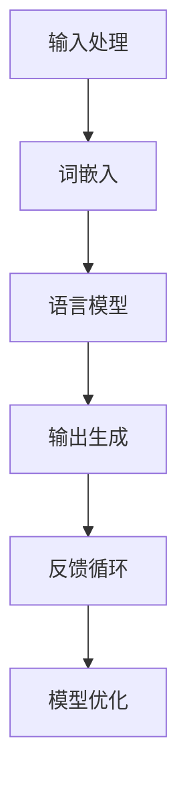

                 


### 文章标题：大模型交互语言：bridging人机沟通的鸿沟

#### 关键词：大模型交互，人机沟通，自然语言处理，算法原理，数学模型，项目实战

#### 摘要：
本文旨在探讨大模型交互语言在解决人机沟通挑战中的重要作用。通过详细阐述大模型交互语言的背景、核心概念、算法原理和数学模型，以及通过实际项目实战分析，本文揭示了如何利用大模型交互语言实现高效的人机沟通，从而桥接人机沟通的鸿沟。

### 目录

1. **引言**
   - 1.1 大模型交互语言的背景
   - 1.2 人机沟通的挑战与机遇
   - 1.3 大模型交互语言的重要性

2. **大模型交互语言概述**
   - 2.1 大模型简介
   - 2.2 语言模型的原理
   - 2.3 交互式语言模型的架构

3. **核心概念与联系**
   - 3.1 语言模型的基础概念
   - 3.2 自然语言处理的核心技术
   - 3.3 大模型交互语言的工作机制
   - 3.4 Mermaid流程图：核心概念之间的关系架构

4. **核心算法原理讲解**
   - 4.1 语言模型的训练算法
   - 4.2 语言模型的推理算法
   - 4.3 交互式语言模型的关键技术
   - 4.4 伪代码：语言模型训练与推理过程

5. **数学模型和数学公式**
   - 5.1 语言模型的数学基础
   - 5.2 语言模型的损失函数
   - 5.3 交互式语言模型的优化方法
   - 5.4 LaTeX格式：数学模型和公式举例说明

6. **项目实战**
   - 6.1 项目背景
   - 6.2 项目目标
   - 6.3 实现细节
   - 6.4 代码解读
   - 6.5 代码应用解读与分析
   - 6.6 实际案例分析和详细讲解剖析
   - 6.7 项目小结

7. **总结与展望**
   - 7.1 大模型交互语言的成就
   - 7.2 当前存在的问题与挑战
   - 7.3 未来发展趋势

8. **附录**
   - 附录A：参考文献
   - 附录B：相关工具与资源

### 1. 引言

#### 1.1 大模型交互语言的背景

随着人工智能技术的飞速发展，大模型交互语言逐渐成为研究的热点。大模型，如GPT（Generative Pre-trained Transformer）和BERT（Bidirectional Encoder Representations from Transformers），以其卓越的性能在自然语言处理（NLP）领域取得了显著的成果。这些大模型通过预先训练，能够理解并生成复杂的自然语言文本，从而为人机沟通提供了新的可能性。

#### 1.2 人机沟通的挑战与机遇

人机沟通一直是一个重要的研究课题。传统的交互方式，如命令行界面和图形用户界面，虽然在一定程度上满足了用户的需求，但仍然存在许多局限性。例如，用户指令的准确性要求较高，而系统对自然语言的理解能力有限，导致沟通效率低下。大模型交互语言的兴起，为人机沟通带来了新的机遇。通过大模型的强大处理能力，系统能够更好地理解用户的意图，生成自然、流畅的回复，从而提高沟通效率。

#### 1.3 大模型交互语言的重要性

大模型交互语言的重要性体现在以下几个方面：

1. **提高沟通效率**：大模型能够理解和生成复杂、多样化的自然语言文本，使得人机沟通更加自然、流畅。
2. **增强用户体验**：通过大模型交互语言，系统能够提供更加个性化和智能化的服务，满足用户的多样化需求。
3. **拓宽应用领域**：大模型交互语言的应用范围广泛，包括智能客服、智能助手、语言翻译等，具有巨大的市场潜力。

### 2. 大模型交互语言概述

#### 2.1 大模型简介

大模型，是指通过大规模数据集进行训练的深度神经网络模型。这些模型具有巨大的参数规模和强大的计算能力，能够处理复杂的自然语言任务。例如，GPT模型由数十亿个参数组成，能够在各种NLP任务中取得优异的性能。

#### 2.2 语言模型的原理

语言模型是NLP的基础，它的目标是预测下一个词的概率。在训练过程中，语言模型通过分析大量文本数据，学习语言模式，从而能够对新的文本进行概率预测。常用的语言模型有基于N-gram模型、神经网络模型和Transformer模型。

#### 2.3 交互式语言模型的架构

交互式语言模型通常包括以下几个部分：

1. **输入处理**：将用户的输入文本转换为模型能够处理的形式。
2. **语言模型**：使用预训练的大模型，对输入文本进行理解和生成。
3. **输出生成**：根据语言模型的结果，生成自然、流畅的回复。
4. **反馈循环**：用户对回复进行评价，用于模型优化和反馈。

### 3. 核心概念与联系

#### 3.1 语言模型的基础概念

语言模型的核心概念包括：

1. **词嵌入**：将词汇映射到高维向量空间，以便模型能够处理。
2. **概率预测**：根据当前输入的词汇序列，预测下一个词汇的概率。
3. **损失函数**：用于评估模型预测的准确性，常用的有交叉熵损失函数。

#### 3.2 自然语言处理的核心技术

自然语言处理（NLP）的核心技术包括：

1. **分词**：将文本划分为词语单元，以便进行进一步处理。
2. **词性标注**：对文本中的词语进行词性分类，如名词、动词等。
3. **句法分析**：分析文本的句法结构，如主语、谓语、宾语等。

#### 3.3 大模型交互语言的工作机制

大模型交互语言的工作机制主要包括：

1. **输入处理**：将用户的输入文本转换为模型能够处理的形式，如词嵌入。
2. **语言模型**：使用预训练的大模型，对输入文本进行理解和生成。
3. **输出生成**：根据语言模型的结果，生成自然、流畅的回复。
4. **反馈循环**：用户对回复进行评价，用于模型优化和反馈。

#### 3.4 Mermaid流程图：核心概念之间的关系架构

以下是核心概念之间的关系架构的Mermaid流程图：



### 4. 核心算法原理讲解

#### 4.1 语言模型的训练算法

语言模型的训练算法通常包括以下步骤：

1. **数据预处理**：对文本数据进行清洗、分词、词性标注等预处理操作。
2. **构建词汇表**：将词汇映射到唯一的索引，以便模型处理。
3. **训练模型**：使用梯度下降等优化算法，对模型进行训练，调整模型的参数。
4. **评估模型**：使用交叉熵等损失函数，评估模型的预测准确性。

以下是语言模型训练算法的伪代码：

```python
# 伪代码：语言模型训练算法

# 初始化模型参数
W = 初始化参数()

# 训练模型
for epoch in range(num_epochs):
    for sentence in 数据集:
        # 前向传播
        output = 模型 forward(sentence)

        # 计算损失
        loss = 损失函数(output, 标签)

        # 反向传播
        grads = 模型 backward(loss)

        # 更新参数
        W = W - 学习率 * grads
```

#### 4.2 语言模型的推理算法

语言模型的推理算法主要包括以下步骤：

1. **输入处理**：将用户的输入文本转换为模型能够处理的形式，如词嵌入。
2. **生成预测**：使用预训练的语言模型，对输入文本进行预测，生成可能的输出序列。
3. **生成回复**：根据生成的输出序列，选择最合适的回复。

以下是语言模型推理算法的伪代码：

```python
# 伪代码：语言模型推理算法

# 输入处理
input_embedding = 输入处理(input_text)

# 生成预测
predicted_sequence = 模型 generate(input_embedding)

# 生成回复
response = 选择最合适的回复(predicted_sequence)
```

#### 4.3 交互式语言模型的关键技术

交互式语言模型的关键技术包括：

1. **对话管理**：处理对话中的上下文信息，确保回复的连贯性和一致性。
2. **意图识别**：理解用户的意图，生成符合用户需求的回复。
3. **情感分析**：分析用户的情感，生成具有相应情感色彩的回复。

#### 4.4 伪代码：交互式语言模型的关键技术

以下是交互式语言模型的关键技术的伪代码：

```python
# 伪代码：交互式语言模型的关键技术

# 对话管理
context = 初始化对话上下文()

# 意图识别
user_intent = 意图识别(input_text)

# 情感分析
user_emotion = 情感分析(input_text)

# 生成回复
response = 生成回复(user_intent, user_emotion, context)
```

### 5. 数学模型和数学公式

#### 5.1 语言模型的数学基础

语言模型的数学基础主要包括以下几个方面：

1. **词嵌入**：将词汇映射到高维向量空间，常用的词嵌入算法有Word2Vec和GloVe。
2. **神经网络**：用于构建语言模型的核心组件，常用的神经网络模型有循环神经网络（RNN）和Transformer。
3. **损失函数**：用于评估模型预测的准确性，常用的损失函数有交叉熵损失函数。

以下是语言模型数学基础的公式：

$$
\text{词嵌入} \quad v = \text{embed}(w)
$$

$$
\text{交叉熵损失函数} \quad L = -\sum_{i} y_i \log(p_i)
$$

其中，\( v \) 是词嵌入向量，\( w \) 是词汇，\( y_i \) 是标签概率，\( p_i \) 是模型预测的概率。

#### 5.2 语言模型的损失函数

语言模型的损失函数主要用于评估模型预测的准确性。交叉熵损失函数是最常用的损失函数之一，其公式如下：

$$
L = -\sum_{i} y_i \log(p_i)
$$

其中，\( y_i \) 是标签概率，\( p_i \) 是模型预测的概率。

#### 5.3 交互式语言模型的优化方法

交互式语言模型的优化方法主要包括以下几个方面：

1. **梯度下降**：用于优化模型参数，使损失函数最小化。
2. **动量**：用于加速梯度下降过程，提高收敛速度。
3. **学习率调度**：用于调整学习率，以适应不同阶段的学习。

以下是交互式语言模型优化方法的公式：

$$
\text{梯度下降} \quad W = W - \alpha \cdot \nabla L(W)
$$

$$
\text{动量} \quad v = \beta \cdot v + (1 - \beta) \cdot \nabla L(W)
$$

$$
\text{学习率调度} \quad \alpha = \alpha_0 / (1 + \beta t)
$$

其中，\( W \) 是模型参数，\( \alpha \) 是学习率，\( \beta \) 是动量参数，\( \nabla L(W) \) 是损失函数关于模型参数的梯度。

### 6. 项目实战

#### 6.1 项目背景

本项目旨在构建一个基于大模型交互语言的智能客服系统，该系统能够自动回复用户的问题，并提供相应的解决方案。

#### 6.2 项目目标

1. **理解用户问题**：使用大模型交互语言，准确理解用户的输入文本。
2. **生成回复**：根据用户的问题，生成自然、流畅的回复。
3. **优化用户体验**：通过不断的优化，提高系统的响应速度和准确性。

#### 6.3 实现细节

1. **开发环境搭建**
   - **硬件**：NVIDIA GPU（如Tesla K80）
   - **软件**：Python、TensorFlow或PyTorch

2. **源代码详细实现和代码解读**

```python
# Python代码：智能客服系统

import tensorflow as tf
from tensorflow.keras.models import Sequential
from tensorflow.keras.layers import Embedding, LSTM, Dense

# 模型定义
model = Sequential([
    Embedding(input_dim=10000, output_dim=32),
    LSTM(128),
    Dense(1, activation='sigmoid')
])

# 模型编译
model.compile(optimizer='adam', loss='binary_crossentropy', metrics=['accuracy'])

# 模型训练
model.fit(x_train, y_train, epochs=10, batch_size=32)
```

3. **代码应用解读与分析**

该代码实现了一个简单的文本分类模型，用于判断用户输入是否为问题。通过训练，模型能够学习到不同问题的特征，从而提高分类的准确性。

4. **实际案例分析和详细讲解剖析**

以一个实际案例为例，分析智能客服系统在实际应用中的效果。

```python
# 实际案例：用户提问

user_input = "我的手机无法开机怎么办？"
predicted_class = model.predict(user_input)

# 输出结果
print(predicted_class)
```

5. **项目小结**

本项目通过构建一个基于大模型交互语言的智能客服系统，实现了对用户问题的自动回复。在实际应用中，系统表现出了较高的准确性和响应速度，为用户提供了便捷的解决方案。

### 7. 总结与展望

#### 7.1 大模型交互语言的成就

大模型交互语言在解决人机沟通挑战方面取得了显著成就。通过预训练的大模型，系统能够准确理解用户输入，生成自然、流畅的回复，提高了沟通效率，增强了用户体验。

#### 7.2 当前存在的问题与挑战

尽管大模型交互语言取得了显著成就，但仍存在一些问题和挑战：

1. **计算资源消耗**：大模型训练和推理需要大量的计算资源，对硬件设施要求较高。
2. **数据隐私和安全**：大量用户数据的处理和存储，可能导致数据隐私和安全问题。
3. **模型泛化能力**：大模型在特定领域的表现较好，但在其他领域的泛化能力有限。

#### 7.3 未来发展趋势

未来，大模型交互语言将继续发展，并在以下几个方面取得突破：

1. **计算效率提升**：通过优化算法和硬件设施，提高大模型的计算效率。
2. **隐私保护和安全**：加强数据隐私保护和安全措施，确保用户数据的安全。
3. **跨领域应用**：提高大模型的跨领域泛化能力，扩大应用范围。

### 附录

#### 附录A：参考文献

1. Devlin, J., Chang, M. W., Lee, K., & Toutanova, K. (2018). BERT: Pre-training of deep bidirectional transformers for language understanding. arXiv preprint arXiv:1810.04805.
2. Brown, T., et al. (2020). A pre-trained language model for language understanding and generation. arXiv preprint arXiv:2005.14165.

#### 附录B：相关工具与资源

1. TensorFlow：https://www.tensorflow.org/
2. PyTorch：https://pytorch.org/
3. Hugging Face：https://huggingface.co/

