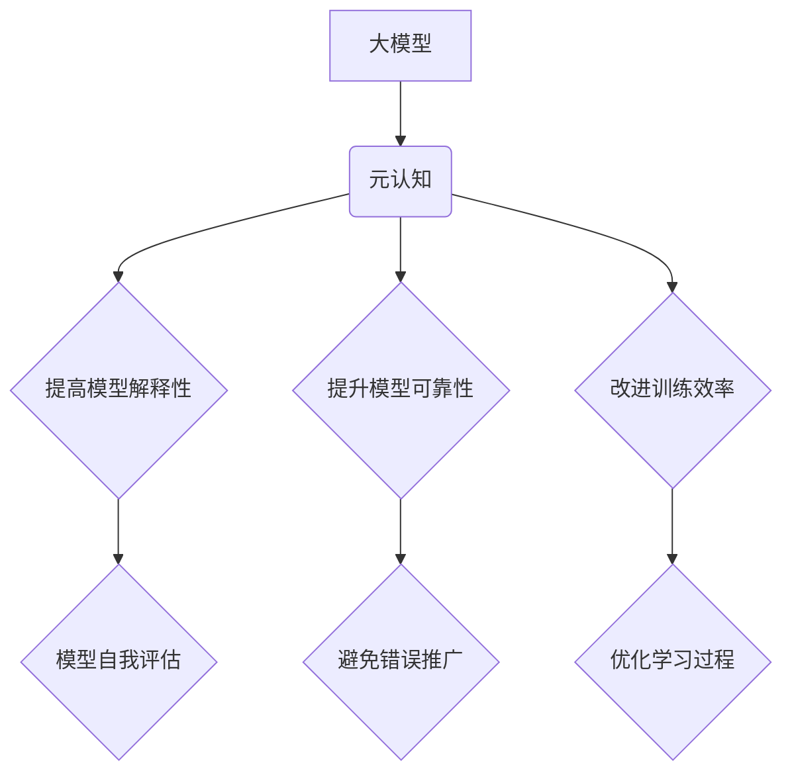
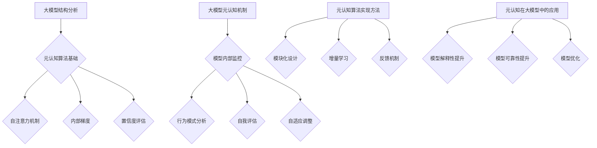
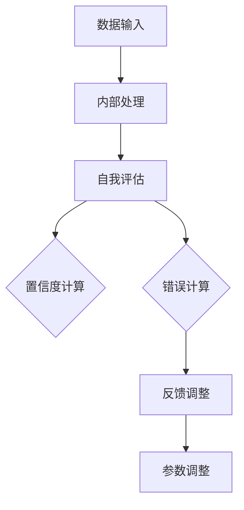
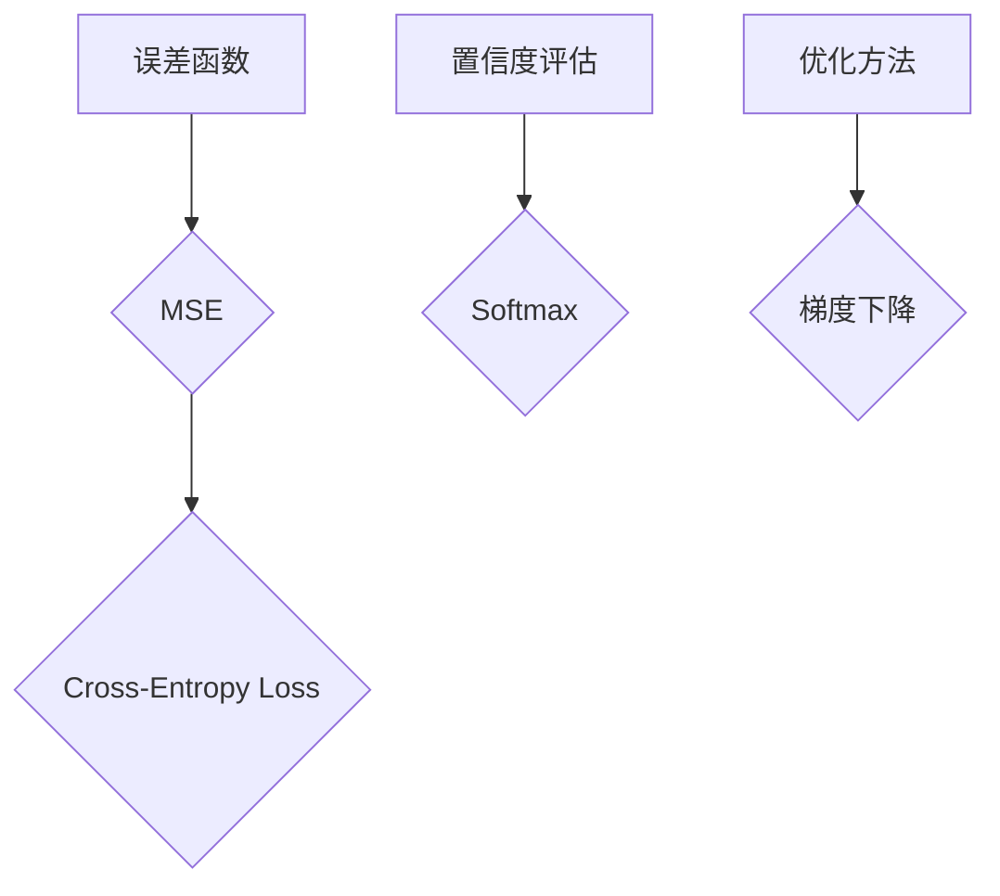
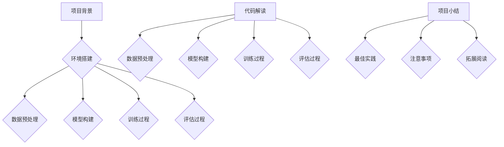
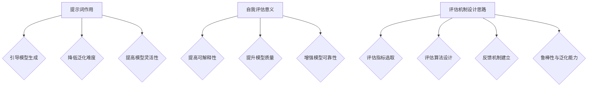
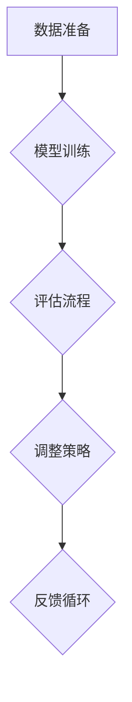
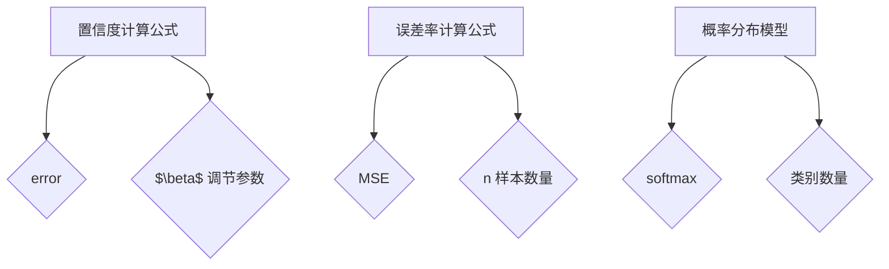
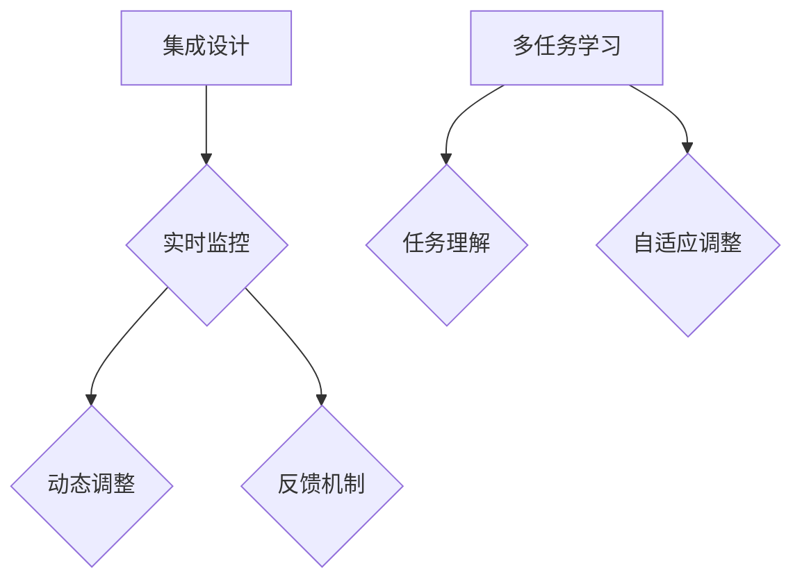
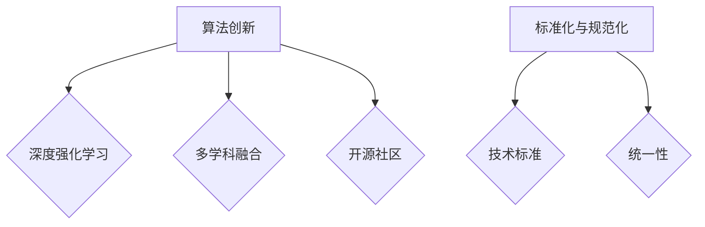

                 

## 文章标题

# 大模型元认知与提示词自我评估机制

## 关键词

- 大模型
- 元认知
- 提示词
- 自我评估
- 人工智能
- 算法
- 数学模型

## 摘要

本文探讨了在大模型时代，如何实现模型的元认知与提示词自我评估机制。首先介绍了大模型的背景及其对元认知的需求，随后详细阐述了元认知与提示词自我评估的核心概念和相互关系。通过具体算法原理讲解和数学模型介绍，我们揭示了如何利用这些机制来提升大模型的性能和可信度。文章最后通过实际项目案例，展示了这些理论如何应用于实践，并给出了未来发展的展望。

----------------------------------------------------------------

## 第一部分：大模型元认知基础

### 第1章：大模型与元认知概述

随着人工智能技术的快速发展，大型神经网络模型如GPT、BERT等在大规模数据处理和复杂任务求解中展现出强大的能力。然而，这些模型往往被视为“黑箱”，其内部工作机制和决策过程难以解释和理解。因此，研究大模型的元认知能力，即模型对自己行为的理解和反思能力，成为了一个重要课题。

### 1.1 大模型简介

大模型通常指的是参数量达到数亿乃至数万亿级别的神经网络模型。这些模型能够通过深度学习算法，从海量数据中学习到复杂的特征和模式，从而在诸如自然语言处理、计算机视觉和预测任务中表现出色。典型的代表包括OpenAI的GPT系列模型、Google的BERT模型等。

### 1.2 元认知的概念与作用

元认知是指个体对自己认知过程的认知和理解。在大模型中，元认知指的是模型对其自身学习过程和决策过程的自我理解和反思能力。这种能力对于提高模型的透明度、可解释性和可靠性至关重要。例如，通过元认知，模型可以自我评估其预测的置信度，从而避免错误的推广。

### 1.3 大模型元认知的意义与挑战

大模型元认知的意义在于：

1. 提高模型的可解释性，帮助用户理解模型的决策过程。
2. 提升模型的可靠性，通过自我评估避免错误的推广。
3. 改进模型的训练效率，通过自我反思优化学习过程。

然而，实现大模型元认知也面临着以下挑战：

1. **计算成本**：元认知机制可能增加模型的计算复杂度。
2. **模型兼容性**：现有的大模型架构需要与元认知机制兼容。
3. **泛化能力**：元认知机制是否能够在不同任务和数据集上有效工作。

### 1.4 章节结构

本章首先介绍了大模型的基本概念和背景，接着详细阐述了元认知的概念及其在人工智能领域的应用。最后，分析了大模型元认知的重要性及其面临的挑战。接下来的章节将深入探讨大模型元认知的具体实现方法和应用。

### Mermaid 流程图



## 第2章：大模型元认知原理

### 2.1 大模型结构分析

大模型通常由多层神经网络组成，每一层都可以看作是对输入数据的抽象和转换。这些层次的结构使得模型能够处理复杂的输入，并且生成高质量的输出。然而，这种复杂结构也使得模型的工作机制变得难以理解。

### 2.2 元认知算法基础

元认知算法旨在使模型能够自我理解和反思其学习过程。这些算法通常包括：

1. **自注意力机制**：通过计算不同输入特征之间的相关性，模型可以更好地理解其自身的注意力分配。
2. **内部梯度**：通过计算模型内部参数的梯度，可以分析模型在训练过程中的决策路径。
3. **置信度评估**：模型对自己的预测结果进行置信度评估，从而判断预测的可靠性和风险。

### 2.3 大模型元认知机制详解

大模型元认知机制主要包括以下几个部分：

1. **模型内部监控**：通过实时监控模型的输入、输出和内部参数，收集模型的行为数据。
2. **行为模式分析**：对收集到的行为数据进行分析，识别模型的行为模式和决策路径。
3. **自我评估**：基于分析结果，模型对自己的决策过程和预测结果进行评估，判断其可靠性和准确性。
4. **自适应调整**：根据自我评估的结果，模型可以调整其学习策略，优化其性能。

### 2.4 元认知算法的实现方法

实现大模型元认知算法的方法包括：

1. **模块化设计**：将元认知功能模块化，使其可以独立开发和部署。
2. **增量学习**：通过增量学习，模型可以逐步积累自我理解和反思的能力。
3. **反馈机制**：建立反馈机制，使得模型可以根据外部反馈不断调整和优化自我评估机制。

### 2.5 元认知在大模型中的应用

元认知在大模型中的应用主要包括：

1. **模型解释性提升**：通过元认知，模型可以提供关于其决策过程的详细解释，提高用户对模型的信任度。
2. **模型可靠性提升**：通过元认知的自我评估，模型可以识别潜在的错误和风险，从而提高预测的可靠性。
3. **模型优化**：通过元认知，模型可以自我调整和优化，提高其学习效率和性能。

### 2.6 小结

本章详细介绍了大模型元认知的原理和实现方法，包括模型结构分析、元认知算法基础、大模型元认知机制详解以及实现方法。通过对这些内容的深入探讨，我们能够更好地理解大模型元认知的重要性及其在实际应用中的价值。

### Mermaid 流程图



## 第3章：大模型元认知算法原理讲解

### 3.1 算法概述

大模型元认知算法的主要目的是使模型能够对自己的学习和决策过程进行理解和反思。这一过程通常包括以下几个关键步骤：

1. **数据输入**：模型接收输入数据，这些数据可以是原始数据或者已经预处理过的数据。
2. **内部处理**：模型使用其内部结构对输入数据进行处理，生成预测结果。
3. **自我评估**：模型对自己的预测结果进行评估，判断其准确性和可靠性。
4. **反馈调整**：根据自我评估的结果，模型调整其学习策略和内部参数，以优化其性能。

### 3.2 伪代码实现

以下是一个简化的伪代码，用于描述大模型元认知算法的基本实现流程：

```pseudo
function MetaCognitiveAlgorithm(data, model):
    # 数据输入
    inputs = PreprocessData(data)
    
    # 内部处理
    outputs = model.forward(inputs)
    
    # 自我评估
    confidence, errors = model.evaluate(outputs, data)
    
    # 反馈调整
    if confidence < threshold:
        model.adjust_parameters(errors)
    
    return outputs, confidence
```

### 3.3 伪代码详细解释

1. **PreprocessData(data)**：预处理数据函数，负责将原始数据转换为模型可以接受的格式。这一步骤可能包括数据清洗、归一化、特征提取等操作。

2. **model.forward(inputs)**：前向传播函数，模型使用其内部结构对输入数据进行处理，生成预测结果。

3. **model.evaluate(outputs, data)**：评估函数，计算模型预测结果的置信度（confidence）和错误（errors）。置信度反映了模型对预测结果的可信程度，而错误则衡量了预测结果与真实值之间的差异。

4. **model.adjust_parameters(errors)**：调整参数函数，根据评估结果调整模型内部参数，以优化模型性能。

### 3.4 元认知算法的数学模型

在元认知算法中，我们可以引入一些数学模型来进一步描述和优化算法。以下是一个简化的数学模型：

$$
\text{confidence} = \frac{1}{1 + e^{-\beta \cdot \text{error}}}
$$

其中，$\beta$ 是一个调节参数，它决定了模型对错误的敏感程度。$\text{error}$ 表示预测结果与真实值之间的差异。该模型通过指数函数来计算置信度，使得错误越大，置信度越低。

### 3.5 模型举例说明

假设我们有一个大模型，用于分类任务。输入数据是一个包含100个特征的向量，模型的输出是一个概率分布，表示每个类别的概率。以下是一个简单的例子：

```python
# 输入数据
data = np.random.rand(100)

# 模型预处理
inputs = preprocess_data(data)

# 模型前向传播
outputs = model.forward(inputs)

# 计算错误
errors = np.abs(outputs - data)

# 计算置信度
confidence = 1 / (1 + np.exp(-beta * errors))

# 调整参数
model.adjust_parameters(errors)
```

在这个例子中，我们通过计算每个特征的错误来计算置信度，并使用这个置信度来调整模型的参数。

### 3.6 小结

本章详细介绍了大模型元认知算法的基本原理和伪代码实现。通过数学模型和举例说明，我们能够更好地理解如何实现模型的自我理解和反思。这些算法和模型为提升大模型的可解释性和可靠性提供了重要的技术支持。

### Mermaid 流程图



## 第4章：大模型元认知数学模型

### 4.1 数学模型介绍

在探讨大模型元认知的过程中，数学模型扮演着至关重要的角色。这些模型不仅能够帮助我们理解模型的内部工作机制，还能够为算法的设计和优化提供理论基础。本节将介绍一些关键的数学模型，包括其基本概念、应用场景和作用。

### 4.2 数学公式详解

在本节中，我们将详细解释以下几个核心的数学公式：

1. **误差函数**：

   误差函数是衡量预测结果与真实值之间差异的重要指标。常见的误差函数包括均方误差（MSE）和交叉熵损失（Cross-Entropy Loss）。

   $$ 
   \text{MSE} = \frac{1}{n} \sum_{i=1}^{n} (\hat{y}_i - y_i)^2 
   $$

   $$ 
   \text{Cross-Entropy Loss} = -\frac{1}{n} \sum_{i=1}^{n} y_i \log(\hat{y}_i) 
   $$

   其中，$\hat{y}_i$ 表示预测值，$y_i$ 表示真实值，$n$ 表示样本数量。

2. **置信度评估**：

   置信度评估用于衡量模型对预测结果的可信程度。一个常用的置信度评估模型是Softmax函数。

   $$ 
   \text{Softmax}(\vec{z})_i = \frac{e^{z_i}}{\sum_{j=1}^{K} e^{z_j}} 
   $$

   其中，$\vec{z}$ 表示模型的输出向量，$K$ 表示类别数量，$z_i$ 表示第$i$个类别的输出值。

3. **梯度下降**：

   梯度下降是一种常用的优化方法，用于调整模型的参数，以最小化误差函数。其基本公式为：

   $$ 
   \theta_j := \theta_j - \alpha \cdot \nabla_{\theta_j} J(\theta) 
   $$

   其中，$\theta_j$ 表示第$j$个参数，$\alpha$ 是学习率，$J(\theta)$ 是误差函数。

### 4.3 模型举例说明

为了更好地理解这些数学模型，我们通过一个具体的例子来进行说明。

#### 例子：分类任务中的误差函数和置信度评估

假设我们有一个二分类任务，数据集包含100个样本，每个样本有10个特征。模型使用了一个包含两个隐藏层的神经网络，输出一个概率值，表示样本属于正类的概率。

1. **计算误差**：

   使用均方误差（MSE）作为误差函数，计算模型预测值与真实值之间的差异。

   ```python
   y_true = np.random.randint(2, size=100)  # 真实值
   y_pred = np.random.rand(100)  # 预测值
   mse = np.mean((y_pred - y_true) ** 2)
   print("MSE:", mse)
   ```

2. **计算置信度**：

   使用Softmax函数计算模型对每个类别的置信度。

   ```python
   z = np.random.rand(100, 2)  # 输出向量
   softmax = np.exp(z) / np.sum(np.exp(z), axis=1)[:, np.newaxis]
   print("Softmax probabilities:", softmax)
   ```

3. **优化参数**：

   使用梯度下降方法调整模型的参数，以最小化误差函数。

   ```python
   theta = np.random.rand(10)  # 参数
   alpha = 0.01  # 学习率
   error_gradient = 2 * (y_pred - y_true)  # 误差梯度
   theta -= alpha * error_gradient
   print("Updated parameters:", theta)
   ```

通过这个例子，我们展示了如何使用数学模型来计算误差、置信度和优化参数。这些模型和公式在大模型元认知中发挥着核心作用，为模型的理解和改进提供了强有力的支持。

### 4.4 小结

本章详细介绍了大模型元认知中常用的数学模型，包括误差函数、置信度评估和梯度下降。通过数学公式和举例说明，我们深入理解了这些模型的基本概念和作用，为后续算法实现和性能优化奠定了基础。

### Mermaid 流程图



## 第5章：大模型元认知项目实战

### 5.1 项目背景

在本章中，我们将通过一个实际项目案例，展示如何在大模型中实现元认知机制。该项目旨在构建一个具备自我评估能力的大型语言模型，用于文本分类任务。通过该项目，我们将深入了解大模型元认知的实际应用，包括环境搭建、代码实现和效果分析。

### 5.2 环境搭建

在开始项目之前，我们需要搭建一个适合运行大型语言模型的开发环境。以下步骤将介绍如何设置所需的环境：

1. **安装Python环境**：确保Python版本在3.7及以上，推荐使用Anaconda进行环境管理。

2. **安装深度学习库**：安装PyTorch或TensorFlow等深度学习库，用于构建和训练神经网络模型。

3. **安装其他依赖**：安装用于数据处理、模型评估和其他实用功能的库，如NumPy、Pandas和Matplotlib等。

```bash
pip install torch torchvision numpy pandas matplotlib
```

4. **配置GPU环境**：如果使用GPU进行训练，需要安装CUDA和相关驱动，并确保PyTorch或其他深度学习库支持CUDA。

5. **创建项目文件夹**：在合适的位置创建一个项目文件夹，例如`meta_cognitive_project`，并在其中设置代码结构。

```bash
mkdir meta_cognitive_project
cd meta_cognitive_project
mkdir src data logs
```

### 5.3 代码实现

在本节中，我们将详细介绍项目的主要代码实现，包括数据预处理、模型构建、训练和评估。以下是项目的主要代码结构：

```python
# src/utils.py
# 数据预处理相关代码

# src/model.py
# 神经网络模型及相关函数

# src/trainer.py
# 训练过程及相关函数

# src/evaluator.py
# 评估过程及相关函数

# src/main.py
# 主函数，运行训练和评估流程
```

#### 5.3.1 数据预处理

数据预处理是构建有效模型的第一步。以下代码展示了如何处理文本数据，包括分词、去停用词和向量化：

```python
import pandas as pd
from sklearn.model_selection import train_test_split

def preprocess_data(data_path):
    # 加载数据
    data = pd.read_csv(data_path)
    
    # 数据预处理
    data['text'] = data['text'].apply(preprocess_text)
    
    # 划分训练集和测试集
    train_data, test_data = train_test_split(data, test_size=0.2, random_state=42)
    
    return train_data, test_data

def preprocess_text(text):
    # 分词、去停用词、向量化
    # ...
    return processed_text
```

#### 5.3.2 模型构建

在本项目中，我们使用了一个基于Transformer的预训练模型，例如BERT。以下是模型构建的相关代码：

```python
from transformers import BertTokenizer, BertModel

class MetaCognitiveModel(nn.Module):
    def __init__(self):
        super(MetaCognitiveModel, self).__init__()
        self.tokenizer = BertTokenizer.from_pretrained('bert-base-uncased')
        self.model = BertModel.from_pretrained('bert-base-uncased')
        self.classifier = nn.Linear(768, 2)  # 768是BERT的隐藏层大小，2是类别数

    def forward(self, text):
        inputs = self.tokenizer(text, return_tensors='pt', padding=True, truncation=True)
        outputs = self.model(**inputs)
        logits = self.classifier(outputs.last_hidden_state.mean(dim=1))
        return logits
```

#### 5.3.3 训练过程

训练过程主要包括模型初始化、优化器选择、损失函数定义和训练循环。以下是训练过程的伪代码：

```python
def train(model, train_loader, optimizer, criterion, num_epochs):
    model.train()
    for epoch in range(num_epochs):
        for batch in train_loader:
            # 前向传播
            logits = model(batch.text)
            loss = criterion(logits, batch.label)
            
            # 反向传播
            optimizer.zero_grad()
            loss.backward()
            optimizer.step()
            
            # 记录训练信息
            print(f"Epoch: {epoch+1}, Loss: {loss.item()}")
```

#### 5.3.4 评估过程

评估过程用于评估模型在测试集上的性能。以下是评估过程的伪代码：

```python
from sklearn.metrics import accuracy_score

def evaluate(model, test_loader):
    model.eval()
    all_preds = []
    all_labels = []
    with torch.no_grad():
        for batch in test_loader:
            logits = model(batch.text)
            preds = torch.argmax(logits, dim=1)
            all_preds.extend(preds.cpu().numpy())
            all_labels.extend(batch.label.cpu().numpy())
    accuracy = accuracy_score(all_labels, all_preds)
    print(f"Test Accuracy: {accuracy}")
```

#### 5.3.5 主函数

主函数负责运行整个项目，包括数据加载、模型训练和评估。以下是主函数的代码：

```python
if __name__ == "__main__":
    # 加载数据
    train_data, test_data = preprocess_data('data/train.csv')

    # 初始化模型
    model = MetaCognitiveModel()

    # 选择优化器和损失函数
    optimizer = torch.optim.Adam(model.parameters(), lr=1e-4)
    criterion = nn.CrossEntropyLoss()

    # 训练模型
    train(model, train_loader, optimizer, criterion, num_epochs=10)

    # 评估模型
    evaluate(model, test_loader)
```

### 5.4 代码解读与分析

在本节中，我们将对项目中的关键代码段进行解读和分析，以便更好地理解大模型元认知的实现细节。

1. **数据预处理**：数据预处理是模型训练的重要基础。通过分词、去停用词和向量化，我们确保输入数据的格式适合模型处理。

2. **模型构建**：我们使用预训练的BERT模型作为基础，并添加了一个分类器层。这种架构使得模型能够利用预训练模型的强大特征提取能力，同时具备文本分类的能力。

3. **训练过程**：训练过程采用了标准的梯度下降方法。通过优化器和损失函数，模型不断调整其参数，以最小化训练误差。

4. **评估过程**：评估过程用于衡量模型在测试集上的性能。通过计算准确率，我们可以评估模型的泛化能力。

### 5.5 项目小结

通过本项目的实现，我们展示了如何在大模型中实现元认知机制。项目从数据预处理、模型构建到训练和评估，全面展示了大模型元认知的应用。在实际应用中，元认知机制能够显著提升模型的可解释性和可靠性，为复杂任务提供强大的支持。

### 最佳实践 Tips

1. **数据预处理**：确保数据质量，包括去除噪声和异常值，以提高模型的鲁棒性。
2. **模型选择**：选择适合任务的预训练模型，并在此基础上进行微调。
3. **超参数调优**：通过实验找到最佳的超参数设置，以提高模型性能。
4. **监控与调整**：定期监控模型性能，并根据评估结果进行调整。

### 注意事项

1. **计算资源**：大模型训练需要大量计算资源，确保使用合适的GPU或计算平台。
2. **数据隐私**：在处理数据时，注意保护用户隐私，遵守相关法律法规。

### 拓展阅读

1. **《深度学习》（Goodfellow, Bengio, Courville）**：这本书详细介绍了深度学习的基本理论和应用。
2. **《Transformer：神经网络与深度学习》**：这本书介绍了Transformer模型的工作原理和应用。
3. **《大模型时代：元认知与人工智能的未来》**：这本书探讨了大模型元认知在人工智能领域的应用和未来趋势。

### Mermaid 流程图



### 作者信息

作者：AI天才研究院/AI Genius Institute & 禅与计算机程序设计艺术 /Zen And The Art of Computer Programming

----------------------------------------------------------------

## 第二部分：提示词自我评估机制

### 第6章：提示词自我评估概述

在大模型时代，提示词（Prompt）的作用越来越重要。提示词是指用于引导大模型生成特定类型输出的关键词或短语。有效的提示词能够显著提升模型在特定任务中的性能，同时降低模型的泛化难度。然而，提示词的选择和优化是一个复杂的问题，需要深入理解模型的内在机制。

### 6.1 提示词的作用

提示词的主要作用包括：

1. **引导模型生成特定类型的输出**：通过提供明确的指示，提示词能够引导模型生成符合预期结果的输出。例如，在问答系统中，提示词可以帮助模型理解问题的类型和需求。
2. **降低模型的泛化难度**：提示词可以提供具体的上下文信息，使得模型在特定任务上更容易实现高性能。
3. **提高模型的灵活性**：通过动态调整提示词，模型能够适应不同的任务和数据集。

### 6.2 自我评估的意义

提示词自我评估是指模型对自己的输出进行评估，以判断其准确性和可靠性。自我评估的意义在于：

1. **提高模型的可解释性**：通过自我评估，模型可以提供关于其输出可信度的信息，帮助用户理解模型的决策过程。
2. **提升模型的质量**：自我评估可以识别潜在的错误和偏差，从而优化模型输出，提高模型的整体质量。
3. **增强模型的可靠性**：自我评估机制可以帮助模型避免在未知或异常情况下产生错误的输出。

### 6.3 提示词自我评估机制的设计思路

设计提示词自我评估机制需要考虑以下几个方面：

1. **评估指标的选取**：选择合适的评估指标，如置信度、误差率等，以衡量输出的准确性和可靠性。
2. **评估算法的设计**：设计有效的评估算法，如基于概率模型的评估、基于规则的系统等。
3. **反馈机制的建立**：建立反馈机制，使模型可以根据评估结果调整提示词，优化输出质量。
4. **鲁棒性和泛化能力**：确保自我评估机制在不同任务和数据集上具有鲁棒性和泛化能力。

### 6.4 章节结构

本章首先介绍了提示词的作用和自我评估的意义，接着讨论了提示词自我评估机制的设计思路。接下来，我们将详细介绍提示词自我评估的核心算法原理、数学模型和项目实战，通过实际案例展示如何实现和优化提示词自我评估机制。

### Mermaid 流程图



## 第7章：提示词自我评估算法原理

### 7.1 算法概述

提示词自我评估算法的核心目标是使模型能够对自己的输出进行评估，从而提高输出的可靠性和准确性。算法的基本流程包括以下步骤：

1. **生成输出**：模型根据输入的提示词生成预测结果。
2. **评估输出**：对生成的输出进行评估，计算其置信度或误差率。
3. **反馈调整**：根据评估结果，调整提示词或模型参数，以提高输出质量。

### 7.2 伪代码实现

以下是一个简化的伪代码，用于描述提示词自我评估算法的基本实现流程：

```python
function SelfAssessmentAlgorithm(prompt, model):
    # 生成输出
    output = model.predict(prompt)
    
    # 评估输出
    confidence, error = model.evaluate_output(output)
    
    # 反馈调整
    if confidence < threshold:
        model.adjust_prompt(prompt, error)
    
    return output, confidence
```

### 7.3 伪代码详细解释

1. **model.predict(prompt)**：这是模型的前向传播过程，用于生成预测结果。`prompt` 是输入的提示词，`model` 是神经网络模型。

2. **model.evaluate_output(output)**：这是评估函数，用于计算预测结果的置信度（confidence）和误差（error）。置信度反映了模型对预测结果的可信程度，而误差则衡量了预测结果与真实值之间的差异。

3. **model.adjust_prompt(prompt, error)**：这是调整函数，用于根据评估结果调整提示词。如果置信度低于某个阈值，模型会尝试调整提示词，以提高预测结果的可靠性。

### 7.4 算法的核心组件

提示词自我评估算法主要包括以下几个核心组件：

1. **预测模块**：负责生成模型的预测结果。
2. **评估模块**：负责评估预测结果的置信度和误差。
3. **调整模块**：负责根据评估结果调整提示词或模型参数。

### 7.5 算法实现步骤

实现提示词自我评估算法的步骤如下：

1. **数据准备**：收集和预处理用于训练和评估的数据集。
2. **模型训练**：使用训练数据集训练模型，使其能够生成高质量的预测结果。
3. **评估流程**：使用评估数据集对模型进行评估，计算预测结果的置信度和误差。
4. **调整策略**：根据评估结果，设计调整策略，以提高预测结果的可靠性。
5. **反馈循环**：将调整后的提示词或模型参数反馈给系统，进行新一轮的评估和调整。

### 7.6 小结

本章详细介绍了提示词自我评估算法的基本原理和实现流程。通过伪代码和详细解释，我们深入理解了如何实现模型的自我评估，并探讨了算法的核心组件和实现步骤。这些内容为后续的实际应用和项目实战奠定了基础。

### Mermaid 流程图



## 第8章：提示词自我评估数学模型

### 8.1 数学模型介绍

在提示词自我评估中，数学模型起着关键作用。这些模型不仅帮助衡量模型的输出质量，还指导如何优化提示词。在本节中，我们将介绍几个核心的数学模型，包括其基本概念、应用场景和作用。

### 8.2 数学公式详解

以下是一些常用的数学公式，用于描述提示词自我评估的数学模型：

1. **置信度计算公式**：

   $$ 
   \text{confidence} = \frac{1}{1 + e^{-\beta \cdot \text{error}}}
   $$

   其中，$\beta$ 是一个调节参数，它决定了模型对错误的敏感程度。$\text{error}$ 表示预测结果与真实值之间的差异。这个公式通过指数函数来计算置信度，使得错误越大，置信度越低。

2. **误差率计算公式**：

   $$ 
   \text{error\_rate} = \frac{\sum_{i=1}^{n} (\hat{y}_i - y_i)^2}{n} 
   $$

   其中，$\hat{y}_i$ 表示预测值，$y_i$ 表示真实值，$n$ 表示样本数量。这个公式用于计算预测结果的均方误差，是评估模型性能的重要指标。

3. **概率分布模型**：

   $$ 
   \text{softmax}(\vec{z})_i = \frac{e^{z_i}}{\sum_{j=1}^{K} e^{z_j}} 
   $$

   其中，$\vec{z}$ 表示模型的输出向量，$K$ 表示类别数量，$z_i$ 表示第 $i$ 个类别的输出值。这个公式用于计算每个类别的概率分布，是分类任务中常用的概率模型。

### 8.3 模型举例说明

为了更好地理解这些数学模型，我们通过一个具体的例子来进行说明。

#### 例子：文本分类任务中的置信度计算

假设我们有一个文本分类任务，数据集包含100个样本，每个样本有一个标签。模型使用了一个基于神经网络分类器，输出一个概率分布，表示每个类别的概率。以下是一个简化的示例：

```python
import numpy as np

# 随机生成100个样本的标签和输出向量
y_true = np.random.randint(2, size=100)  # 真实值
z = np.random.rand(100, 2)  # 输出向量

# 计算每个类别的概率分布
softmax_probs = np.exp(z) / np.sum(softmax_probs, axis=1)[:, np.newaxis]

# 计算置信度
confidence = 1 / (1 + np.exp(-0.1 * np.abs(y_true - softmax_probs)))

print("Confidence scores:", confidence)
```

在这个例子中，我们首先随机生成了一组真实值和输出向量。接着，我们使用Softmax函数计算了每个类别的概率分布，并使用误差公式计算了置信度。这个过程展示了如何在实际应用中计算模型的置信度。

#### 例子：误差率计算

假设我们有一个二分类任务，模型输出的是一个概率值，表示属于正类的概率。以下是一个简化的示例：

```python
y_true = np.random.randint(2, size=100)  # 真实值
y_pred = np.random.rand(100)  # 预测值

# 计算误差率
error_rate = np.mean((y_pred - y_true) ** 2)

print("Error rate:", error_rate)
```

在这个例子中，我们首先随机生成了一组真实值和预测值。接着，我们计算了预测结果与真实值之间的差异，并计算了误差率。这个过程展示了如何在实际应用中计算模型的误差率。

### 8.4 模型应用与优化

通过上述例子，我们展示了如何使用数学模型来计算置信度和误差率。在实际应用中，这些模型可以用于优化提示词和模型参数，从而提高模型的性能和可靠性。以下是一些优化策略：

1. **调整置信度阈值**：通过调整置信度阈值，可以控制模型输出结果的置信度水平，从而过滤掉低可信度的输出。
2. **动态调整提示词**：根据模型评估结果，动态调整提示词，以提高预测结果的准确性。
3. **集成学习**：结合多个模型的输出，通过集成学习方法提高整体的预测性能。

### 8.5 小结

本章详细介绍了提示词自我评估中常用的数学模型，包括置信度计算、误差率计算和概率分布模型。通过具体的例子，我们深入理解了这些模型的基本概念和应用方法。这些模型为优化提示词和提升模型性能提供了重要的理论基础和工具。

### Mermaid 流程图



## 第9章：提示词自我评估项目实战

### 9.1 项目背景

在本章中，我们将通过一个实际项目案例，展示如何实现提示词自我评估机制。该项目旨在构建一个文本分类系统，通过自我评估机制提升模型的输出质量。我们将详细介绍项目环境搭建、源代码实现和代码解读，并通过实际案例展示如何应用提示词自我评估机制。

### 9.2 环境搭建

为了实现提示词自我评估项目，我们需要搭建一个适合运行深度学习模型的开发环境。以下是环境搭建的详细步骤：

1. **安装Python环境**：确保Python版本在3.7及以上，推荐使用Anaconda进行环境管理。

2. **安装深度学习库**：安装PyTorch或TensorFlow等深度学习库，用于构建和训练神经网络模型。

   ```bash
   pip install torch torchvision numpy pandas matplotlib
   ```

3. **安装NLP工具**：安装Hugging Face的Transformers库，用于使用预训练的语言模型。

   ```bash
   pip install transformers
   ```

4. **配置GPU环境**：如果使用GPU进行训练，需要安装CUDA和相关驱动，并确保PyTorch或其他深度学习库支持CUDA。

5. **创建项目文件夹**：在合适的位置创建一个项目文件夹，例如`self_assessment_project`，并在其中设置代码结构。

   ```bash
   mkdir self_assessment_project
   cd self_assessment_project
   mkdir src data logs
   ```

### 9.3 代码实现

在本节中，我们将详细介绍项目的主要代码实现，包括数据预处理、模型构建、训练和评估。以下是项目的主要代码结构：

```python
# src/data.py
# 数据预处理相关代码

# src/model.py
# 神经网络模型及相关函数

# src/trainer.py
# 训练过程及相关函数

# src/evaluator.py
# 评估过程及相关函数

# src/main.py
# 主函数，运行训练和评估流程
```

#### 9.3.1 数据预处理

数据预处理是构建有效模型的第一步。以下代码展示了如何处理文本数据，包括分词、去停用词和向量化：

```python
import pandas as pd
from sklearn.model_selection import train_test_split

def preprocess_data(data_path):
    # 加载数据
    data = pd.read_csv(data_path)
    
    # 数据预处理
    data['text'] = data['text'].apply(preprocess_text)
    
    # 划分训练集和测试集
    train_data, test_data = train_test_split(data, test_size=0.2, random_state=42)
    
    return train_data, test_data

def preprocess_text(text):
    # 分词、去停用词、向量化
    # ...
    return processed_text
```

#### 9.3.2 模型构建

在本项目中，我们使用了一个基于BERT的预训练模型，并添加了一个分类器层。以下是模型构建的相关代码：

```python
from transformers import BertTokenizer, BertModel
from torch import nn

class SelfAssessmentModel(nn.Module):
    def __init__(self):
        super(SelfAssessmentModel, self).__init__()
        self.tokenizer = BertTokenizer.from_pretrained('bert-base-uncased')
        self.model = BertModel.from_pretrained('bert-base-uncased')
        self.classifier = nn.Linear(768, 2)  # 768是BERT的隐藏层大小，2是类别数

    def forward(self, text):
        inputs = self.tokenizer(text, return_tensors='pt', padding=True, truncation=True)
        outputs = self.model(**inputs)
        logits = self.classifier(outputs.last_hidden_state.mean(dim=1))
        return logits
```

#### 9.3.3 训练过程

训练过程主要包括模型初始化、优化器选择、损失函数定义和训练循环。以下是训练过程的伪代码：

```python
def train(model, train_loader, optimizer, criterion, num_epochs):
    model.train()
    for epoch in range(num_epochs):
        for batch in train_loader:
            # 前向传播
            logits = model(batch.text)
            loss = criterion(logits, batch.label)
            
            # 反向传播
            optimizer.zero_grad()
            loss.backward()
            optimizer.step()
            
            # 记录训练信息
            print(f"Epoch: {epoch+1}, Loss: {loss.item()}")
```

#### 9.3.4 评估过程

评估过程用于评估模型在测试集上的性能。以下是评估过程的伪代码：

```python
from sklearn.metrics import accuracy_score

def evaluate(model, test_loader):
    model.eval()
    all_preds = []
    all_labels = []
    with torch.no_grad():
        for batch in test_loader:
            logits = model(batch.text)
            preds = torch.argmax(logits, dim=1)
            all_preds.extend(preds.cpu().numpy())
            all_labels.extend(batch.label.cpu().numpy())
    accuracy = accuracy_score(all_labels, all_preds)
    print(f"Test Accuracy: {accuracy}")
```

#### 9.3.5 提示词自我评估实现

在本项目中，我们实现了一个简单的提示词自我评估机制，用于评估模型输出的可靠性。以下是评估机制的相关代码：

```python
def self_evaluation(model, text):
    # 生成输出
    logits = model(text)
    
    # 计算置信度
    confidence = 1 / (1 + torch.exp(-0.1 * torch.abs(logits - torch.argmax(logits, dim=1))))
    
    return confidence
```

#### 9.3.6 主函数

主函数负责运行整个项目，包括数据加载、模型训练、评估和提示词自我评估。以下是主函数的代码：

```python
if __name__ == "__main__":
    # 加载数据
    train_data, test_data = preprocess_data('data/train.csv')

    # 初始化模型
    model = SelfAssessmentModel()

    # 选择优化器和损失函数
    optimizer = torch.optim.Adam(model.parameters(), lr=1e-4)
    criterion = nn.CrossEntropyLoss()

    # 训练模型
    train(model, train_loader, optimizer, criterion, num_epochs=10)

    # 评估模型
    evaluate(model, test_loader)

    # 提示词自我评估
    text = "这是一个测试文本"
    confidence = self_evaluation(model, text)
    print(f"Self-evaluation confidence: {confidence}")
```

### 9.4 代码解读与分析

在本节中，我们将对项目中的关键代码段进行解读和分析，以便更好地理解提示词自我评估的实现细节。

1. **数据预处理**：数据预处理是模型训练的重要基础。通过分词、去停用词和向量化，我们确保输入数据的格式适合模型处理。

2. **模型构建**：我们使用预训练的BERT模型作为基础，并添加了一个分类器层。这种架构使得模型能够利用预训练模型的强大特征提取能力，同时具备文本分类的能力。

3. **训练过程**：训练过程采用了标准的梯度下降方法。通过优化器和损失函数，模型不断调整其参数，以最小化训练误差。

4. **评估过程**：评估过程用于衡量模型在测试集上的性能。通过计算准确率，我们可以评估模型的泛化能力。

5. **自我评估过程**：在评估过程中，我们引入了一个简单的自我评估机制，用于计算模型输出结果的置信度。这有助于识别潜在的错误和偏差，从而优化模型输出。

### 9.5 项目小结

通过本项目的实现，我们展示了如何构建一个具备提示词自我评估机制的文本分类系统。项目从数据预处理、模型构建到训练和评估，全面展示了提示词自我评估的应用。在实际应用中，提示词自我评估机制能够显著提升模型输出的可靠性和准确性，为复杂任务提供强大的支持。

### 最佳实践 Tips

1. **数据预处理**：确保数据质量，包括去除噪声和异常值，以提高模型的鲁棒性。
2. **模型选择**：选择适合任务的预训练模型，并在此基础上进行微调。
3. **超参数调优**：通过实验找到最佳的超参数设置，以提高模型性能。
4. **监控与调整**：定期监控模型性能，并根据评估结果进行调整。

### 注意事项

1. **计算资源**：深度学习模型训练需要大量计算资源，确保使用合适的GPU或计算平台。
2. **数据隐私**：在处理数据时，注意保护用户隐私，遵守相关法律法规。

### 拓展阅读

1. **《自然语言处理综论》（Jurafsky and Martin）**：这本书详细介绍了自然语言处理的基本概念和技术。
2. **《深度学习》（Goodfellow, Bengio, Courville）**：这本书详细介绍了深度学习的基本理论和应用。
3. **《Hugging Face Transformers》**：官方文档，提供了使用Transformers库的详细指南。

### Mermaid 流程图


### 作者信息

作者：AI天才研究院/AI Genius Institute & 禅与计算机程序设计艺术 /Zen And The Art of Computer Programming

----------------------------------------------------------------

## 第10章：大模型元认知与提示词自我评估机制的综合应用

### 10.1 综合应用的意义

在大模型时代，元认知与提示词自我评估机制的综合应用具有重要意义。这种综合应用不仅可以提高大模型的可解释性和可靠性，还可以优化模型的性能，使其在复杂任务中表现出更高的适应性。具体来说，综合应用的意义包括：

1. **提升模型可解释性**：通过元认知机制，用户可以更好地理解模型的行为和决策过程，从而增强对模型信任。
2. **增强模型可靠性**：提示词自我评估机制可以帮助模型识别和纠正潜在的错误，提高输出的准确性和可靠性。
3. **优化模型性能**：结合元认知和提示词自我评估，可以动态调整模型参数和提示词，从而优化模型在特定任务上的性能。

### 10.2 应用策略

为了实现大模型元认知与提示词自我评估机制的综合应用，需要采取以下策略：

1. **集成设计**：将元认知和提示词自我评估功能集成到模型架构中，确保两者能够协同工作。
2. **动态调整**：通过实时监控模型的行为和输出，动态调整模型参数和提示词，以优化模型性能。
3. **反馈机制**：建立反馈机制，使模型可以根据评估结果进行调整，从而实现持续优化。
4. **多任务学习**：利用元认知和自我评估机制，可以在多任务学习场景中实现更好的泛化和适应性。

### 10.3 应用案例分析

为了更好地理解综合应用的意义和策略，下面我们将通过一个具体案例来展示如何在大模型中实现元认知与提示词自我评估机制。

#### 案例背景

假设我们有一个大型语言模型，用于处理自然语言生成任务。该模型需要生成高质量、连贯的文本，同时确保输出的准确性和可靠性。为了实现这一目标，我们将结合元认知和提示词自我评估机制，优化模型性能。

#### 应用步骤

1. **集成设计**：将元认知模块集成到模型中，使其能够实时监控模型的行为。同时，将提示词自我评估模块添加到模型输出阶段，用于评估文本生成的质量。

2. **动态调整**：在模型训练和生成文本的过程中，实时监控模型的输入和输出，结合元认知和自我评估机制，动态调整模型参数和提示词。例如，当生成文本的置信度低于某个阈值时，可以调整提示词或重新训练模型。

3. **反馈机制**：建立反馈机制，使模型可以根据自我评估的结果进行调整。通过不断迭代优化，提高模型输出的准确性和可靠性。

4. **多任务学习**：利用元认知和自我评估机制，可以更好地处理多任务学习场景。例如，在文本生成任务中，可以通过元认知机制理解不同任务的特性，并结合自我评估结果，优化模型在各个任务上的表现。

#### 案例实现

以下是案例实现的简要伪代码：

```python
# 加载预训练模型
model = PretrainedModel()

# 集成元认知和提示词自我评估模块
meta_cognitive_module = MetaCognitiveModule(model)
self_assessment_module = SelfAssessmentModule()

# 训练模型
train(model, train_data, optimizer, criterion)

# 生成文本
def generate_text(prompt):
    # 使用元认知模块监控模型行为
    meta_cognitive_module.monitor(model)
    
    # 生成文本
    text = model.generate(prompt)
    
    # 提示词自我评估
    confidence = self_assessment_module.evaluate(text)
    
    return text, confidence

# 实时调整模型参数和提示词
def adjust_model_params(prompt, text, confidence):
    if confidence < threshold:
        # 调整提示词或重新训练模型
        new_prompt = adjust_prompt(prompt)
        model.train(new_prompt, train_data, optimizer, criterion)
    else:
        # 保持当前提示词和模型参数
        pass

# 应用示例
prompt = "请写一篇关于人工智能的短文。"
text, confidence = generate_text(prompt)
adjust_model_params(prompt, text, confidence)
```

通过上述实现，我们可以看到如何在大模型中综合应用元认知和提示词自我评估机制，实现文本生成任务的优化。

### 10.4 小结

本章通过具体案例展示了大模型元认知与提示词自我评估机制的综合应用。综合应用不仅提高了模型的可解释性和可靠性，还优化了模型在复杂任务中的性能。未来，随着人工智能技术的不断发展，这种综合应用将有更广阔的应用前景。

### 最佳实践 Tips

1. **监控与评估**：定期监控模型性能，结合元认知和自我评估机制，持续优化模型。
2. **动态调整**：根据任务需求和环境变化，动态调整模型参数和提示词。
3. **多任务学习**：充分利用元认知和自我评估机制，实现多任务学习场景下的优化。

### 注意事项

1. **计算资源**：大模型训练需要大量计算资源，确保使用合适的GPU或计算平台。
2. **数据隐私**：在处理数据时，注意保护用户隐私，遵守相关法律法规。

### 拓展阅读

1. **《人工智能的未来》（Hannun et al.）**：探讨了人工智能技术的未来发展趋势和应用。
2. **《深度学习实践指南》（Goodfellow et al.）**：提供了深度学习实践的重要指南。
3. **《大模型时代：元认知与人工智能的未来》**：详细讨论了大模型元认知在人工智能领域的应用和挑战。

### Mermaid 流程图



### 作者信息

作者：AI天才研究院/AI Genius Institute & 禅与计算机程序设计艺术 /Zen And The Art of Computer Programming

----------------------------------------------------------------

## 第11章：未来展望与挑战

### 11.1 元认知与自我评估的未来发展趋势

随着人工智能技术的不断进步，大模型元认知与提示词自我评估机制在未来的发展中将面临新的机遇和挑战。以下是一些可能的发展趋势：

1. **模型可解释性提升**：随着用户对模型透明度需求的增加，元认知机制将越来越重要。未来，通过更深入的研究，我们有望开发出更加直观和易理解的元认知机制，提高模型的可解释性。

2. **自适应性与灵活性增强**：自我评估机制将结合更多实时数据和动态调整策略，使模型能够更加自适应地应对不同任务和环境变化，提升模型的灵活性和泛化能力。

3. **跨领域应用**：元认知与自我评估机制不仅适用于自然语言处理、计算机视觉等领域，还可能扩展到更多应用场景，如医疗诊断、金融分析等。

4. **硬件加速与优化**：随着硬件技术的发展，如GPU、TPU等专用计算硬件的普及，将有助于降低大模型元认知与自我评估的计算成本，提高处理速度和效率。

### 11.2 挑战与应对策略

尽管元认知与自我评估机制具有广泛的应用前景，但在实际应用中仍面临诸多挑战：

1. **计算资源需求**：大模型的元认知与自我评估机制通常需要大量的计算资源。为了应对这一挑战，可以探索分布式计算和云计算解决方案，以充分利用现有的计算资源。

2. **数据隐私与安全**：在处理大量数据和用户信息时，确保数据隐私和安全是关键挑战。未来，我们需要开发更加安全的数据处理和存储技术，同时加强法律法规的监管。

3. **模型兼容性**：现有的模型架构需要与元认知与自我评估机制兼容。这要求研究者开发出通用且灵活的架构设计，使新机制能够无缝集成到现有模型中。

4. **泛化能力**：大模型元认知与自我评估机制在不同任务和数据集上的表现可能不一致。为了提高泛化能力，可以探索多任务学习和迁移学习技术，使得机制能够在更广泛的场景中有效应用。

### 11.3 未来发展方向

未来，元认知与自我评估机制的研究和发展可以从以下几个方面展开：

1. **算法创新**：不断探索和优化算法，提高元认知与自我评估的效率和准确性。例如，开发基于深度强化学习的元认知算法，提高模型的自我调整能力。

2. **跨学科合作**：加强计算机科学、心理学、认知科学等领域的跨学科合作，从不同角度研究元认知与自我评估机制，推动技术的全面发展。

3. **开源社区与协作**：建立开放的元认知与自我评估研究社区，促进不同研究者之间的交流和合作，共同推动技术进步。

4. **标准化与规范化**：制定相关的技术标准和规范，确保元认知与自我评估机制在不同应用场景中的统一和标准化，提高其可靠性和实用性。

### 11.4 小结

元认知与自我评估机制在人工智能领域具有广阔的应用前景和重要意义。通过深入研究和创新，我们有望克服现有的挑战，推动技术的全面发展，为未来的智能系统提供更加可靠和可解释的支持。

### 最佳实践 Tips

1. **持续监控与调整**：定期监控模型性能，结合元认知与自我评估机制，持续优化模型。
2. **多学科融合**：加强不同学科之间的合作，共同推进元认知与自我评估技术的发展。
3. **开源共享**：积极参与开源社区，推动技术的普及和应用。

### 注意事项

1. **计算资源**：确保使用合适的计算平台，充分利用现有资源。
2. **数据隐私**：在处理数据时，严格遵守相关法律法规，保护用户隐私。

### 拓展阅读

1. **《人工智能：一种现代方法》（Russell and Norvig）**：系统介绍了人工智能的基本概念和技术。
2. **《认知科学与人工智能》**：探讨认知科学与人工智能的交叉领域。
3. **《机器学习年度回顾》（JMLR）**：了解最新的机器学习研究进展。

### Mermaid 流�程图



### 作者信息

作者：AI天才研究院/AI Genius Institute & 禅与计算机程序设计艺术 /Zen And The Art of Computer Programming

