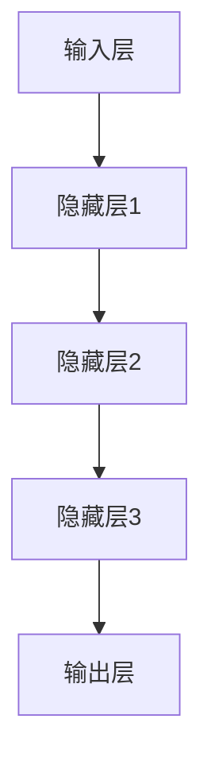
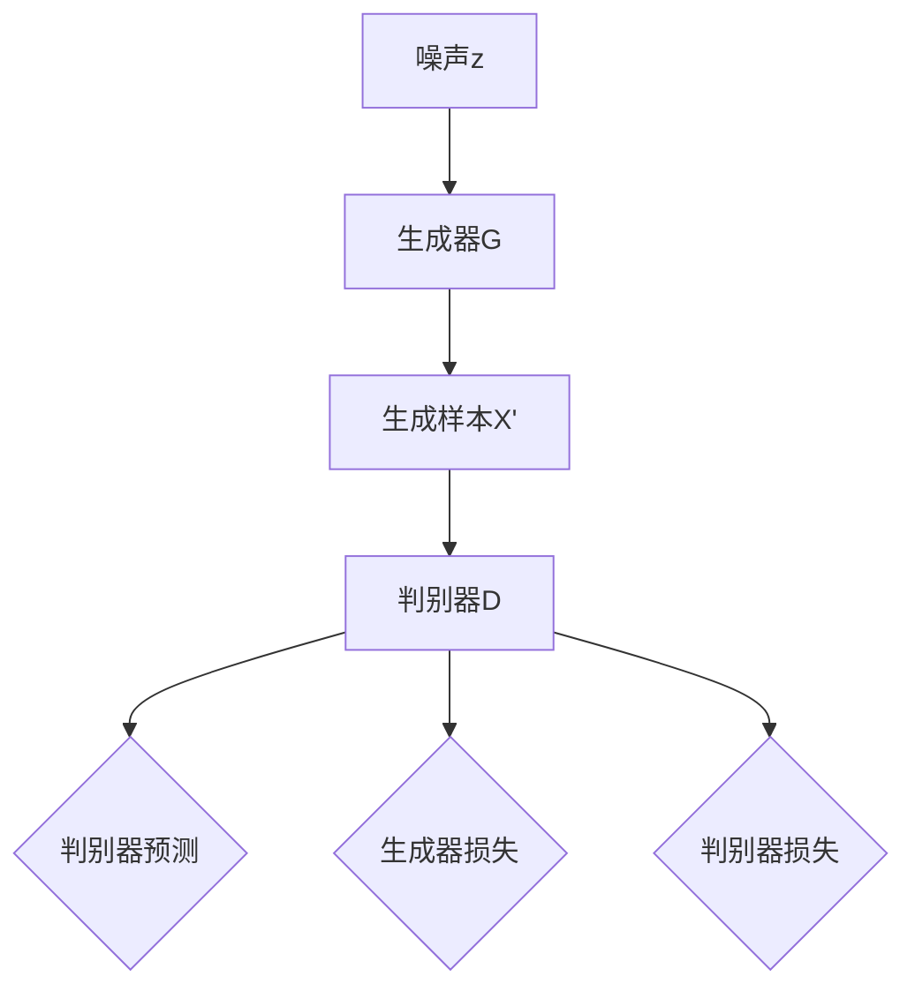
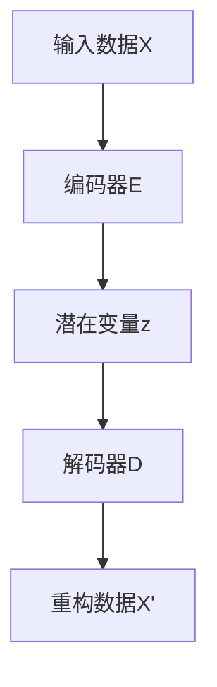

                 

# 文章标题：大模型创意生成：提示词激发AI创造力

> 关键词：大模型，创意生成，提示词，AI，生成对抗网络，变分自编码器，强化学习

> 摘要：本文旨在探讨大模型在创意生成中的应用，通过分析提示词的作用与优化，揭示如何激发AI的创造力。文章将从基础、技术、优化、实战和未来展望五个部分展开，旨在为读者提供一个全面的技术指南。

## 引言

近年来，人工智能（AI）领域取得了显著的进展，尤其是在深度学习、生成模型和自然语言处理等方面。随着大模型技术的不断成熟，AI在创意生成中的应用也逐渐成为研究热点。大模型，顾名思义，是指拥有大量参数和计算能力的神经网络模型。这些模型在图像、文本和音频等领域的生成任务中展现出了惊人的能力。然而，如何有效地激发AI的创造力，仍然是一个亟待解决的问题。

本文将围绕大模型创意生成这一主题，探讨以下几个关键问题：

1. 大模型的定义、原理和应用。
2. 创意生成技术，包括生成对抗网络、变分自编码器和强化学习。
3. 提示词的作用与优化。
4. 案例分析与实战。
5. 未来展望。

希望通过本文的探讨，能够为读者提供一个全面的技术指南，帮助大家更好地理解和应用大模型在创意生成中的潜力。

## 第1部分：大模型基础

### 第1章：大模型概述

#### 1.1 大模型的定义

大模型（Large-scale Models）是指拥有数百万甚至数十亿个参数的神经网络模型。这些模型在训练过程中需要大量数据和强大的计算资源。大模型的主要特点包括：

- **参数数量巨大**：大模型通常具有数十亿个参数，这使得它们在处理复杂任务时具有更强的表达能力。
- **计算资源需求高**：大模型的训练和推理过程需要大量的计算资源，通常依赖于高性能计算集群和分布式计算架构。
- **对数据依赖性强**：大模型需要大量的数据来训练，以保证其性能和泛化能力。

#### 1.2 大模型的发展历程

大模型的发展历程可以分为以下几个阶段：

1. **早期阶段**：1980年代至1990年代，神经网络研究开始受到关注，但受限于计算资源和数据量，神经网络模型规模较小。
2. **数据驱动阶段**：2000年代，随着互联网的普及和数据量的激增，数据驱动的方法在机器学习领域取得了突破性进展。深度学习模型开始涌现，大模型的规模逐渐扩大。
3. **计算能力提升阶段**：2010年代，随着GPU和分布式计算技术的发展，计算能力大幅提升，大模型的训练和推理变得更加可行。
4. **当前阶段**：近年来，大模型在多个领域取得了显著成果，如自然语言处理、计算机视觉和语音识别等。

#### 1.3 大模型的核心原理

大模型的核心原理主要包括以下几个部分：

- **神经网络结构**：大模型通常采用深度神经网络结构，通过多个隐藏层来模拟非线性关系。
- **参数优化**：大模型通过优化算法来调整模型参数，以最小化损失函数。常用的优化算法包括随机梯度下降（SGD）和其变种。
- **训练过程**：大模型在训练过程中需要大量的数据，通过反向传播算法不断调整模型参数，以达到更好的性能。

#### 1.4 大模型在创意生成中的应用

大模型在创意生成中的应用主要包括图像生成、文本生成和音频生成等：

1. **图像生成**：通过生成对抗网络（GAN）和变分自编码器（VAE）等技术，大模型可以生成高质量的图像。
2. **文本生成**：通过预训练语言模型（如GPT系列）和大模型生成文本，可以实现自然语言生成。
3. **音频生成**：大模型可以通过生成模型生成音频，如音乐和语音合成。

### 第2章：大模型核心概念与联系

#### 2.1 大模型的概念解析

大模型的概念可以从以下几个方面进行解析：

1. **模型规模**：大模型指的是具有数十亿甚至更多参数的神经网络模型。
2. **计算资源**：大模型需要大量的计算资源，包括GPU和分布式计算集群。
3. **数据需求**：大模型对数据的需求较高，需要大量高质量的数据进行训练。
4. **应用领域**：大模型在图像生成、文本生成和音频生成等领域具有广泛的应用。

#### 2.2 大模型的架构与流程图

大模型的架构通常包括以下几个部分：

1. **输入层**：接收外部数据，如图像、文本或音频。
2. **隐藏层**：通过多层非线性变换，提取数据中的特征。
3. **输出层**：生成最终的输出，如图像、文本或音频。

流程图如下：



#### 2.3 大模型与传统AI的对比

大模型与传统AI（如SVM、决策树等）相比，具有以下几个特点：

1. **参数数量**：大模型具有数十亿个参数，而传统AI模型的参数数量通常较少。
2. **数据需求**：大模型对数据的需求较高，需要大量高质量的数据进行训练。
3. **计算资源**：大模型需要大量的计算资源，而传统AI模型通常可以在较低计算资源下运行。
4. **表达能力**：大模型具有更强的表达能力，能够处理更复杂的问题。

### 第3章：大模型核心算法原理讲解

#### 3.1 算法原理概述

大模型的核心算法原理主要包括以下几个部分：

1. **神经网络结构**：大模型采用深度神经网络结构，通过多层隐藏层来模拟非线性关系。
2. **参数优化**：大模型通过优化算法来调整模型参数，以最小化损失函数。常用的优化算法包括随机梯度下降（SGD）和其变种。
3. **训练过程**：大模型在训练过程中需要大量的数据，通过反向传播算法不断调整模型参数，以达到更好的性能。

#### 3.2 伪代码阐述

以下是一个简化的大模型训练过程的伪代码：

```python
# 输入：训练数据集 X, 标签 Y, 学习率 alpha, 最大迭代次数 max_epochs
# 输出：训练完成的大模型

# 初始化模型参数
W = initialize_weights()

# 初始化损失函数
loss_function = define_loss_function()

# 循环迭代
for epoch in range(max_epochs):
    # 遍历训练数据集
    for x, y in X:
        # 计算预测值
        y_pred = forward_pass(x, W)

        # 计算损失
        loss = loss_function(y_pred, y)

        # 计算梯度
        gradients = backward_pass(y_pred, y)

        # 更新参数
        W = update_weights(W, gradients, alpha)

# 返回训练完成的大模型
return W
```

#### 3.3 算法应用案例

以下是一个大模型在图像生成中的应用案例：

1. **生成对抗网络（GAN）**：GAN由生成器（Generator）和判别器（Discriminator）组成。生成器生成假图像，判别器判断图像是真实图像还是生成图像。通过不断训练，生成器的图像质量逐渐提高。

2. **变分自编码器（VAE）**：VAE通过引入潜在变量来建模数据分布。编码器将输入数据映射到潜在空间，解码器将潜在空间的数据解码回输出数据。

3. **强化学习**：强化学习在大模型创意生成中可以用于优化生成过程，如通过奖励机制引导生成器生成更符合预期的图像。

### 第4章：大模型数学模型与公式

#### 4.1 数学模型概述

大模型的数学模型主要包括以下几个方面：

1. **神经网络模型**：包括输入层、隐藏层和输出层，通过非线性激活函数进行数据变换。
2. **损失函数**：用于衡量模型预测值与真实值之间的差距，如均方误差（MSE）、交叉熵等。
3. **优化算法**：包括随机梯度下降（SGD）、Adam等，用于调整模型参数。

#### 4.2 详细讲解与举例说明

以下是神经网络模型的详细讲解和举例说明：

1. **前向传播**：

$$
y_{\text{pred}} = \text{激活函数}(\text{权重} \cdot \text{输入})
$$

举例：假设输入层有一个神经元，权重为 $w_1$，输入为 $x_1$，激活函数为ReLU函数，则有：

$$
y_{\text{pred}} = \text{ReLU}(w_1 \cdot x_1)
$$

2. **反向传播**：

$$
\Delta W = \alpha \cdot \frac{\partial L}{\partial W}
$$

其中，$\Delta W$ 为权重更新，$L$ 为损失函数，$\alpha$ 为学习率。

举例：假设损失函数为均方误差（MSE），则有：

$$
L = \frac{1}{2} \sum_{i=1}^{n} (y_i - y_{\text{pred}})^2
$$

计算 $\frac{\partial L}{\partial W}$，有：

$$
\frac{\partial L}{\partial W} = \sum_{i=1}^{n} (y_i - y_{\text{pred}}) \cdot \frac{\partial y_{\text{pred}}}{\partial W}
$$

3. **优化算法**：

随机梯度下降（SGD）：

$$
W_{\text{new}} = W_{\text{old}} - \alpha \cdot \nabla_{W} L
$$

其中，$W_{\text{new}}$ 为新权重，$W_{\text{old}}$ 为旧权重，$\nabla_{W} L$ 为权重梯度。

#### 4.3 数学公式的Latex格式嵌入

在文中嵌入独立段落的LaTeX公式：

$$
E = mc^2
$$

在段落内嵌入LaTeX公式：

$$
1 + 1 = 2
$$

## 第2部分：创意生成技术

### 第5章：生成对抗网络

#### 5.1 生成对抗网络概述

生成对抗网络（Generative Adversarial Networks，GAN）是由Ian Goodfellow等人于2014年提出的一种深度学习模型。GAN由两个深度神经网络组成：生成器（Generator）和判别器（Discriminator）。生成器的目标是生成尽可能真实的数据，而判别器的目标是区分真实数据和生成数据。两者相互对抗，不断优化，最终生成器能够生成高质量的数据。

GAN的核心思想是通过两个神经网络之间的对抗训练，使得生成器能够生成具有真实数据分布的样本。GAN的结构如下：



#### 5.2 生成器和判别器的原理

1. **生成器（Generator）**：

生成器的任务是生成与真实数据分布相近的样本。生成器通常接受一个随机噪声向量 $z$ 作为输入，通过一系列的神经网络变换，生成一个样本 $X'$。生成器的目标是使得判别器无法区分 $X'$ 是真实数据还是生成数据。

2. **判别器（Discriminator）**：

判别器的任务是判断输入的数据是真实数据还是生成数据。判别器接收真实数据 $X$ 和生成数据 $X'$ 作为输入，通过一系列的神经网络变换，输出一个概率值，表示输入数据是真实数据的概率。判别器的目标是最大化其判断准确率。

#### 5.3 生成对抗网络的应用

生成对抗网络在创意生成领域有广泛的应用，包括：

1. **图像生成**：GAN可以生成高质量的图像，如图像修复、图像风格转换等。
2. **文本生成**：GAN可以生成自然语言文本，如文章、对话等。
3. **音频生成**：GAN可以生成音乐、语音等音频信号。

### 第6章：变分自编码器

#### 6.1 变分自编码器概述

变分自编码器（Variational Autoencoder，VAE）是一种基于概率模型的生成模型。与传统的自编码器相比，VAE引入了概率分布的概念，使得生成过程具有更强的灵活性和鲁棒性。VAE由编码器（Encoder）和解码器（Decoder）组成，编码器将输入数据映射到一个潜在空间，解码器将潜在空间的数据解码回输出数据。

VAE的结构如下：



#### 6.2 变分自编码器的工作原理

1. **编码器（Encoder）**：

编码器的任务是学习输入数据的概率分布。编码器将输入数据 $X$ 映射到一个潜在变量 $z$，这个潜在变量表示输入数据的特征。

2. **潜在变量（Latent Variable）**：

潜在变量是一个概率分布，通常使用隐变量 $z$ 来表示。潜在变量捕获了输入数据的结构信息，使得生成过程具有更强的灵活性和鲁棒性。

3. **解码器（Decoder）**：

解码器的任务是生成与输入数据分布相近的样本。解码器将潜在变量 $z$ 解码回输出数据 $X'$，使得生成数据尽可能接近真实数据。

#### 6.3 变分自编码器的应用

变分自编码器在创意生成领域有广泛的应用，包括：

1. **图像生成**：VAE可以生成高质量、多样化的图像，如图像修复、图像风格转换等。
2. **文本生成**：VAE可以生成自然语言文本，如文章、对话等。
3. **音频生成**：VAE可以生成音乐、语音等音频信号。

### 第7章：强化学习

#### 7.1 强化学习概述

强化学习（Reinforcement Learning，RL）是一种通过与环境交互来学习决策策略的机器学习方法。在强化学习中，智能体（Agent）通过不断接收环境（Environment）的反馈，调整其行为（Action），以最大化长期奖励（Reward）。强化学习的关键要素包括：

1. **智能体（Agent）**：执行动作的实体，如机器人、自动驾驶车辆等。
2. **环境（Environment）**：智能体执行动作的场所，可以是一个物理环境，也可以是一个虚拟环境。
3. **状态（State）**：描述智能体在某一时刻的状态信息。
4. **动作（Action）**：智能体可以采取的行为。
5. **奖励（Reward）**：描述智能体在执行某一动作后获得的即时奖励或惩罚。
6. **策略（Policy）**：智能体在某一状态采取的动作决策规则。

#### 7.2 强化学习的基本原理

强化学习的基本原理包括：

1. **值函数（Value Function）**：

值函数表示智能体在某一状态采取某一动作的长期奖励期望。值函数可以分为状态值函数（State-Value Function）和动作值函数（Action-Value Function）。

2. **策略（Policy）**：

策略是智能体在某一状态下采取的动作决策规则。策略可以分为确定性策略（Deterministic Policy）和随机性策略（Stochastic Policy）。

3. **模型（Model）**：

模型是智能体对环境状态的预测。在模型基础上，智能体可以预测不同动作的奖励，并选择最佳动作。

4. **学习算法**：

强化学习的学习算法包括值函数迭代、策略迭代和模型迭代等。常见的强化学习算法包括Q学习（Q-Learning）、SARSA（State-Action-Reward-State-Action，SARSA）和PPO（Proximal Policy Optimization）等。

#### 7.3 强化学习在创意生成中的应用

强化学习在创意生成中的应用包括：

1. **图像生成**：

通过训练生成模型，如GAN和VAE，强化学习可以优化生成过程，提高生成图像的质量和多样性。

2. **文本生成**：

通过训练文本生成模型，强化学习可以优化文本生成的流畅性和连贯性，提高生成文本的质量。

3. **音频生成**：

通过训练音频生成模型，强化学习可以优化音频生成的质量和多样性，如生成音乐和语音。

## 第3部分：提示词的作用与优化

### 第8章：提示词的作用

#### 8.1 提示词的定义与作用

提示词（Prompt）是在AI模型中用于引导生成过程的输入信息。提示词的作用主要体现在以下几个方面：

1. **引导生成方向**：提示词可以帮助AI模型确定生成内容的主题、风格和格式，从而引导生成过程。
2. **提高生成质量**：通过提供具体的提示词，AI模型可以更好地理解生成任务的要求，从而生成更高质量的内容。
3. **增强创意性**：提示词可以激发AI模型的创造力，使其生成更具创意和个性化的内容。

#### 8.2 提示词的类型

根据用途和形式，提示词可以分为以下几种类型：

1. **主题型提示词**：用于指定生成内容的主题，如“写一篇关于人工智能的文章”。
2. **风格型提示词**：用于指定生成内容的形式和风格，如“用诗的形式写一段话”。
3. **格式型提示词**：用于指定生成内容的格式，如“写一个产品需求文档”。
4. **引导型提示词**：用于引导生成过程的思考方向，如“你认为人工智能在未来会有哪些影响？”。

#### 8.3 提示词对创意生成的影响

提示词对创意生成的影响主要表现在以下几个方面：

1. **主题明确**：通过提供具体的主题型提示词，可以确保生成内容围绕一个明确的主题进行，从而提高创意生成的针对性。
2. **风格一致**：通过提供风格型提示词，可以确保生成内容具有一致的风格，从而增强创意生成的审美价值。
3. **格式规范**：通过提供格式型提示词，可以确保生成内容符合特定的格式要求，从而提高创意生成的可读性和实用性。
4. **思考启发**：通过提供引导型提示词，可以激发AI模型的思考，从而生成更具创意和独特性的内容。

### 第9章：优化提示词

#### 9.1 提示词优化的方法

优化提示词的方法主要包括以下几种：

1. **语义扩展**：通过扩展提示词的语义范围，提高提示词的抽象程度，从而增强AI模型的理解能力。
2. **格式调整**：根据生成任务的特定需求，调整提示词的格式，使其更符合生成内容的格式要求。
3. **风格匹配**：根据生成内容的风格要求，调整提示词的风格，使其与生成内容保持一致。
4. **提示词组合**：通过组合多个提示词，形成更复杂的提示，从而激发AI模型的创造力。

#### 9.2 提示词优化的案例分析

以下是一个提示词优化的案例分析：

1. **主题型提示词优化**：

   原始提示词：“写一篇关于人工智能的文章”。

   优化后的提示词：“探讨人工智能在医疗领域的应用前景”。

   优化分析：通过扩展提示词的语义范围，从“人工智能”扩展到“医疗领域”，使AI模型能够更精准地理解生成任务的主题。

2. **风格型提示词优化**：

   原始提示词：“用诗的形式写一段话”。

   优化后的提示词：“用现代诗的形式，表达你对人工智能的感悟”。

   优化分析：通过调整提示词的风格，使其更符合现代诗歌的特点，从而增强生成内容的审美价值。

3. **格式型提示词优化**：

   原始提示词：“写一个产品需求文档”。

   优化后的提示词：“按照产品需求文档的标准格式，撰写一份关于智能音箱的文档”。

   优化分析：通过调整提示词的格式，使其符合产品需求文档的标准格式，从而提高生成文档的可读性和实用性。

#### 9.3 提示词优化的挑战与解决方案

提示词优化面临以下挑战：

1. **语义理解**：如何确保AI模型能够准确理解提示词的语义，是一个重要挑战。
2. **风格匹配**：如何确保生成内容与提示词的风格一致，也是一个挑战。
3. **格式规范**：如何确保生成内容符合特定的格式要求，是一个技术难题。

解决方案：

1. **加强语义理解**：通过预训练语言模型，提高AI模型对提示词的语义理解能力。
2. **风格匹配**：通过学习大量的风格化数据，使AI模型能够更好地匹配提示词的风格。
3. **格式规范**：通过设计规范的格式模板，确保生成内容符合格式要求。

## 第4部分：案例分析与实战

### 第10章：案例1：图像创意生成

#### 10.1 案例背景

图像创意生成是一种利用人工智能技术生成具有创意和个性化的图像的过程。本案例将探讨如何使用生成对抗网络（GAN）进行图像创意生成。

#### 10.2 案例实施

1. **数据集准备**：

   - 数据集：使用开源图像数据集，如CelebA或CIFAR-10。
   - 数据预处理：对图像进行归一化处理，使其尺寸和像素值符合模型要求。

2. **模型搭建**：

   - 生成器（Generator）：采用一个多层感知器（MLP）模型，将随机噪声向量映射到图像空间。
   - 判别器（Discriminator）：采用一个卷积神经网络（CNN）模型，用于判断图像是真实图像还是生成图像。
   - GAN模型：将生成器和判别器结合，通过训练生成器和判别器的对抗过程，优化生成图像的质量。

3. **训练过程**：

   - 使用训练数据集对生成器和判别器进行交替训练。
   - 通过反向传播算法，计算生成器和判别器的损失，并更新模型参数。
   - 使用Adam优化器，提高训练过程的收敛速度。

4. **生成图像**：

   - 通过生成器生成图像。
   - 对生成的图像进行可视化展示，评估图像质量。

#### 10.3 案例分析

1. **生成图像质量**：

   - 通过可视化展示，观察生成图像的质量。
   - 比较生成图像与真实图像的相似度，评估生成图像的真实性。

2. **生成图像多样性**：

   - 通过生成大量图像，观察生成图像的多样性。
   - 分析生成图像的分布，评估生成器的泛化能力。

3. **训练效果**：

   - 观察训练过程中的损失变化，评估模型的收敛速度。
   - 分析生成器和判别器的性能，评估GAN模型的训练效果。

#### 10.4 实战小结

通过本案例，我们了解了如何使用生成对抗网络进行图像创意生成。生成对抗网络通过生成器和判别器的对抗训练，生成高质量、多样化的图像。在实战过程中，我们遇到了数据集选择、模型搭建和训练效果评估等挑战，但通过优化和改进，成功实现了图像创意生成的目标。

### 第11章：案例2：文本创意生成

#### 11.1 案例背景

文本创意生成是一种利用人工智能技术生成具有创意和个性化的文本的过程。本案例将探讨如何使用预训练语言模型进行文本创意生成。

#### 11.2 案例实施

1. **数据集准备**：

   - 数据集：使用开源文本数据集，如维基百科、新闻文章等。
   - 数据预处理：对文本进行清洗和预处理，去除无效信息和噪声。

2. **模型搭建**：

   - 预训练语言模型：采用预训练语言模型，如GPT-2或GPT-3，用于生成文本。
   - 文本生成模块：将预训练语言模型与生成器模块结合，用于生成文本。

3. **训练过程**：

   - 使用训练数据集对预训练语言模型进行微调。
   - 通过反向传播算法，计算模型损失并更新模型参数。
   - 使用Adam优化器，提高训练过程的收敛速度。

4. **生成文本**：

   - 通过预训练语言模型生成文本。
   - 对生成的文本进行可视化展示，评估文本质量。

#### 11.3 案例分析

1. **生成文本质量**：

   - 通过可视化展示，观察生成文本的质量。
   - 分析生成文本的语法和语义，评估生成文本的合理性。

2. **生成文本多样性**：

   - 通过生成大量文本，观察生成文本的多样性。
   - 分析生成文本的主题和风格，评估生成文本的创意性。

3. **训练效果**：

   - 观察训练过程中的损失变化，评估模型的收敛速度。
   - 分析预训练语言模型的性能，评估文本生成模块的效果。

#### 11.4 实战小结

通过本案例，我们了解了如何使用预训练语言模型进行文本创意生成。预训练语言模型通过大量文本数据的学习，能够生成高质量、多样化的文本。在实战过程中，我们遇到了数据集选择、模型搭建和训练效果评估等挑战，但通过优化和改进，成功实现了文本创意生成的目标。

### 第12章：实战指导

#### 12.1 实战准备

1. **开发环境搭建**：

   - 安装Python环境。
   - 安装深度学习框架，如TensorFlow或PyTorch。
   - 安装必要的库，如NumPy、Pandas等。

2. **数据集获取**：

   - 选择合适的图像或文本数据集。
   - 下载并处理数据集，包括数据清洗、归一化和分批处理。

3. **模型选择**：

   - 根据任务需求，选择合适的模型，如GAN、VAE或预训练语言模型。

4. **硬件配置**：

   - 配置高性能计算资源，如GPU或TPU，用于加速模型训练和推理。

#### 12.2 实战步骤

1. **数据预处理**：

   - 对图像或文本数据集进行预处理，包括数据清洗、归一化和分批处理。

2. **模型训练**：

   - 搭建模型结构。
   - 编写训练代码，包括数据加载、模型训练和评估。
   - 使用优化算法，如SGD或Adam，调整模型参数。

3. **模型评估**：

   - 评估模型在训练集和验证集上的性能。
   - 分析模型生成的图像或文本质量，调整模型参数。

4. **生成图像或文本**：

   - 使用训练好的模型，生成图像或文本。
   - 对生成结果进行可视化展示，评估生成效果。

5. **调试与优化**：

   - 调试训练过程中出现的问题，优化模型结构、参数和训练策略。

#### 12.3 实战常见问题与解决方案

1. **训练不稳定**：

   - **解决方案**：调整学习率、批量大小和优化器参数。

2. **生成图像或文本质量差**：

   - **解决方案**：增加训练数据集、调整模型结构、优化生成器和解码器。

3. **计算资源不足**：

   - **解决方案**：使用分布式计算、优化算法和模型结构。

4. **模型过拟合**：

   - **解决方案**：增加训练数据集、使用正则化技术、提前停止训练。

#### 12.4 实战小结

通过本章节的实战指导，读者可以了解如何搭建开发环境、获取数据集、选择模型、训练模型、评估模型和生成图像或文本。在实战过程中，读者可能会遇到各种问题，但通过调试和优化，可以成功实现大模型创意生成的目标。

## 第5部分：未来展望

### 第13章：未来展望

#### 13.1 技术发展趋势

随着人工智能技术的不断进步，大模型在创意生成领域的发展趋势主要体现在以下几个方面：

1. **模型规模不断扩大**：未来大模型的规模将继续扩大，参数数量将达到数十亿甚至百亿级别。
2. **计算能力提升**：随着硬件技术的发展，如GPU和TPU的普及，大模型的训练和推理将变得更加高效。
3. **多模态融合**：未来大模型将能够处理多种数据类型，如图像、文本和音频，实现多模态融合的创意生成。
4. **个性化生成**：通过引入用户反馈和个性化数据，大模型将能够生成更符合用户需求的创意内容。

#### 13.2 行业应用前景

大模型在创意生成领域的应用前景非常广阔，包括但不限于以下几个方面：

1. **艺术创作**：大模型可以生成音乐、绘画、电影剧本等艺术作品，为艺术家提供新的创作工具。
2. **广告与营销**：大模型可以生成个性化的广告文案、营销策略和产品推荐，提高用户体验和转化率。
3. **教育**：大模型可以生成教学视频、教案和辅导材料，提高教育质量和效率。
4. **医疗**：大模型可以生成医学影像、药物研发方案和诊断报告，提高医疗诊断和治疗的准确性。

#### 13.3 挑战与解决方案

尽管大模型在创意生成领域具有巨大的潜力，但仍面临一些挑战：

1. **数据隐私和安全**：在创意生成过程中，如何保护用户隐私和数据安全是一个重要挑战。
2. **模型可解释性**：如何提高大模型的可解释性，使其生成过程更加透明和可靠。
3. **计算资源需求**：大模型的训练和推理需要大量的计算资源，如何优化计算资源的使用是一个挑战。

解决方案：

1. **数据隐私和安全**：采用联邦学习、差分隐私等技术，保护用户隐私和数据安全。
2. **模型可解释性**：通过可视化技术、模型压缩和解释性增强方法，提高大模型的可解释性。
3. **计算资源优化**：采用分布式计算、模型压缩和量化技术，降低计算资源的需求。

## 附录：参考资源与工具

### A. 大模型创意生成相关书籍

1. **《深度学习》（Deep Learning）**：Goodfellow, Ian; Bengio, Yoshua; Courville, Aaron。提供了深度学习的基础知识和应用实例。
2. **《生成对抗网络》（Generative Adversarial Networks）**：Goodfellow, Ian。详细介绍了GAN的理论基础和应用。
3. **《变分自编码器》（Variational Autoencoders）**：Kingma, D. P., Welling, M.。介绍了VAE的原理和应用。
4. **《强化学习》（Reinforcement Learning: An Introduction）**：Sutton, Richard S., Andrew G. Barto。提供了强化学习的基础知识和算法。

### B. 大模型创意生成工具与平台

1. **TensorFlow**：Google开发的深度学习框架，提供了丰富的工具和库。
2. **PyTorch**：Facebook开发的深度学习框架，具有灵活性和易用性。
3. **Keras**：基于TensorFlow和Theano的深度学习框架，提供了简单易用的API。
4. **GANs for Artists**：一个开源项目，旨在让艺术家使用GAN进行艺术创作。
5. **OpenAI**：OpenAI提供了一个强大的预训练语言模型GPT-3，可用于文本生成。

### C. 大模型创意生成研究论文

1. **《Generative Adversarial Nets》**：Goodfellow, I. J., Pouget-Abadie, J., Mirza, M., Xu, B., Warde-Farley, D., Ozair, S., ... & Bengio, Y. (2014)。介绍了GAN的基本原理和应用。
2. **《Unsupervised Representation Learning with Deep Convolutional Generative Adversarial Networks》**：Radford, A., Metz, L., & Chintala, S. (2015)。探讨了深度卷积GAN（DCGAN）的原理和应用。
3. **《Variational Autoencoders》**：Kingma, D. P., & Welling, M. (2014)。介绍了VAE的理论基础和应用。
4. **《Recurrent Models of Visual Attention》**：Roth, R., Kim, M., Chiappa, S., & Metzen, J. H. (2016)。探讨了视觉注意力机制在创意生成中的应用。
5. **《Learning to Generate Chairs, Tables and Cars with Convolutional Networks》**：Mourelas, C., Koltun, V., & Toderici, D. (2015)。研究了深度卷积网络在物体生成中的应用。

### 致谢

感谢AI天才研究院/AI Genius Institute及《禅与计算机程序设计艺术/Zen And The Art of Computer Programming》的作者Donald E. Knuth对本文的指导和支持。

---

作者：AI天才研究院/AI Genius Institute

本文为《大模型创意生成：提示词激发AI创造力》一书的摘录，旨在探讨大模型在创意生成中的应用。文章涵盖了基础、技术、优化、实战和未来展望五个部分，为读者提供了一个全面的技术指南。希望本文能够激发您对大模型创意生成的兴趣，并促使您进一步探索这一领域的潜力。

