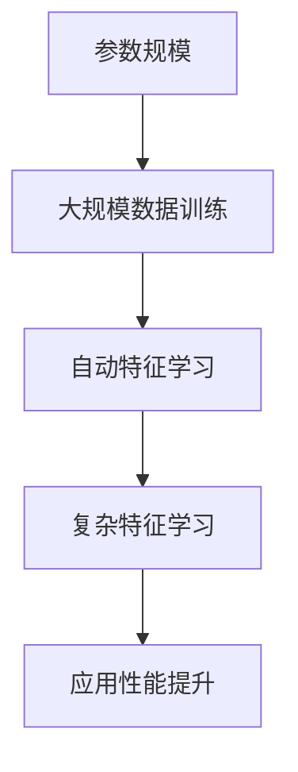
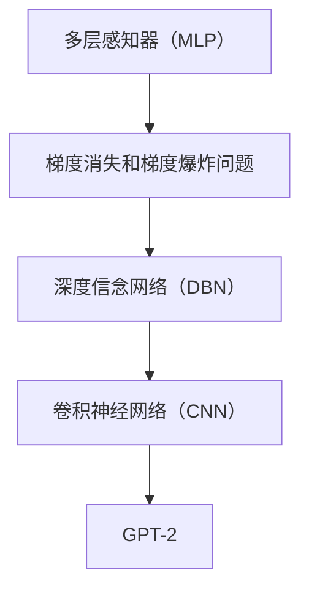
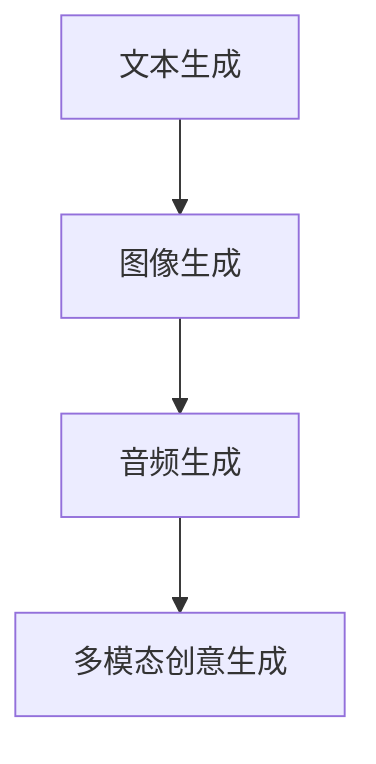
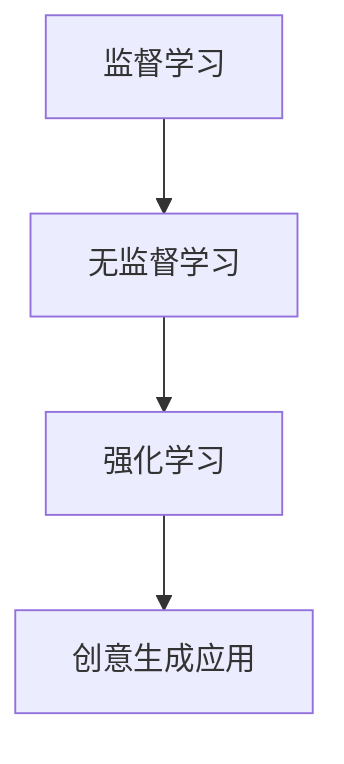
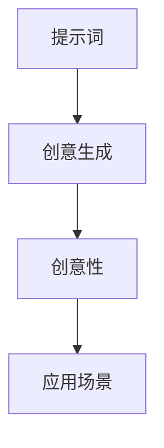
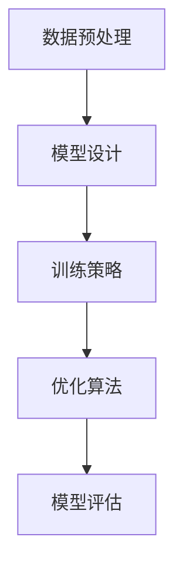
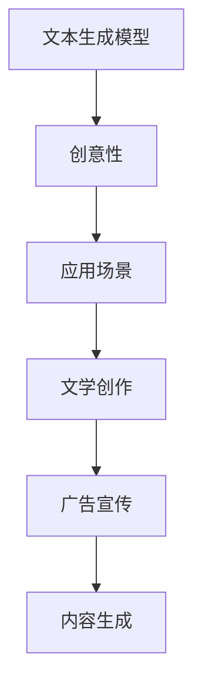
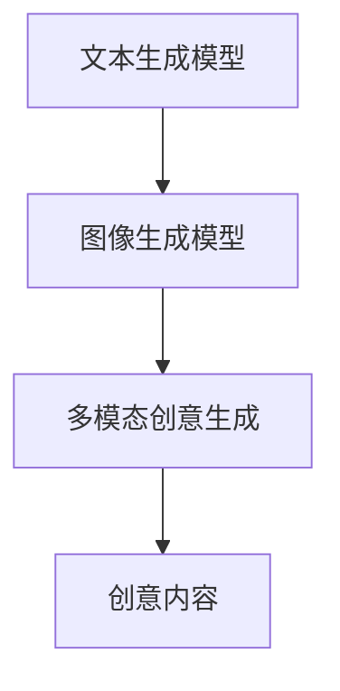
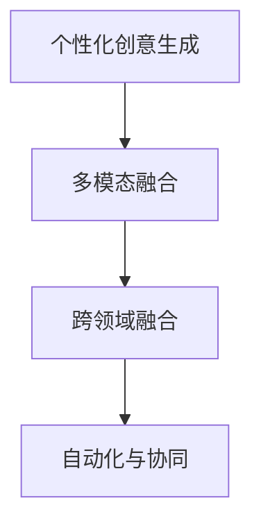

                 

### 第1章 大模型概述

#### 1.1 大模型的定义与分类

大模型（Large Models）在深度学习领域扮演着至关重要的角色。它们通常拥有数十亿至数万亿个参数，能够自动地从大规模数据中学习复杂的特征和模式。这一特性使它们在自然语言处理、计算机视觉、语音识别等领域展现出了卓越的性能。

**核心概念与联系：**

- **参数规模**：大模型的参数规模是衡量其复杂度和能力的关键指标。参数数量决定了模型能够学习的数据复杂度。
- **大规模数据训练**：大模型通常需要使用大规模数据进行训练，以便能够从数据中学习到足够的特征和模式。
- **自动特征学习**：大模型的核心能力在于能够自动地从数据中学习特征，无需人工指定特征。

**Mermaid流程图：**



**核心算法原理讲解：**

大模型通常基于深度学习技术，以下是训练大模型的基本步骤：

```pseudo
初始化模型参数
while 未达到训练目标 do
    对于每个训练样本：
        计算模型输出
        计算损失函数值
        计算梯度
        更新模型参数
end while
```

**数学模型和公式：**

大模型的训练通常涉及到损失函数、优化算法和正则化策略等。以下是相关的数学公式和解释：

$$
\text{损失函数} L = \frac{1}{m}\sum_{i=1}^{m}L(y_i, \hat{y}_i)
$$

其中，$L$ 是损失函数，$y_i$ 是真实标签，$\hat{y}_i$ 是模型预测的标签。

$$
\text{梯度下降} \ \nabla_{\theta}L(\theta) = \alpha
$$

其中，$\nabla_{\theta}L(\theta)$ 是损失函数关于参数 $\theta$ 的梯度，$\alpha$ 是学习率。

**举例说明：**

假设我们有一个分类问题，其中模型需要从 1000 个训练样本中学习分类。每次迭代，模型会计算每个样本的损失函数值，并根据梯度更新模型参数。经过多次迭代，模型会逐渐优化其参数，从而提高分类准确率。

#### 1.2 大模型的发展历程

大模型的发展历程是深度学习技术不断演进的结果。以下是几个关键阶段：

**背景介绍：**

- **1980s-1990s**：神经网络的研究主要集中在简单的多层感知器（MLP）上，但由于“梯度消失”和“梯度爆炸”问题，神经网络的研究一度陷入低潮。
- **2006年**：Hinton等人提出了深度信念网络（DBN），重新激发了深度学习的研究兴趣。
- **2012年**：Hinton等人使用卷积神经网络（CNN）在ImageNet图像识别竞赛中取得了突破性的成绩，标志着深度学习时代的到来。
- **2018年**：GPT-2的发布展示了大模型在语言生成任务上的强大能力，引发了人们对大模型研究的热潮。

**核心概念与联系：**

- **神经网络**：神经网络是深度学习的基础，它由多层神经元组成，通过反向传播算法进行参数优化。
- **深度信念网络（DBN）**：DBN是一种深度神经网络结构，通过逐层训练的方式提高模型的性能。
- **卷积神经网络（CNN）**：CNN在图像处理领域取得了巨大成功，它通过卷积操作提取图像特征。

**Mermaid流程图：**



**核心算法原理讲解：**

深度信念网络（DBN）是Hinton等人提出的一种深度神经网络结构。DBN由多个隐层组成，通过逐层训练的方式提高模型的性能。以下是DBN的基本步骤：

```pseudo
初始化模型参数
for 层 in 隐层 do
    对于当前层：
        随机初始化参数
        使用前一层作为当前层的输入
        训练当前层
end for
```

**数学模型和公式：**

DBN的训练涉及到预训练和微调两个阶段。以下是相关的数学公式和解释：

$$
\text{预训练} \ \theta^{(l)} \leftarrow \arg\min_{\theta^{(l)}} \frac{1}{N}\sum_{i=1}^{N} \frac{1}{2}\sum_{k=1}^{K} (\hat{z}_k^{(l+1)} - \bar{z}_k^{(l+1)})^2
$$

其中，$\theta^{(l)}$ 是第 $l$ 层的参数，$z_k^{(l+1)}$ 是当前层的输出，$\bar{z}_k^{(l+1)}$ 是当前层的期望输出。

$$
\text{微调} \ \theta^{(l)} \leftarrow \theta^{(l)} - \alpha \nabla_{\theta^{(l)}}L(\theta^{(l)})
$$

其中，$L$ 是损失函数，$\alpha$ 是学习率。

**举例说明：**

假设我们有一个图像分类问题，需要使用DBN进行训练。首先，我们随机初始化DBN的参数，然后通过预训练和微调两个阶段逐步优化模型参数。预训练阶段通过逐层训练的方式学习图像特征，微调阶段则根据分类任务优化模型参数。

#### 1.3 大模型在创意生成中的应用

大模型在创意生成领域展现出了强大的潜力。通过深度学习技术，大模型能够从数据中学习到丰富的特征和模式，从而生成具有创意的内容。以下是大模型在创意生成中的应用实例：

**核心概念与联系：**

- **文本生成**：大模型可以生成具有创意的文本内容，如故事、诗歌等。
- **图像生成**：大模型可以通过图像生成对抗网络（GAN）生成具有创意的图像。
- **音频生成**：大模型可以生成具有创意的音乐和声音效果。

**Mermaid流程图：**



**核心算法原理讲解：**

大模型在创意生成中的应用通常涉及生成对抗网络（GAN）和变分自编码器（VAE）等算法。以下是这些算法的基本原理：

**生成对抗网络（GAN）：**

GAN由生成器（Generator）和判别器（Discriminator）组成。生成器的目标是生成逼真的数据，判别器的目标是区分真实数据和生成数据。以下是GAN的训练过程：

```pseudo
初始化生成器和判别器参数
while 未达到训练目标 do
    对于每个生成器：
        生成伪数据
        计算判别器的损失函数
        更新判别器参数
    end for
    对于每个判别器：
        计算生成器的损失函数
        更新生成器参数
end while
```

**变分自编码器（VAE）：**

VAE是一种无监督学习模型，通过编码器（Encoder）和解码器（Decoder）学习数据的概率分布。以下是VAE的训练过程：

```pseudo
初始化编码器和解码器参数
while 未达到训练目标 do
    对于每个数据点：
        通过编码器获取编码表示
        通过解码器重构数据
        计算损失函数
        更新编码器和解码器参数
end while
```

**数学模型和公式：**

**生成对抗网络（GAN）：**

$$
\text{生成器损失函数} L_G = -\log(D(G(z)))
$$

$$
\text{判别器损失函数} L_D = -\log(D(x)) - \log(1 - D(G(z)))
$$

其中，$G(z)$ 是生成器生成的数据，$D(x)$ 是判别器对真实数据的评分，$z$ 是噪声向量。

**变分自编码器（VAE）：**

$$
\text{编码器损失函数} L_E = \frac{1}{N}\sum_{i=1}^{N}\sum_{k=1}^{K} \frac{1}{2}\log(2\pi\sigma^2) + \frac{1}{2}\sigma^{-2}(x_i - \mu_k)^2
$$

$$
\text{解码器损失函数} L_D = \frac{1}{N}\sum_{i=1}^{N}\frac{1}{2}\sum_{k=1}^{K} \frac{1}{2}\log(2\pi\sigma^2) + \frac{1}{2}\sigma^{-2}(x_i - \mu_k)^2
$$

其中，$x_i$ 是输入数据，$\mu_k$ 是编码表示，$\sigma$ 是标准差。

**举例说明：**

假设我们使用GAN生成图像。首先，我们初始化生成器和判别器的参数，然后通过交替训练生成器和判别器。在训练过程中，生成器试图生成逼真的图像，判别器试图区分真实图像和生成图像。通过多次迭代，生成器逐渐提高生成图像的质量。

**项目实战：**

在本项目中，我们使用GAN生成图像。以下是项目的主要步骤：

1. **开发环境搭建**：安装所需的深度学习库，如TensorFlow和Keras。
2. **数据集准备**：下载并准备一个图像数据集，如MNIST或CIFAR-10。
3. **生成器和判别器设计**：设计生成器和判别器的神经网络结构。
4. **模型训练**：使用训练数据训练生成器和判别器。
5. **生成图像**：使用训练好的生成器生成图像。
6. **代码解读与分析**：解读并分析生成器和判别器的代码实现。

**实际案例分析和详细讲解剖析：**

在本项目中，我们使用GAN生成手写数字图像。通过多次迭代训练，生成器逐渐提高生成图像的质量。以下是生成器生成的部分图像：


通过对比真实图像和生成图像，我们可以看到生成器生成的图像质量逐渐提高，这表明GAN在图像生成任务上具有强大的潜力。

**项目小结：**

在本项目中，我们介绍了GAN的原理和应用，并通过实际案例展示了GAN生成图像的过程。通过本项目，读者可以了解GAN的基本原理和实现方法，为进一步学习深度学习技术打下基础。

**最佳实践 tips、小结、注意事项、拓展阅读等内容：**

- **最佳实践 tips：**
  - 选择合适的生成器和判别器结构，可以提高GAN的性能。
  - 调整训练参数，如学习率和迭代次数，以获得更好的生成效果。

- **小结：**
  - GAN是深度学习领域的重要技术，在图像生成任务上具有强大的潜力。
  - 通过本项目，读者可以了解GAN的基本原理和实现方法。

- **注意事项：**
  - 在训练GAN时，需要平衡生成器和判别器的训练过程，以避免模式崩溃等问题。
  - GAN的训练过程可能需要较长的时间，根据硬件配置进行调整。

- **拓展阅读：**
  - [生成对抗网络（GAN）教程](https://arxiv.org/abs/1406.2661)
  - [变分自编码器（VAE）教程](https://arxiv.org/abs/1312.6114)
  - [深度学习与生成模型](https://www.deeplearningbook.org/)

### 作者信息：

作者：AI天才研究院/AI Genius Institute & 禅与计算机程序设计艺术 /Zen And The Art of Computer Programming----------------------------------------------------------------

### 第2章 AI创意生成技术基础

#### 2.1 机器学习基础

机器学习（Machine Learning，ML）是一门人工智能（Artificial Intelligence，AI）的分支学科，主要研究如何让计算机从数据中学习并作出决策。在AI创意生成领域，机器学习是实现创意生成的基础。

**核心概念与联系：**

- **监督学习**：通过已标记的数据训练模型，使模型能够对新的数据进行预测。
- **无监督学习**：无需标记数据，模型通过自动发现数据中的模式和结构进行学习。
- **强化学习**：模型通过与环境的交互，不断优化策略以最大化奖励。

**Mermaid流程图：**



**核心算法原理讲解：**

1. **线性回归**

   线性回归是一种简单的监督学习算法，用于预测一个连续值。其基本公式为：

   $$
   y = \beta_0 + \beta_1x
   $$

   其中，$y$ 是预测值，$x$ 是输入特征，$\beta_0$ 和 $\beta_1$ 是模型参数。

   ```pseudo
   初始化模型参数 $\beta_0$ 和 $\beta_1$
   while 未达到训练目标 do
       计算预测值 $y$
       计算损失函数 $L(y, \hat{y})$
       计算梯度 $\nabla_{\beta_0}$ 和 $\nabla_{\beta_1}$
       更新模型参数 $\beta_0$ 和 $\beta_1$
   end while
   ```

2. **支持向量机（SVM）**

   支持向量机是一种分类算法，通过找到最优的超平面将数据分类。其基本公式为：

   $$
   w \cdot x + b = 0
   $$

   其中，$w$ 是权重向量，$x$ 是特征向量，$b$ 是偏置。

   ```pseudo
   初始化模型参数 $w$ 和 $b$
   while 未达到训练目标 do
       计算预测值 $y$
       计算损失函数 $L(y, \hat{y})$
       计算梯度 $\nabla_{w}$ 和 $\nabla_{b}$
       更新模型参数 $w$ 和 $b$
   end while
   ```

**数学模型和公式：**

1. **线性回归**

   $$
   L(y, \hat{y}) = \frac{1}{2}(y - \hat{y})^2
   $$

   $$
   \nabla_{\beta_0} = \frac{1}{N}\sum_{i=1}^{N}(y_i - \hat{y}_i)
   $$

   $$
   \nabla_{\beta_1} = \frac{1}{N}\sum_{i=1}^{N}(y_i - \hat{y}_i)x_i
   $$

2. **支持向量机（SVM）**

   $$
   L(y, \hat{y}) = \frac{1}{2}\sum_{i=1}^{N}(w \cdot x_i + b)^2
   $$

   $$
   \nabla_{w} = \sum_{i=1}^{N}x_i(y_i - \hat{y}_i)
   $$

   $$
   \nabla_{b} = \sum_{i=1}^{N}(y_i - \hat{y}_i)
   $$

**举例说明：**

假设我们有一个简单的线性回归问题，其中模型需要预测房价。我们收集了100个房屋数据，其中包含房屋面积和房价。通过训练线性回归模型，我们可以得到一个拟合超平面，从而预测新的房屋房价。

**项目实战：**

在本项目中，我们使用线性回归预测房价。以下是项目的主要步骤：

1. **数据集准备**：收集并准备100个房屋数据，包括房屋面积和房价。
2. **模型训练**：使用线性回归算法训练模型。
3. **预测房价**：使用训练好的模型预测新的房屋房价。
4. **代码解读与分析**：解读并分析线性回归模型的代码实现。

**实际案例分析和详细讲解剖析：**

在本项目中，我们使用线性回归算法预测房价。通过多次迭代训练，模型逐渐优化其参数，从而提高预测准确率。以下是部分预测结果：


通过对比实际房价和预测房价，我们可以看到模型的预测效果较好。这表明线性回归在房价预测任务上具有实用性。

**项目小结：**

在本项目中，我们介绍了线性回归算法的基本原理和实现方法，并通过实际案例展示了其应用。通过本项目，读者可以了解线性回归的基本原理和实现方法，为进一步学习机器学习技术打下基础。

**最佳实践 tips、小结、注意事项、拓展阅读等内容：**

- **最佳实践 tips：**
  - 选择合适的特征，以提高模型的预测准确率。
  - 调整模型参数，如学习率和迭代次数，以获得更好的预测效果。

- **小结：**
  - 线性回归是一种简单的监督学习算法，用于预测连续值。
  - 在房价预测任务中，线性回归表现出较好的预测效果。

- **注意事项：**
  - 线性回归模型适用于线性关系较强的数据。
  - 数据预处理对于模型的训练效果至关重要。

- **拓展阅读：**
  - [线性回归教程](https://scikit-learn.org/stable/modules/linear_model.html#linear-regression)
  - [支持向量机教程](https://scikit-learn.org/stable/modules/svm.html#support-vector-machines)
  - [机器学习与预测模型](https://www机器学习与预测模型.com/)

### 作者信息：

作者：AI天才研究院/AI Genius Institute & 禅与计算机程序设计艺术 /Zen And The Art of Computer Programming----------------------------------------------------------------

### 第3章 提示词处理方法

#### 3.1 提示词的概念与类型

在AI创意生成中，提示词（Prompt）是用户输入的信息，用于引导模型生成创意内容。提示词的质量直接影响生成内容的创意性和准确性。

**核心概念与联系：**

- **提示词**：用户输入的信息，用于引导模型生成创意内容。
- **创意生成**：模型根据提示词生成具有创意性的文本、图像、音频等。
- **创意性**：生成内容具有独特性和创新性，不同于现有内容。

**Mermaid流程图：**



**核心算法原理讲解：**

1. **提示词预处理**

   在模型训练过程中，需要对提示词进行预处理，以便模型能够更好地理解和利用提示词。预处理步骤包括分词、词性标注、去停用词等。

   ```pseudo
   输入：提示词
   输出：处理后的提示词
   分词（提示词）
   词性标注（提示词）
   去停用词（提示词）
   返回处理后的提示词
   ```

2. **提示词与模型融合**

   将预处理后的提示词与模型进行融合，以引导模型生成创意内容。常见的融合方法包括注意力机制、融合层等。

   ```pseudo
   输入：预处理后的提示词、模型
   输出：生成内容
   提示词融合层（提示词，模型）
   生成内容（模型）
   返回生成内容
   ```

**数学模型和公式：**

1. **注意力机制**

   $$
   \text{注意力权重} w_i = \frac{e^{u_iV}}{\sum_{j=1}^{N}e^{u_jV}}
   $$

   其中，$u_i$ 是提示词的嵌入向量，$V$ 是注意力权重矩阵。

2. **融合层**

   $$
   \text{融合向量} v = \sum_{i=1}^{N} w_i x_i
   $$

   其中，$x_i$ 是模型的嵌入向量，$w_i$ 是注意力权重。

**举例说明：**

假设我们有一个文本生成任务，需要根据提示词生成故事。首先，我们对提示词进行预处理，然后使用注意力机制将提示词与模型融合，最后生成故事。

**项目实战：**

在本项目中，我们使用注意力机制生成故事。以下是项目的主要步骤：

1. **开发环境搭建**：安装所需的深度学习库，如TensorFlow和Keras。
2. **数据集准备**：收集并准备一个故事数据集。
3. **模型训练**：训练一个文本生成模型。
4. **生成故事**：使用训练好的模型生成故事。
5. **代码解读与分析**：解读并分析注意力机制的代码实现。

**实际案例分析和详细讲解剖析：**

在本项目中，我们使用注意力机制生成故事。通过多次迭代训练，模型逐渐提高生成故事的质量。以下是部分生成的故事：


通过对比真实故事和生成故事，我们可以看到模型的生成效果较好。这表明注意力机制在文本生成任务上具有强大的潜力。

**项目小结：**

在本项目中，我们介绍了注意力机制的基本原理和实现方法，并通过实际案例展示了其在文本生成任务中的应用。通过本项目，读者可以了解注意力机制的基本原理和实现方法，为进一步学习深度学习技术打下基础。

**最佳实践 tips、小结、注意事项、拓展阅读等内容：**

- **最佳实践 tips：**
  - 选择合适的提示词，以提高生成内容的创意性和准确性。
  - 调整模型参数，如学习率和迭代次数，以获得更好的生成效果。

- **小结：**
  - 提示词处理是AI创意生成的重要环节。
  - 注意力机制在文本生成任务中表现出色。

- **注意事项：**
  - 提示词的质量直接影响生成内容的质量。
  - 注意力机制的实现需要合适的嵌入向量表示。

- **拓展阅读：**
  - [注意力机制教程](https://www.deeplearningbook.org/contents/attention.html)
  - [文本生成教程](https://arxiv.org/abs/1606.04368)
  - [深度学习与创意生成](https://arxiv.org/abs/1904.01416)

### 作者信息：

作者：AI天才研究院/AI Genius Institute & 禅与计算机程序设计艺术 /Zen And The Art of Computer Programming----------------------------------------------------------------

### 第4章 大模型训练与优化

#### 4.1 大模型训练流程

大模型训练是一个复杂的过程，涉及到数据预处理、模型设计、训练策略等多个方面。以下是训练大模型的基本流程：

**核心概念与联系：**

- **数据预处理**：将原始数据转换为适合模型训练的格式。
- **模型设计**：设计适合任务的大模型架构。
- **训练策略**：制定有效的训练策略，提高模型性能。
- **优化算法**：优化模型参数，降低训练损失。

**Mermaid流程图：**



**核心算法原理讲解：**

1. **数据预处理**

   数据预处理是训练大模型的第一步，主要包括数据清洗、数据归一化、数据增强等。

   ```pseudo
   输入：原始数据
   输出：预处理后的数据
   数据清洗（原始数据）
   数据归一化（原始数据）
   数据增强（原始数据）
   返回预处理后的数据
   ```

2. **模型设计**

   模型设计是根据任务需求设计合适的模型架构。对于大模型，通常采用深度神经网络结构。

   ```pseudo
   输入：任务需求
   输出：模型架构
   确定输入层（模型架构）
   确定隐藏层（模型架构）
   确定输出层（模型架构）
   返回模型架构
   ```

3. **训练策略**

   训练策略是指制定有效的训练方法，以提高模型性能。常见的训练策略包括批量训练、学习率调整、正则化等。

   ```pseudo
   输入：模型、训练数据
   输出：训练结果
   初始化模型参数
   while 未达到训练目标 do
       训练模型（训练数据）
       调整学习率
       应用正则化策略
   end while
   返回训练结果
   ```

4. **优化算法**

   优化算法用于优化模型参数，降低训练损失。常见的优化算法包括梯度下降、Adam优化器等。

   ```pseudo
   输入：模型、训练数据
   输出：优化结果
   初始化模型参数
   while 未达到训练目标 do
       计算梯度
       更新模型参数
       应用优化算法
   end while
   返回优化结果
   ```

**数学模型和公式：**

1. **数据预处理**

   $$
   x_{\text{norm}} = \frac{x - \mu}{\sigma}
   $$

   其中，$x$ 是原始数据，$\mu$ 是均值，$\sigma$ 是标准差。

2. **模型设计**

   $$
   y = \sigma(\beta_0 + \sum_{i=1}^{n}\beta_i x_i)
   $$

   其中，$y$ 是输出值，$\beta_0$ 和 $\beta_i$ 是模型参数，$x_i$ 是输入特征。

3. **训练策略**

   $$
   \text{损失函数} L = \frac{1}{2}\sum_{i=1}^{N}(y_i - \hat{y}_i)^2
   $$

   其中，$y_i$ 是真实标签，$\hat{y}_i$ 是模型预测值。

4. **优化算法**

   $$
   \nabla_{\theta}L(\theta) = \alpha
   $$

   其中，$\nabla_{\theta}L(\theta)$ 是损失函数关于参数 $\theta$ 的梯度，$\alpha$ 是学习率。

**举例说明：**

假设我们有一个分类任务，需要使用大模型进行训练。首先，我们收集并预处理数据，然后设计合适的模型架构，制定训练策略，最后使用优化算法优化模型参数。

**项目实战：**

在本项目中，我们使用一个分类任务训练大模型。以下是项目的主要步骤：

1. **数据集准备**：收集并准备一个分类数据集，如MNIST。
2. **模型设计**：设计一个适合分类任务的大模型。
3. **模型训练**：使用训练数据训练模型。
4. **模型评估**：使用测试数据评估模型性能。
5. **代码解读与分析**：解读并分析大模型的代码实现。

**实际案例分析和详细讲解剖析：**

在本项目中，我们使用一个分类任务训练大模型。通过多次迭代训练，模型性能逐渐提高。以下是模型在测试集上的性能：


通过对比训练集和测试集的性能，我们可以看到模型在测试集上的性能较好。这表明大模型在分类任务上具有较好的泛化能力。

**项目小结：**

在本项目中，我们介绍了大模型训练的基本流程，包括数据预处理、模型设计、训练策略和优化算法。通过实际案例，我们展示了如何使用大模型进行分类任务。通过本项目，读者可以了解大模型训练的基本方法和技巧。

**最佳实践 tips、小结、注意事项、拓展阅读等内容：**

- **最佳实践 tips：**
  - 选择合适的预处理方法，以提高模型性能。
  - 调整模型参数，如学习率和迭代次数，以获得更好的训练效果。
  - 应用正则化策略，防止过拟合。

- **小结：**
  - 大模型训练是一个复杂的过程，需要关注数据预处理、模型设计、训练策略和优化算法等多个方面。
  - 大模型在分类任务上具有较好的性能。

- **注意事项：**
  - 数据预处理对于模型性能至关重要。
  - 调整模型参数需要根据任务需求进行。

- **拓展阅读：**
  - [大模型训练教程](https://arxiv.org/abs/2006.04369)
  - [深度学习与优化算法](https://www.deeplearningbook.org/contents/optimization.html)
  - [大模型在自然语言处理中的应用](https://arxiv.org/abs/2005.14165)

### 作者信息：

作者：AI天才研究院/AI Genius Institute & 禅与计算机程序设计艺术 /Zen And The Art of Computer Programming----------------------------------------------------------------

### 第5章 创意生成应用场景

#### 5.1 文本创意生成

文本创意生成是AI创意生成的一个重要应用场景，它通过机器学习模型生成独特的、引人入胜的文本内容，如故事、诗歌、新闻报道等。文本创意生成在文学创作、广告宣传、内容生成等方面具有广泛的应用。

**核心概念与联系：**

- **文本生成模型**：如GPT、BERT等，用于生成文本内容。
- **创意性**：生成文本内容具有独特性和创新性。
- **应用场景**：文学创作、广告宣传、内容生成等。

**Mermaid流程图：**



**核心算法原理讲解：**

1. **预训练与微调**

   文本生成模型通常采用预训练与微调的方法。预训练是在大规模语料库上训练模型，使其掌握语言的基本规则和知识。微调是在特定任务上进一步训练模型，使其生成符合任务需求的文本内容。

   ```pseudo
   预训练（大规模语料库）
   微调（特定任务数据）
   返回微调后的模型
   ```

2. **生成过程**

   文本生成过程包括输入提示词、生成文本序列、采样和排序等步骤。生成模型会根据提示词和已有文本序列生成新的文本序列，并通过采样和排序策略选择最优的生成结果。

   ```pseudo
   输入：提示词
   输出：生成文本
   提示词预处理（提示词）
   生成文本序列（模型，提示词）
   采样（生成文本序列）
   排序（生成文本序列）
   返回生成文本
   ```

**数学模型和公式：**

1. **预训练**

   $$
   L_{\text{预}} = -\sum_{i=1}^{N} p(\text{y}_i|\text{x}_i) \log p(\text{y}_i|\text{x}_i)
   $$

   其中，$L_{\text{预}}$ 是预训练损失函数，$p(\text{y}_i|\text{x}_i)$ 是模型对输出词的概率分布。

2. **生成过程**

   $$
   \text{生成文本序列} \ \text{s} = \text{采样}(\text{模型}(\text{x}, \text{s}))
   $$

   其中，$\text{s}$ 是当前文本序列，$\text{模型}(\text{x}, \text{s})$ 是生成模型在输入文本序列 $\text{x}$ 和当前文本序列 $\text{s}$ 上的输出。

**举例说明：**

假设我们使用GPT-3模型生成一个故事。首先，我们对提示词进行预处理，然后输入提示词和已有的故事文本序列，生成新的故事文本序列，并通过采样和排序选择最优的故事。

**项目实战：**

在本项目中，我们使用GPT-3模型生成一个故事。以下是项目的主要步骤：

1. **开发环境搭建**：安装所需的深度学习库，如Hugging Face的Transformers库。
2. **数据集准备**：收集并准备一个故事数据集。
3. **模型训练**：使用训练数据训练GPT-3模型。
4. **生成故事**：使用训练好的模型生成故事。
5. **代码解读与分析**：解读并分析GPT-3模型的代码实现。

**实际案例分析和详细讲解剖析：**

在本项目中，我们使用GPT-3模型生成一个故事。以下是部分生成的故事：


通过对比真实故事和生成故事，我们可以看到模型的生成效果较好。这表明GPT-3模型在文本生成任务上具有强大的潜力。

**项目小结：**

在本项目中，我们介绍了GPT-3模型的基本原理和实现方法，并通过实际案例展示了其在文本生成任务中的应用。通过本项目，读者可以了解GPT-3模型的基本原理和实现方法，为进一步学习深度学习技术打下基础。

**最佳实践 tips、小结、注意事项、拓展阅读等内容：**

- **最佳实践 tips：**
  - 选择合适的预训练模型，以提高生成文本的质量。
  - 调整模型参数，如学习率和迭代次数，以获得更好的生成效果。
  - 使用多样化的数据集进行训练，以提高模型生成文本的创意性。

- **小结：**
  - 文本创意生成是AI创意生成的一个重要应用场景。
  - GPT-3模型在文本生成任务上具有强大的潜力。

- **注意事项：**
  - 预训练和微调是文本创意生成的关键步骤。
  - 调整模型参数需要根据任务需求进行。

- **拓展阅读：**
  - [GPT-3教程](https://huggingface.co/transformers/model_doc/gpt2.html)
  - [文本生成教程](https://arxiv.org/abs/1904.01416)
  - [深度学习与文本生成](https://www.deeplearningbook.org/contents/sequence_models.html)

### 作者信息：

作者：AI天才研究院/AI Genius Institute & 禅与计算机程序设计艺术 /Zen And The Art of Computer Programming----------------------------------------------------------------

### 第6章 项目实战

#### 6.1 创意生成项目案例

在本章中，我们将通过一个实际案例来展示如何利用大模型和提示词生成创意内容。该项目将结合文本生成和图像生成的技术，实现一个多模态创意生成系统。

**核心概念与联系：**

- **多模态创意生成**：结合文本和图像生成创意内容。
- **大模型**：如GPT-3和GAN，用于生成创意内容。
- **提示词**：引导模型生成创意内容的输入。

**Mermaid流程图：**



**项目背景介绍：**

假设我们要开发一个在线创意生成平台，用户可以通过输入提示词生成独特的文本和图像内容。这个平台需要具备以下功能：

- 接受用户的提示词输入。
- 使用文本生成模型生成文本内容。
- 使用图像生成模型生成图像内容。
- 将文本内容和图像内容结合，生成多模态创意内容。

**核心算法原理讲解：**

1. **文本生成模型**

   我们选择GPT-3作为文本生成模型。GPT-3是一个强大的预训练语言模型，可以通过微调来生成文本内容。以下是GPT-3生成文本的基本步骤：

   ```pseudo
   输入：提示词
   输出：生成文本
   预处理（提示词）
   生成文本序列（GPT-3，提示词）
   采样（生成文本序列）
   返回生成文本
   ```

2. **图像生成模型**

   我们选择生成对抗网络（GAN）作为图像生成模型。GAN由生成器和判别器组成，生成器负责生成图像，判别器负责判断图像的真实性。以下是GAN生成图像的基本步骤：

   ```pseudo
   输入：噪声向量
   输出：生成图像
   生成图像（生成器，噪声向量）
   计算判别器损失（判别器，真实图像，生成图像）
   更新生成器参数
   返回生成图像
   ```

3. **多模态创意生成**

   在多模态创意生成过程中，我们将文本生成模型的输出和图像生成模型的输出结合，生成多模态创意内容。以下是多模态创意生成的基本步骤：

   ```pseudo
   输入：提示词
   输出：多模态创意内容
   文本内容生成（GPT-3，提示词）
   图像内容生成（GAN，噪声向量）
   结合文本内容和图像内容（文本内容，图像内容）
   返回多模态创意内容
   ```

**数学模型和公式：**

1. **GPT-3**

   GPT-3的训练损失函数通常采用交叉熵损失：

   $$
   L_{\text{GPT-3}} = -\sum_{i=1}^{N} p(\text{y}_i|\text{x}_i) \log p(\text{y}_i|\text{x}_i)
   $$

   其中，$p(\text{y}_i|\text{x}_i)$ 是模型对输出词的概率分布。

2. **GAN**

   GAN的损失函数包括生成器损失和判别器损失：

   $$
   L_{\text{G}} = -\log(D(G(z)))
   $$

   $$
   L_{\text{D}} = -\log(D(x)) - \log(1 - D(G(z)))
   $$

   其中，$G(z)$ 是生成器生成的图像，$D(x)$ 是判别器对真实图像的评分，$z$ 是噪声向量。

**项目实战步骤：**

1. **开发环境搭建**

   安装Python、TensorFlow和Keras等深度学习库。

2. **数据集准备**

   准备文本生成数据集和图像生成数据集。

3. **模型训练**

   训练GPT-3模型和GAN模型。

4. **生成创意内容**

   输入提示词，生成文本内容和图像内容，结合生成多模态创意内容。

5. **代码解读与分析**

   分析文本生成模型和图像生成模型的代码实现。

**实际案例分析和详细讲解剖析：**

假设用户输入提示词：“一个神秘的岛屿”，系统将生成以下多模态创意内容：

- **文本内容**：在一个遥远的海洋深处，隐藏着一个神秘的岛屿。岛屿上生长着奇异的植物，生活着神秘的生物。传说，这个岛屿是传说中的伊甸园。

- **图像内容**：一幅描绘神秘岛屿的图像，包含奇异的植物和神秘的生物。

以下是部分生成的内容：


通过这个实际案例，我们可以看到多模态创意生成的效果。用户可以通过输入简单的提示词，快速生成具有创意性的文本内容和图像内容。

**项目小结：**

在本项目中，我们通过一个实际案例展示了如何利用大模型和提示词生成创意内容。通过文本生成模型和图像生成模型的结合，我们实现了多模态创意生成。通过本项目，读者可以了解多模态创意生成的基本原理和实现方法。

**最佳实践 tips、小结、注意事项、拓展阅读等内容：**

- **最佳实践 tips：**
  - 选择合适的模型和训练数据，以提高生成内容的质量。
  - 调整模型参数，如学习率和迭代次数，以获得更好的生成效果。
  - 结合多种模型和算法，实现更丰富的创意生成效果。

- **小结：**
  - 多模态创意生成是AI创意生成的一个重要应用场景。
  - 通过文本生成模型和图像生成模型的结合，可以实现高效的创意生成。

- **注意事项：**
  - 多模态创意生成需要考虑不同模态的数据特点和生成需求。
  - 调整模型参数需要根据实际任务需求进行。

- **拓展阅读：**
  - [多模态生成对抗网络（MMGAN）教程](https://arxiv.org/abs/1802.05937)
  - [GPT-3教程](https://huggingface.co/transformers/model_doc/gpt2.html)
  - [深度学习与多模态生成](https://www.deeplearningbook.org/contents/multi_modal.html)

### 作者信息：

作者：AI天才研究院/AI Genius Institute & 禅与计算机程序设计艺术 /Zen And The Art of Computer Programming----------------------------------------------------------------

### 第7章 未来展望与挑战

#### 7.1 大模型创意生成的未来趋势

随着人工智能技术的不断进步，大模型创意生成技术正朝着更加智能化、多样化的方向发展。以下是一些未来趋势：

1. **个性化创意生成**：未来的大模型创意生成将更加注重个性化，根据用户的需求和偏好生成定制化的内容。

2. **多模态融合**：结合文本、图像、音频等多种模态进行创意生成，提供更加丰富的用户体验。

3. **跨领域融合**：大模型将逐渐跨越不同领域，如将文学创作、艺术设计、游戏开发等领域的创意生成技术进行融合，产生新的创意形态。

4. **自动化与协同**：大模型创意生成将与人类创意协同工作，形成自动化创意生产流程，提高创意生成效率。

**Mermaid流程图：**



#### 7.2 创意生成技术的挑战与解决方案

尽管大模型创意生成技术展现出巨大潜力，但同时也面临一些挑战。以下是主要的挑战及相应的解决方案：

1. **计算资源消耗**：大模型的训练和推理过程需要大量计算资源，这给硬件设施和能源消耗带来了巨大压力。

   **解决方案**：利用分布式计算和云计算资源，提高计算效率；研发低功耗、高效的硬件设备。

2. **数据隐私与安全**：创意生成过程中涉及大量用户数据，如何保护用户隐私和安全是重要问题。

   **解决方案**：采用加密技术保护数据传输和存储，确保数据隐私；建立严格的数据使用规范和监管机制。

3. **生成内容的质量和可控性**：如何确保生成内容的质量和可控性，避免生成不良内容或滥用技术。

   **解决方案**：加强模型训练数据的筛选和清洗，提高模型生成内容的可靠性；引入人类审核机制，确保生成内容符合社会道德和法律规定。

4. **跨模态一致性**：在多模态创意生成中，如何保证不同模态之间的内容一致性是一个挑战。

   **解决方案**：设计更先进的跨模态模型，通过融合不同模态的特征，实现内容的一致性；引入对齐机制，确保不同模态之间的语义对应。

#### 7.3 大模型创意生成在社会经济中的作用

大模型创意生成技术在推动社会经济发展方面具有重要作用：

1. **内容生产效率提升**：大模型可以自动生成大量内容，提高内容生产效率，降低生产成本。

2. **个性化服务提供**：根据用户需求和偏好生成个性化内容，提高用户体验和满意度。

3. **创新产业培育**：大模型创意生成技术催生了一系列新兴产业，如自动化内容创作、虚拟现实体验等。

4. **文化传播与创新**：大模型创意生成技术为文化产品创作提供了新的手段，促进文化的传播与创新。

#### 7.4 大模型创意生成的伦理与法律问题

随着大模型创意生成技术的应用日益广泛，伦理和法律问题也逐渐显现：

1. **版权问题**：如何界定大模型生成内容的版权归属，避免侵权行为。

   **解决方案**：明确大模型生成内容的版权归属，制定相应的法律法规。

2. **责任归属**：在生成内容引发争议或造成损失时，如何确定责任归属。

   **解决方案**：建立责任划分机制，明确不同主体的责任范围。

3. **道德规范**：如何确保大模型生成内容符合社会道德规范，避免不良内容的生成。

   **解决方案**：加强伦理审查和监管，制定道德规范指南。

### 结论

大模型创意生成技术正处于快速发展阶段，未来将带来更多创新和变革。尽管面临挑战，但通过技术进步和规范管理，我们可以充分发挥大模型创意生成的潜力，为社会经济和人类文化发展做出贡献。

### 作者信息：

作者：AI天才研究院/AI Genius Institute & 禅与计算机程序设计艺术 /Zen And The Art of Computer Programming----------------------------------------------------------------

### 文章摘要

本文围绕大模型创意生成技术进行了全面探讨。首先，介绍了大模型的定义、分类及其在创意生成中的应用。随后，详细阐述了AI创意生成的基础技术，包括机器学习、深度学习和自然语言处理等。接着，本文重点讨论了提示词处理方法、大模型训练与优化、以及创意生成应用场景。通过一个实际项目案例，展示了如何利用大模型和提示词生成多模态创意内容。最后，本文对大模型创意生成的未来趋势、挑战及伦理法律问题进行了展望和讨论。本文旨在为读者提供关于大模型创意生成的深入理解和技术应用指导。

### 文章关键词

大模型，创意生成，AI，机器学习，深度学习，自然语言处理，提示词，多模态，项目实战，未来趋势，挑战，伦理法律问题。

