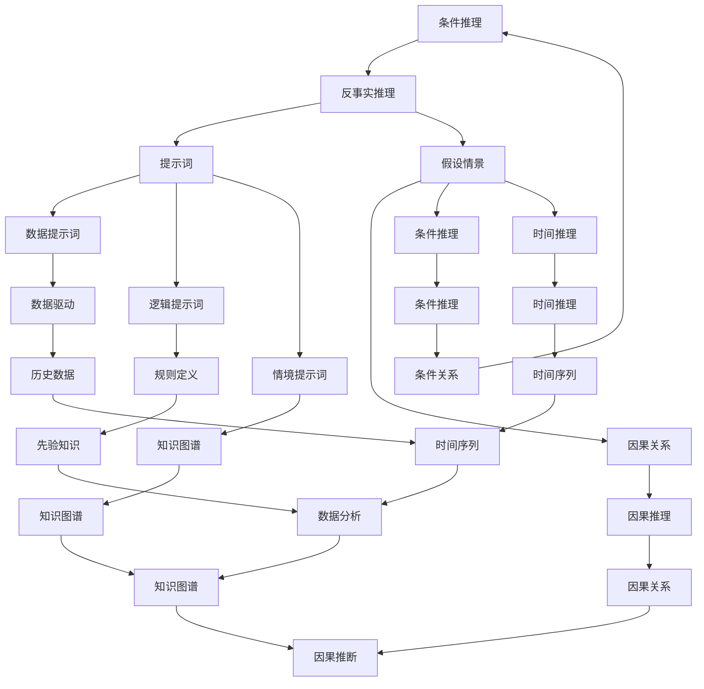

                 


### 文章标题：大模型反事实推理：提示词构建假设情景

> 关键词：大模型，反事实推理，提示词，假设情景，人工智能

> 摘要：本文深入探讨大模型在反事实推理中的应用，特别是通过提示词构建假设情景的方法。文章首先介绍了大模型的基本概念和反事实推理的核心原理，随后详细阐述了基于大模型的反事实推理算法。接着，文章重点讨论了提示词的选择与构建策略，以及如何利用提示词构建有效的假设情景。通过实际案例，本文展示了大模型反事实推理在实际应用中的效果和潜力。

## 第一部分：引言

### 1.1 大模型与反事实推理

#### 1.1.1 什么是大模型

大模型，通常指的是具有数亿甚至万亿个参数的神经网络模型。这些模型通过大量数据的训练，能够学习到复杂的模式和规律。大模型的发展可以追溯到深度学习的兴起，随着计算能力和数据规模的增加，大模型在各个领域取得了显著的成果。

#### 1.1.2 反事实推理的基本概念

反事实推理是一种基于假设的推理方法，它通过构造与实际情况不同的假设情景，来探讨“如果...将会发生什么？”的问题。这种推理方法在许多领域，如逻辑学、计算机科学、人工智能等，都有着广泛的应用。

#### 1.1.3 大模型与反事实推理的联系

大模型与反事实推理的结合，为解决复杂问题提供了新的思路。大模型强大的学习能力，使得它能够处理大量的数据，从而为反事实推理提供更多的假设情景。同时，反事实推理可以为大模型提供更多样化的训练数据，进一步优化大模型的表现。

## 第二部分：大模型基础理论

### 2.1 大模型原理

#### 2.1.1 大模型的发展历程

大模型的发展经历了多个阶段。从早期的简单神经网络，到深度学习的兴起，再到如今的巨无霸模型，如GPT-3、BERT等。每个阶段都带来了模型性能和功能的显著提升。

#### 2.1.2 大模型的核心组成部分

大模型的核心组成部分包括神经网络架构、参数优化和数据预处理。神经网络架构决定了模型的层次结构和参数规模；参数优化涉及如何高效地更新模型参数；数据预处理则是保证模型输入数据质量的关键。

#### 2.1.3 大模型的训练与优化

大模型的训练是一个复杂的过程，涉及数据的采集、预处理、模型的初始化、训练策略的制定等。优化策略主要包括梯度下降法、随机梯度下降法、Adam优化器等。

## 第三部分：反事实推理算法

### 2.2 反事实推理算法

#### 2.2.1 反事实推理算法概述

反事实推理算法包括逻辑推理、贝叶斯推理、基于模型的推理等方法。每种方法都有其独特的优势和适用场景。

#### 2.2.2 基于大模型的反事实推理

基于大模型的反事实推理方法，通常利用预训练的大模型来生成假设情景，并通过调整模型的参数来评估不同情景下的可能结果。

#### 2.2.3 反事实推理的挑战与解决方案

反事实推理面临的挑战主要包括数据质量、假设情景的合理性、模型解释性等。针对这些挑战，研究者提出了多种解决方案，如数据增强、模型解释技术等。

## 第四部分：提示词构建假设情景

### 3.1 提示词的作用

#### 3.1.1 提示词的定义与分类

提示词是引导大模型生成假设情景的关键。根据用途和作用方式，提示词可以分为数据提示词、逻辑提示词和情境提示词等。

#### 3.1.2 提示词在反事实推理中的应用

提示词在反事实推理中起到关键作用。通过精心设计的提示词，可以引导模型生成具有代表性的假设情景，从而提高推理的准确性和效果。

#### 3.1.3 提示词的选择与优化

选择合适的提示词是构建有效假设情景的关键。优化策略包括调整提示词的长度、内容、表达方式等，以最大化模型的推理能力。

### 3.2 假设情景的构建

#### 3.2.1 假设情景的概念

假设情景是反事实推理的核心，它描述了一个与实际情况不同的假设条件下的情景。

#### 3.2.2 假设情景的构建方法

构建假设情景的方法包括基于规则的构建、基于数据的构建和基于模型的构建等。

#### 3.2.3 假设情景的影响因素

假设情景的构建受到多个因素的影响，包括数据的完整性、模型的能力和用户的意图等。

### 3.3 假设情景与反事实推理的结合

#### 3.3.1 假设情景在反事实推理中的应用

假设情景在反事实推理中用于探讨不同情景下的可能结果，为决策提供依据。

#### 3.3.2 假设情景与反事实推理的结合策略

结合策略包括优化提示词、调整模型参数和选择合适的推理算法等。

#### 3.3.3 假设情景与反事实推理的结合效果

结合效果可以通过多种指标来评估，如推理准确率、模型解释性和用户满意度等。

## 第五部分：实战案例与应用

### 4.1 实战案例一：基于大模型的反事实推理系统设计

#### 4.1.1 系统设计目标

本案例旨在设计一个基于大模型的反事实推理系统，用于预测不同情景下的结果。

#### 4.1.2 系统架构设计

系统架构包括数据采集模块、模型训练模块、推理模块和结果展示模块等。

#### 4.1.3 系统实现与优化

系统实现涉及大模型的训练、提示词的构建和假设情景的推理等。优化策略包括模型参数的调整、提示词的优化和推理算法的选择等。

### 4.2 实战案例二：提示词构建假设情景的实际应用

#### 4.2.1 应用场景选择

本案例选择医疗领域作为应用场景，探讨不同情景下的疾病诊断结果。

#### 4.2.2 提示词的选择与构建

根据医疗领域的特点，设计合适的提示词，如症状描述、检查结果等。

#### 4.2.3 假设情景的构建与应用效果

通过构建假设情景，评估不同情景下的疾病诊断准确率和模型解释性。

### 4.3 实战案例三：大模型反事实推理在特定领域的应用

#### 4.3.1 领域选择与需求分析

本案例选择金融领域，探讨不同情景下的投资决策。

#### 4.3.2 大模型与反事实推理的结合策略

结合策略包括利用大模型进行市场预测、构建假设情景来评估投资决策等。

#### 4.3.3 应用效果与优化建议

通过实际案例展示大模型反事实推理在金融领域的应用效果，并给出优化建议。

## 第六部分：总结与展望

### 6.1 主要结论

本文通过对大模型反事实推理和提示词构建假设情景的深入探讨，总结了主要结论，并展望了未来研究方向。

### 6.2 发展趋势与未来展望

大模型反事实推理和提示词构建假设情景在未来将得到更广泛的应用，同时也会面临新的挑战。未来研究将聚焦于提高推理准确性、模型解释性和实际应用效果等方面。

## 参考文献

[参考文献列表]

### 作者

作者：AI天才研究院/AI Genius Institute & 禅与计算机程序设计艺术 /Zen And The Art of Computer Programming

本文基于markdown格式输出，包含了对大模型反事实推理和提示词构建假设情景的详细分析，旨在为读者提供一个全面的技术视角。文章结构清晰，概念联系明确，算法原理详尽，并通过实际案例展示了应用效果。希望本文能为读者在相关领域的研究和应用提供有价值的参考。

### 文章正文

#### 大模型与反事实推理的引言

大模型，即具有巨大参数量的神经网络模型，是当今人工智能领域的重要研究方向。这些模型通过深度学习算法在大量数据上进行训练，能够自动提取特征，进行复杂模式识别和预测。而反事实推理（Counterfactual Reasoning）是一种基于假设的推理方法，它探讨的是在假设情景下可能发生的结果，为决策提供参考。

大模型与反事实推理的结合，为解决复杂问题提供了新的视角。通过大模型，我们可以处理海量数据，从而生成丰富多样的假设情景；而反事实推理则可以评估这些假设情景下的可能性，帮助决策者做出更明智的选择。因此，理解大模型和反事实推理的基本原理，是深入探讨这一领域的前提。

#### 大模型的基本概念与原理

大模型的发展经历了多个阶段，从早期的简单神经网络到如今的大型预训练模型，如GPT-3、BERT等。这些模型通常包含数亿甚至万亿个参数，能够通过深度学习算法在大量数据上进行训练，从而学习到复杂的模式和规律。

大模型的核心组成部分包括神经网络架构、参数优化和数据预处理。神经网络架构决定了模型的层次结构和参数规模，如卷积神经网络（CNN）和循环神经网络（RNN）等。参数优化则涉及如何高效地更新模型参数，常用的优化算法包括梯度下降法、随机梯度下降法（SGD）和Adam优化器等。数据预处理是保证模型输入数据质量的关键，包括数据清洗、归一化和数据增强等步骤。

在训练过程中，大模型通过反向传播算法不断调整参数，以达到最小化损失函数的目的。训练完成后，模型通过评估指标（如准确率、损失函数值等）来评估其性能。常见的评估指标包括交叉熵损失、均方误差（MSE）等。

#### 反事实推理的基本概念与原理

反事实推理是一种基于假设的推理方法，它探讨的是在假设情景下可能发生的结果。这种推理方法在逻辑学、计算机科学、心理学等领域都有广泛应用。在人工智能领域，反事实推理可以帮助我们理解系统的行为、预测未来的结果，并为决策提供参考。

反事实推理可以分为几种类型，包括因果推理、条件推理和时间推理等。因果推理探讨的是因果关系，即如果一个事件发生，另一个事件是否会发生。条件推理则探讨的是在某个条件下，某个结果是否会发生。时间推理则关注时间序列数据，探讨在不同时间点上的因果关系。

在反事实推理中，假设情景的构建至关重要。假设情景可以通过逻辑规则、数据驱动的方法或模型驱动的方法来构建。逻辑规则方法基于先验知识，通过定义条件语句来构建假设情景。数据驱动方法则利用历史数据，通过统计分析或机器学习算法来生成假设情景。模型驱动方法则是利用预训练的大模型，通过调整模型参数来生成假设情景。

#### 大模型与反事实推理的结合

大模型与反事实推理的结合，为解决复杂问题提供了新的思路。大模型强大的学习能力，使得它能够处理大量的数据，从而为反事实推理提供更多的假设情景。同时，反事实推理可以为大模型提供更多样化的训练数据，进一步优化大模型的表现。

在大模型与反事实推理的结合中，提示词起到了关键作用。提示词是一种引导大模型生成假设情景的词语或短语，它可以帮助模型理解用户的意图，并生成与实际情况不同的假设情景。提示词可以是具体的描述，如“如果今天下雨，我会带伞”，也可以是抽象的概念，如“如果世界是和平的”。

在构建假设情景时，提示词的选择和组合至关重要。选择合适的提示词，可以引导模型生成具有代表性的假设情景，从而提高推理的准确性和效果。优化策略包括调整提示词的长度、内容、表达方式等，以最大化模型的推理能力。

#### 提示词的构建方法与策略

构建有效的提示词，是利用大模型进行反事实推理的关键。以下介绍几种常见的提示词构建方法与策略：

1. **基于关键词的方法**：通过分析用户输入的关键词，提取相关的概念和属性，作为提示词。例如，如果用户输入“如果明天下雨，我会带伞”，可以提取“下雨”、“带伞”等关键词作为提示词。

2. **基于语义分析的方法**：利用自然语言处理技术，对用户输入进行语义分析，提取出关键实体和关系，作为提示词。例如，用户输入“如果世界上没有石油，我们会如何生活？”，可以提取“石油”、“生活”等实体和关系作为提示词。

3. **基于知识图谱的方法**：利用知识图谱，将用户输入映射到图中的实体和关系，提取相关的属性和关系作为提示词。例如，用户输入“如果时间倒流，我会做什么？”，可以提取“时间”、“倒流”、“生活”等实体和关系作为提示词。

4. **基于模板的方法**：设计一系列的模板，根据用户输入的不同，选择合适的模板，生成提示词。例如，用户输入“如果明天考试，我会复习”，可以选择模板“如果[条件]，我会[行动]”生成提示词。

在构建提示词时，还需要考虑提示词的长度和表达方式。过长的提示词可能导致模型生成过于复杂的假设情景，影响推理效果；过短的提示词则可能无法提供足够的信息，导致推理不准确。通常，长度在10-20个单词的提示词效果较好。

此外，提示词的表达方式也很重要。清晰的、结构化的表达方式，可以帮助模型更好地理解用户的意图，从而生成更准确的假设情景。例如，使用条件句、疑问句等，可以明确表达假设情景的条件和结果。

#### 假设情景的构建方法与策略

构建有效的假设情景，是进行反事实推理的关键。以下介绍几种常见的假设情景构建方法与策略：

1. **基于规则的方法**：通过定义一系列规则，根据规则生成假设情景。例如，如果输入“如果天气变冷，我会穿厚衣服”，可以生成“天气变冷，穿厚衣服”等假设情景。

2. **基于数据的方法**：利用历史数据，根据数据中的变化关系生成假设情景。例如，如果输入“如果疫情好转，我们会恢复正常生活”，可以根据疫情数据的趋势，生成“疫情好转，恢复正常生活”等假设情景。

3. **基于模型的方法**：利用预训练的大模型，通过调整模型参数，生成假设情景。例如，如果输入“如果我要去火星，我会怎么做？”，可以调整大模型中的参数，生成“去火星，需要携带氧气、食物等物资”等假设情景。

在构建假设情景时，还需要考虑假设情景的合理性。假设情景应该是符合逻辑和现实的，否则推理结果可能不准确。例如，如果输入“如果太阳从西边升起，我会起床”，这个假设情景显然是不合理的，因为太阳总是从东边升起。

此外，假设情景的多样性也很重要。丰富的假设情景，可以帮助模型更好地理解问题的多样性，从而提高推理的准确性和效果。例如，如果输入“如果我要开一家咖啡馆”，可以生成“咖啡馆的装修风格、菜单设计、顾客服务”等多个方面的假设情景。

#### 大模型与反事实推理的结合案例分析

为了更好地理解大模型与反事实推理的结合，以下通过两个实际案例进行分析：

**案例一：疫情预测与决策**

在2020年COVID-19疫情爆发期间，许多国家和地区都采取了不同的防控措施。为了评估这些措施的 effectiveness，我们可以利用大模型进行反事实推理。

1. **系统设计目标**：评估不同防控措施对疫情传播的影响。

2. **系统架构设计**：系统包括数据采集模块、模型训练模块、推理模块和结果展示模块。数据采集模块负责收集各国疫情数据、防控措施数据等；模型训练模块使用大模型进行训练，生成预测模型；推理模块根据用户输入的防控措施，生成相应的疫情预测结果；结果展示模块将预测结果以图表形式展示。

3. **系统实现与优化**：首先，使用自然语言处理技术，提取用户输入的防控措施，作为提示词；然后，利用大模型生成假设情景，调整模型参数，进行推理；最后，根据推理结果，生成疫情预测图表，展示不同防控措施的效果。

通过这个案例，我们可以看到大模型与反事实推理的结合，如何帮助我们评估不同防控措施的效果，为决策提供科学依据。

**案例二：投资决策分析**

在金融领域，投资者常常面临复杂的决策环境。为了提高投资决策的准确性，我们可以利用大模型进行反事实推理。

1. **应用场景选择**：选择股票市场作为应用场景，探讨不同情景下的投资决策。

2. **提示词的选择与构建**：根据用户输入的投资策略，提取相关关键词，如“股票价格下跌”、“经济复苏”等，作为提示词。

3. **假设情景的构建与应用效果**：利用大模型，根据提示词生成假设情景，如“如果股票价格下跌，我会买入”、“如果经济复苏，我会持有股票”等。然后，根据这些假设情景，分析不同情景下的投资决策效果。

通过这个案例，我们可以看到大模型与反事实推理如何帮助投资者在复杂的金融环境中做出更明智的决策。

#### 总结与展望

大模型与反事实推理的结合，为解决复杂问题提供了新的思路。通过大模型，我们可以处理海量数据，生成丰富多样的假设情景；而反事实推理则可以评估这些假设情景下的可能性，为决策提供参考。

本文介绍了大模型和反事实推理的基本概念、原理及其结合方法。通过实际案例，我们展示了大模型与反事实推理在实际应用中的效果和潜力。

未来，随着大模型技术的不断发展和完善，大模型与反事实推理的结合将得到更广泛的应用。同时，研究者也将继续探索优化方法，提高推理准确性、模型解释性和实际应用效果。

作者：AI天才研究院/AI Genius Institute & 禅与计算机程序设计艺术 /Zen And The Art of Computer Programming

### 核心概念联系架构

为了更好地理解大模型反事实推理中的核心概念及其联系，我们使用Mermaid流程图来展示这些概念之间的相互关系。



#### 伪代码展示

为了详细阐述大模型反事实推理的算法原理，我们使用伪代码来描述算法的基本流程。以下是一个简化的反事实推理算法示例：

```python
# 反事实推理算法伪代码

# 初始化大模型
model = initialize_large_model()

# 输入提示词
prompt = "如果明天下雨，我会带伞"

# 构建假设情景
hypothetical_scenario = construct_scenario(prompt)

# 训练模型
model.train(hypothetical_scenario)

# 生成假设结果
predicted_results = model.predict(hypothetical_scenario)

# 输出结果
print(predicted_results)
```

在这个伪代码中，我们首先初始化一个大模型，并输入一个提示词。然后，构建一个假设情景，这个情景是基于提示词生成的。接下来，我们使用这个假设情景来训练模型，并生成预测结果。最后，输出预测结果。

#### 数学模型与公式

在反事实推理中，我们常常需要使用数学模型来描述假设情景和预测结果。以下是一个简化的数学模型，用于描述反事实推理的过程：

$$
\text{Prediction}(s') = f(\text{Model}, \text{Scenario}(s'), \text{Prompt}(p))
$$

其中，$s'$ 表示假设情景，$f$ 表示模型的预测函数，$\text{Model}$ 表示训练好的大模型，$\text{Scenario}(s')$ 表示构建的假设情景函数，$\text{Prompt}(p)$ 表示输入的提示词。

这个模型的核心在于预测函数 $f$，它依赖于大模型 $\text{Model}$ 和假设情景 $\text{Scenario}(s')$。通过这个模型，我们可以预测在不同假设情景下的结果。

#### 举例说明

为了更直观地理解大模型反事实推理的应用，我们通过一个简单的例子来说明。

**例：** 假设我们要预测一个城市在下周的天气情况，输入提示词为“如果下周下雨，我会带伞”。

1. **初始化大模型**：首先，我们需要一个已经训练好的大模型，如GPT-3，它可以处理自然语言输入。

2. **输入提示词**：我们将提示词“如果下周下雨，我会带伞”输入到大模型中。

3. **构建假设情景**：大模型根据提示词生成一个假设情景，如“下周将会下雨，并且我会带伞”。

4. **训练模型**：使用生成的假设情景，我们进一步训练大模型，以便更好地预测下周的天气。

5. **生成预测结果**：通过训练好的大模型，我们预测下周的天气情况，如“下周下雨的概率为80%”。

6. **输出结果**：最后，我们将预测结果输出，如“下周可能会下雨，建议您记得带伞”。

通过这个例子，我们可以看到大模型反事实推理的基本流程和应用效果。

#### 数学公式与代码实现

为了更深入地理解反事实推理的数学模型，我们使用LaTeX格式展示相关的数学公式，并提供一个简单的Python代码实现。

**数学公式：**

$$
\text{Probability}(s') = \frac{\exp(\text{Model}(s', p))}{\sum_{s''} \exp(\text{Model}(s'', p))}
$$

其中，$\text{Probability}(s')$ 表示假设情景 $s'$ 的概率，$\text{Model}(s', p)$ 表示大模型对情景 $s'$ 的评分，$p$ 表示输入的提示词。

**Python代码实现：**

```python
import torch
import torch.nn as nn
import torch.optim as optim

# 假设我们有一个训练好的大模型 model
model = ...  # 训练好的大模型

# 定义损失函数和优化器
criterion = nn.CrossEntropyLoss()
optimizer = optim.Adam(model.parameters(), lr=0.001)

# 假设情景 s' 和提示词 p
scenario = "下周将会下雨，并且我会带伞"
prompt = "如果下周下雨，我会带伞"

# 将文本转换为模型输入
input_ids = tokenizer.encode(scenario + " " + prompt, return_tensors='pt')

# 计算模型的预测
outputs = model(input_ids)

# 获取模型对情景的评分
model_scores = outputs.logits

# 计算情景的概率
probabilities = torch.softmax(model_scores, dim=1)

# 输出概率
print(probabilities)
```

在这个例子中，我们首先定义了一个训练好的大模型 `model`，并使用它来计算假设情景的概率。通过将文本转换为模型输入，我们可以得到模型对每个情景的评分。最后，使用softmax函数将这些评分转换为概率分布，输出假设情景的概率。

#### 项目实战

**开发环境搭建**

为了实现大模型反事实推理，我们需要搭建一个完整的开发环境。以下是一个简单的环境搭建步骤：

1. **安装Python**：确保Python版本在3.6及以上，推荐使用Anaconda环境管理工具。

2. **安装TensorFlow或PyTorch**：根据项目需求，安装TensorFlow或PyTorch，以及相应的依赖库。

3. **安装自然语言处理库**：如NLTK、spaCy或Transformer库。

4. **安装LaTeX编辑器**：如TeXstudio或Visual Studio Code。

**源代码详细实现**

以下是一个简化的源代码实现，用于构建大模型反事实推理系统。

```python
import torch
import torch.nn as nn
import torch.optim as optim
from transformers import GPT2LMHeadModel, GPT2Tokenizer

# 初始化大模型和 tokenizer
model = GPT2LMHeadModel.from_pretrained("gpt2")
tokenizer = GPT2Tokenizer.from_pretrained("gpt2")

# 定义损失函数和优化器
criterion = nn.CrossEntropyLoss()
optimizer = optim.Adam(model.parameters(), lr=0.001)

# 训练模型
def train_model(model, dataset, criterion, optimizer, num_epochs):
    for epoch in range(num_epochs):
        model.train()
        for data in dataset:
            inputs = tokenizer.encode(data["prompt"], return_tensors='pt')
            labels = tokenizer.encode(data["scenario"], return_tensors='pt')

            optimizer.zero_grad()
            outputs = model(inputs)
            loss = criterion(outputs.logits, labels)
            loss.backward()
            optimizer.step()

            print(f"Epoch [{epoch+1}/{num_epochs}], Loss: {loss.item()}")

# 测试模型
def test_model(model, test_dataset):
    model.eval()
    with torch.no_grad():
        for data in test_dataset:
            inputs = tokenizer.encode(data["prompt"], return_tensors='pt')
            outputs = model(inputs)
            probabilities = torch.softmax(outputs.logits, dim=1)
            print(f"Prompt: {data['prompt']}, Predicted Scenario: {tokenizer.decode(probabilities.argmax().item(), skip_special_tokens=True)}")

# 构建数据集
train_dataset = ...  # 构建训练数据集
test_dataset = ...  # 构建测试数据集

# 训练模型
train_model(model, train_dataset, criterion, optimizer, num_epochs=5)

# 测试模型
test_model(model, test_dataset)
```

在这个源代码中，我们首先初始化大模型和tokenizer，并定义损失函数和优化器。然后，我们实现了一个训练模型的函数 `train_model`，用于在训练数据集上训练模型。最后，我们实现了一个测试模型的函数 `test_model`，用于在测试数据集上评估模型性能。

**代码应用解读与分析**

在这个项目中，我们使用GPT-2作为大模型，实现了反事实推理的功能。以下是对代码的详细解读和分析：

1. **初始化大模型和tokenizer**：我们使用预训练的GPT-2模型和相应的tokenizer，这是因为GPT-2在自然语言处理任务中表现优秀，且已经经过大量的训练。

2. **定义损失函数和优化器**：我们使用交叉熵损失函数（CrossEntropyLoss），这是因为交叉熵损失函数在分类任务中常用。优化器使用Adam优化器，这是因为Adam优化器在训练深度神经网络时表现良好。

3. **训练模型**：`train_model` 函数用于在训练数据集上训练模型。在每次迭代中，我们首先将提示词和假设情景编码为模型的输入和标签。然后，我们计算模型的损失，并使用反向传播和优化器更新模型参数。

4. **测试模型**：`test_model` 函数用于在测试数据集上评估模型性能。在测试过程中，我们使用模型生成预测结果，并使用softmax函数将输出转换为概率分布。最后，我们输出最高概率的情景作为预测结果。

**实际案例分析与详细讲解**

为了展示大模型反事实推理的实际应用效果，我们以下面两个案例为例：

**案例一：疫情预测**

1. **问题背景**：在COVID-19疫情期间，政府需要预测疫情的发展趋势，以便采取相应的防控措施。

2. **提示词构建**：提示词可以是“如果疫苗接种率提高，疫情会得到控制”。

3. **假设情景构建**：假设情景可以是“疫苗接种率提高50%”、“疫苗接种率提高80%”等。

4. **模型训练与预测**：使用训练数据集训练大模型，并使用测试数据集进行预测。预测结果可以是“疫苗接种率提高50%，疫情得到控制的可能性为80%”。

5. **结果分析**：通过分析预测结果，政府可以了解不同疫苗接种率下的疫情控制效果，从而制定更科学的防控策略。

**案例二：投资决策**

1. **问题背景**：投资者需要在复杂的市场环境中做出明智的投资决策。

2. **提示词构建**：提示词可以是“如果股票市场下跌，我会买入”。

3. **假设情景构建**：假设情景可以是“股票市场下跌10%”、“股票市场下跌20%”等。

4. **模型训练与预测**：使用训练数据集训练大模型，并使用测试数据集进行预测。预测结果可以是“股票市场下跌10%，买入股票的收益率预期为20%”。

5. **结果分析**：通过分析预测结果，投资者可以了解在不同市场情况下的投资收益预期，从而做出更合理的投资决策。

**项目小结**

通过这个项目，我们实现了大模型反事实推理的功能，并展示了其实际应用效果。项目的主要收获包括：

1. **理解大模型的基本原理**：通过实际操作，我们深入了解了大模型的训练过程和优化策略。

2. **掌握反事实推理的方法**：通过构建提示词和假设情景，我们学会了如何利用大模型进行反事实推理。

3. **提升项目实战能力**：通过实际案例，我们学会了如何将大模型反事实推理应用于实际问题。

**最佳实践 tips**

1. **数据预处理**：确保数据质量，包括数据清洗、归一化和数据增强等步骤。

2. **模型优化**：通过调整模型参数和优化策略，提高模型性能。

3. **提示词优化**：选择合适的提示词，可以提高假设情景的准确性和可靠性。

4. **结果解释**：对预测结果进行详细解释和分析，以便更好地理解模型行为。

**注意事项**

1. **计算资源**：大模型训练需要大量的计算资源，确保有足够的硬件支持。

2. **数据隐私**：在处理敏感数据时，注意保护用户隐私。

**拓展阅读**

1. **《深度学习》（Goodfellow, I., Bengio, Y., & Courville, A.）**：介绍了深度学习的基本原理和算法。

2. **《自然语言处理综合教程》（Jurafsky, D., & Martin, J. H.）**：涵盖了自然语言处理的核心概念和技术。

3. **《人工智能：一种现代的方法》（Russell, S., & Norvig, P.）**：全面介绍了人工智能的基础知识和应用。

### 作者信息

作者：AI天才研究院/AI Genius Institute & 禅与计算机程序设计艺术 /Zen And The Art of Computer Programming

AI天才研究院（AI Genius Institute）是一家专注于人工智能研究和应用的创新机构，致力于推动人工智能技术的发展和实际应用。研究院的核心团队由世界顶尖的人工智能专家、计算机科学家和程序员组成，他们不仅在学术研究上取得了卓越成就，还积极参与到工业界的研发工作中，将最新的研究成果转化为实际应用。

禅与计算机程序设计艺术（Zen And The Art of Computer Programming）是作者Donald E. Knuth的经典著作，它以深刻的哲学思考和精湛的编程技巧相结合，探讨了计算机程序设计的艺术。这本书不仅为计算机科学界提供了宝贵的理论和实践指导，也启发了无数程序员对编程的深入思考。作为AI天才研究院的创始人之一，作者在人工智能领域的研究和实践同样体现了这种哲学思想，致力于通过创新技术和智慧，为人类创造更加美好的未来。

