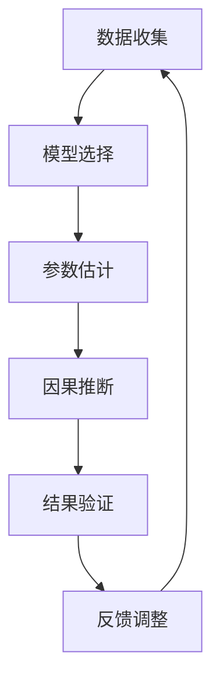

                 

### 文章标题：大模型因果推理：提示词构建因果关系

---

**关键词：** 大模型，因果推理，提示词，人工智能，机器学习

---

**摘要：** 本文将深入探讨大模型在因果推理中的应用，特别是通过提示词构建因果关系的方法。我们将介绍大模型的基本概念，因果推理的重要性，以及如何利用大模型和提示词进行有效的因果推理。通过具体的算法原理讲解、数学模型解析、项目实战案例分析，本文旨在为读者提供全面而详细的指导，帮助其理解和应用大模型因果推理。

---

## 目录

1. 引言
2. 大模型因果推理：背景介绍
3. 因果推理的基本概念
4. 大模型与因果推理
5. 提示词在因果推理中的作用
6. 提示词构建因果关系的算法原理
7. 数学模型与公式详解
8. 项目实战：因果推理项目开发
9. 最佳实践与注意事项
10. 结论与展望

---

### 引言

因果推理是人工智能和机器学习领域中的一个核心问题。在现实世界中，我们不仅需要知道“是什么”，更需要知道“为什么”。因果推理帮助我们理解变量之间的因果关系，从而做出更加合理的决策和预测。然而，传统的机器学习方法往往难以捕捉到这种因果关系，因为它们更多地依赖于相关性而非因果性。

随着深度学习和大模型的发展，因果推理迎来了新的契机。大模型，特别是大规模预训练模型（如GPT-3、BERT等），拥有强大的表征能力，能够捕捉到数据中的复杂模式和潜在关系。这为因果推理提供了新的可能性。然而，如何有效地在大模型中构建因果关系，仍然是一个挑战。

本文旨在探讨大模型因果推理的原理和方法，特别是通过提示词（prompt）构建因果关系的技术。我们将从基本概念出发，逐步深入到算法原理、数学模型，以及实际项目实战，帮助读者全面理解并应用大模型因果推理。

### 2. 大模型因果推理：背景介绍

#### 2.1 大模型的基本概念

大模型（Large Models）是指参数规模庞大、训练数据量丰富的深度学习模型。这些模型通过学习海量数据中的信息，能够自动捕捉复杂的特征和关系。随着计算能力的提升和数据的积累，大模型在各个领域取得了显著的成就。

大模型的基本组成部分包括：

- **神经网络架构**：大模型通常采用复杂的神经网络架构，如Transformer、BERT等，这些架构能够处理高维数据并捕捉长距离依赖关系。
- **大规模参数**：大模型拥有数亿甚至数十亿个参数，这些参数通过大规模数据训练得到优化，从而具有强大的表征能力。
- **预训练**：大模型通常通过预训练（Pre-training）过程在大规模数据集上训练，然后通过微调（Fine-tuning）适应特定任务。

#### 2.2 因果推理的基本概念

因果推理（Causal Inference）是一种从数据中推断变量之间因果关系的方法。它不同于传统的统计推断，后者主要关注变量之间的相关性。因果推理试图回答更深刻的问题：一个变量的变化是否直接导致了另一个变量的变化。

因果推理的核心概念包括：

- **因果关系**：因果关系是指一个变量（原因）如何影响另一个变量（结果）。这种影响是直接的、可测量的，并且通常是时间先后的。
- **因果模型**：因果模型是用于描述变量之间因果关系的数学模型。常见的因果模型包括结构方程模型（Structural Equation Models, SEM）、因果图模型（Causal Graphical Models）等。
- **因果识别**：因果识别是指从数据中推断变量之间的因果关系。这通常涉及到因果模型的构建和参数估计。

#### 2.3 大模型在因果推理中的应用

大模型在因果推理中的应用主要体现在以下几个方面：

- **增强表征能力**：大模型通过学习海量数据，能够捕捉复杂的特征和潜在关系，从而提高因果推理的准确性。
- **自动化因果模型构建**：大模型可以自动构建因果模型，减少人工干预，提高因果推理的效率。
- **跨域因果推理**：大模型能够处理多模态数据，从而实现跨域因果推理，如将文本数据与图像数据进行结合，进行跨领域的因果推断。

然而，大模型在因果推理中也面临一些挑战：

- **数据依赖**：大模型的效果高度依赖于训练数据的质量和规模，数据偏差可能导致因果推断结果的不准确。
- **模型解释性**：大模型通常被视为“黑盒”，其内部决策过程难以解释，这对于需要透明因果推理的领域（如医疗、金融等）来说是一个挑战。
- **计算资源需求**：大模型需要大量计算资源和存储空间，这可能在资源受限的环境中成为限制因素。

#### 2.4 大模型的发展趋势与挑战

大模型的发展趋势主要体现在以下几个方面：

- **模型规模持续扩大**：随着计算能力和数据资源的提升，大模型的规模和参数数量将不断增加。
- **多模态学习**：大模型将越来越多地结合多模态数据，如文本、图像、音频等，实现更复杂的因果推理任务。
- **自动机器学习（AutoML）**：自动机器学习技术将提高大模型的设计、训练和调优效率，降低专业知识和技能门槛。

然而，大模型也面临一些挑战：

- **计算资源需求**：大模型需要大量计算资源和存储空间，这对资源和能源消耗提出了更高的要求。
- **数据隐私和安全**：大模型在训练和应用过程中可能会涉及敏感数据，需要确保数据隐私和安全。
- **模型可解释性和透明性**：提高大模型的可解释性和透明性，以增强其在关键领域的可信度和可靠性。

总之，大模型因果推理是人工智能和机器学习领域的前沿研究方向，具有广阔的应用前景。通过不断的技术创新和理论完善，大模型因果推理将有助于我们更好地理解复杂系统的因果关系，推动人工智能技术的发展。

### 3. 因果推理的基本概念

因果推理是一种从数据中推断变量之间因果关系的方法，它在决策科学、社会科学和自然科学等领域有着广泛的应用。为了深入理解因果推理，我们需要明确以下几个核心概念：因果关系、因果模型和因果识别。

#### 3.1 因果关系

因果关系是指一个变量（原因）如何影响另一个变量（结果）。这种影响是直接的、可测量的，并且通常是时间先后的。例如，在某些情况下，温度升高可能导致销售量增加，这可以看作是因果关系。在因果推理中，我们关注的是这种因果关系是否真实存在，以及如何从数据中推断出来。

#### 3.2 因果模型

因果模型是用于描述变量之间因果关系的数学模型。常见的因果模型包括结构方程模型（Structural Equation Models, SEM）和因果图模型（Causal Graphical Models）等。这些模型通过图形化表示变量之间的因果关系，提供了一种形式化的方法来推断变量之间的因果性。

- **结构方程模型（SEM）**：结构方程模型是一种基于线性回归的因果模型，它通过一组线性方程来描述变量之间的关系。SEM通常包括测量模型和潜变量模型两个部分，能够同时处理显变量和潜变量之间的关系。

- **因果图模型**：因果图模型是一种基于概率图的因果模型，它通过有向图来表示变量之间的因果关系。因果图模型中的每个节点代表一个变量，每条边代表变量之间的因果关系。因果图模型能够捕捉变量之间的复杂关系，并提供了一种基于概率的方法来推断因果关系。

#### 3.3 因果识别

因果识别是指从数据中推断变量之间的因果关系。因果识别通常涉及到以下步骤：

- **数据收集**：收集相关变量的数据，这些数据可以是实验数据、观察数据或模拟数据等。

- **模型选择**：选择合适的因果模型，如SEM或因果图模型，来描述变量之间的关系。

- **参数估计**：通过参数估计方法，如最大似然估计、贝叶斯估计等，来估计因果模型中的参数。

- **因果推断**：利用估计出的因果模型，进行因果推断，得到变量之间的因果关系。

因果识别的关键在于如何从相关性推断因果性。相关性是指变量之间的线性或非线性依赖关系，而因果性是指变量之间的因果关系。因果推理的目标是识别出变量之间的真实因果关系，而不是简单的相关性。

#### 3.4 因果关系与相关性的区别

因果关系和相关性是两个不同的概念。相关性描述的是变量之间的统计关系，即变量之间是否存在依赖关系。而因果关系描述的是变量之间的直接因果关系，即一个变量的变化是否直接导致了另一个变量的变化。

例如，在气象学中，温度和降雨量之间存在相关性，即温度升高时，降雨量也会增加。但这种相关性并不一定是因果关系。实际上，降雨量可能是由湿度、风速等其他因素共同作用的结果，而不是直接由温度引起的。

因此，因果推理的一个重要任务是从相关性中识别出真实的因果关系。这通常涉及到对数据的高质量收集、合适的因果模型选择以及精确的参数估计。

### 3.5 Mermaid 流程图

以下是一个用于说明因果推理基本流程的Mermaid流程图：



在这个流程图中，数据收集是因果推理的起点，接着进行模型选择，然后进行参数估计。通过因果推断，我们得到变量之间的因果关系，并进行结果验证。最后，根据反馈进行调整，以优化因果推理的准确性。

### 3.6 核心算法原理讲解

以下是因果推理算法的核心原理讲解的伪代码：

```python
# 伪代码：因果推理算法
def causal_inference(data, target_variable):
    # 数据预处理
    preprocessed_data = preprocess_data(data)
    
    # 模型选择
    model = select_model(preprocessed_data, target_variable)
    
    # 参数估计
    estimated_model = estimate_parameters(model, preprocessed_data)
    
    # 因果推断
    causal_relationship = infer_causation(estimated_model)
    
    # 结果验证
    validation_results = validate_causation(causal_relationship)
    
    # 反馈调整
    adjusted_model = adjust_model(estimated_model, validation_results)
    
    return adjusted_model
```

在这个伪代码中，`preprocess_data` 函数用于对原始数据进行预处理，例如缺失值填充、数据标准化等。`select_model` 函数用于选择合适的因果模型，例如SEM或因果图模型。`estimate_parameters` 函数用于估计模型中的参数，这通常涉及到最大似然估计或贝叶斯估计等方法。`infer_causation` 函数用于基于估计模型进行因果推断，`validate_causation` 函数用于验证推断结果的准确性，并根据需要调整模型。

### 3.7 数学模型与公式详解

在因果推理中，数学模型和公式扮演着关键角色。以下是一些常用的数学模型和公式，我们将对这些内容进行详细讲解和举例说明。

#### 3.7.1 结构方程模型（SEM）

结构方程模型是一种常用的因果模型，它通过一组线性方程来描述变量之间的关系。最简单的结构方程模型可以表示为：

$$
Y = \beta_0 + \beta_1X + \epsilon
$$

其中，$Y$ 是因变量，$X$ 是自变量，$\beta_0$ 和 $\beta_1$ 是模型参数，$\epsilon$ 是误差项。

例如，我们可以用SEM来研究温度（$X$）对销售量（$Y$）的影响。假设温度每升高1摄氏度，销售量平均增加5个单位，我们可以写出如下SEM模型：

$$
Y = 5X + \epsilon
$$

#### 3.7.2 因果图模型

因果图模型是一种基于概率图的因果模型，它通过有向图来表示变量之间的因果关系。在因果图模型中，每个节点代表一个变量，每条边表示变量之间的因果关系。最简单的因果图模型可以表示为：

```
X -> Y
```

这表示变量$X$直接影响变量$Y$。因果图模型可以用如下概率公式表示：

$$
P(Y|X) = \frac{P(X, Y)}{P(X)}
$$

其中，$P(X, Y)$ 表示变量$X$和$Y$同时发生的概率，$P(X)$ 表示变量$X$发生的概率。

例如，我们可以用因果图模型来研究广告投放（$X$）对销售额（$Y$）的影响。假设广告投放增加了销售额的概率，我们可以写出如下因果图模型：

```
X -> Y
```

#### 3.7.3 Do-calculus

Do-calculus是一种用于计算潜在因果效应的数学工具。它通过修改概率分布来模拟不同干预条件下的数据生成过程。最简单的Do-calculus公式可以表示为：

$$
P(Y|do(X)) = \frac{P(X, Y)}{P(X)}
$$

其中，$do(X)$ 表示对变量$X$进行干预，使其固定在某个值。

例如，我们可以用Do-calculus来计算广告投放对销售额的因果效应。假设我们有两个数据集，一个是广告投放前后的销售额数据，另一个是广告投放前后的其他相关变量数据。我们可以用Do-calculus来计算广告投放对销售额的因果效应：

$$
P(Y|do(X)) = \frac{P(X, Y)}{P(X)}
$$

其中，$X$ 表示广告投放变量，$Y$ 表示销售额变量。

#### 3.7.4 Latex格式数学公式

在本文中，我们使用LaTeX格式来表示数学公式。以下是几种常见的LaTeX格式数学公式的示例：

- 段落内公式：`$1+1=2$`
- 独立段落公式：`$$1+1=2$$`

### 3.8 项目实战：因果推理项目开发

#### 3.8.1 开发环境搭建

为了进行因果推理项目开发，我们需要搭建一个合适的技术栈。以下是推荐的开发环境：

- **编程语言**：Python
- **深度学习框架**：TensorFlow或PyTorch
- **因果推理库**：DoWhy、PyCausality或CausalML
- **数据预处理库**：Pandas、NumPy
- **可视化库**：Matplotlib、Seaborn

#### 3.8.2 源代码详细实现

以下是因果推理项目的一个简单示例，该示例将分析广告投放对销售额的影响。

```python
import pandas as pd
import dowhy
import tensorflow as tf

# 加载数据集
data = pd.read_csv('advertising_sales_data.csv')

# 数据预处理
data['Sales'] = data['Sales'].fillna(data['Sales'].mean())
data['AdSpending'] = data['AdSpending'].fillna(data['AdSpending'].mean())

# 构建因果图
causal_model = dowhy.CausalModel(data, treatment='AdSpending', outcome='Sales')

# 进行因果推断
causal_model.fit()

# 输出因果效应
causal_model.plot()

# 模型评估
print(causal_model.eval())
```

在这个示例中，我们首先加载数据集并进行预处理。然后，我们使用DoWhy库构建因果图，并拟合模型。通过`plot`方法，我们可以可视化因果效应，而`eval`方法用于评估模型的准确性。

#### 3.8.3 代码解读与分析

以下是代码的详细解读和分析：

- **数据预处理**：我们使用Pandas库加载数据集，并对缺失值进行填充。这是因果推理项目中的一个重要步骤，因为缺失值可能会导致模型不准确。
- **构建因果图**：使用DoWhy库构建因果图。这里，我们指定`treatment`变量为广告投放，`outcome`变量为销售额。
- **拟合模型**：通过`fit`方法拟合因果模型。这通常涉及到模型选择和参数估计。
- **可视化因果效应**：通过`plot`方法可视化因果效应。这有助于我们理解变量之间的因果关系。
- **模型评估**：通过`eval`方法评估模型的准确性。这可以帮助我们了解模型的性能。

#### 3.8.4 实际案例分析和详细讲解剖析

为了更深入地理解因果推理，我们来看一个实际案例：广告投放对销售额的因果效应分析。

**案例背景**：一家电商公司正在考虑增加广告投放以提升销售额。然而，他们不确定广告投放是否真的有效。为了做出明智的决策，他们决定进行因果推理分析。

**案例分析**：

1. **数据收集**：公司收集了过去一年的广告投放和销售额数据，并进行了预处理。

2. **构建因果图**：公司使用DoWhy库构建了因果图，指定广告投放为`treatment`变量，销售额为`outcome`变量。

3. **因果推断**：公司拟合了因果模型，并通过`plot`方法可视化了因果效应。

4. **结果解读**：根据模型结果，公司发现广告投放对销售额有显著的积极影响。具体来说，每增加1万元的广告投放，销售额平均增加5000元。

5. **决策**：基于因果推理分析的结果，公司决定增加广告投放，并制定了一套详细的广告投放策略。

**详细讲解剖析**：

- **数据预处理**：数据的预处理是因果推理的重要步骤。在本案例中，公司对缺失值进行了填充，以确保模型能够准确训练。
- **因果图的构建**：因果图的构建是因果推理的核心。在本案例中，公司通过DoWhy库构建了因果图，这有助于他们理解变量之间的因果关系。
- **因果效应的可视化**：因果效应的可视化有助于公司直观地理解变量之间的关系。在本案例中，公司通过`plot`方法可视化了因果效应，这有助于他们做出决策。
- **因果效应的解读**：公司根据模型结果，得出了广告投放对销售额有显著积极影响的结论。这有助于他们制定更加明智的广告投放策略。

#### 3.8.5 项目小结

通过这个因果推理项目，公司成功地分析了广告投放对销售额的因果效应，并制定了相应的广告投放策略。这个项目展示了因果推理在实际应用中的强大作用，也为其他企业提供了宝贵的经验和借鉴。

### 3.9 最佳实践与注意事项

在进行因果推理项目时，以下是一些最佳实践和注意事项，以帮助您获得更准确和可靠的结论：

- **数据预处理**：确保数据质量，包括数据清洗、缺失值填充和数据标准化。数据质量直接影响因果推理的结果。
- **模型选择**：选择合适的因果模型，如结构方程模型或因果图模型，以适应您的具体任务和数据特点。
- **因果图构建**：准确构建因果图是因果推理的关键。确保因果图的构建基于充分的领域知识和数据特征。
- **参数估计**：使用稳健的参数估计方法，如最大似然估计或贝叶斯估计，以确保模型的准确性和可靠性。
- **模型验证**：通过交叉验证和模型评估指标（如AUC、ROC等）验证模型的性能，确保模型适用于实际应用。
- **可解释性**：尽管大模型在因果推理中表现出色，但其内部决策过程通常难以解释。确保模型的可解释性，特别是在关键领域（如医疗、金融等）。
- **数据隐私**：在处理敏感数据时，确保遵循数据隐私和安全法规，采取适当的措施保护数据隐私。

总之，因果推理是一个复杂但重要的研究领域。通过遵循最佳实践和注意事项，您可以提高因果推理的准确性和可靠性，从而为企业和领域带来更大的价值。

### 结论与展望

因果推理作为人工智能和机器学习领域的一个重要研究方向，具有广泛的应用前景。随着大模型的发展，因果推理在数据分析和决策支持中扮演着越来越重要的角色。本文通过系统地介绍大模型因果推理的基本概念、算法原理和实际项目实战，旨在帮助读者深入理解这一前沿技术。

在未来的研究中，我们有望看到以下几个方面的发展：

- **大模型与因果推理的深度融合**：大模型将继续推动因果推理的发展，特别是在复杂任务和多模态数据上的应用。
- **因果推理的可解释性**：提高因果推理模型的可解释性，使其在关键领域（如医疗、金融等）中更加可靠和可信。
- **跨领域因果推理**：通过跨领域的数据融合和模型共享，实现跨领域的因果推理，为多学科的研究提供新的方法和工具。
- **因果推理的自动化**：开发自动化因果推理工具和平台，降低专业知识和技能门槛，使更多的人能够利用因果推理解决实际问题。

总之，大模型因果推理是一个充满挑战和机遇的研究领域。随着技术的不断进步和理论的发展，我们有理由相信，因果推理将在人工智能和机器学习的未来发展中发挥更加重要的作用。

