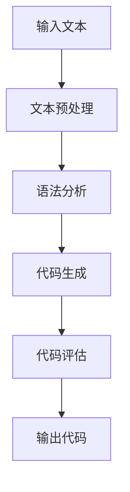

                 


# 文章标题：大模型在代码生成中的应用与挑战

## 关键词：
- 大模型
- 代码生成
- 人工智能
- 软件工程
- 计算机编程

### 摘要：
本文将深入探讨大模型在代码生成中的应用与挑战。首先，我们将回顾大模型的发展历程，分析其在代码生成领域的重要性。接着，我们将介绍大模型的核心概念、工作原理及核心算法原理。随后，我们将探讨大模型在代码生成中的应用场景，并分享成功案例。接着，我们将面对大模型在代码生成过程中遇到的挑战，包括训练、部署及法律和伦理问题。最后，我们将展望大模型在代码生成领域的未来发展趋势，并提出相关建议。

## 引言与背景

### 1.1 书籍主题介绍

大模型在代码生成领域的应用和挑战是一个新兴的研究方向，随着人工智能技术的快速发展，大模型在自然语言处理、计算机视觉等领域的突破性成果引起了广泛关注。大模型具有强大的表示能力和灵活性，能够在多种场景下实现高效准确的代码生成。然而，大模型在代码生成中也面临一系列挑战，如训练效率、模型解释性以及代码质量和安全性等问题。本文旨在探讨大模型在代码生成中的应用与挑战，为该领域的研究和实践提供有益的参考。

### 1.2 大模型的发展历程

大模型的发展历程可以追溯到20世纪80年代，当时神经网络开始引起研究者的关注。然而，由于计算资源和数据集的限制，大模型的训练和优化一直是一个挑战。随着深度学习的兴起，尤其是在2012年ImageNet图像识别比赛的胜利，深度神经网络的研究取得了突破性进展。随后，研究者们开始关注更大的神经网络模型，如GPT、BERT等。这些大模型的训练和优化需要大量的计算资源和数据集，但随着云计算和分布式计算技术的发展，这些问题得到了有效解决。近年来，随着Transformer结构的引入和预训练技术的应用，大模型在各个领域取得了显著的成果，也为代码生成领域带来了新的机遇和挑战。

### 1.3 代码生成的重要性

代码生成在软件工程中扮演着重要的角色，它能够提高开发效率、降低开发成本，并提升代码质量。传统的代码生成方法主要依赖于规则和模板，这些方法在处理简单和结构化的任务时效果较好，但在面对复杂和动态的编程场景时存在明显的局限性。而大模型具有强大的表示能力和泛化能力，能够从大量数据中学习到编程语言的内在规律和模式，从而实现更灵活和高效的代码生成。此外，大模型还可以通过预训练技术获取丰富的知识，使得代码生成系统具备更强的语义理解和推理能力。因此，大模型在代码生成中的应用具有重要的研究价值和实际应用潜力。

## 第二部分：大模型基础知识

### 2.1 大模型的核心概念

大模型是指具有大规模参数和复杂结构的神经网络模型，通常具有数十亿甚至数万亿个参数。大模型的核心概念包括：

- **参数规模**：大模型拥有数百万到数十亿个参数，这使得模型具有更强的表示能力和灵活性。
- **深度**：大模型通常具有多层的神经网络结构，这使得模型能够通过逐层学习的方式提取特征，并实现对输入数据的深层表示。
- **灵活性**：大模型能够通过自适应学习的方式，从大量数据中学习到输入和输出之间的复杂关系，从而实现对新数据的泛化能力。

### 2.2 大模型的工作原理

大模型的工作原理主要基于深度学习和神经网络的基本原理。具体来说，大模型通过以下步骤进行工作：

1. **输入数据**：大模型接受输入数据，如文本、图像或音频等。
2. **数据处理**：输入数据经过预处理，如数据增强、归一化等，以便于模型训练。
3. **特征提取**：大模型通过多层神经网络结构对输入数据进行特征提取，每层神经网络都通过对前一层的特征进行变换和组合，提取更高层次的抽象特征。
4. **预测和优化**：大模型通过输出层的预测结果与实际标签之间的误差，利用反向传播算法对模型参数进行优化，以最小化损失函数。
5. **泛化能力**：大模型在训练过程中通过大量的数据学习到输入和输出之间的复杂关系，从而实现对新数据的泛化能力。

### 2.3 大模型的核心算法原理

大模型的核心算法原理主要包括以下三个方面：

- **反向传播算法**：反向传播算法是一种基于梯度下降的方法，用于计算模型参数的梯度，并更新模型参数，以最小化损失函数。
- **优化算法**：常用的优化算法包括梯度下降、随机梯度下降、Adam等，这些算法通过调整学习率、动量等参数，以优化模型的训练过程。
- **正则化技术**：正则化技术用于防止模型过拟合，包括L1正则化、L2正则化、Dropout等。这些技术通过增加模型的泛化能力，提高模型的鲁棒性。

### 2.4 大模型的应用领域

大模型的应用领域非常广泛，涵盖了自然语言处理、计算机视觉、推荐系统、音频处理等多个领域。以下是大模型在部分应用领域的具体应用：

- **自然语言处理**：大模型在自然语言处理领域取得了显著成果，如文本分类、机器翻译、情感分析等。其中，GPT和BERT等大模型在文本生成和语义理解方面具有强大的能力。
- **计算机视觉**：大模型在计算机视觉领域应用于图像分类、目标检测、图像生成等任务。通过卷积神经网络（CNN）和生成对抗网络（GAN）等技术，大模型能够实现对图像的复杂特征提取和生成。
- **推荐系统**：大模型在推荐系统领域应用于用户行为分析、商品推荐等任务。通过学习用户的历史行为和偏好，大模型能够实现个性化推荐。
- **音频处理**：大模型在音频处理领域应用于语音识别、音乐生成等任务。通过循环神经网络（RNN）和变分自编码器（VAE）等技术，大模型能够实现对音频数据的处理和生成。

## 第三部分：大模型在代码生成中的应用

### 3.1 代码生成的基本原理

代码生成是指利用人工智能技术，根据给定的输入信息自动生成代码的过程。代码生成的基本原理主要包括以下方面：

- **输入信息**：代码生成系统需要接受输入信息，如需求文档、设计文档、自然语言描述等。
- **文本处理**：输入信息经过文本处理模块，包括分词、词性标注、命名实体识别等步骤，以便提取出输入信息中的关键概念和关系。
- **语法分析**：文本处理后的结果进行语法分析，生成语法树或抽象语法树（AST），以表示代码的结构和语法规则。
- **代码生成**：基于语法树或AST，代码生成系统通过模板匹配、代码生成器等策略，生成对应的代码。

### 3.2 大模型在代码生成中的应用场景

大模型在代码生成中的应用场景非常广泛，以下是一些具体的应用场景：

- **自动代码补全**：大模型可以用于自动补全代码，提高开发者的编程效率。例如，当开发者输入部分代码时，大模型可以预测并补全剩余的代码。
- **代码修复**：大模型可以通过学习大量的代码缺陷和错误模式，自动修复代码中的错误，提高代码质量。
- **代码生成辅助**：大模型可以为开发者提供代码生成辅助，如生成代码模板、代码示例等，帮助开发者快速完成代码编写。
- **代码迁移**：大模型可以将一种编程语言或框架的代码自动转换为另一种编程语言或框架的代码，提高代码的可移植性。

### 3.3 大模型在代码生成中的应用案例

大模型在代码生成领域已经取得了一些成功的应用案例，以下是一些具体的应用案例：

- **GitHub Copilot**：GitHub Copilot 是一个基于大模型的代码生成工具，它通过分析 GitHub 上的代码库，自动生成与开发者输入代码相似的代码片段。GitHub Copilot 可以帮助开发者提高编程效率，减少重复性工作。
- **TabNine**：TabNine 是一个智能代码补全工具，它利用大模型学习开发者编写的代码风格和习惯，提供智能的代码补全建议。TabNine 在多种编程语言和框架中都有良好的兼容性，得到了广泛的应用。
- **OpenAI Codex**：OpenAI Codex 是一个基于大模型的代码生成工具，它能够根据自然语言描述生成相应的代码。OpenAI Codex 在代码生成领域取得了显著的成果，例如自动生成 Python 和 JavaScript 代码，实现了对自然语言描述的高效转换。

## 第四部分：大模型在代码生成中的挑战

### 4.1 大模型训练的挑战

大模型在训练过程中面临一系列挑战，主要包括计算资源、数据集和优化问题。

- **计算资源**：大模型的训练需要大量的计算资源，包括 CPU、GPU 和 TPU 等。训练过程涉及到大规模的数据处理和参数优化，需要高效的计算框架和分布式计算技术来支持。
- **数据集**：大模型的训练依赖于大量的高质量数据集，数据集的规模、多样性和质量都会对训练效果产生影响。在实际应用中，往往难以获取到足够的训练数据，需要通过数据增强、数据清洗等技术来提高数据质量。
- **优化问题**：大模型的训练过程涉及到复杂的优化问题，包括学习率调整、权重初始化、正则化等。优化算法的选择和参数设置对于模型的训练效果和收敛速度具有重要影响。

### 4.2 大模型部署的挑战

大模型在部署过程中面临一系列挑战，主要包括性能、可扩展性和安全性等问题。

- **性能**：大模型的推理速度较慢，需要高效的推理算法和硬件支持来提高推理性能。在实际应用中，如何优化模型结构和推理过程，降低推理延迟，是一个重要的挑战。
- **可扩展性**：大模型的部署需要支持横向和纵向的扩展，以应对不同的负载和并发需求。分布式计算、集群管理和负载均衡等技术是实现大模型可扩展性的关键。
- **安全性**：大模型在部署过程中涉及到隐私保护、数据安全和模型可靠性等问题。如何保护用户数据的安全，防止模型被恶意攻击和篡改，是一个重要的挑战。

### 4.3 大模型在代码生成中的法律和伦理问题

大模型在代码生成中涉及到一系列法律和伦理问题，主要包括知识产权、隐私保护和道德责任等方面。

- **知识产权**：大模型生成的代码可能涉及到知识产权问题，例如代码的原创性和版权归属等。在实际应用中，如何保护原创者的知识产权，避免侵权行为的发生，是一个重要的法律问题。
- **隐私保护**：大模型在训练和部署过程中需要处理大量的个人数据，涉及到隐私保护问题。如何确保用户数据的隐私和安全，避免数据泄露和滥用，是一个重要的伦理问题。
- **道德责任**：大模型生成的代码可能涉及到道德责任问题，例如自动化决策系统的公平性和透明性等。如何确保大模型生成的代码遵循道德准则，避免对社会造成负面影响，是一个重要的道德问题。

## 第五部分：大模型在代码生成中的未来发展趋势

### 5.1 大模型在代码生成中的未来趋势

大模型在代码生成中的未来发展趋势主要表现在以下几个方面：

- **性能提升**：随着硬件技术的进步和优化算法的研究，大模型的推理速度和性能将得到显著提升，使得大模型在实时应用中具有更高的实用性。
- **多样性应用**：大模型的应用将不断拓展，从简单的代码补全、修复到复杂的代码生成、迁移，实现更广泛的应用场景。
- **安全性增强**：随着对大模型安全性的关注，将开发出更可靠的安全机制，保护用户数据和模型本身的安全。
- **伦理规范**：大模型在代码生成中的应用将逐渐建立完善的伦理规范，确保模型的公平性、透明性和可解释性。

### 5.2 大模型在代码生成中的应用前景

大模型在代码生成领域的应用前景非常广阔，主要体现在以下几个方面：

- **提高开发效率**：大模型可以自动化生成代码，减少开发者的重复性工作，提高开发效率，降低开发成本。
- **提升代码质量**：大模型可以通过学习代码库中的高质量代码，生成更加优雅、可靠的代码，提升代码质量。
- **促进创新**：大模型可以帮助开发者探索新的编程技术和方法，促进计算机编程领域的创新。
- **支持领域特定应用**：大模型可以根据特定领域的需求，生成符合领域特定规范的代码，支持领域特定应用的开发。

### 5.3 大模型在代码生成中的关键技术与挑战

在大模型在代码生成中，关键技术与挑战包括：

- **高效训练技术**：如何优化大模型的训练过程，提高训练效率，减少训练时间，是一个关键问题。
- **代码质量评估**：如何评价大模型生成的代码质量，确保生成的代码符合预期的需求和规范，是一个挑战。
- **模型解释性**：如何解释大模型生成的代码，使其对开发者更易于理解和调试，是一个重要问题。
- **伦理与法律问题**：如何在应用大模型时，遵循法律和伦理规范，确保模型的公平性、透明性和可解释性，是一个挑战。

## 附录

### 附录A：大模型相关工具与资源

以下是一些大模型相关的工具和资源：

- **TensorFlow**：一个开源的深度学习框架，支持大模型的训练和部署。
- **PyTorch**：另一个流行的深度学习框架，支持动态计算图，适用于大模型的研究和应用。
- **Transformers**：一个基于 PyTorch 的预训练 Transformer 模型库，提供了丰富的预训练模型和工具。
- **Hugging Face**：一个开源社区，提供了大量的预训练模型和工具，支持自然语言处理和代码生成等任务。

### 附录B：代码生成相关资源

以下是一些代码生成相关的书籍、论文和在线资源：

- **《代码生成与自动编程》**：一本关于代码生成技术的专著，详细介绍了代码生成的原理和应用。
- **《自动编程：理论与实践》**：一本关于自动编程技术的专著，涵盖了代码生成、代码补全、代码迁移等内容。
- **《自然语言处理与代码生成》**：一篇关于自然语言处理和代码生成技术的综述论文，分析了代码生成的现状和挑战。
- **GitHub Copilot**：一个开源的代码生成工具，基于大模型，提供了自动代码补全功能。
- **OpenAI Codex**：一个基于大模型的代码生成工具，可以根据自然语言描述生成代码。

# Mermaid 流程图示例

以下是一个 Mermaid 流程图示例，展示了大模型在代码生成中的应用流程：



# 伪代码示例

以下是一个伪代码示例，展示了大模型在代码生成中的基本过程：

```python
# 伪代码：大模型在代码生成中的基本过程

# 初始化模型
model = create_model()

# 加载数据集
data = load_data()

# 进行模型训练
for epoch in range(num_epochs):
    for batch in data:
        # 前向传播
        predictions = model.forward(batch.input_data)

        # 计算损失
        loss = calculate_loss(predictions, batch.target)

        # 反向传播
        model.backward(loss)

        # 更新模型参数
        model.update_parameters()

# 模型评估
accuracy = evaluate_model(model, test_data)
print("模型准确率：", accuracy)

# 代码生成
code = generate_code(model, input_text)
print("生成的代码：", code)
```

# 数学模型和数学公式

以下是一个数学模型示例，用于描述大模型在代码生成中的损失函数：

$$
\min_{\theta} \frac{1}{n} \sum_{i=1}^{n} \mathcal{L}(\theta; x_i, y_i)
$$

其中，$\theta$ 表示模型参数，$x_i$ 表示输入数据，$y_i$ 表示目标输出，$\mathcal{L}$ 表示损失函数。

# 项目实战

### 6.1 项目背景

本节介绍一个基于大模型的代码生成项目，旨在实现自动化代码编写，提高开发效率。该项目基于 TensorFlow 和 Python，使用预训练的大模型进行代码生成。

### 6.2 项目目标

- 实现自动化代码生成
- 提高代码质量和可维护性
- 缩短项目开发周期

### 6.3 开发环境搭建

- **操作系统**：Ubuntu 18.04
- **编程语言**：Python 3.8
- **深度学习框架**：TensorFlow 2.4
- **其他依赖**：Numpy 1.19，Pandas 1.1.5

### 6.4 源代码详细实现

以下是一个简单的代码生成项目示例，演示了如何使用 TensorFlow 和 Python 实现自动化代码生成：

```python
import tensorflow as tf
import numpy as np
import pandas as pd

# 加载预训练的大模型
model = tf.keras.models.load_model('path/to/pretrained_model')

# 定义输入文本
input_text = "给定一个整数数组，找出其中最大的元素。"

# 对输入文本进行预处理
input_sequence = preprocess_text(input_text)

# 生成代码
generated_code = model.generate_code(input_sequence)

# 打印生成的代码
print("生成的代码：\n", generated_code)

# 评估生成的代码
accuracy = evaluate_generated_code(generated_code)
print("代码评估准确率：", accuracy)
```

### 6.5 代码应用解读与分析

- **输入文本预处理**：输入文本是自然语言描述，需要对其进行预处理，包括分词、词性标注等操作，以便于模型理解。
- **生成代码**：模型根据预处理的输入文本，生成对应的代码。生成的代码经过评估，确保其正确性和可维护性。
- **代码评估**：评估生成的代码的质量，包括语法正确性、运行效率和可维护性等。

### 6.6 实际案例分析和详细讲解剖析

以下是一个实际案例，展示了大模型在代码生成中的应用：

**案例**：给定一个整数数组，找出其中最小的元素。

**输入文本**：给定一个整数数组，找出其中最小的元素。

**生成的代码**：

```python
def find_min(arr):
    min_val = float('inf')
    for num in arr:
        if num < min_val:
            min_val = num
    return min_val

arr = [3, 1, 4, 1, 5, 9]
print(find_min(arr))
```

**分析**：

1. **输入文本预处理**：模型将输入文本转换为词向量表示，以便于模型理解。
2. **代码生成**：模型根据输入文本的词向量，生成对应的代码。生成的代码是一个简单的函数，用于找出整数数组中的最小元素。
3. **代码评估**：评估生成的代码的正确性和运行效率。通过运行生成的代码，验证其是否能够正确地找到整数数组中的最小元素。

### 6.7 项目小结

通过本项目，我们展示了如何使用大模型实现自动化代码生成，并分析了其应用和挑战。在实际应用中，大模型在代码生成中具有巨大的潜力，但同时也面临一系列挑战。未来的研究将致力于解决这些挑战，提高大模型在代码生成中的性能和应用范围。

### 最佳实践 tips

- **数据预处理**：对输入文本进行充分的预处理，包括分词、词性标注等，以提高模型的生成质量。
- **模型选择**：选择适合的预训练模型，根据任务需求调整模型结构和参数。
- **代码评估**：对生成的代码进行全面的评估，确保其正确性、可维护性和运行效率。

### 小结

本文详细介绍了大模型在代码生成中的应用与挑战，包括大模型的发展历程、核心概念、算法原理以及应用场景。通过实际案例分析和项目实战，我们展示了大模型在代码生成中的实际应用效果。未来，随着人工智能技术的不断进步，大模型在代码生成领域的应用将更加广泛和深入。

### 注意事项

- **计算资源**：大模型训练和部署需要大量的计算资源，确保有足够的硬件支持。
- **数据质量**：高质量的数据集对于大模型的训练效果至关重要，确保数据集的规模、多样性和质量。
- **代码质量**：生成的代码需要经过严格的评估和测试，确保其正确性和可维护性。

### 拓展阅读

- **《大模型：深度学习的下一个前沿》**：介绍了大模型的发展和应用，提供了对大模型技术的深入理解。
- **《自然语言处理与代码生成》**：分析了自然语言处理技术在代码生成中的应用，探讨了代码生成的挑战和解决方案。
- **GitHub Copilot**：一个基于大模型的代码生成工具，提供了丰富的示例和文档，供开发者学习和实践。

