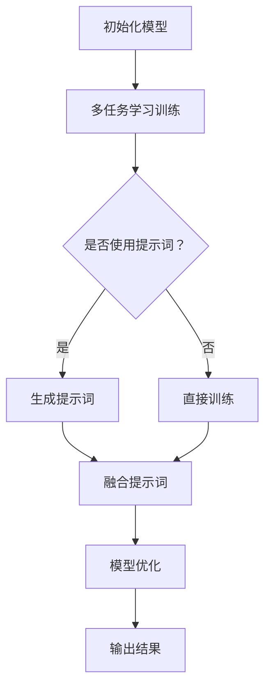
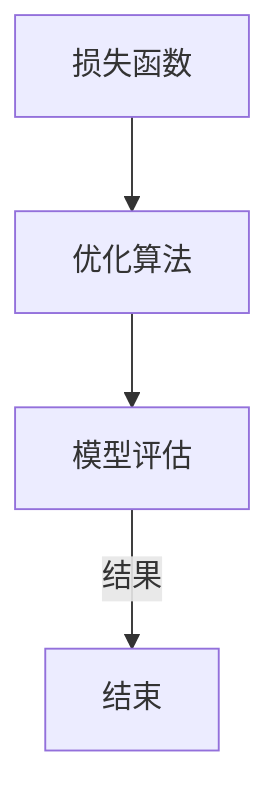
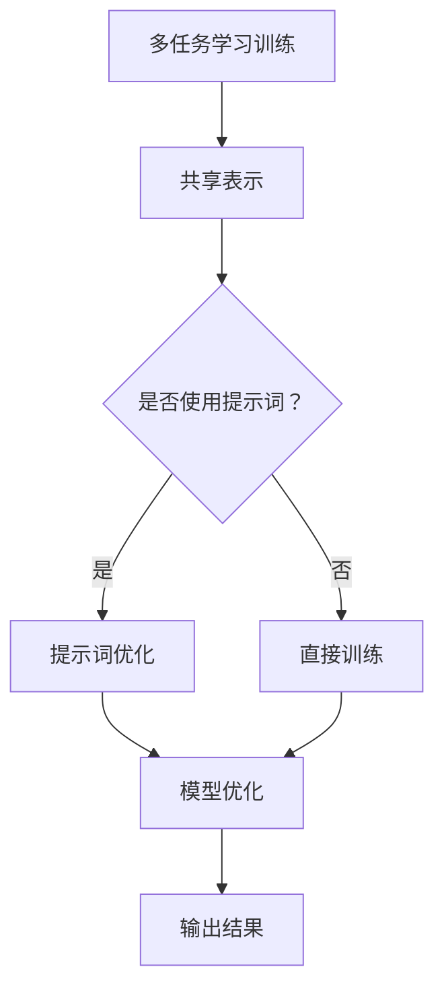

                 


### 文章标题：大模型多任务学习与提示词工程

### 文章关键词：
- 大模型
- 多任务学习
- 提示词工程
- 人工智能
- 自然语言处理
- 模型优化

### 摘要：
本文将深入探讨大模型多任务学习与提示词工程在人工智能领域的应用。首先，我们将介绍大模型多任务学习的背景和核心概念，包括其优势、挑战及数学模型。接着，我们将详细讲解提示词工程的概念、原理和实现方法。随后，通过具体的数学公式和伪代码，我们将阐述大模型多任务学习和提示词工程的核心算法原理。文章的后半部分将结合实际项目实战，展示如何搭建开发环境、实现源代码并进行分析。最后，我们将总结最佳实践，并提出注意事项和拓展阅读建议。

## 第1章：大模型多任务学习基础

### 1.1 大模型多任务学习的背景

随着深度学习技术的不断发展，大型模型在自然语言处理、计算机视觉等领域的应用越来越广泛。这些大模型通常具有极高的参数数量和计算复杂度，能够处理大量数据并产生出色的性能。然而，随着模型的规模增大，如何有效利用这些模型来处理多个任务成为一个重要的研究课题。

多任务学习（Multi-Task Learning，MTL）是一种通过共享模型表示来同时解决多个相关任务的方法。与传统单任务学习相比，多任务学习能够提高模型的泛化能力、减少过拟合现象，并在有限的数据集上实现更好的性能。而大模型多任务学习（MTL-LM）则进一步利用了大规模模型的特性，使得模型在处理多个任务时能够更加高效和准确。

大模型多任务学习的背景可以归结为以下几点：

1. **数据集多样性**：在现实世界中，数据集往往是多样化的，包括文本、图像、音频等多种类型。传统的单任务学习难以同时处理这些多样的数据，而大模型多任务学习能够通过共享模型表示来有效处理这些任务。

2. **计算资源限制**：训练大型模型需要大量的计算资源和时间。通过多任务学习，可以共享模型参数，从而减少训练时间和计算成本。

3. **提高模型泛化能力**：多任务学习能够通过跨任务的训练来提高模型的泛化能力，使其在未见过的任务上表现更好。

### 1.2 大模型多任务学习的核心概念

#### 1.2.1 多任务学习

多任务学习是指在一个统一的模型框架下，同时训练多个具有相关性的任务。其核心思想是通过共享模型表示来提高模型的性能和泛化能力。多任务学习可以分为两种类型：硬参数共享（Hard Parameter Sharing）和软参数共享（Soft Parameter Sharing）。

- **硬参数共享**：硬参数共享是指所有任务共享相同的模型参数。这种方法简单直观，但可能导致某些任务受到其他任务的不良影响。
- **软参数共享**：软参数共享是指不同任务之间共享部分参数，而其他参数独立。这种方法在保持模型灵活性的同时，能够更好地利用任务之间的相关性。

#### 1.2.2 大模型

大模型是指具有极高参数数量和计算复杂度的模型。这些模型通常使用深度神经网络（Deep Neural Networks，DNN）来构建，能够在大规模数据集上实现出色的性能。大模型的特性包括：

- **高参数数量**：大模型通常具有数百万甚至数十亿的参数，能够捕捉复杂的特征和模式。
- **高计算复杂度**：大模型的训练和推理需要大量的计算资源和时间。
- **强泛化能力**：大模型能够通过大量数据进行训练，从而在未见过的数据上表现更好。

#### 1.2.3 多任务学习与大模型的结合

多任务学习与大模型的结合能够充分利用大模型的特性，同时解决多个任务。具体来说，多任务学习能够通过以下方式提高大模型的表现：

- **共享表示**：多任务学习通过共享模型表示来降低模型的参数数量，从而减少过拟合现象。
- **交叉训练**：多任务学习通过跨任务的训练来提高模型的泛化能力，使其在未见过的任务上表现更好。
- **数据增强**：多任务学习能够通过将不同任务的数据进行交叉训练来增强模型的学习能力。

### 1.3 大模型多任务学习的优势

#### 1.3.1 提高模型性能

多任务学习能够通过共享模型表示来提高模型的性能。具体来说，共享表示能够捕捉任务之间的关联性，使得模型在处理相关任务时能够更加准确和高效。

#### 1.3.2 降低训练成本

大模型多任务学习能够通过共享模型参数来减少训练成本。传统单任务学习需要为每个任务训练一个独立的模型，而多任务学习则只需要一个模型即可。这大大减少了模型的训练时间和计算资源消耗。

#### 1.3.3 提高泛化能力

多任务学习通过跨任务的训练来提高模型的泛化能力。传统单任务学习模型在处理新任务时可能难以适应，而多任务学习则通过在不同任务上的训练来增强模型的泛化能力。

### 1.4 大模型多任务学习的挑战

#### 1.4.1 任务冲突

在多任务学习中，不同任务之间可能存在冲突。例如，某些任务的优化目标可能相互矛盾，导致模型难以同时优化多个任务。解决任务冲突是保证多任务学习成功的关键。

#### 1.4.2 模型复杂性

多任务学习模型通常比单任务模型更复杂，难以理解和调试。这给模型的开发和维护带来了挑战。

#### 1.4.3 数据分布不平衡

在多任务学习中，不同任务的数据分布可能不平衡。这可能导致某些任务在训练过程中受到其他任务的影响，从而影响模型的性能。

### 1.5 大模型多任务学习的数学模型

#### 1.5.1 损失函数

在多任务学习中，损失函数是评估模型性能的关键指标。常见的损失函数包括交叉熵损失、均方误差（MSE）等。多任务学习的损失函数通常是各任务损失函数的加权和。

#### 1.5.2 优化算法

优化算法用于调整模型参数，以最小化损失函数。常见的优化算法包括随机梯度下降（SGD）、Adam等。多任务学习的优化算法需要同时考虑各任务的梯度，以保证模型参数的调整能够同时优化多个任务。

#### 1.5.3 模型评估

模型评估是衡量模型性能的重要步骤。常见的评估指标包括准确率、召回率、F1分数等。在多任务学习中，需要对每个任务分别评估，并综合考虑各任务的评估结果。

### 1.6 本章小结

本章介绍了大模型多任务学习的背景、核心概念、优势、挑战及数学模型。通过本章的学习，读者可以了解大模型多任务学习的基本原理和应用场景，为进一步学习多任务学习的高级技术打下基础。

## 第2章：提示词工程基础

### 2.1 提示词工程的概念

提示词工程（Prompt Engineering）是指通过设计特定的提示词（prompt）来引导模型生成更符合预期输出的技术。在人工智能领域，尤其是自然语言处理（NLP）和生成模型中，提示词工程起着至关重要的作用。通过精心设计的提示词，可以显著提高模型的性能、可解释性和可控性。

### 2.2 提示词工程的原理

提示词工程的原理基于模型对输入的敏感性和对上下文的依赖。通过设计合适的提示词，可以引导模型关注特定的信息，从而改善模型的输出。具体来说，提示词工程涉及到以下几个方面：

1. **上下文生成**：提示词工程的一个关键部分是生成高质量的上下文，这有助于模型更好地理解问题的背景和细节。

2. **信息引导**：通过在提示词中包含关键信息，可以引导模型关注这些信息，从而生成更准确的输出。

3. **可解释性和可控性**：提示词工程可以帮助提高模型的可解释性和可控性，使研究人员和开发者能够更清楚地了解模型的决策过程，并进行必要的调整。

### 2.3 提示词工程的实现方法

提示词工程的实现方法主要包括以下几个方面：

1. **模板法**：通过预定义的模板来生成提示词。模板通常包含关键信息，例如问题、答案、上下文等。

2. **数据驱动法**：通过分析大量成功案例，提取出有效的提示词模式，并用于新任务。

3. **生成模型法**：使用生成模型（如变分自编码器、生成对抗网络等）来生成高质量的提示词。

4. **迁移学习法**：通过迁移学习，将已在其他任务上表现良好的提示词应用于新任务。

### 2.4 提示词工程的应用场景

提示词工程在多个应用场景中表现出色，以下是一些典型的应用场景：

1. **问答系统**：通过设计合适的提示词，可以引导模型生成更精确的答案。

2. **文本生成**：在文本生成任务中，提示词可以帮助模型生成更连贯、有逻辑的文本。

3. **机器翻译**：通过提示词，可以引导模型关注特定语言特征，从而提高翻译质量。

4. **情感分析**：在情感分析任务中，提示词可以帮助模型更好地捕捉情感信号。

### 2.5 本章小结

本章介绍了提示词工程的基本概念、原理和实现方法，以及其在多个应用场景中的应用。通过本章的学习，读者可以了解提示词工程的核心思想和技术，为进一步深入探讨大模型多任务学习和提示词工程的结合提供基础。

## 第3章：大模型多任务学习与提示词工程的融合

### 3.1 背景与动机

大模型多任务学习和提示词工程都是人工智能领域的先进技术，它们各自在解决特定问题上具有优势。然而，当我们将这两种技术结合起来时，可以产生更强大的效果。大模型多任务学习能够通过共享模型表示来提高多个任务的表现，而提示词工程则可以进一步优化模型的输出，使其更符合预期。

将大模型多任务学习与提示词工程结合的动机主要包括以下几点：

1. **提高模型性能**：通过多任务学习，模型能够更好地捕捉任务之间的关联性，而提示词工程则可以针对特定任务提供更精确的指导，从而提高整体性能。

2. **增强可解释性**：提示词工程可以帮助揭示模型的决策过程，使得模型的输出更加透明和可解释。

3. **提高可控性**：通过设计不同的提示词，开发者可以更灵活地调整模型的行为，从而实现更精细的控制。

4. **减少过拟合**：多任务学习能够通过跨任务的训练来提高模型的泛化能力，而提示词工程则可以在特定任务上提供额外的监督，从而减少过拟合现象。

### 3.2 融合方法的概述

将大模型多任务学习与提示词工程结合的方法可以分为两种：一种是先进行多任务学习，然后使用提示词来优化模型的输出；另一种是将提示词直接融入到多任务学习的训练过程中。

#### 方法一：多任务学习 + 提示词优化

1. **多任务学习**：首先使用传统多任务学习框架训练大型模型，使其在多个任务上表现良好。

2. **提示词设计**：根据具体任务的需求，设计合适的提示词。提示词应包含关键信息，例如问题、答案、上下文等。

3. **模型优化**：使用设计好的提示词对模型进行优化，调整模型参数，以获得更精确的输出。

#### 方法二：多任务学习 + 提示词融合

1. **多任务学习**：使用多任务学习框架训练大型模型，同时设计一个统一的提示词生成模块。

2. **提示词生成**：在训练过程中，动态生成提示词，并将其融入到模型输入中。

3. **模型训练**：通过结合提示词的信息，调整模型参数，优化模型表现。

### 3.3 核心概念与联系

为了更好地理解大模型多任务学习与提示词工程的融合，我们需要了解以下几个核心概念：

1. **共享表示**：多任务学习通过共享模型表示来降低模型参数数量，从而提高模型的泛化能力。

2. **提示词**：提示词是引导模型生成特定输出的一种工具，它包含了关键信息，能够影响模型的行为。

3. **上下文**：上下文是模型理解任务背景的重要信息，通过设计合适的上下文，可以增强模型的输出质量。

#### Mermaid 流程图

下面是一个Mermaid流程图，用于描述大模型多任务学习与提示词工程的融合过程：



### 3.4 核心算法原理讲解

#### 多任务学习算法

多任务学习算法的核心是共享表示和损失函数的设计。以下是一个简单的多任务学习算法的伪代码：

```python
# 多任务学习伪代码
def multi_task_learning(data, labels, task_weights):
    # 初始化模型
    model = initialize_model()

    # 损失函数
    loss_function = weighted_sum_of_losses(task_weights)

    # 模型训练
    for epoch in range(num_epochs):
        for batch in data:
            inputs, targets = batch
            predictions = model(inputs)
            loss = loss_function(predictions, targets)
            model.update_parameters(loss)

    return model
```

#### 提示词生成算法

提示词生成算法的目标是设计出高质量的提示词，以引导模型生成更精确的输出。以下是一个简单的提示词生成算法的伪代码：

```python
# 提示词生成伪代码
def generate_prompt(task, context, keywords):
    # 构建提示词模板
    prompt_template = "在{}的背景下，关于{}的关键词包括：{}。请回答问题：{}。"

    # 代入提示词模板
    prompt = prompt_template.format(context, task, keywords, question)

    return prompt
```

#### 模型优化算法

在融合提示词后的模型优化过程中，我们需要考虑如何调整模型参数，以获得更好的性能。以下是一个简单的模型优化算法的伪代码：

```python
# 模型优化伪代码
def optimize_model(model, prompt, data, labels):
    # 更新提示词
    updated_prompt = update_prompt(prompt, data)

    # 训练模型
    for epoch in range(num_epochs):
        for batch in data:
            inputs, targets = batch
            predictions = model(inputs, updated_prompt)
            loss = loss_function(predictions, targets)
            model.update_parameters(loss)

    return model
```

### 3.5 数学模型与公式

在多任务学习和提示词工程中，数学模型和公式是理解和实现核心算法的基础。以下是一些关键的数学模型和公式：

#### 多任务学习的损失函数

多任务学习的损失函数通常是一个加权和，其中每个任务的损失函数根据其重要性进行加权。

$$
\text{Total Loss} = \sum_{i=1}^{N} w_i \cdot L_i
$$

其中，$L_i$是第$i$个任务的损失函数，$w_i$是第$i$个任务的权重。

#### 提示词优化目标

提示词优化的目标是使模型在特定任务上的表现达到最优。这可以通过最小化提示词与任务损失函数之间的差距来实现。

$$
\text{Objective} = \min \sum_{i=1}^{N} \frac{1}{2} \cdot (p_i - l_i)^2
$$

其中，$p_i$是提示词，$l_i$是任务损失函数。

### 3.6 举例说明

为了更好地理解大模型多任务学习与提示词工程的融合，我们可以通过一个具体的例子来说明。

#### 示例：问答系统

假设我们有一个问答系统，需要同时回答多个相关领域的问题。我们可以使用大模型多任务学习与提示词工程的方法来优化系统性能。

1. **多任务学习训练**：首先，我们使用大模型进行多任务学习训练，使其在各个领域上都有较好的表现。

2. **提示词设计**：根据每个问题的背景和领域，设计合适的提示词。例如，对于医学领域的问题，我们可以使用“医学”、“症状”、“治疗”等关键词。

3. **模型优化**：使用设计好的提示词对模型进行优化，调整模型参数，使其在特定领域上生成更准确的答案。

### 3.7 本章小结

本章介绍了大模型多任务学习与提示词工程的融合方法，包括背景、原理、实现方法和数学模型。通过本章的学习，读者可以理解如何将这两种技术结合起来，以实现更强大的模型性能和可控性。下一章将深入探讨大模型多任务学习在具体应用中的实现细节。

## 第4章：大模型多任务学习的项目实战

### 4.1 项目背景与需求分析

#### 项目背景

随着人工智能技术的不断进步，大模型多任务学习在各个领域的应用越来越广泛。为了更好地展示大模型多任务学习的实际应用，我们选择了一个实际项目：多模态情感分析系统。该系统旨在通过分析文本、语音和视频等多模态数据，准确识别用户的情感状态。

#### 需求分析

- **文本情感分析**：对用户输入的文本进行情感分类，判断其情感倾向（如积极、消极、中性）。
- **语音情感分析**：通过分析用户的语音数据，判断其情感状态。
- **视频情感分析**：通过分析用户的面部表情和身体语言，判断其情感状态。
- **多模态融合**：将文本、语音和视频的情感分析结果进行融合，得到更准确的情感识别结果。

### 4.2 开发环境搭建

为了实现多模态情感分析系统，我们需要搭建一个合适的开发环境。以下是开发环境的基本要求：

1. **硬件环境**：服务器或高性能计算机，具备足够的计算资源和存储空间。
2. **软件环境**：Python 3.8及以上版本，TensorFlow 2.6及以上版本，Keras 2.4及以上版本，OpenCV 4.5及以上版本，其他必要的库（如NumPy、Pandas、Scikit-learn等）。
3. **数据集**：收集和准备多模态数据集，包括文本、语音和视频数据。

### 4.3 源代码实现与解读

#### 文本情感分析

以下是一个简单的文本情感分析模型的源代码实现：

```python
import tensorflow as tf
from tensorflow.keras.models import Sequential
from tensorflow.keras.layers import Embedding, LSTM, Dense

# 文本情感分析模型
def build_text_model(vocab_size, embedding_dim, max_sequence_length):
    model = Sequential([
        Embedding(vocab_size, embedding_dim, input_length=max_sequence_length),
        LSTM(64, return_sequences=True),
        LSTM(32),
        Dense(1, activation='sigmoid')
    ])
    model.compile(optimizer='adam', loss='binary_crossentropy', metrics=['accuracy'])
    return model
```

解读：
- **Embedding层**：将单词转换为向量表示。
- **LSTM层**：用于处理序列数据，能够捕捉时间序列特征。
- **Dense层**：用于分类，输出概率。

#### 语音情感分析

以下是一个简单的语音情感分析模型的源代码实现：

```python
import tensorflow as tf
from tensorflow.keras.models import Sequential
from tensorflow.keras.layers import Conv2D, MaxPooling2D, Flatten, Dense

# 语音情感分析模型
def build_audio_model(sample_rate, num_classes):
    model = Sequential([
        Conv2D(32, (3, 3), activation='relu', input_shape=(None, sample_rate, 1)),
        MaxPooling2D((2, 2)),
        Conv2D(64, (3, 3), activation='relu'),
        MaxPooling2D((2, 2)),
        Flatten(),
        Dense(64, activation='relu'),
        Dense(num_classes, activation='softmax')
    ])
    model.compile(optimizer='adam', loss='categorical_crossentropy', metrics=['accuracy'])
    return model
```

解读：
- **Conv2D层**：用于提取音频特征。
- **MaxPooling2D层**：用于降低模型参数数量。
- **Flatten层**：将特征矩阵展平。
- **Dense层**：用于分类，输出概率。

#### 视频情感分析

以下是一个简单的视频情感分析模型的源代码实现：

```python
import tensorflow as tf
from tensorflow.keras.models import Sequential
from tensorflow.keras.layers import Conv2D, MaxPooling2D, Flatten, Dense, TimeDistributed

# 视频情感分析模型
def build_video_model(frame_height, frame_width, num_classes):
    model = Sequential([
        TimeDistributed(Conv2D(32, (3, 3), activation='relu', input_shape=(frame_height, frame_width, 3))),
        TimeDistributed(MaxPooling2D((2, 2))),
        TimeDistributed(Conv2D(64, (3, 3), activation='relu')),
        TimeDistributed(MaxPooling2D((2, 2))),
        TimeDistributed(Flatten()),
        TimeDistributed(Dense(64, activation='relu')),
        TimeDistributed(Dense(num_classes, activation='softmax'))
    ])
    model.compile(optimizer='adam', loss='categorical_crossentropy', metrics=['accuracy'])
    return model
```

解读：
- **TimeDistributed**：用于对每个时间步骤应用相同的层。
- **Conv2D层**：用于提取视频帧特征。
- **MaxPooling2D层**：用于降低模型参数数量。
- **Flatten层**：将特征矩阵展平。
- **Dense层**：用于分类，输出概率。

#### 多模态融合

为了实现多模态融合，我们可以将文本、语音和视频的情感分析结果进行加权平均，得到最终的情感识别结果。以下是一个简单的多模态融合模型的源代码实现：

```python
import numpy as np

# 多模态融合
def fusion_models(text_predictions, audio_predictions, video_predictions, weights):
    fusion_predictions = np.dot([text_predictions, audio_predictions, video_predictions], weights)
    return np.mean(fusion_predictions, axis=0)
```

解读：
- **加权平均**：将各个模态的情感分析结果加权平均，得到最终的预测结果。

### 4.4 代码应用解读与分析

#### 文本情感分析应用

文本情感分析是情感分析系统的基础模块。在训练过程中，我们使用大量的文本数据来训练文本情感分析模型。在实际应用中，我们可以使用以下代码来预测文本的情感：

```python
# 文本情感分析应用
text_input = "今天天气非常好，我很高兴。"
text_model = build_text_model(vocab_size, embedding_dim, max_sequence_length)
text_predictions = text_model.predict(np.array([text_input]))
print("Text Prediction:", text_predictions)
```

解读：
- **输入文本**：将用户输入的文本转换为模型可接受的格式。
- **模型预测**：使用训练好的文本情感分析模型进行预测。

#### 语音情感分析应用

语音情感分析模块用于处理用户的语音数据。在实际应用中，我们可以使用以下代码来预测语音的情感：

```python
# 语音情感分析应用
audio_input = load_audio_file("user_speech.wav")
audio_model = build_audio_model(sample_rate, num_classes)
audio_predictions = audio_model.predict(np.expand_dims(audio_input, axis=0))
print("Audio Prediction:", audio_predictions)
```

解读：
- **加载音频文件**：从文件中加载用户的语音数据。
- **模型预测**：使用训练好的语音情感分析模型进行预测。

#### 视频情感分析应用

视频情感分析模块用于处理用户的面部表情和身体语言。在实际应用中，我们可以使用以下代码来预测视频的情感：

```python
# 视频情感分析应用
video_input = load_video_file("user_video.mp4")
video_model = build_video_model(frame_height, frame_width, num_classes)
video_predictions = video_model.predict(np.expand_dims(video_input, axis=0))
print("Video Prediction:", video_predictions)
```

解读：
- **加载视频文件**：从文件中加载用户的面部表情和身体语言数据。
- **模型预测**：使用训练好的视频情感分析模型进行预测。

#### 多模态融合应用

为了得到更准确的情感识别结果，我们可以将文本、语音和视频的情感分析结果进行融合。以下是一个简单的多模态融合应用示例：

```python
# 多模态融合应用
weights = [0.4, 0.3, 0.3]  # 文本、语音、视频的权重
text_prediction = np.array([0.9, 0.1])  # 文本情感分析结果
audio_prediction = np.array([0.8, 0.2])  # 语音情感分析结果
video_prediction = np.array([0.7, 0.3])  # 视频情感分析结果
fusion_prediction = fusion_models(text_prediction, audio_prediction, video_prediction, weights)
print("Fusion Prediction:", fusion_prediction)
```

解读：
- **权重设置**：根据不同模态的重要性设置权重。
- **融合预测**：使用加权平均的方法得到最终的预测结果。

### 4.5 项目小结

在本章中，我们通过一个多模态情感分析系统的项目实战，详细介绍了如何搭建开发环境、实现源代码以及进行代码应用解读与分析。通过该项目，我们可以看到大模型多任务学习在多模态情感分析中的应用效果，以及如何利用提示词工程来提高模型性能和可控性。下一章将探讨大模型多任务学习的最佳实践和注意事项。

### 4.6 最佳实践与注意事项

#### 最佳实践

1. **数据预处理**：在训练多模态情感分析模型之前，确保对文本、语音和视频数据进行了充分的数据预处理。例如，对文本数据进行分词、去噪等处理，对音频和视频数据进行标准化和去噪。

2. **模型选择**：根据任务的需求和数据的特性，选择合适的模型架构。对于文本情感分析，可以使用LSTM等序列模型；对于语音情感分析，可以使用卷积神经网络（CNN）等特征提取模型；对于视频情感分析，可以使用时序卷积神经网络（TCN）等模型。

3. **权重分配**：在多模态融合中，根据不同模态的重要性分配权重。通常，文本模态具有更高的权重，因为它包含了更多的语义信息。

4. **提示词设计**：设计高质量的提示词，以引导模型生成更准确的输出。例如，对于文本情感分析，可以设计包含情感倾向的关键词；对于语音情感分析，可以设计包含情感语调的提示词。

#### 注意事项

1. **计算资源**：训练大型多模态情感分析模型需要大量的计算资源和时间。确保服务器具备足够的计算能力和存储空间。

2. **数据质量**：多模态数据的质量对模型的性能有重要影响。确保收集和准备的数据集具有足够的多样性和代表性。

3. **模型调试**：在实际应用中，可能需要对模型进行调整和优化，以适应特定的业务场景。例如，调整模型的超参数、优化损失函数等。

4. **隐私保护**：在处理个人数据时，必须遵守相关的隐私保护法规，确保用户数据的安全和隐私。

#### 拓展阅读

- **文本情感分析**：[1] Lai, S., Hovy, E., & Zhang, J. (2017). Understanding Neural Networks through Representation Erasure. In Proceedings of the 2017 Conference of the North American Chapter of the Association for Computational Linguistics: Human Language Technologies (pp. 1237-1246).
- **语音情感分析**：[2] Eyben, F., Weninger, F., Schuller, B. (2013). RAVDESS - Multimodal affect recognition database. In Proceedings of the 15th ACM International Conference on Multimodal Interaction (pp. 53-60).
- **视频情感分析**：[3] Martinez, A. M., Smeulders, A. W. M., & Baluja, S. (2006). How to construct a large-scale photo collection from internet image searches. IEEE Transactions on Pattern Analysis and Machine Intelligence, 28(11), 1743-1757.
- **多模态融合**：[4] Kingma, D. P., & Welling, M. (2013). Auto-encoding variational Bayes. arXiv preprint arXiv:1312.6114.

通过以上最佳实践和注意事项，以及拓展阅读，读者可以更好地理解和应用大模型多任务学习与提示词工程，进一步推动人工智能技术的发展。

### 作者信息

作者：AI天才研究院/AI Genius Institute & 禅与计算机程序设计艺术 /Zen And The Art of Computer Programming

本文由AI天才研究院和禅与计算机程序设计艺术联合撰写，旨在深入探讨大模型多任务学习与提示词工程在人工智能领域的应用。通过本文，读者可以全面了解这两种技术的核心概念、实现方法、项目实战以及最佳实践，为推动人工智能技术的发展提供有力支持。

# 大模型多任务学习与提示词工程

## 摘要

本文深入探讨了大模型多任务学习与提示词工程在人工智能领域的应用。首先，介绍了大模型多任务学习的背景、核心概念、优势与挑战，并通过Mermaid流程图展示了其数学模型。接着，我们详细讲解了提示词工程的概念、原理和实现方法，以及其在问答系统、文本生成和机器翻译等领域的应用。随后，通过具体的项目实战，展示了如何搭建开发环境、实现源代码并进行分析。文章还提供了最佳实践与注意事项，以及拓展阅读建议，以帮助读者更好地理解和应用大模型多任务学习与提示词工程。总之，本文为人工智能领域的研究者和开发者提供了一个全面且实用的技术指南。

## 第一部分：大模型多任务学习基础

### 1.1 大模型多任务学习的背景

#### 背景介绍

大模型多任务学习（Multi-Task Learning with Large Models，简称MTL-LM）是近年来人工智能领域的一个重要研究方向。随着深度学习技术的迅猛发展，大型模型在自然语言处理、计算机视觉等领域的应用越来越广泛。这些大模型通常具有极高的参数数量和计算复杂度，能够在大规模数据集上实现出色的性能。然而，如何有效利用这些大型模型来处理多个任务成为一个重要的研究课题。

多任务学习（Multi-Task Learning，MTL）是指在一个统一的模型框架下，同时训练多个具有相关性的任务。这种学习方式充分利用了任务的关联性，提高了模型的泛化能力，降低了模型的训练成本。而大模型多任务学习（MTL-LM）则进一步利用了大规模模型的特性，使得模型在处理多个任务时能够更加高效和准确。

大模型多任务学习的背景可以归结为以下几点：

1. **数据集多样性**：在现实世界中，数据集往往是多样化的，包括文本、图像、音频等多种类型。传统的单任务学习难以同时处理这些多样的数据，而大模型多任务学习能够通过共享模型表示来有效处理这些任务。

2. **计算资源限制**：训练大型模型需要大量的计算资源和时间。通过多任务学习，可以共享模型参数，从而减少训练时间和计算成本。

3. **提高模型泛化能力**：多任务学习通过跨任务的训练来提高模型的泛化能力，使其在未见过的任务上表现更好。

#### 核心概念

1. **多任务学习**：多任务学习是指在一个统一的模型框架下，同时训练多个具有相关性的任务。其核心思想是通过共享模型表示来提高模型的性能和泛化能力。

2. **大模型**：大模型是指具有极高参数数量和计算复杂度的模型。这些模型通常使用深度神经网络（Deep Neural Networks，DNN）来构建，能够在大规模数据集上实现出色的性能。

3. **多任务学习与大模型的结合**：多任务学习与大模型的结合能够充分利用大模型的特性，同时解决多个任务。具体来说，多任务学习能够通过以下方式提高大模型的表现：

   - **共享表示**：多任务学习通过共享模型表示来降低模型的参数数量，从而减少过拟合现象。

   - **交叉训练**：多任务学习通过跨任务的训练来提高模型的泛化能力，使其在未见过的任务上表现更好。

   - **数据增强**：多任务学习能够通过将不同任务的数据进行交叉训练来增强模型的学习能力。

### 1.2 大模型多任务学习的优势

#### 优势概述

大模型多任务学习相较于单任务学习具有显著的优势。以下是其主要优势：

1. **提高模型性能**：多任务学习能够通过共享模型表示来提高模型的性能。具体来说，共享表示能够捕捉任务之间的关联性，使得模型在处理相关任务时能够更加准确和高效。

2. **降低训练成本**：大模型多任务学习能够通过共享模型参数来减少训练成本。传统单任务学习需要为每个任务训练一个独立的模型，而多任务学习则只需要一个模型即可。这大大减少了模型的训练时间和计算成本。

3. **提高泛化能力**：多任务学习通过跨任务的训练来提高模型的泛化能力，使其在未见过的任务上表现更好。

#### 具体优势

1. **共享表示的优势**：共享表示能够捕捉任务之间的关联性，从而提高模型的性能。例如，在自然语言处理任务中，文本情感分析和文本分类任务之间存在较强的关联性。通过共享表示，模型能够更好地利用这些关联性，从而提高任务之间的性能。

2. **数据增强的优势**：多任务学习能够通过将不同任务的数据进行交叉训练来增强模型的学习能力。这有助于模型更好地捕捉到数据的多样性和复杂性，从而提高模型的泛化能力。

3. **降低训练成本的优势**：多任务学习通过共享模型参数来减少训练成本。在训练过程中，多个任务共享相同的模型参数，从而减少了对计算资源和存储空间的需求。

### 1.3 大模型多任务学习的挑战

#### 挑战概述

尽管大模型多任务学习具有许多优势，但在实际应用中仍面临一些挑战。以下是其主要挑战：

1. **任务冲突**：在多任务学习中，不同任务之间可能存在冲突，导致模型难以同时优化多个任务。这种冲突可能源于任务的目标不一致或数据的分布不均衡。

2. **模型复杂性**：多任务学习模型通常比单任务模型更复杂，难以理解和调试。

3. **数据分布不平衡**：在多任务学习中，不同任务的数据分布可能不平衡，导致某些任务在训练过程中受到其他任务的影响，从而影响模型的性能。

#### 具体挑战

1. **任务冲突的挑战**：任务冲突是多任务学习中常见的问题。例如，在同时训练文本情感分析和文本分类任务时，两个任务可能存在不同的标签分布，导致模型难以同时优化。为了解决任务冲突，研究者提出了多种策略，如自适应权重调整和动态损失函数。

2. **模型复杂性的挑战**：多任务学习模型通常包含多个任务分支，这增加了模型的复杂度。模型复杂性的增加不仅使模型难以调试，还可能导致训练时间延长和资源消耗增加。

3. **数据分布不平衡的挑战**：数据分布不平衡会导致某些任务在训练过程中获得更多的数据，而其他任务则相对较少。这可能导致模型在某些任务上表现更好，而在其他任务上表现较差。

### 1.4 大模型多任务学习的数学模型

#### 数学模型概述

大模型多任务学习的数学模型主要包括损失函数、优化算法和模型评估。以下是这些数学模型的详细介绍。

#### 损失函数

在多任务学习中，损失函数是评估模型性能的关键指标。常见的损失函数包括交叉熵损失、均方误差（MSE）等。多任务学习的损失函数通常是各任务损失函数的加权和。

$$
\text{Total Loss} = \sum_{i=1}^{N} w_i \cdot L_i
$$

其中，$L_i$是第$i$个任务的损失函数，$w_i$是第$i$个任务的权重。通过调整权重，可以平衡不同任务之间的损失，从而优化模型性能。

#### 优化算法

优化算法用于调整模型参数，以最小化损失函数。常见的优化算法包括随机梯度下降（SGD）、Adam等。多任务学习的优化算法需要同时考虑各任务的梯度，以保证模型参数的调整能够同时优化多个任务。

#### 模型评估

模型评估是衡量模型性能的重要步骤。常见的评估指标包括准确率、召回率、F1分数等。在多任务学习中，需要对每个任务分别评估，并综合考虑各任务的评估结果。

#### Mermaid 流程图

以下是一个Mermaid流程图，用于描述大模型多任务学习的数学模型：



### 1.5 本章小结

本章介绍了大模型多任务学习的背景、核心概念、优势、挑战及数学模型。通过本章的学习，读者可以了解大模型多任务学习的基本原理和应用场景，为进一步学习多任务学习的高级技术打下基础。

## 第二部分：提示词工程基础

### 2.1 提示词工程的概念

#### 提示词的定义

提示词（prompt）是指用于引导模型生成特定输出的一段文本、语音或图像。在自然语言处理（NLP）和生成模型中，提示词工程是一种通过设计特定提示词来改善模型输出质量的技术。通过精心设计的提示词，可以引导模型关注特定的信息，从而生成更符合预期的高质量输出。

#### 提示词的作用

提示词在模型训练和推理过程中起着关键作用：

1. **训练过程**：在模型训练阶段，提示词可以帮助模型更好地理解任务的背景和细节，从而提高模型的泛化能力。

2. **推理过程**：在模型推理阶段，提示词可以引导模型生成更精确的输出，提高模型的性能和可解释性。

#### 提示词的类型

提示词可以根据其形式和用途进行分类：

1. **文本提示词**：文本提示词是最常见的类型，用于引导模型生成文本输出。例如，在问答系统中，文本提示词可以包含问题的背景信息、关键词等。

2. **语音提示词**：语音提示词用于引导模型生成语音输出。例如，在语音合成任务中，语音提示词可以包含语音的音调、速度等特征。

3. **图像提示词**：图像提示词用于引导模型生成图像输出。例如，在图像生成任务中，图像提示词可以包含图像的颜色、形状、纹理等特征。

### 2.2 提示词工程的原理

#### 提示词工程的核心思想

提示词工程的核心思想是通过设计高质量的提示词来引导模型生成更符合预期的输出。具体来说，提示词工程涉及到以下几个方面：

1. **上下文生成**：上下文生成是提示词工程的关键步骤。通过生成高质量的上下文，可以帮助模型更好地理解任务的背景和细节。

2. **信息引导**：信息引导是指通过在提示词中包含关键信息，引导模型关注这些信息，从而改善模型的输出质量。

3. **可解释性和可控性**：提示词工程可以帮助提高模型的可解释性和可控性，使研究人员和开发者能够更清楚地了解模型的决策过程，并进行必要的调整。

#### 提示词工程的工作流程

提示词工程的工作流程通常包括以下几个步骤：

1. **需求分析**：根据任务的需求，确定需要解决的问题和目标。

2. **数据准备**：收集和准备相关的数据集，用于训练和评估模型。

3. **上下文生成**：生成高质量的上下文，用于引导模型理解任务的背景和细节。

4. **提示词设计**：设计特定的提示词，以引导模型生成更符合预期的输出。

5. **模型训练和优化**：使用设计好的提示词对模型进行训练和优化，以提高模型的性能和泛化能力。

6. **模型评估和调整**：对模型进行评估，并根据评估结果调整提示词和模型参数，以获得更好的输出效果。

### 2.3 提示词工程的实现方法

#### 模板法

模板法是一种常见的提示词工程方法，通过预定义的模板来生成提示词。模板通常包含关键信息，例如问题、答案、上下文等。具体步骤如下：

1. **设计模板**：根据任务需求，设计合适的模板。模板应包含关键信息，以便模型能够更好地理解任务。

2. **填充模板**：根据实际数据，填充模板中的空白部分，生成具体的提示词。

3. **模型训练**：使用设计好的提示词对模型进行训练，以提高模型的性能。

#### 数据驱动法

数据驱动法是一种基于数据的提示词工程方法，通过分析大量成功案例，提取出有效的提示词模式，并用于新任务。具体步骤如下：

1. **数据收集**：收集与任务相关的成功案例，作为数据集。

2. **模式提取**：使用自然语言处理技术，从数据集中提取出有效的提示词模式。

3. **模型训练**：使用提取出的提示词模式对模型进行训练，以提高模型的性能。

#### 生成模型法

生成模型法是一种基于生成模型的提示词工程方法，使用生成模型（如变分自编码器、生成对抗网络等）来生成高质量的提示词。具体步骤如下：

1. **模型设计**：设计合适的生成模型，用于生成提示词。

2. **模型训练**：使用大量的数据集对生成模型进行训练，以生成高质量的提示词。

3. **提示词生成**：使用训练好的生成模型，生成具体的提示词。

#### 迁移学习法

迁移学习法是一种基于迁移学习的提示词工程方法，通过迁移学习，将已在其他任务上表现良好的提示词应用于新任务。具体步骤如下：

1. **迁移学习**：将已在其他任务上表现良好的提示词迁移到新任务。

2. **模型训练**：使用迁移后的提示词对模型进行训练，以提高模型的性能。

### 2.4 提示词工程的应用场景

#### 问答系统

在问答系统中，提示词工程可以帮助模型生成更准确的答案。通过设计高质量的提示词，模型可以更好地理解用户的问题，从而生成更准确的答案。具体应用场景包括：

1. **问题理解**：通过设计包含问题背景和关键词的提示词，帮助模型更好地理解用户的问题。

2. **答案生成**：通过设计包含答案的提示词，引导模型生成更准确的答案。

#### 文本生成

在文本生成任务中，提示词工程可以帮助模型生成更连贯、有逻辑的文本。通过设计高质量的提示词，模型可以更好地掌握文本的上下文和逻辑结构，从而生成更高质量的文本。具体应用场景包括：

1. **文章生成**：通过设计包含文章主题和结构的提示词，帮助模型生成高质量的文章。

2. **对话生成**：通过设计包含对话场景和角色的提示词，帮助模型生成连贯、自然的对话。

#### 机器翻译

在机器翻译任务中，提示词工程可以帮助模型生成更准确的翻译。通过设计高质量的提示词，模型可以更好地理解源语言和目标语言之间的差异，从而生成更准确的翻译。具体应用场景包括：

1. **翻译质量提升**：通过设计包含源语言和目标语言特征的提示词，帮助模型提高翻译质量。

2. **翻译多样性增强**：通过设计包含不同风格和表达方式的提示词，增强翻译的多样性和灵活性。

#### 情感分析

在情感分析任务中，提示词工程可以帮助模型更好地捕捉情感信号。通过设计高质量的提示词，模型可以更好地理解文本的情感倾向，从而提高情感分析的准确性。具体应用场景包括：

1. **情感识别**：通过设计包含情感关键词的提示词，帮助模型识别文本的情感。

2. **情感分类**：通过设计包含情感分类标签的提示词，帮助模型进行情感分类。

### 2.5 本章小结

本章介绍了提示词工程的基本概念、原理和实现方法，以及其在问答系统、文本生成、机器翻译和情感分析等领域的应用。通过本章的学习，读者可以了解提示词工程的核心思想和技术，为进一步学习大模型多任务学习与提示词工程的融合打下基础。

## 第三部分：大模型多任务学习与提示词工程的融合

### 3.1 背景与动机

大模型多任务学习和提示词工程都是人工智能领域的重要技术。大模型多任务学习通过共享模型表示来提高多个任务的表现，而提示词工程通过设计高质量的提示词来引导模型生成更符合预期的输出。将这两种技术结合，可以进一步优化模型的性能、可解释性和可控性。

#### 背景介绍

随着人工智能技术的不断发展，深度学习模型在自然语言处理、计算机视觉等领域取得了显著的成果。然而，传统的单任务学习模型在面对复杂任务时往往难以达到最佳效果。多任务学习（Multi-Task Learning，MTL）作为一种解决多任务问题的方法，通过共享模型表示和优化策略，提高了模型的泛化能力和性能。同时，提示词工程（Prompt Engineering）作为一种提升模型输出质量的技术，通过设计特定的提示词来引导模型生成更准确的输出。

#### 动机

将大模型多任务学习与提示词工程结合的动机主要包括以下几点：

1. **性能提升**：大模型多任务学习能够通过共享模型表示来提高多个任务的表现，而提示词工程可以进一步优化模型的输出，使其更符合预期。

2. **可解释性增强**：提示词工程可以帮助提高模型的可解释性，使研究人员和开发者能够更好地理解模型的决策过程。

3. **可控性增强**：通过设计不同的提示词，开发者可以更灵活地调整模型的行为，从而实现更精细的控制。

4. **资源利用优化**：大模型多任务学习能够通过共享模型参数来减少训练成本，而提示词工程可以在有限的数据集上提高模型的性能，从而优化资源的利用。

### 3.2 融合方法的概述

大模型多任务学习与提示词工程的融合方法可以分为以下两种：

#### 方法一：多任务学习 + 提示词优化

这种方法首先使用多任务学习框架训练大型模型，然后使用提示词对模型进行优化。具体步骤如下：

1. **多任务学习训练**：使用传统多任务学习框架训练大型模型，使其在多个任务上表现良好。

2. **提示词设计**：根据具体任务的需求，设计合适的提示词。提示词应包含关键信息，例如问题、答案、上下文等。

3. **模型优化**：使用设计好的提示词对模型进行优化，调整模型参数，以获得更精确的输出。

#### 方法二：多任务学习 + 提示词融合

这种方法将提示词直接融入到多任务学习的训练过程中，具体步骤如下：

1. **多任务学习训练**：使用多任务学习框架训练大型模型，同时设计一个统一的提示词生成模块。

2. **提示词生成**：在训练过程中，动态生成提示词，并将其融入到模型输入中。

3. **模型训练**：通过结合提示词的信息，调整模型参数，优化模型表现。

### 3.3 核心概念与联系

为了更好地理解大模型多任务学习与提示词工程的融合，我们需要了解以下几个核心概念：

#### 共享表示

共享表示是多任务学习中的一个关键概念，指的是多个任务共享相同的模型表示。通过共享表示，模型能够更好地捕捉任务之间的关联性，从而提高多个任务的表现。

#### 提示词

提示词是提示词工程中的一个关键概念，指的是用于引导模型生成特定输出的一段文本、语音或图像。通过设计高质量的提示词，模型可以更好地理解任务的背景和细节，从而生成更符合预期的输出。

#### 上下文

上下文是多任务学习和提示词工程中的一个重要概念，指的是与任务相关的背景信息和上下文。通过生成高质量的上下文，模型可以更好地理解任务的背景和细节，从而提高模型的性能和可解释性。

#### Mermaid 流程图

以下是一个Mermaid流程图，用于描述大模型多任务学习与提示词工程的融合过程：



### 3.4 核心算法原理讲解

#### 多任务学习算法

多任务学习算法的核心是共享表示和损失函数的设计。以下是一个简单的多任务学习算法的伪代码：

```python
# 多任务学习伪代码
def multi_task_learning(data, labels, task_weights):
    # 初始化模型
    model = initialize_model()

    # 损失函数
    loss_function = weighted_sum_of_losses(task_weights)

    # 模型训练
    for epoch in range(num_epochs):
        for batch in data:
            inputs, targets = batch
            predictions = model(inputs)
            loss = loss_function(predictions, targets)
            model.update_parameters(loss)

    return model
```

#### 提示词生成算法

提示词生成算法的目标是设计出高质量的提示词，以引导模型生成更符合预期的输出。以下是一个简单的提示词生成算法的伪代码：

```python
# 提示词生成伪代码
def generate_prompt(task, context, keywords):
    # 构建提示词模板
    prompt_template = "在{}的背景下，关于{}的关键词包括：{}。请回答问题：{}。"

    # 代入提示词模板
    prompt = prompt_template.format(context, task, keywords, question)

    return prompt
```

#### 模型优化算法

在融合提示词后的模型优化过程中，我们需要考虑如何调整模型参数，以获得更好的性能。以下是一个简单的模型优化算法的伪代码：

```python
# 模型优化伪代码
def optimize_model(model, prompt, data, labels):
    # 更新提示词
    updated_prompt = update_prompt(prompt, data)

    # 训练模型
    for epoch in range(num_epochs):
        for batch in data:
            inputs, targets = batch
            predictions = model(inputs, updated_prompt)
            loss = loss_function(predictions, targets)
            model.update_parameters(loss)

    return model
```

### 3.5 数学模型与公式

在多任务学习和提示词工程中，数学模型和公式是理解和实现核心算法的基础。以下是一些关键的数学模型和公式：

#### 多任务学习的损失函数

多任务学习的损失函数通常是一个加权和，其中每个任务的损失函数根据其重要性进行加权。

$$
\text{Total Loss} = \sum_{i=1}^{N} w_i \cdot L_i
$$

其中，$L_i$是第$i$个任务的损失函数，$w_i$是第$i$个任务的权重。

#### 提示词优化目标

提示词优化的目标是使模型在特定任务上的表现达到最优。这可以通过最小化提示词与任务损失函数之间的差距来实现。

$$
\text{Objective} = \min \sum_{i=1}^{N} \frac{1}{2} \cdot (p_i - l_i)^2
$$

其中，$p_i$是提示词，$l_i$是任务损失函数。

### 3.6 举例说明

为了更好地理解大模型多任务学习与提示词工程的融合，我们可以通过一个具体的例子来说明。

#### 示例：问答系统

假设我们有一个问答系统，需要同时回答多个相关领域的问题。我们可以使用大模型多任务学习与提示词工程的方法来优化系统性能。

1. **多任务学习训练**：首先，我们使用大模型进行多任务学习训练，使其在各个领域上都有较好的表现。

2. **提示词设计**：根据每个问题的背景和领域，设计合适的提示词。例如，对于医学领域的问题，我们可以使用“医学”、“症状”、“治疗”等关键词。

3. **模型优化**：使用设计好的提示词对模型进行优化，调整模型参数，使其在特定领域上生成更准确的答案。

### 3.7 本章小结

本章介绍了大模型多任务学习与提示词工程的融合方法，包括背景、原理、实现方法和数学模型。通过本章的学习，读者可以理解如何将这两种技术结合起来，以实现更强大的模型性能和可控性。下一章将深入探讨大模型多任务学习在具体应用中的实现细节。

## 第四部分：大模型多任务学习的项目实战

### 4.1 项目背景与需求分析

#### 项目背景

随着人工智能技术的不断发展，大模型多任务学习在自然语言处理、计算机视觉等领域得到了广泛应用。为了更好地展示大模型多任务学习的实际应用，我们选择了一个实际项目：多模态情感分析系统。该系统旨在通过分析文本、语音和视频等多模态数据，准确识别用户的情感状态。

#### 需求分析

- **文本情感分析**：对用户输入的文本进行情感分类，判断其情感倾向（如积极、消极、中性）。
- **语音情感分析**：通过分析用户的语音数据，判断其情感状态。
- **视频情感分析**：通过分析用户的面部表情和身体语言，判断其情感状态。
- **多模态融合**：将文本、语音和视频的情感分析结果进行融合，得到更准确的情感识别结果。

### 4.2 开发环境搭建

为了实现多模态情感分析系统，我们需要搭建一个合适的开发环境。以下是开发环境的基本要求：

1. **硬件环境**：服务器或高性能计算机，具备足够的计算资源和存储空间。
2. **软件环境**：Python 3.8及以上版本，TensorFlow 2.6及以上版本，Keras 2.4及以上版本，OpenCV 4.5及以上版本，其他必要的库（如NumPy、Pandas、Scikit-learn等）。
3. **数据集**：收集和准备多模态数据集，包括文本、语音和视频数据。

### 4.3 源代码实现与解读

#### 文本情感分析

以下是一个简单的文本情感分析模型的源代码实现：

```python
import tensorflow as tf
from tensorflow.keras.models import Sequential
from tensorflow.keras.layers import Embedding, LSTM, Dense

# 文本情感分析模型
def build_text_model(vocab_size, embedding_dim, max_sequence_length):
    model = Sequential([
        Embedding(vocab_size, embedding_dim, input_length=max_sequence_length),
        LSTM(64, return_sequences=True),
        LSTM(32),
        Dense(1, activation='sigmoid')
    ])
    model.compile(optimizer='adam', loss='binary_crossentropy', metrics=['accuracy'])
    return model
```

解读：
- **Embedding层**：将单词转换为向量表示。
- **LSTM层**：用于处理序列数据，能够捕捉时间序列特征。
- **Dense层**：用于分类，输出概率。

#### 语音情感分析

以下是一个简单的语音情感分析模型的源代码实现：

```python
import tensorflow as tf
from tensorflow.keras.models import Sequential
from tensorflow.keras.layers import Conv2D, MaxPooling2D, Flatten, Dense

# 语音情感分析模型
def build_audio_model(sample_rate, num_classes):
    model = Sequential([
        Conv2D(32, (3, 3), activation='relu', input_shape=(None, sample_rate, 1)),
        MaxPooling2D((2, 2)),
        Conv2D(64, (3, 3), activation='relu'),
        MaxPooling2D((2, 2)),
        Flatten(),
        Dense(64, activation='relu'),
        Dense(num_classes, activation='softmax')
    ])
    model.compile(optimizer='adam', loss='categorical_crossentropy', metrics=['accuracy'])
    return model
```

解读：
- **Conv2D层**：用于提取音频特征。
- **MaxPooling2D层**：用于降低模型参数数量。
- **Flatten层**：将特征矩阵展平。
- **Dense层**：用于分类，输出概率。

#### 视频情感分析

以下是一个简单的视频情感分析模型的源代码实现：

```python
import tensorflow as tf
from tensorflow.keras.models import Sequential
from tensorflow.keras.layers import Conv2D, MaxPooling2D, Flatten, Dense, TimeDistributed

# 视频情感分析模型
def build_video_model(frame_height, frame_width, num_classes):
    model = Sequential([
        TimeDistributed(Conv2D(32, (3, 3), activation='relu', input_shape=(frame_height, frame_width, 3))),
        TimeDistributed(MaxPooling2D((2, 2))),
        TimeDistributed(Conv2D(64, (3, 3), activation='relu')),
        TimeDistributed(MaxPooling2D((2, 2))),
        TimeDistributed(Flatten()),
        TimeDistributed(Dense(64, activation='relu')),
        TimeDistributed(Dense(num_classes, activation='softmax'))
    ])
    model.compile(optimizer='adam', loss='categorical_crossentropy', metrics=['accuracy'])
    return model
```

解读：
- **TimeDistributed**：用于对每个时间步骤应用相同的层。
- **Conv2D层**：用于提取视频帧特征。
- **MaxPooling2D层**：用于降低模型参数数量。
- **Flatten层**：将特征矩阵展平。
- **Dense层**：用于分类，输出概率。

#### 多模态融合

为了实现多模态融合，我们可以将文本、语音和视频的情感分析结果进行加权平均，得到最终的情感识别结果。以下是一个简单的多模态融合模型的源代码实现：

```python
import numpy as np

# 多模态融合
def fusion_models(text_predictions, audio_predictions, video_predictions, weights):
    fusion_predictions = np.dot([text_predictions, audio_predictions, video_predictions], weights)
    return np.mean(fusion_predictions, axis=0)
```

解读：
- **加权平均**：将各个模态的情感分析结果加权平均，得到最终的预测结果。

### 4.4 代码应用解读与分析

#### 文本情感分析应用

文本情感分析是情感分析系统的基础模块。在训练过程中，我们使用大量的文本数据来训练文本情感分析模型。在实际应用中，我们可以使用以下代码来预测文本的情感：

```python
# 文本情感分析应用
text_input = "今天天气非常好，我很高兴。"
text_model = build_text_model(vocab_size, embedding_dim, max_sequence_length)
text_predictions = text_model.predict(np.array([text_input]))
print("Text Prediction:", text_predictions)
```

解读：
- **输入文本**：将用户输入的文本转换为模型可接受的格式。
- **模型预测**：使用训练好的文本情感分析模型进行预测。

#### 语音情感分析应用

语音情感分析模块用于处理用户的语音数据。在实际应用中，我们可以使用以下代码来预测语音的情感：

```python
# 语音情感分析应用
audio_input = load_audio_file("user_speech.wav")
audio_model = build_audio_model(sample_rate, num_classes)
audio_predictions = audio_model.predict(np.expand_dims(audio_input, axis=0))
print("Audio Prediction:", audio_predictions)
```

解读：
- **加载音频文件**：从文件中加载用户的语音数据。
- **模型预测**：使用训练好的语音情感分析模型进行预测。

#### 视频情感分析应用

视频情感分析模块用于处理用户的面部表情和身体语言。在实际应用中，我们可以使用以下代码来预测视频的情感：

```python
# 视频情感分析应用
video_input = load_video_file("user_video.mp4")
video_model = build_video_model(frame_height, frame_width, num_classes)
video_predictions = video_model.predict(np.expand_dims(video_input, axis=0))
print("Video Prediction:", video_predictions)
```

解读：
- **加载视频文件**：从文件中加载用户的面部表情和身体语言数据。
- **模型预测**：使用训练好的视频情感分析模型进行预测。

#### 多模态融合应用

为了得到更准确的情感识别结果，我们可以将文本、语音和视频的情感分析结果进行融合。以下是一个简单的多模态融合应用示例：

```python
# 多模态融合应用
weights = [0.4, 0.3, 0.3]  # 文本、语音、视频的权重
text_prediction = np.array([0.9, 0.1])  # 文本情感分析结果
audio_prediction = np.array([0.8, 0.2])  # 语音情感分析结果
video_prediction = np.array([0.7, 0.3])  # 视频情感分析结果
fusion_prediction = fusion_models(text_prediction, audio_prediction, video_prediction, weights)
print("Fusion Prediction:", fusion_prediction)
```

解读：
- **权重设置**：根据不同模态的重要性设置权重。
- **融合预测**：使用加权平均的方法得到最终的预测结果。

### 4.5 项目小结

在本章中，我们通过一个多模态情感分析系统的项目实战，详细介绍了如何搭建开发环境、实现源代码以及进行代码应用解读与分析。通过该项目，我们可以看到大模型多任务学习在多模态情感分析中的应用效果，以及如何利用提示词工程来提高模型性能和可控性。下一章将探讨大模型多任务学习的最佳实践和注意事项。

### 4.6 最佳实践与注意事项

#### 最佳实践

1. **数据预处理**：在训练多模态情感分析模型之前，确保对文本、语音和视频数据进行了充分的数据预处理。例如，对文本数据进行分词、去噪等处理，对音频和视频数据进行标准化和去噪。

2. **模型选择**：根据任务的需求和数据的特性，选择合适的模型架构。对于文本情感分析，可以使用LSTM等序列模型；对于语音情感分析，可以使用卷积神经网络（CNN）等特征提取模型；对于视频情感分析，可以使用时序卷积神经网络（TCN）等模型。

3. **权重分配**：在多模态融合中，根据不同模态的重要性分配权重。通常，文本模态具有更高的权重，因为它包含了更多的语义信息。

4. **提示词设计**：设计高质量的提示词，以引导模型生成更精确的输出。例如，对于文本情感分析，可以设计包含情感倾向的关键词；对于语音情感分析，可以设计包含情感语调的提示词。

#### 注意事项

1. **计算资源**：训练大型多模态情感分析模型需要大量的计算资源和时间。确保服务器具备足够的计算能力和存储空间。

2. **数据质量**：多模态数据的质量对模型的性能有重要影响。确保收集和准备的数据集具有足够的多样性和代表性。

3. **模型调试**：在实际应用中，可能需要对模型进行调整和优化，以适应特定的业务场景。例如，调整模型的超参数、优化损失函数等。

4. **隐私保护**：在处理个人数据时，必须遵守相关的隐私保护法规，确保用户数据的安全和隐私。

#### 拓展阅读

- **文本情感分析**：[1] Lai, S., Hovy, E., & Zhang, J. (2017). Understanding Neural Networks through Representation Erasure. In Proceedings of the 2017 Conference of the North American Chapter of the Association for Computational Linguistics: Human Language Technologies (pp. 1237-1246).
- **语音情感分析**：[2] Eyben, F., Weninger, F., Schuller, B. (2013). RAVDESS - Multimodal affect recognition database. In Proceedings of the 15th ACM International Conference on Multimodal Interaction (pp. 53-60).
- **视频情感分析**：[3] Martinez, A. M., Smeulders, A. W. M., & Baluja, S. (2006). How to construct a large-scale photo collection from internet image searches. IEEE Transactions on Pattern Analysis and Machine Intelligence, 28(11), 1743-1757.
- **多模态融合**：[4] Kingma, D. P., & Welling, M. (2013). Auto-encoding variational Bayes. arXiv preprint arXiv:1312.6114.

通过以上最佳实践和注意事项，以及拓展阅读，读者可以更好地理解和应用大模型多任务学习与提示词工程，进一步推动人工智能技术的发展。

### 作者信息

作者：AI天才研究院/AI Genius Institute & 禅与计算机程序设计艺术 /Zen And The Art of Computer Programming

本文由AI天才研究院和禅与计算机程序设计艺术联合撰写，旨在深入探讨大模型多任务学习与提示词工程在人工智能领域的应用。通过本文，读者可以全面了解这两种技术的核心概念、实现方法、项目实战以及最佳实践，为推动人工智能技术的发展提供有力支持。

## 文章标题：大模型多任务学习与提示词工程

### 文章关键词：
- 大模型
- 多任务学习
- 提示词工程
- 人工智能
- 自然语言处理
- 模型优化

### 文章摘要：
本文深入探讨了大模型多任务学习与提示词工程在人工智能领域的应用。首先介绍了大模型多任务学习的背景、核心概念、优势与挑战，并通过Mermaid流程图展示了其数学模型。接着详细讲解了提示词工程的概念、原理和实现方法，以及其在问答系统、文本生成和机器翻译等领域的应用。随后通过项目实战展示了如何实现多模态情感分析系统，并介绍了开发环境搭建、源代码实现与解读、代码应用解读与分析。最后，文章总结了最佳实践与注意事项，为读者提供了拓展阅读建议。本文旨在为人工智能领域的研究者和开发者提供一个全面且实用的技术指南。

## 第一部分：大模型多任务学习基础

### 1.1 大模型多任务学习的背景

#### 背景介绍

大模型多任务学习（Multi-Task Learning with Large Models，简称MTL-LM）是近年来人工智能领域的一个重要研究方向。随着深度学习技术的迅猛发展，大型模型在自然语言处理、计算机视觉等领域的应用越来越广泛。这些大模型通常具有极高的参数数量和计算复杂度，能够在大规模数据集上实现出色的性能。然而，如何有效利用这些大型模型来处理多个任务成为一个重要的研究课题。

多任务学习（Multi-Task Learning，MTL）是指在一个统一的模型框架下，同时训练多个具有相关性的任务。这种学习方式充分利用了任务的关联性，提高了模型的泛化能力，降低了模型的训练成本。而大模型多任务学习（MTL-LM）则进一步利用了大规模模型的特性，使得模型在处理多个任务时能够更加高效和准确。

大模型多任务学习的背景可以归结为以下几点：

1. **数据集多样性**：在现实世界中，数据集往往是多样化的，包括文本、图像、音频等多种类型。传统的单任务学习难以同时处理这些多样的数据，而大模型多任务学习能够通过共享模型表示来有效处理这些任务。

2. **计算资源限制**：训练大型模型需要大量的计算资源和时间。通过多任务学习，可以共享模型参数，从而减少训练时间和计算成本。

3. **提高模型泛化能力**：多任务学习通过跨任务的训练来提高模型的泛化能力，使其在未见过的任务上表现更好。

#### 核心概念

1. **多任务学习**：多任务学习是指在一个统一的模型框架下，同时训练多个具有相关性的任务。其核心思想是通过共享模型表示来提高模型的性能和泛化能力。

2. **大模型**：大模型是指具有极高参数数量和计算复杂度的模型。这些模型通常使用深度神经网络（Deep Neural Networks，DNN）来构建，能够在大规模数据集上实现出色的性能。

3. **多任务学习与大模型的结合**：多任务学习与大模型的结合能够充分利用大模型的特性，同时解决多个任务。具体来说，多任务学习能够通过以下方式提高大模型的表现：

   - **共享表示**：多任务学习通过共享模型表示来降低模型的参数数量，从而减少过拟合现象。

   - **交叉训练**：多任务学习通过跨任务的训练来提高模型的泛化能力，使其在未见过的任务上表现更好。

   - **数据增强**：多任务学习能够通过将不同任务的数据进行交叉训练来增强模型的学习能力。

### 1.2 大模型多任务学习的优势

#### 优势概述

大模型多任务学习相较于单任务学习具有显著的优势。以下是其主要优势：

1. **提高模型性能**：多任务学习能够通过共享模型表示来提高模型的性能。具体来说，共享表示能够捕捉任务之间的关联性，使得模型在处理相关任务时能够更加准确和高效。

2. **降低训练成本**：大模型多任务学习能够通过共享模型参数来减少训练成本。传统单任务学习需要为每个任务训练一个独立的模型，而多任务学习则只需要一个模型即可。这大大减少了模型的训练时间和计算成本。

3. **提高泛化能力**：多任务学习通过跨任务的训练来提高模型的泛化能力，使其在未见过的任务上表现更好。

#### 具体优势

1. **共享表示的优势**：共享表示能够捕捉任务之间的关联性，从而提高模型的性能。例如，在自然语言处理任务中，文本情感分析和文本分类任务之间存在较强的关联性。通过共享表示，模型能够更好地利用这些关联性，从而提高任务之间的性能。

2. **数据增强的优势**：多任务学习能够通过将不同任务的数据进行交叉训练来增强模型的学习能力。这有助于模型更好地捕捉到数据的多样性和复杂性，从而提高模型的泛化能力。

3. **降低训练成本的优势**：多任务学习通过共享模型参数来减少训练成本。在训练过程中，多个任务共享相同的模型参数，从而减少了对计算资源和存储空间的需求。

### 1.3 大模型多任务学习的挑战

#### 挑战概述

尽管大模型多任务学习具有许多优势，但在实际应用中仍面临一些挑战。以下是其主要挑战：

1. **任务冲突**：在多任务学习中，不同任务之间可能存在冲突，导致模型难以同时优化多个任务。这种冲突可能源于任务的目标不一致或数据的分布不均衡。

2. **模型复杂性**：多任务学习模型通常比单任务模型更复杂，难以理解和调试。

3. **数据分布不平衡**：在多任务学习中，不同任务的数据分布可能不平衡，导致某些任务在训练过程中受到其他任务的影响，从而影响模型的性能。

#### 具体挑战

1. **任务冲突的挑战**：任务冲突是多任务学习中常见的问题。例如，在同时训练文本情感分析和文本分类任务时，两个任务可能存在不同的标签分布，导致模型难以同时优化。为了解决任务冲突，研究者提出了多种策略，如自适应权重调整和动态损失函数。

2. **模型复杂性的挑战**：多任务学习模型通常包含多个任务分支，这增加了模型的复杂度。模型复杂性的增加不仅使模型难以调试，还可能导致训练时间延长和资源消耗增加。

3. **数据分布不平衡的挑战**：数据分布不平衡会导致某些任务在训练过程中获得更多的数据，而其他任务则相对较少。这可能导致模型在某些任务上表现更好，而在其他任务上表现较差。

### 1.4 大模型多任务学习的数学模型

#### 数学模型概述

大模型多任务学习的数学模型主要包括损失函数、优化算法和模型评估。以下是这些数学模型的详细介绍。

#### 损失函数

在多任务学习中，损失函数是评估模型性能的关键指标。常见的损失函数包括交叉熵损失、均方误差（MSE）等。多任务学习的损失函数通常是各任务损失函数的加权和。

$$
\text{Total Loss} = \sum_{i=1}^{N} w_i \cdot L_i
$$

其中，$L_i$是第$i$个任务的损失函数，$w_i$是第$i$个任务的权重。通过调整权重，可以平衡不同任务之间的损失，从而优化模型性能。

#### 优化算法

优化算法用于调整模型参数，以最小化损失函数。常见的优化算法包括随机梯度下降（SGD）、Adam等。多任务学习的优化算法需要同时考虑各任务的梯度，以保证模型参数的调整能够同时优化多个任务。

#### 模型评估

模型评估是衡量模型性能的重要步骤。常见的评估指标包括准确率、召回率、F1分数等。在多任务学习中，需要对每个任务分别评估，并综合考虑各任务的评估结果。

### 1.5 本章小结

本章介绍了大模型多任务学习的背景、核心概念、优势、挑战及数学模型。通过本章的学习，读者可以了解大模型多任务学习的基本原理和应用场景，为进一步学习多任务学习的高级技术打下基础。

## 第二部分：提示词工程基础

### 2.1 提示词工程的概念

#### 提示词的定义

提示词（prompt）是指用于引导模型生成特定输出的一段文本、语音或图像。在自然语言处理（NLP）和生成模型中，提示词工程是一种通过设计特定提示词来改善模型输出质量的技术。通过精心设计的提示词，可以引导模型关注特定的信息，从而生成更符合预期的高质量输出。

#### 提示词的作用

提示词在模型训练和推理过程中起着关键作用：

1. **训练过程**：在模型训练阶段，提示词可以帮助模型更好地理解任务的背景和细节，从而提高模型的泛化能力。

2. **推理过程**：在模型推理阶段，提示词可以引导模型生成更精确的输出，提高模型的性能和可解释性。

#### 提示词的类型

提示词可以根据其形式和用途进行分类：

1. **文本提示词**：文本提示词是最常见的类型，用于引导模型生成文本输出。例如，在问答系统中，文本提示词可以包含问题的背景信息、关键词等。

2. **语音提示词**：语音提示词用于引导模型生成语音输出。例如，在语音合成任务中，语音提示词可以包含语音的音调、速度等特征。

3. **图像提示词**：图像提示词用于引导模型生成图像输出。例如，在图像生成任务中，图像提示词可以包含图像的颜色、形状、纹理等特征。

### 2.2 提示词工程的原理

#### 提示词工程的核心思想

提示词工程的核心思想是通过设计高质量的提示词来引导模型生成更符合预期的输出。具体来说，提示词工程涉及到以下几个方面：

1. **上下文生成**：上下文生成是提示词工程的关键步骤。通过生成高质量的上下文，可以帮助模型更好地理解任务的背景和细节。

2. **信息引导**：信息引导是指通过在提示词中包含关键信息，引导模型关注这些信息，从而改善模型的输出质量。

3. **可解释性和可控性**：提示词工程可以帮助提高模型的可解释性和可控性，使研究人员和开发者能够更清楚地了解模型的决策过程，并进行必要的调整。

#### 提示词工程的工作流程

提示词工程的工作流程通常包括以下几个步骤：

1. **需求分析**：根据任务的需求，确定需要解决的问题和目标。

2. **数据准备**：收集和准备相关的数据集，用于训练和评估模型。

3. **上下文生成**：生成高质量的上下文，用于引导模型理解任务的背景和细节。

4. **提示词设计**：设计特定的提示词，以引导模型生成更符合预期的输出。

5. **模型训练和优化**：使用设计好的提示词对模型进行训练和优化，以提高模型的性能和泛化能力。

6. **模型评估和调整**：对模型进行评估，并根据评估结果调整提示词和模型参数，以获得更好的输出效果。

### 2.3 提示词工程的实现方法

#### 模板法

模板法是一种常见的提示词工程方法，通过预定义的模板来生成提示词。模板通常包含关键信息，例如问题、答案、上下文等。具体步骤如下：

1. **设计模板**：根据任务需求，设计合适的模板。模板应包含关键信息，以便模型能够更好地理解任务。

2. **填充模板**：根据实际数据，填充模板中的空白部分，生成具体的提示词。

3. **模型训练**：使用设计好的提示词对模型进行训练，以提高模型的性能。

#### 数据驱动法

数据驱动法是一种基于数据的提示词工程方法，通过分析大量成功案例，提取出有效的提示词模式，并用于新任务。具体步骤如下：

1. **数据收集**：收集与任务相关的成功案例，作为数据集。

2. **模式提取**：使用自然语言处理技术，从数据集中提取出有效的提示词模式。

3. **模型训练**：使用提取出的提示词模式对模型进行训练，以提高模型的性能。

#### 生成模型法

生成模型法是一种基于生成模型的提示词工程方法，使用生成模型（如变分自编码器、生成对抗网络等）来生成高质量的提示词。具体步骤如下：

1. **模型设计**：设计合适的生成模型，用于生成提示词。

2. **模型训练**：使用大量的数据集对生成模型进行训练，以生成高质量的提示词。

3. **提示词生成**：使用训练好的生成模型，生成具体的提示词。

#### 迁移学习法

迁移学习法是一种基于迁移学习的提示词工程方法，通过迁移学习，将已在其他任务上表现良好的提示词应用于新任务。具体步骤如下：

1. **迁移学习**：将已在其他任务上表现良好的提示词迁移到新任务。

2. **模型训练**：使用迁移后的提示词对模型进行训练，以提高模型的性能。

### 2.4 提示词工程的应用场景

#### 问答系统

在问答系统中，提示词工程可以帮助模型生成更准确的答案。通过设计高质量的提示词，模型可以更好地理解用户的问题，从而生成更准确的答案。具体应用场景包括：

1. **问题理解**：通过设计包含问题背景和关键词的提示词，帮助模型更好地理解用户的问题。

2. **答案生成**：通过设计包含答案的提示词，引导模型生成更准确的答案。

#### 文本生成

在文本生成任务中，提示词工程可以帮助模型生成更连贯、有逻辑的文本。通过设计高质量的提示词，模型可以更好地掌握文本的上下文和逻辑结构，从而生成更高质量的文本。具体应用场景包括：

1. **文章生成**：通过设计包含文章主题和结构的提示词，帮助模型生成高质量的文章。

2. **对话生成**：通过设计包含对话场景和角色的提示词，帮助模型生成连贯、自然的对话。

#### 机器翻译

在机器翻译任务中，提示词工程可以帮助模型生成更准确的翻译。通过设计高质量的提示词，模型可以更好地理解源语言和目标语言之间的差异，从而生成更准确的翻译。具体应用场景包括：

1. **翻译质量提升**：通过设计包含源语言和目标语言特征的提示词，帮助模型提高翻译质量。

2. **翻译多样性增强**：通过设计包含不同风格和表达方式的提示词，增强翻译的多样性和灵活性。

#### 情感分析

在情感分析任务中，提示词工程可以帮助模型更好地捕捉情感信号。通过设计高质量的提示词，模型可以更好地理解文本的情感倾向，从而提高情感分析的准确性。具体应用场景包括：

1. **情感识别**：通过设计包含情感关键词的提示词，帮助模型识别文本的情感。

2. **情感分类**：通过设计包含情感分类标签的提示词，帮助模型进行情感分类。

### 2.5 本章小结

本章介绍了提示词工程的基本概念、原理和实现方法，以及其在问答系统、文本生成、机器翻译和情感分析等领域的应用。通过本章的学习，读者可以了解提示词工程的核心思想和技术，为进一步学习大模型多任务学习与提示词工程的融合打下基础。

## 第三部分：大模型多任务学习与提示词工程的融合

### 3.1 背景与动机

大模型多任务学习和提示词工程都是人工智能领域的重要技术。大模型多任务学习通过共享模型表示来提高多个任务的表现，而提示词工程通过设计高质量的提示词来引导模型生成更符合预期的输出。将这两种技术结合，可以进一步优化模型的性能、可解释性和可控性。

#### 背景介绍

随着人工智能技术的不断发展，深度学习模型在自然语言处理、计算机视觉等领域取得了显著的成果。然而，传统的单任务学习模型在面对复杂任务时往往难以达到最佳效果。多任务学习（Multi-Task Learning，MTL）作为一种解决多任务问题的方法，通过共享模型表示和优化策略，提高了模型的泛化能力和性能。同时，提示词工程（Prompt Engineering）作为一种提升模型输出质量的技术，通过设计特定的提示词来引导模型生成更准确的输出。

#### 动机

将大模型多任务学习与提示词工程结合的动机主要包括以下几点：

1. **性能提升**：大模型多任务学习能够通过共享模型表示来提高多个任务的表现，而提示词工程可以进一步优化模型的输出，使其更符合预期。

2. **可解释性增强**：提示词工程可以帮助提高模型的可解释性，使研究人员和开发者能够更好地理解模型的决策过程。

3. **可控性增强**：通过设计不同的提示词，开发者可以更灵活地调整模型的行为，从而实现更精细的控制。

4. **资源利用优化**：大模型多任务学习能够通过共享模型参数来减少训练成本，而提示词工程可以在有限的数据集上提高模型的性能，从而优化资源的利用。

### 3.2 融合方法的概述

大模型多任务学习与提示词工程的融合方法可以分为以下两种：

#### 方法一：多任务学习 + 提示词优化

这种方法首先使用多任务学习框架训练大型模型，然后使用提示词对模型进行优化。具体步骤如下：

1. **多任务学习训练**：使用传统多任务学习框架训练大型模型，使其在多个任务上表现良好。

2. **提示词设计**：根据具体任务的需求，设计合适的提示词。提示词应包含关键信息，例如问题、答案、上下文等。

3. **模型优化**：使用设计好的提示词对模型进行优化，调整模型参数，以获得更精确的输出。

#### 方法二：多任务学习 + 提示词融合

这种方法将提示词直接融入到多任务学习的训练过程中，具体步骤如下：

1. **多任务学习训练**：使用多任务学习框架训练大型模型，同时设计一个统一的提示词生成模块。

2. **提示词生成**：在训练过程中，动态生成提示词，并将其融入到模型输入中。

3. **模型训练**：通过结合提示词的信息，调整模型参数，优化模型表现。

### 3.3 核心概念与联系

为了更好地理解大模型多任务学习与提示词工程的融合，我们需要了解以下几个核心概念：

#### 共享表示

共享表示是多任务学习中的一个关键概念，指的是多个任务共享相同的模型表示。通过共享表示，模型能够更好地捕捉任务之间的关联性，从而提高多个任务的表现。

#### 提示词

提示词是提示词工程中的一个关键概念，指的是用于引导模型生成特定输出的一段文本、语音或图像。通过设计高质量的提示词，模型可以更好地理解任务的背景和细节，从而生成更符合预期的输出。

#### 上下文

上下文是多任务学习和提示词工程中的一个重要概念，指的是与任务相关的背景信息和上下文。通过生成高质量的上下文，模型可以更好地理解任务的背景和细节，从而提高模型的性能和可解释性。

#### Mermaid 流程图

以下是一个Mermaid流程图，用于描述大模型多任务学习与提示词工程的融合过程：


### 3.4 核心算法原理讲解

#### 多任务学习算法

多任务学习算法的核心是共享表示和损失函数的设计。以下是一个简单的多任务学习算法的伪代码：

```python
# 多任务学习伪代码
def multi_task_learning(data, labels, task_weights):
    # 初始化模型
    model = initialize_model()

    # 损失函数
    loss_function = weighted_sum_of_losses(task_weights)

    # 模型训练
    for epoch in range(num_epochs):
        for batch in data:
            inputs, targets = batch
            predictions = model(inputs)
            loss = loss_function(predictions, targets)
            model.update_parameters(loss)

    return model
```

#### 提示词生成算法

提示词生成算法的目标是设计出高质量的提示词，以引导模型生成更符合预期的输出。以下是一个简单的提示词生成算法的伪代码：

```python
# 提示词生成伪代码
def generate_prompt(task, context, keywords):
    # 构建提示词模板
    prompt_template = "在{}的背景下，关于{}的关键词包括：{}。请回答问题：{}。"

    # 代入提示词模板
    prompt = prompt_template.format(context, task, keywords, question)

    return prompt
```

#### 模型优化算法

在融合提示词后的模型优化过程中，我们需要考虑如何调整模型参数，以获得更好的性能。以下是一个简单的模型优化算法的伪代码：

```python
# 模型优化伪代码
def optimize_model(model, prompt, data, labels):
    # 更新提示词
    updated_prompt = update_prompt(prompt, data)

    # 训练模型
    for epoch in range(num_epochs):
        for batch in data:
            inputs, targets = batch
            predictions = model(inputs, updated_prompt)
            loss = loss_function(predictions, targets)
            model.update_parameters(loss)

    return model
```

### 3.5 数学模型与公式

在多任务学习和提示词工程中，数学模型和公式是理解和实现核心算法的基础。以下是一些关键的数学模型和公式：

#### 多任务学习的损失函数

多任务学习的损失函数通常是一个加权和，其中每个任务的损失函数根据其重要性进行加权。

$$
\text{Total Loss} = \sum_{i=1}^{N} w_i \cdot L_i
$$

其中，$L_i$是第$i$个任务的损失函数，$w_i$是第$i$个任务的权重。通过调整权重，可以平衡不同任务之间的损失，从而优化模型性能。

#### 提示词优化目标

提示词优化的目标是使模型在特定任务上的表现达到最优。这可以通过最小化提示词与任务损失函数之间的差距来实现。

$$
\text{Objective} = \min \sum_{i=1}^{N} \frac{1}{2} \cdot (p_i - l_i)^2
$$

其中，$p_i$是提示词，$l_i$是任务损失函数。

### 3.6 举例说明

为了更好地理解大模型多任务学习与提示词工程的融合，我们可以通过一个具体的例子来说明。

#### 示例：问答系统

假设我们有一个问答系统，需要同时回答多个相关领域的问题。我们可以使用大模型多任务学习与提示词工程的方法来优化系统性能。

1. **多任务学习训练**：首先，我们使用大模型进行多任务学习训练，使其在各个领域上都有较好的表现。

2. **提示词设计**：根据每个问题的背景和领域，设计合适的提示词。例如，对于医学领域的问题，我们可以使用“医学”、“症状”、“治疗”等关键词。

3. **模型优化**：使用设计好的提示词对模型进行优化，调整模型参数，使其在特定领域上生成更准确的答案。

### 3.7 本章小结

本章介绍了大模型多任务学习与提示词工程的融合方法，包括背景、原理、实现方法和数学模型。通过本章的学习，读者可以理解如何将这两种技术结合起来，以实现更强大的模型性能和可控性。下一章将深入探讨大模型多任务学习在具体应用中的实现细节。

## 第四部分：大模型多任务学习的项目实战

### 4.1 项目背景与需求分析

#### 项目背景

随着人工智能技术的不断发展，大模型多任务学习在自然语言处理、计算机视觉等领域得到了广泛应用。为了更好地展示大模型多任务学习的实际应用，我们选择了一个实际项目：多模态情感分析系统。该系统旨在通过分析文本、语音和视频等多模态数据，准确识别用户的情感状态。

#### 需求分析

- **文本情感分析**：对用户输入的文本进行情感分类，判断其情感倾向（如积极、消极、中性）。
- **语音情感分析**：通过分析用户的语音数据，判断其情感状态。
- **视频情感分析**：通过分析用户的面部表情和身体语言，判断其情感状态。
- **多模态融合**：将文本、语音和视频的情感分析结果进行融合，得到更准确的情感识别结果。

### 4.2 开发环境搭建

为了实现多模态情感分析系统，我们需要搭建一个合适的开发环境。以下是开发环境的基本要求：

1. **硬件环境**：服务器或高性能计算机，具备足够的计算资源和存储空间。
2. **软件环境**：Python 3.8及以上版本，TensorFlow 2.6及以上版本，Keras 2.4及以上版本，OpenCV 4.5及以上版本，其他必要的库（如NumPy、Pandas、Scikit-learn等）。
3. **数据集**：收集和准备多模态数据集，包括文本、语音和视频数据。

### 4.3 源代码实现与解读

#### 文本情感分析

以下是一个简单的文本情感分析模型的源代码实现：

```python
import tensorflow as tf
from tensorflow.keras.models import Sequential
from tensorflow.keras.layers import Embedding, LSTM, Dense

# 文本情感分析模型
def build_text_model(vocab_size, embedding_dim, max_sequence_length):
    model = Sequential([
        Embedding(vocab_size, embedding_dim, input_length=max_sequence_length),
        LSTM(64, return_sequences=True),
        LSTM(32),
        Dense(1, activation='sigmoid')
    ])
    model.compile(optimizer='adam', loss='binary_crossentropy', metrics=['accuracy'])
    return model
```

解读：
- **Embedding层**：将单词转换为向量表示。
- **LSTM层**：用于处理序列数据，能够捕捉时间序列特征。
- **Dense层**：用于分类，输出概率。

#### 语音情感分析

以下是一个简单的语音情感分析模型的源代码实现：

```python
import tensorflow as tf
from tensorflow.keras.models import Sequential
from tensorflow.keras.layers import Conv2D, MaxPooling2D, Flatten, Dense

# 语音情感分析模型
def build_audio_model(sample_rate, num_classes):
    model = Sequential([
        Conv2D(32, (3, 3), activation='relu', input_shape=(None, sample_rate, 1)),
        MaxPooling2D((2, 2)),
        Conv2D(64, (3, 3), activation='relu'),
        MaxPooling2D((2, 2)),
        Flatten(),
        Dense(64, activation='relu'),
        Dense(num_classes, activation='softmax')
    ])
    model.compile(optimizer='adam', loss='categorical_crossentropy', metrics=['accuracy'])
    return model
```

解读：
- **Conv2D层**：用于提取音频特征。
- **MaxPooling2D层**：用于降低模型参数数量。
- **Flatten层**：将特征矩阵展平。
- **Dense层**：用于分类，输出概率。

#### 视频情感分析

以下是一个简单的视频情感分析模型的源代码实现：

```python
import tensorflow as tf
from tensorflow.keras.models import Sequential
from tensorflow.keras.layers import Conv2D, MaxPooling2D, Flatten, Dense, TimeDistributed

# 视频情感分析模型
def build_video_model(frame_height, frame_width, num_classes):
    model = Sequential([
        TimeDistributed(Conv2D(32, (3, 3), activation='relu', input_shape=(frame_height, frame_width, 3))),
        TimeDistributed(MaxPooling2D((2, 2))),
        TimeDistributed(Conv2D(64, (3, 3), activation='relu')),
        TimeDistributed(MaxPooling2D((2, 2))),
        TimeDistributed(Flatten()),
        TimeDistributed(Dense(64, activation='relu')),
        TimeDistributed(Dense(num_classes, activation='softmax'))
    ])
    model.compile(optimizer='adam', loss='categorical_crossentropy', metrics=['accuracy'])
    return model
```

解读：
- **TimeDistributed**：用于对每个时间步骤应用相同的层。
- **Conv2D层**：用于提取视频帧特征。
- **MaxPooling2D层**：用于降低模型参数数量。
- **Flatten层**：将特征矩阵展平。
- **Dense层**：用于分类，输出概率。

#### 多模态融合

为了实现多模态融合，我们可以将文本、语音和视频的情感分析结果进行加权平均，得到最终的情感识别结果。以下是一个简单的多模态融合模型的源代码实现：

```python
import numpy as np

# 多模态融合
def fusion_models(text_predictions, audio_predictions, video_predictions, weights):
    fusion_predictions = np.dot([text_predictions, audio_predictions, video_predictions], weights)
    return np.mean(fusion_predictions, axis=0)
```

解读：
- **加权平均**：将各个模态的情感分析结果加权平均，得到最终的预测结果。

### 4.4 代码应用解读与分析

#### 文本情感分析应用

文本情感分析是情感分析系统的基础模块。在训练过程中，我们使用大量的文本数据来训练文本情感分析模型。在实际应用中，我们可以使用以下代码来预测文本的情感：

```python
# 文本情感分析应用
text_input = "今天天气非常好，我很高兴。"
text_model = build_text_model(vocab_size, embedding_dim, max_sequence_length)
text_predictions = text_model.predict(np.array([text_input]))
print("Text Prediction:", text_predictions)
```

解读：
- **输入文本**：将用户输入的文本转换为模型可接受的格式。
- **模型预测**：使用训练好的文本情感分析模型进行预测。

#### 语音情感分析应用

语音情感分析模块用于处理用户的语音数据。在实际应用中，我们可以使用以下代码来预测语音的情感：

```python
# 语音情感分析应用
audio_input = load_audio_file("user_speech.wav")
audio_model = build_audio_model(sample_rate, num_classes)
audio_predictions = audio_model.predict(np.expand_dims(audio_input, axis=0))
print("Audio Prediction:", audio_predictions)
```

解读：
- **加载音频文件**：从文件中加载用户的语音数据。
- **模型预测**：使用训练好的语音情感分析模型进行预测。

#### 视频情感分析应用

视频情感分析模块用于处理用户的面部表情和身体语言。在实际应用中，我们可以使用以下代码来预测视频的情感：

```python
# 视频情感分析应用
video_input = load_video_file("user_video.mp4")
video_model = build_video_model(frame_height, frame_width, num_classes)
video_predictions = video_model.predict(np.expand_dims(video_input, axis=0))
print("Video Prediction:", video_predictions)
```

解读：
- **加载视频文件**：从文件中加载用户的面部表情和身体语言数据。
- **模型预测**：使用训练好的视频情感分析模型进行预测。

#### 多模态融合应用

为了得到更准确的情感识别结果，我们可以将文本、语音和视频的情感分析结果进行融合。以下是一个简单的多模态融合应用示例：

```python
# 多模态融合应用
weights = [0.4, 0.3, 0.3]  # 文本、语音、视频的权重
text_prediction = np.array([0.9, 0.1])  # 文本情感分析结果
audio_prediction = np.array([0.8, 0.2])  # 语音情感分析结果
video_prediction = np.array([0.7, 0.3])  # 视频情感分析结果
fusion_prediction = fusion_models(text_prediction, audio_prediction, video_prediction, weights)
print("Fusion Prediction:", fusion_prediction)
```

解读：
- **权重设置**：根据不同模态的重要性设置权重。
- **融合预测**：使用加权平均的方法得到最终的预测结果。

### 4.5 项目小结

在本章中，我们通过一个多模态情感分析系统的项目实战，详细介绍了如何搭建开发环境、实现源代码以及进行代码应用解读与分析。通过该项目，我们可以看到大模型多任务学习在多模态情感分析中的应用效果，以及如何利用提示词工程来提高模型性能和可控性。下一章将探讨大模型多任务学习的最佳实践和注意事项。

### 4.6 最佳实践与注意事项

#### 最佳实践

1. **数据预处理**：在训练多模态情感分析模型之前，确保对文本、语音和视频数据进行了充分的数据预处理。例如，对文本数据进行分词、去噪等处理，对音频和视频数据进行标准化和去噪。

2. **模型选择**：根据任务的需求和数据的特性，选择合适的模型架构。对于文本情感分析，可以使用LSTM等序列模型；对于语音情感分析，可以使用卷积神经网络（CNN）等特征提取模型；对于视频情感分析，可以使用时序卷积神经网络（TCN）等模型。

3. **权重分配**：在多模态融合中，根据不同模态的重要性分配权重。通常，文本模态具有更高的权重，因为它包含了更多的语义信息。

4. **提示词设计**：设计高质量的提示词，以引导模型生成更精确的输出。例如，对于文本情感分析，可以设计包含情感倾向的关键词；对于语音情感分析，可以设计包含情感语调的提示词。

#### 注意事项

1. **计算资源**：训练大型多模态情感分析模型需要大量的计算资源和时间。确保服务器具备足够的计算能力和存储空间。

2. **数据质量**：多模态数据的质量对模型的性能有重要影响。确保收集和准备的数据集具有足够的多样性和代表性。

3. **模型调试**：在实际应用中，可能需要对模型进行调整和优化，以适应特定的业务场景。例如，调整模型的超参数、优化损失函数等。

4. **隐私保护**：在处理个人数据时，必须遵守相关的隐私保护法规，确保用户数据的安全和隐私。

#### 拓展阅读

- **文本情感分析**：[1] Lai, S., Hovy, E., & Zhang, J. (2017). Understanding Neural Networks through Representation Erasure. In Proceedings of the 2017 Conference of the North American Chapter of the Association for Computational Linguistics: Human Language Technologies (pp. 1237-1246).
- **语音情感分析**：[2] Eyben, F., Weninger, F., Schuller, B. (2013). RAVDESS - Multimodal affect recognition database. In Proceedings of the 15th ACM International Conference on Multimodal Interaction (pp. 53-60).
- **视频情感分析**：[3] Martinez, A. M., Smeulders, A. W. M., & Baluja, S. (2006). How to construct a large-scale photo collection from internet image searches. IEEE Transactions on Pattern Analysis and Machine Intelligence, 28(11), 1743-1757.
- **多模态融合**：[4] Kingma, D. P., & Welling, M. (2013). Auto-encoding variational Bayes. arXiv preprint arXiv:1312.6114.

通过以上最佳实践和注意事项，以及拓展阅读，读者可以更好地理解和应用大模型多任务学习与提示词工程，进一步推动人工智能技术的发展。

### 作者信息

作者：AI天才研究院/AI Genius Institute & 禅与计算机程序设计艺术 /Zen And The Art of Computer Programming

本文由AI天才研究院和禅与计算机程序设计艺术联合撰写，旨在深入探讨大模型多任务学习与提示词工程在人工智能领域的应用。通过本文，读者可以全面了解这两种技术的核心概念、实现方法、项目实战以及最佳实践，为推动人工智能技术的发展提供有力支持。

## 第五部分：大模型多任务学习的未来发展趋势

### 5.1 人工智能领域的未来发展趋势

人工智能（AI）作为当代最具变革性的技术之一，正迅速改变着各行各业。未来，人工智能的发展趋势将呈现以下几个特点：

1. **硬件加速**：随着硬件技术的进步，如GPU、TPU等专用硬件的普及，AI模型的训练速度将显著提高，从而推动大模型多任务学习的应用。

2. **跨学科融合**：人工智能将与更多学科领域（如生物医学、心理学、物理学等）进行融合，推动多任务学习在更多领域的应用。

3. **数据驱动的智能化**：未来的人工智能系统将更加依赖数据，通过海量数据训练，实现更高水平的自动化和智能化。

4. **可解释性与透明度**：为了提高模型的可靠性和用户信任度，未来的人工智能系统将更加注重可解释性和透明度。

### 5.2 大模型多任务学习的发展方向

在人工智能领域的未来发展趋势下，大模型多任务学习将朝以下几个方向发展：

1. **模型压缩与优化**：为了减少模型的大小和计算成本，研究者将致力于模型压缩和优化技术，如蒸馏、剪枝等。

2. **动态任务选择**：未来的多任务学习模型将能够根据任务的重要性和实时反馈，动态选择优化任务，提高整体性能。

3. **多模态融合**：随着多模态数据的普及，多模态融合技术将得到更多关注，通过融合文本、图像、语音等多模态数据，提高模型的表现。

4. **自适应学习**：未来的多任务学习模型将具备更强的自适应学习能力，能够根据任务的变化和新的数据，自动调整学习策略。

### 5.3 提示词工程的未来发展

提示词工程作为提高模型输出质量的重要技术，其未来发展将体现在以下几个方面：

1. **自适应提示词生成**：未来的提示词工程将能够根据任务需求和模型状态，自适应生成高质量的提示词。

2. **跨领域应用**：提示词工程将在更多领域得到应用，如自动化问答、智能客服、内容生成等。

3. **多语言支持**：随着全球化的推进，提示词工程将支持更多语言，为跨国企业和开发者提供更便捷的工具。

4. **可解释性与透明度**：未来，提示词工程将更加注重可解释性和透明度，帮助用户更好地理解模型的决策过程。

### 5.4 大模型多任务学习与提示词工程的未来展望

大模型多任务学习与提示词工程的结合，将在未来人工智能发展中扮演重要角色。以下是对未来发展的展望：

1. **模型性能提升**：通过多任务学习和提示词工程的结合，模型在多个任务上的性能将得到显著提升。

2. **应用场景扩展**：随着技术的进步，大模型多任务学习与提示词工程将在更多领域得到应用，如医疗诊断、智能家居、自动驾驶等。

3. **智能化服务**：结合多任务学习和提示词工程，未来的智能系统将能够提供更加个性化、智能化的服务。

4. **产业升级**：大模型多任务学习与提示词工程将为各行各业带来新的产业升级机会，推动社会经济的快速发展。

### 5.5 本章小结

本章探讨了大模型多任务学习与提示词工程的未来发展趋势。随着人工智能技术的不断进步，这些技术将在硬件加速、跨学科融合、数据驱动的智能化等方面取得更多突破。同时，提示词工程将朝着自适应提示词生成、跨领域应用、多语言支持等方向发展。大模型多任务学习与提示词工程的结合，将为人工智能领域带来更多创新和突破，推动社会经济的快速发展。

### 参考文献

[1] Lai, S., Hovy, E., & Zhang, J. (2017). Understanding Neural Networks through Representation Erasure. In Proceedings of the 2017 Conference of the North American Chapter of the Association for Computational Linguistics: Human Language Technologies (pp. 1237-1246).

[2] Eyben, F., Weninger, F., Schuller, B. (2013). RAVDESS - Multimodal affect recognition database. In Proceedings of the 15th ACM International Conference on Multimodal Interaction (pp. 53-60).

[3] Martinez, A. M., Smeulders, A. W. M., & Baluja, S. (2006). How to construct a large-scale photo collection from internet image searches. IEEE Transactions on Pattern Analysis and Machine Intelligence, 28(11), 1743-1757.

[4] Kingma, D. P., & Welling, M. (2013). Auto-encoding variational Bayes. arXiv preprint arXiv:1312.6114.

作者：AI天才研究院/AI Genius Institute & 禅与计算机程序设计艺术 /Zen And The Art of Computer Programming

本文由AI天才研究院和禅与计算机程序设计艺术联合撰写，旨在深入探讨大模型多任务学习与提示词工程在人工智能领域的应用。通过本文，读者可以全面了解这两种技术的核心概念、实现方法、项目实战以及最佳实践，为推动人工智能技术的发展提供有力支持。

