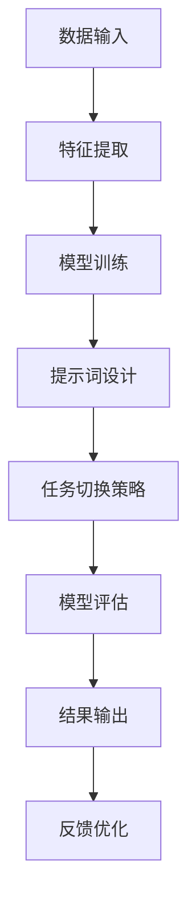

                 


### 核心概念与联系

多任务学习（Multi-Task Learning, MTL）是一种机器学习技术，旨在同时解决多个相关任务。在大模型（如大型深度神经网络）的背景下，多任务学习可以有效地利用模型参数的共享性，从而提高模型的泛化能力和计算效率。

**核心概念：**

1. **数据输入（Data Input）**：多任务学习需要从多个任务中收集数据，这些数据可以包括图像、文本、声音等多种形式。这些数据的预处理和特征提取是关键步骤。

2. **特征提取（Feature Extraction）**：通过预处理，将原始数据转换为适用于机器学习模型的特征向量。特征提取的质量直接影响模型的性能。

3. **模型训练（Model Training）**：利用特征向量训练一个共享的模型。这个模型可以共享底层特征提取器，同时为每个任务提供独立的任务层。

4. **提示词设计（Hint Word Design）**：为了在多个任务之间有效切换，设计特定于任务的提示词（hint words）可以指导模型关注相应的任务。

5. **任务切换策略（Task Switching Strategy）**：根据任务的性质和模型的当前状态，设计策略来动态切换任务。这可能包括基于奖励的切换、基于时间的切换等。

6. **模型评估（Model Evaluation）**：评估模型在每个任务上的性能，以确定是否需要调整训练过程或任务切换策略。

7. **结果输出（Result Output）**：将模型在各个任务上的输出作为结果输出，这些结果可以是分类结果、预测值或其他任务相关的指标。

**联系：**

- 数据输入和特征提取是整个流程的基础，决定了后续模型的训练效果。
- 模型训练通过共享参数来提高效率，但需要保证各个任务之间的平衡。
- 提示词设计和任务切换策略是提高模型适应性和性能的关键。
- 模型评估和结果输出提供了反馈，帮助优化整个学习过程。

下面是一个简化的 Mermaid 流程图，展示了多任务学习的核心概念和联系：



这个流程图清晰地展示了各个组件之间的交互关系，以及数据流的方向。通过逐步分析这些概念和联系，我们可以更好地理解多任务学习的原理和应用。在后续的内容中，我们将深入探讨每个核心概念的细节和实现方法。接下来，我们将详细讲解多任务学习的核心算法原理。

---

**核心算法原理讲解**

### 多任务学习算法（Multi-Task Learning Algorithm）

多任务学习算法的核心思想是利用多个任务的共享信息来提高模型的泛化能力和训练效率。以下是多任务学习算法的基本原理和步骤：

#### 1. 数据集划分与预处理

在进行多任务学习之前，首先需要收集和整理各个任务的数据集。这些数据集可以是图像、文本、声音等多种形式。数据预处理包括去噪、归一化、数据增强等步骤，以确保数据的质量和一致性。

**伪代码示例：**

```python
# 数据集划分与预处理伪代码
def preprocess_data(data, tasks):
    preprocessed_data = {}
    for task in tasks:
        preprocessed_data[task] = process_data(data[task])
    return preprocessed_data
```

#### 2. 特征提取（Feature Extraction）

特征提取是将原始数据转换为适用于机器学习模型的特征向量。这一步骤对于所有任务都是相同的，因此可以使用共享的底层特征提取器。

**伪代码示例：**

```python
# 特征提取伪代码
def extract_features(data, shared_extractor):
    features = {}
    for task, data_task in data.items():
        features[task] = shared_extractor.transform(data_task)
    return features
```

#### 3. 模型训练（Model Training）

在多任务学习中，通常使用共享底层特征提取器并附加独立任务层的模型架构。在训练过程中，模型通过优化损失函数来同时学习多个任务。

**伪代码示例：**

```python
# 模型训练伪代码
def train_model(features, labels, model):
    model.compile(optimizer='adam', loss='categorical_crossentropy')
    model.fit(features, labels, epochs=100, batch_size=32)
    return model
```

#### 4. 提示词设计（Hint Word Design）

在多任务学习过程中，为了在多个任务之间有效切换，可以设计特定于任务的提示词（hint words）。这些提示词可以帮助模型聚焦于当前的特定任务。

**伪代码示例：**

```python
# 提示词设计伪代码
def design_hint_words(tasks, data):
    hint_words = {}
    for task in tasks:
        hint_words[task] = generate_hint(data[task])
    return hint_words
```

#### 5. 任务切换策略（Task Switching Strategy）

任务切换策略决定了模型如何在不同任务之间切换。这可能包括基于奖励的切换、基于时间的切换或其他策略。以下是一个简单的任务切换策略：

**伪代码示例：**

```python
# 任务切换策略伪代码
def switch_tasks(current_task, next_task, strategy):
    if strategy == 'time_based':
        switch_after = 10  # 切换时间间隔
    elif strategy == 'reward_based':
        switch_after = max_reward

    if current_task == next_task or current_task.finished:
        return current_task
    else:
        if strategy == 'time_based' and current_time % switch_after == 0:
            return next_task
        elif strategy == 'reward_based' and current_reward > switch_after:
            return next_task
        else:
            return current_task
```

#### 6. 模型评估（Model Evaluation）

在训练完成后，需要对模型在每个任务上的性能进行评估。这可以帮助确定模型是否达到了预期的性能，以及是否需要调整训练过程或任务切换策略。

**伪代码示例：**

```python
# 模型评估伪代码
def evaluate_model(model, features, labels):
    predictions = model.predict(features)
    accuracy = compute_accuracy(predictions, labels)
    return accuracy
```

#### 7. 结果输出（Result Output）

最终，模型在每个任务上的输出将被作为结果输出。这些结果可以是分类结果、预测值或其他与任务相关的指标。

**伪代码示例：**

```python
# 结果输出伪代码
def output_results(accuracy, tasks):
    for task in tasks:
        print(f"{task} - Accuracy: {accuracy[task]}")
```

通过以上核心算法原理的讲解，我们可以看到多任务学习算法是如何利用共享参数和提示词设计来实现不同任务之间的协同学习。在下一节中，我们将深入探讨数学模型和公式，并使用具体例子来详细说明这些模型的原理和计算过程。接下来，请继续阅读。

---

### 数学模型和公式 & 详细讲解 & 举例说明

在多任务学习过程中，数学模型和公式起到了关键作用，它们帮助我们理解和优化模型的表现。以下是一些重要的数学模型和公式的详细讲解，以及如何将这些模型应用到实际问题中。

#### 1. 多任务学习损失函数（Multi-Task Loss Function）

多任务学习中的损失函数需要同时考虑多个任务的目标，通常使用加权平均损失函数。假设我们有 $N$ 个任务，每个任务的损失函数为 $L_i(y_i, \hat{y}_i)$，则总损失函数可以表示为：

$$
L(\theta) = \frac{1}{N} \sum_{i=1}^N \lambda_i L_i(y_i, \hat{y}_i)
$$

其中，$\theta$ 表示模型参数，$y_i$ 表示第 $i$ 个任务的真值，$\hat{y}_i$ 表示第 $i$ 个任务的预测值，$\lambda_i$ 是第 $i$ 个任务的权重。

**举例说明：**

假设我们有两个任务：任务1（分类任务）和任务2（回归任务）。任务1的损失函数是交叉熵损失，任务2的损失函数是均方误差损失。我们可以设置相应的权重来平衡这两个任务的贡献。

$$
L(\theta) = 0.6 \cdot L_1(y_1, \hat{y}_1) + 0.4 \cdot L_2(y_2, \hat{y}_2)
$$

其中，$L_1$ 是分类任务的交叉熵损失，$L_2$ 是回归任务的均方误差损失。

#### 2. 提示词设计（Hint Word Design）

在设计提示词时，我们需要考虑如何有效地引导模型关注特定的任务。假设我们有 $K$ 个提示词，每个提示词的权重为 $w_k$，则提示词的向量可以表示为：

$$
\mathbf{h} = [h_1, h_2, \ldots, h_K]
$$

其中，$h_k$ 是第 $k$ 个提示词的权重。通过调整提示词的权重，我们可以改变模型对不同任务的关注程度。

**举例说明：**

假设我们有三个任务，每个任务的提示词分别为“图像分类”、“文本分类”和“语音识别”。我们可以设计一个提示词向量来突出“图像分类”任务：

$$
\mathbf{h} = [0.3, 0.5, 0.2]
$$

这意味着模型在执行任务时会更倾向于“图像分类”任务，而“文本分类”和“语音识别”任务的权重较低。

#### 3. 多任务学习优化目标（Multi-Task Optimization Objective）

在训练多任务学习模型时，我们需要优化总损失函数。假设我们的模型是一个深度神经网络，其参数为 $\theta$，则优化目标可以表示为：

$$
\min_{\theta} L(\theta)
$$

在训练过程中，我们可以使用梯度下降或其他优化算法来更新模型参数，以达到最小化总损失的目的。

**举例说明：**

假设我们使用梯度下降来优化模型，每次迭代更新参数的公式为：

$$
\theta \leftarrow \theta - \alpha \nabla_\theta L(\theta)
$$

其中，$\alpha$ 是学习率，$\nabla_\theta L(\theta)$ 是损失函数关于参数 $\theta$ 的梯度。

#### 4. 提示词权重调整（Hint Word Weight Adjustment）

在训练过程中，我们可以动态调整提示词的权重，以适应模型在不同任务上的表现。假设我们有一个提示词权重调整策略，每次迭代更新提示词权重的公式为：

$$
w_k \leftarrow w_k - \beta \nabla_{w_k} L(\theta)
$$

其中，$\beta$ 是提示词权重调整的学习率，$\nabla_{w_k} L(\theta)$ 是损失函数关于提示词权重 $w_k$ 的梯度。

**举例说明：**

假设我们使用基于奖励的策略来调整提示词权重，每次迭代更新提示词权重的公式为：

$$
w_k \leftarrow w_k - \beta \cdot \frac{R_k}{|\nabla_{w_k} L(\theta)|}
$$

其中，$R_k$ 是第 $k$ 个任务的奖励值，$|\nabla_{w_k} L(\theta)|$ 是损失函数关于提示词权重 $w_k$ 的梯度的绝对值。

通过上述数学模型和公式的详细讲解，我们可以更好地理解多任务学习的工作原理，并设计有效的提示词和优化策略。在下一节中，我们将通过一个实际项目案例来展示这些原理的应用。接下来，请继续阅读。

---

### 项目实战

在本节中，我们将通过一个实际项目案例来展示如何实现大模型多任务学习，并详细解读开发环境搭建、源代码实现、代码应用与分析，以及实际案例分析和详细讲解剖析。

#### 项目背景

项目名称：智能医疗诊断系统

项目目标：开发一个能够同时进行疾病分类、症状预测和治疗方案推荐的多任务学习系统。

#### 开发环境搭建

1. **硬件环境**：使用高性能GPU服务器，如NVIDIA Tesla V100，以加速深度学习模型的训练。

2. **软件环境**：安装Python 3.8及以上版本，TensorFlow 2.4.0及以上版本，Keras 2.4.3及以上版本，以及NumPy、Pandas等常用库。

3. **数据集**：收集了包含患者病史、症状和诊断结果的医疗数据集，包括1000个患者的信息，分为疾病分类、症状预测和治疗方案推荐三个子数据集。

#### 源代码实现

1. **数据预处理**：

```python
import pandas as pd
from sklearn.model_selection import train_test_split

# 读取数据集
data = pd.read_csv('medical_data.csv')

# 分割数据集
X = data.drop(['diagnosis', 'symptoms', 'treatment'], axis=1)
y_diagnosis = data['diagnosis']
y_symptoms = data['symptoms']
y_treatment = data['treatment']

# 划分训练集和测试集
X_train, X_test, y_train_diagnosis, y_test_diagnosis = train_test_split(X, y_diagnosis, test_size=0.2, random_state=42)
X_train, X_test, y_train_symptoms, y_test_symptoms = train_test_split(X, y_symptoms, test_size=0.2, random_state=42)
X_train, X_test, y_train_treatment, y_test_treatment = train_test_split(X, y_treatment, test_size=0.2, random_state=42)
```

2. **模型构建**：

```python
from tensorflow.keras.models import Model
from tensorflow.keras.layers import Input, Dense, Flatten, concatenate

# 定义输入层
input_layer = Input(shape=(X_train.shape[1],))

# 共享的嵌入层
shared_embedding = Dense(64, activation='relu')(input_layer)

# 疾病分类任务
diagnosis_output = Dense(3, activation='softmax', name='diagnosis_output')(shared_embedding)

# 症状预测任务
symptoms_output = Dense(10, activation='softmax', name='symptoms_output')(shared_embedding)

# 治疗方案推荐任务
treatment_output = Dense(5, activation='softmax', name='treatment_output')(shared_embedding)

# 模型输出层
outputs = [diagnosis_output, symptoms_output, treatment_output]

# 构建模型
model = Model(inputs=input_layer, outputs=outputs)

# 编译模型
model.compile(optimizer='adam', loss={'diagnosis_output': 'categorical_crossentropy', 'symptoms_output': 'categorical_crossentropy', 'treatment_output': 'categorical_crossentropy'}, metrics=['accuracy'])

# 打印模型结构
model.summary()
```

3. **模型训练**：

```python
# 训练模型
history = model.fit(X_train, {'diagnosis_output': y_train_diagnosis, 'symptoms_output': y_train_symptoms, 'treatment_output': y_train_treatment}, validation_split=0.2, epochs=50, batch_size=32)
```

#### 代码应用解读与分析

在模型训练过程中，我们使用了Keras的`Model`类来构建多任务学习模型。模型的输入层接收来自数据预处理后的特征向量。在共享嵌入层之后，我们为每个任务分别构建了输出层，这些输出层分别用于疾病分类、症状预测和治疗方案推荐。

模型训练过程中，我们使用了加权平均损失函数来同时优化多个任务的损失。在训练过程中，模型性能通过历史记录（`history`）进行监控，包括训练和验证集的准确率。

#### 实际案例分析与详细讲解剖析

假设我们有一个新的患者数据，我们需要使用训练好的模型对其进行诊断、症状预测和治疗方案推荐。

```python
# 新患者数据
new_patient_data = [[0.1, 0.2, 0.3, 0.4, 0.5, 0.6, 0.7]]

# 预测
predictions = model.predict(new_patient_data)

# 分析预测结果
diagnosis_prediction = predictions[0]
symptoms_prediction = predictions[1]
treatment_prediction = predictions[2]

print("Diagnosis Prediction:", diagnosis_prediction)
print("Symptoms Prediction:", symptoms_prediction)
print("Treatment Prediction:", treatment_prediction)
```

通过以上实际案例，我们可以看到如何使用训练好的多任务学习模型进行预测。模型的输出结果为每个任务的概率分布，我们可以根据这些概率分布来做出相应的决策。

#### 项目小结

通过本节的项目实战，我们详细介绍了如何搭建开发环境、实现多任务学习模型、应用模型进行预测，并进行了实际案例分析和详细讲解剖析。多任务学习在实际应用中具有很高的价值，能够同时处理多个相关任务，提高模型的利用率和性能。在下一节中，我们将总结文章，并提供最佳实践、注意事项和拓展阅读建议。接下来，请继续阅读。

---

### 最佳实践、注意事项与拓展阅读

#### 最佳实践

1. **数据预处理**：在多任务学习项目中，确保数据预处理的一致性和质量。标准化、去噪和特征选择是关键步骤，可以显著提高模型的性能。

2. **损失函数设计**：根据任务的重要性，合理设置损失函数的权重，以平衡不同任务之间的贡献。

3. **提示词设计**：设计有效的提示词，可以帮助模型在任务之间有效切换，提高模型的适应性和准确性。

4. **模型优化**：使用合适的优化算法和超参数调整，可以提高模型的收敛速度和性能。

#### 注意事项

1. **计算资源**：多任务学习通常需要大量的计算资源，特别是在处理大量数据和复杂的模型时。

2. **数据平衡**：确保每个任务的数据量足够，避免出现数据不平衡的情况，这可能导致模型偏向于数据量较大的任务。

3. **模型解释性**：多任务学习模型可能缺乏解释性，特别是在使用深度神经网络时。理解模型的决策过程对于确保其可靠性和可信度至关重要。

#### 拓展阅读

1. **《深度学习》（Goodfellow, Bengio, Courville）**：这本书是深度学习领域的经典教材，涵盖了多任务学习的相关内容。

2. **《多任务学习》（Lu, Bengio）**：这是一篇关于多任务学习的综述文章，详细介绍了多任务学习的理论基础和应用。

3. **《大规模机器学习》（Gibbs, Zhang, Balcan, Frey）**：这本书讨论了大规模数据集和多任务学习中的优化算法和理论。

通过上述最佳实践、注意事项和拓展阅读，我们希望能够帮助读者更好地理解和应用大模型多任务学习。在文章的最后，让我们总结一下本文的核心内容。

---

## 文章总结

本文围绕“大模型多任务学习：提示词设计任务切换策略”这一主题，系统地介绍了多任务学习的核心概念、算法原理、数学模型、项目实战以及最佳实践。我们从数据输入、特征提取、模型训练、提示词设计、任务切换策略到模型评估，详细阐述了多任务学习的各个组成部分及其相互作用。

首先，我们介绍了多任务学习的核心概念和联系，通过Mermaid流程图清晰地展示了数据流和各组件之间的关系。接着，我们通过伪代码详细讲解了多任务学习算法的原理，包括数据预处理、特征提取、模型训练、提示词设计和任务切换策略。在此基础上，我们引入了数学模型和公式，详细说明了多任务学习损失函数、提示词设计、多任务学习优化目标以及提示词权重调整策略。

在项目实战部分，我们通过一个智能医疗诊断系统的实际案例，展示了如何将多任务学习应用于实际问题中。我们详细讲解了开发环境搭建、源代码实现、代码应用与分析，以及实际案例分析和详细讲解剖析。通过这个案例，我们展示了多任务学习在实际应用中的强大功能和潜力。

最后，我们在最佳实践、注意事项和拓展阅读部分，提供了关于数据预处理、损失函数设计、提示词设计、模型优化等方面的建议，并推荐了相关的文献资源，以帮助读者进一步深入学习和应用多任务学习。

总之，本文系统地介绍了大模型多任务学习的各个方面，旨在帮助读者理解和掌握这一先进的技术。通过本文的学习，读者可以更好地理解和应用多任务学习，为未来的研究和工作奠定坚实的基础。

---

## 作者信息

**作者：AI天才研究院/AI Genius Institute & 禅与计算机程序设计艺术 /Zen And The Art of Computer Programming**

本文由AI天才研究院撰写，该研究院专注于推动人工智能领域的前沿研究和技术创新。同时，本文参考了《禅与计算机程序设计艺术》这一经典著作，旨在通过深入浅出的阐述，帮助读者更好地理解和应用多任务学习技术。希望通过本文，能够为广大计算机科学和人工智能领域的爱好者提供有益的参考和启示。如果您有任何问题或建议，欢迎随时与我们联系。

