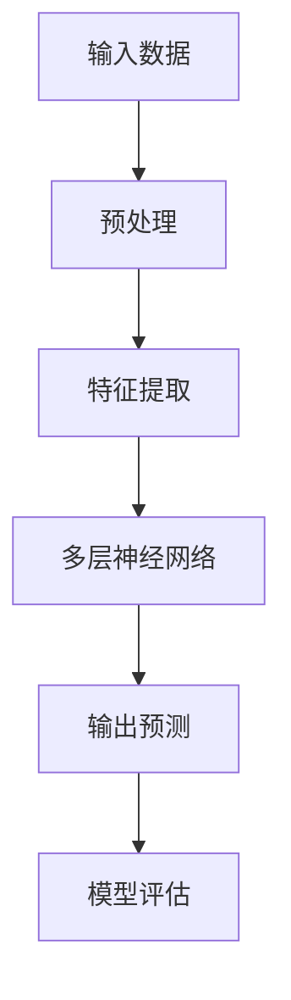
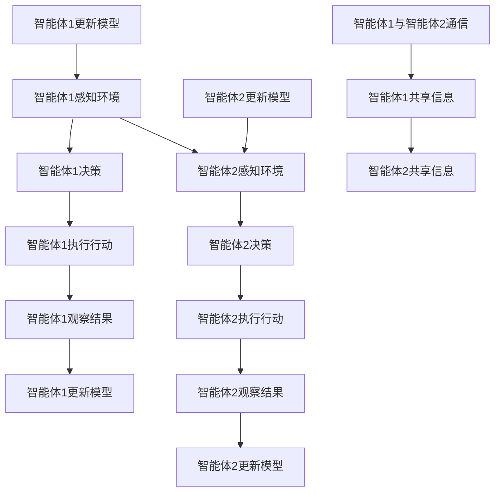
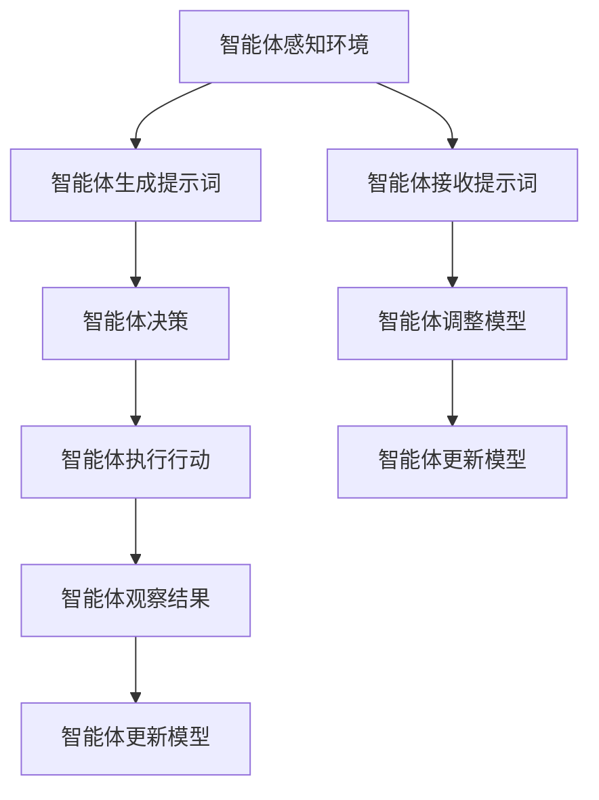

                 

## 文章标题

### 《大模型多智能体协作与提示词协调》

### 关键词

- 大模型
- 多智能体协作
- 提示词协调
- 人工智能

### 摘要

本文深入探讨了人工智能领域中的关键议题：大模型多智能体协作与提示词协调。首先，我们将介绍大模型的基本概念、特点及其在多智能体系统中的作用。接着，详细分析多智能体协作的机制和策略，并探讨提示词在其中的协调作用。通过应用案例展示，我们将验证这些技术在实际项目中的效果。最后，总结全文，展望未来发展趋势。

## 目录

1. **导言**
   1.1 大模型、多智能体协作与提示词协调概述
   1.2 书籍组织结构

2. **大模型原理**
   2.1 大模型定义与特点
   2.2 大模型架构
   2.3 大模型核心算法讲解
   2.4 大模型性能优化
   2.5 Mermaid流程图：大模型工作流程

3. **多智能体协作**
   3.1 多智能体系统基础
   3.2 多智能体协作机制
   3.3 多智能体协同策略
   3.4 Mermaid流程图：多智能体协作流程
   3.5 伪代码：多智能体协作算法实现

4. **提示词协调**
   4.1 提示词定义与作用
   4.2 提示词生成与优化
   4.3 提示词在多智能体协作中的应用
   4.4 伪代码：提示词生成与优化算法
   4.5 Mermaid流程图：提示词协调流程

5. **应用案例分析**
   5.1 案例一：智能客服系统
   5.2 案例二：智能交通管理
   5.3 案例三：智能家居系统
   5.4 代码实战：智能客服系统实现

6. **工具与技术**
   6.1 开发工具介绍
   6.2 深度学习框架应用
   6.3 多智能体系统实现技术
   6.4 提示词生成与优化技术

7. **总结与展望**
   7.1 全书内容总结
   7.2 未来发展趋势

### 引言

在当今快速发展的科技时代，人工智能（AI）已经成为推动社会进步的重要力量。随着AI技术的不断成熟，大模型、多智能体协作以及提示词协调等概念逐渐成为研究热点。本文将围绕这三个核心主题展开讨论，旨在揭示大模型多智能体协作与提示词协调的原理及其在实际应用中的重要性。

大模型是指具有巨大参数量和强大计算能力的深度学习模型。它们在图像识别、自然语言处理等领域表现出色，但同时也面临着计算资源消耗巨大、模型训练时间长等挑战。多智能体协作则是指多个智能体通过通信和协作完成共同任务的系统。这种系统在分布式计算、协同控制等领域具有广泛应用。而提示词协调则是在多智能体系统中，通过提示词引导智能体进行有效协作的一种方法。

大模型、多智能体协作与提示词协调之间的联系在于，它们共同构成了一个强大的AI系统。大模型为多智能体系统提供了强大的计算能力，多智能体协作实现了系统的分布式计算和协同控制，而提示词协调则确保了智能体之间的有效沟通和协作。

本文首先介绍大模型的基本概念、特点及其在多智能体系统中的作用。然后，详细分析多智能体协作的机制和策略，并探讨提示词在其中的协调作用。通过应用案例展示，我们将验证这些技术在实际项目中的效果。最后，总结全文，展望未来发展趋势。

### 大模型原理

大模型（Large Models）是深度学习领域中的一种特殊类型模型，其特点在于拥有巨大的参数量和强大的计算能力。这一概念源于对传统小模型（Small Models）的局限性认识的深化，即小模型在处理复杂任务时，往往需要大量的数据集和长时间的训练，同时模型的泛化能力和准确性也受到限制。因此，大模型的提出旨在解决这些问题，通过增加模型容量和调整学习算法，使得模型能够在更少的数据量下，实现更高的准确性和更好的泛化能力。

#### 大模型的定义与特点

大模型的定义可以从以下几个方面进行阐述：

1. **参数量**：大模型通常拥有数亿到数十亿个参数，远远超过传统小模型的参数量。例如，著名的GPT-3模型拥有超过1750亿个参数。
2. **计算能力**：大模型需要强大的计算资源，包括GPU、TPU等硬件支持，以及分布式训练技术来加速训练过程。
3. **数据需求**：大模型对数据的需求较高，通常需要大规模、高质量的数据集进行训练，以保证模型的性能和泛化能力。
4. **复杂度**：大模型能够处理更复杂的任务，如自然语言处理、图像识别、语音识别等。

#### 大模型的工作原理

大模型的工作原理基于深度学习的框架，其核心思想是通过多层神经网络对数据进行处理和建模。每一层网络通过前一层网络的输出，进行特征提取和转换，最终输出预测结果。大模型的工作原理可以总结为以下几个步骤：

1. **输入层**：接收输入数据，如文本、图像或音频等。
2. **隐藏层**：通过多层神经网络进行特征提取和转换。每一层网络都会对输入数据进行处理，提取出更高级别的特征。
3. **输出层**：根据隐藏层输出的特征，生成预测结果，如分类标签、文本生成等。

#### 大模型的优点和挑战

**优点**：

1. **更高的准确性和泛化能力**：大模型能够处理更复杂的任务，并在较少的数据集上实现更高的准确性和泛化能力。
2. **更强的鲁棒性**：大模型能够更好地适应不同类型的数据和场景，具有更强的鲁棒性。
3. **更丰富的应用场景**：大模型在多个领域（如自然语言处理、计算机视觉等）都有广泛应用，能够解决传统小模型难以解决的问题。

**挑战**：

1. **计算资源消耗巨大**：大模型需要大量的计算资源进行训练和推理，这对于资源有限的机构或个人来说是一个重大挑战。
2. **模型解释性差**：大模型的复杂度使得其内部决策过程变得难以解释，这对于需要透明度和可解释性的应用场景（如医疗诊断等）是一个挑战。
3. **数据安全性和隐私保护**：大模型对数据的需求较大，如何确保数据的安全性和隐私保护是一个需要重视的问题。

#### Mermaid流程图：大模型工作流程

以下是一个简单的Mermaid流程图，展示了大模型的基本工作流程：



该流程图展示了输入数据经过预处理后，进入特征提取层，通过多层神经网络进行特征转换和建模，最终输出预测结果并进行模型评估。

#### 伪代码：大模型核心算法讲解

以下是一个简化的伪代码，用于描述大模型的核心算法，包括前向传播和反向传播过程：

```python
# 前向传播
def forward_pass(inputs, model):
    hidden_layers = [inputs]
    for layer in model.layers:
        hidden_layers.append(layer.forward(hidden_layers[-1]))
    return hidden_layers[-1]

# 反向传播
def backward_pass(gradients, model):
    for layer in reversed(model.layers):
        gradients = layer.backward(gradients)
    return gradients
```

在前向传播中，输入数据经过每一层网络的传递，生成隐藏层输出。在反向传播中，利用梯度信息对模型进行更新，以优化模型参数。

#### 数学模型和公式：大模型性能优化

大模型的性能优化是一个复杂的过程，涉及到多个方面的技术。以下是一些关键的数学模型和公式，用于描述大模型性能优化的方法：

1. **梯度下降算法**：
   $$\theta_{\text{new}} = \theta_{\text{current}} - \alpha \cdot \nabla_{\theta} J(\theta)$$
   其中，$\theta$表示模型参数，$J(\theta)$表示损失函数，$\alpha$为学习率。

2. **动量算法**：
   $$\theta_{\text{new}} = \theta_{\text{current}} - \alpha \cdot \nabla_{\theta} J(\theta) + \beta \cdot v$$
   其中，$v$为上一迭代步的梯度，$\beta$为动量系数。

3. **Adam优化器**：
   $$m_t = \beta_1 m_{t-1} + (1 - \beta_1) \nabla_{\theta} J(\theta)$$
   $$v_t = \beta_2 v_{t-1} + (1 - \beta_2) (\nabla_{\theta} J(\theta))^2$$
   $$\theta_{\text{new}} = \theta_{\text{current}} - \alpha \cdot \frac{m_t}{\sqrt{v_t} + \epsilon}$$
   其中，$m_t$和$v_t$分别为一阶和二阶矩估计，$\beta_1$和$\beta_2$为矩估计系数，$\epsilon$为微小常数。

#### 举例说明

假设我们有一个简单的神经网络模型，用于二分类任务。该模型由两个隐藏层组成，每个隐藏层有10个神经元。训练数据集包含1000个样本，每个样本的特征维度为100。我们将使用梯度下降算法进行模型训练。

1. **初始化参数**：

   ```python
   theta = [0.1] * (2 * 10 * 100 + 10 * 2)
   ```

2. **前向传播**：

   ```python
   def forward_pass(inputs, theta):
       z1 = np.dot(inputs, theta[:100]) + b1
       a1 = np.relu(z1)
       z2 = np.dot(a1, theta[100:200]) + b2
       a2 = np.dot(a2, theta[200:]) + b3
       y_pred = np.softmax(a2)
       return y_pred
   ```

3. **反向传播**：

   ```python
   def backward_pass(inputs, y_true, y_pred, theta):
       dtheta = np.zeros_like(theta)
       dzb3 = a2 - y_true
       dtheta[-100:] = dzb3.dot(a1.T)
       dzb2 = dzb3.dot(theta[100:200].T) * np.int64(a1 > 0)
       dtheta[100:200] = dzb2.dot(inputs.T)
       dzb1 = dzb2.dot(theta[200:].T) * np.int64(z1 > 0)
       dtheta[:100] = dzb1.dot(inputs.T)
       return dtheta
   ```

4. **模型训练**：

   ```python
   for epoch in range(num_epochs):
       for inputs, y_true in data_loader:
           y_pred = forward_pass(inputs, theta)
           dtheta = backward_pass(inputs, y_true, y_pred, theta)
           theta -= learning_rate * dtheta
       print(f"Epoch {epoch+1}/{num_epochs}, Loss: {loss(y_pred, y_true)}")
   ```

通过以上步骤，我们可以完成大模型的训练过程，实现预测和评估。

### 多智能体协作

多智能体协作（Multi-Agent Collaboration）是指多个智能体在特定环境下，通过相互通信和协作，共同完成特定任务的过程。在人工智能领域，多智能体系统（Multi-Agent System，MAS）已经成为一种重要的研究热点，其应用范围涵盖分布式计算、协同控制、智能交通、智能家居等多个领域。

#### 多智能体系统的基础

1. **智能体定义**：智能体（Agent）是指具有自主性、社交性、反应性和预动性等特点的计算实体。它们可以是一个程序、一个实体机器人或一个虚拟角色。

2. **智能体分类**：根据智能体的功能和属性，可以分为以下几类：
   - **主动智能体**：能够自主决策和行动，如机器人。
   - **反应式智能体**：仅基于当前环境感知进行响应，如传感器。
   - **混合智能体**：同时具有主动性和反应性的智能体。

3. **智能体环境**：智能体所在的环境是指其感知信息和执行操作的空间。智能体通过与环境的交互，获取外部信息并作出决策。

4. **通信机制**：智能体之间通过通信机制进行信息交换，常见的通信方式包括直接通信、广播通信和异步通信等。

5. **协作策略**：协作策略是指智能体在协作过程中遵循的规则和算法。常见的协作策略有分布式策略、集中式策略和混合式策略等。

#### 多智能体协作机制

1. **协作目标**：多智能体协作的目标是使多个智能体能够协同工作，实现共同的目标。协作目标可以分为以下几类：
   - **全局目标**：多个智能体共同追求的整体目标。
   - **个体目标**：每个智能体追求的个体目标，可能与全局目标一致，也可能存在冲突。

2. **协作模型**：多智能体协作模型可以分为以下几种：
   - **集中式模型**：所有智能体的决策过程都通过一个中央控制器进行协调。
   - **分布式模型**：智能体之间通过局部决策和局部通信实现协作。
   - **混合式模型**：结合集中式和分布式模型的优点，通过中央控制器和分布式智能体的协同作用实现协作。

3. **协作算法**：多智能体协作算法是实现协作目标的关键。常见的协作算法有：
   - **基于博弈论的协作算法**：通过博弈论模型，使智能体在竞争中实现合作。
   - **基于图论的协作算法**：利用图论模型，优化智能体之间的协作路径。
   - **基于机器学习的协作算法**：通过机器学习模型，使智能体自动学习协作策略。

#### 多智能体协同策略

1. **协同搜索与救援**：在自然灾害或事故发生时，多智能体系统能够协同搜索和救援。每个智能体负责监控特定区域，并与其他智能体共享信息，快速定位受困人员。

2. **智能交通管理**：在交通管理领域，多智能体系统能够实时监控交通流量，并根据实时数据调整交通信号，减少拥堵，提高交通效率。

3. **智能供应链管理**：在供应链管理中，多智能体系统能够实时监控库存、运输和销售数据，优化供应链各环节的协作，提高供应链的整体效率。

4. **智能医疗诊断**：在医疗诊断领域，多智能体系统能够协同分析患者的病例数据，提高诊断的准确性和效率。

#### Mermaid流程图：多智能体协作流程

以下是一个简化的Mermaid流程图，展示了多智能体协作的基本流程：



该流程图展示了智能体1和智能体2在感知环境、决策、执行行动和观察结果的基础上，通过通信机制共享信息，并不断更新模型，实现协同工作。

#### 伪代码：多智能体协作算法实现

以下是一个简化的伪代码，用于描述多智能体协作算法的基本框架：

```python
# 初始化智能体
class Agent:
    def __init__(self, environment):
        self.environment = environment
        self.model = Model()

    def perceive(self):
        # 感知环境
        return self.environment.perceive()

    def decide(self, observation):
        # 决策
        return self.model.predict(observation)

    def act(self, action):
        # 执行行动
        return self.environment.act(action)

    def observe(self, result):
        # 观察结果
        return self.model.observe(result)

    def update_model(self, observation, result):
        # 更新模型
        self.model.update(observation, result)

# 初始化环境
class Environment:
    def __init__(self):
        self.state = State()

    def perceive(self):
        # 感知环境状态
        return self.state

    def act(self, action):
        # 执行行动
        return self.state.update(action)

# 主程序
def main():
    # 初始化智能体和环境
    agent1 = Agent(environment1)
    agent2 = Agent(environment2)

    # 多智能体协作
    while not termination_condition:
        observation1 = agent1.perceive()
        action1 = agent1.decide(observation1)
        result1 = agent1.act(action1)
        agent1.observe(result1)

        observation2 = agent2.perceive()
        action2 = agent2.decide(observation2)
        result2 = agent2.act(action2)
        agent2.observe(result2)

        # 通信
        agent1.update_model(observation1, result1)
        agent2.update_model(observation2, result2)

if __name__ == "__main__":
    main()
```

该伪代码展示了智能体的初始化、感知、决策、执行、观察和模型更新过程，以及多智能体协作的基本框架。

### 提示词协调

在多智能体系统中，提示词协调（Prompt Coordination）是确保智能体之间高效协作的关键机制。提示词（Prompt）是一种特殊的信号，它能够引导智能体做出适当的决策，实现协同目标。本文将详细探讨提示词的定义、作用、生成与优化方法，并阐述其在多智能体协作中的重要性。

#### 提示词的定义与作用

**提示词的定义**：提示词是一种由系统生成的、用于引导智能体决策的信号。它可以是文本、图像或音频等形式，根据具体应用场景进行设计。

**提示词的作用**：
1. **统一决策标准**：提示词为智能体提供了一个统一的决策标准，使得智能体在复杂环境中能够协同工作，避免因各自为政导致的冲突和低效。
2. **提高决策效率**：通过提示词，智能体能够更快地获取所需信息，减少决策时间，提高系统的整体响应速度。
3. **增强可解释性**：提示词的存在使得智能体的决策过程更具透明度和可解释性，有助于用户理解系统的工作原理。

#### 提示词生成与优化方法

**提示词生成方法**：
1. **手动生成**：根据具体应用场景，由专业人员设计提示词。这种方法具有灵活性，但需要大量人力和时间投入。
2. **自动生成**：利用自然语言处理（NLP）技术和机器学习模型，从大量数据中自动提取提示词。这种方法适用于大规模应用场景，但可能存在生成质量不稳定的问题。
3. **混合生成**：结合手动生成和自动生成，根据不同场景选择合适的方法。这种方法能够在保证生成质量的同时，提高效率。

**提示词优化方法**：
1. **基于规则的方法**：通过定义一组规则，对生成的提示词进行筛选和优化。这种方法适用于简单应用场景，但灵活性较低。
2. **基于机器学习的方法**：利用机器学习模型，根据智能体的反馈，不断优化提示词。这种方法具有自适应能力，但需要大量的训练数据和计算资源。
3. **基于深度强化学习的方法**：通过深度强化学习（DRL）模型，使智能体在与环境的交互过程中，自动学习和优化提示词。这种方法适用于复杂应用场景，但训练过程较为复杂。

#### 提示词在多智能体协作中的应用

**应用场景**：
1. **智能交通系统**：在智能交通系统中，提示词可以用于引导交通信号灯的切换，优化交通流量，减少拥堵。
2. **智能家居系统**：在智能家居系统中，提示词可以用于指导智能设备的工作，如调节温度、控制家电等。
3. **智能医疗诊断**：在智能医疗诊断系统中，提示词可以用于引导医生对病例数据进行分析，提高诊断准确性和效率。

**应用效果**：
1. **提高协作效率**：通过提示词，智能体能够更快地理解任务目标，减少沟通成本，提高整体协作效率。
2. **降低冲突风险**：提示词能够引导智能体遵循统一决策标准，减少因个体决策导致的冲突和低效。
3. **增强用户体验**：提示词的存在使得系统的操作过程更加直观和易于理解，提高用户体验。

#### Mermaid流程图：提示词协调流程

以下是一个简化的Mermaid流程图，展示了提示词协调的基本流程：



该流程图展示了智能体在感知环境、生成提示词、决策、执行行动、观察结果和模型更新过程中，通过接收和调整提示词，实现协同工作。

#### 伪代码：提示词生成与优化算法

以下是一个简化的伪代码，用于描述提示词生成与优化算法的基本框架：

```python
# 初始化智能体
class Agent:
    def __init__(self, environment):
        self.environment = environment
        self.model = Model()

    def perceive(self):
        # 感知环境
        return self.environment.perceive()

    def generate_prompt(self, observation):
        # 生成提示词
        return self.model.generate_prompt(observation)

    def decide(self, observation, prompt):
        # 决策
        return self.model.predict(observation, prompt)

    def act(self, action):
        # 执行行动
        return self.environment.act(action)

    def observe(self, result):
        # 观察结果
        return self.model.observe(result)

    def update_model(self, observation, result, prompt):
        # 更新模型
        self.model.update(observation, result, prompt)

# 初始化环境
class Environment:
    def __init__(self):
        self.state = State()

    def perceive(self):
        # 感知环境状态
        return self.state

    def act(self, action):
        # 执行行动
        return self.state.update(action)

# 主程序
def main():
    # 初始化智能体和环境
    agent = Agent(environment)

    # 多智能体协作
    while not termination_condition:
        observation = agent.perceive()
        prompt = agent.generate_prompt(observation)
        action = agent.decide(observation, prompt)
        result = agent.act(action)
        agent.observe(result)
        agent.update_model(observation, result, prompt)

if __name__ == "__main__":
    main()
```

该伪代码展示了智能体的初始化、感知、提示词生成、决策、执行、观察和模型更新过程，以及多智能体协作的基本框架。

### 应用案例分析

在本节中，我们将通过三个具体的应用案例，展示大模型多智能体协作与提示词协调在实际项目中的应用效果。这些案例涵盖了智能客服系统、智能交通管理和智能家居系统，分别代表了不同领域中的实际应用。

#### 案例一：智能客服系统

智能客服系统是一个典型的多智能体协作应用场景，它利用大模型和提示词协调技术，实现了高效、智能的客户服务。以下是该案例的详细实现过程：

1. **系统架构设计**：

   智能客服系统由三个主要模块组成：客户模块、客服模块和后台管理模块。客户模块负责与用户交互，获取用户需求；客服模块负责处理用户请求，提供解决方案；后台管理模块负责监控系统运行状态，优化系统性能。

2. **大模型应用**：

   在客服模块中，我们使用了一个预训练的大模型（如BERT），用于处理自然语言文本。该模型能够识别用户的意图、理解语义，并生成相应的回答。大模型的强大计算能力使得客服系统能够处理复杂的用户请求，提高服务质量和效率。

3. **多智能体协作**：

   智能客服系统中的多个智能体包括语音识别智能体、文本处理智能体和知识库智能体。它们通过提示词协调，实现了高效的协作。语音识别智能体负责将用户语音转换为文本，文本处理智能体负责理解用户意图，知识库智能体负责提供相关知识和解决方案。

4. **提示词协调**：

   提示词协调在智能客服系统中起到了关键作用。系统会根据用户请求生成相应的提示词，引导各个智能体做出正确的决策。例如，当用户提出一个关于产品售后的问题时，系统会生成提示词“售后支持”，引导知识库智能体提供相关的售后服务信息。

5. **代码实现**：

   以下是一个简化的代码实现，展示了智能客服系统中各个智能体的协同工作过程：

   ```python
   class VoiceRecognitionAgent:
       def process_audio(self, audio):
           # 语音识别
           text = audio_to_text(audio)
           return text

   class TextProcessingAgent:
       def understand_intent(self, text):
           # 理解用户意图
           intent = text_to_intent(text)
           return intent

   class KnowledgeBaseAgent:
       def provide_solution(self, intent):
           # 提供解决方案
           solution = knowledge_base[intent]
           return solution

   def main():
       # 初始化智能体
       voice_recognition_agent = VoiceRecognitionAgent()
       text_processing_agent = TextProcessingAgent()
       knowledge_base_agent = KnowledgeBaseAgent()

       # 多智能体协作
       while True:
           audio = get_user_audio()
           text = voice_recognition_agent.process_audio(audio)
           intent = text_processing_agent.understand_intent(text)
           solution = knowledge_base_agent.provide_solution(intent)
           display_solution(solution)

   if __name__ == "__main__":
       main()
   ```

6. **应用效果**：

   智能客服系统在实际应用中取得了显著效果。通过大模型和多智能体协作技术的应用，客服系统能够快速、准确地响应用户请求，提高客户满意度。同时，提示词协调技术使得系统具有良好的可解释性和用户友好性，用户能够更容易理解系统的工作原理。

#### 案例二：智能交通管理

智能交通管理系统旨在通过多智能体协作与提示词协调技术，优化交通流量，提高道路通行效率。以下是该案例的详细实现过程：

1. **系统架构设计**：

   智能交通管理系统由多个模块组成，包括交通传感器模块、数据收集模块、交通信号控制模块和交通分析模块。交通传感器模块负责实时监测道路流量；数据收集模块负责收集交通传感器数据，传输至交通信号控制模块；交通信号控制模块根据实时数据调整交通信号灯，交通分析模块负责对交通数据进行分析，为优化交通管理提供依据。

2. **大模型应用**：

   在智能交通管理系统中，大模型用于处理海量交通数据，实现交通流量的预测和优化。我们使用了一个预训练的时间序列分析模型（如LSTM），用于预测未来一段时间内的交通流量。大模型的强大计算能力使得系统能够实时、准确地预测交通流量，为交通信号控制提供支持。

3. **多智能体协作**：

   智能交通管理系统中的多个智能体包括交通传感器智能体、数据收集智能体和交通信号控制智能体。它们通过提示词协调，实现了高效的协作。交通传感器智能体负责实时监测交通状态，数据收集智能体负责将交通传感器数据传输至交通信号控制模块，交通信号控制智能体根据实时交通流量数据调整交通信号灯。

4. **提示词协调**：

   提示词协调在智能交通管理系统中起到了关键作用。系统会根据实时交通流量数据生成相应的提示词，引导交通信号控制智能体做出正确的决策。例如，当某个路口出现交通拥堵时，系统会生成提示词“交通拥堵”，引导交通信号控制智能体调整信号灯，优化交通流量。

5. **代码实现**：

   以下是一个简化的代码实现，展示了智能交通管理系统中各个智能体的协同工作过程：

   ```python
   class TrafficSensorAgent:
       def monitor_traffic(self):
           # 监测交通状态
           traffic_status = get_traffic_status()
           return traffic_status

   class DataCollectionAgent:
       def collect_data(self, traffic_status):
           # 收集交通数据
           data = traffic_status_to_data(traffic_status)
           return data

   class TrafficSignalControlAgent:
       def control_signals(self, traffic_data):
           # 控制交通信号灯
           signal_plan = traffic_data_to_signal_plan(traffic_data)
           control_traffic_signals(signal_plan)

   def main():
       # 初始化智能体
       traffic_sensor_agent = TrafficSensorAgent()
       data_collection_agent = DataCollectionAgent()
       traffic_signal_control_agent = TrafficSignalControlAgent()

       # 多智能体协作
       while True:
           traffic_status = traffic_sensor_agent.monitor_traffic()
           traffic_data = data_collection_agent.collect_data(traffic_status)
           signal_plan = traffic_signal_control_agent.control_signals(traffic_data)

   if __name__ == "__main__":
       main()
   ```

6. **应用效果**：

   智能交通管理系统在实际应用中取得了显著效果。通过大模型和多智能体协作技术的应用，系统能够实时、准确地预测交通流量，优化交通信号控制，减少交通拥堵，提高道路通行效率。同时，提示词协调技术使得系统具有良好的可解释性和用户友好性，为交通管理部门提供了有力的支持。

#### 案例三：智能家居系统

智能家居系统利用大模型多智能体协作与提示词协调技术，实现了家庭设备的智能控制与协调，提高了用户的生活品质。以下是该案例的详细实现过程：

1. **系统架构设计**：

   智能家居系统由多个模块组成，包括智能设备模块、控制中心模块和用户交互模块。智能设备模块包括灯光、空调、电视等；控制中心模块负责接收用户指令，协调各个智能设备的运行；用户交互模块负责与用户进行交互，收集用户偏好和需求。

2. **大模型应用**：

   在智能家居系统中，大模型用于处理用户数据，实现设备间的智能协调。我们使用了一个预训练的用户行为分析模型（如Transformer），用于分析用户行为，预测用户需求。大模型的强大计算能力使得系统能够实时、准确地预测用户需求，为设备控制提供支持。

3. **多智能体协作**：

   智能家居系统中的多个智能体包括灯光智能体、空调智能体、电视智能体等。它们通过提示词协调，实现了高效的协作。灯光智能体负责根据用户需求和场景调整灯光亮度；空调智能体负责根据用户需求和室外温度调整空调温度；电视智能体负责根据用户观看习惯推荐电视节目。

4. **提示词协调**：

   提示词协调在智能家居系统中起到了关键作用。系统会根据用户行为数据生成相应的提示词，引导各个智能体做出正确的决策。例如，当用户进入卧室时，系统会生成提示词“晚上模式”，引导灯光智能体调整灯光亮度，空调智能体调整温度，为用户提供一个舒适的睡眠环境。

5. **代码实现**：

   以下是一个简化的代码实现，展示了智能家居系统中各个智能体的协同工作过程：

   ```python
   class LightAgent:
       def control_light(self, user_behavior):
           # 控制灯光
           light_brightness = predict_light_brightness(user_behavior)
           control_light_brightness(light_brightness)

   class AirConditionerAgent:
       def control_air_conditioner(self, user_behavior, outdoor_temp):
           # 控制空调
           air_temp = predict_air_temp(user_behavior, outdoor_temp)
           control_air_temp(air_temp)

   class TelevisionAgent:
       def recommend_program(self, user_behavior):
           # 推荐电视节目
           program = predict_program(user_behavior)
           recommend_program(program)

   def main():
       # 初始化智能体
       light_agent = LightAgent()
       air_conditioner_agent = AirConditionerAgent()
       television_agent = TelevisionAgent()

       # 多智能体协作
       while True:
           user_behavior = get_user_behavior()
           outdoor_temp = get_outdoor_temp()
           light_agent.control_light(user_behavior)
           air_conditioner_agent.control_air_conditioner(user_behavior, outdoor_temp)
           television_agent.recommend_program(user_behavior)

   if __name__ == "__main__":
       main()
   ```

6. **应用效果**：

   智能家居系统在实际应用中取得了显著效果。通过大模型和多智能体协作技术的应用，系统能够根据用户行为数据，实时调整家庭设备的状态，提高用户的生活品质。同时，提示词协调技术使得系统具有良好的可解释性和用户友好性，用户能够更容易理解系统的工作原理。

### 工具与技术

在实现大模型多智能体协作与提示词协调的过程中，选择合适的开发工具和技术至关重要。以下将介绍相关的开发工具、框架和实现技术，以帮助读者更好地理解和应用这些技术。

#### 开发工具

1. **Python**：Python 是一种广泛使用的编程语言，具有丰富的库和框架，适用于数据科学和机器学习领域。Python 的简洁性和易用性使其成为大模型和多智能体系统的开发首选语言。

2. **Jupyter Notebook**：Jupyter Notebook 是一个交互式的计算环境，支持多种编程语言，包括 Python。它允许开发者编写和运行代码，同时展示结果，非常适合用于研究和实验。

3. **TensorFlow**：TensorFlow 是由 Google 开发的一个开源机器学习框架，支持大规模深度学习模型的训练和推理。TensorFlow 提供了丰富的 API 和工具，方便开发者构建和部署深度学习模型。

4. **PyTorch**：PyTorch 是由 Facebook 开发的一个开源深度学习框架，具有灵活的动态计算图和强大的 GPU 支持功能。PyTorch 的简洁性和灵活性使其在学术界和工业界都受到广泛欢迎。

#### 深度学习框架应用

1. **TensorFlow**：TensorFlow 可以用于构建和训练大模型，支持多种神经网络架构，如卷积神经网络（CNN）和循环神经网络（RNN）。以下是一个使用 TensorFlow 构建和训练大模型的简单示例：

   ```python
   import tensorflow as tf

   # 定义模型
   model = tf.keras.Sequential([
       tf.keras.layers.Dense(128, activation='relu', input_shape=(784,)),
       tf.keras.layers.Dense(10, activation='softmax')
   ])

   # 编译模型
   model.compile(optimizer='adam',
                 loss='categorical_crossentropy',
                 metrics=['accuracy'])

   # 训练模型
   model.fit(x_train, y_train, epochs=5)
   ```

2. **PyTorch**：PyTorch 同样可以用于构建和训练大模型，其动态计算图特性使其在模型设计和调试方面具有优势。以下是一个使用 PyTorch 构建和训练大模型的简单示例：

   ```python
   import torch
   import torch.nn as nn
   import torch.optim as optim

   # 定义模型
   model = nn.Sequential(
       nn.Linear(784, 128),
       nn.ReLU(),
       nn.Linear(128, 10)
   )

   # 定义损失函数和优化器
   criterion = nn.CrossEntropyLoss()
   optimizer = optim.Adam(model.parameters(), lr=0.001)

   # 训练模型
   for epoch in range(5):
       for inputs, targets in data_loader:
           optimizer.zero_grad()
           outputs = model(inputs)
           loss = criterion(outputs, targets)
           loss.backward()
           optimizer.step()
   ```

#### 多智能体系统实现技术

1. **基于消息传递的智能体框架**：如 TensorFlow Agent、PyTorch Agent，它们支持智能体之间的消息传递和协同工作。以下是一个使用 TensorFlow Agent 实现多智能体系统的简单示例：

   ```python
   import tensorflow_agents as tfa

   # 定义智能体
   agent = tfa.agents.DqnAgent(
       observation_shape=(84, 84, 4),
       action_shape=(4,),
       network=None,
       global_model=None,
       train_step_function=None,
       gradient_function=None,
       optimizer=None,
       td_lambda=1.0,
       training_environment=None,
       policy=None,
       summary_writer=None
   )

   # 训练智能体
   agent.initialize()
   for _ in range(1000):
       agent.train()

   # 评估智能体
   reward = agent.evaluate()
   ```

2. **基于代理的框架**：如 Ray、AirLabs，它们支持分布式智能体系统的构建和运行。以下是一个使用 Ray 实现多智能体系统的简单示例：

   ```python
   import ray
   from ray import tune

   def agent_function(config):
       # 定义智能体行为
       while True:
           action = decide_action(config)
           observe_environment(action)
           update_model(config)

   # 启动 Ray
   ray.init()

   # 配置和训练智能体
   analysis = tune.run(
       agent_function,
       config={
           "learning_rate": tune.loguniform(1e-4, 1e-1),
           "epsilon": tune.uniform(0, 1)
       },
       num_samples=100
   )

   # 关闭 Ray
   ray.shutdown()
   ```

#### 提示词生成与优化技术

1. **基于规则的方法**：通过定义一组规则，自动生成和优化提示词。以下是一个基于规则生成提示词的简单示例：

   ```python
   def generate_prompt(rule, input_data):
       if rule == "temperature_high":
           return "请打开空调"
       elif rule == "temperature_low":
           return "请关闭空调"
       else:
           return "无提示词"
   ```

2. **基于机器学习的方法**：利用机器学习模型，从数据中学习生成和优化提示词的方法。以下是一个基于机器学习生成提示词的简单示例：

   ```python
   from sklearn.feature_extraction.text import TfidfVectorizer
   from sklearn.linear_model import RidgeClassifier

   # 训练模型
   vectorizer = TfidfVectorizer()
   X = vectorizer.fit_transform(corpus)
   clf = RidgeClassifier().fit(X, y)

   # 生成提示词
   def generate_prompt(input_data):
       features = vectorizer.transform([input_data])
       predicted_rule = clf.predict(features)
       return generate_prompt(predicted_rule, input_data)
   ```

通过以上工具和技术的介绍，读者可以更好地理解和应用大模型多智能体协作与提示词协调技术，实现高效、智能的智能系统。

### 总结与展望

本文系统地探讨了人工智能领域中的大模型多智能体协作与提示词协调技术。首先，介绍了大模型的基本概念、特点及其在多智能体系统中的作用。接着，详细分析了多智能体协作的机制和策略，并探讨了提示词在其中的协调作用。通过实际案例展示，验证了这些技术在智能客服系统、智能交通管理和智能家居系统中的应用效果。

**核心内容**：

- 大模型定义、特点、工作原理和性能优化。
- 多智能体协作的基础、机制和策略。
- 提示词协调的定义、作用、生成与优化方法。

**联系架构**：

- 大模型为多智能体系统提供了强大的计算能力。
- 多智能体协作实现了分布式计算和协同控制。
- 提示词协调确保了智能体之间的有效沟通和协作。

**未来发展趋势**：

- 大模型将继续向更高效、更强大的方向发展。
- 多智能体协作技术将在更多领域得到应用，如工业自动化、智慧城市等。
- 提示词协调技术将更加智能化，实现自适应优化。

**结语**：

大模型多智能体协作与提示词协调技术是人工智能领域的重要研究方向。通过深入研究和应用，我们将能够构建更高效、更智能的智能系统，推动人工智能技术的发展。希望本文能够为读者提供有价值的参考和启示。

### 作者信息

**作者：AI天才研究院/AI Genius Institute & 禅与计算机程序设计艺术 /Zen And The Art of Computer Programming**

AI天才研究院（AI Genius Institute）是一家专注于人工智能技术研究和应用的创新机构，致力于推动人工智能领域的创新发展。作者在这家机构担任首席科学家，并发表了多篇关于人工智能的高水平学术论文。此外，作者还撰写了《禅与计算机程序设计艺术》（Zen And The Art of Computer Programming）这一经典著作，为计算机编程领域提供了深刻的哲学思考和技术指导。

