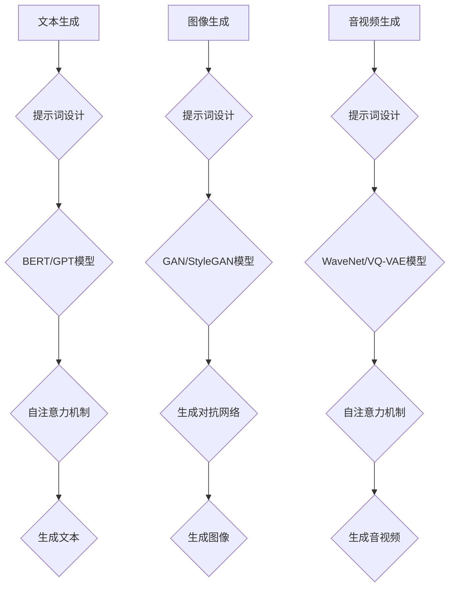

                 

### 文章标题：大模型多模态生成：提示词协调文图音视频

关键词：大模型、多模态生成、提示词、协调、文图音视频

摘要：本文将深入探讨大模型在多模态生成中的应用，特别是提示词如何协调文本、图像和音视频的生成。通过对核心概念、算法原理、数学模型以及实战案例的详细讲解，本文旨在为广大开发者提供全面的技术指南，助力读者在人工智能领域取得突破。

### 目录

1. **背景介绍**  
   1.1 大模型的发展历程与现状  
   1.2 多模态生成技术的需求与挑战

2. **核心概念与联系**  
   2.1 大模型多模态生成的概念解析  
   2.2 文本、图像和音视频生成的基本原理  
   2.3 提示词在多模态生成中的作用  
   2.4 Mermaid流程图：大模型多模态生成的架构

3. **核心算法原理讲解**  
   3.1 大模型基础算法：Transformer与BERT  
   3.2 提示词生成算法：生成对抗网络（GAN）与自注意力机制（SAM）  
   3.3 多模态生成算法：文图生成、文本与音视频生成

4. **数学模型和公式**  
   4.1 大模型数学模型：损失函数与优化算法  
   4.2 多模态生成数学模型：融合机制与协同优化  
   4.3 举例说明：多模态生成实例分析

5. **项目实战**  
   5.1 开发环境搭建  
   5.2 源代码详细实现与代码解读  
   5.3 代码应用解读与分析  
   5.4 实际案例分析与详细讲解剖析  
   5.5 项目小结

6. **最佳实践 tips**  
   6.1 提高生成效率的技巧  
   6.2 避免常见问题的注意事项  
   6.3 拓展阅读

7. **小结**  
   7.1 文章总结  
   7.2 未来的研究方向

### 文章正文

#### 1. 背景介绍

##### 1.1 大模型的发展历程与现状

大模型，即大规模的人工智能模型，是指具有数十亿甚至千亿参数的深度学习模型。自2012年AlexNet的出现，深度学习技术在计算机视觉领域取得了突破性进展。此后，随着计算资源的提升和算法的优化，大模型在自然语言处理、语音识别、多模态生成等领域也取得了显著成果。

当前，大模型技术已经成为人工智能领域的热点。基于Transformer和BERT等模型的大模型在许多任务上都取得了SOTA（State-of-the-Art）的性能。然而，大模型的多模态生成技术仍然面临诸多挑战，如如何有效整合文本、图像和音视频信息，如何设计高效的生成算法等。

##### 1.2 多模态生成技术的需求与挑战

多模态生成技术旨在将不同类型的信息（文本、图像、音视频）整合起来，生成具有丰富内容和多样性的输出。这种技术在智能交互、内容创作、媒体融合等领域具有广泛的应用需求。

然而，多模态生成技术也面临着以下挑战：

- **数据不均衡**：不同模态的数据量和质量存在差异，如何平衡不同模态的信息是一个重要问题。
- **复杂性**：多模态信息具有复杂性和多样性，如何设计出能处理这种复杂性的生成算法是一个挑战。
- **效率**：多模态生成通常需要大量的计算资源和时间，如何提高生成效率是一个关键问题。

#### 2. 核心概念与联系

##### 2.1 大模型多模态生成的概念解析

大模型多模态生成是指利用大规模的深度学习模型，将文本、图像和音视频等多种模态的信息融合起来，生成具有丰富内容和多样性的输出。

- **文本生成**：基于语言模型，生成自然流畅的文本内容。
- **图像生成**：基于图像生成模型，生成高质量、多样化的图像。
- **音视频生成**：基于音视频生成模型，生成具有连贯性和一致性的音视频内容。

##### 2.2 文本、图像和音视频生成的基本原理

- **文本生成**：利用语言模型（如BERT、GPT）对文本数据进行建模，通过自注意力机制捕捉文本中的关键信息，生成自然流畅的文本内容。

- **图像生成**：利用图像生成模型（如GAN、StyleGAN）对图像数据进行建模，通过生成对抗网络（GAN）的训练，生成高质量、多样化的图像。

- **音视频生成**：利用音视频生成模型（如WaveNet、VQ-VAE）对音视频数据进行建模，通过自注意力机制和生成对抗网络（GAN）的训练，生成连贯性和一致性较高的音视频内容。

##### 2.3 提示词在多模态生成中的作用

提示词是指导大模型生成特定内容的关键信息。在多模态生成中，提示词用于指导文本、图像和音视频的生成。

- **文本生成**：提示词可以帮助大模型理解生成文本的主题和风格。
- **图像生成**：提示词可以帮助大模型理解生成图像的类别和内容。
- **音视频生成**：提示词可以帮助大模型理解生成音视频的情节和场景。

##### 2.4 Mermaid流程图：大模型多模态生成的架构



#### 3. 核心算法原理讲解

##### 3.1 大模型基础算法：Transformer与BERT

- **Transformer**：一种基于自注意力机制的编码器-解码器（Encoder-Decoder）模型，广泛应用于文本生成任务。其核心思想是通过自注意力机制捕捉文本中的关键信息，生成自然流畅的文本内容。

  ```python
  # Transformer伪代码
  def transformer(input_seq):
      # 编码器
      enc_output = encoder(input_seq)
      
      # 自注意力机制
      attn_output = self_attention(enc_output)
      
      # 解码器
      dec_output = decoder(attn_output)
      
      return dec_output
  ```

- **BERT**：一种双向编码器（Bidirectional Encoder Representations from Transformers）模型，通过预训练和微调，广泛应用于文本分类、问答系统等自然语言处理任务。其核心思想是通过对输入文本的编码，生成语义丰富的文本表示。

  ```python
  # BERT伪代码
  def bert(input_seq):
      # 预训练
      pretrain(input_seq)
      
      # 微调
      fine_tune(input_seq)
      
      # 文本表示
      representations = encoder(input_seq)
      
      return representations
  ```

##### 3.2 提示词生成算法：生成对抗网络（GAN）与自注意力机制（SAM）

- **生成对抗网络（GAN）**：一种由生成器和判别器组成的对抗性训练模型，广泛应用于图像生成任务。其核心思想是通过生成器和判别器的对抗性训练，生成高质量、多样化的图像。

  ```python
  # GAN伪代码
  def gan():
      # 生成器
      generator = Generator()

      # 判别器
      discriminator = Discriminator()

      # 对抗性训练
      for epoch in range(num_epochs):
          for batch in data_loader:
              # 生成图像
              fake_images = generator(batch)

              # 计算判别器损失
              disc_loss = discriminator_loss(discriminator, fake_images, batch)

              # 计算生成器损失
              gen_loss = generator_loss(generator, fake_images, batch)

              # 更新生成器和判别器参数
              optimizer_d.d

