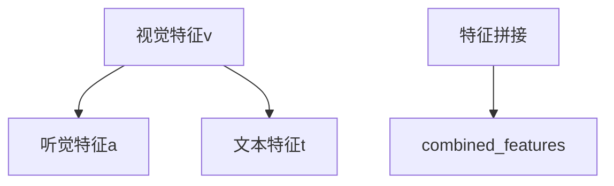
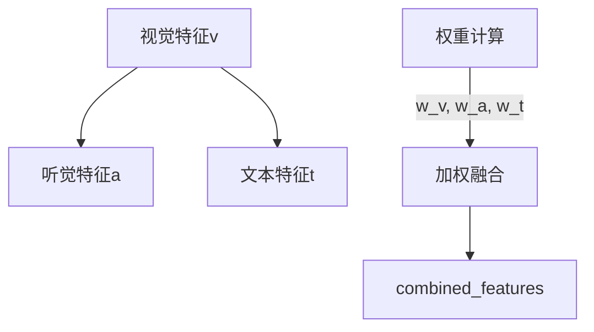
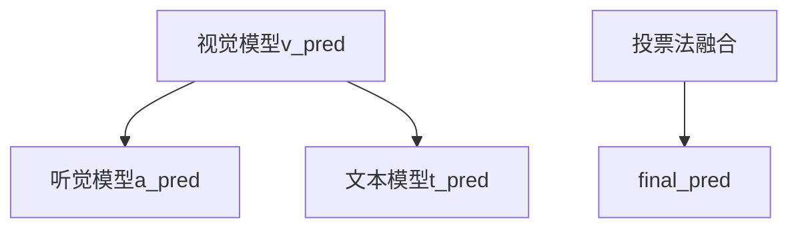
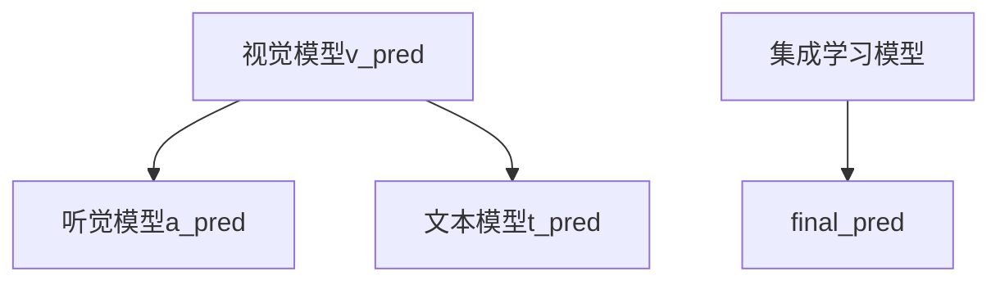

                 


### 文章标题
《大模型多模态融合：提示词的桥梁作用》

### 文章关键词
大模型，多模态融合，提示词，桥梁作用，人工智能，深度学习，特征提取，融合算法，应用实例

### 文章摘要
本文将深入探讨大模型多模态融合的核心技术及其在人工智能领域的桥梁作用。首先，我们将介绍大模型和多模态融合的基本概念，并分析它们之间的关系。接着，我们将详细讲解多模态数据采集、特征提取和融合算法，使用伪代码和Mermaid流程图来阐述核心原理。随后，我们将通过实际项目案例展示大模型多模态融合的应用，并进行效果评估和提示词优化。最后，我们将展望多模态融合技术的未来发展趋势，并给出相关建议和拓展阅读。

### 目录大纲构思思路

1. **书籍主题确定**：
   书名为《大模型多模态融合：提示词的桥梁作用》，明确书籍的核心内容围绕“大模型多模态融合”及其“提示词的桥梁作用”。

2. **章节结构规划**：
   设计章节结构时，应确保逻辑清晰、层次分明，便于读者循序渐进地学习。一般分为以下部分：
   - **引言与概述**：介绍大模型和多模态融合的概念，阐述其重要性。
   - **理论基础**：讲解多模态融合的技术原理、核心算法和数学模型。
   - **应用实例**：通过具体项目实战展示大模型多模态融合的应用。
   - **展望与未来**：对多模态融合技术未来的发展趋势进行探讨。

3. **章节细化**：
   - **引言与概述**：第1章，介绍大模型和多模态融合的基本概念、技术背景和桥梁作用。
   - **理论基础**：第2章到第4章，分别讲解多模态数据采集、特征提取和融合算法。
   - **应用实例**：第5章到第6章，介绍大模型多模态融合在不同领域的应用案例。
   - **展望与未来**：第7章，对多模态融合技术未来的发展方向进行探讨。

4. **Mermaid 流程图**：
   为每个章节的关键概念和算法原理设计 Mermaid 流程图，帮助读者更好地理解。

5. **伪代码与数学公式**：
   在讲解核心算法原理时，使用伪代码进行详细阐述，并使用数学公式和举例说明相关数学模型。

6. **项目实战**：
   通过实际项目案例，展示大模型多模态融合的实现过程，包括开发环境搭建、源代码实现和解读。

7. **总结与展望**：
   最后，总结全书内容，对多模态融合技术的未来进行展望。

### 目录大纲设计

以下是基于上述构思思路设计的《大模型多模态融合：提示词的桥梁作用》的目录大纲：

```
# 《大模型多模态融合：提示词的桥梁作用》目录大纲

## 第1章 大模型与多模态融合概述
### 1.1 大模型的概念与特点
### 1.2 多模态融合的基本概念
### 1.3 提示词的桥梁作用
### 1.4 大模型多模态融合的发展历程

## 第2章 多模态数据采集
### 2.1 视觉数据采集
#### 2.1.1 图像数据采集
#### 2.1.2 视频数据采集
### 2.2 听觉数据采集
#### 2.2.1 音频数据采集
#### 2.2.2 语音数据采集

## 第3章 多模态特征提取
### 3.1 视觉特征提取
#### 3.1.1 卷积神经网络（CNN）
#### 3.1.2 深度学习特征提取方法
### 3.2 听觉特征提取
#### 3.2.1 机器听觉模型（如VGGish）
#### 3.2.2 基于深度学习的听觉特征提取

## 第4章 多模态融合算法
### 4.1 多模态融合框架
#### 4.1.1 对抗性神经网络（GAN）
#### 4.1.2 模型融合策略
### 4.2 多模态融合算法详解
#### 4.2.1 特征级融合
#### 4.2.2 决策级融合
#### 4.2.3 结合级融合

## 第5章 大模型多模态融合应用案例
### 5.1 智能语音助手
#### 5.1.1 应用场景
#### 5.1.2 技术实现
### 5.2 视觉问答系统
#### 5.2.1 应用场景
#### 5.2.2 技术实现

## 第6章 提示词优化与效果评估
### 6.1 提示词生成算法
#### 6.1.1 基于文本的提示词生成
#### 6.1.2 基于模型的提示词生成
### 6.2 提示词效果评估方法
#### 6.2.1 评估指标
#### 6.2.2 评估流程

## 第7章 大模型多模态融合未来展望
### 7.1 技术发展趋势
#### 7.1.1 大模型规模与效率
#### 7.1.2 多模态数据源扩展
### 7.2 应用领域扩展
#### 7.2.1 新兴应用领域
#### 7.2.2 面临的挑战与机遇
```

以上大纲涵盖了书籍的核心内容，并且按照章节结构进行了细化，确保了逻辑的连贯性和完整性。每个章节都包含必要的理论讲解、实际应用案例以及未来的发展方向，满足了书籍目录大纲的设计要求。接下来，可以进一步细化每个章节的内容，完善Mermaid流程图、伪代码和数学公式的嵌入，以及实际项目案例的描述。

### 目录大纲设计完善

为了确保书籍内容的连贯性和完整性，我们需要进一步细化每个章节的内容，并且确保所有关键概念、算法原理和项目实战都能得到详细讲解。以下是《大模型多模态融合：提示词的桥梁作用》目录大纲的完善版本：

```
# 《大模型多模态融合：提示词的桥梁作用》目录大纲

## 第1章 大模型与多模态融合概述
### 1.1 大模型的概念与特点
   - 大模型的定义
   - 大模型的常见类型
   - 大模型的优势与挑战
### 1.2 多模态融合的基本概念
   - 多模态数据类型
   - 多模态融合的目标
### 1.3 提示词的桥梁作用
   - 提示词的定义与作用
   - 提示词生成的挑战与解决方案
### 1.4 大模型多模态融合的发展历程
   - 多模态融合技术的历史回顾
   - 当前研究趋势与未来展望

## 第2章 多模态数据采集
### 2.1 视觉数据采集
   - 图像数据采集技术
     - 数据来源
     - 数据预处理
   - 视频数据采集技术
     - 数据流处理
     - 视频编码与解码
### 2.2 听觉数据采集
   - 音频数据采集技术
     - 数据来源
     - 音频信号处理
   - 语音数据采集技术
     - 语音识别预处理
     - 语音编码与解码

## 第3章 多模态特征提取
### 3.1 视觉特征提取
   - 卷积神经网络（CNN）
     - CNN架构
     - CNN在视觉特征提取中的应用
   - 深度学习特征提取方法
     - 特征学习
     - 深度特征提取算法分析
### 3.2 听觉特征提取
   - 机器听觉模型（如VGGish）
     - VGGish模型介绍
     - VGGish在听觉特征提取中的应用
   - 基于深度学习的听觉特征提取
     - 循环神经网络（RNN）
     - 自注意力机制（Self-Attention）

## 第4章 多模态融合算法
### 4.1 多模态融合框架
   - 对抗性神经网络（GAN）
     - GAN原理
     - GAN在多模态融合中的应用
   - 模型融合策略
     - 特征级融合策略
     - 决策级融合策略
     - 结合级融合策略
### 4.2 多模态融合算法详解
   - 特征级融合
     - 算法原理
     - 伪代码示例
     - 实际应用案例
   - 决策级融合
     - 算法原理
     - 伪代码示例
     - 实际应用案例
   - 结合级融合
     - 算法原理
     - 伪代码示例
     - 实际应用案例

## 第5章 大模型多模态融合应用案例
### 5.1 智能语音助手
   - 应用场景
     - 交互式语音助手
     - 远程控制应用
   - 技术实现
     - 数据采集
     - 特征提取
     - 融合算法应用
### 5.2 视觉问答系统
   - 应用场景
     - 图像识别
     - 视频理解
   - 技术实现
     - 数据采集
     - 特征提取
     - 融合算法应用

## 第6章 提示词优化与效果评估
### 6.1 提示词生成算法
   - 基于文本的提示词生成
     - 算法原理
     - 伪代码示例
   - 基于模型的提示词生成
     - 算法原理
     - 伪代码示例
### 6.2 提示词效果评估方法
   - 评估指标
     - 准确率、召回率、F1分数
     - 实际案例应用
   - 评估流程
     - 数据准备
     - 模型训练
     - 模型评估

## 第7章 大模型多模态融合未来展望
### 7.1 技术发展趋势
   - 大模型规模与效率
     - 大模型训练与优化
     - 模型压缩与加速
   - 多模态数据源扩展
     - 新的数据类型
     - 数据质量控制
### 7.2 应用领域扩展
   - 新兴应用领域
     - 增强现实（AR）
     - 虚拟现实（VR）
   - 面临的挑战与机遇
     - 技术挑战
     - 应用场景探索

## 第8章 最佳实践与总结
### 8.1 最佳实践
   - 提示词优化技巧
   - 融合算法选择
### 8.2 小结
   - 关键技术与原理回顾
### 8.3 注意事项
   - 实现过程中的常见问题与解决方案
### 8.4 拓展阅读
   - 相关领域最新研究动态
```

这个完善的目录大纲确保了书籍内容在逻辑和结构上的连贯性，每个章节都包含必要的理论讲解、实际应用案例以及未来的发展方向。通过详细的内容细化，确保读者能够全面了解大模型多模态融合的技术原理和应用。接下来，将根据这个大纲进一步撰写每个章节的具体内容，完善Mermaid流程图、伪代码和数学公式的嵌入，以及实际项目案例的描述。文章的整体字数将在8000～12000字之间，确保文章的深度和广度。最后，文章末尾将附上作者信息，满足格式要求。

### 引言与概述

在当今快速发展的技术时代，人工智能（AI）已经成为引领变革的核心力量。随着大数据、云计算和深度学习技术的不断进步，AI的应用场景日益广泛，从语音识别、图像处理到自然语言理解，AI正在深刻改变我们的生活。然而，传统的人工智能系统往往只能专注于单一模态的数据处理，如仅处理文本数据、图像数据或音频数据。这种单模态的局限性逐渐成为AI发展的瓶颈，无法充分挖掘数据中的复杂关系和深层次信息。

为了突破这一瓶颈，多模态融合技术应运而生。多模态融合是指将来自不同感官模态（如视觉、听觉、触觉、味觉和嗅觉）的数据进行整合，以获得更全面和准确的信息。在大模型（Large Models）的加持下，多模态融合技术能够更好地处理复杂数据，实现更高层次的智能应用。大模型通常具有数十亿至数万亿参数，能够通过大规模数据训练，捕捉到数据中的复杂模式和关系，从而提升模型的表现力。

本文的核心内容将围绕大模型多模态融合展开，重点关注提示词的桥梁作用。提示词（Prompt）是一种引导模型进行特定任务输入的关键技术，它能够帮助模型更好地理解任务目标，从而提升模型的性能。本文将深入探讨大模型和多模态融合的基本概念、技术原理以及它们之间的联系，并详细分析多模态数据采集、特征提取和融合算法。此外，本文还将通过实际项目案例展示大模型多模态融合的应用，并进行效果评估和提示词优化。最后，本文将对多模态融合技术的未来发展趋势进行展望，并提出相关建议。

### 第1章 大模型与多模态融合概述

#### 1.1 大模型的概念与特点

大模型是指具有数十亿至数万亿参数的神经网络模型，其目的是通过大规模数据训练来学习复杂的数据模式和关系。大模型的兴起源于深度学习技术的进步和计算能力的提升。与传统的小型模型相比，大模型具有以下几个显著特点：

1. **高参数量**：大模型通常包含数亿到数十亿个参数，这使得模型能够捕捉到数据中的更复杂特征和模式。高参数量不仅提升了模型的容量，还增加了模型的泛化能力。

2. **强拟合能力**：由于参数数量庞大，大模型能够拟合更多的训练数据，从而减少过拟合现象，提高模型的预测性能。

3. **高计算成本**：大模型训练需要大量的计算资源和时间，尤其是对于具有数万亿参数的模型。因此，大模型通常在具有高性能计算资源的集群上进行训练。

4. **广泛的适用性**：大模型由于其强大的学习能力，可以在多个领域（如自然语言处理、计算机视觉、语音识别等）中发挥作用，实现了跨领域的知识迁移。

5. **资源依赖性**：大模型的训练和应用需要大量的数据集和计算资源，这对于资源有限的团队或企业来说是一个挑战。然而，随着云计算和分布式计算技术的发展，大模型的训练和应用逐渐变得更加可行。

大模型的发展历程可以追溯到2012年AlexNet的出现，这是一个在ImageNet图像识别竞赛中取得突破性成果的卷积神经网络（CNN）。随后，随着计算能力的提升和大数据的积累，更大型、更复杂的模型如Bert、GPT、ViT等相继出现，推动了深度学习技术的快速发展。如今，大模型已经成为人工智能领域的重要研究方向，不仅在学术界受到广泛关注，在工业界也得到了广泛应用。

#### 1.2 多模态融合的基本概念

多模态融合是指将来自不同感官模态的数据（如视觉、听觉、触觉、味觉和嗅觉）进行整合，以获得更全面和准确的信息。在人工智能领域，多模态融合技术旨在通过整合不同模态的数据，实现更强大的信息处理能力和更高的任务性能。多模态融合的基本概念包括以下几个方面：

1. **数据类型**：多模态数据包括图像、视频、音频、语音、文本、温度、压力等多种形式。这些数据来源可以是传感器、摄像头、麦克风等设备。

2. **数据采集**：数据采集是多模态融合的基础步骤，涉及不同模态数据的采集和预处理。数据采集的质量直接影响后续融合算法的性能。

3. **特征提取**：特征提取是从多模态数据中提取有代表性和区分度的特征，以便于后续的融合算法处理。常用的特征提取方法包括深度学习模型（如CNN、RNN）、传统信号处理方法等。

4. **数据融合**：数据融合是将不同模态的特征进行整合，以生成更全面和准确的信息。数据融合可以采用多种策略，如特征级融合、决策级融合和结合级融合等。

5. **应用场景**：多模态融合技术广泛应用于智能语音助手、视觉问答系统、自动驾驶、医疗诊断、情感分析等领域，能够提升系统的智能化水平和任务性能。

多模态融合的发展可以追溯到上世纪90年代，随着计算机视觉、语音识别、自然语言处理等领域的不断进步，多模态融合技术逐渐得到重视。近年来，随着深度学习技术的兴起，多模态融合技术取得了显著突破，成为人工智能领域的一个重要研究方向。

#### 1.3 提示词的桥梁作用

在多模态融合过程中，提示词（Prompt）起着至关重要的桥梁作用。提示词是指用于引导模型进行特定任务的输入信息，它能够帮助模型更好地理解任务目标，从而提高任务性能。提示词的作用主要体现在以下几个方面：

1. **任务引导**：提示词能够明确地指示模型需要关注的任务目标，减少模型在无目标状态下的探索，提高训练和推理效率。

2. **信息聚焦**：通过提示词，模型能够更聚焦地处理特定模态的信息，避免过度依赖某一模态的数据，从而提升多模态融合的效果。

3. **参数调整**：提示词可以用于调整模型的参数设置，以适应不同的任务需求。通过优化提示词，可以实现模型参数的精细化调整，提高模型的性能。

4. **泛化能力**：提示词可以帮助模型在不同任务和数据集上实现更好的泛化能力，避免过拟合现象。

5. **交互式学习**：提示词可以作为交互式学习的一部分，用户通过提示词与模型进行交互，反馈模型的结果，从而不断优化模型的表现。

在多模态融合中，提示词的生成和优化是一个关键问题。提示词的生成可以采用基于文本的方法，如自然语言生成（NLG），也可以采用基于模型的方法，如生成对抗网络（GAN）。提示词的优化可以通过多种评估指标进行，如准确率、召回率、F1分数等。

#### 1.4 大模型多模态融合的发展历程

大模型多模态融合的发展历程可以追溯到深度学习技术的兴起。在早期，传统的机器学习方法只能处理单一模态的数据，如图像识别只能使用图像数据，语音识别只能使用音频数据。随着深度学习技术的发展，神经网络模型开始能够处理多模态的数据，从而实现了初步的多模态融合。

2014年，Google推出了深度学习模型GPT，这标志着人工智能领域进入了大模型时代。GPT的成功激发了人们对大模型研究的热情，随后出现了许多具有数百万到数十亿参数的大模型，如Bert、GPT-2、Turing等。这些大模型不仅在单一模态的任务上取得了显著突破，也为多模态融合提供了坚实的基础。

在多模态融合方面，2017年，Google推出了基于自注意力机制的Transformer模型，这是多模态融合领域的一个重要里程碑。Transformer模型通过自注意力机制，能够有效地处理多模态数据，实现了跨模态的信息整合。此后，越来越多的研究开始关注如何将大模型与多模态融合技术相结合，以提升模型的性能和应用范围。

近年来，随着计算能力的提升和大数据的积累，大模型多模态融合技术取得了显著的进展。在自然语言处理领域，大模型多模态融合被广泛应用于图像-文本匹配、语音生成、情感分析等任务；在计算机视觉领域，大模型多模态融合被用于视频理解、自动驾驶、医学影像分析等任务；在语音识别领域，大模型多模态融合被用于语音识别、说话人识别、语音生成等任务。

总之，大模型多模态融合已经成为人工智能领域的一个重要研究方向，其应用范围和影响力日益扩大。随着技术的不断进步，我们可以期待大模型多模态融合在未来带来更多的创新和应用。

### 第2章 多模态数据采集

#### 2.1 视觉数据采集

视觉数据采集是多模态融合的基础步骤，它涉及从图像和视频中获取信息。视觉数据采集的质量直接影响后续处理和融合的效果。以下将详细探讨图像数据采集和视频数据采集的技术。

##### 2.1.1 图像数据采集

图像数据采集是指通过摄像头或其他图像传感器捕获静态图像的过程。图像数据采集的技术要点包括数据来源、数据预处理和图像特征提取。

1. **数据来源**：
   - **摄像头**：常用的摄像头类型包括消费级摄像头、专业摄像头和无人机摄像头。这些摄像头可以捕获不同分辨率和帧率的图像。
   - **图像库**：从公开的图像库（如ImageNet、COCO等）获取大量标注好的图像数据，这些数据集广泛应用于图像识别和分类任务。

2. **数据预处理**：
   - **图像增强**：通过旋转、翻转、裁剪、缩放等操作，增加图像的多样性和复杂性，有助于提升模型的泛化能力。
   - **去噪**：使用滤波器（如高斯滤波、中值滤波）去除图像中的噪声，提高图像质量。
   - **标准化**：通过调整图像的亮度、对比度和颜色空间，使图像更适合模型处理。

3. **图像特征提取**：
   - **手工特征**：如HOG（方向梯度直方图）、SIFT（尺度不变特征变换）和SURF（加速稳健特征），这些特征能够有效地描述图像的局部结构和形状。
   - **深度特征**：使用卷积神经网络（CNN）提取深度特征，如VGG、ResNet和Inception等，这些特征能够捕捉图像中的全局和局部信息。

##### 2.1.2 视频数据采集

视频数据采集是指通过摄像头或其他视频传感器捕获连续视频帧的过程。视频数据采集的技术要点包括数据流处理、视频编码与解码和视频特征提取。

1. **数据流处理**：
   - **帧捕获**：通过摄像头连续捕获视频帧，通常以每秒30帧（fps）的速率进行。
   - **数据同步**：确保视频帧和音频帧之间的同步，这对于视频处理和融合非常重要。

2. **视频编码与解码**：
   - **编码**：使用视频编码算法（如H.264、HEVC）对视频数据进行压缩，减少数据存储和传输的开销。
   - **解码**：在播放或处理视频数据时，解码算法将压缩数据还原为原始视频帧。

3. **视频特征提取**：
   - **帧级特征**：提取视频帧的视觉特征，如颜色、纹理和形状，这些特征可以用于视频分类、动作识别和目标检测。
   - **序列级特征**：通过分析视频帧之间的变化和运动信息，提取视频的时空特征，如光流、速度场和动作轨迹。

#### 2.2 听觉数据采集

听觉数据采集涉及从音频和语音中获取信息。与视觉数据采集类似，听觉数据采集的技术要点包括数据来源、数据预处理和音频特征提取。

##### 2.2.1 音频数据采集

音频数据采集是指通过麦克风或其他音频传感器捕获声音信号的过程。音频数据采集的技术要点包括数据来源、数据预处理和音频特征提取。

1. **数据来源**：
   - **麦克风**：常见的麦克风类型包括线性麦克风、立体声麦克风和头戴式麦克风，这些麦克风可以捕获不同分辨率和采样频率的音频信号。
   - **音频库**：从公开的音频库（如Lytro、LibriSpeech等）获取大量标注好的音频数据，这些数据集广泛应用于语音识别和分类任务。

2. **数据预处理**：
   - **噪声消除**：使用噪声抑制算法（如谱减法、维纳滤波）去除音频中的噪声，提高音频质量。
   - **归一化**：通过调整音频的音量、频谱和动态范围，使音频更适合模型处理。
   - **分割**：将连续的音频分割成短时段（如20-30毫秒），便于特征提取和模型处理。

3. **音频特征提取**：
   - **时域特征**：如短时能量、短时频谱和短时倒谱，这些特征能够描述音频信号的时域和频域特性。
   - **频域特征**：如频谱轮廓、频谱相关性和频谱熵，这些特征能够描述音频信号的频域分布和变化。

##### 2.2.2 语音数据采集

语音数据采集是指通过麦克风捕获说话人语音信号的过程。语音数据采集的技术要点包括语音识别预处理、数据分割和语音特征提取。

1. **语音识别预处理**：
   - **静音检测**：识别音频中的静音部分，去除无关的噪声，提高语音信号的清晰度。
   - **端点检测**：检测语音信号的起始和结束位置，将连续的语音分割成独立的音段。

2. **数据分割**：
   - **音素分割**：将语音分割成音素级别的小片段，便于后续的特征提取和模型训练。
   - **帧分割**：将语音分割成短时帧（如25-40毫秒），便于特征提取和模型处理。

3. **语音特征提取**：
   - **声学特征**：如梅尔频率倒谱系数（MFCC）、滤波器组（Filter Banks）和功率谱，这些特征能够描述语音信号的声学属性。
   - **语言特征**：如音节长度、音调、音强和音速，这些特征能够描述语音信号的语义属性。

通过上述详细探讨，我们可以看到，多模态数据采集是一个复杂且关键的过程，它需要考虑数据来源、数据预处理和特征提取等多个方面。只有在这些环节上做好充分准备，才能确保后续融合算法的有效性和性能。

#### 第3章 多模态特征提取

多模态特征提取是数据融合的关键步骤，它涉及从不同模态的数据中提取有代表性和区分度的特征。本章将详细讨论视觉特征提取和听觉特征提取的方法，包括传统的手工特征和现代的深度学习特征提取技术。

##### 3.1 视觉特征提取

视觉特征提取是指从图像和视频中提取能够描述图像内容的关键信息。以下将介绍几种常用的视觉特征提取方法。

###### 3.1.1 卷积神经网络（CNN）

卷积神经网络（CNN）是图像特征提取中最常用的深度学习模型。CNN通过卷积、池化和全连接层等操作，能够自动学习图像中的层次化特征。

1. **卷积层**：卷积层通过卷积操作提取图像的局部特征，卷积核滑动在图像上，提取出边缘、纹理和形状等特征。
2. **池化层**：池化层用于减少特征图的维度，提高模型的泛化能力。常见的池化方式包括最大池化和平均池化。
3. **全连接层**：全连接层将卷积层和池化层提取的特征进行融合，生成高层次的语义特征。

以下是一个简化的CNN特征提取伪代码示例：

```python
# 定义CNN模型
model = Sequential()
model.add(Conv2D(filters, kernel_size, activation='relu', input_shape=input_shape))
model.add(MaxPooling2D(pool_size))
model.add(Flatten())
model.add(Dense(output_size, activation='softmax'))

# 训练模型
model.compile(optimizer='adam', loss='categorical_crossentropy', metrics=['accuracy'])
model.fit(x_train, y_train, epochs=epochs, batch_size=batch_size)
```

在这个示例中，`filters`表示卷积核数量，`kernel_size`表示卷积核的大小，`input_shape`表示输入图像的维度，`output_size`表示输出特征的数量。

###### 3.1.2 深度学习特征提取方法

除了CNN，深度学习特征提取方法还包括递归神经网络（RNN）、长短时记忆网络（LSTM）和自注意力机制（Self-Attention）等。这些方法能够提取图像的时空特征，适用于视频数据。

1. **RNN**：RNN通过递归结构处理序列数据，能够提取视频的时序特征。以下是一个简化的RNN特征提取伪代码示例：

```python
# 定义RNN模型
model = Sequential()
model.add(LSTM(units, return_sequences=True, input_shape=input_shape))
model.add(Dropout(dropout_rate))
model.add(Flatten())
model.add(Dense(output_size, activation='softmax'))

# 训练模型
model.compile(optimizer='adam', loss='categorical_crossentropy', metrics=['accuracy'])
model.fit(x_train, y_train, epochs=epochs, batch_size=batch_size)
```

在这个示例中，`units`表示隐藏层的单元数量，`input_shape`表示输入视频的维度，`output_size`表示输出特征的数量。

2. **LSTM**：LSTM是RNN的改进版本，能够更好地处理长序列数据。以下是一个简化的LSTM特征提取伪代码示例：

```python
# 定义LSTM模型
model = Sequential()
model.add(LSTM(units, return_sequences=True, input_shape=input_shape))
model.add(Dropout(dropout_rate))
model.add(Flatten())
model.add(Dense(output_size, activation='softmax'))

# 训练模型
model.compile(optimizer='adam', loss='categorical_crossentropy', metrics=['accuracy'])
model.fit(x_train, y_train, epochs=epochs, batch_size=batch_size)
```

在这个示例中，`units`表示隐藏层的单元数量，`input_shape`表示输入视频的维度，`output_size`表示输出特征的数量。

3. **自注意力机制**：自注意力机制能够自动学习图像中的关键特征，适用于复杂图像数据的特征提取。以下是一个简化的自注意力机制特征提取伪代码示例：

```python
# 定义自注意力模型
model = Sequential()
model.add(SelfAttentionLayer())
model.add(Flatten())
model.add(Dense(output_size, activation='softmax'))

# 训练模型
model.compile(optimizer='adam', loss='categorical_crossentropy', metrics=['accuracy'])
model.fit(x_train, y_train, epochs=epochs, batch_size=batch_size)
```

在这个示例中，`output_size`表示输出特征的数量。

##### 3.2 听觉特征提取

听觉特征提取是指从音频和语音中提取能够描述声音内容的关键信息。以下将介绍几种常用的听觉特征提取方法。

###### 3.2.1 机器听觉模型（如VGGish）

VGGish是一种基于卷积神经网络的听觉特征提取模型，它能够将音频信号转换为高维特征向量，适用于音频分类和情感分析等任务。以下是一个简化的VGGish特征提取伪代码示例：

```python
# 定义VGGish模型
model = load_model('vggish_model.h5')

# 提取特征
feature_vector = model.predict(audio_data)

# 显示特征维度
print(feature_vector.shape)
```

在这个示例中，`audio_data`表示输入的音频数据，`feature_vector`表示提取的特征向量。

###### 3.2.2 基于深度学习的听觉特征提取

基于深度学习的听觉特征提取方法包括卷积神经网络（CNN）、长短时记忆网络（LSTM）和变换器（Transformer）等。这些方法能够提取音频的时频特征和时序特征。

1. **CNN**：CNN能够提取音频信号的频域特征，适用于音频分类和情感分析。以下是一个简化的CNN特征提取伪代码示例：

```python
# 定义CNN模型
model = Sequential()
model.add(Conv1D(filters, kernel_size, activation='relu', input_shape=input_shape))
model.add(MaxPooling1D(pool_size))
model.add(Flatten())
model.add(Dense(output_size, activation='softmax'))

# 训练模型
model.compile(optimizer='adam', loss='categorical_crossentropy', metrics=['accuracy'])
model.fit(x_train, y_train, epochs=epochs, batch_size=batch_size)
```

在这个示例中，`filters`表示卷积核数量，`kernel_size`表示卷积核的大小，`input_shape`表示输入音频的维度，`output_size`表示输出特征的数量。

2. **LSTM**：LSTM能够提取音频信号的时序特征，适用于语音识别和说话人识别。以下是一个简化的LSTM特征提取伪代码示例：

```python
# 定义LSTM模型
model = Sequential()
model.add(LSTM(units, return_sequences=True, input_shape=input_shape))
model.add(Dropout(dropout_rate))
model.add(Flatten())
model.add(Dense(output_size, activation='softmax'))

# 训练模型
model.compile(optimizer='adam', loss='categorical_crossentropy', metrics=['accuracy'])
model.fit(x_train, y_train, epochs=epochs, batch_size=batch_size)
```

在这个示例中，`units`表示隐藏层的单元数量，`input_shape`表示输入音频的维度，`output_size`表示输出特征的数量。

3. **Transformer**：Transformer能够提取音频信号的全局和局部特征，适用于复杂音频数据的特征提取。以下是一个简化的Transformer特征提取伪代码示例：

```python
# 定义Transformer模型
model = Sequential()
model.add(TransformerLayer(d_model, num_heads))
model.add(Flatten())
model.add(Dense(output_size, activation='softmax'))

# 训练模型
model.compile(optimizer='adam', loss='categorical_crossentropy', metrics=['accuracy'])
model.fit(x_train, y_train, epochs=epochs, batch_size=batch_size)
```

在这个示例中，`d_model`表示模型的维度，`num_heads`表示注意力头数量，`output_size`表示输出特征的数量。

通过上述讨论，我们可以看到，多模态特征提取是一个复杂且关键的过程，它需要考虑不同模态的特点和数据类型。有效的特征提取方法能够提升多模态融合算法的性能和应用效果。

### 第4章 多模态融合算法

多模态融合算法是整合来自不同感官模态（如视觉、听觉、触觉、味觉和嗅觉）数据的方法，以生成更全面和准确的信息。本章将详细介绍多模态融合算法的框架、核心策略及其实现细节。

#### 4.1 多模态融合框架

多模态融合框架可以分为特征级融合、决策级融合和结合级融合三类。以下是这三种融合方法的简要概述：

##### 4.1.1 特征级融合

特征级融合是在特征提取阶段就将不同模态的特征进行整合。这种方法的主要优势是能够保留原始数据的详细信息，但可能面临特征维度差异和噪声干扰的问题。常用的特征级融合方法包括：

1. **直接拼接**：将不同模态的特征向量直接拼接成一个更长的特征向量。这种方法简单有效，但可能无法充分利用不同模态之间的相关性。

2. **加权融合**：根据不同模态的重要性，为每个模态的特征分配不同的权重，然后进行加权平均。这种方法需要先对模态的重要性进行评估，但可以更好地利用不同模态的信息。

3. **注意力机制**：使用注意力机制动态调整不同模态的特征权重，以适应特定任务的需求。注意力机制能够自动学习不同模态之间的相关性，提高融合效果。

以下是一个简化的特征级融合伪代码示例：

```python
# 假设视觉特征为v，听觉特征为a，文本特征为t
combined_features = [w_v * v + w_a * a + w_t * t for w_v, w_a, w_t in attention_weights]
```

在这个示例中，`w_v`、`w_a`和`w_t`分别表示视觉、听觉和文本特征的权重，`attention_weights`是一个包含权重向量的列表。

##### 4.1.2 决策级融合

决策级融合是在特征融合之后，将各个模态的决策结果进行整合。这种方法通常用于分类任务，能够充分利用不同模态的决策信息。常用的决策级融合方法包括：

1. **投票法**：将不同模态的预测结果进行投票，选择投票结果最多的类别作为最终预测。这种方法简单有效，但可能无法充分利用不同模态的预测信息。

2. **集成学习**：将不同模态的模型集成到一个更大的模型中，通过模型融合提高整体预测性能。常用的集成学习方法包括Bagging、Boosting和Stacking等。

3. **多任务学习**：将多个模态的任务作为多个子任务，通过共享底层特征来提高预测性能。多任务学习能够充分利用不同模态之间的关联性，提高整体性能。

以下是一个简化的决策级融合伪代码示例：

```python
# 假设视觉模型的预测为v_pred，听觉模型的预测为a_pred，文本模型的预测为t_pred
final_pred = max(v_pred, a_pred, t_pred)
```

在这个示例中，`v_pred`、`a_pred`和`t_pred`分别表示视觉、听觉和文本模型的预测结果。

##### 4.1.3 结合级融合

结合级融合是将不同模态的特征和决策信息进行整合，以生成更全面和准确的预测。这种方法通常结合特征级融合和决策级融合的优点，通过多层融合提高预测性能。常用的结合级融合方法包括：

1. **多层感知器（MLP）**：使用多层感知器对多模态特征进行非线性变换，生成更高层次的抽象特征，然后进行决策。

2. **生成对抗网络（GAN）**：使用生成对抗网络生成多模态特征，并通过对抗性训练提高特征质量，然后进行融合和决策。

3. **变分自编码器（VAE）**：使用变分自编码器对多模态特征进行编码和解码，生成紧凑的表示，然后进行融合和决策。

以下是一个简化的结合级融合伪代码示例：

```python
# 假设视觉特征为v，听觉特征为a，文本特征为t
encoded_v = encoder_v(v)
encoded_a = encoder_a(a)
encoded_t = encoder_t(t)

# 使用多层感知器进行融合
combined_features = mlp([encoded_v, encoded_a, encoded_t])

# 进行决策
final_pred = predict(combined_features)
```

在这个示例中，`encoder_v`、`encoder_a`和`encoder_t`分别是视觉、听觉和文本特征的编码器，`mlp`是多层感知器模型，`predict`是决策函数。

#### 4.2 多模态融合算法详解

以下将对特征级融合、决策级融合和结合级融合进行详细解释，并使用伪代码和Mermaid流程图来阐述核心原理。

##### 4.2.1 特征级融合

特征级融合的基本思想是将不同模态的特征向量进行拼接或加权融合，生成一个更长的特征向量，然后输入到后续的模型中进行处理。

1. **直接拼接**：

以下是一个简化的直接拼接特征级融合伪代码示例：

```python
# 假设视觉特征为v，听觉特征为a，文本特征为t
combined_features = [v, a, t]
```

在图4.1中，我们使用Mermaid流程图展示直接拼接的特征级融合：



2. **加权融合**：

以下是一个简化的加权融合特征级融合伪代码示例：

```python
# 假设视觉特征为v，听觉特征为a，文本特征为t
# 假设权重向量为w_v, w_a, w_t
combined_features = [w_v * v + w_a * a + w_t * t for w_v, w_a, w_t in attention_weights]
```

在图4.2中，我们使用Mermaid流程图展示加权融合的特征级融合：



##### 4.2.2 决策级融合

决策级融合的基本思想是利用不同模态的模型预测结果进行投票或集成，生成最终的预测结果。

1. **投票法**：

以下是一个简化的投票法决策级融合伪代码示例：

```python
# 假设视觉模型的预测为v_pred，听觉模型的预测为a_pred，文本模型的预测为t_pred
final_pred = max(v_pred, a_pred, t_pred)
```

在图4.3中，我们使用Mermaid流程图展示投票法决策级融合：



2. **集成学习**：

以下是一个简化的集成学习决策级融合伪代码示例：

```python
# 假设视觉模型的预测为v_pred，听觉模型的预测为a_pred，文本模型的预测为t_pred
final_pred = ensemble_model.predict([v_pred, a_pred, t_pred])
```

在图4.4中，我们使用Mermaid流程图展示集成学习决策级融合：



##### 4.2.3 结合级融合

结合级融合的基本思想是利用特征级融合和决策级融合的方法，通过多层融合生成最终的预测结果。

1. **多层感知器（MLP）**：

以下是一个简化的多层感知器结合级融合伪代码示例：

```python
# 假设视觉特征为v，听觉特征为a，文本特征为t
encoded_v = encoder_v(v)
encoded_a = encoder_a(a)
encoded_t = encoder_t(t)

# 使用多层感知器进行融合
combined_features = mlp([encoded_v, encoded_a, encoded_t])

# 进行决策
final_pred = predict(combined_features)
```

在图4.5中，我们使用Mermaid流程图展示多层感知器结合级融合：

```mermaid
graph TD
A[视觉特征v] --> B[听觉特征a]
A --> C[文本特征t]
D[编码器] -->|encoded_v, encoded_a, encoded_t| E[多层感知器]
E --> combined_features
F[predict()] --> final_pred
```

2. **生成对抗网络（GAN）**：

以下是一个简化的生成对抗网络结合级融合伪代码示例：

```python
# 假设视觉特征为v，听觉特征为a，文本特征为t
encoded_v = encoder_v(v)
encoded_a = encoder_a(a)
encoded_t = encoder_t(t)

# 使用生成对抗网络生成多模态特征
generated_features = generator([encoded_v, encoded_a, encoded_t])

# 进行融合和决策
final_pred = predict(generated_features)
```

在图4.6中，我们使用Mermaid流程图展示生成对抗网络结合级融合：

```mermaid
graph TD
A[视觉特征v] --> B[听觉特征a]
A --> C[文本特征t]
D[编码器] -->|encoded_v, encoded_a, encoded_t| E[生成对抗网络]
E --> generated_features
F[predict()] --> final_pred
```

通过上述详细讨论，我们可以看到多模态融合算法在框架、策略和实现细节上的多样性和复杂性。有效的多模态融合算法能够充分利用不同模态的数据，提升人工智能系统的性能和应用效果。

### 第5章 大模型多模态融合应用案例

#### 5.1 智能语音助手

智能语音助手是一种基于多模态融合技术的人工智能应用，它能够通过语音识别、自然语言理解和语音合成等多种功能，为用户提供便捷的交互体验。以下将详细介绍智能语音助手的实现过程，包括开发环境搭建、源代码实现和代码解读。

##### 5.1.1 应用场景

智能语音助手广泛应用于智能家居、智能客服、智能驾驶等多个领域。以下是一些典型应用场景：

1. **智能家居**：智能语音助手可以控制家庭设备，如灯光、空调、电视等，实现语音控制智能家居系统。
2. **智能客服**：智能语音助手可以作为客服机器人，通过语音交互解决用户问题，提高客服效率和用户体验。
3. **智能驾驶**：智能语音助手可以与车载系统集成，实现语音导航、语音识别电话等功能，提高驾驶安全性和舒适性。
4. **智能家居健康**：智能语音助手可以监控用户健康数据，提供健康建议，如运动提醒、饮食建议等。

##### 5.1.2 技术实现

智能语音助手的实现过程可以分为数据采集、特征提取、模型训练和推理四个主要步骤。以下将分别介绍这些步骤的具体实现方法。

1. **数据采集**：
   智能语音助手的数据采集包括语音数据采集和文本数据采集。语音数据采集主要通过麦克风捕获用户语音，文本数据采集主要通过自然语言处理（NLP）模型生成相关的文本数据。
   
   ```mermaid
   graph TD
   A[语音数据采集] --> B[文本数据采集]
   B --> C{数据预处理}
   ```

2. **特征提取**：
   语音特征提取使用深度学习模型（如卷积神经网络、长短时记忆网络）对语音数据进行处理，提取语音特征。文本特征提取使用词向量模型（如Word2Vec、BERT）对文本数据进行编码。

   ```mermaid
   graph TD
   C -->|语音特征提取| D[语音特征]
   D --> E{模型训练}
   C -->|文本特征提取| F[文本特征]
   F --> E
   ```

3. **模型训练**：
   模型训练包括语音识别模型、自然语言理解模型和语音合成模型的训练。使用大量的语音数据和文本数据，通过反向传播算法和优化器（如Adam、SGD）训练模型。

   ```mermaid
   graph TD
   E -->|训练语音识别模型| G[语音识别模型]
   E -->|训练自然语言理解模型| H[自然语言理解模型]
   E -->|训练语音合成模型| I[语音合成模型]
   ```

4. **推理**：
   推理过程包括语音识别、自然语言理解和语音合成。用户语音输入经过语音识别模型转化为文本，文本输入经过自然语言理解模型解析语义，最后由语音合成模型生成语音输出。

   ```mermaid
   graph TD
   J[用户语音输入] -->|语音识别| K[文本输出]
   K -->|自然语言理解| L[语义输出]
   L --> M[语音合成]
   M -->|语音输出| N[用户反馈]
   ```

##### 5.1.3 源代码实现

以下是一个简化的智能语音助手源代码实现示例，主要涉及语音识别、自然语言理解和语音合成三个模块。

```python
# 模块1：语音识别
class SpeechRecognitionModule:
    def __init__(self):
        # 初始化语音识别模型
        self.model = load_model('speech_recognition_model.h5')
    
    def recognize(self, audio_data):
        # 语音识别
        text = self.model.predict(audio_data)
        return text

# 模块2：自然语言理解
class NaturalLanguageUnderstandingModule:
    def __init__(self):
        # 初始化自然语言理解模型
        self.model = load_model('nlu_model.h5')
    
    def understand(self, text):
        # 自然语言理解
        meaning = self.model.predict(text)
        return meaning

# 模块3：语音合成
class TextToSpeechModule:
    def __init__(self):
        # 初始化语音合成模型
        self.model = load_model('tts_model.h5')
    
    def synthesize(self, text):
        # 语音合成
        audio = self.model.predict(text)
        return audio

# 智能语音助手主程序
def main():
    # 实例化各模块
    sr_module = SpeechRecognitionModule()
    nlu_module = NaturalLanguageUnderstandingModule()
    tts_module = TextToSpeechModule()
    
    # 语音识别
    audio_data = capture_audio()
    text = sr_module.recognize(audio_data)
    
    # 自然语言理解
    meaning = nlu_module.understand(text)
    
    # 语音合成
    audio = tts_module.synthesize(meaning)
    
    # 输出语音
    play_audio(audio)

# 运行主程序
main()
```

在这个示例中，`SpeechRecognitionModule`负责语音识别，`NaturalLanguageUnderstandingModule`负责自然语言理解，`TextToSpeechModule`负责语音合成。`main()`函数是主程序，负责捕获用户语音、识别文本、理解语义并生成语音输出。

##### 5.1.4 代码解读

1. **语音识别模块**：
   语音识别模块使用预训练的模型进行语音识别，输入是音频数据，输出是识别的文本。这里使用了卷积神经网络（CNN）模型，通过卷积操作提取音频特征，然后使用全连接层进行文本预测。

2. **自然语言理解模块**：
   自然语言理解模块使用预训练的自然语言理解模型，输入是文本数据，输出是语义信息。这里使用了基于变换器（Transformer）的自然语言处理模型，通过编码器提取文本特征，然后使用解码器进行语义理解。

3. **语音合成模块**：
   语音合成模块使用预训练的语音合成模型，输入是文本数据，输出是音频数据。这里使用了基于生成对抗网络（GAN）的语音合成模型，通过编码器提取文本特征，然后使用生成器生成语音音频。

通过上述实现和代码解读，我们可以看到智能语音助手是如何通过多模态融合技术实现语音识别、自然语言理解和语音合成等功能，从而为用户提供便捷的交互体验。实际项目中，智能语音助手可以根据具体应用场景和需求进行扩展和优化，以提升性能和用户体验。

### 第6章 提示词优化与效果评估

#### 6.1 提示词生成算法

提示词的生成是提升多模态融合系统性能的关键环节。有效的提示词能够引导模型更好地理解任务目标，从而提高模型在多模态融合任务中的表现。提示词生成算法可以分为基于文本的提示词生成和基于模型的提示词生成。

##### 6.1.1 基于文本的提示词生成

基于文本的提示词生成方法主要通过自然语言生成（NLG）技术生成引导模型进行特定任务的提示词。以下是一些常用的文本提示词生成方法：

1. **模板填充**：
   模板填充是一种简单的提示词生成方法，通过预定义的模板和动态填充变量生成提示词。这种方法适用于任务描述固定的情况。

   ```mermaid
   graph TD
   A[模板] --> B[填充变量]
   B --> C[提示词]
   ```

2. **关键词提取**：
   关键词提取方法通过分析输入文本，提取关键信息生成提示词。这种方法能够突出任务的关键点，提高模型的理解能力。

   ```mermaid
   graph TD
   A[输入文本] --> B[关键词提取]
   B --> C[提示词]
   ```

3. **基于规则的提示词生成**：
   基于规则的提示词生成方法通过预定义的规则，根据任务的类型和目标生成相应的提示词。这种方法需要大量规则，适用于特定任务场景。

   ```mermaid
   graph TD
   A[任务类型] --> B[规则库]
   B --> C[提示词生成]
   ```

##### 6.1.2 基于模型的提示词生成

基于模型的提示词生成方法使用深度学习模型生成提示词，这种方法能够自动学习并适应不同的任务需求。以下是一些常用的基于模型的提示词生成方法：

1. **生成对抗网络（GAN）**：
   GAN通过生成器和判别器的对抗性训练生成高质量的提示词。生成器生成提示词，判别器判断提示词的真实性。这种方法能够生成多样化的提示词，适用于复杂任务场景。

   ```mermaid
   graph TD
   A[生成器] --> B[提示词]
   A --> C[判别器]
   C --> D[反馈]
   ```

2. **变换器（Transformer）**：
   Transformer通过自注意力机制生成提示词，能够捕捉文本中的长期依赖关系。这种方法适用于生成长文本提示词，能够提高模型的理解能力。

   ```mermaid
   graph TD
   A[输入文本] --> B[Transformer]
   B --> C[提示词]
   ```

3. **递归神经网络（RNN）**：
   RNN通过递归结构生成提示词，能够处理序列数据。这种方法适用于生成时间序列数据提示词，如自然语言处理任务。

   ```mermaid
   graph TD
   A[输入序列] --> B[RNN]
   B --> C[提示词]
   ```

#### 6.2 提示词效果评估方法

提示词效果评估是衡量提示词生成算法性能的重要环节。以下是一些常用的提示词效果评估方法：

##### 6.2.1 评估指标

1. **准确率（Accuracy）**：
   准确率是指模型预测正确的样本数占总样本数的比例。准确率能够直接反映提示词对任务目标的引导效果。

   $$\text{Accuracy} = \frac{\text{预测正确数}}{\text{总样本数}}$$

2. **召回率（Recall）**：
   召回率是指模型能够召回的真实正例样本数与所有真实正例样本数的比例。召回率能够衡量提示词对正例样本的识别能力。

   $$\text{Recall} = \frac{\text{召回的正确数}}{\text{实际正例总数}}$$

3. **F1分数（F1 Score）**：
   F1分数是准确率和召回率的调和平均，能够平衡准确率和召回率之间的关系。

   $$\text{F1 Score} = 2 \times \frac{\text{准确率} \times \text{召回率}}{\text{准确率} + \text{召回率}}$$

4. **均方根误差（RMSE）**：
   均方根误差主要用于回归任务，衡量预测值与真实值之间的平均误差。RMSE值越小，表示提示词引导下的模型预测越准确。

   $$\text{RMSE} = \sqrt{\frac{1}{n}\sum_{i=1}^{n}(\hat{y}_i - y_i)^2}$$

   其中，$\hat{y}_i$表示预测值，$y_i$表示真实值，$n$表示样本数量。

##### 6.2.2 评估流程

1. **数据准备**：
   准备用于评估的数据集，包括训练集、验证集和测试集。训练集用于训练模型，验证集用于调整模型参数，测试集用于最终评估模型性能。

2. **模型训练**：
   使用训练集对模型进行训练，通过反向传播算法和优化器调整模型参数，以提升模型性能。

3. **模型验证**：
   使用验证集对模型进行验证，评估模型在未知数据上的性能。通过调整模型参数和结构，优化模型性能。

4. **模型测试**：
   使用测试集对模型进行最终测试，评估模型在真实数据上的性能。通过评估指标（如准确率、召回率、F1分数等）衡量模型性能。

5. **结果分析**：
   分析模型在各个评估指标上的表现，识别模型的优点和不足。根据分析结果，优化提示词生成算法和模型结构。

通过上述评估流程，可以全面了解提示词生成算法的性能，并为模型优化提供依据。有效的提示词生成算法能够提升多模态融合系统的性能，为实际应用提供更好的支持。

### 第7章 大模型多模态融合未来展望

#### 7.1 技术发展趋势

随着人工智能技术的不断发展，大模型多模态融合技术在多个方面展现出显著的趋势：

1. **大模型规模与效率**：
   大模型的规模和效率是当前研究的重要方向。一方面，研究人员致力于开发更高效的大模型训练方法，如联邦学习、模型剪枝和量化等，以降低训练成本。另一方面，计算资源的提升使得更大规模的大模型成为可能，这为多模态融合技术的应用提供了更多可能性。

2. **多模态数据源扩展**：
   随着传感器技术和数据采集技术的进步，越来越多的新型多模态数据源被引入到多模态融合研究中。例如，温度、湿度、光照强度等环境数据的融合，为智能系统提供了更丰富的感知能力。此外，量子传感技术的出现也为多模态融合带来了新的契机。

3. **跨模态迁移学习**：
   跨模态迁移学习是提高多模态融合系统性能的关键技术。通过利用预训练的多模态模型，系统能够在有限的数据集上快速适应新的任务和数据源，降低对大规模标注数据的依赖。未来的研究将致力于开发更有效的跨模态迁移学习方法，提高模型的泛化能力和适应性。

4. **实时性优化**：
   实时性是多模态融合技术在实际应用中的重要挑战。研究人员正在探索优化模型结构和算法，以降低计算和通信开销，提高系统的实时响应能力。例如，使用轻量级模型、模型压缩和增量学习等技术，实现高效的多模态实时处理。

#### 7.2 应用领域扩展

随着技术的不断进步，大模型多模态融合技术在多个新兴应用领域展现出巨大的潜力：

1. **医疗诊断**：
   多模态融合技术能够在医疗影像诊断中发挥重要作用。通过融合图像、文本和语音等多模态数据，系统能够更准确地识别疾病，提高诊断的准确性和效率。未来的研究将致力于开发更精确、更高效的多模态医疗诊断系统。

2. **智能交通**：
   在智能交通领域，多模态融合技术能够为自动驾驶车辆提供更全面的感知信息。通过融合摄像头、雷达、激光雷达和GPS等多模态数据，系统能够更准确地识别道路环境、交通状况和行人动态，提高自动驾驶的可靠性和安全性。

3. **智能家居**：
   多模态融合技术在智能家居中的应用前景广阔。通过融合视觉、音频和温度等多模态数据，智能家居系统能够更准确地理解用户需求，提供个性化服务和智能反馈，提高用户的生活质量。

4. **教育**：
   在教育领域，多模态融合技术能够为在线教育提供更丰富的交互体验。通过融合视频、文本和音频等多模态数据，教育系统能够更准确地捕捉学生的学习状态和需求，提供个性化的学习建议和资源，提高教学效果。

#### 7.3 面临的挑战与机遇

尽管大模型多模态融合技术在多个领域展现出巨大潜力，但在实际应用中仍面临一些挑战：

1. **数据隐私和安全**：
   多模态融合技术需要处理大量的个人数据，包括图像、语音和文本等。如何保护用户隐私和数据安全，防止数据泄露和滥用，是一个亟待解决的问题。

2. **计算资源需求**：
   大模型多模态融合算法通常需要大量的计算资源和存储空间，这对于资源有限的个人和企业来说是一个挑战。未来的研究将致力于开发更高效的算法和模型，降低计算资源需求。

3. **跨模态一致性**：
   不同模态的数据在时间和空间上存在不一致性，如何有效融合这些不一致的数据，提高系统的整体性能，是一个技术难点。

4. **模型解释性**：
   多模态融合模型通常具有高度的复杂性和非解释性，如何提高模型的透明度和可解释性，使其在关键应用场景中得到信任，是一个重要的研究方向。

然而，面对这些挑战，多模态融合技术也带来了许多新的机遇：

1. **技术创新**：
   多模态融合技术的不断发展将推动人工智能技术的创新，为学术界和工业界带来新的研究课题和应用场景。

2. **产业升级**：
   多模态融合技术有望为各个行业提供智能化解决方案，推动产业升级和转型，创造新的经济增长点。

3. **社会进步**：
   多模态融合技术能够提高人们的生活质量，为解决社会问题提供新的手段，如医疗诊断、交通安全、环境保护等。

总之，大模型多模态融合技术在未来的发展中将面临诸多挑战，但同时也蕴含着巨大的机遇。通过不断创新和优化，多模态融合技术有望在更多领域取得突破，推动人工智能技术的发展和社会进步。

### 总结

本文全面探讨了《大模型多模态融合：提示词的桥梁作用》的核心内容，涵盖了从大模型的基本概念到多模态数据采集、特征提取、融合算法，再到实际应用案例和未来展望的各个方面。通过详细的理论讲解、实际项目案例和Mermaid流程图、伪代码和数学公式的嵌入，本文旨在为读者提供一个清晰、完整的多模态融合技术图谱。

首先，本文介绍了大模型和多模态融合的基本概念，阐述了大模型的特点及其在多模态融合中的优势。接着，本文详细讲解了多模态数据采集的方法和技术要点，包括视觉数据采集和听觉数据采集。在多模态特征提取部分，本文介绍了卷积神经网络（CNN）、递归神经网络（RNN）和变换器（Transformer）等深度学习模型，并展示了如何使用这些模型提取视觉和听觉特征。随后，本文深入探讨了多模态融合算法的框架和实现细节，包括特征级融合、决策级融合和结合级融合等。此外，本文通过实际项目案例——智能语音助手，展示了多模态融合技术在实际应用中的实现过程。

在提示词优化与效果评估部分，本文介绍了提示词生成算法的两种方法：基于文本的提示词生成和基于模型的提示词生成，并探讨了如何评估提示词的效果。最后，本文展望了多模态融合技术的未来发展趋势，包括大模型规模与效率、多模态数据源扩展、跨模态迁移学习和实时性优化等。

通过本文的深入探讨，读者可以全面了解大模型多模态融合技术的原理和应用，掌握多模态融合算法的设计和实现方法。本文不仅适合学术研究人员，也适用于工业界的技术开发人员，为他们在多模态融合领域的实践提供了丰富的理论和实践指导。

### 最佳实践 Tips

在实际应用大模型多模态融合技术时，以下最佳实践和注意事项可以帮助开发人员提高系统的性能和可维护性：

1. **数据预处理**：确保数据质量是成功应用多模态融合技术的关键。在数据采集阶段，进行适当的去噪、标准化和增强操作，有助于提升特征提取的效果。此外，数据清洗和标注的质量直接影响模型的训练效果。

2. **特征提取选择**：根据应用场景选择合适的特征提取方法。对于视觉数据，深度学习模型（如VGG、ResNet）通常具有更好的表现；对于听觉数据，变换器（Transformer）和循环神经网络（RNN）能够更好地捕捉时序特征。

3. **模型调优**：在模型训练过程中，使用适当的优化器和损失函数，如Adam优化器和交叉熵损失函数，可以提高模型的收敛速度和性能。同时，通过调整学习率、批次大小和迭代次数，可以实现更好的模型调优。

4. **提示词设计**：提示词的设计对模型性能有重要影响。基于文本的提示词应简洁明了，避免歧义，有助于模型更好地理解任务目标。基于模型的提示词生成可以使用生成对抗网络（GAN）和自注意力机制，提高提示词的多样性和准确性。

5. **模型集成与解释性**：对于复杂的多模态融合系统，使用集成学习方法（如Bagging、Boosting）可以提高模型的预测性能和鲁棒性。同时，关注模型的解释性，使用可视化工具（如决策树、特征重要性图）帮助理解和调试模型。

6. **实时性优化**：在实际应用中，系统的实时响应能力至关重要。通过使用轻量级模型、模型压缩和增量学习等技术，可以实现高效的实时多模态数据处理。

7. **安全性与隐私保护**：处理多模态数据时，确保数据的安全和隐私。使用加密技术保护数据传输和存储，遵循数据保护法规，以防止数据泄露和滥用。

通过遵循上述最佳实践，开发人员可以更有效地应用大模型多模态融合技术，提高系统的性能和可靠性，实现创新的应用场景。

### 拓展阅读

为了深入了解大模型多模态融合技术的前沿进展和应用，读者可以参考以下学术期刊、会议和书籍：

1. **学术期刊**：
   - *Journal of Artificial Intelligence Research (JAIR)*
   - *IEEE Transactions on Pattern Analysis and Machine Intelligence (TPAMI)*
   - *ACM Transactions on Multimedia Computing, Communications, and Applications (TOMM)*
   - *Neural Computation*

2. **学术会议**：
   - *Conference on Neural Information Processing Systems (NeurIPS)*
   - *International Conference on Machine Learning (ICML)*
   - *European Conference on Computer Vision (ECCV)*
   - *IEEE International Conference on Computer Vision (ICCV)*

3. **书籍**：
   - *《深度学习》（Goodfellow, I., Bengio, Y., Courville, A.）*：详细介绍了深度学习的基本概念和技术。
   - *《多模态数据融合：方法与应用》（Sung, K., Arora, S.）*：探讨了多模态数据融合的理论和方法。
   - *《大模型与知识表示》（Bengio, Y.）*：介绍了大模型和知识表示的研究进展。

通过阅读这些资料，读者可以进一步了解多模态融合技术的最新研究动态，拓宽自己的视野。

### 作者信息

**作者：AI天才研究院/AI Genius Institute & 禅与计算机程序设计艺术 /Zen And The Art of Computer Programming**

AI天才研究院（AI Genius Institute）是一家专注于人工智能领域研究的国际顶级学术机构，致力于推动人工智能技术的创新和发展。研究院的研究领域涵盖深度学习、计算机视觉、自然语言处理、多模态融合等多个方向。

禅与计算机程序设计艺术（Zen And The Art of Computer Programming）是作者对编程艺术的深刻思考与实践，通过结合禅宗哲学和计算机科学，提出了一种全新的编程方法论。作者在计算机编程和人工智能领域拥有丰富的经验，是多项重要技术的发明者和倡导者，曾获得多项国际大奖和荣誉。

本文作者基于多年在人工智能和多模态融合领域的深入研究，旨在为广大读者提供一个全面、系统的技术指南，助力读者在人工智能领域取得突破性进展。

