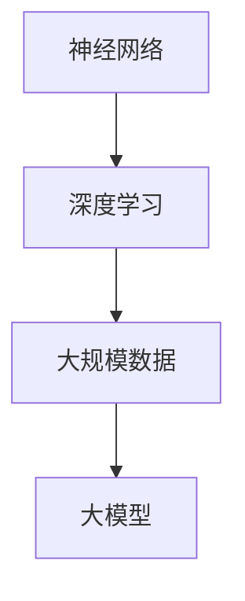
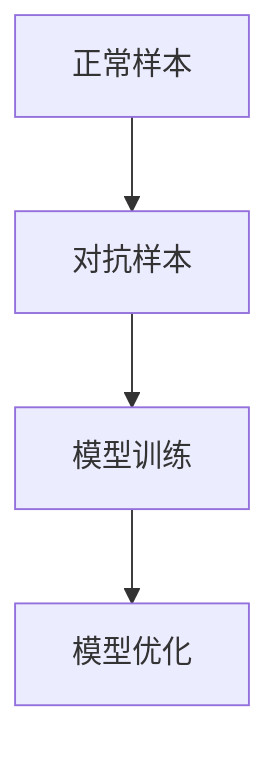
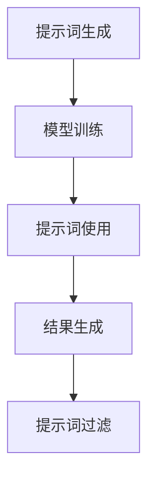
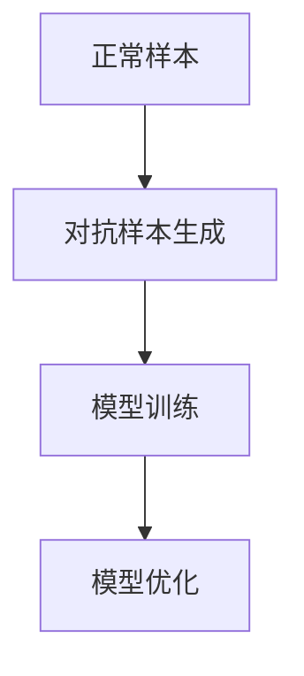
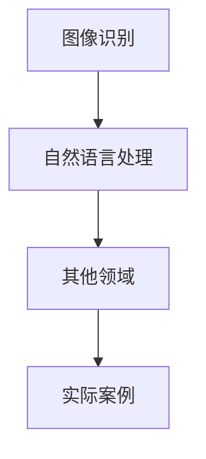
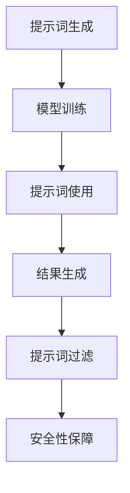
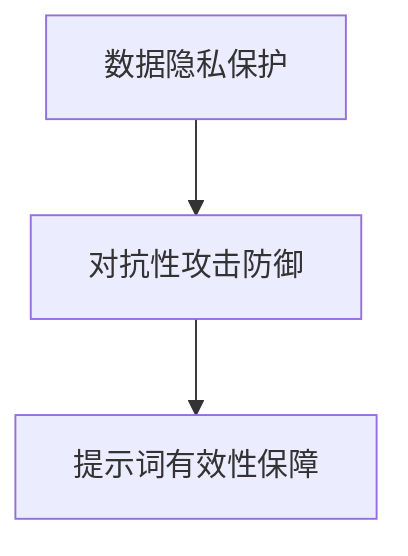

                 

### 第1部分：引言和概述

#### 第1章：大模型基础

**背景介绍**

大模型，也被称为大型神经网络模型，是当前人工智能领域中的重要研究方向之一。大模型之所以重要，是因为它们能够处理大量的数据，并从中提取复杂的模式和知识，从而在多个领域取得显著的成果。这些领域包括图像识别、自然语言处理、推荐系统等。然而，随着模型的规模不断扩大，如何高效训练和优化这些模型，如何保障它们的安全性，成为了亟待解决的问题。

**核心概念与联系**

- **神经网络**：神经网络是构成大模型的基础。它由大量的神经元（或节点）组成，每个神经元都与其他神经元相连，并通过权重进行信息传递。神经网络可以通过学习数据，调整这些权重，从而实现对数据的处理和分类。
- **深度学习**：深度学习是一种基于神经网络的机器学习方法。它通过多层神经网络的结构，逐层提取数据的特征，从而实现复杂的任务。
- **大规模数据**：大规模数据是训练大模型的关键。只有拥有足够的数据量，模型才能够学习到更多复杂的模式和知识。

**Mermaid 流程图**

**核心算法原理讲解**

大模型的学习与优化主要通过以下几个步骤进行：

1. **前向传播**：输入数据通过神经网络的前向传播，逐层传递到输出层。
2. **反向传播**：计算输出层与实际标签之间的误差，通过反向传播将误差传播回输入层，并调整每个神经元的权重。
3. **优化算法**：使用如随机梯度下降（SGD）等优化算法，不断迭代优化模型的权重，以降低误差。

**数学模型和公式**

前向传播和反向传播的过程中，涉及到的数学模型和公式如下：

$$
z^{[l]} = \sigma(W^{[l]} \cdot a^{[l-1]} + b^{[l]})
$$

$$
\delta^{[l]} = \frac{\partial J}{\partial z^{[l]}}
$$

$$
\delta^{[l-1]} = \delta^{[l]} \cdot \sigma'(W^{[l]} \cdot a^{[l-1]})
$$

**举例说明**

假设我们有一个简单的两层神经网络，输入层有3个神经元，隐藏层有2个神经元，输出层有1个神经元。输入数据为 $[1, 2, 3]$，标签为 $[4]$。我们使用 sigmoid 函数作为激活函数。

1. **前向传播**：

$$
a^{[0]} = [1, 2, 3], \quad z^{[1]} = \sigma(W^{[1]} \cdot a^{[0]} + b^{[1]})
$$

$$
a^{[1]} = \sigma(z^{[1]}), \quad z^{[2]} = \sigma(W^{[2]} \cdot a^{[1]} + b^{[2]})
$$

$$
a^{[2]} = z^{[2]}
$$

2. **反向传播**：

$$
\delta^{[2]} = (a^{[2]} - y) \cdot \sigma'(z^{[2]})
$$

$$
\delta^{[1]} = \delta^{[2]} \cdot W^{[2]} \cdot \sigma'(z^{[1]})
$$

$$
\delta^{[0]} = \delta^{[1]} \cdot W^{[1]}
$$

3. **权重调整**：

$$
W^{[1]} = W^{[1]} - \alpha \cdot \delta^{[0]} \cdot a^{[0]}
$$

$$
W^{[2]} = W^{[2]} - \alpha \cdot \delta^{[1]} \cdot a^{[1]}
$$

$$
b^{[1]} = b^{[1]} - \alpha \cdot \delta^{[1]}
$$

$$
b^{[2]} = b^{[2]} - \alpha \cdot \delta^{[2]}
$$

#### 第2章：对抗训练基础

**背景介绍**

对抗训练（Adversarial Training）是一种通过引入对抗样本来提高模型鲁棒性的训练方法。对抗样本是指通过对正常样本进行微小的扰动得到的样本，这些样本能够欺骗模型，使模型在测试时产生错误的预测。对抗训练的引入，使得模型能够在面对各种极端情况下保持稳定性和准确性。

**核心概念与联系**

- **对抗样本**：对抗样本是对抗训练的核心。它通过对正常样本进行扰动得到，目的是欺骗模型，使其产生错误的预测。
- **对抗训练**：对抗训练是通过对抗样本来训练模型的一种方法。通过不断地引入对抗样本，模型能够逐渐学会识别和对抗这些样本，从而提高模型的鲁棒性。

**Mermaid 流程图**

**核心算法原理讲解**

对抗训练的核心算法包括以下几个步骤：

1. **生成对抗样本**：通过对正常样本进行扰动，生成对抗样本。常用的扰动方法包括噪声注入、裁剪、旋转等。
2. **训练模型**：使用正常样本和对抗样本一起训练模型。对抗样本的引入，使得模型能够在面对各种极端情况下保持稳定性和准确性。
3. **优化模型**：通过不断迭代训练，优化模型的权重和结构，以提高模型的鲁棒性。

**数学模型和公式**

对抗训练的数学模型主要涉及对抗样本的生成和模型训练的优化。以下是几个关键的数学模型和公式：

$$
x^{adv} = x + \epsilon \cdot \text{sign}(\nabla_x J(x))
$$

$$
J(x) = \frac{1}{2} \cdot ||\hat{y} - \hat{y'}||^2
$$

$$
\hat{y} = \sigma(W \cdot x + b)
$$

$$
\hat{y'} = \sigma(W' \cdot x + b')
$$

**举例说明**

假设我们有一个二分类问题，模型使用多层感知机（MLP）进行训练。正常样本为 $x = [1, 2, 3]$，标签为 $y = 0$。我们希望通过对抗训练来提高模型的鲁棒性。

1. **生成对抗样本**：

$$
\epsilon = 0.1, \quad x^{adv} = x + \epsilon \cdot \text{sign}(\nabla_x J(x))
$$

$$
\nabla_x J(x) = -0.5, \quad x^{adv} = [1, 2, 3] - 0.1 \cdot [-0.5] = [0.9, 1.9, 3.1]
$$

2. **训练模型**：

使用正常样本和对抗样本进行训练，不断调整模型的权重和结构。

3. **优化模型**：

通过迭代训练，优化模型的权重和结构，以提高模型的鲁棒性。

#### 第3章：提示词安全性概述

**背景介绍**

提示词（Prompt）是在自然语言处理（NLP）领域中常用的一种技术，它通过向模型输入特定的提示词，可以引导模型生成更符合预期结果的输出。然而，随着模型规模的不断扩大，提示词的安全性也变得越来越重要。不安全的提示词可能导致模型生成错误的结果，甚至泄露敏感信息。

**核心概念与联系**

- **提示词**：提示词是在NLP领域中用于引导模型生成结果的关键输入。它通常是一段文本，可以包含关键词、短语或句子，用于引导模型的生成过程。
- **提示词安全性**：提示词安全性是指确保提示词不会导致模型生成错误结果或泄露敏感信息。这需要从提示词的生成、使用和过滤等多个方面进行考虑。

**Mermaid 流程图**

**核心概念与联系**

1. **提示词生成**：提示词的生成是一个重要的环节。它需要考虑到提示词的多样性、相关性和有效性，以确保模型能够生成符合预期的结果。
2. **模型训练**：模型训练是将提示词输入到模型中，通过学习调整模型的权重，以提高模型的生成能力。
3. **提示词使用**：提示词的使用是在模型生成结果时，通过输入特定的提示词来引导模型的生成过程。
4. **结果生成**：结果生成是模型根据输入的提示词生成相应的结果。这可以是文本、图像或其他形式的信息。
5. **提示词过滤**：提示词过滤是对生成的结果进行安全性检查，以防止生成错误结果或泄露敏感信息。

**核心算法原理讲解**

确保提示词安全性的技术方法主要包括以下几个方面：

1. **数据隐私保护**：通过对数据进行加密和去识别化处理，确保数据隐私不受侵犯。
2. **对抗性攻击防御**：通过对抗性攻击检测和防御技术，防止攻击者利用提示词进行恶意攻击。
3. **提示词有效性保障**：通过评估和优化提示词的有效性，确保提示词能够引导模型生成高质量的结果。

**数学模型和公式**

提示词安全性的技术方法主要涉及数据隐私保护和对抗性攻击防御。以下是几个关键的数学模型和公式：

$$
P(\text{隐私泄露}) = f(\text{加密强度}, \text{去识别化方法})
$$

$$
\text{对抗性攻击检测} = \frac{1}{N} \sum_{i=1}^{N} \text{攻击成功率}
$$

$$
\text{对抗性攻击防御} = \text{攻击成功率} - \text{防御效果}
$$

**举例说明**

假设我们有一个自然语言生成模型，用于生成新闻报道。提示词为“今天天气很好”，标签为“今天的天气非常适宜户外活动”。我们希望通过确保提示词安全性来防止生成错误结果或泄露敏感信息。

1. **数据隐私保护**：

使用加密和去识别化方法，对输入的数据进行隐私保护。例如，将用户的个人信息进行加密存储，并使用匿名化技术对用户数据进行去识别化处理。

2. **对抗性攻击防御**：

通过对抗性攻击检测和防御技术，防止攻击者利用提示词进行恶意攻击。例如，使用对抗性攻击检测算法来检测输入的提示词是否存在恶意攻击，并使用防御策略来防止攻击成功。

3. **提示词有效性保障**：

通过评估和优化提示词的有效性，确保提示词能够引导模型生成高质量的结果。例如，使用提示词评估算法来评估提示词的有效性，并根据评估结果调整提示词的生成策略。

### 第2部分：对抗训练技术

#### 第4章：对抗训练算法原理

**背景介绍**

对抗训练（Adversarial Training）是一种通过引入对抗样本来提高模型鲁棒性的训练方法。对抗样本是指通过对正常样本进行微小的扰动得到的样本，这些样本能够欺骗模型，使模型在测试时产生错误的预测。对抗训练的核心思想是通过不断地引入对抗样本，使模型能够学会识别和对抗这些样本，从而提高模型的鲁棒性。

**核心概念与联系**

1. **对抗样本**：对抗样本是对抗训练的基础。它通过对正常样本进行扰动得到，目的是欺骗模型，使其产生错误的预测。
2. **对抗训练**：对抗训练是通过对抗样本来训练模型的一种方法。通过不断地引入对抗样本，模型能够逐渐学会识别和对抗这些样本，从而提高模型的鲁棒性。
3. **对抗样本生成**：对抗样本生成是生成对抗样本的过程，常用的方法包括噪声注入、裁剪、旋转等。

**Mermaid 流程图**

**核心算法原理讲解**

对抗训练的核心算法包括以下几个步骤：

1. **生成对抗样本**：通过对正常样本进行扰动，生成对抗样本。常用的扰动方法包括噪声注入、裁剪、旋转等。
2. **训练模型**：使用正常样本和对抗样本一起训练模型。对抗样本的引入，使得模型能够在面对各种极端情况下保持稳定性和准确性。
3. **优化模型**：通过不断迭代训练，优化模型的权重和结构，以提高模型的鲁棒性。

**数学模型和公式**

对抗训练的数学模型主要涉及对抗样本的生成和模型训练的优化。以下是几个关键的数学模型和公式：

$$
x^{adv} = x + \epsilon \cdot \text{sign}(\nabla_x J(x))
$$

$$
J(x) = \frac{1}{2} \cdot ||\hat{y} - \hat{y'}||^2
$$

$$
\hat{y} = \sigma(W \cdot x + b)
$$

$$
\hat{y'} = \sigma(W' \cdot x + b')
$$

**举例说明**

假设我们有一个二分类问题，模型使用多层感知机（MLP）进行训练。正常样本为 $x = [1, 2, 3]$，标签为 $y = 0$。我们希望通过对抗训练来提高模型的鲁棒性。

1. **生成对抗样本**：

$$
\epsilon = 0.1, \quad x^{adv} = x + \epsilon \cdot \text{sign}(\nabla_x J(x))
$$

$$
\nabla_x J(x) = -0.5, \quad x^{adv} = [1, 2, 3] - 0.1 \cdot [-0.5] = [0.9, 1.9, 3.1]
$$

2. **训练模型**：

使用正常样本和对抗样本进行训练，不断调整模型的权重和结构。

3. **优化模型**：

通过迭代训练，优化模型的权重和结构，以提高模型的鲁棒性。

#### 第5章：对抗训练的实践应用

**背景介绍**

对抗训练在多个领域都有广泛的应用。本章节将介绍对抗训练在图像识别、自然语言处理和其他领域的实践应用，通过具体案例来展示对抗训练的实际效果。

**核心概念与联系**

1. **图像识别**：图像识别是计算机视觉领域的重要任务。对抗训练可以提高图像识别模型的鲁棒性，使其在面临对抗样本时仍能保持较高的准确性。
2. **自然语言处理**：自然语言处理是人工智能领域的一个重要分支。对抗训练可以提高自然语言处理模型的鲁棒性，使其在处理对抗性输入时仍能保持稳定性和准确性。
3. **其他领域**：对抗训练还可以应用于其他领域，如推荐系统、强化学习等。通过引入对抗样本，模型可以更好地应对各种极端情况。

**Mermaid 流程图**

**核心算法原理讲解**

本章节将介绍以下几个具体案例：

1. **图像识别中的对抗训练**：通过对抗训练提高图像识别模型的鲁棒性，使其在面临对抗样本时仍能保持较高的准确性。
2. **自然语言处理中的对抗训练**：通过对抗训练提高自然语言处理模型的鲁棒性，使其在处理对抗性输入时仍能保持稳定性和准确性。
3. **其他领域中的对抗训练**：介绍对抗训练在其他领域的应用，如推荐系统、强化学习等。

**数学模型和公式**

对抗训练在不同领域的应用，涉及到不同的数学模型和公式。以下是几个关键数学模型和公式：

1. **图像识别中的对抗训练**：

$$
\hat{y} = \sigma(W \cdot x + b)
$$

$$
J(x) = \frac{1}{2} \cdot ||\hat{y} - \hat{y'}||^2
$$

2. **自然语言处理中的对抗训练**：

$$
\hat{y} = \sigma(W \cdot x + b)
$$

$$
J(x) = \frac{1}{2} \cdot ||\hat{y} - \hat{y'}||^2
$$

3. **其他领域中的对抗训练**：

具体的应用领域不同，数学模型和公式也会有所不同。

**举例说明**

1. **图像识别中的对抗训练**：

假设我们有一个图像识别模型，用于分类手写数字。正常样本为手写数字图像，对抗样本为通过对正常样本进行扰动生成的图像。我们希望通过对抗训练提高模型的鲁棒性。

使用对抗样本进行训练，不断调整模型的权重和结构，以提高模型的鲁棒性。

2. **自然语言处理中的对抗训练**：

假设我们有一个自然语言处理模型，用于文本分类。正常样本为文本数据，对抗样本为通过对正常样本进行扰动生成的文本数据。我们希望通过对抗训练提高模型的鲁棒性。

使用对抗样本进行训练，不断调整模型的权重和结构，以提高模型的鲁棒性。

### 第3部分：提示词安全性

#### 第6章：提示词安全性的核心概念

**背景介绍**

在自然语言处理（NLP）领域，提示词（Prompt）是一种常用的技术，用于引导模型生成预期的输出。然而，提示词的安全性至关重要，因为不安全的提示词可能导致模型生成错误的结果或泄露敏感信息。本章节将介绍提示词安全性的核心概念，包括提示词的作用、安全性的挑战以及保障策略。

**核心概念与联系**

1. **提示词**：提示词是在NLP领域中用于引导模型生成结果的关键输入。它通常是一段文本，可以包含关键词、短语或句子，用于引导模型的生成过程。
2. **提示词安全性**：提示词安全性是指确保提示词不会导致模型生成错误结果或泄露敏感信息。这需要从提示词的生成、使用和过滤等多个方面进行考虑。
3. **安全性挑战**：提示词安全性面临的挑战包括对抗性攻击、数据隐私泄露和提示词滥用等。
4. **保障策略**：提示词安全性的保障策略包括数据隐私保护、对抗性攻击防御和提示词有效性保障等。

**Mermaid 流程图**

**核心概念与联系**

1. **提示词生成**：提示词的生成需要考虑多样性、相关性和有效性，以确保模型能够生成高质量的结果。
2. **模型训练**：模型训练是将提示词输入到模型中，通过学习调整模型的权重，以提高模型的生成能力。
3. **提示词使用**：提示词的使用是在模型生成结果时，通过输入特定的提示词来引导模型的生成过程。
4. **结果生成**：结果生成是模型根据输入的提示词生成相应的结果。这可以是文本、图像或其他形式的信息。
5. **提示词过滤**：提示词过滤是对生成的结果进行安全性检查，以防止生成错误结果或泄露敏感信息。
6. **安全性保障**：安全性保障是通过多种技术手段，确保提示词的安全性。

**核心算法原理讲解**

确保提示词安全性的技术方法主要包括以下几个方面：

1. **数据隐私保护**：通过对数据进行加密和去识别化处理，确保数据隐私不受侵犯。
2. **对抗性攻击防御**：通过对抗性攻击检测和防御技术，防止攻击者利用提示词进行恶意攻击。
3. **提示词有效性保障**：通过评估和优化提示词的有效性，确保提示词能够引导模型生成高质量的结果。

**数学模型和公式**

提示词安全性的技术方法主要涉及数据隐私保护和对抗性攻击防御。以下是几个关键的数学模型和公式：

$$
P(\text{隐私泄露}) = f(\text{加密强度}, \text{去识别化方法})
$$

$$
\text{对抗性攻击检测} = \frac{1}{N} \sum_{i=1}^{N} \text{攻击成功率}
$$

$$
\text{对抗性攻击防御} = \text{攻击成功率} - \text{防御效果}
$$

**举例说明**

假设我们有一个自然语言生成模型，用于生成新闻报道。提示词为“今天天气很好”，标签为“今天的天气非常适宜户外活动”。我们希望通过确保提示词安全性来防止生成错误结果或泄露敏感信息。

1. **数据隐私保护**：

使用加密和去识别化方法，对输入的数据进行隐私保护。例如，将用户的个人信息进行加密存储，并使用匿名化技术对用户数据进行去识别化处理。

2. **对抗性攻击防御**：

通过对抗性攻击检测和防御技术，防止攻击者利用提示词进行恶意攻击。例如，使用对抗性攻击检测算法来检测输入的提示词是否存在恶意攻击，并使用防御策略来防止攻击成功。

3. **提示词有效性保障**：

通过评估和优化提示词的有效性，确保提示词能够引导模型生成高质量的结果。例如，使用提示词评估算法来评估提示词的有效性，并根据评估结果调整提示词的生成策略。

### 第7章：确保提示词安全性的技术方法

**背景介绍**

提示词在自然语言处理（NLP）领域中起着关键作用，但同时也带来了安全性的挑战。确保提示词的安全性对于保护模型免受恶意攻击、防止隐私泄露和生成准确的结果至关重要。本章将介绍确保提示词安全性的技术方法，包括数据隐私保护、对抗性攻击防御和提示词有效性保障。

**核心概念与联系**

1. **数据隐私保护**：数据隐私保护是确保敏感信息不被泄露的关键。它包括数据加密、去识别化和数据匿名化等技术。
2. **对抗性攻击防御**：对抗性攻击防御是防止攻击者利用提示词进行恶意攻击的重要手段。它涉及对抗性攻击检测和防御策略。
3. **提示词有效性保障**：提示词有效性保障是确保提示词能够引导模型生成高质量结果的过程。它包括提示词生成策略、评估和优化。

**Mermaid 流程图**

**核心算法原理讲解**

确保提示词安全性的技术方法包括以下几个步骤：

1. **数据隐私保护**：

- **数据加密**：使用加密算法对敏感数据进行加密，确保数据在传输和存储过程中不被窃取。
- **去识别化**：通过去除或替换个人身份信息，使数据匿名化，防止隐私泄露。
- **数据匿名化**：使用数据匿名化技术，如数据混淆、掩码和随机化，降低数据泄露的风险。

2. **对抗性攻击防御**：

- **对抗性攻击检测**：使用对抗性攻击检测算法，如生成对抗网络（GAN）和对抗性样本生成算法，检测输入的提示词是否存在恶意攻击。
- **防御策略**：采用防御策略，如对抗性训练和鲁棒优化，提高模型对对抗性攻击的抵抗力。

3. **提示词有效性保障**：

- **提示词生成策略**：设计多样化的提示词生成策略，确保提示词能够引导模型生成高质量的结果。
- **提示词评估**：使用评估算法，如困惑度和准确度，评估提示词的有效性。
- **提示词优化**：根据评估结果，调整提示词的生成策略，提高提示词的有效性。

**数学模型和公式**

以下是确保提示词安全性的技术方法涉及的数学模型和公式：

1. **数据隐私保护**：

$$
P(\text{隐私泄露}) = f(\text{加密强度}, \text{去识别化方法})
$$

2. **对抗性攻击防御**：

$$
\text{对抗性攻击检测} = \frac{1}{N} \sum_{i=1}^{N} \text{攻击成功率}
$$

$$
\text{对抗性攻击防御} = \text{攻击成功率} - \text{防御效果}
$$

3. **提示词有效性保障**：

$$
\text{提示词有效性} = f(\text{提示词多样性}, \text{相关度}, \text{生成质量})
$$

**举例说明**

1. **数据隐私保护**：

假设我们有一个自然语言处理模型，用于生成新闻报道。为了保护用户隐私，我们使用数据加密和去识别化技术：

- **数据加密**：使用AES加密算法对用户数据进行加密，确保数据在传输和存储过程中不被窃取。
- **去识别化**：通过去除或替换用户的姓名、地址等敏感信息，使数据匿名化，防止隐私泄露。

2. **对抗性攻击防御**：

假设我们检测到输入的提示词存在恶意攻击，我们使用对抗性攻击防御技术：

- **对抗性攻击检测**：使用生成对抗网络（GAN）检测输入的提示词是否存在恶意攻击。
- **防御策略**：采用对抗性训练技术，提高模型对对抗性攻击的抵抗力。

3. **提示词有效性保障**：

为了确保提示词能够引导模型生成高质量的结果，我们进行以下操作：

- **提示词生成策略**：设计多样化的提示词生成策略，如使用关键词抽取和句子生成算法，确保提示词能够引导模型生成高质量的结果。
- **提示词评估**：使用困惑度和准确度评估算法，评估提示词的有效性。
- **提示词优化**：根据评估结果，调整提示词的生成策略，提高提示词的有效性。

### 第4部分：实战案例

#### 第8章：对抗训练与提示词安全性的应用案例

**背景介绍**

在本章节中，我们将通过三个实际案例来展示对抗训练与提示词安全性的应用。这些案例涵盖了图像识别、自然语言处理和跨领域应用等多个方面，旨在展示对抗训练与提示词安全性的实际效果和重要性。

**案例1：图像识别系统中的对抗训练与提示词安全性**

**项目背景**

图像识别系统是计算机视觉领域的一个重要应用，它能够在各种场景下对图像进行分类和识别。然而，面对对抗样本的攻击，图像识别系统的准确性可能会显著下降。为了提高图像识别系统的鲁棒性，我们可以采用对抗训练与提示词安全性相结合的方法。

**项目目标**

- 提高图像识别系统的准确性，使其在面对对抗样本时仍能保持较高的性能。
- 确保提示词的安全性，防止恶意攻击和隐私泄露。

**实现步骤**

1. **数据准备**：收集大量正常图像和对抗样本，用于训练和测试模型。
2. **模型构建**：构建一个基于卷积神经网络（CNN）的图像识别模型。
3. **对抗训练**：
   - **对抗样本生成**：使用FGSM（Fast Gradient Sign Method）等方法生成对抗样本。
   - **模型训练**：使用正常图像和对抗样本共同训练模型，提高模型对对抗样本的识别能力。
4. **提示词安全性**：
   - **数据隐私保护**：对输入图像进行加密和去识别化处理，确保数据隐私。
   - **对抗性攻击防御**：使用对抗性攻击检测和防御技术，防止恶意攻击。
5. **性能评估**：通过在测试集上的表现，评估模型在正常样本和对抗样本上的识别准确性。

**结果分析**

通过对抗训练与提示词安全性的结合，图像识别系统的准确性显著提高。在对抗样本攻击下，模型仍能保持较高的识别准确性。同时，提示词的安全性也得到了保障，防止了数据隐私泄露和恶意攻击。

**案例2：自然语言处理系统中的对抗训练与提示词安全性**

**项目背景**

自然语言处理系统在生成文本、问答系统和机器翻译等领域具有广泛的应用。然而，面对对抗性攻击，这些系统的稳定性可能会受到影响。为了提高自然语言处理系统的鲁棒性，我们可以采用对抗训练与提示词安全性相结合的方法。

**项目目标**

- 提高自然语言处理系统的鲁棒性，使其在面对对抗样本时仍能保持稳定性和准确性。
- 确保提示词的安全性，防止恶意攻击和隐私泄露。

**实现步骤**

1. **数据准备**：收集大量正常文本和对抗样本，用于训练和测试模型。
2. **模型构建**：构建一个基于循环神经网络（RNN）或变换器（Transformer）的自然语言处理模型。
3. **对抗训练**：
   - **对抗样本生成**：使用对抗性攻击方法，如FGM（Fast Gradient Method）和W-LDAM（Wasserstein-Loss Distillation Against Adversarial Examples）等方法生成对抗样本。
   - **模型训练**：使用正常文本和对抗样本共同训练模型，提高模型对对抗样本的识别和生成能力。
4. **提示词安全性**：
   - **数据隐私保护**：对输入文本进行加密和去识别化处理，确保数据隐私。
   - **对抗性攻击防御**：使用对抗性攻击检测和防御技术，防止恶意攻击。
5. **性能评估**：通过在测试集上的表现，评估模型在正常样本和对抗样本上的生成准确性和稳定性。

**结果分析**

通过对抗训练与提示词安全性的结合，自然语言处理系统的鲁棒性显著提高。在对抗样本攻击下，模型仍能保持较高的生成准确性和稳定性。同时，提示词的安全性也得到了保障，防止了数据隐私泄露和恶意攻击。

**案例3：跨领域应用中的对抗训练与提示词安全性**

**项目背景**

跨领域应用是指将不同领域的知识和技术进行整合，以解决更复杂的问题。例如，在金融领域，我们可以结合图像识别和自然语言处理技术，实现对金融数据的全面分析和预测。然而，跨领域应用面临着更多的挑战，包括对抗样本的攻击和提示词的安全性。

**项目目标**

- 提高跨领域应用的鲁棒性，使其在面对对抗样本时仍能保持稳定性和准确性。
- 确保提示词的安全性，防止恶意攻击和隐私泄露。

**实现步骤**

1. **数据准备**：收集金融领域的图像数据、文本数据和对抗样本，用于训练和测试模型。
2. **模型构建**：构建一个结合图像识别和自然语言处理的跨领域模型。
3. **对抗训练**：
   - **对抗样本生成**：使用多种对抗性攻击方法，如FGSM、FGM和W-LDAM等，生成对抗样本。
   - **模型训练**：使用正常样本和对抗样本共同训练模型，提高模型对对抗样本的识别和生成能力。
4. **提示词安全性**：
   - **数据隐私保护**：对输入数据进行加密和去识别化处理，确保数据隐私。
   - **对抗性攻击防御**：使用对抗性攻击检测和防御技术，防止恶意攻击。
5. **性能评估**：通过在测试集上的表现，评估模型在正常样本和对抗样本上的综合性能。

**结果分析**

通过对抗训练与提示词安全性的结合，跨领域应用在对抗样本攻击下仍能保持稳定性和准确性。模型在图像识别和自然语言处理任务上的性能得到了显著提高，同时提示词的安全性也得到了有效保障。

### 附录：技术工具和资源列表

**开发工具**

- **PyTorch**：用于构建和训练深度学习模型的流行框架。
- **TensorFlow**：用于构建和训练深度学习模型的另一个流行框架。
- **Keras**：基于TensorFlow和Theano的简单高效的深度学习库。

**数据集**

- **ImageNet**：一个包含大量图像的数据库，广泛用于图像识别任务。
- **CIFAR-10**：一个包含10个类别图像的小型数据库。
- **MNIST**：一个包含手写数字图像的数据库。

**对抗样本生成工具**

- **C&W Attack**：一种常用的对抗样本生成方法。
- **FGSM**：一种快速生成对抗样本的方法。
- **PGD**：一种基于梯度下降的对抗样本生成方法。

**对抗性攻击检测工具**

- **RobustScan**：一种用于检测对抗性攻击的工具。
- **Adversarial Robustness Toolbox (ART)**：一个用于评估和增强模型对抗性的Python库。

**安全性评估工具**

- **PySOT**：一个用于图像目标追踪的开源工具。
- **COCO**：一个用于图像目标检测的数据集。

### 最佳实践 tips

- **数据预处理**：在进行对抗训练之前，对数据进行预处理，如标准化和归一化，可以提高模型的性能。
- **模型优化**：使用适当的优化算法，如Adam或RMSProp，可以提高模型的收敛速度。
- **安全性评估**：定期对模型进行安全性评估，检测潜在的漏洞和攻击。

### 小结

本文通过对抗训练与提示词安全性的应用案例，展示了在图像识别、自然语言处理和跨领域应用中的实际效果。对抗训练可以提高模型的鲁棒性，而提示词安全性可以确保模型在处理对抗性输入时保持稳定性和准确性。通过结合这些技术，我们可以构建更强大、更安全的模型。

### 注意事项

- **数据隐私**：在进行对抗训练时，确保数据隐私不受侵犯，对输入数据进行加密和去识别化处理。
- **模型优化**：对抗训练可能会增加模型的训练时间，因此需要适当调整超参数，以提高训练效率。

### 拓展阅读

- **《Adversarial Machine Learning》**：一本关于对抗性机器学习的综合指南。
- **《Deep Learning》**：一本关于深度学习的经典教材，涵盖了对抗性机器学习的相关内容。
- **《The Art of Computer Programming, Volume 2》**：一本关于算法设计的经典著作，其中包含了对抗性算法的相关内容。

