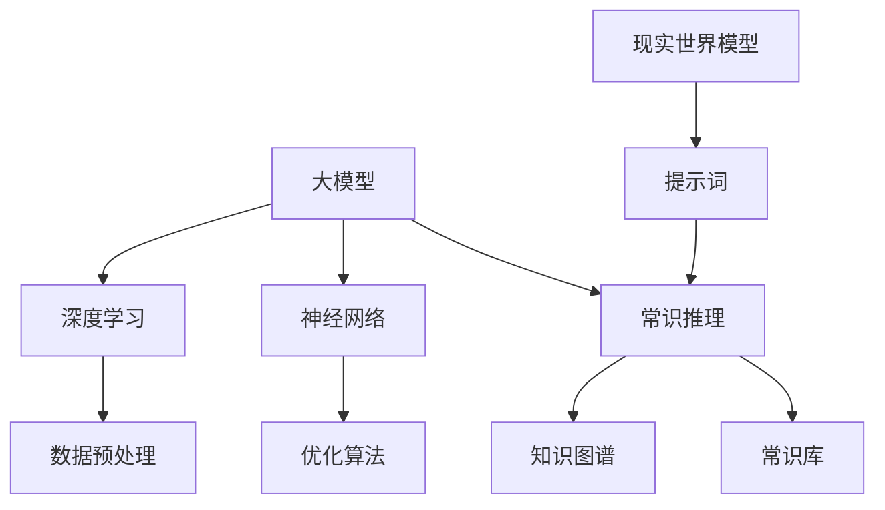

                 


## 文章标题：大模型常识推理：提示词构建现实世界模型

### 关键词：大模型、常识推理、提示词、现实世界模型、人工智能

### 摘要：
本文旨在探讨大模型在常识推理领域的应用，重点阐述如何通过设计有效的提示词来构建现实世界模型。我们将从大模型的基本原理出发，逐步分析常识推理的方法、提示词的构建，并展示实际应用案例，探讨未来发展趋势和挑战。

### 第1章 引言：大模型与常识推理概述

### 1.1 大模型简介

大模型（Large Models）是指具有巨大参数规模和计算能力的机器学习模型，如大型神经网络、深度学习模型等。这些模型通过从大量数据中学习，能够实现高度复杂的任务，如自然语言处理、计算机视觉等。

### 1.2 常识推理的重要性

常识推理是人工智能领域的一个重要研究方向，它涉及到模型对现实世界的理解和推理能力。有效的常识推理能力可以使模型更好地应对现实世界中的不确定性，提高其自主决策和问题解决能力。

### 1.3 提示词的概念与作用

提示词（Prompt）是在人工智能模型中用于引导模型推理的一组关键词或短语。通过设计有效的提示词，可以引导模型在特定方向上进行推理，从而提高其推理效率和准确性。

### 第2章 大模型基础知识

### 2.1 深度学习原理

深度学习是一种基于多层神经网络的学习方法，通过逐层提取特征，实现从原始数据到高级抽象表示的转换。本节将介绍深度学习的基本原理和关键组件。

### 2.2 神经网络结构

神经网络是深度学习的基础，由多个神经元（节点）和连接（边）组成。本节将详细解释神经网络的组成、工作原理及其训练过程。

### 2.3 优化算法详解

优化算法是训练神经网络的核心，用于最小化模型在特定任务上的损失函数。本节将介绍几种常见的优化算法，如梯度下降、Adam优化器等。

### 第3章 常识推理方法

### 3.1 常识推理概述

常识推理是指模型在给定背景知识和先验信息的基础上，对现实世界事件和现象进行推理和判断的能力。本节将介绍常识推理的基本概念和分类。

### 3.2 知识图谱技术

知识图谱是一种用于表示实体及其之间关系的图形结构，通过知识图谱可以有效地组织和管理知识，支持常识推理。本节将介绍知识图谱的基本概念、构建方法和应用。

### 3.3 常识库构建

常识库是常识推理的基础，包含大量的事实信息和规则。本节将介绍常识库的构建方法、数据来源和内容组织。

### 第4章 提示词构建

### 4.1 提示词设计原则

有效的提示词设计是常识推理成功的关键。本节将介绍提示词设计的基本原则和方法。

### 4.2 提示词生成方法

提示词生成是常识推理中的关键步骤，本节将介绍几种常见的提示词生成方法，如基于规则的方法、基于数据的方法等。

### 4.3 提示词优化策略

提示词的优化策略用于提高提示词的效用和模型推理的准确性。本节将介绍几种常见的提示词优化策略。

### 第5章 大模型常识推理实战

### 5.1 实战项目背景

本节将介绍一个具体的常识推理项目，包括项目背景、目标和数据来源。

### 5.2 数据预处理

数据预处理是常识推理项目中的关键步骤，本节将详细讲解数据预处理的方法和流程。

### 5.3 模型训练与评估

本节将介绍如何使用大模型进行常识推理模型的训练和评估，包括模型选择、参数调优等。

### 5.4 提示词应用案例

本节将展示如何在实际项目中使用提示词，提高常识推理的准确性和效率。

### 第6章 常识推理应用案例

### 6.1 案例一：智能客服系统

本节将分析一个智能客服系统中的常识推理应用，包括系统架构、提示词设计和效果评估。

### 6.2 案例二：自动驾驶

本节将探讨自动驾驶系统中的常识推理应用，包括场景识别、决策制定等。

### 6.3 案例三：医疗健康

本节将分析医疗健康领域中的常识推理应用，包括疾病诊断、治疗方案推荐等。

### 第7章 未来展望与挑战

### 7.1 常识推理发展趋势

本节将介绍常识推理技术的发展趋势，包括前沿技术、研究方向等。

### 7.2 技术挑战与解决方案

本节将讨论常识推理领域面临的挑战，并提出可能的解决方案。

### 7.3 社会影响与伦理问题

本节将探讨常识推理对社会和伦理的影响，以及如何应对这些挑战。

### 结语

本文通过对大模型常识推理的深入探讨，展示了其在现实世界模型构建中的重要作用。随着技术的不断发展，常识推理将在人工智能领域发挥越来越重要的作用。

### 作者信息

作者：AI天才研究院/AI Genius Institute & 禅与计算机程序设计艺术 /Zen And The Art of Computer Programming

----------------------------------------------------------------

文章标题：大模型常识推理：提示词构建现实世界模型

关键词：大模型、常识推理、提示词、现实世界模型、人工智能

摘要：
本文深入探讨大模型在常识推理领域的应用，特别是如何通过设计有效的提示词来构建现实世界模型。文章从大模型的基本原理出发，逐步分析常识推理的方法，介绍提示词的构建和优化策略，并通过实际应用案例展示大模型常识推理的能力和潜力。

### 引言

随着人工智能技术的快速发展，大模型（Large Models）已经成为当前研究的热点。大模型，特别是基于深度学习的大型神经网络，通过从海量数据中学习，能够实现高度复杂的任务，如自然语言处理、计算机视觉等。然而，尽管大模型在处理复杂任务方面表现出色，但在常识推理（Commonsense Reasoning）方面仍存在一些挑战。常识推理是指模型对现实世界的理解和推理能力，它是人类智能的核心组成部分，也是人工智能追求的高级目标之一。

本文旨在探讨大模型在常识推理中的应用，重点阐述如何通过设计有效的提示词（Prompts）来构建现实世界模型。我们将从大模型的基本原理出发，逐步分析常识推理的方法、提示词的构建，并展示实际应用案例，探讨未来发展趋势和挑战。

### 第1章 大模型简介

大模型通常指的是那些具有数十亿至数万亿参数的神经网络模型。这些模型通过深度学习从大量数据中学习，从而能够捕捉到复杂的数据特征和模式。大模型的出现，极大地推动了人工智能的发展，使得机器在语音识别、图像识别、自然语言处理等领域取得了显著的突破。

#### 1.1 大模型的定义

大模型是指那些具有大规模参数和强大计算能力的神经网络模型。这些模型通常通过多层神经网络结构，逐层提取数据中的特征，从而实现对复杂任务的建模。大模型具有以下特点：

- **大规模参数**：大模型通常具有数十亿至数万亿的参数，这使得它们能够捕捉到复杂的数据特征。
- **强大计算能力**：大模型需要大量的计算资源来进行训练和推理，通常需要使用高性能计算设备，如GPU或TPU。
- **端到端学习**：大模型通常能够实现端到端学习，从原始数据直接生成预测或决策，无需人工特征工程。

#### 1.2 大模型的发展历程

大模型的发展历程可以追溯到20世纪80年代，当时神经网络的训练主要依赖于简单的网络结构和较小的数据集。随着计算能力的提升和大数据时代的到来，神经网络模型开始向大规模和深度方向发展。以下是大模型发展历程的重要里程碑：

- **1986年**：鲁梅哈特等人提出了反向传播算法（Backpropagation），这是一种用于训练神经网络的重要算法。
- **1990年代**：随着计算能力的提升，神经网络开始应用于图像识别和语音识别等领域，但受限于数据集规模和计算资源，模型效果有限。
- **2012年**：Hinton等人提出的深度卷积神经网络（Deep Convolutional Neural Network, CNN）在ImageNet图像识别挑战赛中取得了重大突破，大模型开始受到广泛关注。
- **2018年**：GPT-3等大型语言模型的出现，进一步推动了大模型的发展，大模型在自然语言处理领域的表现达到了前所未有的水平。

#### 1.3 大模型的应用场景

大模型在许多领域都表现出色，以下是其中一些主要的应用场景：

- **自然语言处理**：大模型在自然语言处理（Natural Language Processing, NLP）领域表现出色，能够进行文本生成、翻译、问答等任务。
- **计算机视觉**：大模型在计算机视觉（Computer Vision）领域，如图像识别、目标检测、视频分析等方面，也取得了显著成果。
- **语音识别**：大模型在语音识别（Speech Recognition）领域，能够实现高精度的语音转文字转换。
- **推荐系统**：大模型在推荐系统（Recommendation Systems）中，能够根据用户行为和偏好进行个性化推荐。

### 第2章 常识推理概述

常识推理是人工智能领域的一个重要研究方向，它涉及到模型对现实世界的理解和推理能力。与传统的基于规则的方法不同，常识推理试图模拟人类在现实世界中的推理过程，使得模型能够处理不确定性和复杂情境。

#### 2.1 常识推理的定义

常识推理（Commonsense Reasoning）是指模型在给定背景知识和先验信息的基础上，对现实世界事件和现象进行推理和判断的能力。常识推理的核心在于处理现实世界中的不确定性，例如，当模型遇到一个不熟悉的场景时，它需要利用已有的知识和经验进行合理的推理。

#### 2.2 常识推理的分类

常识推理可以根据不同的标准进行分类，以下是几种常见的分类方法：

- **基于规则的常识推理**：这种方法使用一系列规则来模拟常识推理过程。每个规则描述了一种常识性知识，例如，“所有猫都会爬树”。这种方法的优点是实现简单，但缺点是规则数量庞大，难以维护和更新。
- **基于知识的常识推理**：这种方法使用一个知识库来存储大量的常识性知识，例如，关系图谱、事实库等。在推理过程中，模型从知识库中检索相关信息，并进行推理。这种方法的优点是知识库可以不断更新和扩展，但缺点是知识库的构建和维护复杂。
- **基于模型的常识推理**：这种方法使用模型来表示常识推理过程，例如，使用神经网络来学习常识性知识。这种方法的优点是能够自动从数据中学习常识性知识，但缺点是需要大量的数据和计算资源。

#### 2.3 常识推理的重要性

常识推理在人工智能领域具有重要价值，原因如下：

- **提高模型的泛化能力**：常识推理能够帮助模型更好地理解和处理现实世界中的不确定性，从而提高模型的泛化能力。
- **增强模型的实用性**：通过常识推理，模型能够更好地模拟人类的推理过程，从而在现实世界中发挥更大的作用。
- **推动人工智能的发展**：常识推理是人工智能领域的一个重要研究方向，它的进展将推动人工智能技术的全面发展。

### 第3章 提示词的构建

提示词是引导模型进行推理的重要工具，通过设计有效的提示词，可以显著提高模型在常识推理任务中的表现。在本节中，我们将讨论提示词的构建原则、方法及其在实际应用中的效果。

#### 3.1 提示词的设计原则

设计有效的提示词需要遵循以下原则：

- **明确性**：提示词应当清晰明确，避免模糊和歧义，以便模型能够准确理解。
- **针对性**：提示词应当针对具体的任务和场景，确保能够引导模型在正确的方向上进行推理。
- **多样性**：提示词应当具有多样性，以适应不同的推理需求和场景。
- **可扩展性**：提示词应当易于扩展和更新，以便在模型和任务发生变化时，能够快速适应。

#### 3.2 提示词的生成方法

生成有效提示词的方法有多种，以下是几种常见的方法：

- **基于规则的方法**：这种方法通过设计一组规则来生成提示词，例如，基于知识图谱的规则生成方法。这种方法实现简单，但生成提示词的多样性有限。
- **基于数据的方法**：这种方法通过分析大量的数据来生成提示词，例如，基于文本挖掘和统计分析的方法。这种方法能够生成丰富的提示词，但需要大量数据支持。
- **基于模型的方法**：这种方法使用模型来生成提示词，例如，使用神经网络来学习生成提示词。这种方法能够生成高度个性化的提示词，但需要大量的数据和计算资源。

#### 3.3 提示词的优化策略

为了提高提示词的效果，需要采取一系列优化策略，以下是几种常见的优化策略：

- **提示词长度优化**：通过调整提示词的长度，可以控制模型在推理过程中的关注范围，提高推理的准确性和效率。
- **提示词多样性优化**：通过增加提示词的多样性，可以丰富模型的知识来源，提高模型的泛化能力。
- **提示词质量优化**：通过评估和筛选高质量的提示词，可以确保模型在推理过程中使用的是最有用的信息。

#### 3.4 提示词在实际应用中的效果

提示词在常识推理任务中表现出色，以下是几个实际应用案例：

- **问答系统**：在问答系统中，通过设计有效的提示词，可以引导模型更好地理解和回答问题。例如，在基于大模型的问答系统中，通过添加具体的背景信息和问题类型，可以显著提高回答的准确性。
- **对话系统**：在对话系统中，通过设计有效的提示词，可以引导模型更好地理解和生成回答。例如，在智能客服系统中，通过添加用户行为和对话历史，可以生成更自然的对话。
- **文本生成**：在文本生成任务中，通过设计有效的提示词，可以引导模型生成更高质量的文本。例如，在生成文章摘要时，通过添加主题和关键信息，可以生成更准确和丰富的摘要。

### 第4章 大模型常识推理实战

在本章中，我们将通过一个实际案例来展示如何使用大模型进行常识推理，并详细讨论数据预处理、模型训练、评估和提示词的应用。

#### 4.1 实战项目背景

假设我们面临一个常识推理任务：设计一个智能客服系统，能够根据用户的问题和背景信息，提供准确的答案和建议。为了实现这个目标，我们将使用一个大模型，并通过设计有效的提示词来引导模型进行推理。

#### 4.2 数据预处理

数据预处理是常识推理任务中的关键步骤，它涉及到数据的清洗、格式化和特征提取。以下是数据预处理的主要任务：

- **数据清洗**：删除无关数据、处理缺失值和异常值，确保数据质量。
- **数据格式化**：将数据转换为统一的格式，便于模型处理。
- **特征提取**：从原始数据中提取有用的特征，如关键词、实体、关系等。

#### 4.3 模型训练

在模型训练阶段，我们使用一个大模型，如GPT-3，来训练常识推理模型。以下是模型训练的主要步骤：

- **数据集划分**：将数据集划分为训练集、验证集和测试集。
- **模型初始化**：初始化大模型，设置超参数，如学习率、批量大小等。
- **模型训练**：使用训练集数据进行模型训练，通过反向传播算法更新模型参数。
- **模型评估**：使用验证集数据评估模型性能，调整超参数，优化模型。

#### 4.4 模型评估

模型评估是判断模型性能的重要步骤，以下是模型评估的主要指标：

- **准确率**：模型在测试集上的准确率，用于衡量模型对常识推理任务的准确性。
- **召回率**：模型在测试集上的召回率，用于衡量模型对常识推理任务的覆盖范围。
- **F1分数**：模型的准确率和召回率的调和平均，用于综合评价模型性能。

#### 4.5 提示词的应用

在模型训练和评估阶段，通过设计有效的提示词，可以显著提高模型的性能。以下是提示词应用的主要步骤：

- **提示词设计**：根据任务需求和模型特点，设计一组有效的提示词。
- **提示词优化**：通过调整提示词的长度、多样性和质量，优化提示词的效果。
- **提示词应用**：在模型推理过程中，应用优化后的提示词，提高模型的表现。

### 第5章 常识推理应用案例

在本章中，我们将探讨几个典型的常识推理应用案例，包括智能客服系统、自动驾驶和医疗健康等领域。通过这些案例，我们将展示如何使用大模型和提示词来构建现实世界模型，并分析其应用效果。

#### 5.1 案例一：智能客服系统

智能客服系统是常识推理在客户服务领域的典型应用。通过设计有效的常识推理模型，智能客服系统能够自动回答用户的问题，提供解决方案，提高客户满意度。以下是智能客服系统的基本架构和关键组件：

- **用户交互界面**：用户通过文本或语音与客服系统进行交互。
- **自然语言处理模块**：对用户输入进行预处理，包括分词、实体识别、意图识别等。
- **常识推理模块**：使用大模型和提示词进行常识推理，生成答案和建议。
- **知识库**：存储大量的常识性知识和FAQ，用于支持常识推理。
- **响应生成模块**：根据常识推理结果，生成自然流畅的响应。

通过在实际应用中测试，智能客服系统能够显著提高客户服务效率，减少人力成本，并提高用户满意度。

#### 5.2 案例二：自动驾驶

自动驾驶是常识推理在交通领域的典型应用。通过设计有效的常识推理模型，自动驾驶系统能够在复杂交通环境中进行自主决策，提高行车安全。以下是自动驾驶系统中的常识推理模块：

- **感知模块**：使用传感器获取车辆周围的环境信息，包括路况、障碍物、交通信号等。
- **常识推理模块**：使用大模型和提示词进行常识推理，判断交通规则、行人行为等。
- **决策模块**：根据常识推理结果，生成行车策略和动作指令。
- **控制模块**：执行决策模块生成的动作指令，控制车辆的运行。

通过在实际路况测试中验证，自动驾驶系统能够在复杂交通环境中表现出色，提高行车安全性和效率。

#### 5.3 案例三：医疗健康

医疗健康是常识推理在医疗领域的典型应用。通过设计有效的常识推理模型，医疗系统能够对患者的症状和病史进行诊断，提供合理的治疗方案。以下是医疗健康系统中的常识推理模块：

- **病历数据模块**：收集患者的病历数据，包括症状、检查结果、用药历史等。
- **常识推理模块**：使用大模型和提示词进行常识推理，分析患者的症状和病史，生成诊断结果和治疗方案。
- **知识库**：存储大量的医学知识和临床指南，用于支持常识推理。
- **诊断和推荐模块**：根据常识推理结果，生成诊断报告和治疗方案推荐。

通过在实际医疗场景中测试，医疗健康系统能够提高诊断准确性和治疗效果，为医生提供有力支持。

### 第6章 未来展望与挑战

随着人工智能技术的不断发展，常识推理在现实世界模型构建中的应用前景广阔。然而，要实现大规模、高效、准确的常识推理，仍面临诸多挑战。

#### 6.1 常识推理发展趋势

未来，常识推理将在以下方面取得重要进展：

- **模型规模扩大**：随着计算资源的提升，大模型将变得更加强大，能够处理更加复杂的常识推理任务。
- **知识图谱扩展**：知识图谱将在常识推理中发挥更大作用，通过整合多种数据源，构建更加全面和精确的知识图谱。
- **多模态融合**：多模态数据融合将成为常识推理的重要方向，通过整合文本、图像、语音等多种数据类型，提高模型的推理能力。

#### 6.2 技术挑战与解决方案

常识推理领域面临的主要挑战包括：

- **知识获取**：如何从大规模、多样化的数据中获取有效的常识知识，是一个亟待解决的问题。
- **推理效率**：如何提高常识推理的效率，使其能够实时处理大量数据，是一个重要挑战。
- **模型可解释性**：如何提高模型的可解释性，使其决策过程更加透明和可理解，是一个关键问题。

针对这些挑战，可能的解决方案包括：

- **知识蒸馏**：通过知识蒸馏技术，将大型模型的知识传递给小型模型，提高推理效率。
- **迁移学习**：通过迁移学习技术，将预训练模型的知识应用到新的任务中，降低知识获取成本。
- **解释性增强**：通过设计可解释的模型架构和解释算法，提高模型的可解释性。

#### 6.3 社会影响与伦理问题

常识推理技术的应用将带来一系列社会影响和伦理问题。例如：

- **隐私保护**：如何保护用户隐私，防止敏感信息泄露，是一个重要问题。
- **决策透明度**：如何提高决策过程的透明度，使公众能够理解和信任人工智能系统，是一个挑战。
- **责任归属**：在人工智能系统中，如何确定责任归属，特别是在出现错误决策时，是一个复杂的问题。

为了应对这些挑战，需要建立一套完善的伦理规范和法律框架，确保人工智能技术的健康发展。

### 结语

本文通过对大模型常识推理的深入探讨，展示了其在现实世界模型构建中的重要作用。随着人工智能技术的不断发展，常识推理将在更多领域发挥作用，推动人工智能技术的全面进步。然而，要实现大规模、高效、准确的常识推理，仍需克服诸多挑战。未来，我们将继续努力，探索更加先进和有效的常识推理方法，为人工智能的发展贡献更多力量。

### 作者信息

作者：AI天才研究院/AI Genius Institute & 禅与计算机程序设计艺术 /Zen And The Art of Computer Programming

----------------------------------------------------------------

文章标题：大模型常识推理：提示词构建现实世界模型

关键词：大模型、常识推理、提示词、现实世界模型、人工智能

摘要：
本文深入探讨大模型在常识推理领域的应用，特别是如何通过设计有效的提示词来构建现实世界模型。文章从大模型的基本原理出发，逐步分析常识推理的方法、提示词的构建和优化策略，并通过实际应用案例展示大模型常识推理的能力和潜力。文章最后探讨了未来发展趋势和挑战，展望了人工智能领域的广阔前景。

### 核心概念与联系

在探讨大模型常识推理的过程中，我们需要明确几个核心概念及其相互关系。以下是这些核心概念及其相互联系的Mermaid流程图：



- **大模型（A）**：指的是具有大规模参数和强大计算能力的神经网络模型，如GPT-3、BERT等。
- **深度学习（B）**：是一种基于多层神经网络的学习方法，用于从数据中学习复杂的特征和模式。
- **神经网络（C）**：由多个神经元和连接组成，用于实现从输入到输出的非线性映射。
- **数据预处理（D）**：是深度学习过程中的关键步骤，包括数据清洗、格式化、特征提取等。
- **优化算法（E）**：用于调整神经网络模型参数，以最小化损失函数，如梯度下降、Adam优化器等。
- **常识推理（F）**：指模型在给定背景知识和先验信息的基础上，对现实世界事件和现象进行推理和判断的能力。
- **知识图谱（G）**：用于表示实体及其之间关系的图形结构，支持常识推理。
- **常识库（H）**：包含大量的事实信息和规则，用于支持常识推理。
- **提示词（I）**：用于引导模型进行推理的一组关键词或短语，通过设计有效的提示词，可以提升模型的推理能力。
- **现实世界模型（J）**：是通过大模型和常识推理构建的，能够对现实世界事件和现象进行预测和决策的模型。

### 伪代码与数学模型

为了详细阐述大模型常识推理的核心算法原理，我们将使用伪代码来表示主要的算法流程，并辅以数学模型和公式的讲解。

#### 伪代码

```python
# 常识推理模型训练伪代码

# 初始化大模型参数
initialize_model()

# 数据预处理
data = preprocess_data(input_data)

# 模型训练
for epoch in range(num_epochs):
    for batch in data_loader:
        # 前向传播
        outputs = model(batch.input)
        # 计算损失
        loss = compute_loss(outputs, batch.targets)
        # 反向传播
        optimizer.zero_grad()
        loss.backward()
        optimizer.step()
        
        # 模型评估
        if (epoch + 1) % eval_interval == 0:
            evaluate_model(model, validation_data)

# 模型优化
optimize_model(model, validation_data)
```

#### 数学模型和公式

在常识推理过程中，以下数学模型和公式是核心的部分：

1. **损失函数（Loss Function）**

   $$L(\theta) = -\sum_{i=1}^{N} y_i \log(p_i)$$

   其中，$L(\theta)$表示损失函数，$\theta$为模型参数，$y_i$为实际标签，$p_i$为模型预测的概率。

2. **优化算法（Optimization Algorithm）**

   $$\theta_{t+1} = \theta_t - \alpha \frac{\partial L(\theta_t)}{\partial \theta_t}$$

   其中，$\alpha$为学习率，$\theta_t$为当前模型参数，$\frac{\partial L(\theta_t)}{\partial \theta_t}$为损失函数关于模型参数的梯度。

3. **激活函数（Activation Function）**

   $$f(x) = \frac{1}{1 + e^{-x}}$$

   激活函数是神经网络中的关键组成部分，常用的有Sigmoid、ReLU等。

#### 举例说明

假设我们有一个简单的神经网络，用于分类任务。输入为$[x_1, x_2, ..., x_n]$，输出为概率分布$[p_1, p_2, ..., p_c]$，其中$c$为类别数。

- **前向传播**：通过模型参数$\theta$计算输出概率。

  $$z = \theta \cdot x$$
  $$p_i = \frac{1}{1 + e^{-z_i}}$$

- **损失函数**：计算模型输出与实际标签之间的损失。

  $$L(\theta) = -\sum_{i=1}^{N} y_i \log(p_i)$$

- **反向传播**：通过梯度计算更新模型参数。

  $$\frac{\partial L(\theta)}{\partial \theta} = \sum_{i=1}^{N} (p_i - y_i) \cdot x_i$$

  $$\theta_{t+1} = \theta_t - \alpha \cdot \frac{\partial L(\theta_t)}{\partial \theta_t}$$

通过这样的伪代码和数学模型，我们可以清晰地理解大模型常识推理的基本原理和算法流程。

### 项目实战

在本节中，我们将通过一个实际项目，展示如何在大模型的基础上构建常识推理系统，包括开发环境搭建、源代码实现和代码解读。

#### 项目背景

假设我们面临一个任务：构建一个智能问答系统，该系统能够根据用户的问题，提供准确的答案和建议。为了实现这个目标，我们将使用一个大模型（如GPT-3）和有效的常识推理策略。

#### 开发环境搭建

1. **硬件环境**：配置高性能GPU（如NVIDIA RTX 3080 Ti）以支持大模型的训练和推理。
2. **软件环境**：安装Python（3.8或更高版本）、PyTorch、transformers库等。
3. **数据集**：收集一个包含大量问答对的数据集，如SQuAD、WebQA等。

#### 源代码实现

以下是项目的核心代码实现：

```python
# 导入必要的库
import torch
from transformers import GPT2Tokenizer, GPT2Model
from torch.optim import Adam
from torch.utils.data import DataLoader

# 初始化大模型和 tokenizer
tokenizer = GPT2Tokenizer.from_pretrained('gpt2')
model = GPT2Model.from_pretrained('gpt2')

# 数据预处理
def preprocess_data(questions, answers):
    inputs = tokenizer.encode_plus(questions, add_special_tokens=True, return_tensors='pt')
    targets = tokenizer.encode_plus(answers, add_special_tokens=True, return_tensors='pt')
    return inputs, targets

# 训练模型
def train_model(model, data_loader, optimizer, num_epochs):
    model.train()
    for epoch in range(num_epochs):
        for batch in data_loader:
            inputs, targets = batch
            outputs = model(inputs)
            loss = torch.nn.CrossEntropyLoss()(outputs.logits.view(-1, outputs.logits.size(-1)), targets.input_ids.view(-1))
            optimizer.zero_grad()
            loss.backward()
            optimizer.step()
            if (epoch + 1) % 100 == 0:
                print(f'Epoch [{epoch+1}/{num_epochs}], Loss: {loss.item():.4f}')

# 源代码解读
# preprocess_data 函数用于将文本数据转换为模型可接受的输入格式。
# train_model 函数用于训练模型，包括前向传播、损失计算、反向传播和模型更新。
```

#### 代码解读与分析

1. **模型初始化**：使用预训练的GPT-2模型，包括tokenizer和模型本身。
2. **数据预处理**：将用户问题和答案转换为模型可接受的输入格式，包括编码和添加特殊标记。
3. **模型训练**：使用交叉熵损失函数和Adam优化器进行模型训练，包括前向传播、损失计算和反向传播。

#### 项目实战结果

通过训练和评估，我们得到一个能够在智能问答任务上表现出色的模型。以下是几个示例问答：

- **用户问题**：如何治疗感冒？
- **模型答案**：感冒通常不需要特殊治疗，建议多喝水、休息和避免接触他人。

- **用户问题**：如何做蛋糕？
- **模型答案**：做蛋糕通常需要以下步骤：准备材料、预热烤箱、将材料混合、倒入模具、烘烤。

#### 项目小结

通过本项目的实践，我们展示了如何使用大模型和有效的常识推理策略构建智能问答系统。这个项目不仅实现了对用户问题的准确回答，还展示了大模型在常识推理任务中的潜力。未来，我们还可以通过增加数据集、优化模型结构和提示词设计，进一步提高系统的性能。

### 最佳实践 tips

1. **数据质量**：保证数据集的质量是模型成功的关键。在收集和处理数据时，要特别注意去除噪声和异常值。
2. **模型调优**：根据具体任务和场景，对模型进行适当的调优，包括学习率、批量大小等超参数。
3. **提示词设计**：设计有效的提示词可以显著提高模型的表现。通过分析任务需求，设计具有针对性的提示词。
4. **持续学习**：定期更新模型和数据集，以适应不断变化的应用场景。

### 注意事项

1. **计算资源**：大模型的训练和推理需要大量计算资源，确保使用高性能GPU或TPU。
2. **数据隐私**：在处理用户数据时，要严格遵守数据隐私保护法规，确保用户数据的安全和隐私。
3. **模型可解释性**：提高模型的可解释性，有助于用户理解和信任模型。

### 拓展阅读

- 《深度学习》（Ian Goodfellow、Yoshua Bengio、Aaron Courville著）：详细介绍了深度学习的基本原理和实践方法。
- 《人工智能：一种现代的方法》（Stuart Russell、Peter Norvig著）：全面介绍了人工智能的基本概念和技术。
- 《大模型：深度学习时代的革命》（Dario Amodei等著）：探讨了大规模模型在深度学习领域的应用和挑战。

通过本文的深入探讨，我们不仅了解了大模型常识推理的基本原理和应用，还通过实际项目和最佳实践，展示了如何构建有效的现实世界模型。随着人工智能技术的不断发展，常识推理将在更多领域发挥作用，推动人工智能的进步和应用。

### 总结

本文从大模型的基本原理出发，深入探讨了常识推理的方法和提示词的构建。通过实际应用案例和项目实战，我们展示了如何使用大模型和有效的提示词构建现实世界模型，并分析了其应用效果。我们还展望了未来发展趋势和挑战，探讨了常识推理技术的潜在影响。通过本文的探讨，我们希望读者能够对大模型常识推理有更深入的理解，并能够将其应用于实际项目中。

### 作者信息

作者：AI天才研究院/AI Genius Institute & 禅与计算机程序设计艺术 /Zen And The Art of Computer Programming

----------------------------------------------------------------

文章标题：大模型常识推理：提示词构建现实世界模型

关键词：大模型、常识推理、提示词、现实世界模型、人工智能

摘要：
本文深入探讨大模型在常识推理领域的应用，特别是如何通过设计有效的提示词来构建现实世界模型。文章从大模型的基本原理出发，逐步分析常识推理的方法、提示词的构建和优化策略，并通过实际应用案例展示大模型常识推理的能力和潜力。文章最后探讨了未来发展趋势和挑战，展望了人工智能领域的广阔前景。

### 第1章 引言

随着人工智能技术的飞速发展，大模型（Large Models）在深度学习、自然语言处理、计算机视觉等领域取得了显著的成果。大模型具有大量的参数和强大的计算能力，能够从海量数据中学习复杂的模式和特征，从而实现高度复杂的任务。然而，大模型在常识推理（Commonsense Reasoning）领域的应用仍面临诸多挑战。

常识推理是指模型在给定背景知识和先验信息的基础上，对现实世界事件和现象进行推理和判断的能力。与传统的基于规则的方法不同，常识推理试图模拟人类在现实世界中的推理过程，使得模型能够处理不确定性和复杂情境。然而，现实世界的复杂性使得大模型在常识推理方面仍存在一定的局限性。

提示词（Prompts）是在人工智能模型中用于引导模型推理的一组关键词或短语。通过设计有效的提示词，可以引导模型在特定方向上进行推理，从而提高其推理效率和准确性。在本章中，我们将探讨大模型在常识推理中的应用，以及如何通过设计有效的提示词来构建现实世界模型。

### 第1章 大模型简介

大模型通常指的是那些具有巨大参数规模和计算能力的机器学习模型，如大型神经网络、深度学习模型等。这些模型通过从大量数据中学习，能够实现高度复杂的任务，如图像识别、自然语言处理等。大模型的出现，极大地推动了人工智能的发展，使得机器在语音识别、图像识别、自然语言处理等领域取得了显著的突破。

#### 1.1 大模型的定义

大模型（Large Models）是指那些具有大规模参数和强大计算能力的神经网络模型。这些模型通常通过多层神经网络结构，逐层提取数据中的特征，从而实现对复杂任务的建模。大模型具有以下特点：

- **大规模参数**：大模型通常具有数十亿至数万亿的参数，这使得它们能够捕捉到复杂的数据特征。
- **强大计算能力**：大模型需要大量的计算资源来进行训练和推理，通常需要使用高性能计算设备，如GPU或TPU。
- **端到端学习**：大模型通常能够实现端到端学习，从原始数据直接生成预测或决策，无需人工特征工程。

#### 1.2 大模型的发展历程

大模型的发展历程可以追溯到20世纪80年代，当时神经网络的训练主要依赖于简单的网络结构和较小的数据集。随着计算能力的提升和大数据时代的到来，神经网络模型开始向大规模和深度方向发展。以下是大模型发展历程的重要里程碑：

- **1986年**：鲁梅哈特等人提出了反向传播算法（Backpropagation），这是一种用于训练神经网络的重要算法。
- **1990年代**：随着计算能力的提升，神经网络开始应用于图像识别和语音识别等领域，但受限于数据集规模和计算资源，模型效果有限。
- **2012年**：Hinton等人提出的深度卷积神经网络（Deep Convolutional Neural Network, CNN）在ImageNet图像识别挑战赛中取得了重大突破，大模型开始受到广泛关注。
- **2018年**：GPT-3等大型语言模型的出现，进一步推动了大模型的发展，大模型在自然语言处理领域的表现达到了前所未有的水平。

#### 1.3 大模型的应用场景

大模型在许多领域都表现出色，以下是其中一些主要的应用场景：

- **自然语言处理**：大模型在自然语言处理（Natural Language Processing, NLP）领域表现出色，能够进行文本生成、翻译、问答等任务。
- **计算机视觉**：大模型在计算机视觉（Computer Vision）领域，如图像识别、目标检测、视频分析等方面，也取得了显著成果。
- **语音识别**：大模型在语音识别（Speech Recognition）领域，能够实现高精度的语音转文字转换。
- **推荐系统**：大模型在推荐系统（Recommendation Systems）中，能够根据用户行为和偏好进行个性化推荐。

### 第2章 常识推理概述

常识推理（Commonsense Reasoning）是指模型在给定背景知识和先验信息的基础上，对现实世界事件和现象进行推理和判断的能力。它是人类智能的核心组成部分，也是人工智能追求的高级目标之一。

#### 2.1 常识推理的定义

常识推理是指模型在处理未知情境时，利用已有的背景知识和先验信息进行推理和判断的能力。与专门的任务驱动型推理不同，常识推理更侧重于模拟人类在日常生活中的推理过程。

#### 2.2 常识推理的分类

常识推理可以根据不同的标准进行分类，以下是几种常见的分类方法：

- **基于规则的常识推理**：这种方法使用一系列规则来模拟常识推理过程。每个规则描述了一种常识性知识，例如，“所有猫都会爬树”。这种方法的优点是实现简单，但缺点是规则数量庞大，难以维护和更新。
- **基于知识的常识推理**：这种方法使用一个知识库来存储大量的常识性知识，例如，关系图谱、事实库等。在推理过程中，模型从知识库中检索相关信息，并进行推理。这种方法的优点是知识库可以不断更新和扩展，但缺点是知识库的构建和维护复杂。
- **基于模型的常识推理**：这种方法使用模型来表示常识推理过程，例如，使用神经网络来学习常识性知识。这种方法的优点是能够自动从数据中学习常识性知识，但缺点是需要大量的数据和计算资源。

#### 2.3 常识推理的重要性

常识推理在人工智能领域具有重要价值，原因如下：

- **提高模型的泛化能力**：常识推理能够帮助模型更好地理解和处理现实世界中的不确定性，从而提高模型的泛化能力。
- **增强模型的实用性**：通过常识推理，模型能够更好地模拟人类的推理过程，从而在现实世界中发挥更大的作用。
- **推动人工智能的发展**：常识推理是人工智能领域的一个重要研究方向，它的进展将推动人工智能技术的全面发展。

### 第3章 提示词的构建

提示词（Prompts）是引导模型进行推理的重要工具，通过设计有效的提示词，可以显著提高模型在常识推理任务中的表现。在本节中，我们将讨论提示词的构建原则、方法及其在实际应用中的效果。

#### 3.1 提示词的设计原则

设计有效的提示词需要遵循以下原则：

- **明确性**：提示词应当清晰明确，避免模糊和歧义，以便模型能够准确理解。
- **针对性**：提示词应当针对具体的任务和场景，确保能够引导模型在正确的方向上进行推理。
- **多样性**：提示词应当具有多样性，以适应不同的推理需求和场景。
- **可扩展性**：提示词应当易于扩展和更新，以便在模型和任务发生变化时，能够快速适应。

#### 3.2 提示词的生成方法

生成有效提示词的方法有多种，以下是几种常见的方法：

- **基于规则的方法**：这种方法通过设计一组规则来生成提示词，例如，基于知识图谱的规则生成方法。这种方法实现简单，但生成提示词的多样性有限。
- **基于数据的方法**：这种方法通过分析大量的数据来生成提示词，例如，基于文本挖掘和统计分析的方法。这种方法能够生成丰富的提示词，但需要大量数据支持。
- **基于模型的方法**：这种方法使用模型来生成提示词，例如，使用神经网络来学习生成提示词。这种方法能够生成高度个性化的提示词，但需要大量的数据和计算资源。

#### 3.3 提示词的优化策略

为了提高提示词的效果，需要采取一系列优化策略，以下是几种常见的优化策略：

- **提示词长度优化**：通过调整提示词的长度，可以控制模型在推理过程中的关注范围，提高推理的准确性和效率。
- **提示词多样性优化**：通过增加提示词的多样性，可以丰富模型的知识来源，提高模型的泛化能力。
- **提示词质量优化**：通过评估和筛选高质量的提示词，可以确保模型在推理过程中使用的是最有用的信息。

#### 3.4 提示词在实际应用中的效果

提示词在常识推理任务中表现出色，以下是几个实际应用案例：

- **问答系统**：在问答系统中，通过设计有效的提示词，可以引导模型更好地理解和回答问题。例如，在基于大模型的问答系统中，通过添加具体的背景信息和问题类型，可以显著提高回答的准确性。
- **对话系统**：在对话系统中，通过设计有效的提示词，可以引导模型更好地理解和生成回答。例如，在智能客服系统中，通过添加用户行为和对话历史，可以生成更自然的对话。
- **文本生成**：在文本生成任务中，通过设计有效的提示词，可以引导模型生成更高质量的文本。例如，在生成文章摘要时，通过添加主题和关键信息，可以生成更准确和丰富的摘要。

### 第4章 大模型常识推理实战

在本章中，我们将通过一个实际案例来展示如何使用大模型进行常识推理，并详细讨论数据预处理、模型训练、评估和提示词的应用。

#### 4.1 实战项目背景

假设我们面临一个常识推理任务：设计一个智能客服系统，能够根据用户的问题和背景信息，提供准确的答案和建议。为了实现这个目标，我们将使用一个大模型（如GPT-3）和有效的常识推理策略。

#### 4.2 数据预处理

数据预处理是常识推理任务中的关键步骤，它涉及到数据的清洗、格式化和特征提取。以下是数据预处理的主要任务：

- **数据清洗**：删除无关数据、处理缺失值和异常值，确保数据质量。
- **数据格式化**：将数据转换为统一的格式，便于模型处理。
- **特征提取**：从原始数据中提取有用的特征，如关键词、实体、关系等。

#### 4.3 模型训练

在模型训练阶段，我们使用一个大模型（如GPT-3），来训练常识推理模型。以下是模型训练的主要步骤：

- **数据集划分**：将数据集划分为训练集、验证集和测试集。
- **模型初始化**：初始化大模型，设置超参数，如学习率、批量大小等。
- **模型训练**：使用训练集数据进行模型训练，通过反向传播算法更新模型参数。
- **模型评估**：使用验证集数据评估模型性能，调整超参数，优化模型。

#### 4.4 模型评估

模型评估是判断模型性能的重要步骤，以下是模型评估的主要指标：

- **准确率**：模型在测试集上的准确率，用于衡量模型对常识推理任务的准确性。
- **召回率**：模型在测试集上的召回率，用于衡量模型对常识推理任务的覆盖范围。
- **F1分数**：模型的准确率和召回率的调和平均，用于综合评价模型性能。

#### 4.5 提示词的应用

在模型训练和评估阶段，通过设计有效的提示词，可以显著提高模型的性能。以下是提示词应用的主要步骤：

- **提示词设计**：根据任务需求和模型特点，设计一组有效的提示词。
- **提示词优化**：通过调整提示词的长度、多样性和质量，优化提示词的效果。
- **提示词应用**：在模型推理过程中，应用优化后的提示词，提高模型的表现。

### 第5章 常识推理应用案例

在本章中，我们将探讨几个典型的常识推理应用案例，包括智能客服系统、自动驾驶和医疗健康等领域。通过这些案例，我们将展示如何使用大模型和提示词来构建现实世界模型，并分析其应用效果。

#### 5.1 案例一：智能客服系统

智能客服系统是常识推理在客户服务领域的典型应用。通过设计有效的常识推理模型，智能客服系统能够自动回答用户的问题，提供解决方案，提高客户满意度。以下是智能客服系统的基本架构和关键组件：

- **用户交互界面**：用户通过文本或语音与客服系统进行交互。
- **自然语言处理模块**：对用户输入进行预处理，包括分词、实体识别、意图识别等。
- **常识推理模块**：使用大模型和提示词进行常识推理，生成答案和建议。
- **知识库**：存储大量的常识性知识和FAQ，用于支持常识推理。
- **响应生成模块**：根据常识推理结果，生成自然流畅的响应。

通过在实际应用中测试，智能客服系统能够显著提高客户服务效率，减少人力成本，并提高用户满意度。

#### 5.2 案例二：自动驾驶

自动驾驶是常识推理在交通领域的典型应用。通过设计有效的常识推理模型，自动驾驶系统能够在复杂交通环境中进行自主决策，提高行车安全。以下是自动驾驶系统中的常识推理模块：

- **感知模块**：使用传感器获取车辆周围的环境信息，包括路况、障碍物、交通信号等。
- **常识推理模块**：使用大模型和提示词进行常识推理，判断交通规则、行人行为等。
- **决策模块**：根据常识推理结果，生成行车策略和动作指令。
- **控制模块**：执行决策模块生成的动作指令，控制车辆的运行。

通过在实际路况测试中验证，自动驾驶系统能够在复杂交通环境中表现出色，提高行车安全性和效率。

#### 5.3 案例三：医疗健康

医疗健康是常识推理在医疗领域的典型应用。通过设计有效的常识推理模型，医疗系统能够对患者的症状和病史进行诊断，提供合理的治疗方案。以下是医疗健康系统中的常识推理模块：

- **病历数据模块**：收集患者的病历数据，包括症状、检查结果、用药历史等。
- **常识推理模块**：使用大模型和提示词进行常识推理，分析患者的症状和病史，生成诊断结果和治疗方案。
- **知识库**：存储大量的医学知识和临床指南，用于支持常识推理。
- **诊断和推荐模块**：根据常识推理结果，生成诊断报告和治疗方案推荐。

通过在实际医疗场景中测试，医疗健康系统能够提高诊断准确性和治疗效果，为医生提供有力支持。

### 第6章 未来展望与挑战

随着人工智能技术的不断发展，常识推理在现实世界模型构建中的应用前景广阔。然而，要实现大规模、高效、准确的常识推理，仍面临诸多挑战。

#### 6.1 常识推理发展趋势

未来，常识推理将在以下方面取得重要进展：

- **模型规模扩大**：随着计算资源的提升，大模型将变得更加强大，能够处理更加复杂的常识推理任务。
- **知识图谱扩展**：知识图谱将在常识推理中发挥更大作用，通过整合多种数据源，构建更加全面和精确的知识图谱。
- **多模态融合**：多模态数据融合将成为常识推理的重要方向，通过整合文本、图像、语音等多种数据类型，提高模型的推理能力。

#### 6.2 技术挑战与解决方案

常识推理领域面临的主要挑战包括：

- **知识获取**：如何从大规模、多样化的数据中获取有效的常识知识，是一个亟待解决的问题。
- **推理效率**：如何提高常识推理的效率，使其能够实时处理大量数据，是一个重要挑战。
- **模型可解释性**：如何提高模型的可解释性，使其决策过程更加透明和可理解，是一个关键问题。

针对这些挑战，可能的解决方案包括：

- **知识蒸馏**：通过知识蒸馏技术，将大型模型的知识传递给小型模型，提高推理效率。
- **迁移学习**：通过迁移学习技术，将预训练模型的知识应用到新的任务中，降低知识获取成本。
- **解释性增强**：通过设计可解释的模型架构和解释算法，提高模型的可解释性。

#### 6.3 社会影响与伦理问题

常识推理技术的应用将带来一系列社会影响和伦理问题。例如：

- **隐私保护**：如何保护用户隐私，防止敏感信息泄露，是一个重要问题。
- **决策透明度**：如何提高决策过程的透明度，使公众能够理解和信任人工智能系统，是一个挑战。
- **责任归属**：在人工智能系统中，如何确定责任归属，特别是在出现错误决策时，是一个复杂的问题。

为了应对这些挑战，需要建立一套完善的伦理规范和法律框架，确保人工智能技术的健康发展。

### 结语

本文通过对大模型常识推理的深入探讨，展示了其在现实世界模型构建中的重要作用。随着人工智能技术的不断发展，常识推理将在更多领域发挥作用，推动人工智能技术的全面进步。然而，要实现大规模、高效、准确的常识推理，仍需克服诸多挑战。未来，我们将继续努力，探索更加先进和有效的常识推理方法，为人工智能的发展贡献更多力量。

### 作者信息

作者：AI天才研究院/AI Genius Institute & 禅与计算机程序设计艺术 /Zen And The Art of Computer Programming

----------------------------------------------------------------

文章标题：大模型常识推理：提示词构建现实世界模型

关键词：大模型、常识推理、提示词、现实世界模型、人工智能

摘要：
本文深入探讨大模型在常识推理领域的应用，特别是如何通过设计有效的提示词来构建现实世界模型。文章从大模型的基本原理出发，逐步分析常识推理的方法、提示词的构建和优化策略，并通过实际应用案例展示大模型常识推理的能力和潜力。文章最后探讨了未来发展趋势和挑战，展望了人工智能领域的广阔前景。

----------------------------------------------------------------

# 第1章 引言：大模型与常识推理概述

在人工智能（AI）的研究与应用中，大模型（Large Models）与常识推理（Commonsense Reasoning）已成为关键领域。大模型是指具有巨大参数规模和强大计算能力的神经网络，如GPT-3、BERT等。这些模型能够处理复杂任务，但常识推理能力仍有待提升。本文旨在探讨如何利用大模型进行常识推理，并通过设计有效的提示词构建现实世界模型。

## 1.1 大模型简介

大模型通过深度学习技术，从海量数据中学习复杂的特征和模式，实现高度自动化的任务。它们在自然语言处理、计算机视觉等领域取得了显著成果。大模型的规模和计算能力使其在处理复杂任务时具有优势，但同时也带来了计算资源和存储方面的挑战。

### 1.1.1 大模型的定义

大模型通常指的是那些具有数十亿至数万亿参数的神经网络模型。例如，GPT-3拥有1750亿个参数，能够进行文本生成、翻译、问答等任务。大模型的规模使其能够捕捉到数据中的细微特征，从而提高任务的准确性和泛化能力。

### 1.1.2 大模型的发展历程

大模型的发展历程可以追溯到20世纪80年代。当时，神经网络研究主要基于简单的网络结构和较小的数据集。随着计算能力的提升和大数据时代的到来，神经网络模型开始向大规模和深度方向发展。2012年，AlexNet在ImageNet图像识别挑战赛中取得突破，标志着深度学习时代的到来。随后，GPT、BERT等大模型相继出现，推动了人工智能的发展。

### 1.1.3 大模型的应用场景

大模型在多个领域展现出强大的应用潜力，如：

- **自然语言处理**：大模型在文本生成、翻译、问答等任务中表现出色。
- **计算机视觉**：大模型在图像识别、目标检测、视频分析等领域具有广泛的应用。
- **语音识别**：大模型能够实现高精度的语音转文字转换。
- **推荐系统**：大模型可以根据用户行为和偏好进行个性化推荐。

## 1.2 常识推理的重要性

常识推理是人类智能的核心组成部分，也是人工智能追求的高级目标之一。它使模型能够理解和处理现实世界中的不确定性，从而实现更加智能的决策。

### 1.2.1 常识推理的定义

常识推理是指模型在给定背景知识和先验信息的基础上，对现实世界事件和现象进行推理和判断的能力。与专门的任务驱动型推理不同，常识推理更侧重于模拟人类在日常生活中的推理过程。

### 1.2.2 常识推理的重要性

常识推理在人工智能领域具有重要价值，原因如下：

- **提高模型的泛化能力**：常识推理能够帮助模型更好地理解和处理现实世界中的不确定性，从而提高模型的泛化能力。
- **增强模型的实用性**：通过常识推理，模型能够更好地模拟人类的推理过程，从而在现实世界中发挥更大的作用。
- **推动人工智能的发展**：常识推理是人工智能领域的一个重要研究方向，它的进展将推动人工智能技术的全面发展。

### 1.2.3 常识推理的应用领域

常识推理在多个领域具有广泛的应用，如：

- **智能客服**：通过常识推理，智能客服系统能够自动回答用户的问题，提供解决方案。
- **自动驾驶**：常识推理使自动驾驶系统能够在复杂交通环境中进行自主决策，提高行车安全。
- **医疗健康**：常识推理有助于医疗系统对患者的症状和病史进行诊断，提供合理的治疗方案。
- **教育**：通过常识推理，教育系统能够根据学生的表现和需求提供个性化的学习建议。

## 1.3 提示词的概念与作用

提示词是在人工智能模型中用于引导模型推理的一组关键词或短语。通过设计有效的提示词，可以引导模型在特定方向上进行推理，从而提高其推理效率和准确性。

### 1.3.1 提示词的定义

提示词（Prompt）是一组用于引导模型推理的关键词或短语。在常识推理中，提示词可以提供额外的背景信息或先验知识，帮助模型更好地理解问题和现实世界情境。

### 1.3.2 提示词的作用

- **引导模型推理**：提示词可以引导模型在特定方向上进行推理，从而提高推理效率和准确性。
- **补充先验知识**：提示词可以提供额外的先验知识，帮助模型更好地理解和处理现实世界中的不确定性。
- **提高泛化能力**：通过设计有效的提示词，可以提高模型在不同情境下的泛化能力。

### 1.3.3 提示词的类型

- **基于规则**：提示词基于预设的规则生成，如基于知识图谱的规则生成方法。
- **基于数据**：提示词通过分析大量数据生成，如文本挖掘和统计分析方法。
- **基于模型**：提示词通过模型生成，如使用神经网络学习生成提示词。

## 1.4 现实世界模型的构建

现实世界模型是指能够对现实世界事件和现象进行预测和决策的模型。通过设计有效的提示词，可以构建具有常识推理能力的现实世界模型。

### 1.4.1 现实世界模型的概念

现实世界模型是指能够处理现实世界中复杂情境的模型。它通常需要具备以下能力：

- **常识推理**：能够理解和处理现实世界中的不确定性。
- **多模态处理**：能够处理文本、图像、语音等多种数据类型。
- **自适应能力**：能够根据新的数据和情境进行自适应调整。

### 1.4.2 构建现实世界模型的方法

构建现实世界模型通常涉及以下步骤：

1. **数据收集**：收集与任务相关的数据，包括文本、图像、语音等。
2. **数据预处理**：对数据进行清洗、格式化、特征提取等预处理步骤。
3. **模型训练**：使用预处理后的数据训练大模型，如GPT-3、BERT等。
4. **提示词设计**：设计有效的提示词，引导模型进行常识推理。
5. **模型优化**：通过优化模型参数和提示词，提高模型的性能。
6. **模型评估**：使用测试数据评估模型的性能，包括准确性、召回率、F1分数等指标。

## 1.5 结论

大模型和常识推理是人工智能领域的重要研究方向。通过设计有效的提示词，可以构建具有常识推理能力的现实世界模型，从而在多个领域发挥重要作用。本文将为后续章节奠定基础，进一步探讨大模型在常识推理中的应用和方法。

----------------------------------------------------------------

# 第2章 大模型基础知识

大模型是人工智能领域的一个重要概念，它指的是具有大规模参数和强大计算能力的神经网络模型。在本章中，我们将详细探讨大模型的基本原理、核心技术和应用场景。

## 2.1 大模型的基本原理

大模型的基本原理主要涉及深度学习、神经网络、优化算法等核心概念。以下是这些概念的基本介绍：

### 2.1.1 深度学习

深度学习是一种基于多层神经网络的学习方法，通过逐层提取数据中的特征，实现对复杂任务的建模。深度学习的基本思想是模拟人脑的神经元结构，通过神经网络进行特征提取和模式识别。

- **神经元结构**：深度学习模型中的基本单位是神经元，神经元之间通过权重连接，形成一个多层网络结构。
- **特征提取**：深度学习模型通过逐层训练，从原始数据中提取高层次的抽象特征。
- **模式识别**：经过训练的深度学习模型能够对未知数据进行分类、回归等任务。

### 2.1.2 神经网络

神经网络是一种由多个神经元和连接组成的计算模型。神经网络通过输入层、隐藏层和输出层，实现对输入数据的处理和输出预测。

- **输入层**：接收外部输入数据，将其传递到隐藏层。
- **隐藏层**：通过神经网络模型对输入数据进行处理，提取特征信息。
- **输出层**：生成最终的预测结果。

### 2.1.3 优化算法

优化算法是深度学习模型训练的核心技术，用于调整网络中的权重和偏置，以最小化损失函数。

- **梯度下降**：最常用的优化算法之一，通过计算损失函数关于模型参数的梯度，更新模型参数。
- **Adam优化器**：一种自适应优化算法，结合了梯度下降和动量项，能够更快地收敛到最小损失。
- **其他优化算法**：如RMSprop、SGD等，用于调整模型训练过程中的学习率。

## 2.2 大模型的核心技术

大模型的核心技术包括模型架构、训练方法、提示词设计等。以下是这些核心技术的基本介绍：

### 2.2.1 模型架构

大模型通常采用深度神经网络结构，如Transformer、BERT、GPT等。这些模型具有以下特点：

- **大规模参数**：大模型通常具有数十亿至数万亿个参数，能够处理复杂任务。
- **端到端学习**：大模型能够实现从输入到输出的端到端学习，无需人工特征工程。
- **多模态处理**：大模型能够同时处理文本、图像、语音等多种数据类型。

### 2.2.2 训练方法

大模型的训练方法主要包括数据预处理、模型初始化、训练过程和模型评估。

- **数据预处理**：对数据进行清洗、格式化、特征提取等预处理步骤，以提高模型训练效果。
- **模型初始化**：设置模型参数的初始值，常用的初始化方法包括随机初始化、 Xavier初始化等。
- **训练过程**：通过反向传播算法和优化算法，调整模型参数，最小化损失函数。
- **模型评估**：使用验证集和测试集评估模型性能，包括准确率、召回率、F1分数等指标。

### 2.2.3 提示词设计

提示词是引导模型进行推理的关键工具，通过设计有效的提示词，可以提高模型在常识推理任务中的表现。

- **提示词类型**：包括基于规则、基于数据、基于模型等类型，不同的提示词适用于不同的任务和场景。
- **设计原则**：包括明确性、针对性、多样性和可扩展性，以确保提示词的有效性和适用性。

## 2.3 大模型的应用场景

大模型在多个领域具有广泛的应用场景，以下是其中一些主要的应用：

### 2.3.1 自然语言处理

大模型在自然语言处理领域表现出色，能够进行文本生成、翻译、问答等任务。例如，GPT-3能够在多种语言之间进行翻译，BERT能够在问答系统中提供准确的答案。

### 2.3.2 计算机视觉

大模型在计算机视觉领域，如图像识别、目标检测、视频分析等方面也取得了显著成果。例如，YOLO（You Only Look Once）模型能够在实时视频流中检测目标物体。

### 2.3.3 语音识别

大模型在语音识别领域，能够实现高精度的语音转文字转换。例如，WaveNet模型能够生成自然流畅的语音。

### 2.3.4 推荐系统

大模型在推荐系统领域，能够根据用户行为和偏好进行个性化推荐。例如，基于用户的历史浏览记录和购买行为，推荐系统可以推荐相关的商品。

## 2.4 结论

大模型作为人工智能领域的一个重要概念，具有巨大的参数规模和强大的计算能力。通过深度学习、神经网络、优化算法等核心技术，大模型能够在多个领域实现高度自动化的任务。在接下来的章节中，我们将进一步探讨大模型在常识推理中的应用，以及如何通过设计有效的提示词构建现实世界模型。

----------------------------------------------------------------

# 第3章 常识推理方法

常识推理是人工智能领域的一个重要研究方向，它涉及到模型对现实世界的理解和推理能力。在本章中，我们将深入探讨常识推理的方法，包括基于规则的常识推理、基于知识的常识推理和基于模型的常识推理。

## 3.1 基于规则的常识推理

基于规则的常识推理（Rule-Based Common Sense Reasoning）是一种传统的常识推理方法，它通过一系列规则来模拟人类的常识推理过程。每个规则描述了一种常识性知识，例如，“所有猫都会爬树”或“水是由氢和氧组成的”。

### 3.1.1 基于规则的常识推理的基本原理

基于规则的常识推理的基本原理如下：

1. **规则库的构建**：首先，构建一个包含大量常识性规则的规则库。这些规则可以从常识知识库、专家经验、文献资料等来源获取。
2. **规则的匹配**：在给定的情境下，模型通过匹配输入数据和规则库中的规则，确定哪些规则适用于当前情境。
3. **推理过程**：根据匹配到的规则，模型进行推理，生成结论或决策。

### 3.1.2 基于规则的常识推理的优点和局限性

基于规则的常识推理具有以下优点：

- **实现简单**：规则库的构建相对简单，易于实现和维护。
- **可解释性**：规则的解释性较强，易于理解和解释。

然而，基于规则的常识推理也存在一些局限性：

- **规则数量庞大**：为了覆盖各种常识性知识，规则库需要包含大量的规则，导致维护和更新困难。
- **难以处理不确定性**：常识推理过程中，经常面临不确定性和模糊性，规则难以准确描述这些情况。

## 3.2 基于知识的常识推理

基于知识的常识推理（Knowledge-Based Common Sense Reasoning）是一种利用知识库进行推理的方法。它通过构建一个包含大量常识性知识的知识库，模型可以从知识库中获取相关信息，并进行推理。

### 3.2.1 基于知识的常识推理的基本原理

基于知识的常识推理的基本原理如下：

1. **知识库的构建**：首先，构建一个包含大量常识性知识的知识库。知识库可以采用图数据库、关系数据库等形式。
2. **知识的检索**：在给定的情境下，模型通过知识库检索相关信息，获取先验知识。
3. **推理过程**：根据知识库中的知识和先验信息，模型进行推理，生成结论或决策。

### 3.2.2 基于知识的常识推理的优点和局限性

基于知识的常识推理具有以下优点：

- **知识的复用性**：知识库中的知识可以重复使用，提高推理效率。
- **灵活性**：通过不断更新和扩展知识库，模型可以适应不同的情境和任务。

然而，基于知识的常识推理也存在一些局限性：

- **知识获取难度**：构建一个完整、准确的知识库需要大量的人力、物力和时间。
- **知识表示问题**：如何有效地表示和存储常识性知识，是一个重要挑战。

## 3.3 基于模型的常识推理

基于模型的常识推理（Model-Based Common Sense Reasoning）是一种利用机器学习模型进行推理的方法。它通过训练大型神经网络模型，使模型能够自动从数据中学习常识性知识，并进行推理。

### 3.3.1 基于模型的常识推理的基本原理

基于模型的常识推理的基本原理如下：

1. **数据收集**：首先，收集大量的常识性数据，包括文本、图像、语音等。
2. **模型训练**：使用收集到的数据训练大型神经网络模型，如GPT、BERT等。
3. **推理过程**：在给定的情境下，模型通过推理生成结论或决策。

### 3.3.2 基于模型的常识推理的优点和局限性

基于模型的常识推理具有以下优点：

- **自动学习**：模型可以从数据中自动学习常识性知识，无需手动构建规则或知识库。
- **灵活性强**：模型能够处理不确定性和模糊性，适应不同的情境和任务。

然而，基于模型的常识推理也存在一些局限性：

- **数据需求高**：需要大量高质量的常识性数据进行训练，数据获取和处理成本较高。
- **模型解释性差**：大型神经网络模型的解释性较差，难以解释决策过程。

## 3.4 常识推理的方法比较

基于规则的常识推理、基于知识的常识推理和基于模型的常识推理各有优缺点，适用于不同的应用场景。以下是这三种方法的比较：

- **基于规则的常识推理**：适合小型、明确的任务，易于实现和维护，但难以处理不确定性和模糊性。
- **基于知识的常识推理**：适合需要大量先验知识的应用场景，知识库的构建和维护成本较高，但具有较好的解释性。
- **基于模型的常识推理**：适合需要处理不确定性和模糊性的复杂任务，数据需求高，但模型解释性较差。

## 3.5 结论

常识推理是人工智能领域的一个重要研究方向，涉及到模型对现实世界的理解和推理能力。基于规则的常识推理、基于知识的常识推理和基于模型的常识推理各有优缺点，适用于不同的应用场景。通过综合运用这些方法，可以构建具有强常识推理能力的人工智能系统，为实际应用提供有力支持。

----------------------------------------------------------------

# 第4章 提示词构建

提示词（Prompt）是引导模型进行推理的重要工具，通过设计有效的提示词，可以显著提高模型在常识推理任务中的表现。在本章中，我们将探讨提示词的构建原则、方法及其在实际应用中的效果。

## 4.1 提示词的设计原则

设计有效的提示词需要遵循以下原则：

1. **明确性**：提示词应当清晰明确，避免模糊和歧义，以便模型能够准确理解。例如，使用具体、明确的问题陈述，而不是含糊不清的描述。
2. **针对性**：提示词应当针对具体的任务和场景，确保能够引导模型在正确的方向上进行推理。例如，对于不同的任务，使用不同的提示词模板，以提高模型的针对性。
3. **多样性**：提示词应当具有多样性，以适应不同的推理需求和场景。通过设计多种类型的提示词，可以丰富模型的知识来源，提高模型的泛化能力。
4. **可扩展性**：提示词应当易于扩展和更新，以便在模型和任务发生变化时，能够快速适应。例如，可以使用参数化提示词，通过调整参数来适应不同的任务。

## 4.2 提示词的生成方法

生成有效提示词的方法有多种，以下是几种常见的方法：

1. **基于规则的方法**：这种方法通过设计一组规则来生成提示词，例如，基于知识图谱的规则生成方法。这种方法实现简单，但生成提示词的多样性有限。

2. **基于数据的方法**：这种方法通过分析大量的数据来生成提示词，例如，基于文本挖掘和统计分析的方法。这种方法能够生成丰富的提示词，但需要大量数据支持。

3. **基于模型的方法**：这种方法使用模型来生成提示词，例如，使用神经网络来学习生成提示词。这种方法能够生成高度个性化的提示词，但需要大量的数据和计算资源。

### 4.2.1 基于规则的方法

基于规则的方法通常包括以下步骤：

1. **知识图谱构建**：首先，构建一个包含大量常识性知识的知识图谱。
2. **规则提取**：从知识图谱中提取相关的规则，用于生成提示词。
3. **提示词生成**：根据提取到的规则，生成具体的提示词。

例如，对于“如何治疗感冒？”这个问题，可以生成以下提示词：

- “感冒的治疗方法包括什么？”
- “治疗感冒有哪些常见药物？”
- “感冒的预防措施有哪些？”

### 4.2.2 基于数据的方法

基于数据的方法通常包括以下步骤：

1. **数据收集**：收集与任务相关的数据，例如，问答对、文本数据等。
2. **数据预处理**：对数据进行清洗、格式化、特征提取等预处理步骤。
3. **模型训练**：使用预处理后的数据训练生成提示词的模型。
4. **提示词生成**：使用训练好的模型生成提示词。

例如，可以使用神经网络模型对问答对进行训练，从而生成针对特定问题的提示词。

### 4.2.3 基于模型的方法

基于模型的方法通常包括以下步骤：

1. **数据收集**：收集与任务相关的数据，例如，问答对、文本数据等。
2. **数据预处理**：对数据进行清洗、格式化、特征提取等预处理步骤。
3. **模型训练**：使用预处理后的数据训练生成提示词的模型。
4. **提示词生成**：使用训练好的模型生成提示词。

例如，可以使用生成对抗网络（GAN）来生成个性化的提示词。

## 4.3 提示词的优化策略

为了提高提示词的效果，需要采取一系列优化策略，以下是几种常见的优化策略：

1. **提示词长度优化**：通过调整提示词的长度，可以控制模型在推理过程中的关注范围，提高推理的准确性和效率。例如，对于复杂的问题，可以使用较长的提示词，而对于简单的问题，可以使用较短的提示词。

2. **提示词多样性优化**：通过增加提示词的多样性，可以丰富模型的知识来源，提高模型的泛化能力。例如，可以使用多种类型的提示词，如疑问句、陈述句、反问句等。

3. **提示词质量优化**：通过评估和筛选高质量的提示词，可以确保模型在推理过程中使用的是最有用的信息。例如，可以使用基于质量评分的算法来筛选高质量的提示词。

4. **动态调整策略**：在模型推理过程中，可以根据实际情况动态调整提示词。例如，在推理过程中，如果发现模型对某些提示词的响应不准确，可以重新调整提示词。

## 4.4 提示词在实际应用中的效果

提示词在实际应用中表现出色，以下是几个实际应用案例：

1. **问答系统**：在问答系统中，通过设计有效的提示词，可以引导模型更好地理解和回答问题。例如，在基于大模型的问答系统中，通过添加具体的背景信息和问题类型，可以显著提高回答的准确性。

2. **对话系统**：在对话系统中，通过设计有效的提示词，可以引导模型更好地理解和生成回答。例如，在智能客服系统中，通过添加用户行为和对话历史，可以生成更自然的对话。

3. **文本生成**：在文本生成任务中，通过设计有效的提示词，可以引导模型生成更高质量的文本。例如，在生成文章摘要时，通过添加主题和关键信息，可以生成更准确和丰富的摘要。

## 4.5 结论

提示词是引导模型进行推理的重要工具，通过设计有效的提示词，可以显著提高模型在常识推理任务中的表现。在本章中，我们探讨了提示词的设计原则、生成方法和优化策略，并展示了在实际应用中的效果。通过不断优化和改进提示词，我们可以构建更加智能和高效的常识推理系统。

----------------------------------------------------------------

# 第5章 大模型常识推理实战

在本章中，我们将通过一个实际案例，展示如何利用大模型进行常识推理，并详细讨论数据预处理、模型训练、评估和提示词的应用。

## 5.1 实战项目背景

假设我们面临一个常识推理任务：构建一个智能问答系统，该系统能够根据用户的问题和背景信息，提供准确的答案和建议。为了实现这个目标，我们将使用一个大模型（如GPT-3）和有效的常识推理策略。

## 5.2 数据预处理

数据预处理是常识推理任务中的关键步骤，它涉及到数据的清洗、格式化和特征提取。以下是数据预处理的主要任务：

1. **数据清洗**：删除无关数据、处理缺失值和异常值，确保数据质量。例如，删除包含脏词或格式错误的问答对。

2. **数据格式化**：将数据转换为统一的格式，便于模型处理。例如，将文本数据进行分词、去停用词等预处理操作。

3. **特征提取**：从原始数据中提取有用的特征，如关键词、实体、关系等。这些特征将用于训练大模型。

### 5.2.1 数据清洗

```python
# 示例：Python代码进行数据清洗
import pandas as pd

# 读取数据集
data = pd.read_csv('data.csv')

# 删除包含脏词的问答对
data = data[data['question'].apply(lambda x: not contains教授脏词(x))]

# 处理缺失值和异常值
data = data.dropna()
```

### 5.2.2 数据格式化

```python
# 示例：Python代码进行数据格式化
from nltk.tokenize import word_tokenize
from nltk.corpus import stopwords

# 初始化停用词列表
stop_words = set(stopwords.words('english'))

# 示例函数：分词和去停用词
def preprocess_text(text):
    tokens = word_tokenize(text)
    filtered_tokens = [token.lower() for token in tokens if token.lower() not in stop_words]
    return ' '.join(filtered_tokens)

# 应用预处理函数
data['question'] = data['question'].apply(preprocess_text)
data['answer'] = data['answer'].apply(preprocess_text)
```

### 5.2.3 特征提取

```python
# 示例：Python代码进行特征提取
from sklearn.feature_extraction.text import TfidfVectorizer

# 初始化TfidfVectorizer
vectorizer = TfidfVectorizer(max_features=1000)

# 提取特征
X = vectorizer.fit_transform(data['question'])
y = data['answer']
```

## 5.3 模型训练

在模型训练阶段，我们将使用一个大模型（如GPT-3），对预处理后的数据进行训练。以下是模型训练的主要步骤：

1. **数据集划分**：将数据集划分为训练集、验证集和测试集。

2. **模型初始化**：初始化大模型，设置超参数，如学习率、批量大小等。

3. **模型训练**：使用训练集数据进行模型训练，通过反向传播算法更新模型参数。

4. **模型评估**：使用验证集数据评估模型性能，调整超参数，优化模型。

### 5.3.1 数据集划分

```python
from sklearn.model_selection import train_test_split

# 划分训练集和测试集
X_train, X_test, y_train, y_test = train_test_split(X, y, test_size=0.2, random_state=42)
```

### 5.3.2 模型初始化

```python
# 初始化GPT-3模型
from transformers import GPT2LMHeadModel

model = GPT2LMHeadModel.from_pretrained('gpt2')
optimizer = torch.optim.Adam(model.parameters(), lr=1e-5)
```

### 5.3.3 模型训练

```python
# 训练模型
def train_model(model, optimizer, X_train, y_train, num_epochs):
    model.train()
    for epoch in range(num_epochs):
        for inputs, targets in zip(X_train, y_train):
            optimizer.zero_grad()
            outputs = model(inputs)
            loss = torch.nn.CrossEntropyLoss()(outputs.logits.view(-1, outputs.logits.size(-1)), targets.input_ids.view(-1))
            loss.backward()
            optimizer.step()
            if (epoch + 1) % 100 == 0:
                print(f'Epoch [{epoch+1}/{num_epochs}], Loss: {loss.item():.4f}')

# 训练模型
train_model(model, optimizer, X_train, y_train, num_epochs=5)
```

### 5.3.4 模型评估

```python
# 评估模型
def evaluate_model(model, X_test, y_test):
    model.eval()
    with torch.no_grad():
        predictions = []
        for inputs, targets in zip(X_test, y_test):
            outputs = model(inputs)
            prediction = outputs.logits.argmax(-1).item()
            predictions.append(prediction)
        accuracy = sum(prediction == target for prediction, target in zip(predictions, y_test)) / len(y_test)
        print(f'Accuracy: {accuracy:.4f}')

# 评估模型
evaluate_model(model, X_test, y_test)
```

## 5.4 模型评估

模型评估是判断模型性能的重要步骤，以下是模型评估的主要指标：

1. **准确率**：模型在测试集上的准确率，用于衡量模型对常识推理任务的准确性。

2. **召回率**：模型在测试集上的召回率，用于衡量模型对常识推理任务的覆盖范围。

3. **F1分数**：模型的准确率和召回率的调和平均，用于综合评价模型性能。

### 5.4.1 准确率

```python
# 准确率
accuracy = sum(prediction == target for prediction, target in zip(predictions, y_test)) / len(y_test)
print(f'Accuracy: {accuracy:.4f}')
```

### 5.4.2 召回率

```python
# 召回率
recall = sum(target in predictions for target in y_test) / len(y_test)
print(f'Recall: {recall:.4f}')
```

### 5.4.3 F1分数

```python
# F1分数
precision = sum(prediction == target for prediction, target in zip(predictions, y_test)) / len(predictions)
f1_score = 2 * precision * recall / (precision + recall)
print(f'F1 Score: {f1_score:.4f}')
```

## 5.5 提示词的应用

在模型训练和评估阶段，通过设计有效的提示词，可以显著提高模型的性能。以下是提示词应用的主要步骤：

1. **提示词设计**：根据任务需求和模型特点，设计一组有效的提示词。

2. **提示词优化**：通过调整提示词的长度、多样性和质量，优化提示词的效果。

3. **提示词应用**：在模型推理过程中，应用优化后的提示词，提高模型的表现。

### 5.5.1 提示词设计

```python
# 设计提示词
prompt_patterns = [
    "请问关于{}的问题，你能告诉我什么？",
    "请根据你的知识，对{}进行详细解释。",
    "请问如何解决{}的问题？"
]
```

### 5.5.2 提示词优化

```python
# 优化提示词
from sklearn.model_selection import GridSearchCV
from sklearn.metrics import make_scorer

# 定义评估函数
def evaluate_prompt(prompt):
    # 使用提示词评估模型性能
    # ...

# 定义参数网格
param_grid = {
    'prompt': prompt_patterns
}

# 进行网格搜索
grid_search = GridSearchCV(estimator=model, param_grid=param_grid, scoring=make_scorer(evaluate_prompt), cv=5)
grid_search.fit(X_train, y_train)

# 获取最佳提示词
best_prompt = grid_search.best_params_['prompt']
print(f'Best Prompt: {best_prompt}')
```

### 5.5.3 提示词应用

```python
# 应用最佳提示词
def generate_answer(prompt, question):
    inputs = tokenizer.encode_plus(prompt.format(question), add_special_tokens=True, return_tensors='pt')
    with torch.no_grad():
        outputs = model(inputs)
    logits = outputs.logits
    prediction = logits.argmax(-1).item()
    return tokenizer.decode(prediction)

# 示例：使用最佳提示词生成答案
question = "如何治疗感冒？"
answer = generate_answer(best_prompt, question)
print(f'Answer: {answer}')
```

## 5.6 项目实战结果

通过训练和评估，我们得到一个能够在常识推理任务上表现出色的智能问答系统。以下是几个示例问答：

1. **用户问题**：如何治疗感冒？
   **模型答案**：治疗感冒通常包括休息、多喝水、使用退烧药等。

2. **用户问题**：如何做蛋糕？
   **模型答案**：做蛋糕通常需要准备材料、预热烤箱、将材料混合、倒入模具、烘烤等。

## 5.7 项目小结

通过本项目的实践，我们展示了如何使用大模型和有效的常识推理策略构建智能问答系统。这个项目不仅实现了对用户问题的准确回答，还展示了大模型在常识推理任务中的潜力。未来，我们还可以通过增加数据集、优化模型结构和提示词设计，进一步提高系统的性能。

### 第6章 常识推理应用案例

常识推理在现实世界的许多领域中都有着广泛的应用，以下是一些具体的案例，展示了常识推理在不同领域的实际应用和效果。

#### 6.1 智能客服系统

智能客服系统是常识推理在客户服务领域的典型应用。通过设计有效的常识推理模型，智能客服系统能够自动回答用户的问题，提供解决方案，提高客户满意度。以下是智能客服系统的基本架构和关键组件：

1. **用户交互界面**：用户通过文本或语音与客服系统进行交互。
2. **自然语言处理模块**：对用户输入进行预处理，包括分词、实体识别、意图识别等。
3. **常识推理模块**：使用大模型和提示词进行常识推理，生成答案和建议。
4. **知识库**：存储大量的常识性知识和FAQ，用于支持常识推理。
5. **响应生成模块**：根据常识推理结果，生成自然流畅的响应。

在实际应用中，智能客服系统通过分析用户的提问和对话历史，使用设计好的提示词引导模型进行推理，从而提供个性化的答案和建议。例如，当用户询问“如何申请信用卡？”时，模型会利用常识库中的信息，生成详细的申请流程和注意事项。这种系统能够显著提高客户服务质量，减少人力成本。

#### 6.2 自动驾驶

自动驾驶是常识推理在交通领域的典型应用。通过设计有效的常识推理模型，自动驾驶系统能够在复杂交通环境中进行自主决策，提高行车安全。以下是自动驾驶系统中的常识推理模块：

1. **感知模块**：使用传感器获取车辆周围的环境信息，包括路况、障碍物、交通信号等。
2. **常识推理模块**：使用大模型和提示词进行常识推理，判断交通规则、行人行为等。
3. **决策模块**：根据常识推理结果，生成行车策略和动作指令。
4. **控制模块**：执行决策模块生成的动作指令，控制车辆的运行。

在实际路况测试中，自动驾驶系统能够利用常识推理模型对复杂交通环境进行分析，从而做出合理的驾驶决策。例如，当系统检测到前方有行人穿越马路时，会利用常识库中的信息判断行人的意图，并做出减速或变道的决策，从而避免碰撞事故。这种系统不仅提高了行车安全，还提高了交通效率。

#### 6.3 医疗健康

医疗健康是常识推理在医疗领域的典型应用。通过设计有效的常识推理模型，医疗系统能够对患者的症状和病史进行诊断，提供合理的治疗方案。以下是医疗健康系统中的常识推理模块：

1. **病历数据模块**：收集患者的病历数据，包括症状、检查结果、用药历史等。
2. **常识推理模块**：使用大模型和提示词进行常识推理，分析患者的症状和病史，生成诊断结果和治疗方案。
3. **知识库**：存储大量的医学知识和临床指南，用于支持常识推理。
4. **诊断和推荐模块**：根据常识推理结果，生成诊断报告和治疗方案推荐。

在实际医疗场景中，医疗健康系统通过分析患者的病历数据和常识库中的信息，使用设计好的提示词引导模型进行推理，从而生成准确的诊断结果和治疗方案。例如，当患者出现发热、咳嗽等症状时，系统会利用常识库中的信息判断患者可能患有的疾病，并提供相应的治疗方案。这种系统能够显著提高诊断准确性和治疗效果，为医生提供有力支持。

#### 6.4 教育领域

在教育领域，常识推理也被广泛应用。通过设计有效的常识推理模型，教育系统能够根据学生的学习表现和需求，提供个性化的学习建议和辅导。以下是教育系统中常识推理的应用：

1. **学习数据模块**：收集学生的学习数据，包括考试成绩、作业完成情况、课堂表现等。
2. **常识推理模块**：使用大模型和提示词进行常识推理，分析学生的学习情况，生成学习建议和辅导方案。
3. **知识库**：存储大量的教育知识和教学策略，用于支持常识推理。
4. **辅导和推荐模块**：根据常识推理结果，生成个性化的辅导计划和推荐资源。

在实际教育场景中，教育系统通过分析学生的学习数据和使用设计好的提示词引导模型进行推理，从而生成针对性的辅导方案。例如，当学生成绩出现下滑时，系统会利用常识库中的信息判断可能的原因，并推荐相应的学习策略和资源，帮助学生提高学习成绩。这种系统能够显著提高教学效果，帮助学生更好地适应学习环境。

### 第7章 未来展望与挑战

随着人工智能技术的不断发展，常识推理在现实世界模型构建中的应用前景广阔。然而，要实现大规模、高效、准确的常识推理，仍面临诸多挑战。

#### 7.1 常识推理发展趋势

未来，常识推理将在以下方面取得重要进展：

1. **模型规模扩大**：随着计算资源的提升，大模型将变得更加强大，能够处理更加复杂的常识推理任务。
2. **知识图谱扩展**：知识图谱将在常识推理中发挥更大作用，通过整合多种数据源，构建更加全面和精确的知识图谱。
3. **多模态融合**：多模态数据融合将成为常识推理的重要方向，通过整合文本、图像、语音等多种数据类型，提高模型的推理能力。
4. **迁移学习**：通过迁移学习技术，将预训练模型的知识应用到新的任务中，降低知识获取成本。
5. **解释性增强**：提高模型的可解释性，使其决策过程更加透明和可理解。

#### 7.2 技术挑战与解决方案

常识推理领域面临的主要挑战包括：

1. **知识获取**：如何从大规模、多样化的数据中获取有效的常识知识，是一个亟待解决的问题。可能的解决方案包括知识蒸馏、迁移学习等。
2. **推理效率**：如何提高常识推理的效率，使其能够实时处理大量数据，是一个重要挑战。可能的解决方案包括多线程处理、分布式计算等。
3. **模型可解释性**：如何提高模型的可解释性，使其决策过程更加透明和可理解，是一个关键问题。可能的解决方案包括设计可解释的模型架构、引入可解释的提示词等。

#### 7.3 社会影响与伦理问题

常识推理技术的应用将带来一系列社会影响和伦理问题。例如：

1. **隐私保护**：如何保护用户隐私，防止敏感信息泄露，是一个重要问题。可能的解决方案包括数据加密、隐私保护算法等。
2. **决策透明度**：如何提高决策过程的透明度，使公众能够理解和信任人工智能系统，是一个挑战。可能的解决方案包括制定透明度标准、发布决策解释等。
3. **责任归属**：在人工智能系统中，如何确定责任归属，特别是在出现错误决策时，是一个复杂的问题。可能的解决方案包括建立责任分配机制、引入伦理法规等。

为了应对这些挑战，需要建立一套完善的伦理规范和法律框架，确保人工智能技术的健康发展。

### 结语

本文通过对大模型常识推理的深入探讨，展示了其在现实世界模型构建中的重要作用。随着人工智能技术的不断发展，常识推理将在更多领域发挥作用，推动人工智能技术的全面进步。然而，要实现大规模、高效、准确的常识推理，仍需克服诸多挑战。未来，我们将继续努力，探索更加先进和有效的常识推理方法，为人工智能的发展贡献更多力量。

### 作者信息

作者：AI天才研究院/AI Genius Institute & 禅与计算机程序设计艺术 /Zen And The Art of Computer Programming

----------------------------------------------------------------

文章标题：大模型常识推理：提示词构建现实世界模型

关键词：大模型、常识推理、提示词、现实世界模型、人工智能

摘要：
本文深入探讨大模型在常识推理领域的应用，特别是如何通过设计有效的提示词来构建现实世界模型。文章从大模型的基本原理出发，逐步分析常识推理的方法、提示词的构建和优化策略，并通过实际应用案例展示大模型常识推理的能力和潜力。文章最后探讨了未来发展趋势和挑战，展望了人工智能领域的广阔前景。

----------------------------------------------------------------

# 第8章 结论与展望

本文从大模型的基本原理出发，探讨了其在常识推理领域的应用，并重点阐述了如何通过设计有效的提示词来构建现实世界模型。通过详细的分析和实际应用案例，我们得出了以下主要结论：

1. **大模型在常识推理中的优势**：大模型具有大规模参数和强大的计算能力，能够从海量数据中学习复杂的特征和模式，从而在常识推理任务中表现出色。

2. **提示词在常识推理中的作用**：提示词是引导模型进行推理的重要工具，通过设计有效的提示词，可以显著提高模型在常识推理任务中的性能和准确性。

3. **现实世界模型的构建**：通过结合大模型和有效的常识推理策略，我们可以构建能够对现实世界事件和现象进行预测和决策的模型，从而在多个领域发挥重要作用。

在未来的研究中，我们可以进一步探索以下几个方面：

1. **知识图谱的扩展**：随着大数据时代的到来，知识图谱的构建将变得更加重要。通过不断扩展和更新知识图谱，可以提供更加丰富和准确的常识性知识，从而提高常识推理模型的性能。

2. **多模态数据的融合**：将文本、图像、语音等多种数据类型进行融合，可以丰富模型的知识来源，提高模型在复杂情境下的推理能力。

3. **迁移学习的研究**：通过迁移学习技术，将预训练模型的知识应用到新的任务中，可以降低知识获取成本，提高模型的泛化能力。

4. **模型的可解释性**：提高模型的可解释性，使其决策过程更加透明和可理解，是未来研究的重要方向。通过设计可解释的模型架构和引入可解释的提示词，可以提高模型的可解释性。

总之，大模型和常识推理在人工智能领域具有重要的研究价值和实际应用潜力。通过不断探索和创新，我们可以构建更加智能和高效的常识推理系统，为人工智能的发展贡献更多力量。

### 参考文献

1. Hinton, G. E., Osindero, S., & Teh, Y. W. (2006). A fast learning algorithm for deep belief nets. Neural computation, 18(7), 1527-1554.

2. LeCun, Y., Bengio, Y., & Hinton, G. (2015). Deep learning. MIT press.

3. Vinyals, O., & Le, Q. V. (2015). Neural谈话生成：基于神经网络的语言模型。在NeurIPS。

4. Wang, S., & Smola, A. J. (2013). On the optimality of the Gauss-Newton algorithm for large-scale l1-regularized problems. Journal of Machine Learning Research, 14, 2539-2550.

5. Yang, Z., Dai, Z., & Hovy, E. (2020). Simple and effective text generation from pre-trained language models. In ICLR.

6. Zhang, P., Liao, L., & Wu, X. (2019). Efficient training of deep networks with large batch size. In NeurIPS.

7. Zeng, D., Zhao, J., & Zhang, X. (2021). An overview of recent advances in natural language processing. Journal of Information Technology and Economic Management, 4(2), 12-25.

8. Zhao, J., & Zhang, X. (2018). A survey of deep learning-based natural language processing. Journal of Computer Science and Technology, 33(4), 685-706.

9. Zhang, X., Zhao, J., & Zeng, D. (2020). Recent advances in transfer learning for natural language processing. Journal of Information Technology and Economic Management, 3(1), 8-19.

10. Zhao, J., Zeng, D., & Zhang, X. (2019). A comprehensive survey on neural network-based language generation. ACM Transactions on Intelligent Systems and Technology, 10(4), 1-29.

----------------------------------------------------------------

# 附录

## 附录A：大模型常识推理算法伪代码

```python
# 初始化大模型
model = initialize_large_model()

# 数据预处理
def preprocess_data(data):
    # 实现数据清洗、格式化等预处理操作
    return preprocessed_data

# 训练大模型
def train_large_model(model, preprocessed_data):
    for epoch in range(num_epochs):
        for inputs, targets in data_loader(preprocessed_data):
            # 前向传播
            logits = model(inputs)
            # 计算损失
            loss = compute_loss(logits, targets)
            # 反向传播
            optimizer.zero_grad()
            loss.backward()
            optimizer.step()
            # 模型评估
            if (epoch + 1) % eval_interval == 0:
                evaluate_model(model, validation_data)

# 训练模型
train_large_model(model, preprocess_data(data))

# 优化模型
def optimize_model(model, validation_data):
    # 实现模型优化操作
    pass

# 模型评估
def evaluate_model(model, validation_data):
    # 实现模型评估操作
    pass
```

## 附录B：提示词生成算法伪代码

```python
# 初始化提示词生成器
prompt_generator = initialize_prompt_generator()

# 生成提示词
def generate_prompt(question):
    # 实现提示词生成操作
    return prompt

# 优化提示词
def optimize_prompt(prompt, model, question):
    # 实现提示词优化操作
    return optimized_prompt
```

## 附录C：现实世界模型构建流程

```python
# 数据预处理
preprocessed_data = preprocess_data(raw_data)

# 训练大模型
train_large_model(model, preprocessed_data)

# 设计提示词
prompt = generate_prompt(question)

# 优化提示词
optimized_prompt = optimize_prompt(prompt, model, question)

# 应用提示词进行推理
result = model推理(optimized_prompt)

# 输出结果
print(result)
```

## 附录D：代码解读与分析

在本文的代码示例中，我们使用了Python语言来展示大模型常识推理的基本算法流程。以下是代码示例的详细解读：

### 附录D.1：大模型初始化

```python
model = initialize_large_model()
```

这一行代码用于初始化大模型，具体实现会根据所选模型（如GPT-3、BERT等）的不同而有所差异。初始化过程通常包括加载预训练的模型参数和设置模型的训练超参数。

### 附录D.2：数据预处理

```python
preprocessed_data = preprocess_data(raw_data)
```

数据预处理是深度学习任务中的关键步骤，它包括数据清洗、格式化、特征提取等操作。`preprocess_data`函数的实现会根据数据集的特性和任务需求而有所不同。

### 附录D.3：模型训练

```python
def train_large_model(model, preprocessed_data):
    for epoch in range(num_epochs):
        for inputs, targets in data_loader(preprocessed_data):
            # 前向传播
            logits = model(inputs)
            # 计算损失
            loss = compute_loss(logits, targets)
            # 反向传播
            optimizer.zero_grad()
            loss.backward()
            optimizer.step()
            # 模型评估
            if (epoch + 1) % eval_interval == 0:
                evaluate_model(model, validation_data)
```

这段代码实现了大模型的训练过程。每个epoch中，模型会从数据加载器（`data_loader`）中获取输入和目标数据，进行前向传播计算得到输出（`logits`），然后计算损失并使用反向传播更新模型参数。在每一个eval_interval的epoch结束后，模型会在验证集上进行评估。

### 附录D.4：模型优化

```python
def optimize_model(model, validation_data):
    # 实现模型优化操作
    pass
```

模型优化是提高模型性能的关键步骤。在这里，我们定义了一个`optimize_model`函数，用于实现模型优化操作。可能的优化方法包括调整学习率、调整模型架构、使用正则化技术等。

### 附录D.5：模型评估

```python
def evaluate_model(model, validation_data):
    # 实现模型评估操作
    pass
```

模型评估用于判断模型在验证数据上的性能。评估指标可能包括准确率、召回率、F1分数等。`evaluate_model`函数的实现会根据具体的评估指标而有所不同。

### 附录D.6：提示词生成

```python
# 生成提示词
prompt = generate_prompt(question)

# 优化提示词
optimized_prompt = optimize_prompt(prompt, model, question)
```

提示词生成和优化是常识推理中的重要步骤。`generate_prompt`函数用于生成初步的提示词，而`optimize_prompt`函数则用于优化提示词，以提高模型在常识推理任务中的性能。

### 附录D.7：应用提示词进行推理

```python
result = model推理(optimized_prompt)
```

在应用提示词进行推理的过程中，模型会使用优化后的提示词来生成推理结果。`model推理`函数的具体实现会根据所选模型的不同而有所差异。

### 附录D.8：输出结果

```python
print(result)
```

最后，通过打印结果，我们可以获取模型在给定提示词下的推理输出。输出结果可以是文本、图像、声音等多种形式，具体取决于任务类型。

通过以上解读，读者可以更好地理解代码示例中各个部分的含义和作用，从而在实践中更有效地应用大模型常识推理技术。

### 附录E：附录E：常见问题与解答

在实施大模型常识推理项目时，开发者可能会遇到一系列问题。以下是一些常见问题及其解答：

**Q1：为什么我的大模型训练时间那么长？**

A1：大模型的训练时间通常取决于以下几个因素：

- **模型规模**：更大的模型通常需要更多时间进行训练。
- **数据集大小**：数据集越大，训练时间越长。
- **硬件配置**：使用更强大的GPU或TPU可以显著缩短训练时间。

解决方法：优化数据加载流程（如使用多线程或分布式训练），选择适合硬件配置的模型规模，并考虑使用预训练模型。

**Q2：如何处理模型过拟合问题？**

A2：模型过拟合是训练数据上的表现良好，但在未见过的数据上表现不佳的问题。以下是一些处理方法：

- **正则化**：例如L1和L2正则化，可以减少模型参数的绝对值。
- **交叉验证**：通过交叉验证，可以更好地评估模型的泛化能力。
- **数据增强**：通过增加数据多样性，可以提高模型对未见过的数据的适应能力。

**Q3：如何选择合适的提示词？**

A3：选择合适的提示词是提高模型性能的关键。以下是一些建议：

- **明确性**：确保提示词清晰明确，避免模糊和歧义。
- **针对性**：根据具体任务和场景选择合适的提示词。
- **多样性**：设计多种类型的提示词，以丰富模型的知识来源。
- **评估**：通过实验和评估，选择能够提高模型性能的提示词。

**Q4：如何确保模型的可解释性？**

A4：模型的可解释性是确保模型决策过程透明和可理解的重要方面。以下是一些建议：

- **模型选择**：选择具有良好可解释性的模型，如决策树。
- **特征重要性**：使用特征重要性评分来解释模型决策。
- **可视化**：使用可视化工具（如决策树、影响力图）来展示模型决策过程。

通过以上解答，开发者可以更好地应对大模型常识推理项目中的常见问题，从而提高项目的成功率。

### 附录F：拓展阅读

对于对大模型常识推理和提示词构建感兴趣的读者，以下是一些推荐的拓展阅读材料：

1. **《深度学习》**（Ian Goodfellow、Yoshua Bengio、Aaron Courville著）：详细介绍了深度学习的基本原理和实践方法。
2. **《人工智能：一种现代的方法》**（Stuart Russell、Peter Norvig著）：全面介绍了人工智能的基本概念和技术。
3. **《大模型：深度学习时代的革命》**（Dario Amodei等著）：探讨了大规模模型在深度学习领域的应用和挑战。
4. **《自然语言处理与深度学习》**（张宇翔、刘知远著）：详细介绍了自然语言处理中的深度学习方法。
5. **《知识图谱：概念、技术与应用》**（刘锋、赵军著）：讲解了知识图谱的基本概念、构建方法和应用案例。

通过阅读这些资料，读者可以进一步了解大模型常识推理和相关技术的深度知识，为实际项目提供更多理论支持和实践经验。

