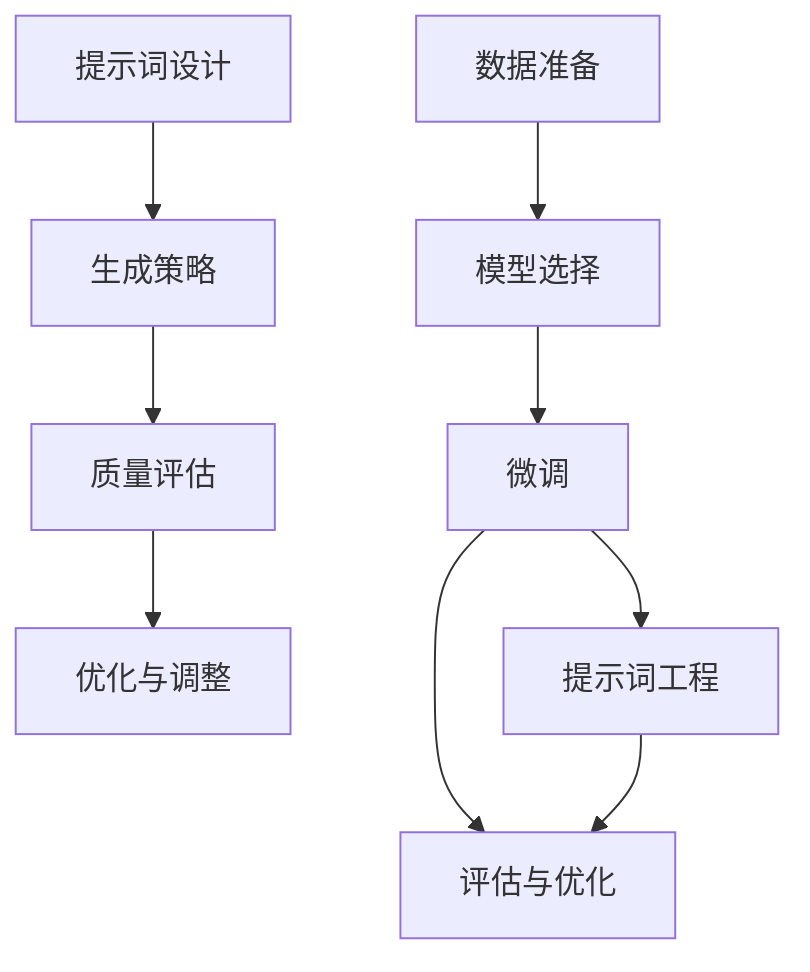

                 

### 第1章 引言

#### 1.1 书籍背景与目的

在当今的科技发展中，人工智能（AI）已成为引领变革的核心驱动力。大模型微调和提示词工程作为AI领域的关键技术，正逐渐改变着各个行业的面貌。本书旨在深入探讨这两种技术的核心概念、成本效益及其在实际应用中的效果，为读者提供全面的指导和见解。

**背景介绍**

随着计算能力的提升和数据规模的扩大，深度学习技术取得了显著的进展。特别是预训练大模型的出现，如GPT、BERT等，它们在自然语言处理（NLP）、计算机视觉（CV）等领域取得了令人瞩目的成果。然而，这些模型往往过于庞大和复杂，难以直接部署到实际应用中。微调技术应运而生，通过在特定任务上进行微调，使得大模型能够更好地适应不同的应用场景。

提示词工程则是在大模型微调的基础上，通过设计有效的提示词，使得模型能够更准确地理解和执行任务。这种技术不仅提高了模型的性能，还降低了开发成本，为AI应用的普及提供了有力支持。

**目的阐述**

本书的核心目的是：

1. **详细解析**：系统性地介绍大模型微调和提示词工程的基本原理、技术方法和应用场景。
2. **成本效益分析**：深入分析这两种技术的成本结构、优化策略，帮助读者从成本效益角度进行技术选择。
3. **实战案例**：通过实际项目案例，展示这两种技术在各种应用中的实现和效果，提供实用的开发经验。
4. **未来展望**：探讨大模型微调和提示词工程的发展趋势和潜在挑战，为未来的研究提供方向。

#### 1.2 大模型微调与提示词工程的定义与联系

**大模型微调的定义**

大模型微调是指在大规模预训练模型的基础上，利用特定领域的数据进行二次训练，以提升模型在特定任务上的性能。这个过程通常包括以下几个步骤：

1. **数据准备**：收集和预处理特定领域的数据集。
2. **模型选择**：选择合适的大规模预训练模型。
3. **微调**：在预训练模型的基础上，利用特定数据集进行训练。
4. **评估与优化**：评估微调后的模型性能，并进行必要的优化。

**提示词工程的定义**

提示词工程是通过设计有效的提示词，引导大模型执行特定任务的技术。提示词可以是单词、短语或更复杂的结构，用于提供任务上下文，帮助模型更好地理解和生成结果。主要方法包括：

1. **提示词设计**：根据任务需求设计合适的提示词。
2. **生成策略**：利用自然语言生成技术生成高质量的提示词。
3. **质量评估**：评估提示词对模型性能的影响。
4. **优化与调整**：根据评估结果调整提示词设计。

**核心概念与联系**

大模型微调和提示词工程之间存在紧密的联系：

1. **互补性**：微调提升了模型的泛化能力，而提示词工程则提供了更精确的任务指导。
2. **协同作用**：两者结合使用，可以显著提高模型的性能和效率。
3. **技术架构**：微调是提升大模型性能的基础，而提示词工程则是实现任务特定优化的关键。

为了更好地理解这两种技术之间的关系，我们可以使用Mermaid流程图来展示其核心流程和交互：

通过这个流程图，我们可以清晰地看到大模型微调和提示词工程在整个技术架构中的位置和作用。

**总结**

本章为读者提供了一个关于大模型微调和提示词工程的整体概述。通过介绍背景、目的和核心概念，读者可以初步了解这两种技术的重要性和应用前景。接下来，本书将逐步深入，详细探讨每种技术的原理、方法及其在实际应用中的效果。希望读者能够在这个基础上，对后续章节的内容保持期待，并从中获得宝贵的知识和经验。

