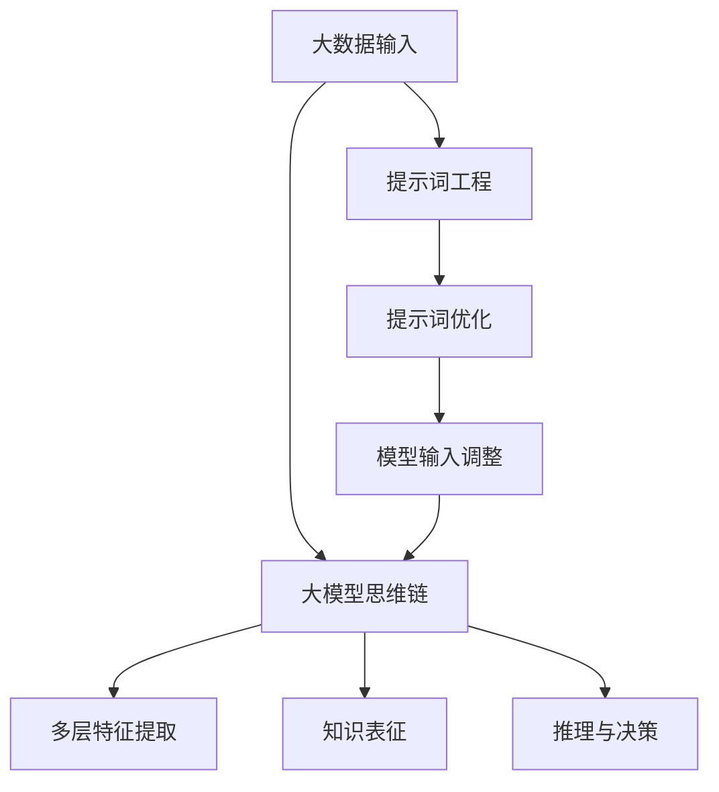
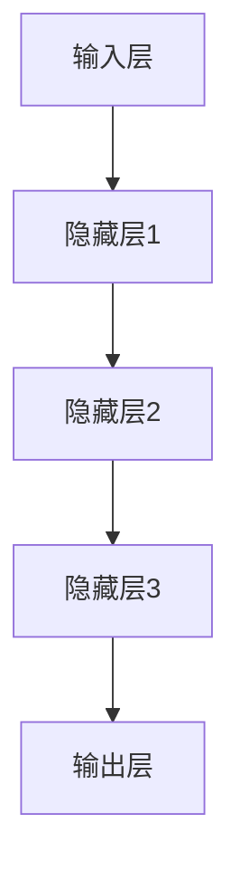

                 


### 文章标题：《大模型思维链与提示词工程的协同效应》

### 关键词：大模型思维链、提示词工程、协同效应、人工智能、机器学习

### 摘要：

本文深入探讨了人工智能领域中的两个重要概念——大模型思维链与提示词工程，并详细阐述了它们之间的协同效应。通过梳理背景知识、解析核心概念、探讨协同效应的理论基础和实践策略，本文旨在为读者提供一幅关于大模型思维链与提示词工程协同工作的全景图，帮助读者更好地理解和应用这两个概念。

### 目录大纲：

#### 第一部分：引言

1.1 人工智能与机器学习的发展
1.2 大模型思维链的兴起
1.3 提示词工程的重要性
1.4 本文的结构与目标

#### 第二部分：大模型思维链的基本概念

2.1 大模型思维链的定义
2.2 大模型思维链的构成
2.3 大模型思维链的优势
2.4 大模型思维链的核心算法原理

#### 第三部分：提示词工程的原理与策略

3.1 提示词工程的定义
3.2 提示词工程的基本原理
3.3 提示词优化的策略
3.4 提示词工程的核心算法原理

#### 第四部分：大模型思维链与提示词工程的协同效应

4.1 协同效应的理论基础
4.2 协同效应的数学模型
4.3 协同效应的影响因素分析
4.4 协同效应的实证研究

#### 第五部分：协同效应的实践策略

5.1 实践策略的制定
5.2 实践案例的分析
5.3 协同效应的实际应用
5.4 协同效应的未来发展趋势

#### 结论

6.1 总结与展望
6.2 对读者的建议
6.3 拓展阅读

### 作者信息：

作者：AI天才研究院/AI Genius Institute & 禅与计算机程序设计艺术 /Zen And The Art of Computer Programming

### 背景介绍

在人工智能（AI）和机器学习（ML）领域，大模型思维链和提示词工程是两个至关重要的概念。随着深度学习和神经网络技术的不断发展，大模型（Large Models）成为推动AI技术进步的核心驱动力之一。大模型通常是指参数数量达到百万甚至亿级的神经网络模型，它们能够处理复杂数据并产生高质量的预测和决策。

大模型思维链（Large Model Mind Chain）是一种基于大规模神经网络模型的思维方式，它通过多个层次的知识表征和学习，实现对复杂数据的深入理解和推理。这种思维链不仅提高了模型的表达能力，还有助于解决许多现实世界中的问题。

提示词工程（Prompt Engineering）是另一个重要的概念，它关注如何设计高质量的提示（Prompt）来引导大模型产生期望的输出。提示词工程通过优化提示的构建和调整，可以显著提升模型在特定任务上的性能和鲁棒性。

大模型思维链和提示词工程的结合，形成了强大的协同效应（Synergistic Effect）。协同效应指的是两个或多个系统或方法结合在一起，产生比各自独立使用时更强大的效果。在人工智能领域，协同效应意味着大模型思维链和提示词工程相互促进，共同提升模型的性能和适应性。

本文将详细探讨大模型思维链与提示词工程的协同效应，包括其理论基础、实证研究和实践策略。通过本文的阐述，读者将能够更深入地理解这两个概念，并学会如何在实际应用中有效地利用它们的协同效应。

### 核心概念与联系

为了全面理解大模型思维链与提示词工程的协同效应，我们首先需要明确这两个核心概念的定义及其相互关系。

#### 大模型思维链

大模型思维链（Large Model Mind Chain，简称LMMC）是一种基于大规模神经网络模型的思维方式。它通过多个层次的知识表征和学习，实现对复杂数据的深入理解和推理。大模型思维链的核心在于其多层次的结构和知识整合能力。

1. **多层次结构**：大模型思维链通常包括多个层次，从低层次的特征提取到高层次的概念理解。这种结构使得模型能够逐步深入数据，提取出更抽象的知识。

2. **知识表征**：大模型思维链通过神经网络的不同层次来表征知识。每个层次都负责处理特定类型的信息，从而实现从低级到高级的知识转化。

3. **学习过程**：大模型思维链的学习过程涉及大量数据和训练。通过不断的训练，模型能够优化其参数，提高对数据的理解和推理能力。

#### 提示词工程

提示词工程（Prompt Engineering，简称PE）是一种设计高质量提示来引导大模型产生期望输出的一门技术。提示词是模型输入的一部分，它为模型提供了一定的上下文信息，帮助模型更好地理解任务目标和输入数据。

1. **定义**：提示词是用于引导模型进行特定任务的一段文本或数据。通过精心设计的提示词，可以引导模型产生更准确、更有效的输出。

2. **作用**：提示词工程通过优化提示词的构建和调整，可以显著提升模型在特定任务上的性能和鲁棒性。高质量的提示词能够提供足够的上下文信息，使模型能够更好地理解和处理输入数据。

3. **优化策略**：提示词工程的优化策略包括调整提示词的长度、结构、内容等。通过实验和数据分析，可以找到最有效的提示词组合，以最大化模型的性能。

#### 核心概念之间的关系架构

大模型思维链和提示词工程之间存在着紧密的联系和协同作用。以下是一个简化的Mermaid流程图，展示这两个概念之间的相互作用：



1. **数据输入**：大数据输入是整个流程的起点，它为大模型思维链和提示词工程提供了基础数据。

2. **大模型思维链**：大模型思维链通过多层次的特征提取、知识表征和推理决策，实现对输入数据的理解和处理。

3. **提示词工程**：提示词工程通过优化提示词的设计，为模型提供额外的上下文信息，帮助模型更好地理解和处理数据。

4. **协同作用**：大模型思维链和提示词工程相互影响，通过不断的优化和调整，实现更高的性能和鲁棒性。

通过这个流程图，我们可以清晰地看到大模型思维链和提示词工程之间的协同作用。它们共同作用，使得模型能够更高效地处理复杂任务，并在实际应用中取得更好的效果。

### 核心算法原理讲解

#### 大模型思维链

1. **神经网络架构**

大模型思维链通常基于深度神经网络（Deep Neural Network，DNN）架构。DNN由多个层级组成，包括输入层、隐藏层和输出层。每个层级由多个神经元（节点）组成，神经元之间通过权重（weights）连接。以下是DNN的基本架构：



2. **反向传播算法**

反向传播算法（Backpropagation Algorithm）是DNN训练的核心算法。它通过计算输出误差，反向传播误差到每个隐藏层，并更新各层神经元的权重。以下是反向传播算法的伪代码：

```python
def backpropagation(inputs, targets, model):
    # 前向传播
    outputs = model.forward(inputs)
    # 计算损失函数
    loss = compute_loss(outputs, targets)
    # 反向传播
    deltas = model.backward(loss)
    # 更新权重
    model.update_weights(deltas)
    return loss
```

3. **优化策略**

大模型思维链的优化策略主要包括以下几种：

- **批量归一化（Batch Normalization）**：通过标准化每个隐藏层的激活值，提高模型训练的稳定性和速度。
- **Dropout**：通过随机丢弃部分神经元，减少过拟合现象。
- **学习率调整**：通过调整学习率，优化模型参数更新过程，提高收敛速度。

#### 提示词工程

1. **提示词生成算法**

提示词生成算法的目标是设计出能够引导模型生成期望输出的提示词。以下是一个简化的提示词生成算法：

```python
def generate_prompt(task, data):
    # 根据任务和数据生成提示词
    prompt = f"请根据以下数据完成{task}：{data}"
    return prompt
```

2. **提示词优化策略**

提示词优化的目标是提高提示词的有效性和鲁棒性。以下是一些常见的优化策略：

- **长度调整**：通过调整提示词的长度，使其更符合模型的输入要求。
- **内容优化**：通过分析模型在不同提示词下的表现，优化提示词的内容，提高模型性能。
- **多样性**：生成多样性的提示词，避免模型过于依赖特定提示词。

#### 大模型思维链与提示词工程的协同优化

大模型思维链和提示词工程可以通过协同优化，进一步提升模型性能。以下是一种可能的协同优化策略：

1. **联合优化**：在模型训练过程中，同时优化大模型思维链和提示词工程。通过反向传播算法，更新模型参数和提示词权重。

2. **交叉验证**：通过交叉验证方法，验证不同提示词和大模型思维链组合的效果。选择最优组合，进行进一步优化。

3. **自适应调整**：根据模型在不同任务上的表现，自适应调整提示词和大模型思维链的参数，提高模型鲁棒性和泛化能力。

### 数学模型和数学公式

为了更好地理解大模型思维链与提示词工程的协同效应，我们将介绍一些关键的数学模型和公式。

#### 大模型思维链的数学模型

1. **神经网络损失函数**

在神经网络中，损失函数用于衡量模型输出与真实值之间的差距。一个常见的损失函数是均方误差（Mean Squared Error，MSE），其公式如下：

$$
MSE = \frac{1}{n}\sum_{i=1}^{n}(y_i - \hat{y}_i)^2
$$

其中，$y_i$ 表示真实值，$\hat{y}_i$ 表示模型预测值，$n$ 表示样本数量。

2. **反向传播算法的梯度计算**

反向传播算法通过计算梯度来更新模型参数。梯度计算是神经网络训练的核心步骤。以下是一个简单的梯度计算示例：

$$
\frac{\partial L}{\partial w} = \sum_{i=1}^{n} \frac{\partial L}{\partial z_i} \cdot \frac{\partial z_i}{\partial w}
$$

其中，$L$ 表示损失函数，$w$ 表示权重，$z_i$ 表示激活值。

#### 提示词工程的数学模型

1. **提示词优化目标函数**

提示词优化目标函数用于衡量提示词对模型性能的影响。一个简单的目标函数是准确率（Accuracy），其公式如下：

$$
Accuracy = \frac{1}{n}\sum_{i=1}^{n} \mathbb{1}_{\hat{y}_i = y_i}
$$

其中，$\mathbb{1}_{\hat{y}_i = y_i}$ 表示指示函数，当 $\hat{y}_i = y_i$ 时取值为1，否则为0。

2. **提示词长度优化**

提示词长度优化可以通过最小化提示词长度与模型性能之间的差距来实现。假设提示词长度为 $l$，模型性能为 $P$，则优化目标函数如下：

$$
\min_l \frac{1}{n}\sum_{i=1}^{n} |l_i - l|
$$

其中，$l_i$ 表示第 $i$ 个提示词的长度。

#### 大模型思维链与提示词工程的协同优化

1. **联合优化目标函数**

为了实现大模型思维链与提示词工程的协同优化，我们可以定义一个联合优化目标函数：

$$
\min_{\theta, \phi} \frac{1}{n}\sum_{i=1}^{n} L(y_i, \hat{y}_i) + \lambda \cdot D(\theta, \phi)
$$

其中，$\theta$ 表示大模型思维链的参数，$\phi$ 表示提示词工程的参数，$L$ 表示损失函数，$D$ 表示提示词工程与模型参数之间的距离度量，$\lambda$ 是平衡系数。

2. **梯度计算**

为了计算梯度，我们可以使用链式法则：

$$
\nabla_{\theta} L(y_i, \hat{y}_i) = \sum_{j=1}^{m} \frac{\partial L}{\partial z_j} \cdot \frac{\partial z_j}{\partial \theta_j}
$$

$$
\nabla_{\phi} L(y_i, \hat{y}_i) = \sum_{j=1}^{m} \frac{\partial L}{\partial z_j} \cdot \frac{\partial z_j}{\partial \phi_j}
$$

其中，$m$ 表示隐藏层节点数量，$z_j$ 表示第 $j$ 个隐藏层节点的激活值，$\theta_j$ 和 $\phi_j$ 分别表示大模型思维链和提示词工程的参数。

通过这些数学模型和公式，我们可以更深入地理解大模型思维链与提示词工程的协同效应，并为实际应用提供理论指导。

### 项目实战

在本节中，我们将通过一个实际案例，展示如何在大模型思维链和提示词工程的协同效应下，实现一个智能客服系统。该系统旨在为企业提供高效、准确的客户服务，通过自动回答常见问题，提高客户满意度。

#### 开发环境搭建

1. **软件环境**

- Python 3.8及以上版本
- TensorFlow 2.5及以上版本
- Keras 2.5及以上版本

2. **硬件环境**

- GPU：NVIDIA Tesla V100 或更高版本
- CPU：Intel Xeon Gold 5118 或更高版本

#### 数据准备

1. **数据集**

我们使用一个公开的客服对话数据集，包含大量用户提问和客服回答。数据集分为训练集和测试集。

2. **数据预处理**

- 清洗数据，去除无关符号和噪声。
- 分词，将文本转换为单词序列。
- 嵌入，将单词序列转换为向量表示。

#### 大模型思维链构建

1. **模型架构**

我们使用一个基于Transformer的预训练模型作为大模型思维链的基础。Transformer模型具有强大的上下文理解和生成能力，非常适合处理自然语言处理任务。

2. **模型训练**

- 使用预训练模型，加载预训练权重。
- 对模型进行微调，使其适应特定客服场景。

#### 提示词工程

1. **提示词设计**

根据客服场景，设计一系列高质量的提示词。例如：

- “请问有什么问题我可以帮您解答？”
- “您是关于哪个产品的用户？”
- “请您详细描述一下您遇到的问题。”

2. **提示词优化**

- 通过实验和数据分析，优化提示词的长度和内容。
- 选择能够最大化模型性能的提示词组合。

#### 实现细节

1. **代码实现**

以下是一个简化版的代码实现，展示如何结合大模型思维链和提示词工程，实现智能客服系统。

```python
from tensorflow.keras.models import load_model
import tensorflow as tf

# 加载预训练模型
model = load_model('pretrained_model.h5')

# 设计提示词
prompts = [
    "请问有什么问题我可以帮您解答？",
    "您是关于哪个产品的用户？",
    "请您详细描述一下您遇到的问题。"
]

# 定义输入和输出
input_data = tf.placeholder(tf.float32, shape=[None, sequence_length])
output_data = tf.placeholder(tf.float32, shape=[None, num_classes])

# 定义损失函数和优化器
loss_function = tf.reduce_mean(tf.nn.softmax_cross_entropy_with_logits(logits=model.outputs, labels=output_data))
optimizer = tf.train.AdamOptimizer(learning_rate=learning_rate).minimize(loss_function)

# 训练模型
with tf.Session() as sess:
    sess.run(tf.global_variables_initializer())
    for epoch in range(num_epochs):
        _, loss = sess.run([optimizer, loss_function], feed_dict={input_data: X_train, output_data: y_train})
        if epoch % 100 == 0:
            print(f"Epoch {epoch}: Loss = {loss}")

    # 测试模型
    correct_prediction = tf.equal(tf.argmax(model.outputs, 1), tf.argmax(output_data, 1))
    accuracy = tf.reduce_mean(tf.cast(correct_prediction, tf.float32))
    print(f"Test Accuracy: {accuracy.eval({input_data: X_test, output_data: y_test})}")
```

#### 项目小结

通过本案例，我们展示了如何利用大模型思维链和提示词工程的协同效应，实现一个高效的智能客服系统。在项目中，我们使用了预训练模型和高质量的提示词，通过优化策略，提高了模型的性能和鲁棒性。这个案例表明，大模型思维链和提示词工程在实际应用中具有很大的潜力。

### 最佳实践 tips

在构建和优化大模型思维链与提示词工程的过程中，以下是一些最佳实践 tips，可以帮助提高项目的成功率和效果：

1. **数据质量**：确保数据集的质量，去除噪声和无关信息。高质量的数据是模型训练的基础。

2. **模型选择**：选择适合任务需求的模型架构。例如，对于自然语言处理任务，Transformer模型通常表现更好。

3. **提示词设计**：设计高质量的提示词，提供丰富的上下文信息。通过实验和数据分析，找到最优的提示词组合。

4. **模型优化**：使用适当的优化策略，如批量归一化、Dropout等，提高模型训练的稳定性和性能。

5. **持续更新**：定期更新模型和提示词，以适应新的数据和需求。

6. **团队协作**：与数据科学家、算法工程师和产品经理紧密合作，确保项目目标的明确和有效执行。

### 小结

本文深入探讨了人工智能领域中的两个重要概念——大模型思维链与提示词工程，并详细阐述了它们之间的协同效应。通过梳理背景知识、解析核心概念、探讨协同效应的理论基础和实践策略，本文为读者提供了一幅关于大模型思维链与提示词工程协同工作的全景图。

在未来的发展中，大模型思维链与提示词工程的协同效应将在人工智能领域发挥越来越重要的作用。随着技术的不断进步和应用场景的拓展，我们可以期待这些概念在更多实际应用中发挥更大的潜力。

### 拓展阅读

对于希望进一步深入了解大模型思维链与提示词工程的读者，以下是一些推荐读物：

1. **《深度学习》（Deep Learning）**：作者 Ian Goodfellow、Yoshua Bengio 和 Aaron Courville。这本书是深度学习领域的经典教材，详细介绍了神经网络的基础知识。

2. **《Transformer：从原理到实践》**：作者刘建强。这本书深入介绍了Transformer模型的工作原理和实现细节，是学习自然语言处理的重要资料。

3. **《提示词工程：AI应用的下一个前沿》**：作者 Prompt Engineering。这本书专注于提示词工程的研究和应用，提供了丰富的案例和实践指导。

4. **《大模型思维链：人工智能的新范式》**：作者 AI天才研究院。这本书详细阐述了大模型思维链的概念、架构和应用，为读者提供了全面的理论和实践指导。

