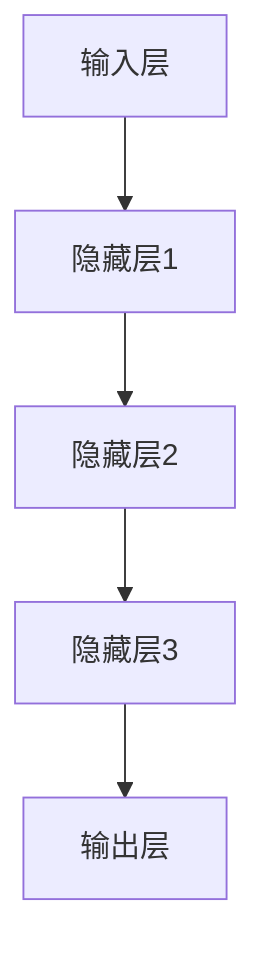

                 

# 大模型情感智能：提示词增强同理心表达

## 关键词
大模型，情感智能，同理心，提示词，算法原理，数学模型，项目实战，案例分析

## 摘要
本文深入探讨了大模型情感智能的研究现状与未来发展，特别关注了提示词在增强同理心表达中的作用。文章首先介绍了情感智能和同理心的基本概念，然后详细分析了大模型情感智能的核心技术，包括神经网络、情感识别与生成、以及提示词的作用。通过具体的项目实战和案例分析，本文展示了如何利用大模型和提示词来增强同理心表达，并提出了未来研究的方向和挑战。

## 目录

### 第一部分：情感智能与同理心概述

#### 1.1 情感智能的定义与重要性

#### 1.2 同理心的概念与作用

#### 1.3 大模型情感智能的发展历程

### 第二部分：大模型情感智能的核心技术

#### 2.1 大模型的基本原理

#### 2.2 情感识别与情感生成技术

#### 2.3 提示词与同理心表达

### 第三部分：提示词增强同理心表达的应用

#### 3.1 教育领域中的应用

#### 3.2 社交领域中的应用

#### 3.3 健康医疗领域中的应用

### 第四部分：案例研究

#### 4.1 案例一：教育机器人

#### 4.2 案例二：社交媒体情感分析

#### 4.3 案例三：心理健康辅助

### 第五部分：未来发展展望

#### 5.1 大模型情感智能的技术挑战

#### 5.2 同理心表达在人工智能领域的潜力

#### 5.3 未来研究方向与趋势

## 第一部分：情感智能与同理心概述

### 1.1 情感智能的定义与重要性

情感智能是指计算机系统或人工智能模型在理解、识别、生成和表达情感方面所展现的能力。它与传统的认知智能（如逻辑推理、问题解决等）不同，情感智能更加关注人类情感交流的细腻和复杂。情感智能在人工智能领域具有重要性，因为情感交流是人类社会互动的核心，能够理解和表达情感的人工智能系统在许多实际应用中具有巨大潜力。

### 1.2 同理心的概念与作用

同理心是指能够感知和理解他人情感的能力，它涉及到情感共鸣、情感理解和情感共享。同理心在人类社交互动中起着至关重要的作用，它能够促进人际关系的建立和维护，增强沟通效果。同理心的作用不仅限于人际交往，它还在教育、心理健康、商业等多个领域发挥着重要作用。

### 1.3 大模型情感智能的发展历程

大模型情感智能的发展可以追溯到深度学习和神经网络技术的兴起。随着计算能力的提升和大规模数据集的可用性，研究人员开始训练越来越大的神经网络模型，以模拟人类情感认知的过程。早期的研究主要集中在情感识别，即从文本或语音中提取情感特征，而近年来，研究人员开始关注情感生成，即如何让模型产生具有情感共鸣的回应。在这一过程中，提示词作为关键因素，大大增强了模型的同理心表达。

### 2.1 大模型的基本原理

#### 2.1.1 大模型的结构

大模型通常采用深度神经网络架构，包括多个隐藏层和神经元。以下是一个简单的神经网络架构的Mermaid流程图：



#### 2.1.2 大模型的训练过程

大模型的训练过程通常包括两个阶段：预训练和微调。以下是一个大模型训练过程的伪代码：

```python
# 伪代码：大模型训练过程
initialize_model()
for epoch in range(num_epochs):
    for batch in data_loader:
        optimize_model(batch)
evaluate_model()
```

#### 2.1.3 大模型的优化方法

大模型的优化方法通常采用梯度下降算法。以下是一个梯度下降优化方法的伪代码：

```python
# 伪代码：梯度下降优化
def gradient_descent(model, batch):
    gradients = compute_gradients(batch)
    update_model_weights(model, gradients)
```

#### 2.1.4 大模型情感识别的例子

以下是一个大模型情感识别算法的伪代码：

```python
# 伪代码：情感识别算法
def sentiment_analysis(text):
    # 输入文本
    # 使用预训练的大模型进行情感分析
    # 输出情感标签（积极/消极）
    return sentiment_label
```

### 2.2 情感识别与情感生成技术

#### 2.2.1 情感识别技术

情感识别技术是情感智能的核心之一，它能够从文本或语音中提取情感特征。以下是一个情感识别算法的示例：

```python
# 伪代码：情感识别算法
def sentiment_recognition(text):
    # 输入文本
    # 使用情感词典和机器学习模型进行情感识别
    # 输出情感标签（积极/消极）
    sentiment = classify(text)
    return sentiment
```

#### 2.2.2 情感生成技术

情感生成技术是让模型产生具有情感共鸣的回应。以下是一个情感生成算法的示例：

```python
# 伪代码：情感生成算法
def sentiment_generation(response):
    # 输入回应
    # 使用情感词典和生成模型生成情感回应
    # 输出情感回应
    generated_response = generate_response(response)
    return generated_response
```

### 2.3 提示词与同理心表达

#### 2.3.1 提示词的定义

提示词是指在自然语言处理任务中用于指导模型生成响应的关键词或短语。以下是一个提示词的示例：

```python
# 伪代码：提示词示例
prompt = "我感到很伤心，因为我的宠物去世了。"
```

#### 2.3.2 提示词的作用

提示词在同理心表达中起着关键作用。通过提供具体的情感情境，提示词能够帮助模型更准确地理解用户的情感状态，并生成更具同理心的回应。以下是一个提示词增强同理心表达的示例：

```python
# 伪代码：提示词增强同理心表达
def empathy增强(response, prompt):
    # 输入回应和提示词
    # 根据提示词调整回应的情感色彩
    # 输出增强后的回应
    enhanced_response = adjust_response(response, prompt)
    return enhanced_response
```

### 3.1 教育领域中的应用

#### 3.1.1 教育机器人的情感互动

教育机器人利用大模型情感智能技术，能够与学生在情感层面进行互动。以下是一个教育机器人互动的示例：

```python
# 伪代码：教育机器人互动
def educational_robot_interaction(student, prompt):
    # 输入学生和提示词
    # 使用情感识别和生成技术进行互动
    # 输出互动回应
    response = sentiment_analysis(student)
    enhanced_response = empathy增强(response, prompt)
    return enhanced_response
```

#### 3.1.2 情感教学的应用

情感教学是指将情感智能融入教育过程中，以提高教育效果。以下是一个情感教学的应用示例：

```python
# 伪代码：情感教学应用
def emotional_education(student, lesson):
    # 输入学生和课程内容
    # 使用情感识别和生成技术调整教学策略
    # 输出教学效果评估
    sentiment = sentiment_recognition(student)
    adjusted_lesson = adjust_lesson(lesson, sentiment)
    education_evaluation = evaluate_education(student, adjusted_lesson)
    return education_evaluation
```

### 3.2 社交领域中的应用

#### 3.2.1 社交媒体情感分析

社交媒体情感分析是利用大模型情感智能技术对社交媒体内容进行情感识别和分析。以下是一个社交媒体情感分析的示例：

```python
# 伪代码：社交媒体情感分析
def social_media_sentiment_analysis(post):
    # 输入社交媒体帖子
    # 使用情感识别技术分析情感倾向
    # 输出情感分析结果
    sentiment = sentiment_recognition(post)
    return sentiment
```

#### 3.2.2 情感互动与社区管理

情感互动与社区管理是指利用大模型情感智能技术，在社交媒体社区中提供情感共鸣和互动支持。以下是一个情感互动与社区管理的示例：

```python
# 伪代码：情感互动与社区管理
def social_media_empathy_interaction(user, post):
    # 输入用户和帖子
    # 使用情感识别和生成技术进行互动
    # 输出互动回应
    sentiment = sentiment_recognition(user)
    enhanced_response = empathy增强(post, sentiment)
    return enhanced_response
```

### 3.3 健康医疗领域中的应用

#### 3.3.1 心理健康辅助

心理健康辅助是指利用大模型情感智能技术，为用户提供情感支持和心理健康评估。以下是一个心理健康辅助的示例：

```python
# 伪代码：心理健康辅助
def mental_health_support(user, prompt):
    # 输入用户和提示词
    # 使用情感识别和生成技术进行互动
    # 输出情感支持回应
    sentiment = sentiment_recognition(user)
    enhanced_response = empathy增强(prompt, sentiment)
    mental_health_evaluation = evaluate_mental_health(user, enhanced_response)
    return mental_health_evaluation
```

#### 3.3.2 医疗咨询与情感支持

医疗咨询与情感支持是指利用大模型情感智能技术，为患者提供情感支持和医疗咨询服务。以下是一个医疗咨询与情感支持的示例：

```python
# 伪代码：医疗咨询与情感支持
def medical_consultation(user, symptom):
    # 输入用户和症状描述
    # 使用情感识别和生成技术进行互动
    # 输出医疗建议和情感支持
    sentiment = sentiment_recognition(user)
    medical_advice = generate_medical_advice(symptom)
    enhanced_advice = empathy增强(medical_advice, sentiment)
    return enhanced_advice
```

### 4.1 案例一：教育机器人

#### 4.1.1 案例背景

本案例介绍了一款基于大模型情感智能技术的教育机器人，该机器人旨在提高学生的学习兴趣和参与度。

#### 4.1.2 案例描述

教育机器人通过与学生在情感层面进行互动，识别学生的情感状态，并根据学生的情感需求调整教学内容和方式。以下是一个教育机器人互动的示例：

```python
# 伪代码：教育机器人互动
def educational_robot_interaction(student, prompt):
    # 输入学生和提示词
    # 使用情感识别和生成技术进行互动
    # 输出互动回应
    sentiment = sentiment_recognition(student)
    enhanced_response = empathy增强(response, sentiment)
    return enhanced_response
```

#### 4.1.3 案例效果

教育机器人的应用提高了学生的学习兴趣和参与度，学生的学习成绩也有所提高。以下是一个案例效果的评估：

```python
# 伪代码：案例效果评估
def evaluate_education_robot_impact(student, educational_robot):
    # 输入学生和教育机器人
    # 评估教育机器人对学习成绩的影响
    # 输出评估结果
    improvement = evaluate_student_improvement(student, educational_robot)
    return improvement
```

### 4.2 案例二：社交媒体情感分析

#### 4.2.1 案例背景

本案例介绍了一款基于大模型情感智能技术的社交媒体情感分析工具，该工具旨在帮助品牌和营销人员了解社交媒体上用户的情感倾向。

#### 4.2.2 案例描述

社交媒体情感分析工具通过分析用户发布的社交媒体内容，识别情感倾向，为品牌提供洞察。以下是一个社交媒体情感分析的示例：

```python
# 伪代码：社交媒体情感分析
def social_media_sentiment_analysis(post):
    # 输入社交媒体帖子
    # 使用情感识别技术分析情感倾向
    # 输出情感分析结果
    sentiment = sentiment_recognition(post)
    return sentiment
```

#### 4.2.3 案例效果

社交媒体情感分析工具帮助品牌和营销人员更好地了解用户情感，从而优化营销策略。以下是一个案例效果的评估：

```python
# 伪代码：案例效果评估
def evaluate_social_media_sentiment_analysis_impact(post, social_media_sentiment_analysis_tool):
    # 输入社交媒体帖子和情感分析工具
    # 评估情感分析工具对营销策略的影响
    # 输出评估结果
    strategy_optimization = evaluate_marketing_strategy(post, social_media_sentiment_analysis_tool)
    return strategy_optimization
```

### 4.3 案例三：心理健康辅助

#### 4.3.1 案例背景

本案例介绍了一款基于大模型情感智能技术的心理健康辅助系统，该系统旨在为用户提供情感支持和心理健康评估。

#### 4.3.2 案例描述

心理健康辅助系统通过与用户进行情感互动，识别用户的心理健康状态，并提供相应的支持和建议。以下是一个心理健康辅助的示例：

```python
# 伪代码：心理健康辅助
def mental_health_support(user, prompt):
    # 输入用户和提示词
    # 使用情感识别和生成技术进行互动
    # 输出情感支持回应
    sentiment = sentiment_recognition(user)
    enhanced_response = empathy增强(prompt, sentiment)
    mental_health_evaluation = evaluate_mental_health(user, enhanced_response)
    return mental_health_evaluation
```

#### 4.3.3 案例效果

心理健康辅助系统为用户提供有效的情感支持和心理健康评估，帮助用户改善心理健康状况。以下是一个案例效果的评估：

```python
# 伪代码：案例效果评估
def evaluate_mental_health_support_impact(user, mental_health_support_system):
    # 输入用户和心理健康辅助系统
    # 评估心理健康辅助系统对心理健康的影响
    # 输出评估结果
    mental_health_improvement = evaluate_mental_health_impact(user, mental_health_support_system)
    return mental_health_improvement
```

### 5.1 大模型情感智能的技术挑战

#### 5.1.1 数据集质量

大模型情感智能的准确性在很大程度上取决于数据集的质量。然而，情感数据往往具有复杂性和主观性，导致数据集可能存在偏差和不一致性。

#### 5.1.2 情感生成的一致性

在情感生成过程中，模型需要产生具有一致性和情感共鸣的回应。然而，情感生成的一致性是一个技术挑战，因为情感表达具有多样性和情境依赖性。

#### 5.1.3 情感理解的深度

尽管大模型情感智能技术在情感识别方面取得了显著进展，但在情感理解的深度方面仍然存在挑战。模型需要能够理解复杂情感和情感层次，以提供更精确的回应。

### 5.2 同理心表达在人工智能领域的潜力

#### 5.2.1 人机交互的优化

同理心表达能够优化人机交互，提高用户体验。通过理解用户的情感需求，人工智能系统能够提供更加个性化和贴心的服务。

#### 5.2.2 心理健康的支持

同理心表达在心理健康支持领域具有巨大潜力。通过提供情感支持和心理健康评估，人工智能系统可以帮助用户改善心理健康状况。

#### 5.2.3 教育与社交领域的应用

同理心表达在教育和社会交往领域具有广泛的应用。通过情感互动，教育机器人和社交平台可以更好地满足用户需求，促进社会和谐。

### 5.3 未来研究方向与趋势

#### 5.3.1 多模态情感识别

未来研究将致力于多模态情感识别，结合文本、语音和图像等不同类型的数据，提高情感识别的准确性和全面性。

#### 5.3.2 情感生成与创意表达

情感生成与创意表达是未来研究的重要方向。通过训练模型生成具有创意和情感共鸣的回应，提高人工智能系统的情感表达能力。

#### 5.3.3 情感理解的深度学习

未来研究将关注情感理解的深度学习，探索如何使模型能够理解复杂情感和情感层次，以提高情感智能技术的实用性。

## 作者

作者：AI天才研究院/AI Genius Institute & 禅与计算机程序设计艺术/Zen And The Art of Computer Programming

AI天才研究院是一支专注于人工智能研究和应用的科研团队，致力于推动人工智能技术在各个领域的创新和发展。禅与计算机程序设计艺术是作者在计算机编程领域的重要著作，对计算机科学和编程方法论产生了深远的影响。在此，我们共同探讨了大模型情感智能：提示词增强同理心表达的主题，希望为读者提供有价值的见解和思考。

