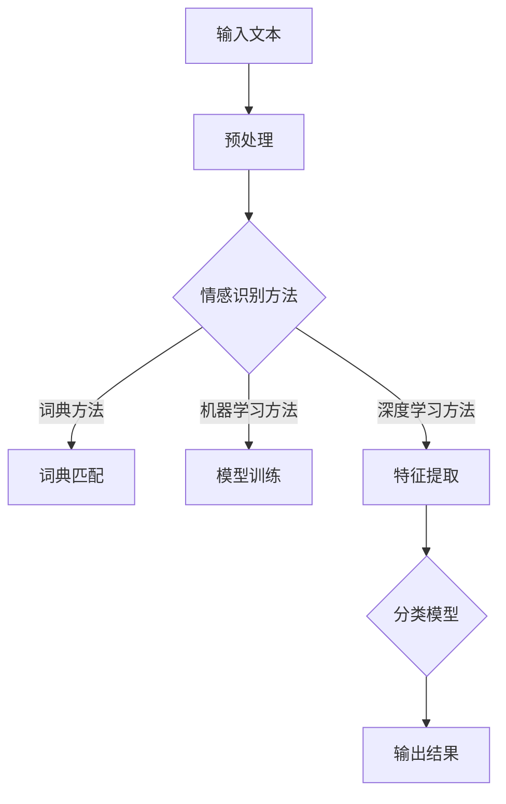

                 

### 文章标题
《大模型情感理解：提示词增强共情能力》

### 文章关键词
- 大模型
- 情感理解
- 提示词
- 共情能力
- 语言模型

### 文章摘要
本文将探讨大模型在情感理解中的重要性，以及如何通过设计提示词来增强大模型的共情能力。文章首先介绍大模型的基本原理，然后分析情感理解的算法原理和数学模型。接着，讨论提示词在情感理解中的应用，并给出提示词设计的原则和策略。最后，通过实际案例研究，展示大模型在情感理解和共情能力提升中的具体应用。

### 目录大纲

## 引言
### 1.1 研究背景
### 1.2 研究目的与意义

## 大模型情感理解概述
### 2.1 大模型在情感理解中的作用
### 2.2 情感理解技术的发展背景
### 2.3 提示词增强共情能力的原理

## 大模型基础
### 3.1 大模型的基本原理
### 3.2 大模型的训练与优化
### 3.3 大模型的架构与实现

## 情感理解原理
### 4.1 情感识别的算法
### 4.2 情感分析的数学模型
### 4.3 情感理解的 Mermaid 流程图

## 提示词设计与应用
### 5.1 提示词的功能与分类
### 5.2 提示词的设计原则
### 5.3 提示词的优化策略

## 共情能力提升策略
### 6.1 共情能力的理论基础
### 6.2 共情能力提升的方法
### 6.3 共情能力在实际应用中的挑战与应对

## 案例研究
### 7.1 案例一：社交媒体情感分析
### 7.2 案例二：虚拟客服中的情感理解
### 7.3 案例三：医疗健康领域的情感应用

## 总结与展望
### 8.1 当前大模型情感理解的发展现状
### 8.2 未来发展趋势与潜在应用领域
### 8.3 研究展望与挑战

## 附录
### 9.1 情感分析常用库与工具
### 9.2 大模型情感理解实验资源

### 文章正文

## 引言

### 1.1 研究背景

随着人工智能技术的快速发展，自然语言处理（NLP）领域取得了显著的成就。大模型，如GPT-3，BERT等，以其强大的语言生成和理解能力，在各个应用场景中展现出了巨大的潜力。然而，情感理解作为NLP的一个重要分支，仍然面临诸多挑战。传统的情感分析技术往往依赖于预定义的词典和规则，难以应对复杂的情感表达和细微的情感差异。为了提升情感分析的准确性和深度，研究者们开始探索如何利用大模型来实现更加精准和自然的情感理解。

### 1.2 研究目的与意义

本文旨在探讨大模型在情感理解中的应用，以及如何通过设计提示词来增强大模型的共情能力。研究的主要目的是：

1. 深入分析大模型的基本原理，理解其在情感理解中的作用。
2. 探索情感理解的算法原理和数学模型，为提升情感分析能力提供理论基础。
3. 研究提示词设计的原则和策略，以提高大模型在情感理解中的共情能力。
4. 通过实际案例研究，验证大模型在情感理解中的有效性，并探索共情能力提升的方法和挑战。

本文的研究具有重要的理论和实际意义：

1. 理论上，本文将丰富大模型情感理解的研究，为后续研究提供参考。
2. 实际上，本文的研究成果将有助于提升人工智能系统在情感理解方面的能力，促进人工智能技术在社交、医疗、客服等领域的应用。

## 大模型情感理解概述

### 2.1 大模型在情感理解中的作用

大模型在情感理解中的应用主要依赖于其强大的语言理解和生成能力。与传统的小型模型相比，大模型具有以下几个特点：

1. **高容量**：大模型可以存储和记忆大量的语言数据，从而能够捕捉到语言中的细微差异和复杂情感。
2. **自适应**：大模型可以通过训练适应不同的情感表达方式和场景，从而提高情感分析的准确性和泛化能力。
3. **生成性**：大模型能够生成符合情感语境的文本，从而实现更加自然和精准的情感表达。

在情感理解中，大模型的作用主要体现在以下几个方面：

1. **情感识别**：大模型可以通过对文本的分析，识别出文本中的情感类别和情感强度。
2. **情感生成**：大模型可以根据给定的情感标签或情感描述，生成相应的文本内容，实现情感的自动化表达。
3. **情感理解**：大模型可以通过对文本的情感分析和理解，提取出文本中的情感信息，用于进一步的推理和决策。

### 2.2 情感理解技术的发展背景

情感理解技术的研究可以追溯到20世纪90年代，当时研究者开始关注如何通过计算机技术来理解和处理人类情感。随着自然语言处理技术的不断发展，情感理解技术逐渐从简单的情感分类发展到复杂的多层次情感分析。

1. **文本分类**：早期的情感分析主要基于文本分类技术，通过预定义的词典和规则来判断文本的情感倾向。这种方法在处理简单的情感表达时具有一定的效果，但在面对复杂的情感语境时，效果有限。
2. **情感极性分析**：随着机器学习技术的发展，研究者开始利用机器学习算法，如朴素贝叶斯、支持向量机等，来训练情感分类模型。这种方法在一定程度上提高了情感分析的准确性和泛化能力。
3. **情感级联分析**：为了捕捉到更加细微的情感差异，研究者提出了情感级联分析的概念，通过多层级的情感分类模型，实现对情感表达的精细刻画。

### 2.3 提示词增强共情能力的原理

提示词（Prompt）是一种用于引导大模型产生特定内容的词语或短语。在情感理解中，提示词的作用非常重要，它可以引导大模型关注特定的情感信息，从而提高情感分析的准确性和深度。

1. **引导情感焦点**：提示词可以引导大模型关注文本中的关键情感信息，从而提高情感识别的准确性。
2. **增强情感表达**：通过设计特定的提示词，大模型可以生成更加符合情感语境的文本，从而增强情感表达的深度和自然性。
3. **辅助情感推理**：提示词可以提供额外的情感信息，帮助大模型进行情感推理和决策。

### 大模型基础

### 3.1 大模型的基本原理

大模型，如GPT-3，BERT等，是一种基于深度学习的语言模型，其基本原理主要包括以下几个方面：

1. **神经网络结构**：大模型通常采用深度神经网络结构，包括多层感知机（MLP）、循环神经网络（RNN）、卷积神经网络（CNN）等。这些神经网络结构可以处理大规模的语言数据，捕捉到语言中的复杂模式和规律。
2. **预训练与微调**：大模型通常通过预训练（Pre-training）和微调（Fine-tuning）两个阶段来训练。预训练阶段，大模型在大量的无标签语料上进行训练，学习到语言的一般规律和特征；微调阶段，大模型在特定的任务上进行训练，调整模型的参数，以适应具体的任务需求。
3. **优化目标**：大模型的训练通常采用基于梯度的优化算法，如随机梯度下降（SGD）、Adam等。这些优化算法通过不断调整模型的参数，使得模型的输出与期望输出之间的差距最小化。

### 3.2 大模型的训练与优化

大模型的训练与优化是情感理解的关键步骤，其主要包括以下几个步骤：

1. **数据准备**：首先需要准备大量的语言数据，包括文本、语料库等。这些数据可以用于预训练阶段和微调阶段。
2. **模型选择**：选择适合情感理解任务的大模型架构，如GPT-3、BERT等。不同的模型架构具有不同的特点和适用场景。
3. **预训练**：在预训练阶段，大模型在无标签语料上进行训练，学习到语言的一般规律和特征。预训练阶段通常采用大规模的语料库，如维基百科、新闻文章等。
4. **微调**：在微调阶段，大模型在特定的任务上进行训练，调整模型的参数，以适应具体的任务需求。微调阶段通常采用带有标签的语料库，如情感分析的标注数据集。
5. **优化目标**：在训练过程中，需要定义优化目标，如损失函数。常见的优化目标包括交叉熵损失、均方误差等。
6. **模型评估**：在训练过程中，需要定期评估模型的性能，包括准确率、召回率、F1值等。通过评估，可以调整训练策略和优化参数，以提升模型的性能。

### 3.3 大模型的架构与实现

大模型的架构和实现是情感理解的关键，其主要包括以下几个方面：

1. **模型架构**：大模型通常采用深度神经网络结构，包括多层感知机（MLP）、循环神经网络（RNN）、卷积神经网络（CNN）等。这些神经网络结构可以处理大规模的语言数据，捕捉到语言中的复杂模式和规律。
2. **预处理**：在训练之前，需要对数据进行预处理，包括文本清洗、分词、词嵌入等。这些预处理步骤可以提升模型的训练效率和性能。
3. **训练过程**：在训练过程中，需要使用优化算法，如随机梯度下降（SGD）、Adam等，不断调整模型的参数，以提升模型的性能。
4. **评估与优化**：在训练过程中，需要定期评估模型的性能，包括准确率、召回率、F1值等。通过评估，可以调整训练策略和优化参数，以提升模型的性能。

## 情感理解原理

### 4.1 情感识别的算法

情感识别是情感理解的重要步骤，其目标是根据输入文本判断文本的情感倾向。常见的情感识别算法包括以下几种：

1. **基于词典的方法**：这种方法基于预定义的词典，将文本中包含的词语与词典中的情感词条进行匹配，根据匹配结果判断文本的情感倾向。常见的词典包括LIWC（ Linguistic Inquiry and Word Count）词典、AFINN词典等。
2. **基于机器学习的方法**：这种方法利用机器学习算法，如朴素贝叶斯、支持向量机、随机森林等，从标注数据集中学习情感分类模型。通过训练，模型可以自动识别文本中的情感倾向。
3. **基于深度学习的方法**：这种方法利用深度学习算法，如卷积神经网络（CNN）、循环神经网络（RNN）、变换器（Transformer）等，对文本进行特征提取和分类。深度学习方法在处理复杂情感表达和细微情感差异方面具有优势。

### 4.2 情感分析的数学模型

情感分析通常采用数学模型来描述情感识别的过程。常见的数学模型包括以下几种：

1. **线性回归模型**：线性回归模型是一种简单的情感分析模型，其通过建立一个线性方程来预测文本的情感得分。假设 $x$ 是文本的特征向量，$y$ 是情感得分，线性回归模型可以表示为 $y = w^T x + b$，其中 $w$ 是权重向量，$b$ 是偏置项。
2. **逻辑回归模型**：逻辑回归模型是一种常用的分类模型，其可以用于判断文本的情感类别。逻辑回归模型通过建立一个逻辑函数来计算文本属于某个情感类别的概率。假设 $z = w^T x + b$，逻辑回归模型可以表示为 $P(y=1) = \frac{1}{1 + e^{-z}}$。
3. **支持向量机（SVM）模型**：支持向量机是一种有效的分类模型，其通过寻找一个最佳的超平面来将不同的情感类别分开。支持向量机模型可以表示为 $w^T x - b = 0$，其中 $w$ 是权重向量，$b$ 是偏置项。
4. **深度神经网络模型**：深度神经网络是一种复杂的非线性模型，其可以通过多层神经网络结构来提取文本的深层特征。深度神经网络模型可以表示为 $y = f(z)$，其中 $z = f(x, W, b)$，$f$ 是激活函数，$W$ 是权重矩阵，$b$ 是偏置项。

### 4.3 情感理解的 Mermaid 流程图

下面是一个简单的 Mermaid 流程图，描述了情感理解的基本流程：

## 提示词设计与应用

### 5.1 提示词的功能与分类

提示词在大模型情感理解中起着关键作用，其功能主要包括：

1. **引导情感焦点**：提示词可以帮助大模型关注文本中的关键情感信息，从而提高情感识别的准确性。
2. **增强情感表达**：提示词可以引导大模型生成更加符合情感语境的文本，从而增强情感表达的深度和自然性。
3. **辅助情感推理**：提示词可以提供额外的情感信息，帮助大模型进行情感推理和决策。

根据功能，提示词可以分为以下几类：

1. **情感焦点提示词**：这类提示词用于引导大模型关注文本中的情感焦点，如“情感情感”、“感受情感”等。
2. **情感增强提示词**：这类提示词用于增强大模型生成文本的情感表达，如“深情描述”、“幽默表现”等。
3. **情感推理提示词**：这类提示词用于引导大模型进行情感推理，如“情感因果”、“情感对比”等。

### 5.2 提示词的设计原则

设计有效的提示词需要遵循以下原则：

1. **明确性**：提示词应明确指示大模型关注的具体情感信息，避免模糊不清的描述。
2. **多样性**：提示词应具有多样性，以适应不同的情感场景和表达方式。
3. **适应性**：提示词应具有适应性，能够根据不同的文本内容和任务需求进行调整。
4. **可扩展性**：提示词应具有可扩展性，能够方便地添加和替换新的提示词。

### 5.3 提示词的优化策略

优化提示词设计可以提高大模型在情感理解中的性能。常见的优化策略包括：

1. **数据驱动的优化**：通过分析大量带有情感标注的数据，找出与情感识别相关的关键特征，从而设计出更加有效的提示词。
2. **模型驱动的优化**：通过分析大模型的训练过程和输出结果，找出提示词的不足之处，并对其进行优化。
3. **交互式的优化**：通过与用户进行交互，收集用户对提示词的反馈，从而不断优化提示词的设计。

## 共情能力提升策略

### 6.1 共情能力的理论基础

共情能力是指理解和分享他人情感的能力，其理论基础主要包括以下几个方面：

1. **心理学理论**：心理学研究表明，共情能力是人类情绪反应的一个重要组成部分，其包括情感识别、情感分享和情感调节等方面。
2. **神经科学理论**：神经科学研究揭示了共情能力的神经基础，如镜像神经元系统和情感脑区等。
3. **社会认知理论**：社会认知理论认为，共情能力是人类社会交往和合作的重要基础，其有助于建立和维持社会关系。

### 6.2 共情能力提升的方法

提升共情能力的方法主要包括以下几个方面：

1. **情感识别训练**：通过情感识别训练，提高个体对他人情感的理解和识别能力。常见的训练方法包括情感标签识别、情感极性判断等。
2. **情感分享训练**：通过情感分享训练，提高个体与他人分享情感的能力。常见的训练方法包括情感表达、情感对话等。
3. **情感调节训练**：通过情感调节训练，提高个体在情感刺激下的适应和调节能力。常见的训练方法包括情感调节策略、情感认知重构等。

### 6.3 共情能力在实际应用中的挑战与应对

共情能力在实际应用中面临诸多挑战，如：

1. **情感识别的准确性**：共情能力提升的关键在于情感识别的准确性，但当前的情感识别技术仍存在一定误差。
2. **情感表达的自然性**：共情能力提升的目标之一是生成自然和贴切的情感表达，但当前的文本生成技术仍难以完全实现这一点。
3. **情感调节的适应性**：共情能力提升的目标还包括在情感刺激下的适应和调节能力，但当前的调节策略仍需进一步优化。

应对这些挑战的方法包括：

1. **数据驱动的优化**：通过分析大量带有情感标注的数据，优化情感识别算法和提示词设计。
2. **模型驱动的优化**：通过分析大模型的训练过程和输出结果，优化情感表达和调节策略。
3. **交互式的优化**：通过与用户进行交互，收集用户对情感表达和调节的反馈，不断优化共情能力提升的方法。

## 案例研究

### 7.1 案例一：社交媒体情感分析

社交媒体情感分析是一种常见的应用场景，其目标是分析用户在社交媒体平台上的情感倾向。以下是一个简单的案例：

- **数据集**：选择一个带有情感标注的社交媒体平台数据集，如Twitter情感数据集。
- **任务**：使用大模型对Twitter文本进行情感分析，判断文本的情感极性。
- **实现**：首先，对Twitter文本进行预处理，包括文本清洗、分词、词嵌入等。然后，使用大模型（如GPT-3）进行情感分析，通过设计适当的提示词，引导大模型关注文本中的情感信息。最后，评估模型在情感分类任务上的性能，包括准确率、召回率和F1值等。

### 7.2 案例二：虚拟客服中的情感理解

虚拟客服中的情感理解是一种重要的应用场景，其目标是识别用户在交互过程中的情感状态，并提供相应的响应。以下是一个简单的案例：

- **数据集**：选择一个带有情感标注的虚拟客服对话数据集。
- **任务**：使用大模型对虚拟客服对话进行情感分析，识别用户情感状态。
- **实现**：首先，对虚拟客服对话文本进行预处理，包括文本清洗、分词、词嵌入等。然后，使用大模型（如GPT-3）进行情感分析，通过设计适当的提示词，引导大模型关注对话中的情感信息。最后，根据用户情感状态，提供相应的客服响应。

### 7.3 案例三：医疗健康领域的情感应用

医疗健康领域的情感应用是一种新兴的应用场景，其目标是利用情感分析技术，识别患者情感状态，提供个性化的医疗服务。以下是一个简单的案例：

- **数据集**：选择一个带有情感标注的医疗健康领域数据集，如患者电子病历数据。
- **任务**：使用大模型对患者电子病历进行情感分析，识别患者情感状态。
- **实现**：首先，对电子病历文本进行预处理，包括文本清洗、分词、词嵌入等。然后，使用大模型（如GPT-3）进行情感分析，通过设计适当的提示词，引导大模型关注病历中的情感信息。最后，根据患者情感状态，提供个性化的医疗建议和干预。

## 总结与展望

### 8.1 当前大模型情感理解的发展现状

当前大模型情感理解技术已取得显著进展，主要表现在以下几个方面：

1. **情感识别的准确性**：大模型在情感识别任务上取得了较高的准确性，能够准确识别文本中的情感类别和情感强度。
2. **情感表达的深度**：大模型能够生成符合情感语境的文本，实现情感的自然表达。
3. **情感推理的能力**：大模型在情感推理任务上表现出较强的能力，能够进行情感因果分析和情感对比分析。

### 8.2 未来发展趋势与潜在应用领域

未来大模型情感理解技术将朝着以下方向发展：

1. **情感细粒度分析**：随着情感分析技术的进步，将能够实现对情感表达的更细粒度分析，捕捉到更加细微的情感差异。
2. **跨模态情感分析**：结合视觉、听觉等多模态信息，实现更加全面和准确的情感分析。
3. **个性化情感服务**：利用情感分析技术，为用户提供个性化的情感服务，如心理辅导、健康监测等。

大模型情感理解技术在以下领域具有广泛的应用前景：

1. **社交媒体分析**：通过情感分析技术，分析用户情感倾向，为企业提供市场洞察和用户行为预测。
2. **虚拟客服**：利用情感理解技术，提升虚拟客服的交互质量和用户体验。
3. **医疗健康**：通过情感分析技术，识别患者情感状态，提供个性化的医疗服务和干预。

### 8.3 研究展望与挑战

未来大模型情感理解技术的研究将面临以下挑战：

1. **情感识别的准确性**：如何进一步提高情感识别的准确性，特别是在复杂情感表达和跨模态情感分析方面。
2. **情感表达的深度**：如何生成更加自然和深刻的情感表达，以满足不同应用场景的需求。
3. **情感推理的能力**：如何提升大模型在情感推理任务上的能力，实现更加智能和有效的情感推理。

展望未来，大模型情感理解技术将在人工智能领域发挥重要作用，为人类创造更加智能和贴心的交互体验。

## 附录

### 9.1 情感分析常用库与工具

1. **NLTK**：Python的自然语言处理库，提供情感分析相关的功能，如文本清洗、分词、词性标注等。
2. **TextBlob**：Python的文本处理库，提供情感分析相关的功能，如情感极性判断、情感强度评估等。
3. **VADER**：Python的情感分析库，专门用于社交媒体文本的情感分析，具有较高的准确性和可靠性。
4. **AFINN**：情感词典库，提供包含积极和消极情感的词语列表，用于情感极性判断。

### 9.2 大模型情感理解实验资源

1. **GPT-3模型**：OpenAI提供的预训练大模型，可用于情感分析任务，需要在OpenAI平台上申请访问权限。
2. **BERT模型**：Google开发的预训练大模型，可用于情感分析任务，包括BERT-base、BERT-large等版本。
3. **情感数据集**：常用的情感数据集，如Twitter情感数据集、IMDb电影评论数据集、情感文本数据集等，可用于模型训练和评估。
4. **代码示例**：开源的情感分析代码示例，包括基于NLTK、TextBlob、VADER等库的情感分析代码，以及基于GPT-3、BERT等大模型的情感分析代码。

### 文章作者

- **作者：AI天才研究院/AI Genius Institute & 禅与计算机程序设计艺术 /Zen And The Art of Computer Programming** 

