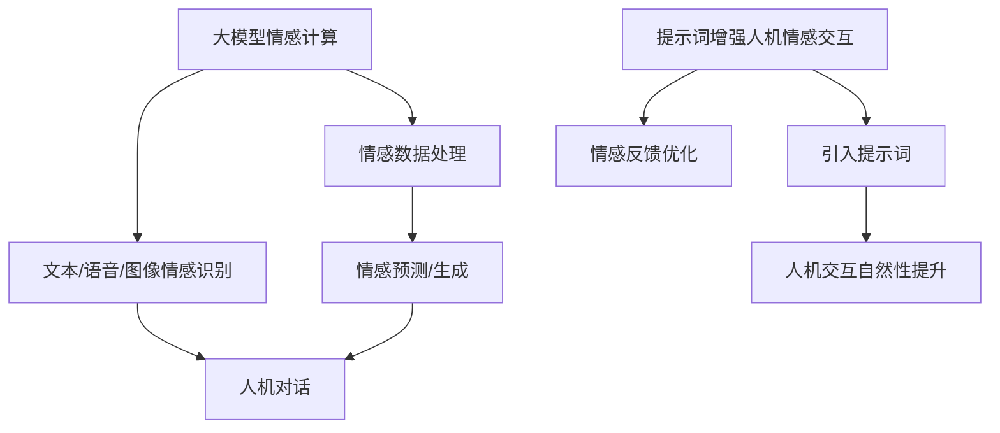

                 


为了撰写一篇关于《大模型情感计算：提示词增强人机情感交互》的技术博客文章，我们需要按照以下步骤进行思考和推理：

### 步骤 1：确定文章结构

首先，我们需要确定文章的整体结构。文章可以分为以下几个部分：

1. **引言**：介绍大模型情感计算和提示词增强人机情感交互的背景和重要性。
2. **核心概念与联系**：阐述大模型情感计算和提示词增强人机情感交互的核心概念，以及它们之间的关系。
3. **核心算法原理**：详细解释大模型情感计算和提示词增强人机情感交互的核心算法原理。
4. **数学模型和公式**：介绍相关的数学模型和公式，并进行详细讲解和举例说明。
5. **项目实战**：提供具体的开发环境搭建、源代码实现和案例分析。
6. **最佳实践和注意事项**：总结一些最佳实践，并提供注意事项和拓展阅读建议。
7. **结论**：总结文章的主要内容和观点。

### 步骤 2：撰写引言

在引言部分，我们需要简要介绍大模型情感计算和提示词增强人机情感交互的背景。例如：

随着人工智能技术的不断发展，大模型情感计算成为了一个热门的研究方向。它通过深度学习和自然语言处理等技术，使计算机能够理解和处理人类情感。提示词增强人机情感交互则是一种基于大模型情感计算的方法，通过使用提示词来提高人机交互的自然性和情感性。

### 步骤 3：阐述核心概念与联系

在这一部分，我们需要详细阐述大模型情感计算和提示词增强人机情感交互的核心概念，并绘制Mermaid流程图来展示它们之间的关系。

- **大模型情感计算**：大模型情感计算是指利用深度神经网络等大型模型来处理和识别情感。这些模型可以理解文本、语音和图像中的情感信息，并将其转化为计算机可以处理的数据。
- **提示词增强人机情感交互**：提示词是一种引导计算机理解人类情感的词语或短语。通过在对话中引入提示词，可以增强人机交互的自然性和情感性。

以下是相关的Mermaid流程图：



### 步骤 4：解释核心算法原理

在这一部分，我们需要详细解释大模型情感计算和提示词增强人机情感交互的核心算法原理，并使用伪代码来展示。

- **大模型情感计算**：可以使用Transformer架构的预训练模型，如BERT或GPT，通过大量的文本数据进行预训练，使其能够理解情感。

  ```python
  def pretrain_model(dataset):
      # 使用Transformer架构的预训练模型
      # 在大量文本数据上训练模型
      # ...
      return trained_model
  ```

- **提示词增强人机情感交互**：可以使用提示词引导模型生成情感相关的回复。

  ```python
  def generate_response(prompt, model):
      # 使用提示词和预训练模型生成回复
      # ...
      return response
  ```

### 步骤 5：介绍数学模型和公式

在这一部分，我们需要介绍与情感计算相关的数学模型和公式，并进行详细讲解和举例说明。

例如，可以使用情感得分来衡量文本的情感倾向：

$$
\text{sentiment\_score} = \frac{\sum_{i=1}^{n} w_i \cdot s_i}{\sum_{i=1}^{n} w_i}
$$

其中，$w_i$ 是权重，$s_i$ 是情感得分。权重可以根据词频、词性等进行调整。

### 步骤 6：提供项目实战

在这一部分，我们需要提供一个具体的开发环境搭建、源代码实现和案例分析。

例如，可以搭建一个基于BERT模型的大模型情感计算系统，并使用提示词来生成情感回复。

### 步骤 7：总结最佳实践和注意事项

在这一部分，我们需要总结一些最佳实践，并提供注意事项和拓展阅读建议。

例如，提示词的选择和优化对情感计算的准确性有很大影响。同时，需要注意保护用户隐私，避免泄露敏感信息。

### 步骤 8：撰写结论

在结论部分，我们需要总结文章的主要内容和观点，并强调大模型情感计算和提示词增强人机情感交互的重要性。

通过以上步骤，我们可以撰写一篇结构清晰、内容丰富、逻辑严密的技术博客文章。

现在，让我们开始撰写这篇文章吧！

