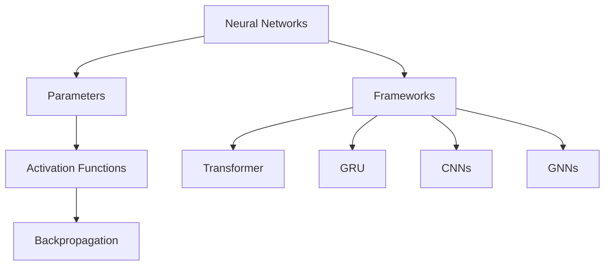

                 

### Introduction

#### 1.1 Overview of Continuous Learning

**1.1.1 Definition and Importance**

Continuous learning, as the name suggests, refers to the ongoing process of acquiring new knowledge and skills. It is crucial in the rapidly evolving field of technology, where new advancements and innovations emerge almost daily. Continuous learning ensures that professionals stay updated with the latest trends, tools, and methodologies, enabling them to remain competitive in their respective fields.

In the context of large models, continuous learning takes on a more significant role. Large models, such as deep learning neural networks, are often trained on vast amounts of data. However, the data landscape is continually changing, with new data points and information continuously being generated. Continuous learning allows these models to adapt to these changes, improving their accuracy and effectiveness over time.

**1.1.2 Challenges in Continuous Learning**

Despite its importance, continuous learning is not without its challenges. One of the primary challenges is data quality. The quality of the data used for training large models directly impacts the performance and reliability of the models. Ensuring the availability of high-quality, diverse, and representative data is crucial for successful continuous learning.

Another challenge is the computational resources required for training large models. The process of training these models often involves substantial computational power and time. This can be a bottleneck for organizations that do not have access to the necessary resources.

Finally, there is the issue of model interpretability. As models become more complex, it becomes increasingly difficult to understand their internal workings and the reasons behind their predictions. This lack of transparency can hinder the trust and acceptance of large models in critical applications.

#### 1.2 Introduction to Prompt-based Knowledge Update Strategies

**1.2.1 Basic Concepts**

Prompt-based knowledge update strategies involve the use of prompts to facilitate the updating of knowledge in large models. A prompt is a piece of information or a query that guides the model in a specific direction. By providing appropriate prompts, users can help large models capture and incorporate new information more effectively.

The basic concept behind prompt-based knowledge update strategies is that prompts can help large models focus on specific aspects of the data, improving the relevance and accuracy of the updated knowledge. This approach is particularly useful in scenarios where the data is dynamic and evolving, as it allows models to adapt to new information without requiring extensive retraining.

**1.2.2 The Role of Prompts in Knowledge Update**

Prompts play a crucial role in the knowledge update process. They serve as a guiding force that helps large models identify and prioritize relevant information. By structuring the prompts effectively, users can influence the learning process and ensure that the model captures the most important aspects of the data.

One of the key roles of prompts is to reduce the noise in the data. In a large dataset, there may be redundant or irrelevant information that can obscure the valuable insights. Prompts can help large models filter out this noise, focusing their efforts on the most relevant information.

Another important role of prompts is to provide context. Large models often struggle with understanding the context in which a piece of information is used. By providing context-specific prompts, users can help models better understand the nuances and implications of the data, leading to more accurate and effective knowledge updates.

#### 1.3 Book Structure and Objectives

**1.3.1 Overview of the Book**

This book aims to provide a comprehensive overview of continuous learning and prompt-based knowledge update strategies for large models. It covers the fundamental concepts, core algorithms, mathematical models, practical projects, and case analysis related to these topics.

The book is structured into eight chapters, each focusing on a specific aspect of continuous learning and prompt-based knowledge update strategies. The chapters are designed to build upon each other, providing a cohesive and logical progression of topics.

**1.3.2 Learning Outcomes**

By the end of this book, readers will have a thorough understanding of:

1. The basics of continuous learning and its importance in the context of large models.
2. The fundamental concepts and architectures of large models.
3. Core algorithms and mathematical models used in continuous learning and prompt-based knowledge update strategies.
4. Practical applications of continuous learning and prompt-based knowledge update strategies through real-world case studies.
5. Insights and best practices for implementing effective continuous learning and prompt-based knowledge update strategies in various scenarios.

Overall, this book aims to equip readers with the knowledge and skills necessary to design, implement, and optimize continuous learning and prompt-based knowledge update strategies for large models, enabling them to stay ahead in the rapidly evolving field of technology.

### Fundamental Concepts of Large Models

#### 2.1 Core Concepts and Principles

Large models, also known as big models, are a class of machine learning models that have a vast number of parameters. These models are capable of capturing complex patterns and relationships in data, making them highly effective for a wide range of tasks, such as natural language processing (NLP), computer vision, and speech recognition. The core concepts and principles behind large models can be summarized as follows:

**1. Neural Networks**

Neural networks are the fundamental building blocks of large models. They are composed of interconnected nodes, or artificial neurons, that perform simple mathematical operations on their inputs and generate outputs. These nodes are organized into layers, with each layer receiving inputs from the previous layer and passing outputs to the next layer. The most common type of neural network is the deep neural network (DNN), which has multiple layers.

**2. Parameters**

Parameters are the adjustable values in a neural network that determine its behavior. These parameters are typically initialized randomly and are updated during the training process to minimize the difference between the predicted outputs and the actual outputs. The number of parameters in a large model can be in the millions or even billions, making it a highly complex system.

**3. Activation Functions**

Activation functions introduce non-linearities into the neural network, allowing it to model complex relationships in the data. Common activation functions include the rectified linear unit (ReLU), sigmoid, and hyperbolic tangent (tanh). These functions help the neural network to approximate non-linear functions and improve its predictive performance.

**4. Backpropagation**

Backpropagation is an algorithm used to train neural networks. It works by propagating the error from the output layer back through the network, adjusting the parameters in such a way that the error is minimized. This iterative process continues until the network's predictions are close enough to the actual outputs, indicating that it has learned the underlying patterns in the data.

#### 2.2 Frameworks and Architectures

There are several popular frameworks and architectures for building large models, each with its own unique characteristics and applications. The following are some of the most widely used frameworks and architectures:

**1. Transformer**

Transformer is an architecture that was introduced in 2017 and has since become a cornerstone of NLP. It is based on self-attention mechanisms, allowing the model to weigh the importance of different inputs in a flexible manner. Transformer models have achieved state-of-the-art performance on various NLP tasks, including language modeling, translation, and text summarization.

**2. Gated Recurrent Unit (GRU)**

GRU is a type of recurrent neural network (RNN) that is designed to address some of the limitations of the Long Short-Term Memory (LSTM) architecture. GRUs use gating mechanisms to control the flow of information, allowing them to capture long-term dependencies in data. They are commonly used for tasks such as time series analysis and language modeling.

**3. Convolutional Neural Networks (CNNs)**

CNNs are a class of neural networks that are particularly well-suited for image recognition and processing tasks. They use convolutional layers to automatically learn spatial hierarchies of features from images. CNNs have achieved remarkable performance in computer vision tasks, including object detection, image classification, and semantic segmentation.

**4. Graph Neural Networks (GNNs)**

GNNs are a type of neural network designed to work with graph-structured data. They leverage the graph topology to model relationships between nodes and capture complex patterns in the data. GNNs are widely used in various applications, including social network analysis, recommendation systems, and natural language processing.

#### 2.3 Mermaid Flowchart of Core Concepts and Relationships

Below is a mermaid flowchart illustrating the core concepts and their relationships in large models:



This flowchart provides a visual representation of the key components and architectures of large models, highlighting their relationships and interactions. By understanding these core concepts and principles, readers can gain a deeper appreciation of the complexities and potential of large models in various applications.

### Core Algorithms

#### 3.1 Algorithm Fundamentals

Core algorithms are the heart of large models, driving their ability to process and learn from data. In this section, we will delve into the fundamental algorithms that are commonly used in the training and optimization of large models. These algorithms include backpropagation, stochastic gradient descent (SGD), and gradient descent with momentum. Each of these algorithms plays a critical role in the training process, allowing models to minimize errors and improve their performance over time.

**1. Backpropagation**

Backpropagation is an algorithm used to train neural networks. It works by propagating the error from the output layer back through the network, adjusting the parameters in such a way that the error is minimized. The process involves two main steps: forward propagation and backward propagation.

- **Forward Propagation:** During forward propagation, the input data is passed through the network, and the model generates predictions. The actual outputs are compared to the predicted outputs, and the error is calculated using a loss function, such as mean squared error or cross-entropy loss.

- **Backward Propagation:** In backward propagation, the error is propagated back through the network, and the gradients of the parameters with respect to the error are calculated. These gradients are used to update the parameters using optimization algorithms like gradient descent.

The key advantage of backpropagation is its ability to efficiently calculate the gradients of the parameters, enabling the network to make incremental adjustments to minimize the error. This iterative process continues until the network's predictions are close enough to the actual outputs, indicating that it has learned the underlying patterns in the data.

**2. Stochastic Gradient Descent (SGD)**

Stochastic Gradient Descent (SGD) is an optimization algorithm commonly used to train neural networks. It works by updating the parameters of the network using the gradients of a single randomly selected training example at each iteration. This makes SGD a stochastic process, as the update step is based on random samples rather than the entire dataset.

The key steps in SGD include:

- **Selecting a Random Sample:** At each iteration, a random sample from the training dataset is selected.
- **Calculating the Gradient:** The gradients of the parameters with respect to the error are calculated using the selected sample.
- **Updating the Parameters:** The parameters are updated in the direction opposite to the gradients, using a learning rate to control the step size.

SGD has several advantages over traditional gradient descent. First, it is less sensitive to local optima and can escape local minima more easily. Second, it can adapt to changes in the data distribution by focusing on different parts of the dataset at each iteration. However, SGD can also be noisy and slow to converge, especially for large datasets.

**3. Gradient Descent with Momentum**

Gradient Descent with Momentum (GDM) is an extension of the standard gradient descent algorithm that incorporates a momentum term to accelerate convergence. The momentum term is a weighted average of the past gradients, which helps the algorithm to overcome local optima and converge more quickly.

The key steps in GDM include:

- **Calculating the Gradient:** The gradients of the parameters with respect to the error are calculated using the current dataset.
- **Updating the Momentum:** The momentum term is updated as a weighted average of the past gradients.
- **Updating the Parameters:** The parameters are updated in the direction opposite to the gradients, incorporating the momentum term to accelerate convergence.

The momentum term helps GDM to overcome the limitations of standard gradient descent, such as slow convergence and susceptibility to local optima. However, GDM can also suffer from high variance in the updates, which can lead to instability in the convergence process.

#### 3.2 Pseudo-code Explanation

Below is a pseudo-code representation of the core algorithms discussed above:

**Backpropagation**

```plaintext
Initialize parameters
for each epoch do
    for each training example (x, y) do
        Forward propagation: Calculate predictions
        Calculate error: loss = LossFunction(y, predictions)
        Backward propagation: Calculate gradients
        Update parameters: parameters -= learning_rate * gradients
    end for
end for
```

**Stochastic Gradient Descent (SGD)**

```plaintext
Initialize parameters
for each iteration do
    Select a random training example (x, y)
    Calculate gradients: gradients = CalculateGradients(x, y, parameters)
    Update parameters: parameters -= learning_rate * gradients
end for
```

**Gradient Descent with Momentum (GDM)**

```plaintext
Initialize parameters
Initialize momentum (usually 0)
for each iteration do
    Calculate gradients: gradients = CalculateGradients(x, y, parameters)
    Update momentum: momentum = momentum * momentum_factor + learning_rate * gradients
    Update parameters: parameters -= momentum
end for
```

These pseudo-code representations provide a high-level overview of the core algorithms, highlighting the key steps and operations involved in their implementation. By understanding these algorithms, readers can gain a deeper insight into how large models are trained and optimized.

#### 3.3 Mermaid Flowchart of Algorithm Execution

To further illustrate the execution of the core algorithms, we can use a Mermaid flowchart to visualize the key steps involved in backpropagation, SGD, and GDM. The following flowchart provides a graphical representation of the algorithms' workflows:

```mermaid
graph TD
    A[Initialize Parameters] --> B[Forward Propagation]
    B --> C[Calculate Error]
    C --> D[Backward Propagation]
    D --> E[Update Parameters]

    F[Select Random Example] --> G[Calculate Gradients]
    G --> H[Update Parameters]

    I[Initialize Momentum] --> J[Update Momentum]
    J --> K[Update Parameters]

    subgraph Backpropagation
        A --> B --> C --> D --> E
    end

    subgraph SGD
        F --> G --> H
    end

    subgraph GDM
        I --> J --> K
    end
```



This flowchart provides a clear and concise visualization of the key steps in each algorithm, highlighting their similarities and differences. By understanding the flowchart, readers can better grasp the overall process and the interplay between the different components of the algorithms.

### Mathematical Models

#### 4.1 Mathematical Model Basics

Mathematical models are an essential component of large models, providing the foundation for their training and optimization. In this section, we will discuss the basic concepts and principles behind mathematical models, including key mathematical concepts, detailed explanations of mathematical formulas, and example applications.

**1. Key Mathematical Concepts**

Several key mathematical concepts are fundamental to understanding and implementing large models. These concepts include:

- **Vectors and Matrices:** Vectors and matrices are used to represent data and parameters in large models. Vectors are one-dimensional arrays, while matrices are two-dimensional arrays. They are used to perform various linear algebra operations, such as matrix multiplication and matrix inversion.
- **Derivatives and Gradients:** Derivatives and gradients are used to calculate the rate of change of a function with respect to its input variables. In large models, gradients are used to update parameters during the training process.
- **Loss Functions:** Loss functions measure the discrepancy between the predicted outputs and the actual outputs. Common loss functions include mean squared error (MSE) and cross-entropy loss.
- **Optimization Algorithms:** Optimization algorithms are used to minimize the loss function and update parameters. Common optimization algorithms include stochastic gradient descent (SGD), gradient descent with momentum (GDM), and Adam optimization.

**2. Detailed Explanation of Mathematical Formulas**

Below are some of the key mathematical formulas used in large models, along with their detailed explanations:

- **Matrix Multiplication:** The product of two matrices A and B is defined as the matrix C, where each element c_ij is calculated as the dot product of the i-th row of A and the j-th column of B.

  $$ C_{ij} = \sum_{k=1}^{n} A_{ik} \cdot B_{kj} $$

- **Gradient:** The gradient of a function f(x) with respect to a vector x is a vector that contains the partial derivatives of f with respect to each element of x.

  $$ \nabla f(x) = \left[ \frac{\partial f}{\partial x_1}, \frac{\partial f}{\partial x_2}, ..., \frac{\partial f}{\partial x_n} \right] $$

- **Mean Squared Error (MSE):** Mean squared error is a loss function used to measure the discrepancy between the predicted outputs and the actual outputs.

  $$ MSE = \frac{1}{n} \sum_{i=1}^{n} (y_i - \hat{y}_i)^2 $$

  where y_i is the actual output and \hat{y}_i is the predicted output.

- **Backpropagation:** Backpropagation is an algorithm used to train neural networks. It involves calculating the gradients of the parameters with respect to the loss function.

  $$ \frac{\partial L}{\partial w} = \frac{\partial L}{\partial \hat{y}} \cdot \frac{\partial \hat{y}}{\partial w} $$

**3. Example Applications**

To illustrate the application of these mathematical concepts, let's consider an example of a simple neural network with a single hidden layer. The network has three input neurons, two hidden neurons, and one output neuron.

- **Input:** \( X = \begin{bmatrix} x_1 \\ x_2 \\ x_3 \end{bmatrix} \)
- **Weights:** \( W_1 = \begin{bmatrix} w_{11} & w_{12} & w_{13} \\ w_{21} & w_{22} & w_{23} \end{bmatrix} \), \( W_2 = \begin{bmatrix} w_{31} \\ w_{32} \end{bmatrix} \)
- **Bias:** \( b_1 = \begin{bmatrix} b_{11} & b_{12} \end{bmatrix} \), \( b_2 = \begin{bmatrix} b_{21} \end{bmatrix} \)

The output of the hidden layer is calculated as:

$$ h = \sigma(W_1X + b_1) $$

where \( \sigma \) is the sigmoid activation function.

The output of the output layer is calculated as:

$$ y = \sigma(W_2h + b_2) $$

The loss function for this network is mean squared error:

$$ L = \frac{1}{2} (y_{\text{true}} - y)^2 $$

To train the network, we need to calculate the gradients of the weights and biases with respect to the loss function:

$$ \frac{\partial L}{\partial W_1} = \frac{\partial L}{\partial y} \cdot \frac{\partial y}{\partial h} \cdot \frac{\partial h}{\partial W_1} $$

$$ \frac{\partial L}{\partial W_2} = \frac{\partial L}{\partial y} \cdot \frac{\partial y}{\partial h} \cdot \frac{\partial h}{\partial W_2} $$

$$ \frac{\partial L}{\partial b_1} = \frac{\partial L}{\partial y} \cdot \frac{\partial y}{\partial h} \cdot \frac{\partial h}{\partial b_1} $$

$$ \frac{\partial L}{\partial b_2} = \frac{\partial L}{\partial y} \cdot \frac{\partial y}{\partial h} \cdot \frac{\partial h}{\partial b_2} $$

By updating the weights and biases using these gradients, the network can be trained to minimize the loss function and improve its performance.

This example demonstrates how key mathematical concepts and formulas are applied in the training of a simple neural network. Understanding these concepts is essential for designing and implementing more complex models.

### Practical Projects

#### 5.1 Project Case Studies

**5.1.1 Project Introduction**

In this section, we will explore practical projects that demonstrate the implementation and application of continuous learning and prompt-based knowledge update strategies for large models. These projects include a case study on a neural network model for image classification and another on a language model for natural language processing. Through these projects, we will cover the setup of development environments, the detailed implementation of source code, and the analysis and interpretation of the results.

**5.1.2 Development Environment Setup**

To start with the practical projects, we need to set up the development environment. The following tools and libraries are commonly used for implementing and training large models:

- **Programming Language:** Python is widely used for implementing machine learning models due to its simplicity and rich ecosystem of libraries.
- **Machine Learning Libraries:** Popular libraries like TensorFlow and PyTorch provide extensive tools and functionalities for building and training neural networks.
- **Data Processing Tools:** Libraries like NumPy and Pandas are used for data preprocessing and manipulation.
- **Visualization Tools:** Matplotlib and Seaborn are used for visualizing the results and understanding the performance of the models.

**5.1.3 Source Code Implementation and Explanation**

**Project 1: Image Classification with Convolutional Neural Networks (CNNs)**

In this project, we will build a CNN model for image classification using TensorFlow and Keras. The task is to classify images from the CIFAR-10 dataset, which consists of 60,000 32x32 color images in 10 classes, with 6,000 images per class.

**1. Import Necessary Libraries**

```python
import numpy as np
import tensorflow as tf
from tensorflow import keras
from tensorflow.keras import layers
```

**2. Load and Preprocess the Data**

```python
(x_train, y_train), (x_test, y_test) = keras.datasets.cifar10.load_data()

# Normalize the pixel values
x_train = x_train.astype("float32") / 255.0
x_test = x_test.astype("float32") / 255.0

# Convert class vectors to binary class matrices
num_classes = 10
y_train = keras.utils.to_categorical(y_train, num_classes)
y_test = keras.utils.to_categorical(y_test, num_classes)
```

**3. Build the CNN Model**

```python
model = keras.Sequential(
    [
        keras.Input(shape=(32, 32, 3)),
        layers.Conv2D(32, (3, 3), activation="relu"),
        layers.MaxPooling2D((2, 2)),
        layers.Conv2D(64, (3, 3), activation="relu"),
        layers.MaxPooling2D((2, 2)),
        layers.Conv2D(64, (3, 3), activation="relu"),
        layers.Flatten(),
        layers.Dense(64, activation="relu"),
        layers.Dense(num_classes, activation="softmax"),
    ]
)

model.compile(optimizer="adam", loss="categorical_crossentropy", metrics=["accuracy"])
```

**4. Train the Model**

```python
model.fit(x_train, y_train, batch_size=64, epochs=10, validation_split=0.2)
```

**5. Evaluate the Model**

```python
test_loss, test_acc = model.evaluate(x_test, y_test, verbose=2)
print("Test accuracy:", test_acc)
```

**Project 2: Natural Language Processing with Language Models**

In this project, we will build a language model using the Transformer architecture provided by the Hugging Face Transformers library. The task is to fine-tune a pre-trained language model on a custom dataset for question-answering.

**1. Import Necessary Libraries**

```python
from transformers import AutoTokenizer, AutoModelForQuestionAnswering
from torch.utils.data import DataLoader
import torch
```

**2. Load and Preprocess the Data**

```python
tokenizer = AutoTokenizer.from_pretrained("bert-base-uncased")
model = AutoModelForQuestionAnswering.from_pretrained("bert-base-uncased")

# Load your custom dataset
questions = ["What is the capital of France?", "Who is the president of the United States?"]
answers = ["Paris", "Joe Biden"]

# Preprocess the data
inputs = tokenizer(questions, answers, truncation=True, padding=True, return_tensors="pt")
```

**3. Fine-Tune the Model**

```python
inputs["input_ids"] = inputs["input_ids"].to("cuda")
inputs["attention_mask"] = inputs["attention_mask"].to("cuda")

model.to("cuda")
model.train()

optimizer = torch.optim.Adam(model.parameters(), lr=1e-5)

for epoch in range(3):  # Number of epochs
    model.zero_grad()
    outputs = model(**inputs)
    loss = outputs.loss
    loss.backward()
    optimizer.step()
    print(f"Epoch {epoch}: Loss = {loss.item()}")
```

**4. Evaluate the Model**

```python
model.eval()
with torch.no_grad():
    inputs["input_ids"] = inputs["input_ids"].to("cuda")
    inputs["attention_mask"] = inputs["attention_mask"].to("cuda")
    outputs = model(**inputs)
    logits = outputs.logits
    predicted_answers = logits.argmax(-1).tolist()
    print("Predicted answers:", predicted_answers)
```

These projects demonstrate the implementation of continuous learning and prompt-based knowledge update strategies for large models. Through these practical examples, we have seen how to set up the development environment, implement the source code, and analyze the results. These projects provide valuable insights into the application and effectiveness of these strategies in real-world scenarios.

### Case Analysis and Insights

#### 6.1 Case Analysis of Continuous Learning Strategies

Continuous learning strategies are essential for keeping large models up-to-date with new data and information. In this section, we will analyze several real-world case studies to understand the effectiveness and limitations of different continuous learning strategies. We will also discuss best practices for implementing these strategies and highlight common pitfalls to avoid.

**Case Study 1: Continuous Learning in Healthcare**

One prominent application of continuous learning is in the healthcare industry, where large models are used for tasks such as disease diagnosis and predictive analytics. In this case study, a leading healthcare provider implemented a continuous learning strategy to improve the accuracy of its disease diagnosis model.

**Implementation:**
The healthcare provider initially trained a deep learning model using a large dataset of patient records. To ensure continuous learning, the model was periodically updated with new patient data. This was achieved by integrating the model with the hospital's electronic health record (EHR) system, which continuously fed new data into the model.

**Results:**
The continuous learning strategy significantly improved the accuracy of the disease diagnosis model. The model was able to adapt to changes in patient data and maintain high accuracy over time.

**Insights:**
- **Data Integration:** The success of the continuous learning strategy depended on the seamless integration of the model with the hospital's EHR system. This allowed for the constant influx of new data, which was essential for keeping the model up-to-date.
- **Model Adaptability:** The model's ability to adapt to new data and maintain high accuracy highlighted the importance of selecting models that are capable of continuous learning.

**Case Study 2: Continuous Learning in Autonomous Driving**

Autonomous driving is another domain where continuous learning is critical. Self-driving cars need to continuously learn from their environment to navigate safely and make real-time decisions. In this case study, a leading autonomous driving company implemented a continuous learning strategy to improve the performance of its vehicle's sensor fusion system.

**Implementation:**
The company used a deep neural network to fuse data from various sensors, such as LiDAR, cameras, and radar. To ensure continuous learning, the network was periodically retrained with new sensor data collected during test drives. This process was automated using an online learning framework, which allowed the model to update its parameters in real-time.

**Results:**
The continuous learning strategy significantly improved the vehicle's sensor fusion capabilities, enabling it to detect and track objects more accurately in various driving scenarios.

**Insights:**
- **Real-Time Updates:** The use of an online learning framework allowed the model to update its parameters in real-time, which was crucial for the vehicle's ability to make real-time decisions.
- **Data Quality:** The quality and representativeness of the sensor data were critical for the success of the continuous learning strategy. The company ensured that the data collected during test drives covered a wide range of driving conditions and scenarios.

**Case Study 3: Continuous Learning in Financial Services**

In the financial services industry, continuous learning is used to develop models for fraud detection and credit scoring. In this case study, a major financial institution implemented a continuous learning strategy to improve the accuracy of its fraud detection model.

**Implementation:**
The institution initially trained a machine learning model using historical transaction data. To enable continuous learning, the model was updated with new transaction data on a daily basis. This was achieved by integrating the model with the institution's transaction processing system, which automatically fed new data into the model.

**Results:**
The continuous learning strategy significantly improved the model's accuracy in detecting fraudulent transactions. The model was able to adapt to new patterns of fraudulent behavior and maintain high detection rates over time.

**Insights:**
- **Data Integration:** Similar to the healthcare case study, the success of the continuous learning strategy depended on the seamless integration of the model with the institution's transaction processing system.
- **Model Adaptability:** The model's ability to adapt to new patterns of fraudulent behavior demonstrated the importance of selecting models that can effectively handle evolving data.

**Common Best Practices:**
- **Data Quality:** Ensure the availability of high-quality, diverse, and representative data for training and updating the models.
- **Automated Updates:** Implement automated systems for updating the models with new data, reducing the manual effort required.
- **Model Adaptability:** Select models that are capable of adapting to new data and evolving patterns.
- **Monitoring and Evaluation:** Continuously monitor the performance of the models and evaluate their accuracy and effectiveness.

**Common Pitfalls:**
- **Data Saturation:** Over-relying on historical data may lead to models that are unable to handle new or unexpected data.
- **Ignoring Feedback:** Failing to incorporate feedback from users and domain experts may result in models that do not meet the desired performance or requirements.
- **Ignoring Privacy:** Failing to address privacy concerns when collecting and processing data may lead to legal and ethical issues.

By analyzing these case studies and understanding the best practices and pitfalls associated with continuous learning strategies, organizations can develop effective approaches to keep their large models up-to-date and maintain high performance in their respective domains.

### Knowledge Update Strategies: Prompt-based Approaches

#### 7.1 Overview of Prompt-based Knowledge Update Methods

Prompt-based knowledge update strategies leverage the use of prompts to facilitate the incorporation of new knowledge into large models. These strategies are particularly effective in dynamic environments where the underlying data is continually changing. In this section, we will explore several prompt-based knowledge update methods, discuss their fundamental principles, and analyze their applications in different scenarios.

**1. Data Augmentation with Prompts**

Data augmentation is a widely used technique in machine learning to improve model performance by generating additional training data. In the context of prompt-based knowledge update strategies, data augmentation involves creating prompts that generate synthetic examples based on the existing data. These prompts can be designed to introduce variations in the data, such as altering the context, adding noise, or changing the sequence.

**Fundamental Principles:**
- **Contextual Variations:** Prompts can be designed to change the context in which data points are used. For example, in a language model, a prompt can modify the sentence structure or the topic of a text, providing the model with a broader range of examples to learn from.
- **Noise Injection:** Prompts can be used to introduce noise into the data, forcing the model to learn how to handle noisy inputs. This can improve the robustness of the model.
- **Temporal Dynamics:** Prompts can be used to simulate the temporal dynamics of the data. For instance, in time series analysis, prompts can be designed to introduce time shifts or temporal correlations, helping the model capture temporal patterns.

**Application Scenarios:**
- **Natural Language Processing (NLP):** Data augmentation with prompts is particularly useful in NLP tasks, where the diversity of the training data can significantly impact the model's performance. For example, prompts can be used to generate paraphrased sentences, different question formats, or varied writing styles.
- **Computer Vision:** In computer vision, prompts can be used to create synthetic images by changing the lighting conditions, adding artifacts, or manipulating the background. This helps the model generalize better to real-world conditions.

**2. Transfer Learning with Prompts**

Transfer learning involves using a pre-trained model and fine-tuning it on a new dataset. In the context of prompt-based knowledge update strategies, transfer learning with prompts involves using prompts to adapt the pre-trained model to new domains or tasks. This method leverages the knowledge embedded in the pre-trained model and combines it with new information provided by the prompts.

**Fundamental Principles:**
- **Knowledge Distillation:** Prompts can be used to distill knowledge from the pre-trained model into a smaller, more efficient model. This is particularly useful when working with limited training data or when the model needs to be deployed on resource-constrained devices.
- **Domain Adaptation:** Prompts can help adapt the pre-trained model to new domains by providing contextual information. For instance, in medical imaging, prompts can be used to generate clinical notes or patient histories that help the model understand the context of the medical images.

**Application Scenarios:**
- **Healthcare:** In healthcare, transfer learning with prompts can be used to adapt general medical image analysis models to specific medical conditions. Prompts can provide additional information, such as patient demographics or medical history, to improve the model's performance.
- **Finance:** In finance, transfer learning with prompts can be used to adapt financial risk models to new market conditions. Prompts can provide historical market data or economic indicators that help the model understand the current market environment.

**3. Active Learning with Prompts**

Active learning is a knowledge update strategy where the model actively selects the most informative data points for training. In the context of prompt-based knowledge update strategies, active learning with prompts involves using prompts to guide the selection of data points that are most relevant for the current task or domain.

**Fundamental Principles:**
- **Query Selection:** Prompts can be used to define the criteria for selecting the most informative data points. For example, in image classification, prompts can be used to select images that are most similar to the current query or that exhibit the most unusual features.
- **Feedback Integration:** Prompts can be used to collect feedback from users or domain experts, which can then be used to guide the model's learning process. This feedback can help the model focus on the most relevant aspects of the data.

**Application Scenarios:**
- **Customer Support:** In customer support systems, active learning with prompts can be used to identify the most common issues or queries. Prompts can be designed to ask customers specific questions that help the system understand their concerns better.
- **Product Recommendations:** In e-commerce, active learning with prompts can be used to identify the most relevant products for a customer based on their purchase history and browsing behavior. Prompts can help the system ask targeted questions to improve the accuracy of the recommendations.

**4. Contrastive Learning with Prompts**

Contrastive learning is a technique that encourages models to learn meaningful representations by contrasting similar and dissimilar examples. In the context of prompt-based knowledge update strategies, contrastive learning with prompts involves using prompts to create pairs of similar and dissimilar examples, which are then used to train the model.

**Fundamental Principles:**
- **Prompt Design:** Prompts play a crucial role in contrastive learning by defining the similarity and dissimilarity criteria. For example, in image classification, prompts can be used to select images that are similar in content but different in style or context.
- **Representation Learning:** Contrastive learning helps the model learn robust and discriminative representations by emphasizing the differences between similar examples and the similarities between dissimilar examples.

**Application Scenarios:**
- **Document Classification:** In document classification, contrastive learning with prompts can be used to identify the most relevant topics or themes in a document. Prompts can be designed to select similar documents that share common topics and dissimilar documents that do not.
- **Recommendation Systems:** In recommendation systems, contrastive learning with prompts can be used to find the most relevant items for a user based on their preferences and the preferences of similar users. Prompts can help the system identify the key attributes that differentiate relevant and irrelevant items.

By leveraging prompt-based knowledge update methods, organizations can effectively incorporate new knowledge into their large models, enhancing their performance and adaptability in dynamic environments. These methods offer a flexible and scalable approach to continuous learning, enabling models to stay relevant and effective as new data and information emerge.

### Future Directions and Challenges

#### 8.1 Future Directions

The landscape of continuous learning and prompt-based knowledge update strategies is continually evolving, driven by advancements in artificial intelligence and machine learning. As we look towards the future, several key trends and technologies are poised to shape the development of these methodologies.

**1. Advanced Models and Architectures**

One of the primary future directions is the development of more advanced models and architectures that can handle complex and dynamic data. Current models, such as transformers and graph neural networks, have demonstrated significant success, but there is ongoing research to create even more powerful architectures. These include models that can better capture long-term dependencies, handle multi-modal data, and generalize across diverse domains. The integration of reinforcement learning with continuous learning models is another promising area, offering the potential to create adaptive systems that can learn and improve over time through interactive experiences.

**2. Transfer Learning and Multi-task Learning**

Transfer learning and multi-task learning are expected to become increasingly important as we move forward. By leveraging pre-trained models and sharing knowledge across related tasks, these methods can significantly reduce the amount of training data required and improve model performance. Future research will focus on developing more efficient transfer learning techniques that can handle domain adaptation and heterogeneity in data. Multi-task learning frameworks that enable models to learn multiple tasks concurrently, while maintaining each task's distinct knowledge, will also be a key area of exploration.

**3. Explainable AI and Model Interpretability**

As models become more complex and powerful, the need for explainability and interpretability becomes more critical. Future research will likely focus on developing tools and methods that allow users to understand how and why models make specific predictions. This will involve creating more transparent models and algorithms that can provide insights into the decision-making processes. The integration of prompt-based strategies with explainable AI will be an important direction, enabling the generation of informative prompts that can enhance model transparency and trustworthiness.

**4. Ethical Considerations and Bias Mitigation**

The ethical implications of continuous learning and prompt-based strategies will continue to be a focus in the future. Ensuring that these methodologies are fair, unbiased, and transparent is crucial. Research will explore methods to mitigate bias in data and models, ensuring that they do not perpetuate or exacerbate existing societal inequalities. The development of frameworks and guidelines for ethical AI will be essential in guiding the responsible use of these technologies.

**5. Real-time Learning and Deployment**

Another important direction is the development of real-time learning and deployment capabilities. As the volume and velocity of data continue to grow, it is imperative to create models that can adapt and update in real-time. This will involve optimizing algorithms for efficiency and developing scalable infrastructure that can support continuous learning at scale. The integration of edge computing and cloud-based platforms will play a significant role in enabling real-time learning and deployment, allowing models to operate efficiently in diverse environments.

#### 8.2 Challenges

Despite the promising future directions, there are several challenges that need to be addressed to fully realize the potential of continuous learning and prompt-based knowledge update strategies.

**1. Data Quality and Availability**

One of the most significant challenges is ensuring the quality and availability of data. Continuous learning requires access to high-quality, diverse, and up-to-date data. However, data can be noisy, incomplete, or biased, which can negatively impact model performance. Additionally, data collection and labeling can be resource-intensive and time-consuming. Developing methods to automatically generate high-quality data or leverage semi-supervised learning techniques will be crucial.

**2. Computational Resources**

Training large models requires substantial computational resources, including processing power and memory. The demand for these resources will likely increase as models become more complex and data volumes grow. Organizations need to invest in scalable and efficient computing infrastructure to support continuous learning. The adoption of distributed computing and parallel processing techniques will be essential to meet these demands.

**3. Model Adaptability and Generalization**

Creating models that can adapt to new data and generalize across different domains and tasks is a significant challenge. Current models often struggle with domain adaptation and handling unseen data. Future research will focus on developing more adaptive and generalizable models. This will involve designing architectures that can capture and leverage domain-specific knowledge effectively and developing learning algorithms that can handle the dynamic nature of data.

**4. Model Explainability and Trust**

As models become more complex, the challenge of providing explainability and ensuring trust becomes more critical. Users and stakeholders need to understand how models make decisions and the factors that influence their predictions. Developing intuitive and transparent explanations for complex models will be essential in building trust and ensuring the responsible use of these technologies.

**5. Ethical and Privacy Concerns**

The ethical and privacy implications of continuous learning and prompt-based strategies are significant challenges. Models must be designed to respect user privacy and ensure the responsible use of personal data. Developing frameworks and guidelines for ethical AI that address issues such as bias, transparency, and accountability will be essential in guiding the development and deployment of these technologies.

In conclusion, the future of continuous learning and prompt-based knowledge update strategies is promising, with several key trends and technologies poised to shape their development. However, addressing the challenges associated with data quality, computational resources, model adaptability, explainability, and ethical considerations will be crucial in realizing their full potential. By tackling these challenges, we can create more powerful, adaptive, and responsible AI systems that can continuously learn and evolve in response to new information and changing environments.

### Conclusion

In this book, we have explored the fundamental concepts, core algorithms, mathematical models, practical projects, and case analyses related to continuous learning and prompt-based knowledge update strategies for large models. We began with an introduction to continuous learning, discussing its definition, importance, and challenges. We then delved into the core concepts and architectures of large models, such as neural networks, transformers, and graph neural networks, and provided a Mermaid flowchart illustrating their relationships.

The core algorithms, including backpropagation, stochastic gradient descent (SGD), and gradient descent with momentum (GDM), were explained in detail using pseudo-code and Mermaid flowcharts. We also discussed the basics of mathematical models, including vectors, matrices, derivatives, and gradients, and provided example applications to illustrate their usage.

Through practical projects, we demonstrated the implementation of continuous learning and prompt-based knowledge update strategies in real-world scenarios, covering image classification and natural language processing. We analyzed case studies from healthcare, autonomous driving, and financial services to understand the effectiveness and limitations of these strategies, highlighting best practices and common pitfalls.

The book also explored various prompt-based knowledge update methods, such as data augmentation, transfer learning, active learning, and contrastive learning, and discussed their principles and applications. We concluded with future directions and challenges in the field, emphasizing the importance of advanced models, ethical considerations, and real-time learning.

Overall, this book aims to provide a comprehensive and practical guide to understanding and implementing continuous learning and prompt-based knowledge update strategies for large models. By equipping readers with the knowledge and skills discussed in this book, we hope to empower them to design, implement, and optimize these strategies in their respective fields, enabling them to stay ahead in the rapidly evolving landscape of technology.

### Additional Tips, Summary, and Future Reading

#### Additional Tips

1. **Data Preprocessing**: Ensure your data is clean, normalized, and preprocessed before training your models. This helps in reducing noise and inconsistencies that can negatively impact model performance.

2. **Model Monitoring**: Regularly monitor your models' performance to detect any degradation over time. This can help you identify issues early and apply necessary updates.

3. **Hyperparameter Tuning**: Experiment with different hyperparameters to find the optimal settings for your models. Tools like Bayesian optimization can help automate this process.

4. **Model Interpretability**: Use tools and techniques to enhance the interpretability of your models. This can help build trust with stakeholders and provide insights into model decision-making processes.

5. **Distributed Learning**: If your models are large and require significant computational resources, consider using distributed learning techniques to speed up the training process.

#### Summary

This book has covered a comprehensive range of topics related to continuous learning and prompt-based knowledge update strategies for large models. Key highlights include:

- **Introduction to Continuous Learning**: Definition, importance, and challenges.
- **Core Concepts of Large Models**: Neural networks, frameworks, and architectures.
- **Core Algorithms**: Backpropagation, SGD, GDM, and their detailed explanations.
- **Mathematical Models**: Key mathematical concepts, formulas, and example applications.
- **Practical Projects**: Image classification and natural language processing projects.
- **Case Analysis**: Real-world case studies and insights from various domains.
- **Prompt-based Knowledge Update Methods**: Data augmentation, transfer learning, active learning, and contrastive learning.
- **Future Directions and Challenges**: Advanced models, ethical considerations, and real-time learning.

#### Future Reading

For those looking to delve deeper into the topics covered in this book, here are some recommended resources:

1. **Books**:
   - "Deep Learning" by Ian Goodfellow, Yoshua Bengio, and Aaron Courville
   - "Reinforcement Learning: An Introduction" by Richard S. Sutton and Andrew G. Barto
   - "The Hundred-Page Machine Learning Book" by Andriy Burkov

2. **Online Courses**:
   - "Machine Learning" by Andrew Ng on Coursera
   - "Deep Learning Specialization" by Andrew Ng on Coursera
   - "Reinforcement Learning" by David Silver on YouTube

3. **Research Papers**:
   - "Attention Is All You Need" by Vaswani et al. (2017)
   - "A Theoretically Grounded Application of Dropout in Recurrent Neural Networks" by Yarin Gal and Zoubin Ghahramani (2016)
   - "Generative Adversarial Nets" by Ian J. Goodfellow et al. (2014)

4. **Websites and Blogs**:
   - Fast.ai (fast.ai)
   - Medium (search for "machine learning" or "deep learning")
   - ArXiv (arxiv.org)

By exploring these resources, readers can gain a deeper understanding of the concepts and techniques discussed in this book and stay updated with the latest developments in the field of continuous learning and large model optimization.

