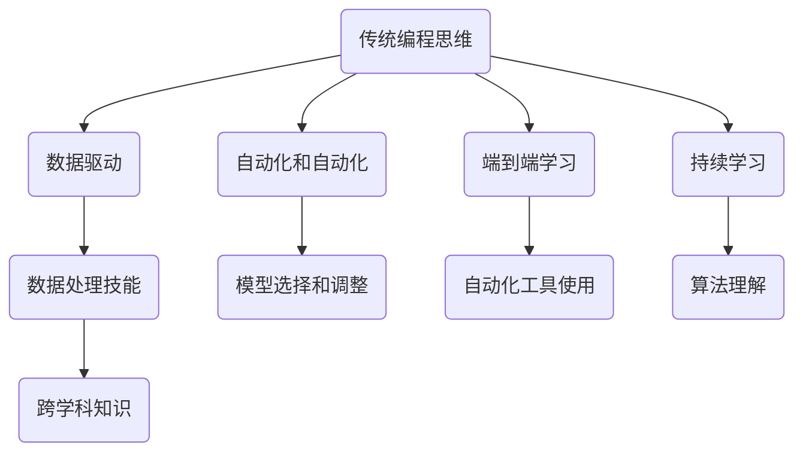

                 

### 文章标题

# 大模型时代的编程思维转变

### 关键词

- 大模型
- 编程思维
- 人工智能
- 编程技能
- 技术趋势

### 摘要

本文将探讨在大模型时代，编程思维如何发生转变。我们将首先介绍大模型的基本概念和背景，然后分析大模型对传统编程思维的影响，通过实例展示编程技能的新需求，最后展望编程思维的未来趋势，为程序员和开发人员提供实用的指导和建议。

---

### 引言

随着人工智能技术的飞速发展，大模型（如GPT、BERT等）逐渐成为推动各行各业变革的关键力量。这些大模型具有强大的数据处理和生成能力，不仅在自然语言处理、计算机视觉、推荐系统等领域表现出色，还极大地改变了我们的编程方式。在这个大模型时代，编程思维需要经历深刻的转变，以适应新的技术环境和需求。

本文将从以下几个方面展开讨论：

1. **大模型概述**：介绍大模型的基本概念、发展历程和基本架构。
2. **编程思维转变**：分析大模型对传统编程思维的影响，探讨编程技能的新需求。
3. **核心算法原理讲解**：通过伪代码和数学模型，详细阐述大模型的核心算法原理。
4. **项目实战**：展示大模型在实际开发中的应用案例，并进行详细解读。
5. **未来趋势与展望**：探讨大模型时代编程思维的发展趋势，为程序员提供指导。

### 大模型概述

#### 1.1 大模型的基本概念

大模型，顾名思义，是指具有巨大参数规模和计算能力的机器学习模型。这些模型通过学习海量数据，能够生成复杂的模式和知识。大模型的主要特征包括：

- **参数规模大**：大模型通常具有数十亿到千亿级别的参数。
- **计算能力强**：大模型需要强大的计算资源来训练和部署。
- **自适应性强**：大模型能够适应不同的任务和数据集。

#### 1.2 大模型的发展历程

大模型的发展可以追溯到深度学习的兴起。从最初的简单神经网络到如今的大规模预训练模型，大模型经历了数次技术突破和理论创新。以下是几个关键阶段：

- **1980s-1990s**：反向传播算法的提出和改进，神经网络开始应用于图像识别和语音识别。
- **2006年**：Hinton提出深度信念网络，标志着深度学习时代的开始。
- **2012年**：AlexNet在ImageNet竞赛中取得突破性成绩，深度学习进入主流视野。
- **2018年**：GPT-3发布，成为首个具有数十亿参数的预训练模型。
- **至今**：不断有更大规模、更强能力的大模型出现，如BERT、Turing-NLG等。

#### 1.3 大模型的基本架构

大模型通常由以下几个关键部分组成：

- **输入层**：接收外部输入数据，如文本、图像等。
- **隐藏层**：执行复杂的非线性变换和特征提取。
- **输出层**：生成预测结果或生成文本。
- **优化器**：用于调整模型参数，优化模型性能。
- **损失函数**：衡量模型预测结果与真实结果之间的差距。

### 编程思维转变

#### 2.1 传统编程思维与大模型时代的对比

在传统编程思维中，开发者通常遵循以下步骤：

1. 确定需求：明确项目需求和目标。
2. 设计算法：选择合适的算法和数据结构。
3. 编写代码：根据算法设计编写程序代码。
4. 测试调试：运行代码，检查并修复错误。

然而，在大模型时代，编程思维发生了显著变化：

1. **数据驱动**：开发者需要处理和分析大量数据，以训练和优化大模型。
2. **自动化和自动化**：大模型自动生成代码、优化算法，减少手动编码工作量。
3. **端到端学习**：开发者可以跳过中间环节，直接从数据到模型输出，提高开发效率。
4. **持续学习**：大模型不断从新数据中学习，开发者需要不断更新和优化模型。

#### 2.2 大模型时代的编程技能需求

在大模型时代，开发者需要掌握以下新技能：

1. **数据处理技能**：了解如何处理和预处理大规模数据，以训练高效的大模型。
2. **模型选择和调整**：根据不同任务选择合适的模型，并进行参数调整以优化模型性能。
3. **自动化工具使用**：掌握自动化工具和框架，如TensorFlow、PyTorch等，以提高开发效率。
4. **算法理解**：理解大模型的核心算法原理，以更好地进行模型调整和优化。
5. **跨学科知识**：了解心理学、语言学、计算机视觉等多个领域的知识，以提高模型应用能力。

#### 2.3 Mermaid流程图：大模型与编程思维的联系



### 核心算法原理讲解

#### 3.1 GPT模型原理

GPT（Generative Pre-trained Transformer）模型是一种基于变换器的生成预训练模型，广泛应用于自然语言处理任务。以下是GPT模型的基本原理：

1. **输入层**：接收输入的文本序列，将其转化为词嵌入向量。
2. **隐藏层**：使用变换器对词嵌入向量进行多层变换，提取复杂特征。
3. **输出层**：生成预测的文本序列。

**伪代码：**

```python
# GPT模型的训练过程
for epoch in range(num_epochs):
    for sentence in data_loader:
        embed = embedding(sentence)
        output = transformer(embed)
        loss = loss_function(output, target)
        optimizer.zero_grad()
        loss.backward()
        optimizer.step()
```

#### 3.2 BERT模型原理

BERT（Bidirectional Encoder Representations from Transformers）模型是一种双向变换器编码器模型，主要用于文本分类和问答等任务。以下是BERT模型的基本原理：

1. **输入层**：接收输入的文本序列，将其转化为词嵌入向量。
2. **隐藏层**：使用双向变换器对词嵌入向量进行编码，提取上下文信息。
3. **输出层**：生成文本的表示向量。

**伪代码：**

```python
# BERT模型的训练过程
for epoch in range(num_epochs):
    for sentence in data_loader:
        embed = embedding(sentence)
        output = transformer(embed, bidirectional=True)
        loss = loss_function(output, target)
        optimizer.zero_grad()
        loss.backward()
        optimizer.step()
```

### 数学模型和公式讲解

#### 4.1 对数损失函数

在对数损失函数中，模型预测的概率分布与实际分布之间的差异通过负对数似然损失来衡量。对数损失函数的基本公式如下：

$$\text{log-likelihood} = -\sum_{i=1}^{N} \log p(y_i | x_i)$$

其中，\(N\) 是样本数量，\(y_i\) 是第 \(i\) 个样本的真实标签，\(x_i\) 是第 \(i\) 个样本的输入特征。

#### 4.2 反向传播算法

反向传播算法是训练神经网络的核心算法，用于计算模型参数的梯度。以下是反向传播算法的基本步骤：

1. **前向传播**：计算模型的输出和损失函数。
2. **计算梯度**：根据损失函数和模型参数，计算每个参数的梯度。
3. **更新参数**：使用梯度下降或其他优化算法更新模型参数。

**数学公式：**

$$\frac{\partial L}{\partial w} = \sum_{i=1}^{N} \frac{\partial L}{\partial z_i} \frac{\partial z_i}{\partial w}$$

其中，\(L\) 是损失函数，\(w\) 是模型参数，\(z_i\) 是模型输出。

### 项目实战

#### 5.1 开发环境搭建

在开始项目实战之前，我们需要搭建一个合适的开发环境。以下是搭建环境的基本步骤：

1. **安装Python**：确保Python版本为3.7或以上。
2. **安装TensorFlow**：使用pip安装TensorFlow库。
3. **安装其他依赖**：根据项目需求，安装其他必要的库和工具。

#### 5.2 源代码实现

以下是一个简单的GPT模型实现示例：

```python
import tensorflow as tf
from tensorflow.keras.layers import Embedding, LSTM, Dense
from tensorflow.keras.models import Model

# GPT模型的实现
def create_gpt_model(vocab_size, embedding_dim, lstm_units):
    inputs = tf.keras.layers.Input(shape=(None,))
    embed = Embedding(vocab_size, embedding_dim)(inputs)
    lstm = LSTM(lstm_units, return_sequences=True)(embed)
    outputs = Dense(vocab_size, activation='softmax')(lstm)
    model = Model(inputs=inputs, outputs=outputs)
    return model

# 创建GPT模型
gpt_model = create_gpt_model(vocab_size=10000, embedding_dim=128, lstm_units=64)

# 编译模型
gpt_model.compile(optimizer='adam', loss='categorical_crossentropy', metrics=['accuracy'])

# 训练模型
gpt_model.fit(x_train, y_train, epochs=10, batch_size=32)
```

#### 5.3 代码解读与分析

在上面的代码中，我们首先导入了TensorFlow库，并定义了一个简单的GPT模型。模型由输入层、嵌入层、LSTM层和输出层组成。输入层接收一个序列输入，嵌入层将输入序列转换为嵌入向量，LSTM层用于处理序列数据，输出层生成预测的词向量。

#### 5.4 项目小结

通过这个简单的GPT模型实现，我们展示了如何使用TensorFlow库搭建一个基本的语言模型。在实际应用中，我们还需要处理更多的细节，如数据预处理、模型优化和超参数调整等。这个项目为我们提供了一个入门级的GPT模型实现，有助于我们进一步探索大模型的应用。

### 最佳实践 tips、小结、注意事项、拓展阅读等内容

#### 5.5 最佳实践 tips

1. **数据预处理**：在进行大模型训练之前，确保数据预处理充分，以提高模型性能。
2. **模型优化**：尝试不同的优化算法和超参数，以找到最佳模型配置。
3. **交叉验证**：使用交叉验证技术评估模型性能，避免过拟合。

#### 5.6 小结

本文讨论了大模型时代编程思维的转变，介绍了大模型的基本概念和核心算法原理，并通过实际项目展示了大模型在开发中的应用。程序员需要不断学习和适应新的技术环境，以提高编程技能和开发效率。

#### 5.7 注意事项

1. **计算资源**：大模型训练需要大量的计算资源，确保有足够的硬件支持。
2. **数据隐私**：在使用数据训练大模型时，要注意数据隐私和安全。

#### 5.8 拓展阅读

1. **深度学习入门**：Goodfellow, I., Bengio, Y., & Courville, A. (2016). **Deep Learning**.
2. **自然语言处理实战**：Bird, S., Klein, E., & Loper, E. (2009). **Natural Language Processing with Python**.

---

### 作者信息

作者：AI天才研究院/AI Genius Institute & 禅与计算机程序设计艺术 /Zen And The Art of Computer Programming

---

在本文中，我们详细探讨了在大模型时代编程思维的转变。通过对大模型的基本概念、核心算法原理和实际应用的深入分析，我们了解了如何适应新的技术环境和需求。未来，随着大模型技术的不断进步，编程思维将继续演变，程序员需要不断学习和适应，以保持竞争力。

作者：AI天才研究院/AI Genius Institute & 禅与计算机程序设计艺术 /Zen And The Art of Computer Programming。如果您对此主题感兴趣，建议阅读相关拓展阅读，以深入了解大模型和编程思维的相关知识。

