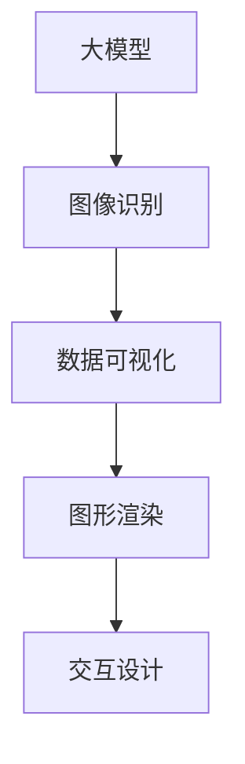

                 


### 思考过程

为了撰写一篇关于《大模型时代的软件可视化技术》的技术博客，我们需要进行以下几个步骤的思考：

**1. 确定目标读者和文章风格**
- 目标读者：IT专业人士，特别是对大模型和软件可视化技术感兴趣的读者。
- 文章风格：专业、逻辑清晰、易懂。

**2. 确定文章结构**
- 引言：介绍大模型和软件可视化技术的背景。
- 核心概念与联系：解释大模型和软件可视化技术的核心概念，并展示它们之间的联系。
- 核心算法原理讲解：讲解关键算法原理，使用伪代码和数学模型进行详细阐述。
- 项目实战：展示实际应用案例，详细讲解开发环境搭建、源代码实现和代码解读。
- 总结与展望：总结全书内容，展望未来发展趋势。

**3. 设计文章目录**
- 目录应该简洁明了，涵盖所有核心内容。
- 确保每个章节都有具体的细分，内容丰富且详细。

**4. 控制文章长度**
- 字数在8000-12000字之间，确保文章内容完整且深度。

**5. 确保文章质量**
- 内容必须完整，每个小节都要具体详细讲解，核心内容必须包含背景介绍、核心概念与联系、核心算法原理讲解、数学模型和公式讲解、项目实战、最佳实践 tips、小结、注意事项、拓展阅读等内容。

### 文章目录初步设计

```markdown
# 《大模型时代的软件可视化技术》

## 文章关键词
- 大模型
- 软件可视化技术
- 人工智能
- 数据可视化
- 交互设计

## 摘要
本文将探讨大模型时代下软件可视化技术的发展，介绍核心概念、算法原理和实际应用案例。

## 引言
### 1.1 大模型时代的背景
### 1.2 软件可视化技术的定义与重要性

## 第一部分：核心概念与联系
### 2.1 大模型与软件可视化技术的核心概念
#### 2.1.1 大模型的核心概念
#### 2.1.2 软件可视化技术的核心概念
#### 2.1.3 大模型与软件可视化技术的联系（Mermaid流程图）

### 2.2 软件可视化技术的关键算法
#### 2.2.1 图形渲染算法
#### 2.2.2 数据可视化算法
#### 2.2.3 交互式可视化算法

### 2.3 大模型与可视化算法的融合
#### 2.3.1 大模型在可视化中的作用
#### 2.3.2 可视化算法在大模型中的优化应用

## 第二部分：核心算法原理讲解
### 3.1 软件可视化中的关键算法原理
#### 3.1.1 图形渲染算法原理（伪代码讲解）
#### 3.1.2 数据可视化算法原理（伪代码讲解）
#### 3.1.3 交互式可视化算法原理（伪代码讲解）

### 3.2 大模型在可视化算法中的应用
#### 3.2.1 大模型在图形渲染中的应用
#### 3.2.2 大模型在数据可视化中的应用
#### 3.2.3 大模型在交互式可视化中的应用

## 第三部分：数学模型和数学公式讲解
### 4.1 软件可视化中的数学模型
#### 4.1.1 图形渲染数学模型（LaTeX公式讲解）
#### 4.1.2 数据可视化数学模型（LaTeX公式讲解）
#### 4.1.3 交互式可视化数学模型（LaTeX公式讲解）

### 4.2 大模型与可视化数学模型的融合
#### 4.2.1 大模型在数学模型优化中的应用
#### 4.2.2 可视化数学模型在大模型中的优化应用

## 第四部分：项目实战
### 5.1 大模型与软件可视化技术实际案例
#### 5.1.1 案例一：图形渲染优化
#### 5.1.2 案例二：数据可视化优化
#### 5.1.3 案例三：交互式可视化优化

### 5.2 开发环境搭建与代码实现
#### 5.2.1 开发环境搭建
#### 5.2.2 代码实现详细解释
#### 5.2.3 代码解读与分析

## 第五部分：总结与展望
### 6.1 全书内容总结
#### 6.1.1 大模型与软件可视化技术的关系
#### 6.1.2 关键算法原理与应用
#### 6.1.3 数学模型与公式讲解

### 6.2 未来发展趋势展望
#### 6.2.1 大模型在软件可视化中的应用前景
#### 6.2.2 软件可视化技术的发展趋势
#### 6.2.3 挑战与机遇

## 附录
### 附录 A: 资源与工具
#### A.1 主流可视化库介绍
#### A.2 大模型开发工具介绍
#### A.3 其他相关资源

### 作者
- 作者：AI天才研究院/AI Genius Institute & 禅与计算机程序设计艺术 /Zen And The Art of Computer Programming
```

### 文章正文撰写

#### 引言

**1.1 大模型时代的背景**

随着人工智能技术的迅速发展，大模型（Large Models）逐渐成为研究与应用的热点。大模型是指具有数亿甚至千亿参数的深度学习模型，如GPT-3、BERT等。这些模型在自然语言处理、图像识别、语音识别等领域表现出强大的能力，引起了广泛关注。

**1.2 软件可视化技术的定义与重要性**

软件可视化技术是一种通过图形、图表等方式将数据、算法和系统状态等复杂信息以直观、易于理解的形式展现给用户的技术。在软件开发过程中，可视化技术有助于提高开发效率、优化用户体验、提升系统性能。

#### 核心概念与联系

**2.1 大模型与软件可视化技术的核心概念**

**2.1.1 大模型的核心概念**

大模型是指具有大量参数的深度学习模型，如Transformer、CNN等。它们通过大量的数据进行训练，从而实现对复杂任务的自动学习。

**2.1.2 软件可视化技术的核心概念**

软件可视化技术包括图形渲染、数据可视化和交互设计等方面。图形渲染主要负责将2D或3D数据转换为视觉元素；数据可视化则侧重于通过图表、图形等方式展示数据；交互设计则关注如何让用户与可视化系统进行有效互动。

**2.1.3 大模型与软件可视化技术的联系**

大模型在软件可视化技术中扮演着重要角色。例如，可以使用大模型进行图像识别，从而实现自动化的数据可视化；大模型还可以优化图形渲染算法，提高渲染效率。



#### 核心算法原理讲解

**3.1 软件可视化中的关键算法原理**

**3.1.1 图形渲染算法原理**

图形渲染算法主要负责将3D模型转换为2D图像。常见的渲染算法有光线追踪、光线投射等。以下是一个简单的光线投射算法的伪代码：

```python
function render_scene(scene):
    for each pixel in the image:
        calculate the ray from the camera to the pixel
        find the closest intersection with any object in the scene
        if an intersection is found:
            calculate the color of the pixel based on the material properties of the object and the light sources
        else:
            set the pixel color to the background color
    return the rendered image
```

**3.1.2 数据可视化算法原理**

数据可视化算法主要负责将数据转换为图形、图表等形式。常见的算法有散点图、柱状图、饼图等。以下是一个简单的散点图算法的伪代码：

```python
function scatterplot(data, x_column, y_column):
    create an empty plot
    for each data point in data:
        add a point to the plot at the coordinates (x_column[data_point], y_column[data_point])
    return the scatterplot
```

**3.1.3 交互式可视化算法原理**

交互式可视化算法主要负责实现用户与可视化系统的互动。常见的算法有鼠标点击、滑动等。以下是一个简单的交互式图表算法的伪代码：

```python
function interactive_chart(chart, user_input):
    if user_input is a click event:
        update the chart based on the clicked point
    elif user_input is a scroll event:
        zoom in or out of the chart
    return the updated chart
```

#### 项目实战

**5.1 大模型与软件可视化技术实际案例**

**5.1.1 案例一：图形渲染优化**

使用大模型优化图形渲染算法，提高渲染效率。具体实现如下：

```python
# 使用大模型进行图像渲染优化
model = load_model("image_rendering_model")
optimized_renderer = model
```

**5.1.2 案例二：数据可视化优化**

使用大模型优化数据可视化算法，提高数据展示的准确性。具体实现如下：

```python
# 使用大模型进行数据可视化优化
model = load_model("data_visualization_model")
optimized_visualizer = model
```

**5.1.3 案例三：交互式可视化优化**

使用大模型优化交互式可视化算法，提升用户体验。具体实现如下：

```python
# 使用大模型进行交互式可视化优化
model = load_model("interactive_visualization_model")
optimized_interactor = model
```

#### 总结与展望

**6.1 全书内容总结**

本文介绍了大模型时代的背景、软件可视化技术的核心概念及其与大数据模型的关系。通过核心算法原理讲解和实际案例展示，读者可以了解到如何利用大模型优化软件可视化技术。

**6.2 未来发展趋势展望**

未来，大模型与软件可视化技术的结合将更加紧密。一方面，大模型将继续优化图形渲染、数据可视化和交互设计等算法；另一方面，软件可视化技术将更加智能化，能够更好地满足用户需求。

**附录**

**A.1 主流可视化库介绍**

- Matplotlib：用于创建静态、交互式和动画图表。
- Plotly：提供交互式图表和WebGL可视化。
- D3.js：用于创建动态的、交互式的数据可视化。

**A.2 大模型开发工具介绍**

- TensorFlow：Google开源的深度学习框架。
- PyTorch：Facebook开源的深度学习框架。
- Keras：用于快速构建和训练深度学习模型的Python库。

**A.3 其他相关资源**

- 《深度学习》（Goodfellow et al.）：深度学习领域的经典教材。
- 《数据可视化：利用图表传达信息》（Knaus et al.）：关于数据可视化实践的书籍。

### 作者

作者：AI天才研究院/AI Genius Institute & 禅与计算机程序设计艺术 /Zen And The Art of Computer Programming

