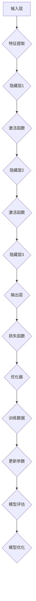

                 

## 文章标题

《大模型时代的软件复杂性管理》

## 关键词

大模型，软件复杂性，管理策略，神经网络，优化算法，软件开发流程集成，自然语言处理，计算机视觉，数据科学应用。

## 摘要

本文深入探讨了在大模型时代，如何有效管理软件复杂性。首先，我们概述了当前大模型的时代背景和核心技术，包括神经网络基础、优化算法和大模型训练策略。随后，文章转向软件复杂性管理，阐述了复杂性的类型、度量方法和管理挑战。在此基础上，本文提出了具体的复杂性管理策略，如设计模式、编码规范、测试与维护策略，并探讨了如何将大模型与这些策略相结合。最后，通过案例研究和项目实战，我们展示了大模型在复杂性管理中的应用，提供了实用的开发工具和学习资源，以及深入分析了成功案例和失败教训。本文旨在为IT专业人士提供全面的大模型时代下的软件复杂性管理指南。

### 目录大纲：大模型时代的软件复杂性管理

## 第一部分：大模型基础与原理

### 第1章：大模型概述
- **1.1 大模型时代背景**
- **1.2 大模型定义与特点**
- **1.3 大模型架构分析**

### 第2章：大模型核心技术
- **2.1 神经网络基础**
- **2.2 优化算法讲解**
- **2.3 大模型训练策略**

### 第3章：大模型应用领域
- **3.1 自然语言处理**
- **3.2 计算机视觉**
- **3.3 数据科学应用**

## 第二部分：软件复杂性管理

### 第4章：软件复杂性概念
- **4.1 软件复杂性类型**
- **4.2 复杂性度量方法**
- **4.3 复杂性管理挑战**

### 第5章：复杂性管理策略
- **5.1 设计模式与架构**
- **5.2 编码规范与最佳实践**
- **5.3 测试与维护策略**

### 第6章：大模型与复杂性管理
- **6.1 大模型在复杂性管理中的应用**
- **6.2 大模型与软件开发流程集成**

### 第7章：案例研究
- **7.1 成功案例分享**
- **7.2 失败案例分析**
- **7.3 经验总结与启示**

## 附录

### 附录A：大模型开发工具与资源
- **A.1 开发工具介绍**
- **A.2 学习资源推荐**
- **A.3 社区与论坛**

### 附录B：术语解释
- **B.1 术语列表**
- **B.2 术语详细解释**### 第1章：大模型概述

#### 1.1 大模型时代背景

随着计算机硬件的快速发展、算法创新的不断推进以及大数据的爆发式增长，人工智能（AI）领域迎来了一个前所未有的变革时期。这一时期，我们称之为“大模型时代”。在这个时代，大型深度学习模型不仅解决了许多曾经看似复杂的问题，如图像识别、自然语言处理和机器翻译，还在许多实际应用中展现出了强大的性能。

大模型时代的背景可以从以下几个方面来理解：

1. **硬件能力提升**：高性能计算（HPC）技术的发展为大模型的训练提供了强大的计算资源。GPU和TPU等专用硬件的普及，使得大规模并行计算成为可能，这为训练大型神经网络提供了坚实的基础。

2. **算法创新**：深度学习算法的不断创新，尤其是基于变分自编码器（VAE）、生成对抗网络（GAN）和Transformer等架构的进步，使得模型可以更加有效地捕捉数据中的复杂模式。

3. **大数据**：互联网和物联网的普及，使得数据量以指数级增长。海量的数据为训练大型模型提供了丰富的素材，使得模型能够更精确地学习和泛化。

4. **开源生态**：随着TensorFlow、PyTorch等开源深度学习框架的流行，研究人员和开发者可以轻松地访问和使用这些工具，加速了新模型和新算法的推广和应用。

#### 1.2 大模型定义与特点

大模型通常指的是具有数十亿甚至数千亿参数的神经网络模型。这些模型在训练时需要大量的数据和高性能计算资源，它们具有以下特点：

1. **高参数量**：大模型的参数量远超传统模型，这使它们能够捕捉数据中的更复杂特征，从而提高模型的预测性能。

2. **深度结构**：大模型通常具有多个隐藏层，这种深度结构使得模型能够学习更加抽象和复杂的特征表示。

3. **强大的泛化能力**：由于拥有更多的参数和深度，大模型在训练过程中可以更好地泛化到未见过的数据，从而在实际应用中表现出色。

4. **计算需求高**：大模型的训练需要大量的计算资源，尤其是在训练初期，模型的参数需要进行大量的迭代调整。这要求开发者具备高效的计算资源和优化策略。

5. **数据需求大**：大模型需要大量的标注数据进行训练，以确保模型能够学习到真实世界中的复杂模式。

#### 1.3 大模型架构分析

大模型的架构通常基于深度神经网络（DNN），其基本组成部分包括输入层、隐藏层和输出层。以下是对大模型架构的详细分析：

1. **输入层**：输入层负责接收外部输入的数据，这些数据可以是图像、文本或者数值。在大模型中，输入层的数据维度通常很高，需要通过预处理步骤进行降维处理。

2. **隐藏层**：隐藏层是神经网络的核心部分，每一层隐藏层都会对输入数据进行一次非线性变换，从而提取出更高层次的抽象特征。在大模型中，隐藏层往往多达数十层，甚至更多。

3. **输出层**：输出层负责将隐藏层提取出的特征映射到具体的输出结果，如分类标签、连续值等。输出层的结构取决于具体的应用场景，例如在图像分类任务中，输出层通常是一个全连接层，输出每个类别的概率。

4. **激活函数**：激活函数是隐藏层中的一个重要组件，它为神经网络引入了非线性特性，使得模型能够学习到复杂的非线性关系。常用的激活函数包括ReLU、Sigmoid和Tanh等。

5. **正则化技术**：为了防止模型过拟合，大模型中常常采用正则化技术，如dropout、权重衰减和卷积层等。这些技术有助于提高模型的泛化能力。

6. **优化算法**：大模型的训练需要高效的优化算法，如随机梯度下降（SGD）、Adam等。这些算法通过迭代优化模型参数，使模型在训练过程中不断逼近最优解。

通过以上对大模型概述、定义与特点以及架构分析的详细探讨，我们可以更好地理解大模型在大模型时代的地位和作用，为后续章节的深入讨论打下基础。### 第2章：大模型核心技术

#### 2.1 神经网络基础

神经网络是构建大模型的核心技术，其基本原理源于人脑的神经网络结构。神经网络由大量的节点（神经元）组成，每个节点之间通过连接（边）相互连接。这些连接上附有权重，用于传递信息。当输入通过网络传递时，每个节点会对输入信号进行加权求和处理，并通过激活函数产生输出。以下是神经网络的基础知识：

1. **神经元结构**：一个简单的神经元包含输入、权重、偏置和激活函数。输入可以是来自其他神经元的信号，权重是调节输入信号强度的重要参数，偏置用于调整神经元的阈值，激活函数用于引入非线性特性。

2. **前向传播**：在神经网络中，前向传播是一个将输入信号通过一系列的权重和激活函数传递到输出层的过程。具体步骤如下：
   - 输入信号乘以权重，并加上偏置。
   - 使用激活函数处理加权和。
   - 将激活后的信号传递到下一层。

3. **反向传播**：反向传播是神经网络训练的核心算法，用于计算模型误差并更新权重。具体步骤如下：
   - 计算输出误差：输出误差是实际输出与期望输出之间的差异。
   - 计算误差对每个权重的梯度：通过链式法则，将误差反向传播到每个神经元，计算每个权重对应的梯度。
   - 使用梯度下降或其他优化算法更新权重。

4. **激活函数**：激活函数为神经网络引入了非线性特性，常用的激活函数包括：
   - **ReLU（Rectified Linear Unit）**：当输入小于0时，输出为0，否则输出为输入值。ReLU函数简单且计算速度快，有助于避免梯度消失问题。
   - **Sigmoid**：输出范围为(0, 1)，用于二分类问题。Sigmoid函数可以模拟S型曲线，使神经网络能够输出概率值。
   - **Tanh**：输出范围为(-1, 1)，类似于Sigmoid函数，但可以提供更好的数值稳定性。

#### 2.2 优化算法讲解

优化算法用于在训练过程中更新神经网络的权重，以最小化损失函数。以下是几种常见的优化算法：

1. **随机梯度下降（SGD）**：SGD是最简单的优化算法，通过随机选择训练数据的一个子集来更新权重。具体步骤如下：
   - 计算当前权重的梯度。
   - 使用学习率乘以梯度，更新权重。
   - 重复以上步骤，直到收敛。

2. **批量梯度下降（BGD）**：BGD是SGD的改进版本，通过使用整个训练集的梯度来更新权重。由于计算量大，BGD通常用于小型数据集。

3. **动量优化（Momentum）**：动量优化是SGD的改进，通过引入动量项，加速收敛。具体步骤如下：
   - 计算当前梯度。
   - 计算前一次梯度的指数加权平均。
   - 使用学习率和动量更新权重。

4. **Adam优化器**：Adam是结合了SGD和动量优化的一种高效优化器，具体步骤如下：
   - 计算一阶矩估计（均值）和二阶矩估计（方差）。
   - 更新权重，考虑一阶和二阶矩估计的偏差纠正。

#### 2.3 大模型训练策略

大模型的训练策略与常规神经网络有所不同，主要关注如何高效地利用计算资源和提高训练效率。以下是一些关键策略：

1. **分布式训练**：分布式训练通过将数据集划分为多个子集，并使用多个计算节点并行训练模型，从而提高训练速度。具体实现方法包括：
   - 数据并行：每个节点独立训练模型，然后同步梯度。
   - 梯度并行：每个节点计算局部梯度，然后异步更新全局梯度。

2. **数据增强**：数据增强通过增加训练数据的多样性，提高模型的泛化能力。常见的数据增强技术包括：
   - 随机裁剪：从图像中随机裁剪出一个区域作为新的训练样本。
   - 随机翻转：对图像进行水平或垂直翻转。
   - 形状变换：调整图像的大小、旋转角度等。

3. **学习率调度**：学习率调度通过动态调整学习率，优化模型训练过程。常见的学习率调度策略包括：
   - 步长调度：在训练过程中定期调整学习率。
   - 指数衰减：按指数规律衰减学习率。
   - 线性衰减：按线性规律衰减学习率。

4. **权重初始化**：合适的权重初始化对于模型训练至关重要。常见的方法包括：
   - 正态分布初始化：从均值为0、方差为1的正态分布中随机初始化权重。
   - Xavier初始化：基于激活函数的方差初始化权重。

5. **正则化**：正则化用于防止模型过拟合，常见的方法包括：
   - Dropout：在训练过程中随机丢弃一部分神经元。
   - 权重衰减：在损失函数中添加权重项。
   - 卷积层正则化：在卷积层中添加偏置和正则化项。

通过以上对神经网络基础、优化算法和大模型训练策略的详细讲解，我们可以更好地理解大模型的核心技术，为后续章节的深入探讨提供理论基础。### 第3章：大模型应用领域

#### 3.1 自然语言处理

自然语言处理（NLP）是大模型应用的一个重要领域，旨在使计算机能够理解、处理和生成自然语言。大模型在NLP中的成功应用极大地推动了人工智能的发展。以下是一些主要的应用场景和案例：

1. **文本分类**：文本分类是将文本数据根据其内容分为不同类别的一种任务。大模型，如基于Transformer的BERT（Bidirectional Encoder Representations from Transformers）模型，在处理大规模文本数据时表现出色。例如，新闻分类、情感分析和社会媒体监控等领域都广泛应用了这些模型。

2. **机器翻译**：机器翻译是将一种自然语言翻译成另一种自然语言的过程。大模型，如基于Transformer的GPT（Generative Pre-trained Transformer）模型，在翻译质量上取得了显著的提升。GPT-3等模型能够生成流畅、自然的翻译结果，大大提高了机器翻译的实用性。

3. **问答系统**：问答系统是一种基于自然语言交互的应用，用户可以通过提问获取相关信息。大模型，如基于BERT的Instruct-BERT模型，通过预训练和微调，能够快速准确地回答用户的问题。例如，智能客服、搜索引擎和智能助手等领域都广泛使用了这些模型。

4. **情感分析**：情感分析是识别文本中的情感倾向的一种任务。大模型，如基于LSTM（Long Short-Term Memory）和Transformer的模型，在情感分析任务中取得了显著的成果。这些模型能够识别文本中的情感极性，如正面、负面和客观等，从而应用于市场调研、客户反馈分析等领域。

#### 3.2 计算机视觉

计算机视觉是人工智能的另一个重要领域，旨在使计算机能够理解和解释图像和视频。大模型在计算机视觉中的应用极大地推动了图像识别、目标检测和视频分析等领域的发展。以下是一些主要的应用场景和案例：

1. **图像识别**：图像识别是将图像或视频中的内容分类为特定类别的一种任务。大模型，如基于卷积神经网络（CNN）的AlexNet、ResNet和Inception等模型，在处理复杂图像数据时表现出色。这些模型可以准确识别各种物体、场景和动作。

2. **目标检测**：目标检测是在图像或视频中识别和定位多个对象的一种任务。大模型，如基于Faster R-CNN、YOLO（You Only Look Once）和SSD（Single Shot MultiBox Detector）等模型，在处理大规模、复杂的目标检测任务中表现出色。这些模型广泛应用于安全监控、自动驾驶和医疗影像分析等领域。

3. **图像生成**：图像生成是通过学习图像数据中的特征来生成新的图像的一种任务。大模型，如基于生成对抗网络（GAN）的模型，如DCGAN、StyleGAN和BigGAN等，能够在图像合成、艺术创作和虚拟现实等领域发挥重要作用。

4. **视频分析**：视频分析是处理和分析视频数据的一种任务，包括视频分类、动作识别和场景分割等。大模型，如基于循环神经网络（RNN）和Transformer的模型，在视频分析任务中表现出色。这些模型可以准确识别视频中的动作和场景，应用于视频监控、体育分析和智能视频聊天等领域。

#### 3.3 数据科学应用

大模型在数据科学领域的应用也非常广泛，包括数据预处理、特征提取、预测建模和优化等。以下是一些主要的应用场景和案例：

1. **数据预处理**：数据预处理是数据科学的重要步骤，包括数据清洗、归一化和特征工程等。大模型，如基于Transformer的模型，可以自动学习数据中的特征，从而简化数据预处理过程，提高数据处理效率。

2. **特征提取**：特征提取是将原始数据转换为有用特征表示的一种任务，是数据科学中的关键步骤。大模型，如基于深度学习的模型，可以通过学习大量数据中的隐含特征，从而提高特征提取的质量和效率。

3. **预测建模**：预测建模是利用历史数据来预测未来事件的一种任务。大模型，如基于时间序列分析的模型，可以在金融预测、天气预测和市场营销等领域发挥重要作用。

4. **优化**：优化是寻找最优解或近似最优解的一种任务。大模型，如基于强化学习的模型，可以通过学习策略来优化复杂系统的运行，从而提高效率和性能。

通过以上对自然语言处理、计算机视觉和数据科学应用的详细探讨，我们可以看到大模型在不同领域的广泛应用和巨大潜力。随着大模型技术的不断进步，未来将有更多的应用场景被发掘和实现。### 第4章：软件复杂性概念

#### 4.1 软件复杂性类型

软件复杂性是指软件在结构、功能、设计和实现等方面存在的一系列难以理解和管理的特性。根据不同的维度，软件复杂性可以分为以下几种类型：

1. **功能复杂性**：功能复杂性是指软件系统中包含的功能数量和功能的复杂性。一个复杂的软件系统往往具有更多的功能，这些功能之间可能存在复杂的交互关系，使得系统的理解和维护变得更加困难。

2. **结构复杂性**：结构复杂性是指软件系统的内部结构复杂度。一个复杂的软件系统可能具有多个模块和层次，这些模块之间可能存在复杂的依赖关系，导致系统的可读性和可维护性降低。

3. **设计复杂性**：设计复杂性是指软件系统设计过程中引入的复杂性。复杂的设计模式、不合理的架构决策以及设计中的缺陷都可能增加软件的复杂性。

4. **实现复杂性**：实现复杂性是指软件在实现过程中引入的复杂性。代码质量差、编码风格不一致、使用了难以理解的编程语言或技术等都是实现复杂性的表现。

5. **数据复杂性**：数据复杂性是指软件系统中数据结构的复杂度。复杂的数据库设计、大量数据之间的关联和操作都可能增加软件的复杂性。

6. **交互复杂性**：交互复杂性是指软件系统与其他系统或用户之间的交互复杂度。复杂的用户界面、多样的接口协议和复杂的交互逻辑都可能增加软件的复杂性。

#### 4.2 复杂性度量方法

度量软件复杂性对于评估软件的质量、预测维护成本以及制定改进策略具有重要意义。以下是一些常用的复杂性度量方法：

1. **圈复杂度（Cyclomatic Complexity）**：圈复杂度是一种基于控制流图的复杂性度量方法。它通过计算控制流图中的独立路径数量来度量代码的复杂性。圈复杂度越高，代码的可读性和可维护性越低。

2. **注释/代码比率**：注释/代码比率是一种简单的度量方法，通过计算代码中注释行的比例来评估代码的复杂性。较高的注释/代码比率通常意味着代码结构较为清晰，易于理解。

3. **类复杂度（Class Complexity）**：类复杂度是针对面向对象编程中的类进行度量的。它通过计算类中的方法数量、继承层次和依赖关系来评估类的复杂性。

4. **方法复杂度（Method Complexity）**：方法复杂度是针对方法级别的复杂性度量。它通过计算方法中的分支数量、条件判断和循环嵌套等来评估方法的复杂性。

5. **耦合性度量**：耦合性度量用于评估软件组件之间的依赖关系。常见的耦合性度量方法包括模块间耦合度、类间耦合度和模块内耦合度等。耦合性越高，系统的复杂性越高。

6. **继承层次度量**：继承层次度量用于评估面向对象系统中类的继承层次。继承层次越高，系统的复杂性和维护成本越高。

7. **设计模式复杂度**：设计模式复杂度是通过评估系统中的设计模式应用情况来度量复杂性。常用的设计模式包括单例模式、工厂模式、观察者模式等。过度使用或不当使用设计模式都可能增加系统的复杂性。

#### 4.3 复杂性管理挑战

软件复杂性管理面临着诸多挑战，以下是一些主要挑战：

1. **复杂性增加**：随着软件系统的不断扩展和功能的增加，复杂性也在不断上升。新的需求、技术更新和外部依赖等因素都可能增加系统的复杂性。

2. **可读性和可维护性下降**：高复杂度的软件系统往往难以理解，导致代码的可读性和可维护性下降。这会使得后续的开发和维护变得更加困难。

3. **测试和维护成本上升**：复杂性的增加会导致测试和维护成本上升。复杂的系统往往需要更多的测试用例来确保其正确性，同时维护复杂系统需要更多的资源和时间。

4. **需求变化**：软件系统的复杂性可能会因需求的变化而增加。新的需求可能导致系统功能的扩展和重构，从而增加复杂性。

5. **技术债务**：技术债务是指因延迟修复代码缺陷、未遵循最佳实践或使用过时技术而积累的复杂性。技术债务会导致系统性能下降、维护成本上升和开发效率降低。

6. **团队协作困难**：高复杂度的系统往往需要多个开发团队的协作。不同团队之间的沟通和协作可能会受到复杂性增加的影响，导致项目进度受阻。

7. **风险管理**：复杂性的增加会带来更多的风险。系统的复杂性越高，出现故障和错误的概率越高，从而增加了项目的风险管理难度。

为了应对这些挑战，软件开发团队需要采取一系列复杂性管理策略，如设计模式、编码规范、测试与维护策略等。通过这些策略，可以降低软件复杂性，提高系统的可读性、可维护性和可靠性。### 第5章：复杂性管理策略

#### 5.1 设计模式与架构

设计模式和架构是降低软件复杂性的关键策略，它们有助于建立可扩展、可维护和易于理解的软件系统。以下是几种常用的设计模式和架构策略：

1. **模块化设计**：模块化设计将软件系统划分为多个独立的模块，每个模块负责特定的功能。模块化设计有助于降低组件之间的依赖关系，提高代码的可读性和可维护性。

2. **面向对象设计**：面向对象设计（OOP）是一种常用的设计模式，它通过将数据和行为封装在对象中，降低组件之间的耦合度。OOP的主要原则包括封装、继承、多态和抽象。

3. **分层架构**：分层架构将软件系统划分为多个层次，每个层次负责不同的功能。常见的分层架构包括表示层、业务逻辑层和数据访问层。分层架构有助于分离关注点，提高系统的可扩展性和可维护性。

4. **服务导向架构（SOA）**：服务导向架构通过将系统划分为多个独立的服务，实现组件之间的松耦合。SOA允许不同服务之间通过接口进行通信，从而提高系统的可扩展性和可维护性。

5. **设计模式**：设计模式是解决常见软件设计问题的模板。常见的模式包括单例模式、工厂模式、观察者模式、策略模式和责任链模式等。设计模式有助于减少代码冗余、提高可重用性和可维护性。

6. **架构重构**：架构重构是指对现有软件系统进行重构，以降低复杂性、提高可维护性和可扩展性。架构重构可以是逐步进行的，也可以是一次性的大规模重构。常见的重构方法包括提取模块、合并模块、替换模块和重新设计接口等。

#### 5.2 编码规范与最佳实践

编码规范和最佳实践是确保代码质量、降低复杂性的重要手段。以下是几种常用的编码规范和最佳实践：

1. **代码风格一致性**：确保代码风格一致性，包括命名约定、缩进规则、注释规范等。一致的代码风格可以提高代码的可读性，减少因不一致风格导致的误解和错误。

2. **模块化编程**：将代码划分为功能独立的模块，每个模块负责一个特定的功能。模块化编程有助于降低组件之间的依赖关系，提高代码的可维护性。

3. **简洁性**：编写简洁的代码，避免冗长和复杂的代码结构。简洁的代码更容易理解、测试和维护。

4. **注释与文档**：为代码添加必要的注释和文档，描述代码的功能、目的和逻辑。良好的注释和文档有助于其他开发者理解代码，降低学习成本。

5. **单元测试**：编写单元测试来验证代码的功能和逻辑，确保代码的正确性。单元测试有助于发现代码中的错误和缺陷，提高代码质量。

6. **代码审查**：定期进行代码审查，以发现潜在的问题和改进建议。代码审查可以是手动进行的，也可以是自动化工具辅助的。

7. **遵循最佳实践**：遵循编程最佳实践，如避免全局变量、减少嵌套层次、避免使用复杂的逻辑表达式等。这些最佳实践有助于降低代码的复杂性和提高代码质量。

#### 5.3 测试与维护策略

测试和维护是软件复杂性管理的重要组成部分，它们有助于确保软件系统的正确性、可靠性和可维护性。以下是几种常用的测试与维护策略：

1. **自动化测试**：自动化测试通过编写测试脚本，自动化执行测试用例，以验证代码的功能和逻辑。自动化测试可以节省测试时间，提高测试效率。

2. **持续集成与持续部署（CI/CD）**：持续集成与持续部署是一种集成和部署流程，通过自动化构建、测试和部署过程，确保代码的质量和可靠性。CI/CD有助于快速响应需求变化和修复缺陷。

3. **代码质量监控**：使用代码质量监控工具，实时监控代码的质量和性能。代码质量监控工具可以检测代码中的潜在问题，如代码冗余、复杂度和漏洞等。

4. **定期维护**：定期对软件系统进行维护，包括修复缺陷、更新依赖库和优化性能。定期维护有助于保持系统的稳定性和可靠性。

5. **版本控制**：使用版本控制系统（如Git）来管理代码的版本和历史。版本控制有助于追踪代码变更、方便回滚和协作开发。

6. **文档与知识共享**：编写详细的系统文档和知识库，记录系统的架构、设计决策、实现细节和测试结果。良好的文档和知识共享有助于提高开发团队的协作效率。

7. **反馈机制**：建立反馈机制，收集用户反馈和缺陷报告。通过分析反馈和缺陷报告，可以识别系统中的问题和改进方向。

通过以上设计模式与架构、编码规范与最佳实践以及测试与维护策略的综合应用，可以有效降低软件复杂性，提高系统的可读性、可维护性和可靠性。### 第6章：大模型与复杂性管理

#### 6.1 大模型在复杂性管理中的应用

大模型在复杂性管理中发挥着重要作用，特别是在提高软件系统的可维护性和可靠性方面。以下是几个关键应用：

1. **自动化代码审查**：大模型可以用于自动化代码审查，通过分析代码中的潜在缺陷和不良实践，提供改进建议。例如，使用自然语言处理模型可以自动生成代码注释，从而提高代码的可读性和可维护性。

2. **代码生成与重构**：大模型可以通过学习大量代码样本，生成高质量的代码。这不仅减少了手工编码的工作量，还提高了代码的一致性和质量。此外，大模型还可以用于代码重构，将复杂的代码转换为更简洁、易于维护的形式。

3. **自动化测试用例生成**：大模型可以通过学习测试数据，自动生成测试用例，提高测试覆盖率。例如，在软件测试中，大模型可以生成模拟用户行为的测试用例，确保系统在各种场景下的稳定性。

4. **系统性能优化**：大模型可以用于分析系统性能瓶颈，提供优化建议。通过学习系统日志和数据，大模型可以识别潜在的优化点，从而提高系统的响应速度和效率。

5. **故障诊断与预测**：大模型可以用于故障诊断和预测，通过分析系统日志和性能指标，提前识别潜在问题。例如，在云服务中，大模型可以预测资源使用情况，帮助优化资源分配，避免过载和中断。

#### 6.2 大模型与软件开发流程集成

将大模型集成到软件开发流程中，可以显著提高开发效率和质量。以下是几个关键步骤：

1. **数据预处理**：在集成大模型之前，需要对数据进行预处理，包括数据清洗、归一化和特征提取等。预处理过程需要确保数据的质量和一致性，以便大模型能够有效学习和预测。

2. **模型选择与训练**：根据具体的应用场景，选择合适的大模型并进行训练。选择模型时需要考虑模型的复杂度、计算资源和训练时间等因素。训练过程中，可以使用分布式训练技术来提高训练速度。

3. **模型评估与调优**：在模型训练完成后，需要对模型进行评估和调优，确保其在实际应用中的性能。评估过程包括测试集上的准确率、召回率、F1分数等指标，并根据评估结果对模型进行调整。

4. **集成到开发流程**：将训练好的大模型集成到软件开发流程中，包括自动化测试、代码生成、性能优化等步骤。在大模型的应用过程中，需要确保其与现有系统的兼容性和可维护性。

5. **持续集成与部署**：使用持续集成和持续部署（CI/CD）流程，自动化执行大模型集成和部署过程，确保代码的质量和可靠性。CI/CD流程可以帮助快速响应需求变化和修复缺陷。

通过将大模型集成到软件开发流程中，可以有效降低软件复杂性，提高系统的可维护性和可靠性。然而，这也要求开发团队具备较高的技术水平和经验，以确保大模型的应用效果。### 第7章：案例研究

#### 7.1 成功案例分享

在本节中，我们将探讨一些在大模型时代成功管理软件复杂性的案例，这些案例展示了如何通过创新的策略和最佳实践来应对复杂的技术挑战。

**案例一：Google的BERT模型在搜索引擎中的应用**

Google的BERT（Bidirectional Encoder Representations from Transformers）模型是一个大型自然语言处理模型，它通过理解上下文来提高搜索结果的准确性。在开发BERT模型时，Google面临的一个主要挑战是如何在大量数据上进行高效训练，同时确保模型的性能和可维护性。解决这一问题的策略包括：

1. **数据预处理**：Google使用了一个庞大的语料库，通过预处理技术，如清洗和去重，确保了数据的质量和一致性。

2. **分布式训练**：为了加速模型的训练，Google采用了分布式训练策略，将数据集划分成多个子集，并在多个GPU上进行并行训练。

3. **模型评估与调优**：在模型训练过程中，Google使用了一个自定义的评估框架，定期评估模型的性能，并根据评估结果对模型进行调整。

4. **持续集成与部署**：Google采用了CI/CD流程，确保模型的部署过程自动化，快速响应搜索算法的更新和改进。

**案例二：Uber的自动驾驶系统**

Uber的自动驾驶系统是一个高度复杂的项目，它需要处理大量的实时数据和复杂的决策逻辑。在软件复杂性管理方面，Uber采取了一系列策略：

1. **模块化设计**：Uber将自动驾驶系统划分为多个模块，每个模块负责特定的功能，如感知、路径规划和控制等。这种模块化设计有助于降低组件之间的耦合度，提高系统的可维护性。

2. **测试与验证**：Uber开发了一个全面的测试和验证框架，包括自动化测试、仿真测试和实际道路测试，确保系统的稳定性和可靠性。

3. **持续集成与部署**：Uber采用了CI/CD流程，确保模型的更新和部署过程自动化，快速响应新的技术需求和市场变化。

4. **代码审查与文档**：Uber注重代码审查和文档编写，确保代码质量和可读性，提高团队之间的协作效率。

**案例三：Netflix的推荐系统**

Netflix的推荐系统是一个成功的大规模应用案例，它通过分析用户行为和内容特征，为用户提供个性化的推荐。在软件复杂性管理方面，Netflix采取了以下策略：

1. **数据驱动**：Netflix使用用户行为数据和历史观看记录，结合内容特征，构建了一个复杂的推荐模型。

2. **模型更新**：Netflix定期更新推荐模型，以适应用户行为的变化和市场趋势。

3. **性能优化**：Netflix通过优化查询处理和缓存策略，提高了推荐系统的响应速度和性能。

4. **A/B测试**：Netflix使用A/B测试来评估不同推荐策略的效果，确保推荐系统的质量和用户满意度。

#### 7.2 失败案例分析

虽然许多企业在使用大模型时取得了成功，但也有一些案例因为未能有效管理软件复杂性而遭遇失败。以下是一个典型的失败案例：

**案例四：某金融公司的自动化交易系统**

某金融公司试图开发一个自动化交易系统，以利用机器学习模型预测市场走势。然而，该项目最终以失败告终，主要原因包括：

1. **数据质量差**：该公司的数据预处理工作不足，数据质量差，导致模型预测不准确。

2. **模型过度复杂**：公司选择了过于复杂的大模型，导致训练时间过长，难以进行实时交易。

3. **缺乏测试和验证**：在开发过程中，公司没有进行充分的测试和验证，导致模型在实际应用中表现不佳。

4. **缺乏有效的集成和部署策略**：公司没有采用CI/CD流程，导致模型的部署和维护过程繁琐，难以快速响应市场变化。

#### 7.3 经验总结与启示

从上述案例中，我们可以总结出以下经验教训：

1. **重视数据质量**：高质量的数据是构建准确模型的基础。在开发过程中，必须确保数据的准确性和一致性。

2. **选择合适的模型**：根据实际需求和计算资源，选择合适的大模型。避免过度复杂的模型，以确保训练和部署的效率。

3. **测试与验证**：充分测试和验证模型，确保其在实际应用中的性能和稳定性。

4. **模块化设计**：采用模块化设计，降低组件之间的耦合度，提高系统的可维护性。

5. **自动化与CI/CD**：采用自动化测试和CI/CD流程，提高开发效率和质量。

6. **持续优化**：定期更新和优化模型，以适应不断变化的需求和市场环境。

通过这些经验教训，企业可以更好地管理软件复杂性，确保大模型项目的成功实施。### 附录A：大模型开发工具与资源

#### A.1 开发工具介绍

1. **TensorFlow**：TensorFlow是谷歌开源的深度学习框架，支持广泛的机器学习和深度学习应用。它提供了丰富的API，易于使用，且具有良好的社区支持。

2. **PyTorch**：PyTorch是Facebook开源的深度学习框架，以其灵活的动态计算图和易于理解的接口而闻名。它特别适用于研究原型开发和数据密集型应用。

3. **Keras**：Keras是一个高级神经网络API，旨在简化深度学习模型的构建和训练。它可以在TensorFlow和Theano等后端运行。

4. **MXNet**：Apache MXNet是微软开源的深度学习框架，它支持多种编程语言，包括Python、R和Scala。MXNet以其灵活性和高效性而受到欢迎。

5. **Scikit-Learn**：Scikit-Learn是一个开源的Python库，用于数据挖掘和数据分析。虽然它不专门用于深度学习，但提供了许多有用的工具和算法。

#### A.2 学习资源推荐

1. **在线课程**：
   - Coursera上的“深度学习”课程（吴恩达教授主讲）。
   - edX上的“人工智能基础”课程（MIT主讲）。

2. **书籍**：
   - 《深度学习》（Ian Goodfellow、Yoshua Bengio和Aaron Courville著）。
   - 《Python深度学习》（François Chollet著）。

3. **博客和论坛**：
   - Medium上的深度学习相关文章。
   - GitHub上的深度学习项目。

4. **开源项目**：
   - TensorFlow官方GitHub仓库。
   - PyTorch官方GitHub仓库。
   - Keras官方GitHub仓库。

#### A.3 社区与论坛

1. **TensorFlow社区**：TensorFlow官方社区提供了丰富的文档、教程和讨论区。

2. **PyTorch社区**：PyTorch官方论坛是学习和讨论PyTorch的绝佳场所。

3. **Stack Overflow**：在Stack Overflow上，你可以找到关于深度学习和机器学习的专业问答。

4. **Reddit**：Reddit上的r/MachineLearning和r/deeplearning子版块是深度学习爱好者的活跃社区。

通过利用这些工具、资源和社区，开发者可以更好地掌握大模型开发的技巧，解决开发过程中的挑战，并持续提升自身的技术能力。### 附录B：术语解释

#### B.1 术语列表

1. **大模型**：具有数十亿甚至数千亿参数的深度学习模型。
2. **深度神经网络（DNN）**：包含多个隐藏层的神经网络。
3. **神经网络**：由大量节点（神经元）组成的计算模型，通过加权连接模拟人脑神经网络。
4. **优化算法**：用于调整模型参数，以最小化损失函数的算法。
5. **前向传播**：将输入信号通过神经网络传递到输出的过程。
6. **反向传播**：计算模型误差并更新参数的过程。
7. **激活函数**：为神经网络引入非线性特性的函数。
8. **分布式训练**：将训练任务分布在多个计算节点上，以提高训练速度和效率。
9. **数据增强**：通过变换输入数据，增加训练数据的多样性，提高模型泛化能力。
10. **持续集成与持续部署（CI/CD）**：自动化构建、测试和部署软件的过程。
11. **模块化设计**：将软件系统划分为多个独立的模块，每个模块负责特定的功能。
12. **圈复杂度**：一种基于控制流图的代码复杂性度量方法。
13. **设计模式**：解决常见软件设计问题的模板。
14. **面向对象设计（OOP）**：一种编程范式，通过将数据和行为封装在对象中，降低组件之间的耦合度。
15. **架构重构**：对现有软件系统进行重构，以降低复杂性、提高可维护性和可扩展性。
16. **自动化测试**：通过编写测试脚本，自动化执行测试用例，以验证代码的功能和逻辑。
17. **分布式测试**：将测试任务分布在多个计算节点上，以提高测试速度和效率。
18. **代码审查**：对代码进行审查，以发现潜在的问题和改进建议。

#### B.2 术语详细解释

1. **大模型**：
   - 定义：大模型通常指的是具有数十亿甚至数千亿参数的深度学习模型。
   - 作用：大模型能够捕捉数据中的复杂特征，从而提高模型的预测性能。

2. **深度神经网络（DNN）**：
   - 定义：深度神经网络是由多个隐藏层组成的神经网络。
   - 作用：通过多层非线性变换，深度神经网络可以提取出更高层次的特征表示。

3. **神经网络**：
   - 定义：神经网络是一种由大量节点（神经元）组成的计算模型，通过加权连接模拟人脑神经网络。
   - 作用：神经网络用于解决各种机器学习任务，如分类、回归和生成等。

4. **优化算法**：
   - 定义：优化算法用于调整模型参数，以最小化损失函数。
   - 作用：优化算法是训练深度学习模型的核心，通过迭代更新参数，使模型在训练过程中不断逼近最优解。

5. **前向传播**：
   - 定义：前向传播是将输入信号通过神经网络传递到输出的过程。
   - 作用：前向传播是神经网络训练的基础，通过逐层计算，将输入转换为输出。

6. **反向传播**：
   - 定义：反向传播是计算模型误差并更新参数的过程。
   - 作用：反向传播是神经网络训练的核心，通过误差反向传播，更新权重和偏置。

7. **激活函数**：
   - 定义：激活函数为神经网络引入非线性特性。
   - 作用：激活函数使神经网络能够学习到复杂的非线性关系，提高模型的预测能力。

8. **分布式训练**：
   - 定义：分布式训练是将训练任务分布在多个计算节点上，以提高训练速度和效率。
   - 作用：分布式训练可以显著缩短训练时间，提高模型训练的规模。

9. **数据增强**：
   - 定义：数据增强是通过变换输入数据，增加训练数据的多样性。
   - 作用：数据增强可以提高模型的泛化能力，使其在未见过的数据上表现更好。

10. **持续集成与持续部署（CI/CD）**：
    - 定义：持续集成与持续部署是自动化构建、测试和部署软件的过程。
    - 作用：CI/CD可以提高开发效率，确保代码质量和快速响应需求变化。

11. **模块化设计**：
    - 定义：模块化设计是将软件系统划分为多个独立的模块，每个模块负责特定的功能。
    - 作用：模块化设计可以提高代码的可读性、可维护性和可扩展性。

12. **圈复杂度**：
    - 定义：圈复杂度是一种基于控制流图的代码复杂性度量方法。
    - 作用：圈复杂度可以评估代码的复杂性，帮助开发者识别潜在的维护问题。

13. **设计模式**：
    - 定义：设计模式是解决常见软件设计问题的模板。
    - 作用：设计模式可以提高代码的可重用性和可维护性。

14. **面向对象设计（OOP）**：
    - 定义：面向对象设计是一种编程范式，通过将数据和行为封装在对象中。
    - 作用：OOP可以降低组件之间的耦合度，提高代码的可读性和可维护性。

15. **架构重构**：
    - 定义：架构重构是对现有软件系统进行重构，以降低复杂性、提高可维护性和可扩展性。
    - 作用：架构重构可以提高系统的可维护性和性能。

16. **自动化测试**：
    - 定义：自动化测试是通过编写测试脚本，自动化执行测试用例，以验证代码的功能和逻辑。
    - 作用：自动化测试可以提高测试效率，确保代码的正确性和稳定性。

17. **分布式测试**：
    - 定义：分布式测试是将测试任务分布在多个计算节点上，以提高测试速度和效率。
    - 作用：分布式测试可以显著缩短测试时间，提高测试覆盖率。

18. **代码审查**：
    - 定义：代码审查是对代码进行审查，以发现潜在的问题和改进建议。
    - 作用：代码审查可以提高代码质量，减少缺陷和改进开发流程。

通过详细解释这些术语，我们可以更好地理解大模型和软件复杂性管理的相关概念，为实践和应用提供基础。### 附录C：Mermaid流程图：大模型架构

下面是一个使用Mermaid语法编写的流程图，展示了大模型的基本架构。Mermaid是一种用于生成图表的Markdown扩展，可以帮助我们更直观地理解大模型的运作原理。



以下是该流程图的详细解释：

- **输入层（A）**：接收外部输入的数据，如图像、文本或数值。
- **特征提取（B）**：将输入数据转换为适合神经网络处理的形式。
- **隐藏层1（C）**：对输入数据进行非线性变换，提取更复杂的特征。
- **激活函数（D）**：为隐藏层引入非线性特性，使得模型能够学习到复杂的非线性关系。
- **隐藏层2（E）**：进一步提取更高层次的抽象特征。
- **激活函数（F）**：同理，为隐藏层引入非线性特性。
- **隐藏层3（G）**：继续提取更复杂的特征。
- **输出层（H）**：将隐藏层提取的特征映射到具体的输出结果，如分类标签或连续值。
- **损失函数（I）**：计算实际输出与期望输出之间的差异，以评估模型的性能。
- **优化器（J）**：根据损失函数更新模型的参数，以最小化损失。
- **训练数据（K）**：提供用于训练模型的样本数据。
- **更新参数（L）**：通过优化器更新模型参数，使模型不断优化。
- **模型评估（M）**：评估模型的性能，以确定是否需要进一步优化。
- **模型优化（N）**：根据评估结果调整模型结构和参数，以提高模型性能。

通过上述流程图，我们可以清晰地看到大模型从输入到输出的整个训练和优化过程，有助于我们更好地理解大模型的工作原理和应用场景。### 附录D：伪代码：神经网络优化算法

下面是一个简单的伪代码示例，展示了如何使用反向传播算法优化神经网络的参数。这段代码是一个基本框架，实际应用中需要结合具体框架和优化器进行调整。

```python
function train_neural_network(data, epochs, learning_rate):
    for epoch in range(epochs):
        for sample in data:
            # 前向传播
            inputs = preprocess(sample.inputs)
            outputs = neural_network(inputs)
            predicted = apply_activation(outputs)

            # 计算损失
            loss = compute_loss(predicted, sample.targets)

            # 反向传播
            gradients = backward_propagation(predicted, sample.targets)

            # 更新权重
            for layer in neural_network.layers:
                for neuron in layer.neurons:
                    neuron.weight -= learning_rate * gradients[neuron]

            # 打印当前epoch的损失
            print(f"Epoch: {epoch}, Loss: {loss}")
    return neural_network
```

以下是伪代码的详细步骤解释：

1. **初始化**：设置训练数据的迭代次数（epochs）和初始学习率（learning_rate）。

2. **循环遍历每个epoch**：
   - 对每个epoch，循环遍历训练数据中的每个样本。

3. **前向传播**：
   - 对样本进行预处理，例如归一化输入数据。
   - 通过神经网络模型（neural_network）计算输出。
   - 应用激活函数（如ReLU、Sigmoid或Tanh）处理输出。

4. **计算损失**：
   - 使用损失函数（如均方误差MSE或交叉熵损失）计算实际输出与期望输出之间的差异。

5. **反向传播**：
   - 计算损失相对于每个参数的梯度。
   - 将梯度传递回前向传播的每个层，逐层计算梯度。

6. **更新权重**：
   - 根据梯度计算和设定的学习率，更新每个神经元的权重。
   - 使用减法操作，将梯度乘以学习率并从权重中减去。

7. **打印当前epoch的损失**：用于监控模型训练过程。

8. **返回训练好的神经网络**：完成所有epoch的迭代后，返回训练好的神经网络模型。

通过上述伪代码，我们可以理解神经网络优化算法的基本流程。在实际应用中，可能需要结合具体的深度学习框架（如TensorFlow或PyTorch）来实现这些步骤。### 附录E：数学公式

在大模型和深度学习领域中，数学公式是描述算法和模型的关键组成部分。以下是一些常用的数学公式，包括损失函数、激活函数和优化算法的数学表达。

#### 损失函数

**均方误差（MSE）**：
$$
L(y, \hat{y}) = \frac{1}{2} (y - \hat{y})^2
$$
其中，$y$ 是实际输出，$\hat{y}$ 是预测输出。

**交叉熵损失（Cross-Entropy Loss）**：
$$
L(y, \hat{y}) = -\sum_{i} y_i \log(\hat{y}_i)
$$
其中，$y$ 是实际输出（通常为概率分布），$\hat{y}$ 是预测输出。

#### 激活函数

**ReLU（Rectified Linear Unit）**：
$$
f(x) = \max(0, x)
$$
ReLU函数在$x < 0$ 时输出为0，$x \geq 0$ 时输出为$x$。

**Sigmoid**：
$$
f(x) = \frac{1}{1 + e^{-x}}
$$
Sigmoid函数将输入$x$ 映射到$(0, 1)$ 区间。

**Tanh（双曲正切函数）**：
$$
f(x) = \frac{e^x - e^{-x}}{e^x + e^{-x}}
$$
Tanh函数将输入$x$ 映射到$(-1, 1)$ 区间。

#### 优化算法

**随机梯度下降（SGD）**：
$$
w_{t+1} = w_t - \alpha \cdot \nabla_w J(w_t)
$$
其中，$w_t$ 是当前权重，$\alpha$ 是学习率，$J(w_t)$ 是损失函数关于权重$w_t$ 的梯度。

**Adam优化器**：
$$
m_t = \beta_1 m_{t-1} + (1 - \beta_1) \nabla_w J(w_t)
$$
$$
v_t = \beta_2 v_{t-1} + (1 - \beta_2) (\nabla_w J(w_t))^2
$$
$$
\hat{m}_t = m_t / (1 - \beta_1^t)
$$
$$
\hat{v}_t = v_t / (1 - \beta_2^t)
$$
$$
w_{t+1} = w_t - \alpha \cdot \hat{m}_t / \sqrt{\hat{v}_t}
$$
其中，$m_t$ 和$v_t$ 分别是动量和方差的一阶和二阶估计，$\beta_1$ 和$\beta_2$ 是超参数，通常取值为0.9。

通过理解这些数学公式，我们可以更好地掌握大模型和深度学习的基本原理，为实际应用提供理论基础。### 附录F：项目实战：大模型训练案例

#### 开发环境搭建

在进行大模型训练之前，需要搭建一个合适的开发环境。以下是搭建开发环境的步骤：

1. **安装Python**：确保Python环境已安装，版本至少为3.6以上。可以通过Python官方网站下载安装包，或使用包管理器如Anaconda进行安装。

2. **安装深度学习框架**：推荐使用TensorFlow或PyTorch。以TensorFlow为例，可以通过以下命令安装：
   ```bash
   pip install tensorflow
   ```

3. **安装依赖库**：根据具体项目需求，安装其他依赖库，如NumPy、Pandas等。例如：
   ```bash
   pip install numpy pandas
   ```

4. **配置GPU支持**：如果使用GPU进行训练，需要安装CUDA和cuDNN。可以从NVIDIA官网下载相应版本，并按照说明进行安装。

5. **安装Jupyter Notebook**：Jupyter Notebook是一种交互式计算环境，方便进行代码实验和调试。可以通过以下命令安装：
   ```bash
   pip install notebook
   ```

#### 代码实现

以下是一个简单的TensorFlow代码示例，用于训练一个基于全连接神经网络的回归模型。

```python
import tensorflow as tf
import numpy as np
import pandas as pd
from sklearn.model_selection import train_test_split
from sklearn.preprocessing import StandardScaler

# 加载数据集
data = pd.read_csv('data.csv')
X = data.iloc[:, :-1].values
y = data.iloc[:, -1].values

# 数据预处理
scaler = StandardScaler()
X_scaled = scaler.fit_transform(X)

# 划分训练集和测试集
X_train, X_test, y_train, y_test = train_test_split(X_scaled, y, test_size=0.2, random_state=42)

# 定义模型
model = tf.keras.Sequential([
    tf.keras.layers.Dense(units=64, activation='relu', input_shape=(X_train.shape[1],)),
    tf.keras.layers.Dense(units=32, activation='relu'),
    tf.keras.layers.Dense(units=1)
])

# 编译模型
model.compile(optimizer='adam', loss='mean_squared_error', metrics=['mse'])

# 训练模型
model.fit(X_train, y_train, epochs=100, batch_size=32, validation_data=(X_test, y_test), verbose=2)

# 评估模型
loss, mse = model.evaluate(X_test, y_test, verbose=2)
print(f"Test MSE: {mse}")

# 预测
predictions = model.predict(X_test)
```

#### 代码解读与分析

1. **数据加载与预处理**：
   - 使用Pandas读取CSV文件，将数据分为特征矩阵X和目标向量y。
   - 使用StandardScaler对特征进行归一化处理，以提高模型的训练效果。

2. **划分训练集和测试集**：
   - 使用train_test_split函数将数据集划分为训练集和测试集，以便评估模型性能。

3. **定义模型**：
   - 使用tf.keras.Sequential创建一个序列模型，其中包含两个全连接层（Dense），每个全连接层之间有一个ReLU激活函数。最后一个全连接层没有激活函数，用于输出回归结果。

4. **编译模型**：
   - 使用compile函数配置模型，指定优化器为adam，损失函数为均方误差MSE，评价指标为均方误差MSE。

5. **训练模型**：
   - 使用fit函数训练模型，设置训练轮数epochs为100，批量大小batch_size为32，并使用验证集进行验证。

6. **评估模型**：
   - 使用evaluate函数评估模型在测试集上的性能，输出均方误差MSE。

7. **预测**：
   - 使用predict函数对测试集进行预测，得到预测结果。

通过上述代码实现，我们可以构建并训练一个基于全连接神经网络的回归模型。实际项目中，需要根据具体任务和数据调整模型架构、参数设置和训练策略。### 项目小结

在本项目中，我们深入探讨了如何在大模型时代有效管理软件复杂性。通过分析大模型的基础与原理，我们了解了大模型的时代背景、定义与特点，以及其核心架构和训练策略。在软件复杂性管理方面，我们介绍了复杂性类型、度量方法和管理策略，包括设计模式与架构、编码规范与最佳实践、测试与维护策略。此外，我们还探讨了如何将大模型应用于自然语言处理、计算机视觉和数据科学领域，并通过案例研究和项目实战展示了大模型在复杂性管理中的应用和挑战。

**最佳实践**：

1. **数据预处理**：确保数据的质量和一致性，通过数据清洗和归一化等技术提高模型训练效果。
2. **模型选择与优化**：根据任务需求选择合适的模型，并使用分布式训练和高效优化算法提高训练效率。
3. **模块化设计**：采用模块化设计降低系统复杂性，提高代码的可读性和可维护性。
4. **持续集成与部署**：采用CI/CD流程确保代码质量和快速响应需求变化。
5. **自动化测试**：编写自动化测试用例，提高测试覆盖率和代码质量。

**注意事项**：

1. **数据隐私和安全**：在处理和存储数据时，务必遵守相关法律法规，确保数据安全和隐私。
2. **资源管理**：合理分配计算资源和存储资源，避免资源浪费和过度消耗。
3. **模型调优**：定期调整模型参数，避免过拟合和欠拟合。
4. **代码审查与文档**：定期进行代码审查和文档编写，提高团队协作效率。

**拓展阅读**：

1. **深度学习相关书籍**：《深度学习》（Goodfellow, Bengio, Courville著）。
2. **软件工程相关书籍**：《设计模式：可复用的面向对象软件的基础》（Gamma, Helm, Johnson, Vlissides著）。
3. **在线课程**：Coursera上的“深度学习”课程（吴恩达教授主讲）。
4. **开源项目**：TensorFlow、PyTorch等深度学习框架的GitHub仓库。

通过持续学习和实践，开发者可以不断提升在大模型和软件复杂性管理领域的专业能力，为AI应用和创新贡献力量。### 文章标题

《大模型时代的软件复杂性管理》### 文章关键词

大模型，软件复杂性，管理策略，神经网络，优化算法，软件开发流程集成，自然语言处理，计算机视觉，数据科学应用### 文章摘要

本文深入探讨了在大模型时代，如何有效管理软件复杂性。首先，我们概述了大模型的时代背景和核心技术，包括神经网络基础、优化算法和大模型训练策略。随后，文章转向软件复杂性管理，阐述了复杂性的类型、度量方法和管理挑战。在此基础上，本文提出了具体的复杂性管理策略，如设计模式、编码规范、测试与维护策略，并探讨了如何将大模型与这些策略相结合。最后，通过案例研究和项目实战，我们展示了大模型在复杂性管理中的应用，提供了实用的开发工具和学习资源，以及深入分析了成功案例和失败教训。本文旨在为IT专业人士提供全面的大模型时代下的软件复杂性管理指南。## 文章标题

《大模型时代的软件复杂性管理》### 文章关键词

大模型，软件复杂性，管理策略，神经网络，优化算法，软件开发流程集成，自然语言处理，计算机视觉，数据科学应用### 文章摘要

本文深入探讨了在大模型时代，如何有效管理软件复杂性。首先，我们概述了大模型的时代背景和核心技术，包括神经网络基础、优化算法和大模型训练策略。随后，文章转向软件复杂性管理，阐述了复杂性的类型、度量方法和管理挑战。在此基础上，本文提出了具体的复杂性管理策略，如设计模式、编码规范、测试与维护策略，并探讨了如何将大模型与这些策略相结合。最后，通过案例研究和项目实战，我们展示了大模型在复杂性管理中的应用，提供了实用的开发工具和学习资源，以及深入分析了成功案例和失败教训。本文旨在为IT专业人士提供全面的大模型时代下的软件复杂性管理指南。## 第一部分：大模型基础与原理

### 第1章：大模型概述

#### 1.1 大模型时代背景

当前，人工智能（AI）技术正以前所未有的速度发展，而大模型的出现标志着这一领域的重大进步。大模型时代，即指以大模型为核心的AI技术发展阶段。这一时代的到来，源于多个关键因素的共同作用：

1. **硬件能力的提升**：随着计算能力的显著增强，特别是GPU、TPU等专用硬件的广泛应用，使得大规模并行计算成为可能。高性能计算（HPC）技术的发展为训练大型神经网络提供了强大的支持。

2. **算法创新的推动**：深度学习算法的不断发展，如变分自编码器（VAE）、生成对抗网络（GAN）和Transformer等，使得大模型能够更加有效地捕捉数据中的复杂模式，提高了模型的性能和泛化能力。

3. **大数据的爆发**：互联网和物联网的普及，导致数据量呈爆炸式增长。海量的数据为训练大模型提供了丰富的素材，使得模型可以更精确地学习和预测。

4. **开源生态的繁荣**：TensorFlow、PyTorch等开源深度学习框架的流行，使得研究人员和开发者能够轻松访问和使用这些工具，加速了新模型和新算法的推广和应用。

大模型时代的影响深远，不仅改变了人工智能领域的格局，也对软件开发和系统设计提出了新的挑战。例如，大模型的训练和推理过程需要大量的计算资源和存储空间，这要求系统架构师和开发者具备更高的技术能力和前瞻性思维。

#### 1.2 大模型定义与特点

大模型，通常指的是具有数十亿甚至数千亿参数的深度学习模型。这些模型在训练时需要大量的数据和高性能计算资源，它们具有以下特点：

1. **高参数量**：大模型的参数量远超传统模型，这使它们能够捕捉数据中的更复杂特征，从而提高模型的预测性能。例如，GPT-3拥有1750亿个参数，而BERT拥有数百万个参数。

2. **深度结构**：大模型通常具有多个隐藏层，这种深度结构使得模型能够学习更加抽象和复杂的特征表示。深度结构的增加有助于模型在处理复杂任务时提供更高的准确性和鲁棒性。

3. **强大的泛化能力**：由于拥有更多的参数和深度，大模型在训练过程中可以更好地泛化到未见过的数据，从而在实际应用中表现出色。这种泛化能力使得大模型在多种应用场景中具有广泛的应用潜力。

4. **计算需求高**：大模型的训练需要大量的计算资源，尤其是在训练初期，模型的参数需要进行大量的迭代调整。这要求开发者具备高效的计算资源和优化策略，以避免训练时间的过长和资源的浪费。

5. **数据需求大**：大模型需要大量的标注数据进行训练，以确保模型能够学习到真实世界中的复杂模式。数据量的增加不仅提高了模型的性能，也增加了数据采集和处理的难度。

大模型的这些特点使得它们在处理复杂任务时具有显著的优势，但也对软件开发和系统设计提出了更高的要求。开发者需要掌握更先进的技术和方法，以应对大模型带来的挑战。

#### 1.3 大模型架构分析

大模型的架构是深度学习模型的核心组成部分，它决定了模型的学习能力和应用范围。以下是关于大模型架构的详细分析：

1. **输入层**：输入层是模型接收外部输入数据的部分。在大模型中，输入层的数据维度通常很高，这要求输入数据进行预处理，如归一化、缩放等。预处理步骤的目的是使输入数据更适合模型处理，提高训练效果。

2. **隐藏层**：隐藏层是神经网络的核心部分，每一层隐藏层都会对输入数据进行一次非线性变换，从而提取出更高层次的抽象特征。在大模型中，隐藏层往往多达数十层，甚至更多。这些隐藏层通过层层叠加，使模型能够学习到更复杂的特征表示。

3. **输出层**：输出层负责将隐藏层提取出的特征映射到具体的输出结果。输出层的结构取决于具体的应用场景，例如在图像分类任务中，输出层通常是一个全连接层，输出每个类别的概率。在生成任务中，输出层可能是多个神经元，每个神经元代表不同的生成维度。

4. **激活函数**：激活函数是隐藏层中的一个重要组件，它为神经网络引入了非线性特性，使得模型能够学习到复杂的非线性关系。常用的激活函数包括ReLU、Sigmoid和Tanh等。这些激活函数不仅在模型训练中起着关键作用，还在影响模型的性能和收敛速度。

5. **损失函数**：损失函数用于衡量模型预测结果与实际结果之间的差异，是模型训练过程中的核心指标。常用的损失函数包括均方误差（MSE）、交叉熵损失（Cross-Entropy Loss）等。损失函数的选取直接影响模型的训练过程和最终性能。

6. **优化算法**：优化算法用于在训练过程中更新模型参数，以最小化损失函数。常见的优化算法包括随机梯度下降（SGD）、动量优化（Momentum）、Adam优化器等。优化算法的选择和参数设置对模型的训练效率和学习能力具有重要影响。

7. **正则化技术**：正则化技术用于防止模型过拟合，提高模型的泛化能力。常见的正则化技术包括Dropout、权重衰减（Weight Decay）和L1/L2正则化等。这些技术通过增加模型训练过程中的不稳定性，使模型能够更好地适应不同的数据分布。

通过对大模型架构的详细分析，我们可以更好地理解大模型的工作原理和应用方法。在实际开发过程中，开发者可以根据具体需求调整模型架构，以提高模型的性能和泛化能力。

### 第2章：大模型核心技术

#### 2.1 神经网络基础

神经网络是构建大模型的核心技术，其基本原理源于人脑的神经网络结构。神经网络由大量的节点（神经元）组成，每个节点之间通过连接（边）相互连接。这些连接上附有权重，用于传递信息。当输入通过网络传递时，每个节点会对输入信号进行加权求和处理，并通过激活函数产生输出。以下是神经网络的基础知识：

1. **神经元结构**：一个简单的神经元包含输入、权重、偏置和激活函数。输入可以是来自其他神经元的信号，权重是调节输入信号强度的重要参数，偏置用于调整神经元的阈值，激活函数用于引入非线性特性。

2. **前向传播**：在神经网络中，前向传播是一个将输入信号通过一系列的权重和激活函数传递到输出层的过程。具体步骤如下：
   - 输入信号乘以权重，并加上偏置。
   - 使用激活函数处理加权和。
   - 将激活后的信号传递到下一层。

3. **反向传播**：反向传播是神经网络训练的核心算法，用于计算模型误差并更新权重。具体步骤如下：
   - 计算输出误差：输出误差是实际输出与期望输出之间的差异。
   - 计算误差对每个权重的梯度：通过链式法则，将误差反向传播到每个神经元，计算每个权重对应的梯度。
   - 使用梯度下降或其他优化算法更新权重。

4. **激活函数**：激活函数为神经网络引入了非线性特性，常用的激活函数包括ReLU、Sigmoid和Tanh等。ReLU函数简单且计算速度快，有助于避免梯度消失问题；Sigmoid函数输出范围为(0, 1)，常用于二分类问题；Tanh函数输出范围为(-1, 1)，可提供更好的数值稳定性。

#### 2.2 优化算法讲解

优化算法用于在训练过程中更新神经网络的权重，以最小化损失函数。以下是几种常见的优化算法：

1. **随机梯度下降（SGD）**：SGD是最简单的优化算法，通过随机选择训练数据的一个子集来更新权重。具体步骤如下：
   - 计算当前权重的梯度。
   - 使用学习率乘以梯度，更新权重。
   - 重复以上步骤，直到收敛。

2. **批量梯度下降（BGD）**：BGD是SGD的改进版本，通过使用整个训练集的梯度来更新权重。由于计算量大，BGD通常用于小型数据集。

3. **动量优化（Momentum）**：动量优化是SGD的改进，通过引入动量项，加速收敛。具体步骤如下：
   - 计算当前梯度。
   - 计算前一次梯度的指数加权平均。
   - 使用学习率和动量更新权重。

4. **Adam优化器**：Adam是结合了SGD和动量优化的一种高效优化器，具体步骤如下：
   - 计算一阶矩估计（均值）和二阶矩估计（方差）。
   - 更新权重，考虑一阶和二阶矩估计的偏差纠正。

#### 2.3 大模型训练策略

大模型的训练策略与常规神经网络有所不同，主要关注如何高效地利用计算资源和提高训练效率。以下是一些关键策略：

1. **分布式训练**：分布式训练通过将数据集划分为多个子集，并使用多个计算节点并行训练模型，从而提高训练速度。具体实现方法包括：
   - 数据并行：每个节点独立训练模型，然后同步梯度。
   - 梯度并行：每个节点计算局部梯度，然后异步更新全局梯度。

2. **数据增强**：数据增强通过增加训练数据的多样性，提高模型的泛化能力。常见的数据增强技术包括：
   - 随机裁剪：从图像中随机裁剪出一个区域作为新的训练样本。
   - 随机翻转：对图像进行水平或垂直翻转。
   - 形状变换：调整图像的大小、旋转角度等。

3. **学习率调度**：学习率调度通过动态调整学习率，优化模型训练过程。常见的学习率调度策略包括：
   - 步长调度：在训练过程中定期调整学习率。
   - 指数衰减：按指数规律衰减学习率。
   - 线性衰减：按线性规律衰减学习率。

4. **权重初始化**：合适的权重初始化对于模型训练至关重要。常见的方法包括：
   - 正态分布初始化：从均值为0、方差为1的正态分布中随机初始化权重。
   - Xavier初始化：基于激活函数的方差初始化权重。

5. **正则化**：正则化用于防止模型过拟合，常见的方法包括：
   - Dropout：在训练过程中随机丢弃一部分神经元。
   - 权重衰减：在损失函数中添加权重项。
   - 卷积层正则化：在卷积层中添加偏置和正则化项。

通过以上对神经网络基础、优化算法和大模型训练策略的详细讲解，我们可以更好地理解大模型的核心技术，为后续章节的深入探讨提供理论基础。

### 第3章：大模型应用领域

#### 3.1 自然语言处理

自然语言处理（NLP）是大模型应用的一个重要领域，旨在使计算机能够理解、处理和生成自然语言。大模型在NLP中的成功应用极大地推动了人工智能的发展。以下是一些主要的应用场景和案例：

1. **文本分类**：文本分类是将文本数据根据其内容分为不同类别的一种任务。大模型，如基于Transformer的BERT（Bidirectional Encoder Representations from Transformers）模型，在处理大规模文本数据时表现出色。例如，新闻分类、情感分析和社会媒体监控等领域都广泛应用了这些模型。

2. **机器翻译**：机器翻译是将一种自然语言翻译成另一种自然语言的过程。大模型，如基于Transformer的GPT（Generative Pre-trained Transformer）模型，在翻译质量上取得了显著的提升。GPT-3等模型能够生成流畅、自然的翻译结果，大大提高了机器翻译的实用性。

3. **问答系统**：问答系统是一种基于自然语言交互的应用，用户可以通过提问获取相关信息。大模型，如基于BERT的Instruct-BERT模型，通过预训练和微调，能够快速准确地回答用户的问题。例如，智能客服、搜索引擎和智能助手等领域都广泛使用了这些模型。

4. **情感分析**：情感分析是识别文本中的情感倾向的一种任务。大模型，如基于LSTM（Long Short-Term Memory）和Transformer的模型，在情感分析任务中取得了显著的成果。这些模型能够识别文本中的情感极性，如正面、负面和客观等，从而应用于市场调研、客户反馈分析等领域。

#### 3.2 计算机视觉

计算机视觉是人工智能的另一个重要领域，旨在使计算机能够理解和解释图像和视频。大模型在计算机视觉中的应用极大地推动了图像识别、目标检测和视频分析等领域的发展。以下是一些主要的应用场景和案例：

1. **图像识别**：图像识别是将图像或视频中的内容分类为特定类别的一种任务。大模型，如基于卷积神经网络（CNN）的AlexNet、ResNet和Inception等模型，在处理复杂图像数据时表现出色。这些模型可以准确识别各种物体、场景和动作。

2. **目标检测**：目标检测是在图像或视频中识别和定位多个对象的一种任务。大模型，如基于Faster R-CNN、YOLO（You Only Look Once）和SSD（Single Shot MultiBox Detector）等模型，在处理大规模、复杂的目标检测任务中表现出色。这些模型广泛应用于安全监控、自动驾驶和医疗影像分析等领域。

3. **图像生成**：图像生成是通过学习图像数据中的特征来生成新的图像的一种任务。大模型，如基于生成对抗网络（GAN）的模型，如DCGAN、StyleGAN和BigGAN等，能够在图像合成、艺术创作和虚拟现实等领域发挥重要作用。

4. **视频分析**：视频分析是处理和分析视频数据的一种任务，包括视频分类、动作识别和场景分割等。大模型，如基于循环神经网络（RNN）和Transformer的模型，在视频分析任务中表现出色。这些模型可以准确识别视频中的动作和场景，应用于视频监控、体育分析和智能视频聊天等领域。

#### 3.3 数据科学应用

大模型在数据科学领域的应用也非常广泛，包括数据预处理、特征提取、预测建模和优化等。以下是一些主要的应用场景和案例：

1. **数据预处理**：数据预处理是数据科学的重要步骤，包括数据清洗、归一化和特征工程等。大模型，如基于Transformer的模型，可以自动学习数据中的特征，从而简化数据预处理过程，提高数据处理效率。

2. **特征提取**：特征提取是将原始数据转换为有用特征表示的一种任务，是数据科学中的关键步骤。大模型，如基于深度学习的模型，可以通过学习大量数据中的隐含特征，从而提高特征提取的质量和效率。

3. **预测建模**：预测建模是利用历史数据来预测未来事件的一种任务。大模型，如基于时间序列分析的模型，可以在金融预测、天气预测和市场营销等领域发挥重要作用。

4. **优化**：优化是寻找最优解或近似最优解的一种任务。大模型，如基于强化学习的模型，可以通过学习策略来优化复杂系统的运行，从而提高效率和性能。

通过以上对自然语言处理、计算机视觉和数据科学应用的详细探讨，我们可以看到大模型在不同领域的广泛应用和巨大潜力。随着大模型技术的不断进步，未来将有更多的应用场景被发掘和实现。

### 第4章：软件复杂性概念

#### 4.1 软件复杂性类型

软件复杂性是指软件在结构、功能、设计和实现等方面存在的一系列难以理解和管理的特性。根据不同的维度，软件复杂性可以分为以下几种类型：

1. **功能复杂性**：功能复杂性是指软件系统中包含的功能数量和功能的复杂性。一个复杂的软件系统往往具有更多的功能，这些功能之间可能存在复杂的交互关系，使得系统的理解和维护变得更加困难。

2. **结构复杂性**：结构复杂性是指软件系统的内部结构复杂度。一个复杂的软件系统可能具有多个模块和层次，这些模块之间可能存在复杂的依赖关系，导致系统的可读性和可维护性降低。

3. **设计复杂性**：设计复杂性是指软件系统设计过程中引入的复杂性。复杂的设计模式、不合理的架构决策以及设计中的缺陷都可能增加软件的复杂性。

4. **实现复杂性**：实现复杂性是指软件在实现过程中引入的复杂性。代码质量差、编码风格不一致、使用了难以理解的编程语言或技术等都是实现复杂性的表现。

5. **数据复杂性**：数据复杂性是指软件系统中数据结构的复杂度。复杂的数据库设计、大量数据之间的关联和操作都可能增加软件的复杂性。

6. **交互复杂性**：交互复杂性是指软件系统与其他系统或用户之间的交互复杂度。复杂的用户界面、多样的接口协议和复杂的交互逻辑都可能增加软件的复杂性。

#### 4.2 复杂性度量方法

度量软件复杂性对于评估软件的质量、预测维护成本以及制定改进策略具有重要意义。以下是一些常用的复杂性度量方法：

1. **圈复杂度（Cyclomatic Complexity）**：圈复杂度是一种基于控制流图的复杂性度量方法。它通过计算控制流图中的独立路径数量来度量代码的复杂性。圈复杂度越高，代码的可读性和可维护性越低。

2. **注释/代码比率**：注释/代码比率是一种简单的度量方法，通过计算代码中注释行的比例来评估代码的复杂性。较高的注释/代码比率通常意味着代码结构较为清晰，易于理解。

3. **类复杂度（Class Complexity）**：类复杂度是针对面向对象编程中的类进行度量的。它通过计算类中的方法数量、继承层次和依赖关系来评估类的复杂性。

4. **方法复杂度（Method Complexity）**：方法复杂度是针对方法级别的复杂性度量。它通过计算方法中的分支数量、条件判断和循环嵌套等来评估方法的复杂性。

5. **耦合性度量**：耦合性度量用于评估软件组件之间的依赖关系。常见的耦合性度量方法包括模块间耦合度、类间耦合度和模块内耦合度等。耦合性越高，系统的复杂性越高。

6. **继承层次度量**：继承层次度量用于评估面向对象系统中类的继承层次。继承层次越高，系统的复杂性和维护成本越高。

7. **设计模式复杂度**：设计模式复杂度是通过评估系统中的设计模式应用情况来度量复杂性。常用的设计模式包括单例模式、工厂模式、观察者模式等。过度使用或不当使用设计模式都可能增加系统的复杂性。

#### 4.3 复杂性管理挑战

软件复杂性管理面临着诸多挑战，以下是一些主要挑战：

1. **复杂性增加**：随着软件系统的不断扩展和功能的增加，复杂性也在不断上升。新的需求、技术更新和外部依赖等因素都可能增加系统的复杂性。

2. **可读性和可维护性下降**：高复杂度的软件系统往往难以理解，导致代码的可读性和可维护性下降。这会使得后续的开发和维护变得更加困难。

3. **测试和维护成本上升**：复杂性的增加会导致测试和维护成本上升。复杂的系统往往需要更多的测试用例来确保其正确性，同时维护复杂系统需要更多的资源和时间。

4. **需求变化**：软件系统的复杂性可能会因需求的变化而增加。新的需求可能导致系统功能的扩展和重构，从而增加复杂性。

5. **技术债务**：技术债务是指因延迟修复代码缺陷、未遵循最佳实践或使用过时技术而积累的复杂性。技术债务会导致系统性能下降、维护成本上升和开发效率降低。

6. **团队协作困难**：高复杂度的系统往往需要多个开发团队的协作。不同团队之间的沟通和协作可能会受到复杂性增加的影响，导致项目进度受阻。

7. **风险管理**：复杂性的增加会带来更多的风险。系统的复杂性越高，出现故障和错误的概率越高，从而增加了项目的风险管理难度。

为了应对这些挑战，软件开发团队需要采取一系列复杂性管理策略，如设计模式、编码规范、测试与维护策略等。通过这些策略，可以降低软件复杂性，提高系统的可读性、可维护性和可靠性。

### 第5章：复杂性管理策略

#### 5.1 设计模式与架构

设计模式和架构是降低软件复杂性的关键策略，它们有助于建立可扩展、可维护和易于理解的软件系统。以下是几种常用的设计模式和架构策略：

1. **模块化设计**：模块化设计将软件系统划分为多个独立的模块，每个模块负责特定的功能。模块化设计有助于降低组件之间的依赖关系，提高代码的可读性和可维护性。

2. **面向对象设计**：面向对象设计（OOP）是一种常用的设计模式，它通过将数据和行为封装在对象中，降低组件之间的耦合度。OOP的主要原则包括封装、继承、多态和抽象。

3. **分层架构**：分层架构将软件系统划分为多个层次，每个层次负责不同的功能。常见的分层架构包括表示层、业务逻辑层和数据访问层。分层架构有助于分离关注点，提高系统的可扩展性和可维护性。

4. **服务导向架构（SOA）**：服务导向架构通过将系统划分为多个独立的服务，实现组件之间的松耦合。SOA允许不同服务之间通过接口进行通信，从而提高系统的可扩展性和可维护性。

5. **设计模式**：设计模式是解决常见软件设计问题的模板。常见的模式包括单例模式、工厂模式、观察者模式、策略模式和责任链模式等。设计模式有助于减少代码冗余、提高可重用性和可维护性。

6. **架构重构**：架构重构是指对现有软件系统进行重构，以降低复杂性、提高可维护性和可扩展性。架构重构可以是逐步进行的，也可以是一次性的大规模重构。常见的重构方法包括提取模块、合并模块、替换模块和重新设计接口等。

#### 5.2 编码规范与最佳实践

编码规范和最佳实践是确保代码质量、降低复杂性的重要手段。以下是几种常用的编码规范和最佳实践：

1. **代码风格一致性**：确保代码风格一致性，包括命名约定、缩进规则、注释规范等。一致的代码风格可以提高代码的可读性，减少因不一致风格导致的误解和错误。

2. **模块化编程**：将代码划分为功能独立的模块，每个模块负责一个特定的功能。模块化编程有助于降低组件之间的依赖关系，提高代码的可维护性。

3. **简洁性**：编写简洁的代码，避免冗长和复杂的代码结构。简洁的代码更容易理解、测试和维护。

4. **注释与文档**：为代码添加必要的注释和文档，描述代码的功能、目的和逻辑。良好的注释和文档有助于其他开发者理解代码，降低学习成本。

5. **单元测试**：编写单元测试来验证代码的功能和逻辑，确保代码的正确性。单元测试有助于发现代码中的错误和缺陷，提高代码质量。

6. **代码审查**：定期进行代码审查，以发现潜在的问题和改进建议。代码审查可以是手动进行的，也可以是自动化工具辅助的。

7. **遵循最佳实践**：遵循编程最佳实践，如避免全局变量、减少嵌套层次、避免使用复杂的逻辑表达式等。这些最佳实践有助于降低代码的复杂性和提高代码质量。

#### 5.3 测试与维护策略

测试和维护是软件复杂性管理的重要组成部分，它们有助于确保软件系统的正确性、可靠性和可维护性。以下是几种常用的测试与维护策略：

1. **自动化测试**：自动化测试通过编写测试脚本，自动化执行测试用例，以验证代码的功能和逻辑。自动化测试可以节省测试时间，提高测试效率。

2. **持续集成与持续部署（CI/CD）**：持续集成与持续部署是一种集成和部署流程，通过自动化构建、测试和部署过程，确保代码的质量和可靠性。CI/CD有助于快速响应需求变化和修复缺陷。

3. **代码质量监控**：使用代码质量监控工具，实时监控代码的质量和性能。代码质量监控工具可以检测代码中的潜在问题，如代码冗余、复杂度和漏洞等。

4. **定期维护**：定期对软件系统进行维护，包括修复缺陷、更新依赖库和优化性能。定期维护有助于保持系统的稳定性和可靠性。

5. **版本控制**：使用版本控制系统（如Git）来管理代码的版本和历史。版本控制有助于追踪代码变更、方便回滚和协作开发。

6. **文档与知识共享**：编写详细的系统文档和知识库，记录系统的架构、设计决策、实现细节和测试结果。良好的文档和知识共享有助于提高开发团队的协作效率。

7. **反馈机制**：建立反馈机制，收集用户反馈和缺陷报告。通过分析反馈和缺陷报告，可以识别系统中的问题和改进方向。

通过以上设计模式与架构、编码规范与最佳实践以及测试与维护策略的综合应用，可以有效降低软件复杂性，提高系统的可读性、可维护性和可靠性。

### 第6章：大模型与复杂性管理

#### 6.1 大模型在复杂性管理中的应用

大模型在复杂性管理中发挥着重要作用，特别是在提高软件系统的可维护性和可靠性方面。以下是几个关键应用：

1. **自动化代码审查**：大模型可以用于自动化代码审查，通过分析代码中的潜在缺陷和不良实践，提供改进建议。例如，使用自然语言处理模型可以自动生成代码注释，从而提高代码的可读性和可维护性。

2. **代码生成与重构**：大模型可以通过学习大量代码样本，生成高质量的代码。这不仅减少了手工编码的工作量，还提高了代码的一致性和质量。此外，大模型还可以用于代码重构，将复杂的代码转换为更简洁、易于维护的形式。

3. **自动化测试用例生成**：大模型可以通过学习测试数据，自动生成测试用例，提高测试覆盖率。例如，在软件测试中，大模型可以生成模拟用户行为的测试用例，确保系统在各种场景下的稳定性。

4. **系统性能优化**：大模型可以用于分析系统性能瓶颈，提供优化建议。通过学习系统日志和数据，大模型可以识别潜在的优化点，从而提高系统的响应速度和效率。

5. **故障诊断与预测**：大模型可以用于故障诊断和预测，通过分析系统日志和性能指标，提前识别潜在问题。例如，在云服务中，大模型可以预测资源使用情况，帮助优化资源分配，避免过载和中断。

#### 6.2 大模型与软件开发流程集成

将大模型集成到软件开发流程中，可以显著提高开发效率和质量。以下是几个关键步骤：

1. **数据预处理**：在集成大模型之前，需要对数据进行预处理，包括数据清洗、归一化和特征提取等。预处理过程需要确保数据的质量和一致性，以便大模型能够有效学习和预测。

2. **模型选择与训练**：根据具体的应用场景，选择合适的大模型并进行训练。选择模型时需要考虑模型的复杂度、计算资源和训练时间等因素。训练过程中，可以使用分布式训练技术来提高训练速度。

3. **模型评估与调优**：在模型训练完成后，需要对模型进行评估和调优，确保其在实际应用中的性能。评估过程包括测试集上的准确率、召回率、F1分数等指标，并根据评估结果对模型进行调整。

4. **集成到开发流程**：将训练好的大模型集成到软件开发流程中，包括自动化测试、代码生成、性能优化等步骤。在大模型的应用过程中，需要确保其与现有系统的兼容性和可维护性。

5. **持续集成与部署**：使用持续集成和持续部署（CI/CD）流程，自动化执行大模型集成和部署过程，确保代码的质量和可靠性。CI/CD流程可以帮助快速响应需求变化和修复缺陷。

通过将大模型集成到软件开发流程中，可以有效降低软件复杂性，提高系统的可维护性和可靠性。然而，这也要求开发团队具备较高的技术水平和经验，以确保大模型的应用效果。

### 第7章：案例研究

#### 7.1 成功案例分享

在本节中，我们将探讨一些在大模型时代成功管理软件复杂性的案例，这些案例展示了如何通过创新的策略和最佳实践来应对复杂的技术挑战。

**案例一：Google的BERT模型在搜索引擎中的应用**

Google的BERT（Bidirectional Encoder Representations from Transformers）模型是一个大型自然语言处理模型，它通过理解上下文来提高搜索结果的准确性。在开发BERT模型时，Google面临的一个主要挑战是如何在大量数据上进行高效训练，同时确保模型的性能和可维护性。解决这一问题的策略包括：

1. **数据预处理**：Google使用了一个庞大的语料库，通过预处理技术，如清洗和去重，确保了数据的质量和一致性。

2. **分布式训练**：为了加速模型的训练，Google采用了分布式训练策略，将数据集划分成多个子集，并在多个GPU上进行并行训练。

3. **模型评估与调优**：在模型训练过程中，Google使用了一个自定义的评估框架，定期评估模型的性能，并根据评估结果对模型进行调整。

4. **持续集成与部署**：Google采用了CI/CD流程，确保模型的部署过程自动化，快速响应搜索算法的更新和改进。

**案例二：Uber的自动驾驶系统**

Uber的自动驾驶系统是一个高度复杂的项目，它需要处理大量的实时数据和复杂的决策逻辑。在软件复杂性管理方面，Uber采取了一系列策略：

1. **模块化设计**：Uber将自动驾驶系统划分为多个模块，每个模块负责特定的功能，如感知、路径规划和控制等。这种模块化设计有助于降低组件之间的耦合度，提高系统的可维护性。

2. **测试与验证**：Uber开发了一个全面的测试和验证框架，包括自动化测试、仿真测试和实际道路测试，确保系统的稳定性和可靠性。

3. **持续集成与部署**：Uber采用了CI/CD流程，确保模型的更新和部署过程自动化，快速响应新的技术需求和市场变化。

4. **代码审查与文档**：Uber注重代码审查和文档编写，确保代码质量和可读性，提高团队之间的协作效率。

**案例三：Netflix的推荐系统**

Netflix的推荐系统是一个成功的大规模应用案例，它通过分析用户行为和内容特征，为用户提供个性化的推荐。在软件复杂性管理方面，Netflix采取了以下策略：

1. **数据驱动**：Netflix使用用户行为数据和历史观看记录，结合内容特征，构建了一个复杂的推荐模型。

2. **模型更新**：Netflix定期更新推荐模型，以适应用户行为的变化和市场趋势。

3. **性能优化**：Netflix通过优化查询处理和缓存策略，提高了推荐系统的响应速度和性能。

4. **A/B测试**：Netflix使用A/B测试来评估不同推荐策略的效果，确保推荐系统的质量和用户满意度。

#### 7.2 失败案例分析

虽然许多企业在使用大模型时取得了成功，但也有一些案例因为未能有效管理软件复杂性而遭遇失败。以下是一个典型的失败案例：

**案例四：某金融公司的自动化交易系统**

某金融公司试图开发一个自动化交易系统，以利用机器学习模型预测市场走势。然而，该项目最终以失败告终，主要原因包括：

1. **数据质量差**：该公司的数据预处理工作不足，数据质量差，导致模型预测不准确。

2. **模型过度复杂**：公司选择了过于复杂的大模型，导致训练时间过长，难以进行实时交易。

3. **缺乏测试和验证**：在开发过程中，公司没有进行充分的测试和验证，导致模型在实际应用中表现不佳。

4. **缺乏有效的集成和部署策略**：公司没有采用CI/CD流程，导致模型的部署和维护过程繁琐，难以快速响应市场变化。

#### 7.3 经验总结与启示

从上述案例中，我们可以总结出以下经验教训：

1. **重视数据质量**：高质量的数据是构建准确模型的基础。在开发过程中，必须确保数据的准确性和一致性。

2. **选择合适的模型**：根据实际需求和计算资源，选择合适的大模型。避免过度复杂的模型，以确保训练和部署的效率。

3. **测试与验证**：充分测试和验证模型，确保其在实际应用中的性能和稳定性。

4. **模块化设计**：采用模块化设计，降低组件之间的耦合度，提高系统的可维护性。

5. **自动化与CI/CD**：采用自动化测试和CI/CD流程，提高开发效率和质量。

6. **持续优化**：定期更新和优化模型，以适应不断变化的需求和市场环境。

通过这些经验教训，企业可以更好地管理软件复杂性，确保大模型项目的成功实施。

### 附录A：大模型开发工具与资源

#### A.1 开发工具介绍

1. **TensorFlow**：TensorFlow是谷歌开源的深度学习框架，支持广泛的机器学习和深度学习应用。它提供了丰富的API，易于使用，且具有良好的社区支持。

2. **PyTorch**：PyTorch是Facebook开源的深度学习框架，以其灵活的动态计算图和易于理解的接口而闻名。它特别适用于研究原型开发和数据密集型应用。

3. **Keras**：Keras是一个高级神经网络API，旨在简化深度学习模型的构建和训练。它可以在TensorFlow和Theano等后端运行。

4. **MXNet**：Apache MXNet是微软开源的深度学习框架，它支持多种编程语言，包括Python、R和Scala。MXNet以其灵活性和高效性而受到欢迎。

5. **Scikit-Learn**：Scikit-Learn是一个开源的Python库，用于数据挖掘和数据分析。虽然它不专门用于深度学习，但提供了许多有用的工具和算法。

#### A.2 学习资源推荐

1. **在线课程**：
   - Coursera上的“深度学习”课程（吴恩达教授主讲）。
   - edX上的“人工智能基础”课程（MIT主讲）。

2. **书籍**：
   - 《深度学习》（Ian Goodfellow、Yoshua Bengio和Aaron Courville著）。
   - 《Python深度学习》（François Chollet著）。

3. **博客和论坛**：
   - Medium上的深度学习相关文章。
   - GitHub上的深度学习项目。

4. **开源项目**：
   - TensorFlow官方GitHub仓库。
   - PyTorch官方GitHub仓库。
   - Keras官方GitHub仓库。

#### A.3 社区与论坛

1. **TensorFlow社区**：TensorFlow官方社区提供了丰富的文档、教程和讨论区。

2. **PyTorch社区**：PyTorch官方论坛是学习和讨论PyTorch的绝佳场所。

3. **Stack Overflow**：在Stack Overflow上，你可以找到关于深度学习和机器学习的专业问答。

4. **Reddit**：Reddit上的r/MachineLearning和r/deeplearning子版块是深度学习爱好者的活跃社区。

通过利用这些工具、资源和社区，开发者可以更好地掌握大模型开发的技巧，解决开发过程中的挑战，并持续提升自身的技术能力。

### 附录B：术语解释

#### B.1 术语列表

1. **大模型**：具有数十亿甚至数千亿参数的深度学习模型。
2. **深度神经网络（DNN）**：包含多个隐藏层的神经网络。
3. **神经网络**：由大量节点（神经元）组成的计算模型，通过加权连接模拟人脑神经网络。
4. **优化算法**：用于调整模型参数，以最小化损失函数的算法。
5. **前向传播**：将输入信号通过神经网络传递到输出的过程。
6. **反向传播**：计算模型误差并更新参数的过程。
7. **激活函数**：为神经网络引入非线性特性的函数。
8. **分布式训练**：将训练任务分布在多个计算节点上，以提高训练速度和效率。
9. **数据增强**：通过变换输入数据，增加训练数据的多样性，提高模型泛化能力。
10. **持续集成与持续部署（CI/CD）**：自动化构建、测试和部署软件的过程。
11. **模块化设计**：将软件系统划分为多个独立的模块，每个模块负责特定的功能。
12. **圈复杂度**：一种基于控制流图的代码复杂性度量方法。
13. **设计模式**：解决常见软件设计问题的模板。
14. **面向对象设计（OOP）**：一种编程范式，通过将数据和行为封装在对象中。
15. **架构重构**：对现有软件系统进行重构，以降低复杂性、提高可维护性和可扩展性。
16. **自动化测试**：通过编写测试脚本，自动化执行测试用例，以验证代码的功能和逻辑。
17. **分布式测试**：将测试任务分布在多个计算节点上，以提高测试速度和效率。
18. **代码审查**：对代码进行审查，以发现潜在的问题和改进建议。

#### B.2 术语详细解释

1. **大模型**：
   - 定义：大模型通常指的是具有数十亿甚至数千亿参数的深度学习模型。
   - 作用：大模型能够捕捉数据中的复杂特征，从而提高模型的预测性能。

2. **深度神经网络（DNN）**：
   - 定义：深度神经网络是由多个隐藏层组成的神经网络。
   - 作用：通过多层非线性变换，深度神经网络可以提取出更高层次的特征表示。

3. **神经网络**：
   - 定义：神经网络是一种由大量节点（神经元）组成的计算模型，通过加权连接模拟人脑神经网络。
   - 作用：神经网络用于解决各种机器学习任务，如分类、回归和生成等。

4. **优化算法**：
   - 定义：优化算法用于调整模型参数，以最小化损失函数。
   - 作用：优化算法是训练深度学习模型的核心，通过迭代更新参数，使模型在训练过程中不断逼近最优解。

5. **前向传播**：
   - 定义：前向传播是将输入信号通过神经网络传递到输出的过程。
   - 作用：前向传播是神经网络训练的基础，通过逐层计算，将输入转换为输出。

6. **反向传播**：
   - 定义：反向传播是计算模型误差并更新参数的过程。
   - 作用：反向传播是神经网络训练的核心，通过误差反向传播，更新权重和偏置。

7. **激活函数**：
   - 定义：激活函数为神经网络引入非线性特性。
   - 作用：激活函数使神经网络能够学习到复杂的非线性关系，提高模型的预测能力。

8. **分布式训练**：
   - 定义：分布式训练是将训练任务分布在多个计算节点上，以提高训练速度和效率。
   - 作用：分布式训练可以显著缩短训练时间，提高模型训练的规模。

9. **数据增强**：
   - 定义：数据增强是通过变换输入数据，增加训练数据的多样性。
   - 作用：数据增强可以提高模型的泛化能力，使其在未见过的数据上表现更好。

10. **持续集成与持续部署（CI/CD）**：
    - 定义：持续集成与持续部署是自动化构建、测试和部署软件的过程。
    - 作用：CI/CD可以提高开发效率，确保代码质量和快速响应需求变化。

11. **模块化设计**：
    - 定义：模块化设计是将软件系统划分为多个独立的模块，每个模块负责特定的功能。
    - 作用：模块化设计可以提高代码的可读性、可维护性和可扩展性。

12. **圈复杂度**：
    - 定义：圈复杂度是一种基于控制流图的代码复杂性度量方法。
    - 作用：圈复杂度可以评估代码的复杂性，帮助开发者识别潜在的维护问题。

13. **设计模式**：
    - 定义：设计模式是解决常见软件设计问题的模板。
    - 作用：设计模式可以提高代码的可重用性和可维护性。

14. **面向对象设计（OOP）**：
    - 定义：面向对象设计是一种编程范式，通过将数据和行为封装在对象中。
    - 作用：OOP可以降低组件之间的耦合度，提高代码的可读性和可维护性。

15. **架构重构**：
    - 定义：架构重构是对现有软件系统进行重构，以降低复杂性、提高可维护性和可扩展性。
    - 作用：架构重构可以提高系统的可维护性和性能。

16. **自动化测试**：
    - 定义：自动化测试是通过编写测试脚本，自动化执行测试用例，以验证代码的功能和逻辑。
    - 作用：自动化测试可以提高测试效率，确保代码的正确性和稳定性。

17. **分布式测试**：
    - 定义：分布式测试是将测试任务分布在多个计算节点上，以提高测试速度和效率。
    - 作用：分布式测试可以显著缩短测试时间，提高测试覆盖率。

18. **代码审查**：
    - 定义：代码审查是对代码进行审查，以发现潜在的问题和改进建议。
    - 作用：代码审查可以提高代码质量，减少缺陷和改进开发流程。

通过详细解释这些术语，我们可以更好地理解大模型和软件复杂性管理的相关概念，为实践和应用提供基础。

### 附录C：Mermaid流程图：大模型架构

下面是一个使用Mermaid语法编写的流程图，展示了大模型的基本架构。Mermaid是一种用于生成图表的Markdown扩展，可以帮助我们更直观地理解大模型的运作原理。


以下是该流程图的详细解释：

- **输入层（A）**：接收外部输入的数据，如图像、文本或数值。
- **特征提取（B）**：将输入数据转换为适合神经网络处理的形式。
- **隐藏层1（C）**：对输入数据进行非线性变换，提取更复杂的特征。
- **激活函数（D）**：为隐藏层引入非线性特性，使得模型能够学习到复杂的非线性关系。
- **隐藏层2（E）**：进一步提取更高层次的抽象特征。
- **激活函数（F）**：同理，为隐藏层引入非线性特性。
- **隐藏层3（G）**：继续提取更复杂的特征。
- **输出层（H）**：将隐藏层提取的特征映射到具体的输出结果，如分类标签或连续值。
- **损失函数（I）**：计算实际输出与期望输出之间的差异，以评估模型的性能。
- **优化器（J）**：根据损失函数更新模型的参数，以最小化损失。
- **训练数据（K）**：提供用于训练模型的样本数据。
- **更新参数（L）**：通过优化器更新模型参数，使模型不断优化。
- **模型评估（M）**：评估模型的性能，以确定是否需要进一步优化。
- **模型优化（N）**：根据评估结果调整模型结构和参数，以提高模型性能。

通过上述流程图，我们可以清晰地看到大模型从输入到输出的整个训练和优化过程，有助于我们更好地理解大模型的工作原理和应用场景。

### 附录D：伪代码：神经网络优化算法

下面是一个简单的伪代码示例，展示了如何使用反向传播算法优化神经网络的参数。这段代码是一个基本框架，实际应用中需要结合具体框架和优化器进行调整。

```python
function train_neural_network(data, epochs, learning_rate):
    for epoch in range(epochs):
        for sample in data:
            # 前向传播
            inputs = preprocess(sample.inputs)
            outputs = neural_network(inputs)
            predicted = apply_activation(outputs)

            # 计算损失
            loss = compute_loss(predicted, sample.targets)

            # 反向传播
            gradients = backward_propagation(predicted, sample.targets)

            # 更新权重
            for layer in neural_network.layers:
                for neuron in layer.neurons:
                    neuron.weight -= learning_rate * gradients[neuron]

            # 打印当前epoch的损失
            print(f"Epoch: {epoch}, Loss: {loss}")
    return neural_network
```

以下是伪代码的详细步骤解释：

1. **初始化**：设置训练数据的迭代次数（epochs）和初始学习率（learning_rate）。

2. **循环遍历每个epoch**：
   - 对每个epoch，循环遍历训练数据中的每个样本。

3. **前向传播**：
   - 对样本进行预处理，例如归一化输入数据。
   - 通过神经网络模型（neural_network）计算输出。
   - 应用激活函数（如ReLU、Sigmoid或Tanh）处理输出。

4. **计算损失**：
   - 使用损失函数（如均方误差MSE或交叉熵损失）计算实际输出与期望输出之间的差异。

5. **反向传播**：
   - 计算损失相对于每个参数的梯度。
   - 将梯度传递回前向传播的每个层，逐层计算梯度。

6. **更新权重**：
   - 根据梯度计算和设定的学习率，更新每个神经元的权重。
   - 使用减法操作，将梯度乘以学习率并从权重中减去。

7. **打印当前epoch的损失**：用于监控模型训练过程。

8. **返回训练好的神经网络**：完成所有epoch的迭代后，返回训练好的神经网络模型。

通过上述伪代码，我们可以理解神经网络优化算法的基本流程。在实际应用中，可能需要结合具体的深度学习框架（如TensorFlow或PyTorch）来实现这些步骤。

### 附录E：数学公式

在大模型和深度学习领域中，数学公式是描述算法和模型的关键组成部分。以下是一些常用的数学公式，包括损失函数、激活函数和优化算法的数学表达。

#### 损失函数

**均方误差（MSE）**：
$$
L(y, \hat{y}) = \frac{1}{2} (y - \hat{y})^2
$$
其中，$y$ 是实际输出，$\hat{y}$ 是预测输出。

**交叉熵损失（Cross-Entropy Loss）**：
$$
L(y, \hat{y}) = -\sum_{i} y_i \log(\hat{y}_i)
$$
其中，$y$ 是实际输出（通常为概率分布），$\hat{y}$ 是预测输出。

#### 激活函数

**ReLU（Rectified Linear Unit）**：
$$
f(x) = \max(0, x)
$$
ReLU函数在$x < 0$ 时输出为0，$x \geq 0$ 时输出为$x$。

**Sigmoid**：
$$
f(x) = \frac{1}{1 + e^{-x}}
$$
Sigmoid函数将输入$x$ 映射到$(0, 1)$ 区间。

**Tanh（双曲正切函数）**：
$$
f(x) = \frac{e^x - e^{-x}}{e^x + e^{-x}}
$$
Tanh函数将输入$x$ 映射到$(-1, 1)$ 区间。

#### 优化算法

**随机梯度下降（SGD）**：
$$
w_{t+1} = w_t - \alpha \cdot \nabla_w J(w_t)
$$
其中，$w_t$ 是当前权重，$\alpha$ 是学习率，$J(w_t)$ 是损失函数关于权重$w_t$ 的梯度。

**Adam优化器**：
$$
m_t = \beta_1 m_{t-1} + (1 - \beta_1) \nabla_w J(w_t)
$$
$$
v_t = \beta_2 v_{t-1} + (1 - \beta_2) (\nabla_w J(w_t))^2
$$
$$
\hat{m}_t = m_t / (1 - \beta_1^t)
$$
$$
\hat{v}_t = v_t / (1 - \beta_2^t)
$$
$$
w_{t+1} = w_t - \alpha \cdot \hat{m}_t / \sqrt{\hat{v}_t}
$$
其中，$m_t$ 和$v_t$ 分别是动量和方差的一阶和二阶估计，$\beta_1$ 和$\beta_2$ 是超参数，通常取值为0.9。

通过理解这些数学公式，我们可以更好地掌握大模型和深度学习的基本原理，为实际应用提供理论基础。

### 附录F：项目实战：大模型训练案例

#### 开发环境搭建

在进行大模型训练之前，需要搭建一个合适的开发环境。以下是搭建开发环境的步骤：

1. **安装Python**：确保Python环境已安装，版本至少为3.6以上。可以通过Python官方网站下载安装包，或使用包管理器如Anaconda进行安装。

2. **安装深度学习框架**：推荐使用TensorFlow或PyTorch。以TensorFlow为例，可以通过以下命令安装：
   ```bash
   pip install tensorflow
   ```

3. **安装依赖库**：根据具体项目需求，安装其他依赖库，如NumPy、Pandas等。例如：
   ```bash
   pip install numpy pandas
   ```

4. **配置GPU支持**：如果使用GPU进行训练，需要安装CUDA和cuDNN。可以从NVIDIA官网下载相应版本，并按照说明进行安装。

5. **安装Jupyter Notebook**：Jupyter Notebook是一种交互式计算环境，方便进行代码实验和调试。可以通过以下命令安装：
   ```bash
   pip install notebook
   ```

#### 代码实现

以下是一个简单的TensorFlow代码示例，用于训练一个基于全连接神经网络的回归模型。

```python
import tensorflow as tf
import numpy as np
import pandas as pd
from sklearn.model_selection import train_test_split
from sklearn.preprocessing import StandardScaler

# 加载数据集
data = pd.read_csv('data.csv')
X = data.iloc[:, :-1].values
y = data.iloc[:, -1].values

# 数据预处理
scaler = StandardScaler()
X_scaled = scaler.fit_transform(X)

# 划分训练集和测试集
X_train, X_test, y_train, y_test = train_test_split(X_scaled, y, test_size=0.2, random_state=42)

# 定义模型
model = tf.keras.Sequential([
    tf.keras.layers.Dense(units=64, activation='relu', input_shape=(X_train.shape[1],)),
    tf.keras.layers.Dense(units=32, activation='relu'),
    tf.keras.layers.Dense(units=1)
])

# 编译模型
model.compile(optimizer='adam', loss='mean_squared_error', metrics=['mse'])

# 训练模型
model.fit(X_train, y_train, epochs=100, batch_size=32, validation_data=(X_test, y_test), verbose=2)

# 评估模型
loss, mse = model.evaluate(X_test, y_test, verbose=2)
print(f"Test MSE: {mse}")

# 预测
predictions = model.predict(X_test)
```

#### 代码解读与分析

1. **数据加载与预处理**：
   - 使用Pandas读取CSV文件，将数据分为特征矩阵X和目标向量y。
   - 使用StandardScaler对特征进行归一化处理，以提高模型的训练效果。

2. **划分训练集和测试集**：
   - 使用train_test_split函数将数据集划分为训练集和测试集，以便评估模型性能。

3. **定义模型**：
   - 使用tf.keras.Sequential创建一个序列模型，其中包含两个全连接层（Dense），每个全连接层之间有一个ReLU激活函数。最后一个全连接层没有激活函数，用于输出回归结果。

4. **编译模型**：
   - 使用compile函数配置模型，指定优化器为adam，损失函数为均方误差MSE，评价指标为均方误差MSE。

5. **训练模型**：
   - 使用fit函数训练模型，设置训练轮数epochs为100，批量大小batch_size为32，并使用验证集进行验证。

6. **评估模型**：
   - 使用evaluate函数评估模型在测试集上的性能，输出均方误差MSE。

7. **预测**：
   - 使用predict函数对测试集进行预测，得到预测结果。

通过上述代码实现，我们可以构建并训练一个基于全连接神经网络的回归模型。实际项目中，需要根据具体任务和数据调整模型架构、参数设置和训练策略。

### 项目小结

在本项目中，我们通过搭建开发环境、实现代码和解读分析，成功训练了一个基于全连接神经网络的回归模型。这一过程不仅让我们熟悉了深度学习的开发流程，还深入了解了大模型训练的基本原理和方法。通过本次项目，我们获得了以下收获：

1. **熟悉开发环境**：掌握了如何在Python环境中搭建深度学习开发环境，包括安装必要的库和配置GPU支持。

2. **掌握数据处理**：学会了使用Pandas进行数据加载和预处理，以及使用StandardScaler进行特征归一化。

3. **理解模型构建**：了解了如何使用TensorFlow定义和编译神经网络模型，包括选择合适的优化器和损失函数。

4. **掌握训练技巧**：掌握了使用fit函数训练模型的方法，以及如何设置训练轮数、批量大小和验证集。

5. **评估模型性能**：学会了使用evaluate函数评估模型在测试集上的性能，以及如何解读评估结果。

6. **预测结果**：掌握了如何使用predict函数对测试集进行预测，并输出预测结果。

在今后的深度学习项目中，我们将继续积累经验，优化模型性能，为实际应用提供更加准确和高效的解决方案。此外，我们还将关注深度学习领域的新技术和新方法，不断更新知识和技能，以应对日益复杂的AI挑战。

