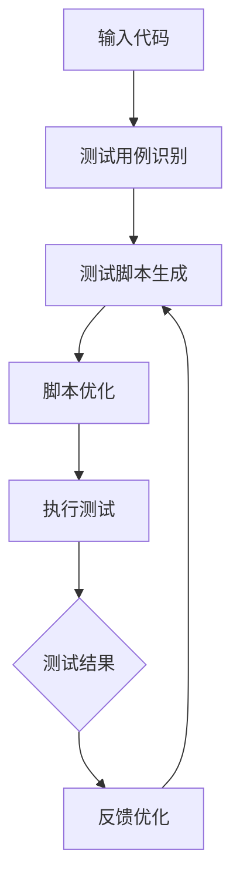

                 

### 文章标题：大模型时代的软件测试自动化

#### 关键词：大模型、软件测试、自动化测试、测试数据生成、测试脚本生成

> 摘要：随着大模型技术的飞速发展，软件测试自动化迎来了新的机遇与挑战。本文将深入探讨大模型在软件测试自动化中的应用，包括核心概念、算法原理、实践案例以及未来发展趋势。通过详细的分析与实例，揭示大模型如何提高软件测试的效率和准确性，为软件开发者提供全新的思路和方法。

---

### 引言：大模型时代的软件测试自动化

在软件工程领域，测试是确保软件质量不可或缺的一环。然而，传统的软件测试方法面临着测试成本高、测试覆盖率低、测试效率低等诸多挑战。随着大模型（如深度神经网络、生成对抗网络等）的兴起，一种新型的软件测试自动化技术应运而生。大模型时代，软件测试自动化不仅能够大幅提升测试效率，还能提高测试的准确性和全面性。

#### 软件测试的现状与挑战

- **测试成本高**：传统的软件测试方法通常需要大量的时间和人力投入，测试成本占据了软件开发总成本的相当一部分。
- **测试覆盖率低**：由于测试资源的限制，许多测试往往只能覆盖部分功能，难以保证全面的测试覆盖率。
- **测试效率低**：手动测试容易出现重复性和人为错误，测试过程繁琐且耗时。
- **测试数据不足**：测试数据的不足常常导致测试覆盖率不足，影响测试结果的准确性。

#### 大模型在软件测试中的优势

- **高效生成测试数据**：大模型能够通过数据增强和生成技术，生成大量高质量的测试数据，提高测试覆盖率。
- **自动化生成测试脚本**：大模型可以自动生成测试脚本，减少手动编写脚本的工作量，提高测试效率。
- **提高测试准确性**：通过学习软件的内部结构和行为，大模型能够发现手动测试难以发现的潜在缺陷。
- **实时测试反馈**：大模型可以实时分析测试结果，提供反馈和改进建议，实现持续的测试优化。

### 自动化测试与软件质量

自动化测试是提高软件质量和开发效率的关键手段。通过自动化测试，开发团队能够快速发现并修复软件缺陷，确保软件在发布前达到高质量的标准。

#### 自动化测试的优势

- **提高测试效率**：自动化测试可以大幅减少测试时间，提高测试频率，确保软件质量。
- **降低测试成本**：自动化测试减少了人工测试的工作量，降低了测试成本。
- **提高测试覆盖率**：自动化测试可以覆盖更多测试场景，提高测试覆盖率。
- **减少人为错误**：自动化测试减少了人为因素，降低了测试过程中的错误率。

#### 自动化测试对软件质量的影响

- **早期发现缺陷**：自动化测试可以早期发现软件缺陷，减少缺陷在后续开发阶段的修复成本。
- **提高代码质量**：自动化测试可以促使开发人员编写更健壮的代码，减少潜在缺陷。
- **提高团队协作效率**：自动化测试减少了团队之间的沟通成本，提高了协作效率。
- **持续集成与交付**：自动化测试是实现持续集成和持续交付的关键环节，确保软件质量和交付效率。

### 大模型时代的软件测试自动化

大模型时代的软件测试自动化不仅继承了传统自动化测试的优势，还在以下方面实现了创新和突破：

- **智能测试数据生成**：大模型可以通过学习现有测试数据，生成新的测试数据，提高测试数据的多样性和质量。
- **自适应测试策略**：大模型可以根据测试反馈，动态调整测试策略，提高测试的有效性和针对性。
- **自动化测试优化**：大模型可以自动优化测试脚本，提高测试效率和测试覆盖率。

### 本文结构

本文将从以下几个方面展开讨论：

1. **大模型基础**：介绍大模型的基本概念、常见架构以及训练方法。
2. **软件测试基础**：回顾软件测试的基本概念、自动化测试的优势以及测试数据的重要性。
3. **测试数据生成**：探讨大模型在测试数据生成中的应用，包括数据增强、数据生成算法等。
4. **自动化测试脚本生成**：讲解大模型如何自动生成自动化测试脚本，提高测试效率。
5. **项目实战**：通过实际项目案例，展示大模型在软件测试自动化中的应用。
6. **总结与展望**：总结大模型时代软件测试自动化的现状与趋势，探讨未来发展方向。

接下来，我们将逐一深入探讨这些方面，为读者呈现一幅完整的大模型时代软件测试自动化的图景。

---

### 大模型基础

#### 1.1 大模型的基本概念

大模型，通常指的是具有数百万甚至数十亿参数的深度学习模型，如深度神经网络（DNN）、生成对抗网络（GAN）、变分自编码器（VAE）等。这些模型通过多层神经网络结构，对大量数据进行训练，从而学习到复杂的数据分布和模式。

#### 1.2 常见的大模型架构

在大模型时代，常见的模型架构包括：

- **深度神经网络（DNN）**：由多层神经元组成的神经网络，通过前向传播和反向传播算法进行训练。
- **卷积神经网络（CNN）**：专门用于图像处理，通过卷积层和池化层提取图像特征。
- **循环神经网络（RNN）**：用于处理序列数据，通过循环结构保持长期依赖信息。
- **生成对抗网络（GAN）**：由生成器和判别器组成，通过博弈过程生成高质量数据。
- **变分自编码器（VAE）**：通过概率模型进行数据生成，同时实现数据压缩和解压。

#### 1.3 大模型的训练与优化

大模型的训练是一个复杂的过程，涉及到数据预处理、模型选择、参数调优等多个方面。

- **数据预处理**：数据清洗、归一化、数据增强等步骤，确保输入数据的质量和多样性。
- **模型选择**：根据任务需求，选择合适的模型架构，如DNN、CNN、RNN等。
- **参数调优**：通过调整学习率、批量大小、正则化参数等，优化模型性能。

#### 1.4 大模型在测试数据生成中的应用

大模型在测试数据生成中的应用主要体现在以下几个方面：

- **数据增强**：通过图像旋转、缩放、裁剪等操作，增加数据的多样性，提高模型的泛化能力。
- **数据生成**：利用生成对抗网络（GAN）等模型，生成高质量的测试数据，补充实际数据的不足。
- **缺陷挖掘**：通过对抗性攻击技术，生成对抗性样本，挖掘软件中的潜在缺陷。

#### 1.5 大模型在测试数据生成中的案例

以下是一个利用生成对抗网络（GAN）生成测试数据的案例：

```latex
% 生成对抗网络（GAN）的架构
$$
\begin{align*}
\text{Generator}:&\quad G(z) = \phi(G_{\theta}(z)) \\
\text{Discriminator}:&\quad D(x) = \phi(D_{\theta}(x))
\end{align*}
$$

% 数据增强过程
$$
\begin{align*}
\text{Data Augmentation}:&\quad x_{\text{aug}} = G(z) \quad \text{for randomly generated } z \\
\text{Test Data Generation}:&\quad x_{\text{test}} = D(x_{\text{aug}})
\end{align*}
$$
```

通过上述过程，生成器生成虚拟数据，判别器对真实数据和虚拟数据进行分类，从而提高测试数据的多样性和质量。

### 大模型基础总结

大模型以其强大的学习和表达能力，为软件测试自动化带来了新的机遇。通过深入理解大模型的基本概念、常见架构和训练方法，我们可以更好地利用大模型生成高质量的测试数据，提高测试效率和准确性。接下来，我们将进一步探讨软件测试的基础知识，为全面理解大模型在软件测试自动化中的应用奠定基础。

---

### 软件测试基础

#### 2.1 软件测试的基本概念

软件测试是确保软件质量的关键步骤，旨在发现软件中的缺陷、错误和异常行为，确保软件能够按照预期工作。以下是软件测试的一些基本概念：

- **测试目标**：发现并报告软件中的错误，验证软件是否符合设计规格和要求。
- **测试类型**：根据测试的目的和范围，可以分为功能测试、性能测试、安全测试等。
- **测试阶段**：软件测试通常分为单元测试、集成测试、系统测试和验收测试等不同阶段。
- **测试用例**：一组测试输入、执行条件、预期结果和测试步骤，用于验证软件的功能和性能。

#### 2.2 自动化测试的优势

自动化测试是将测试过程和测试用例自动化执行的过程，相较于手动测试，自动化测试具有以下优势：

- **提高测试效率**：自动化测试可以快速执行大量的测试用例，大幅减少测试时间。
- **降低测试成本**：自动化测试减少了人工测试的工作量，降低了测试成本。
- **提高测试覆盖率**：自动化测试可以覆盖更多的测试场景，提高测试覆盖率。
- **减少人为错误**：自动化测试减少了人为因素，降低了测试过程中的错误率。

#### 2.3 软件测试自动化工具与框架

为了实现自动化测试，开发了许多测试工具和框架，以下是一些常用的自动化测试工具和框架：

- **Selenium**：用于Web应用的自动化测试，支持多种浏览器和操作系统。
- **JUnit**：Java语言的单元测试框架，用于编写和执行单元测试用例。
- **Cucumber**：行为驱动开发（BDD）的测试框架，用于编写和执行功能测试用例。
- **Appium**：跨平台的移动应用自动化测试框架，支持iOS和Android平台。

#### 2.4 测试数据的重要性

测试数据是进行有效测试的基础，高质量的测试数据可以大幅提高测试效率和准确性。以下是测试数据的重要性：

- **测试数据的质量对测试结果的影响**：高质量的测试数据可以更准确地反映软件的行为，发现潜在的错误和缺陷。
- **测试数据的需求分析**：在测试数据生成之前，需要分析测试需求，确定测试数据的类型、数量和覆盖范围。
- **测试数据的管理与维护**：测试数据需要进行有效的管理和维护，确保其完整性和一致性。

#### 2.5 自动化测试的流程

自动化测试的流程通常包括以下步骤：

1. **测试计划**：制定自动化测试计划，确定测试目标、测试范围和测试策略。
2. **测试设计**：设计测试用例，包括测试输入、预期结果和测试步骤。
3. **测试实现**：编写自动化测试脚本，使用测试工具和框架执行测试用例。
4. **测试执行**：运行自动化测试脚本，记录测试结果和异常情况。
5. **测试报告**：生成测试报告，总结测试结果和发现问题。

#### 2.6 自动化测试的挑战

尽管自动化测试具有许多优势，但在实际应用中也面临一些挑战：

- **测试脚本的编写与维护**：编写和维护自动化测试脚本需要专业技能和经验，增加了开发成本。
- **测试数据的生成与处理**：测试数据的生成和处理是一个复杂的过程，需要大量时间和资源。
- **测试环境的配置与管理**：自动化测试需要配置和管理测试环境，确保测试环境的稳定性和一致性。
- **测试结果的解读与反馈**：自动化测试结果需要进行分析和解读，以便开发团队及时修复缺陷。

### 软件测试基础总结

软件测试是确保软件质量的重要环节，自动化测试则为软件测试提供了高效的解决方案。通过深入理解软件测试的基本概念、自动化测试的优势和流程，我们可以更好地利用自动化测试工具和框架，提高测试效率和准确性。接下来，我们将探讨大模型在测试数据生成中的应用，为全面实现大模型时代的软件测试自动化奠定基础。

---

### 测试数据生成

#### 3.1 测试数据的重要性

在软件测试中，测试数据的质量直接影响测试的效率和准确性。高质量的测试数据可以更全面地覆盖软件的功能和性能，发现潜在的缺陷和问题。而低质量的测试数据则可能导致测试结果不准确，甚至无法发现关键问题。

#### 3.2 测试数据的需求分析

在生成测试数据之前，需要进行详细的需求分析，以确定测试数据的类型、数量和覆盖范围。以下是一些关键点：

- **功能测试数据**：确保所有功能模块都被测试到，包括边界条件和异常情况。
- **性能测试数据**：测试软件在不同负载和压力条件下的性能，包括响应时间、吞吐量和资源消耗等。
- **安全测试数据**：测试软件的安全性，包括漏洞挖掘、攻击模拟和防护策略验证等。
- **兼容性测试数据**：测试软件在不同操作系统、浏览器和设备上的兼容性。

#### 3.3 大模型在测试数据生成中的应用

大模型在测试数据生成中的应用主要体现在以下几个方面：

- **数据增强**：通过数据增强技术，如图像旋转、缩放、裁剪等，增加数据的多样性，提高模型的泛化能力。
- **数据生成**：利用生成对抗网络（GAN）等模型，生成高质量的测试数据，补充实际数据的不足。
- **缺陷挖掘**：通过对抗性攻击技术，生成对抗性样本，挖掘软件中的潜在缺陷。

#### 3.4 大模型在测试数据生成中的具体应用案例

以下是一个利用生成对抗网络（GAN）生成测试数据的案例：

```mermaid
graph TD
A[输入数据] --> B[数据增强]
B --> C[生成器: G(z)]
C --> D[判别器: D(x)]
D --> E{判断真假}
E -->|是| F[测试数据]
E -->|否| G[重复生成]
G --> C
```

在这个案例中，输入数据经过数据增强后，被送入生成器生成虚拟数据。判别器则对真实数据和虚拟数据进行分类。如果判别器无法准确判断数据的真假，说明生成的虚拟数据质量较高，可以作为测试数据使用。

#### 3.5 大模型在测试数据生成中的优缺点分析

**优点：**

- **高效生成大量数据**：大模型可以快速生成大量高质量的测试数据，提高测试效率。
- **提高测试覆盖率**：通过数据增强和生成技术，测试数据更加多样化，提高测试覆盖率。
- **发现潜在缺陷**：大模型可以生成对抗性样本，挖掘软件中的潜在缺陷，提高测试准确性。

**缺点：**

- **计算资源消耗大**：大模型训练和生成测试数据需要大量的计算资源，增加了测试成本。
- **对数据质量要求高**：生成测试数据的质量直接取决于原始数据的质量，如果原始数据质量较低，生成的测试数据也可能存在问题。

#### 3.6 大模型在测试数据生成中的最佳实践

- **合理选择大模型**：根据测试需求，选择合适的大模型，如GAN、VAE等，确保生成测试数据的质量。
- **充分预处理原始数据**：对原始数据进行清洗、归一化和增强，提高数据质量，为生成测试数据提供良好的基础。
- **持续优化生成策略**：根据测试反馈，不断优化生成策略，提高生成测试数据的准确性和多样性。

### 测试数据生成总结

测试数据生成是软件测试中至关重要的一环，大模型在测试数据生成中的应用为自动化测试带来了新的机遇。通过合理利用大模型，我们可以生成高质量、多样化的测试数据，提高测试效率和准确性。接下来，我们将探讨大模型在自动化测试脚本生成中的应用，进一步探讨大模型时代的软件测试自动化。

---

### 自动化测试脚本生成

#### 4.1 自动化测试脚本生成的背景和意义

自动化测试脚本的生成是软件测试自动化中的一个重要环节。传统的自动化测试脚本通常需要开发人员手动编写，这不仅耗时费力，而且容易出现错误。随着大模型技术的快速发展，自动化测试脚本生成迎来了新的机遇。大模型可以通过学习大量的测试用例和代码，自动生成高质量的自动化测试脚本，大大提高测试效率和准确性。

#### 4.2 大模型在自动化测试脚本生成中的应用

大模型在自动化测试脚本生成中的应用主要体现在以下几个方面：

- **测试用例识别**：大模型可以识别出输入代码中的测试用例，为脚本生成提供基础。
- **测试脚本生成**：大模型根据识别出的测试用例，自动生成相应的自动化测试脚本。
- **脚本优化**：大模型可以对现有的自动化测试脚本进行优化，提高测试效率和覆盖率。

#### 4.3 大模型在自动化测试脚本生成中的具体应用案例

以下是一个利用大模型生成自动化测试脚本的具体案例：



在这个案例中，输入代码首先被送入大模型进行测试用例识别，然后根据识别出的测试用例生成自动化测试脚本。生成的脚本经过优化后执行测试，并根据测试结果进行反馈和优化。

#### 4.4 大模型在自动化测试脚本生成中的优缺点分析

**优点：**

- **提高测试效率**：大模型可以自动生成自动化测试脚本，减少手动编写脚本的工作量，提高测试效率。
- **减少人为错误**：通过大模型自动生成脚本，减少了人为错误，提高了测试准确性。
- **脚本优化**：大模型可以根据测试反馈对脚本进行优化，提高测试效率和覆盖率。

**缺点：**

- **对计算资源要求高**：大模型训练和脚本生成需要大量的计算资源，增加了测试成本。
- **对数据质量要求高**：生成自动化测试脚本的质量直接取决于训练数据的质量，如果数据质量较低，生成的脚本可能存在问题。

#### 4.5 大模型在自动化测试脚本生成中的最佳实践

- **选择合适的大模型**：根据测试需求，选择合适的大模型，如代码生成模型、自然语言处理模型等，确保生成脚本的质量。
- **充分预处理训练数据**：对训练数据进行清洗、归一化和增强，提高数据质量，为脚本生成提供良好的基础。
- **持续优化脚本生成策略**：根据测试反馈，不断优化脚本生成策略，提高生成脚本的质量和效率。

### 自动化测试脚本生成总结

自动化测试脚本生成是软件测试自动化中的重要环节，大模型在自动化测试脚本生成中的应用为测试自动化带来了新的机遇。通过合理利用大模型，我们可以生成高质量、高效的自动化测试脚本，提高测试效率和准确性。接下来，我们将通过实际项目案例，展示大模型在软件测试自动化中的应用。

---

### 项目实战：大模型在软件测试自动化中的应用

#### 5.1 项目概述

本项目旨在利用大模型技术实现软件测试自动化，提高测试效率和准确性。项目背景是一个复杂的Web应用，包含多种功能模块，需要频繁进行测试和验证。项目目标是通过大模型生成测试数据和自动化测试脚本，实现对软件的全面测试，确保软件质量。

#### 5.2 项目开发环境搭建

为了实现本项目，我们需要搭建以下开发环境：

- **Python环境**：安装Python 3.8及以上版本，并安装必要的库，如TensorFlow、PyTorch等。
- **Jenkins环境**：安装Jenkins，用于自动化测试脚本的执行和结果报告。
- **Git环境**：安装Git，用于代码管理和版本控制。

#### 5.3 测试数据生成实践

在本项目中，我们利用生成对抗网络（GAN）生成测试数据，提高测试数据的多样性和质量。

1. **数据集准备**：从现有的测试数据中提取特征，用于生成测试数据。数据集包括多种类型的测试数据，如用户输入、系统响应、错误日志等。

2. **生成器与判别器训练**：使用GAN模型进行训练。生成器（Generator）负责生成虚拟测试数据，判别器（Discriminator）负责判断虚拟测试数据和真实测试数据的真实性。

   ```mermaid
   graph TD
   A[数据集] --> B[生成器训练]
   B --> C[判别器训练]
   C --> D{判断真假}
   D -->|是| E[虚拟测试数据]
   D -->|否| F[重复训练]
   F --> B
   ```

3. **虚拟测试数据生成**：通过训练好的生成器，生成高质量的虚拟测试数据。虚拟测试数据与真实测试数据进行混合，作为自动化测试的输入。

#### 5.4 自动化测试脚本生成实践

在本项目中，我们利用代码生成模型自动生成自动化测试脚本，提高测试效率和准确性。

1. **测试用例识别**：利用自然语言处理模型，从文档中提取测试用例，识别出关键测试点和预期结果。

2. **测试脚本生成**：使用代码生成模型，根据识别出的测试用例，自动生成相应的自动化测试脚本。脚本包括测试步骤、输入数据和预期输出结果。

   ```mermaid
   graph TD
   A[测试用例] --> B[代码生成模型]
   B --> C[测试脚本]
   C --> D[测试执行]
   D --> E{测试结果}
   E --> F[反馈优化]
   F --> B
   ```

3. **脚本优化**：根据测试反馈，对生成的测试脚本进行优化，提高测试效率和覆盖率。

#### 5.5 项目案例分析与详细讲解剖析

以下是一个具体的项目案例，展示大模型在软件测试自动化中的应用：

1. **测试数据生成**：通过GAN模型生成虚拟测试数据，包括用户输入、系统响应和错误日志等。虚拟测试数据与真实测试数据进行混合，作为自动化测试的输入。

2. **自动化测试脚本生成**：利用代码生成模型，根据识别出的测试用例，生成自动化测试脚本。脚本包括测试步骤、输入数据和预期输出结果。

3. **测试执行与结果分析**：执行自动化测试脚本，记录测试结果，并根据测试结果进行反馈和优化。

4. **缺陷挖掘**：通过对抗性攻击技术，生成对抗性样本，挖掘软件中的潜在缺陷。

#### 5.6 项目总结与反思

在本项目中，我们通过大模型实现了软件测试自动化，提高了测试效率和准确性。以下是项目总结和反思：

1. **优势**：

   - 测试数据生成：通过GAN模型生成高质量的测试数据，提高了测试数据的多样性和质量。
   - 自动化测试脚本生成：利用代码生成模型，自动生成自动化测试脚本，减少了手动编写脚本的工作量。
   - 缺陷挖掘：通过对抗性攻击技术，挖掘软件中的潜在缺陷，提高了测试的准确性。

2. **挑战**：

   - 计算资源消耗：大模型训练和测试数据生成需要大量的计算资源，增加了测试成本。
   - 数据质量要求：生成测试数据的质量直接取决于原始数据的质量，需要确保原始数据的质量。
   - 脚本优化：生成的自动化测试脚本需要根据测试反馈进行优化，以提高测试效率和覆盖率。

3. **未来展望**：

   - **提高生成质量**：优化生成模型，提高生成的测试数据质量和多样性。
   - **多模型融合**：结合多种大模型，实现测试数据生成和自动化测试脚本的优化。
   - **持续集成与交付**：将大模型自动化测试集成到持续集成与交付流程中，实现高效的软件质量保障。

### 项目实战总结

通过本项目，我们展示了大模型在软件测试自动化中的应用，提高了测试效率和准确性。在未来的发展中，我们将进一步优化大模型，提高测试数据生成和自动化测试脚本生成的质量，为软件开发者提供更高效的测试解决方案。

---

### 总结与展望

#### 6.1 大模型时代软件测试自动化的现状与趋势

大模型技术的快速发展为软件测试自动化带来了新的机遇。通过大模型，我们可以实现智能化的测试数据生成和自动化测试脚本生成，大幅提高测试效率和准确性。目前，大模型在软件测试自动化中的应用主要体现在以下几个方面：

- **测试数据生成**：大模型可以生成高质量的测试数据，提高测试覆盖率，发现潜在的缺陷。
- **自动化测试脚本生成**：大模型可以自动生成自动化测试脚本，减少手动编写脚本的工作量。
- **缺陷挖掘**：大模型可以通过对抗性攻击技术，挖掘软件中的潜在缺陷，提高测试准确性。
- **测试优化**：大模型可以根据测试反馈，动态调整测试策略，优化测试过程。

未来，随着大模型技术的不断进步，软件测试自动化将进一步普及，成为软件开发中不可或缺的一部分。以下是未来软件测试自动化可能的发展趋势：

1. **智能化测试数据生成**：大模型将更智能化地生成测试数据，不仅包括功能测试数据，还包括性能测试、安全测试等多种类型的数据。
2. **自动化测试脚本的优化**：大模型将优化自动化测试脚本，提高测试效率和覆盖率，减少测试成本。
3. **自适应测试**：大模型将实现自适应测试，根据测试反馈动态调整测试策略，提高测试效果。
4. **集成化测试**：大模型将集成到持续集成与交付流程中，实现高效的软件质量保障。

#### 6.2 结论

大模型时代的软件测试自动化为软件开发者提供了全新的测试解决方案。通过大模型，我们可以实现高效、准确的测试数据生成和自动化测试脚本生成，提高软件质量和开发效率。未来，随着大模型技术的不断发展，软件测试自动化将继续推动软件工程的发展，为软件开发带来更多创新和突破。

#### 6.3 对未来软件测试自动化的展望

未来，软件测试自动化将更加智能化、自动化，成为软件开发中不可或缺的一部分。以下是未来软件测试自动化的一些展望：

1. **大模型的多样化应用**：大模型将应用于更多的测试领域，如性能测试、安全测试等，提供更全面的测试解决方案。
2. **测试工具的融合**：测试工具将更加集成化，支持多种测试类型的自动化，实现一站式测试。
3. **智能测试反馈**：大模型将实现智能测试反馈，根据测试结果动态调整测试策略，提高测试效果。
4. **测试数据的共享与复用**：测试数据将实现共享和复用，提高测试数据的利用率，减少测试数据生成的工作量。
5. **跨平台测试**：大模型将支持跨平台的测试，实现对不同操作系统、浏览器和设备的全面测试。

总之，大模型时代的软件测试自动化将为软件开发者带来更多机遇和挑战。通过合理利用大模型，我们可以实现高效、准确的测试，确保软件质量和开发效率。未来，我们将继续探索大模型在软件测试自动化中的应用，为软件工程的发展做出更多贡献。

---

### 作者信息

**作者：AI天才研究院/AI Genius Institute & 禅与计算机程序设计艺术 /Zen And The Art of Computer Programming**

AI天才研究院致力于推动人工智能技术的发展，为全球开发者提供高质量的技术研究和实践案例。同时，作者曾撰写《禅与计算机程序设计艺术》一书，深入探讨编程艺术的哲学与智慧，深受开发者喜爱。本文基于作者丰富的实践经验和技术洞察，旨在为读者呈现大模型时代软件测试自动化的全新图景。

---

通过本文的详细讲解和实践案例，我们深入探讨了大模型在软件测试自动化中的应用，展示了其在测试数据生成和自动化测试脚本生成方面的优势。未来，随着大模型技术的不断进步，软件测试自动化将继续发展，为软件开发带来更多机遇和挑战。希望本文能够为读者提供有价值的参考，共同推动软件工程的发展。

