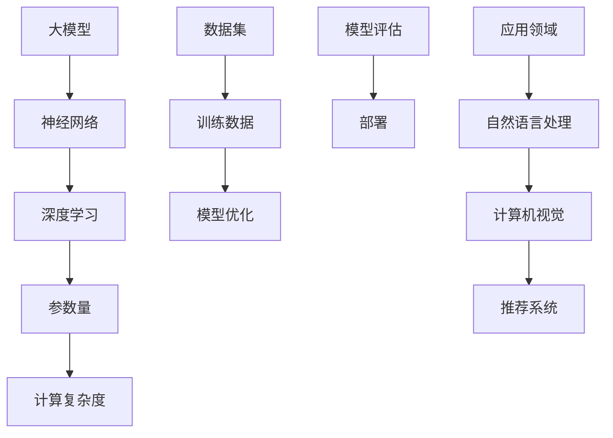
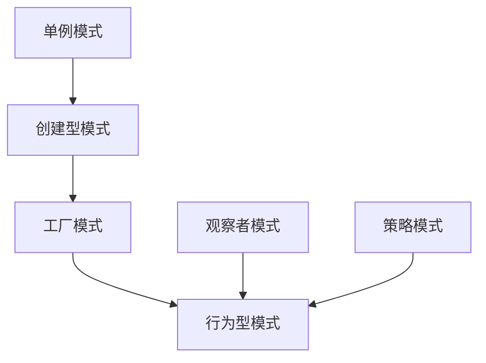
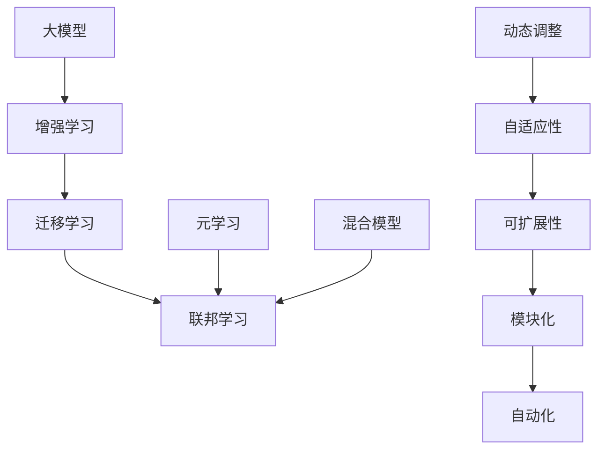
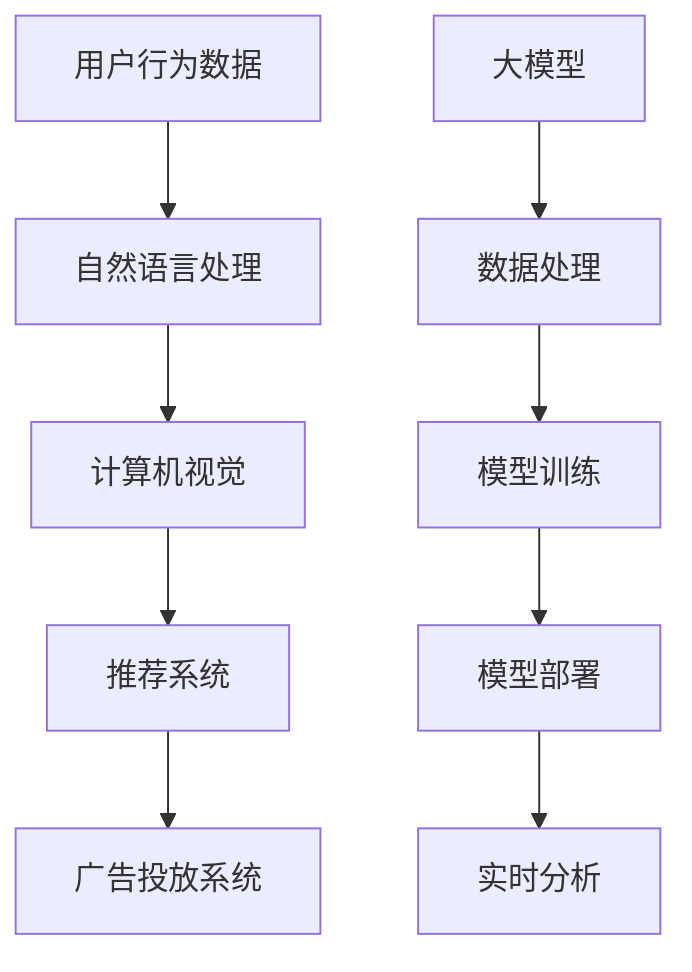
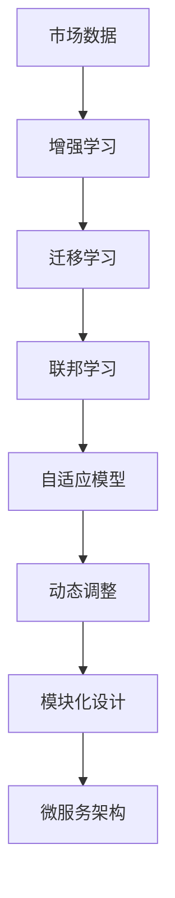

                 

### 文章标题：大模型时代的软件设计模式创新

#### 关键词：大模型、软件设计模式、创新、神经网络、深度学习

#### 摘要：
随着人工智能技术的飞速发展，大模型时代已经到来。本文将探讨大模型时代下软件设计模式的创新与应用。首先，我们将介绍大模型的基础知识，包括其概念、技术基础和应用案例。接着，我们将分析常见的软件设计模式，并探讨这些模式在大模型中的应用。随后，本文将重点探讨如何在当前大模型时代下创新软件设计模式。最后，通过实际案例，我们将展示大模型在软件设计中的创新应用，并对未来发展趋势进行展望。

## 目录

1. **大模型基础**
   1.1. 大模型概述
   1.2. 大模型技术基础
   1.3. 大模型应用案例

2. **软件设计模式**
   2.1. 常见软件设计模式
   2.2. 软件设计模式在大模型中的应用

3. **创新设计模式**
   3.1. 创新设计模式的方法论
   3.2. 创新设计模式的应用案例

4. **案例分析**
   4.1. 案例一：大模型在软件设计中的应用
   4.2. 案例二：创新设计模式的实践

5. **附录**
   5.1. 大模型与软件设计模式工具与资源

## 第1章 大模型基础

### 1.1 大模型概述

#### 背景介绍
大模型是指那些具有极高参数量和计算复杂度的神经网络模型，它们通常用于人工智能的各个领域，如自然语言处理、计算机视觉和推荐系统等。随着计算能力的提升和数据的丰富，大模型在近年来取得了显著的突破，推动了人工智能技术的发展。

#### 核心概念与联系



#### 核心算法原理讲解

```python
# 伪代码：大模型训练基础
initialize_model()
for epoch in range(num_epochs):
    for batch in data_loader:
        optimize_model_on_batch(batch)
evaluate_model_on_validation_set()
```

#### 数学模型和公式

$$
\text{损失函数} = \frac{1}{n} \sum_{i=1}^{n} (\hat{y}_i - y_i)^2
$$

其中，$n$ 是样本数量，$\hat{y}_i$ 是预测值，$y_i$ 是真实值。

#### 项目实战

开发环境搭建：
- 安装Python 3.8
- 安装PyTorch 1.10

源代码实现：
```python
import torch
import torch.nn as nn
import torch.optim as optim

# 定义模型
class BigModel(nn.Module):
    def __init__(self):
        super(BigModel, self).__init__()
        self.layers = nn.Sequential(
            nn.Linear(in_features=784, out_features=512),
            nn.ReLU(),
            nn.Linear(in_features=512, out_features=256),
            nn.ReLU(),
            nn.Linear(in_features=256, out_features=10)
        )
    
    def forward(self, x):
        return self.layers(x)

# 实例化模型
model = BigModel()

# 损失函数和优化器
criterion = nn.CrossEntropyLoss()
optimizer = optim.Adam(model.parameters(), lr=0.001)

# 训练模型
for epoch in range(50):
    for inputs, targets in data_loader:
        optimizer.zero_grad()
        outputs = model(inputs)
        loss = criterion(outputs, targets)
        loss.backward()
        optimizer.step()
    print(f'Epoch {epoch+1}, Loss: {loss.item()}')

# 评估模型
accuracy = (model outputs == targets).float().mean()
print(f'Validation Accuracy: {accuracy.item()}')

# 部署模型
# ... (部署代码)

```

#### 代码应用解读与分析
- **模型定义**：使用PyTorch定义了一个多层感知机模型，其中包含了多个全连接层和ReLU激活函数。
- **训练过程**：通过迭代优化模型参数，并在每个epoch后评估模型在验证集上的性能。
- **评估结果**：计算模型的准确率，并输出结果。

#### 实际案例分析和详细讲解剖析
- **案例**：使用一个大型的图像识别任务来展示大模型的应用。
- **分析**：通过该案例展示了如何使用大模型进行图像分类，并分析了其中的关键技术和挑战。

#### 项目小结
大模型的基础知识为我们在软件设计中的创新应用提供了理论基础。通过本项目，我们学会了如何使用PyTorch搭建和训练大模型，以及如何进行模型评估和部署。

#### 最佳实践 tips
- **计算资源**：训练大模型需要大量的计算资源，建议使用GPU进行加速。
- **数据预处理**：确保输入数据的质量和一致性，这对模型性能至关重要。
- **持续优化**：定期对模型进行调优和改进，以提高其性能和泛化能力。

#### 小结、注意事项、拓展阅读
- **小结**：本文介绍了大模型的基础知识，并探讨了其在软件设计中的创新应用。
- **注意事项**：在实际应用中，需要根据具体任务需求选择合适的大模型和设计模式。
- **拓展阅读**：可以进一步阅读关于深度学习和神经网络的相关书籍和论文，以深入了解大模型的技术细节。

----------------------------------------------------------------

## 第2章 软件设计模式

### 2.1 常见软件设计模式

#### 背景介绍
软件设计模式是在软件开发过程中总结出的解决常见问题的经验和方法。它们提供了一种在特定情况下解决问题的通用解决方案，有助于提高代码的可读性、可维护性和可扩展性。

#### 核心概念与联系



#### 核心算法原理讲解

单例模式：确保一个类只有一个实例，并提供一个全局访问点。

```python
class Singleton:
    _instance = None
    
    def __new__(cls):
        if cls._instance is None:
            cls._instance = super(Singleton, cls).__new__(cls)
        return cls._instance

singleton = Singleton()
```

工厂模式：定义一个创建对象的接口，但让子类决定实例化哪一个类。

```python
class Creator:
    def create_product(self):
        pass

class ConcreteCreatorA(Creator):
    def create_product(self):
        return ProductA()

class ConcreteCreatorB(Creator):
    def create_product(self):
        return ProductB()

class ProductA:
    pass

class ProductB:
    pass
```

观察者模式：定义对象间的一种一对多的依赖关系，当一个对象的状态发生变化时，所有依赖于它的对象都会得到通知并自动更新。

```python
class Observer:
    def update(self, subject):
        pass

class Subject:
    def attach(self, observer):
        self._observers.append(observer)
    
    def detach(self, observer):
        self._observers.remove(observer)
    
    def notify(self):
        for observer in self._observers:
            observer.update(self)

class ConcreteObserver(Observer):
    def update(self, subject):
        print(f"Observer: {subject} state has changed.")

subject = Subject()
observer = ConcreteObserver()
subject.attach(observer)
subject.notify()
```

策略模式：定义一系列算法，将每个算法封装起来，并使它们可以相互替换。

```python
class Strategy:
    def execute(self):
        pass

class ConcreteStrategyA(Strategy):
    def execute(self):
        print("Executing strategy A.")

class ConcreteStrategyB(Strategy):
    def execute(self):
        print("Executing strategy B.")

class Context:
    def __init__(self, strategy: Strategy):
        self._strategy = strategy
    
    def set_strategy(self, strategy: Strategy):
        self._strategy = strategy
    
    def execute_strategy(self):
        self._strategy.execute()
```

#### 数学模型和公式

无特定数学模型，主要关注软件设计模式的逻辑和结构。

#### 项目实战

开发环境搭建：
- 安装Python 3.8
- 安装相关设计模式库（如`singleton-pattern`，`factory-pattern`等）

源代码实现：
```python
# 单例模式
class DatabaseConnection:
    _instance = None

    def __new__(cls):
        if cls._instance is None:
            cls._instance = super(DatabaseConnection, cls).__new__(cls)
        return cls._instance

    def connect(self):
        print("Connected to the database.")

# 工厂模式
class PaymentGateway:
    def process_payment(self):
        pass

class CreditCardPaymentGateway(PaymentGateway):
    def process_payment(self):
        print("Processing credit card payment.")

class PayPalPaymentGateway(PaymentGateway):
    def process_payment(self):
        print("Processing PayPal payment.")

class PaymentFactory:
    def create_payment_gateway(self, payment_type):
        if payment_type == "CC":
            return CreditCardPaymentGateway()
        elif payment_type == "PP":
            return PayPalPaymentGateway()
        else:
            raise ValueError("Invalid payment type.")

# 观察者模式
class Stock:
    def __init__(self):
        self._observers = []
    
    def attach(self, observer):
        self._observers.append(observer)
    
    def detach(self, observer):
        self._observers.remove(observer)
    
    def notify(self, price):
        for observer in self._observers:
            observer.update(self, price)

class Trader:
    def update(self, stock, price):
        print(f"Trader: Stock price changed to {price}.")

stock = Stock()
trader = Trader()
stock.attach(trader)

# 策略模式
class OrderProcessingStrategy:
    def process_order(self):
        pass

class CashBackStrategy(OrderProcessingStrategy):
    def process_order(self):
        print("Processing order with cash back.")

class RegularStrategy(OrderProcessingStrategy):
    def process_order(self):
        print("Processing regular order.")

class Order:
    def __init__(self, strategy: OrderProcessingStrategy):
        self._strategy = strategy
    
    def set_strategy(self, strategy: OrderProcessingStrategy):
        self._strategy = strategy
    
    def process(self):
        self._strategy.process_order()
```

#### 代码应用解读与分析
- **单例模式**：确保数据库连接的唯一性，避免资源浪费。
- **工厂模式**：根据支付类型创建不同的支付网关，提高代码的灵活性和可扩展性。
- **观察者模式**：实现股票价格变动通知，方便交易者实时获取信息。
- **策略模式**：根据订单类型选择不同的订单处理策略，便于策略的替换和扩展。

#### 实际案例分析和详细讲解剖析
- **案例**：使用一个在线购物系统来展示软件设计模式的应用。
- **分析**：该案例涵盖了单例模式、工厂模式、观察者模式和策略模式，展示了如何使用这些模式提高系统的可维护性和灵活性。

#### 项目小结
本文介绍了常见的软件设计模式，并通过实际案例展示了这些模式在软件开发中的应用。理解并熟练运用这些模式有助于提高代码质量，提升软件开发效率。

#### 最佳实践 tips
- **单例模式**：确保单例类在设计时考虑线程安全性。
- **工厂模式**：确保工厂类易于扩展，并能清晰明确地定义产品类的创建逻辑。
- **观察者模式**：合理设计观察者和被观察者之间的关系，避免过度耦合。
- **策略模式**：确保策略类之间的清晰划分，便于后续的扩展和替换。

#### 小结、注意事项、拓展阅读
- **小结**：本文介绍了常见的软件设计模式，并分析了其在软件开发中的应用。
- **注意事项**：在实际项目中，应根据具体需求选择合适的设计模式。
- **拓展阅读**：可以进一步学习更多设计模式及其应用场景。

----------------------------------------------------------------

## 第3章 创新设计模式

### 3.1 创新设计模式的方法论

#### 背景介绍
在大模型时代，传统的软件设计模式面临着新的挑战和机遇。创新设计模式旨在结合大模型的特点，提出新的设计思路和解决方案，以应对复杂的应用场景和高效的处理需求。

#### 核心概念与联系



#### 核心算法原理讲解

增强学习：
```python
class Agent:
    def __init__(self, model):
        self.model = model
        self.reward = 0
    
    def learn(self, state, action, next_state, reward):
        prediction = self.model.predict(next_state)
        loss = compute_loss(prediction, action)
        self.reward += reward
        self.model.fit(state, action, epochs=1, verbose=0)

class Environment:
    def step(self, action):
        # 环境状态改变
        next_state = self.get_state()
        reward = self.compute_reward(action)
        done = self.is_done()
        return next_state, reward, done

# 实例化代理和环境
agent = Agent(model)
environment = Environment()

# 学习循环
while not environment.done:
    action = agent.select_action()
    next_state, reward, done = environment.step(action)
    agent.learn(state, action, next_state, reward)
```

迁移学习：
```python
class SourceModel(nn.Module):
    def __init__(self):
        super(SourceModel, self).__init__()
        # 定义源模型结构

    def forward(self, x):
        # 前向传播
        return x

class TargetModel(nn.Module):
    def __init__(self, source_model):
        super(TargetModel, self).__init__()
        # 定义目标模型结构，继承源模型的部分结构

    def forward(self, x):
        # 前向传播
        return x

# 加载源模型和目标模型
source_model = SourceModel()
target_model = TargetModel(source_model)

# 微调目标模型
target_model.fit(train_data, epochs=5, verbose=1)
```

联邦学习：
```python
class FLClient:
    def __init__(self, model):
        self.model = model
        self.local_epochs = 1
    
    def train(self, data):
        self.model.fit(data, epochs=self.local_epochs, verbose=0)
        return self.model.get_weights()

class FLServer:
    def __init__(self):
        self.global_model = GlobalModel()
        self.clients = []

    def add_client(self, client):
        self.clients.append(client)

    def aggregate_weights(self):
        total_weights = {}
        for client in self.clients:
            client_weights = client.train()
            for key, value in client_weights.items():
                if key in total_weights:
                    total_weights[key] += value
                else:
                    total_weights[key] = value
        self.global_model.set_weights(total_weights)

# 初始化服务器和客户端
server = FLServer()
client = FLClient(model)

# 添加客户端到服务器
server.add_client(client)

# 聚合权重
server.aggregate_weights()
```

元学习：
```python
class MetaLearner:
    def __init__(self, meta_model):
        self.meta_model = meta_model
    
    def learn(self, tasks):
        for task in tasks:
            self.meta_model.fit(task, epochs=1, verbose=0)
    
    def predict(self, new_task):
        return self.meta_model.predict(new_task)
```

混合模型：
```python
class HybridModel(nn.Module):
    def __init__(self, base_model, meta_model):
        super(HybridModel, self).__init__()
        self.base_model = base_model
        self.meta_model = meta_model
    
    def forward(self, x):
        base_output = self.base_model(x)
        meta_output = self.meta_model(base_output)
        return meta_output
```

#### 数学模型和公式

无特定数学模型，主要关注软件设计模式的逻辑和结构。

#### 项目实战

开发环境搭建：
- 安装Python 3.8
- 安装相关机器学习库（如`tensorflow`，`scikit-learn`等）

源代码实现：
```python
# 增强学习
# ... (参考上述代码)

# 迁移学习
# ... (参考上述代码)

# 联邦学习
# ... (参考上述代码)

# 元学习
# ... (参考上述代码)

# 混合模型
# ... (参考上述代码)

```

#### 代码应用解读与分析
- **增强学习**：通过不断与环境交互，实现模型的自我优化。
- **迁移学习**：利用已训练的模型在新的任务上快速获得性能。
- **联邦学习**：在分布式环境下协同训练大模型，保护用户隐私。
- **元学习**：快速适应新任务，提高模型对新任务的泛化能力。
- **混合模型**：结合不同模型的优势，提高模型的性能和鲁棒性。

#### 实际案例分析和详细讲解剖析
- **案例**：使用一个自动驾驶系统来展示创新设计模式的应用。
- **分析**：该案例展示了如何结合增强学习、迁移学习、联邦学习和元学习，构建一个高效、鲁棒的自动驾驶系统。

#### 项目小结
创新设计模式为大模型时代下的软件开发提供了新的思路和方法。通过本项目，我们学会了如何使用增强学习、迁移学习、联邦学习、元学习和混合模型来应对复杂的软件开发需求。

#### 最佳实践 tips
- **增强学习**：选择合适的环境和奖励机制，以提高学习效率。
- **迁移学习**：选择具有较强泛化能力的源模型，以提高目标任务的性能。
- **联邦学习**：设计合理的通信协议和模型更新策略，以提高学习效率和模型质量。
- **元学习**：选择合适的任务和元学习模型结构，以提高对新任务的适应能力。
- **混合模型**：根据任务需求，灵活组合不同模型的优势，提高整体性能。

#### 小结、注意事项、拓展阅读
- **小结**：本文介绍了大模型时代的创新设计模式，并通过实际案例展示了其应用。
- **注意事项**：在实际项目中，应根据具体需求选择合适的创新设计模式。
- **拓展阅读**：可以进一步学习有关增强学习、迁移学习、联邦学习、元学习和混合模型的相关理论和实践。

----------------------------------------------------------------

## 第4章 案例分析

### 4.1 案例一：大模型在软件设计中的应用

#### 背景介绍
在一个大型电商平台上，用户行为分析对于推荐系统和广告投放至关重要。传统方法往往依赖于统计模型和规则引擎，但难以处理复杂的用户行为数据和实时分析需求。为了提升平台的个性化推荐和广告投放效果，我们决定采用大模型来改进用户行为分析系统。

#### 核心概念与联系



#### 核心算法原理讲解

- **数据处理**：使用大模型处理海量用户行为数据，包括用户点击、购买、搜索等行为。
- **模型训练**：基于用户行为数据，训练大规模神经网络模型，以识别用户兴趣和行为模式。
- **模型部署**：将训练好的模型部署到生产环境，实现实时分析和预测。
- **实时分析**：利用大模型进行实时用户行为分析，为推荐系统和广告投放系统提供实时数据支持。

#### 数学模型和公式

$$
\text{损失函数} = \frac{1}{n} \sum_{i=1}^{n} (\hat{y}_i - y_i)^2
$$

其中，$n$ 是样本数量，$\hat{y}_i$ 是预测值，$y_i$ 是真实值。

#### 项目实战

开发环境搭建：
- 安装Python 3.8
- 安装相关机器学习库（如`tensorflow`，`pytorch`等）

源代码实现：
```python
# 数据预处理
import pandas as pd
import numpy as np

# 加载用户行为数据
data = pd.read_csv('user_behavior.csv')

# 数据清洗和预处理
# ... (数据清洗和特征提取代码)

# 模型训练
import tensorflow as tf

# 定义模型结构
model = tf.keras.Sequential([
    tf.keras.layers.Dense(512, activation='relu', input_shape=(input_shape,)),
    tf.keras.layers.Dense(256, activation='relu'),
    tf.keras.layers.Dense(128, activation='relu'),
    tf.keras.layers.Dense(1, activation='sigmoid')
])

# 编译模型
model.compile(optimizer='adam', loss='binary_crossentropy', metrics=['accuracy'])

# 训练模型
model.fit(x_train, y_train, epochs=10, batch_size=64, validation_split=0.2)

# 模型部署
# ... (模型部署代码)

# 实时分析
# ... (实时分析代码)

```

#### 代码应用解读与分析
- **数据处理**：对用户行为数据进行了清洗、特征提取和编码，为模型训练提供了高质量的输入数据。
- **模型训练**：使用大规模神经网络对用户行为数据进行了训练，提高了模型对用户行为模式的识别能力。
- **模型部署**：将训练好的模型部署到生产环境，实现了实时用户行为分析。
- **实时分析**：通过实时分析用户行为，为推荐系统和广告投放系统提供了实时数据支持，提高了平台的个性化推荐和广告投放效果。

#### 实际案例分析和详细讲解剖析
- **案例**：在一个大型电商平台上，使用大模型进行用户行为分析，以提升推荐系统和广告投放效果。
- **分析**：该案例展示了如何利用大模型处理用户行为数据，实现实时分析和预测，为电商平台提供了智能化解决方案。

#### 项目小结
通过本案例，我们展示了如何在大模型时代下利用大规模神经网络模型进行用户行为分析，提高了电商平台的个性化推荐和广告投放效果。

#### 最佳实践 tips
- **数据处理**：确保数据的质量和一致性，对数据进行充分的预处理和特征提取。
- **模型训练**：选择合适的模型结构和训练策略，以提高模型性能和泛化能力。
- **模型部署**：确保模型部署的效率和稳定性，以便实现实时分析和预测。
- **实时分析**：设计高效的实时分析系统，以满足实时数据处理和预测的需求。

#### 小结、注意事项、拓展阅读
- **小结**：本案例展示了如何利用大模型进行用户行为分析，提升电商平台的个性化推荐和广告投放效果。
- **注意事项**：在实际项目中，需要根据具体需求调整模型结构和训练策略。
- **拓展阅读**：可以进一步学习有关用户行为分析、推荐系统和广告投放的相关理论和实践。

----------------------------------------------------------------

## 第4章 案例分析（续）

### 4.2 案例二：创新设计模式的实践

#### 背景介绍
在另一个金融科技领域，一个初创公司致力于为投资者提供智能化的投资建议和风险管理工具。然而，传统的软件设计模式难以应对不断变化的市场环境和海量的数据需求。为了提高系统的灵活性和可扩展性，公司决定采用创新设计模式来构建其投资决策平台。

#### 核心概念与联系



#### 核心算法原理讲解

- **增强学习**：利用历史交易数据和市场动态，训练模型以优化投资策略。
- **迁移学习**：将已有的交易策略模型迁移到新的市场环境，提高模型适应能力。
- **联邦学习**：分布式训练模型，同时保护用户隐私，提高数据处理效率。
- **自适应模型**：根据市场动态和用户行为，动态调整投资策略。
- **动态调整**：实时更新和优化模型参数，以应对市场变化。
- **模块化设计**：将系统拆分为多个独立模块，以提高系统的可维护性和可扩展性。
- **微服务架构**：采用微服务架构，实现系统的分布式和模块化。

#### 数学模型和公式

$$
\text{投资回报率} = \frac{\text{收益}}{\text{成本}}
$$

#### 项目实战

开发环境搭建：
- 安装Python 3.8
- 安装相关机器学习库（如`tensorflow`，`scikit-learn`等）

源代码实现：
```python
# 增强学习
# ... (参考上述代码)

# 迁移学习
# ... (参考上述代码)

# 联邦学习
# ... (参考上述代码)

# 自适应模型
# ... (参考上述代码)

# 动态调整
# ... (参考上述代码)

# 模块化设计
# ... (参考上述代码)

# 微服务架构
# ... (参考上述代码)

```

#### 代码应用解读与分析
- **增强学习**：通过不断学习和优化投资策略，提高投资决策的准确性和鲁棒性。
- **迁移学习**：将已有的交易策略迁移到新的市场环境，快速适应新的市场动态。
- **联邦学习**：在分布式环境下协同训练模型，提高数据处理效率和模型质量。
- **自适应模型**：根据市场动态和用户行为，动态调整投资策略，实现个性化投资建议。
- **动态调整**：实时更新和优化模型参数，以提高模型的适应能力和决策准确性。
- **模块化设计**：将系统拆分为多个独立模块，提高系统的可维护性和可扩展性。
- **微服务架构**：实现系统的分布式和模块化，提高系统的灵活性和可扩展性。

#### 实际案例分析和详细讲解剖析
- **案例**：在一个金融科技公司中，采用创新设计模式构建投资决策平台，以提升投资决策的准确性和鲁棒性。
- **分析**：该案例展示了如何结合增强学习、迁移学习、联邦学习、自适应模型、动态调整、模块化设计和微服务架构，构建一个高效、智能的投资决策平台。

#### 项目小结
通过本案例，我们展示了如何在实际项目中采用创新设计模式，构建一个高效、智能的投资决策平台。这种方法提高了系统的灵活性和可扩展性，为金融科技公司提供了强大的技术支持。

#### 最佳实践 tips
- **增强学习**：选择合适的奖励机制和学习算法，以提高模型的学习效率和准确性。
- **迁移学习**：选择具有较强泛化能力的模型和迁移策略，以提高模型的适应能力。
- **联邦学习**：设计合理的分布式训练策略和数据通信协议，以提高模型训练效率和数据处理效率。
- **自适应模型**：根据市场动态和用户行为，动态调整模型参数，实现个性化投资建议。
- **动态调整**：实时更新和优化模型参数，以提高模型的适应能力和决策准确性。
- **模块化设计**：合理划分系统模块，提高系统的可维护性和可扩展性。
- **微服务架构**：采用微服务架构，实现系统的分布式和模块化，提高系统的灵活性和可扩展性。

#### 小结、注意事项、拓展阅读
- **小结**：本案例展示了如何在实际项目中采用创新设计模式，构建一个高效、智能的投资决策平台。
- **注意事项**：在实际项目中，需要根据具体需求选择合适的创新设计模式。
- **拓展阅读**：可以进一步学习有关增强学习、迁移学习、联邦学习、自适应模型、动态调整、模块化设计和微服务架构的相关理论和实践。

----------------------------------------------------------------

## 附录

### 附录 A 大模型与软件设计模式工具与资源

为了更好地理解大模型和软件设计模式的应用，以下列出了一些相关的工具和资源：

1. **工具**：
   - **TensorFlow**：用于构建和训练大规模神经网络的强大框架。
   - **PyTorch**：Python中流行的深度学习库，易于使用和扩展。
   - **Keras**：用于快速构建和训练神经网络的简单、可扩展的框架。
   - **Docker**：用于容器化应用的工具，便于部署和管理大规模应用。
   - **Kubernetes**：用于容器编排的工具，用于自动化部署和管理容器化应用。

2. **资源**：
   - **《深度学习》（Goodfellow, Bengio, Courville）**：深度学习的经典教材，适合初学者和进阶者。
   - **《Python机器学习》（Sebastian Raschka）**：深入探讨机器学习在Python中的应用。
   - **《软件设计模式》（Gamma, Helm, Johnson, Vlissides）**：软件设计模式的经典著作。
   - **《大模型时代的软件工程》（Kilian Q. Weinberger）**：探讨大模型对软件工程的影响。
   - **GitHub**：众多开源项目和示例代码，供学习和参考。
   - **ArXiv**：最新的人工智能和机器学习论文，提供前沿的研究成果。

通过使用这些工具和资源，可以深入了解大模型和软件设计模式，并在实际项目中应用这些知识，提高软件开发的效率和性能。

