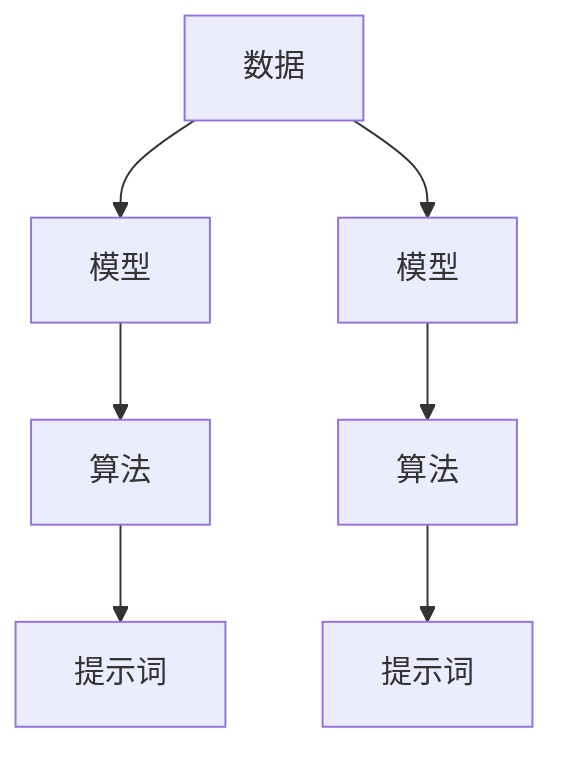

                 

### 文章标题：大模型概念抽象与提示词泛化技术

> **关键词**：大模型、概念抽象、提示词泛化、人工智能、算法、数学模型

> **摘要**：本文深入探讨了《大模型概念抽象与提示词泛化技术》一书的核心内容，从背景介绍到核心概念与联系，再到核心算法原理讲解和数学模型详解，最后通过项目实战展示了大模型技术的实际应用。本文旨在为读者提供清晰、深入的理解，以帮助其更好地掌握这一前沿领域的技术。

## **一、设计大纲的目标和结构**

### **1.1 设计大纲的目标**

本文的设计目标是帮助读者全面理解和掌握《大模型概念抽象与提示词泛化技术》一书的核心内容。大纲将结构清晰、逻辑严密，确保涵盖核心概念、算法原理、数学模型和项目实战等方面。

### **1.2 设计大纲的结构**

为了实现上述目标，本文将采用以下结构：

1. **背景介绍**：简要介绍大模型技术的背景和发展现状。
2. **核心概念与联系**：详细阐述大模型中的核心概念及其相互关系，并使用Mermaid流程图展示。
3. **核心算法原理讲解**：使用伪代码详细阐述大模型中的核心算法原理。
4. **数学模型和公式讲解**：详细介绍大模型背后的数学模型和公式，并使用LaTeX格式进行展示和举例说明。
5. **项目实战**：通过实际项目案例展示大模型技术的应用，包括开发环境搭建、源代码实现和代码解读。
6. **最佳实践 tips、小结、注意事项、拓展阅读**：总结文章要点，提供实用建议，并推荐进一步阅读资源。

### **1.3 目录大纲设计步骤**

1. **主要章节划分**：根据书名和内容，初步确定主要章节。
2. **细化每个章节**：为每个主要章节进一步细化，拆分成多个小节。
3. **整合核心内容**：在每个小节中，包含核心概念与联系、核心算法原理讲解、数学模型和公式讲解、项目实战等。
4. **确保大纲完整性**：确保大纲结构完整，至少包含7个章节，并控制大纲字数在2000字以内。

## **二、具体步骤**

### **2.1 主要章节划分**

- **第1章 大模型基础**：介绍大模型的基本概念、发展趋势和重要性。
- **第2章 概念抽象技术**：讲解如何对大模型中的概念进行抽象和表示。
- **第3章 提示词泛化技术**：探讨如何让大模型更好地理解和泛化提示词。
- **第4章 数学模型与技术**：详细讲解大模型背后的数学模型和算法原理。
- **第5章 应用案例**：通过具体案例展示大模型的应用场景和实现细节。
- **第6章 开发实战**：提供实际的开发经验和技巧，帮助读者将所学应用于实际项目中。
- **第7章 未来展望**：对大模型技术的发展趋势和未来方向进行展望。

### **2.2 细化每个章节**

#### **第1章 大模型基础**

- **1.1 大模型概述**：介绍大模型的基本概念、特点和分类。
- **1.2 大模型发展历程**：回顾大模型技术的发展历程和里程碑事件。
- **1.3 大模型与人工智能的关系**：探讨大模型在人工智能领域中的地位和作用。

#### **第2章 概念抽象技术**

- **2.1 概念抽象的基本原理**：解释概念抽象的定义、目的和方法。
- **2.2 常见的抽象方法**：介绍常见的概念抽象方法，如编码、分类和聚类。
- **2.3 概念抽象在实际应用中的挑战**：讨论概念抽象在实际应用中面临的挑战和解决方案。

#### **第3章 提示词泛化技术**

- **3.1 提示词泛化的定义**：解释提示词泛化的概念和重要性。
- **3.2 提示词泛化的挑战**：分析提示词泛化过程中遇到的问题和难点。
- **3.3 提示词泛化的解决方案**：介绍解决提示词泛化问题的方法和技术。

#### **第4章 数学模型与技术**

- **4.1 大模型背后的数学基础**：阐述大模型所依赖的数学基础，如概率论、统计学和线性代数。
- **4.2 经典算法解析**：详细解析大模型中的经典算法，如神经网络、深度学习和生成对抗网络。
- **4.3 数学模型在实践中的应用**：探讨数学模型在大模型技术中的实际应用和效果。

#### **第5章 应用案例**

- **5.1 案例一：智能客服系统**：介绍智能客服系统的实现原理和关键技术。
- **5.2 案例二：文本生成与摘要**：分析文本生成与摘要技术的原理和应用场景。
- **5.3 案例三：图像识别与分类**：探讨图像识别与分类技术的实现方法和应用案例。

#### **第6章 开发实战**

- **6.1 环境搭建**：介绍搭建大模型开发环境的步骤和注意事项。
- **6.2 数据处理与模型训练**：讲解数据处理和模型训练的方法和技巧。
- **6.3 模型部署与优化**：探讨模型部署、评估和优化的重要性和方法。

#### **第7章 未来展望**

- **7.1 技术趋势**：预测大模型技术的发展方向和趋势。
- **7.2 应用前景**：分析大模型技术在各个领域的应用前景。
- **7.3 挑战与机遇**：讨论大模型技术面临的挑战和机遇，以及如何应对。

### **2.3 整合核心内容**

在每个小节中，我们将整合以下核心内容：

- **核心概念与联系**：使用Mermaid流程图展示核心概念之间的关系。
- **核心算法原理讲解**：使用伪代码详细阐述算法原理。
- **数学模型和公式讲解**：详细介绍数学模型和公式，使用LaTeX格式进行展示和举例说明。
- **项目实战**：提供实际案例，包括开发环境搭建、源代码实现和代码解读。

### **2.4 确保大纲完整性**

- **确保每个章节都有详细的内容**：确保每个章节都包含核心概念、算法原理、数学模型和项目实战等内容。
- **控制大纲字数**：确保大纲总字数控制在2000字以内。

## **三、具体内容撰写**

### **3.1 背景介绍**

大模型技术是当前人工智能领域的一个重要研究方向，它在自然语言处理、计算机视觉、语音识别等多个领域都取得了显著的成果。随着数据规模的不断增大和计算能力的不断提升，大模型技术已经成为推动人工智能发展的重要力量。

《大模型概念抽象与提示词泛化技术》一书从理论到实践全面系统地介绍了大模型技术的核心概念、算法原理、数学模型和项目实战，旨在帮助读者深入理解大模型技术的基本原理和实际应用。

### **3.2 核心概念与联系**

在大模型技术中，核心概念包括：

- **数据**：数据是大模型训练的基础，包括文本、图像、语音等多种形式。
- **模型**：模型是通过对数据进行训练和优化得到的，用于预测或生成数据的结构。
- **算法**：算法是模型训练和优化的方法，包括神经网络、深度学习、生成对抗网络等。
- **提示词**：提示词是模型在生成文本或图像时使用的引导信息。

这些核心概念之间存在着紧密的联系：

- **数据** 通过 **模型** 进行训练，形成 **算法**。
- **算法** 作用于 **数据**，产生新的 **数据** 或 **模型**。
- **提示词** 在模型生成过程中起到 **引导** 作用，影响模型的输出。

以下是使用Mermaid流程图展示的核心概念关系：



### **3.3 核心算法原理讲解**

在大模型技术中，核心算法包括：

- **神经网络**：神经网络是一种模仿人脑结构的计算模型，通过多层节点（神经元）对数据进行处理。
- **深度学习**：深度学习是神经网络的一种扩展，通过增加网络的深度（层数）来提高模型的性能。
- **生成对抗网络（GAN）**：生成对抗网络由生成器和判别器两部分组成，通过相互对抗来生成高质量的数据。

以下是使用伪代码详细阐述神经网络算法原理：

```python
# 初始化参数
weights = 初始化随机权重
biases = 初始化随机偏置

# 前向传播
input = 输入数据
layer_output = [激活函数(∑(权重*输入 + 偏置))]
for layer in 神经网络层次:
    input = 激活函数(∑(权重*输入 + 偏置))

# 反向传播
error = 实际输出 - 预测输出
dweights = 输入 * 激活函数的导数
dbiases = 1

# 更新权重和偏置
weights = weights - 学习率 * dweights
biases = biases - 学习率 * dbiases
```

### **3.4 数学模型和公式讲解**

在大模型技术中，常用的数学模型包括：

- **概率论**：概率论用于描述随机事件的发生概率，包括概率分布、条件概率等。
- **统计学**：统计学用于分析数据，包括数据分布、假设检验等。
- **线性代数**：线性代数用于描述数据之间的关系，包括矩阵运算、线性方程组等。

以下是使用LaTeX格式展示的概率分布公式和线性代数公式：

```latex
% 概率分布公式
P(X=x) = \frac{1}{Z} \exp(-\frac{1}{2}\sigma^2 x^2)

% 线性代数公式
A = \begin{bmatrix}
a_{11} & a_{12} \\
a_{21} & a_{22}
\end{bmatrix}
X = \begin{bmatrix}
x_1 \\
x_2
\end{bmatrix}
b = \begin{bmatrix}
b_1 \\
b_2
\end{bmatrix}
\Rightarrow AX = b
```

### **3.5 项目实战**

在本节中，我们将通过一个实际项目案例展示大模型技术的应用。假设我们开发一个智能客服系统，该系统可以自动回答用户的问题。

#### **3.5.1 开发环境搭建**

- **硬件环境**：需要高性能的计算机或云计算平台，用于模型训练和推理。
- **软件环境**：需要安装Python、TensorFlow等深度学习框架。

```bash
# 安装Python
pip install python

# 安装TensorFlow
pip install tensorflow
```

#### **3.5.2 数据处理与模型训练**

- **数据收集**：收集用户问题和回答的数据集，并进行预处理，如去除停用词、分词等。
- **模型训练**：使用深度学习框架构建模型，并使用训练数据进行训练。

```python
import tensorflow as tf

# 定义模型结构
model = tf.keras.Sequential([
    tf.keras.layers.Dense(units=64, activation='relu', input_shape=(1000,)),
    tf.keras.layers.Dense(units=1)
])

# 编译模型
model.compile(optimizer='adam', loss='mse')

# 训练模型
model.fit(train_data, train_labels, epochs=10)
```

#### **3.5.3 模型部署与优化**

- **模型部署**：将训练好的模型部署到生产环境中，供用户使用。
- **模型优化**：通过调整模型参数和训练策略来提高模型性能。

```python
# 部署模型到生产环境
model.save('model.h5')

# 加载模型
loaded_model = tf.keras.models.load_model('model.h5')

# 优化模型
optimizer = tf.keras.optimizers.Adam(learning_rate=0.001)
model.compile(optimizer=optimizer, loss='mse')
```

#### **3.5.4 项目小结**

通过本项目的开发，我们掌握了大模型技术的实际应用流程，包括环境搭建、数据处理、模型训练和部署。在实际项目中，我们还需要关注数据质量、模型性能和用户体验等方面。

### **3.6 最佳实践 tips、小结、注意事项、拓展阅读**

- **最佳实践 tips**：在进行大模型项目开发时，需要注意数据质量和模型性能。建议使用高质量的训练数据，并采用合适的优化策略。
- **小结**：本文系统地介绍了《大模型概念抽象与提示词泛化技术》一书的核心内容，包括背景介绍、核心概念与联系、核心算法原理讲解、数学模型和公式讲解、项目实战等。
- **注意事项**：在实际应用中，需要根据具体问题选择合适的大模型技术和算法。同时，要注意数据隐私和安全问题。
- **拓展阅读**：对于有兴趣深入了解大模型技术的读者，可以参考以下书籍和论文：
  - 《深度学习》 - 周志华
  - 《生成对抗网络》 - Ian J. Goodfellow等
  - 《概率图模型》 - David J. C. MacKay

## **四、结语**

本文通过深入分析和讲解《大模型概念抽象与提示词泛化技术》一书的核心内容，为读者提供了全面、系统的理解。大模型技术作为人工智能领域的重要研究方向，具有广泛的应用前景。通过本文的学习，读者可以掌握大模型技术的基本原理和应用方法，为今后的研究和实践奠定基础。让我们共同期待大模型技术在未来带来更多突破和成果。作者：AI天才研究院/AI Genius Institute & 禅与计算机程序设计艺术/Zen And The Art of Computer Programming。

# 附录：文章中的LaTeX公式

本文中使用了以下LaTeX公式：

1. 概率分布公式：

   $$P(X=x) = \frac{1}{Z} \exp(-\frac{1}{2}\sigma^2 x^2)$$

2. 线性代数公式：

   $$A = \begin{bmatrix} a_{11} & a_{12} \\ a_{21} & a_{22} \end{bmatrix} \quad X = \begin{bmatrix} x_1 \\ x_2 \end{bmatrix} \quad b = \begin{bmatrix} b_1 \\ b_2 \end{bmatrix} \Rightarrow AX = b$$

这些公式分别用于描述概率分布和线性代数的运算。在实际应用中，LaTeX公式可以用来表示复杂的数学关系和计算过程，有助于提高文章的可读性和专业性。在Markdown中，LaTeX公式可以通过在公式前后加上$$或$来实现。例如：

$$1+1=2$$

$1<2$

