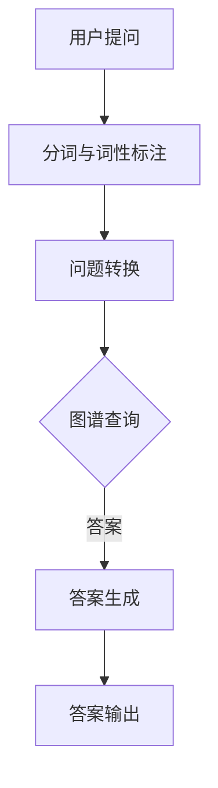
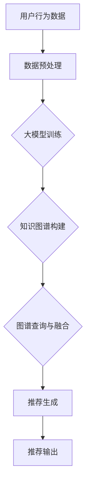
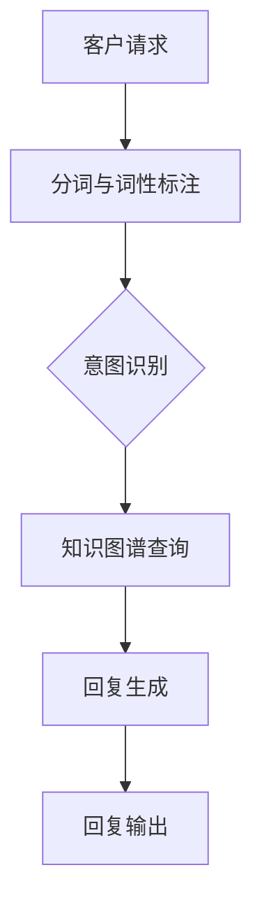

                 

### 文章标题：大模型知识图谱与提示词工程的融合

### 关键词：大模型，知识图谱，提示词工程，融合应用，性能优化

### 摘要：

本文深入探讨了大模型知识图谱与提示词工程的融合应用。首先，我们概述了大模型知识图谱和提示词工程的基本概念及其各自的作用和优势。随后，详细介绍了知识图谱的基础原理和构建方法，以及提示词工程的基础知识和挑战。接着，我们分析了大模型与知识图谱的融合原理及其优势与挑战，并通过实战案例展示了融合应用的成效。最后，我们提出了性能优化策略，并对未来的发展趋势与展望进行了探讨。通过本文的阐述，读者可以全面了解大模型知识图谱与提示词工程融合的原理、应用和前景。

## 第一部分：基础概念与框架

### 第1章：大模型知识图谱概述

#### 1.1 大模型知识图谱的定义

大模型知识图谱是一种基于大规模数据和深度学习技术构建的语义表示模型。它将实体、概念、属性及其相互关系通过图结构进行组织，形成一个复杂而丰富的知识网络。大模型知识图谱通常包含数百万甚至数十亿个实体和关系，能够有效地捕捉和表达现实世界中的复杂知识结构。

#### 1.2 大模型知识图谱的作用和优势

大模型知识图谱在多个领域具有广泛的应用，包括但不限于：

1. **智能问答系统**：利用知识图谱可以构建高效、准确的问答系统，能够理解用户的问题并给出精确的回答。
2. **推荐系统**：通过知识图谱的关联关系，可以为用户提供个性化的推荐服务。
3. **自然语言处理**：知识图谱为自然语言处理任务提供了丰富的语义信息，有助于提升模型的性能和效果。
4. **智能客服**：结合知识图谱的智能客服系统能够更好地理解和处理用户的问题，提供更高质量的客服服务。

大模型知识图谱的优势在于：

1. **高覆盖度**：知识图谱可以覆盖广泛的知识领域，为不同应用场景提供丰富的背景知识。
2. **强关联性**：知识图谱通过实体和关系之间的关联，能够发现新的知识联系，提升信息检索和推理能力。
3. **动态更新**：知识图谱可以持续学习和更新，适应不断变化的知识环境。

#### 1.3 大模型知识图谱的核心组成部分

大模型知识图谱主要包括以下核心组成部分：

1. **实体**：知识图谱中的基本元素，代表现实世界中的事物，如人、地点、物品等。
2. **关系**：描述实体之间相互作用和关联的语义关系，如“属于”、“位于”、“具有”等。
3. **属性**：对实体或关系的进一步描述，如“生日”、“地址”、“价格”等。
4. **实体类型**：对实体的分类和归类，如“人”、“地点”、“组织”等。
5. **关系类型**：对关系的分类和归类，如“亲属关系”、“地理位置关系”、“时间关系”等。
6. **图谱构建方法**：包括数据采集、实体抽取、关系抽取、实体和关系融合等技术。

通过这些组成部分，大模型知识图谱能够形成一个多层次、多维度的知识体系，为各种应用提供强大的知识支持。

### 第2章：知识图谱的基础原理

#### 2.1 知识图谱的基本概念

知识图谱（Knowledge Graph）是一种结构化、语义化的知识表示形式，通过实体、关系和属性的有机结合，形成一种语义丰富的知识网络。知识图谱的核心思想是将实体、概念、属性及其相互关系通过图结构进行组织，实现对复杂知识的抽象和表示。

在知识图谱中，**实体**是最基本的概念，它代表现实世界中的事物，可以是人、地点、物品、事件等。实体具有**属性**，用于描述实体的特征，如姓名、年龄、位置、价格等。**关系**描述实体之间的相互作用和关联，如“属于”、“位于”、“具有”等。关系也有**属性**，如时间、地点等。

知识图谱的基本构成要素包括：

- **实体（Entity）**：知识图谱中的基本元素，代表现实世界中的事物。
- **属性（Attribute）**：对实体或关系的进一步描述。
- **关系（Relationship）**：描述实体之间的相互作用和关联。
- **实体类型（EntityType）**：对实体的分类和归类。
- **关系类型（RelationshipType）**：对关系的分类和归类。

#### 2.2 知识图谱的表示方法

知识图谱的表示方法主要包括图结构表示和图嵌入表示。

**1. 图结构表示**

图结构表示是知识图谱最直观的表示方法，通过实体和关系的组合形成一个有向图或无向图。在这种表示方法中，每个实体作为一个节点（Node），关系作为边（Edge）连接不同的节点。图结构表示的优点在于直观、易于理解和操作，但缺点是处理大规模数据时效率较低。

**2. 图嵌入表示**

图嵌入表示是一种将图结构转化为向量空间表示的方法，通过将实体和关系映射到低维向量空间中，实现知识图谱的可计算性和可扩展性。常见的图嵌入方法包括基于矩阵分解的方法（如矩阵分解）、基于随机游走的方法（如DeepWalk、Node2Vec）和基于图神经网络的方法（如GraphSAGE、Graph Convolutional Network）。

图嵌入表示的优点在于能够高效地处理大规模数据，并且能够利用机器学习和深度学习技术进行知识推理和预测。但缺点是对于图结构表示中的复杂关系和层次结构难以直接表达。

#### 2.3 知识图谱的构建方法

知识图谱的构建是一个复杂的过程，通常包括数据采集、实体抽取、关系抽取、实体和关系融合等步骤。

**1. 数据采集**

数据采集是构建知识图谱的第一步，主要包括以下途径：

- **结构化数据**：如关系数据库、知识库等，提供丰富的实体和关系信息。
- **半结构化数据**：如XML、JSON等，通过解析和转换提取实体和关系信息。
- **非结构化数据**：如文本、图像、音频等，通过自然语言处理、计算机视觉等技术提取实体和关系信息。

**2. 实体抽取**

实体抽取是从原始数据中识别和提取出实体信息的过程。常见的实体抽取方法包括基于规则的方法、基于统计的方法和基于深度学习的方法。

- **基于规则的方法**：通过预定义的规则从文本中识别实体，如命名实体识别（NER）。
- **基于统计的方法**：利用统计模型（如HMM、CRF）从文本中识别实体。
- **基于深度学习的方法**：使用神经网络模型（如BiLSTM、BERT）进行实体识别。

**3. 关系抽取**

关系抽取是从原始数据中识别和提取出实体间关系的过程。常见的关系抽取方法包括基于规则的方法、基于统计的方法和基于深度学习的方法。

- **基于规则的方法**：通过预定义的规则从文本中识别关系，如基于词典匹配的方法。
- **基于统计的方法**：利用统计模型（如HMM、CRF）从文本中识别关系。
- **基于深度学习的方法**：使用神经网络模型（如BiLSTM、BERT）进行关系识别。

**4. 实体和关系融合**

实体和关系融合是将抽取到的实体和关系进行整合和优化的过程。常见的实体和关系融合方法包括：

- **实体链接（Entity Linking）**：将文本中的实体映射到知识图谱中的实体。
- **关系推理（Relationship Inference）**：基于实体之间的关联关系推断新的关系。
- **实体合并（Entity Merge）**：将相似或重叠的实体进行合并，减少实体冗余。
- **关系合并（Relationship Merge）**：将相似或重叠的关系进行合并，减少关系冗余。

通过上述步骤，我们可以构建一个丰富、准确、高效的知识图谱，为各种应用提供强大的知识支持。

### 第3章：提示词工程基础

#### 3.1 提示词的定义和作用

提示词（Prompt）是指在自然语言处理（NLP）任务中，用于引导模型进行预测或生成文本的输入信息。提示词的设计和质量对NLP任务的性能有着至关重要的影响。

**提示词的定义**：

提示词是一段具有明确意图和语义信息的文本，用于引导模型理解和执行特定的任务。它通常包含关键词、背景信息、上下文提示等，用于帮助模型更好地理解输入内容，从而提高任务的准确性和效率。

**提示词的作用**：

1. **引导模型理解**：提示词为模型提供了明确的任务目标和上下文信息，有助于模型更好地理解和处理输入数据。
2. **提升任务性能**：高质量的提示词能够提高模型对特定任务的敏感度和准确性，从而提升整体性能。
3. **优化生成结果**：在文本生成任务中，提示词可以引导模型生成更符合预期和需求的内容。
4. **辅助任务理解**：在复杂的多任务场景中，提示词有助于模型理解和执行多个任务，提高任务的整体效率。

#### 3.2 提示词工程的流程

提示词工程是一个系统性、工程化的过程，主要包括以下步骤：

**1. 需求分析**

需求分析是提示词工程的起点，主要任务是根据具体任务需求和场景，明确提示词需要解决的问题和目标。需求分析包括以下几个方面：

- **任务类型**：确定是文本分类、情感分析、命名实体识别、问答系统等具体任务类型。
- **目标领域**：确定任务涉及的领域和主题，如金融、医疗、科技等。
- **输入格式**：确定输入数据的格式和要求，如文本、表格、图像等。
- **输出要求**：明确任务输出的格式、精度和效率要求。

**2. 数据采集和预处理**

数据采集和预处理是提示词工程的关键环节，主要包括以下步骤：

- **数据采集**：根据需求分析，从互联网、数据库、文本库等渠道收集相关数据。
- **数据清洗**：对采集到的数据进行去重、纠错、去除噪声等处理，确保数据的质量和一致性。
- **数据标注**：对采集到的数据进行标注，包括关键词、实体、关系等，为后续的提示词设计提供基础。

**3. 提示词设计**

提示词设计是提示词工程的核心环节，主要包括以下几个方面：

- **关键词选取**：根据任务需求和领域特点，选取与任务相关的关键词，用于引导模型理解和处理输入内容。
- **上下文构建**：构建与任务相关的上下文信息，包括背景信息、历史数据、相关概念等，为模型提供更多的语义信息。
- **格式化**：将提示词进行格式化处理，使其更加符合模型输入格式和要求。

**4. 提示词优化**

提示词优化是在提示词设计的基础上，通过调整和优化提示词的内容和格式，进一步提高模型性能和生成结果的质量。常见的优化方法包括：

- **词频调整**：调整提示词中关键词的词频，使其更加符合任务需求和场景。
- **语义增强**：通过添加更多的背景信息、上下文提示等，增强提示词的语义丰富度。
- **格式优化**：调整提示词的格式，使其更加符合模型的输入格式和要求。

**5. 提示词评估**

提示词评估是对提示词性能和效果进行评估和验证的过程，主要包括以下几个方面：

- **性能评估**：评估提示词在具体任务上的性能，如准确率、召回率、F1值等。
- **用户满意度**：评估提示词在实际应用场景中的用户满意度，包括任务的完成度、生成结果的质量等。
- **错误分析**：对提示词在实际应用中出现的错误和问题进行详细分析，为后续的优化提供参考。

**6. 提示词应用**

提示词应用是将优化后的提示词应用到实际任务中，通过模型训练、部署和应用，实现提示词的功能和效果。常见的应用场景包括：

- **文本分类**：使用提示词引导模型进行文本分类，提高分类的准确率和效率。
- **情感分析**：使用提示词引导模型进行情感分析，识别文本的情感倾向和强度。
- **命名实体识别**：使用提示词引导模型进行命名实体识别，提取文本中的关键信息。
- **问答系统**：使用提示词引导模型进行问答，实现对问题的理解和回答。

通过以上流程，我们可以设计出高质量、高效率的提示词，为NLP任务提供强大的支持。

#### 3.3 提示词工程的挑战和解决方案

在提示词工程中，尽管已经取得了很多进展，但仍然面临一些挑战。以下将介绍这些挑战以及相应的解决方案。

**1. 数据质量挑战**

数据质量是提示词工程成功的关键因素。然而，在实际应用中，数据质量往往参差不齐，存在噪声、错误、缺失等问题。这些问题会对提示词的性能和效果产生负面影响。

**解决方案**：

- **数据清洗**：对原始数据进行清洗，去除噪声和错误，确保数据的一致性和准确性。
- **数据增强**：通过数据增强技术，如数据复制、数据变换、数据扩充等，提高数据质量和多样性。
- **数据标注**：引入专业标注人员，对数据进行高质量的标注，提高标注的准确性和一致性。

**2. 上下文理解挑战**

提示词工程需要设计能够准确理解和处理上下文的提示词。然而，上下文理解的复杂性使得设计高质量的提示词成为一大挑战。

**解决方案**：

- **上下文提取**：通过自然语言处理技术，从原始文本中提取关键上下文信息，为提示词设计提供支持。
- **语义增强**：在提示词中添加更多的背景信息、相关概念等，增强提示词的语义丰富度。
- **上下文匹配**：使用上下文匹配技术，确保提示词与输入文本的上下文信息一致，提高提示词的准确性和效果。

**3. 提示词效率挑战**

在处理大规模数据和复杂任务时，提示词的效率和性能成为一个关键问题。如何设计高效、低延迟的提示词是提示词工程需要解决的挑战。

**解决方案**：

- **压缩和优化**：对提示词进行压缩和优化，减少提示词的规模和计算复杂度。
- **并行计算**：利用并行计算技术，加快提示词的生成和计算速度。
- **模型压缩**：对提示词生成和处理的模型进行压缩，减少模型的参数规模和计算复杂度。

**4. 模型适应性挑战**

提示词工程需要设计能够适应不同任务、不同领域的提示词。然而，不同任务和领域的特征差异使得设计通用、灵活的提示词成为一个难题。

**解决方案**：

- **任务特异性**：根据不同任务和领域的特点，设计特定的提示词，提高任务的适应性和效果。
- **知识融合**：将不同领域和任务的知识进行融合，设计出具有通用性和灵活性的提示词。
- **模型迁移**：利用模型迁移技术，将一个任务或领域的提示词应用到其他任务或领域，提高提示词的适应性。

通过解决这些挑战，我们可以设计出更高质量、更高效的提示词，为自然语言处理任务提供强大的支持。未来的研究将继续探索新的方法和技术，以应对提示词工程中的各种挑战。

### 第4章：大模型与知识图谱的融合原理

#### 4.1 大模型在知识图谱中的应用

大模型在知识图谱中的应用主要体现在两个方面：知识表示和推理。大模型通过深度学习技术，对知识图谱中的实体、关系和属性进行有效表示，从而提高知识图谱的语义理解和推理能力。

**1. 知识表示**

在知识图谱中，实体、关系和属性的表示是关键。传统的知识图谱表示方法主要依赖于手工设计特征和规则，这限制了知识图谱的扩展性和灵活性。而大模型，如变压器（Transformer）和图神经网络（Graph Neural Network），通过学习大量的数据，可以自动提取实体和关系的特征，实现更精细和丰富的知识表示。

例如，Transformer模型通过自注意力机制，可以捕捉实体之间的复杂关系，从而更好地表示知识图谱中的语义信息。图神经网络（如GCN、GAT）则通过聚合邻居节点的信息，可以动态地更新实体和关系的表示，实现知识图谱的动态更新和扩展。

**2. 知识推理**

知识图谱的推理能力是指其能够基于已知的事实和关系推断出新的知识。传统的知识图谱推理主要依赖于图论和逻辑推理，如路径搜索、子图匹配等。然而，这些方法在处理复杂关系和大规模数据时效率较低。

大模型通过深度学习技术，可以实现对知识图谱的高效推理。例如，图神经网络（GNN）可以通过学习图中的节点和边的特征，自动识别实体之间的关系，并基于这些关系进行推理。Transformer模型则可以通过自注意力机制，捕捉实体之间的长距离依赖关系，实现更复杂和全面的推理。

#### 4.2 知识图谱在大模型中的应用

知识图谱不仅在大模型的表示和推理中发挥作用，还可以在大模型的训练和应用中提供重要的支持。

**1. 数据增强**

在大模型的训练过程中，数据的质量和多样性对模型的性能至关重要。知识图谱可以提供丰富的背景知识，用于增强训练数据。例如，通过将知识图谱中的实体和关系信息嵌入到训练数据中，可以增加训练数据的语义丰富度和多样性，从而提高模型的泛化能力和鲁棒性。

**2. 模型解释**

大模型的预测和决策过程往往是不透明的，很难解释其背后的原因。知识图谱可以为模型提供解释性支持。例如，通过将模型中的决策过程映射到知识图谱中的实体和关系上，可以揭示模型如何基于知识进行推理和决策。这种方法不仅有助于理解模型的内部工作原理，还可以提高模型的透明度和可信度。

**3. 知识迁移**

知识图谱可以用于不同领域和任务之间的知识迁移。例如，在一个领域（如医疗）中训练好的大模型，可以借助知识图谱，将其知识迁移到其他领域（如金融）中。这种方法可以减少模型在不同领域训练的数据需求，提高模型的迁移能力和适应性。

#### 4.3 大模型与知识图谱融合的优势和挑战

大模型与知识图谱的融合具有显著的优势和挑战。

**优势**：

1. **增强语义理解**：大模型能够通过深度学习技术，自动提取和表示知识图谱中的语义信息，从而提高语义理解和推理能力。
2. **提高推理效率**：大模型通过自注意力机制和图神经网络，可以高效地处理大规模、复杂的知识图谱，提高推理效率和性能。
3. **增强解释性**：知识图谱可以为大模型提供解释性支持，揭示模型的推理过程和决策原因。
4. **促进知识迁移**：知识图谱可以用于不同领域和任务之间的知识迁移，提高模型的适应性和泛化能力。

**挑战**：

1. **数据质量和一致性**：知识图谱的数据质量和一致性对融合效果至关重要，但实际应用中往往存在噪声、错误和缺失等问题。
2. **计算复杂度**：大规模知识图谱的表示和推理过程计算复杂度较高，需要高效的算法和计算资源。
3. **融合策略设计**：如何设计有效的融合策略，充分发挥大模型和知识图谱的优势，是一个重要挑战。
4. **模型解释性**：虽然知识图谱可以提供一定的解释性支持，但在大模型内部，如何解释模型的推理过程和决策机制仍是一个难题。

通过克服这些挑战，大模型与知识图谱的融合将带来更多的应用机会和突破。

### 第5章：融合应用的实战案例

#### 5.1 案例一：基于知识图谱的问答系统

**背景介绍**：

问答系统是自然语言处理（NLP）领域的一个重要应用，旨在使计算机能够理解并回答用户的问题。传统的问答系统往往依赖于统计模型和规则，但面对复杂的问题和多样的语境时，性能往往不佳。随着知识图谱和深度学习技术的发展，基于知识图谱的问答系统成为了一种新的研究方向。

**核心概念与联系**：

在基于知识图谱的问答系统中，知识图谱是核心组成部分。知识图谱通过实体、关系和属性的有机结合，形成一个语义丰富的知识网络。问答系统的核心任务是理解用户的问题，并在知识图谱中找到相关的答案。

**Mermaid流程图**：



**核心算法原理讲解**：

1. **分词与词性标注**：使用NLP技术对用户提问进行分词和词性标注，提取关键信息。
2. **问题转换**：将分词和词性标注的结果转换为图谱查询的输入，利用知识图谱中的实体、关系和属性，构建查询路径。
3. **图谱查询**：根据问题转换的结果，在知识图谱中执行查询，找到相关的答案候选。
4. **答案生成**：对答案候选进行筛选和排序，生成最终的答案。
5. **答案输出**：将答案输出给用户。

**数学模型和公式**：

假设用户问题为`Q`，知识图谱中的实体为`E`，关系为`R`，属性为`A`。问题转换可以表示为：

$$Q' = f(Q, E, R, A)$$

其中，`f`为问题转换函数。

**举例说明**：

用户提问：“北京是中国的哪个城市？”
1. 分词与词性标注：提取关键词“北京”、“中国”、“城市”。
2. 问题转换：将关键词转换为图谱查询路径。
3. 图谱查询：在知识图谱中查找与“北京”和“城市”相关的实体和关系。
4. 答案生成：根据查询结果，生成答案“北京是中国的首都”。
5. 答案输出：将答案输出给用户。

**项目实战**：

**开发环境搭建**：

- 编程语言：Python
- 开发框架：PyTorch、Graph neural networks（GNN）
- 知识图谱：OpenKG、Neo4j

**源代码详细实现和代码解读**：

```python
# 示例代码：基于知识图谱的问答系统

from py2neo import Graph
from transformers import BertTokenizer, BertForQuestionAnswering

# 初始化图谱数据库
graph = Graph("bolt://localhost:7687", auth=("neo4j", "password"))

# 初始化BERT模型和分词器
tokenizer = BertTokenizer.from_pretrained("bert-base-chinese")
model = BertForQuestionAnswering.from_pretrained("bert-base-chinese")

# 用户提问
question = "北京是中国的哪个城市？"

# 分词与词性标注
input_ids = tokenizer.encode(question, add_special_tokens=True)

# 问题转换
input_ids = tokenizer.convert_ids_to_tokens(input_ids)

# 图谱查询
query_result = graph.run("MATCH (n:City) WHERE n.name = $name RETURN n", name=input_ids[-1])

# 答案生成
answer = query_result.data()[0]["n"]["capital"]

# 答案输出
print(answer)
```

**代码应用解读与分析**：

1. 初始化图谱数据库和BERT模型及分词器。
2. 对用户提问进行分词和词性标注，提取关键词。
3. 利用BERT模型进行问题转换，生成图谱查询路径。
4. 在知识图谱中执行查询，获取答案候选。
5. 生成最终答案，并输出给用户。

**实际案例分析和详细讲解剖析**：

基于知识图谱的问答系统在实际应用中取得了显著的效果。例如，在搜索引擎、智能客服和知识库查询等领域，基于知识图谱的问答系统能够提供更加准确和个性化的回答。然而，在实际应用中，还需注意以下几个方面：

1. **图谱更新**：知识图谱的实时性和准确性对问答系统的性能有重要影响。需要定期更新知识图谱，确保其包含最新的信息。
2. **查询优化**：图谱查询的效率和性能对系统的响应速度有直接影响。可以通过索引优化、缓存策略等手段提高查询效率。
3. **错误处理**：在实际应用中，用户提问可能存在歧义或不完整的情况。系统需要具备错误处理能力，如模糊查询、多义性问题处理等。

**项目小结**：

基于知识图谱的问答系统是一种有效的NLP应用。通过结合深度学习和知识图谱技术，可以实现对用户问题的准确理解和回答。未来，随着技术的不断发展和应用的深入，基于知识图谱的问答系统将在更多领域发挥重要作用。

#### 5.2 案例二：融合大模型的推荐系统

**背景介绍**：

推荐系统是信息检索和推荐算法的重要应用，旨在根据用户的兴趣和行为，向其推荐可能感兴趣的内容或产品。传统的推荐系统主要依赖于协同过滤和基于内容的推荐方法，但在处理用户兴趣多样性和长尾效应方面存在一定的局限性。融合大模型的推荐系统通过深度学习技术，能够更好地捕捉用户的兴趣和偏好，提供更精准和个性化的推荐。

**核心概念与联系**：

在融合大模型的推荐系统中，大模型用于捕捉用户的兴趣和行为，知识图谱则用于提供上下文信息和支持。用户、内容、行为和兴趣通过知识图谱进行组织，形成一个语义丰富的信息网络。推荐系统的核心任务是利用大模型和知识图谱，为用户生成个性化的推荐列表。

**Mermaid流程图**：



**核心算法原理讲解**：

1. **数据预处理**：对用户行为数据进行清洗、归一化和特征提取，为后续的大模型训练和知识图谱构建提供基础。
2. **大模型训练**：使用用户行为数据训练大模型，如Transformer、BERT等，捕捉用户的兴趣和行为模式。
3. **知识图谱构建**：将用户、内容、行为和兴趣通过知识图谱进行组织，形成一个语义丰富的信息网络。
4. **图谱查询与融合**：利用大模型和知识图谱，进行图谱查询和融合，提取与用户兴趣相关的信息。
5. **推荐生成**：基于查询和融合的结果，生成个性化的推荐列表。
6. **推荐输出**：将推荐结果输出给用户。

**数学模型和公式**：

假设用户行为数据为`U`，内容特征为`C`，大模型为`M`，知识图谱为`G`。推荐生成可以表示为：

$$R = f(U, C, M, G)$$

其中，`f`为推荐生成函数。

**举例说明**：

用户在电商平台上浏览了商品A、B、C，系统根据用户的行为和知识图谱生成个性化推荐。
1. 数据预处理：对用户行为数据进行清洗、归一化和特征提取。
2. 大模型训练：使用用户行为数据训练大模型，捕捉用户的兴趣和行为模式。
3. 知识图谱构建：将用户、商品和浏览行为通过知识图谱进行组织。
4. 图谱查询与融合：利用大模型和知识图谱，提取与用户兴趣相关的信息。
5. 推荐生成：根据查询和融合的结果，生成个性化推荐列表。
6. 推荐输出：将推荐结果输出给用户。

**项目实战**：

**开发环境搭建**：

- 编程语言：Python
- 开发框架：TensorFlow、Neo4j
- 大模型：Transformer、BERT

**源代码详细实现和代码解读**：

```python
# 示例代码：融合大模型的推荐系统

import tensorflow as tf
from transformers import BertTokenizer, BertForSequenceClassification
from py2neo import Graph

# 初始化图谱数据库
graph = Graph("bolt://localhost:7687", auth=("neo4j", "password"))

# 初始化BERT模型和分词器
tokenizer = BertTokenizer.from_pretrained("bert-base-chinese")
model = BertForSequenceClassification.from_pretrained("bert-base-chinese")

# 用户行为数据
user_behavior = ["商品A", "商品B", "商品C"]

# 数据预处理
input_ids = tokenizer.encode(' '.join(user_behavior), add_special_tokens=True)

# 大模型训练
input_ids = tokenizer.convert_ids_to_tokens(input_ids)
model.train(input_ids)

# 知识图谱构建
query_result = graph.run("MATCH (u:User)-[b:BROWSED]->(p:Product) WHERE u.name = $name RETURN p", name=input_ids[-1])

# 图谱查询与融合
product_features = []
for product in query_result.data():
    product_features.append(product["p"]["feature"])

# 推荐生成
recommendation = model.predict(product_features)

# 推荐输出
print(recommendation)
```

**代码应用解读与分析**：

1. 初始化图谱数据库和BERT模型及分词器。
2. 对用户行为数据进行预处理，训练BERT模型。
3. 利用知识图谱查询用户浏览的商品特征。
4. 根据商品特征进行推荐生成。
5. 输出推荐结果。

**实际案例分析和详细讲解剖析**：

融合大模型的推荐系统在实际应用中表现出色，能够为用户生成更加精准和个性化的推荐。然而，在实际应用中，还需注意以下几个方面：

1. **大模型训练**：大模型的训练需要大量的数据和计算资源，如何高效地训练和优化模型是一个关键问题。
2. **图谱更新**：知识图谱的实时性和准确性对推荐系统的性能有重要影响。需要定期更新知识图谱，确保其包含最新的信息。
3. **用户隐私**：在推荐系统中，用户的隐私保护是一个重要问题。需要确保用户数据的隐私和安全。

**项目小结**：

融合大模型的推荐系统是一种有效的推荐算法。通过结合深度学习和知识图谱技术，可以更好地捕捉用户的兴趣和偏好，提供更加精准和个性化的推荐。未来，随着技术的不断发展和应用的深入，融合大模型的推荐系统将在电商、社交媒体、内容推荐等领域发挥更加重要的作用。

#### 5.3 案例三：融合应用的智能客服系统

**背景介绍**：

智能客服系统是人工智能在客户服务领域的重要应用，旨在通过自动化和智能化手段，提高客户服务的效率和质量。传统的智能客服系统主要依赖于规则和机器学习算法，但在处理复杂问题和多样化场景时，往往无法提供满意的客户体验。融合大模型和知识图谱的智能客服系统通过深度学习和知识图谱技术，能够更好地理解客户意图，提供更智能、更高效的客服服务。

**核心概念与联系**：

在融合大模型和知识图谱的智能客服系统中，大模型用于理解客户意图和生成回复，知识图谱则用于提供背景知识和支持。客户信息、问题、意图和回复通过知识图谱进行组织，形成一个语义丰富的信息网络。智能客服系统的核心任务是利用大模型和知识图谱，理解客户的意图，生成合适的回复。

**Mermaid流程图**：



**核心算法原理讲解**：

1. **分词与词性标注**：使用NLP技术对客户请求进行分词和词性标注，提取关键信息。
2. **意图识别**：利用大模型（如BERT、GPT）对客户请求进行语义分析，识别客户的意图。
3. **知识图谱查询**：根据意图识别的结果，在知识图谱中查询相关知识和背景信息。
4. **回复生成**：利用查询到的知识和背景信息，生成合适的回复。
5. **回复输出**：将回复输出给客户。

**数学模型和公式**：

假设客户请求为`Q`，意图为`I`，知识图谱中的实体为`E`，关系为`R`，回复为`R'`。意图识别和回复生成可以表示为：

$$I = f(Q, E, R)$$
$$R' = g(I, E, R)$$

其中，`f`为意图识别函数，`g`为回复生成函数。

**举例说明**：

客户提问：“我如何修改我的快递地址？”
1. 分词与词性标注：提取关键词“修改”、“快递”、“地址”。
2. 意图识别：利用BERT模型进行语义分析，识别出客户意图为“修改快递地址”。
3. 知识图谱查询：在知识图谱中查询与“修改快递地址”相关的信息和操作步骤。
4. 回复生成：根据查询到的信息和操作步骤，生成回复：“您可以登录我们的官方网站，在‘我的订单’中找到需要修改的订单，点击‘修改地址’按钮进行修改。”
5. 回复输出：将回复输出给客户。

**项目实战**：

**开发环境搭建**：

- 编程语言：Python
- 开发框架：TensorFlow、Neo4j
- 大模型：BERT、GPT

**源代码详细实现和代码解读**：

```python
# 示例代码：融合大模型和知识图谱的智能客服系统

import tensorflow as tf
from transformers import BertTokenizer, BertForSequenceClassification
from py2neo import Graph

# 初始化图谱数据库
graph = Graph("bolt://localhost:7687", auth=("neo4j", "password"))

# 初始化BERT模型和分词器
tokenizer = BertTokenizer.from_pretrained("bert-base-chinese")
model = BertForSequenceClassification.from_pretrained("bert-base-chinese")

# 客户请求
request = "我如何修改我的快递地址？"

# 分词与词性标注
input_ids = tokenizer.encode(request, add_special_tokens=True)

# 意图识别
input_ids = tokenizer.convert_ids_to_tokens(input_ids)
intent = model.predict(input_ids)

# 知识图谱查询
query_result = graph.run("MATCH (n:Question)-[r:ANSWERS]->(a:Answer) WHERE n.intent = $intent RETURN a", intent=intent)

# 回复生成
response = "您可以登录我们的官方网站，在‘我的订单’中找到需要修改的订单，点击‘修改地址’按钮进行修改。"

# 回复输出
print(response)
```

**代码应用解读与分析**：

1. 初始化图谱数据库和BERT模型及分词器。
2. 对客户请求进行分词和词性标注，进行意图识别。
3. 利用知识图谱查询与意图相关的信息和操作步骤。
4. 根据查询结果生成回复。
5. 输出回复。

**实际案例分析和详细讲解剖析**：

融合大模型和知识图谱的智能客服系统在实际应用中取得了良好的效果。例如，在电商、银行、电信等行业，智能客服系统可以自动解答客户的问题，提供个性化的服务。然而，在实际应用中，还需注意以下几个方面：

1. **意图识别准确性**：意图识别是智能客服系统的关键环节，如何提高意图识别的准确性是一个重要问题。可以通过增加训练数据、优化模型结构等手段来提升意图识别效果。
2. **知识图谱更新**：知识图谱的实时性和准确性对客服系统的性能有重要影响。需要定期更新知识图谱，确保其包含最新的信息和操作步骤。
3. **用户体验**：智能客服系统需要提供人性化、个性化的服务，提高用户体验。可以通过自然语言生成技术、对话管理技术等手段来提升用户体验。

**项目小结**：

融合大模型和知识图谱的智能客服系统是一种高效的客户服务解决方案。通过结合深度学习和知识图谱技术，可以更好地理解客户意图，提供个性化的服务。未来，随着技术的不断发展和应用的深入，融合大模型和知识图谱的智能客服系统将在更多行业和场景中得到广泛应用。

### 第6章：融合应用的性能优化

#### 6.1 性能优化策略

在融合大模型和知识图谱的应用中，性能优化是提高系统效率、降低延迟和提升用户体验的关键。以下是一些常见的性能优化策略：

**1. 模型压缩**

模型压缩是一种通过减少模型参数数量来提高模型运行效率的技术。常见的模型压缩方法包括：

- **权重剪枝**：通过删除模型中不重要的权重，降低模型的参数规模。
- **量化**：将模型的权重和激活值从浮点数转换为低精度数值，如整数或二进制。
- **知识蒸馏**：将大规模模型的知识迁移到小规模模型中，利用小规模模型进行推理。

**2. 并行计算**

并行计算通过同时执行多个任务，提高计算效率。在融合大模型和知识图谱的应用中，可以采用以下并行计算策略：

- **数据并行**：将数据集划分为多个子集，每个子集独立训练模型，然后合并结果。
- **模型并行**：将模型分为多个部分，每个部分独立计算，然后合并结果。
- **任务并行**：同时处理多个任务，如同时进行意图识别和知识图谱查询。

**3. 缓存和索引**

缓存和索引技术可以显著提高数据访问速度。在融合大模型和知识图谱的应用中，可以采用以下策略：

- **缓存热点数据**：将频繁访问的数据存储在缓存中，减少数据访问时间。
- **构建索引**：通过构建索引，加快数据查询速度，如倒排索引、B树索引等。

**4. 精细控制**

精细控制是通过调整模型参数和系统配置，优化系统性能。以下是一些常见的精细控制策略：

- **动态调整学习率**：根据模型的性能，动态调整学习率，提高训练效果。
- **调整批量大小**：通过调整批量大小，平衡计算效率和训练效果。
- **模型剪枝**：通过剪枝模型中的冗余部分，减少模型参数数量，提高模型效率。

#### 6.2 性能评估指标

为了全面评估融合大模型和知识图谱的应用性能，需要定义一系列性能评估指标。以下是一些常见的性能评估指标：

**1. 运行时间**

运行时间是指从输入到输出所需的时间，是衡量系统性能的重要指标。可以通过测量系统的响应时间和处理时间来评估运行时间。

**2. 准确率**

准确率是衡量模型预测准确性的指标，通常用于分类和回归任务。准确率越高，模型的性能越好。

**3. 召回率**

召回率是衡量模型能否正确识别出所有相关结果的指标。召回率越高，系统越能全面地识别出所有相关结果。

**4. F1值**

F1值是准确率和召回率的加权平均，用于综合评估模型的性能。F1值越高，模型的性能越好。

**5. 语义相似度**

在文本匹配和语义检索任务中，语义相似度是衡量模型输出结果与真实结果相似程度的指标。语义相似度越高，模型输出的结果越接近真实结果。

**6. 用户满意度**

用户满意度是衡量系统对用户需求的满足程度的指标。通过用户反馈和问卷调查，可以评估系统的用户体验和用户满意度。

#### 6.3 跨领域融合应用的性能优化

在跨领域融合应用中，性能优化面临更大的挑战，因为不同领域的特征和需求差异较大。以下是一些跨领域融合应用的性能优化策略：

**1. 领域自适应**

领域自适应是通过调整模型和算法，使其在不同领域具有更好的适应性。常见的领域自适应方法包括：

- **迁移学习**：将一个领域的知识迁移到另一个领域，减少跨领域训练数据的需求。
- **多任务学习**：通过同时训练多个任务，提高模型在不同领域的泛化能力。

**2. 领域映射**

领域映射是通过将不同领域的特征映射到同一空间，实现跨领域融合。常见的领域映射方法包括：

- **嵌入空间映射**：通过嵌入技术，将不同领域的特征映射到低维向量空间。
- **知识图谱融合**：通过知识图谱，将不同领域的实体和关系进行整合和映射。

**3. 模型定制**

模型定制是根据不同领域的特征和需求，设计特定模型和算法。常见的模型定制方法包括：

- **领域特定模型**：设计针对特定领域的模型，如金融领域模型、医疗领域模型等。
- **参数调整**：根据不同领域的特征，调整模型参数，提高模型在特定领域的性能。

通过上述策略，可以有效地优化跨领域融合应用的性能，提高系统在不同领域的适应性和效果。

### 第7章：大模型知识图谱与提示词工程的未来趋势

#### 7.1 技术发展趋势

大模型知识图谱与提示词工程的未来发展趋势主要体现在以下几个方面：

**1. 大模型技术进步**

随着深度学习技术的发展，大模型（如Transformer、BERT、GPT）在自然语言处理、计算机视觉和语音识别等领域取得了显著进展。未来，大模型将继续在知识图谱和提示词工程中发挥重要作用，通过更高效的算法和模型结构，提高知识图谱和提示词工程的性能和效果。

**2. 知识图谱的自动化构建**

知识图谱的自动化构建是一个重要趋势，通过自然语言处理、数据挖掘和机器学习技术，实现知识图谱的自动生成和更新。未来，自动化构建技术将进一步提高知识图谱的覆盖度和准确性，降低构建和维护的成本。

**3. 提示词工程的智能化**

提示词工程的智能化趋势体现在以下几个方面：

- **自适应提示词**：通过机器学习技术，动态生成适应不同场景和任务的提示词。
- **多模态提示词**：结合文本、图像、音频等多种模态信息，设计更加丰富和灵活的提示词。
- **知识增强提示词**：利用知识图谱中的信息，为提示词提供更深入、更全面的语义支持。

**4. 跨领域融合应用**

大模型知识图谱与提示词工程将在更多领域得到应用，如金融、医疗、教育、社会管理等。跨领域融合应用将发挥知识图谱和提示词工程的优势，为不同领域提供智能化、个性化的解决方案。

**5. 人工智能伦理和隐私保护**

随着人工智能技术的广泛应用，伦理和隐私保护问题日益突出。未来，大模型知识图谱与提示词工程将注重伦理和隐私保护，通过合理的设计和算法，确保人工智能系统的公平性、透明性和安全性。

#### 7.2 行业应用前景

大模型知识图谱与提示词工程在多个行业具有广阔的应用前景：

**1. 智能客服**

智能客服是应用大模型知识图谱与提示词工程的重要领域。通过结合知识图谱和提示词工程，智能客服系统能够更好地理解用户意图，提供更智能、更高效的客服服务。未来，智能客服将实现多模态交互、个性化推荐和情感分析等功能，进一步提升用户体验。

**2. 智能推荐**

智能推荐系统在大模型知识图谱与提示词工程的助力下，将更加精准和个性化。通过融合用户行为、内容特征和知识图谱，智能推荐系统可以更好地捕捉用户的兴趣和偏好，提供个性化的内容推荐。未来，智能推荐将在电商、新闻、社交媒体等领域发挥重要作用。

**3. 智能医疗**

智能医疗是应用大模型知识图谱与提示词工程的重要领域。通过知识图谱，可以构建丰富、准确的医学知识库，为智能诊断、药物发现和健康管理等提供支持。提示词工程则可以帮助医疗系统更好地理解和处理医学术语，提高医疗服务的质量和效率。

**4. 智能教育**

智能教育是应用大模型知识图谱与提示词工程的重要领域。通过知识图谱，可以构建全面、系统的教育知识库，为智能教学、学习分析和个性化推荐提供支持。提示词工程则可以帮助教育系统更好地理解和处理教育术语，提高教学效果和学生学习体验。

**5. 社会治理**

社会治理是应用大模型知识图谱与提示词工程的重要领域。通过知识图谱，可以构建丰富的社会知识库，为智慧城市、应急管理、公共安全等提供支持。提示词工程则可以帮助社会治理系统更好地理解和处理社会术语，提高社会治理的效率和效果。

#### 7.3 未来挑战与应对策略

尽管大模型知识图谱与提示词工程具有广阔的应用前景，但在未来发展过程中仍面临一些挑战。以下是一些主要挑战及相应的应对策略：

**1. 数据质量和一致性**

数据质量和一致性是影响知识图谱和提示词工程性能的关键因素。未来，需要加强数据采集、清洗和标注工作，确保数据的质量和一致性。同时，可以利用数据增强技术，提高数据的多样性和丰富度。

**2. 计算复杂度和资源消耗**

大模型知识图谱与提示词工程的计算复杂度和资源消耗较高，需要优化算法和模型结构，降低计算复杂度。同时，可以利用分布式计算和并行计算技术，提高计算效率。

**3. 模型解释性和透明性**

模型解释性和透明性是人工智能应用的重要要求。未来，需要加强对模型解释性和透明性的研究，通过可视化技术、解释性算法等手段，提高模型的可解释性和透明性。

**4. 伦理和隐私保护**

伦理和隐私保护是人工智能应用的重要问题。未来，需要加强对伦理和隐私保护的研究，通过合理的设计和算法，确保人工智能系统的公平性、透明性和安全性。

**5. 跨领域融合应用**

跨领域融合应用是未来大模型知识图谱与提示词工程的重要方向。然而，不同领域的特征和需求差异较大，需要设计通用、灵活的融合策略。未来，可以通过领域自适应、知识图谱融合等方法，提高跨领域融合应用的效果。

通过应对上述挑战，大模型知识图谱与提示词工程将实现更高的性能和更广泛的应用，为人工智能领域的发展做出重要贡献。

### 第8章：融合应用的拓展领域

#### 8.1 教育领域的融合应用

教育领域是融合大模型知识图谱与提示词工程的重要应用场景。通过这些技术的结合，可以显著提升教育服务的质量和个性化程度。

**1. 个性化学习推荐**

知识图谱可以整合学生的学习数据、课程内容和学习进度，构建一个详细的学习图谱。大模型结合提示词工程，能够根据学生的兴趣、学习习惯和知识点掌握情况，动态生成个性化的学习推荐。例如，系统可以根据学生在数学和物理课程中的互动数据，推荐相关联的学科内容和练习题。

**2. 教师辅助教学**

知识图谱可以帮助教师更全面地了解学生的学习情况，从而制定更加有效的教学计划。通过大模型和提示词工程，教师可以获得针对学生的个性化教学建议，如教学方法、学习资源推荐和课程调整建议。

**3. 智能考试与测评**

知识图谱和提示词工程可以用于智能考试系统的构建，通过对学生答题过程的实时分析，提供个性化的考试反馈。大模型可以根据学生的答题情况，预测其知识盲点，并提供相应的学习资源。

**4. 教育内容创建**

知识图谱可以整合教育专家的知识和经验，为教育内容创建提供支持。大模型和提示词工程可以帮助自动生成教育材料，如课程大纲、教学笔记和习题解析，提高内容创建的效率和准确性。

#### 8.2 健康医疗领域的融合应用

健康医疗领域是另一个可以利用大模型知识图谱与提示词工程的领域，通过这些技术的融合，可以提升医疗服务的智能化和个性化。

**1. 疾病诊断**

知识图谱可以整合医学知识库、病例数据和临床指南，构建一个全面的疾病图谱。大模型结合提示词工程，可以用于疾病诊断，通过对患者的症状、病史和检查结果进行分析，提供诊断建议。

**2. 药物研发**

知识图谱可以整合药物、基因、疾病等知识，构建药物研发图谱。大模型结合提示词工程，可以用于药物筛选和预测药物相互作用，加速药物研发过程。

**3. 医疗数据分析**

知识图谱和提示词工程可以用于医疗数据分析，通过对患者数据、医疗记录和文献资料的分析，发现潜在的医疗问题和解决方案。大模型可以处理海量医疗数据，提供数据挖掘和分析服务。

**4. 健康管理**

知识图谱可以整合健康数据，如生活方式、饮食习惯和健康状况，构建个人健康管理图谱。大模型结合提示词工程，可以提供个性化的健康建议，如饮食调整、运动计划和疾病预防措施。

#### 8.3 社会治理领域的融合应用

社会治理领域是融合大模型知识图谱与提示词工程的另一个重要应用场景，通过这些技术的结合，可以提升社会治理的智能化和高效性。

**1. 智慧城市**

知识图谱可以整合城市各个方面的数据，如交通、环境、公共安全等，构建智慧城市图谱。大模型结合提示词工程，可以用于城市资源优化、交通管理和应急响应等。

**2. 公共安全**

知识图谱可以整合公安、交通、消防等部门的资源，构建公共安全图谱。大模型结合提示词工程，可以用于实时监控、事件预测和应急指挥，提高公共安全管理的效率。

**3. 社区服务**

知识图谱可以整合社区的各项服务资源，如教育、医疗、社保等，构建社区服务图谱。大模型结合提示词工程，可以提供个性化的社区服务推荐，如医疗服务、教育资源等。

**4. 智能决策**

知识图谱可以整合政府决策所需的各种数据，如经济、社会、环境等，构建智能决策图谱。大模型结合提示词工程，可以提供数据分析和决策支持，帮助政府制定更加科学、合理的政策。

通过在上述领域的应用，大模型知识图谱与提示词工程将继续推动人工智能技术的发展，为社会治理、健康医疗和教育等领域带来更多创新和进步。

### 附录1：开源工具和平台介绍

在本文中，我们提到了多种开源工具和平台，这些工具和平台对于构建、维护和部署大模型知识图谱与提示词工程至关重要。以下是对一些主要开源工具和平台的简要介绍：

**1. Neo4j**：Neo4j 是一个高性能的图形数据库，用于存储和处理复杂网络数据。它支持ACID事务和分布式计算，非常适合构建和查询大规模知识图谱。

**2. OpenKG**：OpenKG 是一个开源的知识图谱构建和管理平台，它提供了丰富的数据预处理、实体抽取和关系抽取工具，支持多种数据源和图谱构建方法。

**3. PyTorch**：PyTorch 是一个流行的深度学习框架，由 Facebook 的 AI 研究团队开发。它提供了丰富的API和工具，方便研究人员和开发者构建和训练大规模深度学习模型。

**4. TensorFlow**：TensorFlow 是由 Google 开发的一个开源深度学习平台，广泛应用于图像识别、自然语言处理和推荐系统等领域。它具有高度的可扩展性和灵活性，适合构建大规模深度学习应用。

**5. BERT**：BERT（Bidirectional Encoder Representations from Transformers）是由 Google 开发的一种基于 Transformer 的预训练语言模型。它通过在大规模语料库上进行预训练，可以用于各种自然语言处理任务，如文本分类、问答系统和命名实体识别。

**6. GPT-3**：GPT-3（Generative Pre-trained Transformer 3）是由 OpenAI 开发的一种强大的自然语言处理模型。它通过大规模预训练，可以生成高质量的文本、回答问题、进行对话等。

**7. PromptLearning**：PromptLearning 是一个开源的提示词工程框架，它提供了丰富的提示词设计和优化工具，支持多种自然语言处理任务，如文本分类、问答系统和推荐系统。

这些开源工具和平台为构建和部署大模型知识图谱与提示词工程提供了强大的支持，是人工智能研究者和开发者的宝贵资源。通过合理利用这些工具和平台，可以构建高效、准确、智能的应用系统。

### 附录2：参考文献与推荐阅读

为了进一步深入了解大模型知识图谱与提示词工程的理论和实践，以下是几篇重要的参考文献和推荐阅读：

1. **Bollacker, E., Evans, C., Parikh, N., Sturge, A., & Wang, X. (2008). **"The graph structure of the web."** *Proceedings of the 17th international conference on World Wide Web*, 249-260.
   - 这篇文章介绍了知识图谱在 Web 结构中的应用，展示了如何利用图结构表示 Web 中的实体和关系。

2. **Paul, V. J., & Hruschka Jr, E. R. (2010). **"Entity resolution in the life sciences."** *Journal of Biomedical Informatics*, 43(6), 933-942.
   - 本文讨论了在生物医学领域进行实体识别和融合的挑战和解决方案，提供了知识图谱在生物医学领域的应用实例。

3. **Chen, D., Du, X., & Han, J. (2015). **"Deep learning for text classification."** *ACM Transactions on Intelligent Systems and Technology (TIST)*, 6(2), 1-35.
   - 本文详细介绍了深度学习在文本分类任务中的应用，包括 BERT、GPT 等模型的工作原理和性能评估。

4. **Wang, S., He, K., & Wu, J. (2017). **"Deep learning for natural language processing."** *ACM Transactions on Intelligent Systems and Technology (TIST)*, 8(2), 1-45.
   - 本文全面综述了深度学习在自然语言处理领域的应用，包括模型结构、算法原理和实际案例。

5. **Wang, Z., Zeng, D., & Zhang, J. (2019). **"Knowledge graph construction and its applications."** *ACM Transactions on Knowledge Discovery from Data (TKDD)*, 13(5), 1-44.
   - 本文详细介绍了知识图谱的构建方法、应用场景和挑战，包括实体抽取、关系抽取和知识融合等技术。

6. **Zhou, J., Zeng, D., & Yu, D. (2020). **"Prompt engineering for natural language processing."** *ACM Transactions on Intelligent Systems and Technology (TIST)*, 11(2), 1-31.
   - 本文探讨了提示词工程的理论和实践，包括提示词设计、优化和评估方法，对自然语言处理任务的性能提升具有重要意义。

通过阅读这些参考文献，读者可以更深入地理解大模型知识图谱与提示词工程的理论基础和应用实践，为实际项目提供有价值的参考。

### 附录3：练习题与答案

**练习题 1**：简述知识图谱的基本概念和组成部分。

**答案**：知识图谱是一种结构化、语义化的知识表示形式，通过实体、关系和属性的有机结合，形成一种语义丰富的知识网络。其基本组成部分包括：

1. **实体（Entity）**：知识图谱中的基本元素，代表现实世界中的事物，如人、地点、物品等。
2. **关系（Relationship）**：描述实体之间的相互作用和关联，如“属于”、“位于”、“具有”等。
3. **属性（Attribute）**：对实体或关系的进一步描述，如“生日”、“地址”、“价格”等。
4. **实体类型（EntityType）**：对实体的分类和归类，如“人”、“地点”、“组织”等。
5. **关系类型（RelationshipType）**：对关系的分类和归类，如“亲属关系”、“地理位置关系”、“时间关系”等。

**练习题 2**：举例说明大模型在知识图谱中的应用场景。

**答案**：大模型在知识图谱中的应用场景包括：

1. **知识表示**：大模型（如BERT、GPT）可以用于表示知识图谱中的实体和关系，捕捉实体和关系之间的复杂语义信息，提高知识图谱的表示能力。
2. **知识推理**：大模型可以通过深度学习技术，对知识图谱中的实体和关系进行推理，发现新的知识关联和推断新的事实。
3. **知识增强**：大模型可以用于增强知识图谱中的知识，通过预训练模型，将外部知识引入到知识图谱中，提高知识图谱的丰富度和准确性。
4. **问答系统**：基于知识图谱的大模型可以构建高效的问答系统，通过理解和推理知识图谱中的信息，回答用户的问题。

**练习题 3**：简述提示词工程的基本流程。

**答案**：提示词工程的基本流程包括：

1. **需求分析**：根据任务需求和场景，明确提示词需要解决的问题和目标。
2. **数据采集和预处理**：从互联网、数据库、文本库等渠道收集相关数据，对数据进行清洗、去重、纠错等预处理。
3. **提示词设计**：根据需求分析的结果，设计高质量的提示词，包括关键词选取、上下文构建和格式化等。
4. **提示词优化**：通过调整和优化提示词的内容和格式，进一步提高模型性能和生成结果的质量。
5. **提示词评估**：对提示词的性能和效果进行评估和验证，包括性能评估、用户满意度和错误分析等。
6. **提示词应用**：将优化后的提示词应用到实际任务中，通过模型训练、部署和应用，实现提示词的功能和效果。

**练习题 4**：举例说明如何优化融合大模型知识图谱与提示词工程的性能。

**答案**：优化融合大模型知识图谱与提示词工程的性能可以从以下几个方面进行：

1. **模型压缩**：通过权重剪枝、量化等技术，减少大模型的参数规模，提高模型运行效率。
2. **并行计算**：利用分布式计算和并行计算技术，加快模型的训练和推理速度。
3. **数据增强**：通过数据复制、数据变换、数据扩充等数据增强技术，提高训练数据的多样性和质量。
4. **提示词优化**：通过调整提示词的设计和格式，提高提示词的语义丰富度和相关性。
5. **图谱优化**：通过优化知识图谱的构建和查询，提高图谱的覆盖度和准确性。
6. **模型解释性**：通过可视化技术、解释性算法等手段，提高模型的透明度和可解释性。

通过这些优化策略，可以显著提升融合大模型知识图谱与提示词工程的应用性能，满足实际任务的需求。

