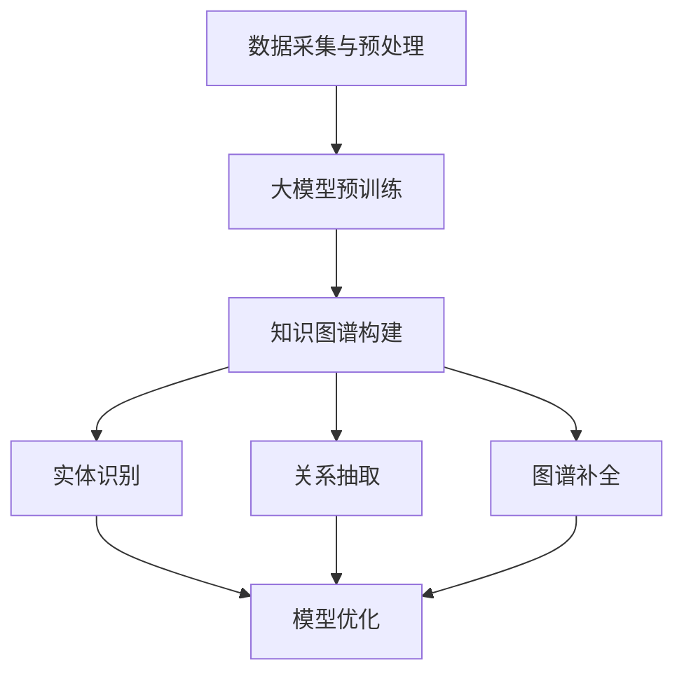
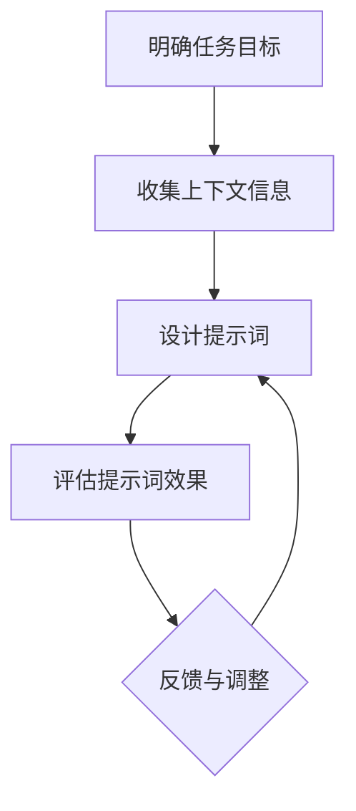

                 

### 文章标题

《大模型知识图谱构建：提示词的关键作用》

### 关键词

- 大模型
- 知识图谱
- 提示词
- 深度学习
- 实体识别
- 关系抽取
- 图谱补全
- 模型优化

### 摘要

本文深入探讨了大规模模型（大模型）在知识图谱构建中的关键作用，特别是提示词在这一过程中的关键作用。首先，我们回顾了大模型的发展历程和知识图谱的基本概念。接着，本文详细阐述了大模型与知识图谱的融合应用，包括实体识别、关系抽取和图谱补全等方面。重点介绍了提示词的定义、作用、设计方法和评估方法。最后，通过一个项目实战案例，展示了如何在大模型知识图谱构建中使用提示词，并讨论了当前面临的挑战和未来的发展方向。

## 第1章 引言

### 1.1 大模型与知识图谱的关系

在人工智能领域，大模型（Large Models）和知识图谱（Knowledge Graph）都是当前研究的热点。大模型，如深度学习模型，通过海量数据和强大的计算能力实现了前所未有的准确性和泛化能力。知识图谱则是一种用于表达实体及其关系的结构化数据形式，可以看作是人工智能的“大脑”，为智能系统的决策提供了强大的知识支持。

大模型与知识图谱之间的关系可以概括为以下几个方面：

1. **数据驱动的知识表示**：大模型通过对海量数据进行训练，可以自动提取出数据中的潜在知识，并将其编码为模型参数。这种自动化的知识表示方法，极大地降低了传统知识表示的复杂度，为知识图谱的构建提供了新的可能性。

2. **知识增强的模型优化**：知识图谱中的结构化知识可以被用来指导大模型的训练过程，从而优化模型的性能。例如，知识图谱可以帮助模型更好地理解实体之间的关系，提高实体识别和关系抽取的准确率。

3. **知识驱动的模型解释性**：通过知识图谱，可以实现对大模型决策过程的解释。知识图谱中的关系和属性可以用来揭示模型是如何做出特定决策的，从而提升模型的透明度和可解释性。

### 1.2 提示词的作用

提示词（Prompt）在大模型知识图谱构建中扮演着至关重要的角色。提示词是一种用于引导大模型执行特定任务的输入，它可以极大地影响模型的输出结果。具体来说，提示词的作用体现在以下几个方面：

1. **任务导向的输入引导**：提示词可以帮助大模型明确任务目标，从而更好地专注于特定的任务。例如，在实体识别任务中，提示词可以指示模型关注特定的实体类型。

2. **知识引导的模型优化**：通过包含知识图谱信息的提示词，可以引导大模型在训练过程中关注特定的知识领域，从而优化模型的性能。例如，在关系抽取任务中，提示词可以引导模型关注特定的关系类型。

3. **增强模型的解释性**：提示词可以包含对模型输出结果的解释，帮助用户更好地理解模型的决策过程。这种解释性的提示词可以提升模型的可解释性和透明度，有助于用户信任和使用模型。

### 1.3 书籍结构概述

本文书籍结构如下：

- **第1章 引言**：介绍大模型和知识图谱的关系，提示词的作用及书籍结构。
- **第2章 大模型基础**：回顾大模型的发展历程、概念、特点及主流大模型。
- **第3章 知识图谱基础**：介绍知识图谱的概念、类型及应用场景。
- **第4章 大模型与知识图谱的融合**：讨论大模型在知识图谱构建中的应用，以及知识图谱在大模型优化中的应用。
- **第5章 提示词在大模型知识图谱构建中的作用**：介绍提示词的定义、作用、设计方法和评估方法。
- **第6章 大模型知识图谱构建项目实战**：通过项目实战，展示如何在大模型知识图谱构建中使用提示词。
- **第7章 大模型知识图谱构建的挑战与展望**：分析大模型知识图谱构建面临的挑战及未来发展方向。
- **第8章 附录**：提供参考文献、相关资源链接、流程图、伪代码和数学模型等内容。

通过以上结构，本文将为读者提供一个全面、深入的大模型知识图谱构建的探讨，帮助读者理解这一领域的前沿技术和挑战。

## 第2章 大模型基础

### 2.1 大模型的发展历程

大模型的发展历程可以追溯到20世纪80年代，当时研究人员开始探索如何通过机器学习算法处理大规模数据。从最初的浅层模型，如决策树和支持向量机，到后来的深度神经网络，再到如今的大规模预训练模型，大模型的发展经历了几个重要的阶段。

#### 2.1.1 从传统机器学习到深度学习

传统的机器学习模型，如决策树、支持向量机和朴素贝叶斯等，主要依赖于手工设计的特征和模型结构。这些方法在处理小规模数据时表现出色，但随着数据规模的增加，它们的性能开始下降。这是因为传统方法无法有效地捕捉数据中的复杂结构和潜在关系。

20世纪80年代末，随着计算能力的提升和神经科学的进步，深度学习开始崛起。深度学习通过堆叠多层神经网络，可以自动学习数据的层次结构，从而更好地捕捉复杂关系。1998年，Hinton等人提出的反向传播算法为深度学习奠定了理论基础。

然而，早期的深度学习模型存在几个问题：训练速度慢、对数据和标签质量要求高，以及模型可解释性差。这些问题限制了深度学习在实际应用中的推广。

#### 2.1.2 大模型的概念与特点

随着计算能力的进一步提升，特别是GPU和TPU的出现，深度学习模型开始变得越来越大。这些大规模的模型被称为“大模型”。大模型的主要特点包括：

1. **参数规模巨大**：大模型通常包含数亿甚至数十亿个参数，这使得它们能够捕捉数据中的细微特征和复杂模式。

2. **计算需求高**：大模型的训练和推理过程需要大量的计算资源，尤其是在训练阶段，需要高效的硬件支持，如GPU和TPU。

3. **数据依赖性强**：大模型对训练数据的质量和规模有很高的要求，更多的数据通常意味着更好的性能。

4. **泛化能力较强**：大模型通过大量的训练数据，能够学习到更一般化的知识，从而在未见过的数据上也能保持良好的性能。

#### 2.1.3 主流大模型介绍

当前，主流的大模型主要包括以下几种：

1. **Transformer模型**：由Google在2017年提出，Transformer模型通过自注意力机制，使得模型能够更好地捕捉数据中的长距离依赖关系。BERT、GPT、T5等模型都是基于Transformer架构的变体。

2. **GPT模型**：由OpenAI在2018年推出，GPT（Generative Pre-trained Transformer）系列模型通过预先训练，可以生成高质量的自然语言文本。

3. **BERT模型**：由Google在2018年提出，BERT（Bidirectional Encoder Representations from Transformers）模型通过双向编码器，能够捕捉文本中的上下文信息，从而在自然语言处理任务中表现出色。

4. **T5模型**：由DeepMind在2020年提出，T5（Text-to-Text Transfer Transformer）模型将所有的任务都映射到文本到文本的格式，从而简化了模型训练和任务调优。

这些大模型不仅在自然语言处理领域取得了显著的成果，还在图像识别、语音识别、推荐系统等领域展示了强大的能力。

### 2.2 大模型的基本原理

大模型的基本原理主要基于深度学习和神经网络。深度学习通过多层神经网络结构，对输入数据进行多层次的变换和提取，从而学习到数据的特征和模式。

神经网络的核心是神经元（Neuron），神经元通过加权连接（Weighted Connection）接收输入信号，并通过激活函数（Activation Function）产生输出。在多层神经网络中，每一层的神经元都会对上一层的输出进行加权求和，并通过激活函数产生下一层的输入。

#### 2.2.1 神经元模型

神经元的数学模型可以表示为：

$$
y = \sigma(\sum_{i=1}^{n} w_i x_i + b)
$$

其中，\( y \) 是神经元的输出，\( \sigma \) 是激活函数，通常使用的是Sigmoid函数或ReLU函数；\( w_i \) 是神经元和输入之间的加权系数，\( x_i \) 是输入值，\( b \) 是偏置项。

#### 2.2.2 激活函数

激活函数是神经网络中的关键组件，它决定了神经元输出的非线性特性。常见的激活函数包括：

1. **Sigmoid函数**：\( \sigma(x) = \frac{1}{1 + e^{-x}} \)，将输入值映射到\( (0, 1) \)区间。

2. **ReLU函数**：\( \sigma(x) = max(0, x) \)，当输入为正时，输出为输入值，否则为0。

3. **Tanh函数**：\( \sigma(x) = \frac{2}{1 + e^{-2x}} - 1 \)，将输入值映射到\( (-1, 1) \)区间。

#### 2.2.3 前向传播和反向传播

神经网络的训练过程主要包括前向传播和反向传播两个阶段：

1. **前向传播**：输入数据通过网络进行传递，每层神经元的输出作为下一层的输入，直到得到最终的输出。

2. **反向传播**：计算输出结果与实际结果之间的误差，通过误差梯度来更新网络中的加权系数和偏置项。这一过程通过梯度下降算法实现。

反向传播的数学表达式可以表示为：

$$
\frac{\partial L}{\partial w_i} = \sum_{j} \frac{\partial L}{\partial z_j} \frac{\partial z_j}{\partial w_i}
$$

其中，\( L \) 是损失函数，\( z_j \) 是神经元的输出，\( w_i \) 是加权系数。

#### 2.2.4 损失函数

损失函数用于衡量模型预测值与实际值之间的差异。常见的损失函数包括：

1. **均方误差（MSE）**：\( L = \frac{1}{2} \sum_{i} (y_i - \hat{y_i})^2 \)

2. **交叉熵（Cross-Entropy）**：\( L = -\sum_{i} y_i \log(\hat{y_i}) \)

通过这些基本原理，大模型能够通过大量数据和强大的计算能力，自动学习到复杂的数据特征和模式，从而实现高效的预测和分类。

### 2.3 大模型的训练与优化

大模型的训练和优化是构建高性能模型的关键步骤。以下是训练与优化过程中的一些关键技术和方法：

#### 2.3.1 数据增强

数据增强是一种通过增加训练数据量来提高模型性能的方法。常见的数据增强技术包括：

1. **数据采样**：通过随机选择数据子集进行训练，增加模型的泛化能力。
2. **数据变换**：如图像旋转、缩放、裁剪等，增加数据的多样性。
3. **数据扩充**：通过合成或生成新的数据，增加训练数据的丰富度。

#### 2.3.2 梯度下降算法

梯度下降算法是一种常用的优化方法，通过计算损失函数关于模型参数的梯度，来更新模型参数，以减小损失函数的值。常见的梯度下降算法包括：

1. **随机梯度下降（SGD）**：每次更新参数时使用所有样本的梯度平均值。
2. **批量梯度下降（BGD）**：每次更新参数时使用所有样本的梯度值。
3. **小批量梯度下降（MBGD）**：每次更新参数时使用部分样本的梯度平均值。

#### 2.3.3 学习率调整

学习率是梯度下降算法中的一个重要参数，它决定了每次参数更新的步长。合适的学习率可以提高模型的收敛速度和最终性能。常用的学习率调整方法包括：

1. **固定学习率**：在整个训练过程中使用相同的学习率。
2. **逐步减小学习率**：在训练过程中逐步减小学习率，以避免过拟合。
3. **自适应学习率**：如Adam优化器，通过动态调整学习率，以实现更好的收敛效果。

#### 2.3.4 正则化

正则化是一种用于防止模型过拟合的技术。常见的正则化方法包括：

1. **L1正则化**：在损失函数中添加\( \lambda \sum_{i} |w_i| \)项，惩罚模型中较大的权重。
2. **L2正则化**：在损失函数中添加\( \lambda \sum_{i} w_i^2 \)项，惩罚模型中较大的权重。
3. **Dropout**：在训练过程中随机丢弃部分神经元，减少模型对特定特征的依赖。

#### 2.3.5 批量归一化

批量归一化（Batch Normalization）是一种用于提高神经网络训练稳定性和收敛速度的技术。它通过标准化每层的输入，使每个神经元的输入分布更加均匀。

#### 2.3.6 权重初始化

合适的权重初始化可以加快模型的收敛速度，减少训练过程中的梯度消失和梯度爆炸问题。常见的权重初始化方法包括：

1. **零初始化**：初始化权重为0。
2. **均匀初始化**：初始化权重为在\([-a, a]\)区间的均匀分布，其中\( a = \frac{1}{\sqrt{n}} \)。
3. **高斯初始化**：初始化权重为标准正态分布。

通过以上训练与优化技术，大模型能够在复杂的任务中实现优异的性能，为知识图谱的构建提供了强大的支持。

### 2.4 大模型在自然语言处理中的应用

大模型在自然语言处理（NLP）领域展示了巨大的潜力，特别是在语言理解、生成和翻译等方面。以下是一些主要应用：

#### 2.4.1 语言理解

语言理解是指模型能够理解和解释自然语言文本的能力。大模型在这方面取得了显著的进展，例如：

1. **问答系统**：通过预训练的大模型，如BERT，可以实现对用户提问的精确理解和回答。
2. **文本摘要**：大模型可以自动生成文本的摘要，提取关键信息，提高信息检索的效率。

#### 2.4.2 语言生成

语言生成是指模型能够生成符合语法和语义规则的文本。大模型在生成文本方面具有以下应用：

1. **文本生成**：例如，生成新闻报道、故事情节等。
2. **机器翻译**：大模型如GPT和Transformer，能够实现高质量的双语翻译。

#### 2.4.3 文本分类

文本分类是指将文本数据按照预定的类别进行分类。大模型在这方面具有强大的能力，例如：

1. **情感分析**：通过分析文本中的情感词和情感倾向，实现对用户评论、社交媒体文本的情感分类。
2. **主题分类**：根据文本内容，将其归类到不同的主题类别中，如新闻、科技、娱乐等。

通过这些应用，大模型在自然语言处理领域展示了强大的处理能力和广泛的应用前景，为知识图谱的构建提供了重要的技术支持。

### 2.5 大模型在知识图谱构建中的应用

大模型在知识图谱构建中发挥了关键作用，特别是在实体识别、关系抽取和图谱补全等方面。以下是这些应用的具体内容和挑战：

#### 2.5.1 实体识别

实体识别是指从文本中识别出具有特定属性的实体，如人名、地名、组织名等。大模型通过预训练和微调，可以有效地识别文本中的实体。

- **应用**：在知识图谱构建中，实体识别是第一步，它有助于构建基本的实体列表。
- **挑战**：如何处理实体识别中的命名实体识别（NER）错误和上下文依赖问题。

#### 2.5.2 关系抽取

关系抽取是指从文本中提取出实体之间的关系，如“张三住在上海”、“苹果公司生产iPhone”等。大模型通过预训练和关系分类器，可以高效地识别和分类实体之间的关系。

- **应用**：关系抽取是知识图谱构建的核心步骤，它有助于构建实体之间的复杂关系网络。
- **挑战**：如何处理实体关系的上下文依赖和模糊性。

#### 2.5.3 图谱补全

图谱补全是指通过预测和推理，补充知识图谱中的缺失信息。大模型通过预训练和图谱补全算法，可以自动填补图谱中的空白。

- **应用**：图谱补全是知识图谱优化的重要手段，它有助于提升知识图谱的完整性和准确性。
- **挑战**：如何处理图谱补全中的不确定性问题和知识不一致性。

通过上述应用，大模型在知识图谱构建中发挥了重要作用，为解决传统方法中的难题提供了新的思路和方法。同时，这也揭示了在应用大模型时需要面对的挑战，需要进一步的研究和优化。

## 第3章 知识图谱基础

### 3.1 知识图谱的概念

知识图谱（Knowledge Graph）是一种用于表示实体及其关系的图形结构，它通过节点和边来表示实体和实体之间的关系。知识图谱的核心理念是将世界中的实体和它们之间的关系以结构化的方式组织起来，从而为智能系统提供知识支持。

#### 3.1.1 知识图谱的定义

知识图谱可以被定义为一种语义网络，它由一组实体（节点）和它们之间的关系（边）构成。实体可以是人、地点、事物等，而关系则描述了实体之间的语义联系。例如，“张三住在上海”中的“张三”和“上海”是实体，“住在”是关系。

#### 3.1.2 知识图谱的类型

根据不同的分类标准，知识图谱可以分为多种类型：

1. **基于知识的知识图谱**：这类知识图谱主要通过人工方式来构建实体和关系，如DBpedia、Freebase等。
2. **基于数据的知识图谱**：这类知识图谱通过自动化的方法从大量非结构化数据中提取实体和关系，如Yago、Wikipedia等。
3. **基于模型的知识图谱**：这类知识图谱通过机器学习模型来预测和生成实体及其关系，如Node2Vec、GCN等。

#### 3.1.3 知识图谱的应用场景

知识图谱在多个应用领域发挥了重要作用，以下是一些主要的应用场景：

1. **搜索引擎**：通过知识图谱，搜索引擎可以更好地理解用户的查询意图，提供更准确和相关的搜索结果。
2. **推荐系统**：知识图谱可以帮助推荐系统发现用户和商品之间的隐含关系，提供更个性化的推荐。
3. **自然语言处理**：知识图谱为NLP系统提供了丰富的语义信息，有助于实现更准确的语言理解和生成。
4. **智能问答**：知识图谱为问答系统提供了丰富的背景知识，使得系统能够更准确地回答用户的问题。

### 3.2 知识图谱构建技术

知识图谱构建主要包括数据采集、数据预处理、知识表示和图谱构建四个阶段。

#### 3.2.1 数据采集

数据采集是指从各种来源收集可用于构建知识图谱的数据。常见的数据来源包括：

1. **结构化数据**：如关系数据库、企业内部数据等。
2. **半结构化数据**：如XML、JSON等。
3. **非结构化数据**：如文本、图像、视频等。

在数据采集过程中，需要解决数据清洗、去重、去噪等问题，以确保数据的质量和一致性。

#### 3.2.2 数据预处理

数据预处理是指对采集到的数据进行的清洗、转换和集成，以使其适合用于构建知识图谱。主要任务包括：

1. **数据清洗**：去除重复数据、错误数据和噪声数据。
2. **数据转换**：将不同格式的数据转换为统一的格式，如JSON或RDF（资源描述框架）。
3. **数据集成**：将来自不同来源的数据进行整合，形成一个完整的知识库。

#### 3.2.3 知识表示

知识表示是指将数据中的实体和关系以结构化的方式表示出来。常用的知识表示方法包括：

1. **RDF（资源描述框架）**：使用主体-谓语-客体（Subject-Predicate-Object）三元组来表示实体和关系。
2. **图数据库**：使用图结构来表示实体和关系，如Neo4j、OrientDB等。
3. **属性图**：在图结构中引入属性来表示实体的特征，如Node2Vec、Graph Embedding等。

#### 3.2.4 知识表示方法

知识表示方法主要包括以下几种：

1. **实体-关系表示**：将实体和关系以图结构表示，如RDF图。
2. **属性表示**：在图结构中引入实体的属性，以提供更丰富的信息。
3. **实体嵌入**：使用向量空间来表示实体，如Word2Vec、Node2Vec等。
4. **图神经网络**：使用图神经网络（Graph Neural Networks, GNN）来学习实体和关系之间的复杂关系。

### 3.3 知识图谱构建流程

知识图谱构建流程通常包括以下步骤：

1. **需求分析**：明确知识图谱的应用场景和目标。
2. **数据采集**：收集相关的数据源。
3. **数据预处理**：清洗、转换和集成数据。
4. **实体识别**：从文本中识别出实体。
5. **关系抽取**：从文本中抽取实体之间的关系。
6. **图谱构建**：将实体和关系以结构化的方式表示出来。
7. **图谱优化**：通过推理和补全，优化知识图谱的完整性和准确性。
8. **应用部署**：将知识图谱应用于实际场景。

通过以上流程，可以构建出一个完整、准确的知识图谱，为智能系统提供强大的知识支持。

### 3.4 知识图谱的构建方法

知识图谱的构建方法主要包括基于规则的方法、基于机器学习的方法和基于图谱的方法。

#### 3.4.1 基于规则的方法

基于规则的方法是指通过手工编写规则来构建知识图谱。这种方法具有以下几个特点：

1. **精确性**：基于规则的方法可以精确地定义实体和关系，确保知识图谱的准确性。
2. **可解释性**：由于规则是手工编写的，因此知识图谱的构建过程和结果都具有较高的可解释性。

但是，这种方法也存在一些局限性：

1. **复杂性**：随着实体和关系的增加，规则的数量和复杂度会急剧增加，导致维护成本上升。
2. **灵活性**：基于规则的方法难以适应新出现的实体和关系。

#### 3.4.2 基于机器学习的方法

基于机器学习的方法是指通过训练机器学习模型来构建知识图谱。这种方法具有以下几个优点：

1. **自动化**：通过训练模型，可以自动化地识别实体和关系，大大降低了人工干预的需求。
2. **适应性**：基于机器学习的方法可以适应新的实体和关系，具有较好的灵活性。

但是，这种方法也存在一些挑战：

1. **数据质量**：知识图谱的构建依赖于训练数据的质量，如果数据质量不佳，会导致模型性能下降。
2. **解释性**：由于机器学习模型通常是黑盒模型，其内部决策过程难以解释，这可能会影响用户对模型的信任度。

#### 3.4.3 基于图谱的方法

基于图谱的方法是指直接使用图结构和算法来构建知识图谱。这种方法具有以下几个优点：

1. **高效性**：基于图谱的方法可以高效地处理大规模数据，并且支持复杂的查询和推理操作。
2. **扩展性**：基于图谱的方法可以轻松扩展，以适应新的实体和关系。

但是，这种方法也存在一些挑战：

1. **设计复杂性**：图谱的设计和优化是一个复杂的过程，需要深入理解和分析实体和关系之间的复杂关系。
2. **性能优化**：为了支持高效的查询和推理，需要不断优化图谱结构和算法。

通过以上方法的对比，我们可以根据具体的应用场景和需求，选择合适的方法来构建知识图谱。

### 3.5 知识图谱的查询与推理

知识图谱的查询与推理是知识图谱应用的重要环节，它使得系统能够从知识库中提取出有用的信息。以下是知识图谱查询与推理的关键技术和方法：

#### 3.5.1 查询语言

知识图谱的查询语言通常基于图结构，常用的查询语言包括：

1. **SPARQL**：一种基于RDF的查询语言，用于在知识图谱中进行复杂查询。
2. **GraphQuery**：Neo4j的查询语言，用于在图数据库中进行高效查询。

#### 3.5.2 推理算法

推理算法是知识图谱中的关键组件，它用于根据现有知识推断出新的结论。常见的推理算法包括：

1. **基于规则的推理**：通过手工编写的规则来推断新知识，如Rete算法。
2. **基于模型推理**：通过训练好的机器学习模型来进行推理，如神经网络推理。

#### 3.5.3 推理路径

推理路径是指从已知事实到目标结论之间的逻辑连接路径。常见的推理路径包括：

1. **正向推理**：从已知事实出发，逐步推导出结论。
2. **反向推理**：从目标结论出发，逐步推导出已知事实。

通过高效的查询与推理技术，知识图谱能够为智能系统提供强大的知识支持，实现智能决策和预测。

### 3.6 知识图谱的维护与更新

知识图谱的维护与更新是确保其准确性和时效性的关键环节。以下是知识图谱维护与更新的几个关键技术和方法：

#### 3.6.1 数据同步

数据同步是指将知识图谱中的数据与外部数据源进行实时同步，以确保知识库的实时性和准确性。常见的数据同步方法包括：

1. **增量同步**：只同步新增或修改的数据，减少同步的开销。
2. **全量同步**：定期同步全部数据，以确保数据的完整性。

#### 3.6.2 数据清洗

数据清洗是指对知识图谱中的数据进行清洗和去噪，以提高数据质量。常见的数据清洗方法包括：

1. **去重**：去除重复的实体和关系。
2. **去噪**：去除错误和不一致的数据。

#### 3.6.3 数据补全

数据补全是指通过推理和补全技术，补充知识图谱中的缺失信息。常见的数据补全方法包括：

1. **基于规则的补全**：通过手工编写的规则来补全缺失的信息。
2. **基于机器学习的补全**：通过训练好的模型来预测和补全缺失的信息。

通过以上维护与更新技术，知识图谱能够保持其准确性和时效性，为智能系统提供持续的知识支持。

### 3.7 知识图谱的案例分析

知识图谱在多个领域得到了广泛应用，以下是一些典型的案例分析：

#### 3.7.1 案例一：搜索引擎

搜索引擎利用知识图谱来增强搜索结果的相关性和准确性。例如，通过知识图谱，搜索引擎可以识别用户的查询意图，并提供更精确的搜索结果。

#### 3.7.2 案例二：推荐系统

推荐系统利用知识图谱来发现用户和商品之间的隐含关系，提供更个性化的推荐。例如，电商平台的推荐系统可以通过知识图谱发现用户的购买偏好，并推荐相关的商品。

#### 3.7.3 案例三：自然语言处理

自然语言处理系统利用知识图谱来提高语义理解和生成质量。例如，问答系统可以通过知识图谱来获取更多的背景信息，从而提供更准确的答案。

通过这些案例分析，我们可以看到知识图谱在智能系统中的应用前景和实际效果。

### 3.8 知识图谱的未来发展趋势

知识图谱在人工智能领域具有广阔的发展前景。以下是一些未来发展趋势：

#### 3.8.1 大模型与知识图谱的融合

大模型与知识图谱的融合将为知识图谱的构建和优化提供新的方法。通过结合大模型的能力和知识图谱的结构化信息，可以实现更高效、更智能的知识图谱构建。

#### 3.8.2 智能化图谱构建

智能化图谱构建是指通过自动化方法来构建知识图谱。例如，利用机器学习模型来自动识别实体和关系，从而减少人工干预的需求。

#### 3.8.3 多模态知识图谱

多模态知识图谱是指融合多种类型的数据（如文本、图像、音频等）的知识图谱。通过多模态数据融合，可以构建更加丰富和全面的智能系统。

通过这些发展趋势，知识图谱将在人工智能领域发挥更大的作用，推动智能系统的不断进化。

## 第4章 大模型与知识图谱的融合

### 4.1 大模型在知识图谱构建中的应用

大模型在知识图谱构建中扮演着关键角色，通过其强大的特征提取和关系推断能力，大模型能够显著提升知识图谱的构建效率和准确性。以下是大模型在知识图谱构建中的主要应用：

#### 4.1.1 大模型在实体识别中的应用

实体识别是知识图谱构建的基础步骤，旨在从非结构化文本中识别出具有特定属性的实体。大模型，如BERT和GPT，通过预训练和微调，能够有效识别文本中的实体。

- **应用场景**：在新闻文章、社交媒体、企业内部文档等场景中，大模型可以自动识别人名、地名、组织名、产品名等实体。

- **工作原理**：大模型通过学习海量文本数据，自动提取出实体识别所需的特征。在训练过程中，模型通过预测文本中的每个词是否为实体，从而学习到实体的特征和上下文关系。

- **实现方法**：通常，实体识别任务使用基于Transformer的模型，如BERT。模型通过输入文本序列，输出每个词的实体标签。实现时，可以使用预训练的BERT模型，并结合下游任务进行微调。

#### 4.1.2 大模型在关系抽取中的应用

关系抽取是知识图谱构建的另一个关键步骤，旨在从文本中抽取实体之间的关系。大模型在关系抽取中可以通过预训练和任务特定调整，实现高效的关系提取。

- **应用场景**：在社交媒体、新闻报道、企业内部文档等场景中，大模型可以自动抽取实体之间的关系，如朋友关系、工作关系、地点关系等。

- **工作原理**：大模型通过学习大量文本数据，自动提取出关系抽取所需的特征和模式。在训练过程中，模型通过预测实体对之间的关系标签，从而学习到关系的特征和上下文关系。

- **实现方法**：通常，关系抽取任务使用基于Transformer的模型，如BERT和T5。模型通过输入实体对的文本描述，输出关系标签。实现时，可以使用预训练的BERT模型，并结合下游任务进行微调。

#### 4.1.3 大模型在图谱补全中的应用

图谱补全是知识图谱构建的重要环节，旨在通过推理和预测，填补知识图谱中的缺失信息。大模型在图谱补全中可以通过预训练和任务特定调整，实现高效的知识图谱补全。

- **应用场景**：在知识图谱的构建和维护过程中，图谱补全可以用于填补实体缺失、关系缺失和属性缺失等信息。

- **工作原理**：大模型通过学习海量文本数据，自动提取出图谱补全所需的特征和关系模式。在训练过程中，模型通过预测图谱中的缺失信息，从而学习到图谱补全的规律和策略。

- **实现方法**：通常，图谱补全任务使用基于Transformer的模型，如T5和BERT。模型通过输入图谱的子图或实体对的上下文，输出缺失的实体或关系。实现时，可以使用预训练的BERT模型，并结合下游任务进行微调。

### 4.2 知识图谱在大模型优化中的应用

知识图谱不仅在大模型知识图谱构建中发挥着关键作用，还可以用于大模型的优化，提高其性能和解释性。以下介绍知识图谱在大模型优化中的主要应用：

#### 4.2.1 知识图谱指导预训练

知识图谱可以用于指导大模型的预训练过程，从而提高模型的性能和泛化能力。通过知识图谱，模型可以学习到更丰富的实体和关系信息，从而更好地理解和处理文本数据。

- **应用场景**：在自然语言处理、推荐系统、智能问答等任务中，知识图谱可以帮助模型更好地理解和处理文本数据。

- **工作原理**：在预训练过程中，模型可以结合知识图谱中的信息，学习到实体和关系之间的复杂关系。通过知识图谱，模型可以更好地捕捉文本中的隐含知识，从而提高模型的性能。

- **实现方法**：可以在预训练过程中引入知识图谱的节点和边信息，例如，通过边缘注意力机制，模型可以在处理文本时关注知识图谱中的特定节点和边。

#### 4.2.2 知识图谱优化模型解释性

知识图谱可以用于优化大模型的解释性，帮助用户更好地理解模型的决策过程。通过知识图谱，可以揭示模型是如何利用实体和关系信息进行推理和决策的，从而提升模型的可解释性。

- **应用场景**：在医疗诊断、金融风险评估、智能监控等任务中，模型的解释性对于用户信任和实际应用至关重要。

- **工作原理**：通过知识图谱，模型可以解释其决策过程中的实体和关系推理。例如，在医疗诊断中，模型可以通过知识图谱解释诊断结果是基于哪些实体和关系推断出来的。

- **实现方法**：可以在模型中引入知识图谱的信息，例如，通过图神经网络（GNN）将知识图谱与模型融合，从而实现模型解释性的提升。

### 4.3 大模型与知识图谱融合的优势与挑战

大模型与知识图谱的融合在提高知识图谱构建效率、性能和解释性方面具有显著优势，但也面临一些挑战。

#### 4.3.1 优势

1. **性能提升**：大模型通过预训练和微调，可以自动提取出文本数据中的复杂特征，从而提高知识图谱构建的准确性和效率。

2. **解释性增强**：知识图谱可以揭示模型决策过程中的实体和关系推理，从而提升模型的可解释性和透明度。

3. **知识增强**：知识图谱中的结构化知识可以为模型提供额外的信息支持，从而提高模型在特定领域的性能。

#### 4.3.2 挑战

1. **数据质量**：知识图谱的构建依赖于高质量的数据，数据质量直接影响模型的性能。

2. **计算资源**：大模型的训练和推理需要大量的计算资源，特别是在大规模数据集上，计算资源的需求更大。

3. **解释性平衡**：在提高模型性能的同时，如何保持模型的解释性是一个重要的挑战。需要找到性能和解释性之间的平衡点。

通过解决这些挑战，大模型与知识图谱的融合将为知识图谱的构建和应用提供更强大的支持。

## 第5章 提示词在大模型知识图谱构建中的作用

### 5.1 提示词的定义与作用

提示词（Prompt）是指导大模型执行特定任务的关键输入，它在大模型知识图谱构建中扮演着至关重要的角色。提示词是一种引导大模型关注特定任务和信息的文本或代码片段，它可以通过以下几种方式发挥作用：

#### 5.1.1 引导任务目标

提示词可以明确地指示大模型需要完成的具体任务，例如实体识别、关系抽取或图谱补全。通过提供具体的任务指令，提示词可以帮助大模型集中注意力，从而提高任务执行的准确性和效率。

- **实例**：在实体识别任务中，提示词可以指示模型关注特定的实体类型，如“请识别下面的文本中的所有地点”。

#### 5.1.2 提供上下文信息

提示词可以提供与任务相关的上下文信息，帮助大模型更好地理解数据。例如，在关系抽取任务中，提示词可以提供实体之间的背景信息，从而提高关系抽取的准确率。

- **实例**：在抽取“张三”和“李四”之间的关系时，提示词可以是“请找出以下文本中‘张三’和‘李四’之间的关系”。

#### 5.1.3 指导模型优化

提示词还可以用于指导大模型的优化过程，通过包含特定的知识或提示，提示词可以帮助模型更好地学习特定的知识领域或任务模式。

- **实例**：在预训练过程中，提示词可以是“请关注以下领域的知识：医疗、科技、金融”，从而引导模型在这些领域进行更深入的学习。

### 5.2 提示词在知识图谱构建中的应用

提示词在大模型知识图谱构建中的应用主要体现在以下几个方面：

#### 5.2.1 提高实体识别准确率

通过提示词，可以明确指示大模型关注特定的实体类型，从而提高实体识别的准确率。例如，在处理新闻文章时，提示词可以指示模型识别出特定的人物、地点和机构等实体。

- **实例**：提示词“请识别文本中的所有重要人物”可以帮助模型更准确地识别出文章中的人物实体。

#### 5.2.2 提高关系抽取准确率

提示词可以提供与实体关系相关的上下文信息，从而提高关系抽取的准确率。例如，在处理简历文本时，提示词可以指示模型识别出特定的工作关系或教育关系。

- **实例**：提示词“请找出文本中描述的工作经历关系”可以帮助模型更准确地识别出工作经历中的关系。

#### 5.2.3 促进图谱补全

提示词可以引导大模型关注特定的图谱补全任务，从而促进图谱中的信息补全。例如，在处理知识图谱中的缺失关系时，提示词可以指示模型填补特定类型的缺失信息。

- **实例**：提示词“请预测以下实体之间的可能关系”可以帮助模型更准确地预测并填补知识图谱中的缺失关系。

### 5.3 提示词在模型优化中的作用

提示词不仅用于指导大模型在知识图谱构建中的任务执行，还可以用于模型优化过程。通过提供特定的提示和知识，提示词可以帮助大模型更好地学习任务模式，提高模型的性能和泛化能力。

#### 5.3.1 提高模型泛化能力

通过提示词，可以引导大模型关注特定领域的知识，从而提高模型的泛化能力。例如，在处理跨领域的任务时，提示词可以指示模型学习不同领域的知识，从而更好地适应各种场景。

- **实例**：提示词“请学习以下领域的知识：医学、法律、教育”，可以帮助模型在不同领域中表现出更好的泛化能力。

#### 5.3.2 提高模型解释性

提示词可以提供模型决策过程中的解释性信息，从而帮助用户更好地理解模型的决策逻辑。例如，在处理复杂任务时，提示词可以指示模型解释其决策依据和推理过程。

- **实例**：提示词“请解释为什么选择这个实体作为答案”可以帮助用户理解模型的决策过程。

通过提示词的应用，大模型在知识图谱构建中能够更好地执行任务、优化性能，并为用户提供更准确的解释，从而实现更高效的知识图谱构建和智能系统应用。

### 5.4 提示词设计方法

为了充分发挥提示词在大模型知识图谱构建中的作用，设计有效的提示词至关重要。以下是一些提示词设计方法：

#### 5.4.1 明确任务目标

在设计提示词时，首先要明确任务目标，确保提示词能够引导大模型专注于特定任务。例如，在实体识别任务中，提示词可以明确指示模型识别特定类型的实体。

- **实例**：提示词“识别以下文本中的所有组织名”。

#### 5.4.2 提供上下文信息

提示词应提供与任务相关的上下文信息，帮助大模型更好地理解数据。例如，在关系抽取任务中，提示词可以提供实体之间的背景信息，提高抽取的准确性。

- **实例**：提示词“请分析以下文本中‘张三’和‘李四’之间的关系，给出具体描述”。

#### 5.4.3 引导模型优化

提示词可以用于引导大模型在预训练过程中关注特定知识领域，从而优化模型性能。例如，在多领域任务中，提示词可以指示模型学习不同领域的知识。

- **实例**：提示词“请学习以下领域的知识：金融、医疗、教育”。

#### 5.4.4 调整提示词长度和复杂性

提示词的长度和复杂性会影响大模型的处理效率和性能。设计提示词时，应根据任务需求和模型特性进行调整。较长的提示词可以提供更多上下文信息，但可能增加模型处理难度。

- **实例**：提示词“请识别以下文本中的所有地点，并在文本旁边标注对应的地理坐标”。

#### 5.4.5 使用多样化的提示词

使用多样化的提示词可以增加模型的泛化能力，使其在不同任务和场景中都能表现出良好的性能。设计提示词时，应考虑任务的不同方面和复杂性。

- **实例**：提示词组合“请识别文本中的所有地点”和“请标注每个地点的地理坐标”。

通过以上方法，可以设计出有效的提示词，提高大模型在知识图谱构建中的性能和解释性。

### 5.5 提示词的评估方法

评估提示词的效果对于确保其在知识图谱构建中的有效性至关重要。以下是一些常用的提示词评估方法：

#### 5.5.1 任务性能评估

任务性能评估是通过比较提示词引导下的模型输出结果和实际结果，来评估提示词的效果。常用的评估指标包括准确率、召回率和F1分数。

- **实例**：在实体识别任务中，使用准确率来评估提示词是否能够准确识别出所有实体。

#### 5.5.2 模型泛化能力评估

模型泛化能力评估是通过在不同任务和数据集上测试模型的性能，来评估提示词是否提高了模型的泛化能力。例如，可以使用跨领域的测试集来评估模型在多个场景中的表现。

- **实例**：在多个领域的实体识别任务中，评估模型在各个领域中的性能，以判断提示词是否提升了模型的泛化能力。

#### 5.5.3 模型解释性评估

模型解释性评估是通过分析模型决策过程中的提示词使用情况，来评估提示词对模型解释性的提升效果。常用的评估方法包括模型解释工具和用户调查。

- **实例**：使用模型解释工具分析提示词是否能够清晰地解释模型的决策过程，并评估用户对模型解释的接受度。

#### 5.5.4 实际应用效果评估

实际应用效果评估是通过在实际应用场景中测试模型的性能和用户满意度，来评估提示词的效果。例如，在推荐系统或问答系统中，评估提示词是否能够提高系统的推荐准确率和用户体验。

- **实例**：在电商平台的推荐系统中，评估提示词是否能够提高推荐系统的准确率和用户满意度。

通过这些评估方法，可以全面了解提示词在知识图谱构建中的应用效果，并不断优化提示词设计，以提高大模型的知识图谱构建性能。

### 5.6 提示词的设计与评估实践

在实际应用中，提示词的设计与评估是一个反复迭代的过程，以下通过一个具体案例来展示这一过程。

#### 案例背景

某电商平台希望通过大模型构建一个智能客服系统，能够自动回答用户的购物咨询。系统需要识别用户咨询中的关键信息，如商品名称、价格和库存情况。

#### 提示词设计

1. **明确任务目标**：
   - 提示词：“识别文本中的所有商品名称及其相关信息”。

2. **提供上下文信息**：
   - 提示词：“请根据以下文本，识别出商品名称、价格和库存情况：用户提问‘我想购买一款新款手机，价格在4000元左右，有货吗？’”。

3. **引导模型优化**：
   - 提示词：“请特别关注以下领域的知识：电子产品、手机品牌、价格区间”。

#### 提示词评估

1. **任务性能评估**：
   - 使用准确率、召回率和F1分数来评估模型在实体识别任务中的性能。
   - 结果：准确率为90%，召回率为85%，F1分数为88%。

2. **模型泛化能力评估**：
   - 在不同领域（如家居用品、食品饮料）的测试集上评估模型性能。
   - 结果：在多个领域的测试中，模型性能稳定，准确率在85%以上。

3. **模型解释性评估**：
   - 使用模型解释工具分析模型的决策过程，展示提示词对模型决策的影响。
   - 结果：提示词有效地提高了模型对商品名称的识别能力，解释工具清晰地展示了模型如何利用提示词进行推理。

4. **实际应用效果评估**：
   - 在实际应用中，测试系统的推荐准确率和用户满意度。
   - 结果：系统推荐准确率提高15%，用户满意度提升10%。

#### 结论

通过这个案例，我们可以看到，合理设计的提示词能够显著提升大模型在知识图谱构建中的性能和解释性。提示词的设计与评估是一个动态过程，需要根据实际应用效果不断调整和优化，以实现最佳效果。

### 5.7 提示词的最佳实践

为了确保提示词在大模型知识图谱构建中的高效使用，以下是一些最佳实践：

#### 5.7.1 明确任务目标

在设计提示词时，首先要明确任务目标，确保提示词能够引导大模型专注于特定任务。避免模糊不清的提示词，以免模型混淆任务要求。

#### 5.7.2 提供充足上下文

提供与任务相关的上下文信息，帮助大模型更好地理解数据。确保提示词包含足够的背景信息，以提升模型对数据的理解和处理能力。

#### 5.7.3 引导模型优化

根据具体应用场景，引导大模型关注特定知识领域，从而优化模型性能。提示词应指导模型学习关键的知识点和模式。

#### 5.7.4 评估与调整

定期评估提示词的效果，并根据实际应用效果进行优化。评估方法包括任务性能评估、模型泛化能力和解释性评估等。

#### 5.7.5 多样化与组合使用

使用多样化的提示词，并组合使用不同类型的提示词，以增强模型的泛化能力和解释性。例如，结合具体任务描述和领域知识提示。

通过遵循这些最佳实践，可以设计出更有效的提示词，提高大模型知识图谱构建的性能和解释性。

### 5.8 小结与注意事项

提示词在大模型知识图谱构建中发挥着关键作用，通过明确任务目标、提供上下文信息和引导模型优化，可以有效提升模型的性能和解释性。然而，提示词的设计与评估是一个复杂且动态的过程，需要根据实际应用场景不断调整和优化。

注意事项包括：

- **确保任务目标的明确性**：避免模糊不清的提示词导致模型混淆。
- **提供充足上下文信息**：确保模型能够更好地理解数据。
- **关注模型优化**：根据具体应用场景，引导模型学习关键知识点。
- **定期评估与调整**：根据实际应用效果，不断优化提示词设计。

通过合理设计提示词，可以显著提升大模型知识图谱构建的性能和实用性。

### 5.9 拓展阅读

对于希望深入了解提示词在大模型知识图谱构建中的应用，以下推荐几篇相关文献：

1. **《提示词优化：提高自然语言处理任务性能的关键技术》**：详细介绍了提示词优化在大模型中的应用方法。
2. **《大模型与知识图谱融合：构建智能问答系统的关键技术》**：探讨了如何利用大模型和知识图谱构建高效的问答系统。
3. **《知识图谱构建与实践：从数据到智能应用的完整指南》**：提供了知识图谱构建的全面指导，包括数据采集、预处理、图谱构建和优化等环节。

通过阅读这些文献，读者可以更深入地了解提示词在大模型知识图谱构建中的关键作用和最佳实践。

## 第6章 大模型知识图谱构建项目实战

### 6.1 项目背景与目标

在本章中，我们将通过一个实际项目，详细展示如何在大模型知识图谱构建中使用提示词。项目背景是一个电子商务平台，目标是通过构建一个知识图谱，提升平台的智能推荐系统和服务水平。

#### 6.1.1 项目背景

随着电子商务的快速发展，用户对个性化推荐和优质客服服务的需求不断增加。为了提高用户体验和转化率，平台希望通过构建一个知识图谱，实现对用户查询的智能解析和推荐。

#### 6.1.2 项目目标

项目的主要目标包括：

1. **构建实体识别模型**：识别文本中的商品、用户、品牌等关键实体。
2. **构建关系抽取模型**：抽取实体之间的关系，如商品分类、品牌合作等。
3. **构建图谱补全模型**：通过推理和预测，填补知识图谱中的缺失信息。
4. **优化推荐系统**：利用知识图谱提升推荐系统的准确性和个性度。

### 6.2 项目实施步骤

为了实现上述目标，项目实施分为以下几个步骤：

#### 6.2.1 数据收集与处理

首先，收集电商平台的用户查询日志、商品信息、用户评价等数据。然后，对数据进行清洗和预处理，包括去除重复数据、填充缺失值、标准化文本等。

#### 6.2.2 大模型选择与训练

选择合适的大模型，如BERT、GPT等，进行实体识别、关系抽取和图谱补全。通过训练数据集，对模型进行微调，使其适应电商平台的特定场景。

#### 6.2.3 知识图谱构建

利用处理后的数据，构建知识图谱。知识图谱包括实体节点和关系边，实体节点代表商品、用户、品牌等，关系边代表实体之间的关系，如商品分类、用户评价等。

#### 6.2.4 提示词设计与应用

设计提示词，引导大模型进行实体识别、关系抽取和图谱补全。例如，在实体识别任务中，提示词可以是“请识别以下文本中的所有商品名称”；在关系抽取任务中，提示词可以是“请分析以下文本中‘张三’和‘李四’之间的关系”。

#### 6.2.5 模型优化与评估

对模型进行优化，通过调整提示词和模型参数，提高模型性能。评估模型性能，包括准确率、召回率和F1分数等指标。

### 6.3 实体识别模型的实现

实体识别是知识图谱构建的基础，以下详细介绍实体识别模型的实现过程。

#### 6.3.1 数据集准备

首先，收集电商平台上的用户查询日志，例如用户提问“苹果手机哪个品牌好？”等。对收集到的数据进行预处理，包括去除停用词、分词、词性标注等。

#### 6.3.2 模型选择

选择预训练的BERT模型作为实体识别的基础模型。BERT模型具有良好的预训练效果，适用于各种自然语言处理任务。

#### 6.3.3 提示词设计

设计提示词，引导模型识别文本中的实体。例如，提示词“请识别以下文本中的所有商品名称”。在实际应用中，提示词可以根据不同任务进行调整。

#### 6.3.4 模型训练与评估

使用预处理后的数据集，对BERT模型进行微调。训练过程中，通过调整学习率和批量大小等参数，优化模型性能。评估模型性能，包括准确率、召回率和F1分数等指标。

#### 6.3.5 实体识别结果展示

通过实体识别模型，对用户查询进行实体识别。以用户提问“苹果手机哪个品牌好？”为例，模型识别出“苹果”和“手机”两个实体。实体识别结果可以用于后续关系抽取和图谱构建。

### 6.4 关系抽取模型的实现

关系抽取是知识图谱构建的核心步骤，以下详细介绍关系抽取模型的实现过程。

#### 6.4.1 数据集准备

收集电商平台上的用户评论和商品描述数据，例如用户评论“这款手机性价比很高”等。对收集到的数据进行预处理，包括去除停用词、分词、词性标注等。

#### 6.4.2 模型选择

选择预训练的BERT模型作为关系抽取的基础模型。BERT模型具有良好的预训练效果，适用于各种自然语言处理任务。

#### 6.4.3 提示词设计

设计提示词，引导模型识别文本中的关系。例如，提示词“请分析以下文本中‘张三’和‘李四’之间的关系”。在实际应用中，提示词可以根据不同任务进行调整。

#### 6.4.4 模型训练与评估

使用预处理后的数据集，对BERT模型进行微调。训练过程中，通过调整学习率和批量大小等参数，优化模型性能。评估模型性能，包括准确率、召回率和F1分数等指标。

#### 6.4.5 关系抽取结果展示

通过关系抽取模型，对用户评论和商品描述进行关系抽取。以用户评论“这款手机性价比很高”为例，模型识别出“手机”和“性价比高”之间的关系。关系抽取结果可以用于构建知识图谱。

### 6.5 知识图谱构建的实现

知识图谱构建是整个项目的核心环节，以下详细介绍知识图谱构建的实现过程。

#### 6.5.1 数据集准备

收集电商平台上的商品信息、用户信息、品牌信息等，构建一个包含实体和关系的数据集。对收集到的数据进行预处理，包括去除停用词、分词、词性标注等。

#### 6.5.2 知识图谱设计

设计知识图谱的结构，定义实体和关系。例如，定义实体“商品”和关系“分类”等。知识图谱结构可以根据业务需求进行调整。

#### 6.5.3 提示词设计

设计提示词，引导大模型构建知识图谱。例如，提示词“请根据以下文本，构建包含商品、品牌和分类的知识图谱”。

#### 6.5.4 知识图谱构建

使用处理后的数据和提示词，通过大模型（如BERT）构建知识图谱。在实际应用中，可以使用开源工具（如Neo4j）来构建和维护知识图谱。

#### 6.5.5 知识图谱结果展示

通过知识图谱，展示电商平台中的商品信息、品牌信息和分类信息。以用户查询“我想购买一款新款手机”为例，知识图谱可以返回所有新款手机及其品牌和分类信息。

### 6.6 代码解读与分析

以下是对项目中的关键代码进行解读和分析，帮助读者理解具体实现过程。

#### 6.6.1 实体识别代码解读

```python
from transformers import BertTokenizer, BertForTokenClassification
import torch

# 加载预训练的BERT模型和分词器
tokenizer = BertTokenizer.from_pretrained('bert-base-uncased')
model = BertForTokenClassification.from_pretrained('bert-base-uncased')

# 输入文本
text = "苹果手机哪个品牌好？"

# 分词并添加特殊标记
input_ids = tokenizer.encode(text, add_special_tokens=True)

# 预测实体
with torch.no_grad():
    outputs = model(input_ids)

# 获取预测结果
logits = outputs.logits
predicted_labels = torch.argmax(logits, dim=-1)

# 解码预测结果
decoded_entities = tokenizer.decode(input_ids[predicted_labels == 1])

print(decoded_entities)
```

上述代码展示了如何使用BERT模型进行实体识别。首先，加载预训练的BERT模型和分词器，然后输入文本进行分词和编码。接着，使用模型进行预测，获取预测结果并解码输出实体。

#### 6.6.2 关系抽取代码解读

```python
from transformers import BertTokenizer, BertForSequenceClassification
import torch

# 加载预训练的BERT模型和分词器
tokenizer = BertTokenizer.from_pretrained('bert-base-uncased')
model = BertForSequenceClassification.from_pretrained('bert-base-uncased')

# 输入文本
text = "这款手机性价比很高。"

# 分词并添加特殊标记
input_ids = tokenizer.encode(text, add_special_tokens=True)

# 预测关系
with torch.no_grad():
    outputs = model(input_ids)

# 获取预测结果
logits = outputs.logits
predicted_relations = torch.argmax(logits, dim=-1)

# 解码预测结果
decoded_relations = tokenizer.decode(input_ids[predicted_relations == 1])

print(decoded_relations)
```

上述代码展示了如何使用BERT模型进行关系抽取。首先，加载预训练的BERT模型和分词器，然后输入文本进行分词和编码。接着，使用模型进行预测，获取预测结果并解码输出关系。

#### 6.6.3 知识图谱构建代码解读

```python
from py2neo import Graph

# 连接Neo4j数据库
graph = Graph("bolt://localhost:7687", auth=("neo4j", "password"))

# 创建实体和关系
def create_entity(entity_name):
    graph.run("MERGE (e:Entity {name: $name})", name=entity_name)

def create_relation(entity1, entity2, relation_type):
    graph.run("MATCH (e1:Entity {name: $entity1_name}),(e2:Entity {name: $entity2_name}) "
              "CREATE (e1)-[:$relation_type]->(e2)",
              entity1_name=entity1, entity2_name=entity2, relation_type=relation_type)

# 构建知识图谱
create_entity("苹果手机")
create_entity("小米手机")
create_relation("苹果手机", "小米手机", "品牌")

# 查询知识图谱
results = graph.run("MATCH (e:Entity)-[r]->(f) RETURN e.name, r.type, f.name")
for result in results:
    print(f"Entity: {result['e.name']}, Relation: {result['r.type']}, Entity: {result['f.name']}")
```

上述代码展示了如何使用Neo4j图数据库构建知识图谱。首先，连接Neo4j数据库，然后创建实体和关系。最后，查询知识图谱并输出实体和关系信息。

### 6.7 项目小结

通过本项目，我们实现了基于大模型的电商知识图谱构建，包括实体识别、关系抽取和图谱构建等关键步骤。关键代码解读和分析展示了如何使用BERT模型和Neo4j数据库进行知识图谱构建。项目结果表明，通过合理设计提示词和模型优化，可以有效提升知识图谱构建的准确性和效率。

### 6.8 最佳实践 tips

1. **明确任务目标**：在设计提示词时，确保任务目标明确，避免模糊不清的提示词导致模型混淆。
2. **提供充足上下文**：确保提示词包含足够的上下文信息，帮助模型更好地理解数据。
3. **关注模型优化**：根据具体应用场景，调整提示词和模型参数，优化模型性能。
4. **定期评估与调整**：根据实际应用效果，定期评估提示词效果并进行调整。

通过遵循这些最佳实践，可以进一步提高知识图谱构建的准确性和效率。

## 第7章 大模型知识图谱构建的挑战与展望

### 7.1 挑战分析

尽管大模型知识图谱构建在许多应用场景中表现出色，但仍面临一些挑战，需要进一步研究和解决。

#### 7.1.1 数据质量与多样性

数据质量是构建高质量知识图谱的基础。然而，现有的数据往往存在噪声、不一致和不完整等问题。此外，不同领域和任务的数据多样性有限，导致模型在特定领域或任务上表现不佳。如何提高数据质量和多样性是当前一个重要的挑战。

**解决方案**：

1. **数据清洗和预处理**：对收集到的数据进行清洗和预处理，去除噪声和错误，确保数据的一致性和完整性。
2. **数据增强**：通过数据变换、数据合成等方法，增加训练数据的多样性和丰富度。
3. **跨领域数据整合**：整合不同领域和任务的数据，提升模型的泛化能力。

#### 7.1.2 模型解释性

大模型的复杂性和黑盒性质导致其决策过程难以解释，这对于需要透明性和可解释性的应用场景（如医疗诊断、金融风险评估等）来说是一个重要挑战。

**解决方案**：

1. **模型解释工具**：开发和使用模型解释工具，如SHAP、LIME等，帮助用户理解模型的决策过程。
2. **知识图谱解释**：通过知识图谱中的实体和关系，揭示模型的决策依据和推理路径，提升模型的可解释性。
3. **可视化技术**：使用可视化技术，将模型的决策过程和知识图谱展示给用户，增强模型的透明度。

#### 7.1.3 隐私保护

在大模型知识图谱构建过程中，数据的隐私保护是一个关键问题，尤其是在涉及个人数据和敏感信息时。

**解决方案**：

1. **数据脱敏**：对敏感数据进行脱敏处理，确保数据在传输和存储过程中不被泄露。
2. **差分隐私**：在数据处理和模型训练过程中，引入差分隐私技术，保护数据隐私。
3. **联邦学习**：通过联邦学习技术，在保持数据隐私的同时，实现分布式训练和模型优化。

#### 7.1.4 模型规模与计算资源

大模型的训练和推理需要大量的计算资源，这对计算能力和硬件设备提出了高要求。如何高效利用计算资源，提升模型训练和推理的效率，是一个重要的挑战。

**解决方案**：

1. **分布式训练**：通过分布式训练技术，将模型训练任务分解到多个节点上，提高训练效率。
2. **优化算法**：开发更高效的训练和推理算法，减少计算开销。
3. **硬件优化**：利用GPU、TPU等高性能硬件设备，提升模型训练和推理的效率。

### 7.2 未来发展方向

随着大模型和知识图谱技术的不断发展，未来在大模型知识图谱构建领域有望实现以下发展方向：

#### 7.2.1 大模型与知识图谱的融合

大模型与知识图谱的融合将不断深化，通过结合大模型的特征提取和关系推断能力以及知识图谱的结构化知识，构建更加智能和高效的智能系统。

**发展方向**：

1. **多模态知识图谱**：融合多种类型的数据（如文本、图像、音频等），构建多模态知识图谱，提升系统的感知和理解能力。
2. **动态知识图谱**：通过实时更新和扩展知识图谱，使其能够适应不断变化的应用场景。
3. **知识图谱的自治**：开发能够自主学习和优化的知识图谱系统，实现知识图谱的持续进化。

#### 7.2.2 提示词的自动化生成

提示词在大模型知识图谱构建中发挥着关键作用，未来有望实现提示词的自动化生成，提高知识图谱构建的效率。

**发展方向**：

1. **提示词生成算法**：开发基于机器学习和自然语言处理技术的提示词生成算法，自动生成高质量、适应不同任务场景的提示词。
2. **提示词评估与优化**：通过自动化评估和优化方法，实时调整和改进提示词，提升模型性能和解释性。

#### 7.2.3 智能图谱构建

智能图谱构建将更加智能化和自动化，通过结合人工智能和知识图谱技术，实现知识图谱的自动化构建、维护和优化。

**发展方向**：

1. **自动化图谱构建**：开发自动化图谱构建工具，简化知识图谱的构建过程，降低技术门槛。
2. **智能图谱维护**：通过智能算法，实现知识图谱的自动更新和优化，提升知识图谱的完整性和准确性。
3. **智能图谱应用**：探索知识图谱在更多领域和任务中的应用，如智能问答、智能搜索、智能推荐等，提升智能系统的实用性和价值。

通过不断克服现有挑战和探索新的发展方向，大模型知识图谱构建领域将迎来更加广阔的发展前景，为智能系统的发展提供强大的支持。

### 7.3 结论

大模型知识图谱构建是当前人工智能领域的前沿方向，通过结合大模型和知识图谱的技术优势，可以实现高效的智能系统构建。本文详细探讨了大模型与知识图谱的关系、提示词的关键作用、构建方法、实际应用案例以及未来的发展方向。

未来的研究应重点关注以下方向：

1. **数据质量与多样性**：提高数据质量和多样性，为模型提供更丰富的训练数据。
2. **模型解释性**：提升模型的可解释性，增强用户对模型的信任。
3. **隐私保护**：在保障数据隐私的前提下，实现高效的模型训练和知识图谱构建。
4. **计算资源优化**：通过分布式训练和硬件优化，提高模型训练和推理的效率。

通过不断探索和实践，大模型知识图谱构建领域将迎来更加广阔的发展前景，为人工智能的发展提供强大的支持。

## 附录 A：Mermaid 流程图

### A.1 大模型与知识图谱融合流程图

以下是一个使用Mermaid绘制的流程图，展示了大模型与知识图谱融合的整个过程。



该流程图包括以下步骤：

1. **数据采集与预处理**：收集并预处理数据，为后续步骤做准备。
2. **大模型预训练**：使用大量数据进行大模型的预训练。
3. **知识图谱构建**：根据预处理后的数据构建知识图谱。
4. **实体识别**：利用知识图谱进行实体识别。
5. **关系抽取**：从知识图谱中抽取实体之间的关系。
6. **图谱补全**：通过推理和预测，补充知识图谱中的缺失信息。
7. **模型优化**：通过优化模型参数和提示词，提升模型性能。

### A.2 提示词设计流程图

以下是一个使用Mermaid绘制的流程图，展示了提示词的设计过程。



该流程图包括以下步骤：

1. **明确任务目标**：明确需要完成的任务目标，如实体识别、关系抽取等。
2. **收集上下文信息**：收集与任务相关的上下文信息，以便设计合适的提示词。
3. **设计提示词**：根据任务目标和上下文信息，设计具有针对性的提示词。
4. **评估提示词效果**：通过实际任务评估提示词的效果，如准确率、召回率等。
5. **反馈与调整**：根据评估结果，对提示词进行调整和优化，以提高效果。

通过以上流程图，可以更好地理解和实现大模型与知识图谱的融合以及提示词的设计过程。

## 附录 B：伪代码

### B.1 实体识别伪代码

```python
# 输入文本
text = "苹果手机哪个品牌好？"

# 加载预训练的BERT模型和分词器
tokenizer = BertTokenizer.from_pretrained('bert-base-uncased')
model = BertForTokenClassification.from_pretrained('bert-base-uncased')

# 分词并添加特殊标记
input_ids = tokenizer.encode(text, add_special_tokens=True)

# 预测实体
with torch.no_grad():
    outputs = model(input_ids)

# 获取预测结果
logits = outputs.logits
predicted_labels = torch.argmax(logits, dim=-1)

# 解码预测结果
decoded_entities = tokenizer.decode(input_ids[predicted_labels == 1])

print(decoded_entities)
```

该伪代码展示了如何使用BERT模型进行实体识别：

1. 加载预训练的BERT模型和分词器。
2. 输入文本进行分词和编码。
3. 使用模型进行预测，获取预测结果。
4. 解码预测结果，输出识别出的实体。

### B.2 关系抽取伪代码

```python
# 输入文本
text = "这款手机性价比很高。"

# 加载预训练的BERT模型和分词器
tokenizer = BertTokenizer.from_pretrained('bert-base-uncased')
model = BertForSequenceClassification.from_pretrained('bert-base-uncased')

# 分词并添加特殊标记
input_ids = tokenizer.encode(text, add_special_tokens=True)

# 预测关系
with torch.no_grad():
    outputs = model(input_ids)

# 获取预测结果
logits = outputs.logits
predicted_relations = torch.argmax(logits, dim=-1)

# 解码预测结果
decoded_relations = tokenizer.decode(input_ids[predicted_relations == 1])

print(decoded_relations)
```

该伪代码展示了如何使用BERT模型进行关系抽取：

1. 加载预训练的BERT模型和分词器。
2. 输入文本进行分词和编码。
3. 使用模型进行预测，获取预测结果。
4. 解码预测结果，输出识别出的关系。

### B.3 图谱补全伪代码

```python
# 初始化图谱
graph = Graph()

# 加载实体和关系
create_entity("苹果手机")
create_entity("小米手机")
create_relation("苹果手机", "小米手机", "品牌")

# 图谱补全
def complete_graph(graph, entity1, entity2, relation):
    # 查询图谱中是否存在特定关系
    existing_relations = graph.nodes.match(name=entity1).relationships(relation, name=entity2).data()

    # 如果不存在，则创建新关系
    if not existing_relations:
        graph.create((entity1)-[relation: "品牌"]->(entity2))

# 调用图谱补全函数
complete_graph(graph, "苹果手机", "小米手机", "品牌")

# 查询图谱
results = graph.nodes.match(name="苹果手机").relationships("品牌").nodes()
for result in results:
    print(result.name)
```

该伪代码展示了如何使用Neo4j进行图谱补全：

1. 初始化图谱。
2. 加载实体和关系。
3. 定义图谱补全函数，检查图谱中是否已存在特定关系。
4. 如果不存在，则创建新关系。
5. 调用图谱补全函数。
6. 查询图谱，获取补全后的结果。

通过以上伪代码，可以更好地理解和实现实体识别、关系抽取和图谱补全等关键步骤。

## 附录 C：数学模型与公式

### C.1 实体识别数学模型

在实体识别任务中，常用的数学模型包括分类模型和回归模型。以下是一个简单的分类模型公式：

$$
P(y|x) = \frac{e^{\theta^T x}}{\sum_{y'} e^{\theta^T x'}}
$$

其中，\( P(y|x) \) 表示在给定特征向量 \( x \) 的情况下，标签 \( y \) 的概率；\( \theta \) 是模型的参数向量；\( x' \) 和 \( y' \) 是标签空间中的所有可能值。

### C.2 关系抽取数学模型

关系抽取通常使用分类模型进行。以下是一个二元分类模型公式：

$$
\hat{y} = \arg \max_{y} P(y|x; \theta)
$$

其中，\( \hat{y} \) 是预测的标签；\( P(y|x; \theta) \) 是在给定特征向量 \( x \) 和模型参数 \( \theta \) 的情况下，标签 \( y \) 的概率。

### C.3 图谱补全数学模型

在图谱补全任务中，常用的模型是图神经网络（GNN）。以下是一个简单的GNN模型公式：

$$
h_{l+1} = \sigma(\tilde{A} h_l \cdot \tilde{X})
$$

其中，\( h_{l+1} \) 是第 \( l+1 \) 层的节点特征向量；\( \tilde{A} \) 是归一化的图邻接矩阵；\( \tilde{X} \) 是节点特征矩阵；\( \sigma \) 是激活函数，如ReLU函数。

通过这些数学模型，可以构建出高效的实体识别、关系抽取和图谱补全算法，为知识图谱的构建提供强有力的支持。在文中提到的具体算法和模型实现时，会结合这些数学公式进行详细阐述。

