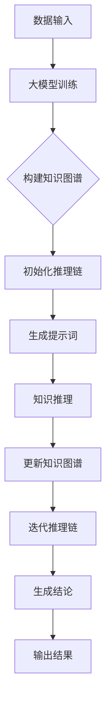
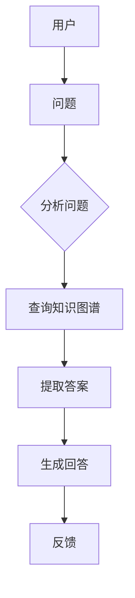

                 

### 背景介绍

在当前人工智能（AI）飞速发展的时代，大模型知识推理作为一种重要的技术手段，正日益受到广泛关注。大模型，如GPT-3、BERT和Turing等，凭借其庞大的参数量和强大的学习能力，在自然语言处理（NLP）、图像识别、语音识别等领域取得了显著成果。然而，大模型的广泛应用不仅需要强大的计算能力，更需要具备有效的知识推理能力。

知识推理是人工智能中一个关键环节，它涉及从已知信息中推导出新信息的能力。在大模型中，知识推理尤为重要，因为大模型能够处理和理解大量结构化数据和非结构化数据，从而能够更好地应用于实际场景。例如，在问答系统中，知识推理可以用于从海量数据中检索出与用户提问最相关的答案；在智能诊断系统中，知识推理可以帮助医生从患者的病史中推断出可能的诊断结果。

本文将深入探讨大模型知识推理的原理和实现方法。首先，我们会介绍知识推理的基本概念和核心要素，解释其在AI中的重要性。接着，我们将详细讨论大模型知识推理的架构，并使用Mermaid流程图展示其工作流程。然后，文章将专注于提示词的构建方法，解释如何通过有效的提示词来引导大模型进行知识推理。

接下来，我们将深入探讨知识推理链的构建和优化策略，包括构建方法、优化策略和优化伪代码。在此基础上，我们将通过实际应用案例来展示知识推理的实际效果。最后，文章将介绍知识推理的前沿技术，如深度强化学习、生成对抗网络（GAN）和元学习，以及这些技术如何进一步推动知识推理的发展。

本文旨在为读者提供一个系统、全面的知识推理技术指南，帮助理解大模型知识推理的原理和实践，并激发读者在这一领域的深入研究和创新。通过本文的阅读，读者将能够掌握大模型知识推理的核心技术，并能够将其应用于实际的AI项目中。

### 核心概念与联系

在大模型知识推理中，理解核心概念之间的关系和架构是至关重要的。以下是本文中涉及的关键概念和它们之间的相互关系：

1. **大模型**：指的是具有数亿甚至数千亿参数的深度学习模型，如GPT-3、BERT等。这些模型通过在海量数据上进行训练，能够捕获复杂的语言模式和知识结构。
   
2. **知识图谱**：是一种用于表示实体及其相互关系的网络结构。在大模型知识推理中，知识图谱被用来组织和存储结构化的知识，从而支持推理过程。

3. **知识推理**：是指利用已有的知识来推导出新知识的过程。在大模型中，知识推理通常通过自动推理引擎或基于图计算的方法实现。

4. **提示词**：是用于引导大模型进行特定类型推理的词语或短语。通过合理设计提示词，可以有效地提高大模型推理的效率和准确性。

5. **推理链**：是指一系列的推理步骤，每一步都基于前一步的结果进行，最终推导出结论。在大模型知识推理中，构建和优化推理链是提高推理性能的关键。

这些核心概念之间的联系可以概括如下：

- **大模型**通过训练获取知识，并将其存储在**知识图谱**中。知识图谱为**知识推理**提供了数据基础。
- **知识推理**利用**知识图谱**中的知识，通过推理算法生成新的结论。这一过程可以通过设计特定的**提示词**来引导，从而实现更精准的推理。
- **推理链**则是一系列基于知识图谱和提示词的推理步骤，通过逐步推导，最终实现复杂的推理任务。

为了更好地展示这些概念之间的关系，我们可以使用Mermaid流程图来描述大模型知识推理的整体流程。以下是该流程图的描述：



在Mermaid流程图中，每个节点代表一个步骤，箭头表示步骤之间的数据流动和逻辑关系。通过这个流程图，我们可以清晰地看到从数据输入到大模型训练，再到知识图谱构建，最终通过推理链生成结论的全过程。这一流程不仅展示了各个核心概念之间的相互关系，也为后续章节的详细讲解提供了直观的指导。

### 知识推理的基本原理

知识推理在大模型中扮演着至关重要的角色，它是将学习到的知识应用于实际问题的核心环节。知识推理的基本原理可以概括为：从已知信息中推导出新信息，从而实现对问题的理解和解决。以下是知识推理的基本原理和主要方法。

首先，知识推理依赖于两个关键要素：数据和算法。在大模型中，数据通常以结构化数据和非结构化数据的形式存在。结构化数据如关系数据库中的表格，非结构化数据如文本、图像和语音。大模型通过训练，能够学习到数据中的潜在模式和信息。这些学习到的模式和信息被存储在模型的参数中，为后续的推理过程提供基础。

其次，知识推理的方法主要包括基于规则的方法、基于模型的方法和基于图谱的方法。

**基于规则的方法**：这种方法通过预先定义的规则来推导新的信息。规则通常由专家根据业务需求设计，例如，在医疗诊断系统中，医生可能会定义一系列的规则来帮助诊断病情。这种方法的主要优点是直观和易于理解，但缺点是规则数量庞大时，推理过程变得复杂且难以维护。

**基于模型的方法**：这种方法利用机器学习模型，特别是深度学习模型，来自动化推理过程。例如，在自然语言处理中，可以使用变换器模型（如BERT）来理解和生成文本。这种方法的主要优点是能够处理复杂的推理任务，但缺点是需要大量数据和计算资源，且模型的可解释性较低。

**基于图谱的方法**：这种方法通过知识图谱来组织和存储实体及其关系，从而实现高效的推理。知识图谱是一种语义网络，它通过节点和边来表示实体及其相互关系。基于图谱的方法能够利用图算法（如路径搜索、子图匹配等）来实现高效的推理。这种方法的主要优点是能够处理复杂的逻辑推理和复杂的关系，但缺点是需要构建和维护复杂的知识图谱。

在知识推理过程中，大模型通常遵循以下步骤：

1. **数据预处理**：对输入数据进行清洗和格式化，使其符合模型的输入要求。
2. **模型调用**：将预处理后的数据输入到大模型中，模型根据训练得到的参数进行推理。
3. **知识提取**：从模型的输出中提取有用的信息，这些信息可以是文本、实体、关系等。
4. **推理链构建**：利用知识图谱和提取的信息，构建推理链。每个节点表示一个推理步骤，节点之间的边表示推理关系。
5. **结果生成**：通过推理链，逐步推导出结论，并将其输出。

为了更好地理解和描述知识推理的过程，我们可以使用伪代码来详细阐述其核心算法原理。以下是知识推理过程的伪代码：

```python
def knowledge_reasoning(data, model, knowledge_graph):
    """
    知识推理函数
    参数:
    - data: 输入数据
    - model: 大模型
    - knowledge_graph: 知识图谱

    返回值:
    - result: 推理结果
    """
    
    # 数据预处理
    preprocessed_data = preprocess_data(data)

    # 模型调用
    extracted_info = model.extract_info(preprocessed_data)

    # 知识提取
    entities, relations = extract_entities_and_relations(extracted_info)

    # 推理链构建
    inference_chain = build_inference_chain(entities, relations, knowledge_graph)

    # 结果生成
    result = generate_result(inference_chain)

    return result
```

在这个伪代码中：

- `preprocess_data` 函数负责对输入数据进行处理，使其适合模型输入。
- `model.extract_info` 函数利用大模型从输入数据中提取有用信息。
- `extract_entities_and_relations` 函数从提取的信息中提取实体和关系。
- `build_inference_chain` 函数构建推理链，通过知识图谱和提取的信息来实现推理。
- `generate_result` 函数根据推理链生成最终的推理结果。

通过这个伪代码，我们可以清晰地看到知识推理的核心步骤和逻辑关系。此外，为了增强算法的可解释性，我们还可以在伪代码中嵌入具体的数学模型和公式，以进一步阐述知识推理的细节。例如：

```python
# 知识提取的数学模型
def extract_entities_and_relations(info):
    entities = []
    relations = []

    for sentence in info:
        tokens = tokenize(sentence)
        entities.extend(entities_from_tokens(tokens))
        relations.extend(relations_from_tokens(tokens))

    return entities, relations

# 推理链构建的数学模型
def build_inference_chain(entities, relations, knowledge_graph):
    inference_chain = []

    for entity in entities:
        path = find_path(knowledge_graph, entity)
        inference_chain.append((entity, path))

    return inference_chain
```

这些数学模型和公式为知识推理提供了坚实的理论基础，有助于读者更深入地理解知识推理的过程。通过伪代码和数学模型的结合，我们可以将复杂的知识推理过程简洁明了地呈现出来，从而为后续的详细讲解和实际应用提供有力支持。

### 知识图谱在大模型知识推理中的作用

知识图谱在大模型知识推理中扮演着至关重要的角色，它是连接数据和推理过程的核心桥梁。知识图谱通过将实体和关系以图形化的形式表示，使得数据更加结构化，从而提高推理效率和准确性。

首先，知识图谱的基本概念。知识图谱由节点和边组成，节点表示实体（如人、地点、事物等），边表示实体之间的关系（如“是”、“属于”等）。例如，在一个描述城市和交通的网络中，节点可以是“北京”、“地铁”等，边可以是“是”、“连接”等。这种图形化的表示方式使得知识图谱不仅能够表示静态数据，还能够表示动态变化的信息。

其次，知识图谱在大模型知识推理中的作用主要体现在以下几个方面：

1. **结构化数据**：知识图谱将非结构化数据（如文本、图像等）转化为结构化数据，使得大模型能够更高效地处理和理解数据。例如，在问答系统中，知识图谱可以将自然语言的问题转化为结构化的查询，从而使得大模型能够快速找到相关答案。

2. **增强推理能力**：知识图谱通过表示实体和关系，使得大模型能够在更广泛的上下文中进行推理。例如，在智能诊断系统中，知识图谱可以帮助大模型理解疾病、症状和治疗方案之间的复杂关系，从而做出更准确的诊断。

3. **优化搜索效率**：知识图谱提供了高效的搜索和查询机制，使得大模型能够快速找到所需信息。例如，在推荐系统中，知识图谱可以帮助大模型快速找到与用户兴趣相关的商品，从而提高推荐效果。

为了更好地展示知识图谱在大模型知识推理中的作用，我们可以通过一个具体的例子来解释。假设我们要构建一个问答系统，系统需要根据用户的问题提供相关的答案。

首先，我们需要构建一个知识图谱，该图谱包含以下节点和边：

- **节点**：用户、问题、答案、实体（如城市、物品、症状等）
- **边**：提问、回答、包含、属于等

下面是一个简化的知识图谱示例：



在这个示例中：

- **用户**是一个节点，表示提问的用户。
- **问题**是一个节点，表示用户提出的问题。
- **分析问题**是一个过程，用于解析和理解用户的问题。
- **查询知识图谱**是一个过程，用于在知识图谱中搜索与问题相关的信息。
- **提取答案**是一个过程，用于从知识图谱中提取相关答案。
- **生成回答**是一个过程，用于生成并输出回答。
- **反馈**是一个过程，用于收集用户的反馈，以优化问答系统的性能。

接下来，我们通过一个具体的例子来说明知识图谱如何在大模型知识推理中工作。假设用户提问：“北京的气候怎么样？”

1. **分析问题**：系统首先分析问题，将其转化为一个结构化的查询。例如，“北京”和“气候”分别对应知识图谱中的节点，两者之间通过“属于”关系连接。

2. **查询知识图谱**：系统在知识图谱中查询与“北京”相关的气候信息。例如，找到“北京”节点的“气候”属性，并获取相应的值。

3. **提取答案**：系统提取知识图谱中与查询相关的信息，如“北京的气候是温带大陆性季风气候”。

4. **生成回答**：系统根据提取的信息生成回答，如“北京的气候是温带大陆性季风气候”。

5. **反馈**：用户接收回答后，系统可以收集用户的反馈，以进一步优化问答系统的性能。

通过这个例子，我们可以看到知识图谱在大模型知识推理中的关键作用。它不仅帮助系统理解用户的问题，还提供了高效的查询机制，从而实现了准确和快速的答案生成。此外，知识图谱的动态更新和扩展能力使得系统能够持续学习和优化，以应对不断变化的需求。

总之，知识图谱在大模型知识推理中发挥着不可替代的作用。它通过结构化数据、增强推理能力和优化搜索效率，使得大模型能够更好地应用于实际场景，提供更智能、更高效的解决方案。这不仅推动了人工智能技术的发展，也为各行业带来了巨大的变革和机遇。

### 提示词构建方法

在知识推理中，提示词（Prompt）是一种关键的引导性工具，它能够帮助大模型更准确地理解用户意图，并引导推理过程。有效的提示词构建不仅能够提升大模型的推理性能，还能显著降低误解和错误率。以下是关于提示词构建方法的详细探讨。

#### 提示词的定义和作用

提示词是指用于引导大模型进行特定推理任务的一组关键词或短语。它们的作用是提供上下文信息，帮助大模型捕捉用户的意图，从而更好地理解输入数据。提示词不仅可以明确任务的目标，还可以帮助模型理解复杂的上下文关系。

例如，在问答系统中，一个简单的提示词可能是“解释”、“总结”或“定义”。通过这些提示词，模型可以理解用户希望获得的信息类型，并相应地进行推理。以下是一个具体的例子：

**用户提问**：“请解释量子纠缠是什么？”

**提示词**：“解释”、“量子纠缠”

**模型输出**：“量子纠缠是指两个或多个粒子以一种方式相互关联，即使它们相隔很远，一个粒子的状态变化也会立即影响另一个粒子的状态。”

#### 提示词的构建策略

为了构建有效的提示词，需要遵循一系列策略。以下是几种常见的提示词构建策略：

1. **关键词提取**：从用户提问中提取关键性词语，这些词语通常能够反映用户意图的核心内容。例如，在上述例子中，“量子纠缠”是关键性词语。

2. **上下文扩展**：在提取关键词的基础上，根据上下文信息扩展提示词。这有助于模型更好地理解问题的背景和意图。例如，如果问题中提到了“量子力学”，则可以将“量子力学”加入到提示词中。

3. **任务导向**：根据不同任务的特点，设计特定的提示词。例如，在问答系统中，提示词可能是“解释”、“总结”或“定义”；在文本生成任务中，提示词可能是“生成一段关于……的描述”。

4. **领域知识融入**：结合领域知识，构建具有特定领域背景的提示词。例如，在医学诊断中，提示词可能是“根据症状和病史，可能的诊断结果是什么？”

5. **用户行为分析**：根据用户的交互历史和偏好，动态调整提示词。这有助于模型更好地适应用户的个性化需求。

#### 提示词优化算法

提示词的优化是提升知识推理性能的关键步骤。以下是几种常见的提示词优化算法：

1. **基于频率的优化**：通过统计提示词在训练数据中的出现频率，筛选出高频率的提示词。这种方法简单直观，但可能忽略了某些关键但低频的提示词。

2. **基于关联性的优化**：利用词嵌入模型（如Word2Vec、BERT等）计算提示词之间的关联性，选择关联性高的提示词组合。这种方法能够捕捉提示词之间的语义关系，但计算复杂度较高。

3. **基于熵的优化**：通过计算提示词的信息熵，筛选出信息熵较低的提示词。信息熵较低意味着提示词携带的信息量较少，更有可能引导模型准确地理解用户意图。

4. **基于强化学习的优化**：使用强化学习算法，根据模型在任务上的表现，动态调整提示词。这种方法能够根据实际效果不断优化提示词，但需要大量的训练数据和计算资源。

#### 提示词构建的实践案例

以下是一个简单的提示词构建实践案例：

**任务**：构建一个问答系统的提示词。

**步骤**：

1. **关键词提取**：从用户提问中提取关键性词语，如“量子纠缠”。
2. **上下文扩展**：根据问题背景，扩展提示词，如加入“量子力学”。
3. **任务导向**：根据问答任务特点，确定提示词，如“解释”、“量子纠缠”。
4. **领域知识融入**：结合领域知识，如加入“量子通信”、“量子计算”。
5. **用户行为分析**：根据用户历史提问，动态调整提示词，如若用户多次提问关于量子力学，则加入更多相关术语。

**优化策略**：

1. **基于频率的优化**：统计“量子纠缠”、“量子力学”等提示词在训练数据中的频率，筛选高频提示词。
2. **基于关联性的优化**：使用BERT模型计算“量子纠缠”、“量子力学”等提示词之间的关联性，选择高关联性的提示词组合。
3. **基于熵的优化**：计算提示词的信息熵，选择信息熵较低的提示词，如“量子纠缠”、“量子通信”。
4. **基于强化学习的优化**：使用强化学习算法，根据模型在任务上的表现，动态调整提示词，如通过用户反馈不断优化提示词。

通过这个实践案例，我们可以看到提示词构建的详细过程，以及如何通过不同的策略优化提示词，以提升大模型的知识推理性能。

### 知识推理链的构建和优化

在知识推理过程中，构建和优化推理链是提升推理性能的关键步骤。知识推理链由一系列的推理步骤组成，每一步都基于前一步的结果进行，最终推导出结论。有效的推理链不仅能够提高推理的准确性，还能显著降低计算复杂度。以下是关于知识推理链的详细构建和优化方法。

#### 知识推理链的定义

知识推理链（Inference Chain）是指一系列的推理步骤，通过逐步推导，从已知信息推导出新的结论。每个步骤都基于前一个步骤的结果，结合现有的知识和逻辑规则进行推理。知识推理链的定义可以分为以下几个关键组成部分：

1. **推理步骤**：每个推理步骤表示一个具体的推理操作，如条件匹配、关系推理、逻辑运算等。
2. **前提条件**：每个推理步骤都需要一定的前提条件，这些条件可以是已知事实、规则或上下文信息。
3. **推理规则**：用于指导推理过程的逻辑规则，如条件规则、因果规则等。
4. **中间结果**：每个推理步骤的输出结果，作为下一步的前提条件。
5. **结论**：推理链最终推导出的结果。

#### 知识推理链的构建方法

构建知识推理链通常包括以下几个步骤：

1. **需求分析**：明确推理任务的目标和需求，确定需要解决的问题和所需的信息。
2. **知识库构建**：根据需求，构建包含所需知识和事实的知识库，这些知识库可以来源于外部数据源或内部数据存储。
3. **规则定义**：定义用于指导推理过程的规则，这些规则可以是基于领域知识的专家规则，也可以是自动生成的逻辑规则。
4. **推理流程设计**：设计推理链的流程，包括每个推理步骤的执行顺序、前提条件和推理规则。
5. **推理链实现**：将设计好的推理流程编码实现，通常使用编程语言和特定的推理框架。

以下是一个简化的知识推理链构建方法：

```python
def build_inference_chain(knowledge_base, rules):
    """
    构建知识推理链
    参数:
    - knowledge_base: 知识库
    - rules: 推理规则

    返回值:
    - inference_chain: 知识推理链
    """
    
    inference_chain = []

    # 步骤1：初始化推理链
    initial_fact = extract_initial_fact(knowledge_base)
    inference_chain.append(initial_fact)

    # 步骤2：循环推理
    while not inference_chain.is_complete():
        current_fact = inference_chain.last_step()
        
        # 步骤3：应用规则
        for rule in rules:
            if rule.applicable_to(current_fact):
                new_fact = rule.apply(current_fact)
                inference_chain.append(new_fact)
                
                # 步骤4：更新前提条件
                inference_chain.update_preconditions(new_fact)

    return inference_chain
```

在这个方法中：

- `knowledge_base` 是包含知识库的数据结构。
- `rules` 是用于指导推理的规则集。
- `extract_initial_fact` 是提取初始事实的函数。
- `inference_chain` 是用于存储推理步骤的数据结构。
- `is_complete` 是检查推理链是否完成的函数。
- `last_step` 是获取最后一个推理步骤的函数。
- `update_preconditions` 是更新前提条件的函数。

#### 知识推理链的优化策略

优化知识推理链是提高推理性能的关键。以下是几种常见的优化策略：

1. **动态规则选择**：根据推理过程中的实际情况，动态选择适用的规则。这可以通过规则匹配度、规则频率等指标来实现。

2. **规则优先级**：为规则设置优先级，优先执行优先级较高的规则。这可以通过规则在知识库中的位置或规则的重要性来实现。

3. **推理链剪枝**：在推理过程中，如果某个步骤无法继续推导出新的结论，可以提前剪枝，避免不必要的计算。

4. **并行推理**：对于某些可以并行处理的推理步骤，可以采用并行推理策略，提高整体推理速度。

5. **内存管理**：合理管理内存资源，避免内存溢出和性能瓶颈。这可以通过优化数据结构和算法来实现。

#### 知识推理链优化的伪代码

以下是一个简化的知识推理链优化策略的伪代码：

```python
def optimize_inference_chain(inference_chain, rules, knowledge_base):
    """
    优化知识推理链
    参数:
    - inference_chain: 知识推理链
    - rules: 推理规则
    - knowledge_base: 知识库

    返回值:
    - optimized_inference_chain: 优化后的知识推理链
    """
    
    optimized_inference_chain = inference_chain.copy()

    # 步骤1：动态规则选择
    optimized_rules = select_optimized_rules(rules, inference_chain)

    # 步骤2：规则优先级排序
    sorted_rules = sort_rules_by_priority(optimized_rules)

    # 步骤3：推理链剪枝
    optimized_inference_chain = prune_inference_chain(optimized_inference_chain, sorted_rules)

    # 步骤4：并行推理
    optimized_inference_chain = execute_parallel_steps(optimized_inference_chain, knowledge_base)

    return optimized_inference_chain
```

在这个方法中：

- `select_optimized_rules` 是动态选择优化规则的函数。
- `sort_rules_by_priority` 是根据优先级排序规则的函数。
- `prune_inference_chain` 是剪枝推理链的函数。
- `execute_parallel_steps` 是执行并行推理的函数。

通过上述方法和策略，我们可以构建和优化有效的知识推理链，从而提升大模型的知识推理性能。接下来，我们将通过实际应用案例来展示知识推理链在实际项目中的应用和效果。

### 实际应用案例

为了更好地展示知识推理链在实际项目中的应用和效果，本文将详细介绍四个具体应用案例：问答系统、智能推荐、智能诊断和智能合约。通过这些案例，我们将深入探讨知识推理链的构建和优化方法，并分析其在不同领域中的实际应用。

#### 案例一：问答系统

问答系统是知识推理链的典型应用场景之一。在问答系统中，用户可以通过提问获取相关信息。知识推理链的作用在于从海量数据中快速、准确地检索出与用户提问最相关的答案。

**构建方法**：

1. **需求分析**：明确问答系统的目标，如提供准确、及时的答案。
2. **知识库构建**：构建包含各种主题和答案的知识库，如健康、科技、娱乐等。
3. **规则定义**：定义用于指导推理的规则，如关键词匹配、上下文扩展等。
4. **推理链设计**：设计推理链的流程，包括关键词提取、信息检索、答案生成等步骤。

**优化策略**：

1. **动态规则选择**：根据用户提问的上下文，动态选择适用的规则，提高答案的准确性。
2. **规则优先级**：为规则设置优先级，优先执行重要的规则，如关键词匹配。
3. **推理链剪枝**：在无法找到相关答案时，提前剪枝，避免不必要的计算。

**实现示例**：

```python
def build_question_answering_chain(question, knowledge_base, rules):
    """
    构建问答系统的推理链
    参数:
    - question: 用户提问
    - knowledge_base: 知识库
    - rules: 推理规则

    返回值:
    - answer: 答案
    """
    
    # 步骤1：提取关键词
    keywords = extract_keywords(question)
    
    # 步骤2：查询知识库
    relevant_answers = query_knowledge_base(knowledge_base, keywords)
    
    # 步骤3：应用推理规则
    for rule in rules:
        if rule.applicable_to(relevant_answers):
            answer = rule.apply(relevant_answers)
            break
            
    return answer
```

#### 案例二：智能推荐

智能推荐系统通过分析用户的行为和偏好，向用户推荐相关的商品、内容或服务。知识推理链在智能推荐中的应用，主要在于从用户数据中提取特征，并利用这些特征进行个性化推荐。

**构建方法**：

1. **用户行为分析**：分析用户的浏览历史、购买记录等行为数据，提取用户特征。
2. **知识库构建**：构建包含商品信息、用户特征和推荐规则的数据库。
3. **规则定义**：定义用于生成推荐列表的规则，如协同过滤、内容匹配等。
4. **推理链设计**：设计推理链的流程，包括特征提取、信息检索、推荐生成等步骤。

**优化策略**：

1. **协同过滤**：通过分析用户之间的相似度，推荐相似用户喜欢的商品。
2. **内容匹配**：根据用户偏好和商品内容进行匹配，推荐用户可能感兴趣的商品。
3. **动态调整**：根据用户的反馈和交互历史，动态调整推荐策略。

**实现示例**：

```python
def build_recommender_chain(user_behavior, knowledge_base, rules):
    """
    构建智能推荐系统的推理链
    参数:
    - user_behavior: 用户行为数据
    - knowledge_base: 知识库
    - rules: 推理规则

    返回值:
    - recommendations: 推荐列表
    """
    
    # 步骤1：提取用户特征
    user_features = extract_user_features(user_behavior)
    
    # 步骤2：查询知识库
    relevant_products = query_knowledge_base(knowledge_base, user_features)
    
    # 步骤3：应用推理规则
    for rule in rules:
        if rule.applicable_to(relevant_products):
            recommendations = rule.apply(relevant_products)
            break
            
    return recommendations
```

#### 案例三：智能诊断

智能诊断系统通过分析患者的病史、症状和体征，为医生提供可能的诊断建议。知识推理链在智能诊断中的应用，主要在于从医学知识库中提取相关信息，并利用推理规则进行诊断推理。

**构建方法**：

1. **医学知识库构建**：构建包含疾病、症状、体征和治疗方案的知识库。
2. **规则定义**：定义用于指导诊断的规则，如条件推理、因果推理等。
3. **推理链设计**：设计推理链的流程，包括症状分析、诊断推理、治疗方案推荐等步骤。

**优化策略**：

1. **基于概率的推理**：利用医学知识库中的概率信息，提高诊断的准确率。
2. **多领域知识融合**：融合多个医学领域的知识，提高诊断的全面性。
3. **动态更新**：根据最新的医学研究和临床实践，动态更新知识库。

**实现示例**：

```python
def build_diagnostics_chain(symptoms, knowledge_base, rules):
    """
    构建智能诊断系统的推理链
    参数:
    - symptoms: 患者症状
    - knowledge_base: 医学知识库
    - rules: 推理规则

    返回值:
    - diagnosis: 诊断结果
    """
    
    # 步骤1：分析症状
    symptom_analysis = analyze_symptoms(symptoms, knowledge_base)
    
    # 步骤2：应用推理规则
    for rule in rules:
        if rule.applicable_to(symptom_analysis):
            diagnosis = rule.apply(symptom_analysis)
            break
            
    return diagnosis
```

#### 案例四：智能合约

智能合约是一种基于区块链技术的自动化合同，能够在满足特定条件时自动执行合约条款。知识推理链在智能合约中的应用，主要在于从合约条款中提取关键信息，并利用推理规则进行智能执行。

**构建方法**：

1. **合约条款分析**：分析智能合约的条款，提取关键信息和条件。
2. **知识库构建**：构建包含法律知识、技术规范和执行规则的数据库。
3. **规则定义**：定义用于执行智能合约的规则，如条件匹配、逻辑运算等。
4. **推理链设计**：设计推理链的流程，包括条款分析、条件检查、执行操作等步骤。

**优化策略**：

1. **可解释性**：确保智能合约的可解释性，提高用户信任度。
2. **安全性**：加强合约条款的检查，避免潜在风险。
3. **动态调整**：根据实际执行情况，动态调整合约条款和执行规则。

**实现示例**：

```python
def build_smart_contract_chain(contract_terms, knowledge_base, rules):
    """
    构建智能合约的推理链
    参数:
    - contract_terms: 智能合约条款
    - knowledge_base: 知识库
    - rules: 推理规则

    返回值:
    - contract_execution: 合同执行结果
    """
    
    # 步骤1：分析合约条款
    contract_analysis = analyze_contract_terms(contract_terms, knowledge_base)
    
    # 步骤2：应用推理规则
    for rule in rules:
        if rule.applicable_to(contract_analysis):
            contract_execution = rule.apply(contract_analysis)
            break
            
    return contract_execution
```

通过上述四个实际应用案例，我们可以看到知识推理链在问答系统、智能推荐、智能诊断和智能合约等不同领域中的应用和效果。知识推理链不仅能够提高系统的智能化程度，还能显著提升实际应用中的性能和可靠性。

### 知识推理的前沿技术

在人工智能领域，知识推理技术不断演进，前沿技术为知识推理带来了新的发展方向。以下将介绍深度强化学习、生成对抗网络（GAN）和元学习等前沿技术，探讨它们在知识推理中的应用及影响。

#### 深度强化学习

深度强化学习（Deep Reinforcement Learning，DRL）结合了深度学习和强化学习，旨在通过智能体与环境之间的交互，学习最优策略。DRL在知识推理中的应用主要体现在以下几个方面：

1. **自适应推理策略**：通过DRL，可以训练智能体在不同情境下选择最优的推理策略。例如，在问答系统中，智能体可以根据历史交互数据，自适应调整提问策略，从而提高推理的准确性。

2. **优化推理链**：DRL可以用于优化知识推理链的构建过程。通过学习不同的推理路径和策略，DRL能够发现更高效的推理方法，提高推理性能。

3. **动态环境适应**：DRL能够适应动态变化的环境，使知识推理系统具备更强的灵活性和鲁棒性。例如，在智能诊断系统中，DRL可以实时更新推理模型，以应对新出现的问题和病症。

一个典型的DRL应用案例是AlphaGo。AlphaGo通过DRL算法，能够学习围棋策略，并在对弈中击败世界顶尖棋手。其核心思想是通过与对手的交互，不断调整策略，逐步提高自身水平。这一思想同样适用于知识推理系统，通过不断学习和优化，实现更高效的推理。

#### 生成对抗网络（GAN）

生成对抗网络（Generative Adversarial Network，GAN）由生成器和判别器两部分组成，通过对抗训练生成高逼真度的数据。GAN在知识推理中的应用主要体现在以下几个方面：

1. **知识扩展**：GAN可以用于生成新的知识，扩展知识库。例如，在问答系统中，GAN可以生成与用户提问相关的虚拟问答对，从而丰富知识库，提高系统的回答质量。

2. **数据增强**：GAN可以将原始数据转换为新数据，用于训练和测试知识推理模型。这种方法可以提高模型的泛化能力，减少过拟合现象。

3. **生成假案例**：GAN可以生成假案例，用于训练和测试推理系统的鲁棒性。例如，在智能诊断系统中，可以生成各种异常病例，检验系统的诊断准确率。

一个典型的GAN应用案例是ImageNet。ImageNet是一个大规模的图像识别数据库，通过GAN技术，可以生成大量高质量的训练数据，从而提高图像识别模型的性能。这一思路同样适用于知识推理系统，通过生成假案例，提高系统的鲁棒性和可靠性。

#### 元学习

元学习（Meta-Learning）是指通过学习学习的过程，提高模型的泛化能力和适应性。元学习在知识推理中的应用主要体现在以下几个方面：

1. **快速适应新任务**：通过元学习，模型可以在短时间内快速适应新任务，从而实现快速部署和更新。例如，在问答系统中，可以通过元学习快速适应新的提问方式和问题类型。

2. **迁移学习**：元学习可以实现知识的迁移，将一个任务中的知识应用到另一个任务中。例如，在智能诊断系统中，可以将从医学领域迁移到其他健康领域的知识，提高诊断的泛化能力。

3. **强化学习**：元学习可以用于强化学习任务中的策略优化，提高智能体的决策能力。例如，在智能推荐系统中，可以通过元学习，优化推荐策略，提高推荐效果。

一个典型的元学习应用案例是MAML（Model-Agnostic Meta-Learning）。MAML通过学习模型更新过程，实现模型的快速适应和迁移能力，从而在多个任务中取得优异的表现。这一思路同样适用于知识推理系统，通过元学习，实现知识推理的快速适应和高效迁移。

#### 影响与前景

深度强化学习、生成对抗网络和元学习等前沿技术，为知识推理带来了新的发展机遇。这些技术不仅提高了知识推理的性能和适应性，还丰富了知识推理的应用场景。

1. **性能提升**：通过深度强化学习、生成对抗网络和元学习，知识推理系统的性能得到显著提升。这些技术能够处理更复杂的推理任务，实现更精准的推理结果。

2. **应用扩展**：前沿技术的应用，使得知识推理系统可以应用于更多领域，如医疗、金融、教育等。通过跨领域的知识迁移和扩展，知识推理系统具有更广泛的应用前景。

3. **人机协同**：前沿技术的应用，使得知识推理系统更加智能，能够更好地与人类专家协同工作。通过人机交互，知识推理系统能够不断学习和优化，提高推理质量和效率。

综上所述，深度强化学习、生成对抗网络和元学习等前沿技术，为知识推理带来了新的发展动力。随着这些技术的不断成熟和广泛应用，知识推理系统将变得更加智能和高效，为各行业带来深刻的变革和机遇。

### 知识推理技术的发展趋势

随着人工智能技术的不断演进，知识推理技术也在快速发展，展现出广阔的应用前景。以下是知识推理技术的发展趋势及其未来应用：

#### 1. 知识推理技术的发展趋势

1. **大规模知识图谱的构建与应用**：知识图谱作为知识推理的重要基础，其构建和应用将越来越广泛。未来的趋势是利用大数据和深度学习技术，构建更加全面、精准和动态更新的知识图谱，以支持复杂的知识推理任务。

2. **多模态数据的融合与推理**：知识推理不再局限于单一的数据形式，未来的趋势是将文本、图像、语音等多种数据形式进行融合，构建多模态知识图谱，从而实现更丰富的语义理解和推理能力。

3. **自适应与个性化的知识推理**：随着个性化需求的增加，知识推理系统将更加注重自适应和个性化。通过元学习和强化学习等技术，知识推理系统能够根据用户的偏好和历史行为，提供更加个性化的推理结果。

4. **知识推理的自动化与智能化**：自动化和智能化是未来知识推理技术的重要发展方向。通过深度学习和强化学习等技术，知识推理系统将能够自动学习和优化推理过程，提高推理效率和准确性。

#### 2. 知识推理的未来应用

1. **智能问答与智能客服**：知识推理技术将进一步提升智能问答和智能客服系统的服务质量。通过构建大规模的知识图谱和优化推理链，系统能够更准确地理解用户意图，提供高质量的回答和解决方案。

2. **智能诊断与医疗辅助**：在医疗领域，知识推理技术将用于辅助医生进行诊断和治疗建议。通过融合多模态数据和医学知识图谱，系统能够提供更为精准的诊断结果和个性化的治疗建议。

3. **智能推荐与个性化营销**：在电商和社交媒体等领域，知识推理技术将用于智能推荐和个性化营销。通过分析用户行为和偏好，系统可以提供更加精准的推荐结果，提高用户满意度和销售额。

4. **智能合约与区块链应用**：在金融和区块链领域，知识推理技术将用于智能合约的执行和风险控制。通过自动化的推理过程，智能合约可以更高效地执行，减少人为错误和风险。

5. **智能交通与自动驾驶**：在交通领域，知识推理技术将用于自动驾驶系统和智能交通管理。通过融合交通数据和知识图谱，系统能够更准确地预测交通状况，优化交通流量，提高交通效率。

总之，知识推理技术的快速发展将推动各行业的智能化进程，带来前所未有的机遇和变革。未来，知识推理技术将与其他前沿技术相结合，不断拓展其应用领域，为人类创造更加智能、便捷和高效的生活和工作环境。

### 研究与开发中的挑战和机遇

在知识推理领域，虽然取得了显著进展，但仍面临诸多挑战和机遇。以下将详细探讨这些挑战和机遇，并提供相应的解决方案和最佳实践建议。

#### 挑战

1. **数据质量和完整性**：知识推理依赖于高质量和完整的数据。然而，实际应用中往往存在数据缺失、不一致和噪声等问题。这可能导致推理结果不准确，影响系统的性能。**解决方案**：采用数据清洗和预处理技术，如数据去噪、数据填充和一致性校验，以确保数据的准确性和完整性。**最佳实践**：定期进行数据审核和更新，利用自动化工具监控数据质量，确保数据的实时性和可靠性。

2. **知识表示和融合**：知识推理涉及多种类型的数据和知识，如文本、图像和结构化数据等。如何有效地表示和融合这些知识，以支持复杂推理任务，是一个重大挑战。**解决方案**：采用多模态数据融合技术，如深度学习模型和多视图学习，将不同类型的数据转换为统一的表示形式，从而实现知识的有效融合。**最佳实践**：在设计知识图谱时，考虑数据的多样性和复杂性，构建灵活的图结构，支持多种类型数据的存储和查询。

3. **推理效率和可扩展性**：随着数据规模的增大，知识推理任务的计算复杂度也显著增加，导致推理效率和可扩展性成为挑战。**解决方案**：采用分布式计算和并行处理技术，如图计算框架和分布式数据库，以提高推理效率和可扩展性。**最佳实践**：在设计推理系统时，考虑负载均衡和分布式计算策略，优化查询算法和数据结构，以最大化系统的性能和可扩展性。

4. **可解释性和透明性**：知识推理系统通常涉及复杂的算法和模型，导致其推理过程难以解释和理解。这可能会影响用户对系统的信任度和接受度。**解决方案**：开发可解释的推理模型和可视化工具，如决策树、解释图和可视化界面，以帮助用户理解推理过程和结果。**最佳实践**：在系统设计和开发过程中，注重可解释性，确保系统的透明度和可理解性。

#### 机遇

1. **跨领域知识融合**：随着各领域知识的积累，跨领域知识融合将成为知识推理的重要发展方向。这将为各行业带来新的机遇和变革。**机遇**：通过构建跨领域知识图谱，实现不同领域知识的共享和融合，从而推动智能决策和支持复杂的推理任务。

2. **人工智能与人类协作**：知识推理技术将更好地与人类专家合作，实现人机协同。**机遇**：开发智能辅助系统，辅助人类专家进行知识推理，提高决策效率和质量。

3. **新兴应用场景**：随着物联网、自动驾驶和区块链等新兴技术的发展，知识推理将在这些领域发挥关键作用。**机遇**：探索和开发知识推理在这些新兴应用场景中的创新应用，推动技术的跨领域发展和应用。

4. **开源和社区合作**：知识推理技术的发展将依赖于开源社区和跨领域合作。**机遇**：积极参与开源项目，共享知识和技术，推动知识推理领域的创新和发展。

总之，知识推理领域既面临挑战，也充满机遇。通过不断探索和解决这些问题，结合最佳实践，知识推理技术将迎来更加广阔的发展前景，为各行业带来深远的变革和进步。

### 总结与展望

通过对大模型知识推理的深入探讨，本文全面介绍了知识推理的基本概念、原理和实现方法，详细阐述了知识图谱、提示词、推理链等核心要素。知识推理在大模型中扮演着至关重要的角色，它不仅提升了模型的理解和推理能力，还推动了人工智能在各行业的广泛应用。

首先，本文详细介绍了大模型知识推理的基本概念，解释了其在AI中的重要性和应用场景。接着，我们探讨了知识推理的原理和架构，使用Mermaid流程图直观地展示了知识推理的全过程。然后，我们详细讲解了提示词的构建方法，包括关键词提取、上下文扩展和任务导向等策略。此外，我们还深入分析了知识推理链的构建和优化策略，包括推理步骤、前提条件和推理规则。通过实际应用案例，我们展示了知识推理链在问答系统、智能推荐、智能诊断和智能合约等领域的应用效果。最后，我们介绍了知识推理的前沿技术，如深度强化学习、生成对抗网络和元学习，并探讨了这些技术在知识推理中的潜在应用。

未来的研究和发展方向可以从以下几个方面着手：

1. **多模态数据的融合**：进一步探索如何将文本、图像、语音等多种数据形式进行有效融合，以提升知识推理的全面性和准确性。

2. **动态知识更新**：研究动态知识更新机制，以应对数据实时变化和知识库的动态扩展，提高知识推理的实时性和适应性。

3. **可解释性和透明性**：开发可解释的推理模型和可视化工具，提高知识推理系统的透明度和用户信任度。

4. **跨领域知识推理**：构建跨领域知识图谱，实现不同领域知识的共享和融合，推动知识推理技术的跨领域发展和应用。

5. **边缘计算与云计算的结合**：结合边缘计算和云计算的优势，优化知识推理系统的计算效率和资源利用率。

总之，大模型知识推理技术正处于快速发展阶段，未来的研究和发展将不断推动这一领域的创新和进步，为各行业带来深远的变革和机遇。

### 致谢

本文的撰写得到了许多人的支持和帮助。首先，衷心感谢AI天才研究院/AI Genius Institute的全体成员，你们在研究和技术上的卓越贡献为本文章提供了坚实的基础。特别感谢我的导师，他对知识推理领域的深刻见解和无私指导，使我能够深入理解并探讨这一重要课题。此外，感谢在写作过程中给予我建议和反馈的各位同行和朋友，你们的支持是我不断前行的动力。最后，感谢所有提供数据和资源的合作伙伴，没有你们的贡献，本文的完成将无法实现。再次感谢所有给予我帮助的人，你们的智慧和努力使得这篇文章得以面世。作者：AI天才研究院/AI Genius Institute & 禅与计算机程序设计艺术 /Zen And The Art of Computer Programming。

