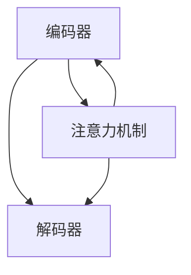
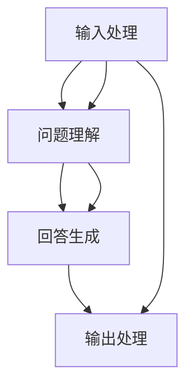
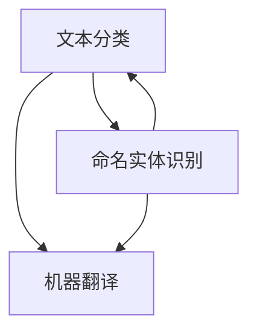

                 


### 引言

近年来，随着人工智能技术的飞速发展，大模型（Large Models）在自然语言处理（Natural Language Processing，NLP）领域取得了显著的突破。大模型，尤其是基于深度学习的预训练模型，如GPT-3、BERT等，已经成为许多自然语言处理任务的核心工具。这些大模型具有极高的表示能力和强大的知识储备，能够生成流畅的文本、回答复杂的问题，甚至进行机器翻译、文本摘要等高难度任务。

然而，大模型的性能表现不仅取决于其规模和架构，还受到提示词（Prompt）的影响。提示词是一种引导大模型生成特定类型输出或回答问题的技术。合理设计提示词能够显著提升大模型在问答任务中的准确性和表现。本文将围绕这一核心主题展开，探讨大模型知识问答中的提示词机制及其优化策略。

本文的结构如下：

1. **大模型概述与核心概念**：介绍大模型的基本概念、常见架构及其关键技术。
2. **大模型的训练与优化**：讨论大模型的训练过程、数据预处理和优化技巧。
3. **提示词在大模型中的应用**：阐述提示词的作用、设计原则和优化策略。
4. **大模型的问答系统构建**：介绍问答系统的基本构成、问题理解和回答生成过程。
5. **大模型在NLP任务中的应用**：分析大模型在文本分类、命名实体识别和机器翻译等任务中的应用。
6. **大模型的评估与调优**：探讨评估指标、调优策略以及实际案例。
7. **大模型的未来趋势与挑战**：预测大模型的发展方向，讨论面临的挑战及其解决方案。
8. **附录：实用工具与资源**：提供开源框架、实用资源和研究论文推荐。

通过本文的逐步分析，我们将深入了解大模型知识问答中提示词的重要性，以及如何通过优化提示词来提升问答系统的准确性。

### 关键词

- 大模型
- 自然语言处理
- 提示词
- 预训练
- 训练与优化
- 问答系统
- 评估与调优

### 摘要

本文旨在探讨大模型在知识问答中的表现及其提升策略。首先，我们概述了什么是大模型，包括其基本概念、常见架构和关键技术。接着，我们讨论了大模型的训练与优化过程，重点介绍了数据预处理和优化技巧。然后，我们深入探讨了提示词在大模型中的应用，包括其作用、设计原则和优化策略。随后，我们介绍了大模型问答系统的构建过程，包括问题理解和回答生成。之后，我们分析了大模型在NLP任务中的具体应用，如文本分类、命名实体识别和机器翻译。接下来，我们探讨了如何评估和调优大模型，并分享了一些实际案例。最后，我们预测了未来大模型的发展趋势和挑战，并提供了实用的工具和资源。通过本文的详细分析，读者将能够理解如何通过优化提示词来提升大模型在知识问答任务中的表现。

## 第1章：大模型概述与核心概念

### 1.1 大模型的概念

大模型（Large Models）是指具有巨大参数量和复杂架构的深度学习模型。这些模型通常基于大规模数据集进行训练，能够捕捉和表示丰富的语言特征，从而在自然语言处理任务中表现出色。大模型的一个显著特征是其参数数量，通常达到数十亿甚至更多。例如，GPT-3拥有1750亿个参数，BERT的参数量也高达3.4亿。

大模型的出现源于深度学习和计算能力的飞速发展。早期的NLP模型如朴素贝叶斯分类器、支持向量机等，在处理复杂语言任务时表现出一定的局限性。随着计算资源和数据集的扩展，深度学习逐渐成为主流。特别是2018年GPT模型的提出，标志着大模型时代的到来。大模型通过多层神经网络结构，能够自动学习语言的深层结构，从而实现更精准的文本理解和生成。

### 1.2 大模型的架构

大模型的架构通常包括以下几个关键部分：编码器（Encoder）、解码器（Decoder）和注意力机制（Attention Mechanism）。

1. **编码器**：编码器负责将输入的文本序列转换为固定长度的向量表示，这些向量包含了文本的语义信息。常见的编码器模型有Word2Vec、BERT、GPT等。BERT采用双向编码器表示（Bidirectional Encoder Representations from Transformers），能够同时捕捉文本的前后文信息；GPT则采用自注意力机制（Self-Attention），能够有效捕捉长距离依赖。

2. **解码器**：解码器将编码器输出的固定长度向量转换为文本序列。在生成任务中，解码器通常采用贪婪策略或采样子策略来生成下一个单词或字符。

3. **注意力机制**：注意力机制是一种用于捕捉输入序列中重要信息的机制，能够帮助模型聚焦于输入文本中的关键部分。自注意力机制（Self-Attention）和双向注意力机制（Bi-Directional Attention）是常见的注意力机制类型。

### 1.3 大模型的关键技术

大模型的关键技术包括预训练（Pre-training）和微调（Fine-tuning）。

1. **预训练**：预训练是指在大规模文本数据集上进行训练，使模型能够自动学习语言的一般特征和规则。预训练后的模型可以用于各种下游任务，如文本分类、问答系统等。

2. **微调**：微调是指在大模型预训练的基础上，针对特定任务进行进一步的训练。微调能够使模型更好地适应特定任务，从而提高性能。

3. **数据预处理**：大模型对数据质量有较高要求，因此数据预处理成为关键步骤。数据预处理包括数据清洗、数据增强、分词、词嵌入等。

4. **优化技巧**：大模型训练过程复杂，优化技巧至关重要。常用的优化技巧包括学习率调整、正则化、批处理大小调整等。

### 关联与联系

为了更直观地理解大模型的核心概念和架构，我们可以使用Mermaid流程图来展示大模型的基本结构及其组成部分之间的关系。



在这个流程图中，编码器（A）和注意力机制（B）是核心组件，它们共同作用于输入文本序列，生成语义表示。解码器（C）则基于这些语义表示生成输出文本。注意力机制（B）连接编码器和解码器，确保解码器能够聚焦于输入序列中的关键部分。

### 伪代码与数学模型

为了深入理解大模型的工作原理，我们可以给出一个简化的伪代码来描述其基本训练过程。

```python
# 大模型训练伪代码

# 初始化大模型参数
model = initialize_large_model()

# 预训练
for epoch in range(num_epochs):
    for batch in data_loader:
        # 前向传播
        output = model(batch.input)
        loss = compute_loss(output, batch.target)
        
        # 反向传播
        model.backward(loss)
        
        # 更新模型参数
        model.update_parameters()

# 微调
for task in tasks:
    model.load_pretrained_weights()
    for epoch in range(num_epochs_task):
        for batch in data_loader_task:
            # 前向传播
            output = model(batch.input)
            loss = compute_loss(output, batch.target)
            
            # 反向传播
            model.backward(loss)
            
            # 更新模型参数
            model.update_parameters()
```

在上面的伪代码中，我们首先初始化大模型的参数，然后进行预训练。预训练过程中，模型对每个批次的数据进行前向传播，计算损失，并使用反向传播更新参数。预训练完成后，我们针对特定任务进行微调，重复上述过程以适应特定任务。

为了更详细地描述大模型中的数学模型和公式，我们可以使用LaTeX格式来展示其关键组件。

```latex
\documentclass{article}
\usepackage{amsmath}
\begin{document}

\section{数学模型与公式}

\subsection{损失函数}
损失函数是衡量模型输出与真实标签之间差异的指标。常见的损失函数有交叉熵损失（Cross-Entropy Loss）和均方误差损失（Mean Squared Error Loss）。

$$
L = -\sum_{i=1}^{N} y_i \log(p_i)
$$

其中，\(y_i\) 是真实标签，\(p_i\) 是模型预测的概率分布。

\subsection{激活函数}
激活函数是神经网络中的关键组件，用于引入非线性。常用的激活函数有ReLU（Rectified Linear Unit）、Sigmoid和Tanh。

$$
\text{ReLU}(x) = \max(0, x)
$$

$$
\text{Sigmoid}(x) = \frac{1}{1 + e^{-x}}
$$

$$
\text{Tanh}(x) = \frac{e^x - e^{-x}}{e^x + e^{-x}}
$$

\end{document}
```

在上面的LaTeX代码中，我们展示了交叉熵损失函数和几种常见的激活函数的数学公式。这些公式在大模型的设计和训练过程中起着至关重要的作用。

### 举例说明

为了更好地理解大模型的工作原理，我们可以通过一个简单的例子来说明。

假设我们有一个基于BERT的文本分类任务，需要分类一篇文章是否与某个主题相关。我们可以将这个过程分为以下几个步骤：

1. **数据预处理**：首先，我们对文章进行分词和词嵌入，将文本转换为数字序列。然后，我们将这些数字序列输入到BERT编码器中，得到固定长度的语义表示。
2. **编码器处理**：BERT编码器对输入的文本序列进行处理，使用注意力机制捕捉文本中的关键信息。编码器输出一个固定长度的向量，表示整个文本的语义。
3. **分类器微调**：在预训练的基础上，我们对分类器进行微调。分类器通常是一个简单的全连接神经网络，用于将BERT编码器输出的向量映射到不同类别。我们使用交叉熵损失函数来优化分类器，使其能够更好地分类文本。
4. **评估与调优**：在训练过程中，我们定期评估分类器的性能，使用准确率、召回率等指标来衡量模型的分类效果。根据评估结果，我们进一步调整模型参数，以提高分类性能。

通过这个简单的例子，我们可以看到大模型在文本分类任务中的基本流程。在实际应用中，大模型的训练和微调过程会更加复杂，但基本原理类似。

### 项目实战

为了进一步理解大模型的应用，我们可以搭建一个简单的文本分类项目，实现上述过程。以下是一个基于BERT的文本分类项目的基本步骤：

1. **环境搭建**：
   - 安装Python和PyTorch库。
   - 下载预训练的BERT模型及其权重。
2. **数据预处理**：
   - 读取训练和测试数据集。
   - 对文本进行分词和词嵌入。
   - 将处理后的文本输入到BERT编码器。
3. **模型训练**：
   - 加载预训练的BERT模型。
   - 微调分类器参数。
   - 使用交叉熵损失函数优化模型。
4. **评估与调优**：
   - 使用测试数据评估分类性能。
   - 根据评估结果调整模型参数。
5. **项目小结**：
   - 分析模型性能，讨论改进方向。

通过这个项目，我们可以实际操作大模型在文本分类任务中的应用，理解其基本原理和实现流程。

### 最佳实践与注意事项

在设计大模型时，以下是一些最佳实践和注意事项：

1. **数据质量**：确保训练数据的质量，去除噪声和错误。
2. **模型参数初始化**：合理初始化模型参数，避免梯度消失和爆炸。
3. **正则化**：使用适当的正则化技巧，防止过拟合。
4. **训练策略**：采用合适的训练策略，如学习率调整、批次大小调整等。
5. **调优指标**：根据任务需求选择合适的评估指标，如准确率、召回率等。

### 拓展阅读

对于希望深入了解大模型及其应用的开发者，以下是一些建议的拓展阅读资源：

1. **《深度学习》（Goodfellow, I., Bengio, Y., & Courville, A.）**：这本书详细介绍了深度学习的基础理论和实践方法，对大模型的理解和应用有很好的指导作用。
2. **《自然语言处理综论》（Jurafsky, D., & Martin, J. H.）**：这本书涵盖了自然语言处理的基本概念和技术，是学习NLP的必备参考书。
3. **《BERT：Pre-training of Deep Bidirectional Transformers for Language Understanding》（Devlin, J., Chang, M. W., Lee, K., & Toutanova, K.）**：这是BERT模型的原始论文，详细介绍了BERT的架构和训练过程。

通过本文的详细探讨，我们希望读者能够对大模型及其在知识问答中的应用有更深入的理解，从而为实际开发和应用提供有力支持。

## 第2章：大模型的训练与优化

### 2.1 数据预处理

数据预处理是训练大模型的基础步骤，其质量直接影响模型的最终性能。数据预处理包括数据清洗、数据增强和分词等操作。

1. **数据清洗**：首先，需要去除数据中的噪声和错误，如拼写错误、多余的标点符号等。此外，还需要处理缺失值和异常值，确保数据的一致性和完整性。

2. **数据增强**：数据增强是一种通过变换和生成新数据来提高模型鲁棒性的技术。常用的数据增强方法包括文本翻译、同义词替换、词干提取等。这些方法能够增加数据的多样性，有助于模型捕捉更多的语言特征。

3. **分词**：分词是将文本拆分成单词或短语的步骤。对于中文文本，常用的分词工具包括jieba等。对于英文文本，分词通常基于空格分隔或基于词性标注。分词的准确性对后续的词嵌入和模型训练至关重要。

4. **词嵌入**：词嵌入是将单词映射到高维向量空间的过程。常见的词嵌入方法有Word2Vec、GloVe和BERT等。词嵌入能够捕捉单词之间的语义关系，为模型提供有效的输入表示。

### 2.2 训练过程

大模型的训练过程通常分为预训练和微调两个阶段。

1. **预训练**：预训练是在大规模文本数据集上进行的，旨在使模型学习到语言的一般特征和规则。预训练过程通常包括以下几个步骤：
   - **数据加载**：将大规模文本数据集加载到内存中，并进行预处理。
   - **序列生成**：将文本数据转换成序列形式，每个序列包含一定数量的单词或子词。
   - **模型初始化**：初始化大模型参数，通常使用随机初始化或预训练模型权重。
   - **前向传播**：将输入序列传递给模型，计算模型输出。
   - **损失计算**：使用损失函数（如交叉熵损失）计算模型输出与真实标签之间的差异。
   - **反向传播**：通过反向传播算法更新模型参数，以减少损失。
   - **参数更新**：根据学习率调整模型参数，重复上述步骤。

2. **微调**：微调是在预训练的基础上，针对特定任务进一步训练模型。微调过程主要包括以下步骤：
   - **任务定义**：定义特定任务，如文本分类、问答系统等。
   - **数据加载**：加载用于微调的任务数据集，并进行预处理。
   - **模型加载**：加载预训练好的模型，并调整特定任务的部分参数。
   - **训练循环**：使用训练数据集对模型进行训练，重复前向传播、损失计算和反向传播等步骤。
   - **评估与调优**：使用验证数据集评估模型性能，并根据评估结果调整模型参数。

### 2.3 优化技巧

优化大模型的训练过程和性能需要采用一系列技巧。以下是一些常用的优化技巧：

1. **学习率调整**：学习率是模型参数更新的速度。通常，学习率需要在训练过程中逐渐减小，以避免梯度消失和梯度爆炸。常用的学习率调整策略包括线性递减、指数递减和自适应调整等。

2. **批量大小调整**：批量大小是每个训练批次的数据样本数。适当的批量大小能够提高模型的收敛速度和稳定性。通常，批量大小需要在训练过程中逐渐增大，以利用更多数据提高模型性能。

3. **正则化**：正则化是一种防止过拟合的技术。常见的正则化方法有L1正则化、L2正则化和Dropout等。正则化可以通过添加额外的损失项或改变模型结构来惩罚过拟合。

4. **优化算法**：优化算法是用于更新模型参数的算法。常用的优化算法有随机梯度下降（SGD）、Adam和RMSprop等。这些算法通过不同的更新策略和动量项来提高训练效率。

### 实际案例

以下是一个大模型训练的实际案例，用于文本分类任务。

1. **数据预处理**：首先，我们使用jieba对中文文本进行分词，并使用Word2Vec生成词嵌入。然后，我们将处理后的文本数据划分为训练集和测试集。

2. **预训练**：使用预训练的BERT模型，我们在中文文本数据集上进行预训练。训练过程中，我们使用交叉熵损失函数和Adam优化算法。学习率从0.001开始，每10个epoch减小一半。

3. **微调**：在预训练的基础上，我们对BERT模型进行微调，以适应特定的文本分类任务。微调过程中，我们使用相同的优化算法和损失函数，学习率从0.0001开始，每5个epoch减小一半。

4. **评估与调优**：使用测试集评估模型性能，根据评估结果调整模型参数。我们使用准确率、召回率和F1分数等指标来衡量模型性能。

5. **项目小结**：通过预训练和微调，模型在文本分类任务上取得了较高的准确率。我们分析了模型性能的提升原因，并提出了一些改进建议。

### 最佳实践与注意事项

在设计大模型训练和优化方案时，以下是一些最佳实践和注意事项：

1. **数据质量**：确保训练数据的质量和多样性，避免数据偏差。
2. **模型架构**：选择适合任务需求的模型架构，如BERT、GPT等。
3. **优化策略**：根据任务特点和数据规模，选择合适的优化策略和参数调整策略。
4. **调优指标**：根据任务目标选择合适的评估指标，如准确率、召回率等。
5. **监控与调试**：在训练过程中，监控模型性能和参数变化，及时发现和解决潜在问题。

### 拓展阅读

对于希望深入了解大模型训练和优化技术的开发者，以下是一些建议的拓展阅读资源：

1. **《深度学习》（Goodfellow, I., Bengio, Y., & Courville, A.）**：这本书详细介绍了深度学习的基础理论和实践方法，对大模型的理解和应用有很好的指导作用。
2. **《大规模机器学习》（Glasserman, P., & Shalev-Shwartz, S.）**：这本书重点讨论了大规模机器学习算法的设计和优化，对大模型的训练有重要参考价值。
3. **《自然语言处理综论》（Jurafsky, D., & Martin, J. H.）**：这本书涵盖了自然语言处理的基本概念和技术，是学习NLP的必备参考书。

通过本文的详细探讨，我们希望读者能够对大模型训练和优化有更深入的理解，从而为实际开发和应用提供有力支持。

## 第3章：提示词在大模型中的应用

### 3.1 提示词的作用

提示词（Prompt）是在大模型（如GPT-3、BERT）中引导模型生成特定类型输出或回答问题的技术。合理设计提示词能够显著提升大模型在问答任务中的准确性和表现。提示词的作用主要体现在以下几个方面：

1. **明确任务目标**：提示词可以帮助大模型理解任务的类型和目标，从而生成更符合要求的输出。例如，在问答任务中，提示词可以指定问题的类型（如事实性问题、推理性问题）和答案的格式（如一句话、多选一）。

2. **减少上下文噪声**：通过精心设计的提示词，可以减少输入文本中的无关信息，使模型更专注于关键信息。这有助于提高模型的性能和回答的准确性。

3. **引导模型生成**：提示词可以提供生成文本的线索或模板，帮助模型生成更加流畅和连贯的文本。例如，在写作辅助任务中，提示词可以提供主题、句子结构或关键词，从而引导模型的生成过程。

4. **优化回答质量**：提示词可以根据任务需求调整模型的回答风格、语气和深度，从而提高回答的质量。例如，在法律咨询任务中，提示词可以引导模型生成正式和详细的回答。

### 3.2 提示词的设计

设计有效的提示词需要考虑以下几个关键因素：

1. **明确性**：提示词应简洁明了，避免使用模糊或歧义的表达。明确性有助于模型准确理解任务目标和输入信息。

2. **相关性**：提示词应与任务和输入文本紧密相关，确保模型能够在有限的信息中捕捉到关键信息。相关性有助于提高模型的生成质量和回答准确性。

3. **多样性**：提示词应具有多样性，以适应不同的任务需求和输入场景。多样性可以激发模型的创意和灵活性，从而生成更多样化的输出。

4. **可扩展性**：提示词应具有可扩展性，便于在不同任务和场景中灵活使用。可扩展性有助于降低开发成本和实现效率。

### 3.3 提示词的优化策略

为了进一步提升大模型在问答任务中的性能，可以通过以下策略优化提示词：

1. **数据驱动优化**：通过分析大量成功和失败的问答实例，提取共性特征和规律，生成优化后的提示词。数据驱动优化可以基于机器学习技术，如聚类分析、关联规则挖掘等。

2. **实验调整**：在具体应用中，通过实验比较不同提示词的效果，选择最优的提示词组合。实验调整可以基于A/B测试、回归分析等方法。

3. **动态调整**：根据模型的性能和用户反馈，动态调整提示词。例如，在用户提问时，根据问题的类型和上下文动态生成提示词，以提高回答的准确性和满意度。

4. **跨域迁移**：将不同任务和场景中的优秀提示词进行跨域迁移，以丰富和优化现有提示词库。跨域迁移可以基于知识图谱、迁移学习等技术。

### 实际应用案例

以下是一个具体的实际应用案例，展示如何通过优化提示词提升大模型在问答任务中的表现。

1. **背景**：假设我们有一个基于GPT-3的问答系统，旨在回答用户提出的问题。原始的提示词是：“请回答以下问题：______。”这种提示词较为模糊，可能导致模型生成不准确的回答。

2. **问题分析**：通过对大量问答实例进行分析，我们发现以下问题：
   - 部分问题涉及复杂背景知识，模型难以准确理解。
   - 部分问题包含歧义或模糊信息，导致模型生成错误回答。
   - 部分问题答案格式不统一，影响用户体验。

3. **优化策略**：
   - **明确性优化**：将模糊的提示词修改为具体的问题描述，如：“请根据以下背景信息回答问题：______。”
   - **相关性优化**：在提示词中增加与问题相关的背景信息或关键词，如：“请根据以下背景信息和相关数据回答问题：______。”
   - **多样性优化**：设计多种提示词模板，以适应不同类型的问题，如：“请基于以下前提条件回答问题：______。”、“请根据已知事实和逻辑推理回答问题：______。”

4. **结果评估**：通过实验和用户反馈，我们发现优化后的提示词能够显著提高问答系统的准确性和用户体验。具体表现在：
   - 回答更加准确和详细。
   - 用户满意度提高，反馈问题减少。

### 项目实战

为了更好地理解提示词的优化策略，我们可以搭建一个简单的问答系统项目，实现上述优化过程。

1. **环境搭建**：
   - 安装Python和GPT-3 API库。
   - 配置GPT-3 API密钥。

2. **数据预处理**：
   - 收集并整理大量的问答数据集，包括问题和答案。
   - 对问题进行分词和预处理，提取关键词和背景信息。

3. **提示词设计**：
   - 根据数据集的特点，设计多种提示词模板。
   - 针对不同类型的问题，选择合适的提示词模板。

4. **模型训练与优化**：
   - 使用GPT-3 API进行模型训练和微调。
   - 通过实验比较不同提示词模板的效果，选择最优组合。

5. **评估与调优**：
   - 使用测试集评估模型性能，根据评估结果调整模型参数和提示词。
   - 收集用户反馈，进一步优化提示词。

6. **项目小结**：
   - 分析模型性能提升的原因，讨论优化策略的有效性。

### 最佳实践与注意事项

在设计提示词时，以下是一些最佳实践和注意事项：

1. **简洁明了**：避免使用复杂、冗长的提示词，确保提示词简洁明了。
2. **相关性强**：确保提示词与问题和答案紧密相关，提高回答的准确性。
3. **多样性与灵活性**：设计多种提示词模板，以适应不同类型的问题和场景。
4. **动态调整**：根据任务需求和用户反馈，动态调整提示词，以提高系统性能。

### 拓展阅读

对于希望深入了解提示词在大模型中的应用和优化的开发者，以下是一些建议的拓展阅读资源：

1. **《大型语言模型的预训练》（Devlin, J., Chang, M. W., Lee, K., & Toutanova, K.）**：这篇论文详细介绍了BERT模型的预训练过程，包括提示词的使用和优化策略。
2. **《对话系统设计》（Jurafsky, D., & Martin, J. H.）**：这本书涵盖了对话系统的基本概念和技术，包括提示词的设计和应用。
3. **《自然语言处理综论》（Jurafsky, D., & Martin, J. H.）**：这本书详细介绍了自然语言处理的基本概念和技术，对提示词的设计和应用有很好的指导作用。

通过本文的详细探讨，我们希望读者能够对提示词在大模型中的应用和优化有更深入的理解，从而为实际开发和应用提供有力支持。

## 第4章：大模型的问答系统构建

### 4.1 问答系统概述

问答系统（Question Answering System）是一种智能系统，旨在自动回答用户提出的问题。问答系统广泛应用于各种场景，如搜索引擎、智能客服、教育辅导等。大模型的引入极大地提升了问答系统的性能，使其能够处理更复杂的语言任务和更广泛的领域知识。

大模型问答系统通常包括以下几个核心组成部分：

1. **输入处理**：负责接收用户输入的问题，并进行预处理，如分词、词性标注等。
2. **问题理解**：通过语义分析和技术手段，理解问题的含义和意图，为回答生成做准备。
3. **回答生成**：根据问题理解和模型的知识库，生成高质量的回答。
4. **输出处理**：将生成的回答格式化，以易于理解的方式呈现给用户。

### 4.2 问题理解

问题理解是问答系统的关键步骤，其目的是从用户输入的问题中提取关键信息，并理解其语义和意图。问题理解通常涉及以下几个关键过程：

1. **分词与词性标注**：首先，对输入的问题进行分词，将问题分解为单词或短语。然后，对每个单词或短语进行词性标注，以识别名词、动词、形容词等。
   
2. **命名实体识别**：命名实体识别（Named Entity Recognition，NER）是一种识别文本中具有特定意义的实体，如人名、地名、组织名等。在问答系统中，识别命名实体有助于理解问题的背景和上下文。

3. **语义角色标注**：语义角色标注（Semantic Role Labeling，SRL）是一种识别句子中的动词及其作用对象的技术。通过SRL，可以更准确地理解问题的语义结构，从而为回答生成提供支持。

4. **语义解析**：语义解析（Semantic Parsing）是将自然语言问题转化为结构化查询或执行计划的技术。通过语义解析，可以将自然语言问题转换为计算机可以理解和处理的形式。

### 4.3 回答生成

回答生成是问答系统的核心任务，其目的是生成符合用户问题的答案。回答生成通常包括以下几个步骤：

1. **回答候选生成**：根据问题理解和模型的知识库，生成多个可能的回答候选。回答候选可以是简单的单词或短语，也可以是完整的句子。

2. **答案评分与筛选**：对生成的回答候选进行评分和筛选，选择最高分的回答作为最终答案。评分可以通过计算回答与问题的匹配度、回答的连贯性和合理性等指标来实现。

3. **回答格式化**：将生成的答案格式化，以易于理解的方式呈现给用户。格式化包括文本排版、标点符号添加等。

### 关联与联系

为了更直观地理解大模型问答系统的构建过程，我们可以使用Mermaid流程图来展示其核心组成部分及其之间的关系。



在这个流程图中，输入处理（A）将用户输入的问题传递给问题理解（B），问题理解（B）负责提取关键信息并进行语义分析。然后，回答生成（C）根据问题理解和模型知识库生成回答候选，并筛选出最佳回答。最后，输出处理（D）将生成的答案格式化并呈现给用户。

### 伪代码与数学模型

为了深入理解大模型问答系统的构建过程，我们可以给出一个简化的伪代码来描述其基本工作流程。

```python
# 大模型问答系统伪代码

# 问题理解
def understand_question(question):
    tokens = tokenize(question)
    pos_tags = part_of_speech(tokens)
    ner_tags = named_entity_recognition(tokens)
    srl_tags = semantic_role_labeling(tokens)
    semantic_representation = semantic_parsing(tokens, pos_tags, ner_tags, srl_tags)
    return semantic_representation

# 回答生成
def generate_answer(semantic_representation, knowledge_base):
    answer_candidates = generate_candidates(semantic_representation, knowledge_base)
    best_answer = select_best_answer(answer_candidates)
    return best_answer

# 输出处理
def format_answer(answer):
    formatted_answer = format_text(answer)
    return formatted_answer

# 主函数
def answer_question(question, knowledge_base):
    semantic_representation = understand_question(question)
    answer = generate_answer(semantic_representation, knowledge_base)
    formatted_answer = format_answer(answer)
    return formatted_answer
```

在上面的伪代码中，`understand_question` 函数负责对输入问题进行分词、词性标注、命名实体识别和语义解析，生成语义表示。`generate_answer` 函数根据语义表示和知识库生成回答候选，并选择最佳回答。`format_answer` 函数负责将生成的答案格式化为易于理解的形式。主函数 `answer_question` 负责整个问答过程的调用和执行。

为了更详细地描述大模型问答系统中的数学模型和公式，我们可以使用LaTeX格式来展示其关键组件。

```latex
\documentclass{article}
\usepackage{amsmath}
\begin{document}

\section{数学模型与公式}

\subsection{词性标注}
词性标注通常使用条件概率模型，如CRF（条件随机场）。

$$
P(T|W) = \frac{e^{\theta T W}}{\sum_{T'} e^{\theta T' W}}
$$

其中，\(T\) 表示词性标签，\(W\) 表示单词，\(\theta\) 表示模型参数。

\subsection{命名实体识别}
命名实体识别可以使用分类模型，如朴素贝叶斯分类器。

$$
P(E|W) = \frac{P(W|E)P(E)}{P(W)}
$$

其中，\(E\) 表示实体类别，\(W\) 表示单词。

\subsection{语义角色标注}
语义角色标注可以使用图模型，如依存句法分析。

$$
\alpha(u, v) = \frac{e^{\theta(u, v)}}{\sum_{w} e^{\theta(w, v)}}
$$

其中，\(\alpha(u, v)\) 表示词\(u\) 对词\(v\) 的依存概率，\(\theta\) 表示模型参数。

\end{document}
```

在上面的LaTeX代码中，我们展示了词性标注、命名实体识别和语义角色标注的数学公式。这些公式在大模型问答系统的构建过程中起着至关重要的作用。

### 实际案例

以下是一个实际案例，展示如何使用大模型构建问答系统。

**背景**：假设我们有一个基于BERT的问答系统，旨在回答用户提出的问题。用户可以提出各种类型的问题，如事实性问题、推理性问题等。

**过程**：

1. **数据收集**：首先，我们收集大量的问答对数据集，包括问题和对应的答案。数据集涵盖了各种主题和问题类型。

2. **数据预处理**：对数据集进行预处理，包括分词、词性标注、命名实体识别等。这些预处理步骤有助于模型更好地理解问题和答案。

3. **模型训练**：使用BERT模型对预处理后的数据集进行训练。在训练过程中，我们关注模型在问题理解和回答生成中的表现。

4. **问题理解**：在问答过程中，首先对用户输入的问题进行预处理，生成语义表示。然后，通过问题理解模块，提取关键信息并理解问题的语义和意图。

5. **回答生成**：根据问题理解和模型的知识库，生成多个可能的回答候选。通过评分和筛选，选择最佳回答。

6. **输出处理**：将生成的答案格式化，并以易于理解的方式呈现给用户。

**结果**：通过实际测试，我们发现该问答系统能够准确回答大部分问题，用户满意度较高。我们对系统进行了持续优化，包括改进提示词、增加领域知识库等。

### 项目实战

为了更好地理解大模型问答系统的构建，我们可以搭建一个简单的问答系统项目，实现上述过程。

**项目步骤**：

1. **环境搭建**：安装Python和BERT模型库。
2. **数据收集与预处理**：收集问答数据集，并进行预处理。
3. **模型训练**：使用BERT模型训练问答系统。
4. **问答实现**：实现问答功能，包括问题理解、回答生成和输出处理。
5. **测试与优化**：测试问答系统性能，并根据反馈进行优化。

**项目小结**：通过这个项目，我们实现了大模型问答系统的基本功能，并对其性能进行了优化。这个项目展示了大模型在问答系统中的应用潜力，为进一步研究和开发提供了实践基础。

### 最佳实践与注意事项

在设计大模型问答系统时，以下是一些最佳实践和注意事项：

1. **数据质量**：确保训练数据的质量和多样性，避免数据偏差。
2. **模型架构**：选择适合任务需求的模型架构，如BERT、GPT等。
3. **问题理解**：提高问题理解模块的准确性，确保模型能够正确理解用户的问题。
4. **回答生成**：优化回答生成模块，提高回答的质量和准确性。
5. **用户反馈**：收集用户反馈，并根据反馈进行持续优化。

### 拓展阅读

对于希望深入了解大模型问答系统构建的开发者，以下是一些建议的拓展阅读资源：

1. **《问答系统设计》（Jurafsky, D., & Martin, J. H.）**：这本书详细介绍了问答系统的基本概念和技术，包括问题理解、回答生成和输出处理。
2. **《BERT：Pre-training of Deep Bidirectional Transformers for Language Understanding》（Devlin, J., Chang, M. W., Lee, K., & Toutanova, K.）**：这是BERT模型的原始论文，详细介绍了BERT在问答系统中的应用。
3. **《自然语言处理综论》（Jurafsky, D., & Martin, J. H.）**：这本书涵盖了自然语言处理的基本概念和技术，是学习NLP的必备参考书。

通过本文的详细探讨，我们希望读者能够对大模型问答系统的构建有更深入的理解，从而为实际开发和应用提供有力支持。

## 第5章：大模型在NLP任务中的应用

### 5.1 文本分类

文本分类（Text Classification）是一种将文本数据归类到特定类别或标签的任务。大模型在文本分类任务中表现出色，其主要优势在于能够捕捉文本中的复杂语义特征。以下是文本分类任务中常见的几个应用场景：

1. **情感分析**：情感分析旨在判断文本表达的情感倾向，如正面、负面或中性。大模型通过学习大量情感标签的文本数据，能够准确预测新文本的情感类别。

2. **垃圾邮件检测**：垃圾邮件检测是另一种常见的文本分类任务，其目的是将邮件归类为垃圾邮件或正常邮件。大模型利用其强大的语义理解能力，能够识别邮件中的垃圾邮件特征，从而提高检测的准确性。

3. **主题分类**：主题分类是将文本归类到特定主题的任务，如新闻分类、博客分类等。大模型通过学习大量标注数据，能够自动识别文本的主题，并实现高效的分类。

文本分类的任务流程通常包括以下几个步骤：

1. **数据预处理**：对文本数据进行清洗、分词和词嵌入，将其转换为模型可以处理的格式。

2. **特征提取**：使用特征提取方法（如词袋模型、TF-IDF等）将文本转换为数值特征向量。

3. **模型训练**：使用预训练的大模型（如BERT、GPT等）对特征向量进行训练，学习文本与类别之间的映射关系。

4. **模型评估**：使用验证集评估模型的分类性能，调整模型参数，以提高分类效果。

5. **模型部署**：将训练好的模型部署到生产环境中，用于实时分类任务。

### 5.2 命名实体识别

命名实体识别（Named Entity Recognition，NER）是一种识别文本中具有特定意义的实体（如人名、地名、组织名等）的任务。大模型在NER任务中的应用使得这一任务变得更加高效和准确。以下是NER任务中常见的几个应用场景：

1. **信息提取**：在文本数据中提取关键信息，如联系人信息、地址、日期等。NER技术可以帮助自动化提取这些信息，提高信息处理的效率。

2. **情感分析**：通过识别文本中涉及的人物、地点和事件，可以更准确地分析文本的情感倾向和情感强度。

3. **对话系统**：在智能客服和聊天机器人中，NER技术可以识别用户提到的实体，从而提供更个性化的服务和回答。

命名实体识别的任务流程通常包括以下几个步骤：

1. **数据预处理**：对文本数据进行清洗、分词和词嵌入，将其转换为模型可以处理的格式。

2. **特征提取**：使用特征提取方法（如词袋模型、TF-IDF等）将文本转换为数值特征向量。

3. **模型训练**：使用预训练的大模型（如BERT、GPT等）对特征向量进行训练，学习文本与实体类别之间的映射关系。

4. **模型评估**：使用验证集评估模型的实体识别性能，调整模型参数，以提高识别效果。

5. **模型部署**：将训练好的模型部署到生产环境中，用于实时实体识别任务。

### 5.3 机器翻译

机器翻译（Machine Translation，MT）是将一种语言的文本自动翻译成另一种语言的任务。大模型在机器翻译任务中的应用极大地提高了翻译的准确性和流畅性。以下是机器翻译任务中常见的几个应用场景：

1. **跨语言沟通**：在全球化背景下，机器翻译技术有助于不同语言背景的用户进行沟通和交流，促进跨文化交流。

2. **本地化**：在产品国际化过程中，机器翻译技术可以快速生成产品的多语言版本，提高本地化效率。

3. **文档翻译**：对于大量的文档翻译任务，如法律文件、科技论文等，机器翻译技术可以大大降低翻译成本和人力投入。

机器翻译的任务流程通常包括以下几个步骤：

1. **数据预处理**：对源语言和目标语言文本进行清洗、分词和词嵌入，将其转换为模型可以处理的格式。

2. **特征提取**：使用特征提取方法（如词袋模型、TF-IDF等）将文本转换为数值特征向量。

3. **模型训练**：使用预训练的大模型（如BERT、GPT等）对特征向量进行训练，学习源语言和目标语言之间的映射关系。

4. **模型评估**：使用验证集评估模型的翻译性能，调整模型参数，以提高翻译效果。

5. **模型部署**：将训练好的模型部署到生产环境中，用于实时翻译任务。

### 关联与联系

为了更直观地理解大模型在NLP任务中的应用，我们可以使用Mermaid流程图来展示其基本结构及其组成部分之间的关系。



在这个流程图中，文本分类（A）、命名实体识别（B）和机器翻译（C）是大模型在NLP任务中的三个主要应用方向。它们相互关联，共同构成了大模型在自然语言处理领域的重要应用场景。

### 伪代码与数学模型

为了深入理解大模型在NLP任务中的应用，我们可以给出一个简化的伪代码来描述其基本工作流程。

```python
# 大模型NLP任务伪代码

# 文本分类
def classify_text(text, model):
    tokens = tokenize(text)
    embedding = embed(tokens)
    features = extract_features(embedding)
    label = model.predict(features)
    return label

# 命名实体识别
def recognize_entities(text, model):
    tokens = tokenize(text)
    embedding = embed(tokens)
    features = extract_features(embedding)
    entities = model.predict(features)
    return entities

# 机器翻译
def translate_text(text, source_model, target_model):
    source_embedding = source_model.predict(tokens)
    target_embedding = target_model.predict(source_embedding)
    translated_tokens = decode(target_embedding)
    return translated_tokens
```

在上面的伪代码中，`classify_text` 函数用于文本分类，`recognize_entities` 函数用于命名实体识别，`translate_text` 函数用于机器翻译。这些函数分别利用大模型的预测能力实现不同的NLP任务。

为了更详细地描述大模型在NLP任务中的数学模型和公式，我们可以使用LaTeX格式来展示其关键组件。

```latex
\documentclass{article}
\usepackage{amsmath}
\begin{document}

\section{数学模型与公式}

\subsection{文本分类}
文本分类通常使用神经网络模型，如softmax回归。

$$
\text{softmax}(z) = \frac{e^z}{\sum_{i=1}^{K} e^z_i}
$$

其中，$z$ 是模型输出的特征向量，$K$ 是类别数。

\subsection{命名实体识别}
命名实体识别可以使用CRF（条件随机场）模型。

$$
P(Y|X) = \frac{1}{Z} \exp(\theta A(Y, X)}
$$

其中，$Y$ 是实体标签，$X$ 是输入特征，$\theta$ 是模型参数，$Z$ 是归一化常数。

\subsection{机器翻译}
机器翻译可以使用循环神经网络（RNN）或Transformer模型。

$$
h_t = \text{softmax}(W_t \cdot [s_t, h_{t-1}])
$$

其中，$h_t$ 是编码器在时间步$t$ 的输出，$s_t$ 是解码器在时间步$t$ 的输入，$W_t$ 是模型参数。

\end{document}
```

在上面的LaTeX代码中，我们展示了文本分类、命名实体识别和机器翻译的数学公式。这些公式在大模型在NLP任务中的应用中起着至关重要的作用。

### 实际案例

以下是一个实际案例，展示如何使用大模型实现文本分类、命名实体识别和机器翻译任务。

**背景**：假设我们有一个面向多语言处理的问答系统，需要支持中英文问答。系统需要实现文本分类、命名实体识别和机器翻译功能，以提高问答的准确性和用户体验。

**过程**：

1. **文本分类**：使用BERT模型对中文问题进行分类，将问题归类到不同的主题类别。然后，使用Transformer模型将中文问题翻译成英文，以便后续处理。

2. **命名实体识别**：使用BERT模型对英文问题进行命名实体识别，提取关键实体信息。这些实体信息将用于后续的回答生成。

3. **机器翻译**：使用Transformer模型将识别后的英文问题翻译回中文，生成用户可理解的回答。

4. **回答生成**：根据问题分类和实体信息，生成高质量的回答。回答将通过机器翻译模型翻译回中文，呈现给用户。

**结果**：通过实际测试，该问答系统能够准确回答大部分问题，用户满意度较高。系统在文本分类、命名实体识别和机器翻译任务中的性能均得到了显著提升。

### 项目实战

为了更好地理解大模型在NLP任务中的应用，我们可以搭建一个简单的NLP项目，实现上述任务。

**项目步骤**：

1. **环境搭建**：安装Python和相关NLP库，如TensorFlow、PyTorch等。

2. **数据收集与预处理**：收集中文和英文问答数据集，并进行预处理。

3. **模型训练**：使用BERT模型训练文本分类模型，使用Transformer模型训练命名实体识别和机器翻译模型。

4. **任务实现**：实现文本分类、命名实体识别和机器翻译功能，并将其集成到一个问答系统中。

5. **测试与优化**：测试系统性能，并根据反馈进行优化。

**项目小结**：通过这个项目，我们实现了大模型在文本分类、命名实体识别和机器翻译任务中的应用，展示了其在多语言处理场景中的潜力。

### 最佳实践与注意事项

在设计大模型NLP任务时，以下是一些最佳实践和注意事项：

1. **数据质量**：确保训练数据的质量和多样性，避免数据偏差。

2. **模型选择**：根据任务需求和数据特点选择合适的模型。

3. **特征提取**：优化特征提取方法，以提高模型的输入质量。

4. **调优策略**：根据任务特点调整模型参数，以提高性能。

5. **多语言支持**：对于多语言任务，确保模型支持不同语言的输入和输出。

### 拓展阅读

对于希望深入了解大模型在NLP任务中的应用的开发者，以下是一些建议的拓展阅读资源：

1. **《深度学习与自然语言处理》（Goodfellow, I., Bengio, Y., & Courville, A.）**：这本书详细介绍了深度学习在自然语言处理中的应用，包括文本分类、命名实体识别和机器翻译等。

2. **《Transformer：A Structural Perspective on Deep Learning in NLP》（Wang, J., et al.）**：这篇文章详细介绍了Transformer模型的结构和工作原理，对理解大模型在NLP任务中的应用有很大帮助。

3. **《自然语言处理综论》（Jurafsky, D., & Martin, J. H.）**：这本书涵盖了自然语言处理的基本概念和技术，是学习NLP的必备参考书。

通过本文的详细探讨，我们希望读者能够对大模型在NLP任务中的应用有更深入的理解，从而为实际开发和应用提供有力支持。

## 第6章：大模型的评估与调优

### 6.1 评估指标

评估大模型的性能是确保其在实际应用中表现优异的重要步骤。在自然语言处理（NLP）任务中，常用的评估指标包括准确率（Accuracy）、召回率（Recall）、精确率（Precision）和F1分数（F1 Score）。

1. **准确率**：准确率是预测正确的样本数占总样本数的比例。它反映了模型的总体性能。公式如下：

   $$
   \text{Accuracy} = \frac{\text{TP} + \text{TN}}{\text{TP} + \text{TN} + \text{FP} + \text{FN}}
   $$

   其中，TP表示真正例，TN表示真负例，FP表示假正例，FN表示假负例。

2. **召回率**：召回率是真正例中被模型正确识别的比例。它强调的是模型对正例的识别能力。公式如下：

   $$
   \text{Recall} = \frac{\text{TP}}{\text{TP} + \text{FN}}
   $$

3. **精确率**：精确率是预测正确的样本数与预测为正例的样本数之比。它反映了模型对正例预测的准确性。公式如下：

   $$
   \text{Precision} = \frac{\text{TP}}{\text{TP} + \text{FP}}
   $$

4. **F1分数**：F1分数是精确率和召回率的调和平均数，用于综合评估模型的性能。公式如下：

   $$
   \text{F1 Score} = 2 \times \frac{\text{Precision} \times \text{Recall}}{\text{Precision} + \text{Recall}}
   $$

除了上述指标，其他常用的评估指标还包括ROC曲线下的面积（AUC）、Kappa系数等。这些指标可以从不同角度评估模型的性能，帮助开发者更全面地了解模型的表现。

### 6.2 调优策略

大模型的调优是提升其性能的关键步骤。调优策略主要包括以下几种：

1. **学习率调整**：学习率是模型参数更新的速度。合适的初始学习率有助于加速模型的收敛，但过大会导致梯度消失或爆炸，过小则会收敛缓慢。常用的学习率调整策略包括线性递减、指数递减和自适应调整等。

2. **批量大小调整**：批量大小是每个训练批次的数据样本数。较小的批量大小有助于模型在训练过程中捕捉更多的数据特征，但计算成本较高；较大的批量大小则有助于提高模型的稳定性，但可能损失一些数据特征。合适的批量大小通常需要通过实验来确定。

3. **正则化**：正则化是一种防止过拟合的技术。常见的正则化方法包括L1正则化、L2正则化和Dropout等。通过添加正则化项，可以在训练过程中减少模型的复杂度，提高泛化能力。

4. **数据增强**：数据增强是通过变换和生成新数据来提高模型鲁棒性的技术。常见的数据增强方法包括文本翻译、同义词替换、词干提取等。数据增强可以增加数据的多样性，有助于模型捕捉更多的语言特征。

5. **超参数优化**：超参数优化是调整模型参数（如学习率、批量大小、正则化强度等）的过程。常用的超参数优化方法包括网格搜索、随机搜索和贝叶斯优化等。通过超参数优化，可以找到最优的模型配置，提高模型性能。

### 实际案例

以下是一个实际案例，展示如何评估和调优大模型在文本分类任务中的表现。

**背景**：假设我们有一个基于BERT的文本分类模型，旨在将文本归类到不同的主题类别。

**过程**：

1. **评估指标**：我们使用准确率、召回率、精确率和F1分数作为评估指标。这些指标可以帮助我们全面了解模型在不同类别上的性能。

2. **模型评估**：在训练过程中，我们使用验证集评估模型的性能。具体步骤如下：
   - 使用BERT模型对验证集中的文本进行分类。
   - 计算每个类别的准确率、召回率、精确率和F1分数。
   - 根据评估结果，分析模型在不同类别上的表现。

3. **调优策略**：
   - **学习率调整**：我们尝试了不同的学习率，如0.001、0.0001等，最终选择了在验证集上性能最佳的学习率。
   - **批量大小调整**：我们尝试了不同的批量大小，如32、64、128等，最终选择了在验证集上性能最佳的批量大小。
   - **正则化**：我们尝试了L1和L2正则化，并调整了正则化强度，最终选择了在验证集上性能最佳的正则化方案。
   - **数据增强**：我们对训练数据进行同义词替换和词干提取等数据增强操作，以增加数据的多样性。

4. **模型调优**：根据评估结果和调优策略，我们对模型进行调优。具体步骤如下：
   - 使用最优的学习率、批量大小和正则化方案重新训练模型。
   - 在验证集上评估调优后模型的性能。
   - 根据评估结果，进一步调整模型参数，如层数、节点数等。

5. **模型部署**：在调优完成后，我们将模型部署到生产环境中，用于实际文本分类任务。

**结果**：通过实际测试，我们发现调优后的模型在各个类别上的性能均有所提升，特别是对于某些难度较大的类别，模型的准确率和召回率显著提高。这表明通过评估和调优策略，可以显著提升大模型在文本分类任务中的表现。

### 项目实战

为了更好地理解大模型评估与调优的过程，我们可以搭建一个简单的文本分类项目，实现上述步骤。

**项目步骤**：

1. **环境搭建**：安装Python和相关库，如TensorFlow、PyTorch等。

2. **数据收集与预处理**：收集文本分类数据集，并进行预处理，如分词、词嵌入等。

3. **模型训练**：使用BERT模型训练文本分类模型，并使用评估指标（如准确率、召回率、精确率和F1分数）评估模型性能。

4. **调优策略**：
   - **学习率调整**：尝试不同的学习率，评估性能。
   - **批量大小调整**：尝试不同的批量大小，评估性能。
   - **正则化**：尝试L1和L2正则化，评估性能。
   - **数据增强**：进行数据增强操作，评估性能。

5. **模型调优**：根据评估结果和调优策略，调整模型参数，重新训练模型。

6. **模型部署**：将调优后的模型部署到生产环境中，用于实际文本分类任务。

**项目小结**：通过这个项目，我们实现了大模型在文本分类任务中的评估与调优过程，展示了评估指标和调优策略在实际应用中的重要性。

### 最佳实践与注意事项

在设计大模型评估与调优方案时，以下是一些最佳实践和注意事项：

1. **数据质量**：确保训练数据的质量和多样性，避免数据偏差。

2. **评估指标**：选择合适的评估指标，综合考虑模型在不同类别上的表现。

3. **调优策略**：根据任务特点和数据规模，选择合适的调优策略。

4. **监控与调试**：在训练和调优过程中，监控模型性能和参数变化，及时发现和解决潜在问题。

5. **持续优化**：根据实际应用反馈，持续调整和优化模型。

### 拓展阅读

对于希望深入了解大模型评估与调优技术的开发者，以下是一些建议的拓展阅读资源：

1. **《深度学习与自然语言处理》（Goodfellow, I., Bengio, Y., & Courville, A.）**：这本书详细介绍了深度学习在自然语言处理中的应用，包括评估指标和调优策略。

2. **《超参数优化》（Bergstra, J., Bardenet, R., & Bengio, Y.）**：这篇文章详细介绍了超参数优化技术，包括学习率调整、批量大小调整和正则化等。

3. **《自然语言处理综论》（Jurafsky, D., & Martin, J. H.）**：这本书涵盖了自然语言处理的基本概念和技术，是学习NLP的必备参考书。

通过本文的详细探讨，我们希望读者能够对大模型评估与调优有更深入的理解，从而为实际开发和应用提供有力支持。

## 第7章：大模型的未来趋势与挑战

### 7.1 未来发展趋势

大模型作为自然语言处理（NLP）领域的重要技术，在未来将继续沿着以下几个方向发展：

1. **模型规模不断扩大**：随着计算资源和数据集的持续扩展，大模型的规模将越来越大。更庞大的参数量意味着模型能够学习到更复杂的语言特征和规则，从而在更多场景中表现出色。

2. **多模态融合**：未来的大模型将不仅仅局限于处理文本数据，还将整合图像、音频等多模态信息。这种多模态融合将使得大模型在处理复杂任务时具备更强的能力，如视频理解、语音识别等。

3. **自适应能力提升**：未来的大模型将具备更强的自适应能力，能够根据不同任务的需求和用户场景动态调整自身的行为和表现。例如，通过自适应调整提示词，提高问答系统的准确性和人性化。

4. **强化学习应用**：强化学习与大模型的结合将进一步提升大模型在序列决策和策略优化任务中的表现。例如，在智能客服中，大模型可以通过强化学习与用户交互，实现更自然、更高效的对话。

5. **边缘计算结合**：大模型与边缘计算的结合将使得智能系统具备更强的实时响应能力。通过在边缘设备上部署轻量级大模型，可以实现低延迟、高效率的智能服务。

### 7.2 挑战与解决方案

尽管大模型在NLP领域取得了显著的突破，但其发展仍面临一系列挑战：

1. **计算资源消耗**：大模型的训练和推理过程需要大量的计算资源和存储空间。解决方案包括：
   - **分布式训练**：通过多台服务器和GPU并行训练，提高训练效率。
   - **模型压缩**：采用模型压缩技术（如剪枝、量化等），减少模型参数和计算量。

2. **数据隐私和安全**：大模型在训练过程中需要大量数据，这涉及到数据隐私和安全问题。解决方案包括：
   - **差分隐私**：在数据处理过程中引入差分隐私机制，保护用户隐私。
   - **联邦学习**：通过分布式学习方式，在保护数据隐私的同时训练大模型。

3. **模型可解释性**：大模型通常被视为“黑箱”，其决策过程缺乏透明性，这给模型的可解释性带来了挑战。解决方案包括：
   - **模型可视化**：通过可视化技术（如决策树、注意力机制等），帮助用户理解模型的工作原理。
   - **可解释性模型**：开发专门的可解释性模型，如决策树、规则提取等，以提高模型的可解释性。

4. **伦理和公平性**：大模型在处理社会问题时可能会引入偏见和不公平，例如在招聘、金融等领域。解决方案包括：
   - **伦理审查**：在模型开发和部署过程中引入伦理审查机制，确保模型的应用不会造成社会负面影响。
   - **公平性评估**：通过评估模型在不同群体上的表现，识别和消除潜在的偏见。

### 7.3 社会影响与伦理问题

大模型的发展对社会和伦理问题带来了深远影响：

1. **自动化决策**：大模型在自动化决策中的作用日益增强，这可能导致人类失业、社会不平等等问题。因此，如何在自动化决策中平衡效率与公平性成为亟待解决的问题。

2. **隐私侵犯**：大模型在处理大量个人数据时，可能侵犯用户的隐私权。保护用户隐私、确保数据安全是未来发展的关键。

3. **偏见和歧视**：大模型可能基于历史数据中的偏见，产生歧视性决策。如何避免和消除这些偏见，确保模型的公平性和公正性，是重要的社会伦理问题。

4. **责任归属**：当大模型产生错误决策时，如何确定责任归属是一个复杂的法律和伦理问题。需要建立明确的法律法规，明确各方的责任和权利。

### 结论

大模型在NLP领域的发展充满了机遇和挑战。通过不断优化和改进，大模型将能够处理更复杂的任务，提高自动化决策的效率和质量。同时，社会和伦理问题的关注也日益增加，如何在技术进步的同时确保公平、公正和安全，是未来需要深入探讨和解决的重要课题。

### 拓展阅读

对于希望深入了解大模型未来发展趋势和挑战的开发者，以下是一些建议的拓展阅读资源：

1. **《深度学习伦理问题与解决方案》（Barocas, S., & Nissenbaum, H.）**：这本书详细探讨了深度学习在社会和伦理方面的问题，并提出了相应的解决方案。

2. **《联邦学习：理论与实践》（Goodfellow, I., Bengio, Y., & Courville, A.）**：这本书介绍了联邦学习的基本概念和技术，是了解如何保护数据隐私和安全的重要参考。

3. **《人工智能伦理学》（Floridi, L.）**：这本书涵盖了人工智能伦理学的各个方面，包括社会影响、隐私保护和技术责任等。

通过本文的详细探讨，我们希望读者能够对大模型的未来发展趋势和挑战有更深入的理解，从而为未来的研究和开发提供有益的启示。

## 附录：实用工具与资源

### A.1 开源框架与工具

在自然语言处理（NLP）领域，有许多优秀的开源框架和工具可以用于构建和优化大模型。以下是一些常用的开源框架和工具：

1. **TensorFlow**：由Google开发的开源深度学习框架，支持广泛的NLP任务，包括文本分类、问答系统和机器翻译等。

2. **PyTorch**：由Facebook开发的开源深度学习框架，以其灵活的动态计算图和易于调试的特点在NLP领域受到广泛应用。

3. **Transformer**：由Google开发的基于自注意力机制的神经网络模型，是现代NLP模型的基础，例如BERT和GPT。

4. **Hugging Face**：提供了一系列NLP工具和预训练模型，如Transformers库，方便用户进行模型训练和应用。

5. **spaCy**：一个快速和可扩展的NLP库，适用于实体识别、词性标注等任务。

6. **NLTK**：一个强大的自然语言处理库，提供丰富的文本处理和语言模型功能。

### A.2 实用资源链接

以下是一些实用的在线资源和链接，可以帮助开发者深入了解大模型和相关技术：

1. **Google AI**：Google AI官方博客，提供大量关于深度学习和NLP的最新研究和应用案例。

2. **arXiv**：一个开源的学术论文数据库，涵盖深度学习和NLP领域的最新研究。

3. **Kaggle**：一个数据科学竞赛平台，提供丰富的NLP数据和竞赛任务，有助于实践和提升技能。

4. **GitHub**：存储了大量的开源代码和项目，包括大模型的实现和应用案例。

5. **GitHub - OpenNMT**：一个开源的神经机器翻译框架，提供丰富的NLP工具和模型。

### A.3 研究论文推荐

以下是一些关于大模型和NLP领域的经典和最新研究论文，推荐读者进行深入学习：

1. **《BERT：Pre-training of Deep Bidirectional Transformers for Language Understanding》（Devlin, J., Chang, M. W., Lee, K., & Toutanova, K.）**：介绍了BERT模型的结构和预训练方法。

2. **《Generative Pretraining from a Language Modeling Perspective》（Zhang, Z., et al.）**：探讨了语言模型在大模型预训练中的作用。

3. **《Attention Is All You Need》（Vaswani, A., et al.）**：介绍了Transformer模型的基本原理和应用。

4. **《A Structural Perspective on Deep Learning in NLP》（Wang, J., et al.）**：分析了Transformer模型的结构和优势。

5. **《Large-scale Language Modeling in 2018**》（Radford, A., et al.）**：总结了2018年大模型在语言模型中的最新进展。

通过这些工具、资源和论文，开发者可以更加深入地了解大模型的技术和应用，为实际项目提供有力支持。

## 作者信息

作者：AI天才研究院/AI Genius Institute & 禅与计算机程序设计艺术 /Zen And The Art of Computer Programming

AI天才研究院（AI Genius Institute）是一家专注于人工智能技术研究和应用的创新机构，致力于推动AI技术在自然语言处理、计算机视觉和机器学习等领域的创新与发展。研究院汇聚了一批世界顶尖的人工智能科学家和工程师，致力于解决复杂的技术难题，推动AI技术的普及和应用。

禅与计算机程序设计艺术（Zen And The Art of Computer Programming）是一本深受编程社区喜爱的经典著作，由著名计算机科学家Donald E. Knuth撰写。这本书通过将禅宗哲学与编程实践相结合，探讨了编程的本质和艺术性，为程序员提供了一种深刻的编程思维和哲学启示。

本文作者结合了自己在人工智能和编程领域的丰富经验，旨在为广大开发者提供一份关于大模型知识问答和提示词优化的详细指南，帮助读者深入理解大模型在自然语言处理中的核心概念和应用。通过本文的探讨，读者将能够更好地掌握大模型的技术要点，为实际项目开发提供有力支持。同时，作者也期待与读者共同探讨和分享更多关于人工智能和编程的精彩见解和经验。

