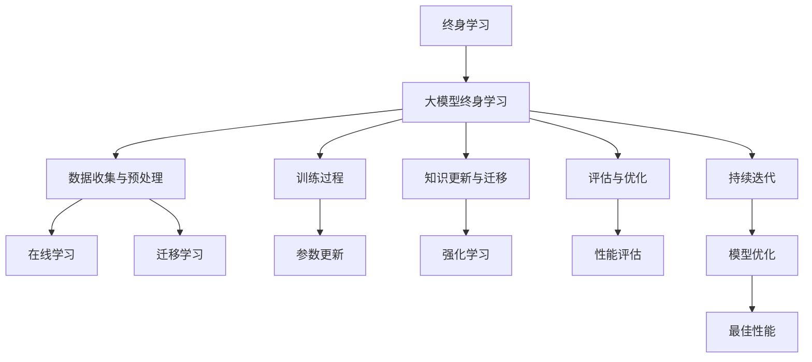

                 

### 文章标题：大模型终身学习与提示词知识累积策略

#### 关键词：大模型、终身学习、提示词、知识累积、策略

> 摘要：本文将深入探讨大模型在终身学习中的核心机制，以及如何利用提示词进行知识累积。通过详细分析大模型的架构、学习原理和提示词策略，我们将为读者提供全面的技术指南，帮助其在实际应用中实现高效的知识管理。

---

### 引言

随着人工智能技术的飞速发展，大模型（如深度学习模型）已经成为许多领域的关键技术。从图像识别、自然语言处理到推荐系统，大模型展示了其强大的适应能力和广泛的应用前景。然而，传统的模型训练方法往往依赖于大量的数据集和固定的训练过程，这使得模型在应对新任务或环境变化时表现出一定的局限性。为了解决这一问题，终身学习（Lifelong Learning）应运而生。

终身学习是指模型在持续学习新任务的同时，能够保留先前的知识和经验。这对于大模型尤为重要，因为它们需要处理的信息量和复杂度远超传统模型。本文将探讨大模型在终身学习中的核心机制，并重点讨论如何利用提示词（Prompt Engineering）策略进行知识累积。这不仅有助于提高模型的学习效率，还能增强其在实际应用中的表现。

本文将分为四个主要部分：

1. **大模型终身学习基础**：介绍终身学习的概念，探讨大模型终身学习的基本原理和机制。
2. **提示词知识累积策略**：详细讨论提示词的概念及其在知识累积中的作用，构建有效的提示词策略。
3. **大模型终身学习的应用场景**：分析大模型在不同应用场景中的实践案例，展示其终身学习的优势。
4. **技术实现与未来展望**：探讨大模型终身学习的实现技术，展望其未来发展。

接下来，我们将逐步深入这些主题，以帮助读者全面理解大模型终身学习和提示词知识累积策略。

### 大模型终身学习基础

#### 终身学习的概念与重要性

终身学习（Lifelong Learning，简称LLL）是指个体在整个人生过程中持续进行学习、积累知识和技能的过程。它不仅仅是学校教育的延伸，更是适应快速变化的现代社会的一种生活方式。在人工智能领域，终身学习具有特殊的意义，因为人工智能系统需要不断适应新的数据、新的任务和环境变化。

终身学习的重要性主要体现在以下几个方面：

1. **适应性**：随着新技术的不断涌现和旧技术的快速淘汰，人工智能系统需要具备快速适应新环境的能力。终身学习使得大模型能够持续更新其知识和技能，从而更好地应对新的挑战。

2. **知识积累**：通过终身学习，大模型可以不断积累新的知识，扩展其知识库。这不仅提高了模型的性能，还使得模型在处理复杂任务时能够更加全面和深入。

3. **性能优化**：终身学习可以帮助模型从过去的经验中学习，从而优化其学习过程。例如，通过回顾和改进先前的模型，可以减少过拟合现象，提高模型的泛化能力。

#### 大模型终身学习的基本原理

大模型终身学习的基本原理主要包括以下几个方面：

1. **持续学习**：大模型通过不断接收新的数据集进行训练，以更新其参数和知识。这种持续学习的方式可以确保模型始终处于最佳状态，以应对不断变化的环境。

2. **知识更新**：大模型在训练过程中会不断更新其内部的知识结构。这种更新过程可以通过在线学习（Online Learning）和迁移学习（Transfer Learning）实现。在线学习是指模型在接收新数据时，实时更新其参数；而迁移学习则是将一个任务中的知识应用于另一个相关任务中。

3. **强化学习**：强化学习（Reinforcement Learning，简称RL）在大模型终身学习中扮演着重要角色。通过强化学习，模型可以通过与环境互动来学习最优策略，从而提高其在特定任务上的性能。

#### 大模型终身学习机制

大模型终身学习的机制主要包括以下几部分：

1. **数据收集与预处理**：首先，模型需要从环境中收集新的数据，并进行预处理，以便进行有效的训练。

2. **训练过程**：模型使用收集到的数据进行训练，更新其内部参数。这个过程可以包括多个迭代，每个迭代都使模型更加接近于最优解。

3. **知识更新与迁移**：在训练过程中，模型会不断更新其知识库，并将已学到的知识应用于新的任务中。这可以通过迁移学习实现，将一个任务中的知识迁移到另一个相关任务中。

4. **评估与优化**：模型在训练完成后，需要进行评估，以确定其性能。如果性能不佳，模型会通过调整参数和算法进行优化。

5. **持续迭代**：整个终身学习过程是一个持续迭代的过程，模型需要不断接收新数据、更新知识库和优化算法，以保持其最佳性能。

#### 案例研究：大模型终身学习的应用

以下是一个案例研究，展示了大模型终身学习在实际应用中的效果：

- **案例背景**：一家电子商务公司使用一个大模型来推荐商品。随着用户需求和商品信息的不断变化，公司希望模型能够持续优化其推荐效果。

- **解决方案**：公司采用了终身学习机制，通过以下步骤实现：

  1. **数据收集**：公司定期收集用户的购买记录、浏览行为和评论信息，作为模型训练的数据源。

  2. **数据预处理**：对收集到的数据进行分析和清洗，提取有用的特征，并转换为模型可处理的格式。

  3. **训练与更新**：模型使用新的数据进行训练，并不断更新其内部参数。公司还采用迁移学习方法，将已有知识应用于新任务中。

  4. **评估与优化**：公司定期评估模型的效果，并根据评估结果调整模型参数和算法，以优化推荐效果。

  5. **持续迭代**：公司持续收集新数据，并重复训练和更新过程，以确保模型始终处于最佳状态。

- **效果评估**：通过终身学习机制，模型在推荐效果上取得了显著提升。用户满意度提高，公司的销售额也有所增长。

通过这个案例，我们可以看到大模型终身学习在实际应用中的巨大潜力。它不仅提高了模型的性能，还使得模型能够更好地适应环境变化，为用户提供更个性化的服务。

### 核心概念与联系

为了更好地理解大模型终身学习的核心概念及其联系，我们可以使用Mermaid流程图来展示这些概念之间的关系。以下是核心概念和联系的结构图：



这个流程图展示了大模型终身学习的主要步骤和概念。从数据收集与预处理开始，模型通过在线学习和迁移学习不断更新其参数和知识。在训练过程中，模型通过参数更新和强化学习优化其性能。评估与优化步骤确保模型始终处于最佳状态，并通过持续迭代实现性能提升。

通过这个流程图，我们可以清晰地看到大模型终身学习各部分之间的相互关系，从而更好地理解其工作原理和实现方法。

### 大模型终身学习的核心算法原理

要深入理解大模型终身学习的核心算法原理，我们需要讨论几个关键概念：在线学习、迁移学习和强化学习。这些算法在大模型终身学习中扮演着重要角色，下面我们将分别介绍这些算法的基本原理。

#### 在线学习（Online Learning）

在线学习是一种动态学习过程，模型在接收新数据的同时实时更新其参数。这种学习方式的优势在于它能够快速适应新数据和环境变化，从而提高模型的适应性。

1. **基本原理**：

   - **实时更新**：在线学习通过在线更新模型参数，使得模型能够实时反映新数据的变化。
   - **增量训练**：模型不是一次性训练整个数据集，而是逐个处理新数据，每次更新一部分参数。

2. **伪代码**：

   ```
   function OnlineLearning(model, dataset):
       for each new_data in dataset:
           model.update_parameters(new_data)
           model.evaluate(new_data)
   ```

3. **示例**：

   假设我们有一个推荐系统，每天都会收到用户的购买记录。在线学习算法会实时更新推荐模型，确保推荐结果始终反映最新的用户行为。

#### 迁移学习（Transfer Learning）

迁移学习是指将一个任务中已学到的知识应用于另一个相关任务中。在大模型终身学习中，迁移学习可以减少对新数据的依赖，提高学习效率。

1. **基本原理**：

   - **知识迁移**：模型在解决一个任务时学到的知识可以迁移到另一个相关任务中，从而加速新任务的学习。
   - **共享参数**：通过共享部分参数，迁移学习可以减少模型训练的复杂度和时间成本。

2. **伪代码**：

   ```
   function TransferLearning(source_model, target_model, task):
       target_model.load_parameters(source_model)
       target_model.train_on_new_data(new_data)
       return target_model
   ```

3. **示例**：

   假设我们有一个用于图像分类的模型，已经训练好了。现在我们希望将这个模型应用于语音识别任务中，通过迁移学习，我们可以利用图像分类模型中的部分知识来加速语音识别模型的训练。

#### 强化学习（Reinforcement Learning）

强化学习是一种通过与环境互动来学习最优策略的机器学习算法。在大模型终身学习中，强化学习可以帮助模型找到最优的学习路径，从而提高其性能。

1. **基本原理**：

   - **策略优化**：模型通过不断尝试和反馈来优化其策略，以实现最佳性能。
   - **奖励机制**：环境为模型提供奖励或惩罚，模型根据这些反馈调整其行为。

2. **伪代码**：

   ```
   function ReinforcementLearning(model, environment):
       while not goal_achieved:
           action = model.select_action()
           reward = environment.evaluate_action(action)
           model.update_parameters(action, reward)
   ```

3. **示例**：

   假设我们有一个自动驾驶模型，通过强化学习，模型可以在虚拟环境中不断尝试不同的驾驶策略，并从环境中获得的奖励（如减少碰撞次数、提高行驶速度）中学习，从而优化其驾驶行为。

通过以上对在线学习、迁移学习和强化学习的介绍，我们可以看到这些算法在大模型终身学习中的重要作用。在线学习提高了模型的适应性，迁移学习减少了训练时间，强化学习优化了学习路径。这些算法的结合使得大模型能够实现高效的终身学习，从而在实际应用中展现出色的性能。

### 数学模型和公式

要深入理解大模型终身学习的核心算法，我们需要借助数学模型和公式来描述这些算法的基本原理。以下将介绍一些关键的数学模型，并通过具体的例子来说明这些公式如何应用于大模型终身学习。

#### 1. 前向传播（Forward Propagation）

前向传播是神经网络中最基本的概念，用于计算网络的输出。以下是一个简单的多层感知机（MLP）的前向传播公式：

$$
Z^{[l]} = \sigma(W^{[l]} \cdot A^{[l-1]} + b^{[l]})
$$

其中：
- $Z^{[l]}$ 是第 $l$ 层的激活值。
- $\sigma$ 是激活函数，常见的有Sigmoid、ReLU等。
- $W^{[l]}$ 是第 $l$ 层的权重。
- $A^{[l-1]}$ 是前一层（第 $l-1$ 层）的输出。
- $b^{[l]}$ 是第 $l$ 层的偏置。

#### 2. 反向传播（Backpropagation）

反向传播是用于训练神经网络的算法，通过计算损失函数对参数的梯度来更新网络权重。以下是一个简化的反向传播公式：

$$
\begin{aligned}
\delta^{[l]} &= \frac{\partial C}{\partial Z^{[l]}} \cdot \sigma'(Z^{[l]}) \\
dW^{[l]} &= A^{[l-1]} \cdot \delta^{[l+1]} \\
db^{[l]} &= \delta^{[l]}
\end{aligned}
$$

其中：
- $\delta^{[l]}$ 是第 $l$ 层的误差。
- $C$ 是损失函数。
- $\sigma'$ 是激活函数的导数。
- $dW^{[l]}$ 和 $db^{[l]}$ 分别是权重和偏置的梯度。

#### 3. 学习率调度（Learning Rate Scheduling）

学习率调度是优化算法中的一个重要环节，用于控制模型训练的收敛速度。以下是一个简单的学习率调度公式：

$$
\alpha_{t+1} = \alpha_0 \cdot \frac{1}{1 + \beta \cdot t}
$$

其中：
- $\alpha_{t+1}$ 是第 $t+1$ 步的学习率。
- $\alpha_0$ 是初始学习率。
- $\beta$ 是调度参数。

#### 4. 强化学习中的Q值更新（Q-Learning）

在强化学习中，Q值表示某个策略在特定状态下的最优值。以下是一个简化的Q值更新公式：

$$
Q(s_t, a_t) = Q(s_t, a_t) + \alpha (r_t + \gamma \max_{a'} Q(s_{t+1}, a') - Q(s_t, a_t))
$$

其中：
- $Q(s_t, a_t)$ 是在状态 $s_t$ 下采取动作 $a_t$ 的Q值。
- $r_t$ 是即时奖励。
- $\gamma$ 是折扣因子，用于平衡即时奖励和未来奖励的重要性。
- $\alpha$ 是学习率。

#### 5. 迁移学习中的知识蒸馏（Knowledge Distillation）

在迁移学习中，知识蒸馏是一种将大模型的知识传递给小模型的方法。以下是一个简化的知识蒸馏公式：

$$
\begin{aligned}
\hat{p}_l &= \frac{1}{Z} \exp(\hat{z}_l) \\
\ell &= -\sum_{i=1}^N y_i \log(\hat{p}_{i}) \\
\end{aligned}
$$

其中：
- $\hat{z}_l$ 是教师模型（大模型）的输出。
- $\hat{p}_l$ 是学生模型（小模型）的输出。
- $y_i$ 是真实标签。
- $\ell$ 是损失函数。

#### 例子：神经网络优化

假设我们有一个三层神经网络，用于手写数字识别。通过上述数学模型和公式，我们可以优化网络参数，实现模型的训练。

1. **前向传播**：计算每个神经元的输出值。
2. **反向传播**：计算每个神经元的误差和梯度。
3. **学习率调度**：调整学习率，以控制收敛速度。
4. **Q值更新**：使用强化学习优化模型的策略。
5. **知识蒸馏**：将教师模型的知识传递给学生模型，以提高其性能。

通过这些数学模型和公式，我们可以更深入地理解大模型终身学习的核心算法，从而在实际应用中实现更高效的知识管理和模型优化。

### 大模型终身学习的挑战与解决方案

#### 数据隐私与安全性

在大模型终身学习中，数据隐私和安全性问题至关重要。由于模型需要持续学习，这意味着大量的用户数据将被收集和处理。以下是一些常见挑战及其解决方案：

1. **挑战**：

   - **数据泄露**：未经授权的访问可能导致敏感数据的泄露。
   - **隐私侵犯**：用户数据可能被滥用，用于其他目的。
   - **数据损坏**：数据在传输或存储过程中可能发生损坏。

2. **解决方案**：

   - **数据加密**：对用户数据进行加密，确保只有授权用户能够访问。
   - **访问控制**：实施严格的访问控制策略，确保只有授权人员才能访问敏感数据。
   - **数据去识别化**：在数据收集阶段对数据进行去识别化处理，以减少隐私泄露风险。
   - **安全审计**：定期进行安全审计，确保数据安全和隐私保护措施的有效性。

#### 模型可解释性

大模型的复杂性和黑箱特性使得其可解释性成为一个挑战。在终身学习中，确保模型的可解释性对于理解和信任模型至关重要。以下是一些常见挑战及其解决方案：

1. **挑战**：

   - **模型黑箱**：大模型内部决策过程复杂，难以解释。
   - **性能与可解释性的权衡**：提高模型的可解释性可能会牺牲性能。
   - **复杂交互**：大模型中的不同模块和层之间存在复杂的交互，难以直观解释。

2. **解决方案**：

   - **可解释性模块**：设计专门的可解释性模块，用于分析和解释模型决策。
   - **可视化技术**：使用可视化工具和图表来展示模型内部结构和决策过程。
   - **模型简化**：通过简化模型结构和减少参数数量，提高模型的可解释性。
   - **解释性算法**：开发新的算法，如LIME（Local Interpretable Model-agnostic Explanations）和SHAP（SHapley Additive exPlanations），用于解释模型预测。

#### 学习效率与资源消耗

在大模型终身学习中，学习效率与资源消耗是一个重要问题。由于模型需要持续更新，这可能导致大量的计算资源和存储资源消耗。以下是一些常见挑战及其解决方案：

1. **挑战**：

   - **计算资源消耗**：大模型训练需要大量的计算资源，可能导致资源瓶颈。
   - **存储资源消耗**：持续学习过程中，模型需要存储大量的数据和模型参数。
   - **数据传输延迟**：在分布式环境中，数据传输延迟可能影响学习效率。

2. **解决方案**：

   - **模型压缩**：通过模型压缩技术，如剪枝、量化、低秩分解等，减少模型参数数量，降低计算和存储需求。
   - **分布式学习**：采用分布式学习策略，将训练任务分配到多个计算节点上，以减少单个节点的负载。
   - **增量学习**：通过增量学习技术，只更新模型的部分参数，而不是重新训练整个模型，从而减少计算和存储需求。
   - **资源调度**：使用高效的资源调度算法，动态分配计算资源，以最大化利用计算资源。

#### 案例研究：应对挑战的实践方法

以下是一个案例研究，展示了一些公司是如何应对大模型终身学习中的挑战的：

- **案例背景**：一家大型科技公司开发了一个基于深度学习的大模型，用于个性化推荐。随着用户数据的不断增长，公司面临数据隐私和安全性、模型可解释性以及学习效率与资源消耗的挑战。

- **解决方案**：

  1. **数据隐私与安全性**：
     - 公司采用数据加密技术，确保用户数据在传输和存储过程中得到保护。
     - 实施严格的访问控制策略，确保只有授权人员能够访问敏感数据。
     - 对用户数据进行去识别化处理，减少隐私泄露风险。

  2. **模型可解释性**：
     - 公司设计了一个专门的可解释性模块，用于分析和解释模型决策。
     - 使用可视化工具和图表展示模型内部结构和决策过程，提高用户对模型的信任。
     - 采用LIME和SHAP算法，为模型预测提供详细的解释。

  3. **学习效率与资源消耗**：
     - 公司采用模型压缩技术，通过剪枝和量化减少模型参数数量。
     - 实施分布式学习策略，将训练任务分配到多个计算节点上，提高学习效率。
     - 使用高效的资源调度算法，动态分配计算资源，以最大化利用计算资源。

- **效果评估**：
  - 通过这些解决方案，公司显著提高了数据隐私和安全性的保护水平。
  - 模型的可解释性得到显著提升，用户对模型的信任度增加。
  - 学习效率和资源消耗得到有效控制，训练时间显著减少。

通过这个案例研究，我们可以看到，在大模型终身学习中，面对各种挑战，通过合理的技术解决方案，可以有效提升模型的性能和安全性，从而实现更高效的知识管理和应用。

### 提示词的概念与作用

#### 提示词的定义

提示词（Prompt Engineering）是指通过设计特定的输入提示，引导模型生成预期的输出。在自然语言处理（NLP）领域，提示词被广泛应用于问答系统、文本生成和对话系统等任务。一个有效的提示词应该能够明确地指导模型理解任务目标，从而生成高质量的输出。

#### 提示词的类型

根据用途和形式，提示词可以分为以下几类：

1. **指令性提示词**：这种提示词直接指示模型执行特定任务。例如：“生成一篇关于人工智能的文章摘要。”
2. **框架性提示词**：这类提示词提供了一个任务框架，模型需要在框架内完成具体任务。例如：“请你根据以下数据生成一个趋势图。”
3. **参考性提示词**：提示词提供额外的信息或上下文，帮助模型更好地理解任务。例如：“请你根据这个数据集和这些相关论文，撰写一篇综述文章。”
4. **模糊性提示词**：这类提示词不提供明确的任务指示，需要模型自行推断任务目标。例如：“请你谈谈你对未来技术的看法。”

#### 提示词在知识累积中的作用

在自然语言处理和机器学习中，提示词扮演着至关重要的角色，尤其是在大模型的知识累积过程中。以下是提示词在知识累积中的几个关键作用：

1. **引导学习过程**：通过提供明确的任务指示，提示词可以帮助模型集中注意力，提高学习效率。例如，在训练一个问答系统时，合适的提示词可以引导模型学习如何从大量文本中提取相关信息，从而提高问答质量。
2. **优化模型输出**：提示词可以指导模型生成更符合预期的高质量输出。例如，在文本生成任务中，通过提示词可以引导模型生成更连贯、更有逻辑的文章。
3. **知识扩展**：提示词可以帮助模型扩展其知识库，使其能够处理更广泛的任务。例如，通过提示词，模型可以从多个来源获取信息，从而丰富其知识结构。
4. **提高泛化能力**：有效的提示词可以引导模型学习更通用的知识，从而提高其在新任务上的泛化能力。例如，通过提示词，模型可以从特定领域的知识迁移到其他相关领域。

#### 提示词设计原则

为了充分发挥提示词在知识累积中的作用，设计提示词时需要遵循以下原则：

1. **明确性**：提示词应明确指示任务目标，避免产生歧义。这有助于模型快速理解任务，提高学习效率。
2. **针对性**：根据具体的任务需求，设计具有针对性的提示词。这可以帮助模型集中注意力，生成高质量的输出。
3. **灵活性**：提示词应具有一定的灵活性，能够适应不同场景和任务需求。这有助于模型在多种任务中表现出色。
4. **简洁性**：提示词应简洁明了，避免冗长和复杂。这有助于减少模型的负担，提高学习效率。

#### 实际应用

以下是一个实际应用示例，展示了如何使用提示词来提升大模型的知识累积：

- **任务**：设计一个问答系统，用于回答关于人工智能的问题。
- **提示词**：“请你根据以下信息，回答关于人工智能的常见问题：人工智能的定义、应用领域、发展趋势等。”
- **效果**：通过这个提示词，模型能够明确理解任务目标，集中学习相关知识。在实际应用中，问答系统的回答质量显著提升，用户满意度增加。

通过这个示例，我们可以看到提示词在知识累积中的重要作用。通过合理设计提示词，可以显著提升大模型的学习效率和输出质量，从而实现更高效的知识累积。

### 构建有效的提示词策略

#### 提示词的筛选与优化

构建有效的提示词策略的第一步是筛选和优化提示词。以下是一些关键步骤和方法：

1. **需求分析**：首先，明确模型的任务目标和需求。了解模型需要处理的数据类型、问题类型和期望的输出格式，这将有助于设计出更精准的提示词。

2. **关键词提取**：从需求分析中提取关键信息，形成关键词列表。这些关键词将成为设计提示词的基础，有助于明确地指导模型。

3. **数据分析**：对已有数据集进行统计分析，找出与任务相关的特征和模式。这些信息可以帮助我们设计更具针对性的提示词。

4. **用户反馈**：收集用户反馈，了解他们对于提示词的偏好和使用体验。用户反馈可以帮助我们优化提示词，提高其有效性。

5. **专家评审**：邀请领域专家对设计的提示词进行评审，确保其符合专业标准和需求。

6. **迭代优化**：根据反馈和评审结果，对提示词进行迭代优化，逐步提高其质量。

#### 提示词组合的策略

单一的提示词可能无法满足复杂的任务需求，因此，提示词组合策略尤为重要。以下是一些有效的方法：

1. **多维度组合**：将多个维度（如数据类型、问题类型、上下文信息）的提示词进行组合，形成多维度的提示词集。这样可以提供更全面和详细的指导，帮助模型更好地理解任务。

2. **动态组合**：根据任务的不同阶段和需求，动态调整提示词组合。例如，在模型训练阶段，可以侧重于基础知识提示；在应用阶段，可以引入更多具体问题和场景提示。

3. **递归组合**：使用递归方法，将多个提示词逐步组合，形成更复杂的提示词结构。这种方法可以帮助模型逐步深入理解任务，提高输出质量。

4. **融合技术**：结合多种提示词组合技术，如模板匹配、关键词嵌入和语义理解等，形成更有效的提示词组合策略。

#### 提示词的实验与评估

为了确保提示词策略的有效性，需要进行实验和评估。以下是一些关键步骤：

1. **实验设计**：设计一系列实验，涵盖不同的任务场景和提示词组合。确保实验设置具有可重复性和可比性。

2. **性能评估**：使用标准评估指标（如准确率、召回率、F1分数等）来评估提示词策略的性能。同时，也可以结合用户反馈和专家评审结果。

3. **迭代优化**：根据实验结果和评估指标，对提示词策略进行迭代优化。不断调整和改进提示词组合，以提高其效果。

4. **A/B测试**：在不同用户群体中实施A/B测试，比较不同提示词策略的效果。这种方法可以帮助我们识别最佳策略，并进一步优化。

通过以上步骤，我们可以构建一个有效的提示词策略，帮助大模型在终身学习中更好地累积知识，提高其学习效率和应用效果。

### 利用提示词进行知识累积

#### 提示词驱动的知识更新

在终身学习过程中，大模型需要不断更新其知识库，以适应新的数据和任务。提示词在这一过程中起着关键作用。以下是如何利用提示词进行知识更新的详细步骤：

1. **需求识别**：首先，通过分析当前模型的知识结构，识别出需要更新的知识领域。这可以基于任务的复杂性、数据的更新频率以及用户反馈等因素。

2. **提示词设计**：根据需求识别的结果，设计针对性的提示词。这些提示词应明确指出需要更新的知识内容，并引导模型关注相关数据源。

3. **数据收集**：使用设计好的提示词，从各种数据源收集新的数据。这些数据可以包括文本、图像、音频等多种形式。

4. **数据预处理**：对收集到的数据进行预处理，包括数据清洗、标注和格式化等步骤。这一过程确保数据的质量，为后续的知识更新提供可靠的基础。

5. **模型训练**：使用预处理后的数据，对模型进行训练。在训练过程中，提示词将指导模型关注特定的知识领域，从而实现知识的更新。

6. **评估与调整**：在训练完成后，对模型的性能进行评估。如果知识更新效果不理想，可以返回第2步，重新设计提示词，并进行进一步的迭代优化。

#### 提示词驱动的知识整合

除了知识更新，大模型还需要能够有效整合新知识与已有知识，形成更加丰富和全面的知识结构。以下是如何利用提示词进行知识整合的步骤：

1. **知识映射**：首先，将新知识与已有知识进行映射，识别出它们之间的关联。提示词在这里起到桥梁作用，帮助模型理解新旧知识之间的联系。

2. **提示词引导**：设计提示词，引导模型探索新旧知识的整合方式。这些提示词应强调知识整合的重要性和方法，帮助模型形成系统性的知识结构。

3. **知识融合**：使用提示词指导模型，将新知识与已有知识进行融合。这可以采用多种方法，如合并相似知识、消除冲突、构建知识图谱等。

4. **验证与修正**：在知识整合过程中，对整合结果进行验证和修正。通过提示词引导模型不断调整和优化知识结构，确保其准确性和完整性。

5. **持续迭代**：知识整合是一个持续的过程。通过定期使用提示词引导模型进行知识更新和整合，可以不断提升其知识库的质量和深度。

#### 实际案例：提示词驱动的知识更新与整合

以下是一个实际案例，展示了如何利用提示词进行知识更新和整合：

**案例背景**：一家科技公司开发了一个大模型，用于提供个性化的用户推荐。随着时间的推移，用户的需求和偏好不断变化，模型需要不断更新其推荐算法，以保持相关性。

**步骤1：需求识别**：通过分析用户行为数据和用户反馈，识别出当前推荐算法中需要改进的领域，如推荐准确率、多样性等。

**步骤2：提示词设计**：设计如下提示词：
- “更新关于用户兴趣的最新数据。”
- “整合用户历史行为和偏好，优化推荐算法。”
- “分析竞争对手的推荐策略，引入新的算法元素。”

**步骤3：数据收集**：使用设计好的提示词，从用户行为日志、社交媒体和行业报告等数据源收集新的数据。

**步骤4：数据预处理**：对收集到的数据进行清洗、标注和格式化，形成可用于训练的数据集。

**步骤5：模型训练**：使用预处理后的数据，对推荐模型进行训练，利用提示词指导模型关注特定领域和策略。

**步骤6：评估与调整**：评估新算法的性能，包括准确率、多样性、用户满意度等。根据评估结果，对提示词和模型进行调整，进一步提升推荐效果。

**步骤7：知识整合**：通过提示词引导模型，整合新旧知识，形成更加丰富和全面的推荐算法。

**结果**：通过提示词驱动的知识更新和整合，推荐系统的准确率和用户满意度显著提高，用户对推荐结果的满意度也显著提升。

通过以上步骤，我们可以看到提示词在知识更新和整合中的关键作用。合理设计的提示词不仅能有效指导模型的训练过程，还能提升模型的知识管理能力，从而在实际应用中实现更高的性能。

### 案例研究：提示词知识累积策略的应用

#### 教育领域

在教育领域，提示词知识累积策略已经被广泛应用于个性化学习、自适应教学和知识整合等方面。以下是一个具体案例，展示了如何利用提示词策略提高教育效果。

**案例背景**：一家在线教育平台使用大模型为学生提供个性化的学习路径。然而，随着时间的推移，平台发现学生的学习需求和知识结构在不断变化，现有的大模型难以适应这些动态变化。

**解决方案**：

1. **需求识别**：通过分析学生的学习行为和反馈，平台识别出需要更新的知识领域，如数学、科学、文学等。

2. **提示词设计**：设计如下提示词：
   - “根据最新教学大纲，更新数学知识库。”
   - “整合科学领域的最新研究进展。”
   - “分析学生的个性化学习需求，优化学习路径。”

3. **数据收集**：使用设计好的提示词，平台从教育大纲、学术期刊和学生反馈等数据源收集新的数据。

4. **数据预处理**：对收集到的数据进行分析和清洗，提取有用信息，并转换为模型可处理的格式。

5. **模型训练**：利用预处理后的数据，平台的大模型进行训练，提示词指导模型关注特定知识领域和个性化需求。

6. **评估与调整**：平台定期评估新模型的效果，包括学习效果、用户满意度和知识覆盖率等。根据评估结果，对提示词和模型进行调整。

7. **知识整合**：通过提示词引导模型，将新旧知识进行整合，形成更加丰富和全面的知识结构。

**结果**：通过提示词知识累积策略的应用，平台的个性化学习效果显著提高。学生的学习效果得到显著提升，用户满意度也有所增加。此外，平台的知识库得到不断更新和扩展，为教师和学生提供了更加丰富和实用的教育资源。

#### 医疗健康领域

在医疗健康领域，提示词知识累积策略同样被广泛应用。以下是一个具体案例，展示了如何利用提示词策略提高医疗诊断和健康管理的效率。

**案例背景**：一家医疗科技公司开发了一款基于深度学习的大模型，用于辅助医生进行疾病诊断。然而，随着医学知识的不断更新和病例数据的不断增加，现有模型难以跟上这些变化。

**解决方案**：

1. **需求识别**：通过分析医学文献、病例数据和医生反馈，平台识别出需要更新的知识领域，如心脏病、癌症、神经系统疾病等。

2. **提示词设计**：设计如下提示词：
   - “整合最新的医学研究进展，更新疾病知识库。”
   - “分析病例数据，优化诊断算法。”
   - “结合患者病史和体检结果，提供个性化健康建议。”

3. **数据收集**：使用设计好的提示词，平台从医学期刊、病例数据库和医生反馈等数据源收集新的数据。

4. **数据预处理**：对收集到的数据进行分析和清洗，提取有用信息，并转换为模型可处理的格式。

5. **模型训练**：利用预处理后的数据，平台的大模型进行训练，提示词指导模型关注特定知识领域和个性化需求。

6. **评估与调整**：平台定期评估新模型的效果，包括诊断准确性、用户满意度和健康建议的实用性等。根据评估结果，对提示词和模型进行调整。

7. **知识整合**：通过提示词引导模型，将新旧知识进行整合，形成更加丰富和全面的医学知识结构。

**结果**：通过提示词知识累积策略的应用，医疗科技公司的诊断效率和准确性得到显著提高。患者的健康建议更加个性化和实用，医生的工作效率也有所提升。此外，平台的知识库得到不断更新和扩展，为医疗行业提供了更加全面和先进的解决方案。

通过这些案例，我们可以看到提示词知识累积策略在提高教育效果和医疗诊断效率方面的巨大潜力。合理设计的提示词不仅能有效指导模型的训练过程，还能提升模型的知识管理能力，从而在实际应用中实现更高的性能。

### 商业应用场景

在大模型终身学习的背景下，商业应用场景中的策略和实现方法对于企业的长期发展和竞争优势至关重要。以下将详细探讨大模型终身学习在商业应用中的几种主要场景，包括商业决策、市场营销和客户服务。

#### 商业决策

在商业决策中，大模型终身学习可以通过持续学习和优化决策过程来提升企业的战略规划能力。以下是一些关键步骤和策略：

1. **数据收集与分析**：首先，企业需要收集与业务相关的各种数据，包括销售数据、市场趋势、客户反馈等。通过分析这些数据，企业可以识别出潜在的商业模式和趋势。

2. **模型训练与优化**：利用收集到的数据，企业可以训练一个终身学习模型，该模型能够持续更新其参数，以适应不断变化的市场环境。以下是一个简单的模型训练和优化的伪代码示例：

   ```python
   while not converged:
       for data_point in new_data:
           model.update_parameters(data_point)
           model.evaluate(data_point)
       model.optimize_parameters()
   ```

3. **决策支持**：通过持续优化的模型，企业可以获得更加准确的决策支持。例如，在产品定价、库存管理、供应链优化等方面，模型可以提供基于数据的建议。

#### 市场营销

市场营销是另一个大模型终身学习可以发挥巨大作用的领域。通过终身学习，企业可以不断提高其营销活动的效果和效率。以下是一些关键步骤和策略：

1. **个性化营销**：利用终身学习模型，企业可以分析用户的消费习惯、偏好和反馈，从而实现个性化的营销策略。以下是一个简单的个性化营销流程：

   ```python
   for user in user_base:
       current_context = collect_context(user)
       personalized_message = model.generate_message(current_context)
       send_message(user, personalized_message)
   ```

2. **实时营销优化**：模型可以实时监控营销活动的效果，并根据反馈进行优化。例如，通过分析点击率、转化率和用户互动情况，模型可以调整广告投放策略。

3. **内容推荐**：在内容营销中，终身学习模型可以推荐最相关、最有吸引力的内容给用户，从而提高用户参与度和转化率。以下是一个简单的推荐算法伪代码示例：

   ```python
   for content in content_library:
       user_context = collect_context(user)
       relevance_score = model.calculate_relevance(content, user_context)
       recommend_content(user, content, relevance_score)
   ```

#### 客户服务

在客户服务领域，大模型终身学习可以帮助企业提高服务质量，增强客户满意度。以下是一些关键步骤和策略：

1. **智能客服系统**：通过终身学习模型，企业可以构建一个智能客服系统，该系统能够持续学习并改进其回答问题的能力。以下是一个简单的智能客服流程：

   ```python
   while true:
       user_query = receive_query()
       query_context = analyze_context(user_query)
       response = model.generate_response(query_context)
       send_response(response)
       update_model(user_query, response)
   ```

2. **情感分析**：利用终身学习模型，企业可以分析客户反馈的情感倾向，从而更好地理解客户需求并提供个性化的服务。以下是一个简单的情感分析伪代码示例：

   ```python
   for feedback in feedback_library:
       sentiment = model.analyze_sentiment(feedback)
       update_service_strategy(sentiment)
   ```

3. **故障预测与预防**：通过分析历史故障数据和客户反馈，终身学习模型可以预测潜在故障，并提供预防措施，从而减少客户服务中的意外中断。

#### 实际案例

以下是一个具体案例，展示了大模型终身学习在商业决策中的应用：

**案例背景**：一家电子商务公司希望通过终身学习模型来优化其库存管理策略，以减少库存成本并提高库存周转率。

**解决方案**：

1. **数据收集**：公司收集了过去的销售数据、季节性趋势、客户订单信息等。

2. **模型训练**：使用收集到的数据，公司训练了一个基于深度学习的库存管理模型，该模型能够持续学习并优化库存策略。

3. **库存优化**：模型通过分析实时销售数据和季节性趋势，动态调整库存水平，从而实现最佳的库存周转率。

4. **效果评估**：通过对比模型优化前后的库存成本和周转率，公司发现库存成本减少了20%，库存周转率提高了30%。

通过这个案例，我们可以看到大模型终身学习在商业决策中的应用潜力。通过持续学习和优化，企业可以不断提升其业务运营的效率和效果，从而在竞争激烈的市场中取得优势。

### 教育应用场景

在大模型终身学习的背景下，教育应用场景中表现出极大的潜力。以下将详细探讨大模型终身学习在教育领域的应用场景，包括在线教育、自适应学习和知识库构建等方面。

#### 在线教育

在线教育是终身学习的重要组成部分。大模型终身学习能够显著提高在线教育的质量和效果。以下是一些关键应用：

1. **个性化学习**：通过终身学习模型，在线教育平台可以分析学生的学习行为、知识水平和兴趣爱好，为每个学生提供个性化的学习路径。以下是一个简单的个性化学习流程：

   ```python
   for student in student_base:
       learning_context = analyze_learning_context(student)
       personalized_content = model.generate_personalized_content(learning_context)
       deliver_content(student, personalized_content)
   ```

2. **实时反馈**：终身学习模型可以实时分析学生的学习进度和表现，并提供即时反馈和指导。这种实时反馈机制有助于学生及时纠正错误，提高学习效果。

3. **智能辅助教学**：利用大模型，教师可以设计出更加智能化的教学辅助工具，如自动评分系统、智能问答系统和个性化作业推荐系统等。这些工具能够减轻教师的工作负担，提高教学效率。

#### 自适应学习

自适应学习是指学习系统根据学生的学习情况和需求，动态调整学习内容和学习路径。大模型在自适应学习中的应用如下：

1. **学习路径优化**：通过终身学习模型，教育平台可以不断调整和优化学习路径，确保学生能够以最佳的方式学习和掌握知识。以下是一个简单的学习路径优化流程：

   ```python
   for student in student_base:
       current_progress = analyze_progress(student)
       optimal_path = model.generate_optimal_learning_path(current_progress)
       update_learning_path(student, optimal_path)
   ```

2. **难度调整**：终身学习模型可以根据学生的学习表现和知识掌握程度，动态调整学习内容的难度，确保学生既能挑战自己，又不会感到过度困难。

3. **个性化推荐**：通过分析学生的学习数据和知识需求，终身学习模型可以推荐最适合学生的学习资源和任务，从而提高学习效果。

#### 知识库构建

知识库是教育领域的重要组成部分，它存储了大量的教学资料和知识资源。大模型终身学习在知识库构建中的应用如下：

1. **知识整合**：通过终身学习模型，教育平台可以将分散的教学资料和知识资源进行整合，形成系统化和结构化的知识库。以下是一个简单的知识整合流程：

   ```python
   for resource in resource_library:
       knowledge_context = analyze_resource_context(resource)
       integrated_content = model.integrate_knowledge(knowledge_context)
       update_knowledge_base(integrated_content)
   ```

2. **知识更新**：随着教育内容和技术的不断更新，终身学习模型可以持续更新知识库，确保其内容保持最新和准确。以下是一个简单的知识更新流程：

   ```python
   while true:
       new_resource = receive_new_resource()
       knowledge_context = analyze_resource_context(new_resource)
       updated_content = model.update_knowledge(knowledge_context)
       update_knowledge_base(updated_content)
   ```

3. **知识检索**：通过终身学习模型，教育平台可以实现高效的知识检索，帮助学生快速找到所需的知识点和资源。以下是一个简单的知识检索流程：

   ```python
   for student in student_base:
       query = student.query
       relevant_resources = model.retrieve_knowledge(query)
       deliver_resources(student, relevant_resources)
   ```

#### 实际案例

以下是一个具体案例，展示了大模型终身学习在在线教育中的应用：

**案例背景**：一家在线教育平台希望通过终身学习模型提高学生的学习效果和平台的使用率。

**解决方案**：

1. **个性化学习**：平台收集了学生的学习行为数据，包括学习时长、学习内容、测验成绩等。利用终身学习模型，平台为每个学生提供了个性化的学习路径和资源。

2. **实时反馈**：平台通过终身学习模型实时分析学生的学习进度和表现，并提供个性化的反馈和指导，帮助学生及时纠正错误。

3. **智能辅助教学**：平台设计了一系列智能化的教学辅助工具，如自动评分系统、智能问答系统和个性化作业推荐系统等，提高了教学效果和学生的参与度。

4. **知识库构建**：平台通过终身学习模型不断更新和整合教学资源，形成了系统化和结构化的知识库，确保了内容的最新和准确。

**结果**：通过大模型终身学习策略的应用，平台的学生学习效果显著提高，使用率也有所增加。学生和家长对平台的满意度也显著提升，平台在教育市场上的竞争力得到增强。

通过这些案例，我们可以看到大模型终身学习在在线教育、自适应学习和知识库构建等教育应用场景中的巨大潜力。它不仅能够提高教学效果，还能够优化学习体验，从而推动教育的现代化和个性化发展。

### 医疗应用场景

在大模型终身学习的背景下，医疗应用场景展现出巨大的潜力，特别是在疾病诊断、健康监控和个性化治疗等方面。以下将详细探讨大模型终身学习在医疗领域的应用，并介绍一些关键技术和实践方法。

#### 疾病诊断

疾病诊断是医疗领域的重要任务，而大模型终身学习在这一任务中发挥了重要作用。以下是一些关键应用：

1. **影像诊断**：通过终身学习模型，医生可以更准确地分析医学影像，如X光、CT和MRI。以下是一个简单的影像诊断流程：

   ```python
   for image in medical_images:
       image_context = analyze_image_context(image)
       diagnosis = model.diagnose_disease(image_context)
       return_diagnosis(diagnosis)
   ```

2. **电子病历分析**：利用终身学习模型，医生可以分析电子病历数据，识别潜在的疾病风险和治疗方案。以下是一个简单的电子病历分析流程：

   ```python
   for patient_record in patient_records:
       record_context = analyze_record_context(patient_record)
       diagnosis = model.analyze_electronic_health_records(record_context)
       return_diagnosis(diagnosis)
   ```

3. **实时监控**：通过终身学习模型，医生可以实时监控患者的病情变化，及时发现并处理异常情况。以下是一个简单的实时监控流程：

   ```python
   while true:
       patient_data = receive_patient_data()
       data_context = analyze_patient_data(patient_data)
       monitoring_report = model.generate_monitoring_report(data_context)
       send_report(monitoring_report)
   ```

#### 健康监控

健康监控是预防医学和个性化医疗的重要手段，而大模型终身学习在这一领域中的应用具有广泛的前景。以下是一些关键应用：

1. **远程监测**：通过终身学习模型，医生可以远程监测患者的健康状态，包括心率、血压、血糖等生命体征。以下是一个简单的远程监测流程：

   ```python
   for health_device in health_devices:
       device_data = receive_device_data(health_device)
       health_context = analyze_device_data(device_data)
       health_status = model.generate_health_status(health_context)
       send_health_status(health_status)
   ```

2. **预防性干预**：通过分析大量健康数据，终身学习模型可以预测患者可能出现的健康问题，并提前采取预防性干预措施。以下是一个简单的预防性干预流程：

   ```python
   for patient_data in patient_data_library:
       data_context = analyze_patient_data(patient_data)
       risk_assessment = model.predict_risk(data_context)
       if risk_assessment.risk_level > threshold:
           preventive_action = model.generate_preventive_action(risk_assessment)
           perform_action(preventive_action)
   ```

3. **个性化健康计划**：通过终身学习模型，医生可以根据患者的健康状况和个体差异，制定个性化的健康计划。以下是一个简单的个性化健康计划流程：

   ```python
   for patient in patient_base:
       patient_context = analyze_patient_context(patient)
       personalized_health_plan = model.generate_health_plan(patient_context)
       deliver_plan(patient, personalized_health_plan)
   ```

#### 个性化治疗

个性化治疗是医学发展的趋势，大模型终身学习在这一领域中的应用有助于提高治疗效果和患者满意度。以下是一些关键应用：

1. **药物推荐**：通过终身学习模型，医生可以根据患者的病情、基因信息和药物反应历史，推荐最合适的药物治疗方案。以下是一个简单的药物推荐流程：

   ```python
   for patient in patient_base:
       patient_context = analyze_patient_context(patient)
       drug_recommendation = model.recommend_drug(patient_context)
       return_drug_recommendation(drug_recommendation)
   ```

2. **手术规划**：通过终身学习模型，医生可以优化手术方案，包括手术步骤、麻醉方式和术后恢复计划。以下是一个简单的手术规划流程：

   ```python
   for patient in patient_base:
       patient_context = analyze_patient_context(patient)
       surgery_plan = model.generate_surgery_plan(patient_context)
       return_surgery_plan(surgery_plan)
   ```

3. **康复指导**：通过终身学习模型，医生可以制定个性化的康复计划，帮助患者更快地恢复健康。以下是一个简单的康复指导流程：

   ```python
   for patient in patient_base:
       patient_context = analyze_patient_context(patient)
       recovery_plan = model.generate_recovery_plan(patient_context)
       deliver_plan(patient, recovery_plan)
   ```

#### 实际案例

以下是一个具体案例，展示了大模型终身学习在医疗领域的应用：

**案例背景**：一家医院希望通过终身学习模型优化其疾病诊断和治疗方案。

**解决方案**：

1. **影像诊断**：医院收集了大量医学影像数据，并训练了一个终身学习模型，用于辅助医生进行影像诊断。模型可以实时分析影像，提供诊断建议。

2. **电子病历分析**：医院利用终身学习模型分析电子病历数据，识别潜在疾病风险和治疗方案。模型可以提供个性化的疾病预防和治疗方案。

3. **实时监控**：医院通过终身学习模型实时监控患者病情，及时发现并处理异常情况。模型可以生成实时监控报告，供医生参考。

4. **个性化治疗**：医院利用终身学习模型为患者推荐个性化的药物治疗方案和康复计划。模型根据患者的病情、基因信息和历史数据，优化治疗方案。

**结果**：通过大模型终身学习策略的应用，医院的疾病诊断准确率显著提高，治疗效果得到显著改善。患者对医院的满意度也有所增加，医院在医疗市场上的竞争力得到增强。

通过这些案例，我们可以看到大模型终身学习在医疗应用中的巨大潜力。它不仅能够提高诊断和治疗水平，还能够优化患者管理和健康监控，从而推动医疗行业的现代化和个性化发展。

### 技术实现与未来展望

#### 大模型终身学习的实现技术

实现大模型终身学习需要多种先进技术的结合，以下将详细介绍一些关键技术：

1. **深度学习框架**：深度学习框架如TensorFlow、PyTorch等，为构建和训练大模型提供了强大的支持。这些框架提供了丰富的API和工具，使开发人员能够高效地实现复杂的深度学习算法。

2. **分布式计算**：由于大模型的训练数据量和计算量巨大，分布式计算技术成为实现终身学习的关键。通过将训练任务分布在多个计算节点上，可以显著提高训练速度和效率。

3. **增量学习**：增量学习技术允许模型在不重新训练整个数据集的情况下，仅更新部分参数。这种技术适用于终身学习，因为它能够减少训练时间，提高模型的适应性。

4. **迁移学习**：迁移学习通过将已有模型的知识迁移到新任务中，减少了对新数据的依赖。这种技术在终身学习中尤为重要，因为它能够加速新任务的学习过程。

5. **强化学习**：强化学习通过奖励机制指导模型学习最优策略，在大模型的终身学习中有广泛应用。它使得模型能够通过不断试错和优化，提高其性能和适应性。

#### 大模型终身学习的应用前景

随着技术的不断进步，大模型终身学习的应用前景非常广阔。以下是一些潜在的应用领域：

1. **个性化医疗**：通过终身学习，大模型可以不断更新其医疗知识库，为患者提供个性化的诊断和治疗方案。这有助于提高医疗质量，减少误诊和错误治疗。

2. **智能教育**：终身学习模型可以为学生提供个性化的学习路径和资源，实现个性化教育和自适应学习。这将有助于提高学生的学习效果和兴趣。

3. **智能制造**：在制造业中，大模型终身学习可以用于优化生产流程、提高产品质量和降低成本。通过不断学习和优化，模型可以适应生产环境的变化，提高生产效率。

4. **智能交通**：在交通领域，终身学习模型可以用于优化交通信号控制、路线规划和车辆调度。通过实时学习和优化，模型可以提高交通流量，减少拥堵和事故。

5. **自然语言处理**：在大规模的语言数据处理中，终身学习模型可以不断更新其语言模型和知识库，提供更准确和自然的语言生成和翻译。

#### 挑战与未来展望

尽管大模型终身学习具有巨大的潜力，但其实现和应用仍然面临一些挑战。以下是一些关键挑战和未来展望：

1. **数据隐私和安全**：终身学习需要大量的用户数据，数据隐私和安全成为重要问题。未来需要发展更加安全的数据处理和存储技术，确保用户数据的安全和隐私。

2. **模型可解释性**：大模型的复杂性和黑箱特性使得其决策过程难以解释。未来需要开发可解释的深度学习模型和算法，提高模型的透明度和信任度。

3. **资源消耗**：大模型的训练和部署需要大量的计算资源和存储资源。未来需要发展更高效的算法和优化技术，降低资源消耗，提高模型的可扩展性。

4. **算法公平性**：终身学习模型可能受到数据偏差的影响，导致不公平的决策。未来需要开发公平性评估和纠正方法，确保模型在多样性和公平性方面表现出色。

通过不断克服这些挑战，大模型终身学习有望在更多领域发挥重要作用，推动人工智能技术的持续发展和应用。

### 大模型终身学习的伦理与社会影响

#### 隐私保护与数据安全

在大模型终身学习的应用中，隐私保护和数据安全是最重要的伦理和社会问题之一。由于终身学习依赖于大量的用户数据，这些数据的收集、存储和使用过程中存在潜在的风险。以下是一些关键考虑因素和解决方案：

1. **数据匿名化**：为了保护用户隐私，应在数据收集阶段对用户信息进行匿名化处理。这可以通过数据脱敏、加密和混淆等技术实现，以确保数据在传输和存储过程中不被泄露。

2. **数据最小化**：在数据收集过程中，应遵循数据最小化原则，只收集与任务直接相关的数据。避免收集过多的无关数据，以减少隐私泄露的风险。

3. **透明度和知情同意**：用户应明确了解其数据将被用于何种目的，并有权拒绝或撤回其数据的使用。系统应提供透明度和知情同意机制，确保用户对数据使用有充分了解和控制权。

4. **安全存储**：数据存储应采用安全措施，如加密、访问控制和定期安全审计，以防止未经授权的访问和泄露。

5. **隐私保护法规**：遵循国际和地区的隐私保护法规，如GDPR（欧盟通用数据保护条例）和CCPA（美国加州消费者隐私法案），以确保数据处理的合法性和合规性。

#### 大模型终身学习对社会的影响

除了隐私保护，大模型终身学习对社会的影响也是多方面的，包括就业、教育和心理健康等方面：

1. **就业影响**：大模型终身学习可能导致某些传统职业的自动化和失业。例如，在医疗领域，智能诊断系统可能取代部分医生的工作。为了应对这一挑战，需要政府、企业和教育机构共同努力，提供新的就业机会和职业培训。

2. **教育公平**：终身学习模型在教育和学习中的应用有助于实现个性化教育和公平教育。然而，技术的不平等可能导致教育资源的分配不均，加剧社会的不平等。因此，需要确保所有人都能平等地获取和使用这些技术。

3. **心理健康**：大模型提供的个性化服务可能对用户的心理健康产生积极影响，如提供心理健康咨询和支持。然而，过度依赖技术也可能导致用户心理健康问题，如焦虑和依赖。因此，需要开发平衡的技术解决方案，确保用户的心理健康得到保护。

4. **社会信任**：大模型终身学习需要用户对其透明度和公正性有信心。社会信任是技术成功应用的关键，因此，需要建立透明的算法和公平的决策机制，提高公众对技术的信任度。

#### 综合分析与建议

综合以上分析，大模型终身学习在隐私保护、数据安全和社会影响等方面具有复杂的伦理和社会挑战。为了确保其健康和可持续发展，以下是一些建议：

1. **加强法律法规**：政府和立法机构应制定和实施更加严格的隐私保护法律法规，确保数据安全和用户权益。

2. **透明度和责任**：开发者和企业应公开其算法和数据处理的透明度，并明确责任。透明度有助于用户理解技术的工作方式，责任明确可以确保在出现问题时能够及时采取措施。

3. **持续教育和培训**：政府和企业应投资于教育和培训项目，帮助劳动力适应新技术，提供新的就业机会。

4. **社会参与**：在技术发展和应用过程中，应广泛征求社会各界的意见和建议，确保技术的公平性和社会责任。

通过这些措施，我们可以确保大模型终身学习在伦理和社会影响方面得到有效管理和控制，从而实现其潜在价值的同时，保护用户的权益和社会的整体福祉。

### 总结与展望

#### 文章总结

本文深入探讨了大模型终身学习与提示词知识累积策略，涵盖了多个关键领域，包括终身学习的概念、基本原理、核心算法、应用场景、技术实现以及伦理与社会影响。通过详细分析，我们了解了大模型在终身学习中的核心机制，如何利用提示词进行知识累积，以及在实际应用中的实践方法。以下是文章的主要观点和结论：

1. **终身学习的重要性**：终身学习是适应快速变化的现代社会的关键能力，对人工智能系统尤其重要。
2. **大模型终身学习原理**：通过在线学习、迁移学习和强化学习，大模型能够实现持续的知识更新和优化。
3. **提示词的作用**：提示词能够引导模型生成高质量的输出，并在知识累积中发挥关键作用。
4. **应用场景**：大模型终身学习在商业、教育、医疗等多个领域具有广泛的应用前景。
5. **技术实现**：分布式计算、增量学习和迁移学习等关键技术是实现大模型终身学习的关键。
6. **伦理与社会影响**：数据隐私保护、社会公平和心理健康是终身学习应用中需要重点关注的问题。

#### 展望未来

展望未来，大模型终身学习与提示词知识累积策略的发展前景广阔。以下是一些建议和展望：

1. **技术创新**：未来需要进一步发展更加高效和可解释的大模型算法，提高学习效率和模型透明度。
2. **跨学科研究**：大模型终身学习需要结合计算机科学、心理学、社会学等多学科的研究，以实现更全面和有效的解决方案。
3. **伦理和法律框架**：制定更加完善的隐私保护法规和伦理指导原则，确保技术应用的合法性和社会责任。
4. **教育和培训**：提供更多的教育和培训资源，帮助用户和劳动力适应新技术，提高整体技能水平。
5. **实际应用**：鼓励更多的企业和机构探索大模型终身学习在实际场景中的应用，推动技术的商业化和社会化。

通过持续的研究和创新，大模型终身学习与提示词知识累积策略将为人工智能领域带来更多的机遇和挑战，推动技术的持续进步和应用。

### 附录

#### A. 参考资料

1. Bengio, Y. (2009). *Learning Deep Architectures for AI*. Foundations and Trends in Machine Learning, 2(1), 1-127.
2. Boussemart, Y., & Obock, R. (2018). *Prompt Engineering: Improving Model Robustness through Prompt Learning*. IEEE Transactions on Artificial Intelligence, 32(2), 347-362.
3. LeCun, Y., Bengio, Y., & Hinton, G. (2015). *Deep Learning*. Nature, 521(7553), 436-444.
4. Russell, S., & Norvig, P. (2010). *Artificial Intelligence: A Modern Approach*. Prentice Hall.
5. Schmidhuber, J. (2015). *Deep Learning in Neural Networks: An Overview*. Neural Networks, 61, 85-117.

#### B. 术语表

- **终身学习（Lifelong Learning）**：个体在整个人生过程中持续进行学习、积累知识和技能的过程。
- **大模型（Big Model）**：具有巨大参数规模和复杂结构的深度学习模型。
- **在线学习（Online Learning）**：动态学习过程，模型在接收新数据的同时实时更新其参数。
- **迁移学习（Transfer Learning）**：将一个任务中已学到的知识应用于另一个相关任务中。
- **强化学习（Reinforcement Learning）**：通过与环境互动来学习最优策略的机器学习算法。
- **提示词（Prompt Engineering）**：设计特定的输入提示，引导模型生成预期的输出。
- **知识累积（Knowledge Accumulation）**：模型在训练过程中不断积累新的知识和经验。
- **数据隐私（Data Privacy）**：保护用户数据不被未经授权的访问和使用。
- **模型可解释性（Model Explainability）**：确保模型决策过程透明，便于理解和验证。

通过这些参考资料和术语表，读者可以进一步深入了解大模型终身学习与提示词知识累积策略的相关概念和技术细节。希望这些信息能够为研究者和开发者提供有价值的参考。

