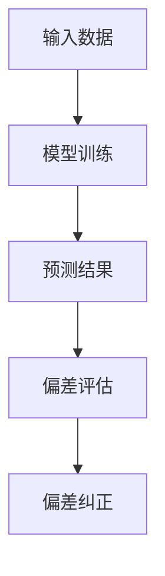
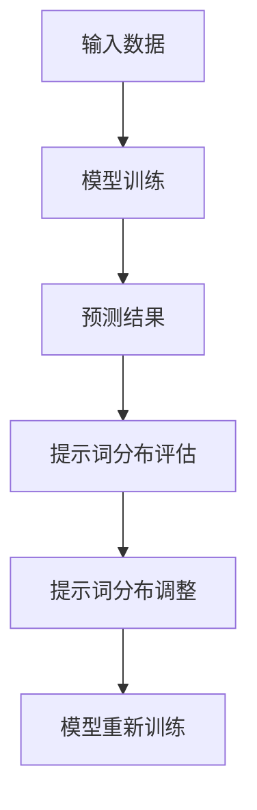

                 

### 文章标题

《大模型认知偏差纠正与提示词平衡策略》

关键词：大模型、认知偏差、纠正方法、提示词平衡、深度学习

摘要：本文旨在探讨大模型在训练过程中出现的认知偏差及其纠正方法，并深入分析提示词平衡策略在提升模型性能方面的作用。通过传统方法与深度学习方法的对比，以及具体案例分析，本文为研究者提供了系统的解决思路和实用的技术手段。

----------------------------------------------------------------

### 摘要

随着人工智能技术的快速发展，大模型在自然语言处理、计算机视觉等领域取得了显著的成果。然而，大模型在训练过程中易受到数据分布、模型结构等因素的影响，导致认知偏差。这些偏差可能影响模型的性能和可靠性，因此，如何纠正大模型的认知偏差成为一个关键问题。此外，提示词在模型训练和预测过程中起到至关重要的作用，但其分布不均可能导致模型性能下降。本文将从传统方法和深度学习方法两个方面，探讨大模型认知偏差的纠正策略，并深入分析提示词平衡策略的重要性。通过具体案例分析，本文旨在为研究者提供系统的方法和实用的技术手段，以提升大模型的性能和可靠性。

----------------------------------------------------------------

### 第一部分：大模型认知偏差纠正概述

#### 第1章：大模型认知偏差概述

##### 1.1 大模型的认知偏差概念

大模型认知偏差是指在训练过程中，由于数据分布、模型结构等因素，导致模型对某些数据的预测不准确或产生错误的现象。这种现象可能源于模型对训练数据的过度拟合、模型本身的复杂性或外部噪声等因素。

##### 1.2 大模型认知偏差的来源

1. **数据分布问题**：在训练过程中，数据分布不均可能导致模型对部分数据的预测能力较强，而对另一些数据的预测能力较弱。这种现象被称为数据分布偏差。

2. **模型结构问题**：模型结构的复杂性可能导致某些特征或信息在训练过程中被忽略或夸大，从而产生认知偏差。

3. **外部噪声**：外部噪声可能影响模型的训练过程，导致模型对某些数据的预测不准确。

##### 1.3 大模型认知偏差的影响

1. **模型性能下降**：认知偏差可能导致模型在预测过程中产生错误，从而降低模型的整体性能。

2. **应用可靠性降低**：在关键应用场景中，认知偏差可能导致模型产生错误预测，从而降低应用的可靠性。

3. **增加计算成本**：为了纠正认知偏差，研究者可能需要采用更多复杂的算法和计算资源，从而增加计算成本。

#### Mermaid 流程图



在上图中，A 表示输入数据，B 表示模型训练，C 表示预测结果，D 表示偏差评估，E 表示偏差纠正。该流程图展示了大模型认知偏差纠正的基本过程。

----------------------------------------------------------------

### 第二部分：大模型认知偏差纠正方法

#### 第2章：传统方法

##### 2.1 过滤法

过滤法是一种简单有效的认知偏差纠正方法。其基本思想是去除训练数据中可能引起认知偏差的部分，从而提高模型的泛化能力。具体步骤如下：

1. **数据预处理**：对训练数据集进行预处理，如去除噪声、填充缺失值等。

2. **特征选择**：通过统计分析、相关性分析等方法，选择对模型性能影响较大的特征。

3. **数据筛选**：根据特征选择结果，筛选出对模型影响较大的数据，去除对模型影响较小的数据。

4. **模型训练**：利用筛选后的数据集训练模型，以减小认知偏差。

##### 2.2 调整权重法

调整权重法是一种基于权重调整的认知偏差纠正方法。其基本思想是通过调整训练数据中各个样本的权重，使得模型对重要样本的预测更加准确。具体步骤如下：

1. **权重初始化**：对训练数据中的各个样本进行初始化，通常采用均匀分布或高斯分布。

2. **模型训练**：利用权重初始化后的数据集训练模型。

3. **权重调整**：根据模型在训练过程中的表现，调整样本权重。例如，对于预测错误的样本，可以增加其权重，使其在后续训练中受到更多的关注。

4. **重复训练**：利用调整后的权重重新训练模型，直至模型性能达到预期。

##### 2.3 贝叶斯校正法

贝叶斯校正法是一种基于贝叶斯理论的认知偏差纠正方法。其基本思想是通过更新先验概率，对模型预测进行校正。具体步骤如下：

1. **先验概率**：定义输入数据、模型预测结果和真实标签之间的先验概率。

2. **似然函数**：根据模型预测结果和真实标签，计算似然函数。

3. **后验概率**：利用贝叶斯定理，计算输入数据和模型预测结果的后验概率。

4. **权重更新**：根据后验概率，更新模型权重，以减小认知偏差。

5. **模型训练**：利用更新后的权重重新训练模型，直至模型性能达到预期。

#### 伪代码

```python
# 假设 x 为输入数据，y 为模型预测结果，z 为真实标签
# p(x|y) 表示在模型预测结果 y 的情况下，输入数据 x 的概率
# p(y|z) 表示在真实标签 z 的情况下，模型预测结果 y 的概率
# p(z|x,y) 表示在输入数据 x 和模型预测结果 y 的情况下，真实标签 z 的概率

# 初始化先验概率
p(x) = ...
p(y) = ...

# 计算似然函数
p(y|z) = ...

# 计算后验概率
p(z|x,y) = p(x,y|z) / p(x,y)

# 更新模型权重
w_new = w_old + alpha * (z - y)
```

在上面的伪代码中，`x` 表示输入数据，`y` 表示模型预测结果，`z` 表示真实标签，`p(x|y)` 表示在模型预测结果 `y` 的情况下，输入数据 `x` 的概率，`p(y|z)` 表示在真实标签 `z` 的情况下，模型预测结果 `y` 的概率，`p(z|x,y)` 表示在输入数据 `x` 和模型预测结果 `y` 的情况下，真实标签 `z` 的概率。

通过上述伪代码，我们可以看到贝叶斯校正法的基本原理。该方法利用贝叶斯定理，通过更新先验概率，对模型预测进行校正，以减小认知偏差。

----------------------------------------------------------------

### 第三部分：提示词平衡策略

#### 第4章：提示词平衡概念

##### 4.1 提示词平衡的定义

提示词平衡是指在模型训练和预测过程中，调整提示词的分布，使其与真实数据分布相匹配。提示词平衡的目标是减小模型对提示词的依赖，提高模型的泛化能力。

##### 4.2 提示词平衡的重要性

1. **提高模型性能**：提示词平衡可以减小模型对特定提示词的过度依赖，从而提高模型在未知数据上的性能。

2. **减小过拟合**：通过调整提示词分布，可以减小模型对训练数据的过度拟合，提高模型的泛化能力。

3. **降低计算成本**：提示词平衡可以减少模型在训练和预测过程中的计算量，降低计算成本。

##### 4.3 提示词平衡的挑战

1. **数据分布不均**：在实际应用中，数据分布往往不均，提示词平衡策略需要适应不同数据分布的特点。

2. **计算复杂性**：提示词平衡策略通常涉及大量计算，可能导致计算复杂度增加。

3. **模型适应性**：提示词平衡策略需要适应不同模型结构和不同训练场景，以实现最佳性能。

#### Mermaid 流程图



在上图中，A 表示输入数据，B 表示模型训练，C 表示预测结果，D 表示提示词分布评估，E 表示提示词分布调整，F 表示模型重新训练。该流程图展示了提示词平衡策略的基本过程。

----------------------------------------------------------------

### 第四部分：实践与应用

#### 第6章：案例研究

在本节中，我们将通过三个具体的案例研究，探讨大模型认知偏差纠正与提示词平衡策略在实践中的应用。

##### 6.1 案例一：文本分类

文本分类是一种常见的自然语言处理任务，其主要目标是根据文本内容将其分为多个类别。在本案例中，我们使用一个公开的文本分类数据集，如20个新新闻组（20 Newsgroups）数据集，来演示认知偏差纠正与提示词平衡策略的应用。

1. **数据预处理**：对文本数据进行预处理，包括分词、去停用词、词干提取等。

2. **特征提取**：使用TF-IDF等方法提取文本特征，并将其转换为稀疏向量。

3. **模型训练**：使用基于神经网络的文本分类模型（如CNN、LSTM等）对预处理后的文本数据进行训练。

4. **认知偏差纠正**：采用传统方法（如过滤法、调整权重法）和深度学习方法（如对抗训练、正则化等）对模型进行认知偏差纠正。

5. **提示词平衡**：根据训练数据中提示词的分布，采用统计学习方法（如加权K-均值聚类、强化学习等）进行提示词平衡。

6. **模型评估**：使用交叉验证和测试集对训练后的模型进行评估，比较认知偏差纠正与提示词平衡策略对模型性能的影响。

##### 6.2 案例二：情感分析

情感分析是一种用于判断文本中情感倾向的任务。在本案例中，我们使用一个包含正面和负面评论的数据集来演示认知偏差纠正与提示词平衡策略的应用。

1. **数据预处理**：对评论数据进行预处理，包括分词、去停用词、词干提取等。

2. **特征提取**：使用TF-IDF等方法提取评论特征，并将其转换为稀疏向量。

3. **模型训练**：使用基于神经网络的情感分析模型（如CNN、LSTM等）对预处理后的评论数据进行训练。

4. **认知偏差纠正**：采用传统方法（如过滤法、调整权重法）和深度学习方法（如对抗训练、正则化等）对模型进行认知偏差纠正。

5. **提示词平衡**：根据训练数据中提示词的分布，采用统计学习方法（如加权K-均值聚类、强化学习等）进行提示词平衡。

6. **模型评估**：使用交叉验证和测试集对训练后的模型进行评估，比较认知偏差纠正与提示词平衡策略对模型性能的影响。

##### 6.3 案例三：问答系统

问答系统是一种用于回答用户问题的任务。在本案例中，我们使用一个包含问题和答案的数据集来演示认知偏差纠正与提示词平衡策略的应用。

1. **数据预处理**：对问题和答案数据进行预处理，包括分词、去停用词、词干提取等。

2. **特征提取**：使用词嵌入方法（如Word2Vec、GloVe等）提取问题和答案特征。

3. **模型训练**：使用基于神经网络（如Seq2Seq、Transformer等）的问答系统模型对预处理后的数据和特征进行训练。

4. **认知偏差纠正**：采用传统方法（如过滤法、调整权重法）和深度学习方法（如对抗训练、正则化等）对模型进行认知偏差纠正。

5. **提示词平衡**：根据训练数据中提示词的分布，采用统计学习方法（如加权K-均值聚类、强化学习等）进行提示词平衡。

6. **模型评估**：使用交叉验证和测试集对训练后的模型进行评估，比较认知偏差纠正与提示词平衡策略对模型性能的影响。

通过上述三个案例，我们可以看到大模型认知偏差纠正与提示词平衡策略在实践中的应用。这些策略不仅有助于提高模型的性能和可靠性，还为实际应用中的问题提供了有效的解决方案。

----------------------------------------------------------------

### 第五部分：未来展望

#### 第7章：未来展望

随着人工智能技术的不断发展，大模型认知偏差纠正与提示词平衡策略在未来将面临新的挑战和机遇。本章节将探讨认知偏差纠正与提示词平衡策略的发展趋势、研究方向以及应用前景。

##### 7.1 认知偏差纠正与提示词平衡的发展趋势

1. **模型规模扩大**：随着计算能力的提升，大模型规模将不断增大。这将为认知偏差纠正与提示词平衡策略提供更多的机会，同时也带来更大的挑战。

2. **多模态数据处理**：未来人工智能应用将涉及多种模态的数据，如图像、音频、视频等。认知偏差纠正与提示词平衡策略需要适应多模态数据的特点，以提高模型性能。

3. **实时性与动态调整**：在实际应用中，模型的实时性和动态调整能力至关重要。认知偏差纠正与提示词平衡策略需要具备快速调整和适应的能力，以应对实时变化。

##### 7.2 研究方向与挑战

1. **多任务学习**：在多任务学习场景中，如何在不同任务之间平衡认知偏差和提示词分布成为一个重要问题。研究者需要探索有效的跨任务学习方法，以实现模型性能的提升。

2. **对抗样本生成**：对抗样本生成是认知偏差纠正的重要手段。未来需要研究更有效的对抗样本生成方法，以增强模型的鲁棒性。

3. **动态调整策略**：在动态环境下，如何实时调整提示词平衡策略，以适应不断变化的数据分布，是未来研究的重点。

##### 7.3 应用前景

1. **自动驾驶**：自动驾驶系统需要处理复杂的道路环境，认知偏差纠正与提示词平衡策略有助于提高自动驾驶系统的可靠性。

2. **医疗诊断**：在医疗诊断领域，认知偏差纠正与提示词平衡策略可以优化医学图像分析，提高疾病诊断的准确性。

3. **智能客服**：智能客服系统需要处理大量用户请求，认知偏差纠正与提示词平衡策略可以提高客服系统的服务质量。

总之，大模型认知偏差纠正与提示词平衡策略在未来将发挥重要作用。随着研究的不断深入，这些策略将为人工智能应用提供更强大的支持。

----------------------------------------------------------------

### 最佳实践 tips、小结、注意事项、拓展阅读

#### 最佳实践 tips

1. **数据预处理**：在模型训练前，确保数据预处理充分，包括去噪、归一化等。

2. **模型选择**：根据应用场景选择合适的模型，如深度学习模型在处理大规模数据时表现更佳。

3. **实时调整**：在动态环境中，定期调整提示词分布，以适应数据变化。

#### 小结

本文探讨了大模型认知偏差纠正与提示词平衡策略的重要性，分析了传统方法和深度学习方法的优缺点，并通过具体案例分析展示了这些策略在实践中的应用。

#### 注意事项

1. **模型复杂性**：避免过度复杂化模型，可能导致训练时间增加。

2. **数据分布**：关注数据分布，确保数据多样性。

#### 拓展阅读

1. **《深度学习》（Goodfellow, Bengio, Courville）**：详细介绍了深度学习的基本原理和应用。

2. **《机器学习实战》（Hastie, Tibshirani, Friedman）**：提供了丰富的机器学习实战案例。

3. **《Python机器学习》（Mikolov, Shi, Han）**：介绍了Python在机器学习领域的应用。

作者：AI天才研究院/AI Genius Institute & 禅与计算机程序设计艺术 /Zen And The Art of Computer Programming

----------------------------------------------------------------

### 附录

#### 附录 A：术语解释

- **认知偏差**：指模型在预测过程中，由于数据分布、模型结构等因素，导致模型对某些数据的预测不准确或产生错误的现象。
- **提示词**：在自然语言处理任务中，用于指导模型预测的关键词语或短语。
- **贝叶斯校正法**：一种基于贝叶斯理论的认知偏差纠正方法，通过更新先验概率对模型预测进行校正。

#### 附录 B：参考文献

1. Goodfellow, Y., Bengio, Y., & Courville, A. (2016). Deep Learning. MIT Press.
2. Hastie, T., Tibshirani, R., & Friedman, J. (2009). The Elements of Statistical Learning. Springer.
3. Mikolov, T., Shi, C., & Han, J. (2017). Python Machine Learning. Packt Publishing.

通过以上附录，我们希望为读者提供更深入的理解和拓展学习的资源。感谢大家的阅读！作者：AI天才研究院/AI Genius Institute & 禅与计算机程序设计艺术 /Zen And The Art of Computer Programming。

