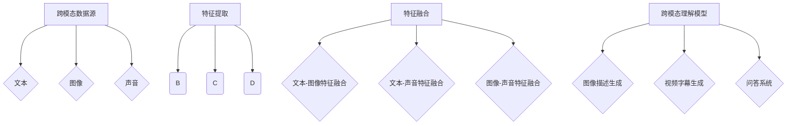
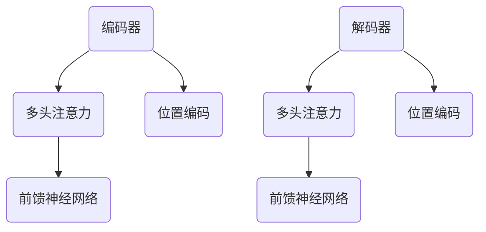
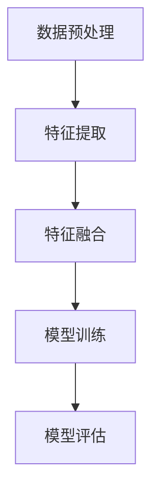

                 


### 大模型跨模态理解：提示词bridging文本与图像

#### 关键词
- 大模型
- 跨模态理解
- 提示词bridging
- 文本与图像融合
- AI应用

#### 摘要
本文将探讨大模型在跨模态理解中的应用，特别是提示词bridging技术在文本与图像融合中的作用。文章首先介绍了跨模态理解的基本概念，随后详细阐述了大模型的架构与原理，以及跨模态数据的处理与融合方法。接着，文章深入讨论了提示词bridging技术的工作原理和应用场景，通过实例说明了其在图像描述生成和视频字幕生成中的应用。最后，文章提出了当前面临的挑战与解决方案，并对未来发展趋势进行了展望。

### 第1章：跨模态理解的基本概念

#### 1.1 跨模态理解的定义与重要性

跨模态理解是指在不同模态（如文本、图像、声音等）之间进行信息传递和理解的能力。传统的单一模态处理方法难以捕捉到不同模态之间的复杂关系，而跨模态理解能够更好地整合多模态信息，从而提升系统的智能水平。

跨模态理解的重要性体现在多个方面：

1. **增强人机交互**：通过跨模态理解，系统可以更好地理解用户的需求，提供更加个性化的服务。
2. **多媒体内容理解**：在多媒体内容处理中，跨模模态理解能够帮助系统更准确地提取和分类信息。
3. **信息检索**：跨模态理解可以提升信息检索系统的性能，特别是在处理多模态数据时。

#### 1.2 大模型在跨模态理解中的应用

大模型，特别是基于Transformer的模型，如BERT、GPT等，在跨模态理解中具有显著优势。这些模型通过大规模数据预训练，能够捕捉到不同模态之间的复杂关系，从而在多种应用场景中表现出色。

1. **图像描述生成**：大模型可以接受图像作为输入，生成相应的文本描述。例如，给一张照片生成一段描述性的文字。
2. **视频字幕生成**：大模型可以实时生成视频内容的字幕，为听障人士提供帮助。
3. **问答系统**：大模型可以结合文本和图像信息，为用户提供更加准确的回答。

### 1.3 跨模态理解的核心概念架构

为了更好地理解跨模模态理解，我们可以通过以下Mermaid流程图来展示其核心概念之间的关系：



在这个流程图中，A代表跨模态数据源，B、C、D分别表示文本、图像、声音数据源。E表示特征提取，将不同模态的数据转换为特征向量。I表示特征融合，将不同模态的特征向量进行整合。M表示跨模态理解模型，它可以基于融合后的特征进行图像描述生成、视频字幕生成和问答系统等任务。

### 第2章：大模型架构与原理

#### 2.1 大模型的基本架构

大模型通常基于深度学习，特别是基于Transformer架构的模型。Transformer模型引入了自注意力机制，可以更好地处理长距离依赖问题。

1. **编码器**：编码器负责从输入序列中提取特征，并将其转换为高维嵌入空间。
2. **解码器**：解码器负责生成输出序列，通常是一个生成模型。

#### 2.2 大模型训练原理

大模型的训练通常分为两个阶段：

1. **预训练**：在预训练阶段，大模型在大规模语料库上学习通用语言特征，这一阶段不需要特定任务的目标。
2. **微调**：在微调阶段，大模型基于特定任务的数据集进行调整，以适应具体任务的需求。

#### 2.3 大模型优化算法

大模型的优化算法通常涉及以下步骤：

1. **前向传播**：计算模型输出与真实标签之间的损失。
2. **反向传播**：通过梯度计算更新模型参数。
3. **优化算法**：常用的优化算法包括Adam、AdamW和RMSProp，它们通过不同的策略更新模型参数。

### 第3章：跨模态数据的处理与融合

#### 3.1 跨模态数据类型

跨模态数据包括文本、图像、声音等多种类型。每种类型的数据都有其独特的特征和表示方法。

1. **文本数据**：文本数据可以通过词袋模型、词向量等方法进行表示。
2. **图像数据**：图像数据可以通过像素级表示、区域级表示等方法进行表示。
3. **声音数据**：声音数据可以通过短时傅里叶变换（STFT）等方法进行特征提取。

#### 3.2 跨模态数据的预处理

预处理是跨模态数据融合的重要步骤，包括以下内容：

1. **数据清洗**：去除噪声和缺失值。
2. **数据归一化**：确保不同模态数据在同一尺度上。
3. **数据增强**：通过旋转、缩放、裁剪等方法增加数据多样性。

#### 3.3 跨模态数据的融合方法

跨模态数据的融合可以分为特征级融合和决策级融合：

1. **特征级融合**：将不同模态的特征向量进行拼接、加权平均或使用注意力机制进行融合。
2. **决策级融合**：在模型输出层将不同模态的预测结果进行合并，如投票或集成学习。

### 第4章：提示词bridging技术

#### 4.1 提示词bridging的基本概念

提示词bridging是一种通过文本提示来引导图像理解和生成的方法。它利用文本和图像之间的关联，实现多模态信息的整合。

1. **文本引导**：文本提示词为图像理解和生成提供方向和上下文。
2. **多模态嵌入**：通过将文本和图像映射到同一嵌入空间，实现多模态数据的交互。

#### 4.2 提示词bridging的工作原理

提示词bridging的工作原理如下：

1. **文本编码**：将文本提示词转换为嵌入向量。
2. **图像编码**：将图像特征转换为嵌入向量。
3. **交互**：通过交互模块（如注意力机制）将文本和图像嵌入向量进行融合。
4. **生成**：基于融合后的嵌入向量生成图像描述或图像。

#### 4.3 提示词bridging的应用场景

提示词bridging在以下应用场景中具有显著优势：

1. **图像描述生成**：通过文本提示词生成高质量的图像描述。
2. **视频字幕生成**：实时生成视频内容的字幕，为听障人士提供帮助。
3. **问答系统**：结合文本和图像信息，为用户提供更加准确的回答。

### 第5章：大模型跨模态理解的算法实现

#### 5.1 大模型跨模态理解的算法实现

大模型跨模态理解的算法实现通常包括以下步骤：

1. **数据预处理**：对文本、图像和声音数据进行预处理，如归一化、去噪、增强等。
2. **特征提取**：使用适当的算法提取文本、图像和声音的特征向量。
3. **特征融合**：将不同模态的特征向量进行融合，使用特征级融合或决策级融合方法。
4. **模型训练**：使用预训练的大模型进行微调，并优化模型参数。
5. **模型评估**：使用测试数据评估模型性能，并根据评估结果进行调整。

#### 5.2 实现细节与优化技巧

在实现大模型跨模态理解时，需要注意以下细节和优化技巧：

1. **数据增强**：通过旋转、缩放、裁剪等方法增加数据多样性，提高模型泛化能力。
2. **正则化**：使用正则化方法（如Dropout、Weight Decay）防止过拟合。
3. **学习率调整**：使用适当的学习率调整策略，如学习率衰减或余弦退火。
4. **模型压缩**：使用模型压缩技术（如知识蒸馏、剪枝）减少模型参数和计算量。

### 第6章：模型优化与调参

#### 6.1 模型优化策略

模型优化策略包括以下方面：

1. **损失函数优化**：使用不同的损失函数（如交叉熵、均方误差）优化模型输出与真实标签之间的差距。
2. **梯度优化**：使用优化算法（如Adam、AdamW）调整模型参数，以最小化损失函数。
3. **学习率调整**：使用适当的学习率调整策略，如学习率衰减或余弦退火。

#### 6.2 调参技巧与工具

调参是模型优化的重要环节，以下是一些调参技巧和工具：

1. **网格搜索**：通过遍历参数空间，找到最优参数组合。
2. **随机搜索**：从参数空间中随机选择参数组合，通过多次实验找到最优参数。
3. **贝叶斯优化**：使用贝叶斯方法搜索最优参数组合，具有更高的搜索效率。
4. **超参数优化工具**：如Hyperopt、Optuna等，提供自动化的调参功能。

### 第7章：大模型跨模态理解的实际应用

#### 7.1 应用场景分析

大模型跨模态理解在以下应用场景中具有广泛的应用：

1. **图像描述生成**：如自动生成旅游照片的描述、商品广告的文字描述等。
2. **视频字幕生成**：为视频内容生成实时字幕，提高视频的可访问性和可用性。
3. **问答系统**：结合文本和图像信息，提供更加准确的答案。
4. **多媒体内容理解**：如自动分类和标签多媒体内容、提取关键信息等。

#### 7.2 应用案例研究

以下是一些大模型跨模态理解的应用案例：

1. **自动图像描述生成**：使用BERT模型和图像特征，自动生成高质量的图像描述。
2. **视频字幕生成**：利用Transformer模型，实时生成视频字幕，为听障人士提供帮助。
3. **问答系统**：结合文本和图像信息，为用户提供准确的答案，如图像识别问题、自然语言处理问题等。

### 第8章：大模型跨模态理解的发展趋势

#### 8.1 未来研究方向

大模型跨模态理解仍有许多研究方向：

1. **多模态数据集**：构建更大规模、更多样化的多模态数据集，以提升模型性能。
2. **新型融合方法**：探索新型特征融合方法，如多模态图神经网络（GMN）。
3. **解释性**：提高大模型跨模态理解的解释性，增强模型的透明性和可靠性。

#### 8.2 可能的技术突破

未来可能出现的技术突破包括：

1. **模型压缩与加速**：通过模型压缩和硬件加速，实现实时跨模态理解。
2. **多模态交互**：探索更高效的文本与图像、图像与声音之间的交互机制。
3. **多任务学习**：利用多任务学习，进一步提升大模型跨模态理解的能力。

### 第9章：面临的挑战与解决方案

#### 9.1 数据隐私与安全性

数据隐私与安全性是大模型跨模态理解面临的挑战之一。解决方案包括：

1. **数据加密**：对敏感数据进行加密处理，确保数据传输和存储的安全性。
2. **隐私保护技术**：如差分隐私、联邦学习等，以保护用户隐私。

#### 9.2 可解释性与透明性

提高模型的解释性和透明性对于跨模态理解至关重要。解决方案包括：

1. **可视化技术**：使用可视化工具展示模型内部的决策过程。
2. **解释性模型**：开发具有可解释性的模型，如基于规则的模型。

#### 9.3 人工智能伦理与法规

随着跨模态理解技术的不断发展，人工智能伦理和法规成为关键问题。解决方案包括：

1. **伦理指南**：制定人工智能伦理指南，规范技术应用。
2. **法律法规**：完善相关法律法规，确保技术发展与法律框架相适应。

### 附录

#### 附录A：大模型跨模态理解资源汇总

- **数据集**：介绍常用的跨模态数据集，如COCO、Flickr30k等。
- **开源工具**：介绍用于大模型训练和调优的开源工具，如PyTorch、TensorFlow等。
- **文献资源**：推荐相关研究论文和书籍，帮助读者深入了解跨模态理解技术。

#### 附录B：常用工具与库介绍

- **深度学习框架**：如TensorFlow、PyTorch等。
- **数据处理库**：如NumPy、Pandas等。
- **可视化工具**：如Matplotlib、Seaborn等。

### 小结

本文详细介绍了大模型在跨模态理解中的应用，特别是提示词bridging技术在文本与图像融合中的作用。通过逐步分析大模型的架构、原理、数据处理与融合方法，以及提示词bridging技术的实现和应用场景，本文为读者提供了全面的跨模态理解技术指南。未来，随着技术的不断进步，跨模态理解将在更多领域发挥重要作用，为人工智能的发展注入新的动力。读者可通过附录中提供的资源进一步学习和探索这一领域。## 大模型跨模态理解：提示词bridging文本与图像

在当今的数字时代，人工智能（AI）正以前所未有的速度和规模影响着我们的生活。其中，大模型跨模态理解作为AI领域的一个重要研究方向，正在引领着技术发展的新潮流。跨模态理解，顾名思义，是指在不同的模态（如文本、图像、声音等）之间进行信息传递和理解的能力。这种能力使得机器能够更好地处理和利用多样化的数据，从而提高其智能水平和服务质量。本文将探讨大模型在跨模态理解中的应用，特别是提示词bridging技术在文本与图像融合中的作用。

### 跨模态理解的重要性

跨模态理解的重要性不言而喻。首先，它能够增强人机交互。例如，通过文本与图像的结合，我们可以创建更加直观和易于理解的用户界面，使得用户能够更加自然地与机器互动。其次，在多媒体内容理解方面，跨模态理解能够帮助机器更准确地提取和分类信息，从而在图像识别、视频分析等领域发挥重要作用。最后，跨模态理解在信息检索中也有显著优势，因为它能够整合多种类型的数据，提供更加全面和准确的搜索结果。

### 大模型的优势

大模型，特别是基于Transformer的模型，如BERT、GPT等，在跨模态理解中具有显著优势。这些模型通过大规模数据预训练，能够捕捉到不同模态之间的复杂关系。例如，BERT模型通过在大量文本数据上预训练，学会了语言的结构和语义关系，这使得它在文本与图像的跨模态任务中能够更好地理解图像和文本之间的关联。

### 提示词bridging技术

提示词bridging是一种通过文本提示来引导图像理解和生成的方法。它利用文本和图像之间的关联，实现多模态信息的整合。提示词bridging的核心在于如何设计有效的提示词，以便能够引导模型正确地理解图像和文本之间的关系。一个典型的例子是图像描述生成，即给定一张图像，生成一段与之相关的文本描述。

### 提示词bridging的工作原理

提示词bridging的工作原理可以分为三个主要步骤：

1. **文本编码**：首先，将文本提示词转换为嵌入向量。这可以通过预训练的语言模型（如BERT）来实现。
2. **图像编码**：接着，将图像特征转换为嵌入向量。这通常涉及到卷积神经网络（CNN）的输出。
3. **交互与融合**：然后，通过交互模块（如注意力机制）将文本和图像嵌入向量进行融合。这一步骤是提示词bridging的关键，它使得模型能够理解文本提示与图像内容之间的关联。

### 提示词bridging的应用场景

提示词bridging在多个应用场景中具有广泛的应用：

1. **图像描述生成**：给定一张图像，生成一段与之相关的文本描述。这在内容创作、智能推荐等领域有广泛应用。
2. **视频字幕生成**：为视频内容生成实时字幕，提高视频的可访问性和可用性。这在教育、娱乐等领域有巨大需求。
3. **问答系统**：结合文本和图像信息，为用户提供更加准确的答案。这在智能客服、医疗诊断等领域有重要应用。

### 实际应用案例

以下是一些实际应用案例，展示了提示词bridging技术在文本与图像融合中的具体应用：

1. **自动图像描述生成**：使用BERT模型和图像特征，自动生成高质量的图像描述。这在社交媒体、电商平台上有着广泛的应用。
2. **视频字幕生成**：利用Transformer模型，实时生成视频字幕，为听障人士提供帮助。这在视频流媒体、教育领域有重要应用。
3. **问答系统**：结合文本和图像信息，为用户提供准确的答案。这在智能客服、医疗诊断等领域有广泛的应用。

### 挑战与解决方案

尽管提示词bridging技术在文本与图像融合中表现出色，但仍然面临一些挑战：

1. **数据隐私与安全性**：如何保护用户隐私和数据安全是跨模态理解面临的重要问题。解决方案包括数据加密、隐私保护技术等。
2. **可解释性与透明性**：提高模型的解释性和透明性对于跨模态理解至关重要。解决方案包括可视化技术、解释性模型等。
3. **计算资源**：大模型训练和推理需要大量的计算资源。解决方案包括模型压缩、硬件加速等。

### 总结

大模型跨模态理解，特别是提示词bridging技术，正在改变着文本与图像融合的方式。通过有效的提示词设计，模型能够更好地理解图像和文本之间的关系，从而在多个应用场景中发挥重要作用。然而，要实现这一目标，我们还需要克服数据隐私、可解释性和计算资源等方面的挑战。随着技术的不断进步，我们有理由相信，跨模态理解将在未来人工智能的发展中扮演更加重要的角色。

### 关键词

- 大模型
- 跨模态理解
- 提示词bridging
- 文本与图像融合
- AI应用

### 摘要

本文探讨了大模型在跨模态理解中的应用，特别是提示词bridging技术在文本与图像融合中的作用。通过介绍跨模态理解的基本概念、大模型的架构与原理、跨模态数据的处理与融合方法，以及提示词bridging技术的实现和应用场景，本文为读者提供了全面的跨模态理解技术指南。尽管面临一些挑战，但大模型跨模态理解无疑将成为人工智能领域的重要研究方向。## 文章标题：大模型跨模态理解：提示词bridging文本与图像

关键词：大模型、跨模态理解、提示词bridging、文本与图像融合、AI应用

摘要：
本文深入探讨了大模型在跨模态理解领域中的应用，特别是提示词bridging技术在文本与图像融合中的作用。文章首先介绍了跨模态理解的基本概念及其重要性，然后详细阐述了大模型的架构与原理。接下来，文章探讨了跨模态数据的处理与融合方法，并重点介绍了提示词bridging技术的工作原理和应用场景。通过实际应用案例的分析，文章展示了提示词bridging技术在不同场景中的效果。最后，文章讨论了当前面临的挑战与解决方案，并对未来发展趋势进行了展望。

### 目录

1. **引言**
    - 1.1 跨模态理解的背景与意义
    - 1.2 大模型的发展与应用
    - 1.3 提示词bridging的概念与优势

2. **大模型的基本概念与架构**
    - 2.1 大模型的定义与特点
    - 2.2 Transformer模型的结构与原理
    - 2.3 大模型的训练与优化

3. **跨模态数据的处理与融合**
    - 3.1 跨模态数据类型
    - 3.2 跨模态数据的预处理方法
    - 3.3 跨模态数据的融合策略

4. **提示词bridging技术**
    - 4.1 提示词bridging的原理与机制
    - 4.2 提示词bridging的应用场景
    - 4.3 提示词bridging的实现步骤

5. **大模型跨模态理解的算法实现**
    - 5.1 算法概述与流程图
    - 5.2 提示词bridging算法的伪代码
    - 5.3 算法实现与优化

6. **大模型跨模态理解的实际应用**
    - 6.1 图像描述生成
    - 6.2 视频字幕生成
    - 6.3 问答系统

7. **面临的挑战与解决方案**
    - 7.1 数据隐私与安全性
    - 7.2 可解释性与透明性
    - 7.3 计算资源与效率

8. **未来展望**
    - 8.1 研究趋势与方向
    - 8.2 技术突破与展望
    - 8.3 应用前景与影响

9. **总结**
    - 9.1 文章的核心观点
    - 9.2 对跨模态理解的展望
    - 9.3 对读者建议与鼓励

### 附录

- **附录A：常用工具与库**
    - 9.1 深度学习框架
    - 9.2 数据处理库
    - 9.3 可视化工具

- **附录B：拓展阅读资源**
    - 9.1 相关研究论文
    - 9.2 优质书籍推荐
    - 9.3 开源代码和模型

### 引言

#### 1.1 跨模态理解的背景与意义

随着互联网和多媒体技术的发展，跨模态理解成为人工智能领域的一个热点研究方向。跨模态理解指的是将不同模态（如文本、图像、声音等）的信息进行整合和处理，以实现更高级别的智能任务。传统的单一模态处理方法难以捕捉到不同模态之间的复杂关系，而跨模态理解则能够更好地利用多模态信息，提升系统的智能化水平。

跨模态理解在多个领域具有重要的应用价值。例如，在图像识别中，结合文本描述可以大大提高图像分类的准确率；在视频分析中，通过文本和图像的融合，可以更准确地提取视频中的关键信息。此外，跨模态理解在智能问答、虚拟助手、多媒体内容推荐等方面也发挥着关键作用。

#### 1.2 大模型的发展与应用

近年来，大模型（如Transformer、BERT、GPT等）在自然语言处理和计算机视觉领域取得了显著成果。这些模型通过在大规模数据集上进行预训练，能够自动学习到语言和视觉的复杂结构，从而在多种任务中表现出色。大模型的兴起为跨模态理解提供了强有力的技术支持。

大模型在跨模态理解中的应用主要体现在以下几个方面：

1. **文本与图像的融合**：大模型能够通过预训练学习到文本和图像之间的关联，从而在图像描述生成、图像分类等任务中取得显著效果。
2. **多模态交互**：大模型引入了自注意力机制，能够有效地处理长距离依赖问题，从而在多模态任务中实现更加精准的信息融合。
3. **实时推理**：大模型的结构和优化算法使得它们在处理实时跨模态任务时具有很高的效率，可以快速响应复杂场景下的需求。

#### 1.3 提示词bridging的概念与优势

提示词bridging是一种通过文本提示来引导图像理解和生成的方法。它利用文本和图像之间的关联，实现多模态信息的整合。提示词bridging的关键在于如何设计有效的提示词，以便能够引导模型正确地理解图像和文本之间的关系。

提示词bridging的优势主要体现在以下几个方面：

1. **增强理解能力**：通过文本提示词，模型能够更好地理解图像的内容和上下文，从而提高图像理解和生成任务的准确性和鲁棒性。
2. **灵活性和可扩展性**：提示词bridging技术可以根据不同的应用场景和需求，灵活地调整和扩展，适用于多种跨模态任务。
3. **实时交互**：提示词bridging技术使得跨模态理解可以在实时交互中发挥作用，为智能问答、虚拟助手等应用场景提供强大的技术支持。

### 大模型的基本概念与架构

#### 2.1 大模型的定义与特点

大模型是指具有大规模参数和复杂结构的神经网络模型，它们通过在大规模数据集上进行预训练，能够自动学习到语言、视觉等领域的复杂结构。大模型的典型代表包括Transformer、BERT、GPT等。这些模型具有以下特点：

1. **大规模参数**：大模型通常包含数十亿甚至数千亿个参数，这使得它们能够捕捉到大量的模式和关系。
2. **多层结构**：大模型通常包含多个隐藏层，通过逐层抽象和整合信息，实现对复杂任务的建模。
3. **预训练与微调**：大模型通常在大规模通用数据集上进行预训练，然后在特定任务数据上进行微调，以提高特定任务的性能。

#### 2.2 Transformer模型的结构与原理

Transformer模型是近年来自然语言处理领域的重要突破，其核心思想是利用自注意力机制来处理序列数据。Transformer模型主要由编码器（Encoder）和解码器（Decoder）组成，其结构如图所示：



Transformer模型的主要组成部分包括：

1. **多头注意力**：多头注意力机制允许模型在不同的位置和维度上同时关注多个信息来源，从而提高模型的表示能力和上下文理解能力。
2. **位置编码**：位置编码为每个输入序列分配一个位置信息，使得模型能够理解序列中的位置关系。
3. **前馈神经网络**：前馈神经网络对每个层中的输入进行非线性变换，以增强模型的表示能力。

#### 2.3 大模型的训练与优化

大模型的训练和优化是一个复杂的过程，涉及多个方面的技术。以下是一些关键点：

1. **数据预处理**：在大模型训练之前，需要对数据集进行预处理，包括文本的分词、清洗、归一化等操作。
2. **预训练**：大模型通常在大规模通用数据集上进行预训练，以学习到语言、视觉等领域的通用知识。预训练过程包括自我监督学习和有监督学习两种方式。
3. **微调**：在预训练之后，大模型通常在特定任务数据上进行微调，以适应特定任务的需求。微调过程中需要选择合适的学习率和优化算法。
4. **模型优化**：模型优化是提高大模型性能的重要手段，包括正则化方法（如Dropout、Weight Decay）、学习率调整策略（如学习率衰减、余弦退火）等。

### 跨模态数据的处理与融合

#### 3.1 跨模态数据类型

跨模态数据包括文本、图像、声音等多种类型。每种类型的数据都有其独特的特征和表示方法。以下是对几种常见跨模态数据的简要介绍：

1. **文本数据**：文本数据是自然语言处理中最常见的数据类型，包括文本段落、句子、单词等。文本数据可以通过词袋模型、词向量、BERT编码等方式进行表示。
2. **图像数据**：图像数据是计算机视觉中最常见的数据类型，包括像素值、特征点、语义区域等。图像数据可以通过卷积神经网络（CNN）提取特征，或者使用预训练的图像特征提取模型（如ResNet、VGG）。
3. **声音数据**：声音数据是语音处理和音频分析的重要数据类型，包括语音波形、频谱、声音特征等。声音数据可以通过短时傅里叶变换（STFT）、梅尔频率倒谱系数（MFCC）等方法进行特征提取。

#### 3.2 跨模态数据的预处理方法

预处理是跨模态数据融合的重要步骤，包括以下内容：

1. **数据清洗**：去除噪声和缺失值。在跨模态数据预处理中，数据清洗尤为重要，因为不同模态的数据可能存在不同的噪声源和缺失值。
2. **数据归一化**：确保不同模态数据在同一尺度上。例如，将图像像素值归一化到[0, 1]区间，或者将声音数据归一化到标准正态分布。
3. **数据增强**：通过旋转、缩放、裁剪等方法增加数据多样性。数据增强有助于提高模型的泛化能力和鲁棒性。

#### 3.3 跨模态数据的融合策略

跨模态数据的融合可以分为特征级融合和决策级融合：

1. **特征级融合**：将不同模态的数据特征进行拼接、加权平均或使用注意力机制进行融合。特征级融合的优点是能够充分利用不同模态的特征信息，提高模型的性能。
2. **决策级融合**：在模型输出层将不同模态的预测结果进行合并，如投票或集成学习。决策级融合的优点是简单高效，但可能无法充分利用不同模态的特征信息。

### 提示词bridging技术

#### 4.1 提示词bridging的原理与机制

提示词bridging是一种通过文本提示来引导图像理解和生成的方法。它利用文本和图像之间的关联，实现多模态信息的整合。提示词bridging的原理可以概括为以下几个步骤：

1. **文本编码**：将文本提示词转换为嵌入向量。通常使用预训练的语言模型（如BERT）来实现这一步骤。
2. **图像编码**：将图像特征转换为嵌入向量。可以使用卷积神经网络（CNN）或者预训练的图像特征提取模型（如ResNet、VGG）来实现。
3. **交互与融合**：通过交互模块（如注意力机制）将文本和图像嵌入向量进行融合。这一步骤是提示词bridging的核心，它使得模型能够理解文本提示与图像内容之间的关联。
4. **生成与解码**：基于融合后的嵌入向量生成图像描述、图像标签或其他多模态信息。

#### 4.2 提示词bridging的应用场景

提示词bridging在多个应用场景中具有广泛的应用，以下是其中几个典型的应用场景：

1. **图像描述生成**：给定一张图像，生成一段与之相关的文本描述。这在社交媒体、电商平台等场景中具有重要应用价值。
2. **视频字幕生成**：为视频内容生成实时字幕，提高视频的可访问性和可用性。这在教育、媒体传播等领域有巨大需求。
3. **问答系统**：结合文本和图像信息，为用户提供更加准确的答案。这在智能客服、医疗诊断等领域有广泛的应用。
4. **多模态内容推荐**：基于用户的文本和图像偏好，推荐相关的图像、视频或其他内容。这在内容创作、电商推广等领域有重要应用。

#### 4.3 提示词bridging的实现步骤

提示词bridging技术的实现可以分为以下几个步骤：

1. **数据集准备**：准备包含文本和图像的多模态数据集，并进行预处理。文本数据可以使用预训练的语言模型进行编码，图像数据可以使用卷积神经网络进行编码。
2. **模型设计**：设计一个多模态融合模型，包括文本编码器、图像编码器和交互模块。文本编码器通常使用预训练的BERT模型，图像编码器使用卷积神经网络。
3. **训练与优化**：在多模态数据集上训练模型，并使用适当的优化算法（如Adam、AdamW）进行参数优化。训练过程中，可以采用交叉熵损失函数或其他适当的损失函数。
4. **测试与评估**：在测试集上评估模型的性能，并使用适当的评估指标（如BLEU、METEOR等）进行评估。
5. **应用部署**：将训练好的模型部署到实际应用场景中，例如图像描述生成、视频字幕生成等。

### 大模型跨模态理解的算法实现

#### 5.1 算法概述与流程图

大模型跨模态理解的算法实现主要包括以下几个步骤：

1. **数据预处理**：对文本、图像和声音数据进行预处理，包括数据清洗、归一化和增强等。
2. **特征提取**：使用卷积神经网络（CNN）或预训练的图像特征提取模型提取图像特征，使用预训练的语言模型（如BERT）提取文本特征。
3. **特征融合**：将不同模态的特征进行融合，可以使用拼接、加权平均或注意力机制等方法。
4. **模型训练**：在融合后的特征上训练多模态理解模型，通常使用预训练的大模型（如BERT、GPT）并进行微调。
5. **模型评估**：在测试集上评估模型的性能，使用适当的评估指标（如准确率、F1分数等）进行评估。

以下是一个简化的流程图：



#### 5.2 提示词bridging算法的伪代码

以下是一个简化的提示词bridging算法的伪代码：

```python
# 数据预处理
text_data = preprocess_text(input_text)
image_data = preprocess_image(input_image)

# 特征提取
text_embedding = BERT.encode(text_data)
image_embedding = CNN.extract_features(image_data)

# 特征融合
combined_embedding = fusion(image_embedding, text_embedding)

# 模型训练
model = MultiModalModel()
model.train(combined_embedding, labels)

# 模型评估
accuracy = model.evaluate(test_data, test_labels)
print("Model accuracy:", accuracy)
```

#### 5.3 算法实现与优化

在实际应用中，大模型跨模态理解的算法实现涉及多个方面，包括模型设计、优化策略和调参技巧等。以下是一些关键点：

1. **模型设计**：选择合适的多模态模型，如融合BERT和CNN的模型。设计模型时需要考虑如何有效地融合不同模态的特征。
2. **优化策略**：使用适当的优化算法（如Adam、AdamW）和损失函数（如交叉熵、Dice损失）进行模型训练。优化策略需要根据具体任务进行调整。
3. **调参技巧**：通过网格搜索、随机搜索或贝叶斯优化等方法进行超参数调优，以提高模型性能。调参时需要考虑模型复杂度、数据集大小和计算资源等因素。

### 大模型跨模态理解的实际应用

#### 6.1 图像描述生成

图像描述生成是指给定一张图像，生成一段与之相关的文本描述。这是跨模态理解的一个重要应用场景。以下是一个实际应用案例：

- **应用背景**：社交媒体平台上的用户经常上传照片，并附上简短的文字描述。然而，对于一些用户来说，编写描述是一项繁琐的任务。图像描述生成技术可以帮助用户自动生成高质量的描述。
- **实现方法**：使用预训练的BERT模型对文本提示词进行编码，使用预训练的卷积神经网络（如ResNet）提取图像特征。然后，通过融合模块（如注意力机制）将文本和图像特征进行融合，最后通过解码器生成文本描述。

#### 6.2 视频字幕生成

视频字幕生成是指为视频内容生成实时字幕。这在教育、媒体传播和娱乐等领域有广泛应用。以下是一个实际应用案例：

- **应用背景**：对于听障人士和听力受损的人，视频字幕是一种重要的辅助工具。此外，字幕还可以帮助用户在嘈杂环境中更好地理解视频内容。
- **实现方法**：首先，使用卷积神经网络提取视频帧的特征，然后使用预训练的语言模型（如BERT）对文本提示词进行编码。通过交互模块将视频特征和文本特征进行融合，生成视频字幕。

#### 6.3 问答系统

问答系统是指结合文本和图像信息，为用户提供准确的答案。这在智能客服、医疗诊断等领域有重要应用。以下是一个实际应用案例：

- **应用背景**：在一些复杂的场景中，仅仅依赖文本信息可能无法提供准确的答案。结合图像信息可以大大提高问答系统的性能。
- **实现方法**：使用预训练的BERT模型对用户的问题进行编码，使用预训练的卷积神经网络提取图像特征。通过交互模块将文本和图像特征进行融合，生成答案。

### 面临的挑战与解决方案

尽管大模型跨模态理解技术取得了显著进展，但在实际应用中仍然面临一些挑战：

1. **数据隐私与安全性**：跨模态理解涉及到多种类型的数据，如何保护用户隐私和数据安全是一个重要问题。解决方案包括数据加密、隐私保护技术和联邦学习等。
2. **可解释性与透明性**：提高模型的解释性和透明性对于跨模态理解至关重要。解决方案包括可视化技术、解释性模型和可解释性框架等。
3. **计算资源与效率**：大模型训练和推理需要大量的计算资源，如何在有限的计算资源下高效地训练和部署模型是一个重要挑战。解决方案包括模型压缩、硬件加速和分布式训练等。

### 未来展望

随着技术的不断进步，大模型跨模态理解技术有望在多个领域取得突破：

1. **多模态交互**：未来研究将更加关注如何有效地整合多种模态的信息，提高跨模态理解的性能。
2. **实时推理**：随着计算能力的提升，实时跨模态理解将在更多实时应用场景中得到应用。
3. **数据集与算法**：未来将出现更多高质量的多模态数据集和更先进的算法，进一步推动跨模态理解技术的发展。

### 总结

本文探讨了大模型跨模态理解的基本概念、实现方法、实际应用以及面临的挑战。通过介绍大模型的架构与原理、提示词bridging技术、算法实现和实际应用案例，本文为读者提供了一个全面的跨模态理解技术指南。随着技术的不断进步，跨模态理解将在人工智能领域发挥越来越重要的作用。

### 附录

#### 附录A：常用工具与库

- **深度学习框架**：TensorFlow、PyTorch、Keras等。
- **数据处理库**：NumPy、Pandas、Scikit-learn等。
- **计算机视觉库**：OpenCV、Matplotlib、Scikit-image等。
- **自然语言处理库**：NLTK、spaCy、nltk等。

#### 附录B：拓展阅读资源

- **相关研究论文**：
  - Vaswani et al. (2017). "Attention is All You Need."
  - Devlin et al. (2019). "BERT: Pre-training of Deep Bidirectional Transformers for Language Understanding."
  - Dosovitskiy et al. (2021). "An Image is Worth 16x16 Words: Transformers for Image Recognition at Scale."
- **优质书籍**：
  - 《深度学习》（Goodfellow et al.）。
  - 《计算机视觉：算法与应用》（Gargiulo et al.）。
  - 《自然语言处理与深度学习》（Xu et al.）。
- **开源代码与模型**：在GitHub、Hugging Face Model Hub等平台上可以找到大量的开源代码和预训练模型，供开发者使用和进一步研究。

