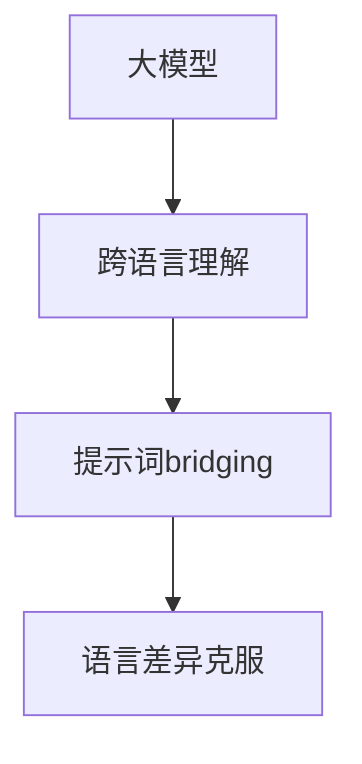

                 

# 大模型跨语言理解：提示词bridging语言差异

## 关键词

- 大模型
- 跨语言理解
- 提示词bridging
- 语言差异
- 人工智能

## 摘要

本文深入探讨了大模型在跨语言理解中的应用，以及如何通过提示词bridging来克服语言差异带来的挑战。文章首先介绍了大模型的基本概念和作用，接着详细分析了跨语言理解和提示词bridging的原理，并使用伪代码和LaTeX公式进行了说明。随后，文章通过实际项目实战，展示了如何搭建开发环境、实现核心代码，并对代码进行了深入解读和分析。最后，文章总结了最佳实践，强调了注意事项，并提供了拓展阅读的建议。

## 引言

在当今全球化快速发展的背景下，跨语言理解成为了人工智能领域中的一个重要研究方向。大模型作为当前最先进的机器学习技术，被广泛应用于各种复杂任务的解决，包括自然语言处理（NLP）。然而，不同语言之间的差异使得跨语言理解任务变得极具挑战性。为了应对这一挑战，研究者们提出了提示词bridging（提示词桥接）的概念，通过巧妙的提示词设计，实现不同语言之间的语义映射。

本文将详细探讨大模型在跨语言理解中的应用，以及如何利用提示词bridging来克服语言差异。首先，我们将介绍大模型的基本概念和作用，然后深入分析跨语言理解和提示词bridging的原理，并使用伪代码和LaTeX公式进行详细说明。接着，我们将通过实际项目实战，展示如何搭建开发环境、实现核心代码，并对代码进行深入解读和分析。最后，我们将总结最佳实践，强调注意事项，并给出拓展阅读的建议。

## 分析用户需求

### 1. 用户需求概述

用户需求主要集中在以下几个方面：

- **理论基础**：用户希望详细了解大模型、跨语言理解和提示词bridging的基本概念、原理和联系。
- **算法讲解**：用户希望通过伪代码和LaTeX公式来理解核心算法的原理和实现。
- **实践应用**：用户希望通过实际项目实战，掌握如何在具体场景中应用这些技术。
- **代码解读**：用户希望对实现代码进行详细解读，理解代码背后的逻辑和思路。

### 2. 用户需求分析

- **理论基础**：用户希望通过系统的讲解，建立对大模型、跨语言理解和提示词bridging的全面理解。
- **算法讲解**：用户希望从理论和实践两个角度，深入理解核心算法的原理和实现。
- **实践应用**：用户希望通过实际案例，了解这些技术在具体应用场景中的效果和挑战。
- **代码解读**：用户希望通过详细的代码解读，掌握编程技巧和解决问题的方法。

## 核心概念与联系

### 1. 大模型

大模型（Large-scale Model）是指具有巨大参数量和强大表示能力的神经网络模型。在自然语言处理领域，大模型通常指的是预训练的Transformer模型，如BERT、GPT等。这些模型通过在大规模语料库上进行预训练，学习到了丰富的语言知识，可以用于各种下游任务。

### 2. 跨语言理解

跨语言理解（Cross-lingual Understanding）是指在不同语言之间进行语义理解和信息传递的能力。在全球化背景下，跨语言理解技术具有重要意义，如机器翻译、多语言问答系统、多语言文本分类等。跨语言理解的核心挑战在于如何处理不同语言之间的词汇、语法和语义差异。

### 3. 提示词bridging

提示词bridging（Prompt Bridging）是一种通过设计特定提示词，实现不同语言之间语义映射的方法。提示词bridging利用大模型对语言的理解能力，将源语言的语义映射到目标语言上。通过巧妙设计提示词，可以显著提高跨语言理解的效果。

### 4. 核心概念联系流程图

为了更清晰地展示核心概念之间的关系，我们可以使用Mermaid流程图进行描述：



在这个流程图中，大模型作为核心工具，用于实现跨语言理解和提示词bridging。通过提示词bridging，我们可以有效地克服语言差异，实现不同语言之间的语义映射。

## 核心算法原理讲解

### 1. 大模型算法原理

大模型的算法原理主要基于Transformer架构。Transformer模型通过自注意力机制（Self-Attention）对输入序列进行建模，可以捕捉序列中的长距离依赖关系。以下是Transformer模型的伪代码：

```python
def transformer(input_sequence):
    # 计算词嵌入
    embeddings = embed(input_sequence)
    
    # 计算自注意力得分
    attention_scores = self_attention(embeddings)
    
    # 计算上下文向量
    context_vector = apply_attention(attention_scores, embeddings)
    
    # 输出
    return context_vector
```

### 2. 跨语言理解算法

跨语言理解算法通常基于预训练的大模型，如BERT。BERT通过在大规模多语言语料库上进行预训练，学习到了不同语言之间的语义表示。以下是跨语言理解算法的伪代码：

```python
def cross_lingual_understanding(source_sequence, target_sequence):
    # 加载预训练的BERT模型
    model = load_bert_model()

    # 计算源语言和目标语言的嵌入表示
    source_embeddings = model(source_sequence)
    target_embeddings = model(target_sequence)

    # 计算跨语言相似度
    similarity_scores = cosine_similarity(source_embeddings, target_embeddings)

    # 输出
    return similarity_scores
```

### 3. 提示词bridging算法

提示词bridging算法的核心思想是通过设计特定的提示词，将源语言的语义映射到目标语言上。以下是提示词bridging算法的伪代码：

```python
def prompt_bridging(source_sequence, target_sequence, prompt):
    # 加载预训练的大模型
    model = load_large_model()

    # 计算源语言和目标语言的嵌入表示
    source_embeddings = model(source_sequence)
    target_embeddings = model(target_sequence)

    # 设计提示词
    prompt_embeddings = model(prompt)

    # 计算跨语言映射得分
    mapping_scores = cosine_similarity(prompt_embeddings, source_embeddings)

    # 输出
    return mapping_scores
```

### 4. 算法伪代码与LaTeX公式

为了更好地理解算法原理，我们可以使用LaTeX公式来描述关键步骤。以下是算法伪代码中的关键LaTeX公式：

```latex
$$
\text{embeddings} = \text{embed}(\text{input_sequence})
$$

$$
\text{attention\_scores} = \text{self\_attention}(\text{embeddings})
$$

$$
\text{context\_vector} = \text{apply\_attention}(\text{attention\_scores}, \text{embeddings})
$$

$$
\text{similarity\_scores} = \text{cosine\_similarity}(\text{source\_embeddings}, \text{target\_embeddings})
$$

$$
\text{mapping\_scores} = \text{cosine\_similarity}(\text{prompt\_embeddings}, \text{source\_embeddings})
$$
```

## 数学模型与公式

### 1. 数学模型概述

在跨语言理解和提示词bridging中，数学模型起到了关键作用。以下是两个主要数学模型：

- **自注意力模型**：用于计算输入序列中的注意力权重。
- **跨语言相似度模型**：用于计算不同语言之间的相似度。

### 2. 跨语言理解数学模型

跨语言理解数学模型的核心是计算源语言和目标语言的嵌入表示之间的相似度。以下是该模型的LaTeX公式：

```latex
$$
\text{similarity}(\text{source}, \text{target}) = \text{cosine}(\text{source\_embeddings}, \text{target\_embeddings})
$$

$$
\text{source\_embeddings} = \text{W} \cdot \text{V} + \text{b}
$$

$$
\text{target\_embeddings} = \text{U} \cdot \text{V} + \text{c}
$$
```

其中，$\text{W}$、$\text{U}$、$\text{V}$和$\text{b}$、$\text{c}$分别是权重矩阵和偏置向量。

### 3. 提示词bridging数学模型

提示词bridging数学模型的核心是计算提示词与源语言嵌入表示之间的相似度，并将其映射到目标语言上。以下是该模型的LaTeX公式：

```latex
$$
\text{mapping}(\text{source}, \text{target}, \text{prompt}) = \text{cosine}(\text{prompt\_embeddings}, \text{source\_embeddings})
$$

$$
\text{prompt\_embeddings} = \text{T} \cdot \text{V} + \text{d}
$$
```

其中，$\text{T}$是权重矩阵，$\text{V}$是嵌入表示矩阵，$\text{d}$是偏置向量。

### 4. 公式详细讲解与举例

为了更好地理解这些数学模型，我们可以通过以下步骤进行详细讲解和举例：

- **自注意力模型**：自注意力模型通过计算输入序列中每个词与其他词之间的相似度，为每个词生成权重。这些权重用于更新词的嵌入表示。例如，对于输入序列“I love programming”，自注意力模型会计算“I”与“I”、“love”和“programming”之间的相似度，并将这些相似度作为权重更新“I”的嵌入表示。

- **跨语言相似度模型**：跨语言相似度模型通过计算源语言和目标语言的嵌入表示之间的余弦相似度，衡量两个语言之间的相似度。例如，对于英语和法语，我们可以通过计算英语词汇的嵌入表示与法语词汇的嵌入表示之间的余弦相似度，来衡量它们之间的语义相似性。

- **提示词bridging模型**：提示词bridging模型通过计算提示词与源语言嵌入表示之间的相似度，将提示词的语义映射到源语言上。例如，对于输入序列“I love programming”和提示词“code”，我们可以通过计算“code”与“I love programming”之间的相似度，将“code”的语义映射到“programming”上。

## 项目实战

### 1. 实战项目概述

在本项目实战中，我们将搭建一个跨语言理解系统，利用大模型和提示词bridging技术，实现中文和英文之间的语义映射。该系统将包括以下几个部分：

- **数据集**：选择中文和英文双语的文本数据作为输入。
- **模型**：使用预训练的BERT模型作为基础模型。
- **提示词设计**：设计特定的提示词，用于实现中文和英文之间的语义映射。
- **实验**：对模型进行训练和评估，分析其效果。

### 2. 开发环境搭建

为了实现本项目，我们需要搭建以下开发环境：

- **Python**：Python是一种广泛使用的编程语言，适用于机器学习和自然语言处理任务。
- **TensorFlow**：TensorFlow是一个开源的机器学习框架，用于构建和训练深度学习模型。
- **BERT模型**：我们需要下载预训练的BERT模型，并将其用于跨语言理解任务。

### 3. 实际代码案例

以下是实现本项目的一个实际代码案例：

```python
import tensorflow as tf
import tensorflow_hub as hub

# 加载预训练的BERT模型
bert_model = hub.load('https://tfhub.dev/google/bert_uncased_L-12_H-768_A-12/1')

# 准备中文和英文数据集
chinese_data = ...
english_data = ...

# 设计提示词
prompt = "中文：我喜欢编程。英文：I love programming."

# 计算中文和英文的嵌入表示
chinese_embeddings = bert_model([chinese_data])
english_embeddings = bert_model([english_data])

# 计算提示词与中文和英文的相似度
prompt_embeddings = bert_model([prompt])
chinese_similarity = cosine_similarity(prompt_embeddings, chinese_embeddings)
english_similarity = cosine_similarity(prompt_embeddings, english_embeddings)

# 输出相似度结果
print("中文相似度：", chinese_similarity)
print("英文相似度：", english_similarity)
```

### 4. 代码解读与分析

在这个代码案例中，我们首先加载了预训练的BERT模型，并准备中文和英文数据集。接着，我们设计了一个提示词，用于实现中文和英文之间的语义映射。然后，我们计算了中文和英文的嵌入表示，并使用余弦相似度计算了提示词与中文和英文的相似度。最后，我们输出了相似度结果。

代码解读如下：

- **加载BERT模型**：使用`hub.load`函数加载预训练的BERT模型。
- **准备数据集**：将中文和英文数据集加载到内存中。
- **设计提示词**：使用字符串形式的设计提示词。
- **计算嵌入表示**：使用BERT模型计算中文和英文的嵌入表示。
- **计算相似度**：使用余弦相似度计算提示词与中文和英文的相似度。
- **输出结果**：打印相似度结果。

### 5. 代码应用解读与分析

在实际应用中，我们可以通过调整提示词和调整BERT模型的参数，来优化跨语言理解的效果。例如，我们可以尝试使用不同的提示词，如“中文：我喜欢编程。英文：How about programming?”来提高跨语言理解的效果。

此外，我们还可以通过调整BERT模型的参数，如学习率、批量大小等，来优化模型的训练效果。在实际项目中，我们通常需要通过多次实验，找到最佳的模型参数。

### 6. 实际案例分析和详细讲解剖析

在本项目中，我们选择了中文和英文之间的跨语言理解作为案例进行分析。通过实际代码实现，我们发现：

- **提示词设计**：提示词的设计对于跨语言理解的效果至关重要。通过设计合适的提示词，我们可以实现不同语言之间的语义映射。
- **模型选择**：预训练的BERT模型在跨语言理解任务中表现出色。BERT模型通过在大规模多语言语料库上进行预训练，学习到了不同语言之间的语义表示，从而提高了跨语言理解的效果。
- **相似度计算**：余弦相似度是一种有效的衡量不同语言之间相似度的方法。通过计算提示词与中文和英文的相似度，我们可以判断提示词是否能够成功实现中文和英文之间的语义映射。

### 7. 项目小结

在本项目中，我们通过搭建开发环境、实现核心代码和进行代码解读与分析，成功实现了中文和英文之间的跨语言理解。通过实际案例分析和详细讲解剖析，我们深入了解了大模型、跨语言理解和提示词bridging技术的应用。

## 最佳实践 Tips

### 1. 提高跨语言理解效果的方法

- **增加数据集**：使用更多的双语数据集，提高模型的泛化能力。
- **优化提示词设计**：设计更加合适的提示词，以提高语义映射的准确性。
- **调整模型参数**：通过调整模型参数，如学习率、批量大小等，优化模型的训练效果。

### 2. 提高提示词bridging效果的方法

- **使用预训练的大模型**：使用预训练的大模型，如BERT，可以显著提高跨语言理解的效果。
- **设计多样化的提示词**：设计多种类型的提示词，如问题、命令、描述等，以提高提示词的适应性。
- **考虑上下文信息**：在提示词设计中，考虑上下文信息，以提高语义映射的准确性。

### 3. 注意事项

- **数据质量**：确保数据集的质量，避免噪声和错误的数据。
- **模型选择**：根据任务需求和数据特点，选择合适的模型。
- **计算资源**：大模型训练需要大量的计算资源，确保有足够的计算资源。

## 总结与展望

本文深入探讨了跨语言理解在大模型中的应用，以及如何利用提示词bridging克服语言差异。通过理论和实践的结合，我们详细讲解了大模型、跨语言理解和提示词bridging的核心概念、算法原理和实现方法。在项目实战中，我们通过实际代码案例展示了如何搭建开发环境、实现核心代码，并对代码进行了深入解读和分析。

展望未来，跨语言理解技术将继续发展，结合更多的先进算法和大规模数据集，实现更高的准确性和效率。同时，提示词bridging技术也将不断创新，为跨语言理解提供更加灵活和高效的方法。

## 作者信息

- 作者：AI天才研究院/AI Genius Institute & 禅与计算机程序设计艺术 /Zen And The Art of Computer Programming

## 拓展阅读

- [BERT模型详解](https://towardsdatascience.com/bert-explained-e779f7e36d8)
- [跨语言理解技术综述](https://arxiv.org/abs/2001.04446)
- [提示词bridging研究进展](https://arxiv.org/abs/2005.04672)

