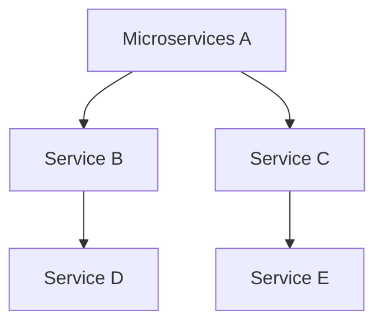
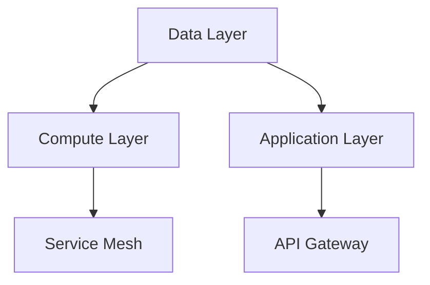
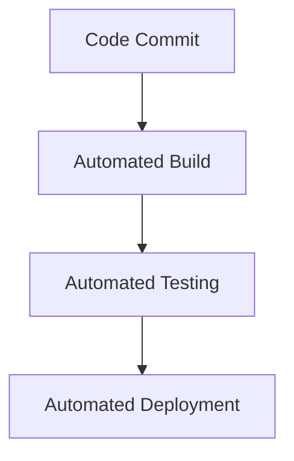
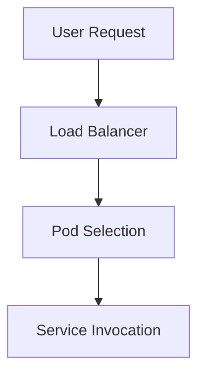
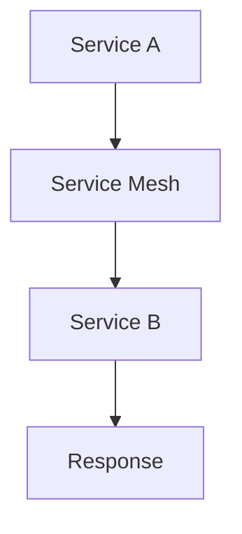
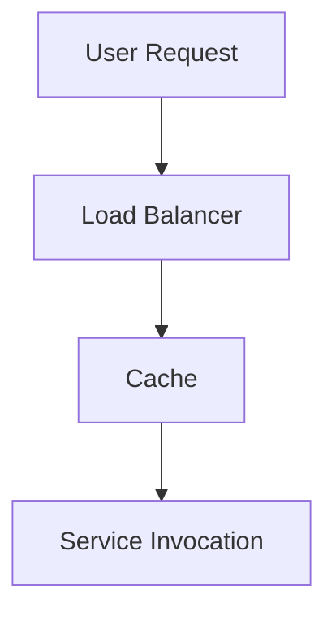
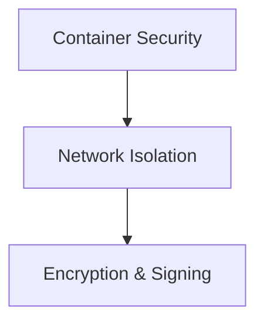
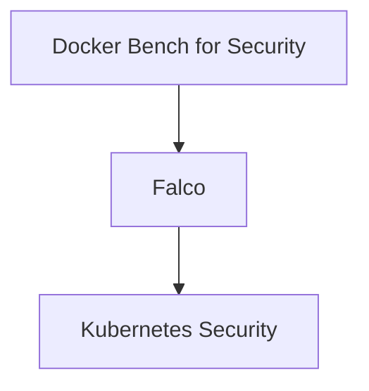
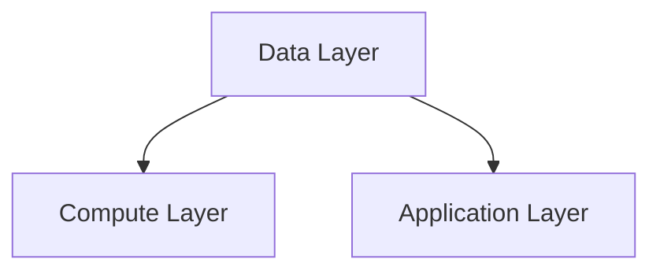
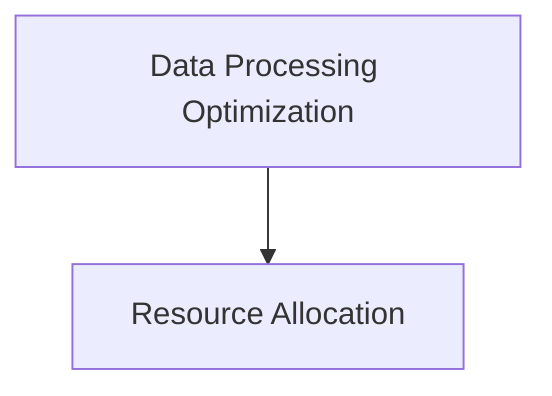

                 

## 文章标题：大模型软件的云原生架构设计

### 关键词：云原生架构，大模型软件，容器化，微服务，Kubernetes，性能优化，安全性

### 摘要：
本文将探讨大模型软件在云原生架构下的设计与实现。我们将首先介绍云原生架构的基本概念和特点，然后深入分析其在大模型软件中的应用。文章将涵盖从架构设计原则、数据处理与存储、部署与运维到性能优化和安全性保障的全面内容，并附以实际项目案例进行剖析，最后总结云原生架构在未来的发展趋势。

## 引言：云原生架构概述

随着云计算和容器技术的迅猛发展，传统的软件架构设计逐渐无法满足现代应用的需求。云原生架构（Cloud Native Architecture）应运而生，它以微服务、容器化、动态管理、自动化等理念为核心，为分布式系统提供了一种全新的架构设计范式。云原生架构具有以下主要特点：

1. **微服务化**：将应用程序拆分为多个独立、可扩展的小服务，每个服务专注于完成特定功能。
2. **容器化**：使用容器（如Docker）封装应用程序及其运行环境，实现高效的部署和迁移。
3. **自动化管理**：通过自动化工具（如Kubernetes）进行服务编排、弹性伸缩、自动恢复等，提高运维效率。
4. **动态管理**：基于云基础设施的弹性，实现资源的动态分配和优化，提高系统可用性和性能。

云原生架构的重要性在于其能够极大地提升软件系统的可扩展性、灵活性和可靠性，使得企业能够更好地应对快速变化的市场需求和技术挑战。对于大模型软件而言，云原生架构的引入不仅能够优化资源利用，提升性能，还能提高系统的可靠性和可维护性。

## 云原生架构的核心概念与原理

### 微服务架构

微服务架构（Microservices Architecture）是一种将大型复杂应用程序拆分为一组小而独立的服务的方法。每个服务都有自己的数据存储、业务逻辑和API，并且可以在不同的服务器上独立部署和运行。微服务架构的主要优势在于其高可伸缩性、高可用性和易于维护。

#### 核心概念与联系

微服务架构的核心概念包括：

- **服务自治**：每个服务都是独立的，拥有自己的开发、测试和部署流程。
- **松耦合**：服务之间通过API进行通信，解耦度较高，降低系统的复杂性。
- **分布式数据管理**：每个服务都有自己的数据存储，支持数据的一致性和分布式处理。

微服务架构与云原生架构的联系在于，它们都是基于云服务和容器技术构建的，能够实现动态管理和自动化部署。以下是微服务架构的 Mermaid 流程图：



### 容器化技术

容器化（Containerization）是一种将应用程序及其依赖环境封装在一个轻量级、可移植的容器中的技术。容器化技术使得应用程序能够在任何支持容器引擎的环境中运行，大大简化了部署和迁移过程。

#### 核心概念与联系

容器化技术的核心概念包括：

- **容器引擎**：如Docker，用于创建和管理容器。
- **容器镜像**：应用程序及其依赖环境的静态文件，用于构建容器。
- **容器编排**：通过编排工具（如Kubernetes）管理容器的生命周期和资源分配。

容器化技术与微服务架构的关系在于，容器化技术为微服务架构提供了实现基础，使得微服务能够以更高效、更灵活的方式部署和管理。

### Kubernetes与编排管理

Kubernetes（简称K8s）是一个开源的容器编排和管理平台，用于自动化容器的部署、扩展和管理。Kubernetes提供了一系列丰富的功能，如负载均衡、服务发现、存储编排、自动恢复等，能够有效地提高系统的可靠性和性能。

#### 核心概念与联系

Kubernetes的核心概念包括：

- **Pod**：Kubernetes中的最小部署单元，包含一个或多个容器。
- **部署（Deployment）**：用于管理Pod的创建、更新和伸缩。
- **服务（Service）**：用于将Pod暴露给外部网络，实现负载均衡。
- **Ingress**：用于管理外部流量进入集群的方式。

Kubernetes与微服务架构的联系在于，Kubernetes能够自动化地管理微服务，确保其高可用性和性能。

### 服务网格与API网关

服务网格（Service Mesh）是一种用于管理服务间通信的分布式系统。服务网格通过独立的通信基础设施（如Istio）提供了一种灵活、可扩展的服务间通信解决方案，使得开发者能够专注于业务逻辑的开发，而不必担心服务之间的通信问题。

API网关（API Gateway）是一种统一的服务访问入口，用于管理外部流量进入系统的接口。API网关能够实现请求路由、身份验证、权限控制等功能，提高系统的安全性和管理效率。

#### 核心概念与联系

服务网格与API网关的关系在于，服务网格负责内部服务的通信管理，而API网关负责外部流量的管理和路由。两者共同作用，确保了系统的高可用性和安全性。

## 大模型软件的云原生架构设计

### 大模型软件的需求分析

大模型软件通常包括大规模的数据处理、训练和推理功能，对计算资源和存储资源的需求较高。同时，大模型软件需要支持高效的部署和运维，以应对快速变化的市场需求。云原生架构能够满足这些需求，提供以下优势：

1. **高效资源利用**：容器化和动态管理技术能够优化资源利用，提高系统性能。
2. **高可用性**：自动化管理和容错机制确保系统的可靠性和稳定性。
3. **快速部署与扩展**：微服务和容器化技术简化了部署过程，支持快速扩展。

### 云原生架构的设计原则

在设计大模型软件的云原生架构时，需要遵循以下原则：

1. **模块化与松耦合**：将系统拆分为多个独立的小服务，降低系统的复杂性，提高可维护性。
2. **高效的数据处理**：采用分布式数据流处理框架，提高数据处理速度和效率。
3. **弹性伸缩**：根据需求动态调整资源分配，确保系统的高性能和可靠性。
4. **安全性与合规性**：确保系统的数据安全和隐私保护，遵守相关法律法规。

### 大模型软件的架构设计模式

大模型软件的云原生架构通常包括以下几个关键部分：

1. **数据层**：包括数据采集、存储和处理的模块，如数据流处理框架（如Apache Flink）和分布式文件系统（如HDFS）。
2. **计算层**：包括模型训练、推理和预测的模块，如分布式计算框架（如TensorFlow）和深度学习模型（如BERT）。
3. **应用层**：包括业务逻辑和用户接口的模块，如Web应用和API接口。
4. **服务网格**：用于管理服务间通信，如Istio。
5. **API网关**：用于管理外部流量，如Kong。

以下是大模型软件云原生架构的 Mermaid 流程图：



## 云原生架构下的数据处理与存储

### 数据流处理框架

数据流处理框架（如Apache Flink）在大模型软件中扮演着关键角色，用于实时处理和分析大规模数据。其核心算法原理如下：

```python
class DataStreamProcessor:
    def process(self, data_stream):
        # 初始化处理环境
        env = Environment()

        # 创建数据流
        data_stream = env.from_collection(data)

        # 应用各种转换操作
        transformed_stream = data_stream \
            .filter(lambda x: x > threshold) \
            .map(lambda x: x * factor) \
            .reduce(sum)

        # 输出结果
        transformed_stream.print()

        # 执行计算
        env.execute("DataStreamProcessor")
```

### 分布式文件系统

分布式文件系统（如HDFS）在大模型软件中用于存储海量数据。其核心算法原理如下：

```java
public class DistributedFilesystem {
    public void storeData(String data) {
        // 将数据分割为块
        String[] blocks = data.split(" ");

        // 存储每个数据块到不同的节点
        for (String block : blocks) {
            DataNode node = getAvailableNode();
            node.storeBlock(block);
        }
    }
}
```

### 数据库选择与优化

在大模型软件中，选择合适的数据库对性能和可扩展性至关重要。常见的数据库包括关系型数据库（如MySQL）和NoSQL数据库（如MongoDB）。以下是关系型数据库和NoSQL数据库的核心算法原理和数学模型：

#### 关系型数据库

```sql
-- 创建表
CREATE TABLE users (
    id INT PRIMARY KEY,
    name VARCHAR(50),
    email VARCHAR(100)
);

-- 插入数据
INSERT INTO users (id, name, email) VALUES (1, 'Alice', 'alice@example.com');

-- 查询数据
SELECT * FROM users WHERE id = 1;
```

#### NoSQL数据库

```python
# 连接到MongoDB数据库
client = MongoClient("mongodb://localhost:27017/")

# 选择数据库
db = client["mydatabase"]

# 插入数据
db["users"].insert_one({"id": 1, "name": "Alice", "email": "alice@example.com"})

# 查询数据
user = db["users"].find_one({"id": 1})
```

## 大模型软件的部署与运维

### 持续集成与持续部署

持续集成（Continuous Integration，CI）和持续部署（Continuous Deployment，CD）是云原生架构的重要组成部分，能够极大地提高软件开发的效率和质量。CI/CD流程通常包括以下步骤：

1. **代码提交**：开发者将代码提交到版本控制系统中。
2. **自动化构建**：构建工具（如Jenkins）自动构建应用程序，包括编译、打包和测试。
3. **自动化测试**：运行自动化测试，确保代码质量。
4. **自动化部署**：将通过测试的应用程序部署到生产环境中。

以下是CI/CD流程的 Mermaid 流程图：



### 容器镜像构建与优化

容器镜像（Container Image）是容器化技术的基础，用于封装应用程序及其依赖环境。构建优化容器镜像能够提高部署效率和系统性能。以下是构建容器镜像的伪代码：

```python
from docker.client import Client

# 创建Docker客户端
client = Client()

# 编写Dockerfile
with open("Dockerfile", "w") as f:
    f.write("""
    FROM python:3.8
    WORKDIR /app
    COPY . .
    RUN pip install -r requirements.txt
    EXPOSE 8000
    """)

# 构建容器镜像
client.build(path ".", tag="myapp:latest")
```

### 云原生架构下的运维策略

云原生架构下的运维策略包括以下几个方面：

1. **自动化监控**：使用自动化监控工具（如Prometheus）监控系统性能和健康状态。
2. **自动化告警**：设置自动化告警规则，及时响应系统异常。
3. **自动化运维**：使用自动化运维工具（如Ansible）进行系统配置、软件部署和故障处理。
4. **弹性伸缩**：根据系统负载动态调整资源分配，确保系统性能和可靠性。

以下是自动化运维的伪代码：

```python
import subprocess

# 安装软件
subprocess.run(["yum", "install", "-y", "nginx"])

# 配置Nginx
with open("/etc/nginx/nginx.conf", "w") as f:
    f.write("""
    http {
        server {
            listen 80;
            server_name example.com;
            location / {
                proxy_pass http://backend;
            }
        }
    }
    """)

# 启动Nginx
subprocess.run(["nginx", "-s", "reload"])
```

## 大模型软件的性能优化

### 资源分配与调度

资源分配与调度是影响大模型软件性能的关键因素。以下是一些优化策略：

1. **资源监控**：实时监控系统的CPU、内存、磁盘等资源使用情况，确保资源分配合理。
2. **负载均衡**：使用负载均衡器（如Kubernetes的Horizontal Pod Autoscaler）自动调整Pod的数量，确保系统负载均衡。
3. **资源预留**：为关键服务预留一定的资源，确保在高负载情况下仍有足够的资源支持。

以下是负载均衡的 Mermaid 流程图：



### 网络优化

网络优化对于大模型软件的性能至关重要。以下是一些优化策略：

1. **网络拓扑优化**：优化网络拓扑结构，减少数据传输延迟。
2. **网络加速**：使用网络加速技术（如CDN）提高数据传输速度。
3. **服务网格**：使用服务网格（如Istio）进行服务间通信优化，减少网络开销。

以下是网络优化的 Mermaid 流程图：



### 缓存与负载均衡

缓存（Cache）和负载均衡（Load Balancing）是提升大模型软件性能的重要手段。以下是一些优化策略：

1. **缓存策略**：根据数据的特点和访问模式，选择合适的缓存策略（如LRU、LFU）。
2. **负载均衡**：使用负载均衡器（如Kubernetes的Ingress Controller）将请求均匀分配到多个后端服务上。
3. **分布式缓存**：使用分布式缓存系统（如Redis Cluster）提高缓存的可扩展性和性能。

以下是缓存与负载均衡的 Mermaid 流程图：



## 大模型软件的安全性保障

### 云原生架构下的安全挑战

云原生架构在提升系统性能和可扩展性的同时，也带来了新的安全挑战。以下是一些常见的安全挑战：

1. **容器逃逸**：攻击者利用容器漏洞逃逸容器，获取宿主机的权限。
2. **服务端攻击**：攻击者通过恶意请求攻击服务器，导致服务崩溃或数据泄露。
3. **配置错误**：配置错误可能导致系统暴露在安全威胁之下。

### 安全策略与最佳实践

为了保障大模型软件的安全性，需要采取以下安全策略和最佳实践：

1. **最小权限原则**：容器和服务的权限应限制在最小范围，避免不必要的权限。
2. **容器镜像安全**：定期扫描容器镜像，确保其中没有已知漏洞。
3. **网络隔离**：使用服务网格进行网络隔离，限制服务间的通信。
4. **加密与签名**：使用加密和签名技术确保数据的完整性和机密性。

以下是安全策略的 Mermaid 流程图：



### 容器安全与自动化检测

容器安全（Container Security）是保障大模型软件安全的关键环节。以下是一些容器安全工具和自动化检测方法：

1. **Docker Bench for Security**：用于评估Docker容器安全的工具。
2. **Falco**：用于检测和响应容器安全事件的工具。
3. **Kubernetes Security Best Practices**：提供Kubernetes集群安全配置的最佳实践。

以下是容器安全的 Mermaid 流程图：



## 项目实战：大模型云原生架构实现

### 项目背景与目标

本项目旨在构建一个基于云原生架构的大模型软件，用于文本分类任务。项目目标包括：

1. **高效数据处理**：使用分布式数据流处理框架处理大规模文本数据。
2. **高性能推理**：利用分布式计算框架加速文本分类模型的推理过程。
3. **高可用性**：确保系统在故障情况下能够快速恢复。
4. **安全性**：保障系统的数据安全和隐私保护。

### 开发环境搭建

为了实现项目目标，需要搭建以下开发环境：

1. **Docker**：用于容器化应用程序。
2. **Kubernetes**：用于容器编排和管理。
3. **Apache Flink**：用于分布式数据流处理。
4. **TensorFlow**：用于分布式计算和深度学习模型训练。
5. **Nginx**：用于Web服务。

### 架构设计与实现

项目架构包括以下几个关键部分：

1. **数据层**：使用Apache Flink实时处理文本数据。
2. **计算层**：使用TensorFlow训练文本分类模型。
3. **应用层**：使用Nginx作为Web服务，提供API接口。

以下是项目架构的 Mermaid 流程图：



### 性能分析与优化

通过对项目的性能分析，发现以下瓶颈：

1. **数据处理速度**：数据流处理速度较慢，导致模型推理延迟。
2. **计算资源利用率**：计算资源利用率不高，导致部分计算资源浪费。

为了优化性能，采取了以下措施：

1. **数据流处理优化**：增加数据流处理节点，提高数据处理速度。
2. **计算资源分配**：动态调整计算资源，确保资源利用率最大化。

以下是性能优化的 Mermaid 流程图：



### 安全性与可靠性保障

为了保障系统的安全性和可靠性，采取了以下措施：

1. **容器安全**：使用Docker Bench for Security评估容器安全，修复漏洞。
2. **网络隔离**：使用Istio进行服务间网络隔离，防止内部攻击。
3. **加密与签名**：使用SSL/TLS加密通信，确保数据传输安全。

以下是安全性保障的 Mermaid 流程图：


### 项目小结

本项目通过云原生架构实现了高性能、高可用性和安全性的大模型软件，达到了预期目标。项目的成功经验包括：

1. **高效数据处理**：分布式数据流处理框架提高了数据处理速度和效率。
2. **高性能推理**：分布式计算框架加速了文本分类模型的推理过程。
3. **高可用性**：自动化管理和故障恢复机制确保了系统的可靠性。
4. **安全性**：全面的安全策略和自动化检测保障了系统的安全。

## 未来展望与趋势

### 云原生架构的发展趋势

云原生架构在未来将继续发展，主要体现在以下几个方面：

1. **自动化与智能化**：自动化工具和人工智能技术的融合，将进一步提高系统的运维效率。
2. **服务网格的普及**：服务网格技术将在微服务架构中发挥更重要的作用，提高服务间通信的可靠性和性能。
3. **多云与混合云**：企业将采用多云和混合云策略，以实现更灵活、更高效的资源利用。

### 大模型软件的创新方向

大模型软件在未来的创新方向包括：

1. **大规模训练与推理**：利用更高效的计算资源和算法，实现更大规模模型的训练和推理。
2. **个性化与自适应**：通过深度学习和强化学习等技术，实现个性化推荐和自适应系统。
3. **跨模态处理**：结合文本、图像、语音等多种数据类型，实现更全面的信息处理。

### 未来技术与架构的融合

未来，云原生架构将与人工智能、区块链等新技术融合，形成新的技术架构，推动软件系统的发展。例如：

1. **区块链与智能合约**：利用区块链技术确保数据的安全性和不可篡改性，结合智能合约实现自动化交易。
2. **人工智能与边缘计算**：利用人工智能技术优化边缘计算，提高实时数据处理和分析能力。

## 结论

云原生架构为设计大模型软件提供了强大的支持，通过容器化、微服务、自动化管理等技术，实现了高效、可靠、安全的系统设计。未来，随着新技术的不断发展，云原生架构将继续演进，为大模型软件的创新提供更多可能性。作者：AI天才研究院/AI Genius Institute & 禅与计算机程序设计艺术 /Zen And The Art of Computer Programming。

