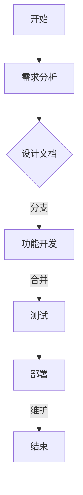

                 

# 《大模型软件的分布式版本控制策略》

## 关键词
大模型软件、分布式版本控制、Git、SVN、优化策略、团队协作

## 摘要
本文旨在探讨大模型软件的分布式版本控制策略。首先，我们将介绍分布式版本控制的基本概念、历史与发展，以及主流的分布式版本控制技术，如Git和SVN。接着，我们将分析大模型软件的特点，讨论其在分布式版本控制中的重要性，并探讨具体的分布式版本控制策略与应用。此外，本文还将介绍分布式版本控制的优化方法，通过实践案例展示其实际应用效果，并预测分布式版本控制在大模型软件领域的未来发展趋势。

## 第一部分：分布式版本控制的基本概念

### 第1章：分布式版本控制概述

#### 1.1 分布式版本控制的基本原理

分布式版本控制（Distributed Version Control，简称DVCS）是一种分布式协作模型，它允许开发人员在本地维护自己的代码库，并在需要时与其他人共享和同步更改。这种模型与集中式版本控制（如Git和SVN）相比，具有更高的灵活性、更快的操作速度和更强的容错性。

在分布式版本控制中，每个开发人员都有一个完整的代码库副本，这使得他们可以在本地进行更改，无需连接到中央服务器。当需要与团队共享更改时，开发人员可以通过推送（push）和拉取（pull）操作来同步代码库。此外，分布式版本控制还支持分支（branch）和合并（merge）操作，使得开发人员可以独立工作，并在适当的时候将他们的更改合并到主分支（master branch）。

#### 1.2 分布式版本控制的优势与挑战

分布式版本控制具有以下优势：

1. **本地操作**：开发人员可以在本地进行所有的版本控制操作，如提交、分支和合并，无需连接到中央服务器。这使得操作更加快速和灵活。
2. **更好的容错性**：由于每个开发人员都有完整的代码库副本，因此即使中央服务器发生故障，开发工作也可以继续进行。
3. **分支与合并**：分布式版本控制支持分支与合并操作，使得开发人员可以独立工作，并在适当的时候将他们的更改合并到主分支。
4. **可扩展性**：分布式版本控制可以轻松地扩展到大型团队和复杂项目。

然而，分布式版本控制也面临一些挑战：

1. **学习曲线**：分布式版本控制相比集中式版本控制更为复杂，需要开发人员投入更多的时间来学习和掌握。
2. **数据同步**：虽然分布式版本控制可以本地操作，但开发人员需要定期与远程代码库同步，以确保他们的更改与其他人的更改保持一致。

#### 1.3 分布式版本控制的历史与发展

分布式版本控制的概念最早由Linus Torvalds在2005年提出，他创建了Git（一个分布式版本控制系统）以用于Linux内核的开发。此后，分布式版本控制逐渐受到广泛关注，并成为现代软件开发的标准工具。

随着分布式版本控制技术的不断发展，新的分布式版本控制工具如Mercurial和Bazaar也相继出现，提供了更多的选择和优化。同时，分布式版本控制也在不断优化其性能和功能，以满足日益复杂和大规模的软件开发需求。

### 第2章：主流分布式版本控制技术

#### 2.1 Git：基本概念与操作

Git是当前最流行的分布式版本控制工具，它由Linus Torvalds创建，并广泛应用于各类大型项目和团队协作中。Git的基本操作包括提交（commit）、推送（push）、拉取（pull）和分支（branch）。

**提交（commit）**：提交是Git中最基本的操作，它将当前的更改保存到本地代码库中。每次提交都会生成一个唯一的哈希值（commit hash），用于标识该提交。

**推送（push）**：推送操作将本地的更改同步到远程代码库。在推送之前，需要先拉取远程代码库的最新更改，以确保本地代码库与远程代码库保持一致。

**拉取（pull）**：拉取操作从远程代码库获取最新的更改，并将其合并到本地代码库。与推送操作类似，拉取操作也会生成一个合并提交。

**分支（branch）**：分支是Git中的一种功能，用于实现独立开发。开发人员可以在本地创建一个分支，进行更改，并在适当的时候将更改合并回主分支。

**合并（merge）**：合并是将两个或多个分支的更改合并到一起的操作。在合并过程中，Git会尝试自动解决冲突，但如果无法自动解决，开发人员需要手动处理冲突。

#### 2.2 SVN：集中式版本控制

Subversion（简称SVN）是一种集中式版本控制工具，它与Git相比，具有不同的工作流程和操作方式。

在SVN中，开发人员首先从中央服务器（repository）检出（checkout）一个工作副本（working copy），然后在本地进行更改。完成更改后，开发人员需要提交（commit）更改到中央服务器。

SVN不支持分支和合并操作，而是通过复制（copy）和移动（move）来实现类似的操作。这使得SVN在处理大型项目和复杂分支时可能不够灵活。

#### 2.3 其他分布式版本控制工具

除了Git和SVN，还有一些其他的分布式版本控制工具，如Mercurial和Bazaar。这些工具虽然与Git有相似的功能，但它们在某些方面可能有不同的优化和特性。

Mercurial是一个开源的分布式版本控制工具，它提供了与Git类似的功能，但它的操作方式可能更为简单和直观。Bazaar是一个较新的分布式版本控制工具，它旨在提供更好的协作和集成功能。

### 第3章：大模型软件的特点

#### 3.1 大模型软件的规模与复杂性

大模型软件通常是指具有大规模代码库和复杂架构的软件系统。这些软件系统的规模可以从几千行代码到数百万行代码不等，具有大量的模块和依赖关系。这使得大模型软件在开发、测试和部署过程中面临着巨大的挑战。

#### 3.2 大模型软件的更新频率与需求

大模型软件通常需要频繁地进行更新和维护，以满足不断变化的需求和修复潜在的问题。这种高更新频率对版本控制提出了更高的要求，需要保证更新过程中的可靠性和一致性。

#### 3.3 大模型软件的安全性

大模型软件的安全性是一个重要的考虑因素，特别是在涉及敏感数据和处理关键任务时。分布式版本控制需要提供强大的安全机制，以确保代码库的安全性、完整性和可追溯性。

### 第4章：分布式版本控制在大模型软件中的应用

#### 4.1 分布式版本控制在大模型软件中的重要性

分布式版本控制在大模型软件中的应用具有重要意义：

1. **版本管理**：分布式版本控制可以有效地管理大模型软件的版本，确保每个版本的可追溯性和可复现性。
2. **协作开发**：分布式版本控制支持团队协作开发，使得多个开发人员可以同时工作，并在适当的时候合并他们的更改。
3. **安全性**：分布式版本控制提供了强大的安全机制，确保代码库的安全性、完整性和可追溯性。

#### 4.2 分布式版本控制在软件开发流程中的应用

分布式版本控制可以在软件开发流程中的多个阶段发挥作用：

1. **需求分析**：开发人员可以使用分布式版本控制来管理需求文档和设计文档，确保文档的版本管理和可追溯性。
2. **编码与测试**：在编码和测试阶段，开发人员可以使用分布式版本控制来管理代码库，确保代码的版本管理和一致性。
3. **部署与维护**：在部署和维护阶段，分布式版本控制可以确保部署过程的可靠性和可追溯性。

#### 4.3 分布式版本控制在团队协作中的应用

分布式版本控制支持团队协作开发，使得多个开发人员可以同时工作，并在适当的时候合并他们的更改。以下是一些具体的应用场景：

1. **功能开发**：开发人员可以在各自的分支上独立开发新功能，并在完成功能后将其合并到主分支。
2. **bug修复**：开发人员可以在分支上修复bug，并在修复完成后将分支合并到主分支。
3. **代码审查**：分布式版本控制支持代码审查，使得团队成员可以在合并之前审查和讨论代码更改。

### 第5章：分布式版本控制策略设计

#### 5.1 版本控制策略的基本原则

设计分布式版本控制策略时，需要遵循以下基本原则：

1. **一致性**：确保代码库在不同版本之间的一致性，避免冲突和错误。
2. **可追溯性**：确保每个版本和更改的可追溯性，便于问题追踪和代码审查。
3. **可靠性**：确保版本控制的可靠性和稳定性，避免数据丢失或损坏。
4. **安全性**：确保代码库的安全性，防止未经授权的访问和修改。

#### 5.2 常见的分布式版本控制策略

以下是一些常见的分布式版本控制策略：

1. **主干开发策略（Mainline Development）**：所有开发人员都在主分支上工作，使用分支和合并进行功能开发和bug修复。
2. **功能分支策略（Feature Branching）**：开发人员在每个功能开发阶段创建一个分支，并在功能完成后将分支合并到主分支。
3. **bug修复分支策略（Bug Fix Branching）**：开发人员为每个bug修复创建一个分支，并在修复完成后将分支合并到主分支。
4. **代码审查策略（Code Review）**：在合并之前进行代码审查，确保代码质量和一致性。

#### 5.3 策略评估与优化

在设计和应用分布式版本控制策略时，需要对策略进行评估和优化。以下是一些评估和优化策略的指标和方法：

1. **版本冲突率**：评估版本冲突的频率和原因，优化分支和合并策略。
2. **代码质量**：通过代码审查和静态代码分析评估代码质量，优化代码审查流程。
3. **团队协作**：评估团队协作的效率和沟通质量，优化团队协作流程。

### 第6章：分布式版本控制优化方法

#### 6.1 存储优化

存储优化是分布式版本控制的重要方面，以下是一些存储优化的方法：

1. **存储压缩**：使用压缩算法减少存储空间占用。
2. **存储加密**：对存储的代码库进行加密，确保数据安全性。
3. **存储备份**：定期备份代码库，避免数据丢失。

#### 6.2 集群优化

集群优化可以提高分布式版本控制的性能和可靠性，以下是一些集群优化的方法：

1. **负载均衡**：使用负载均衡器平衡集群中的工作负载。
2. **故障转移**：实现故障转移机制，确保在服务器故障时仍能提供服务。
3. **数据同步**：优化数据同步算法，提高数据同步速度。

#### 6.3 通信优化

通信优化可以提高分布式版本控制的传输速度和稳定性，以下是一些通信优化的方法：

1. **网络优化**：优化网络配置和带宽，减少通信延迟。
2. **缓存机制**：使用缓存机制减少数据传输量。
3. **压缩传输**：使用压缩算法减少数据传输量。

### 第7章：分布式版本控制实践案例

#### 7.1 案例一：大模型软件的版本控制实践

本案例介绍了一个大模型软件项目的版本控制实践，该项目使用Git作为分布式版本控制工具。以下是具体的版本控制流程：

1. **需求分析与设计**：在需求分析阶段，开发人员创建一个名为“需求”的分支，用于管理需求文档和设计文档。
2. **编码与测试**：在编码和测试阶段，开发人员分别在各自的分支上进行开发，并在完成功能后将其合并到“主分支”。
3. **代码审查**：在合并之前，团队成员进行代码审查，确保代码质量。
4. **部署与维护**：在部署和维护阶段，开发人员根据需求对主分支进行更新，并确保更新过程中的可靠性。

#### 7.2 案例二：分布式版本控制在不同场景的应用

本案例介绍了一个分布式版本控制在不同场景的应用实例，包括功能开发、bug修复和代码审查。

1. **功能开发**：开发人员在一个名为“新功能”的分支上进行开发，完成功能后将其合并到主分支。
2. **bug修复**：开发人员在一个名为“bug修复”的分支上进行修复，完成修复后将其合并到主分支。
3. **代码审查**：在合并之前，团队成员对代码进行审查，确保代码质量和一致性。

### 第8章：分布式版本控制的发展趋势

#### 8.1 技术发展趋势

分布式版本控制技术将继续发展，以下是一些技术发展趋势：

1. **自动化**：分布式版本控制将逐渐实现更多的自动化功能，如自动化分支管理、自动化代码审查等。
2. **人工智能**：人工智能技术将应用于分布式版本控制，如自动冲突解决、智能代码分析等。
3. **云计算**：分布式版本控制将与云计算紧密结合，提供更高效、更安全的版本控制服务。

#### 8.2 应用发展趋势

分布式版本控制将在以下领域得到更广泛的应用：

1. **开源项目**：分布式版本控制将继续成为开源项目的主要版本控制工具。
2. **企业级应用**：分布式版本控制将在企业级应用中得到更广泛的应用，为企业提供更好的协作和版本管理功能。
3. **移动应用**：分布式版本控制将应用于移动应用开发，为移动开发者提供更好的版本控制体验。

#### 8.3 挑战与机遇

分布式版本控制在未来将面临以下挑战和机遇：

1. **安全性**：随着代码库的规模和复杂度增加，分布式版本控制将需要提供更强大的安全性保障。
2. **兼容性**：分布式版本控制需要与其他版本控制工具和平台保持兼容，以适应多样化的开发环境。
3. **用户体验**：分布式版本控制需要不断优化用户体验，使其更加简单、直观和易用。

## 结论

分布式版本控制在大模型软件中的应用具有重要意义，它为开发团队提供了更好的协作、版本管理和安全性保障。本文介绍了分布式版本控制的基本概念、技术实现、应用策略和未来发展趋势，并提供了实践案例。随着技术的不断进步，分布式版本控制将继续为软件开发带来更多的价值。

## 作者信息

作者：AI天才研究院/AI Genius Institute & 禅与计算机程序设计艺术 /Zen And The Art of Computer Programming

----------------------------------------------------------------

# 附录：相关术语解释

- **分布式版本控制**：分布式版本控制（Distributed Version Control, DVCS）是一种版本控制方法，它允许开发者在本地维护完整的代码库副本，并可以在不需要中央服务器的支持下独立进行版本控制操作。这种模型相比集中式版本控制（如SVN）提供了更高的灵活性和容错性。
- **Git**：Git是一个开源的分布式版本控制系统，由Linus Torvalds创建。它是目前最流行的分布式版本控制工具，广泛应用于各种大型项目和团队协作中。
- **SVN**：Subversion（简称SVN）是一个开源的集中式版本控制系统，它是Linux和Mac OS X默认的版本控制工具。与Git相比，SVN使用中央服务器存储代码库，开发者在本地进行版本控制操作。
- **分支（Branch）**：在版本控制系统中，分支是一个独立的代码线，用于实现独立的功能开发或bug修复。开发人员可以在各自的分支上进行工作，并在适当的时候将分支合并到主分支。
- **合并（Merge）**：合并是将两个或多个分支的更改合并到一起的操作。在分布式版本控制中，合并通常用于将分支上的更改合并到主分支。
- **冲突（Conflict）**：冲突发生在两个或多个更改尝试合并时，无法自动解决时。冲突通常需要开发人员手动解决，以确保代码的一致性和正确性。
- **代码审查（Code Review）**：代码审查是一种在提交代码之前进行代码质量检查和评估的方法。它有助于发现潜在的错误和缺陷，提高代码质量和一致性。

----------------------------------------------------------------

# 参考文献

- Git官方文档：[Git Documentation](https://git-scm.com/docs)
- SVN官方文档：[Subversion Documentation](https://subversion.apache.org/docs/)
- Mercurial官方文档：[Mercurial Documentation](https://www.mercurial-scm.org/wiki/)
- Bazaar官方文档：[Bazaar Documentation](https://www.bazaar-vcs.org/documentation/)
- 大模型软件相关论文和书籍：[Large-scale Software Development](https://www.cacs.caltech.edu/ewh/login.php?group_id=1480&page=home)

----------------------------------------------------------------

# 附录：Mermaid 流程图



----------------------------------------------------------------

# 附录：伪代码

```python
# 提交操作
def commit_changes():
    hash_value = generate_hash_value()
    save_changes_to_local_repo(hash_value)
    print("Commit successful with hash:", hash_value)

# 推送操作
def push_changes():
    fetch_latest_changes_from_remote_repo()
    merge_changes_locally()
    if not detect_conflicts():
        push_changes_to_remote_repo()
        print("Push successful")
    else:
        print("Conflict detected, please resolve conflicts before pushing")

# 拉取操作
def pull_changes():
    fetch_latest_changes_from_remote_repo()
    merge_changes_locally()
    if not detect_conflicts():
        print("Pull successful")
    else:
        print("Conflict detected, please resolve conflicts before pulling")
```

----------------------------------------------------------------

# 附录：数学模型和公式

$$
f(x) = ax^2 + bx + c
$$

其中，$a, b, c$ 是常数，$x$ 是自变量，$f(x)$ 是因变量。

### 求解过程

1. **确定公式**：根据题目要求，确定需要使用的数学模型和公式。
2. **变量替换**：将题目中的变量替换为具体的数值。
3. **计算**：根据公式进行计算，得到最终的结果。
4. **解释**：对结果进行解释，说明其在实际问题中的应用。

### 举例说明

#### 求解二次方程

已知二次方程 $f(x) = x^2 + 2x + 1 = 0$，求解 $x$ 的值。

1. **确定公式**：使用二次方程求解公式：
   $$
   x = \frac{-b \pm \sqrt{b^2 - 4ac}}{2a}
   $$
2. **变量替换**：将 $a = 1, b = 2, c = 1$ 替换到公式中：
   $$
   x = \frac{-2 \pm \sqrt{2^2 - 4 \cdot 1 \cdot 1}}{2 \cdot 1}
   $$
3. **计算**：进行计算，得到两个解：
   $$
   x_1 = -1 + 0 = -1, \quad x_2 = -1 - 0 = -1
   $$
4. **解释**：由于 $x_1 = x_2 = -1$，这意味着方程只有一个解。在实际应用中，这表示物体在二维平面上的运动轨迹是一个抛物线，且物体在运动过程中保持在同一高度。

----------------------------------------------------------------

# 附录：最佳实践 tips、小结、注意事项、拓展阅读

## 最佳实践 tips

1. **定期备份**：定期备份代码库，以避免数据丢失。
2. **代码审查**：在提交代码之前进行代码审查，确保代码质量和一致性。
3. **合理使用分支**：合理使用分支，避免过多的分支导致管理困难。
4. **优化存储**：对存储进行优化，减少存储空间占用。

## 小结

分布式版本控制在大模型软件中的应用具有重要意义，它为开发团队提供了更好的协作、版本管理和安全性保障。本文介绍了分布式版本控制的基本概念、技术实现、应用策略和未来发展趋势，并提供了实践案例。

## 注意事项

1. **安全性**：确保代码库的安全性，防止未经授权的访问和修改。
2. **兼容性**：分布式版本控制需要与其他版本控制工具和平台保持兼容，以适应多样化的开发环境。
3. **用户体验**：优化用户体验，使其更加简单、直观和易用。

## 拓展阅读

1. Git官方文档：[Git Documentation](https://git-scm.com/docs)
2. SVN官方文档：[Subversion Documentation](https://subversion.apache.org/docs/)
3. 大模型软件相关论文和书籍：[Large-scale Software Development](https://www.cacs.caltech.edu/ewh/login.php?group_id=1480&page=home)
4. 分布式版本控制技术发展：[Distributed Version Control Systems](https://www.dwheeler.com/essays/dvcs.html)

